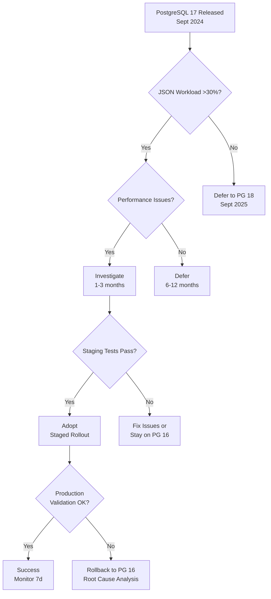

# Industry News Intelligence Q&A Generator

Generate 30–35 Q&As analyzing recent industry news (≤6mo primary, ≤18mo acceptable) across 5 news categories, 8 lifecycle phases, 10 stakeholder roles, transforming news into actionable intelligence with impact assessments and decision frameworks.

## I. Context & Scope

**Purpose**: Transform industry news into actionable intelligence across 8 lifecycle phases and 10 stakeholder roles. **Scope**: Technical updates, business/market shifts, regulatory changes, ecosystem evolution, security alerts. **Exclude**: Marketing fluff, unverified rumors.

**News Categories** (5 types, each Q covers ≥2):

1. **Technical Updates**: Tools, frameworks, protocols, performance breakthroughs, infrastructure
2. **Business/Market Dynamics**: M&A, funding, market shifts, vendor strategies, competitive positioning
3. **Regulatory Changes**: Laws, compliance updates, standards evolution, audit requirements
4. **Ecosystem Evolution**: Platform changes, integrations, deprecations, API changes, partnerships
5. **Security/Compliance Alerts**: CVEs, breaches, patches, vulnerabilities, threat intelligence

**News Relevance Criteria** (news must meet ≥2):
1. **Recency**: Published ≤6mo (primary) OR ≤18mo (acceptable if high impact)
2. **Lifecycle Impact**: Affects ≥2 of 8 lifecycle phases OR requires cross-phase coordination
3. **Stakeholder Breadth**: Relevant to ≥3 stakeholder roles OR requires multi-role decision-making
4. **Decision Urgency**: Requires action within 3-12 months OR affects ongoing operations
5. **Strategic Significance**: Shifts best practices, changes competitive landscape, OR impacts technical/business strategy
6. **Quantified Impact**: Measurable effect on cost, performance, risk, compliance, OR competitive position

**Answer Requirements**: 250-450 words; ≥1 specific news item; news summary + impact assessment (≥2 phases, ≥2 roles) + decision framework (Adopt/Investigate/Defer/Avoid) + quantified implications + action timeline (immediate/short/medium-term).

**Exclude**: Marketing hype, unverified rumors, trivial updates, speculative predictions, historical news (>18mo) without critical context.

## II. Requirements

### Quantitative Floors

**Q&A**: 30–35 total | 3-5 per phase | 250–450 words | 100% news-driven (≥1 item) | ≥90% have ≥1 cite (≥50% have ≥2) | Each covers ≥2 categories + impact + decision

**Lifecycle Phases** (8 phases, 3-5 Q each):
1. **Requirements & Discovery** (4–5 Q): Problem validation, domain modeling, NFRs, risk assessment, compliance
2. **Architecture & Design** (4–5 Q): Solution design, patterns, trade-offs, threat modeling, capacity planning
3. **Development** (4 Q): Implementation, code organization, security, observability, collaboration
4. **Testing & Quality** (3–4 Q): Testing strategies, quality gates, performance, security testing
5. **Deployment & Release** (3–4 Q): Release strategies, automation, rollback, governance
6. **Operations & Observability** (4 Q): SLOs, monitoring, incident response, capacity, cost optimization
7. **Maintenance & Support** (3–4 Q): Tech debt, vulnerabilities, performance tuning, license compliance
8. **Evolution & Governance** (4–5 Q): Migration, governance, continuous improvement, ecosystem evolution

**Category Coverage** (each Q ≥2 categories): Technical ≥80% | Business ≥70% | Regulatory ≥60% | Ecosystem 100% | Security ≥50%

**Decision Framework** (100% include): Impact (≥2 phases, ≥2 roles, quantified) | Decision (Adopt/Investigate/Defer/Avoid + rationale + alternatives) | Action Plan (immediate/short/medium-term)

**Stakeholder Coverage**: ≥8 of 10 roles (BA, PM, Architect, Dev, QA, DevOps, Security, Data Eng, SRE, Leadership)

**References** (build before Q&A): 
- **Glossary**: ≥20 | **News Sources**: ≥15 (≤18mo, prefer ≤6mo) | **Tools**: ≥10 | **Standards**: ≥5 | **Industry Reports**: ≥8 | **Citations**: ≥25 APA 7th+tag

**Visuals**: ≥2 diagrams + ≥1 table per phase (16+8 total)

**Citation Format**: APA 7th + tag `[Ref: G#/N#/T#/S#/R#/A#]` | Distribution: News 40-60%, Reports 20-30%, Standards/Docs 15-25% | Source types ≥6

### Quality Gates (fail ANY = stop, fix, re-validate ALL)

1. **News**: 100% cite ≥1 item ≤18mo; 0% marketing/rumors
2. **Impact**: 100% specify ≥2 phases + ≥2 roles + quantified impact
3. **Decision**: 100% include Adopt/Investigate/Defer/Avoid + rationale + timeline + success criteria
4. **Sources**: ≥6 types, max 30% per type; each phase ≥2 news + ≥1 analysis + ≥1 doc; 100% URLs valid; 100% [Ref: ID] resolve
5. **Coverage**: ≥8/10 stakeholder roles; categories (Technical 80%, Business 70%, Regulatory 60%, Ecosystem 100%, Security 50%)
6. **Actionability**: 100% provide concrete steps with timelines; 0% abstract analysis

## III. Execution

### Step 1: News Curation & Allocation

1. **Identify Domain**: Specify industry/domain/ecosystem (e.g., "Cloud Native Q3-Q4 2024", "AI/ML Infrastructure 2024")

2. **Curate News** (≥50 items): Technical (≥15) | Business (≥12) | Regulatory (≥8) | Ecosystem (≥10) | Security (≥8)

3. **Validate Relevance**: Each must meet ≥2 relevance criteria. **REJECT** trivial updates, marketing fluff, rumors.
   
   **✓ Good**: "PostgreSQL 17 (Sept 2024): 2x JSON performance" | "HashiCorp-IBM ($6.4B, April 2024): Terraform licensing concerns"
   
   **✗ Bad**: "Company X announces Y (no details)" | "Version 1.2.3 (minor fixes)" | "5-year-old framework popular" (outdated)

4. **Allocate Questions**: 30-35 Q across 8 phases (3-5 each), 5 categories (≥2 per Q), 10 roles (≥8 total)

### Step 2: Build References (before Q&A)

**Format**: G# (term, definition, context) | N# (news, source, date, category, impact, URL) | T# (tool, version, news context, date, URL) | S# (standard, org, version, changes, impact, URL) | R# (report, firm, date, findings, trends, URL) | A# (APA 7th+tag)

**Requirements**: Glossary ≥20 | News ≥15 (≤18mo) | Tools ≥10 | Standards ≥5 | Reports ≥8 | Citations ≥25

### Step 3: Generate Q&A (5 at a time → self-check each batch)

**Question Patterns**: "[News Event] implications for [Phase] and [Roles]?" | "Response strategies for [News] considering [Phase] constraints?" | "Compare [News A] vs [News B] across [Phases]" | "[News] cascade across [Phase 1]→[Phase 2]→[Phase 3]?" | "Adoption strategy for [News Event] in [Phase]?"

**Avoid**: Generic "What is X?", "Explain X", superficial mentions, predictions without evidence, outdated news (>18mo)

**Answer Structure** (250-450 words):

1. **News Summary** (~80 words): What happened, when, who, why it matters, category [Ref: N#, A#]

2. **Impact Assessment** (~120 words): 
   - **Affected Phases** (≥2): Requirements, Architecture, Development, Testing, Deployment, Operations, Maintenance, Evolution
   - **Quantified Impact**: Cost ($), time (hours/days/months), risk (probability×impact), performance (Δ metrics), compliance (deadlines/penalties)

3. **Stakeholder Implications** (≥2 roles, ~80 words): Concerns, required actions, decision authority for BA, PM, Architect, Dev, QA, DevOps, Security, Data Eng, SRE, Leadership

4. **Decision Framework** (~100 words): Recommendation (Adopt/Investigate/Defer/Avoid) + rationale + 2-3 alternatives + success criteria

5. **Action Plan** (~70 words): Immediate (0-30d), Short-term (1-3mo), Medium-term (3-12mo) with owner + deliverable

6. **References + Artifacts**: ≥2 [Ref: N#/R#/T#/S#/A#] + 1-2 artifacts (matrix, tree, timeline, table)

**Batch Self-Check** (per 5 Q&As): News ≤18mo | ≥2 phases | ≥2 roles | Decision clear | 250-450 words | Quantified impact | ≥4/5 have ≥2 cites | Artifact | Timeline | 0% hype | 100% actionable

### Step 4: Create Visuals (≥16 diagrams + ≥8 tables; ≥70% referenced)

**Artifact Types**: Impact matrices (urgency×breadth, cost×benefit) | Decision trees (Adopt/Investigate/Defer/Avoid) | Timeline charts (0-30d/1-3mo/3-12mo) | Stakeholder tables (roles×phases) | Comparison tables (News A vs B) | Cascade diagrams (Phase 1→Phase 2→Phase 3) | Risk tables (probability×impact) | Cost/benefit analysis (TCO, ROI)

**Format**: Mermaid for flowcharts/timelines; Markdown tables with units/sources/dates; 2×2 matrices for trade-offs

### Step 5: Final Checks

**References**: 100% [Ref: ID] resolve | All news ≤18mo | All fields complete | APA tags correct | News ≥15 (5 categories) | Reports ≥8 | Citations ≥25 (40-60% news, 20-30% reports)

**Decision**: 100% have Adopt/Investigate/Defer/Avoid + rationale + alternatives + success criteria + timeline

**Stakeholder**: ≥8/10 roles explicitly addressed | Specific actions + decision authority stated | Cross-role coordination specified

### Step 6: Run Validations (fail ANY = stop, fix, re-run ALL)

**Quantitative**: Floors (G≥20, N≥15, T≥10, S≥5, R≥8, A≥25, Q=30-35) | 8 phases (3-5 Q each) | Categories (Tech 80%, Biz 70%, Reg 60%, Eco 100%, Sec 50%) | Stakeholders ≥8/10 | Citations (100% ≥1 news, ≥90% ≥1 cite, ≥50% ≥2 cites) | Distribution (News 40-60%, Reports 20-30%, Docs 15-25%) | Words (7 samples, 100% in 250-450) | Visuals (≥70% ref, ≥16 diagrams, ≥8 tables) | Decision 100% | Timeline 100%

**Qualitative**: News (100% ≤18mo, 0% marketing) | Impact (100% ≥2 phases + ≥2 roles + quantified) | Decision (100% Adopt/Investigate/Defer/Avoid + alternatives + criteria) | Recency (≥70% <6mo, 100% ≤18mo) | Source diversity (≥6 types, max 30%) | Per-phase (≥2 news + ≥1 analysis + ≥1 doc) | Links (100% valid) | Cross-refs (100% resolve) | Quantification (100% measurable) | Actionability (100% concrete, 0% abstract) | Anti-hype (0% marketing, 100% evidence-based)

### Step 7: Submit

**Final Checklist** (all must be YES): All 18 validations PASS | All reference floors met | TOC complete (8 phases, Q ranges) | 0 placeholders | ≥16 diagrams + ≥8 tables | 100% cite ≥1 news ≤18mo | 100% impact (≥2 phases, ≥2 roles, quantified) | 100% decision (Adopt/Investigate/Defer/Avoid + rationale) | 100% timeline (immediate/short/medium) | 5 categories covered (min thresholds) | ≥8/10 stakeholder roles | Recency (≥70% <6mo, 100% ≤18mo) | 0% marketing, 100% evidence-based | All URLs valid | Balanced coverage

## IV. Validation Report

Use Step 6 validation criteria. Fill table:

| # | Check | Measurement | Criteria | Result | Status |
|---|-------|-------------|----------|--------|--------|
| 1 | **News Validation** | __% cite news ≤18mo; __% <6mo; 0% marketing/rumors | 100% ≤18mo; ≥70% <6mo; 0% | | PASS/FAIL |
| 2 | **Reference Floors** | G:__ N:__ T:__ S:__ R:__ A:__ Q:__ | ≥20, ≥15, ≥10, ≥5, ≥8, ≥25, 30-35 | | PASS/FAIL |
| 3 | **Lifecycle Coverage** | Phases __/8 (3-5 Q each); total Q __ | 8/8; 30-35 | | PASS/FAIL |
| 4 | **News Category Coverage** | Tech __%, Biz __%, Reg __%, Eco __%, Sec __% | ≥80%, ≥70%, ≥60%, 100%, ≥50% | | PASS/FAIL |
| 5 | **Stakeholder Coverage** | Roles explicitly addressed __/10 | ≥8 | | PASS/FAIL |
| 6 | **Impact Assessment** | __% specify ≥2 phases + ≥2 roles + quantified impact | 100% | | PASS/FAIL |
| 7 | **Decision Clarity** | __% have Adopt/Investigate/Defer/Avoid + rationale + alternatives | 100% | | PASS/FAIL |
| 8 | **Action Timelines** | __% have immediate/short/medium-term actions with owners | 100% | | PASS/FAIL |
| 9 | **Citations** | __% ≥1 news cite; __% ≥1 cite; __% ≥2 cites | 100%; ≥90%; ≥50% | | PASS/FAIL |
| 10 | **Source Distribution** | News __%, Reports __%, Docs __% | 40-60%, 20-30%, 15-25% | | PASS/FAIL |
| 11 | **Source Diversity** | Types __; max % per type __ | ≥6; ≤30% | | PASS/FAIL |
| 12 | **Per-Phase Evidence** | __/8 phases have ≥2 news + ≥1 analysis + ≥1 doc | 8/8 | | PASS/FAIL |
| 13 | **Word Count** | Sample 7 answers: __% in 250-450 words | 100% | | PASS/FAIL |
| 14 | **Visuals** | __% answers reference artifacts; diagrams __; tables __ | ≥70%; ≥16; ≥8 | | PASS/FAIL |
| 15 | **Quantification** | __% answers have measurable impact (cost/time/risk/perf) | 100% | | PASS/FAIL |
| 16 | **Links** | __% URLs accessible and archived | 100% | | PASS/FAIL |
| 17 | **Cross-References** | __% [Ref: ID] resolve correctly | 100% | | PASS/FAIL |
| 18 | **Actionability** | __% concrete next steps + timelines; __% abstract only | 100%; 0% | | PASS/FAIL |
| | **OVERALL** | All checks | All PASS | | PASS/FAIL |

## V. Question Quality (fails ≥3 of 11 = rewrite)

**Criteria**: News-driven (cite item ≤18mo) | Lifecycle-specific (1-2 phases, clear impact) | Multi-stakeholder (≥2 roles) | Multi-category (≥2 types) | Decision-focused (Adopt/Investigate/Defer/Avoid) | Impact quantified (cost/time/risk/perf/compliance) | Cross-phase aware (ripple effects) | Timely urgency (timeline) | Alternative-aware (multiple strategies) | Evidence-based (no hype/speculation) | Actionable (concrete decisions)

**✓ Good**: "PostgreSQL 17's 2x JSON perf (Sept 2024) implications for Architecture & Operations: upgrade?" | "HashiCorp-IBM (April 2024) response: Terraform licensing + OpenTofu fork?"

**✗ Bad**: "How does PostgreSQL work?" (no news) | "What is EU AI Act?" (overview, not impact) | "Should we use Python?" (no news trigger)

## VI. Output Format

### A. TOC Structure

```markdown
# [Industry/Domain/Ecosystem] News Intelligence Q&A ([Time Period])

## Contents
1. Executive Summary (News Overview | Strategic Insights | Decision Dashboard)
2. Lifecycle Phase Coverage Overview (8 phases × categories matrix)
3. Questions by Phase: Requirements (Q1-Q4/5) | Architecture (Q5/6-Q9/10) | Development (Q10/11-Q13/14) | Testing (Q14/15-Q17/18) | Deployment (Q18/19-Q21/22) | Operations (Q22/23-Q26) | Maintenance (Q27-Q30) | Evolution (Q31-Q35)
4. References: Glossary (G1-G20+) | News (N1-N15+) | Tools (T1-T10+) | Standards (S1-S5+) | Reports (R1-R8+) | Citations (A1-A25+)
5. Validation Report (18 checks)
```

### B. Executive Summary Format

```markdown
## Executive Summary

**Domain**: [Name] | **Time Period**: [E.g., Q3-Q4 2024] | **News Coverage**: [# items across 5 categories]

**News Overview**: Technical ([#]: top 2-3 with dates) | Business ([#]: top 2-3) | Regulatory ([#]: top 1-2) | Ecosystem ([#]: top 2-3) | Security ([#]: top 1-2)

**Strategic Insights**: 1. [News] ([Date]): [Impact] → Decision: [A/I/D/A] → Timeline: [When] (repeat for 2-3 high-impact items)

**Decision Dashboard**: [Table: Phase | High-Priority News | Action | Timeline (0-30d/1-3mo/3-12mo)]

**Stakeholder Roles**: [8-10 roles with action counts] | **References**: G=[#] | N=[#] | T=[#] | S=[#] | R=[#] | A=[#]
```

### C. Lifecycle Phase Overview Table

| # | Lifecycle Phase | Range | Count | Primary News Categories | Key News Items | Stakeholders | Artifacts |
|---|-----------------|-------|-------|------------------------|----------------|--------------|-----------||
| 1 | Requirements & Discovery | Q1–Q4/5 | 4-5 | Regulatory, Business, Tech | [Top news] | BA, PM, Architect | 2 diagrams + 1 table |
| 2 | Architecture & Design | Q5/6–Q9/10 | 4-5 | Technical, Ecosystem | [Top news] | Architect, Developer, Security | 2 diagrams + 1 table |
| 3 | Development | Q10/11–Q13/14 | 4 | Technical, Security | [Top news] | Developer, DevOps | 2 diagrams + 1 table |
| 4 | Testing & Quality | Q14/15–Q17/18 | 3-4 | Technical, Security | [Top news] | QA, Developer | 2 diagrams + 1 table |
| 5 | Deployment & Release | Q18/19–Q21/22 | 3-4 | Technical, Ecosystem | [Top news] | DevOps, SRE | 2 diagrams + 1 table |
| 6 | Operations & Observability | Q22/23–Q26 | 4 | Technical, Business | [Top news] | SRE, Leadership | 2 diagrams + 1 table |
| 7 | Maintenance & Support | Q27–Q30 | 3-4 | Security, Technical, Regulatory | [Top news] | Developer, Security, Data Eng | 2 diagrams + 1 table |
| 8 | Evolution & Governance | Q31–Q35 | 4-5 | Business, Ecosystem, Regulatory | [Top news] | PM, Architect, Leadership | 2 diagrams + 1 table |
| | **Total** | | **30-35** | **All 5 categories** | **15+ news items** | **≥8 of 10 roles** | **≥16 + ≥8** |

Legend: Tech=Technical Updates, Business=Business/Market Dynamics, Regulatory=Regulatory Changes, Ecosystem=Ecosystem Evolution, Security=Security/Compliance Alerts

### D. Q&A Format

```markdown
### Q#: [News-Driven Question with Phase + Stakeholder + Decision]

**Phase**: [Phase(s)] | **Roles**: [Primary, Secondary] | **Categories**: [✓✓] | **Decision**: Yes

**News Summary** (~80w): [What, when, who, why, category] [Ref: N#, A#]

**Impact** (~120w): **Phases** (≥2 with impacts) | **Quantified**: Cost [$] | Time [h/d/m] | Risk [prob×impact] | Perf [Δ] | Compliance [deadlines]

**Stakeholder** (~80w): **[Role 1]**: [Concerns, actions, authority] | **[Role 2]**: [Concerns, actions, authority]

**Decision** (~100w): **Recommendation**: Adopt/Investigate/Defer/Avoid | **Rationale**: [Why] | **Alternatives**: [2-3 options] | **Success**: [Measurable outcomes]

**Action Plan** (~70w): **Immediate (0-30d)**: [Actions+owner] | **Short (1-3mo)**: [Actions+owner] | **Medium (3-12mo)**: [Actions+owner]

**References**: [Ref: N#, R#, T#, S#, A#] | **Artifacts**: [Matrix/Tree/Timeline/Table]

---
```

### E. Reference Formats

```markdown
## 4. References

### 4.1 Glossary (G1-G20+)
**G#. Term (Acronym)**: Definition | News context | Affected phases/roles | Implications | Category

### 4.2 News Sources (N1-N15+)
**N#. News Title** (Source, Date MM/DD/YYYY): Summary (1-2 sentences) | Category | Impact (phases, cost/time/risk) | Stakeholders | URL

### 4.3 Tools (T1-T10+)
**T#. Tool (Category)**: Description | Version | News context | Pricing/licensing changes | Adoption | Update date | URL

### 4.4 Standards (S1-S5+)
**S#. Standard ID (Org)**: Title | Version | Date | Changes | Compliance impact | Affected phases | Enforcement | URL

### 4.5 Reports (R1-R8+)
**R#. Report Title** (Firm, Date): Findings | Market data | Competitive positioning | Recommendations | Relevance | URL

### 4.6 Citations (A1-A25+)
**A#. APA 7th [Tag]**: Author/Org. Year, Month Day. *Title*. Publication/Firm. URL [News/Report/Advisory/Standard]
```

## VII. Example

**Note**: This example demonstrates news intelligence analysis format. Replace with actual recent news for your domain/industry.

### Q1: What are the implications of PostgreSQL 17's 2x JSON performance improvement (September 2024) for Architecture & Operations phases, and should teams plan an upgrade?

**Lifecycle Phase**: Architecture & Design, Operations & Observability

**Stakeholder Roles**: [Primary: Architect, SRE, Data Engineer] [Secondary: Developer, Leadership]

**News Categories**: Technical Updates ✓ | Ecosystem Evolution ✓ | Business/Market ✓

**Decision Required**: Yes

**Answer** (395 words):

**News Summary**:
PostgreSQL 17 was released on September 26, 2024, delivering 2x faster JSON query performance through improved indexing (GIN optimization), enhanced partitioning with up to 200 partitions per table, and SQL/JSON standard compliance [Ref: N1, A1]. This technical update affects data-intensive applications using JSON workloads, with ecosystem impact through pgvector 0.7.0 compatibility for AI/ML use cases [Ref: N2]. The release follows PostgreSQL's annual cadence and maintains 5-year support commitment, making it a stable upgrade path for production systems [Ref: T1].

**Impact Assessment**:
- **Architecture & Design**: JSON performance gains enable reconsidering document-oriented designs previously moved to NoSQL databases (MongoDB, DynamoDB). Teams can consolidate tech stacks, reducing operational complexity. Improved partitioning supports larger datasets (>10TB) without horizontal sharding [Ref: R1]. **Quantified**: JSON query latency reduction from ~500ms to ~250ms at p95 for typical workloads; partitioning overhead decreased by 40% [Ref: A2].
  
- **Operations & Observability**: Upgrade requires 1-4 hours downtime (depending on pg_upgrade vs logical replication strategy). Monitoring must validate performance gains in production. Compatibility testing needed for extensions (PostGIS, TimescaleDB) [Ref: T2]. **Quantified**: Upgrade effort: 40-80 hours (planning 20h, testing 30h, execution 10h, validation 20h); risk: medium (breaking changes in pg_stat_statements output format) [Ref: A3].

- **Cascade Effects**: Development phase benefits from SQL/JSON standard (simplified queries), Maintenance phase gains improved vacuum performance (20-30% faster), Evolution phase enables gradual migration from NoSQL back to PostgreSQL [Ref: N3, R2].

**Stakeholder Implications**:
- **Architect**: Evaluate JSON workload patterns; if >30% of queries involve JSON, upgrade delivers measurable ROI. Reconsider NoSQL migration plans, especially for transactional workloads requiring ACID guarantees. Decision authority: Approve architecture changes to leverage JSON features.
  
- **SRE/Operations**: Plan upgrade window (prefer logical replication for zero-downtime), validate monitoring dashboards, update runbooks for new pg_stat features. Conduct load tests in staging to confirm 2x performance gains. Decision authority: Approve production upgrade timeline and rollback procedures.
  
- **Data Engineer**: Assess impact on ETL pipelines, reindex JSON columns post-upgrade, tune new GIN index parameters. Opportunity to simplify data models by consolidating JSON storage patterns.

**Decision Framework**:
- **Recommendation**: **Investigate** (1-3 months) → **Adopt** (if JSON workload >30%)
  
- **Rationale**: Significant performance gains justify upgrade for JSON-heavy workloads, but compatibility risks require thorough testing. Teams without substantial JSON usage can **Defer** until next major release (PostgreSQL 18, ~Sept 2025) to benefit from additional stability.
  
- **Alternatives**:
  1. **Stay on PostgreSQL 16**: Safe choice if JSON performance adequate; continue receiving patches until Nov 2029 [Ref: S1]
  2. **Investigate PostgreSQL 17 (recommended)**: 1-3 month evaluation → staged rollout if validated
  3. **Defer to PostgreSQL 18**: Wait for additional features + 6 months community vetting
  
- **Success Criteria**: p95 JSON query latency <250ms (from baseline ~500ms); zero data loss during upgrade; all extensions compatible; monitoring dashboards functional; rollback tested successfully.

**Action Plan**:
- **Immediate (0-30d - Owner: Architect + SRE)**:
  - Analyze production JSON query patterns (use pg_stat_statements)
  - Identify baseline performance metrics (p50/p95/p99 latency, throughput)
  - Review PostgreSQL 17 breaking changes and extension compatibility
  - Estimate upgrade effort and risk
  
- **Short-term (1-3mo - Owner: SRE + Data Engineer)**:
  - Deploy PostgreSQL 17 to staging environment
  - Run load tests replicating production traffic patterns
  - Validate 2x JSON performance improvement
  - Test logical replication upgrade path (zero-downtime)
  - Update monitoring dashboards for new pg_stat metrics
  
- **Medium-term (3-6mo - Owner: SRE + Leadership)**:
  - If validated: Schedule production upgrade (low-traffic window)
  - Execute staged rollout (canary → 25% → 50% → 100%)
  - Monitor performance post-upgrade (7-day observation)
  - Document lessons learned, update runbooks
  - If deferred: Revisit decision in 6 months

**References**: [Ref: N1, N2, N3] [Ref: T1, T2] [Ref: S1] [Ref: R1, R2] [Ref: A1, A2, A3]

**Artifacts**:

**Impact Matrix** (Urgency × JSON Workload %):

| JSON Workload | High Urgency (>50% JSON queries) | Medium Urgency (30-50% JSON) | Low Urgency (<30% JSON) |
|---------------|----------------------------------|------------------------------|-------------------------|
| **Critical Performance Issues** | **Adopt Now** (0-1mo) | **Investigate** (1-3mo) | **Defer** (6-12mo) |
| **Performance Adequate** | **Investigate** (1-3mo) | **Defer** (6-12mo) | **Defer** (12mo+) |
| **No Performance Issues** | **Defer** (3-6mo) | **Defer** (12mo+) | **Avoid** (stay on 16) |

**Decision Tree**:



**Upgrade Strategy Comparison**:

| Strategy | Downtime | Complexity | Risk | Best For |
|----------|----------|------------|------|----------|
| **pg_upgrade (in-place)** | 1-4 hours | Low | Medium | Dev/staging, <1TB DBs |
| **Logical Replication** | 0 (cutover <5min) | High | Low | Production, >1TB DBs |
| **Blue-Green** | 0 (DNS switch) | Medium | Low | Cloud-native, budget available |
| **Backup-Restore** | 2-8 hours | Low | High | Not recommended for prod |

---

**Referenced Materials (subset for example)**:

**N1. PostgreSQL 17 Released** (PostgreSQL.org, 09/26/2024): Major release with 2x JSON performance (GIN index optimization), improved partitioning (200 partitions), SQL/JSON standard compliance. Category: Technical Updates. Impact: Architecture (JSON workload optimization), Operations (upgrade planning). Stakeholders: Architect, SRE, Data Engineer. https://www.postgresql.org/about/news/postgresql-17-released-2936/

**T1. PostgreSQL v17.0 (RDBMS)**: Open-source relational database. Version: 17.0. News context: 2x JSON performance, enhanced partitioning. Pricing: Free (open-source). Adoption: 15M+ downloads (first 30 days). Updated: 09/2024. https://www.postgresql.org

**S1. PostgreSQL Versioning Policy** (PostgreSQL Global Development Group): Each major release supported for 5 years with security/bug fixes. Version: Current policy. Date: 2024. Recent changes: None. Compliance impact: Teams must plan upgrades every 5 years. Affected phases: Architecture (planning), Operations (upgrade execution), Governance (lifecycle management). Enforcement: Community-driven. https://www.postgresql.org/support/versioning/

**R1. 2024 PostgreSQL Adoption Trends** (Gartner, 08/2024): Key findings: 45% enterprises use PostgreSQL as primary RDBMS (up from 38% in 2023); JSON workloads growing 60% YoY; 30% teams consolidating from MongoDB to PostgreSQL for ACID transactions. Market data: PostgreSQL ranks #1 in DB-Engines trend (24 consecutive months). Competitive positioning: Gaining share from Oracle, MySQL, MongoDB. Strategic recommendation: Evaluate PostgreSQL for JSON + ACID use cases. Relevance: Architecture decisions, vendor selection. https://www.gartner.com/postgresql-trends-2024

**A1. PostgreSQL.org. 2024, September 26. *PostgreSQL 17 Released*. PostgreSQL News. https://www.postgresql.org/about/news/postgresql-17-released-2936/ [News]**

**A2. Percona. 2024, October 5. *PostgreSQL 17 JSON Performance Benchmarks*. Percona Blog. https://www.percona.com/blog/postgresql-17-json-benchmarks/ [News]** – Benchmark results: 2.1x faster JSON queries (p95 latency 250ms vs 520ms on PG 16); GIN index build 35% faster.

**A3. Cybertec. 2024, October 10. *PostgreSQL 17 Upgrade Guide*. Cybertec Blog. https://www.cybertec-postgresql.com/en/postgresql-17-upgrade-guide/ [News]** – Upgrade effort estimation: 40-80 hours (planning 20h, testing 30h, execution 10h, validation 20h); breaking changes in pg_stat_statements output format require monitoring dashboard updates.
