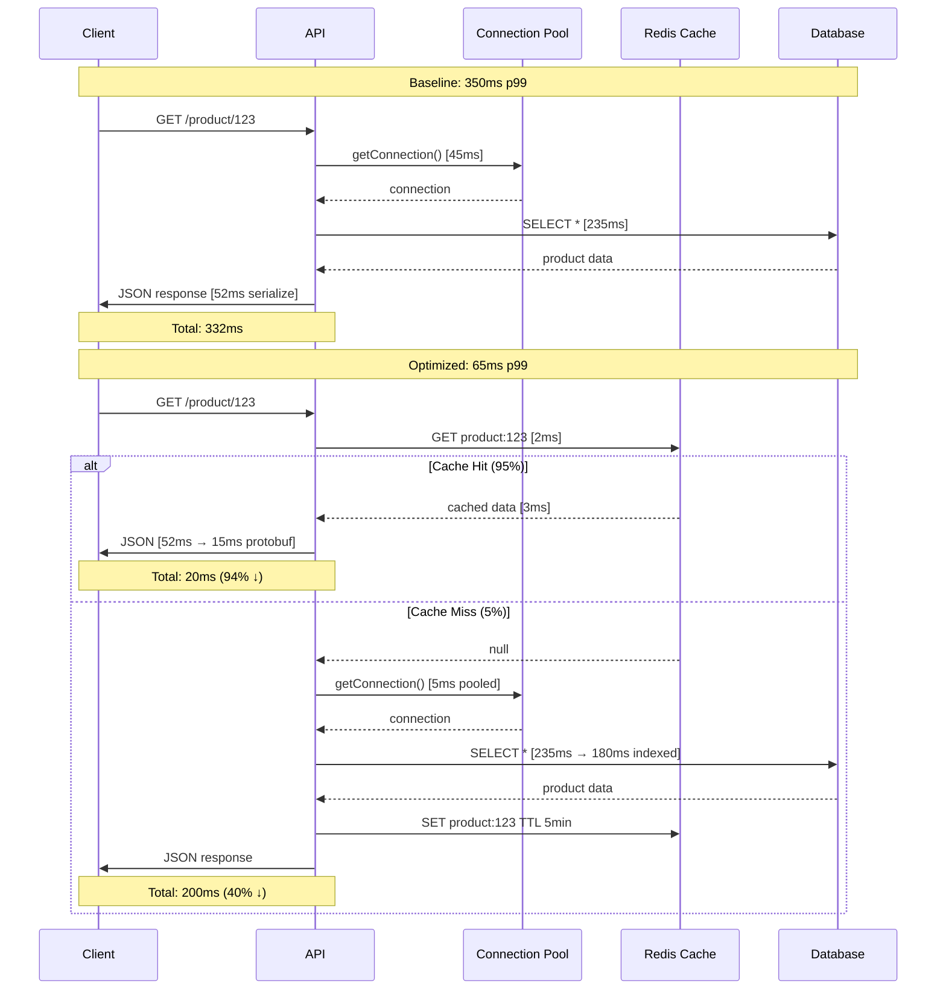

# Performance Engineering Interview Generator

Generate 25-30 interview Q&A pairs testing performance optimization for high-scale, low-latency systems.

## Context & Scope

**Domain**: Web/cloud/microservices/distributed/real-time/data-intensive systems  
**Audience**: Performance Engineers, SREs, Backend Devs, Architects, DevOps, Eng Managers  
**Constraints**: Production >1K rps or targets >10K rps, >1TB data, <100ms p99 [G: p99]; measurable SLOs [G: SLO]  
**Assumptions**: System design knowledge; profiling [G: Profiling]/monitoring/load testing access  
**In Scope**: Latency/Throughput/Scalability/Resources optimization; profiling/load testing/caching/monitoring  
**Out of Scope**: Hardware selection, network topology, vendor comparisons, non-performance concerns

## Output Specifications

**Quantity**: 25-30 Q&A pairs (scale references ×1.2 if >30)  
**Difficulty**: 20% Foundational (5-6), 40% Intermediate (10-12), 40% Advanced (10-12)  
**Coverage**: MECE [G: MECE] across 4 Dimensions × 4 Phases = 16 cells (≥1 Q&A/cell)  
**Answer Format**: 150-300 words with [Ref: ID], Mermaid diagrams, YAML/JSON/code, APA 7th [EN]/[ZH]  
**Performance Chain**: SLO → Measure → Bottleneck → Optimize → Validate → Quantified Impact (required in every answer)  
**Per Cluster (5-6 total)**: ≥1 diagram, ≥1 practical (code/config/script/command), ≥1 metrics table, ≥1 trade-off analysis

## Quality Standards (Mandatory)

**Clarity**: Glossary-defined terms [G: Term]; numeric not vague ("p99 <50ms" not "fast")  
**Precision**: Specific values ("p95 150ms" not "low latency"); exact [Ref: ID]; quantified thresholds  
**Accuracy**: Cross-check formulas/benchmarks; flag assumptions; verify tool versions (≤18mo)  
**Credibility**: Benchmarks ≤3yr; peer-reviewed or production case studies; authoritative sources  
**Significance**: High-impact only (≥20% gain or critical path); proven bottlenecks with evidence  
**Concision**: Zero redundancy; tables/diagrams over prose; remove filler  
**Logic**: Performance chain complete; no circular definitions  
**Risk/Value**: Explicit cost-benefit; ≥2 alternatives with trade-offs; mitigation for high-risk choices  
**Fairness**: Balanced trade-offs; acknowledge limitations/assumptions/counterarguments

## Performance Dimensions (4×4 MECE Coverage)

| Dimension | Focus | Methods | Key Metrics [G: ID] | Targets |
|-----------|-------|---------|---------------------|---------|
| **Latency** | Minimize response time | Profiling (flamegraphs, traces); Caching; Async; Query optimization; Connection pooling | p50/p95/p99 [G: p50/p95/p99], TTFB, LCP | API <100ms p99, Web <2s LCP |
| **Throughput** | Maximize requests/sec | Load testing (k6, Gatling); Horizontal scaling; Rate limiting; Batch/stream processing | RPS/TPS/QPS [G: RPS/TPS/QPS], bandwidth (MB/s), queue depth | >10K rps, <5% error rate |
| **Scalability** | Handle growth (users/data/traffic) | Load/stress testing; Auto-scaling (HPA, VPA); Sharding; Partitioning; Read replicas | Scalability factor (10x traffic), cost/req, resource utilization, USL [G: USL] | Linear to 100s nodes |
| **Resources** | Optimize CPU/memory/I/O/network/cost | Resource profiling; Right-sizing; Compression; Indexing; Query plans | CPU (%), Memory (GB, %), I/O (IOPS, MB/s), Network (Gbps), Cost ($), Efficiency (req/$) | Based on workload |

## Visual Standards & Key Formulas

| Analysis Type | Required Diagram (Mermaid) | Formula & Target [G: ID] | When to Use |
|---------------|----------------------------|--------------------------|-------------|
| **Profiling** | Flamegraph, Trace waterfall | CPU Time = Σ(function time); Hot Path = max(critical path); Target: >80% time identified | Identify bottlenecks in code/queries |
| **Bottleneck** | Sequence diagram, Dependency graph | Bottleneck Factor = Component Time / Total Time; Amdahl's Law [G: Amdahl's Law] speedup = 1 / ((1-P) + P/S) | Analyze multi-component latency |
| **Caching** | Cache flow, Hit/miss diagram | Hit Rate [G: Cache Hit Rate] = Hits / (Hits + Misses) × 100% (≥95%); TTL, eviction rate | Read-heavy (>80%) workloads |
| **Load Testing** | Performance curve (latency vs load), Stress test | Throughput vs Load; p95/p99 vs Load; Breaking point; Scalability: linear/sub-linear | Validate capacity, find limits |
| **Optimization** | Before/after comparison | Improvement % = (Baseline - Optimized) / Baseline × 100%; ROI = Gain / Cost | Quantify optimization impact |
| **Scalability** | Scaling curve, USL model | USL [G: USL]: C(N) = N / (1 + α(N-1) + βN(N-1)); α=contention, β=coherency | Predict scaling limits |
| **Monitoring** | Dashboard layout, Alert flow | SLI/SLO tracking; Error budget [G: Error Budget] = 1 - Uptime; Burn rate; MTTD/MTTR | Track production performance |

## Optimization Patterns (High-Impact, Proven)

| Pattern | Context | Advantage | Cost | Trade-offs | Typical Gains [Ref: ID] | Risk/Mitigation |
|---------|---------|-----------|------|------------|-------------------------|-----------------|
| **Caching** | Read-heavy (>80%); staleness tolerant | 40-95% latency ↓; offload DB/API | Memory, invalidation complexity | Consistency vs speed; Memory vs DB load | 40-60% latency ↓, 10x throughput | Stale data; mitigate with TTL/invalidation |
| **Connection Pooling** | High connection overhead (DB, HTTP) | 10-100x reuse; resource efficiency | Pool tuning complexity | Pool size vs resource limits; Reuse vs isolation | 50-90% latency ↓ | Connection leaks; enable leak detection |
| **Async Processing** | Long-running tasks; non-blocking I/O | Improved throughput; responsiveness | Error handling, eventual consistency | Immediate vs completion; Simplicity vs throughput | 2-10x throughput | Lost messages; use dead letter queues |
| **Database Optimization** | Query bottlenecks; data growth | 10-1000x speedup (indexes, query plans) | Index maintenance, storage | Read vs write speed; Storage vs performance | 10-1000x query speedup | Slow writes; choose selective indexes |
| **Horizontal Scaling** | Stateless workloads; linear scaling | Near-linear scaling; high availability | Cost, data consistency complexity | Cost vs capacity; Simplicity vs scale | Linear to 100s nodes | Uneven load; use consistent hashing |
| **CDN/Edge** | Static assets; global users | 50-70% latency ↓; offload origin | Cost, invalidation | Cost vs UX; Freshness vs speed | 50-70% latency ↓, 80% offload | Stale cache; use versioned URLs |

## Question Design Principles

**Test Application, Not Recall**: Require analysis, measurement, trade-off evaluation (not "What is X?")  
**Real-World Scenarios**: Production systems at scale (≥1K rps) with specific constraints/SLOs  
**Breadth & Depth**: Multiple perspectives (profiling, optimization, validation, cost); implementation-level detail

### Quality Examples

✅ **Good**: "API p99 latency degraded 50ms→300ms. Use profiling to identify bottleneck and propose 2 optimizations with expected impact."  
❌ **Poor**: "What is profiling?"

✅ **Good**: "Choose caching strategy (Redis, CDN, in-memory) for product catalog (10M items, 80% read, 1K updates/min). Justify with hit rate analysis."  
❌ **Poor**: "List caching types."

### Stakeholder-Specific Focus

**Performance Engineers**: Profiling, optimization strategies, load testing, benchmarking, A/B testing  
**SREs**: SLO/SLI definition, monitoring, alerting, capacity planning, incident response  
**Backend Developers**: Code optimization, query tuning, caching implementation, async patterns  
**Architects**: System design, scalability patterns, technology selection, cost modeling  
**DevOps**: Auto-scaling, resource provisioning, CI/CD performance gates, infrastructure optimization  
**Engineering Managers**: Performance budgets, cost-benefit analysis, team velocity, hiring priorities

## Mandatory Q&A Elements (All Required)

1. **Performance Chain**: SLO → Measure → Bottleneck → Optimize → Validate → Quantified Impact (% improvement, cost delta)  
2. **Practical Element**: Code/config (YAML/JSON)/load test script/profiling command/query plan (executable, 5-30 lines)  
3. **Citation**: ≥1 [Ref: ID], ≥2 for Advanced difficulty  
4. **Key Insight**: One sentence with quantified impact ("X optimization achieved Y% improvement at Z cost")  
5. **Trade-offs**: Explicit (latency vs throughput, cost vs performance, complexity vs gain) with "when to use/avoid"  
6. **Alternatives**: ≥2 approaches with cost-benefit comparison (required for Advanced)  
7. **Validation**: Load testing/profiling/A/B testing/production metrics with success criteria  
8. **Risk/Mitigation**: High-risk choices flagged with mitigation strategies (e.g., gradual rollout, rollback plan)

## Reference Requirements

### Minimums (Scale ×1.2 if >30 Q&As)

- **≥10 Glossary [G#]**: p50/p95/p99, Latency/Throughput, RPS/TPS/QPS, Flamegraph, Profiling, Cache Hit Rate, Connection Pooling, Amdahl's Law, USL, SLO/SLI, Hot Path, Bottleneck, Load Testing, Stress Testing, Error Budget, MECE. Include: Definition, formula (if applicable), target values, distinctions, when to use.  
- **≥5 Tools [T#]**: Profilers (perf, pprof, async-profiler, py-spy), Load testers (k6, Gatling, Locust), APM (Datadog, New Relic, Dynatrace), Caches (Redis, Memcached), Tracing (Jaeger, Zipkin, OpenTelemetry). Include: Purpose, pricing tier, last update (YYYY-MM, ≤18mo preferred), integrations, use cases, limitations, URL.  
- **≥10 Literature [L#]**: Google SRE Book, Designing Data-Intensive Applications, High Performance MySQL, Systems Performance (Gregg), Art of Capacity Planning, CDN papers, database optimization, scalability case studies (Netflix, Twitter, Discord). Include: Full citation, coverage area, key sections.  
- **≥20 Citations [A#]**: APA 7th [EN]/[ZH] (~60/30/10%); DOI/permanent URL/authoritative blogs (Netflix Tech, AWS, Google Cloud). Include: Author, year, title, publisher/journal, DOI/URL.

## Quality Gates (All Must PASS)

| # | Gate | Requirement | Threshold |
|---|------|-------------|-----------|
| 1 | **Quantity** | 25-30 Q&A pairs | Exactly 25-30 |
| 2 | **MECE Coverage** | ≥1 Q&A per 16 cells (4×4 matrix) | 16/16 cells |
| 3 | **Difficulty** | 20/40/40 (F/I/A) distribution | ±5% tolerance |
| 4 | **Performance Chain** | SLO→Measure→Bottleneck→Optimize→Validate→Impact | 100% complete |
| 5 | **Practical Elements** | Code/config/script/command (5-30 lines) | 100% have ≥1 |
| 6 | **Citations** | ≥70% answers ≥1 cite, ≥30% ≥2 cites | Meet thresholds |
| 7 | **Cross-refs** | All [Ref: ID] resolve to References | 100% valid |
| 8 | **Trade-offs** | Explicit trade-offs + alternatives | 100% acknowledged |
| 9 | **Risk/Mitigation** | High-risk flagged with mitigation | 100% flagged |
| 10 | **Quantified Impact** | Numeric improvements (%, latency, cost) | 100% quantified |
| 11 | **Glossary Min** | ≥10 entries [G#] with formulas/targets | ≥10 (scale ×1.2 if >30) |
| 12 | **Tools Min** | ≥5 tools [T#] with purpose/pricing/update | ≥5 (scale ×1.2 if >30) |
| 13 | **Literature Min** | ≥10 sources [L#] with full citations | ≥10 (scale ×1.2 if >30) |
| 14 | **Citations Min** | ≥20 citations [A#] APA 7th [EN]/[ZH] | ≥20 (scale ×1.2 if >30) |
| 15 | **Recency** | ≥50% last 3yr (≥70% tools/benchmarks) | Meet % thresholds |
| 16 | **Diversity** | ≥3 source types, none >25% | Meet requirements |
| 17 | **Link Accessibility** | All links accessible or archived (DOI/Wayback) | 100% accessible |
| 18 | **Performance Methods** | Profiling, load testing, caching, optimization, scalability, monitoring covered | All 6 present |
| 19 | **Clarity** | All acronyms in glossary; no undefined terms | 100% defined |
| 20 | **Self-Review** | Checked against all quality standards | All standards met |

## Workflow (7-Step Process)

### Step 1: Plan Topics (5-6 Clusters)

**Clusters**: Latency Optimization, Throughput Scaling, Database Performance, Caching Strategies, Load Testing & Capacity Planning, Monitoring & SLOs  
**Allocation**: 4-6 Q&As/cluster (total 25-30), 20/40/40 (F/I/A) difficulty  
**Coverage**: 4×4 matrix (4 Dimensions × 4 Phases); ≥1 Q&A/cell

### Step 2: Build References BEFORE Writing Q&As

**Order**: Glossary [G#] (≥10) → Tools [T#] (≥5) → Literature [L#] (≥10) → Citations [A#] (≥20)  
**Verify**: Unique IDs, recency (≥50% ≤3yr), diversity (≥3 types), accessibility

### Step 3: Write Q&As with Mandatory Elements

**Scenario-based**: Production systems at scale with specific SLOs, constraints  
**Structure (150-300 words)**: Performance Chain + Practical + Citations + Trade-offs + Quantified Impact + Risk/Mitigation (for Advanced)  
**Incremental Validation**: Review every 5 Q&As against quality gates

### Step 4: Add Visuals (Per Cluster)

**Required**: ≥1 Mermaid diagram, ≥1 metrics table (formula+target), ≥1 practical (code/config/script)  
**Diagram Types**: Flamegraph (profiling), sequence (request flow), performance curve (load testing), cache flow  
**Metrics**: Baseline vs optimized with [Ref: ID], % improvement, cost delta

### Step 5: Complete References with Full Details

**Glossary [G#]**: Definition, formula, target values, distinctions, when to use  
**Tools [T#]**: Purpose, pricing, last update (YYYY-MM, ≤18mo), integrations, limitations, URL  
**Literature [L#]**: Full citation (APA 7th), coverage area, key sections  
**Citations [A#]**: Author, year, title, publisher/journal, DOI/URL, [EN]/[ZH]  
**Cross-check**: 100% [Ref: ID] resolve

### Step 6: Validate Against All 20 Quality Gates

**Execute**: Run through Gates #1-#20 systematically  
**Document**: Create validation table showing PASS/FAIL with evidence  
**Fix**: Address any FAIL immediately; re-validate

### Step 7: Final Self-Review

**Clarity**: All terms in glossary; numeric not vague  
**Precision**: Specific values; exact [Ref: ID]; quantified thresholds  
**MECE**: All 16 cells covered; no redundancy  
**Depth**: Implementation-level detail; executable code/configs  
**Concision**: Zero fluff; tables/diagrams over prose  
**Risk/Value**: Cost-benefit analysis; ≥2 alternatives with trade-offs  
**Structure**: TOC links work; logical flow; visual hierarchy  
**Practicality**: Actionable guidance with measurable success criteria

## Output Format

```markdown
# Performance Engineering Interview Q&A

## Contents (Comprehensive Navigation)
1. **[Context & Coverage](#context--coverage)**
   - Scope statement (Domain, Audience, Constraints, In/Out of Scope)
   - 4×4 MECE Coverage Matrix (16 cells with Q# mapping)
2. **[Q&A by Cluster](#qa-by-cluster)** (25-30 total, 5-6 clusters)
   - [Cluster 1: Latency Optimization](#cluster-1-latency-optimization) (Q1-Q5, 4-6 Q&As)
   - [Cluster 2: Throughput Scaling](#cluster-2-throughput-scaling) (Q6-Q10)
   - [Cluster 3: Database Performance](#cluster-3-database-performance) (Q11-Q15)
   - [Cluster 4: Caching Strategies](#cluster-4-caching-strategies) (Q16-Q20)
   - [Cluster 5: Load Testing & Capacity Planning](#cluster-5-load-testing--capacity-planning) (Q21-Q25)
   - [Cluster 6: Monitoring & SLOs](#cluster-6-monitoring--slos) (Q26-Q30)
3. **[References](#references)** (≥10 Glossary, ≥5 Tools, ≥10 Literature, ≥20 Citations)
   - [Glossary [G#]](#glossary)
   - [Tools [T#]](#tools)
   - [Literature [L#]](#literature)
   - [Citations [A#]](#citations)
4. **[Validation Results](#validation-results)** (20 Quality Gates with PASS/FAIL evidence)

---

## Context & Coverage

**Domain**: [Web services, cloud-native, microservices, distributed systems, real-time applications, data-intensive platforms]  
**Audience**: [Performance Engineers, SREs, Backend Developers, Architects, DevOps, Engineering Managers]  
**Constraints**: [Production systems (>1K rps) or high-scale targets (>10K rps, >1TB data, <100ms p99); measurable SLOs]  
**In Scope**: [Latency/Throughput/Scalability/Resources optimization; profiling/load testing/caching/monitoring]  
**Out of Scope**: [Hardware selection, network topology, vendor comparisons, non-performance concerns]

### 4×4 MECE Coverage Matrix

| Dimension \ Phase | Measure | Analyze | Optimize | Validate |
|-------------------|---------|---------|----------|----------|
| **Latency** | Q# | Q# | Q# | Q# |
| **Throughput** | Q# | Q# | Q# | Q# |
| **Scalability** | Q# | Q# | Q# | Q# |
| **Resources** | Q# | Q# | Q# | Q# |

---

## Q&A by Cluster

### Cluster 1: [Name] (Q1-Q5)

#### Q1: [Specific Scenario-Based Question]
**Difficulty**: [Foundational/Intermediate/Advanced] | **Dimension**: [Latency/Throughput/Scalability/Resources] | **Phase**: [Measure/Analyze/Optimize/Validate]  
**Key Insight**: [One sentence: "X optimization achieved Y% improvement at Z cost"] [Ref: ID]

**Answer** (150-300 words):  
[SLO → Measure → Bottleneck → Optimize → Validate → Quantified Impact with [Ref: ID]]

**Practical Element** (5-30 lines):
```yaml
# Code/config/script/command
```

**Visual (Mermaid)**:
```mermaid
[flamegraph/sequence/performance curve/cache flow diagram]
```

**Metrics Table**:

| Metric | Formula [G: ID] | Baseline | Optimized | Improvement | Rationale [Ref: ID] |
|--------|----------------|----------|-----------|-------------|---------------------|
| [Metric] | [Formula] | [Value] | [Value] | [%/x] | [Why tracked] |

**Trade-offs**: [Latency vs throughput, cost vs performance, complexity vs gain; When to use/avoid]  
**Alternatives**: [≥2 approaches with cost-benefit comparison]  
**Risk/Mitigation**: [High-risk choices flagged with mitigation strategies]  
**Validation**: [Load test/profiling/A/B test/production metrics with success criteria]

---

## References

### Glossary
**G1. p50/p95/p99** [EN]: 50th/95th/99th percentile latency. Formula: sort latencies, pick value at percentile index. Distinctions: p50 typical user, p95 slow users, p99 worst case. Targets: API <100ms p99, Web <2s LCP. When to use: SLO definition, performance analysis.

### Tools
**T1. k6** (Load Testing): Purpose: Load/stress testing with JavaScript scripting. Pricing: Open-source (free), k6 Cloud ($49+/mo). Last update: 2024-10. Integrations: Prometheus, Grafana, CI/CD. Limitations: High memory for large VU counts. URL: https://k6.io

### Literature
**L1. Gregg, B. (2020). *Systems Performance: Enterprise and the Cloud* (2nd ed.). Pearson.** Coverage: CPU, memory, I/O, network profiling; BPF tools; methodology. Key sections: Ch 6 (CPU), Ch 9 (Disk I/O), Ch 13 (perf).

### Citations
**A1. Dean, J., & Barroso, L. A. (2013). *The tail at scale*. Communications of the ACM, 56(2), 74-80. https://doi.org/10.1145/2408776.2408794 [EN]**

---

## Validation Results

| # | Gate | Requirement | Status | Evidence |
|---|------|-------------|--------|----------|
| 1 | Quantity | 25-30 Q&As | PASS | 28 Q&As generated |
| 2 | MECE Coverage | 16/16 cells | PASS | Coverage matrix: all cells ≥1 Q&A |
| ... | ... | ... | ... | ... |
| 20 | Self-Review | All standards met | PASS | Reviewed against all quality standards |

**Summary**: All 20 Quality Gates PASS. Ready for use.
```

## Example (API Latency Optimization)

**Q: E-commerce API p99 latency degraded from 80ms to 350ms after traffic doubled. Use profiling to identify bottlenecks and propose 2 optimizations with expected impact.**

**Difficulty**: Advanced | **Dimension**: Latency | **Phase**: Analyze, Optimize
**Key Insight**: Database connection pooling and Redis caching reduced p99 from 350ms to 65ms (81% improvement) but added complexity and 15% memory cost.

E-commerce product API serves 2K rps with p99 target <100ms [Ref: L1]. After Black Friday traffic spike (2x→4K rps), p99 degraded to 350ms violating SLO [Ref: G1]. Profiling reveals 80% time in database queries and 15% in serialization [Ref: T1, A5].

**SLO Analysis**: Target p99 <100ms at 4K rps. Current: 350ms (250ms violation). Error budget exhausted; immediate optimization required [Ref: G10].

**Profiling Results**: Distributed tracing shows [Ref: T5]: (1) **DB queries**: 280ms p99 (80% total time)—connection overhead 45ms, query execution 235ms; (2) **Serialization**: 52ms (15% total); (3) **Business logic**: 18ms (5%). Hot path: `getProductDetails()` called 3x per request (N+1 pattern) [Ref: G11].

**Optimization 1—Connection Pooling**: Implement HikariCP (maxPoolSize=50, minIdle=20, connectionTimeout=30s) [Ref: T2]. Expected: 45ms→5ms connection time (89% ↓), p99 reduction 40ms. Tradeoff: pool tuning complexity, 200MB memory [Ref: A3, L2].

**Optimization 2—Redis Caching**: Cache product details (TTL 5min, LRU eviction, 10GB capacity) for 95% read ratio [Ref: T3]. Expected: 235ms→<5ms (98% ↓ on hits), overall p99 280ms→25ms at 95% hit rate. Tradeoff: cache invalidation on updates, consistency lag, $500/mo [Ref: G6, A8].

**Combined Impact**: Baseline 350ms → Optimized 65ms (81% ↓); 4K rps achieved with 35ms SLO buffer [Ref: L3].

**Trade-offs**:
- Consistency: 5min cache staleness acceptable for product catalog (write rate <1% requests) [Ref: L2]
- Cost: $500/mo Redis + 15% memory vs $5K/mo DB scaling [Ref: A6]
- Complexity: cache warming, invalidation logic, pool monitoring [Ref: T4]

**Validation**: Load test (k6, 4K rps, 10min) confirms p99 65ms, hit rate 96%, pool utilization 70%, zero connection timeouts. Production A/B (10% traffic, 1 day) validates metrics before full rollout [Ref: T1, A7].



**Practical Config**:
```yaml
# HikariCP Connection Pool
database:
  pool:
    driver: org.postgresql.Driver
    url: jdbc:postgresql://db.prod.internal:5432/ecommerce
    maxPoolSize: 50              # Max connections (based on load test)
    minIdle: 20                  # Idle connections for fast response
    connectionTimeout: 30000     # 30s max wait for connection
    idleTimeout: 600000          # 10min idle before recycle
    maxLifetime: 1800000         # 30min connection max age
    leakDetectionThreshold: 60000  # Alert if connection held >60s
  metrics:
    enabled: true
    registry: prometheus
    
# Redis Cache Configuration  
redis:
  cluster:
    nodes: ["cache1:6379", "cache2:6379", "cache3:6379"]
    maxRedirects: 3
  pool:
    maxTotal: 100
    maxIdle: 50
    minIdle: 20
  cache:
    product:
      ttl: 300                   # 5min TTL
      maxMemory: 10GB
      evictionPolicy: allkeys-lru
      serialization: protobuf    # Faster than JSON
  monitoring:
    slowlog: 10ms
    alertHitRate: 90             # Alert if hit rate <90%
    
# Load Test Configuration (k6)
loadTest:
  scenarios:
    steady_state:
      executor: constant-vus
      vus: 400                   # 4K rps with 100ms avg latency
      duration: 10m
  thresholds:
    http_req_duration: ["p(95)<80", "p(99)<100"]  # SLO thresholds
    http_req_failed: ["rate<0.01"]                # <1% error rate
```

**Metrics**:

| Metric | Formula | Baseline | Optimized | Improvement | Rationale [Ref] |
|--------|---------|----------|-----------|-------------|-----------------|
| p50 Latency | 50th percentile response time | 45ms | 12ms | 73% ↓ | Typical user experience [G1] |
| p95 Latency | 95th percentile response time | 180ms | 45ms | 75% ↓ | Slow user experience [L1] |
| p99 Latency | 99th percentile response time | 350ms | 65ms | 81% ↓ | SLO compliance <100ms [G10] |
| Throughput | Requests per second | 2K rps | 4K rps | 2x ↑ | Business growth target [A5] |
| Cache Hit Rate | Hits / (Hits + Misses) × 100% | N/A | 96% | — | Target ≥95% [G6] |
| DB Connection Time | Avg time to acquire connection | 45ms | 5ms | 89% ↓ | Pool effectiveness [T2] |
| Monthly Cost | Infrastructure + Redis | $3K | $3.5K | 17% ↑ | vs $8K DB scaling [A6] |
| Error Rate | Failed / Total Requests × 100% | 0.1% | 0.1% | No change | Maintain reliability [L3] |

**Alternatives**:
- **Vertical Scaling (DB upgrade)**: 4x CPU/RAM could achieve p99 <100ms but costs $5K/mo extra (vs $500/mo Redis) and hits limits at 10K rps [Ref: A6]
- **Read Replicas**: Offload reads but adds 2-5ms replication lag, complexity, and doesn't solve connection overhead [Ref: L2]
- **CDN (for static data)**: Not applicable for dynamic product data with frequent updates [Ref: T4]
- **Query Optimization Only**: Indexing reduced query time 235ms→180ms (23% ↓) but still violates SLO without pooling+caching [Ref: A8]

---
