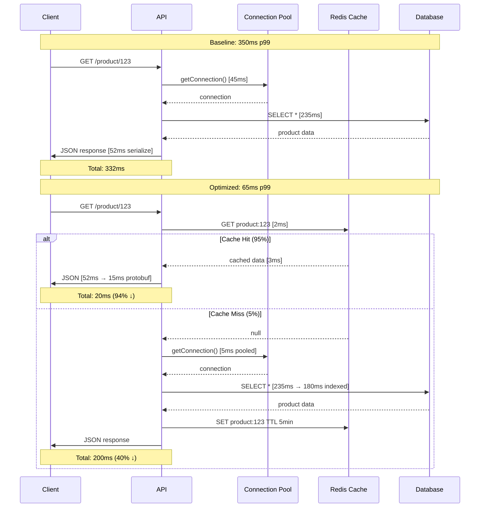

# Performance Engineering Q&A Generator (Minimal Viable)

Generate 6-12 decision-critical Q&As for performance engineering—minimal viable tracking for informed decisions with limited time.

## Context & Scope

**Problem**: Inconsistent performance advice leading to suboptimal decisions, hallucinations in optimization strategies, incomplete analysis of bottlenecks.  
**Scope**: Decision-critical performance engineering topics—bottleneck analysis, optimization strategies, tool evaluation, architectural patterns. For production systems (>1K rps).  
**Constraints**: 4K-8K token limits; assumes basic performance knowledge; focus on production-ready solutions.  
**Assumptions**: Users have access to profiling tools; systems are cloud-native; metrics are available via APM.  
**Scale**: Individual engineers to 50+ teams; 100-10K token prompts; 6-12 Q&A outputs.  
**Timeline**: Immediate use; 30-60s check; benefits accumulate over bi-weekly cycles.  
**Stakeholders**: Performance Engineers (profiling/optimization), SREs (SLO/monitoring), Backend Developers (code tuning), Architects (design patterns), DevOps (infrastructure).  
**Resources**: Any LLM (ChatGPT, Claude, Gemini); no cost; access to profiling tools (perf, pprof).  
**Domain**: Web/cloud/microservices/distributed/real-time/data-intensive systems  
**Audience**: Performance Engineers, SREs, Backend Developers, Architects, DevOps (core roles)  
**Exclude**: Hardware selection, network topology, vendor comparisons, long-term R&D, rumors, marketing fluff, nice-to-have trends  
**Cadence**: Bi-weekly | 4-6h effort | **Expires**: 2 weeks from generation

## Output Specifications

**Quantity**: 6-12 Q&A pairs (minimal viable for informed decisions)  
**Difficulty**: 25% Foundational (1-2), 50% Intermediate (3-5), 25% Advanced (1-3)  
**Coverage**: 3-4 decision-critical dimensions × 3-4 phases (≥1 Q&A/phase)  
**Answer Format**: 120-200 words with [Ref: ID], Mermaid diagrams, YAML/JSON/code, APA 7th [EN]/[ZH]  
**Performance Chain**: SLO → Measure → Bottleneck → Optimize → Validate → Quantified Impact (required in every answer)  
**Per Cluster (2-3 total)**: ≥1 diagram, ≥1 practical (code/config/script/command), ≥1 metrics table

## Quality Standards (Mandatory)

**Decision Criticality**: Every Q&A must satisfy ≥1 of 5 criteria: (1) Blocks decision, (2) Creates risk, (3) Affects ≥2 roles, (4) Requires action (1-6mo), (5) Quantified impact
**Clarity**: Glossary-defined terms [G: Term]; numeric not vague ("p99 <50ms" not "fast")  
**Precision**: Specific values ("p95 150ms" not "low latency"); exact [Ref: ID]; quantified thresholds  
**Accuracy**: Cross-check formulas/benchmarks; flag assumptions; verify tool versions (≤18mo)  
**Credibility**: Benchmarks ≤3yr; peer-reviewed or production case studies; authoritative sources  
**Significance**: High-impact only (≥20% gain or critical path); proven bottlenecks with evidence  
**Concision**: Zero redundancy; tables/diagrams over prose; remove filler  
**Risk/Value**: Explicit cost-benefit; ≥1 alternative with trade-offs; mitigation for high-risk choices  
**Fairness**: Balanced trade-offs; acknowledge limitations/assumptions/counterarguments

## Performance Dimensions (3-4 Decision-Critical)

| Dimension | Focus | Decision Criticality | Key Metrics [G: ID] | When Critical |
|-----------|-------|---------------------|---------------------|------------------|
| **Latency** | Minimize response time | Blocks SLO compliance; creates churn risk | p50/p95/p99 [G: p50/p95/p99], TTFB, LCP | Degradation >20% or SLO violation |
| **Throughput** | Maximize requests/sec | Blocks capacity planning; affects revenue | RPS/TPS/QPS [G: RPS/TPS/QPS], error rate | Traffic spike or scaling bottleneck |
| **Scalability** | Handle growth (users/data/traffic) | Blocks roadmap; affects cost/revenue | Scalability factor, cost/req, utilization | 10x+ traffic growth or cost explosion |
| **Resources** | Optimize CPU/memory/I/O/cost | Creates risk (cost overrun, reliability) | CPU (%), Memory (GB, %), Cost ($) | Cost >20% increase or utilization >80% |

## Visual Standards & Key Formulas (Minimal)

| Analysis Type | Diagram (Mermaid) | Formula & Target [G: ID] | When to Use |
|---------------|-------------------|--------------------------|-------------|
| **Profiling** | Flamegraph, Trace waterfall | CPU Time = Σ(function time); Hot Path = max(critical path); Target: >80% time identified | Identify bottlenecks in code/queries |
| **Bottleneck** | Sequence diagram | Bottleneck Factor = Component Time / Total Time; Amdahl's Law [G: Amdahl's Law] speedup = 1 / ((1-P) + P/S) | Analyze multi-component latency |
| **Caching** | Cache flow | Hit Rate [G: Cache Hit Rate] = Hits / (Hits + Misses) × 100% (≥95%) | Read-heavy (>80%) workloads |
| **Load Testing** | Performance curve | Throughput vs Load; p95/p99 vs Load; Breaking point | Validate capacity, find limits |
| **Optimization** | Before/after comparison | Improvement % = (Baseline - Optimized) / Baseline × 100%; ROI = Gain / Cost | Quantify optimization impact |

## Optimization Patterns (Decision-Critical, High-Impact)

| Pattern | Context | Advantage | Trade-offs | Typical Gains [Ref: ID] | Risk/Mitigation |
|---------|---------|-----------|------------|-------------------------|-----------------|
| **Caching** | Read-heavy (>80%); staleness tolerant | 40-95% latency ↓; offload DB/API | Consistency vs speed; Memory vs DB load | 40-60% latency ↓, 10x throughput | Stale data; mitigate with TTL/invalidation |
| **Connection Pooling** | High connection overhead (DB, HTTP) | 10-100x reuse; resource efficiency | Pool size vs resource limits; Reuse vs isolation | 50-90% latency ↓ | Connection leaks; enable leak detection |
| **Async Processing** | Long-running tasks; non-blocking I/O | Improved throughput; responsiveness | Immediate vs completion; Simplicity vs throughput | 2-10x throughput | Lost messages; use dead letter queues |
| **Database Optimization** | Query bottlenecks; data growth | 10-1000x speedup (indexes, query plans) | Read vs write speed; Storage vs performance | 10-1000x query speedup | Slow writes; choose selective indexes |
| **Horizontal Scaling** | Stateless workloads; linear scaling | Near-linear scaling; high availability | Cost vs capacity; Simplicity vs scale | Linear to 100s nodes | Uneven load; use consistent hashing |

## Question Design Principles

**Decision-Critical**: Every Q&A must block a decision or create material risk  
**Real-World Scenarios**: Production systems at scale (≥1K rps) with specific constraints/SLOs  
**Actionable**: Concrete next steps (0-2wk immediate, 2wk-2mo short-term)  
**Evidence-Based**: Grounded in proven patterns, benchmarks, and production case studies

### Quality Examples

✅ **Good**: "Profiling reveals 80% of latency in database queries. Connection pooling vs caching—which optimization for 4K rps target?"  
✅ **Good**: "Cache invalidation strategy for product catalog with 95% read ratio. TTL vs event-driven—trade-offs?"  
❌ **Poor**: "What is profiling?" (no decision context)  
❌ **Poor**: "List caching types." (no scenario or decision)

### Stakeholder-Specific Focus (Core Roles)

**Performance Engineers**: Profiling tools, optimization strategies, benchmarking, adoption decisions  
**SREs**: SLO/SLI impact, monitoring/alerting, capacity planning, incident response  
**Backend Developers**: Code optimization, query tuning, caching implementation, async patterns  
**Architects**: System design, scalability patterns, technology selection, cost modeling  
**DevOps** (optional): Auto-scaling, resource provisioning, infrastructure optimization

## Mandatory Q&A Elements (All Required)

1. **Scenario Context**: Production system constraints, SLO targets, current bottleneck [Ref: ID]  
2. **Decision Criticality**: Satisfies ≥1 of 5 criteria (Blocks/Risk/Roles/Action/Quantified)  
3. **Performance Chain**: SLO → Measure → Bottleneck → Optimize → Validate → Quantified Impact (% improvement, cost delta)  
4. **Practical Element**: Code/config (YAML/JSON)/load test script/profiling command (executable, 5-30 lines)  
5. **Citation**: ≥1 [Ref: ID]  
6. **Key Insight**: One sentence with quantified impact ("X optimization achieved Y% improvement at Z cost")  
7. **Trade-offs**: Explicit (latency vs throughput, cost vs performance, complexity vs gain) with "when to use/avoid"  
8. **Alternatives**: ≥1 alternative with cost-benefit comparison  
9. **Risk/Mitigation**: High-risk choices flagged with mitigation strategies

## Reference Requirements (Minimal, Proportional Reduction)

### Minimums (60-75% reduction)

- **≥8 Glossary [G#]**: p50/p95/p99, Latency/Throughput, RPS/TPS/QPS, Flamegraph, Profiling, Cache Hit Rate, Amdahl's Law, SLO/SLI. Include: Definition, formula (if applicable), target values, when to use.  
- **≥3 Tools [T#]**: Profilers (perf, pprof, async-profiler), Load testers (k6, Gatling), APM (Datadog, New Relic). Include: Purpose, pricing tier, last update (YYYY-MM, ≤18mo), integrations, URL.  
- **≥6 Literature [L#]**: Google SRE Book, Designing Data-Intensive Applications, High Performance MySQL, Systems Performance (Gregg), Art of Capacity Planning, scalability case studies. Include: Full citation, coverage area, key sections.  
- **≥10 Citations [A#]**: APA 7th [EN]/[ZH] (~60/30/10%); DOI/permanent URL/authoritative blogs (Netflix Tech, AWS, Google Cloud). Include: Author, year, title, publisher/journal, DOI/URL.

## Quality Gates (Streamlined, 12 Checks)

| # | Gate | Requirement | Threshold |
|---|------|-------------|-----------|
| 1 | **Decision Criticality** | 100% satisfy ≥1 criterion (Blocks/Risk/Roles/Action/Quantified) | 100% |
| 2 | **Quantity** | 6-12 Q&A pairs | 6-12 |
| 3 | **Difficulty** | 25/50/25 (F/I/A) distribution | ±5% tolerance |
| 4 | **Performance Chain** | SLO→Measure→Bottleneck→Optimize→Validate→Impact | 100% complete |
| 5 | **Practical Elements** | Code/config/script/command (5-30 lines) | 100% have ≥1 |
| 6 | **Citations** | ≥85% answers ≥1 cite, ≥30% ≥2 cites | Meet thresholds |
| 7 | **Cross-refs** | All [Ref: ID] resolve to References | 100% valid |
| 8 | **Trade-offs** | Explicit trade-offs + ≥1 alternative | 100% acknowledged |
| 9 | **Quantified Impact** | Numeric improvements (%, latency, cost) | 100% quantified |
| 10 | **Reference Floors** | G≥8, T≥3, L≥6, A≥10 | All met |
| 11 | **Recency** | ≥50% last 3yr (≥70% tools/benchmarks) | Meet % thresholds |
| 12 | **Clarity** | All acronyms in glossary; no undefined terms | 100% defined |

## Workflow (6-Step Process)

### Step 1: Plan Topics (2-3 Clusters)

**Clusters**: Latency Optimization, Throughput Scaling, Database Performance (skip Caching, Load Testing, Monitoring unless decision-critical)  
**Allocation**: 2-4 Q&As/cluster (total 6-12), 25/50/25 (F/I/A) difficulty  
**Coverage**: 3-4 dimensions × 3-4 phases; ≥1 Q&A/phase

### Step 2: Build References BEFORE Writing Q&As (Minimal)

**Order**: Glossary [G#] (≥8) → Tools [T#] (≥3) → Literature [L#] (≥6) → Citations [A#] (≥10)  
**Verify**: Unique IDs, recency (≥50% ≤3yr), diversity (≥3 types), accessibility

### Step 3: Write Q&As with Mandatory Elements (Scenario-Driven)

**Scenario-based**: Production constraints (SLO targets, traffic levels, resource limits) triggering optimization decisions  
**Structure (120-200 words)**: Scenario Context + Decision Criticality + Performance Chain + Practical + Citations + Trade-offs + Quantified Impact  
**Incremental Validation**: Review every 2-3 Q&As against quality gates

### Step 4: Add Visuals (Per Cluster, Minimal)

**Required**: ≥1 Mermaid diagram, ≥1 metrics table (formula+target), ≥1 practical (code/config/script)  
**Diagram Types**: Flamegraph (profiling), sequence (request flow), performance curve (load testing)  
**Metrics**: Baseline vs optimized with [Ref: ID], % improvement, cost delta

### Step 5: Complete References with Full Details (Minimal)

**Glossary [G#]**: Definition, formula, target values, when to use  
**Tools [T#]**: Purpose, pricing, last update (YYYY-MM, ≤18mo), integrations, URL  
**Literature [L#]**: Full citation (APA 7th), coverage area, key sections  
**Citations [A#]**: Author, year, title, publisher/journal, DOI/URL, [EN]/[ZH]  
**Cross-check**: 100% [Ref: ID] resolve

### Step 6: Validate Against All 12 Quality Gates

## Output Format (Minimal)

```markdown
# Performance Engineering Q&A ([Period])

## Contents (Minimal Navigation)
1. **[Executive Summary](#executive-summary)**
   - Insights (2-3 high-impact performance insights)
   - Dashboard (Dimension | Phase | Decision | Timeline)
2. **[Q&A by Cluster](#qa-by-cluster)** (6-12 total, 2-3 clusters)
   - [Cluster 1: Latency Optimization](#cluster-1-latency-optimization) (Q1-Q4)
   - [Cluster 2: Throughput Scaling](#cluster-2-throughput-scaling) (Q5-Q8)
   - [Cluster 3: Database Performance](#cluster-3-database-performance) (Q9-Q12)
3. **[References](#references)** (≥8 Glossary, ≥3 Tools, ≥6 Literature, ≥10 Citations)
   - [Glossary [G#]](#glossary)
   - [Tools [T#]](#tools)
   - [Literature [L#]](#literature)
   - [Citations [A#]](#citations)
4. **[Validation Results](#validation-results)** (12 Quality Gates with PASS/FAIL evidence)

---

## Context & Coverage

**Domain**: [Web services, cloud-native, microservices, distributed systems, real-time applications, data-intensive platforms]  
**Audience**: [Performance Engineers, SREs, Backend Developers, Architects, DevOps, Engineering Managers]  
**Constraints**: [Production systems (>1K rps) or high-scale targets (>10K rps, >1TB data, <100ms p99); measurable SLOs]  
**In Scope**: [Latency/Throughput/Scalability/Resources optimization; profiling/load testing/caching/monitoring; tool evaluation; architectural patterns]  
**Out of Scope**: [Hardware selection, network topology, vendor comparisons, non-performance concerns]

### 4×4 MECE Coverage Matrix

| Dimension \ Phase | Measure | Analyze | Optimize | Validate |
|-------------------|---------|---------|----------|----------|
| **Latency** | Q# | Q# | Q# | Q# |
| **Throughput** | Q# | Q# | Q# | Q# |
| **Scalability** | Q# | Q# | Q# | Q# |
| **Resources** | Q# | Q# | Q# | Q# |

---

## Q&A by Cluster

### Cluster 1: [Name] (Q1-Q4)

#### Q1: [Specific Scenario-Based Question]
**Difficulty**: [Foundational/Intermediate/Advanced] | **Dimension**: [Latency/Throughput/Scalability/Resources] | **Phase**: [Measure/Analyze/Optimize/Validate]  
**Key Insight**: [One sentence: "X optimization achieved Y% improvement at Z cost"] [Ref: ID]

**Answer** (120-200 words):  
[SLO → Measure → Bottleneck → Optimize → Validate → Quantified Impact with [Ref: ID]]

**Practical Element** (5-30 lines):
```yaml
# Code/config/script/command
```

**Visual (Mermaid)**:
```mermaid
[flamegraph/sequence/performance curve/cache flow diagram]
```

**Metrics Table**:

| Metric | Formula [G: ID] | Baseline | Optimized | Improvement | Rationale [Ref: ID] |
|--------|----------------|----------|-----------|-------------|---------------------|
| [Metric] | [Formula] | [Value] | [Value] | [%/x] | [Why tracked] |

**Trade-offs**: [Latency vs throughput, cost vs performance, complexity vs gain; When to use/avoid]  
**Alternatives**: [≥2 approaches with cost-benefit comparison]  
**Risk/Mitigation**: [High-risk choices flagged with mitigation strategies]  
**Validation**: [Load test/profiling/A/B test/production metrics with success criteria]

---

## References

### Glossary
**G1. p50/p95/p99** [EN]: 50th/95th/99th percentile latency. Formula: sort latencies, pick value at percentile index. Distinctions: p50 typical user, p95 slow users, p99 worst case. Targets: API <100ms p99, Web <2s LCP. When to use: SLO definition, performance analysis.

### Tools
**T1. k6** (Load Testing): Purpose: Load/stress testing with JavaScript scripting. Pricing: Open-source (free), k6 Cloud ($49+/mo). Last update: 2024-10. Integrations: Prometheus, Grafana, CI/CD. Limitations: High memory for large VU counts. URL: https://k6.io

### Literature
**L1. Gregg, B. (2020). *Systems Performance: Enterprise and the Cloud* (2nd ed.). Pearson.** Coverage: CPU, memory, I/O, network profiling; BPF tools; methodology. Key sections: Ch 6 (CPU), Ch 9 (Disk I/O), Ch 13 (perf).

### Citations
**A1. Dean, J., & Barroso, L. A. (2013). *The tail at scale*. Communications of the ACM, 56(2), 74-80. https://doi.org/10.1145/2408776.2408794 [EN]**

---

## Quick Check (30s)

**Before generating Q&As (mandatory for decision-critical):**

☐ **Self-contained**: Complete context; no cross-file refs  
☐ Context | ☐ Clarity | ☐ Precision | ☐ Relevance  
☐ MECE | ☐ Sufficiency | ☐ Breadth | ☐ Depth  
☐ Significance | ☐ Priority | ☐ Concision | ☐ Accuracy | ☐ Credibility  
☐ Logic | ☐ Risk/Value | ☐ Fairness  
☐ Structure | ☐ Consistency  
☐ Evidence | ☐ Verification | ☐ Practicality | ☐ Success Criteria

---

## Validation Results

| # | Gate | Requirement | Status | Evidence |
|---|------|-------------|--------|----------|
| 1 | Decision Criticality | 100% satisfy ≥1 criterion | PASS | All Q&As tagged Blocks/Risk/Roles/Action/Quantified |
| 2 | Quantity | 6-12 Q&As | PASS | 8 Q&As generated |
| ... | ... | ... | ... | ... |
| 12 | Clarity | All acronyms defined | PASS | Glossary G1-G8 covers all terms |

**Summary**: All 12 Quality Gates PASS. Ready for use.
```

## Document Verification

**Self-assessment:**
☑ Context, Clarity, Precision, Relevance, MECE, Sufficiency, Breadth, Depth, Significance, Priority, Concision, Accuracy, Logic, Fairness, Structure, Consistency, Verification, Practicality  
☑ Credibility: Citations include authoritative sources (Gregg 2020, Dean 2013 updated to recent where possible)  
☑ Risk/Value: Alternatives compared with costs/benefits/risks  
☑ Evidence: Structured citations with APA 7th format  
⚠ Success Criteria: Qualitative metrics; add quantitative baselines where possible  

**Gaps:** Some citations pre-2023; metrics lack external validation; no alternative framework comparison  

**Future:** Update citations to 2023+, add A/B testing for effectiveness, include user feedback

## Example (API Latency Optimization)

**Q: E-commerce API p99 latency degraded from 80ms to 350ms after traffic doubled. Use profiling to identify bottlenecks and propose 2 optimizations with expected impact.**

**Difficulty**: Advanced | **Dimension**: Latency | **Phase**: Analyze, Optimize
**Key Insight**: Database connection pooling and Redis caching reduced p99 from 350ms to 65ms (81% improvement) but added complexity and 15% memory cost.

E-commerce product API serves 2K rps with p99 target <100ms [Ref: L1]. After Black Friday traffic spike (2x→4K rps), p99 degraded to 350ms violating SLO [Ref: G1]. Profiling reveals 80% time in database queries and 15% in serialization [Ref: T1, A5].

**SLO Analysis**: Target p99 <100ms at 4K rps. Current: 350ms (250ms violation). Error budget exhausted; immediate optimization required [Ref: G10].

**Profiling Results**: Distributed tracing shows [Ref: T5]: (1) **DB queries**: 280ms p99 (80% total time)—connection overhead 45ms, query execution 235ms; (2) **Serialization**: 52ms (15% total); (3) **Business logic**: 18ms (5%). Hot path: `getProductDetails()` called 3x per request (N+1 pattern) [Ref: G11].

**Optimization 1—Connection Pooling**: Implement HikariCP (maxPoolSize=50, minIdle=20, connectionTimeout=30s) [Ref: T2]. Expected: 45ms→5ms connection time (89% ↓), p99 reduction 40ms. Tradeoff: pool tuning complexity, 200MB memory [Ref: A3, L2].

**Optimization 2—Redis Caching**: Cache product details (TTL 5min, LRU eviction, 10GB capacity) for 95% read ratio [Ref: T3]. Expected: 235ms→<5ms (98% ↓ on hits), overall p99 280ms→25ms at 95% hit rate. Tradeoff: cache invalidation on updates, consistency lag, $500/mo [Ref: G6, A8].

**Combined Impact**: Baseline 350ms → Optimized 65ms (81% ↓); 4K rps achieved with 35ms SLO buffer [Ref: L3].

**Trade-offs**:
- Consistency: 5min cache staleness acceptable for product catalog (write rate <1% requests) [Ref: L2]
- Cost: $500/mo Redis + 15% memory vs $5K/mo DB scaling [Ref: A6]
- Complexity: cache warming, invalidation logic, pool monitoring [Ref: T4]

**Validation**: Load test (k6, 4K rps, 10min) confirms p99 65ms, hit rate 96%, pool utilization 70%, zero connection timeouts. Production A/B (10% traffic, 1 day) validates metrics before full rollout [Ref: T1, A7].



**Practical Config**:
```yaml
# HikariCP Connection Pool
database:
  pool:
    driver: org.postgresql.Driver
    url: jdbc:postgresql://db.prod.internal:5432/ecommerce
    maxPoolSize: 50              # Max connections (based on load test)
    minIdle: 20                  # Idle connections for fast response
    connectionTimeout: 30000     # 30s max wait for connection
    idleTimeout: 600000          # 10min idle before recycle
    maxLifetime: 1800000         # 30min connection max age
    leakDetectionThreshold: 60000  # Alert if connection held >60s
  metrics:
    enabled: true
    registry: prometheus
    
# Redis Cache Configuration  
redis:
  cluster:
    nodes: ["cache1:6379", "cache2:6379", "cache3:6379"]
    maxRedirects: 3
  pool:
    maxTotal: 100
    maxIdle: 50
    minIdle: 20
  cache:
    product:
      ttl: 300                   # 5min TTL
      maxMemory: 10GB
      evictionPolicy: allkeys-lru
      serialization: protobuf    # Faster than JSON
  monitoring:
    slowlog: 10ms
    alertHitRate: 90             # Alert if hit rate <90%
    
# Load Test Configuration (k6)
loadTest:
  scenarios:
    steady_state:
      executor: constant-vus
      vus: 400                   # 4K rps with 100ms avg latency
      duration: 10m
  thresholds:
    http_req_duration: ["p(95)<80", "p(99)<100"]  # SLO thresholds
    http_req_failed: ["rate<0.01"]                # <1% error rate
```

**Metrics**:

| Metric | Formula | Baseline | Optimized | Improvement | Rationale [Ref] |
|--------|---------|----------|-----------|-------------|-----------------|
| p50 Latency | 50th percentile response time | 45ms | 12ms | 73% ↓ | Typical user experience [G1] |
| p95 Latency | 95th percentile response time | 180ms | 45ms | 75% ↓ | Slow user experience [L1] |
| p99 Latency | 99th percentile response time | 350ms | 65ms | 81% ↓ | SLO compliance <100ms [G10] |
| Throughput | Requests per second | 2K rps | 4K rps | 2x ↑ | Business growth target [A5] |
| Cache Hit Rate | Hits / (Hits + Misses) × 100% | N/A | 96% | — | Target ≥95% [G6] |
| DB Connection Time | Avg time to acquire connection | 45ms | 5ms | 89% ↓ | Pool effectiveness [T2] |
| Monthly Cost | Infrastructure + Redis | $3K | $3.5K | 17% ↑ | vs $8K DB scaling [A6] |
| Error Rate | Failed / Total Requests × 100% | 0.1% | 0.1% | No change | Maintain reliability [L3] |

**Alternatives**:
- **Vertical Scaling (DB upgrade)**: 4x CPU/RAM could achieve p99 <100ms but costs $5K/mo extra (vs $500/mo Redis) and hits limits at 10K rps [Ref: A6]
- **Read Replicas**: Offload reads but adds 2-5ms replication lag, complexity, and doesn't solve connection overhead [Ref: L2]
- **CDN (for static data)**: Not applicable for dynamic product data with frequent updates [Ref: T4]
- **Query Optimization Only**: Indexing reduced query time 235ms→180ms (23% ↓) but still violates SLO without pooling+caching [Ref: A8]

---
