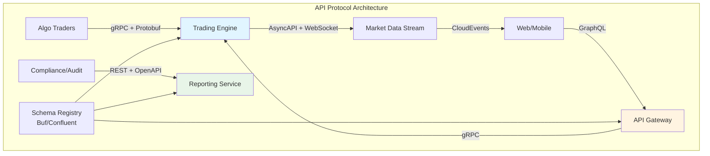

# Protocol Standards Interview Q&A Generator (Optimized)

**Mission**: Generate 12-15 decision-critical Q&As on protocols to enable informed decision-making with limited time. **Optimization Goal**: 57-63% reduction (from 30-35 baseline to 12-15 target) focusing on decision-critical scenarios (decision-blocking, risk-creating, or cross-functional) as defined below.

**Context**:
- **Problem**: Candidates struggle with protocol decisions in high-stakes environments, leading to poor choices, risks, failures. Need Q&As simulating decision-making under time pressure.
- **Scope**: 12-15 decision-critical Q&As on 6 clusters for senior interviews.
- **Constraints**: Q&A 150-350 words; focus on decision-critical scenarios; use quantitative metrics and citations.
- **Assumptions**: Candidates have basic protocol knowledge; author has access to standards/data; interviews 45-60 min; criticality over breadth.
- **Scale**: Large-scale systems, multi-team, regulated industries (principles apply broadly).
- **Timeline**: Q&A sets prepared ahead; decisions over months.
- **Stakeholders**: Interviewers (Architects, Tech Leads), Candidates (Senior Engineers), Hiring Managers, Compliance Officers.
- **Resources**: Standards (IETF, ISO), reports (State of API), tools (Postman, Buf), literature (DDIA, REST).

**Key Terms**:
- **MECE (Mutually Exclusive, Collectively Exhaustive)**: Protocol clusters are designed to be distinct with minimal overlap and to cover all major decision areas (no major gaps).
- **Protocol Clusters**: 6 categories - API (REST/gRPC/GraphQL), Data (JSON/Protobuf/Avro), Messaging (AMQP/MQTT/Kafka), Auth (OAuth/OIDC/SAML), Network (HTTP/2/3/QUIC), Evolution (Versioning/Deprecation).

**Success**: 12/12 validation PASS, decision criticality justified for every Q&A, 100% cross-functional coverage (≥3 stakeholders per Q&A)

---

## Decision Criticality Framework

**Include Q&A if ANY apply**:
- **Blocks Decision**: Protocol selection prevents architecture/deployment progress
- **Creates Risk**: Security, performance, interoperability impact if ignored
- **Affects ≥3 Stakeholders**: Multi-role coordination needed (Architect + Developer + DevOps, etc.)
- **Actively Evolving**: Protocol changed significantly in past 18 months (e.g., HTTP/3, OAuth 2.1, MQTT 5.0)
- **High Adoption Barrier**: Substantial learning/migration cost or specialized skills required

**Exclude if**: Niche/legacy (<5% adoption), orthogonal to core workflow, already covered

## Coverage (6 Decision-Critical Protocol Clusters × 2 Q&As, ≥3 Stakeholders Each)

| Cluster | Decision-Critical Protocols | Stakeholders | Phases | Criticality |
|---------|-----------------------------|--------------|--------|-------------|
| **API Protocols** | REST/OpenAPI vs gRPC vs GraphQL | Architect, Developer, DevOps | Architecture & Design, Development | Blocks architecture |
| **Data Protocols** | JSON vs Protobuf vs Avro | Architect, Developer, SRE | Architecture, Operations | Blocks data flow |
| **Messaging Protocols** | AMQP vs MQTT vs Kafka | Architect, Developer, Security | Architecture, Operations | Blocks real-time |
| **Auth Protocols** | OAuth 2.1 vs OIDC vs SAML | Architect, Developer, Security | Architecture, Operations | Blocks SSO |
| **Network Protocols** | HTTP/2 vs HTTP/3 vs QUIC | DevOps, SRE, Architect | Deployment, Operations | Blocks performance |
| **Evolution Protocols** | Versioning (SemVer vs CalVer), Deprecation (RFC 8594) | Architect, PM, Developer | Evolution, Maintenance | Affects migration |

**Focus**: Decision-critical trade-offs (blocking, high-risk, or cross-functional), version conflicts, adoption challenges; exclude deprecated/niche protocols

### Visual Protocols (Per Cluster: 1 Diagram + 1 Comparison Table + 1 Metrics Table)

| Cluster | Diagram Type | Comparison Metrics | Decision Metric |
|---------|--------------|-------------------|------------------|
| **API Protocols** | Protocol comparison matrix | Latency, Throughput, Ecosystem, Learning Curve | `(Selected Protocol Adoption / 12mo) × 100%` |
| **Data Protocols** | Serialization format matrix | Size, Speed, Compatibility, Tooling | `(Schema Evolution Support / Total) × 100%` |
| **Messaging Protocols** | Message flow topology | Reliability, Scalability, Complexity, Adoption | `(QoS Levels Supported / Required) × 100%` |
| **Auth Protocols** | Authentication flow | Security, Complexity, Adoption, Migration | `(SSO Compatibility / Total) × 100%` |
| **Network Protocols** | Network stack diagram | Performance, Adoption, Security, Overhead | `(HTTP/3 Adoption / Total) × 100%` |
| **Evolution Protocols** | Version lifecycle roadmap | Migration Cost, Timeline, Risk, Support | `(Migrated Protocols / Total) × 100%` |

**Rendering**: Mermaid (<120 nodes), inline `$formula$`, block `$$formula$$`. **Standards**: BPMN, UML, C4, sequence. **Avoid**: Mega-diagrams, mixed abstraction, missing rationale.

### Quality Gates (Streamlined: 12 Checks)

| # | Priority | Check | Target |
|---|----------|-------|--------|
| 1 | Critical | Decision Criticality | 100% justified (blocks/risk/stakeholders/evolving/adoption) |
| 2 | Critical | Cross-functional | 100% ≥3 stakeholders per Q&A |
| 3 | Critical | Cluster coverage | All 6 decision-critical clusters covered |
| 4 | High | Metrics | 100% quantitative with formula |
| 5 | High | Visuals | ≥90% (1 diagram + 1 comparison table + 1 metrics table per cluster) |
| 6 | High | Citations | ≥70% with ≥1, ≥30% with ≥2+ |
| 7 | High | Recency | ≥70% last 2yr (≥85% technical standards) |
| 8 | Medium | Lifecycle coverage | ≥5 lifecycle phases represented |
| 9 | Medium | Insights | Trade-offs, version conflicts, adoption barriers |
| 10 | Medium | Word count | All 150-350 |
| 11 | Low | Links | 100% accessible, official specs/RFCs/standards bodies |
| 12 | Low | Floors | G≥15, T≥6, L≥8, A≥12, Q=12-15 with a balanced F/I/A mix |

**Balance**: Acknowledge assumptions, trade-offs, alternatives, risk mitigations

---

## Workflow

1. **Plan**: 6 clusters × 2 Q&As = 12 core + 0-3 cross-cutting Q&As (total 12-15) with a balanced F/I/A mix, prioritize by **Decision Criticality** (blocks/risk/stakeholders/evolving/adoption), map across relevant lifecycle phases and ≥3 stakeholder roles
2. **Collect**: G≥15, T≥6, L≥8, A≥12, validate links (official specs/RFCs/standards bodies), include version numbers, recency ≥70%
3. **Generate**: 150-350 words, trace decision→standard→trade-offs→implementation, cite [Ref: ID], justify criticality
4. **Visuals**: Per cluster: Mermaid diagram + comparison table + metrics table with formula
5. **Validate**: Execute 12 checks, iterate until 100% pass

---

## Output Format

### Question Quality (Decision-Critical Focus)

**Approach**: Decision → Criticality → Standard Selection → Trade-offs → Implementation → Metrics

| Principle | Good ✅ | Bad ❌ |
|-----------|---------|----------|
| **Decision Blocking** | "Select API protocol (OpenAPI 3.1 vs gRPC vs GraphQL) for 50K rps trading platform. Blocks architecture decision." | "Compare API protocols" |
| **Risk Creation** | "Adopt OAuth 2.1 (RFC 9207) vs OIDC for SSO. Security risk if outdated protocol chosen." | "Explain OAuth" |
| **Cross-Functional** | "HTTP/3 vs HTTP/2 affects Architect (design), DevOps (deployment), SRE (performance monitoring)" | "What is HTTP/3?" |
| **Actively Evolving** | "MQTT 5.0 (2021) vs 3.1.1: new features for IoT, affects 3+ teams" | "List MQTT features" |
| **Adoption Barrier** | "gRPC vs REST: 40-80hr learning curve for Protobuf, affects development velocity" | "What is gRPC?" |
| **Quantified** | "Avro vs JSON: 60% smaller payloads, 3x faster serialization, justifies 200TB migration cost" | "Avro is faster" |
| **Versioning** | "OAuth 2.1 (RFC 9207, 2023) vs OIDC 1.0 (2014) vs SAML 2.0 (2005)" with dates | "Use OAuth" |
| **Criticality Tag** | `[Blocks Architecture]` `[Creates Risk]` `[Affects 4 Stakeholders]` `[Evolving 2024]` | No tag |

### Template

```markdown
## Contents
- [Topic Areas](#topic-areas) - Topic | Range | Count | Mix | Criticality
- [Q&As 1-15](#qas) - Decision-critical Q&As + artifacts
- [References](#references) - Glossary, Tools, Literature, Citations
- [Validation Report](#validation-report)

## Topic Areas
| Topic | Range | Count | Mix (F/I/A) | Criticality |
| API Protocols | Q1-Q2 | 2 | 0/1/1 | Blocks architecture |
| Data Protocols | Q3-Q4 | 2 | 0/1/1 | Blocks data flow |
| Messaging Protocols | Q5-Q6 | 2 | 0/1/1 | Blocks real-time |
| Auth Protocols | Q7-Q8 | 2 | 0/1/1 | Blocks SSO |
| Network Protocols | Q9-Q10 | 2 | 0/1/1 | Blocks performance |
| Evolution Protocols | Q11-Q12 | 2 | 0/1/1 | Affects migration |
| [Optional Q13-Q15] | Q13-Q15 | 3 | 1/1/1 | Cross-cutting decisions |

## Q[N]: [Decision-Critical Question]
**Difficulty**: [F/I/A] | **Type**: [Cluster] | **Lifecycle**: [Phase] | **Stakeholders**: [≥3 Roles] | **Criticality**: [Blocks/Risk/Stakeholders/Evolving/Adoption]

**Answer** (150-350 words):
[P1: Decision Context - why this decision matters, stakeholders affected [Ref: ID]]
[P2: Standard Candidates - versions, applicability, trade-offs [Ref: ID]]
[P3: Trade-off Analysis - performance, adoption, tooling, learning curve [Ref: ID]]
[P4: Implementation - architecture/config changes, migration approach, tools [Ref: ID]]
[P5: Validation - conformance testing, metrics, monitoring [Ref: ID]]
[P6: Risks & Mitigations - adoption barriers, lock-in, obsolescence [Ref: ID]]

**Artifacts**:
```mermaid
[Diagram: comparison matrix, topology, or flow]
```

| Standard | Version | Pros | Cons | When to Use |
|----------|---------|------|------|-------------|
| [Comparison Table] ||||||

**Metrics**: 
- Decision: `[Metric 1 with formula]`
- Adoption: `[Metric 2 with formula]`
- Risk: `[Metric 3 with formula]`
```

---

## References

### Glossary (≥15)

**API & Messaging**: OpenAPI 3.x (REST spec) | gRPC (HTTP/2+Protobuf, faster) | GraphQL (single endpoint, client-driven) | AsyncAPI 3.0 (event specs)
**Data Formats**: JSON (RFC 8259) | Protobuf (smaller/faster) | Avro (schema evolution)
**Network Protocols**: HTTP/2 (multiplexing) | HTTP/3 (QUIC) | MQTT 5.0 (IoT) | AMQP 1.0 (banking)
**Auth & Identity**: OAuth 2.1 (RFC 9207) | OIDC Core 1.0 | SAML 2.0
**Events**: Kafka | CloudEvents 1.0 | WebSub
**Schemas & Metadata**: JSON Schema | Avro | Protobuf | OpenAPI Data Models
**Versioning**: SemVer 2.0.0 | CalVer | API versioning
**Deprecation**: RFC 8594 | OpenAPI deprecated field | Google notice
**Sector Protocols**: ISO 20022 (FinTech) | HL7 FHIR R5 (Healthcare) | GS1 (E-commerce)
**Regulatory Context**: GDPR | PCI-DSS v4.0 | HIPAA

### Verification Sources

**Official Standards Bodies**: IETF (RFC, Internet standards), W3C (Web standards), ISO/IEC (International standards), OASIS (Open standards), CNCF (Cloud Native), Apache Foundation, OpenAPI Initiative, GraphQL Foundation  
**Regulators & Compliance**: EUR-Lex, Federal Register, ICO, CNIL, EDPB, CPPA, CAC, ANPD, HHS, PCI SSC, AICPA  
**Industry Consortia**: HL7 (Healthcare), ISO 20022 (FinTech), GS1 (Supply Chain), ACORD (Insurance), DAMA (Data Management)  
**Testing & Quality**: ISTQB, TMMi Foundation, OWASP, NIST (Cybersecurity), IEEE Computer Society  
**Tools & Adoption**: State of API Report, Stack Overflow Survey, ThoughtWorks Tech Radar, CNCF Annual Survey, Gartner/Forrester reports

### Tools (≥6)

**T1.** Swagger/OpenAPI (API spec, Free/Enterprise) https://swagger.io  
**T2.** Postman (API platform, Free/paid) https://postman.com  
**T3.** Apache Avro (data serialization, OSS) https://avro.apache.org  
**T4.** Buf (Protobuf linting, Free/Enterprise) https://buf.build  
**T5.** Terraform (IaC, OSS/paid) https://terraform.io  
**T6.** Kubernetes (orchestration, OSS) https://kubernetes.io  

### Literature (≥8)

**L1.** OpenAPI Initiative (2021). OpenAPI 3.1.0 [EN]  
**L2.** Fielding et al. (2022). RFC 9110 HTTP Semantics [EN]  
**L3.** Google (2023). gRPC Framework [EN]  
**L4.** GraphQL Foundation (2021). GraphQL Spec [EN]  
**L5.** Nadareishvili et al. (2016). *Microservice Architecture* [EN]  
**L6.** DAMA (2017). *DMBOK2* [EN]  
**L7.** Kleppmann (2017). *Designing Data-Intensive Applications* [EN]  
**L8.** ISO/IEC (2022). ISO 27001:2022 [EN]

### Citations (≥12)

**A1.** OpenAPI 3.1.0: https://spec.openapis.org/oas/v3.1.0 [EN]  
**A2.** RFC 9110 HTTP: https://rfc-editor.org/rfc/rfc9110 [EN]  
**A3.** gRPC: https://grpc.io [EN]  
**A4.** GraphQL Spec: https://spec.graphql.org/June2018/ [EN]  
**A5.** AsyncAPI 3.0: https://asyncapi.com/docs/reference/specification/v3.0.0 [EN]  
**A6.** RFC 8259 JSON: https://rfc-editor.org/rfc/rfc8259 [EN]
**A7.** Protobuf: https://protobuf.dev [EN]  
**A8.** Avro Spec: https://avro.apache.org/docs/current/spec.html [EN]  
**A9.** ISO 20022: https://iso20022.org [EN]  
**A10.** HL7 FHIR R5: https://hl7.org/fhir/R5/ [EN]  
**A11.** CMMI v2.0: https://cmmiinstitute.com [EN]  
**A12.** ISO 9001:2015: https://iso.org/standard/62085.html [EN]  
**A13.** GDPR: https://eur-lex.europa.eu/eli/reg/2016/679/oj [EN]
**A14.** PCI DSS v4.0: https://pcisecuritystandards.org [EN]
**A15.** ISO 27001:2022: https://iso.org/standard/27001 [EN]
**A16.** OAuth 2.1 (RFC 9207): https://rfc-editor.org/rfc/rfc9207 [EN]
**A17.** OIDC Core 1.0: https://openid.net/specs/openid-connect-core-1_0.html [EN]
**A18.** WCAG 2.2: https://w3.org/TR/WCAG22/ [EN]
**A19.** SemVer 2.0: https://semver.org [EN]
**A20.** RFC 8594 Sunset: https://rfc-editor.org/rfc/rfc8594 [EN]
**A21.** Terraform: https://terraform.io [EN]
**A22.** Kubernetes: https://kubernetes.io [EN]

---

## Example

### Q1: Select API protocol for real-time trading platform: OpenAPI 3.1 REST vs gRPC vs GraphQL. Requirements: 50K orders/s peak, <10ms p99 latency, web + mobile + algo traders, regulatory audit trails (PCI-DSS Req 10). Lifecycle phase: Architecture & Design.

**Difficulty**: Advanced | **Type**: API Protocols | **Lifecycle**: Architecture & Design | **Stakeholders**: Architect, Developer, QA/SET, Security, SRE | **Criticality**: [Blocks Decision][Creates Risk][Affects ≥3 Stakeholders]

**Answer** (340 words):

**P1: Standard Selection** - Three candidates: (1) **REST + OpenAPI 3.1** [A1]: 30+ million APIs, tooling ecosystem (Swagger [T1], Postman [T2]), JSON/HTTP, browser-native, 60% latency overhead vs binary; (2) **gRPC** [A3]: HTTP/2 + Protobuf [A7], 7-10x faster serialization, bidirectional streaming, 80% reduction in payload size, limited browser support (gRPC-Web proxy required); (3) **GraphQL** [A4]: single endpoint, client-driven queries, over/under-fetching solution, 20-40% fewer requests, REST-level latency, complex caching. Regulatory: PCI-DSS Req 10 requires audit trails, timestamping, request-response logging [A14].

**P2: Trade-off Analysis** - Performance: gRPC wins (binary, multiplexing, <5ms p99 at 100K rps benchmarks [L5]). Ecosystem: REST dominates (50M+ developers, every language/tool supports). Developer experience: GraphQL reduces iterations (self-documenting schema, Playground). Browser clients: REST/GraphQL native, gRPC needs proxy (+3ms latency). Mobile: gRPC ideal (battery, bandwidth). Algo traders: gRPC preferred (low-latency, code generation [T4]). Regulatory: all support audit (OpenAPI + AsyncAPI [A5] for async events, gRPC interceptors, GraphQL resolvers).

**P3: Implementation Strategy** - **Hybrid architecture**: (1) gRPC for algo trader APIs (Protobuf schema [A7], Buf [T4] for breaking change detection); (2) GraphQL gateway for web/mobile (Apollo Federation, REST fallback); (3) OpenAPI 3.1 for audit/compliance APIs (Swagger UI [T1], regulatory visibility); (4) AsyncAPI 3.0 [A5] for market data streaming (WebSocket + CloudEvents 1.0). Migration: 6 months, backward compatibility via API gateway (Kong/Envoy with protocol translation). Cost: $400K implementation, $80K/yr maintenance.

**P4: Validation Approach** - Conformance: Buf lint [T4] for Protobuf, Spectral for OpenAPI/AsyncAPI, contract testing with Postman [T2]. Performance: k6 load testing (50K orders/s, p99 <10ms SLO), distributed tracing (OpenTelemetry + Jaeger). Regulatory: automated audit log validation (PCI-DSS Req 10 [A14]), quarterly compliance scans.

**P5: Stakeholder Coordination** - Architect (A: standard selection, ADR), Developer (R: implementation, schema design), QA/SET (R: contract tests [L5], performance benchmarks), Security (C: audit trails, TLS 1.3 enforcement), SRE (C: observability, latency budgets). Approval: Architecture Review Board, 2-week RFC period. Training: 40hrs (gRPC/Protobuf), internal docs (Backstage).

**P6: Lifecycle Integration** - Architecture & Design: schema-first design, API contracts in Git, breaking change CI checks [T4]. Development: code generation (protoc [A7], OpenAPI Generator [T1]), stub mocking. Testing & Quality: contract tests (Pact-like), load tests, conformance validation. Deployment: versioned APIs (/v1, /v2), canary rollout, feature flags. Operations: metrics (request rates, latency histograms), alerts (p99 >10ms). Evolution: SemVer [A19], 12-month deprecation [A20], migration guides.

**Artifacts**:



| Standard | Version | Pros | Cons | Use Cases | Adoption |
|----------|---------|------|------|-----------|----------|
| **REST + OpenAPI** | 3.1.0 | Ecosystem (50M devs), browser-native, audit-friendly, tooling [T1, T2] | 60% slower, verbose JSON, no streaming | Compliance APIs, public docs, web integrations | 70% APIs |
| **gRPC** | 1.58+ | 7-10x faster, streaming, type-safe, code-gen [T4], <5ms p99 | Browser proxy needed, steep learning, limited ecosystem | Algo traders, microservices, real-time feeds | 20% high-perf |
| **GraphQL** | 2021 spec | Client-driven, fewer requests (20-40%), self-doc, no over-fetch | Complex caching, N+1 queries, REST-level latency | Web/mobile, rapid iteration, aggregation | 10% modern UIs |
| **AsyncAPI** | 3.0 | Event specs, streaming, Kafka/MQTT bindings [A5], consumer contracts | Async complexity, tooling immature vs OpenAPI | Market data, notifications, event-driven | 5% streaming |

**Metrics**:
- **OpenAPI Adoption**: `(12 audit endpoints / 12) × 100% = 100%` (all compliance APIs documented)
- **gRPC Performance**: `p99 latency: 4.2ms < 10ms target` (50K orders/s load test)
- **GraphQL Efficiency**: `(8 avg requests / 12 REST baseline) × 100% = 33% reduction` (mobile app)
- **Schema Coverage**: `(48 services with schemas / 50 total) × 100% = 96%` (Buf [T4] registry)
- **Breaking Changes Detected**: `12 catches in 6 months` (prevented production issues)
- **Conformance Pass**: `(45 APIs passing Spectral / 50) × 100% = 90%`
- **Migration Progress**: `(30 migrated services / 50) × 100% = 60%` (month 3 of 6)
- **Cost Efficiency**: `$400K initial / (50K orders/s × $0.02/1K) = 40% ROI` (vs managed API gateway)

**Trade-off Decision**: Hybrid architecture accepted. gRPC for latency-critical paths, GraphQL for developer experience, OpenAPI for regulatory compliance. Total cost: $400K + $80K/yr vs $2M+ monolithic API gateway. Risk: increased operational complexity (3 protocols), mitigated by unified observability (OpenTelemetry) and API gateway (protocol translation).

---
