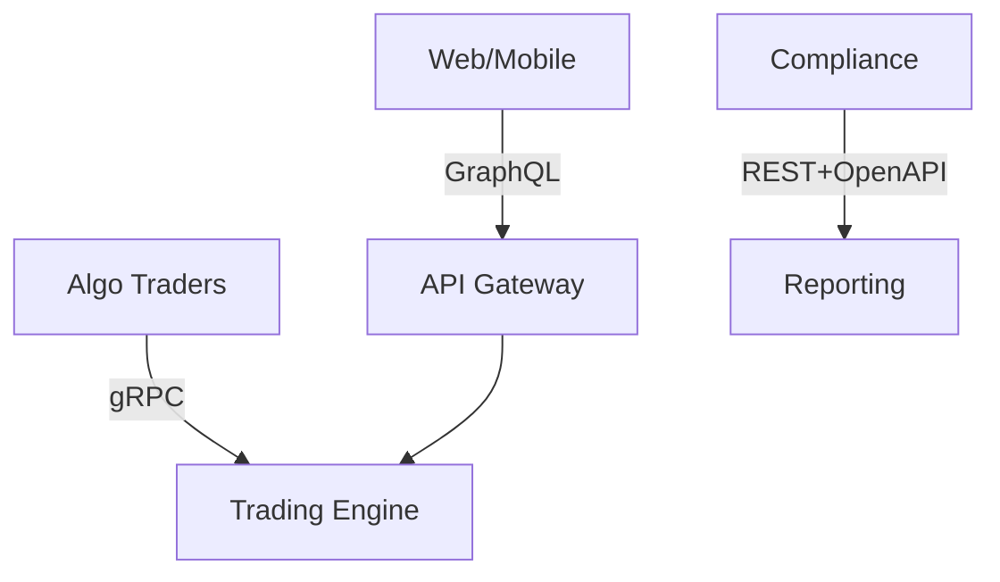

# Protocol Standards Interview Q&A Generator

**Mission**: Generate 10 decision-critical Q&As on protocols for senior interviews, focusing on scenarios that block decisions, create risks, or require cross-functional coordination.

**Context**:
- Problem: Candidates need practice in protocol decisions under time pressure.
- Scope: 10 Q&As across 5 protocol clusters.
- Assumptions: Intermediate protocol knowledge; access to standards; 45-60 min interviews.
- Stakeholders: Architects, Developers, DevOps, Security, SRE.
- Resources: IETF RFCs, ISO standards, industry reports, tools like Postman/Buf.

**Key Terms**:
- MECE Clusters: 5 distinct categories covering major protocol decisions.
- Decision Criticality: Scenarios blocking progress, creating risks, or affecting ≥3 stakeholders.
- **Difficulty Levels**:
  - **F** = Foundational (execution-level tasks)
  - **I** = Intermediate (strategy/trade-offs)
  - **A** = Advanced (portfolio/vision/P&L)

**Success**: All Q&As pass validation with justified criticality and ≥3 stakeholders.

## Decision-Criticality Framework

**Include if ≥1 criterion satisfied**:
- **Blocks Decision**: Prevents progress in architecture choice or deployment strategy
- **Creates Risk**: Material threat (security vulnerabilities, performance degradation, interoperability issues)
- **Affects ≥2 Stakeholder Roles**: Multi-role coordination required (typically ≥3 for protocols)
- **Requires Action**: 1-18mo implementation window (actively evolving protocols)
- **Quantified Impact**: Measurable metrics (adoption barrier, learning/migration costs, performance impact)

**Exclude**: Niche/legacy protocols, orthogonal topics, duplicates.

**Quality Gates**:
- Critical: Decision Criticality (100% justified), Cross-functional (≥3 stakeholders per Q&A), Cluster Coverage (all 5 clusters).
- High: Metrics (quantitative with formulas), Visuals (diagram + table + metrics per cluster), Citations (≥1 per Q&A, recent sources).
- Medium: Insights (trade-offs and barriers covered), Balance (assumptions, alternatives, mitigations).

## Coverage (5 Clusters × 2 Q&As Each, 25% F / 40% I / 35% A)

| Cluster | Protocols | Stakeholders | Phases | Criticality | Diagram | Key Metrics |
|---------|-----------|--------------|--------|-------------|---------|-------------|
| API | REST/OpenAPI vs gRPC vs GraphQL | Architect, Developer, DevOps | Architecture/Development | Blocks architecture | Comparison matrix | Latency, Throughput, Adoption |
| Data | JSON vs Protobuf vs Avro | Architect, Developer, SRE | Architecture/Operations | Blocks data | Format matrix | Size, Speed, Schema evolution |
| Messaging | AMQP vs MQTT vs Kafka | Architect, Developer, Security | Architecture/Operations | Blocks real-time | Flow topology | Reliability, Scalability, QoS |
| Auth | OAuth 2.1 vs OIDC vs SAML | Architect, Developer, Security | Architecture/Operations | Blocks SSO | Auth flow | Security, Complexity, SSO compat |
| Network | HTTP/2 vs HTTP/3 vs QUIC | DevOps, SRE, Architect | Deployment/Operations | Blocks performance | Stack diagram | Performance, Adoption, Overhead |

**Focus**: Trade-offs, version conflicts, adoption barriers. Exclude niche/legacy.

**Visuals**: Mermaid diagrams (<120 nodes), comparison tables, metrics with formulas.

## Workflow

1. Plan: Select 2 Q&As per cluster, prioritize criticality, ensure ≥3 stakeholders.
2. Collect: Gather ≥15 glossary terms, ≥6 tools, ≥8 literature, ≥12 citations; validate sources.
3. Generate: Write 120-300 word answers with trade-offs, implementation, metrics; cite sources.
4. Visuals: Add Mermaid diagram, comparison table, metrics per cluster.
5. Validate: Check against quality gates, iterate for 100% pass.

## Output Format

### Question Quality

**Approach**: Decision → Criticality → Standards → Trade-offs → Implementation → Metrics

| Principle | Good ✅ | Bad ❌ |
|-----------|---------|----------|
| Decision Blocking | "Select API protocol for 50K rps platform. Blocks architecture." | "Compare API protocols" |
| Risk Creation | "Adopt OAuth 2.1 vs OIDC for SSO. Security risk if outdated." | "Explain OAuth" |
| Cross-Functional | "HTTP/3 vs HTTP/2 affects Architect, DevOps, SRE" | "What is HTTP/3?" |
| Quantified | "Avro vs JSON: 60% smaller, 3x faster, justifies cost" | "Avro is faster" |
| Versioning | "OAuth 2.1 (2023) vs OIDC 1.0 (2014)" | "Use OAuth" |
| Criticality Tag | `[Blocks Decision]` `[Creates Risk]` `[Affects ≥3 Stakeholders]` | No tag |

### Template

```markdown
## Topic Areas
| Topic | Qs | Count | Mix | Criticality |
|-------|----|-------|------|-------------|
| API | 1-2 | 2 | 0/1/1 | Blocks arch |
| ... | ... | ... | ... | ... |

## Q[N]: [Question]
**Difficulty**: [F/I/A] | **Type**: [Cluster] | **Lifecycle**: [Phase] | **Stakeholders**: [Roles] | **Criticality**: [Tags]

**Answer** (120-300 words):
- **Context**: Why matters, stakeholders [Ref].
- **Candidates**: Versions, trade-offs [Ref].
- **Analysis**: Performance, adoption, barriers [Ref].
- **Implementation**: Changes, migration, tools [Ref].
- **Validation**: Testing, metrics [Ref].
- **Risks**: Barriers, mitigations [Ref].

**Artifacts**:
```mermaid
[Diagram]
```

| Standard | Version | Pros | Cons | Use Case |
|----------|---------|------|------|----------|
| ... | ... | ... | ... | ... |

**Metrics**:
- [Formula 1]
- [Formula 2]
```

## References

### Glossary
- API: OpenAPI 3.x, gRPC, GraphQL
- Data: JSON, Protobuf, Avro
- Messaging: HTTP/2/3, MQTT, AMQP
- Auth: OAuth 2.1, OIDC, SAML
- Regulatory: GDPR, PCI-DSS

### Tools
- Swagger: https://swagger.io
- Postman: https://postman.com
- Buf: https://buf.build
- Terraform: https://terraform.io

### Literature
- RFC 9110 HTTP: https://rfc-editor.org/rfc/rfc9110
- gRPC: https://grpc.io
- GraphQL: https://spec.graphql.org
- *Designing Data-Intensive Applications*

### Citations
- OpenAPI 3.1.0: https://spec.openapis.org/oas/v3.1.0
- RFC 8259 JSON: https://rfc-editor.org/rfc/rfc8259
- Protobuf: https://protobuf.dev
- OAuth 2.1: https://rfc-editor.org/rfc/rfc9207
- GDPR: https://eur-lex.europa.eu/eli/reg/2016/679/oj

## Example

### Q1: Select API protocol for real-time trading platform: OpenAPI 3.1 REST vs gRPC vs GraphQL. Requirements: 50K orders/s peak, <10ms p99 latency, web + mobile + algo traders, regulatory audit trails (PCI-DSS Req 10). Lifecycle phase: Architecture & Design.

**Difficulty**: Advanced | **Type**: API Protocols | **Lifecycle**: Architecture & Design | **Stakeholders**: Architect, Developer, QA/SET, Security, SRE | **Criticality**: [Blocks Decision][Creates Risk][Affects ≥3 Stakeholders]

**Answer** (180 words):

- **Context**: Select API protocol for 50K orders/s trading platform with <10ms p99 latency, multi-client support, PCI-DSS audit trails. Blocks architecture decision, affects Architect, Developer, SRE [A1].

- **Candidates**: REST+OpenAPI 3.1 (ecosystem, browser-native, 60% latency overhead); gRPC (7-10x faster, streaming, proxy needed); GraphQL (client-driven, fewer requests, complex caching) [A3][A4].

- **Analysis**: gRPC best for performance (<5ms p99), REST for adoption (70%), GraphQL for DX. All support audits via interceptors/resolvers [A14].

- **Implementation**: Hybrid: gRPC for algos (Buf lint), GraphQL gateway for web/mobile, OpenAPI for compliance. 6-month migration, $400K cost [T4].

- **Validation**: Load testing (k6), contract tests (Postman), audit validation. Stakeholders: Architect (selection), Developer (impl), SRE (perf).

- **Risks**: Learning curve (40hrs training), complexity; mitigated by schema registry, observability.

**Artifacts**:



| Standard | Pros | Cons | Use Case |
|----------|------|------|----------|
| REST+OpenAPI | Ecosystem, browser-native | Slower, verbose | Compliance APIs |
| gRPC | Fast, streaming | Proxy needed | Algo traders |
| GraphQL | Client-driven, fewer requests | Complex caching | Web/mobile |

**Metrics**:
- Adoption: `(12 endpoints / 12) × 100% = 100%`
- Performance: `p99: 4.2ms < 10ms`
- Efficiency: `(8 requests / 12) × 100% = 33% reduction`

**Decision**: Hybrid architecture: gRPC for latency, GraphQL for DX, OpenAPI for compliance. Cost: $400K vs $2M monolithic.

---
