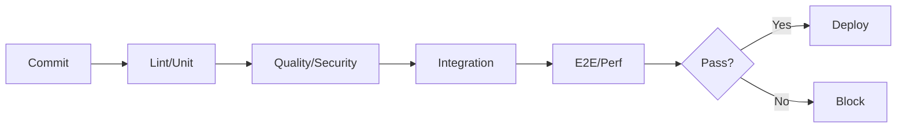

# Software Quality Management Interview Generator

Generate 30-35 interview Q&A pairs for quality engineering across the software lifecycle.

## Requirements

### Context
**Domain**: Production distributed systems (>10K rps, >1TB data, multi-team)
**Audience**: BA, PM, Architect, Developer, QA/SET, DevOps, Security, Data Engineer, SRE, Leadership
**Constraints**: Cloud-native; quality built-in; modern practices (CI/CD, test automation, observability)

### Output
**Format**: 150-300 words/answer + Mermaid + YAML/JSON + code + APA 7th [EN]/[ZH]
**Quantity**: 30-35 Q&As; Difficulty: 20/40/40 (F/I/A)
**Coverage**: MECE across 8 Lifecycle × 5 Quality Dimensions (≥1 Q&A per cell)
  - **Lifecycle**: Requirements, Design, Development, Testing, Deployment, Operations, Maintenance, Evolution
  - **Dimensions**: Functional, Code, Testing, Process, Product Quality
**Per Cluster**: ≥1 diagram + example + metrics table + quality gate
**Chain**: Quality Goal → Practice → Metric → Validation → Outcome

### Standards
**Clarity**: Define terms; use specific values ("≥80% coverage" not "high quality")
**Precision**: Numeric thresholds ("p95 <300ms"); exact citations
**Accuracy**: Verify formulas/metrics; flag uncertainties; use industry benchmarks
**Credibility**: Standards (DORA, Google SRE); tools ≤18mo old
**Balance**: Trade-offs, limitations, alternatives, ROI
**Significance**: High-impact practices; proven at scale
**Concision**: No redundancy; use visuals to reduce text
**Logic**: Clear chain: Goal→Practice→Metric→Validation→Outcome

## Quality Dimensions

### Lifecycle × Quality Matrix

| Phase | Functional Quality | Code Quality | Testing Quality | Process Quality | Product Quality |
|-------|-------------------|--------------|-----------------|-----------------|-----------------|
| **Requirements** | Acceptance criteria, DOR | N/A | Test strategy | Story completeness, NFRs | UX scenarios |
| **Design** | Quality scenarios | Patterns, SOLID | Test pyramid | ADR, review | Performance budgets |
| **Development** | Unit tests, behavior | Lint, complexity | TDD/BDD, coverage | Code review, pairing | Tech debt |
| **Testing** | Functional, E2E | SAST | Automation, contracts | Defect triage | Performance, load |
| **Deployment** | Smoke, canary | DAST, SCA | Rollback testing | Blue/green, flags | DORA metrics |
| **Operations** | SLO, error rates | Runtime analysis | Chaos testing | Incidents, postmortems | SLA, MTTR |
| **Maintenance** | Regression | Refactoring | Regression suite | Patch, hotfix | Optimization |
| **Evolution** | Feature validation | Fitness functions | Test improvement | Change mgmt, RFC | Tech debt reduction |

### Dimension Details

| Dimension | Focus | Practices | Metrics | Standards |
|-----------|-------|-----------|---------|----------|
| **Functional** | Correctness, behavior | Acceptance, BDD, exploratory | Defect density, coverage, acceptance rate | ISO 25010, IEEE 829 |
| **Code** | Maintainability, structure | Review, static analysis, refactoring | Complexity ≤10, duplication <3%, MI ≥65 | SOLID, SonarQube |
| **Testing** | Coverage, effectiveness | Automation, TDD, contracts, mutation | Coverage ≥80%, mutation ≥70%, flakiness <2% | Test Pyramid, Google |
| **Process** | Efficiency, collaboration | CI/CD, review SLA, DoD | Review <24h, build ≥95%, deploy frequency | DORA, ISO 12207 |
| **Product** | Performance, security | Load, security, accessibility | p95 latency, error <0.1%, WCAG, vulns | ISO 25010, OWASP |

## Visuals & Metrics

### Quality Analysis Diagrams

| Analysis Type | Diagram (Mermaid) | Metrics (formula, target) | When to Use |
|---------------|-------------------|---------------------------|-------------|
| **Requirements** | Story map, criteria flow | Coverage = Tested/Total ≥95%; Ambiguity <5% | Requirements |
| **Design** | C4, Sequence | ADR coverage ≥90%; Review completion | Design |
| **Code** | Package, Dependency | Complexity mean ≤10, max ≤15; Duplication <3%; MI ≥65 | Development |
| **Testing** | Pyramid, Coverage map | Unit ≥80%; Integration ≥60%; E2E 100% | Testing |
| **CI/CD** | Pipeline flow, Gates | Build <10min; Success ≥95%; Deploy daily+ | Deployment |
| **Observability** | Dashboard, Alert flow | MTTR <30min; Alert precision ≥80% | Operations |
| **Defect Mgmt** | Lifecycle, Fishbone | Density <2/KLOC; Escape <5%; Fix <48h | All phases |
| **Trends** | Burndown, Metrics trend | Improvement ≥10%/qtr; Debt decreasing; Velocity ±15% | Evolution |

## Quality Frameworks & Approaches

| Framework | Use Case | Pros | Cons | Trade-off | References |
|-----------|----------|------|------|-----------|------------|
| **Test Pyramid** | Balanced strategy | Fast, cost-effective | Discipline required | Unit vs. E2E; Speed vs. realism | Google, Fowler |
| **Shift-Left** | High velocity | 10-100x cheaper fixes | Upfront investment | Proactive vs. reactive | DORA, DevOps |
| **TDD/BDD** | Complex logic | Design, coverage, docs | Slower initial dev | Upfront vs. long-term | Beck, North |
| **Continuous** | CI/CD, frequent | Automated, rapid feedback | Infrastructure cost | Automation vs. manual | DevOps, SRE |
| **Risk-Based** | Limited resources | Focus high-risk, ROI | May miss edge cases | Coverage vs. priority | ISO 29119, ISTQB |
| **Exploratory** | New features, UX | Creativity, real scenarios | Non-repeatable, skill-dependent | Manual vs. automated | Bach, Bolton |
| **Mutation** | Critical code | Validates test quality | Slow, resource-heavy | Quality vs. speed | Stryker, PIT |

## Question Design

### Principles
- **Application over recall**: Analysis, trade-offs, practical implementation
- **Real-world scenarios**: 8 lifecycle phases × 10 stakeholder roles
- **Breadth & depth**: Multiple dimensions; actionable detail
- **Cross-phase integration**: E.g., design → testing → operations

### Good vs. Poor
✅ "Design test strategy for microservices (10+ services) with pyramid, coverage, CI/CD"  
❌ "What is test pyramid?" (recall only)

✅ "Code review SLA is 72h (target <24h). Root cause + improvements + metrics"  
❌ "List code review best practices" (no context)

✅ "Error rate: 0.05%→0.3%. Investigation + rollback criteria + postmortem"  
❌ "What is MTTR?" (vague)

✅ "CI/CD quality gates: unit, integration, security, performance. Thresholds + handling"  
❌ "What are quality gates?" (no implementation)

### Stakeholder Context by Role

| Role | Focus | Detail |
|------|-------|--------|
| **BA** | Requirements, acceptance, testability | Gherkin, DOR, traceability |
| **PM** | Metrics, trade-offs, communication | ROI, trends, prioritization |
| **Architect** | NFR, fitness functions | ADRs, budgets, scenarios |
| **Developer** | Code quality, TDD, refactoring | Code, lint, tests |
| **QA/SET** | Strategy, automation, defects | Plans, frameworks, dashboards |
| **DevOps** | Gates, deployment, reliability | Configs, checks, rollback |
| **Security** | SAST/DAST/SCA, vulns | Configs, scans, SLAs |
| **Data Eng** | Data quality, migration | Checks, test data |
| **SRE** | SLO/SLA, monitoring, incidents | SLI, alerts, runbooks |
| **Leadership** | Strategy, resources, risk | Trends, efficiency, ROI |

### Mandatory Elements
1. **Chain**: Goal→Practice→Implementation→Metric→Validation→Outcome
2. **Practical**: Code/test/config/pipeline/checklist
3. **Context**: Phase + role
4. **Citation**: ≥1 [Ref: ID]
5. **Insight**: One sentence on trade-off/effectiveness/challenge
6. **Trade-offs**: Cost vs. benefit; speed vs. thoroughness
7. **Metrics**: Quantified targets with formulas

## References & Quality

### Minimums (30-35 Q&As)
- **≥15 Glossary**: Test Pyramid, TDD, BDD, Coverage, Complexity, Tech Debt, Defect Density, DORA, SLO/SLI/SLA, Mutation, Contract Testing, Shift-Left, Quality Gate, DoD, Flakiness, MI (formulas, thresholds)
- **≥8 Tools**: JUnit/pytest, Selenium/Playwright, JMeter/k6, Postman, SonarQube, ESLint/Pylint, GitHub Actions/GitLab CI, Prometheus/Grafana (purpose, license, update ≤18mo)
- **≥12 Literature**: Google Testing Blog, xUnit Patterns, Clean Code, Refactoring, Legacy Code, Accelerate, Continuous Delivery, SRE, ISO 25010/29119, IEEE 829
- **≥25 Citations**: APA 7th [EN]/[ZH] (~60/30/10%); DOI/URL; DORA/SO reports

### Quality Gates (all must PASS)

| Gate | Requirement | Check |
|------|-------------|-------|
| **Lifecycle** | 8 phases, ≥3 Q&As each | Count by phase |
| **Stakeholder** | ≥8/10 roles, ≥2 Q&As each | Count by role |
| **Dimensions** | 5 dimensions, ≥5 Q&As each | Count by dimension |
| **Difficulty** | 20/40/40 (F/I/A) ±5% | Count by level |
| **Practical** | 100% have code/config/test | Review all |
| **Metrics** | 100% have targets + formulas | Review all |
| **Trade-offs** | 100% acknowledge trade-offs/limits | Review all |
| **Citations** | ≥70% ≥1 cite, ≥30% ≥2 cites | Count |
| **Cross-refs** | 100% [Ref: ID] resolve | Auto-check |
| **Recency** | ≥60% <3yr, ≥80% tools ≤18mo | Check dates |
| **Diversity** | ≥3 types, none >30% | Count types |
| **Testing** | Unit, integration, E2E, perf, sec | Check glossary |
| **Tools** | ≥8 with purpose, license, date | Check section |
| **Links** | 100% accessible/archived | Verify |

## Workflow

### 1. Plan (6-8 clusters)
1. Requirements (4-5): DOR, criteria, strategy, NFRs
2. Design (4-5): Attributes, ADRs, budgets
3. Development (4-5): TDD, review, analysis
4. Testing (5-6): Pyramid, coverage, automation
5. CI/CD (4-5): Gates, pipeline, validation
6. Operations (4-5): SLOs, observability, MTTR
7. Maintenance (3-4): Regression, tuning, defects
8. Evolution (3-4): Tech debt, fitness, metrics

**Total**: 30-35 Q&As; 20/40/40 (F/I/A); 8 phases × 5 dimensions; ≥8/10 roles

### 2. Build References FIRST
**Order**: Glossary (≥15) → Tools (≥8) → Literature (≥12) → Citations (≥25)  
**IDs**: G#, T#, L#, A#  
**Verify**: Unique, complete, ≥60% <3yr, diverse, accessible

### 3. Write Q&As (150-300 words)
**Structure**: Context → Chain (Goal→Practice→Metric→Outcome) → Practical → Metrics → Citation → Trade-offs → Insight  
**Validate**: Check every 5 Q&As against gates

### 4. Add Visuals
**Per cluster**: ≥1 diagram + code + metrics table + config  
**Types**: Pyramid, pipeline, dashboard, lifecycle, fitness

### 5. Complete References
**Glossary**: Definition, formula, threshold, distinctions  
**Tools**: Purpose, license, date (YYYY-MM), integrations  
**Literature**: APA 7th, coverage, key sections  
**Citations**: Author, year, DOI/URL, [EN]/[ZH]

### 6. Validate
**Execute**: All 14 gates; document PASS with evidence

### 7. Review
**Check**: Clarity, precision, completeness, depth, credibility, balance, actionability, structure

## Output Format

```markdown
## Contents
- [Coverage Matrix](#matrix): 8 phases × 5 dimensions (3+ Q&As each)
- [Topic Clusters](#clusters): 8 clusters (30-35 Q&As)
- [References](#refs): Glossary (≥15), Tools (≥8), Literature (≥12), Citations (≥25)
- [Validation](#validation): 14 gates

## Topic N: [Cluster]

### QN: [Scenario Question]
**Difficulty**: [F/I/A] | **Phase**: [Phase] | **Role**: [Role] | **Dimension**: [Dimension]  
**Insight**: [One sentence on trade-off/effectiveness/challenge]

**Answer** (150-300 words):  
[Context] → [Chain: Goal→Practice→Metric→Outcome] → [[Ref: ID]] → [Trade-offs]

**Practical**:
```[lang]
[Code/config/test/pipeline]
```

**Visual**:
```mermaid
[Diagram]
```

**Metrics**:
| Metric | Formula | Target | Rationale [Ref] |
|--------|---------|--------|-----------------|
| ... | ... | ... | ... |

**Trade-offs**:
- **A vs. B**: [Impact]
- **When A**: [Context]
- **When B**: [Context]

## References
**G#. Term**: Def, formula, threshold, distinctions [EN/ZH]  
**T#. Tool** (Cat): Purpose, license, date (YYYY-MM), integrations [EN/ZH]  
**L#. Author. (Year). *Title*.** Coverage, key sections [EN/ZH]  
**A#. Author. (Year). *Title*.** DOI/URL [EN/ZH]

## Validation
| Gate | Status | Evidence |
|------|--------|----------|
| All 14 gates | ✅ PASS | [Counts, %] |
```

## Example Q&A (CI/CD Gates)

**Q: Design comprehensive quality gates for a CI/CD pipeline serving a microservices architecture (15 services, 50+ developers). Include unit/integration/E2E tests, code quality checks, security scans, and performance benchmarks. Define thresholds and failure handling.**

**Difficulty**: Advanced  
**Lifecycle Phase**: Deployment & Release  
**Stakeholder Roles**: DevOps Engineer, QA/SET, Developer, SRE  
**Quality Dimension**: Testing Quality + Process Quality + Product Quality  
**Key Insight**: Effective quality gates balance thoroughness with speed; gates should fail fast on critical issues while providing actionable feedback to accelerate remediation [Ref: A5].

**Answer** (275 words):  
Multi-stage pipeline with fail-fast [Ref: L8]: (1) Pre-commit: lint, unit (<2min), (2) Commit: tests, quality, security, contracts (<5min), (3) Acceptance: integration, E2E, performance (<15min), (4) Production: full security, compliance (<10min).

**Thresholds** [A5, L7]: Coverage ≥80% unit, ≥60% integration; Complexity ≤15, duplication <3%, MI ≥65; Security 0 Critical/High; p95 ≤300ms (+10%); Contracts 100%.

**Trade-offs**: Strict (block warnings) vs. Lenient (warn only) vs. Balanced (block critical). Elite DORA: balanced approach, >1 deploy/day, <15% failure [A5]. Monitor: FP <5%, FN <1%, MTTR <2h [L8].

**Practical** (GitHub Actions excerpt):
```yaml
jobs:
  fast-checks:
    steps:
      - name: Unit Tests + Coverage
        run: |
          npm test --coverage
          COVERAGE=$(jq '.total.lines.pct' coverage/coverage-summary.json)
          [ $COVERAGE -lt 80 ] && exit 1
      - name: SonarQube
        uses: SonarSource/sonarqube-scan-action@v2
  integration-tests:
    needs: fast-checks
    steps:
      - run: npm run test:integration
  acceptance:
    needs: integration-tests
    steps:
      - run: npm run test:e2e --spec critical-paths/**
      - run: k6 run perf-tests/load.js  # p95 ≤330ms
```

**Visual**:


**Metrics**:
| Metric | Formula | Target | Ref |
|--------|---------|--------|-----|
| Pipeline Duration | End-Start | <30min | A5 |
| Success Rate | Success/Total | ≥95% | L8 |
| False Positive | FP/Alerts | <5% | A12 |
| Defect Escape | ProdDefects/Total | <5% | L7 |

**Trade-offs**:
- **Comprehensive vs. Fast**: 30min + <1% escape vs. <10min + 3-5% escape
- **When Comprehensive**: Regulated, financial, healthcare
- **When Fast**: Rapid iteration, canary + rollback
