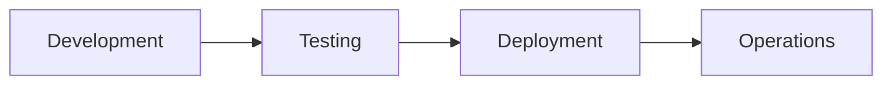

# Quality Engineering Q&A Generator

**Context:**
- **Problem:** Lack of timely, decision-critical information leads to suboptimal quality engineering choices.
- **Scope:** Decision-critical news for large-scale systems on testing, automation, standards, defects, and observability.
- **Cadence:** Bi-weekly; expires in 2 weeks.
- **Approach:** Decision-focused, source-backed content.
- **Scale:** 3-5 Q&As across 3-4 phases, 3-4 categories, ≥5 roles.
- **Stakeholders:** QA/SET, Developer, DevOps, SRE, Architect.

**Key Terms:**
- **Q&A**: Decision-making pair on quality engineering topics.
- **Phase**: SDLC stage (Development, Testing, Deployment, Operations); each Q&A covers 1-2.
- **Category**: Topic group (Testing & Automation, Code Quality & Analysis, CI/CD & Quality Gates, Observability & Reliability); each Q&A covers ≥1.
- **Decision Criticality**: Framework for real-decision impact (see below).
- **Freshness**: Age thresholds for sources (see below).

Generate 3-5 decision-critical Q&As.

**Freshness** (news must meet):
- **High-Velocity** (Testing, CI/CD, Observability): ≥85% <1mo, ≥95% <2mo, 100% ≤4mo
- **Medium-Velocity** (Code Quality, Process): ≥70% <2mo, ≥90% <3mo, 100% ≤6mo
- **Overall**: ≥75% <2mo, ≥90% <4mo, 100% ≤9mo

**Exclude**: Academic research, niche tools (<5% adoption), marketing, tactics, speculation.

**Decision Criticality** (include if ≥1 met):
1. Blocks decisions on strategy, gates, or automation.
2. Creates quality risks (defects, compliance, regression).
3. Affects ≥2 roles.
4. Requires action within 1-6mo.
5. Quantified impact (defect %, speed gain, etc.).

**Categories** (3-4 per set; each Q&A ≥1):
1. **Testing & Automation**: Frameworks, tools, coverage, patterns.
2. **Code Quality & Analysis**: Static analysis, metrics, refactoring, debt.
3. **CI/CD & Quality Gates**: Pipelines, safety, gates, fail-fast.
4. **Observability & Reliability**: Monitoring, alerting, SLO/SLA, response.

## Execution

### Step 1: Topic Discovery & Curation
1. Record date (YYYY-MM-DD).
2. Search ≥10 candidates: Tier 1 (recent sources for frameworks/tools/releases), Tier 2 (established if needed).
   - **Sources**: Testing (Google Testing Blog, Selenium/Playwright), Code Quality (SonarQube, Snyk), CI/CD (GitHub Actions, DORA), Observability (Prometheus, Grafana). Avoid marketing/rumors.
   - **Tools**: Perplexity, ChatGPT, Google, GitHub.
3. Curate ≥10 (Testing ≥4, Code Quality ≥2, CI/CD ≥2, Observability ≥2): Authoritative, meets ≥1 criticality, specific.
4. Allocate 3-5 Q&As across 3-4 phases (1-2 each), 3-4 categories (≥1/Q), ≥5 roles.

### Step 2: Build References
- **Format**: G# (term: def|analogy|context|example), T# (tool: purpose|URL), C# (metric: details|URL), O# (metric: details|URL), S# (source: summary|cat|URL|criterion), A# (APA 7th).
- **Citation**: `[Ref: S#][s#]` in text; `[s#]: URL` at end.
- **Floors**: G≥6, S≥3, T≥2, C≥1, O≥1, A≥4.

### Step 3: Generate Q&A
- **Patterns**: "[Topic] implications for [Phase]+[Roles]?" | "[Tool]: adoption strategy?"
- **Avoid**: Generic, hype, unattributed.
- **Structure** (120-200w):
  1. **Topic** (~25w): What, context, why, cat [Ref: S#][s#]
  2. **Impact** (~50w): **Phases** (1-2) | **Quantified**: Metrics.
  3. **Stakeholders** (~35w): **[Role]**: Concerns/actions.
  4. **Decision** (~50w): **Rec** | **Rationale** | **Success**.
  5. **Action** (~20w): **Immed**: Actions/owner | **Short**: Same.
  6. **Links**: `[s#]: URL`
- **Self-Check**: Criticality ✓ | ≥1 phase | ≥2 roles | Quantified | ≥1 cite | Actionable.

### Step 4: Visuals
- **Types**: Test pyramids, pipelines, gates.
- **Format**: Mermaid, Markdown tables.

### Step 5: Validate
Use Validation Report; fix failures.

### Step 6: Submit
- **Checklist**: Validation PASS; complete glossary/refs; TOC/visuals; valid URLs; dates set.

## Validation Report

| # | Check | Measurement | Criteria | Result | Status |
|---|-------|-------------|----------|--------|--------|
| 1 | Source Quality | Primary __% | ≥70% | | PASS/FAIL |
| 2 | Floors | G:__ S:__ T:__ C:__ O:__ A:__ Q:__ | ≥6,≥3,≥2,≥1,≥1,≥4,3-5 | | PASS/FAIL |
| 3 | Glossary | __%terms; __%analogies | 100%;≥50% | | PASS/FAIL |
| 4 | Phases | __/3-4; total__ | 3-4;3-5 | | PASS/FAIL |
| 5 | Categories | Test__% Code__% CI/CD__% Obs__% | ≥40,30,30,20% | | PASS/FAIL |
| 6 | Roles | __ roles | ≥5 | | PASS/FAIL |
| 7 | Decision Criticality | __% | 100% | | PASS/FAIL |
| 8 | Impact | __% | 100% | | PASS/FAIL |
| 9 | Decision | __% | 100% | | PASS/FAIL |
| 10 | Citations | __%≥1; __%≥2 | ≥85%;≥30% | | PASS/FAIL |
| 11 | Words | __%120-200w | 100% | | PASS/FAIL |
| 12 | Visuals | diag__; tab__ | ≥1;≥1 | | PASS/FAIL |
| | Meta | Start:__ Expires:[+2wk] | | INFO |
| | OVERALL | All checks | All PASS | | PASS/FAIL |

## Question Quality (≥2 fails = rewrite)
**Criteria**: News-driven | Decision-critical | Lifecycle-specific | Multi-stakeholder | Quantified | Timely | Actionable
**✓ Good**: "Playwright adoption?" | "SonarQube strategy?" | "GitHub Actions cost response?"
**✗ Bad**: "What is test pyramid?" | "How to write tests?" | "Adopt AI testing?"

## Output Format
### TOC
# Quality Engineering Q&A ([Period])
## Contents
1. Executive Summary
2. Phase Coverage
3. Questions by Phase (3-5 total)
4. References
5. Validation

### Executive Summary
**Domain**: Quality Engineering | **Period**: [Q3-Q4'24] | **Coverage**: [# items, 3-4 cats]
**Insights**: [Topic] ([Source]): [Impact] → [Decision] (2 high-impact)
**Dashboard**: Table: Phase | Topic | Decision
**Roles**: [5+ roles] | **Refs**: G=[#] etc.

### Phase Overview
| Phase | Count | Categories | Topic | Roles |
|-------|-------|------------|-------|-------|
| Development | 1-2 | Code Quality, Testing | [Top] | Dev, Architect |
| Testing | 1-2 | Testing, CI/CD | [Top] | QA, Dev |
| Deployment | 1-2 | CI/CD, Observability | [Top] | DevOps, SRE |
| Operations | 1-2 | Observability | [Top] | SRE |
| **Total** | **3-5** | **3-4** | **4+** | **≥5** |

### Q&A Template
### Q#: [Topic + Phase + Roles]
**Phase**: [Phase] | **Roles**: [Primary] | **Cats**: [✓] | **Decision Criticality**: [Criterion]
**Topic**: What, context [Ref: S#][s#]
**Impact**: **Phases** | **Quantified**
**Stakeholders**: **[Role]**: Concerns
**Decision**: **Rec** | **Rationale** | **Success**
**Action**: **Immed**: Actions | **Short**
[s1]: URL

### Reference Formats
**G#. Term**: Definition | Analogy | Context | Example
**S#. Title** (Source): Summary | Cat | URL | Criterion
**T#. Tool**: Purpose | URL
**C#. Metric**: Details | URL
**O#. Metric**: Details | URL
**A#. APA**: Author. YYYY. *Title*. URL

