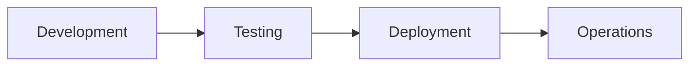

# Quality Engineering Q&A Generator (Minimal Viable)

**Context:**
- **Problem:** Quality engineering decisions often lack timely, decision-critical information, leading to suboptimal choices in testing strategies, automation, and quality gates.
- **Scope:** Generate 6-8 Q&As on quality engineering topics for production systems (>10K rps, >1TB data), focusing on testing frameworks, automation tools, quality standards, defect patterns, observability breakthroughs.
- **Constraints:** Bi-weekly cadence, 3-4h effort, expires 2 weeks from generation; token limits ~4K-8K.
- **Assumptions:** Users have basic QA knowledge; LLMs have domain expertise; sources are authoritative.
- **Scale:** 6-8 Q&As covering 3-4 phases, 3-4 categories, ≥5 roles.
- **Timeline:** Bi-weekly generation; immediate use; benefits accumulate over time.
- **Stakeholders:** QA/SET, Developer, DevOps, SRE, Architect.
- **Resources:** Perplexity, ChatGPT, Google, GitHub releases; no cost.

**Key Terms:**
- **Q&A**: Question and Answer pair on a quality engineering topic. Analogy: Like a targeted FAQ entry for decision-making, not general knowledge.
- **Phase**: Software development lifecycle stage (Development, Testing, Deployment, Operations). Relationship: Phases flow sequentially; each Q&A covers 1-2 phases. Analogy: Like stages in a manufacturing line.
- **Category**: Topic grouping (Testing & Automation, Code Quality & Analysis, CI/CD & Quality Gates, Observability & Reliability). Relationship: Categories are orthogonal; each Q&A covers ≥1 category. Analogy: Like departments in a company handling different responsibilities.
- **Decision Criticality**: Framework with 5 criteria ensuring topics impact real decisions (Blocks Decision, Creates Risk, Affects ≥2 Roles, Requires Action, Quantified Impact). Analogy: Like a priority filter for urgent vs. optional tasks.
- **Freshness**: Age thresholds for news sources (High-Velocity: ≥85% <1mo, Medium-Velocity: ≥70% <2mo). Analogy: Like checking expiration dates on perishable goods.



Generate 6-8 decision-critical Q&As on quality engineering topics—minimal viable tracking for informed decisions with limited time.

**Cadence**: Bi-weekly | 3-4h effort | **Expires**: 2 weeks from generation

**Freshness** (all news must meet these age thresholds):
- **High-Velocity** (Testing, CI/CD, Observability): ≥85% <1mo (≥30% 1-3d), ≥95% <2mo, 100% ≤4mo
- **Medium-Velocity** (Code Quality, Process): ≥70% <2mo (≥20% 1-3d), ≥90% <3mo, 100% ≤6mo
- **Overall**: ≥75% <2mo, ≥90% <4mo, 100% ≤9mo

**Scope**: Decision-critical quality topics only—testing frameworks, automation tools, quality standards, defect patterns, observability breakthroughs. For production systems (>10K rps, >1TB data).

**Exclude**: Academic research, niche tools (<5% adoption), vendor marketing, implementation tactics, nice-to-have trends, speculation.

**Decision Criticality Framework** (include if ≥1 criterion met):
1. **Blocks Decision**: Directly impacts testing strategy, quality gates, or automation roadmap
2. **Creates Risk**: Material quality threat (defect escape, compliance, performance regression)
3. **Affects ≥2 Core Roles**: Multi-stakeholder impact (QA + DevOps, Dev + SRE, etc.)
4. **Requires Action**: 1-6mo action window (not speculative)
5. **Quantified Impact**: Defect reduction %, test speed improvement, coverage gain, or MTTR reduction

**Categories** (3-4, each Q covers ≥1):
1. **Testing & Automation**: Test frameworks, automation tools, coverage strategies, defect patterns
2. **Code Quality & Analysis**: Static analysis, complexity metrics, refactoring tools, tech debt
3. **CI/CD & Quality Gates**: Pipeline tools, deployment safety, quality gates, fail-fast strategies
4. **Observability & Reliability** (optional): Monitoring, alerting, SLO/SLA, incident response

**Answer Structure** (120-200w): News (what, when, why) + impact (quantified, ≥2 phases, ≥2 roles) + decision (Adopt/Prioritize/Monitor/Defer/Skip + rationale) + timeline (immediate/short). Projections only if sourced.

## Requirements

**Q&A**: 6-8 total | 1-2/phase | 120-200w | 100% topic-driven | ≥85% ≥1 cite, ≥30% ≥2 cites | ≥1 category + impact + decision

**Phases** (3-4, 1-2 Q each): Development, Testing, Deployment, Operations (skip Requirements, Design, Maintenance, Evolution unless decision-critical)

**Category Coverage** (min): Testing ≥50%, Code Quality ≥40%, CI/CD ≥40%, Observability ≥25% (optional)

**Decision Criticality** (100%): Each Q must satisfy ≥1 of 5 criteria (Blocks/Risk/Roles/Action/Quantified)

**Stakeholders** (≥5 roles): Developer, QA/SET, DevOps, SRE, Architect (core roles only)

**References** (build before Q&A): G≥8 (100% terms used), T≥2-3 (testing tools), C≥2 (code quality), O≥2 (observability), S≥4-5 (sources/studies), A≥6 (APA 7th+tag)

**Visuals**: ≥2 diagrams + ≥1 table

**Quality Gates** (fail ANY = stop):
1. **Decision Criticality**: 100% satisfy ≥1 criterion (Blocks/Risk/Roles/Action/Quantified)
2. **Topic Relevance**: ≥85% cite ≥1 source (≥30% ≥2 cites); 0% marketing/speculation
3. **Impact**: 100% ≥2 phases + ≥2 roles + quantified
4. **Decision**: 100% decision + rationale + timeline
5. **Sources**: ≥3 types, max 50%/type; 100% URLs valid
6. **Actionability**: 100% concrete; 0% abstract

## Execution

### Step 1: Topic Discovery & Curation (Minimal)

1. **Record generation date (YYYY-MM-DD)—calculate all news ages from this.**

2. **Search** (≥12-15 candidates, tiered):

   **Tier 1** (Recent, search first): `"[Testing|QA|CI/CD|Code Quality] framework|tool|release|standard"` (recent sources)

   **Tier 2** (Established if insufficient): Same (established sources)

   **Sources** (whitelist, prioritize):
   - **Testing**: Google Testing Blog, Selenium/Playwright releases, TestCafe, Cypress, Playwright docs
   - **Code Quality**: SonarQube releases, Snyk, OWASP reports, GitHub Copilot quality studies
   - **CI/CD**: GitHub Actions, GitLab CI, CircleCI releases, DORA reports, deployment safety studies
   - **Observability**: Prometheus, Grafana, Datadog, New Relic releases, SRE best practices
   - **Avoid**: PR fluff, rumors, listicles, vendor marketing, academic papers, niche tools

   **Tools**: Perplexity ("past week"), ChatGPT ("latest"), Google (`after:DATE`), GitHub releases

3. **Curate** (≥12-15 candidates: Testing ≥5, Code Quality ≥3, CI/CD ≥3, Observability ≥2):
   - ✅ From authoritative sources
   - ✅ Whitelist OR primary source
   - ✅ Satisfies ≥1 Decision Criticality criterion
   - ✅ Specific details (names, numbers, metrics)
   - ✅ Not marketing/speculation

4. **Verify**: Check decision criticality; if fail, retry earlier tiers

5. **Allocate**: 6-8 Q × 3-4 phases (1-2 each) × 3-4 categories (≥1/Q) × ≥5 roles

### Step 2: Build References (Minimal)

**Format**: G# (term, def+analogy, context) | T# (tool, purpose, URL) | C# (code quality, metric, URL) | O# (observability, metric, URL) | S# (source, topic, URL) | A# (APA 7th+tag)

**Citation**: Markdown reference links: `[Ref: S1][s1]` in text, `[s1]: URL` at answer end

**Floors**: G≥8 (100% terms used), S≥4-5, T≥2-3, C≥2, O≥2, A≥6

**Glossary** (only terms used in Q&As):
- **Coverage**: Only terms/acronyms used (TDD, BDD, Coverage, MTTR, SLO, etc.)
- **Clarity**: Plain language, avoid jargon
- **Analogies**: 1-2 real-world comparisons per term
- **Context**: Why it matters for decisions
- **Examples**: Real numbers

**Source Entry**: **Title** (Source): Summary | Cat | URL | Decision Criticality criterion

### Step 2.5: Opportunistic Refresh (optional, skip default)

**Trigger**: Major development affecting ≥2 Q&As (rare)

**Action**: Quick search → Add 1-2 items → Adjust 1-2 Qs → Document

### Step 3: Generate Q&A (batch 2-3, self-check each)

**Before**: Review glossary. Track ALL terms used.

**Patterns**: "[Topic] implications for [Phase]+[Roles]?" | "[Tool]: adoption strategy?" | "[Defect Pattern]: response?" | "[Standard] vs [Current]: prioritize?"

**Avoid**: Generic questions, hype, unattributed claims, outdated topics, speculation

**Structure** (120-200w):
1. **Topic** (~25w): What, context, why, cat `[Ref: S#][s#]`
2. **Impact** (~50w): **Phases** (≥2) | **Quantified**: Defect %, speed gain, coverage %, MTTR reduction
3. **Stakeholders** (~35w): **[Role 1]**: Concerns, actions | **[Role 2]**: Same
4. **Decision** (~50w): **Rec**: Adopt/Prioritize/Monitor/Defer/Skip | **Rationale**: Why | **Success**: Targets
5. **Action** (~20w): **Immed (0-2wk)**: Actions+owner | **Short (2wk-2mo)**: Same
6. **Links**: Define at end: `[s1]: URL`

**Self-Check**: Source OK | Decision Criticality ✓ | ≥2 phases | ≥2 roles | Decision clear | 120-200w | Quantified | ≥1 cite | 0% hype | 100% actionable | All terms in glossary

### Step 4: Visuals (≥2 diagrams + ≥1 table)

**Types**: Test pyramids, pipeline flows, quality gates, decision trees, metrics dashboards

**Format**: Mermaid (flows), Markdown tables (data), 2×2 matrices

**Refs**: 100% resolve | Complete | G≥8 (100% terms used) | S≥4-5 | T≥2-3 | C≥2 | O≥2 | A≥6

**Decision**: 100% decision + rationale + criteria + timeline

**Stakeholders**: ≥5 roles | Actions + authority

### Step 5: Validate (fail ANY = stop, fix, re-run ALL)

**Quantitative**: Floors met | Glossary 100% | 3-4 phases | Categories per % | ≥5 roles | Citations OK | 5 word samples 120-200w | Visuals OK | Decision 100% | Timeline 100%

**Qualitative**: Topic relevance, 0% hype | Decision Criticality 100% | Impact 100% ≥2 phases+roles+quantified | Decision 100% | Source diversity ≥3 types | Per-phase ≥1 topic+analysis | Links valid | Quantified 100% | Actionable 100% | Evidence 100% | Search documented

### Step 6: Submit

**Checklist** (all YES): Validations PASS | Floors met | Glossary complete (100% terms, ≥50% analogies) | TOC complete | 0 placeholders | Visuals OK | Citations OK | Impact OK | Decision OK | Timeline OK | Categories OK | Roles OK | Evidence 100% | URLs valid | **Dates (gen + expire=gen+2wk)** | Search documented

## Validation Report (Minimal)

| # | Check | Measurement | Criteria | Result | Status |
|---|-------|-------------|----------|--------|--------|
| 1 | **Source Quality** | Primary sources: __% | ≥70% | | PASS/FAIL |
| 2 | **Floors** | G:__ S:__ T:__ C:__ O:__ A:__ Q:__ | ≥8,≥4-5,≥2-3,≥2,≥2,≥6,6-8 | | PASS/FAIL |
| 3 | **Glossary** | __%terms; __%analogies | 100%;≥50% | | PASS/FAIL |
| 4 | **Phases** | __/3-4 (1-2Q each); total__ | 3-4/3-4;6-8 | | PASS/FAIL |
| 5 | **Categories** | Test__% Code__% CI/CD__% Obs__% | ≥50,40,40,25% | | PASS/FAIL |
| 6 | **Roles** | __ roles | ≥5 | | PASS/FAIL |
| 7 | **Decision Criticality** | __% satisfy ≥1 criterion | 100% | | PASS/FAIL |
| 8 | **Impact** | __% ≥2phases+2roles+quantified | 100% | | PASS/FAIL |
| 9 | **Decision** | __% decision+rationale+criteria | 100% | | PASS/FAIL |
| 10 | **Citations** | __%≥1cite; __%≥2cites | ≥85%;≥30% | | PASS/FAIL |
| 11 | **Words** | 5 samples: __%120-200w | 100% | | PASS/FAIL |
| 12 | **Visuals** | diag__; tab__ | ≥2;≥1 | | PASS/FAIL |
| | **Meta** | Start:__ End:__ Expires:[+2wk] | | INFO |
| | **Source Dist** | Primary__% Secondary__% Tertiary__% | Balanced | | INFO |
| | **OVERALL** | All checks | All PASS | | PASS/FAIL |

## Question Quality (≥2 fails of 7 = rewrite)

**Criteria**: News-driven (per freshness) | Decision-critical (≥1 criterion) | Lifecycle-specific (1-2 phases) | Multi-stakeholder (≥2 roles) | Quantified impact | Timely | Actionable

**✓ Good**: "Playwright: test automation adoption?" | "SonarQube: code quality strategy?" | "GitHub Actions cost implications: CI/CD response?" | "Defect escape patterns: testing roadmap?"

**✗ Bad**: "What is test pyramid?" (generic) | "How to write tests?" (overview) | "Adopt AI testing?" (no context) | "Python 3.13" (tech ops) | "Competitor launched feature" (no decision)

## Output Format (Minimal)

### A. TOC

```markdown
# Quality Engineering Q&A ([Period])

## Contents
1. Executive Summary (Insights | Dashboard)
2. Phase Coverage (3-4 phases)
3. Questions by Phase: Development (Q1-Q2) | Testing (Q3-Q4) | Deployment (Q5-Q6) | Operations (Q7-Q8)
4. References: G (G1-G8) | S (S1-S5) | T (T1-T3) | C (C1-C2) | O (O1-O2) | A (A1-A6)
5. Validation (12 checks)
```

### B. Executive Summary

**Domain**: Quality Engineering | **Period**: [Q3-Q4'24] | **Coverage**: [# items, 3-4 cats]

**Insights**: 1. [Topic] ([Source]): [Impact] → [Decision] → [Timeline] (2 high-impact)

**Dashboard**: [Table: Phase | Topic | Decision | Timeline]

**Roles**: [5+ roles] | **Refs**: G=[#] S=[#] T=[#] C=[#] O=[#] A=[#]

### C. Phase Overview

| # | Phase | Count | Categories | Topic | Roles |
|---|-------|-------|------------|-------|-------|
| 1 | Development | 1-2 | Code Quality, Testing | [Top] | Dev, Architect |
| 2 | Testing | 1-2 | Testing, CI/CD | [Top] | QA/SET, Dev |
| 3 | Deployment | 1-2 | CI/CD, Observability | [Top] | DevOps, SRE |
| 4 | Operations | 1-2 | Observability, Code Quality | [Top] | SRE, DevOps |
| | **Total** | **6-8** | **3-4** | **4+** | **≥5** |

### D. Q&A Template

```markdown
### Q#: [Topic Question + Phase + Roles]

**Phase**: [Phase] | **Roles**: [Primary, Secondary] | **Cats**: [✓] | **Decision Criticality**: [Criterion]

**Topic** (~25w): What, context, why, cat [Ref: S#][s#]

**Impact** (~50w): **Phases** (≥2) | **Quantified**: Defect %, Speed gain, Coverage %, MTTR reduction

**Stakeholders** (~35w): **[Role 1]**: Concerns, actions | **[Role 2]**: Same

**Decision** (~50w): **Rec**: Adopt/Prioritize/Monitor/Defer/Skip | **Rationale**: Why | **Success**: Targets

**Action** (~20w): **Immed (0-2wk)**: Actions+owner | **Short (2wk-2mo)**: Same

[s1]: URL
---
```

### E. Reference Formats

**G#. Term (Acronym)**: Definition | Analogy | Context | Example

**S#. Title** (Source): Summary | Cat | URL | Decision Criticality criterion

**T#. Tool** (Category): Purpose | URL

**C#. Code Quality Metric** (Source): Details | URL

**O#. Observability Metric** (Source): Details | URL

**A#. APA 7th [Tag]**: Author/Org. YYYY, Mon DD. *Title*. Pub. URL [Tag]

