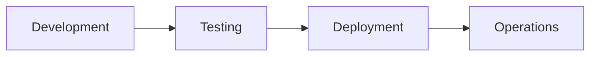

# Quality Engineering Q&A Generator

**Context:**
- **Problem:** Quality engineering decisions often lack timely, decision-critical information, leading to suboptimal choices in testing strategies, automation, and quality gates.
- **Scope:** Decision-critical quality engineering news for large-scale production systems, focusing on testing frameworks, automation, quality standards, defect patterns, and observability.
- **Cadence:** Bi-weekly, content expires 2 weeks from generation.
- **Assumptions:** Assumes basic familiarity with QA concepts; content is decision-focused, backed by sources.
- **Scale:** 4-6 Q&As covering 3-4 phases, 3-4 categories, ≥5 roles.
- **Stakeholders:** QA/SET, Developer, DevOps, SRE, Architect.
- **Tools:** Perplexity, ChatGPT, Google, GitHub releases.

**Key Terms:**
- **Q&A**: Question and Answer pair on a quality engineering topic for decision-making.
- **Phase**: Software development lifecycle stage (Development, Testing, Deployment, Operations). Each Q&A covers 1-2 phases.
- **Category**: Topic grouping (Testing & Automation, Code Quality & Analysis, CI/CD & Quality Gates, Observability & Reliability). Each Q&A covers ≥1 category.
- **Decision Criticality**: Framework ensuring topics impact real decisions (see below).
- **Freshness**: Age thresholds for news sources (see below).

Generate 4-6 decision-critical Q&As on quality engineering topics for informed decisions.

**Freshness** (all news must meet these thresholds):
- **High-Velocity** (Testing, CI/CD, Observability): ≥85% <1mo, ≥95% <2mo, 100% ≤4mo
- **Medium-Velocity** (Code Quality, Process): ≥70% <2mo, ≥90% <3mo, 100% ≤6mo
- **Overall**: ≥75% <2mo, ≥90% <4mo, 100% ≤9mo

**Exclude**: Academic research, niche tools (<5% adoption), vendor marketing, implementation tactics, speculation.

**Decision Criticality Framework** (include if ≥1 criterion met):
1. **Blocks Decision**: Impacts testing strategy, quality gates, or automation roadmap
2. **Creates Risk**: Material quality threat (defect escape, compliance, performance regression)
3. **Affects ≥2 Core Roles**: Multi-stakeholder impact
4. **Requires Action**: 1-6mo action window
5. **Quantified Impact**: Defect reduction %, test speed improvement, coverage gain, or MTTR reduction

**Categories** (3-4, each Q covers ≥1):
1. **Testing & Automation**: Test frameworks, automation tools, coverage strategies, defect patterns
2. **Code Quality & Analysis**: Static analysis, complexity metrics, refactoring tools, tech debt
3. **CI/CD & Quality Gates**: Pipeline tools, deployment safety, quality gates, fail-fast strategies
4. **Observability & Reliability**: Monitoring, alerting, SLO/SLA, incident response

## Execution

### Step 1: Topic Discovery & Curation

1. Record generation date (YYYY-MM-DD) for age calculations.

2. Search (≥10 candidates, tiered):
   - **Tier 1**: Recent sources for "[Testing|QA|CI/CD|Code Quality] framework|tool|release|standard"
   - **Tier 2**: Established sources if insufficient

   **Sources** (prioritize):
   - Testing: Google Testing Blog, Selenium/Playwright releases
   - Code Quality: SonarQube, Snyk, OWASP
   - CI/CD: GitHub Actions, GitLab CI, DORA
   - Observability: Prometheus, Grafana, Datadog
   - Avoid: Marketing, rumors, niche tools

   **Tools**: Perplexity, ChatGPT, Google, GitHub

3. Curate (≥10 candidates: Testing ≥4, Code Quality ≥2, CI/CD ≥2, Observability ≥2):
   - Authoritative sources
   - Satisfies ≥1 Decision Criticality criterion
   - Specific details, not speculation

4. Allocate: 4-6 Q&As across 3-4 phases (1-2 each), 3-4 categories (≥1/Q), ≥5 roles

### Step 2: Build References

**Format**: G# (term, def+analogy, context) | T# (tool, purpose, URL) | C# (code quality, metric, URL) | O# (observability, metric, URL) | S# (source, topic, URL) | A# (APA 7th+tag)

**Citation**: `[Ref: S1][s1]` in text, `[s1]: URL` at end

**Floors**: G≥6, S≥3, T≥2, C≥1, O≥1, A≥4

**Glossary** (terms used in Q&As): Definition | Analogy | Context | Example

**Source Entry**: **Title** (Source): Summary | Cat | URL | Decision Criticality criterion

### Step 3: Generate Q&A

**Patterns**: "[Topic] implications for [Phase]+[Roles]?" | "[Tool]: adoption strategy?"

**Avoid**: Generic questions, hype, unattributed claims

**Structure** (120-200w):
1. **Topic** (~25w): What, context, why, cat [Ref: S#][s#]
2. **Impact** (~50w): **Phases** (1-2) | **Quantified**: Defect %, speed gain, etc.
3. **Stakeholders** (~35w): **[Role 1]**: Concerns, actions | **[Role 2]**: Same
4. **Decision** (~50w): **Rec**: Adopt/Prioritize/etc. | **Rationale** | **Success**
5. **Action** (~20w): **Immed**: Actions+owner | **Short**: Same
6. **Links**: `[s1]: URL`

**Self-Check**: Decision Criticality ✓ | ≥1 phase | ≥2 roles | Quantified | ≥1 cite | Actionable

### Step 4: Visuals

**Types**: Test pyramids, pipeline flows, quality gates

**Format**: Mermaid, Markdown tables

### Step 5: Validate

Use Validation Report to check requirements. Fix failures.

### Step 6: Submit

**Checklist**: Validation PASS; glossary/references complete; TOC/visuals generated; URLs valid; dates set.

## Validation Report

| # | Check | Measurement | Criteria | Result | Status |
|---|-------|-------------|----------|--------|--------|
| 1 | Source Quality | Primary __% | ≥70% | | PASS/FAIL |
| 2 | Floors | G:__ S:__ T:__ C:__ O:__ A:__ Q:__ | ≥6,≥3,≥2,≥1,≥1,≥4,4-6 | | PASS/FAIL |
| 3 | Glossary | __%terms; __%analogies | 100%;≥50% | | PASS/FAIL |
| 4 | Phases | __/3-4; total__ | 3-4;4-6 | | PASS/FAIL |
| 5 | Categories | Test__% Code__% CI/CD__% Obs__% | ≥40,30,30,20% | | PASS/FAIL |
| 6 | Roles | __ roles | ≥5 | | PASS/FAIL |
| 7 | Decision Criticality | __% | 100% | | PASS/FAIL |
| 8 | Impact | __% | 100% | | PASS/FAIL |
| 9 | Decision | __% | 100% | | PASS/FAIL |
| 10 | Citations | __%≥1; __%≥2 | ≥85%;≥30% | | PASS/FAIL |
| 11 | Words | __%120-200w | 100% | | PASS/FAIL |
| 12 | Visuals | diag__; tab__ | ≥1;≥1 | | PASS/FAIL |
| | Meta | Start:__ Expires:[+2wk] | | INFO |
| | OVERALL | All checks | All PASS | | PASS/FAIL |

## Question Quality (≥2 fails = rewrite)

**Criteria**: News-driven | Decision-critical | Lifecycle-specific | Multi-stakeholder | Quantified | Timely | Actionable

**✓ Good**: "Playwright adoption?" | "SonarQube strategy?" | "GitHub Actions cost response?"

**✗ Bad**: "What is test pyramid?" | "How to write tests?" | "Adopt AI testing?"

## Output Format

### TOC
# Quality Engineering Q&A ([Period])
## Contents
1. Executive Summary
2. Phase Coverage
3. Questions by Phase (4-6 total)
4. References
5. Validation

### Executive Summary
**Domain**: Quality Engineering | **Period**: [Q3-Q4'24] | **Coverage**: [# items, 3-4 cats]
**Insights**: [Topic] ([Source]): [Impact] → [Decision] (2 high-impact)
**Dashboard**: Table: Phase | Topic | Decision
**Roles**: [5+ roles] | **Refs**: G=[#] etc.

### Phase Overview
| Phase | Count | Categories | Topic | Roles |
|-------|-------|------------|-------|-------|
| Development | 1-2 | Code Quality, Testing | [Top] | Dev, Architect |
| Testing | 1-2 | Testing, CI/CD | [Top] | QA, Dev |
| Deployment | 1-2 | CI/CD, Observability | [Top] | DevOps, SRE |
| Operations | 1-2 | Observability | [Top] | SRE |
| **Total** | **4-6** | **3-4** | **4+** | **≥5** |

### Q&A Template
### Q#: [Topic + Phase + Roles]
**Phase**: [Phase] | **Roles**: [Primary] | **Cats**: [✓] | **Decision Criticality**: [Criterion]
**Topic**: What, context [Ref: S#][s#]
**Impact**: **Phases** | **Quantified**
**Stakeholders**: **[Role]**: Concerns
**Decision**: **Rec** | **Rationale** | **Success**
**Action**: **Immed**: Actions | **Short**
[s1]: URL

### Reference Formats
**G#. Term**: Definition | Analogy | Context | Example
**S#. Title** (Source): Summary | Cat | URL | Criterion
**T#. Tool**: Purpose | URL
**C#. Metric**: Details | URL
**O#. Metric**: Details | URL
**A#. APA**: Author. YYYY. *Title*. URL

