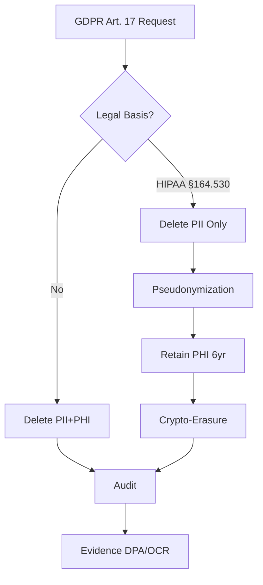

# Regulatory Compliance Interview Q&A Generator

## Purpose

Generate 25-30 senior-level Q&As mapping regulatory obligations → technical implementation, testing domain expertise and cross-functional coordination.

**Target**: Senior engineers, compliance officers, architects  
**Scope**: Privacy laws (GDPR, CCPA, PIPL, LGPD), sector regs (HIPAA, PCI-DSS, SOX), standards (ISO 27001/27701, SOC2, NIST CSF)  
**Stakeholders**: Legal, Compliance, Security, Architecture, Product, Executive, Audit  
**Constraints**: 150-300 words, evidence-based [Ref: ID], actionable (tools/metrics/frameworks)

---

## Specifications

### Coverage (MECE)

**Distribution**: 25-30 Q&As, 20% Foundational / 40% Intermediate / 40% Advanced, 6 clusters × 4-6 Q&As, ≥4 stakeholders per cluster

| Cluster | Focus | Stakeholders |
|---------|-------|--------------|
| **Compliance Modeling** | Framework mapping, gap analysis, control matrices | Legal, Compliance, Architecture |
| **Risk & Threat** | Threat modeling, risk quantification, attack vectors | Security, Executive, Architecture |
| **Privacy Engineering** | Data rights, consent, minimization, pseudonymization | Legal, Compliance, Product, Architecture |
| **Audit & Evidence** | Audit trails, evidence collection, certification | Compliance, Audit, Security |
| **Security Architecture** | Encryption, access control, data sovereignty, Zero Trust | Security, Architecture, Executive |
| **Remediation** | Gap closure, roadmaps, budget, cross-functional coordination | All 7 |

### Content Requirements

- **Regulatory Scope**: Privacy laws, sector regs, standards, data rights, breach notification, cross-border transfer, vendor risk
- **Framework Comparisons**: By jurisdiction (EU/US/APAC) and sector (financial/healthcare/tech); mandatory vs recommended; conflict resolution
- **Significance**: High-impact scenarios; exclude deprecated/rare edge cases; test judgment over memorization

### Visual Standards (Per Cluster: ≥1 Diagram + ≥1 Table + ≥1 Metric)

| Analysis Type | Diagram | Metric Formula | Standard |
|---------------|---------|----------------|----------|
| Compliance Modeling | Control matrix, Gap analysis | `(Implemented / Required) × 100%` | NIST SP 800-53, ISO 27001 |
| Risk & Threat | Threat model, Risk matrix | `Likelihood × Impact × Asset Value` | STRIDE, DREAD, NIST SP 800-30 |
| Privacy | Data flow, Consent flow | `(Explicit Consents / Total Users) × 100%` | GDPR Art. 25, Privacy-by-Design |
| Audit | Audit trail, Evidence mapping | `(Auditable Events / Critical Events) × 100%` | SOC2 CC4.1, ISO 19011 |
| Architecture | Reg→Control, Security arch | `Cost Avoided / (Initial + Ongoing) × 100%` | C4, UML, ArchiMate |
| Remediation | Roadmap, Gantt | `Initial + Ongoing + Penalty Risk` | NIST CSF |
| Coordination | RACI, Decision flow | `(Aligned / Total) × 100%` | RACI, DACI |

**Rendering**: Mermaid diagrams, inline `$formula$`, block `$$formula$$`  
**Standards**: BPMN (process), UML (structure), C4 (software), ERD/DFD (data), ArchiMate (enterprise)  
**Avoid**: Mega-diagrams (>120 nodes), mixed abstraction, missing rationale

### Quality Gates

**Minimums**: G≥18, T≥6, L≥8, A≥12, Q=25-30 (20/40/40 mix)

| # | Check | Target |
|---|-------|--------|
| 1 | Floors | G≥18, T≥6, L≥8, A≥12, Q=25-30 (20/40/40) |
| 2 | Citations | ≥70% with ≥1, ≥30% with ≥2+ |
| 3 | Language | EN 50-70%, ZH 20-40%, Other 5-15% |
| 4 | Recency | ≥50% last 3yr (≥80% privacy) |
| 5 | Diversity | ≥3 types, max 25% single |
| 6 | Links | 100% accessible, prefer official |
| 7 | Cross-refs | All [Ref: ID] resolve |
| 8 | Word count | Sample 5, all 150-300 |
| 9 | Insights | Concrete gap/violation/failure |
| 10 | Reg-tech | ≥80% explicit mapping |
| 11 | Judgment | ≥70% scenario-based |
| 12 | Visuals | ≥90% diagram + table + metric |
| 13 | Frameworks | ≥80% apply standards |
| 14 | Metrics | ≥60% quantitative |
| 15 | Cross-functional | ≥50% ≥3 stakeholders |
| 16 | Per-cluster | ≥2 reg + ≥1 tool |

**Balance**: Acknowledge assumptions, limitations, alternatives, trade-offs (security vs usability, cost vs risk), counterarguments, high-risk mitigations

### Validation Checklist

Execute all 16 checks, fix failures, iterate until 100% pass.

---

## Workflow

1. **Plan**: 5-6 MECE clusters, 4-6 Q&As each, 25-30 total, 20/40/40 mix
2. **Collect**: G≥18, T≥6, L≥8, A≥12, assign IDs, tag languages, validate links
3. **Generate**: Scenario-based, 150-300 words, trace obligations→UX, cite [Ref: ID], concrete insight
4. **Visuals**: Per cluster: Mermaid diagram + table + metric with formula
5. **Validate**: Execute 16 checks, fix, iterate

---

## Quick Prompts

- **Control Matrix**: Map [Frameworks] to [System]. Columns: Framework | Requirement | Control | Evidence | Owner. `Coverage = Implemented/Required × 100%`
- **DPIA**: [Activity]: description, necessity, risks, mitigations, residual risk. Risk matrix (Likelihood × Impact)
- **ROPA**: Processing | Purpose | Legal Basis | Data | Subjects | Recipients | Transfers | Retention | Security
- **Cross-Border**: SCC/TIA for [Flow→Country]: law, safeguards, adequacy, encryption. Cite EDPB, SCCs v2021
- **DPA/BAA**: Purpose, confidentiality, sub-processors, security, audits, breach, deletion, liability
- **Audit Log**: Control | Evidence | Source | Frequency | Retention | Owner. Fields: who/what/when/where/result
- **Breach Notice**: By jurisdiction (GDPR, CPRA, PIPL, LGPD): thresholds, timelines, contacts, regulators
- **Reg→Arch**: Map obligations to controls/components (C4). Table + diagram + metrics
- **Data Rights**: Endpoints/UI for consent, access, erasure, portability, rectification. SLAs, verification, evidence
- **Retention**: Classes, periods, deletion workflows, backup exclusions, crypto-erasure schedules
- **Metrics**: Coverage, Audit Coverage, Consent Rate, MTTR, Compliance Debt, TCO (formulas + examples)
- **RACI**: [Program]: Legal, Compliance, Security, Architecture, Product, Executive, Audit. Decision flows

---

## Output Format

### Question Quality

**Approach**: Regulatory Mapping → Risk & Threat → Audit & Evidence → Stakeholder Coordination → Implementation Trace

| Principle | Good ✅ | Bad ❌ |
|-----------|---------|---------|
| **Clarity** | "Translate GDPR Art. 17 into SaaS architecture for multi-tenant healthcare" | "Explain GDPR" |
| **Signal** | "SOC2 Type II in 6mo. Architecture changes?" | "List NIST CSF functions" |
| **Depth** | "Encryption for HIPAA PHI. Balance security, performance, cost?" | "Encrypt data?" |
| **Realism** | "30-day deletion vs 7-year audit logs. Navigate conflict?" | "Design payment system" |
| **Discriminative** | "When does data residency justify abandoning cloud cost optimization?" | "What is data residency?" |
| **Role Alignment** | Match to Senior IC/Arch/Sec/Compliance/Legal/Product/Executive | Generic |

### Template

```markdown
## Contents
- [Topic Areas](#topic-areas) - Topic | Range | Count | Mix
- [Topics 1-6](#topics) - Q&As + artifacts
- [References](#references) - Glossary, Tools, Literature, Citations

## Topic Areas
| Topic | Range | Count | Mix (F/I/A) |
| Compliance Modeling | Q1-Q5 | 5 | 1/2/2 |
| ... | ... | ... | ... |

## Q[N]: [Scenario-Based Question]
**Difficulty**: [F/I/A] | **Type**: [Topic] | **Insight**: [Gap/violation/failure]

**Answer** (150-300 words):
[P1: Regulatory Mapping - regulations, articles, requirements [Ref: ID]]
[P2: Technical Implementation - architecture, controls, tools [Ref: ID]]
[P3: Risk Analysis - risks, impact, mitigations [Ref: ID]]
[P4: Stakeholder Coordination - RACI, flows, trade-offs [Ref: ID]]
[P5: Outcome - metrics, evidence, criteria]

**Artifacts**:
```mermaid
[Diagram]
```
| Col1 | Col2 | Col3 |
**Metrics**: Formula = Result
```

---

## References

### Glossary (≥18)

**Privacy Laws**: GDPR (EU 2016/679: principles, rights, €20M/4% penalties, Art. 3 scope) | CCPA/CPRA (CA: access, deletion, opt-out, $2.5K-$7.5K/violation) | PIPL (China: localization, transfers, ¥50M/5%) | LGPD (Brazil: processing, rights, ANPD, 2%)

**Sector Regs**: HIPAA (US PHI: Security 45 CFR 164.306-318, Privacy 164.500-534, Breach 164.400-414, $100-$50K/violation) | PCI-DSS v4.0 (12 reqs, 6 objectives, ASV scans, ROC/SAQ, $5K-$100K/mo) | SOX (Sec 302/404/802, criminal penalties)

**Standards**: ISO 27001:2022 (ISMS, 93 controls, 4 themes, audit) | ISO 27701:2019 (PIMS, controller/processor) | SOC2 (TSC, 5 principles, Type I/II, 6-12mo) | NIST CSF 2.0 (6 functions, 23 categories, 108 subcategories) | NIST SP 800-53 Rev.5 (1100+ controls, 20 families, baselines) | FedRAMP (3 levels, 3PAO, ConMon)

**Concepts**: Privacy-by-Design (7 principles) | Zero Trust (NIST 800-207: never trust/verify, micro-segment, least privilege) | Controller/Processor (GDPR roles) | PHI (18 identifiers) | PII (name, email, SSN, IP) | Encryption at Rest (AES-256, HSM/KMS, FIPS 140-2/3) | Encryption in Transit (TLS 1.2+, prefer 1.3, PFS) | Audit Trail (immutable who/what/when/where/result)

**Data Rights**: Erasure (GDPR Art. 17: exceptions for legal obligation, public interest, expression) | Access (Art. 15: DSAR, 1mo, free) | Portability (Art. 20: JSON/XML/CSV) | Rectification (Art. 16) | Consent (Art. 7: freely given, specific, informed, unambiguous, withdrawable)

**Controls**: DPIA (Art. 35: high-risk, large-scale sensitive/monitoring, automated decisions) | ROPA (Art. 30: inventory, bases, flows, retention) | DPO (Art. 37-39: public authorities, large-scale, independent) | SCCs (EU contracts 2021 version) | BCRs (multinational policies, DPA approval) | DPA (Art. 28 controller-processor) | BAA (HIPAA covered entity-business associate)

**Architecture**: Data Residency (physical location, PIPL/Russia/Indonesia) | Data Sovereignty (legal authority, conflicts) | Multi-Region (geographic distribution) | Pseudonymization (Art. 4(5): reversible, separate info) | Crypto-Erasure (key destruction) | Retention Policy (duration, automated deletion) | Breach Notification (GDPR 72hr DPA, CCPA varies, HIPAA 60d)

### Verification Sources

**Official**: EUR-Lex, Federal Register, Regulators (ICO, CNIL, EDPB, CPPA, CAC, ANPD), ISO/IEC, NIST, PCI SSC, AICPA  
**Tools**: OneTrust DataGuidance, TrustArc, IAPP  
**Legal**: LexisNexis, Westlaw, Official Gazettes

### Tools (≥6)

**T1. OneTrust**: Privacy/GRC (data mapping, consent, DSR, cookies, vendor). GDPR, CCPA/CPRA, PIPL, LGPD, HIPAA, SOC2, ISO 27001. https://www.onetrust.com [EN]

**T2. ServiceNow GRC**: Governance, Risk, Compliance (risk, audit, policy, vendor). NIST CSF, ISO 27001, SOC2, PCI-DSS. https://www.servicenow.com [EN]

**T3. Vanta**: Compliance automation (monitoring, evidence, readiness). SOC2, ISO 27001, HIPAA, PCI-DSS, GDPR. https://www.vanta.com [EN]

**T4. Splunk**: SIEM (logs, threats, incidents, reporting). GDPR Art. 32, HIPAA §164.312(b), PCI-DSS Req 10. https://www.splunk.com [EN]

**T5. Nessus**: Vulnerability scanner (75K+ plugins, compliance checks). PCI-DSS ASV, NIST, CIS. https://www.tenable.com/products/nessus [EN]

**T6. TrustArc**: Privacy platform (assessments, consent, DSR, cookies). 100+ laws. https://trustarc.com [EN]

**T7. Drata**: Compliance automation (evidence, monitoring, audit). SOC2, ISO 27001, HIPAA, GDPR. https://drata.com [EN]

### Literature (≥8)

**L1.** EU. (2016). GDPR (2016/679). 99 articles, €20M/4%. [EN]  
**L2.** NIST. (2020). SP 800-53 Rev.5. 1100+ controls, 20 families. [EN]  
**L3.** ISO/IEC. (2022). ISO 27001:2022. 93 controls, 4 themes. [EN]  
**L4.** PCI SSC. (2022). PCI-DSS v4.0. 12 reqs, Mar 2024. [EN]  
**L5.** HHS. (2013). HIPAA Security Rule (45 CFR 164.C). Admin, physical, technical. [EN]  
**L6.** AICPA. (2017). SOC2 TSC. 5 principles, Type I/II. [EN]  
**L7.** NIST. (2024). CSF 2.0 (CSWP 29). 6 functions, 23 categories, 108 subcategories. [EN]  
**L8.** OWASP. (2021). Top 10:2021. Injection, broken access, crypto failures. [EN]  
**L9.** TC260. (2020). GB/T 35273-2020. Personal info security. [ZH]  
**L10.** Cavoukian, A. (2011). Privacy by Design. 7 principles. [EN]

### Citations (≥12, APA 7th)

**A1.** EU. (2016). GDPR (2016/679). https://eur-lex.europa.eu/eli/reg/2016/679/oj [EN]  
**A2.** NIST. (2020). SP 800-53 Rev.5. https://doi.org/10.6028/NIST.SP.800-53r5 [EN]  
**A3.** ISO/IEC. (2022). ISO 27001:2022. [EN]  
**A4.** PCI SSC. (2022). PCI-DSS v4.0. https://www.pcisecuritystandards.org [EN]  
**A5.** HHS. (2013). HIPAA Security (45 CFR 164). https://www.hhs.gov/hipaa [EN]  
**A6.** AICPA. (2017). SOC2 TSC. [EN]  
**A7.** NIST. (2024). CSF 2.0 (CSWP 29). https://doi.org/10.6028/NIST.CSWP.29 [EN]  
**A8.** OWASP. (2021). Top 10:2021. https://owasp.org/Top10/ [EN]  
**A9.** TC260. (2020). GB/T 35273-2020. [ZH]  
**A10.** Cavoukian, A. (2011). Privacy by Design. https://www.ipc.on.ca/wp-content/uploads/Resources/7foundationalprinciples.pdf [EN]  
**A11.** Rose et al. (2020). NIST SP 800-207 Zero Trust. https://doi.org/10.6028/NIST.SP.800-207 [EN]  
**A12.** CIS. (2021). CIS Controls v8. https://www.cisecurity.org/controls/v8 [EN]  
**A13.** CAC. (2021). Data Security Law. [ZH]  
**A14.** EDPB. (2020). Guidelines 4/2019 Art. 25. https://edpb.europa.eu [EN]  
**A15.** Shostack, A. (2014). Threat Modeling. Wiley. [EN]  
**A16.** Howard & LeBlanc. (2003). Writing Secure Code. Microsoft Press. [EN]  
**A17.** CPPA. (2023). CPRA Regs. https://cppa.ca.gov [EN]  
**A18.** EU Commission. (2023). EU-US Data Privacy Framework. https://commission.europa.eu [EN]

---

## Example

### Q1: Translate GDPR right to erasure (Art. 17) into architecture for multi-tenant healthcare SaaS (HIPAA compliant)?

**Difficulty**: Advanced | **Type**: Compliance, Privacy, Architecture | **Insight**: GDPR deletion vs HIPAA 6yr retention conflict

**Answer** (280 words):

**Regulatory Mapping**: GDPR Art. 17 mandates erasure "without delay" [A1]. HIPAA §164.530(j) requires 6yr PHI retention [A5]. **Resolution**: GDPR Art. 17(3)(b) exempts erasure for "legal obligations" [A1, A14], allowing HIPAA to supersede.

**Privacy Architecture**: **Pseudonymization** [A10, A14]: separate PII (name, email) from PHI (medical records). Erasure deletes PII, retains pseudonymized PHI. OneTrust [T1] inventory classifies PII/PHI, documents legal bases (Art. 30 ROPA [A1]), maps flows.

**Risk Model**: **Legal**: €20M GDPR vs $1.5M HIPAA fines. **Technical**: incomplete deletion (backups, logs), propagation delays, audit proof [A15]. **Sovereignty**: EU residency vs US HIPAA jurisdiction [A18].

**Architectural Controls**: (1) Lifecycle: retention policies, deletion workflows, tamper-evident audit [A7, T4]; (2) Multi-region: EU/US isolation; (3) Crypto-erasure: key destruction proof [A11]; (4) Audit: immutable logs (who/what/when/where) for DPA; (5) Minimization: automated PII purging [A1, A14].

**Implementation**: PostgreSQL RLS (tenant isolation), event sourcing (audit), Kafka (propagation), Vault (keys), Terraform (IaC) [A16, T2].

**Stakeholder RACI**: Legal (A: interpret 17(3)(b), DPAs) | Compliance (C: evidence [T1, T3]) | Security (R: encryption, keys [T4, A11]) | Architecture (R: pseudonymization, multi-region [A11]) | Product (R: deletion API, UX) | Executive (A: $600K initial, $150K/yr, €700K residual risk).

**Artifacts**:



| Regulation | Requirement | Control | Evidence | Owner |
|------------|-------------|---------|----------|-------|
| GDPR Art. 17 | Erasure | PII deletion API, pseudonymization | Deletion logs | Compliance |
| HIPAA §164.530(j) | 6yr PHI retention | Retention policies, backup exclusion | Retention schedule, BAA | Legal |
| GDPR Art. 30 | ROPA | Data inventory (OneTrust) | Processing records | Compliance |
| GDPR Art. 32 | Encryption | AES-256 at rest, TLS 1.3 | Key rotation logs | Security |
| GDPR Art. 3 | EU residency | Multi-region (EU/US) | Data flow diagram | Architecture |

**Metrics**:
- Control Coverage: `(5/5) × 100% = 100%`
- PII Deletion: `(deleted/requests) × 100% = 95%` (5% legal holds)
- PHI Retention: `(6yr retained/total) × 100% = 100%`
- EU Residency: `(EU data in EU/total EU) × 100% = 100%`
- Risk: `€14M annual → 95% effective → €700K residual`
- TCO: `$600K + $150K/yr + €700K residual`
- Propagation: `50ms (API) + 5s (Kafka) + 30s (backup) = 35s < 1min SLA`

---
