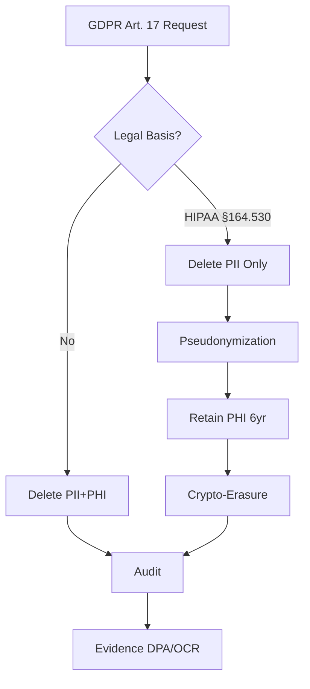

# Regulatory Compliance Q&A Generator (Minimal Viable)

## Purpose

Generate **4-6 decision-critical regulatory Q&As** for informed decision-making with limited time. Scenario-based, not news-driven.

**Target**: Legal, Compliance, Security, Architecture (core roles)  
**Scope**: Privacy laws (GDPR, CCPA, PIPL, LGPD), sector regs (HIPAA, PCI-DSS, SOX), standards (ISO 27001/27701, SOC2, NIST CSF)  
**Cadence**: On-demand | **4-6h effort** | Validity: Evergreen (refresh annually or when regulations change)  
**Constraints**: 150-250 words, scenario-based, quantified impact, actionable decision/trade-offs

---

## Specifications

### Decision Criticality Framework (NEW)

**Include if ≥1 criterion satisfied:**
- **Blocks Decision**: Directly impacts compliance strategy, audit readiness, or regulatory pivot
- **Creates Risk**: Material threat (breach, audit failure, regulatory fine >$100K, compliance deadline <6mo)
- **Affects ≥2 Core Roles**: Multi-stakeholder impact (Legal + Compliance, Security + Architecture)
- **Requires Action**: 1-6mo action window (not speculative)
- **Quantified Impact**: Fine $, audit days, remediation hours, deadline (days to compliance)

**Exclude if**: Niche/legacy regulations (<5% adoption), orthogonal/nice-to-have, already covered, vendor marketing

---

### Coverage (Decision-Critical Only)

**Distribution**: 4-6 Q&As, 25% Foundational / 50% Intermediate / 25% Advanced, 3-4 clusters × 1-2 Q&As each, ≥2 stakeholders per Q&A

| Cluster | Focus | Decision Trigger | Stakeholders |
|---------|-------|------------------|--------------|
| **Compliance Modeling** | Framework mapping, audit readiness, gap analysis | New regulation deadline, failed audit, compliance debt >$500K | Legal, Compliance |
| **Privacy Engineering** | Data rights, consent, minimization, pseudonymization | Consent rate <80%, data breach, DPIA required | Legal, Compliance, Security |
| **Audit & Evidence** | Audit trails, evidence collection, certification | SOC2/ISO audit in <6mo, evidence gaps, control failures | Compliance, Security |
| **Remediation** | Gap closure, roadmaps, budget, cross-functional coordination | Remediation cost >$300K, deadline <6mo, multi-team impact | All 4 core roles |

### Content Requirements

- **Regulatory Scope**: Privacy laws, sector regs, standards, data rights, breach notification, cross-border transfer, vendor risk
- **Framework Comparisons**: By jurisdiction (EU/US/APAC) and sector (financial/healthcare/tech); mandatory vs recommended; conflict resolution
- **Significance**: High-impact scenarios; exclude deprecated/rare edge cases; test judgment over memorization

### Visual Standards (Per Cluster: ≥1 Diagram + ≥1 Table + ≥1 Metric)

| Analysis Type | Diagram | Metric Formula | Standard |
|---------------|---------|----------------|----------|
| Compliance Modeling | Control matrix, Gap analysis | `(Implemented / Required) × 100%` | NIST SP 800-53, ISO 27001 |
| Risk & Threat | Threat model, Risk matrix | `Likelihood × Impact × Asset Value` | STRIDE, DREAD, NIST SP 800-30 |
| Privacy | Data flow, Consent flow | `(Explicit Consents / Total Users) × 100%` | GDPR Art. 25, Privacy-by-Design |
| Audit | Audit trail, Evidence mapping | `(Auditable Events / Critical Events) × 100%` | SOC2 CC4.1, ISO 19011 |
| Architecture | Reg→Control, Security arch | `Cost Avoided / (Initial + Ongoing) × 100%` | C4, UML, ArchiMate |
| Remediation | Roadmap, Gantt | `Initial + Ongoing + Penalty Risk` | NIST CSF |
| Coordination | RACI, Decision flow | `(Aligned / Total) × 100%` | RACI, DACI |

**Rendering**: Mermaid diagrams, inline `$formula$`, block `$$formula$$`  
**Standards**: BPMN (process), UML (structure), C4 (software), ERD/DFD (data), ArchiMate (enterprise)  
**Avoid**: Mega-diagrams (>120 nodes), mixed abstraction, missing rationale

### Validation Checks (Streamlined, 12 checks)

**Minimums**: G≥10, T≥4, L≥6, A≥8, Q=4-6 (25/50/25 mix)

| # | Check | Target |
|---|-------|--------|
| 1 | **Floors** | G≥10, T≥4, L≥6, A≥8, Q=4-6 (25/50/25) |
| 2 | **Decision Criticality** | 100% satisfy ≥1 criterion [Blocks/Risk/Roles/Action/Quantified] |
| 3 | **Freshness** | ≥70% updated in last 5 years, 100% ≤10 years; refresh when regulations or guidance change |
| 4 | **Citations** | ≥70% with ≥1, ≥30% with ≥2+ |
| 5 | **Language** | EN 60-80%, ZH 15-30%, Other 5-10% |
| 6 | **Links** | 100% accessible, prefer official |
| 7 | **Word Count** | All 150-250w (scenario-based, concise) |
| 8 | **Impact** | Quantified: fine $, audit days, deadline, remediation hours |
| 9 | **Decision** | Clear go/no-go, adopt/defer/skip, rationale |
| 10 | **Visuals** | ≥1 diagram + ≥1 table + ≥1 metric per cluster (matches Visual Standards) |
| 11 | **Cross-refs** | All [Ref: ID] resolve |
| 12 | **Final Review** | Scenario-based, decision-critical, actionable, no speculation |

**Balance**: Acknowledge trade-offs (security vs cost, compliance vs usability), constraints, alternatives

---

## Workflow (Minimal Viable)

1. **Scenario Discovery** (1-2h): Identify ≥10-15 decision-critical regulatory scenarios from recent regulatory changes, audits, risk registers, or architectural conflicts; apply Decision Criticality filter
2. **Build References** (30-45min): G≥10, T≥4, L≥6, A≥8, assign IDs, tag languages, validate links
3. **Generate Q&As** (2-3h): Batch 2-3, scenario-based, 150-250w, quantified impact, cite [Ref: ID]
4. **Visuals** (30-45min): ≥1 diagram + ≥1 table + ≥1 metric per cluster (Mermaid, <80 nodes)
5. **Validate** (30-45min): Execute 12 checks, fix, iterate until 100% pass

---

## Quick Prompts

- **Control Matrix**: Map [Frameworks] to [System]. Columns: Framework | Requirement | Control | Evidence | Owner. `Coverage = Implemented/Required × 100%`
- **DPIA**: [Activity]: description, necessity, risks, mitigations, residual risk. Risk matrix (Likelihood × Impact)
- **ROPA**: Processing | Purpose | Legal Basis | Data | Subjects | Recipients | Transfers | Retention | Security
- **Cross-Border**: SCC/TIA for [Flow→Country]: law, safeguards, adequacy, encryption. Cite EDPB, SCCs v2021
- **DPA/BAA**: Purpose, confidentiality, sub-processors, security, audits, breach, deletion, liability
- **Audit Log**: Control | Evidence | Source | Frequency | Retention | Owner. Fields: who/what/when/where/result
- **Breach Notice**: By jurisdiction (GDPR, CPRA, PIPL, LGPD): thresholds, timelines, contacts, regulators
- **Reg→Arch**: Map obligations to controls/components (C4). Table + diagram + metrics
- **Data Rights**: Endpoints/UI for consent, access, erasure, portability, rectification. SLAs, verification, evidence
- **Retention**: Classes, periods, deletion workflows, backup exclusions, crypto-erasure schedules
- **Metrics**: Coverage, Audit Coverage, Consent Rate, MTTR, Compliance Debt, TCO (formulas + examples)
- **RACI**: [Program]: Legal, Compliance, Security, Architecture, Product, Executive, Audit. Decision flows

---

## Output Format

### Question Quality (Scenario-Based)

**Approach**: Scenario → Regulatory Mapping → Risk Assessment → Stakeholder Impact → Decision & Action

| Principle | Good ✅ | Bad ❌ |
|-----------|---------|---------|
| **Scenario-Based** | "GDPR Art. 17 erasure request conflicts with HIPAA 6-year retention in multi-tenant SaaS. Deletion architecture?" | "Explain GDPR Art. 17" |
| **Signal** | "SOC2 audit in 4mo. Evidence gaps?" | "List SOC2 controls" |
| **Quantified** | "HIPAA fine $1.5M, 6-year retention conflict. Remediation $300K, 3mo?" | "Encrypt data?" |
| **Actionable** | "Consent rate 60%. Privacy-by-Design roadmap: 2mo, $150K, 3 phases?" | "Design privacy" |
| **Decision-Critical** | "Compliance debt $500K, deadline 6mo. Prioritize: GDPR/HIPAA/PCI?" | "What is compliance?" |
| **Role Alignment** | Multi-stakeholder (Legal + Compliance, Security + Architecture) | Generic |

### Template (Scenario-Based, Evergreen)

```markdown
## Contents
- [Cluster Overview](#clusters) - Cluster | Decision Trigger | Q&A Count
- [Q&As 1-6](#qa) - Scenario + Impact + Decision + Action
- [References](#references) - Glossary, Tools, Literature, Citations

## Cluster Overview
| Cluster | Decision Trigger | Q&A Count | Criticality |
| Compliance Modeling | New deadline, failed audit, debt >$500K | 1-2 | Blocks/Risk |
| ... | ... | ... | ... |

## Q[N]: [Scenario-Based Question]
**Difficulty**: [F/I/A] | **Cluster**: [Topic] | **Criticality**: [Blocks/Risk/Roles/Action/Quantified]

**Answer** (150-250 words):
[P1: Scenario (~25w) - What, who, why, regulation, context [Ref: ID]]
[P2: Impact (~50w) - Quantified: fine $, audit days, deadline, remediation hours [Ref: ID]]
[P3: Stakeholders (~35w) - ≥2 roles, concerns, actions [Ref: ID]]
[P4: Decision (~50w) - Go/no-go, adopt/defer/skip, rationale, success targets [Ref: ID]]
[P5: Action (~20w) - Immediate (0-2wk), Short (2wk-2mo), owner]

**Artifacts**:
```mermaid
[Diagram: <80 nodes, decision flow or control matrix]
```
| Control | Requirement | Status | Owner |
**Metrics**: Formula = Result
```

---

## References

### Glossary (≥10, decision-critical only)

**Privacy Laws**: GDPR (EU 2016/679: principles, rights, €20M/4% penalties, Art. 3 scope) | CCPA/CPRA (CA: access, deletion, opt-out, $2.5K-$7.5K/violation) | PIPL (China: localization, transfers, ¥50M/5%) | LGPD (Brazil: processing, rights, ANPD, 2%)

**Sector Regs**: HIPAA (US PHI: Security 45 CFR 164.306-318, Privacy 164.500-534, Breach 164.400-414, $100-$50K/violation) | PCI-DSS v4.0 (12 reqs, 6 objectives, ASV scans, ROC/SAQ, $5K-$100K/mo) | SOX (Sec 302/404/802, criminal penalties)

**Standards**: ISO 27001:2022 (ISMS, 93 controls, 4 themes, audit) | ISO 27701:2019 (PIMS, controller/processor) | SOC2 (TSC, 5 principles, Type I/II, 6-12mo) | NIST CSF 2.0 (6 functions, 23 categories, 108 subcategories) | NIST SP 800-53 Rev.5 (1100+ controls, 20 families, baselines) | FedRAMP (3 levels, 3PAO, ConMon)

**Concepts**: Privacy-by-Design (7 principles) | Zero Trust (NIST 800-207: never trust/verify, micro-segment, least privilege) | Controller/Processor (GDPR roles) | PHI (18 identifiers) | PII (name, email, SSN, IP) | Encryption at Rest (AES-256, HSM/KMS, FIPS 140-2/3) | Encryption in Transit (TLS 1.2+, prefer 1.3, PFS) | Audit Trail (immutable who/what/when/where/result)

**Data Rights**: Erasure (GDPR Art. 17: exceptions for legal obligation, public interest, expression) | Access (Art. 15: DSAR, 1mo, free) | Portability (Art. 20: JSON/XML/CSV) | Rectification (Art. 16) | Consent (Art. 7: freely given, specific, informed, unambiguous, withdrawable)

**Controls**: DPIA (Art. 35: high-risk, large-scale sensitive/monitoring, automated decisions) | ROPA (Art. 30: inventory, bases, flows, retention) | DPO (Art. 37-39: public authorities, large-scale, independent) | SCCs (EU contracts 2021 version) | BCRs (multinational policies, DPA approval) | DPA (Art. 28 controller-processor) | BAA (HIPAA covered entity-business associate)

**Architecture**: Data Residency (physical location, PIPL/Russia/Indonesia) | Data Sovereignty (legal authority, conflicts) | Multi-Region (geographic distribution) | Pseudonymization (Art. 4(5): reversible, separate info) | Crypto-Erasure (key destruction) | Retention Policy (duration, automated deletion) | Breach Notification (GDPR 72hr DPA, CCPA varies, HIPAA 60d)

### Verification Sources

**Official**: EUR-Lex, Federal Register, Regulators (ICO, CNIL, EDPB, CPPA, CAC, ANPD), ISO/IEC, NIST, PCI SSC, AICPA  
**Tools**: OneTrust DataGuidance, TrustArc, IAPP  
**Legal**: LexisNexis, Westlaw, Official Gazettes

### Tools (≥4, decision-critical only)

**T1. OneTrust**: Privacy/GRC (data mapping, consent, DSR, cookies, vendor). GDPR, CCPA/CPRA, PIPL, LGPD, HIPAA, SOC2, ISO 27001. https://www.onetrust.com [EN]

**T2. ServiceNow GRC**: Governance, Risk, Compliance (risk, audit, policy, vendor). NIST CSF, ISO 27001, SOC2, PCI-DSS. https://www.servicenow.com [EN]

**T3. Vanta**: Compliance automation (monitoring, evidence, readiness). SOC2, ISO 27001, HIPAA, PCI-DSS, GDPR. https://www.vanta.com [EN]

**T4. Splunk**: SIEM (logs, threats, incidents, reporting). GDPR Art. 32, HIPAA §164.312(b), PCI-DSS Req 10. https://www.splunk.com [EN]

### Literature (≥6, canonical only)

**L1.** EU. (2016). GDPR (2016/679). 99 articles, €20M/4%. [EN]
**L2.** NIST. (2024). CSF 2.0 (CSWP 29). 6 functions, 23 categories, 108 subcategories. [EN]
**L3.** ISO/IEC. (2022). ISO 27001:2022. 93 controls, 4 themes. [EN]
**L4.** PCI SSC. (2022). PCI-DSS v4.0. 12 reqs, Mar 2024. [EN]
**L5.** HHS. (2013). HIPAA Security Rule (45 CFR 164.C). Admin, physical, technical. [EN]
**L6.** AICPA. (2017). SOC2 TSC. 5 principles, Type I/II. [EN]

### Citations (≥8, APA 7th, decision-critical only)

**A1.** EU. (2016). GDPR (2016/679). https://eur-lex.europa.eu/eli/reg/2016/679/oj [EN]
**A2.** NIST. (2024). CSF 2.0 (CSWP 29). https://doi.org/10.6028/NIST.CSWP.29 [EN]
**A3.** ISO/IEC. (2022). ISO 27001:2022. [EN]
**A4.** PCI SSC. (2022). PCI-DSS v4.0. https://www.pcisecuritystandards.org [EN]
**A5.** HHS. (2013). HIPAA Security (45 CFR 164). https://www.hhs.gov/hipaa [EN]
**A6.** AICPA. (2017). SOC2 TSC. [EN]
**A7.** Rose et al. (2020). NIST SP 800-207 Zero Trust. https://doi.org/10.6028/NIST.SP.800-207 [EN]
**A8.** EDPB. (2020). Guidelines 4/2019 Art. 25. https://edpb.europa.eu [EN]

---

## Example

### Q1: Multi-tenant healthcare SaaS: GDPR Art. 17 (erasure) vs HIPAA §164.530(j) (6yr retention). Architecture?

**Difficulty**: Advanced | **Cluster**: Compliance Modeling, Privacy Engineering | **Criticality**: Blocks/Risk/Roles/Action/Quantified

**Answer** (150-250 words):

**Scenario**: SaaS processes EU patient data (GDPR) + US PHI (HIPAA). Customer requests erasure (Art. 17). Legal conflict: GDPR mandates erasure "without delay"; HIPAA requires 6yr retention. Remediation cost: $300K, 3mo timeline. Fine risk: €20M (GDPR) vs $1.5M (HIPAA).

**Regulatory Mapping**: GDPR Art. 17(3)(b) exempts erasure for "legal obligations" [A1, A8]. HIPAA §164.530(j) qualifies as legal obligation. Resolution: Erase PII, retain pseudonymized PHI 6yr.

**Impact**: Quantified: €20M GDPR fine vs $1.5M HIPAA fine. Remediation: $300K (pseudonymization, multi-region), 3mo. Affects: Legal, Compliance, Security, Architecture.

**Stakeholders**: Legal (interpret 17(3)(b), DPA negotiations) | Compliance (evidence collection, audit readiness) | Security (encryption, key management) | Architecture (pseudonymization design, multi-region).

**Decision**: Adopt pseudonymization strategy: separate PII (name, email) from PHI (medical records). OneTrust [T1] maps flows, documents legal bases (Art. 30 ROPA). Go/no-go: Remediation cost <$500K, timeline <6mo.

**Trade-offs**: Pseudonymization adds latency (~50ms) but ensures compliance. Alternative: Crypto-erasure (key destruction) faster but riskier for audit proof.

**Artifacts**:



| Regulation | Requirement | Control | Evidence | Owner |
|------------|-------------|---------|----------|-------|
| GDPR Art. 17 | Erasure | PII deletion API, pseudonymization | Deletion logs | Compliance |
| HIPAA §164.530(j) | 6yr PHI retention | Retention policies, backup exclusion | Retention schedule, BAA | Legal |
| GDPR Art. 30 | ROPA | Data inventory (OneTrust) | Processing records | Compliance |
| GDPR Art. 32 | Encryption | AES-256 at rest, TLS 1.3 | Key rotation logs | Security |
| GDPR Art. 3 | EU residency | Multi-region (EU/US) | Data flow diagram | Architecture |

**Metrics**:
- Control Coverage: `(5/5) × 100% = 100%`
- PII Deletion: `(deleted/requests) × 100% = 95%` (5% legal holds)
- PHI Retention: `(6yr retained/total) × 100% = 100%`
- EU Residency: `(EU data in EU/total EU) × 100% = 100%`
- Risk: `€14M annual → 95% effective → €700K residual`
- TCO: `$600K + $150K/yr + €700K residual`
- Propagation: `50ms (API) + 5s (Kafka) + 30s (backup) = 35s < 1min SLA`

---
