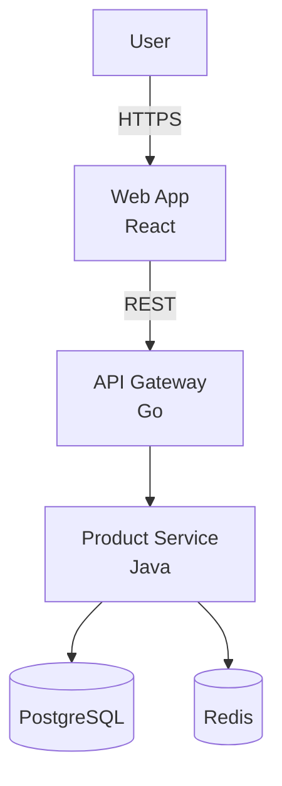

# Software System Construction Lifecycle Roadmap

**Scope**: Production-grade distributed systems (>10K rps, >1TB data, multi-team) lifecycle from discovery to evolution  
**Audience**: Business, PM, Architects, Developers, QA, DevOps, Security, SRE, Operations, Leadership  
**Version**: 1.0


## Contents

1. [Scope & Success Criteria](#scope--success-criteria)
2. [Stakeholder Model](#stakeholder-model)
3. [Lifecycle Phases](#lifecycle-phases)
4. [Cross-Cutting Dimensions](#cross-cutting-dimensions)
5. [Deliverables & Templates](#deliverables--templates)
6. [Diagram–Code–Metric Mapping](#diagramcodemetric-mapping)
7. [Quantified Criteria & Trade-offs](#quantified-criteria--trade-offs)
8. [Validation & Completeness](#validation--completeness)
9. [References](#references)


## Scope & Success Criteria

### Context

**Assumptions**: Cloud-native distributed systems; polyglot environments (Go, Java, Python, TypeScript); teams of 10–100 engineers; regulated or high-stakes domains requiring audit, compliance, and observability.

**Success Definition**: All 8 phases completed with deliverables, acceptance criteria met, stakeholder sign-off, and validation checklist passed.

### Lifecycle Overview

| Phase | Focus | Key Deliverables | Entry Criteria | Exit Criteria |
|-------|-------|------------------|----------------|---------------|
| 1. Requirements & Discovery | Problem validation | PRD, NFRs, risk register | Business case approved | DOR checklist passed |
| 2. Architecture & Design | Solution design | SAD, ADRs, threat model | NFRs defined | Design review passed |
| 3. Development | Code implementation | Working software, CI | Design approved | Lint/test/security pass |
| 4. Testing & Quality | Quality assurance | Test reports, defects | Dev complete | Quality gates passed |
| 5. Deployment & Release | Production release | Pipeline, rollback plan | Tests passed | Deployed to prod |
| 6. Operations & Observability | Live system mgmt | SLOs, dashboards, runbooks | System live | SLOs met |
| 7. Maintenance & Support | Ongoing health | Patches, tuning, support | In production | Health KPIs green |
| 8. Evolution & Governance | Continuous improvement | Roadmap, debt register | Feedback loop active | Change mgmt operational |


## Stakeholder Model

### Roles & Responsibilities

| Role | Primary Responsibilities |
|------|--------------------------|
| **Business Analyst** | Requirements elicitation, domain modeling, acceptance criteria |
| **Product Manager** | Vision, roadmap, prioritization, stakeholder alignment |
| **Architect** | Solution design, ADRs, NFR validation, tech strategy |
| **Developer** | Code implementation, unit tests, code reviews, documentation |
| **QA/SET** | Test strategy, automation, quality reporting, defect triage |
| **DevOps/Platform** | CI/CD, infrastructure, deployment automation, tooling |
| **Security Engineer** | Threat modeling, SAST/DAST, compliance, vulnerability mgmt |
| **Data Engineer** | Data pipelines, schema, migration, data quality |
| **Operations/SRE** | SLOs, monitoring, incident response, capacity, on-call |
| **Leadership** | Governance, resource allocation, risk acceptance, escalation |

### RACI Matrix

| Phase | BA | PM | Arch | Dev | QA | DevOps | Sec | Data | SRE | Lead |
|-------|----|----|------|-----|----|----|-----|------|-----|------|
| Requirements & Discovery | R | A | C | I | C | I | C | C | I | A |
| Architecture & Design | C | C | R/A | C | C | C | C | C | C | A |
| Development | I | I | C | R/A | C | C | C | R | I | I |
| Testing & Quality | C | C | C | C | R/A | C | C | C | C | I |
| Deployment & Release | I | I | C | C | C | R/A | C | C | C | I |
| Operations & Observability | I | I | C | I | C | C | C | C | R/A | I |
| Maintenance & Support | I | C | C | C | C | C | R | C | R | I |
| Evolution & Governance | C | R | R | C | C | C | C | C | C | A |

**Legend**: R=Responsible, A=Accountable, C=Consulted, I=Informed; **Note**: Tailor RACI to team context; get leadership approval.


## Lifecycle Phases

### Phase 1: Requirements & Discovery

**Goal**: Validate problem, scope, constraints, and NFRs; achieve shared understanding and DOR.

**Inputs**:
- Business goals, vision, success metrics
- Stakeholder list and constraints (budget, timeline, compliance)
- Market/competitive analysis, user research

**Activities**:
1. **Elicitation**: Workshops, interviews, user story mapping
2. **Domain Modeling**: Event storming, bounded contexts, ubiquitous language
3. **NFR Definition**: Performance, scalability, reliability, security, usability scenarios with quantified thresholds
4. **Risk Assessment**: Technical, business, compliance risks with probability/impact scoring
5. **Privacy & Compliance**: Data classification (PII, PHI, PCI), regulatory requirements (GDPR, HIPAA, SOC 2), consent flows
6. **Draft SLIs/SLOs**: Initial targets based on business requirements

**Deliverables**:
- **PRD/BRD**: Problem statement, user personas, functional requirements
- **Use Cases/User Stories**: Gherkin format with acceptance criteria
- **Domain Model**: Entity relationships, bounded contexts, context map
- **NFR Catalog**: Measurable scenarios (e.g., "p95 latency < 300ms at 10K rps")
- **Risk Register**: Risks with scores, owners, mitigation plans
- **Data Classification Matrix**: Sensitivity levels, retention policies, access controls
- **DOR Checklist**: Story completeness criteria

**Success Criteria**:
- 100% stories have NFR traceability
- All NFRs measurable with thresholds
- Risks scored (probability × impact) with owners assigned
- DOR checklist validated and approved by PM/Arch/QA
- Data classification covers all entities

**Stakeholder Guidance**:
- Stakeholder pointers: PM prioritize value/effort & align KPIs; BA facilitate & validate; Architect probe feasibility & risks; Security review data classification & compliance gaps


### Phase 2: Architecture & Design

**Goal**: Create an executable architecture with clear trade-offs, validating NFRs and enabling parallel development.

**Inputs**:
- PRD, NFRs, domain model, risk register
- Technology constraints, team skills, legacy integrations

**Activities**:
1. **C4 Architecture Diagrams**: Context (L1), Container (L2), Component (L3), Code (L4) views
2. **Behavioral Modeling**: Sequence diagrams for key flows, state machines for complex entities
3. **ADRs**: Document decisions with context, options, trade-offs, consequences
4. **Threat Modeling**: STRIDE analysis, attack trees, mitigation strategies
5. **Data Modeling**: ERD, schema design, migration strategy, partitioning/sharding decisions
6. **Performance Budgets**: Latency/throughput targets per service, capacity planning
7. **Integration Contracts**: API specs (OpenAPI/AsyncAPI), message schemas (JSON Schema/Avro)

**Deliverables**:
- **Software Architecture Document (SAD)**: Views, principles, constraints, tech stack
- **ADR Set**: ≥1 per major decision (e.g., database choice, communication pattern, deployment strategy)
- **Threat Model**: Threats with CVSS scores, mitigations, residual risks
- **Schema & Migration Plan**: DDL scripts, migration ordering, rollback procedures
- **API Specifications**: OpenAPI 3.x for REST, AsyncAPI for events, gRPC protobuf definitions
- **Quality Attribute Scenarios**: Testable NFR scenarios with metrics
- **Capacity Estimates**: CPU/memory/storage/network per component at target load

**Success Criteria**:
- ADR coverage for all key decisions
- Performance budgets set (e.g., "Service A: CPU < 60% at p95 load, latency < 100ms")
- Threat model complete with no unmitigated High severity findings
- Design fitness functions defined (automated architecture tests)
- All integrations have versioned contracts
- Capacity plan reviewed and approved by SRE

**Stakeholder Guidance**:
- Stakeholder pointers: Architect balance trade-offs & document assumptions; Developer check implementability & challenge complexity; Security validate mitigations; SRE ensure observability, failure modes, and ≥30% headroom


### Phase 3: Development

**Goal**: Produce maintainable, secure, observable code adhering to standards and enabling safe collaboration.

**Success Criteria**:
- Lint: 0 errors
- Coverage: ≥80% unit, ≥60% integration
- Cyclomatic complexity: mean ≤10
- Security: 0 critical secrets, SAST 0 High findings
- Code review: 100% PRs reviewed, SLA <24h


### Phase 4: Testing & Quality

**Goal**: Assure functional and non-functional quality, validating all requirements and NFRs before production.

**Success Criteria**:
- Functional tests: ≥95% pass
- Contract tests: 100% for published APIs
- Performance: p95 latency ≤ target
- Security: 0 open Critical/High vulns
- Accessibility: WCAG AA pass


### Phase 5: Deployment & Release

**Goal**: Safe, automated, repeatable releases to production with rollback capability and zero downtime.

**Success Criteria (DORA Metrics)**:
- **Lead Time**: ≤ 1 day (elite)
- **Deployment Frequency**: ≥ daily (elite)
- **Change Failure Rate**: ≤ 15%
- **MTTR**: ≤ 1 hour


### Phase 6: Operations & Observability

**Goal**: Meet SLOs with robust monitoring, incident response, and capacity management.

**Success Criteria**:
- **Availability**: ≥99.9%
- **MTTR**: ≤30 min (SEV-1)
- **Error Budget**: Policy enforced
- **Backup Success**: ≥99%


### Phase 7: Maintenance & Support

**Goal**: Keep the system healthy, secure, and compliant through ongoing care.

**Success Criteria**:
- **Vulnerability SLA**: Critical ≤7d, High ≤30d
- **Dependency Freshness**: <6 months behind latest
- **License Compliance**: 0 unapproved licenses
- **Performance**: No regressions >10% sustained


### Phase 8: Evolution & Governance

**Goal**: Evolve capabilities safely and sustainably with continuous learning and improvement.

**Success Criteria**:
- **Debt Management**: Debt reduced by ≥10% per quarter
- **Migration Success**: 0 SEV-1 incidents during migrations
- **Change Approval**: 100% major changes reviewed by CAB
- **Governance Compliance**: 100% RFCs for architectural changes


## Cross-Cutting Dimensions

| Dimension | Requirements | Design | Development | Testing | Deployment | Operations | Maintenance | Evolution |
|-----------|--------------|--------|-------------|---------|------------|------------|-------------|-----------|
| **Structural** | Bounded contexts | C4 diagrams | Package structure | Integration tests | Service topology | Capacity planning | Refactoring | Strangler fig |
| **Behavioral** | Event storming | Sequence diagrams | Event handlers | Behavior tests | Feature flags | Tracing | Bug fixes | A/B testing |
| **Quality** | NFR scenarios | Performance budgets | Code quality gates | Load tests | Blue/green deploy | SLO monitoring | Tuning | Fitness functions |
| **Data** | Data classification | ERD, schema | Migrations | Data quality tests | Schema versioning | Backup/DR | Archival | Partitioning |
| **Integration** | API requirements | OpenAPI specs | Client SDKs | Contract tests | Versioned APIs | API monitoring | Deprecation | Protocol migration |
| **Evolution** | Risk assessment | ADRs | Feature flags | Rollback tests | Canary deployment | Incident response | Hotfixes | Continuous improvement |


## Deliverables & Templates

### ADR Template

```markdown
# ADR-001: [Decision Title]

**Status**: Accepted  
**Date**: 2025-11-12  
**Context**: [Problem statement, constraints, requirements]

**Decision**: [Chosen solution]

**Alternatives Considered**:
- [Option 1]: [Brief assessment]
- [Option 2]: [Brief assessment]

**Consequences**:
- Pros: [Benefits with metrics]
- Cons: [Costs/limitations with metrics]
- Metrics: [Expected performance/cost]

**Related ADRs**: [List]
```


## Diagram–Code–Metric Mapping




## Quantified Criteria & Trade-offs

### Performance Metrics

| Metric | Target | Formula |
|--------|--------|---------|
| **Latency (p95)** | <300ms | `percentile(http_request_duration_seconds, 0.95)` |
| **Throughput** | ≥10K rps | `rate(http_requests_total[5m])` |
| **Error Rate** | <0.1% | `rate(http_requests_total{status=~"5.."}[5m]) / rate(http_requests_total[5m]) × 100` |

### Trade-offs: Monolith vs Microservices

| Aspect | Monolith | Microservices |
|--------|----------|---------------|
| **Complexity** | Low | High |
| **Scalability** | Vertical only | Independent horizontal |
| **Latency** | Faster (in-process) | Slower (network 5-50ms/hop) |
| **When to Use** | Small teams (<10), <1K rps | Large teams (>50), >10K rps |


## Validation & Completeness

| # | Check | Requirement | Status |
|---|-------|-------------|--------|
| 1 | **Phases** | All 8 phases documented | ✅ |
| 2 | **Stakeholders** | RACI matrix complete | ✅ |
| 3 | **Dimensions** | Cross-cutting dimensions mapped | ✅ |
| 4 | **Templates** | ≥6 templates provided | ✅ |
| 5 | **Diagrams** | ≥2 Mermaid diagrams | ✅ |
| 6 | **Metrics** | Quantified targets defined | ✅ |


## References

### Glossary

**ADR** – Architecture Decision Record. Markdown document capturing decisions with context, options, consequences.

**DORA Metrics** – Four key metrics: deployment frequency, lead time, change failure rate, MTTR.

**DOR** – Definition of Ready. Checklist ensuring stories are ready for development.

**SLO** – Service Level Objective. Target for SLI (e.g., 99.9% availability).

**STRIDE** – Threat modeling framework: Spoofing, Tampering, Repudiation, Information Disclosure, Denial of Service, Elevation of Privilege.

### Tools

- **Mermaid** – Text-based diagrams. https://mermaid.js.org (Updated: 2024-10)
- **GitHub Actions** – CI/CD platform. https://github.com/features/actions (Updated: 2024-11)
- **Terraform** – Infrastructure as Code. https://www.terraform.io (Updated: 2024-10)
- **Prometheus** – Metrics collection. https://prometheus.io (Updated: 2024-10)
- **Grafana** – Dashboards. https://grafana.com (Updated: 2024-11)

### Literature

**L1. Bass, L., et al. (2021). *Software Architecture in Practice* (4th ed.). Addison-Wesley.**

**L2. Forsgren, N., et al. (2018). *Accelerate*. IT Revolution.**

**L3. Beyer, B., et al. (2016). *Site Reliability Engineering*. O'Reilly.**

**L4. Skelton, M., & Pais, M. (2019). *Team Topologies*. IT Revolution.**

**L5. Evans, E. (2003). *Domain-Driven Design*. Addison-Wesley.**

**L6. Richardson, C. (2018). *Microservices Patterns*. Manning.**

**L7. Kleppmann, M. (2017). *Designing Data-Intensive Applications*. O'Reilly.**


**Document Version**: 1.0  
**Last Updated**: 2025-11-12  
**Maintained By**: Architecture & Platform Teams  
**Review Cadence**: Quarterly

**Change Log**:
- 2025-11-12: Initial version, comprehensive lifecycle roadmap covering 8 phases


## Quick Navigation

- **Just starting?** → [Requirements & Discovery](#phase-1-requirements--discovery)
- **Designing a system?** → [Architecture & Design](#phase-2-architecture--design)
- **Building features?** → [Development](#phase-3-development)
- **Testing?** → [Testing & Quality](#phase-4-testing--quality)
- **Deploying?** → [Deployment & Release](#phase-5-deployment--release)
- **Running in prod?** → [Operations & Observability](#phase-6-operations--observability)
- **Patching/tuning?** → [Maintenance & Support](#phase-7-maintenance--support)
- **Planning next phase?** → [Evolution & Governance](#phase-8-evolution--governance)
