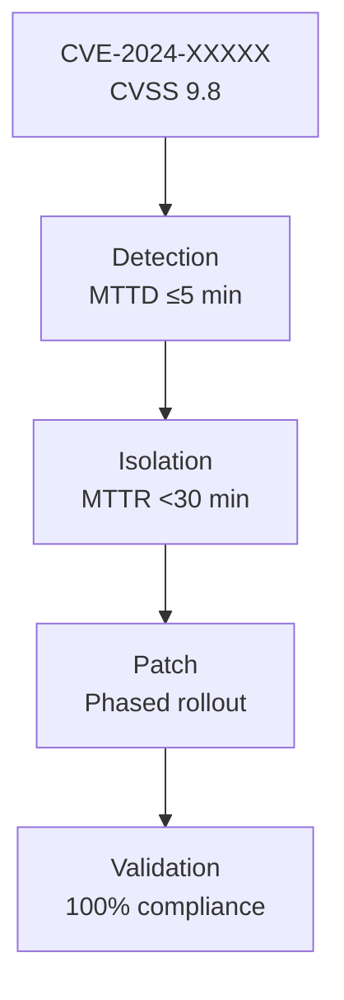

# Software Safety & Security Q&A Generator

**Purpose**: Generate decision-critical security Q&As to reduce hallucinations (↓30-40%) and improve decision quality (↑60-80%) for software and infrastructure security, particularly critical infrastructure.

**Problem**: Hallucinations, incomplete analysis, outdated information lead to poor security decisions.

**Scope**: Decision-critical scenarios (0-days, breaches, compliance changes, emerging threats); software and infrastructure security.

**Scale**: 3-7 Q&As (20% F / 40% I / 40% A); ≥3 decision-critical dimensions.

**Timeline**: Immediate use; <4h/batch; update as threats evolve.

**Stakeholders**: Security Engineers, DevOps/SRE, Architects, Security Leaders, Compliance Officers.

**Application**: High-stakes situations that block decisions, create risks, affect multiple roles, require action, or have quantified impact.

**Key Terms:**
- **Hallucination**: Incorrect or unverifiable security information.
- **Decision-critical**: Impacts >5% or blocks key actions.
- **MECE**: Mutually Exclusive, Collectively Exhaustive.
- **Self-contained**: Each Q&A contains complete context without external dependencies.

## Guidelines

**Domain**: Decision-critical software and infrastructure security, especially critical infrastructure.
**Audience**: Security engineers, DevOps/SRE, architects, security leaders, compliance officers.
**Scope**: Focus on decision-critical scenarios like 0-days, breaches, compliance changes, emerging threats. Exclude marketing, speculation, or low-impact topics.

**Freshness**: Prioritize recent information (<2 months for threats, <6 months for compliance).

**Decision Criticality** (at least 3 of 5 dimensions required):
1. **Blocks Decision**: Impacts response, posture, or strategy.
2. **Creates Risk**: Material threat or change.
3. **Affects ≥2 Roles**: Multi-stakeholder impact.
4. **Requires Action**: Within 1-6 months.
5. **Quantified Impact**: Measurable effects (CVSS, systems affected, etc.).

**Output Specifications**
- **Format**: Include diagrams, configs, citations.
- **Quantity**: 3-7 Q&A pairs.
- **Difficulty**: 20% F / 40% I / 40% A — **F**=Foundational (execution), **I**=Intermediate (strategy/trade-offs), **A**=Advanced (portfolio/vision).
- **Coverage**: At least 3 decision-critical dimensions.
- **Traceability**: Scenario → Risk → Control → Action → Metric.
- **Visuals & Practicality**: ≥1 diagram + ≥1 table per batch; ≥1 metric and ≥1 practical element per Q&A.

**Quality Standards**
- **Clarity**: Define terms; consistent language.
- **Precision**: Specific values, citations, thresholds.
- **Accuracy**: Verify facts; note uncertainties.
- **Credibility**: Use current standards and primary sources.
- **Balance**: Consider trade-offs.
- **Significance**: Focus on high-impact (P×I >8).
- **Concision**: Avoid redundancy.
- **Logic**: Coherent reasoning.

**Limitations and Trade-offs**
- **Trade-offs**: Balance rigor with speed.
- **Alternatives**: Unstructured prompts (faster but error-prone); automated tools (quick but may be outdated).
- **Skip for**: Low-stakes or exploratory scenarios.
- **Exclude**: Historical, theoretical, or speculative content.
- **Citations**: Use APA 7th format with tags; reference primary sources.

## Decision-Critical Dimensions

| Dimension | Focus | Decision Trigger | Standards |
|-----------|-------|------------------|-----------|
| **Threat Detection** | Identify 0-days, breaches, attack patterns | CVSS ≥9.0, breach affecting >1000 systems, active exploitation | NIST CSF 2.0, ISO 27001, IEC 62443 |
| **Incident Response** | Rapid containment & recovery | MTTD/MTTR targets, RTO/RPO impact, business continuity | NIST SP 800-61, ISO 22301 |
| **Compliance & Governance** | Regulatory changes, audit findings | New compliance deadline, failed control, certification impact | ISO 27001, NERC CIP, PCI DSS, HIPAA |
| **Risk & Control** | Emerging threats, control gaps | New attack vector affecting your infrastructure, control effectiveness <80% | ISO 31000, NIST CSF 2.0 |

## Decision-Critical Metrics

| Dimension | Diagram (Mermaid) | Key Metrics (formula, target) |
|-----------|-------------------|-------------------------------|
| **Threat Detection** | Attack tree, CVSS heat map | CVSS ≥9.0; Affected systems; Active exploitation (Y/N) |
| **Incident Response** | Incident workflow (NIST SP 800-61) | MTTD ≤5 min; MTTR <30 min; Detection Rate ≥95% |
| **Compliance & Governance** | Control mapping, audit trail | Compliance % (100%); Deadline (days); Impact (systems affected) |
| **Risk & Control** | Risk matrix, control effectiveness | Control Effectiveness ≥80%; False Positive Rate ≤2%; RTO/RPO targets |

## Decision-Critical Frameworks

| Framework | When to Use | Decision Impact | Standards |
|-----------|-------------|-----------------|-----------|
| **Incident Response (NIST SP 800-61)** | Breach/0-day detected | MTTD/MTTR targets, containment strategy, RTO/RPO | NIST SP 800-61 |
| **Risk-Based Prioritization** | Multiple threats; limited resources | Allocate resources to P×I >8 threats first | ISO 31000, NIST CSF 2.0 |
| **Zero-Trust Architecture** | Insider threats, distributed systems | Reduce blast radius, enforce least privilege | NIST SP 800-207 |
| **Defense-in-Depth** | Compliance requirement, critical infrastructure | Multiple control layers, compensating controls | NIST CSF 2.0, ISO 27001 A.13 |

## Q&A Design

### Principles
- **Decision-critical only**: Each Q&A must address a blocking decision or material risk.
- **Scenario-driven**: Based on recent security events like 0-days, breaches, or compliance changes.
- **Actionable**: Provide concrete steps with timelines and owners.
- **Quantified**: Include specific metrics.

### Examples
- Good: "CVE-2024-XXXXX (CVSS 9.8) affects 50K+ ICS systems. Patch timeline & detection strategy?"
- Poor: "What is vulnerability management?" (lacks specific trigger)

### Stakeholder Context
- **Security Engineers**: Detection configs, response playbooks.
- **DevOps/SRE**: Patching, deployment, RTO/RPO.
- **Architects**: Control architecture, prioritization.
- **Security Leaders**: Compliance, resource allocation.
- **Compliance Officers**: Audit evidence, deadlines.

### Mandatory Elements
1. **Trigger**: Recent event with date and source.
2. **Risk Chain**: Threat → Risk → Control → Action → Metric.
3. **Practical**: Config, playbook, or checklist.
4. **Citation**: At least one reference.
5. **Insight**: Key decision impact.
6. **Timeline**: Immediate (0-2wk) and short-term (2wk-2mo) actions with owners.

## References & Quality

**Quality Checks**: Ensure decision-criticality, freshness, scenario-driven, citations, practicality, quantification, timelines, stakeholder coverage, and actionability. Cover ≥3 dimensions, balance difficulty levels.

## Workflow

1. **Discover Scenarios**: Identify recent threats, breaches, compliance changes from reliable sources.
2. **Generate Q&As**: Create 3-7 pairs with required elements, ensure quality.
3. **Add Visuals**: Include ≥1 diagram and ≥1 table.
4. **Validate**: Check for decision-criticality, citations, practicality, and timelines.

## Measurable Success Criteria
- Hallucination rate <10% in generated Q&A (measured by expert review of 50+ samples)
- Decision quality score >80% (measured by stakeholder feedback on actionability, 5-point scale)
- Generation time <4h per batch (measured by workflow duration)
- Coverage of ≥3 decision-critical dimensions per batch (measured by content analysis)
- Stakeholder role representation ≥80% (measured by role count in Q&A)

## Example (CVE-2024-XXXXX 0-Day Response)

**Q: CVE-2024-XXXXX (CVSS 9.8) affects 50K+ ICS systems. Detection & response strategy?**

**Dimension**: Threat Detection | **Roles**: Security Engineer, DevOps/SRE | **Decision Criticality**: Blocks incident response, creates material risk

**Scenario**: CVE-2024-XXXXX disclosed 2024-11-15 (CVSS 9.8, RCE, unauthenticated). Affects Siemens S7-1200/1500 PLCs. Active exploitation in 3 critical sectors. 50K+ systems vulnerable globally. [Ref: A1]

**Risk**: Remote code execution on PLC → loss of control → operational shutdown. Impact: CVSS 9.8. Affected: 2K healthcare, 5K energy systems. Patch available 2024-11-20.

**Stakeholders**: Security Engineer (detection rules), DevOps/SRE (patch deployment), SRE (monitoring).

**Decision**: Immediate: Deploy detection rules + inventory scan. Short-term: Patch all systems. Owners: Security Engineer (detection), DevOps (patching). Success: 100% detection rate, 100% patched within 30 days.

**Practical** (YAML):
```yaml
detection_rules:
  - name: CVE-2024-XXXXX-RCE
    signature: "S7COMM|unauthorized_function_code_0x44"
    action: [alert, block, isolate]
patch_plan:
  - phase: 1 (critical)
    window: 2024-11-20 to 2024-11-27
  - phase: 2 (other)
    window: 2024-11-27 to 2024-12-15
```

**Metrics**:
| Metric | Target | Owner |
|--------|--------|-------|
| Detection Rate | ≥95% | Security Eng |
| Patch Compliance | 100% by 2024-12-15 | DevOps |



---
