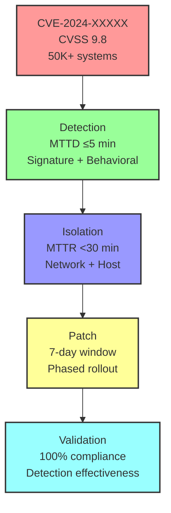

# Software Safety & Security Q&A Generator (Minimal Viable)

Generate 6-12 decision-critical security Q&As for informed decisions with limited time.

## Requirements

### Context & Scope
**Domain**: Critical infrastructure security (ICS/SCADA, energy, water, healthcare, automotive)
**Audience**: Security engineers, DevOps/SRE, architects, security leaders
**Scope**: Decision-critical security scenarios only—0-days, breaches, compliance changes, emerging threats
**Cadence**: Bi-weekly | 3-4h effort | **Expires**: 2 weeks from generation

**Freshness** (all news must meet these age thresholds):
- **High-Velocity** (0-days, breaches, attacks): ≥85% <1mo (≥30% 1-3d), ≥95% <2mo, 100% ≤4mo
- **Medium-Velocity** (Compliance, standards): ≥70% <2mo (≥20% 1-3d), ≥90% <3mo, 100% ≤6mo
- **Overall**: ≥75% <2mo, ≥90% <4mo, 100% ≤9mo

**Exclude**: Technical implementation details, vendor marketing, long-term R&D, rumors, speculative scenarios

**Decision Criticality Framework** (include if ≥1 criterion met):
1. **Blocks Decision**: Directly impacts incident response, security posture, or compliance strategy
2. **Creates Risk**: Material threat (0-day, breach pattern, regulatory change affecting operations)
3. **Affects ≥2 Core Roles**: Multi-stakeholder impact (Security + DevOps, Security + Leadership, etc.)
4. **Requires Action**: 1-6mo action window (not speculative)
5. **Quantified Impact**: CVSS score, breach count, affected systems, compliance deadline

### Output Specifications
**Format**: 120-200 words/answer with Mermaid diagrams, YAML configs, APA 7th [EN]/[ZH]
**Quantity**: 6-12 Q&A pairs
**Difficulty**: 25% Foundational (1-2), 50% Intermediate (3-6), 25% Advanced (1-3)
**Coverage**: Decision-critical security dimensions only (≥3 of 4)
**Traceability**: Scenario → Risk → Control → Action → Metric (explicit chain required)
**Per Q&A**: ≥1 diagram or table, ≥1 practical config/playbook, ≥1 metric

### Quality Standards
**Clarity**: Define all terms/acronyms in glossary; no ambiguity (e.g., "appropriate" → "SIL 2-rated"); consistent terminology
**Precision**: Specific values ("SIL 2" not "high safety"); exact citations ("IEC 61508-1:2010 Clause 7.4"); numeric thresholds ("≥95%" not "high")
**Accuracy**: Cross-check formulas, metrics, standards; flag uncertainties explicitly
**Credibility**: Standards ≤5yr old, peer-reviewed research, official specs only; no blogs/tutorials
**Balance**: Acknowledge trade-offs, limitations, alternatives, cost-benefit
**Significance**: Prioritize P×I >8; proven attack vectors/failure modes only
**Concision**: No redundancy/filler; use tables/diagrams to reduce text
**Logic**: Coherent reasoning (Hazard→Risk→Control→Validation); no circular definitions

## Decision-Critical Dimensions

| Dimension | Focus | Decision Trigger | Standards |
|-----------|-------|------------------|-----------|
| **Threat Detection** | Identify 0-days, breaches, attack patterns | CVSS ≥9.0, breach affecting >1000 systems, active exploitation | NIST CSF 2.0, ISO 27001, IEC 62443 |
| **Incident Response** | Rapid containment & recovery | MTTD/MTTR targets, RTO/RPO impact, business continuity | NIST SP 800-61, ISO 22301 |
| **Compliance & Governance** | Regulatory changes, audit findings | New compliance deadline, failed control, certification impact | ISO 27001, NERC CIP, PCI DSS, HIPAA |
| **Risk & Control** | Emerging threats, control gaps | New attack vector affecting your infrastructure, control effectiveness <80% | ISO 31000, NIST CSF 2.0 |

## Decision-Critical Metrics

| Dimension | Diagram (Mermaid) | Key Metrics (formula, target) |
|-----------|-------------------|-------------------------------|
| **Threat Detection** | Attack tree, CVSS heat map | CVSS ≥9.0; Affected systems; Active exploitation (Y/N) |
| **Incident Response** | Incident workflow (NIST SP 800-61) | MTTD ≤5 min; MTTR <30 min; Detection Rate ≥95% |
| **Compliance & Governance** | Control mapping, audit trail | Compliance % (100%); Deadline (days); Impact (systems affected) |
| **Risk & Control** | Risk matrix, control effectiveness | Control Effectiveness ≥80%; False Positive Rate ≤2%; RTO/RPO targets |

## Decision-Critical Frameworks

| Framework | When to Use | Decision Impact | Standards |
|-----------|-------------|-----------------|-----------|
| **Incident Response (NIST SP 800-61)** | Breach/0-day detected | MTTD/MTTR targets, containment strategy, RTO/RPO | NIST SP 800-61 |
| **Risk-Based Prioritization** | Multiple threats; limited resources | Allocate resources to P×I >8 threats first | ISO 31000, NIST CSF 2.0 |
| **Zero-Trust Architecture** | Insider threats, distributed systems | Reduce blast radius, enforce least privilege | NIST SP 800-207 |
| **Defense-in-Depth** | Compliance requirement, critical infrastructure | Multiple control layers, compensating controls | NIST CSF 2.0, ISO 27001 A.13 |

## Decision-Critical Q&A Design

### Principles
**Decision-critical only**: Every Q&A must block a decision or create material risk
**Scenario-driven**: Triggered by security events (0-days, breaches, compliance changes)
**Actionable**: Concrete next steps (0-2wk, 2wk-2mo) with clear owner
**Quantified**: Specific metrics (CVSS, affected systems, deadline, impact)

### Good vs. Poor

✅ "CVE-2024-XXXXX (CVSS 9.8) affects 50K+ ICS systems. Patch timeline & detection strategy?"
❌ "What is vulnerability management?" (no news trigger)

✅ "New NERC CIP compliance deadline (Jan 2025). Audit gap analysis & remediation roadmap?"
❌ "List NERC CIP requirements." (no decision)

✅ "[Breach] 10K healthcare records exposed via unpatched RCE. Incident response playbook & MTTD/MTTR targets?"
❌ "What is incident response?" (vague, no scenario)

### Stakeholder Context
**Security Engineers**: Detection configs, response playbooks, technical trade-offs
**DevOps/SRE**: Patching strategy, deployment windows, RTO/RPO impact
**Architects**: Control architecture, defense-in-depth, risk prioritization
**Security Leaders**: Compliance strategy, resource allocation, board reporting
**Compliance Officers**: Audit evidence, deadline tracking, certification impact

### Mandatory Q&A Elements
1. **News trigger**: Recent security event (0-day, breach, compliance change) with date & source
2. **Risk-to-action chain**: Threat/Compliance → Risk (CVSS/Impact) → Control → Action → Metric
3. **Practical element**: YAML config, playbook, or compliance checklist
4. **Citation**: ≥1 [Ref: ID] with freshness
5. **Key insight**: One sentence on decision impact/control effectiveness/compliance deadline
6. **Timeline**: Immediate (0-2wk), Short-term (2wk-2mo) with owner

## References & Quality (Minimal Viable)

### Minimums (for 6-12 Q&A)
- **≥8 Glossary** (only terms used): CVSS, MTTD/MTTR, Zero-Trust, Defense-in-Depth, RTO/RPO, Incident Response, Control Effectiveness, Attack Surface
- **≥3 Tools**: Splunk/ELK (SIEM), Nessus/Qualys (vulnerability scanning), PagerDuty (incident response)
- **≥6 Literature**: NIST SP 800-61 (incident response), NIST CSF 2.0, ISO 27001, IEC 62443 (ICS security), NERC CIP, PCI DSS
- **≥6 Citations**: APA 7th [EN]/[ZH] (~60/30/10%); DOI or permanent URL; all ≤2yr old

### Quality Gates (all must PASS)

| Gate | Requirement | Validation |
|------|-------------|------------|
| **Decision Criticality** | 100% satisfy ≥1 criterion (Blocks/Risk/Roles/Action/Quantified) | Review each Q&A |
| **Freshness** | ≥75% <2mo, ≥90% <4mo, 100% ≤9mo | Check scenario dates |
| **Scenario-Driven** | 100% triggered by security event (0-day/breach/compliance) | Verify trigger |
| **Citations** | ≥85% answers ≥1 cite, ≥30% ≥2 cites | Count per answer |
| **Cross-refs** | 100% [Ref: ID] resolve | Automated check |
| **Difficulty** | 25/50/25 (F/I/A) ±5% | Count by level |
| **Practical Elements** | 100% Q&As have ≥1 practical (config/playbook/checklist) | Review all |
| **Quantified** | 100% include specific metrics (CVSS/deadline/systems/impact) | Review all |
| **Timeline** | 100% include immediate (0-2wk) + short-term (2wk-2mo) | Review all |
| **Stakeholders** | ≥5/5 core roles represented | Count roles |
| **Coverage** | ≥3 of 4 decision-critical dimensions covered | Check matrix |
| **Actionability** | 100% concrete; 0% abstract/speculative | Review all |

## Workflow (Minimal Viable)

### 1. Scenario Discovery & Curation (Minimal)
**Record generation date (YYYY-MM-DD)—calculate all scenario ages from this.**

**Identify** (≥10-15 candidates, tiered):
- **Tier 1** (Recent, 1-3d): Active 0-days, breaches, critical incidents
- **Tier 2** (Recent, 7-14d): Emerging threats, attack patterns
- **Tier 3** (Compliance, 2-6mo): Regulatory changes, audit findings

**Sources** (whitelist):
- **Threat Intel**: CISA, NVD, Shodan, Censys, GreyNoise
- **Breaches**: Have I Been Pwned, Bleeping Computer, Dark Reading, SecurityWeek
- **Compliance**: NIST, NERC, PCI Security Council, ISO, regulatory bodies
- **Tools**: Perplexity ("past week"), ChatGPT ("latest"), Google (`after:DATE`), Reddit r/cybersecurity

**Curate** (≥10-15 candidates):
- ✅ Satisfies ≥1 Decision Criticality criterion
- ✅ Specific details (CVSS, affected systems, deadline, impact)
- ✅ Not marketing/rumors/speculation

### 2. Build References (Minimal)
**Format**: G# (term, def) | T# (tool, purpose) | L# (standard/framework) | A# (APA 7th+tag)

**Floors**: G≥8, T≥3, L≥6, A≥6

### 3. Generate Q&A (batch 2-3, self-check each)
**Structure** (120-200w):
1. **Scenario** (~25w): What, when, why, CVSS/impact, category [Ref: A#]
2. **Risk** (~40w): Threat/Compliance → Risk (CVSS/deadline/systems) → Control
3. **Stakeholders** (~35w): ≥2 roles + concerns + actions
4. **Decision** (~50w): Immediate (0-2wk) + Short-term (2wk-2mo) + owner
5. **Practical** (~30w): YAML config, playbook, or checklist

**Self-Check**: Decision Criticality ✓ | Freshness OK | ≥2 roles | Quantified | ≥1 cite | 120-200w | Actionable | All terms in glossary

### 4. Visuals (≥2 diagrams + ≥1 table)
**Types**: Attack tree, incident workflow, risk matrix, control mapping

### 5. Validate
**Execute**: All 12 quality gates from table
**Verify**: 6-12 Q&As, 25/50/25 difficulty, ≥3 of 4 dimensions, ≥5 roles

### 6. Submit
**Checklist**: Validations PASS | Floors met | Glossary complete | TOC complete | 0 placeholders | Visuals OK | Citations OK | Freshness OK | Dates (gen + expire=gen+2wk)

## Output Format (Minimal Viable)

```markdown
## Contents
- [Executive Summary](#executive-summary)
- [Decision-Critical Dimensions](#decision-critical-dimensions)
- [Q&A Template](#qa-template)
- [References](#references): Glossary, Tools, Literature, Citations
- [Validation Results](#validation-results-12-checks)

## Executive Summary
**Domain**: [Security domain] | **Period**: [YYYY-MM-DD] | **Coverage**: [# items, 3-4 dimensions]

**Key Decisions**: 1. [Scenario] ([Date]): [Impact] → [Decision] → [Timeline] (2 high-impact)

**Dashboard**: [Table: Dimension | Scenario | Decision | Timeline]

**Roles**: [5 core roles] | **Refs**: G=[#] T=[#] L=[#] A=[#]

## Decision-Critical Dimensions
| # | Dimension | Count | Scenarios | Roles |
|---|-----------|-------|-----------|-------|
| 1 | Threat Detection | 0-3 | 0-days, breaches | Security Eng, DevOps |
| 2 | Incident Response | 0-3 | Active incidents | Security Eng, SRE |
| 3 | Compliance & Governance | 0-3 | Regulatory changes | Security Lead, Compliance |
| 4 | Risk & Control | 0-3 | Control gaps, emerging threats | Architect, Security Lead |
| | **Total** | **6-12** | **4+** | **≥5** |

## Q&A Template

### Q#: [Scenario Question + Dimension + Roles]

**Dimension**: [Dimension] | **Roles**: [Primary, Secondary] | **Decision Criticality**: [Criterion]

**Scenario** (~25w): What, when, why, CVSS/impact, category [Ref: A#]

**Risk** (~40w): Threat/Compliance → Risk (CVSS/deadline/systems) → Control

**Stakeholders** (~35w): **[Role 1]**: Concerns, actions | **[Role 2]**: Same

**Decision** (~50w): **Rec**: Immediate (0-2wk) + Short-term (2wk-2mo) | **Owner**: [Role]

**Practical**: [YAML config / Playbook / Checklist]

[n1]: URL
---

## References

### Glossary
**G#. Term**: Definition | Context | Example

### Tools
**T#. ToolName**: Purpose | URL

### Literature
**L#. Title. Org/Publisher. Year.** Description.

### Citations
**A#. Author(s). (Year). *Title*. Pub. URL [Tag]**

## Validation Results (12 checks)
[Table: all gates PASS with evidence]
```

## Example (CVE-2024-XXXXX 0-Day Response)

**Q: CVE-2024-XXXXX (CVSS 9.8) affects 50K+ ICS systems. Detection & response strategy?**

**Dimension**: Threat Detection | **Roles**: Security Engineer, DevOps/SRE | **Decision Criticality**: Blocks incident response, creates material risk

**Scenario** (~25w): CVE-2024-XXXXX disclosed 2024-11-15 (CVSS 9.8, RCE, unauthenticated). Affects Siemens S7-1200/1500 PLCs. Active exploitation reported in 3 critical infrastructure sectors. 50K+ systems vulnerable globally, ~2K in healthcare. [Ref: A1]

**Risk** (~40w): **Threat**: Remote code execution on PLC → loss of control → operational shutdown. **Impact**: CVSS 9.8 (critical). **Affected**: 2K healthcare systems, 5K energy systems. **Timeline**: Patch available 2024-11-20 (5-day window). **Control**: Detection (MTTD ≤5 min), isolation (MTTR <30 min), patching (7-day window).

**Stakeholders** (~35w): **Security Engineer**: Detection rules (network signatures, behavioral), SIEM tuning, false positive management. **DevOps/SRE**: Patch deployment plan, rollback strategy, RTO/RPO impact (30 min max downtime). **SRE**: Monitoring (asset inventory, patch status), alerting (detection + patch compliance).

**Decision** (~50w): **Rec**: Immediate (0-2wk): Deploy detection rules + inventory scan. Short-term (2wk-2mo): Patch all systems, validate detection effectiveness. **Owner**: Security Engineer (detection), DevOps (patching). **Success**: 100% detection rate, 100% patched within 30 days, 0 exploitation incidents.

**Practical** (YAML):
```yaml
detection_rules:
  - name: CVE-2024-XXXXX-RCE
    signature: "S7COMM|unauthorized_function_code_0x44"
    threshold: 1
    action: [alert, block, isolate]
    mttd: 5min
patch_plan:
  - phase: 1 (critical: healthcare, energy)
    systems: 7000
    window: 2024-11-20 to 2024-11-27
    rollback: 24h
  - phase: 2 (other)
    systems: 43000
    window: 2024-11-27 to 2024-12-15
```

**Metrics**:
| Metric | Target | Owner |
|--------|--------|-------|
| Detection Rate | ≥95% | Security Eng |
| MTTD | ≤5 min | SIEM |
| Patch Compliance | 100% by 2024-12-15 | DevOps |
| MTTR (if exploited) | <30 min | SRE |



---
