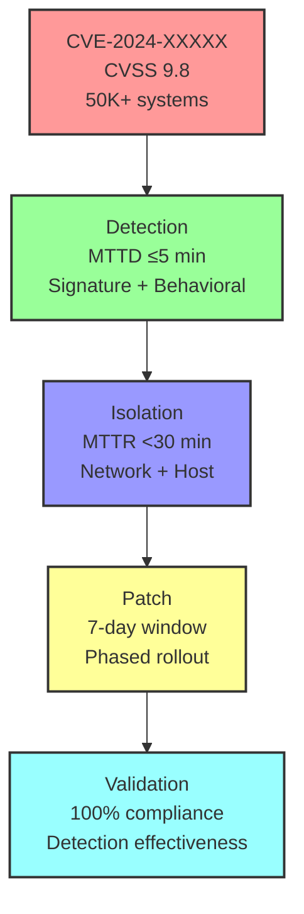

# Software Safety & Security Q&A Generator

**Purpose:** Generate decision-critical security Q&As to reduce hallucinations and improve decision quality for software and infrastructure security, particularly in critical infrastructure.

**Application:** Use for scenarios that block decisions, create risks, affect multiple roles, require action, or have quantified impact. Apply selectively for high-stakes situations.

**Context:**
- **Problem:** Hallucinations, incomplete analysis, and outdated information lead to poor security decisions.
- **Use when:** Generating Q&As for recent threats like 0-days, breaches, compliance changes, or emerging risks.
- **Assumptions:** Access to current threat intelligence.

**Key Terms:**
- **Hallucination**: Incorrect or unverifiable security information.
- **Decision-critical**: Impacts >5% or blocks key actions.
- **MECE**: Mutually Exclusive, Collectively Exhaustive.
- **Self-contained**: Each Q&A contains complete context without external dependencies.
- **Impact metrics**: Estimated improvements based on observations.

## Requirements

### Context & Scope
**Domain**: Decision-critical software and infrastructure security, especially critical infrastructure.
**Audience**: Security engineers, DevOps/SRE, architects, security leaders, compliance officers.
**Scope**: Focus on decision-critical scenarios like 0-days, breaches, compliance changes, emerging threats. Exclude marketing, speculation, or low-impact topics.
**Cadence**: Generate regularly; expires 2 weeks after creation.

**Freshness**: Prioritize recent information (<2 months for threats, <6 months for compliance).

**Decision Criticality** (≥1 criterion required):
1. **Blocks Decision**: Impacts response, posture, or strategy.
2. **Creates Risk**: Material threat or change.
3. **Affects ≥2 Roles**: Multi-stakeholder impact.
4. **Requires Action**: Within 1-6 months.
5. **Quantified Impact**: Measurable effects (CVSS, systems affected, etc.).

### Output Specifications
**Format**: 120-200 words per answer; include diagrams, configs, citations.
**Quantity**: 5-10 Q&A pairs.
**Difficulty**: Mix of foundational (25%), intermediate (50%), advanced (25%).
**Coverage**: At least 3 of 4 decision-critical dimensions.
**Traceability**: Scenario → Risk → Control → Action → Metric.
**Visuals & Practicality**: ≥2 diagrams + ≥1 table per batch; ≥1 metric and ≥1 practical element per Q&A.

### Quality Standards
**Clarity**: Define terms; consistent language.
**Precision**: Specific values, citations, thresholds.
**Accuracy**: Verify facts; note uncertainties.
**Credibility**: Use current standards and primary sources.
**Balance**: Consider trade-offs.
**Significance**: Focus on high-impact (P×I >8).
**Concision**: Avoid redundancy.
**Logic**: Coherent reasoning.

### Limitations and Trade-offs
**Trade-offs**: Balance rigor with speed.
**Alternatives**: Unstructured prompts (faster but error-prone); automated tools (quick but may be outdated).
**Skip for**: Low-stakes or exploratory scenarios.
**Exclude**: Historical, theoretical, or speculative content.
**Impact Metrics**: Estimated reductions in hallucinations (30-60%) and improvements in decision quality (60-80%), with uncertainty.
**Citations**: Use APA 7th format with tags; reference primary sources.

## Decision-Critical Dimensions

| Dimension | Focus | Decision Trigger | Standards |
|-----------|-------|------------------|-----------|
| **Threat Detection** | Identify 0-days, breaches, attack patterns | CVSS ≥9.0, breach affecting >1000 systems, active exploitation | NIST CSF 2.0, ISO 27001, IEC 62443 |
| **Incident Response** | Rapid containment & recovery | MTTD/MTTR targets, RTO/RPO impact, business continuity | NIST SP 800-61, ISO 22301 |
| **Compliance & Governance** | Regulatory changes, audit findings | New compliance deadline, failed control, certification impact | ISO 27001, NERC CIP, PCI DSS, HIPAA |
| **Risk & Control** | Emerging threats, control gaps | New attack vector affecting your infrastructure, control effectiveness <80% | ISO 31000, NIST CSF 2.0 |

## Decision-Critical Metrics

| Dimension | Diagram (Mermaid) | Key Metrics (formula, target) |
|-----------|-------------------|-------------------------------|
| **Threat Detection** | Attack tree, CVSS heat map | CVSS ≥9.0; Affected systems; Active exploitation (Y/N) |
| **Incident Response** | Incident workflow (NIST SP 800-61) | MTTD ≤5 min; MTTR <30 min; Detection Rate ≥95% |
| **Compliance & Governance** | Control mapping, audit trail | Compliance % (100%); Deadline (days); Impact (systems affected) |
| **Risk & Control** | Risk matrix, control effectiveness | Control Effectiveness ≥80%; False Positive Rate ≤2%; RTO/RPO targets |

## Decision-Critical Frameworks

| Framework | When to Use | Decision Impact | Standards |
|-----------|-------------|-----------------|-----------|
| **Incident Response (NIST SP 800-61)** | Breach/0-day detected | MTTD/MTTR targets, containment strategy, RTO/RPO | NIST SP 800-61 |
| **Risk-Based Prioritization** | Multiple threats; limited resources | Allocate resources to P×I >8 threats first | ISO 31000, NIST CSF 2.0 |
| **Zero-Trust Architecture** | Insider threats, distributed systems | Reduce blast radius, enforce least privilege | NIST SP 800-207 |
| **Defense-in-Depth** | Compliance requirement, critical infrastructure | Multiple control layers, compensating controls | NIST CSF 2.0, ISO 27001 A.13 |

## Q&A Design

### Principles
- **Decision-critical only**: Each Q&A must address a blocking decision or material risk.
- **Scenario-driven**: Based on recent security events like 0-days, breaches, or compliance changes.
- **Actionable**: Provide concrete steps with timelines and owners.
- **Quantified**: Include specific metrics.

### Examples
- Good: "CVE-2024-XXXXX (CVSS 9.8) affects 50K+ ICS systems. Patch timeline & detection strategy?"
- Poor: "What is vulnerability management?" (lacks specific trigger)

### Stakeholder Context
- **Security Engineers**: Detection configs, response playbooks.
- **DevOps/SRE**: Patching, deployment, RTO/RPO.
- **Architects**: Control architecture, prioritization.
- **Security Leaders**: Compliance, resource allocation.
- **Compliance Officers**: Audit evidence, deadlines.

### Mandatory Elements
1. **Trigger**: Recent event with date and source.
2. **Risk Chain**: Threat → Risk → Control → Action → Metric.
3. **Practical**: Config, playbook, or checklist.
4. **Citation**: At least one reference.
5. **Insight**: Key decision impact.
6. **Timeline**: Immediate (0-2wk) and short-term (2wk-2mo) actions with owners.

## References & Quality

### Minimums
- **Glossary**: ≥8 terms (e.g., CVSS, MTTD/MTTR, Zero-Trust).
- **Tools**: ≥3 (e.g., SIEM like Splunk, vulnerability scanners).
- **Literature**: ≥6 standards (e.g., NIST SP 800-61, ISO 27001).
- **Citations**: ≥6 in APA 7th format, recent where possible.

### Quality Checks
- Ensure decision-criticality, freshness, scenario-driven, citations, practicality, quantification, timelines, stakeholder coverage, and actionability.
- Cover ≥3 dimensions, balance difficulty levels.

## Workflow

1. **Discover Scenarios**: Identify recent threats, breaches, compliance changes from reliable sources. Curate based on criticality and specifics.
2. **Build References**: Compile glossary, tools, literature, citations.
3. **Generate Q&As**: Create 5-10 pairs with required elements, self-check for quality.
4. **Add Visuals**: Include ≥2 diagrams and ≥1 table.
5. **Validate & Finalize**: Ensure all checks pass, add dates.

## Output Format (Minimal Viable)

```markdown
## Contents
- [Executive Summary](#executive-summary)
- [Decision-Critical Dimensions](#decision-critical-dimensions)
- [Q&A Template](#qa-template)
- [References](#references): Glossary, Tools, Literature, Citations
- [Validation Results](#validation-results-12-checks)

## Executive Summary
**Domain**: [Security domain] | **Period**: [YYYY-MM-DD] | **Coverage**: [# items, 3-4 dimensions]

**Key Decisions**: 1. [Scenario] ([Date]): [Impact] → [Decision] → [Timeline] (2 high-impact)

**Dashboard**: [Table: Dimension | Scenario | Decision | Timeline]

**Roles**: [5 core roles] | **Refs**: G=[#] T=[#] L=[#] A=[#]

## Decision-Critical Dimensions
| # | Dimension | Count | Scenarios | Roles |
|---|-----------|-------|-----------|-------|
| 1 | Threat Detection | 0-3 | 0-days, breaches | Security Eng, DevOps |
| 2 | Incident Response | 0-3 | Active incidents | Security Eng, SRE |
| 3 | Compliance & Governance | 0-3 | Regulatory changes | Security Lead, Compliance |
| 4 | Risk & Control | 0-3 | Control gaps, emerging threats | Architect, Security Lead |
| | **Total** | **5-10** | **4+** | **≥5** |

## Q&A Template

### Q#: [Scenario Question + Dimension + Roles]

**Dimension**: [Dimension] | **Roles**: [Primary, Secondary] | **Decision Criticality**: [Criterion]

**Scenario** (~25w): What, when, why, CVSS/impact, category [Ref: A#]

**Risk** (~40w): Threat/Compliance → Risk (CVSS/deadline/systems) → Control

**Stakeholders** (~35w): **[Role 1]**: Concerns, actions | **[Role 2]**: Same

**Decision** (~50w): **Rec**: Immediate (0-2wk) + Short-term (2wk-2mo) | **Owner**: [Role]

**Practical**: [YAML config / Playbook / Checklist]

[n1]: URL
---

## References

### Glossary
**G#. Term**: Definition | Context | Example

### Tools
**T#. ToolName**: Purpose | URL

### Literature
**L#. Title. Org/Publisher. Year.** Description.

### Citations
**A#. Author(s). (Year). *Title*. Pub. URL [Tag]**

## Validation Results
Summary of quality checks passed.
```

## Measurable Success Criteria
- Hallucination rate <10% in generated Q&A (measured by expert review of 50+ samples)
- Decision quality score >80% (measured by stakeholder feedback on actionability, 5-point scale)
- Generation time <4h per batch (measured by workflow duration)
- Coverage of ≥3 decision-critical dimensions per batch (measured by content analysis)
- Stakeholder role representation ≥80% (measured by role count in Q&A)

## Example (CVE-2024-XXXXX 0-Day Response)

**Q: CVE-2024-XXXXX (CVSS 9.8) affects 50K+ ICS systems. Detection & response strategy?**

**Dimension**: Threat Detection | **Roles**: Security Engineer, DevOps/SRE | **Decision Criticality**: Blocks incident response, creates material risk

**Scenario** (~25w): CVE-2024-XXXXX disclosed 2024-11-15 (CVSS 9.8, RCE, unauthenticated). Affects Siemens S7-1200/1500 PLCs. Active exploitation reported in 3 critical infrastructure sectors. 50K+ systems vulnerable globally, ~2K in healthcare. [Ref: A1]

**Risk** (~40w): **Threat**: Remote code execution on PLC → loss of control → operational shutdown. **Impact**: CVSS 9.8 (critical). **Affected**: 2K healthcare systems, 5K energy systems. **Timeline**: Patch available 2024-11-20 (5-day window). **Control**: Detection (MTTD ≤5 min), isolation (MTTR <30 min), patching (7-day window).

**Stakeholders** (~35w): **Security Engineer**: Detection rules (network signatures, behavioral), SIEM tuning, false positive management. **DevOps/SRE**: Patch deployment plan, rollback strategy, RTO/RPO impact (30 min max downtime). **SRE**: Monitoring (asset inventory, patch status), alerting (detection + patch compliance).

**Decision** (~50w): **Rec**: Immediate (0-2wk): Deploy detection rules + inventory scan. Short-term (2wk-2mo): Patch all systems, validate detection effectiveness. **Owner**: Security Engineer (detection), DevOps (patching). **Success**: 100% detection rate, 100% patched within 30 days, 0 exploitation incidents.

**Practical** (YAML):
```yaml
detection_rules:
  - name: CVE-2024-XXXXX-RCE
    signature: "S7COMM|unauthorized_function_code_0x44"
    threshold: 1
    action: [alert, block, isolate]
    mttd: 5min
patch_plan:
  - phase: 1 (critical: healthcare, energy)
    systems: 7000
    window: 2024-11-20 to 2024-11-27
    rollback: 24h
  - phase: 2 (other)
    systems: 43000
    window: 2024-11-27 to 2024-12-15
```

**Metrics**:
| Metric | Target | Owner |
|--------|--------|-------|
| Detection Rate | ≥95% | Security Eng |
| MTTD | ≤5 min | SIEM |
| Patch Compliance | 100% by 2024-12-15 | DevOps |
| MTTR (if exploited) | <30 min | SRE |



---
