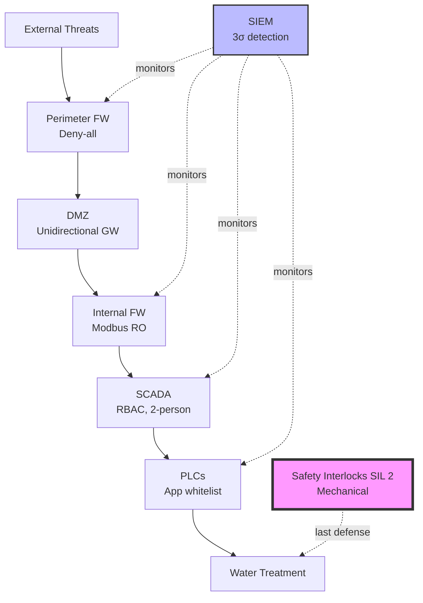

# Software Safety & Security Interview Generator

Generate 25-30 interview Q&A pairs testing risk-to-controls translation for safety-critical and security-critical systems.

## Requirements

### Context & Scope
**Domain**: ICS/SCADA, medical devices, automotive, critical infrastructure (energy, water, transportation)
**Audience**: Engineers (implementation), operators (monitoring), managers (policy), regulators (compliance/audit)
**Constraints**: Cyber-physical systems only; safety-security convergence required
**Assumptions**: Basic risk management knowledge; standard access (definitions provided)

### Output Specifications
**Format**: 150-300 words/answer with Mermaid diagrams, YAML/JSON configs, code snippets, APA 7th [EN]/[ZH]
**Quantity**: 25-30 Q&A pairs
**Difficulty**: 20% Foundational (5-6), 40% Intermediate (10-12), 40% Advanced (10-12)
**Coverage**: MECE across Safety/Security/Resilience/Governance × Prevent/Detect/Respond/Recover = 16 cells (≥1 Q&A per cell)
**Traceability**: Requirements → Controls → Procedures → Evidence → Metrics (explicit chain required)
**Per Cluster**: ≥1 diagram, ≥1 scenario, ≥1 table, ≥1 metric

### Quality Standards
**Clarity**: Define all terms/acronyms in glossary; no ambiguity (e.g., "appropriate" → "SIL 2-rated"); consistent terminology
**Precision**: Specific values ("SIL 2" not "high safety"); exact citations ("IEC 61508-1:2010 Clause 7.4"); numeric thresholds ("≥95%" not "high")
**Accuracy**: Cross-check formulas, metrics, standards; flag uncertainties explicitly
**Credibility**: Standards ≤5yr old, peer-reviewed research, official specs only; no blogs/tutorials
**Balance**: Acknowledge trade-offs, limitations, alternatives, cost-benefit
**Significance**: Prioritize P×I >8; proven attack vectors/failure modes only
**Concision**: No redundancy/filler; use tables/diagrams to reduce text
**Logic**: Coherent reasoning (Hazard→Risk→Control→Validation); no circular definitions

## Dimensions

| Dimension | Focus | Methods | Standards |
|-----------|-------|---------|-----------|
| **Safety** | Prevent unintended harm from faults/errors | FMEA, FTA, HAZOP; Fail-safe, redundancy; SIS, interlocks; SIL 1-4, ASIL A-D | IEC 61508/61511, ISO 26262, IEC 62304 |
| **Security** | Prevent malicious compromise | STRIDE, Attack Trees; SAST/DAST/SCA/Fuzz/Pentest/IaC; RBAC, encryption, IDS/IPS | ISO 27001, NIST CSF 2.0, ISO/SAE 21434, IEC 62443 |
| **Resilience** | Detect, respond, recover | SIEM, anomaly detection; Emergency playbooks; BCDR, RTO/RPO; MTTD, MTTR | NIST SP 800-61, ISO 22301 |
| **Governance** | Frameworks, audits, improvement | Risk management (ISO 31000); Audit trails, traceability; Training; Lessons learned | IEC 61508, ISO 26262, ISO 27001, FDA, NERC CIP, PCI DSS |

## Visuals & Metrics

| Analysis | Diagram (Mermaid) | Metrics (formula, target) |
|----------|-------------------|---------------------------|
| **Hazard** | Fault tree, Bow-tie | Risk = P × I (Critical >8); MTBF = Uptime / Failures (>10k hrs) |
| **Threat** | Attack tree, DFD (STRIDE) | CVSS: Base × Temporal × Environmental (Critical ≥9.0); Attack Surface |
| **Prevention** | Control hierarchy, Defense-in-depth | Control Effectiveness (≥80%); Detection Rate = TP/(TP+FN) (≥95%) |
| **Detection** | Alert flow, State machine | MTTD = Detection Time / Incidents (≤5 min); FP Rate (≤2%) |
| **Response** | Incident workflow (NIST 800-61) | MTTR = Restoration Time / Incidents (<30 min); RTO/RPO targets |
| **Compliance** | Audit trail, Control mapping | Compliance % (100%); Defect Escape = Post-Release / Total (<5%) |
| **Testing** | Coverage map (OWASP ASVS) | Test Coverage = Tests / Vectors (≥80% code, 100% critical) |

## Frameworks

| Framework | When to Use | Advantage | Disadvantage | Trade-offs | Standards |
|-----------|-------------|-----------|--------------|------------|-----------|
| **Defense-in-Depth** | Security-critical; compliance | No single point of failure; compensating controls | Complexity; performance impact | Security vs. simplicity; Cost vs. coverage | NIST CSF, ISO 27001 A.13 |
| **Fail-Safe** | Catastrophic consequences; tolerates shutdown | Guarantees safety on failure; simple | Availability impact; false shutdowns | Safety vs. availability; False alarms vs. missed hazards | IEC 61508 SIL 3-4, IEC 61511 |
| **Zero-Trust** | High-value assets; distributed/cloud; insider threats | Limits blast radius; stops lateral movement | Complexity; user friction | Security vs. usability; Performance vs. verification | NIST SP 800-207 |
| **Risk-Based** | Limited resources; diverse threats; cost-benefit | Efficient allocation; P×I focus | Requires accurate assessment; misses emerging threats | Cost efficiency vs. coverage; Known vs. unknown risks | ISO 31000, NIST CSF |
| **Safety-Security Convergence** | Cyber-physical (ICS, medical, automotive) | Comprehensive; avoids conflicting controls | Cross-domain expertise; org silos | Unified governance vs. specialized controls; Hardening vs. certification | IEC 62443, ISO/SAE 21434 |

## Question Design

### Principles
**Test application, not recall**: Require analysis and trade-off evaluation
**Relevance**: Real-world scenarios from specified domains
**Breadth & Depth**: Multiple perspectives (technical, operational, managerial, regulatory); implementation-level detail

### Good vs. Poor

✅ "How assess/mitigate undetected sensor failure in medical infusion pump? Show risk analysis and controls."  
❌ "What is FMEA?" (recall only)

✅ "Choose fail-safe, fail-operational, or redundant for autonomous braking. Justify with P×I analysis."  
❌ "List redundancy types." (no context/trade-offs)

✅ "Water treatment SCADA detected unauthorized PLC reprogramming. Design incident response with MTTD/MTTR targets."  
❌ "What is incident response?" (vague, no scenario)

### Stakeholder Context
**Engineers**: Configs, code, testing, technical trade-offs, tool selection
**Operators**: Monitoring procedures, alert thresholds, response playbooks, metric interpretation
**Managers**: Policy, resource allocation, cost-benefit, compliance strategy
**Regulators**: Audit evidence, traceability matrices, compliance docs, regulatory interpretations

### Mandatory Q&A Elements
1. **Risk-to-controls chain**: Hazard/Threat → P×I → Control → Procedure → Metric
2. **Practical element**: YAML config, script, playbook, test procedure, or compliance checklist
3. **Citation**: ≥1 [Ref: ID]
4. **Key insight**: One sentence on critical trade-off/control effectiveness/incident impact/regulatory requirement
5. **Trade-off acknowledgment**: Limitations, alternatives, or costs
6. **Validation approach**: Testing, monitoring, or audit method

## References & Quality

### Minimums (for 25-30 Q&A; scale 1.5× if >30)
- **≥10 Glossary**: FMEA, FTA, HAZOP, STRIDE, CVSS, Defense-in-Depth, Fail-Safe, Redundancy, Zero-Trust, MTBF/MTTR/MTTD, SIL, CIA, Attack Surface, SAST/DAST/SCA/Fuzz/Pentest/IaC (formulas, distinctions)
- **≥5 Tools**: BowTieXP, MS TMT, Splunk/ELK, Nessus/Qualys, PagerDuty, ZAP, Semgrep, Snyk, AFL++, Burp, Trivy (purpose, pricing, last update ≤18mo, integrations, limitations)
- **≥10 Literature**: IEC 61508/61511, ISO 26262/27001/31000/22301, ISO/SAE 21434, IEC 62443/62304, ISO 14971, NIST CSF 2.0/SP 800-61/82/115, OWASP ASVS, Leveson, Shostack, Stuxnet, breach analyses
- **≥20 Citations**: APA 7th [EN]/[ZH] (~60/30/10%); DOI or permanent URL

### Quality Gates (all must PASS)

| Gate | Requirement | Validation |
|------|-------------|------------|
| **Recency** | ≥50% last 3yr (≥70% digital/cloud) | Check publication dates |
| **Diversity** | ≥3 source types, none >25% | Count by type |
| **Evidence** | ≥70% answers ≥1 cite, ≥30% ≥2 cites | Count per answer |
| **Cross-refs** | 100% [Ref: ID] resolve | Automated check |
| **Testing Coverage** | SAST, DAST, SCA, fuzz, pentest (+IaC/container for cloud) | Check glossary/tools |
| **Link Accessibility** | 100% accessible or archived (DOI/Wayback) | Verify all links |
| **MECE Coverage** | ≥1 Q&A per 16 cells (4×4 matrix) | Coverage matrix |
| **Difficulty Distribution** | 20/40/40 (F/I/A) ±5% | Count by level |
| **Practical Elements** | 100% Q&As have ≥1 practical | Review all |
| **Balance** | 100% Q&As acknowledge trade-offs/limitations/alternatives | Review all |

## Workflow

### 1. Plan Topics (5-6 clusters)
**Clusters**: Safety Assurance, Security Assurance, Risk Assessment, Prevention/Control, Incident Response, Compliance
**Allocation**: 4-6 Q&As/cluster (total 25-30)
**Difficulty**: 20/40/40 (F/I/A) across clusters
**Coverage**: 4×4 matrix (Safety/Security/Resilience/Governance × Prevent/Detect/Respond/Recover); ≥1 Q&A/cell

### 2. Build References BEFORE Q&As
**Order**: Glossary (≥10) → Tools (≥5) → Literature (≥10) → Citations (≥20)
**IDs**: G# (glossary), T# (tools), L# (literature), A# (academic/standards)
**Verify**: Unique IDs, completeness, recency, diversity, accessibility

### 3. Write Q&As
**Approach**: Scenario-based, test risk-to-controls translation
**Structure per answer (150-300 words)**:
  - ≥1 [Ref: ID]
  - Risk chain: Hazard/Threat → P×I → Control → Procedure → Metric
  - Practical element: YAML/script/playbook/test
  - Key insight (one sentence)
  - Trade-offs
  - Validation
**Validation**: Review every 5 Q&As against quality gates

### 4. Add Visuals
**Per cluster**: ≥1 diagram (fault tree/attack tree/workflow), ≥1 table, ≥1 metric (formula+target), ≥1 scenario (YAML/playbook)
**Diagram matching**: Fault tree→hazards, attack tree→threats, flowchart→processes, bow-tie→barriers
**Metrics**: Formula, target, rationale with [Ref: ID]

### 5. Complete References
**Populate**: Full details (formulas, pricing, DOI, URLs)
**Cross-check**: 100% [Ref: ID] resolve; verify minimums
**Balance**: Recency (≥50% last 3yr), diversity (≥3 types, none >25%), language (~60/30/10 EN/ZH/other)

### 6. Validate
**Execute**: All quality gates from table
**Verify**: 25-30 Q&As, 20/40/40 difficulty, MECE (16 cells), testing methods (SAST/DAST/SCA/fuzz/pentest+IaC)
**Document**: Validation table showing PASS on all gates with evidence

### 7. Review
**Final checks**: Clarity (no undefined jargon), precision (specific values), MECE (all 16 cells, no redundancy), depth (implementation-level), concision (no fluff), credibility (authoritative sources), balance (trade-offs acknowledged), structure (TOC links work), practicality (actionable), success criteria (measurable)

## Output Format

```markdown
## Contents
- [Topic Areas](#topic-areas) (4×4 coverage matrix)
- [Q&A by Cluster](#qa-sections)
- [References](#references): Glossary, Tools, Literature, Citations
- [Validation Results](#validation-results)

## Topic Areas
[4×4 matrix: Safety/Security/Resilience/Governance × Prevent/Detect/Respond/Recover]

## Topic 1: [Name]
### Q1: [Question]
**Difficulty**: [F/I/A] | **Type**: [Safety/Security/Resilience/Governance] | **Phase**: [Prevent/Detect/Respond/Recover]
**Key Insight**: [One sentence: trade-off/control/impact/regulation]

**Answer**: [150-300 words, [Ref: ID], risk chain: Hazard/Threat→P×I→Control→Procedure→Metric, trade-offs, alternatives]

**Practical**: [YAML/script/playbook/test]
**Visual**: [Mermaid diagram]
**Table**: [Risk register/evidence/metrics with formulas+targets]
**Trade-offs**: [Limitations, alternatives, costs]
**Validation**: [Verification method]

---

## References

### Glossary
**G#. Term**: Definition. Formula. Distinctions. When to use. [EN/ZH]

### Tools
**T#. ToolName** (Category): Purpose. Pricing. Last update (YYYY-MM). Integrations. Limitations. URL. [EN/ZH]

### Literature
**L#. Title. Publisher. Year. Version.** Description. Coverage area. Key sections.

### Citations
**A#. Author(s). (Year). *Title*. Publisher/Journal. DOI/URL. [EN/ZH]**

## Validation Results
[Table: all gates PASS with evidence (counts, percentages, coverage matrix)]
```

## Example (SCADA Defense-in-Depth)

**Q: Implement defense-in-depth for SCADA controlling water treatment. Show control layers, monitoring, and metrics.**

**Difficulty**: Advanced | **Type**: Security Assurance | **Phase**: Prevent, Detect
**Key Insight**: Defense-in-depth provides compensating controls but increases complexity and may conflict with safety (e.g., authentication delays vs. emergency shutdown speed).

Defense-in-depth for critical infrastructure SCADA requires multiple control layers addressing cyber threats while maintaining safety [Ref: A10]. Implementation spans network segmentation, access control, monitoring, and fail-safe mechanisms [Ref: L3, L6].

**Risk Analysis**: Threat: Remote code execution on PLC. P=0.3/year (ICS-CERT), I=10/10 (loss of life). Risk = 3 > 2 (unacceptable). Required: ≥3 independent control layers [Ref: G7].

**Control Architecture**: (1) **Network**: Air-gapped OT/IT; firewalls (deny-all); DMZ with unidirectional gateway; (2) **Host**: Hardened OS (CIS), app whitelisting (signed only), 30-day patching; (3) **Application**: RBAC (least privilege), command auth (two-person rule), tamper-proof audit logs; (4) **Physical**: Biometric access, PLC tamper detection; (5) **Safety**: SIL 2 interlocks (mechanical, network-independent) [Ref: A1, L8].

**Monitoring**: SIEM correlates IT/OT events detecting unauthorized config changes, anomalies, failed auth. Baseline with statistical process control; alert on 3σ [Ref: T3].

**Safety-Security Convergence**: Interlocks provide last defense—mechanical pressure relief valves open if SCADA exceeds limits, independent of network [Ref: G7].

**Trade-offs**: 
- Auth delays (1-2s) conflict with emergency response (<500ms); bypass for safety-critical commands [Ref: L6]
- Air-gapping limits remote monitoring; unidirectional gateway for read-only export [Ref: A10]
- Complexity increases maintenance; requires specialized training [Ref: L3]

**Validation**: Annual red team (phishing→lateral movement→PLC manipulation). Measure: detection rate (≥95%), MTTD (≤5 min), containment, interlock activation. Document lessons per NIST 800-61 [Ref: A7, L5].



**Practical Config**:
```yaml
network_zones:
  - {name: enterprise, trust: low, protocols: [https]}
  - {name: dmz, trust: medium, protocols: [https, modbus_tcp_ro]}
  - {name: scada, trust: high, protocols: [modbus_tcp, opc_ua]}

firewall_policies:
  - {id: 1, from: enterprise, to: dmz, services: [https:443], action: allow, log: true, rate_limit: 100/min}
  - {id: 2, from: dmz, to: scada, services: [modbus:502], action: allow, auth: required, read_only: true, alert_write: critical}
  - {id: 3, from: enterprise, to: scada, action: deny, alert: critical, notify: [soc, ciso]}

rbac_roles:
  - {role: operator, perms: [read_sensors, read_alarms, ack_alarms], 2fa: true}
  - {role: engineer, perms: [modify_setpoints, test_mode], 2fa: true, approval: [supervisor], timeout: 300s}
  - {role: emergency, perms: [shutdown], bypass_auth: true, audit: immutable}

monitoring:
  - {id: siem_001, detect: unauthorized_plc_prog, baseline: spc, threshold: 3σ, mttd: 5min, severity: critical}
  - {id: siem_002, detect: failed_auth, threshold: 3/5min, action: [alert, lockout], mttd: 1min}

safety_interlocks:
  - {id: sil2_pressure, type: mechanical, independence: network_independent, trigger: pressure>80psi, reliability: 99.9%, test: 30days}
```

**Metrics**:

| Metric | Formula | Target | Rationale [Ref] |
|--------|---------|--------|-----------------|
| Detection Rate | TP/(TP+FN) | ≥95% | SIEM effectiveness [L5] |
| False Positive Rate | FP/(FP+TN) | ≤2% | Prevent fatigue [T3] |
| MTTD | Σ(Detection Time) / Incidents | ≤5 min | Minimize exposure [G16] |
| MTTR | Σ(Restoration Time) / Incidents | ≤30 min | Meet RTO [A16] |
| Control Effectiveness | Blocked / Total Attacks | ≥99% | Validate layers [G6] |
| Interlock Reliability | Successful / Total Demands | ≥99.9% | SIL 2 per IEC 61508 [L8] |

**Alternatives**:
- **Zero-Trust**: More granular but higher complexity/latency (may violate PLC real-time requirements) [Ref: L9]
- **Risk-Based**: Lower cost but requires threat intelligence (challenging for OT) [Ref: A11]

---
