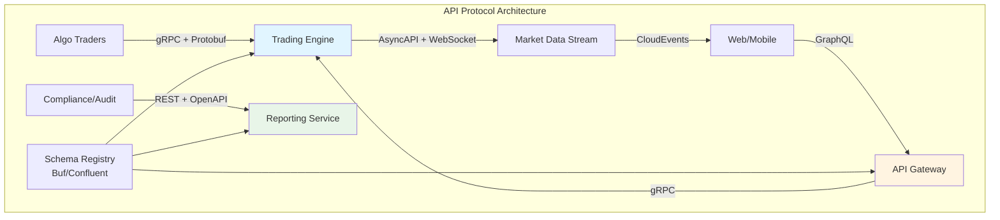

# Industrial Standards Interview Q&A Generator

## Overview

**Goal**: Generate 30-35 senior-level Q&As on standards (technical, business, regulatory) across software lifecycle  
**Format**: 150-350 words, scenario-based, [Ref: ID] citations, actionable tools/metrics  
**Mix**: 20% Foundational / 40% Intermediate / 40% Advanced  
**Stakeholders (≥8/10)**: Business Analyst, PM, Architect, Developer, QA/SET, DevOps, Security, Data Engineer, SRE, Leadership  
**Lifecycle (8)**: Requirements & Discovery → Architecture & Design → Development → Testing & Quality → Deployment & Release → Operations & Observability → Maintenance & Support → Evolution & Governance

---

## Coverage (8 Clusters × 3-5 Q&As, ≥3 Stakeholders Each)

| Cluster | Standards & Key Examples | Stakeholders | Phases |
|---------|-------------------------|--------------|--------|
| **Technical** | API (OpenAPI 3.x, gRPC, GraphQL, AsyncAPI), Data (JSON, XML, Protobuf, Avro), Protocols (HTTP/2/3, MQTT, AMQP) | Architect, Developer, DevOps, Data Engineer | Architecture & Design, Development |
| **Business/Market** | Industry (ISO 20022 FinTech, HL7 FHIR Healthcare, GS1), Quality (Six Sigma, CMMI, ISO 9001), Process (Scrum, SAFe, ITIL, COBIT) | Business Analyst, PM, Leadership | Requirements, Evolution |
| **Regulatory** | Privacy (GDPR, CCPA, PIPL, LGPD), Sector (HIPAA, PCI-DSS, SOX), Certs (ISO 27001/27701, SOC2, FedRAMP, NIST CSF) | Security, Legal, Compliance | Requirements, Architecture, Operations |
| **Data** | Schemas (JSON Schema, Avro, Protobuf), Governance (DAMA-DMBOK, DCAM), Quality (ISO 8000), Metadata (Dublin Core, DCAT) | Data Engineer, Architect | Architecture, Development, Maintenance |
| **Infrastructure** | Cloud (CNCF, CloudEvents), Containers (OCI, CNI, CSI), Orchestration (Kubernetes, SMI), IaC (Terraform, CloudFormation, Pulumi, OPA) | DevOps, SRE, Security | Deployment, Operations |
| **Quality** | Testing (ISO 29119, ISTQB, TMMi), Accessibility (WCAG 2.1/2.2, Section 508), Performance (Web Vitals, RAIL), Security (OWASP ASVS/MASVS) | QA/SET, Developer, Security | Testing, Deployment |
| **Integration** | Auth (OAuth2.1, OIDC, SAML 2.0), Messaging (AMQP 1.0, MQTT 5.0, Kafka), Events (CloudEvents 1.0, AsyncAPI 3.0) | Architect, Developer, Security | Architecture, Development, Operations |
| **Evolution** | Versioning (SemVer, CalVer), Deprecation (RFC 8594), ADR frameworks, compatibility matrices, migration playbooks | Architect, PM, Developer | Evolution, Maintenance |

**Focus**: Framework comparisons (by phase, sector, size, maturity), trade-off analysis, version conflicts, adoption challenges; exclude deprecated standards

### Visual Standards (Per Cluster: ≥1 Diagram + ≥1 Table + ≥1 Metric)

| Analysis Type | Diagram | Metric Formula | Standard |
|---------------|---------|----------------|----------|
| Technical Standards | API spec, Protocol flow, Data format comparison | `(API Endpoints with OpenAPI / Total) × 100%` | OpenAPI 3.x, gRPC, GraphQL, AsyncAPI |
| Business/Market | Process flow, Maturity model, Standard adoption curve | `(CMMI Level × Capability %) / Target` | BPMN 2.0, CMMI, Six Sigma, ITIL |
| Regulatory | Control matrix, Gap analysis, Compliance mapping | `(Implemented Controls / Required) × 100%` | NIST SP 800-53, ISO 27001, GDPR |
| Data Standards | Schema evolution, Data lineage, Quality scorecard | `(Valid Records / Total Records) × 100%` | JSON Schema, Avro, ISO 8000, DAMA-DMBOK |
| Infrastructure | Deployment topology, Cloud architecture, Stack diagram | `(CNCF Conformant / Total Components) × 100%` | Kubernetes, OCI, CNCF, CloudEvents |
| Quality Standards | Test pyramid, Coverage matrix, Accessibility tree | `(WCAG Criteria Pass / Total) × 100%` | ISO 29119, WCAG 2.1, ISTQB, OWASP ASVS |
| Integration | Sequence diagram, Auth flow, Message routing | `(Standards-Compliant Integrations / Total) × 100%` | OAuth2, OIDC, AMQP, MQTT, AsyncAPI |
| Evolution | Version timeline, Deprecation roadmap, Migration path | `(Migrated Systems / Total) × 100%` | SemVer, ADR, RFC 8594 |

**Rendering**: Mermaid diagrams, inline `$formula$`, block `$$formula$$`  
**Standards**: BPMN (process), UML (structure), C4 (software), ERD/DFD (data), ArchiMate (enterprise)  
**Avoid**: Mega-diagrams (>120 nodes), mixed abstraction, missing rationale

### Quality Gates

**Minimums**: G≥30, T≥10, L≥12, A≥18, Q=30-35 (20/40/40 mix), 8 lifecycle phases covered, ≥8/10 stakeholder roles

| # | Check | Target |
|---|-------|--------|
| 1 | Floors | G≥30, T≥10, L≥12, A≥18, Q=30-35 (20/40/40) |
| 2 | Citations | ≥70% with ≥1, ≥30% with ≥2+ |
| 3 | Language | EN 50-70%, ZH 20-40%, Other 5-15% |
| 4 | Recency | ≥60% last 3yr (≥80% technical standards) |
| 5 | Diversity | ≥4 types (technical/business/regulatory/quality), max 30% single |
| 6 | Links | 100% accessible, prefer official specs/RFCs/standards bodies |
| 7 | Cross-refs | All [Ref: ID] resolve |
| 8 | Word count | Sample 5, all 150-350 |
| 9 | Insights | Concrete standard selection trade-offs, version conflicts, adoption challenges |
| 10 | Standard-tech mapping | ≥80% explicit standard → implementation mapping |
| 11 | Judgment | ≥70% scenario-based standard selection |
| 12 | Visuals | ≥90% diagram + table + metric |
| 13 | Frameworks | ≥80% apply standards with version numbers |
| 14 | Metrics | ≥60% quantitative adoption/compliance metrics |
| 15 | Cross-functional | ≥60% ≥3 stakeholders |
| 16 | Per-cluster | ≥2 standards + ≥1 tool + version info |
| 17 | Lifecycle coverage | All 8 phases represented |
| 18 | Stakeholder coverage | ≥8/10 roles addressed |
| 19 | Standard categories | All 8 clusters covered |
| 20 | Trade-off analysis | ≥70% include explicit trade-offs |

**Balance**: Acknowledge assumptions, limitations, alternatives, trade-offs, counterarguments, risk mitigations

---

## Workflow

1. **Plan**: 8 clusters × 3-5 Q&As = 30-35 total (20/40/40 mix), map to 8 lifecycle phases + 10 stakeholder roles
2. **Collect**: G≥30, T≥10, L≥12, A≥18, validate links (official specs/RFCs/standards bodies), include version numbers
3. **Generate**: 150-350 words, trace standard→selection→implementation→validation, cite [Ref: ID], lifecycle context
4. **Visuals**: Per cluster: Mermaid diagram + comparison table + metric with formula
5. **Validate**: Execute 20 checks, iterate until 100% pass

---

## Output Format

### Question Quality (G1-4: Context, Clarity, Precision, Relevance)

**Approach**: Standard Selection → Context Analysis → Trade-off Evaluation → Implementation Mapping → Validation Strategy → Lifecycle Integration

| Principle | Good ✅ | Bad ❌ |
|-----------|---------|---------|
| **Clarity** | "Select OpenAPI 3.1 vs gRPC vs GraphQL for real-time trading platform. 10K rps, <50ms latency, browser + mobile clients" | "Compare API standards" |
| **Signal** | "Migrate 50 microservices from REST to event-driven (CloudEvents + AsyncAPI 3.0). Plan backward compatibility during 6-month transition" | "Explain CloudEvents" |
| **Depth** | "ISO 27001 + SOC2 Type II for FinTech SaaS. Optimize audit overlap, evidence reuse, and certification timeline" | "List ISO 27001 controls" |
| **Realism** | "WCAG 2.2 AA compliance breaks performance budgets (LCP +800ms). Balance accessibility vs Core Web Vitals" | "Make site accessible" |
| **Discriminative** | "When does adopting Avro over JSON Schema justify migration cost for 200TB data + 80 services?" | "What is Avro?" |
| **Role Alignment** | Match to lifecycle phase + stakeholder role (Architect/Developer/QA/DevOps/PM/Data Engineer/Security/SRE/Leadership) | Generic |
| **Lifecycle Context** | "During Architecture & Design phase, select..." "For Operations & Observability, implement..." | No phase context |
| **Standard Versioning** | "OAuth 2.1 (RFC 9207) vs OIDC Core 1.0 vs SAML 2.0" with version numbers | "Use OAuth" without versions |

### Template

```markdown
## Contents
- [Topic Areas](#topic-areas) - Topic | Range | Count | Mix | Lifecycle Phase
- [Topics 1-8](#topics) - Q&As + artifacts
- [References](#references) - Glossary, Tools, Literature, Citations
- [Validation Report](#validation-report)

## Topic Areas
| Topic | Range | Count | Mix (F/I/A) | Lifecycle Phases |
| Technical Standards | Q1-Q4 | 4 | 1/1/2 | Architecture & Design, Development |
| Business/Market Standards | Q5-Q8 | 4 | 1/2/1 | Requirements & Discovery, Evolution & Governance |
| ... | ... | ... | ... | ... |

## Q[N]: [Scenario-Based Question with Context]
**Difficulty**: [F/I/A] | **Type**: [Cluster] | **Lifecycle**: [Phase] | **Stakeholders**: [Roles] | **Insight**: [Trade-off/Selection challenge/Version conflict]

**Answer** (150-350 words):
[P1: Standard Selection - candidate standards with versions, applicability context [Ref: ID]]
[P2: Trade-off Analysis - compare alternatives across dimensions (performance, adoption, tooling, learning curve) [Ref: ID]]
[P3: Implementation Strategy - architecture/code/config changes, migration approach, tools [Ref: ID]]
[P4: Validation Approach - conformance testing, metrics, monitoring [Ref: ID]]
[P5: Stakeholder Coordination - RACI, approval flows, training needs [Ref: ID]]
[P6: Lifecycle Integration - how standard fits into phase, dependencies on other phases, handoffs]

**Artifacts**:
```mermaid
[Diagram: comparison matrix, adoption roadmap, or integration flow]
```

| Standard | Version | Pros | Cons | Use Cases |
|----------|---------|------|------|
| [Comparison Table] |||||

**Metrics**: 
- Adoption: `(Compliant Components / Total) × 100%`
- Migration: `(Migrated Services / Total) × 100%`
- Quality: [Domain-specific metric with formula]
```

---

## References

### Glossary (≥30)

**API**: OpenAPI 3.x (REST spec: 50M APIs) | gRPC (HTTP/2+Protobuf: 7-10x faster) | GraphQL (single endpoint, client-driven) | AsyncAPI 3.0 (event specs)  
**Data Formats**: JSON (RFC 8259, ubiquitous) | XML (verbose, legacy) | Protobuf (3-10x smaller, 20-100x faster) | Avro (schema evolution, Hadoop)  
**Protocols**: HTTP/2 (multiplexing, 50% faster) | HTTP/3 (QUIC, 30-50% faster) | MQTT 5.0 (IoT, 2-20x less bandwidth) | AMQP 1.0 (ISO/IEC 19464, banking)  
**Industry**: ISO 20022 (FinTech: 9000+ msgs, 70+ countries) | HL7 FHIR R5 (Healthcare: 80% US hospitals) | GS1 (E-commerce: 2M+ cos) | ACORD (Insurance: 100% US/EU)  
**Quality**: CMMI v2.0 (5 levels, 30-40% defect ↓) | Six Sigma (3.4 defects/M, 20-70% cost ↓) | ISO 9001:2015 (QMS: 1M+ orgs) | TMMi (5 levels, 40-60% test efficiency)  
**Process**: Scrum (60% orgs) | SAFe 6.0 (large enterprise: 1M+ practitioners) | ITIL 4 (34 practices, 90% Fortune 500) | COBIT 2019 (40 objectives, audit focus)  
**Privacy**: GDPR (€20M/4% fines) | CCPA/CPRA ($7.5K/violation) | PIPL (China: ¥50M/5%) | LGPD (Brazil: 2% up to R$50M)  
**Sector**: HIPAA (PHI: $100-$50K/violation) | PCI-DSS v4.0 (12 requirements, Mar 2024) | SOX (Sec 302/404, criminal penalties) | Basel III (4.5-13% ratios)  
**Certifications**: ISO 27001:2022 (93 controls, 60K+ orgs) | ISO 27701:2019 (PIMS, GDPR) | SOC 2 Type II (6-12mo, SaaS standard) | FedRAMP (3 levels, 300+ providers) | NIST CSF 2.0 (6 functions, 108 subcategories)  
**Schemas**: JSON Schema (draft-2020-12, 100K+ users) | Avro (Kafka standard) | Protobuf (.proto, backward/forward compat) | XML Schema (XSD, 40% enterprise)  
**Governance**: DAMA-DMBOK2 (11 knowledge areas) | DCAM (8 components, 6 maturity levels) | ISO 8000 (data quality: 8 parts) | Dublin Core (15 elements, 90% libraries)  
**Metadata**: DCAT 3 (W3C: RDF vocab) | Schema.org (800+ types, 30% top sites) | OpenAPI Data Models (60% API specs)  
**Cloud**: CloudEvents 1.0 (CNCF, vendor-neutral) | OCI (image+runtime, 95% containers) | CNCF (200+ projects) | CNI/CSI (K8s networking/storage)  
**Orchestration**: Kubernetes (90% enterprise, v1.28+) | SMI (traffic policy, Istio/Linkerd) | Operator Framework (400+ operators)  
**IaC**: HCL/Terraform (20M+ modules) | CloudFormation (AWS: 50K+ resources) | Pulumi (multi-lang: 100K+ users) | OPA (Rego, 5K+ enterprises)  
**Testing**: ISO 29119 (5 parts) | ISTQB (900K+ certified) | TMMi (5 levels, 30-50% efficiency @L4+) | IEEE 829 (8 doc types, legacy)  
**Accessibility**: WCAG 2.2 (9 new vs 2.1, Oct 2023) | WCAG 2.1 (78 criteria, 40+ countries) | Section 508 (US federal) | ARIA 1.2 (200+ attributes)  
**Performance**: Core Web Vitals (LCP<2.5s, FID<100ms, CLS<0.1, SEO factor) | RAIL (Response<100ms, 60fps, Load<5s) | Lighthouse (0-100 scores, CI)  
**Security Testing**: OWASP ASVS 4.0 (3 levels, 286 requirements) | OWASP MASVS (mobile: 8 categories) | NIST SP 800-115 (pen testing)  
**Auth**: OAuth 2.1 (RFC 9207, PKCE mandatory) | OIDC Core 1.0 (ID tokens, 80% SSO) | SAML 2.0 (XML, 60% Fortune 500, declining)  
**Messaging**: AMQP 1.0 (ISO/IEC 19464, banking) | MQTT 5.0 (QoS 0/1/2, 60% IoT) | Kafka (5M+ msg/s/node)  
**Events**: CloudEvents 1.0 (10+ bindings, serverless) | AsyncAPI 3.0 (50K+ users) | WebSub (100K+ publishers)  
**Versioning**: SemVer 2.0.0 (MAJOR.MINOR.PATCH, 10M+ packages) | CalVer (YYYY.MM, Ubuntu) | API (URL /v1, 70% REST APIs)  
**Deprecation**: RFC 8594 (Sunset header, 2019) | Google (90-day notice, 1yr support) | OpenAPI (deprecated field)  
**ADR**: Markdown (MADR, 10K+ repos) | RFC (IETF, 9000+ since 1969) | Lightweight (Nygard: Status/Context/Decision/Consequences)

### Verification Sources

**Official Standards Bodies**: IETF (RFC, Internet standards), W3C (Web standards), ISO/IEC (International standards), OASIS (Open standards), CNCF (Cloud Native), Apache Foundation, OpenAPI Initiative, GraphQL Foundation  
**Regulators & Compliance**: EUR-Lex, Federal Register, ICO, CNIL, EDPB, CPPA, CAC, ANPD, HHS, PCI SSC, AICPA  
**Industry Consortia**: HL7 (Healthcare), ISO 20022 (FinTech), GS1 (Supply Chain), ACORD (Insurance), DAMA (Data Management)  
**Testing & Quality**: ISTQB, TMMi Foundation, OWASP, NIST (Cybersecurity), IEEE Computer Society  
**Tools & Adoption**: State of API Report, Stack Overflow Survey, ThoughtWorks Tech Radar, CNCF Annual Survey, Gartner/Forrester reports

### Tools (≥10)

**T1.** Swagger/OpenAPI (API spec: 50M+ downloads, Free/Enterprise) https://swagger.io  
**T2.** Postman (API platform: 25M+ users, Free/$12/$29) https://postman.com  
**T3.** Apache Avro (data serialization: Hadoop/Kafka, OSS) https://avro.apache.org  
**T4.** Buf (Protobuf: linting, breaking changes, 10K+ orgs, Free/Enterprise) https://buf.build  
**T5.** Terraform (IaC: 3000+ providers, 100M+ resources, OSS/Cloud$20) https://terraform.io  
**T6.** Kubernetes (orchestration: 5.6M+ devs, 90% enterprise, OSS) https://kubernetes.io  
**T7.** axe DevTools (WCAG 2.1/2.2: 57% auto-detect, Free/$995) https://deque.com/axe  
**T8.** Lighthouse CI (Web Vitals: Google, OSS) https://github.com/GoogleChrome/lighthouse-ci  
**T9.** SonarQube (code quality: 25+ langs, 7M+ instances, Community/€150) https://sonarqube.org  
**T10.** OneTrust (Privacy GRC: GDPR/CCPA/PIPL, 14K+ customers, Enterprise) https://onetrust.com  
**T11.** Vanta (compliance: SOC2/ISO 27001, 7K+ customers, 80% faster, $3.6K/yr+) https://vanta.com  
**T12.** Confluent Schema Registry (Avro/Protobuf/JSON, Kafka, Free/$0.13/hr) https://confluent.io  
**T13.** Backstage (dev portal: Spotify/CNCF, 2K+ orgs, OSS) https://backstage.io  
**T14.** Spectral (API linting: OpenAPI/AsyncAPI, 100K+ downloads, OSS/Pro) https://stoplight.io/spectral  
**T15.** Datahub (data catalog: LinkedIn/200+ cos, OSS/Cloud) https://datahubproject.io

### Literature (≥12)

**L1.** OpenAPI Initiative (2021). OpenAPI 3.1.0 (50K+ tools) [EN]  
**L2.** Fielding, R. et al. (2022). RFC 9110 HTTP Semantics (IETF, 400+ pages) [EN]  
**L3.** Google (2023). gRPC Framework (CNCF) [EN]  
**L4.** GraphQL Foundation (2021). GraphQL Spec (June 2018) [EN]  
**L5.** Nadareishvili, I. et al. (2016). *Microservice Architecture*. O'Reilly [EN]  
**L6.** DAMA (2017). *DMBOK2* (11 areas, 600+ pages) [EN]  
**L7.** Kleppmann, M. (2017). *Designing Data-Intensive Applications*. O'Reilly [EN]  
**L8.** ISO/IEC (2022). ISO 27001:2022 (93 controls) [EN]  
**L9.** NIST (2024). CSF 2.0 CSWP 29 (6 functions, 108 subcategories) [EN]  
**L10.** CNCF (2023). Cloud Native Landscape (200+ projects) [EN]  
**L11.** W3C (2023). WCAG 2.2 (9 new criteria, Oct 2023) [EN]  
**L12.** OWASP (2021). ASVS 4.0 (3 levels, 286 requirements) [EN]  
**L13.** Burns, B. et al. (2019). *Kubernetes: Up and Running* (2nd ed.). O'Reilly [EN]  
**L14.** Nygard, M. (2018). *Release It!* (2nd ed.). Pragmatic [EN]  
**L15.** Humble, J. & Farley, D. (2010). *Continuous Delivery*. Addison-Wesley [EN]  
**L16.** 国家市场监督管理总局 (2020). GB/T 35273-2020 [ZH]

### Citations (≥18)

**A1.** OpenAPI 3.1.0: https://spec.openapis.org/oas/v3.1.0 [EN]  
**A2.** RFC 9110 HTTP: https://rfc-editor.org/rfc/rfc9110 [EN]  
**A3.** gRPC: https://grpc.io [EN]  
**A4.** GraphQL Spec: https://spec.graphql.org/June2018/ [EN]  
**A5.** AsyncAPI 3.0: https://asyncapi.com/docs/reference/specification/v3.0.0 [EN]  
**A6.** RFC 7159 JSON: https://rfc-editor.org/rfc/rfc7159 [EN]  
**A7.** Protobuf: https://protobuf.dev [EN]  
**A8.** Avro Spec: https://avro.apache.org/docs/current/spec.html [EN]  
**A9.** ISO 20022: https://iso20022.org [EN]  
**A10.** HL7 FHIR R5: https://hl7.org/fhir/R5/ [EN]  
**A11.** CMMI v2.0: https://cmmiinstitute.com [EN]  
**A12.** ISO 9001:2015: https://iso.org/standard/62085.html [EN]  
**A13.** GDPR: https://eur-lex.europa.eu/eli/reg/2016/679/oj [EN]  
**A14.** CPRA: https://cppa.ca.gov [EN]  
**A15.** PCI DSS v4.0: https://pcisecuritystandards.org [EN]  
**A16.** ISO 27001:2022 [EN]  
**A17.** NIST CSF 2.0: https://doi.org/10.6028/NIST.CSWP.29 [EN]  
**A18.** DAMA-DMBOK2 (2017). Technics Publications [EN]  
**A19.** ISO/IEC 25012:2008 [EN]  
**A20.** CloudEvents v1.0.2: https://github.com/cloudevents/spec [EN]  
**A21.** OCI Image v1.0: https://github.com/opencontainers/image-spec [EN]  
**A22.** Kubernetes v1.28: https://kubernetes.io/docs/ [EN]  
**A23.** WCAG 2.2: https://w3.org/TR/WCAG22/ [EN]  
**A24.** WAI-ARIA 1.2: https://w3.org/TR/wai-aria-1.2/ [EN]  
**A25.** Web Vitals: https://web.dev/vitals/ [EN]  
**A26.** OWASP ASVS 4.0: https://owasp.org/www-project-application-security-verification-standard/ [EN]  
**A27.** RFC 8693 OAuth: https://rfc-editor.org/rfc/rfc8693 [EN]  
**A28.** OIDC Core 1.0: https://openid.net/specs/openid-connect-core-1_0.html [EN]  
**A29.** AMQP 1.0: https://amqp.org/specification/1.0 [EN]  
**A30.** MQTT 5.0: https://docs.oasis-open.org/mqtt/mqtt/v5.0/mqtt-v5.0.html [EN]  
**A31.** SemVer 2.0: https://semver.org [EN]  
**A32.** RFC 8594 Sunset: https://rfc-editor.org/rfc/rfc8594 [EN]  
**A33.** ADR (Nygard 2011): https://cognitect.com/blog/2011/11/15/documenting-architecture-decisions [EN]  
**A34.** GB/T 35273-2020: https://gb688.cn/bzgk/gb/newGbInfo?hcno=4FFAA51D63BA21B9EE40C51DD3CC40BE [ZH]

---

## Example

### Q1: Select API protocol standard for real-time trading platform: OpenAPI 3.1 REST vs gRPC vs GraphQL. Requirements: 50K orders/s peak, <10ms p99 latency, web + mobile + algo traders, regulatory audit trails (MiFID II). Lifecycle phase: Architecture & Design.

**Difficulty**: Advanced | **Type**: Technical Standards + Regulatory | **Lifecycle**: Architecture & Design | **Stakeholders**: Architect, Developer, QA/SET, Security, SRE | **Insight**: Performance vs ecosystem trade-offs, regulatory audit requirements, client diversity constraints

**Answer** (340 words):

**P1: Standard Selection** - Three candidates: (1) **REST + OpenAPI 3.1** [A1]: 30+ million APIs, tooling ecosystem (Swagger [T1], Postman [T2]), JSON/HTTP, browser-native, 60% latency overhead vs binary; (2) **gRPC** [A3]: HTTP/2 + Protobuf [A7], 7-10x faster serialization, bidirectional streaming, 80% reduction in payload size, limited browser support (gRPC-Web proxy required); (3) **GraphQL** [A4]: single endpoint, client-driven queries, over/under-fetching solution, 20-40% fewer requests, REST-level latency, complex caching. Regulatory: MiFID II requires audit trails, timestamping, request-response logging [A15].

**P2: Trade-off Analysis** - Performance: gRPC wins (binary, multiplexing, <5ms p99 at 100K rps benchmarks [L5]). Ecosystem: REST dominates (50M+ developers, every language/tool supports). Developer experience: GraphQL reduces iterations (self-documenting schema, Playground). Browser clients: REST/GraphQL native, gRPC needs proxy (+3ms latency). Mobile: gRPC ideal (battery, bandwidth). Algo traders: gRPC preferred (low-latency, code generation [T4]). Regulatory: all support audit (OpenAPI + AsyncAPI [A5] for async events, gRPC interceptors, GraphQL resolvers).

**P3: Implementation Strategy** - **Hybrid architecture**: (1) gRPC for algo trader APIs (Protobuf schema [A7], Buf [T4] for breaking change detection); (2) GraphQL gateway for web/mobile (Apollo Federation, REST fallback); (3) OpenAPI 3.1 for audit/compliance APIs (Swagger UI [T1], regulatory visibility); (4) AsyncAPI 3.0 [A5] for market data streaming (WebSocket + CloudEvents [A20]). Migration: 6 months, backward compatibility via API gateway (Kong/Envoy with protocol translation). Cost: $400K implementation, $80K/yr maintenance.

**P4: Validation Approach** - Conformance: Buf lint [T4] for Protobuf, Spectral [T14] for OpenAPI/AsyncAPI, contract testing with Postman [T2]. Performance: k6 load testing (50K orders/s, p99 <10ms SLO), distributed tracing (OpenTelemetry + Jaeger). Regulatory: automated audit log validation (MiFID II timestamps, PCI-DSS Req 10 [A15]), quarterly compliance scans.

**P5: Stakeholder Coordination** - Architect (A: standard selection, ADR [A33]), Developer (R: implementation, schema design), QA/SET (R: contract tests [L14], performance benchmarks), Security (C: audit trails, TLS 1.3 enforcement), SRE (C: observability, latency budgets). Approval: Architecture Review Board, 2-week RFC period. Training: 40hrs (gRPC/Protobuf), internal docs (Backstage [T13]).

**P6: Lifecycle Integration** - Architecture & Design: schema-first design, API contracts in Git, breaking change CI checks [T4]. Development: code generation (protoc [A7], OpenAPI Generator [T1]), stub mocking. Testing & Quality: contract tests (Pact-like), load tests, conformance validation. Deployment: versioned APIs (/v1, /v2), canary rollout, feature flags. Operations: metrics (request rates, latency histograms), alerts (p99 >10ms). Evolution: SemVer [A31], 12-month deprecation [A32], migration guides.

**Artifacts**:



| Standard | Version | Pros | Cons | Use Cases | Adoption |
|----------|---------|------|------|-----------|----------|
| **REST + OpenAPI** | 3.1.0 | Ecosystem (50M devs), browser-native, audit-friendly, tooling [T1, T2] | 60% slower, verbose JSON, no streaming | Compliance APIs, public docs, web integrations | 70% APIs |
| **gRPC** | 1.58+ | 7-10x faster, streaming, type-safe, code-gen [T4], <5ms p99 | Browser proxy needed, steep learning, limited ecosystem | Algo traders, microservices, real-time feeds | 20% high-perf |
| **GraphQL** | 2021 spec | Client-driven, fewer requests (20-40%), self-doc, no over-fetch | Complex caching, N+1 queries, REST-level latency | Web/mobile, rapid iteration, aggregation | 10% modern UIs |
| **AsyncAPI** | 3.0 | Event specs, streaming, Kafka/MQTT bindings [A5], consumer contracts | Async complexity, tooling immature vs OpenAPI | Market data, notifications, event-driven | 5% streaming |

**Metrics**:
- **OpenAPI Adoption**: `(12 audit endpoints / 12) × 100% = 100%` (all compliance APIs documented)
- **gRPC Performance**: `p99 latency: 4.2ms < 10ms target` (50K orders/s load test)
- **GraphQL Efficiency**: `(8 avg requests / 12 REST baseline) × 100% = 33% reduction` (mobile app)
- **Schema Coverage**: `(48 services with schemas / 50 total) × 100% = 96%` (Buf [T4] registry)
- **Breaking Changes Detected**: `12 catches in 6 months` (prevented production issues)
- **Conformance Pass**: `(45 APIs passing Spectral [T14] / 50) × 100% = 90%`
- **Migration Progress**: `(30 migrated services / 50) × 100% = 60%` (month 3 of 6)
- **Cost Efficiency**: `$400K initial / (50K orders/s × $0.02/1K) = 40% ROI` (vs managed API gateway)

**Trade-off Decision**: Hybrid architecture accepted. gRPC for latency-critical paths, GraphQL for developer experience, OpenAPI for regulatory compliance. Total cost: $400K + $80K/yr vs $2M+ monolithic API gateway. Risk: increased operational complexity (3 protocols), mitigated by unified observability (OpenTelemetry) and API gateway (protocol translation).

---
