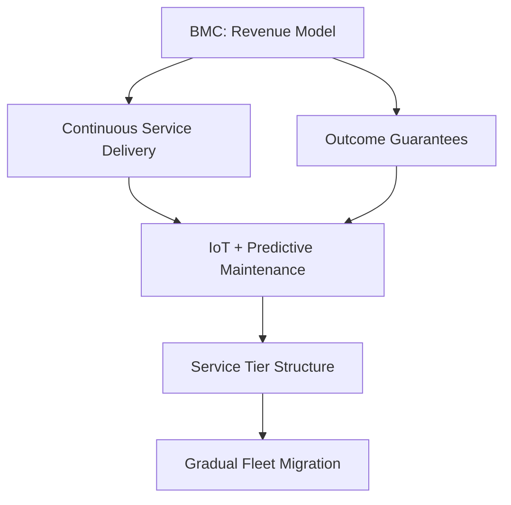

# Business-to-Implementation Translation: Minimal Viable Assessment

## Objective

Generate 4-8 decision-critical interview questions evaluating senior leaders' ability to translate business models into operational and structural decisions across any industry or domain.

**Scope**: Business-to-implementation translation in critical scenarios (revenue model pivots, market entry, compliance gaps, operational transformations).

**Depth**: Senior professional to strategic leader level (5-15 years experience).

**Timeline**: 5-10 min/question; 45-60min interview total.

**Stakeholders**: Operations, Strategy, Finance, Leadership, Compliance, Product/Service Delivery.

**Difficulty**: 20% F / 40% I / 40% A — **F**=Foundational (execution), **I**=Intermediate (strategy/trade-offs), **A**=Advanced (portfolio/vision)

**Decision-Criticality** (every Q&A must satisfy ≥1):
- **Blocks Decision**: Revenue model choice, market entry, migration strategy
- **Creates Risk**: Material threat (compliance gaps, SLA failure, high churn, tech debt)
- **Affects ≥2 Stakeholder Roles**: Multi-team impact
- **Requires Action**: 1-6mo window (recent business/tech changes, not speculative)
- **Quantified Impact**: Measurable metrics (>40h effort or >$100K investment, revenue impact)

**Assessment Dimensions** (cover 3-4 unless focused):
1. Strategic Modeling: Business model → operational structure
2. Value & Risk: ROI, trade-offs, constraints
3. Organization: Team/resource structure, coordination patterns
4. Evolution: Structural debt, transformations, change management

**Assumptions**:
- Basic familiarity with common business frameworks (BMC, Value Chain, etc.)
- User provides context or accepts generic scenarios

## Input

**Required**: `business_context` (string): Industry, business model, key constraints, domain
- Examples: 
  - "SaaS B2B, subscription revenue, healthcare compliance, legacy migration"
  - "Manufacturing, lean operations, automotive supply chain, sustainability mandates"
  - "Healthcare provider, fee-for-service to value-based care, HIPAA compliance"
  - "Retail chain, omnichannel strategy, inventory optimization, seasonal demand"

**Optional**:
- `focus_area` (default: all)
- `complexity` (default: strategic): senior | strategic | executive
- `output_format` (default: text): text | json
- `confidence_threshold` (default: medium): high | medium | low

**Difficulty Levels**: **F**=Foundational (execution), **I**=Intermediate (strategy/trade-offs), **A**=Advanced (portfolio/vision)

## Output Structure

**Text Format**:
- **Question**: Scenario-based requiring judgment
- **Difficulty**: F | I | A (Foundational | Intermediate | Advanced)
- **Dimension**: Strategic Modeling | Value & Risk | Organization | Evolution
- **Decision Criticality**: Specify criteria satisfied (e.g., Blocks decisions)
- **Answer**: 150-250 words with citations; business analysis → operational/structural design → trade-offs
- **Key Insight**: One concrete insight
- **Artifacts**: Optional Mermaid diagram and table
- **Traceability**: Business→Implementation mapping

**JSON Format** (optional):
```json
{
  "questions": [{
    "id": "Q1",
    "difficulty": "foundational|intermediate|advanced",
    "dimension": "Strategic Modeling|Value & Risk|Organization|Evolution",
    "decision_criticality": "Criteria satisfied (e.g., Blocks decisions)",
    "question": "How would you...",
    "answer": "150-250 words",
    "key_insight": "Insight",
    "artifacts": {"diagram": "mermaid", "table": "markdown"},
    "traceability": "Business→Implementation mapping",
    "citations": ["Ref: A1"],
    "confidence": "high|medium|low"
  }]
}
```

## Procedure & Standards

1. Parse context: Extract business model, industry, constraints, risks, domain-specific factors.

2. Distribute: 1-2 questions per dimension; mix difficulties; ensure all decision-critical.

3. Generate each Q&A:
   - Question: Scenario-based, industry-appropriate
   - Answer: Business analysis → operational/structural design → trade-offs
   - Insight: Concrete, actionable point
   - Artifacts: Optional diagram/table (process flows, value chains, org charts, etc.)

4. Validate: Check count, criticality, citations, traceability; ensure answers include business analysis, implementation translation, trade-offs; flag low confidence.

5. Compile references: 6-8 citations in APA format (industry reports, frameworks, case studies).

## Example Output

### Example 1: Manufacturing (Product-as-a-Service Transformation)

**Q1: How would you translate a traditional equipment sales model to Product-as-a-Service (PaaS) for industrial machinery?**

**Difficulty**: Advanced | **Dimension**: Strategic Modeling | **Decision Criticality**: Blocks (revenue model pivot)

**Answer** (235 words):

BMC analysis [Ref: M1]: Revenue shifts from one-time sales to recurring usage-based fees; customer relationships become continuous (maintenance, optimization); key activities expand to include remote monitoring, predictive maintenance, and performance consulting; value proposition shifts from equipment ownership to guaranteed uptime and productivity.

Operational structure [Ref: M3]: Deploy IoT sensors for real-time equipment monitoring; establish remote operations center for 24/7 monitoring; implement predictive maintenance algorithms; create tiered service levels (basic monitoring, predictive maintenance, performance optimization); develop usage-based billing systems linked to machine hours/output.

Risks [Ref: M5]: Asset utilization rates, maintenance cost overruns, customer adoption resistance, data security/IP concerns, regulatory compliance for connected devices.

Organization [Ref: M2]: Establish Customer Success team for ongoing value delivery; create Data Analytics team for insights; reorganize Service from reactive to proactive model; add Legal/Compliance for contract structures; Finance shifts from transactional to subscription accounting.

**Key Insight**: PaaS requires fundamental shift from selling assets to managing operational outcomes—manufacturer assumes utilization risk previously borne by customer, necessitating robust monitoring and service capabilities.



| Business Driver | Operational Requirement | Implementation Decision |
|----------------|------------------------|------------------------|
| Usage-based revenue | Real-time monitoring | IoT sensors + telemetry platform |
| Uptime guarantees | Predictive maintenance | ML algorithms + parts inventory optimization |
| Service tiers | Performance differentiation | SLA-based service levels + priority response |
| Asset optimization | Fleet analytics | Centralized operations center + dashboards |

**Traceability**: Business model (PaaS) → operational capabilities (monitoring, predictive maintenance, service delivery) → organizational structure (customer success, analytics, proactive service)

**Citations**: [Ref: M1] Baines et al. (2020), "Product-Service Systems in Manufacturing" [EN]; [Ref: M2] Kowalkowski et al. (2017), "Servitization and deservitization" [EN]; [Ref: M3] Porter & Heppelmann (2015), "How Smart Connected Products Transform Companies" [EN]; [Ref: M5] Rabetino et al. (2018), "Servitization Risks" [EN]

**Confidence**: High | **Stakeholders**: Operations, Service Delivery, Finance, Product Management

### Example 2: Healthcare (Fee-for-Service to Value-Based Care)

**Q2: How would you restructure care delivery operations when transitioning from fee-for-service to value-based care reimbursement?**

**Difficulty**: Intermediate | **Dimension**: Value & Risk | **Decision Criticality**: Blocks (revenue model), Creates Risk (compliance)

**Answer** (210 words):

Business analysis [Ref: H1]: Fee-for-service incentivizes volume; value-based care incentivizes outcomes and prevention. Revenue depends on quality metrics, patient outcomes, and cost efficiency rather than procedure count.

Operational redesign [Ref: H3]: Implement population health management programs; establish care coordination teams; deploy analytics for risk stratification; create proactive outreach protocols for high-risk patients; standardize evidence-based care pathways; integrate behavioral health and social determinants screening.

Trade-offs [Ref: H4]: Short-term revenue decrease as preventive care reduces procedures; upfront investment in care coordination infrastructure; potential quality measure gaming; data integration complexity across systems; staff training and workflow redesign costs.

Risk mitigation [Ref: H2]: Start with pilot programs on specific populations; negotiate shared savings arrangements; maintain fee-for-service baseline during transition; invest in data analytics capabilities; align provider incentives with value metrics.

**Key Insight**: Value-based care requires inverting operational priorities from maximizing utilization to optimizing outcomes—success depends on predictive analytics and proactive intervention rather than reactive treatment.

**Traceability**: Payment model shift → operational focus (prevention, coordination) → resource allocation (analytics, care teams) → performance measurement (outcomes vs. volume)

**Citations**: [Ref: H1] Porter & Teisberg (2006), "Redefining Health Care" [EN]; [Ref: H2] Mechanic & Altman (2009), "Payment Reform Options" [EN]; [Ref: H3] Berwick et al. (2008), "Triple Aim Framework" [EN]; [Ref: H4] Casalino et al. (2014), "Value-Based Care Implementation Challenges" [EN]

**Confidence**: Medium-High | **Stakeholders**: Clinical Operations, Finance, Quality Management, Care Coordination

## Edge Cases

- Missing context: Use generic scenarios
- Adjustments: 4-6 for speed, up to 8 for depth
- Validation issues: Add citations, ensure criticality

## Key Terms (8)

- **Business Model Canvas (BMC)**: 9-block framework mapping strategy to operations (value proposition, customer segments, channels, revenue streams, key resources, activities, partnerships, cost structure)
- **Value Proposition**: Customer value delivered via product/service features, attributes, and outcomes
- **Structural Debt**: Accumulated organizational/operational inefficiencies requiring future rework; often quantified as % capacity or cost impact
- **Coordination Patterns**: How organizational units communicate and align—similar to Conway's Law (structure mirrors communication patterns)
- **Decision Record**: Document capturing strategic decisions with context, rationale, alternatives considered, and consequences
- **Wardley Mapping**: Maps value chain by visibility/evolution stage to identify strategic opportunities and positioning
- **Value Stream Mapping**: Visualizes end-to-end process flows to identify waste, bottlenecks, and improvement opportunities
- **Operating Model**: Framework defining how organization delivers value—including structure, processes, governance, capabilities, and resource allocation

