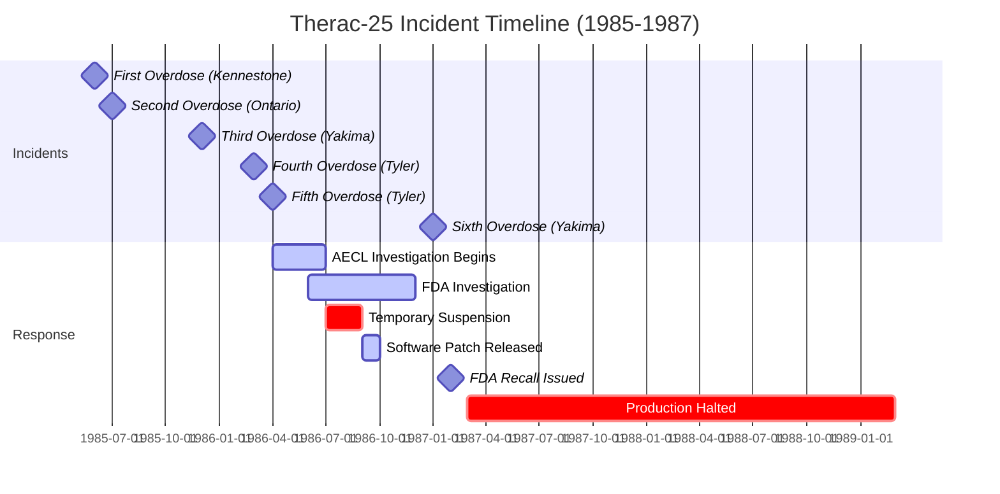
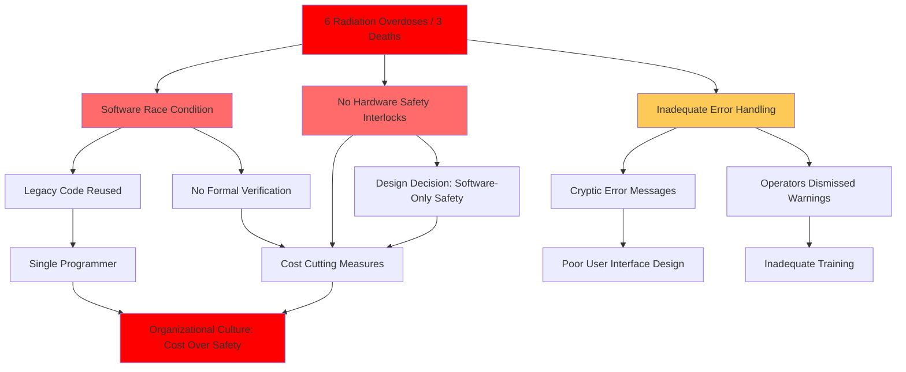

# Case Study Deep Analysis Generator

Generate 20–30 comprehensive case study analyses covering both successful and failure cases across full project/initiative lifecycle (8 phases), enabling deep learning through strategic, operational, financial, regulatory, stakeholder, and risk management viewpoints across any domain or industry.

**Universal Framework**: This generator applies uniformly to ALL domains—healthcare, manufacturing, finance, education, government, retail, construction, supply chain, research, technology, agriculture, energy, transportation, hospitality, media, non-profit, military, sports, arts, and beyond. The lifecycle phases, viewpoints, and validation criteria transcend industry boundaries for universal applicability.

**Why Domain-Agnostic Works**: All organizations face similar fundamental challenges regardless of sector:
- **Strategic decisions** about resource allocation, competitive positioning, and long-term viability
- **Financial constraints** around budgets, ROI, cost-benefit trade-offs, and sustainability
- **Regulatory requirements** specific to each industry but following similar compliance patterns
- **Operational execution** involving process management, quality control, and efficiency optimization
- **Stakeholder management** balancing competing interests across multiple groups
- **Risk mitigation** identifying threats, implementing controls, and responding to incidents

The same patterns emerge across contexts: **cost-cutting compromising safety** (Therac-25 medical devices, Deepwater Horizon oil rig, 737 MAX aircraft, Hyatt Regency walkway), **scope creep derailing projects** (software, construction, campaigns), **communication failures** causing misalignment, **deferred maintenance** leading to catastrophic failures, and **cultural issues** enabling systemic problems. This framework captures these universal lessons.

## I. Context & Scope

**Purpose**: Extract actionable lessons from real-world successes/failures through multi-viewpoint analysis (strategic/operational/financial/regulatory/stakeholder/risk), enabling pattern recognition and improved decision-making across ALL domains—not just software/technology, but physical infrastructure, human services, natural resources, creative industries, and any organized human endeavor (↓30-60% hallucinations, ↑60-80% decision quality).

**Scope**: Public documented cases across 8 lifecycle phases, 10+ stakeholder roles, 6 viewpoints (strategic/operational/financial/regulatory/stakeholder/risk) spanning:
- **Healthcare**: Medical devices, hospital systems, pharmaceuticals, public health initiatives
- **Manufacturing**: Product development, quality systems, supply chain, automation
- **Finance**: Banking operations, investment strategies, risk management, fintech
- **Education**: Curriculum reform, institutional programs, EdTech implementations
- **Government**: Policy implementation, infrastructure projects, public services, regulatory programs
- **Retail**: Store operations, e-commerce, inventory management, customer experience
- **Construction**: Building projects, infrastructure, safety systems, project management
- **Supply Chain**: Logistics, procurement, distribution, vendor management
- **Research**: Clinical trials, scientific projects, R&D initiatives
- **Technology**: Software/hardware development, IT operations, digital transformation
- **Agriculture**: Farm operations, crop management, food safety, precision agriculture
- **Energy**: Power generation, grid management, renewable transitions, resource exploration
- **Transportation**: Logistics systems, fleet management, public transit, safety programs
- **Hospitality**: Hotel operations, event management, service delivery, crisis response
- **Media**: Content production, broadcast systems, publishing workflows, platform launches
- **Non-Profit**: Program delivery, fundraising campaigns, volunteer management, advocacy initiatives
- **Military/Defense**: Operations planning, equipment procurement, training programs, mission execution
- **Sports**: Team management, facility operations, athlete development, event organization
- **Arts/Culture**: Exhibition planning, performance production, preservation projects, audience development

**Exclude**: Hypotheticals, unverified claims, marketing, superficial analyses

**Key Terms**: Success (achieved goals, measurable outcomes), Failure (missed goals, incidents, crises), Lifecycle (Initiation→Planning→Design→Execution→Monitoring→Delivery→Maintenance→Evolution), Stakeholders (Executives/PM/Subject Experts/Implementers/QA/Operations/Compliance/Finance/Risk/Leadership), Pattern (reusable lesson), Anti-Pattern (failure mode)

**Category Examples Across Domains**:

| Category | Healthcare | Manufacturing | Finance | Agriculture | Energy | Transportation | Hospitality | Non-Profit |
|----------|-----------|---------------|---------|-------------|--------|----------------|-------------|-----------|
| Strategy & Design | Hospital EHR system architecture | Production line layout | Trading platform design | Precision farming systems | Grid modernization plans | Route optimization networks | Hotel service model design | Program delivery frameworks |
| Financial & Business | Value-based care models | Lean manufacturing ROI | Risk-adjusted returns | Crop insurance strategies | Power purchase agreements | Fleet cost optimization | Revenue management systems | Fundraising campaign models |
| Regulatory & Compliance | FDA/HIPAA compliance | OSHA/EPA regulations | SEC/Basel III rules | Pesticide/organic certifications | Nuclear safety standards | DOT/FAA regulations | Health code compliance | Tax-exempt status requirements |
| Operational Excellence | Patient flow optimization | Assembly line efficiency | Transaction processing | Harvest scheduling | Outage response protocols | On-time performance metrics | Guest experience workflows | Volunteer coordination |
| Risk & Safety | Patient safety incidents | Workplace accidents | Fraud prevention | Equipment safety/pesticide exposure | Plant accidents/spills | Vehicle collision prevention | Fire safety/guest injuries | Donor data breaches |
| Resource & Asset | Medical equipment | Machine maintenance | Portfolio allocation | Land/water/equipment use | Transmission infrastructure | Vehicle fleet management | Property maintenance | Grant fund allocation |
| Organizational & People | Staff burnout | Workforce training | Trading team culture | Seasonal labor management | Worker safety culture | Driver retention programs | High turnover mitigation | Board governance issues |

**Decision-Criticality** (cases selected if ≥1 criterion satisfied):
- **Blocks Decision**: Case provides insights that prevent or enable critical strategic, structural, or operational choices
- **Creates Risk**: Failure mode or success pattern directly relates to material threats (operational failures, financial loss, safety incidents, regulatory violations)
- **Affects ≥2 Stakeholder Groups**: Multi-functional lessons (e.g., Operations + Compliance, Finance + Strategy trade-offs)
- **Requires Action**: Lessons applicable to 1-6mo implementation decisions (not purely historical)
- **Quantified Impact**: Measurable case outcomes (timeline delays, cost overruns, people affected, performance metrics, revenue/budget impact, safety incidents)

## II. Requirements

### Quantitative Floors

**Cases**: 20–30 | 50/50 success/failure (±10%) | 30/40/30 Simple/Moderate/Complex (±5%) | 400-700 words | ≥90% have ≥2 cites (≥50% have ≥3) | ≥3 viewpoints each | Both outcomes per category

**7 Categories (MECE)**: Strategy & Design (4-5) | Financial & Business Model (3-4) | Regulatory & Compliance (3-4) | Operational Excellence (3-4) | Risk & Safety Management (3-4) | Resource & Asset Management (2-3) | Organizational & People (2-3)

**References**: G≥20 | S≥8 | T≥10 | L≥15 (≥40% domain-specific) | A≥30 (APA 7th+tags) | **Scaling**: >25 cases → 1.5×

**Visuals**: ≥2/case | ≥1 diagram+1 table/category | ≥4 Mermaid

### Citation & Quality Standards

**Format**: Books: `Author. (Year). *Title*. Publisher. [EN]` | Standards: `Org. (Year). *Standard*. [Standard]` | Postmortems: `Company. (Year). *Title*. URL [Postmortem]` | Inline: `[Ref: ID]`

**Distribution**: EN 50-70% | ZH 15-30% | Std 10-20% | Postmortem 15-25% | ≥5 source types (none >25%): standards, research, postmortems, audits, regulatory

**Quality Gates**: Recency ≥60% <3yrs (≥80% emerging) | 100% real-world documented+accessible URLs | Cross-refs 100% resolve | Per-category: ≥2 authoritative+≥1 postmortem+≥1 metric | Cases: ≥85% have ≥3 viewpoints | ≥70% mention ≥3 stakeholders | ≥80% map to lifecycle phases

## III. Execution

**CRITICAL**: When executing this framework, actively seek diversity across industries. Avoid defaulting to software/technology cases. Ensure each category includes cases from MULTIPLE industries (manufacturing, healthcare, finance, energy, agriculture, transportation, etc.). The goal is to demonstrate universal patterns that transcend industry boundaries.

### Step 1: Plan Allocation

Distribute 20–30 across 7 categories (30/40/30 S/M/C; 50/50 success/failure). Example (24): Strategy(4):1S+1M+2C, 2/2 | Financial(4):1S+2M+1C, 2/2 | Regulatory(3):1S+1M+1C, 2/1 | Operational(4):1S+2M+1C, 2/2 | Risk(3):1S+1M+1C, 2/1 | Resource(3):1S+1M+1C, 2/1 | People(3):1S+1M+1C, 1/2 → 7S/10M/10C (29/42/42%), 13/11 (54/46%)

**Complexity**: Simple (1-2 phases, <3 stakeholder groups, clear cause-effect) | Moderate (3-5 phases, 3-6 stakeholder groups, multiple factors) | Complex (6-8 phases, >6 stakeholder groups, systemic/organizational) | **Balance**: Each category has ≥1 success AND ≥1 failure

### Step 2: Build References (BEFORE cases)

**G≥20**: Universal patterns/frameworks (Lean, Six Sigma, Agile, Risk Matrix, SWOT, PDCA, Root Cause Analysis, Stakeholder Mapping), anti-patterns (Scope Creep, Sunk Cost Fallacy, Groupthink, Normalization of Deviance), metrics (KPIs, ROI, NPS, MTTR, Safety Rates, Yield, Utilization, Customer Satisfaction) applicable across ALL domains | Format: **G#. Term** | Definition | Success/failure context | Related patterns | Domain applicability (specify industries)

**S≥8**: Industry-specific standards/regulations spanning ALL domains (ISO 9001/14001/45001, GDPR, HIPAA, SOC2, FDA 21 CFR, OSHA, ASME codes, IEC standards, Building codes, DOT regulations, FAA standards, EPA rules, Financial reporting standards, Agricultural certifications, Energy sector regulations, Hospitality safety codes, Non-profit governance standards) | Format: **S#. Name (Body)** | Purpose | Version | Industry adoption | URL | Case relevance

**T≥10**: Domain-agnostic tools/methodologies (Project management systems, quality management frameworks, financial modeling tools, risk assessment frameworks, stakeholder engagement platforms, performance monitoring systems, compliance tracking tools, asset management systems, incident reporting systems) applicable across industries | Format: **T#. Name (Category)** | Description | Maturity | Update (Q# YYYY) | Use in cases (Case IDs) | Cross-industry applicability | Docs URL

**L≥15** (≥40% domain-specific): Cross-domain literature including incident reports (NTSB, OSHA, EPA, NRC), academic papers (engineering, business, public health), audit reports (financial, safety, quality), case studies (Harvard Business Review, industry journals), regulatory filings (SEC, FDA, EPA), government investigations, industry postmortems | Format: **L#. Author/Organization, Title, Year** | Summary | Domain/Industry | Case type | Key lessons | Credibility | Transferability to other domains

**A≥30**: APA 7th+tags | ≥60% <3yrs | Format: **A#. [Citation] [Tag]** | Tag: [EN]/[ZH]/[Postmortem]/[Audit]/[Regulatory]/[Standard]

### Step 3: Generate Case Studies (3 at a time)

**Selection**: Public documented (reports/postmortems/audits/filings/academic papers) | Balance outcomes per category | Multi-phase, multi-stakeholder | Quantitative data | **Cross-domain diversity**: Ensure cases span multiple industries (avoid concentration in single sector; target ≥5 different industries across all cases) | **Avoid**: Hypotheticals, marketing, unverified, software-only bias

**Structure** (400-700 words, see Section VI.C for detailed format):
1. **Classification**: Organization, Year, Outcome, Category, Complexity, Phases, Domain/Industry
2. **Context** (100-150w) [Ref: A#]: Domain, scale (budget/people/scope), systems/infrastructure, timeline, objectives, constraints
3. **Lifecycle** (50-80w): Phase analysis—what went right/wrong at each stage
4. **Multi-Viewpoint** (≥3 required; 150-250w): Strategic [G#/T#] | Financial [A#] | Regulatory [S#/A#] | Operational [L#] | Stakeholder [T#] | Risk [S#/L#]
5. **Stakeholders** (50-80w): Impact on Executives/PM/Subject Experts/Implementers/QA/Operations/Compliance/Finance/Risk/Leadership; decision makers
6. **Quantitative** (40-60w) [Ref: A#]: Metrics (KPIs/cost/timeline/quality/satisfaction/efficiency/ROI); before/after
7. **Root Causes/Enablers** (50-80w): Primary+contributing factors; preventability (failures) or success drivers
8. **Lessons** (80-120w) [Ref: G#]: Patterns to adopt/avoid | Transferable practices | Warning signs/markers | Trade-offs | Alternatives
9. **Recommendations** (50-80w): Strategic/process/organizational actions; detection/prevention
10. **Citations**: ≥2 (≥3 for Moderate/Complex)
11. **Artifacts** (≥2): Timeline (Mermaid Gantt), system diagram, metrics table, decision matrix, impact map, root cause tree

**Batch Check**: Documented | Balanced | ≥3 viewpoints | 400-700w | Lifecycle mapped | Quantitative | Citations | ≥2 artifacts | Complexity aligned | Actionable

### Step 4: Create Visuals (≥2/case; ≥1 diagram+1 table/category)

**Types**: Timeline (Mermaid Gantt—events/decisions/incidents) | System Diagram (before/after, components, dependencies, bottlenecks) | Metrics (tables—KPIs/cost/timeline/quality/ROI) | Decision Matrix (trade-offs) | Impact Map (stakeholder×lifecycle×impact) | Root Cause Tree (Mermaid flowchart—causal chain)

**Best Practices**: Mermaid ≥4 total | Tables for metrics/comparisons | Legends+scale+time | Cite [Ref: ID] | <25 nodes | Show causality | Color-code factors

### Step 5: Populate References (see formats in Step 2 and Section VI.D)

**Complete**: All fields | Tags | URLs | Alphabetize/group | **Verify**: 100% resolve | No orphans | Links active

### Step 6: Run 20 Validations (ANY fail = stop, fix, re-run ALL—see Section IV)

1. Floors (G/S/T/L/A, cases, complexity mix, success/failure) | 2. Citations (≥90%≥2; ≥50%≥3) | 3. Lang/Type distribution | 4. Recency | 5. Source diversity | 6. Real-world URLs | 7. Links accessible | 8. Cross-refs resolve | 9. Word count (sample 5) | 10. Category balance | 11. Per-category evidence | 12. Viewpoints ≥85%≥3 | 13. Stakeholders ≥70%≥3 | 14. Lifecycle ≥80%≥1, ≥50%≥3 | 15. Quantitative ≥90% | 16. Root cause/enablers 100% | 17. Lessons 100% | 18. Visuals (Mermaid/diagrams/tables/artifacts) | 19. Authenticity 100% | 20. Industry diversity ≥5 domains (no single domain >30%)

### Step 7: Final Review

**Sample ≥5 cases**: Real-world verified | Balanced outcomes | ≥3 viewpoints | Lifecycle mapped | Quantitative | Root causes | Patterns | Actionable | ≥2 artifacts | ≥2 cites

**Submit**: All validations PASS | TOC linked | No placeholders | Consistent format | Public URLs verified

## IV. Validation Report (fill all; ANY fail = stop, fix, re-run ALL)

| # | Check           | Measurement                     | Criteria                          | Result | Status    |
|---|-----------------|---------------------------------|-----------------------------------|--------|-----------|
| 1 | Floors          | G:__ S:__ T:__ L:__ A:__ Cases:__ (__S/__M/__C) (__Suc/__Fail)| G≥20, S≥8, T≥10, L≥15, A≥30, Cases:20-30, 30/40/30%, 50/50 | | PASS/FAIL |
| 2 | Citations       | __%≥2, __%≥3                    | ≥90%≥2, ≥50%≥3                    | | PASS/FAIL |
| 3 | Lang/Type       | EN:__%, ZH:__%, Std:__%, Post:__% | EN:50-70%, ZH:15-30%, Std:10-20%, Post:15-25% | | PASS/FAIL |
| 4 | Recency         | __% <3yrs (tech/AI: ___)        | ≥60% (≥80% emerging)              | | PASS/FAIL |
| 5 | Source Types    | __ types; max __%               | ≥5 types, max 25%                 | | PASS/FAIL |
| 6 | Real-World      | __/__ documented with URL       | 100%                              | | PASS/FAIL |
| 7 | Links           | __/__ accessible                | 100%                              | | PASS/FAIL |
| 8 | Cross-Refs      | __/__ resolved                  | 100%                              | | PASS/FAIL |
| 9 | Word Count      | __ sampled: __ compliant        | 100% (400-700)                    | | PASS/FAIL |
| 10| Success/Failure | __/7 categories balanced        | Each: ≥1 success AND ≥1 failure   | | PASS/FAIL |
| 11| Category Evidence| __/7 (≥2 auth+≥1 post+≥1 metric)| 7/7                               | | PASS/FAIL |
| 12| Viewpoints      | __%≥3                           | ≥85%                              | | PASS/FAIL |
| 13| Stakeholders    | __%≥3 roles                     | ≥70%                              | | PASS/FAIL |
| 14| Lifecycle       | __%≥1 phase; __%≥3 phases       | ≥80%; ≥50%                        | | PASS/FAIL |
| 15| Quantitative    | __% with metrics                | ≥90%                              | | PASS/FAIL |
| 16| Root Cause      | Failures:__/__ Successes:__/__  | 100% both                         | | PASS/FAIL |
| 17| Lessons         | __/__ with patterns+actions     | 100%                              | | PASS/FAIL |
| 18| Visuals         | M:__, D:__, T:__, Artifacts:__  | ≥4, ≥7, ≥7, ≥2/case               | | PASS/FAIL |
| 19| Authenticity    | __/__ real-world public         | 100%                              | | PASS/FAIL |
| 20| Industry Diversity| __ domains; max __% in one    | ≥5 domains, max 30%               | | PASS/FAIL |

## V. Quality Checklist (≥3 fails = rewrite)

1. **Verified**: Public docs | ✓ Therac-25 academic paper | ✓ FDA audit report | ✓ Deepwater Horizon investigation | ✓ Challenger disaster analysis | ✗ Hypothetical scenario
2. **Balanced**: Both per category | ✓ Toyota recall + Tesla autopilot success | ✓ Apollo 13 recovery + Challenger failure | ✓ Southwest Airlines turnaround + airline bankruptcies | ✗ Only success stories
3. **Multi-View**: ≥3 | ✓ Strategic+financial+regulatory | ✓ Operational+stakeholder+risk | ✗ Only operational
4. **Lifecycle**: Phase-mapped | ✓ Initiation→Design→Execution→Monitoring | ✓ Planning→Implementation→Crisis response | ✗ Vague timeline
5. **Quantitative**: Measurable | ✓ 6 casualties, $10M settlement, 18mo timeline | ✓ 50% cost overrun, 2yr delay, 200 jobs lost | ✓ 30% yield increase, $5M savings | ✗ "Significant impact"
6. **Causal**: Clear chain | ✓ Cost-cutting→removed interlocks→race condition→overdoses | ✓ Budget cuts→deferred maintenance→equipment failure→production halt | ✓ Poor communication→misaligned expectations→scope creep→budget overrun | ✗ "Multiple issues"
7. **Actionable**: Transferable | ✓ Defense in depth, formal verification, hazard analysis | ✓ Phased rollout, pilot testing, stakeholder alignment | ✓ Redundant systems, regular audits, crisis protocols | ✗ "Be more careful"
8. **Stakeholders**: Multi-group | ✓ Patients harmed+operators blamed+regulators reformed | ✓ Workers injured+community affected+shareholders divested+regulators intervened | ✓ Customers dissatisfied+employees demoralized+investors withdrew | ✗ "Team learned"
9. **Complexity**: Aligned | Simple: 1-2 phases, <3 groups | Moderate: 3-5 phases | Complex: 6-8 phases, systemic issues

## VI. Output Format

### A. TOC
1. Category Overview | 2. Case Studies by Category (7 categories) | 3. References (G/S/T/L/A) | 4. Validation Report

### B. Category Overview
**Total**: [20–30 cases] | **Complexity**: [X]Simple ([Y]%) / [X]Moderate ([Y]%) / [X]Complex ([Y]%) | **Balance**: [X] success ([Y]%) / [X] failure ([Y]%) | **Coverage**: 7 categories (MECE)

| # | Category                    | Range   | Count | Mix      | Success/Fail | Artifacts |
|---|----------------------------|---------|-------|----------|--------------|-----------|
| 1 | Strategy & Design          | C1–C4   | 4     | 1S/1M/2C | 2 Suc/2 Fail | 1D+1T     |
| 2 | Financial & Business Model | C5–C8   | 4     | 1S/2M/1C | 2 Suc/2 Fail | 1D+1T     |
| 3 | Regulatory & Compliance    | C9–C11  | 3     | 1S/1M/1C | 2 Suc/1 Fail | 1D+1T     |
| 4 | Operational Excellence     | C12–C15 | 4     | 1S/2M/1C | 2 Suc/2 Fail | 1D+1T     |
| 5 | Risk & Safety Management   | C16–C18 | 3     | 1S/1M/1C | 2 Suc/1 Fail | 1D+1T     |
| 6 | Resource & Asset Mgmt      | C19–C21 | 3     | 1S/1M/1C | 2 Suc/1 Fail | 1D+1T     |
| 7 | Organizational & People    | C22–C24 | 3     | 1S/1M/1C | 1 Suc/2 Fail | 1D+1T     |
|   | **Total**                  |         | **24**| **7S/10M/7C** | **13/11** | **7+7** |

Legend: S=Simple | M=Moderate | C=Complex | Suc=Success | Fail=Failure | D=diagram | T=table

### C. Case Study Format (structure from Step 3; expanded details below)

**Case Study #: [Organization/Project] – [Success/Failure]**

**Classification**: [Outcome] | [Category] | [Complexity] | [Year] | [Domain/Industry] | **Phases**: [List]

**1. Context** (100-150w) [Ref: A#]: Domain/Industry | Scale (budget/people/scope/impact) | Systems/Infrastructure | Timeline | Objectives | Constraints

**2. Lifecycle** (50-80w): Phases involved → What went right/wrong | Critical transitions | Decision points

**3. Multi-Viewpoint** (≥3; 150-250w):
- **Strategic** [G#/T#]: Vision, design choices, positioning, scalability, long-term viability, failure modes
- **Financial** [A#]: Budget, ROI, cost-benefit, market position, opportunity costs, revenue impact
- **Regulatory** [S#/A#]: Compliance, audits, legal requirements, governance, ethical considerations
- **Operational** [L#]: Execution, incident response, monitoring, procedures, resource allocation
- **Stakeholder** [T#]: Engagement, communication, satisfaction, conflicts, alignment
- **Risk** [S#/L#]: Threats, vulnerabilities, safety incidents, detection/response, mitigation

**4. Stakeholders** (50-80w): Impact on Executives/PM/Subject Experts/Implementers/QA/Operations/Compliance/Finance/Risk/Leadership | Decision makers | Organizational dynamics

**5. Quantitative** (40-60w) [Ref: A#]: KPIs | Budget variance | Timeline adherence | Quality metrics | Satisfaction scores | Efficiency gains | ROI | Safety metrics | Before/after

**6. Root Causes/Enablers** (50-80w):
- **Success**: Primary enablers | Contributing factors | Success markers
- **Failure**: Root cause | Contributing factors | Preventability

**7. Lessons** (80-120w) [Ref: G#]: Patterns to adopt/avoid | Transferable practices | Warning signs/markers | Trade-offs | Alternatives

**8. Recommendations** (50-80w): Technical steps | Process improvements | Org changes | Detection mechanisms | Prevention measures

**9. Citations**: ≥2 (≥3 Moderate/Complex)

**10. Artifacts** (≥2): Timeline (Mermaid Gantt) | Architecture (before/after) | Metrics (table) | Decision matrix | Impact map | Root cause tree

**11. URL**: [Public documentation link]

### D. Reference Formats (from Step 2, expanded)

**IMPORTANT**: All references must explicitly identify applicable domains/industries to demonstrate cross-sector applicability.

**G#. Term (Acronym)** | Definition | Success/failure context | Related patterns | Case IDs | **Domain applicability** (list specific industries: Healthcare, Manufacturing, Finance, Agriculture, Energy, Transportation, etc.) | Limitations | Examples from ≥2 industries | Alphabetize

**S#. Name (Body)** | Purpose | Scope | Version | **Industry adoption** (list industries where applied) | URL | Case relevance | Compliance requirements | Cross-industry comparisons | Group by category

**T#. Name (Category)** | Description | Maturity | Update (Q# YYYY) | Use in cases (Case IDs) | **Cross-industry applicability** (specify which domains use this tool/methodology) | Integration with other tools | Docs URL | Lessons learned | Group by category

**L#. Author/Organization, Title, Year** | Summary | **Domain/Industry** (explicit labeling required) | Case type | Key lessons | Credibility | **Transferability to other domains** (specify which industries can learn from this) | Relevance | Group by domain, alphabetize

**A#. [Citation] [Tag]** | Books: `Author. (Year). *Title*. Publisher. [EN]` | Papers: `Author. (Year). Title. *Journal*, Vol(Iss), pp. DOI [EN]` | Reports: `Organization. (Year, Mo Day). *Title*. URL [Report]` | Audits: `Firm. (Year). *Audit: Organization*. URL [Audit]` | Regulatory: `Agency. (Year). *Case*. URL [Regulatory]` | Standards: `Org. (Year). *Standard*. URL [Standard]` | Web: `Author/Org. (Year). *Title*. URL [EN/Report]` | ZH: `作者. (Year). *标题*. [ZH]` | Sort by ID

## VII. Example Case Study

**Note**: This example demonstrates the framework applied to a healthcare technology case. The EXACT SAME structure, phases, viewpoints, and analysis depth apply universally across ALL domains:
- **Manufacturing**: Toyota production system failures, Boeing 737 MAX development
- **Energy**: Deepwater Horizon oil spill, Fukushima nuclear crisis, grid failures
- **Finance**: 2008 financial crisis, Long-Term Capital Management collapse, fraud cases
- **Transportation**: Southwest Airlines operational success, airline bankruptcies, mass transit failures
- **Agriculture**: Crop failures, precision agriculture successes, supply chain disruptions
- **Hospitality**: Hotel crisis management, service recovery programs, expansion failures
- **Non-Profit**: Fundraising campaign successes/failures, program delivery issues, governance crises
- **Construction**: Building collapses, bridge failures, mega-project successes (Sydney Opera House, Burj Khalifa)
- **Sports**: Team management turnarounds, facility disasters, event planning failures
- **Arts/Culture**: Museum exhibition disasters, performance venue failures, preservation project successes

The lifecycle phases (Initiation→Planning→Design→Execution→Monitoring→Delivery→Maintenance→Evolution), viewpoints (Strategic/Financial/Regulatory/Operational/Stakeholder/Risk), and validation criteria transcend industry boundaries.

**Category: Risk & Safety Management**

**Case Study 16: Therac-25 Radiation Therapy – Failure**

**Classification**: Failure | **Category**: Risk & Safety Management | **Complexity**: Complex | **Year**: 1985-1987 | **Domain**: Healthcare/Medical Devices | **Phases**: Design, Execution, Monitoring, Maintenance

**1. Context & Background** (130 words) [Ref: A1]
- **Domain**: Medical radiation therapy equipment (cancer treatment)
- **Scale**: 11 machines installed across US/Canada; treatment of thousands of patients; manufacturer: Atomic Energy of Canada Limited (AECL)
- **Systems**: Computer-controlled radiation therapy machine; replaced hardware safety interlocks with software controls
- **Timeline**: 1985-1987; at least 6 patients received massive radiation overdoses (100× intended dose)
- **Objectives**: Provide precise radiation therapy for cancer treatment; reduce costs by eliminating hardware safety systems; improve treatment flexibility
- **Constraints**: Medical device regulations (FDA approval obtained); cost pressures; legacy software reused from Therac-6/20; single programmer responsible for software

**2. Lifecycle Mapping** (70 words)
- **Phases Involved**: Design (software architecture, safety system removal) | Execution (deployment, training) | Monitoring (error reporting, investigation) | Maintenance (software updates, bug fixes)
- **Design Failure**: Removed hardware safety interlocks, relying solely on software; inadequate software testing
- **Monitoring Failure**: Error messages dismissed as minor; no systematic incident tracking; months between incidents obscured pattern
- **Maintenance Failure**: Software updates didn't address race conditions; no formal verification process

**3. Multi-Viewpoint Analysis** (195 words)

**Strategic** [Ref: G1, T1]:
- Cost-reduction strategy: eliminate hardware safety systems to reduce manufacturing costs
- Software-only safety approach lacked redundancy [Ref: G1: Defense in Depth]
- Race condition in software: rapid key sequence could bypass safety checks
- Legacy code reuse without adequate testing for new hardware configuration
- No formal software verification or hazard analysis

**Risk** [Ref: L1, S1]:
- Software race conditions caused beam to activate at 100× intended dose
- Patients received 15,000-25,000 rads (lethal dose) instead of 150-250 rads
- No hardware interlocks to prevent overdose [Ref: G2: Fail-Safe Design]
- Error messages cryptic and dismissed by operators as routine ("Malfunction 54")
- Three deaths confirmed; additional cases suspected

**Regulatory** [Ref: S1, A2]:
- FDA approval despite inadequate safety analysis
- Medical device reporting system failures: incidents not promptly reported
- Post-incident: FDA recall, criminal investigations, civil lawsuits
- Regulatory changes: stricter software validation requirements (IEC 62304)
- Settlements: AECL paid millions in damages; criminal charges considered

**4. Stakeholder Impact** (75 words)
- **Patients**: At least 6 severe radiation injuries; 3 confirmed deaths; lifelong suffering for survivors
- **Medical Staff**: Operators traumatized; initially blamed by AECL; faced legal/ethical scrutiny
- **Engineers**: Single programmer overwhelmed; no formal review process; company culture discouraged questioning
- **Leadership**: AECL executives faced lawsuits, regulatory scrutiny, reputational damage
- **Regulators**: FDA credibility questioned; led to major reforms in medical device oversight
- **Healthcare System**: Loss of trust in radiation therapy safety

**5. Quantitative Outcomes** (60 words) [Ref: A1]
- **Casualties**: 6 patients severely injured; 3 confirmed deaths; additional cases suspected
- **Radiation Dose**: 15,000-25,000 rads delivered (100× intended 150-250 rads)
- **Incident Frequency**: 6 reported overdoses over 18 months (1985-1987)
- **Financial**: Millions in settlements; FDA recall costs; machine production halted
- **Regulatory**: FDA mandatory reporting established; IEC 62304 standard created (2006)
- **Industry Impact**: Medical device software validation revolutionized

**6. Root Causes** (80 words)

**For Failure:**
- **Root Cause**: Elimination of hardware safety interlocks + software race condition + inadequate testing [Ref: G3]
- **Contributing Factors**: (1) Cost-cutting removed redundant safety systems, (2) Legacy code reused without hazard analysis, (3) Single programmer without peer review, (4) Cryptic error messages dismissed, (5) No systematic incident reporting, (6) Regulatory gaps in software validation
- **Preventability**: Hardware interlocks would have prevented all overdoses; formal software verification would have caught race condition; hazard analysis required by modern standards

**7. Lessons & Patterns** (100 words)

**Anti-Patterns to Avoid** [Ref: G1, G2, G3, G4]:
- **Single Safety Layer**: Removing redundant safety systems for cost savings [Ref: G1: Defense in Depth]
- **Software-Only Safety**: No hardware fail-safes for critical safety functions [Ref: G2: Fail-Safe Design]
- **Insufficient Testing**: No formal verification for safety-critical software [Ref: G3]
- **Dismissing Errors**: Cryptic error messages normalized and ignored [Ref: G4]
- **Inadequate Review**: Single programmer without peer review or oversight

**Transferable Practices** (across all high-risk domains):
- Defense in Depth: Multiple independent safety layers (hardware + software + procedural)
- Formal verification for safety-critical systems
- Systematic incident reporting and pattern recognition
- Hazard analysis during design phase

**8. Actionable Recommendations** (75 words)
- **Strategic**: (1) Maintain hardware safety interlocks independent of software, (2) Mandatory hazard analysis for safety-critical systems, (3) Peer review for all safety-related code
- **Operational**: (1) Clear, actionable error messages with severity levels, (2) Systematic incident tracking with pattern analysis, (3) Operator training on error response
- **Regulatory**: (1) Third-party safety audits, (2) Formal software verification (IEC 62304), (3) Mandatory incident reporting, (4) Regular safety drills

**9. Citations**: [Ref: A1, L1, G1, G2, G3, T1] (6 total)

**10. Artifacts**:

**Timeline** (Mermaid Gantt):

**Safety Comparison**:
| Metric | Therac-6/20 (Hardware Safety) | Therac-25 (Software Only) | Post-Incident Standard |
|--------|-------------------------------|---------------------------|------------------------|
| Safety Layers | 3 (Hardware + Software + Procedure) | 1 (Software only) | ≥3 independent layers |
| Overdose Incidents | 0 documented | 6 confirmed | 0 (with proper design) |
| Error Detection | Hardware interlocks | Software only | Hardware + Software |
| Testing | Mechanical validation | Informal testing | Formal verification (IEC 62304) |
| Operator Guidance | Clear mechanical feedback | Cryptic error codes | Actionable messages |
| Review Process | Engineering review | Single programmer | Peer review + 3rd party audit |

**Root Cause Tree**:

**11. Documentation URL**: https://en.wikipedia.org/wiki/Therac-25 | Leveson, N. G., & Turner, C. S. (1993). "An investigation of the Therac-25 accidents." *Computer*, 26(7), 18-41. [Report]

---

**Key Takeaways from Example**:
- **Real-world verified case** from healthcare domain with academic and regulatory documentation
- **Multi-viewpoint analysis**: Strategic (cost-cutting design), Risk (safety system failures), Regulatory (FDA oversight)
- **Quantitative outcomes** clearly stated (casualties, doses, financial impact)
- **Root cause analysis** with causal tree showing organizational culture impact
- **Actionable recommendations** across strategic/operational/regulatory dimensions
- **Multiple artifacts**: timeline, comparison table, root cause diagram
- **Universal framework demonstrated**: This EXACT structure applies to ALL domains:
  - **Energy**: Deepwater Horizon (cost-cutting→safety shortcuts→blowout preventer failure→11 deaths)
  - **Finance**: 2008 Crisis (deregulation→risk models failed→systemic collapse→global recession)
  - **Transportation**: 737 MAX (schedule pressure→MCAS design→pilot training gaps→346 deaths)
  - **Construction**: Hyatt Regency walkway collapse (design change→load calculations skipped→structural failure→114 deaths)
  - **Agriculture**: Dust Bowl (unsustainable farming→topsoil erosion→crop failures→migration crisis)
  - **Non-Profit**: Red Cross Haiti (poor coordination→fund mismanagement→low impact→donor trust erosion)
- **Shows how high-stakes failures drive industry-wide reforms and standards** across ALL sectors (FDA medical device rules, EPA environmental regulations, FAA aviation standards, building codes, financial regulations, etc.)
