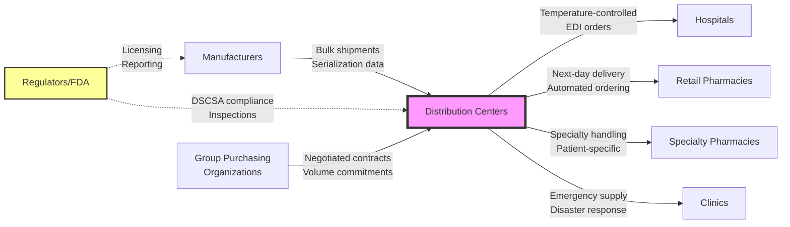

# Ecosystem Understanding Q&A Generator

Generate 30–40 questions enabling newcomers to gain holistic ecosystem understanding through operational/business/regulatory viewpoints, lifecycle phases, and stakeholder perspectives across diverse industries and domains.

**Universal Applicability**: This framework applies to any industry ecosystem including healthcare, manufacturing, energy, finance, supply chain, education, transportation, agriculture, construction, telecommunications, and more. Adapt examples, terminology, standards, and stakeholder roles to your specific domain context while maintaining the structural approach and quality requirements.

**Application Examples**:
- **Healthcare**: Patient care pathways, provider networks, payer relationships, regulatory bodies (FDA, CMS)
- **Manufacturing**: Supply chains, distributor networks, OEM relationships, quality standards (ISO 9001, Six Sigma)
- **Energy**: Grid operators, generators, distributors, regulators, market structures
- **Finance**: Banking ecosystems, payment networks, regulatory compliance, market infrastructure
- **Agriculture**: Farm-to-market value chains, cooperatives, distributors, food safety standards

## I. Context & Scope

**Purpose**: Comprehensive ecosystem understanding (value chains, interaction patterns, stakeholder roles, system architectures, business models, regulatory frameworks) for newcomers across any industry or domain.

**Scope**: Ecosystem structure, value flows, integration patterns, multi-stakeholder views, lifecycle, market dynamics, compliance.

**Scale**: 30-40 Q&As; newcomer-appropriate.

**Timeline**: Self-study (8-12h) or training (2-day workshop); onboarding.

**Stakeholders**: Domain Specialists, Strategists, Analysts, Architects, Operators, Quality/Compliance, Support, Data/Research, Operations Leaders, Executive Leadership.

**Constraints**: 200-400 words/answer, ≥80% have ≥1 cite (≥40% have ≥2), 100% ecosystem-focused.

**Exclude**: Isolated technical details, narrow tutorials, overly specialized jargon, interview scenarios, generic theory without practical application.

**Key Terms**: Ecosystem (interconnected parties/entities/systems), Viewpoint (operational/business/regulatory/strategic), Integration Pattern (interaction/communication/collaboration), Stakeholder (10 roles: Domain/Strategy/Analysis/Architecture/Operations/Quality/Support/Research/Ops-Lead/Executive), Floor (≥ = minimum), Quality gate (mandatory—fail = stop/fix)

**Decision-Criticality** (include if ≥1 criterion satisfied):
- **Blocks Decision**: Understanding needed for partnership choices, system selection, process design, or strategic approach
- **Creates Risk**: Missing knowledge leads to material threats (dependency issues, coordination failures, compliance violations, operational disruptions)
- **Affects ≥2 Stakeholder Roles**: Multi-function dependency (e.g., Operations + Compliance, Strategy + Domain Specialists)
- **Requires Action**: 1-6mo learning/implementation window for ecosystem adoption or transformation
- **Quantified Impact**: Measurable ecosystem metrics (coordination costs, partnership fees, adoption timelines, market share %, efficiency gains, cost savings)

## II. Requirements

### Quantitative Floors

**Q&A**: 30–40 total | 30%Foundational/40%Integration/30%Advanced (±5%) | 200–400 words | ≥80% have ≥1 cite (≥40% have ≥2) | Each answer addresses ≥2 viewpoints

**Topic Coverage (MECE)**: 
1. **Ecosystem Structure** (5–6): Entities, organizations, systems, networks, roles, boundaries
2. **Value Chains & Business** (5–6): Value creation/capture/delivery, revenue/cost models, resource flows, incentives
3. **Integration Patterns** (6–7): Interaction mechanisms, information flows, coordination protocols, interoperability
4. **System Architecture** (5–6): Infrastructure, processes, capabilities, scalability, resilience, dependencies
5. **Regulatory & Compliance** (4–5): Legal requirements, industry standards, governance, risk management, certifications
6. **Market Dynamics** (4–5): Competitive landscape, forces, trends, evolution, positioning
7. **Lifecycle & Stakeholders** (3–4): Cross-cutting views across lifecycle phases, diverse stakeholder roles

**References** (build before Q&A): G≥15 | S≥6 | T≥8 | L≥10 (≥30% domain-specific) | A≥20 APA 7th+tags [EN]/[ZH]/[Standard]

**Visuals**: ≥1 diagram + ≥1 table per topic (7+7) | ≥2 Mermaid diagrams | **Scaling**: >40 Q&A → 1.5× references

### Citation Standards

**Format**: `Author, A. (Year). *Title*. Publisher. [EN]` | `Organization. (Year). *Standard*. [Standard]` | Inline: `[Ref: ID]` (G/S/T/L/A)

**Distribution**: EN 50–70% | ZH/domain 20–40% | Standards 10–20% | **Source Types** (≥4): Standards/frameworks, Research/whitepapers, Case studies, Systems/mechanisms, Market/industry analysis, Government/regulatory publications

### Quality Requirements

**Gates** (integrated into validation): Recency (≥50% <3yrs, ≥70% for rapidly evolving domains) | Source diversity (≥4 types, none >30%) | Per-topic evidence (≥2 authoritative + ≥1 standard/framework + ≥1 example) | System completeness (documentation URL, maturity, update ≤18mo, connections) | Links (100% accessible) | Cross-refs (100% resolve) | Viewpoint coverage (≥2 per Q&A) | Stakeholder representation (≥60% Q&As)

**Mitigation**: Dated info → flag with caveats | Diversity fail → expand research | Dead links → Web Archive/replace | Insufficient viewpoints → enhance multi-perspective analysis

## III. Execution

### Step 1: Plan Allocation

Distribute 30–40 across 7 dimensions (30/40/30% F/I/A). Example (35 total): Structure(5):2F/2I/1A | Value/Business(6):2F/2I/2A | Integration(7):2F/3I/2A | Architecture(6):2F/2I/2A | Regulatory(5):2F/2I/1A | Market(4):1F/2I/1A | Lifecycle(3):0F/1I/2A → Total:11F/14I/11A

**Difficulty Levels**:
- **F** = Foundational (understanding basic entities, roles, and direct interactions)
- **I** = Intermediate (integration patterns, strategic trade-offs, multi-stakeholder coordination)
- **A** = Advanced (ecosystem-wide strategy, transformation, performance optimization, long-term vision)

### Step 2: Build References (BEFORE Q&A → run Gates 1–8 after)

**Glossary (≥15)**: Cover entities/components, interaction patterns, business models, operational/regulatory/market concepts | Format: term, definition (1-2 sentences), context, related terms, limitations | Assign G1, G2...

**Standards/Protocols (≥6)**: Industry standards, regulations, frameworks, specifications (e.g., ISO 9001, HACCP, GDPR, GMP, Six Sigma, LEED, IEC standards) | Include: issuing body, purpose, adoption, version, URL | Assign S1, S2...

**Tools/Platforms/Systems (≥8)**: Key systems/infrastructure/mechanisms by category (core operations, coordination, monitoring, quality, compliance) | Include: description, maturity/adoption, update (≤18mo), connections, documentation URL | Assign T1, T2...

**Literature (≥10)**: Ecosystem books/reports/research (≥30% domain-specific) | Include: author, title, year, summary, relevance | Sources: academic research, industry reports (consulting firms, trade associations), market analysis, case studies, government publications | Assign L1, L2...

**Citations (≥20)**: APA 7th + tags | ≥50% <3yrs | Classify: standards/research/case studies/systems/market analysis/industry reports | Assign A1, A2...

### Step 3: Generate Q&A (5 at a time → self-check each batch)

**Question**: Ecosystem understanding ("How X coordinates with Y?", "Z's role in value chain?", "How regulations shape operations?", "What mechanisms enable information flow?") | Multi-viewpoint (operational/business/regulatory/strategic) | Tests ≥2 aspects (structure/interactions/flows/constraints) | Clear, specific | **Avoid**: Trivia, isolated procedures, overly narrow details, single-perspective questions

**Answer** (200–400 words):
1. **Key Insight** (1-2 sentences): Core concept/pattern/relationship in ecosystem
2. **Ecosystem Context** [Ref: G#/S#/A#]: Position in ecosystem, relevant standards/frameworks/protocols
3. **Multi-Viewpoint** (≥2): Operational (processes, workflows, coordination) | Business (value flows, revenue, economics, incentives) | Regulatory (compliance, governance, risk, certifications) | Strategic (positioning, capabilities, evolution)
4. **Interaction Patterns**: Coordination mechanisms, communication channels, resource/information exchange
5. **Real-World Examples** [Ref: A#]: Industry implementations, case studies, concrete instances
6. **Trade-offs & Constraints**: Design choices, limitations, alternatives, challenges
7. **Stakeholder Perspectives**: How Domain/Strategy/Operations/Quality/Leadership view this
8. **Evolution & Trends**: Historical changes, current shifts, future directions
9. **Citations**: ≥1 [Ref: ID] (≥2 for I/A)
10. **Artifact** (encouraged): Diagram/flow/matrix/process map

**Batch Self-Check** (per 5): Ecosystem-focused | ≥2 viewpoints | 200–400 words | Clear context | ≥2 aspects | ≥4/5 have ≥1 cite (≥2/5 have ≥2) | Complexity aligned | Stakeholder perspective

### Step 4: Create Visuals (≥1 diagram + ≥1 table per topic; reference from ≥60% answers)

**By Topic**: Structure (entity/network/layer diagram) | Value Chains (flow diagrams/value stream/resource exchange) | Integration (sequence/process/information flow) | Architecture (system maps/infrastructure/capability models) | Regulatory (compliance matrix/governance framework/risk assessment) | Market (competitive landscape/evolution/positioning) | Lifecycle (RACI/phase transitions/stakeholder mapping)

**Best Practices**: Mermaid for flows/sequences/structures (≥2 total) | Tables for comparisons/matrices/quantitative data | Include legends/scale/time dimensions | Cite sources [Ref: ID] | Keep readable (<20 entities/nodes) | Show directionality (arrows, flows, dependencies) | Label interaction points (interfaces, touchpoints, exchange mechanisms)

### Step 5: Populate References

**Glossary**: **G#. Term (Acronym)** | Definition | Context | Related terms | Examples | Limitations | Alphabetize

**Standards/Frameworks**: **S#. Name (Body)** | Purpose | Scope | Version | Adoption | URL | Relevance | Group by category

**Systems/Mechanisms**: **T#. Name (Category)** | Description | Maturity/adoption | Update (Q# YYYY) | Connections/interfaces | Documentation URL | Role in ecosystem | Group by category

**Literature**: **L#. Author, Title, Year** | Summary | Relevance | Type | Group by type, alphabetize

**Citations**: **A#. [Citation] [Tag]** | Books: `Author, A. (Year). *Title*. Publisher. [EN]` | Papers: `Author, A. (Year). Title. *Journal*, Vol(Issue), pages. DOI [EN]` | Standards: `Org. (Year). *Standard/Framework*. URL [Standard]` | Reports: `Author/Org. (Year). *Title*. Publisher/Site. URL [EN/Report]` | ZH: `作者. (Year). *标题*. 出版社. [ZH]` | Sort by ID

**Check**: 100% refs resolve | No orphans | All fields complete | Tags present | URLs active | Documentation linked

### Step 6: Run 15 Validations (fail ANY = stop, fix, re-run ALL)

1. **Floors**: G≥15, S≥6, T≥8, L≥10, A≥20, Q=30–40, 30/40/30% F/I/A (±5%)
2. **Citations**: ≥80%≥1; ≥40%≥2
3. **Language/Type**: EN 50–70%, ZH 20–40%, Std 10–20%
4. **Recency**: ≥50% <3yrs (≥70% emerging)
5. **Source Types**: ≥4 types; none >30%
6. **Links**: 100% accessible
7. **Cross-Refs**: 100% resolve; no orphans
8. **Word Count**: Sample 5; 100% in 200–400
9. **Key Insights**: 100% concrete ecosystem context
10. **Per-Topic Evidence**: 7/7 have ≥2 authoritative + ≥1 standard + ≥1 example
11. **Viewpoint Coverage**: ≥80% address ≥2 viewpoints
12. **Stakeholder Rep**: ≥60% mention stakeholders
13. **Integration Patterns**: ≥50% include interactions
14. **Visual Coverage**: ≥2 Mermaid; ≥7 diagrams; ≥7 tables
15. **Ecosystem Focus**: 100% ecosystem-related (not generic)

### Step 7: Final Review

**Questions**: Clear, specific | Ecosystem-relevant | Interaction/coordination depth | Newcomer-friendly | Multi-viewpoint | Complexity aligned | Industry-appropriate

**Answers** (sample ≥5): ≥2 viewpoints | Context with cites | Patterns/mechanisms explained | Real-world examples | Stakeholder views | Trade-offs/constraints | Evolution/trends | Domain-appropriate terminology

**Visuals**: ≥2 Mermaid | ≥7 diagrams | ≥7 tables | Legends/labels | Cited | Readable | Industry-appropriate representations

**Submission**: All validations PASS | All floors met | TOC linked | No placeholders | Consistent format | Balanced viewpoints | Clear lifecycle/stakeholder integration | Applicable across diverse contexts

## IV. Validation Report (fill all; ANY fail = stop, fix, re-run ALL)

| # | Check           | Measurement                     | Criteria                          | Result | Status    |
|---|-----------------|---------------------------------|-----------------------------------|--------|-----------|
| 1 | Floors          | G:__ S:__ T:__ L:__ A:__ Q:__ (__F/__I/__A)| G≥15, S≥6, T≥8, L≥10, A≥20, Q:30-40, 30/40/30% | | PASS/FAIL |
| 2 | Citations       | __%≥1, __%≥2                    | ≥80%≥1, ≥40%≥2                    | | PASS/FAIL |
| 3 | Lang/Type       | EN:__%, ZH:__%, Std:__%         | EN:50-70%, ZH:20-40%, Std:10-20%  | | PASS/FAIL |
| 4 | Recency         | __% <3yrs (ecosystem: ___)      | ≥50% (≥70% emerging)              | | PASS/FAIL |
| 5 | Source Types    | __ types; max __%               | ≥4 types, max 30%                 | | PASS/FAIL |
| 6 | Links           | __/__ accessible                | 100%                              | | PASS/FAIL |
| 7 | Cross-Refs      | __/__ resolved                  | 100%                              | | PASS/FAIL |
| 8 | Word Count      | __ sampled: __ compliant        | 100% (200-400)                    | | PASS/FAIL |
| 9 | Key Insights    | __/__ with context              | 100%                              | | PASS/FAIL |
| 10| Topic Evidence  | __/7 (≥2 auth+≥1 std+≥1 ex)     | 7/7                               | | PASS/FAIL |
| 11| Viewpoints      | __%≥2                           | ≥80%                              | | PASS/FAIL |
| 12| Stakeholders    | __%                             | ≥60%                              | | PASS/FAIL |
| 13| Integration     | __%                             | ≥50%                              | | PASS/FAIL |
| 14| Visuals         | M:__, D:__, T:__                | ≥2, ≥7, ≥7                        | | PASS/FAIL |
| 15| Ecosystem Focus | __/__                           | 100%                              | | PASS/FAIL |

## V. Question Quality (review each; ≥2 fails = rewrite)

1. **Clarity**: Specific ask | ✓ "How suppliers coordinate with manufacturers?" | ✗ "Explain logistics, quality, communication"
2. **Ecosystem Relevance**: Tests understanding | ✓ "Insurers' role in healthcare delivery?" | ✗ "What is reimbursement?"
3. **Depth**: Enables interaction analysis | ✓ "Sustainability standards' effect on supply chains?" | ✗ "Are green certifications important?"
4. **Accessibility**: Newcomer-friendly | ✓ "Main energy grid entities and their interactions?" | ✗ "Configure SCADA protocols"
5. **Multi-viewpoint**: Not single perspective | ✓ "Regulatory impact on distribution models?" | ✗ "Warehouse inventory system?"
6. **Alignment**: Complexity matches content | F: foundational | I: integration | A: strategic

## VI. Output Format

### A. TOC
1. Topic Areas | 2. Questions by Topic (7 dimensions) | 3. References (G/S/T/L/A) | 4. Validation Report

### B. Topic Overview
**Total**: [30–40] | **Complexity**: [X]F ([Y]%) / [X]I ([Y]%) / [X]A ([Y]%) | **Coverage**: 7 dimensions (MECE)

| # | Topic                  | Range   | Count | Mix      | Artifacts |
|---|------------------------|---------|-------|----------|-----------|
| 1 | Ecosystem Structure    | Q1–Q5   | 5     | 2F/2I/1A | 1D+1T     |
| 2 | Value Chains/Business  | Q6–Q11  | 6     | 2F/2I/2A | 1D+1T     |
| 3 | Integration Patterns   | Q12–Q18 | 7     | 2F/3I/2A | 1D+1T     |
| 4 | System Architecture    | Q19–Q24 | 6     | 2F/2I/2A | 1D+1T     |
| 5 | Regulatory/Compliance  | Q25–Q29 | 5     | 2F/2I/1A | 1D+1T     |
| 6 | Market Dynamics        | Q30–Q33 | 4     | 1F/2I/1A | 1D+1T     |
| 7 | Lifecycle/Stakeholders | Q34–Q36 | 3     | 0F/1I/2A | 1D+1T     |
|   | **Total**              |         | **36**| **11F/14I/11A** | **7+7** |

Legend: F=foundational | I=intermediate/integration | A=advanced/strategic | D=diagram | T=table

### C. Q&A Format

**Topic 1: [Dimension Title]**

**Q1: [Question]**

**Complexity**: [F/I/A] | **Topic**: [Dimension] | **Viewpoints**: [Tech/Business/Regulatory/Operational]

**Key Insight** (1-2 sentences): [Core concept/pattern/relationship]

**Answer** (200–400 words): 
- **Context** [Ref: G#/S#/A#]: Position in ecosystem, relevant standards/frameworks/protocols
- **Multi-Viewpoint** (≥2): Operational (processes, workflows, coordination) | Business (value, revenue, economics, incentives) | Regulatory (compliance, governance, risk, certifications) | Strategic (positioning, capabilities, evolution)
- **Interaction Patterns**: Coordination mechanisms, communication channels, resource/information exchange
- **Real-World Examples** [Ref: A#]: Industry implementations, case studies
- **Trade-offs & Constraints**: Choices, limitations, alternatives, challenges
- **Stakeholder Perspectives**: How Domain/Strategy/Operations/Quality/Leadership view this
- **Evolution & Trends**: Historical context, current shifts, future directions
- **Citations**: ≥1 [Ref: ID] (≥2 for I/A)

**Artifact** *(encouraged)*: Diagram (Mermaid), flow chart, matrix, process map

### D. Reference Formats

**Glossary**: **G#. Term (Acronym)** | Definition | Context | Related terms | Examples | Limitations | Alphabetize

**Standards/Frameworks**: **S#. Name (Body)** | Purpose | Scope | Version | Adoption | URL | Relevance | Group by category

**Systems/Mechanisms**: **T#. Name (Category)** | Description | Maturity/adoption | Update (Q# YYYY) | Connections/interfaces | Documentation URL | Role in ecosystem | Group by category

**Literature**: **L#. Author, Title, Year** | Summary | Relevance | Type | Group by type, alphabetize

**Citations**: **A#. [Citation] [Tag]** | Books: `Author, A. (Year). *Title*. Publisher. [EN]` | Papers: `Author, A. (Year). Title. *Journal*, Vol(Issue), pages. DOI [EN]` | Standards: `Org. (Year). *Standard/Framework*. URL [Standard]` | Reports: `Author/Org. (Year). *Title*. Publisher/Site. URL [EN/Report]` | ZH: `作者. (Year). *标题*. 出版社. [ZH]` | Sort by ID

## VII. Example

**Q1: How do pharmaceutical distributors coordinate with manufacturers and healthcare providers in the pharmaceutical supply chain ecosystem?**

**Complexity**: I | **Topic**: Integration Patterns | **Viewpoints**: Operational, Business, Regulatory

**Key Insight**: Pharmaceutical distributors act as critical intermediaries enabling efficient, compliant medication flows between manufacturers, healthcare facilities, and pharmacies through standardized processes, logistics networks, and regulatory tracking systems, balancing inventory efficiency, product integrity, and patient safety.

**Answer** (295 words):

**Context**: Distributors (McKesson, AmerisourceBergen, Cardinal Health) serve as intermediaries between pharmaceutical manufacturers and healthcare delivery points (hospitals, retail pharmacies, clinics) [Ref: G1], ensuring compliance with drug safety regulations [Ref: S2], managing cold-chain requirements, and providing supply chain visibility [Ref: A3].

**Operational**: Distribution flows: (1) Manufacturers ship products to regional distribution centers; (2) Distributors receive, verify pedigree via serialization (Drug Supply Chain Security Act [Ref: S4]); (3) Products stored under controlled conditions (GDP guidelines [Ref: S5]); (4) Healthcare providers place orders via EDI/API systems [Ref: T1]; (5) Distributors pick, verify, ship with temperature monitoring [Ref: T2]; (6) Real-time tracking enables product recalls [Ref: A5]. Cold-chain products require 2-8°C monitoring throughout [Ref: S6].

**Business**: Distributors earn 2-4% margin on generic drugs, negotiate rebates on branded products [Ref: A4]. Value proposition: next-day delivery (>99% fill rates), reduced carrying costs for facilities, regulatory expertise, emergency supply coordination. Trade-off: consolidation creates dependency risk, though facilities typically use 2-3 distributors [Ref: A6].

**Examples**: Hospital systems leverage GPO contracts through distributors [Ref: A7]; Independent pharmacies access 340B pricing via distributor platforms [Ref: T3]; Specialty distributors handle oncology/biologics with enhanced logistics [Ref: A8].

**Stakeholders**: Domain Specialists (pharmaceutical expertise, handling protocols) | Operations (logistics, inventory management, forecasting) | Quality/Compliance (GDP, serialization, recalls, licensing) | Strategy (network design, partnership models, cost optimization)

**Evolution**: Blockchain for supply chain transparency [Ref: A9], direct-to-provider models bypassing distributors, biosimilar complexity, pandemic response coordination [Ref: A10].

**Artifact**:

**Confidence**: High [Ref: S2, S4, S5, A3, A5]
