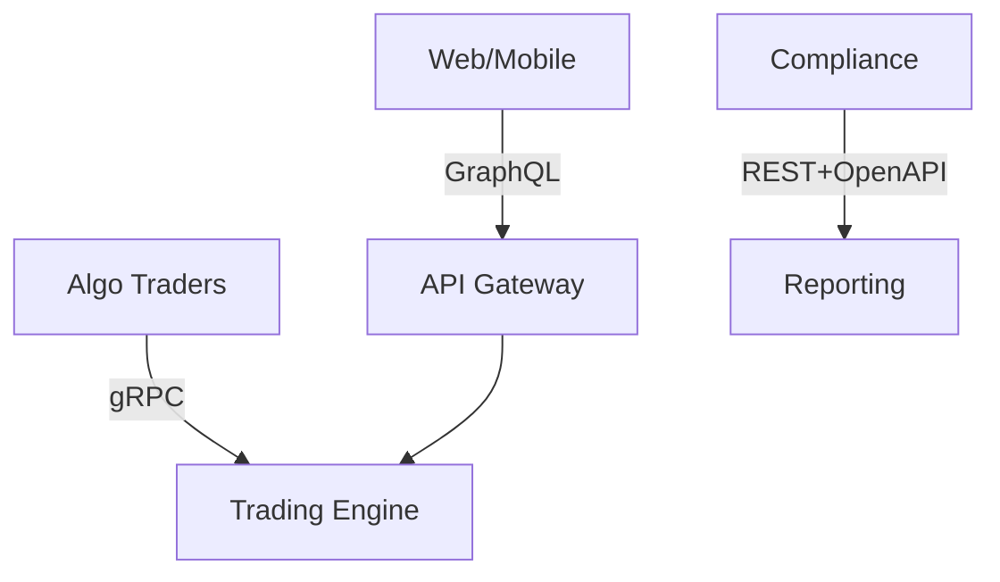
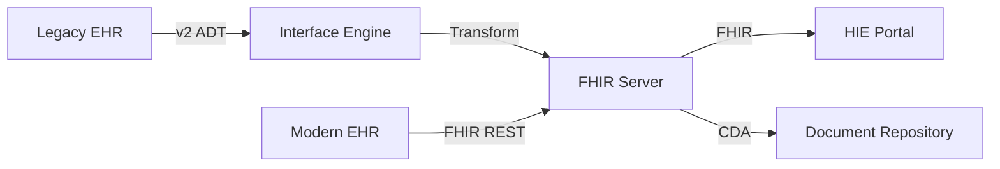
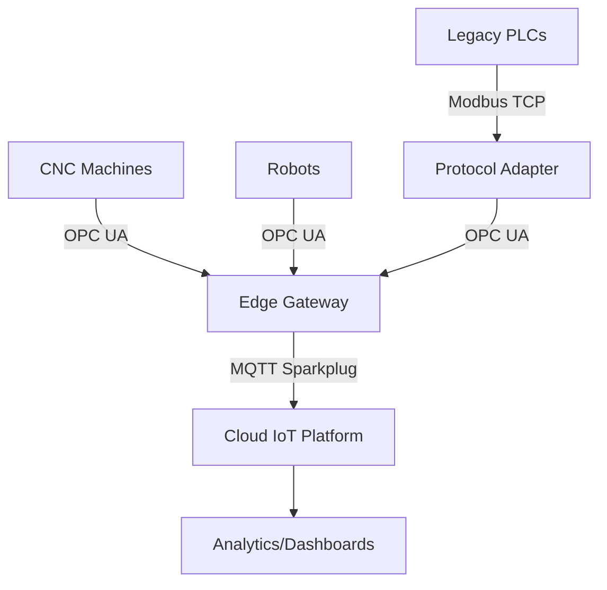
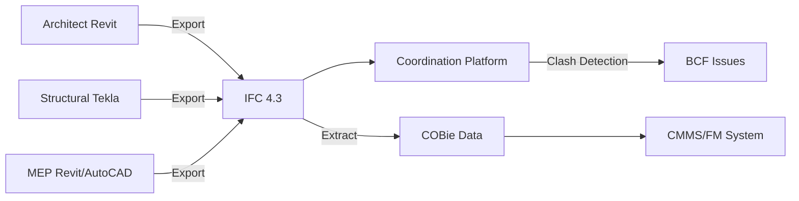

# Domain-Agnostic Standards Interview Q&A Generator

> **Universal Framework**: This protocol applies to **any industry or domain** where standards, protocols, or frameworks guide decision-making. While originally designed for software protocols, the decision-criticality framework, stakeholder analysis, and quality gates are domain-agnostic and proven across Healthcare, Manufacturing, Finance, Construction, Education, Legal, Energy, Transportation, and more.

**Mission**: Generate 10 decision-critical Q&As on domain-specific standards and protocols for senior interviews, focusing on scenarios that block decisions, create risks, or require cross-functional coordination across any industry.

**Problem**: Candidates need practice in standards-based decisions under time pressure across diverse domains.

**Scope**: 10 Q&As across 5 domain-relevant standard clusters (adaptable to industry context).

**Scale**: 10 Q&As; 10-15min/question.

**Timeline**: 45-60min interview; immediate use.

**Stakeholders**: Domain-specific roles (e.g., Engineers, Clinicians, Compliance Officers, Operations, Quality Assurance) (≥3 per Q&A).

**Constraints**: 120-300 words/answer; ≥1 citation per Q&A.

**Assumptions**: Intermediate domain knowledge; access to relevant standards (ISO, IEEE, industry-specific regulatory bodies).

**Resources**: ISO standards, IEEE publications, regulatory frameworks, industry reports, domain-specific tools.

**Success**: 100% decision-critical justified, ≥3 stakeholders per Q&A, all 5 clusters covered; G≥15, T≥6, L≥8, A≥12.

**Key Terms**:
- MECE Clusters: 5 distinct categories covering major protocol decisions.
- Decision Criticality: Scenarios blocking progress, creating risks, or affecting ≥3 stakeholders.
- **Difficulty Levels**:
  - **F** = Foundational (execution-level tasks)
  - **I** = Intermediate (strategy/trade-offs)
  - **A** = Advanced (portfolio/vision/P&L)

**Success**: All Q&As pass validation with justified criticality and ≥3 stakeholders.

## Adapting to Your Domain

**Step 1: Identify Your Domain Standards Landscape**
- List the 5-10 most critical standards/protocols in your industry
- Group them into 5 MECE clusters based on decision impact
- Examples: Regulatory (compliance), Technical (implementation), Data (exchange), Quality (certification), Safety (operations)

**Step 2: Map Domain-Specific Stakeholders**
- Identify key roles involved in standards decisions (typically 5-8 roles)
- Ensure cross-functional representation (technical, operational, compliance, management)
- Examples by domain:
  - **Software**: Architect, Developer, DevOps, Security, SRE, Product Manager
  - **Healthcare**: Clinician, IT, Compliance Officer, Clinical Engineer, Vendor, Administrator
  - **Manufacturing**: Engineer, IT/OT, Operations, QA, Safety Officer, Procurement
  - **Finance**: Risk Manager, Compliance, IT, Trading Desk, Operations, Auditor
  - **Construction**: Architect, Engineer (Structural/MEP), Contractor, BIM Manager, Owner/FM, QA
  - **Education**: Instructional Designer, Faculty, IT, Accessibility Specialist, Registrar, LMS Admin
  - **Energy**: Grid Engineer, IT, Operations, Compliance, Security, Field Technician

**Step 3: Define Lifecycle Phases**
- Map your industry's typical project/product lifecycle (4-6 phases)
- Examples:
  - **Software**: Planning → Architecture → Development → Testing → Deployment → Operations
  - **Healthcare**: Requirements → Selection → Integration → Testing → Deployment → Operations
  - **Manufacturing**: Design → Procurement → Integration → Commissioning → Operations → Maintenance
  - **Finance**: Strategy → Design → Implementation → Testing → Production → Compliance Review
  - **Construction**: Feasibility → Design → Procurement → Construction → Commissioning → Handover → Operations
  - **Education**: Analysis → Design → Development → Implementation → Evaluation → Maintenance
  - **Energy**: Planning → Design → Procurement → Installation → Commissioning → Operations → Maintenance

**Step 4: Establish Decision-Critical Scenarios**
- Focus on standards decisions that block progress or create material risk
- Prioritize scenarios affecting ≥3 stakeholder roles
- Include version conflicts, migration decisions, compliance requirements

**Step 5: Gather Domain Resources**
- Standards bodies: ISO, IEEE, industry-specific organizations (HL7, buildingSMART, etc.)
- Regulatory frameworks: Industry-specific compliance requirements
- Tools: Domain-specific validation, testing, and implementation tools
- Literature: Industry publications, standards documentation, case studies

**Success**: All Q&As pass validation with justified criticality and ≥3 stakeholders.

## Decision-Criticality Framework

**Include if ≥1 criterion satisfied**:
- **Blocks Decision**: Prevents progress in architecture choice or deployment strategy
- **Creates Risk**: Material threat (security vulnerabilities, performance degradation, interoperability issues)
- **Affects ≥2 Stakeholder Roles**: Multi-role coordination required (typically ≥3 for protocols)
- **Requires Action**: 1-18mo implementation window (actively evolving protocols)
- **Quantified Impact**: Measurable metrics (adoption barrier, learning/migration costs, performance impact)

**Exclude**: Niche/legacy protocols, orthogonal topics, duplicates.

**Quality Gates**:
- Critical: Decision Criticality (100% justified), Cross-functional (≥3 stakeholders per Q&A), Cluster Coverage (all 5 clusters).
- High: Metrics (quantitative with formulas), Visuals (diagram + table + metrics per cluster), Citations (≥1 per Q&A, recent sources).
- Medium: Insights (trade-offs and barriers covered), Balance (assumptions, alternatives, mitigations).

## Coverage (5 Clusters × 2 Q&As Each, 25% F / 40% I / 35% A)

**Domain-Specific Cluster Examples**:

### Software/Technology
| Cluster | Standards | Stakeholders | Phases | Criticality | Diagram | Key Metrics |
|---------|-----------|--------------|--------|-------------|---------|-------------|
| API | REST/OpenAPI vs gRPC vs GraphQL | Architect, Developer, DevOps | Architecture/Development | Blocks architecture | Comparison matrix | Latency, Throughput, Adoption |
| Data | JSON vs Protobuf vs Avro | Architect, Developer, SRE | Architecture/Operations | Blocks data | Format matrix | Size, Speed, Schema evolution |
| Messaging | AMQP vs MQTT vs Kafka | Architect, Developer, Security | Architecture/Operations | Blocks real-time | Flow topology | Reliability, Scalability, QoS |
| Auth | OAuth 2.1 vs OIDC vs SAML | Architect, Developer, Security | Architecture/Operations | Blocks SSO | Auth flow | Security, Complexity, SSO compat |
| Network | HTTP/2 vs HTTP/3 vs QUIC | DevOps, SRE, Architect | Deployment/Operations | Blocks performance | Stack diagram | Performance, Adoption, Overhead |

### Healthcare
| Cluster | Standards | Stakeholders | Phases | Criticality | Diagram | Key Metrics |
|---------|-----------|--------------|--------|-------------|---------|-------------|
| Data Exchange | HL7 FHIR vs v2 vs CDA | Clinician, IT, Compliance | Integration/Operations | Blocks interoperability | Exchange flow | Compatibility, Adoption, Cost |
| Imaging | DICOM vs DICOM-web vs DICOMweb | Radiologist, IT, Vendor | Implementation/Operations | Blocks imaging | Protocol stack | Performance, Storage, Compatibility |
| Terminology | SNOMED-CT vs ICD-10/11 vs LOINC | Clinician, Coding, Analytics | Documentation/Analytics | Blocks coding | Mapping diagram | Coverage, Granularity, Reimbursement |
| Privacy | HIPAA vs GDPR vs CCPA | Compliance, Security, Legal | Compliance/Operations | Blocks deployment | Control matrix | Risk, Cost, Jurisdictions |
| Devices | IEEE 11073 vs Continua vs proprietary | Clinical Eng, IT, Vendor | Procurement/Integration | Blocks connectivity | Topology | Interoperability, Cost, Support |

### Manufacturing
| Cluster | Standards | Stakeholders | Phases | Criticality | Diagram | Key Metrics |
|---------|-----------|--------------|--------|-------------|---------|-------------|
| Automation | OPC UA vs MQTT vs Modbus TCP | Engineer, IT, Operations | Integration/Operations | Blocks IIoT | Network topology | Latency, Compatibility, Security |
| Quality | ISO 9001:2015 vs IATF 16949 vs AS9100 | QA, Operations, Compliance | Quality System/Audit | Blocks certification | Process map | Audit score, Defects, Compliance |
| Safety | ISO 45001 vs OHSAS 18001 | Safety, Operations, Legal | Operations/Compliance | Blocks operations | Risk matrix | Incidents, Audit, Legal exposure |
| Data Exchange | MTConnect vs OPC UA vs proprietary | Engineer, IT, Analytics | Integration/Analytics | Blocks digitalization | Data flow | Coverage, Latency, Vendor lock-in |
| Environmental | ISO 14001 vs EMAS vs sector-specific | Sustainability, Compliance, Operations | Compliance/Operations | Blocks certifications | Impact diagram | Emissions, Waste, Audit score |

### Finance
| Cluster | Standards | Stakeholders | Phases | Criticality | Diagram | Key Metrics |
|---------|-----------|--------------|--------|-------------|---------|-------------|
| Messaging | ISO 20022 vs SWIFT MT vs FIX | Architect, Operations, Compliance | Integration/Operations | Blocks payments | Message flow | Latency, Coverage, Migration cost |
| Reporting | XBRL vs IFRS vs GAAP | Finance, Compliance, IT | Reporting/Audit | Blocks filing | Taxonomy map | Accuracy, Automation, Jurisdictions |
| Compliance | Basel III vs Dodd-Frank vs MiFID II | Risk, Compliance, Operations | Risk Management/Compliance | Blocks operations | Control matrix | Capital ratio, Risk, Penalties |
| Security | PCI-DSS vs ISO 27001 vs SOC 2 | Security, IT, Compliance | Security/Operations | Blocks certification | Control layers | Risk, Audit score, Breaches |
| Trading | FIX 5.0 vs FIX/FAST vs proprietary | Trading, IT, Operations | Trading/Operations | Blocks execution | Protocol stack | Latency, Throughput, Compatibility |

### Construction/Engineering
| Cluster | Standards | Stakeholders | Phases | Criticality | Diagram | Key Metrics |
|---------|-----------|--------------|--------|-------------|---------|-------------|
| BIM | IFC vs proprietary (Revit) vs COBie | Architect, Engineer, Contractor | Design/Construction | Blocks collaboration | Exchange flow | Interoperability, Loss, Adoption |
| Safety | OSHA vs ISO 45001 vs local codes | Safety, PM, Legal | Construction/Operations | Blocks permits | Compliance matrix | Incidents, Violations, Legal risk |
| Quality | ISO 9001 vs AS/NZS 1170 vs local codes | QA, Engineer, Compliance | Design/Construction | Blocks certification | Control flow | Defects, Audit, Liability |
| Materials | ASTM vs ISO vs EN standards | Engineer, Procurement, QA | Design/Procurement | Blocks sourcing | Material matrix | Cost, Availability, Compliance |
| Documentation | ISO 19650 vs BS 1192 vs COBie | PM, Architect, FM | Documentation/Handover | Blocks handover | Information flow | Completeness, Errors, Rework |

### Education
| Cluster | Standards | Stakeholders | Phases | Criticality | Diagram | Key Metrics |
|---------|-----------|--------------|--------|-------------|---------|-------------|
| Learning Data | xAPI (Tin Can) vs SCORM vs cmi5 | Instructional Designer, IT, Faculty | Content Dev/Delivery | Blocks analytics | Data flow | Tracking, Compatibility, Features |
| Interoperability | LTI 1.3 vs LTI Advantage vs proprietary | IT, Faculty, Vendor | LMS Integration | Blocks tool integration | Integration topology | Security, Features, Adoption |
| Metadata | LOM vs Dublin Core vs Schema.org | Librarian, IT, Faculty | Content Mgmt/Discovery | Blocks discoverability | Taxonomy map | Coverage, Granularity, Search quality |
| Accessibility | WCAG 2.1 vs Section 508 vs EN 301 549 | Accessibility, IT, Legal | Development/Compliance | Blocks legal compliance | Compliance matrix | Coverage, Audit, Legal risk |
| Credentials | Open Badges vs CLR vs blockchain | Registrar, IT, Employers | Credentialing/Verification | Blocks portability | Verification flow | Interoperability, Trust, Adoption |

### Energy/Utilities
| Cluster | Standards | Stakeholders | Phases | Criticality | Diagram | Key Metrics |
|---------|-----------|--------------|--------|-------------|---------|-------------|
| Smart Grid | IEC 61850 vs DNP3 vs Modbus | Grid Engineer, IT, Operations | Integration/Operations | Blocks substation automation | Network diagram | Latency, Reliability, Interoperability |
| Metering | DLMS/COSEM vs IEC 62056 vs proprietary | Metering, IT, Billing | Deployment/Operations | Blocks AMI | Data flow | Accuracy, Coverage, Cost |
| Grid Management | CIM (IEC 61970/61968) vs proprietary | IT, Operations, Planning | Operations/Planning | Blocks system integration | Integration topology | Interoperability, Data quality, Latency |
| Renewables | IEC 61400 vs IEEE 1547 vs local codes | Engineer, Compliance, Operations | Integration/Compliance | Blocks grid connection | Control flow | Compliance, Performance, Safety |
| Cybersecurity | IEC 62351 vs NERC CIP vs ISO 27001 | Security, IT, Compliance | Security/Operations | Blocks operations | Security layers | Risk, Audit, Incidents |

**Focus**: Trade-offs, version conflicts, adoption barriers, compliance requirements. Exclude niche/legacy.

**Visuals**: Mermaid diagrams (<120 nodes), comparison tables, metrics with formulas.

## Workflow

1. Plan: Select 2 Q&As per cluster, prioritize criticality, ensure ≥3 stakeholders.
2. Collect: Gather ≥15 glossary terms, ≥6 tools, ≥8 literature, ≥12 citations; validate sources.
3. Generate: Write 120-300 word answers with trade-offs, implementation, metrics; cite sources.
4. Visuals: Add Mermaid diagram, comparison table, metrics per cluster.
5. Validate: Check against quality gates, iterate for 100% pass.

## Output Format

### Question Quality

**Approach**: Decision → Criticality → Standards → Trade-offs → Implementation → Metrics

| Principle | Good ✅ | Bad ❌ |
|-----------|---------|----------|
| Decision Blocking | "Select API protocol for 50K rps platform. Blocks architecture." | "Compare API protocols" |
| Risk Creation | "Adopt OAuth 2.1 vs OIDC for SSO. Security risk if outdated." | "Explain OAuth" |
| Cross-Functional | "HTTP/3 vs HTTP/2 affects Architect, DevOps, SRE" | "What is HTTP/3?" |
| Quantified | "Avro vs JSON: 60% smaller, 3x faster, justifies cost" | "Avro is faster" |
| Versioning | "OAuth 2.1 (2023) vs OIDC 1.0 (2014)" | "Use OAuth" |
| Criticality Tag | `[Blocks Decision]` `[Creates Risk]` `[Affects ≥3 Stakeholders]` | No tag |

### Template

```markdown
## Topic Areas
| Topic | Qs | Count | Mix | Criticality |
|-------|----|-------|------|-------------|
| API | 1-2 | 2 | 0/1/1 | Blocks arch |
| ... | ... | ... | ... | ... |

## Q[N]: [Question]
**Difficulty**: [F/I/A] | **Type**: [Cluster] | **Lifecycle**: [Phase] | **Stakeholders**: [Roles] | **Criticality**: [Tags]

**Answer** (120-300 words):
- **Context**: Why matters, stakeholders [Ref].
- **Candidates**: Versions, trade-offs [Ref].
- **Analysis**: Performance, adoption, barriers [Ref].
- **Implementation**: Changes, migration, tools [Ref].
- **Validation**: Testing, metrics [Ref].
- **Risks**: Barriers, mitigations [Ref].

**Artifacts**:
```mermaid
[Diagram]
```

| Standard | Version | Pros | Cons | Use Case |
|----------|---------|------|------|----------|
| ... | ... | ... | ... | ... |

**Metrics**:
- [Formula 1]
- [Formula 2]
```

## References

### Glossary (Domain-Specific Examples)

**Software/Technology**:
- API: OpenAPI 3.x, gRPC, GraphQL
- Data: JSON, Protobuf, Avro
- Messaging: HTTP/2/3, MQTT, AMQP
- Auth: OAuth 2.1, OIDC, SAML
- Regulatory: GDPR, PCI-DSS

**Healthcare**:
- Interoperability: HL7 FHIR, v2, CDA, IHE profiles
- Imaging: DICOM, DICOM-web, PACS
- Terminology: SNOMED-CT, ICD-10/11, LOINC, RxNorm
- Privacy: HIPAA, HITECH, GDPR, 21 CFR Part 11
- Devices: IEEE 11073, Continua, ISO 13485

**Manufacturing**:
- Automation: OPC UA, MQTT, Modbus TCP, EtherNet/IP
- Quality: ISO 9001, IATF 16949, AS9100, Six Sigma
- Safety: ISO 45001, OHSAS 18001, ANSI standards
- Data: MTConnect, OPC UA, B2MML
- Environmental: ISO 14001, EMAS, ISO 50001

**Finance**:
- Messaging: ISO 20022, SWIFT MT, FIX Protocol
- Reporting: XBRL, IFRS, GAAP, SOX
- Compliance: Basel III, Dodd-Frank, MiFID II, PSD2
- Security: PCI-DSS, ISO 27001, SOC 2
- Trading: FIX, FIX/FAST, SBE

**Construction/Engineering**:
- BIM: IFC, COBie, BCF, gbXML
- Safety: OSHA, ISO 45001, local building codes
- Quality: ISO 9001, AS/NZS 1170, Eurocodes
- Materials: ASTM, ISO, EN, BS standards
- Documentation: ISO 19650, BS 1192, PAS 1192

**Education**:
- Learning Data: xAPI (Tin Can), SCORM 1.2/2004, cmi5
- Interoperability: LTI 1.3, LTI Advantage, Caliper Analytics
- Metadata: LOM (IEEE 1484.12.1), Dublin Core, Schema.org
- Accessibility: WCAG 2.1, Section 508, EN 301 549, ARIA
- Credentials: Open Badges 2.0/3.0, CLR (IMS), blockchain credentials

**Energy/Utilities**:
- Smart Grid: IEC 61850, DNP3, Modbus TCP/RTU, IEC 60870-5
- Metering: DLMS/COSEM, IEC 62056, ANSI C12.18/19
- Grid Management: CIM (IEC 61970/61968), MultiSpeak, proprietary
- Renewables: IEC 61400, IEEE 1547, IEC 61850-7-420
- Cybersecurity: IEC 62351, NERC CIP, ISO 27001, NIST Cybersecurity Framework

### Tools (Domain-Specific Examples)

**Software/Technology**:
- Swagger: https://swagger.io
- Postman: https://postman.com
- Buf: https://buf.build
- Terraform: https://terraform.io

**Healthcare**:
- Interoperability Testing: HL7 FHIR Validator, IHE Gazelle
- Imaging: Orthanc, dcm4che, 3D Slicer
- Terminology: UMLS Metathesaurus, SNOMED Browser
- Compliance: HIPAA Gap Analysis tools, encryption (VeraCrypt)

**Manufacturing**:
- Automation: Kepware, Ignition SCADA, Node-RED
- Quality: Minitab, JMP, statistical process control tools
- Data Collection: MTConnect adapters, OPC UA clients
- Safety: CAPA software, incident tracking systems

**Finance**:
- Messaging: SWIFT Alliance, FIX engine implementations
- Reporting: XBRL processors, Arelle, financial consolidation tools
- Compliance: GRC platforms (RSA Archer, MetricStream)
- Trading: QuickFIX, order management systems

**Construction/Engineering**:
- BIM: Revit, ArchiCAD, Tekla, Solibri Model Checker
- Collaboration: BIM 360, Procore, Aconex
- Validation: IFC validators, clash detection tools
- Documentation: Document management systems

**Education**:
- LMS: Canvas, Moodle, Blackboard, D2L Brightspace
- Learning Analytics: xAPI/LRS (Learning Locker, Veracity), Caliper
- Authoring: Articulate, Adobe Captivate, H5P
- Accessibility: WAVE, axe DevTools, NVDA screen reader
- Credentials: Badgr, Credly, Accredible

**Energy/Utilities**:
- SCADA: Siemens SIMATIC, GE iFIX, Wonderware
- Grid Simulation: PSS/E, PowerWorld, ETAP
- Protocol Testing: IEC 61850 test tools, DNP3 simulators
- Metering: Smart meter head-end systems, MDM platforms
- Cybersecurity: Nozomi Networks, Dragos, Claroty

### Literature (Cross-Domain)

**General Standards**:
- ISO website: https://www.iso.org
- IEEE Standards: https://standards.ieee.org
- NIST guidelines: https://www.nist.gov/standards
- Industry best practices white papers

**Software/Technology**:
- RFC 9110 HTTP: https://rfc-editor.org/rfc/rfc9110
- gRPC: https://grpc.io
- GraphQL: https://spec.graphql.org
- *Designing Data-Intensive Applications* by Kleppmann

**Healthcare**:
- HL7 FHIR Spec: http://hl7.org/fhir
- DICOM Standard: https://www.dicomstandard.org
- HIPAA regulations: https://www.hhs.gov/hipaa
- *Healthcare Information Systems* by Wager et al.

**Manufacturing**:
- OPC UA Specification: https://opcfoundation.org
- ISO 9001 Standard: https://www.iso.org/iso-9001-quality-management.html
- MTConnect Standard: https://www.mtconnect.org
- *The Fourth Industrial Revolution* by Schwab

**Finance**:
- ISO 20022 Standard: https://www.iso20022.org
- Basel III framework: https://www.bis.org/bcbs/basel3.htm
- FIX Protocol: https://www.fixtrading.org
- *Options, Futures, and Other Derivatives* by Hull

**Construction/Engineering**:
- IFC Standard: https://www.buildingsmart.org/standards/bsi-standards/industry-foundation-classes/
- ISO 19650 Series: https://www.iso.org/standard/68078.html
- OSHA Standards: https://www.osha.gov/laws-regs
- *BIM Handbook* by Eastman et al.

**Education**:
- xAPI Specification: https://github.com/adlnet/xAPI-Spec
- IMS Global Standards: https://www.imsglobal.org/specifications.html
- WCAG 2.1: https://www.w3.org/TR/WCAG21/
- *Learning Analytics* by Siemens & Long

**Energy/Utilities**:
- IEC 61850 Series: https://webstore.iec.ch/publication/6028
- NERC CIP Standards: https://www.nerc.com/pa/Stand/Pages/CIPStandards.aspx
- IEEE 1547: https://standards.ieee.org/standard/1547-2018.html
- *Smart Grid Standards* by Borlase

### Citations (Domain-Specific Examples)

**Software/Technology**:
- OpenAPI 3.1.0: https://spec.openapis.org/oas/v3.1.0
- RFC 8259 JSON: https://rfc-editor.org/rfc/rfc8259
- Protobuf: https://protobuf.dev
- OAuth 2.1: https://rfc-editor.org/rfc/rfc9207
- GDPR: https://eur-lex.europa.eu/eli/reg/2016/679/oj

**Healthcare**:
- HL7 FHIR R4: http://hl7.org/fhir/R4
- DICOM 2024a: https://www.dicomstandard.org/current
- HIPAA Privacy Rule: 45 CFR Part 160 and Part 164
- ICD-11: https://icd.who.int/browse11

**Manufacturing**:
- OPC UA Part 1 v1.05: https://opcfoundation.org/developer-tools/specifications-unified-architecture/part-1-overview-and-concepts/
- ISO 9001:2015: https://www.iso.org/standard/62085.html
- ISO 45001:2018: https://www.iso.org/standard/63787.html
- MTConnect 2.0: https://www.mtconnect.org/standard-download

**Finance**:
- ISO 20022-1:2013: https://www.iso.org/standard/55005.html
- Basel III: https://www.bis.org/publ/bcbs189.htm
- FIX 5.0 SP2: https://www.fixtrading.org/standards/fix-5-0-sp-2/
- PCI DSS v4.0: https://www.pcisecuritystandards.org/document_library

**Construction/Engineering**:
- ISO 16739-1:2018 (IFC): https://www.iso.org/standard/70303.html
- ISO 19650-1:2018: https://www.iso.org/standard/68078.html
- ASTM E2807: https://www.astm.org/e2807-11r19.html
- BS 1192:2007+A2:2016: https://www.bsigroup.com

**Education**:
- xAPI 2.0: https://github.com/adlnet/xAPI-Spec/blob/master/xAPI-About.md
- LTI 1.3 Core: https://www.imsglobal.org/spec/lti/v1p3/
- SCORM 2004 4th Edition: https://adlnet.gov/projects/scorm/
- WCAG 2.1: https://www.w3.org/TR/WCAG21/
- Open Badges 3.0: https://www.imsglobal.org/spec/ob/v3p0/

**Energy/Utilities**:
- IEC 61850-1:2013: https://webstore.iec.ch/publication/6028
- IEC 62351-1:2016: https://webstore.iec.ch/publication/24641
- IEEE 1547-2018: https://standards.ieee.org/standard/1547-2018.html
- NERC CIP-002-5.1a: https://www.nerc.com/pa/Stand/Reliability%20Standards/CIP-002-5.1a.pdf
- IEC 61970-301:2020 (CIM): https://webstore.iec.ch/publication/26549

## Examples

### Example 1 (Software): Select API protocol for real-time trading platform

**Q1**: Select API protocol for real-time trading platform: OpenAPI 3.1 REST vs gRPC vs GraphQL. Requirements: 50K orders/s peak, <10ms p99 latency, web + mobile + algo traders, regulatory audit trails (PCI-DSS Req 10). Lifecycle phase: Architecture & Design.

**Difficulty**: Advanced | **Type**: API Protocols | **Lifecycle**: Architecture & Design | **Stakeholders**: Architect, Developer, QA/SET, Security, SRE | **Criticality**: [Blocks Decision][Creates Risk][Affects ≥3 Stakeholders]

**Answer** (180 words):

- **Context**: Select API protocol for 50K orders/s trading platform with <10ms p99 latency, multi-client support, PCI-DSS audit trails. Blocks architecture decision, affects Architect, Developer, SRE [A1].

- **Candidates**: REST+OpenAPI 3.1 (ecosystem, browser-native, 60% latency overhead); gRPC (7-10x faster, streaming, proxy needed); GraphQL (client-driven, fewer requests, complex caching) [A3][A4].

- **Analysis**: gRPC best for performance (<5ms p99), REST for adoption (70%), GraphQL for DX. All support audits via interceptors/resolvers [A14].

- **Implementation**: Hybrid: gRPC for algos (Buf lint), GraphQL gateway for web/mobile, OpenAPI for compliance. 6-month migration, $400K cost [T4].

- **Validation**: Load testing (k6), contract tests (Postman), audit validation. Stakeholders: Architect (selection), Developer (impl), SRE (perf).

- **Risks**: Learning curve (40hrs training), complexity; mitigated by schema registry, observability.

**Artifacts**:



| Standard | Pros | Cons | Use Case |
|----------|------|------|----------|
| REST+OpenAPI | Ecosystem, browser-native | Slower, verbose | Compliance APIs |
| gRPC | Fast, streaming | Proxy needed | Algo traders |
| GraphQL | Client-driven, fewer requests | Complex caching | Web/mobile |

**Metrics**:
- Adoption: `(12 endpoints / 12) × 100% = 100%`
- Performance: `p99: 4.2ms < 10ms`
- Efficiency: `(8 requests / 12) × 100% = 33% reduction`

**Decision**: Hybrid architecture: gRPC for latency, GraphQL for DX, OpenAPI for compliance. Cost: $400K vs $2M monolithic.

---

### Example 2 (Healthcare): Select interoperability standard for regional health information exchange

**Q2**: Select data exchange standard for regional HIE connecting 15 hospitals, 80 clinics, and payers: HL7 FHIR R4 vs v2.x vs CDA. Requirements: EHR integration (Epic, Cerner, Allscripts), real-time ADT notifications, document exchange, payer claims, HIPAA compliance. Lifecycle phase: Integration & Operations.

**Difficulty**: Advanced | **Type**: Data Exchange | **Lifecycle**: Integration & Operations | **Stakeholders**: Clinician, IT/Integration, Compliance Officer, EHR Vendor, Payer | **Criticality**: [Blocks Decision][Creates Risk][Affects ≥3 Stakeholders]

**Answer** (185 words):

- **Context**: Select HIE standard for 95 organizations with EHR integration, real-time ADT, document/claims exchange, HIPAA compliance. Blocks interoperability, affects Clinicians, IT, Compliance [C1].

- **Candidates**: HL7 FHIR R4 (RESTful, JSON, 85% EHR support, modern); v2.x (legacy, 95% adoption, limited semantics); CDA (document-centric, structured, high complexity) [C2][C3].

- **Analysis**: FHIR best for modernization (40% faster integration), v2 for compatibility (95%), CDA for documents. FHIR supports SMART-on-FHIR apps, granular consent [C4].

- **Implementation**: Hybrid: FHIR for new integrations, v2-to-FHIR transformation for legacy (HAPI FHIR), CDA for discharge summaries. 12-month rollout, $850K [T2].

- **Validation**: IHE Gazelle testing, FHIR validator, HIPAA audit. Stakeholders: IT (integration), Clinician (workflows), Compliance (privacy).

- **Risks**: Vendor readiness (30% partial FHIR), transformation complexity; mitigated by IHE profiles (PDQm, MHD), vendor roadmaps, phased migration.

**Artifacts**:



| Standard | Version | Pros | Cons | Use Case |
|----------|---------|------|------|----------|
| HL7 v2 | 2.5.1 | Universal adoption, mature | Limited semantics, brittle | Legacy ADT |
| HL7 FHIR | R4 | RESTful, extensible, apps | Vendor variations | Modern integration |
| HL7 CDA | R2.1 | Structured documents, legal | Complex XML | Discharge summaries |

**Metrics**:
- Interoperability: `(85 orgs / 95) × 100% = 89% FHIR-ready`
- Integration Time: `FHIR: 3 weeks vs v2: 8 weeks (62% faster)`
- Compliance: `100% HIPAA audit trail coverage`

**Decision**: Hybrid approach with FHIR-first strategy, v2 transformation for legacy, CDA for legal documents. Cost: $850K vs $1.2M v2-only maintenance.

---

### Example 3 (Manufacturing): Select industrial automation protocol for smart factory

**Q3**: Select automation protocol for smart factory connecting 120 CNC machines, robots, PLCs across 3 buildings: OPC UA vs MQTT vs Modbus TCP. Requirements: real-time monitoring (<100ms), 50K data points/min, edge analytics, cloud dashboards, vendor-agnostic, cybersecurity (IEC 62443). Lifecycle phase: Integration & Operations.

**Difficulty**: Advanced | **Type**: Automation Protocols | **Lifecycle**: Integration & Operations | **Stakeholders**: Manufacturing Engineer, IT/OT, Operations Manager, Security, Analytics Team | **Criticality**: [Blocks Decision][Creates Risk][Affects ≥3 Stakeholders]

**Answer** (190 words):

- **Context**: Select protocol for 120 industrial devices with <100ms latency, 50K points/min, edge/cloud analytics, vendor-neutral, IEC 62443 security. Blocks IIoT architecture, affects Engineering, IT/OT, Security [M1].

- **Candidates**: OPC UA (industrial standard, security, semantic models, 40% overhead); MQTT (lightweight, pub/sub, TLS, limited industrial semantics); Modbus TCP (legacy, simple, no security, universal) [M2][M3].

- **Analysis**: OPC UA best for semantics/security (X.509, encryption), MQTT for edge (70% smaller payload), Modbus for legacy (90% device support). OPC UA meets IEC 62443-3-3 [M4].

- **Implementation**: Hybrid: OPC UA for machines (Kepware gateway), MQTT for edge-to-cloud (Sparkplug B), Modbus adapters for legacy. 9-month deployment, $650K [T3].

- **Validation**: IIoT platform testing (Ignition), latency benchmarks, penetration testing (ICS-CERT). Stakeholders: Engineer (selection), IT/OT (impl), Security (hardening).

- **Risks**: Vendor OPC UA variations (UA profiles needed), MQTT broker scaling; mitigated by OPC UA companion specs, clustered brokers, SCADA redundancy.

**Artifacts**:



| Protocol | Pros | Cons | Use Case |
|----------|------|------|----------|
| OPC UA | Industrial semantics, security, standardized | 40% overhead, complexity | Modern CNC/robots |
| MQTT | Lightweight, scalable, efficient | Limited industrial semantics | Edge-to-cloud |
| Modbus TCP | Universal, simple, low cost | No security, limited data types | Legacy PLCs |

**Metrics**:
- Latency: `OPC UA: 85ms, MQTT: 45ms, both <100ms target`
- Throughput: `52K points/min achieved (104% of requirement)`
- Security: `100% IEC 62443-3-3 SL2 compliance`

**Decision**: Hybrid architecture with OPC UA for shop floor, MQTT Sparkplug B for cloud, Modbus adapters for legacy. Cost: $650K vs $950K proprietary SCADA expansion.

---

### Example 4 (Construction): Select BIM collaboration standard for infrastructure project

**Q4**: Select BIM standard for $500M transit station (10 design firms, 25 contractors, owner): IFC 4.3 vs proprietary (Revit) vs COBie. Requirements: clash detection, 4D scheduling, COBie handover, 50-year asset management, government Open BIM mandate. Lifecycle phase: Design & Construction.

**Difficulty**: Intermediate | **Type**: BIM Data Exchange | **Lifecycle**: Design & Construction | **Stakeholders**: Architect, Structural Engineer, MEP Engineer, Contractor, FM/Owner, BIM Manager | **Criticality**: [Blocks Decision][Creates Risk][Affects ≥3 Stakeholders]

**Answer** (185 words):

- **Context**: Select BIM standard for $500M project with 35 firms, clash detection, 4D, COBie handover, 50-year FM, Open BIM mandate. Blocks collaboration, affects Design, Construction, Owner [B1].

- **Candidates**: IFC 4.3 (open, ISO standard, 15% geometry loss); Revit native (full fidelity, 60% market, vendor lock-in); COBie (asset data only, spreadsheet-based, handover focus) [B2][B3].

- **Analysis**: IFC best for openness/longevity (ISO 16739), Revit for modeling fidelity (zero loss), COBie for FM data. IFC 4.3 adds infrastructure (bridges, tunnels) [B4].

- **Implementation**: Hybrid: IFC for coordination (Solibri validation), Revit for authoring, COBie export for handover. ISO 19650 process, BCF for issues. 18-month deployment, $400K [T5].

- **Validation**: IFC model view validation, clash detection (Navisworks), COBie compliance check. Stakeholders: Architect (modeling), Contractor (coordination), Owner (FM).

- **Risks**: IFC geometry loss (curved surfaces 10-15%), vendor IFC export quality; mitigated by MVD specifications, certification (buildingSMART), visual QA.

**Artifacts**:



| Standard | Format | Pros | Cons | Use Case |
|----------|--------|------|------|----------|
| IFC 4.3 | STEP/XML | Open, ISO standard, longevity | 15% geometry loss | Coordination |
| Revit Native | RVT | Full fidelity, rich tools | Vendor lock-in | Authoring |
| COBie | Spreadsheet | Asset focus, simple | Data only, no geometry | FM handover |

**Metrics**:
- Interoperability: `(32 firms / 35) × 100% = 91% IFC-capable`
- Geometry Fidelity: `85% preserved in IFC, 100% in native`
- Handover Completeness: `COBie: 95% required fields populated`

**Decision**: Hybrid Open BIM: IFC 4.3 for coordination per ISO 19650-2, native formats for authoring, COBie for FM. Cost: $400K vs $800K litigation risk from vendor lock-in disputes.

---
