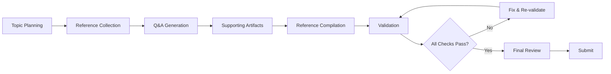

# Interview Q&A Generation Framework

Generates structured, evidence-based interview question banks with multi-dimensional evaluation
for senior/architect/expert roles.

## Contents

- [Overview](#overview)
  - [Scope](#scope)
  - [Assumptions](#assumptions)
  - [Success Criteria](#success-criteria)
  - [Terminology](#terminology)
- [Specifications](#specifications)
  - [Target Requirements](#target-requirements)
  - [Content Principles](#content-principles)
  - [Evaluation Dimensions](#evaluation-dimensions)
  - [Citation Standards](#citation-standards)
  - [Reference Requirements](#reference-requirements)
  - [Quality Gates](#quality-gates)
- [Execution Workflow](#execution-workflow)
  - [Workflow Overview](#workflow-overview)
  - [Step 1: Topic Planning](#step-1-topic-planning)
  - [Step 2: Reference Collection](#step-2-reference-collection)
  - [Step 3: Q&A Generation](#step-3-qa-generation)
  - [Step 4: Supporting Artifacts](#step-4-supporting-artifacts)
  - [Step 5: Reference Compilation](#step-5-reference-compilation)
  - [Step 6: Validation](#step-6-validation)
  - [Step 7: Final Review](#step-7-final-review)
- [Validation Procedures](#validation-procedures)
  - [Pre-Submission Validation](#pre-submission-validation)
  - [Validation Tiers](#validation-tiers)
- [Output Format](#output-format)
  - [Question Design Criteria](#question-design-criteria)
  - [Document Structure](#document-structure)
  - [Reference Section Formats](#reference-section-formats)

---

# Overview

## Scope

This framework generates interview Q&As for technical roles (senior/architect/expert levels).

**In Scope**:

- Structured Q&A generation with evidence-based answers
- Multi-dimensional evaluation (technical, business, strategic, actionable)
- Multi-language citation support (primarily EN/ZH)
- Validation and quality assurance procedures

**Out of Scope**:

- Role-specific job descriptions or competency frameworks
- Candidate response evaluation or scoring rubrics
- Recruitment pipeline design or ATS integration
- Interview conduct guidelines or behavioral assessment

## Assumptions

1. User provides topic/domain and target role level
2. Sufficient credible sources exist (≥20 total) for the specified topic
3. Language mix (EN/ZH/Other) is acceptable to target audience
4. Output will be reviewed by subject matter experts before production use
5. Citations are accessible (not behind paywalls or access restrictions)

## Success Criteria

This framework succeeds when:

1. **Validation**: Generated Q&As pass all validation steps (Section: Validation Procedures)
2. **Discriminative Power**: Questions distinguish senior from mid-level practitioners
3. **Actionable Depth**: Answers provide implementable guidance, not just definitions
4. **Verifiable Claims**: Citations enable readers to independently verify factual claims
5. **Production Ready**: Output requires minimal editing before interview use
6. **Significance**: Q&As address high-impact concepts with broad applicability (not edge cases)

## Terminology

**Symbols**:

- `≥` = minimum threshold (greater than or equal to)
- `→` = implies / leads to
- `✓` = pass / compliant
- `✗` = fail / non-compliant

**Key Terms**:

- **Q&A** (singular), **Q&As** (plural): Question and Answer pair
- **MECE**: Mutually Exclusive, Collectively Exhaustive—categories don't overlap and cover all
  possibilities
- **Topic Cluster**: Semantic grouping of 4-6 related Q&As covering one technical area
- **Floor Count / Minimum Required Count**: Minimum number of items required in a category
- **APA 7th**: American Psychological Association citation format, 7th edition
- **DOI**: Digital Object Identifier—persistent link to academic/technical publications
- **Canonical URL**: Official, authoritative URL; for duplicates, the preferred version
- **Archived URL**: Permanent snapshot (e.g., via Internet Archive) for link preservation
- **Difficulty Tiers**:
  - **Foundational** (20%): Core concepts; 0-3 years experience
  - **Intermediate** (40%): Applied knowledge; 3-7 years experience
  - **Advanced** (40%): System design, trade-offs; 7+ years experience
- **Role Levels**:
  - **Senior**: 5+ years; independent execution; mentors junior staff
  - **Architect**: System design authority; cross-team influence; defines standards
  - **Expert**: Domain thought leader; industry recognition; shapes direction
- **Contentious Topic**: ≥2 peer-reviewed sources presenting conflicting conclusions
- **Time Windows**:
  - "Last 3 years": From current calendar year minus 3 (e.g., 2022-2025 if current year is 2025)
  - "Last 2 years": From current calendar year minus 2 (e.g., 2023-2025 if current year is 2025)
  - Use rolling window if generation spans year boundary

---

# Specifications

## Target Requirements

| Requirement | Specification |
|-------------|---------------|
| **Q&A Count** | 25-30 Q&As total |
| **Target Levels** | Senior / Architect / Expert |
| **Answer Length** | 150-300 words |
| **Difficulty Distribution** | 20% Foundational, 40% Intermediate, 40% Advanced |
| **Artifacts per Cluster** | ≥1 diagram + ≥1 table |

## Content Principles

**Coverage (MECE)**:

- Technical, theoretical, practical, contextual dimensions
- No gaps; no overlaps between Q&As within a cluster

**Analysis Depth** (include in answers):

- Assumptions underlying approaches
- Failure modes and mitigation strategies
- Comparative analysis (alternatives, trade-offs)
- Adoption signals (when to use, when to avoid)

**Perspectives** (evaluate each Q&A through):

- Engineering, architecture, QA, product, operations, security, economics, policy

**Fairness & Bias Mitigation**:

- Frame questions neutrally; avoid presupposing "best" practices
- Acknowledge context-dependency (org size, region, budget, compliance requirements)
- For contentious topics: Present ≥2 competing viewpoints with counter-evidence
- Distinguish consensus from assumption-dependent conclusions
- Avoid vendor favoritism; present architectural choices as trade-off decisions

**Significance Prioritization**:

- Address high-impact concepts with broad applicability (>20% of practitioners)
- Omit edge cases, trivia answerable via simple documentation lookup
- Prioritize questions that distinguish senior from junior practitioners

## Evaluation Dimensions

| Dimension | Elements |
|-----------|----------|
| **Technical** | Performance, security, scalability, reliability |
| **Business** | Cost, efficiency, impact, market fit |
| **Strategic** | Regulatory landscape, adoption barriers, competitive dynamics |
| **Actionable** | Best practices, mitigations, open questions |

## Citation Standards

**Language Distribution**:

- Target: ~60% EN, ~30% ZH, ~10% other
- Range acceptable: EN 50-70%, ZH 20-40%, Other 5-15%
- Tag each citation: `[EN]`, `[ZH]`, etc.

**Source Types** (prioritized):

1. Official documentation (vendor, standard body)
2. Standards / peer-reviewed publications
3. Security audits / industry reports
4. Vetted codebases (open-source with audit history)

**Format**: APA 7th edition with language tags

**Inline Citation Placement** - Use `[Ref: ID]` after:

- Factual claims (statistics, performance metrics, compatibility)
- Comparisons and trade-off assertions
- Best practices and architectural recommendations
- Security/compliance requirements
- Failure mode descriptions

**Source Limitations** (acknowledge when present):

- If citing source with limited generalizability, note constraints:
  "[Study limited to North American enterprises with >1000 employees]"
- If source reliability uncertain, flag: "[Limited peer review; cross-check recommended]"

## Reference Requirements

| Reference Section | Minimum Count | Notes |
|-------------------|---------------|-------|
| Glossary, Terminology & Acronyms | ≥10 | Core concepts, domain jargon, localized terms |
| Codebase & Library References | ≥5 | Primary stack, SDKs, tooling |
| Authoritative Literature & Reports | ≥6 | Standards, peer-reviewed, industry analyses |
| APA Style Source Citations | ≥12 total | Language mix per Citation Standards |

**Practicality Escape Hatches**:

- If topic has <20 total credible sources: Reduce floor counts proportionally; document in
  Exception note
- If monolingual domain (e.g., regional regulation): Adjust language distribution; document rationale
- If conflicting constraints (e.g., only old source for stable standard): Prioritize
  credibility > recency; flag in Reference Section: `[1998 source; latest available for ISO XYZ]`

## Quality Gates

**Source Quality**:

| Gate | Requirement | Constraint Prioritization |
|------|-------------|---------------------------|
| Recency | ≥50% from last 3 years<br>(≥70% for AI/security: last 2 years) | If conflict: Credibility > Recency<br>(flag old-but-authoritative sources) |
| Source Diversity | ≥3 source types<br>No single source >25% of total | Balance official docs, peer-reviewed, audits, code |
| Codebase Maturity | License declared<br>Last commit ≤12 months<br>Stable release available<br>Audit status documented | For stable/mature projects: Relaxed commit recency OK if well-maintained |

**Structural Quality**:

| Gate | Requirement |
|------|-------------|
| Evidence Coverage | ≥70% answers with ≥1 citation<br>≥30% answers with ≥2 distinct citations |
| Cross-Reference Binding | All `[Ref: ID]` resolve to Reference Sections |
| Deduplication | Canonicalize duplicate entries; prefer DOIs > archived URLs > direct URLs |
| Link Validity | All links resolve OR archived alternatives provided |

**Per-Topic Minimums**:

- Each topic cluster: ≥2 authoritative sources (Literature/APA) + ≥1 codebase reference
- Each topic cluster: ≥1 diagram + ≥1 table

**Scaling Guidance**:

- For >30 Q&As: Increase floor counts by 1.5× (round up)
- For regulated domains (finance, healthcare, government): Increase floor counts by 1.5×
- **Priority Rule**: If resource-constrained, satisfy Quality Gates > floor counts

---

# Execution Workflow

## Workflow Overview



**Output Structure During Execution**:

- Use H2 for step headings: `## Step N: [Title]`
- Use H3 for checkpoints: `### Checkpoint: [Status]`
- Use code blocks for validation reports
- After each cluster: Report progress (Cluster N/M complete, X Q&As generated, Y citations, validation
  status)

**Reasoning Transparency**:

- For each step, state assumptions and constraints encountered
- If unable to meet requirements, document reasoning immediately
- Flag uncertainties rather than guessing

## Step 1: Topic Planning

**Objective**: Identify topic clusters and allocate Q&As for balanced coverage.

**Actions**:

1. Identify 4-6 topic clusters based on user-provided domain
2. Allocate 4-6 Q&As per cluster (total 25-30)
3. Assign difficulty to achieve 20% Foundational / 40% Intermediate / 40% Advanced
4. **Feasibility Check**: Verify topic has ≥20 credible sources available; adjust scope if needed

**Checkpoint**:

- Total Q&As = 25-30 ✓
- Difficulty distribution ≈ 20/40/40 ✓
- Sufficient literature exists for each cluster ✓

## Step 2: Reference Collection

**Objective**: Gather and categorize references meeting quality and diversity requirements.

**Actions**:

1. Collect ≥10 glossary terms, ≥5 codebases, ≥6 literature sources, ≥12 APA citations
2. Tag language ([EN]/[ZH]/Other), note publication year, classify source type (1-4)
3. Assign Reference IDs: G1-Gn (Glossary), C1-Cn (Codebase), L1-Ln (Literature), A1-An (APA)
4. If unable to meet floor counts: Document reasoning (insufficient sources, monolingual domain, nascent
   topic)

**Checkpoint**:

- Floor counts: Glossary ≥10, Codebase ≥5, Literature ≥6, APA ≥12 ✓
- Language mix: EN 50-70%, ZH 20-40%, Other 5-15% ✓
- Recency: ≥50% from last 3 years (≥70% for AI/security) ✓
- Source diversity: ≥3 types, max single source ≤25% ✓

## Step 3: Q&A Generation

**Objective**: Write Q&As with evidence-based answers and concrete insights.

**Actions**:

1. Per Q&A: Draft question, assign difficulty + type (Theoretical/Practical/Scenario), write 150-300
   word answer
2. Per answer: Include ≥1 `[Ref: ID]` after factual claims, metrics, trade-offs, recommendations
3. Per answer: State concrete Key Insight (misconception / failure path / trade-off)
4. Prioritize high-impact concepts; omit trivia and edge cases
5. Frame questions neutrally; avoid presupposing "best" practices

**Self-Review** (after every 5 Q&As):

- Verify each question is unambiguous and tests reasoning (not trivia)
- Verify each answer directly addresses the question
- Verify Key Insight is specific (not generic like "it depends")
- Verify word count 150-300, ≥1 citation present

**Checkpoint**:

- All Q&As have 150-300 word answers ✓
- ≥70% answers with ≥1 citation; ≥30% with ≥2 ✓
- All Key Insights concrete and specific ✓

## Step 4: Supporting Artifacts

**Objective**: Create diagrams and tables that enhance Q&A understanding.

**Actions**:

1. Per cluster: Create ≥1 Mermaid diagram + ≥1 table
2. Ensure artifacts illustrate key concepts, comparisons, or workflows from Q&As

**Checkpoint**:

- Each cluster has ≥1 diagram + ≥1 table ✓
- Artifacts support and clarify Q&A content ✓

## Step 5: Reference Compilation

**Objective**: Populate Reference Sections with complete, properly formatted entries.

**Actions**:

1. Populate Glossary, Codebase, Literature, APA sections per format specifications (see Output Format)
2. Include all required fields; note source limitations where applicable
3. Ensure all inline `[Ref: ID]` match Reference Section IDs

**Checkpoint**:

- All Reference Sections complete with required fields ✓
- All inline citations resolve to Reference Sections ✓
- DOIs/archived URLs used where available ✓

## Step 6: Validation

**Objective**: Execute validation procedures; fix failures before proceeding.

See [Validation Procedures](#validation-procedures) section for complete validation steps.

Select validation tier based on context:

- **Express** (Steps 1,2,6,7): For small Q&A sets (<20) or time-constrained generation
- **Standard** (add Steps 3,5,8): Recommended for most use cases
- **Thorough** (all 11 steps): For regulated domains, >30 Q&As, or production use

**Checkpoint**:

- Selected validation tier executed ✓
- All checks in tier pass ✓
- Validation report generated ✓

> **MANDATORY**: If ANY validation check fails, stop, fix, regenerate affected sections, and
> re-validate. Do NOT proceed until all checks pass.

## Step 7: Final Review

**Objective**: Verify success criteria and quality standards before submission.

**Actions**:

1. Review against Question Design Criteria (see Output Format section)
2. Verify output meets Success Criteria (see Overview section)
3. Perform semantic coherence check: Sample 3 Q&As; verify answer substance aligns with question and
   stated difficulty
4. Fairness check: For contentious topics, verify balanced treatment without vendor bias

**Checkpoint**:

- Questions meet Design Criteria (clarity, signal, depth, realism, discriminative power, alignment) ✓
- Output meets all Success Criteria ✓
- Semantic coherence verified ✓
- Fairness verified for contentious topics ✓
- Output is production-ready ✓

---

# Validation Procedures

## Pre-Submission Validation

Execute all steps; fix failures and re-validate until all pass.

**Step 1 – Count Audit**:

- Count: Glossary, Codebase, Literature, APA citations, Q&As (total + by difficulty)
- Report: `Glossary: X (≥10) | Codebase: Y (≥5) | Literature: Z (≥6) | APA: W (≥12) | Q&As: N (F/I/A)`
- Pass: All minimums met AND difficulty ratio ≨20/40/40

**Step 2 – Citation Coverage Scan**:

- Count inline `[Ref: ...]` per answer
- Report: `X of Y with ≥1 citation (Z%); W of Y with ≥2 (V%)`
- Pass: ≥70% have ≥1; ≥30% have ≥2

**Step 3 – Language Distribution Check**:

- Count language tags
- Report: `EN: X (Y%) | ZH: A (B%) | Other: C (D%)`
- Pass: EN 50-70%, ZH 20-40%, Other 5-15%

**Step 4 – Recency Verification**:

- Extract publication year per citation
- Report: `X of Y (Z%) from last 3yr`
- Pass: ≥50% from last 3yr (≥70% for AI/security)

**Step 5 – Source Type Diversity**:

- Classify citations: (1) Official, (2) Standards/peer-reviewed, (3) Audits, (4) Code
- Report: `Type 1: X | Type 2: Y | Type 3: Z | Type 4: W | Types: N | Max source: M (P%)`
- Pass: ≥3 types AND max ≤25%

**Step 6 – Link Validation**:

- Test URLs or verify archived links
- Report: `Tested X: Y accessible, Z broken` (list broken)
- Pass: All accessible OR archived alternatives provided

**Step 7 – Cross-Reference Integrity**:

- Verify each `[Ref: ID]` exists (G#→Glossary, C#→Codebase, L#→Literature, A#→APA)
- Report: `X inline refs: Y resolve, Z broken` (list broken)
- Pass: All resolve (Z=0)

**Step 8 – Word Count Compliance**:

- Sample 5 answers; count words (exclude metadata)
- Report: `Q#: X words | Q#: Y words | ...` (flag <150 or >300)
- Pass: All sampled in 150–300 range

**Step 9 – Key Insight Concreteness**:

- Review Key Insight per answer
- Report: `X of Y concrete; Z generic/missing` (list generic)
- Pass: ≥90% state specific misconception/failure/trade-off (not generic observations)

**Step 10 – Per-Topic Minimums**:

- List linked sources per topic (L#/A# authoritative, C# codebase)
- Report: `Topic 1: [L1, A3, C2] → 2 auth + 1 code ✓ | Topic 2: [A5] → 1 auth + 0 code ✗`
- Pass: Every topic has ≥2 authoritative + ≥1 codebase

**Step 11 – Semantic Coherence & Fairness**:

- Sample 3 Q&As: Verify answer substance aligns with question ask and stated difficulty
- For contentious topics: Verify ≥2 competing perspectives cited with counter-evidence
- Report: `Coherence: X/3 aligned | Fairness: Y applicable Q&As; Z comply (W%)`
- Pass: Coherence 3/3 AND (≥80% fairness compliance OR rationale provided)

**Validation Report Template**:

```markdown
| Check | Result | Status |
|-------|--------|--------|
| Floors | G:X C:Y L:Z A:W Q:N (F/I/A) | PASS/FAIL |
| Citation coverage | X% ≥1, Y% ≥2 | PASS/FAIL |
| Language dist | EN:X% ZH:Y% Other:Z% | PASS/FAIL |
| Recency | X% last 3yr | PASS/FAIL |
| Source diversity | N types, max P% | PASS/FAIL |
| Links | Y/X accessible | PASS/FAIL |
| Cross-refs | Y/X resolved | PASS/FAIL |
| Word counts | 5/5 compliant | PASS/FAIL |
| Key Insights | Y/X concrete | PASS/FAIL |
| Per-topic mins | X/Y topics meet | PASS/FAIL |
| Coherence & Fairness | Coherence: X/3 | Fairness: Y% | PASS/FAIL |
```

> **MANDATORY**: If ANY check fails, stop, fix, regenerate, re-validate. Proceed only when ALL pass.

## Validation Tiers

Select appropriate tier based on context:

| Tier | Steps Included | Use Case |
|------|----------------|----------|
| **Express** | 1, 2, 6, 7 | Small Q&A sets (<20), time-constrained, draft generation |
| **Standard** | 1, 2, 3, 5, 6, 7, 8 | Most use cases, 20-30 Q&As, moderate domains |
| **Thorough** | All 11 steps | Regulated domains, >30 Q&As, production deployment |

---

# Output Format

## Question Design Criteria

Review each question before finalizing:

| Criterion | Requirement |
|-----------|-------------|
| **Clarity** | Single unambiguous ask; no double-barreled wording |
| **Signal** | Tests reasoning/decision criteria, not trivia |
| **Significance** | Addresses high-impact concepts; avoids edge cases (<5% applicability) |
| **Depth** | Enables discussion of failure modes, trade-offs, constraints |
| **Realism** | Anchored in senior/architect/expert scenarios |
| **Discriminative Power** | Distinguishes shallow recall from practical expertise |
| **Alignment** | Matches stated seniority and tech stack/context |
| **Neutrality** | Avoids implicit endorsement; presents choices as trade-off decisions |

## Document Structure

**Required Elements**:

- Start with TOC linking to all sections
- Use H2 for topic areas, H4 for individual questions
- Include lists, tables, Mermaid diagrams, formulas, language-tagged code blocks
- Place Reference Sections at end

**Citation Flow**:

```mermaid
flowchart LR
    A[Inline Citation<br/>[Ref: A7]] --> B{Reference Type}
    B -->|G#| C[Glossary Section]
    B -->|C#| D[Codebase Section]
    B -->|L#| E[Literature Section]
    B -->|A#| F[APA Citation Section]
    C --> G[External Definition/Standard]
    D --> H[Repository/Docs]
    E --> I[Report/Paper]
    F --> J[Publication/Source]
```

**Q&A Document Template**:

```markdown
## Contents

- [Topic Areas](#topic-areas-questions-1-n)
- [Topic 1: [Topic title]](#topic-1-topic-title)
  - [Q1: [Question text]](#q1-question-text)
  - [Q2: [Question text]](#q2-question-text)
- [Topic 2: [Topic title]](#topic-2-topic-title)
  - [Q3: [Question text]](#q3-question-text)
- [Reference Sections](#reference-sections)
  - [Glossary, Terminology & Acronyms](#glossary-terminology--acronyms)
  - [Codebase & Library References](#codebase--library-references)
  - [Authoritative Literature & Reports](#authoritative-literature--reports)
  - [APA Style Source Citations](#apa-style-source-citations)

---

## Topic Areas (Questions 1–N)

### Topic 1: [Topic title]

#### Q1: [Question text]

**Difficulty:** [Foundational/Intermediate/Advanced] | **Type:** [Theoretical/Practical/Scenario]

**Answer:** (150-300 words with technical depth, examples, trade-offs)

**Key Insight:** [Choose one: Misconception | Failure Path | Trade-offs] - *Briefly state the core insight.*

**Supporting Artifacts:** [Mermaid Diagram/table/code/formula]

---

## Reference Sections

Use Reference IDs to tie claims to sources: `[Ref: G3]` (Glossary), `[Ref: C1]` (Codebase), `[Ref: L2]` (Literature), `[Ref: A7]` (APA).

**Example**: "Byzantine fault tolerance [Ref: G2] requires >2/3 honest nodes in PBFT [Ref: C1], as demonstrated in production [Ref: L4, A8]."

## Reference Section Formats

### Glossary, Terminology & Acronyms

**Format**: `**G#: Term/Acronym**: Definition [Language Tag]`

**Example**:

```markdown
**G1: MECE** (Mutually Exclusive, Collectively Exhaustive): Framework ensuring categories don't
overlap and cover all possibilities [EN]
```

### Codebase & Library References

**Format**: `**C#: [Project/Library Name]** ([lang])`

**Required Fields**:

- Stack/Modules: Core SDK/components
- Maturity: License, last update ≤12mo, stable release
- Benchmarks: Performance, audit status, adoption

**Optional Fields**: Integration hooks, HA indicators, consistency guarantees, language support,
vulnerability disclosures

**Template**:

```markdown
**C1: Kubernetes** (Go)

- Stack: Container orchestration, scheduler, API server, etcd
- Maturity: Apache 2.0 license, v1.28 (2024-08), stable release, CNCF graduated project
- Benchmarks: 5000+ node clusters tested; regular security audits by CNCF
- Repository: https://github.com/kubernetes/kubernetes
- Docs: https://kubernetes.io/docs/
```

### Authoritative Literature & Reports

**Format**: `**L#: [Title]** (Year) ([lang])`

**Required Fields**:

- Core Findings: Claims, best practices, standards
- Methodology: Sample size, temporal scope
- Impact: Citations, industry adoption

**Optional Fields**: Limitations, replication status, follow-up studies, jurisdiction applicability

**Template**:

```markdown
**L1: The State of DevOps Report 2023** (2023) ([EN])

- Core Findings: High-performing teams deploy 973x more frequently with 6570x faster lead times
- Methodology: 36,000 professionals surveyed globally over 9 years
- Impact: Industry standard benchmark; cited in 500+ publications
- DOI/URL: https://dora.dev/research/2023/dora-report/ [archived: https://web.archive.org/...]
```

### APA Style Source Citations

Group by language (EN ≈ 60%, ZH ≈ 30%, Other ≈ 10%). Follow APA 7th edition with language tags.

**Examples**:

```text
Smith, J., & Wang, L. (2024). Blockchain consensus mechanisms: A comparative analysis.
    Journal of Distributed Systems, 15(3), 245-267. https://doi.org/10.xxxx/jds.2024.15.3.245 [EN]

张伟, & 李娜. (2024). 区块链技术在供应链金融中的应用研究.
    计算机科学, 51(2), 88-95. [ZH]

Nakamoto, S. (2008). Bitcoin: A peer-to-peer electronic cash system.
    https://bitcoin.org/bitcoin.pdf [EN]
```

---

**End of Framework**

