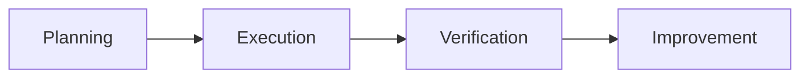

# Quality Management Q&A Generator

## Context

**Problem**: Lack of timely, decision-critical information leads to suboptimal quality management choices.

**Scope**: Decision-critical insights across domains (standards, processes, metrics, risks, controls, compliance).

**Scale**: 3-5 Q&As across 4 phases (Planning, Execution, Verification, Improvement); 30% F / 40% I / 30% A.

**Timeline**: Bi-weekly regeneration; expires after 2 weeks; immediate use.

**Stakeholders**: Quality Manager, Process Owner, Auditor, Risk Manager, Operations Lead (≥5 roles).

**Constraints**: 120-200 words/answer; decision-focused, source-backed.

**Success**: All criteria pass; ≥85% with ≥1 citation; ≥30% with ≥2; G≥6, S≥3, T≥2, C≥1, O≥1, A≥4.

## Key Terms
- **Q&A**: Decision-making pair on quality management topics across any domain.
- **Phase**: Process stage (Planning, Execution, Verification, Improvement); each Q&A covers 1-2.
- **Category**: Topic group (Standards & Compliance, Process Control, Performance Metrics, Risk & Safety); each Q&A covers ≥1.
- **Decision Criticality**: Framework for real-decision impact (meets ≥1 criterion below).
- **Freshness**: Age thresholds for sources (meets overall criteria below).

Generate 3-5 decision-critical Q&As with 30% F / 40% I / 30% A difficulty distribution.

## Criteria
**Freshness** (information must meet):
- **High-Velocity** (Regulations, Safety, Real-time Metrics): ≥85% <1mo, ≥95% <2mo, 100% ≤4mo
- **Medium-Velocity** (Standards, Processes, Tools): ≥70% <2mo, ≥90% <3mo, 100% ≤6mo
- **Overall**: ≥75% <2mo, ≥90% <4mo, 100% ≤9mo

**Exclude**: Unverified research, niche methods (<5% adoption), marketing, tactics, speculation.

**Decision-Criticality** (include if ≥1 criterion satisfied):
- **Blocks Decision**: Impacts strategy, approval gates, or process choices
- **Creates Risk**: Material threat (non-compliance, safety gaps, quality risks)
- **Affects ≥2 Stakeholder Roles**: Multi-function impact
- **Requires Action**: 1-6mo implementation window
- **Quantified Impact**: Measurable metrics (defect rate, compliance %, cost reduction, cycle time)

**Categories** (each Q&A ≥1):
1. **Standards & Compliance**: Regulations, certifications, audits, governance.
2. **Process Control**: Methods, procedures, controls, validation.
3. **Performance Metrics**: KPIs, benchmarks, analytics, reporting.
4. **Risk & Safety**: Hazards, mitigation, incidents, resilience.

## Execution
### Step 1: Topic Discovery & Curation
1. Record date (YYYY-MM-DD).
2. Search ≥10 candidates from authoritative sources (e.g., ISO updates, regulatory bodies, industry associations, professional journals, standards organizations). Avoid marketing/rumors.
3. Curate ≥10 topics: Authoritative, meets ≥1 criticality, specific.
4. Allocate 3-5 Q&As across phases (1-2 each), categories (≥1/Q), ≥5 roles.

### Step 2: Build References
- **Format**: G# (term: def|analogy|context|example), T# (tool: purpose|URL), C# (metric: details|URL), O# (metric: details|URL), S# (source: summary|cat|URL|criterion), A# (APA 7th).
- **Citation**: `[Ref: S#][s#]` in text; `[s#]: URL` at end.
- **Minimums**: G≥6, S≥3, T≥2, C≥1, O≥1, A≥4.

### Step 3: Generate Q&A
- **Patterns**: "[Topic] implications for [Phase]+[Roles]?" | "[Standard/Method]: adoption strategy?"
- **Avoid**: Generic, hype, unattributed.
- **Structure** (120-200 words):
  1. **Topic**: What, context, why, category [Ref: S#][s#]
  2. **Impact**: **Phases** (1-2) | **Quantified**: Metrics.
  3. **Stakeholders**: **[Role]**: Concerns/actions.
  4. **Decision**: **Rec** | **Rationale** | **Success**.
  5. **Action**: **Immed**: Actions/owner | **Short**: Timeline.
  6. **Links**: `[s#]: URL`
- **Self-Check**: Criticality ✓ | ≥1 phase | ≥2 roles | Quantified | ≥1 cite | Actionable.

### Step 4: Visuals
- **Types**: Process flows, control charts, decision trees, PDCA cycles, Pareto charts.
- **Format**: Mermaid, Markdown tables.

### Step 5: Validate
Use Validation Report; fix failures.

### Step 6: Submit
- **Checklist**: Validation PASS; complete glossary/refs; TOC/visuals; valid URLs; dates set.

## Validation Report

| # | Check | Measurement | Criteria | Result | Status |
|---|-------|-------------|----------|--------|--------|
| 1 | Source Quality | Primary __% | ≥70% | | PASS/FAIL |
| 2 | Minimums | G:__ S:__ T:__ C:__ O:__ A:__ Q:__ | ≥6,≥3,≥2,≥1,≥1,≥4,3-5 | | PASS/FAIL |
| 3 | Glossary | __%terms; __%analogies | 100%;≥50% | | PASS/FAIL |
| 4 | Phases | __/4; total__ | 3-4;3-5 | | PASS/FAIL |
| 5 | Categories | Std__% Proc__% Metric__% Risk__% | ≥40,30,30,20% | | PASS/FAIL |
| 6 | Roles | __ roles | ≥5 | | PASS/FAIL |
| 7 | Decision Criticality | __% | 100% | | PASS/FAIL |
| 8 | Impact | __% | 100% | | PASS/FAIL |
| 9 | Decision | __% | 100% | | PASS/FAIL |
| 10 | Citations | __%≥1; __%≥2 | ≥85%;≥30% | | PASS/FAIL |
| 11 | Words | __%120-200w | 100% | | PASS/FAIL |
| 12 | Visuals | diag__; tab__ | ≥1;≥1 | | PASS/FAIL |
| | Meta | Start:__ Expires:[+2wk] | | INFO |
| | OVERALL | All checks | All PASS | | PASS/FAIL |

## Question Quality (≥2 fails = rewrite)
**Criteria**: Information-driven | Decision-critical | Process-specific | Multi-stakeholder | Quantified | Timely | Actionable
**✓ Good**: "ISO 9001:2015 transition strategy?" | "Six Sigma in healthcare implications?" | "Supply chain risk response?"
**✗ Bad**: "What is quality management?" | "How to improve quality?" | "Adopt new standards?"

## Output Format
### TOC
# Quality Management Q&A ([Period])
## Contents
1. Executive Summary
2. Phase Coverage
3. Questions by Phase (3-5 total)
4. References
5. Validation

### Executive Summary
**Domain**: [Industry/Sector] | **Period**: [Q3-Q4'24] | **Coverage**: [# items, 3-4 cats]
**Insights**: [Topic] ([Source]): [Impact] → [Decision] (2 high-impact)
**Dashboard**: Table: Phase | Topic | Decision
**Roles**: [5+ roles] | **Refs**: G=[#] etc.

### Phase Overview
| Phase | Count | Categories | Topic | Roles |
|-------|-------|------------|-------|-------|
| Planning | 1-2 | Standards, Metrics | [Top] | Quality Mgr, Auditor |
| Execution | 1-2 | Process Control, Metrics | [Top] | Process Owner, Ops Lead |
| Verification | 1-2 | Compliance, Risk | [Top] | Auditor, Risk Mgr |
| Improvement | 1-2 | Metrics, Risk | [Top] | Quality Mgr, Process Owner |
| **Total** | **3-5** | **3-4** | **4+** | **≥5** |

### Q&A Template
### Q#: [Topic + Phase + Roles]
**Phase**: [Phase] | **Roles**: [Primary] | **Cats**: [✓] | **Decision Criticality**: [Criterion]
**Topic**: What, context [Ref: S#][s#]
**Impact**: **Phases** | **Quantified**
**Stakeholders**: **[Role]**: Concerns
**Decision**: **Rec** | **Rationale** | **Success**
**Action**: **Immed**: Actions | **Short**
[s1]: URL

### Reference Formats
**G#. Term**: Definition | Analogy | Context | Example (e.g., PDCA, Six Sigma, FMEA, SPC)
**S#. Title** (Source): Summary | Cat | URL | Criterion (e.g., ISO, NIST, industry body, journal)
**T#. Tool/Method**: Purpose | URL (e.g., quality system, analytics platform, control method)
**C#. Metric**: Details | URL (e.g., defect rate, DPMO, Cpk, cycle time)
**O#. Metric**: Details | URL (e.g., OEE, yield, compliance %, lead time)
**A#. APA**: Author. YYYY. *Title*. URL

