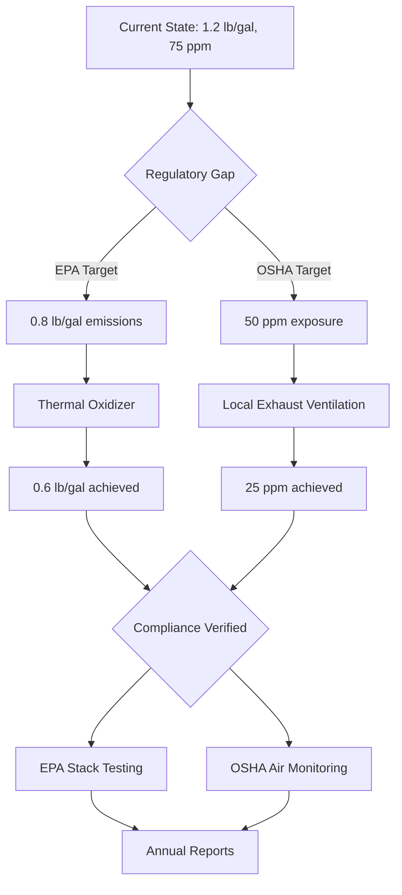

# Regulatory Compliance Q&A Generator

## Purpose

Generate 4-8 decision-critical regulatory Q&As for informed decision-making across any industry or domain.

**Scope**: Scenario-based regulations across industries (privacy/data protection, healthcare, financial services, manufacturing, environmental, labor/employment, safety, quality, trade, sector-specific), standards (ISO, OSHA, EPA, FDA, SEC, FTC), and domain-specific requirements.

**Scale**: 4-8 Q&As; 10-15min/question.

**Timeline**: Interview (60-90min) or audit preparation; update as regulations evolve.

**Stakeholders**: Legal, Compliance, Operations, Technical/Subject Matter Experts (adapt based on industry: Security, Engineering, Medical Affairs, Quality Assurance, Safety Officers, Environmental Coordinators, etc.).

**Constraints**: 150-250 words/answer; quantified impact (fines, penalties, audit duration, remediation cost, downtime, deadline); actionable decisions.

**Assumptions**: Cross-check against official sources (government registries, regulatory bodies, standards organizations, industry associations).

**Resources**: Official regulatory sources, compliance management platforms, industry tools, authoritative literature, legal databases, professional standards.

**Success**: All validations PASS; 100% decision-critical; ≥50% with ≥1 citation; G≥4, T≥2, L≥3, A≥4.

---

## Specifications

### Decision Criticality Framework

**Include if ≥1 criterion satisfied:**
- **Blocks Decision**: Impacts compliance strategy, audit readiness, or regulatory pivot
- **Creates Risk**: Material threat (breach, audit failure, fine >$100K, deadline <6mo)
- **Affects ≥2 Core Roles**: Multi-stakeholder impact (Legal + Compliance, Security + Architecture)
- **Requires Action**: 1-6mo action window (not speculative)
- **Quantified Impact**: Fine $, audit days, remediation hours, deadline

**Exclude if**: Niche/legacy regulations (<5% adoption), orthogonal/nice-to-have, already covered, vendor marketing

### Coverage (Decision-Critical Only)

**Distribution**: 4-8 Q&As, 25% F / 50% I / 25% A, across 4 clusters (1-2 per cluster), ≥2 stakeholders per Q&A

**Difficulty Levels**:
- **F** = Foundational (execution-level tasks)
- **I** = Intermediate (strategy/trade-offs)
- **A** = Advanced (portfolio/vision/P&L)

| Cluster | Focus | Decision Trigger | Stakeholders |
|---------|-------|------------------|--------------|
| **Compliance Framework** | Regulatory mapping, audit readiness, gap analysis, certification requirements | New deadline, failed audit, compliance debt >$500K, regulatory change | Legal, Compliance, Operations |
| **Operational Controls** | Process controls, documentation, monitoring, reporting, quality assurance | Control failures, incident/violation, inspection in <6mo, performance gaps | Compliance, Operations, Technical SMEs |
| **Audit & Evidence** | Evidence collection, record-keeping, traceability, documentation standards | Audit in <6mo, evidence gaps, inspection findings, certification requirements | Compliance, Operations, Quality |
| **Remediation & Program Management** | Gap closure, corrective actions, budget allocation, cross-functional coordination | Remediation cost >$300K, deadline <6mo, multi-department impact, recurring violations | Legal, Compliance, Operations, Technical SMEs |

### Content Requirements

- **Regulatory Scope**: Industry-specific regulations (environmental, safety, quality, labor, trade, financial, healthcare, privacy, etc.), compliance frameworks, standards, certifications, licensing, permits, reporting requirements, third-party/vendor obligations
- **Framework Comparisons**: By jurisdiction (federal/state/local, international), by industry sector, by regulatory body; mandatory vs voluntary; conflict resolution and harmonization
- **Significance**: High-impact scenarios relevant to the domain; exclude deprecated/rare edge cases; test judgment and decision-making over memorization

### Visual Standards (Per Cluster: ≥1 Diagram + ≥1 Table + ≥1 Metric)

| Cluster | Diagram | Metric Formula | Standards (Examples) |
|---------|---------|----------------|----------|
| Compliance Framework | Control matrix, Gap analysis, Regulatory mapping | `(Implemented / Required) × 100%` | ISO standards, industry frameworks, regulatory requirements |
| Operational Controls | Process flow, Control points, Quality gates | `(Compliant Outputs / Total Outputs) × 100%` | Industry-specific standards (ISO 9001, GMP, OSHA, etc.) |
| Audit & Evidence | Audit trail, Evidence mapping, Documentation chain | `(Documented Events / Required Events) × 100%` | ISO 19011, industry audit standards |
| Remediation & Program Management | Roadmap, Gantt, CAPA tracking | `Initial + Ongoing + Penalty Risk` | Industry frameworks, project management standards |

**Rendering**: Mermaid diagrams, inline `$formula$`, block `$$formula$$`  
**Diagram Standards**: BPMN (business process), Flowchart (workflow), Gantt (timeline), SIPOC (process), Fishbone/Ishikawa (root cause), Control charts (quality), Network diagrams (systems), Value stream maps (operations), UML (technical structure), ERD/DFD (data), decision trees, risk matrices  
**Avoid**: Mega-diagrams (>120 nodes), mixed abstraction, missing rationale

### Validation Checks

| # | Check | Target |
|---|-------|--------|
| 1 | **References** | Sufficient G, T, L, A; 4-8 Q&As (balanced difficulty) |
| 2 | **Decision Criticality** | All satisfy ≥1 criterion [Blocks/Risk/Roles/Action/Quantified] |
| 3 | **Freshness** | Mostly recent sources; justify older |
| 4 | **Citations** | Adequate citations per Q&A |
| 5 | **Language** | Consistent within entries |
| 6 | **Links** | Valid, prefer official |
| 7 | **Word Count** | 150-250 words per Q&A |
| 8 | **Impact** | Quantified metrics |
| 9 | **Decision** | Clear rationale |
| 10 | **Visuals** | ≥1 diagram + table + metric per cluster |
| 11 | **Cross-refs** | All resolve |
| 12 | **Final Review** | Scenario-based, actionable, no speculation |

**Balance**: Acknowledge trade-offs (security vs cost, compliance vs usability), constraints, alternatives

---

## Workflow

1. **Scenario Discovery**: Identify ≥10-15 decision-critical scenarios from regulatory changes, audits, risk registers, or conflicts; apply Decision Criticality filter
2. **Build References**: Adequate references (G, T, L, A), assign IDs, tag languages, validate links
3. **Generate Q&As**: Batch 2-3, scenario-based, 150-250w, quantified impact, cite [Ref: ID]
4. **Visuals**: ≥1 diagram + ≥1 table + ≥1 metric per cluster (Mermaid, <80 nodes)
5. **Validate**: Execute key checks, fix, iterate until pass

---

## Quick Prompts

- **Control Matrix**: Map [Regulatory Requirements] to [Operations/Processes]. Columns: Regulation | Requirement | Control | Evidence | Owner | Status. `Coverage = Implemented/Required × 100%`
- **Risk Assessment**: [Activity/Process]: description, regulatory requirements, risks, mitigations, residual risk. Risk matrix (Likelihood × Impact × Severity)
- **Compliance Registry**: Activity | Regulation | Requirement | Obligation | Frequency | Deadline | Owner | Evidence | Status
- **Cross-Jurisdictional**: Compare requirements for [Activity] across jurisdictions: regulations, conflicts, harmonization, documentation. Cite regulatory sources
- **Vendor/Third-Party**: Purpose, contractual obligations, liability transfer, audit rights, certification requirements, breach/incident protocols, termination
- **Audit Trail**: Requirement | Evidence Type | Source | Collection Method | Frequency | Retention | Custodian. Fields: who/what/when/where/outcome
- **Incident/Violation Response**: By regulation/jurisdiction: reporting thresholds, timelines, notification parties, corrective actions, documentation
- **Reg→Operations**: Map regulatory obligations to operational controls/procedures. Table + process diagram + compliance metrics
- **Reporting Requirements**: Report type, regulation, frequency, deadline, data sources, approval chain, submission method, record retention
- **Documentation & Records**: Document type, regulatory basis, content requirements, retention period, destruction method, access controls
- **Metrics**: Compliance rate, audit readiness, deficiency closure rate, incident frequency, time-to-remediation, compliance cost (formulas + benchmarks)
- **RACI**: [Compliance Program]: Legal, Compliance, Operations, Technical SMEs, Quality, Safety, Executive, Audit. Responsibility matrix

---

## Output Format

### Question Quality (Scenario-Based)

**Approach**: Scenario → Regulatory Mapping → Risk Assessment → Stakeholder Impact → Decision & Action

| Principle | Good ✅ | Bad ❌ |
|-----------|---------|---------|
| **Scenario-Based** | "EPA emissions limits conflict with OSHA ventilation requirements in manufacturing facility. Engineering controls strategy?" | "Explain EPA regulations" |
| **Signal** | "FDA inspection in 3mo. Quality system documentation gaps in validation records?" | "List FDA requirements" |
| **Quantified** | "OSHA violation fine $70K, corrective action cost $250K. Abatement deadline 90 days?" | "Improve safety?" |
| **Actionable** | "Non-conformance rate 8% (target <2%). CAPA program: 4mo, $200K, cross-functional?" | "Fix quality issues" |
| **Decision-Critical** | "Compliance debt $500K, deadline 6mo. Prioritize: Environmental/Safety/Quality?" | "What is compliance?" |
| **Role Alignment** | Multi-stakeholder (Legal + Operations, Quality + Engineering) | Generic |

### Template (Scenario-Based, Evergreen)

```markdown
## Contents
- [Cluster Overview](#cluster-overview) - Cluster | Decision Trigger | Q&A Count
- [Q&As 1-8](#qas-1-8) - Scenario + Regulatory Mapping + Impact + Stakeholders + Decision + Trade-offs + Artifacts
- [References](#references) - Glossary, Tools, Literature, Citations

## Cluster Overview
| Cluster | Decision Trigger | Q&A Count | Criticality |
| Compliance Modeling | New deadline, failed audit, debt >$500K | 1-2 | Blocks/Risk |
| ... | ... | ... | ... |

## Q&As 1-8

### Q[N]: [Scenario-Based Question]
**Difficulty**: [F/I/A] | **Cluster**: [Topic] | **Criticality**: [Blocks/Risk/Roles/Action/Quantified]

**Answer** (150-250 words):

**Scenario**: [What, who, why, regulation, context [Ref: ID]]

**Regulatory Mapping**: [Mapping, conflicts, resolution [Ref: ID]]

**Impact**: [Quantified: fine $, audit days, deadline, remediation hours [Ref: ID]]

**Stakeholders**: [≥2 roles, concerns, actions [Ref: ID]]

**Decision**: [Go/no-go, adopt/defer/skip, rationale, success targets [Ref: ID]]

**Trade-offs**: [Acknowledge trade-offs, alternatives]

**Artifacts**:

```mermaid
[Diagram: <80 nodes, decision flow or control matrix]
```

| Regulation | Requirement | Control | Evidence | Owner |

**Metrics**: Formula = Result
```

---

## References

### Glossary (Decision-Critical Only, Industry-Adaptable)

**Regulatory Categories**: Environmental (emissions, waste, water, hazmat, climate) | Safety & Health (workplace, process, product, occupational) | Quality (product, process, system, certification) | Labor & Employment (wages, hours, discrimination, benefits, leave) | Financial (reporting, controls, anti-fraud, consumer protection) | Privacy & Data Protection (collection, processing, rights, security) | Trade & Commerce (import/export, tariffs, sanctions, antitrust) | Industry-Specific (sector regulations: healthcare, food, pharma, aviation, energy, construction, etc.)

**Common Standards**: ISO 9001 (Quality Management) | ISO 14001 (Environmental Management) | ISO 45001 (Occupational Health & Safety) | ISO 13485 (Medical Devices Quality) | ISO 27001 (Information Security) | ISO 22000 (Food Safety) | ISO 50001 (Energy Management) | GMP/GLP/GCP (Good Practices) | Six Sigma/Lean | Industry certifications

**Compliance Concepts**: Risk-Based Approach (probability × impact × detectability) | Preventive vs Corrective Controls | Management of Change (MOC) | Continuous Improvement (PDCA cycle) | Root Cause Analysis (5 Whys, Fishbone) | Corrective and Preventive Action (CAPA) | Traceability (material/process/product tracking) | Validation & Verification (IQ/OQ/PQ) | Change Control | Document Control

**Operational Controls**: Standard Operating Procedures (SOPs) | Work Instructions | Process Controls (critical parameters) | Environmental Controls (temperature, humidity, pressure) | Quality Gates/Hold Points | Inspection & Testing | Calibration Programs | Maintenance Programs (preventive/predictive) | Training & Competency | Access Controls

**Documentation Requirements**: Records Management | Batch Records | Logbooks | Deviation Reports | Change Requests | Training Records | Audit Reports | Certificates of Analysis/Compliance | Chain of Custody | Retention Schedules | Electronic Records (21 CFR Part 11, ALCOA+ principles)

**Assessment & Monitoring**: Internal Audits | Management Reviews | Self-Assessments | Key Performance Indicators (KPIs) | Control Charts | Trend Analysis | Non-Conformance Tracking | Metrics Dashboards | Regulatory Intelligence | Gap Analysis

**Response & Remediation**: Incident Investigation | Root Cause Analysis | CAPA Plans | Remediation Roadmaps | Recall Procedures | Crisis Management | Regulatory Submissions | Consent Decrees | Abatement Plans | Continuous Monitoring

### Verification Sources (Industry-Specific)

**Government Registries**: Federal Register (US), EUR-Lex (EU), Official Gazettes (country-specific), State/Provincial regulations, Local ordinances  
**Regulatory Bodies**: EPA, OSHA, FDA, SEC, FTC, CPSC, USDA, DOL, DOT (US) | EMA, ECHA, HSE (EU/UK) | Industry-specific regulators (state boards, international bodies)  
**Standards Organizations**: ISO/IEC, ANSI, ASTM, IEEE, NFPA, ASME, SAE, Industry consortia  
**Legal Databases**: LexisNexis, Westlaw, Bloomberg Law, regulatory tracking services  
**Industry Resources**: Trade associations, professional societies, certification bodies, technical committees

### Tools (Industry-Adaptable Examples)

**Compliance Management Systems**: ServiceNow GRC, MetricStream, LogicManager, Compliance 360, Enablon | Industry-specific platforms (pharma QMS, environmental EHS, financial RegTech)

**Quality Management Systems (QMS)**: MasterControl, TrackWise, Veeva Vault, SAP Quality Management, ETQ Reliance | Document control, CAPA, change management, training

**Environmental Health & Safety (EHS)**: Intelex, Gensuite, Cority, VelocityEHS | Incident management, risk assessment, audits, permit tracking, emissions monitoring

**Document & Records Management**: Document management systems (DMS), Electronic data capture (EDC), Laboratory information management systems (LIMS), Manufacturing execution systems (MES)

**Audit & Assessment**: Audit management software, Third-party audit platforms, Self-assessment tools, Gap analysis tools

**Regulatory Intelligence**: Regulatory tracking services, Subscription databases, Industry news aggregators, Government monitoring tools

**Analytics & Reporting**: Business intelligence (BI) tools, Statistical process control (SPC) software, Dashboard platforms, Data visualization tools

### Literature (Industry-Adaptable, Replace with Domain-Specific Sources)

**Format**: [Regulatory Body/Standards Org]. (Year). [Regulation/Standard]. Key requirements, penalties/scope. [Language]

**Examples by Industry**:
- **Environmental**: EPA regulations (40 CFR parts), State environmental codes, Industry emission standards
- **Safety**: OSHA standards (29 CFR 1910/1926), ANSI standards, Industry safety codes (NFPA, ASME)
- **Quality**: ISO 9001, Industry-specific QMS (ISO 13485, IATF 16949, AS9100), FDA 21 CFR Part 820
- **Food**: FDA Food Code, USDA/FSIS regulations, HACCP principles, FSMA, SQF/BRC/IFS standards
- **Pharma**: FDA 21 CFR (Parts 210/211 GMP, Part 11), ICH guidelines, EU GMP Annex 1, PIC/S
- **Financial**: SEC regulations, SOX, Dodd-Frank, Basel III, PCI-DSS, AML/KYC requirements
- **Privacy**: GDPR, CCPA/CPRA, HIPAA, sector-specific privacy laws
- **Trade**: Import/export regulations, Customs codes, Sanctions lists, Trade agreements

### Citations (APA 7th, Decision-Critical Only, Domain-Specific)

**Format**: [Author/Agency]. (Year). [Title/Regulation]. [URL if applicable] [Language]

**Template for Domain-Specific Citations**:
**A1.** [Primary Regulation]: Core requirement document for the scenario
**A2.** [Secondary Regulation]: Related/conflicting requirement
**A3.** [Standard/Guideline]: Industry standard or best practice
**A4.** [Regulatory Guidance]: Official interpretive guidance
**A5.** [Case Law/Precedent]: Relevant enforcement actions or legal precedents
**A6-A8.** Additional authoritative sources as needed for the specific scenario


## Example (Manufacturing Environmental/Safety)

### Q1: Chemical manufacturing facility: EPA CAA emission limits vs OSHA 29 CFR 1910.1000 ventilation requirements. Engineering controls strategy?

**Difficulty**: Advanced | **Cluster**: Compliance Framework, Operational Controls | **Criticality**: Blocks/Risk/Roles/Action/Quantified

**Answer** (232 words):

**Scenario**: Chemical plant manufactures solvent-based coatings. EPA Clean Air Act (40 CFR 63 Subpart HHHHHH) limits VOC emissions to 0.8 lb/gal. OSHA 29 CFR 1910.1000 requires workplace air concentration <50 ppm (exposure limit). Current configuration: 1.2 lb/gal emissions, 75 ppm workplace exposure. EPA inspection in 4mo. Remediation cost: $450K, 5mo timeline. Fine risk: $37,500/day (EPA CAA §113) + $15,625/violation (OSHA).

**Regulatory Mapping**: EPA focuses on external emissions (stack discharge) [A1]. OSHA focuses on internal worker exposure [A2]. Conflict: Increased ventilation reduces worker exposure but increases VOC emissions. Resolution: Implement thermal oxidizer (destroys VOCs pre-discharge) + local exhaust ventilation (captures at source).

**Impact**: Quantified: $37,500/day EPA penalties ($1.1M/mo) + OSHA $15,625/violation. 18 workers at risk. Remediation: $450K (oxidizer $300K, LEV $150K), 5mo. Affects: Legal, Compliance, Operations, Engineering, Safety.

**Stakeholders**: Legal (interpret CAA/OSHA requirements, consent negotiation) | Compliance (permit modifications, reporting) | Operations (production impact, maintenance) | Engineering (design thermal oxidizer, LEV system) | Safety (worker protection, exposure monitoring).

**Decision**: Adopt dual-control strategy: thermal oxidizer (>95% VOC destruction) + LEV (capture at source). Go/no-go: Cost <$500K, timeline <6mo (before inspection), achieves 0.6 lb/gal emissions + <25 ppm exposure (50% safety margin).

**Trade-offs**: Thermal oxidizer adds $50K/yr fuel cost but ensures compliance. Alternative: Solvent substitution ($800K reformulation, 12mo) deferred due to timeline.

**Artifacts**:



| Regulation | Requirement | Control | Evidence | Owner |
|------------|-------------|---------|----------|-------|
| EPA 40 CFR 63.HHHHHH | 0.8 lb/gal VOC | Thermal oxidizer (>95% destruction) | Stack test reports, CEMS data | Compliance |
| OSHA 29 CFR 1910.1000 | <50 ppm exposure | Local exhaust ventilation, PPE | Air monitoring, exposure assessments | Safety |
| EPA CAA Title V | Operating permit | Permit modification, reporting | Permit documents, deviation reports | Compliance |
| OSHA 29 CFR 1910.134 | Respiratory protection | Fit testing, medical surveillance | Training records, medical clearances | Safety |
| State Air Quality | Emission fees | Quarterly fee calculations | Payment records, emission calculations | Compliance |

**Metrics**:
- Control Coverage: `(5/5) × 100% = 100%`
- VOC Reduction: `((1.2 - 0.6) / 1.2) × 100% = 50%` reduction achieved
- Exposure Reduction: `((75 - 25) / 75) × 100% = 67%` reduction achieved
- Compliance Margin: `((50 - 25) / 50) × 100% = 50%` safety buffer (OSHA)
- Destruction Efficiency: `(VOC destroyed / VOC generated) × 100% = 95%`
- Risk Mitigation: `$1.1M/mo penalty → 95% effective → $55K residual annual risk`
- TCO: `$450K capital + $50K/yr fuel + $25K/yr maintenance = $525K year 1, $75K/yr ongoing`
- Payback: `18 workers × $150K lost-time injury avoided = $2.7M potential savings`

---
