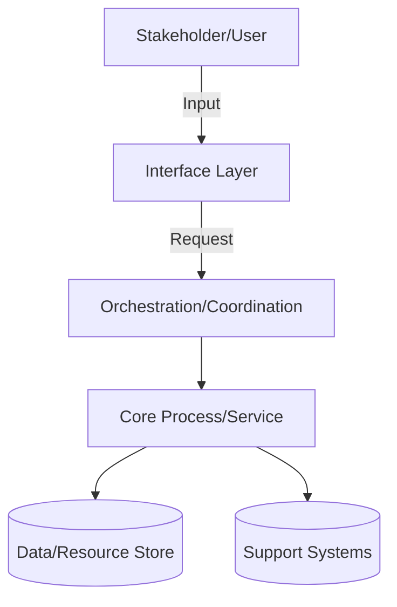

# Complex System Construction Lifecycle Roadmap

**Scope**: Production-grade complex systems (multi-stakeholder, cross-functional, high-impact) lifecycle from discovery to evolution  
**Audience**: Business, Project Managers, System Designers, Implementation Teams, Quality Assurance, Operations, Security, Leadership  
**Version**: 2.0


## Contents

1. [Scope & Success Criteria](#scope--success-criteria)
2. [Stakeholder Model](#stakeholder-model)
3. [Lifecycle Phases](#lifecycle-phases)
4. [Cross-Cutting Dimensions](#cross-cutting-dimensions)
5. [Deliverables & Templates](#deliverables--templates)
6. [Diagram–Code–Metric Mapping](#diagramcodemetric-mapping)
7. [Quantified Criteria & Trade-offs](#quantified-criteria--trade-offs)
8. [Validation & Completeness](#validation--completeness)
9. [References](#references)


## Scope & Success Criteria

### Context

**Assumptions**: Complex multi-component systems; diverse implementation environments; teams of 10–100 professionals; regulated or high-stakes domains requiring audit, compliance, and transparency.

**Success Definition**: All 8 phases completed with deliverables, acceptance criteria met, stakeholder sign-off, and validation checklist passed.

### Lifecycle Overview

| Phase | Focus | Key Deliverables | Entry Criteria | Exit Criteria |
|-------|-------|------------------|----------------|---------------|
| 1. Requirements & Discovery | Problem validation | Requirements doc, constraints, risk register | Business case approved | DOR checklist passed |
| 2. Design & Planning | Solution design | Design docs, decision records, risk model | Requirements defined | Design review passed |
| 3. Implementation | Execution | Working solution, processes | Design approved | Quality/safety checks pass |
| 4. Testing & Quality | Quality assurance | Test reports, defects | Implementation complete | Quality gates passed |
| 5. Deployment & Release | Production launch | Rollout plan, rollback plan | Tests passed | Deployed to production |
| 6. Operations & Monitoring | Live system mgmt | KPIs, dashboards, procedures | System live | Targets met |
| 7. Maintenance & Support | Ongoing health | Updates, optimization, support | In production | Health KPIs green |
| 8. Evolution & Governance | Continuous improvement | Roadmap, improvement register | Feedback loop active | Change mgmt operational |


## Stakeholder Model

### Roles & Responsibilities

| Role | Primary Responsibilities |
|------|--------------------------|
| **Business Analyst** | Requirements elicitation, domain modeling, acceptance criteria |
| **Project/Product Manager** | Vision, roadmap, prioritization, stakeholder alignment |
| **System Designer** | Solution design, decision records, constraint validation, strategy |
| **Implementation Team** | Execution, quality checks, reviews, documentation |
| **Quality Assurance** | Test strategy, validation, quality reporting, defect triage |
| **Operations Specialist** | Process management, infrastructure, deployment, tooling |
| **Risk/Security Manager** | Threat modeling, compliance, vulnerability management |
| **Domain Specialist** | Domain-specific expertise, standards, specialized protocols |
| **Operations/Support** | KPIs, monitoring, incident response, capacity planning |
| **Leadership** | Governance, resource allocation, risk acceptance, escalation |

### RACI Matrix

| Phase | BA | PM | Designer | Impl | QA | Ops | Risk | Domain | Support | Lead |
|-------|----|----|----------|------|----|----|------|--------|---------|------|
| Requirements & Discovery | R | A | C | I | C | I | C | C | I | A |
| Design & Planning | C | C | R/A | C | C | C | C | C | C | A |
| Implementation | I | I | C | R/A | C | C | C | R | I | I |
| Testing & Quality | C | C | C | C | R/A | C | C | C | C | I |
| Deployment & Release | I | I | C | C | C | R/A | C | C | C | I |
| Operations & Monitoring | I | I | C | I | C | C | C | C | R/A | I |
| Maintenance & Support | I | C | C | C | C | C | R | C | R | I |
| Evolution & Governance | C | R | R | C | C | C | C | C | C | A |

**Legend**: R=Responsible, A=Accountable, C=Consulted, I=Informed; **Note**: Tailor RACI to team context; get leadership approval.


## Lifecycle Phases

### Phase 1: Requirements & Discovery

**Goal**: Validate problem, scope, constraints, and non-functional requirements; achieve shared understanding and DOR.

**Inputs**:
- Business goals, vision, success metrics
- Stakeholder list and constraints (budget, timeline, compliance)
- Market/competitive analysis, user/beneficiary research

**Activities**:
1. **Elicitation**: Workshops, interviews, stakeholder mapping
2. **Domain Modeling**: Process mapping, boundary definition, shared terminology
3. **Constraint Definition**: Performance, scalability, reliability, security, usability requirements with quantified thresholds
4. **Risk Assessment**: Technical, operational, compliance, market risks with probability/impact scoring
5. **Privacy & Compliance**: Sensitive data classification, regulatory requirements, consent/approval flows
6. **Draft Success Metrics**: Initial targets based on business requirements

**Deliverables**:
- **Requirements Document**: Problem statement, stakeholder profiles, functional requirements
- **Use Cases/Scenarios**: Structured format with acceptance criteria
- **Domain Model**: Entity/process relationships, boundaries, context map
- **Constraint Catalog**: Measurable scenarios (e.g., "throughput ≥ 500 units/day", "accuracy > 95%")
- **Risk Register**: Risks with scores, owners, mitigation plans
- **Data/Asset Classification Matrix**: Sensitivity levels, retention policies, access controls
- **DOR Checklist**: Requirement completeness criteria

**Success Criteria**:
- 100% requirements have constraint traceability
- All constraints measurable with thresholds
- Risks scored (probability × impact) with owners assigned
- DOR checklist validated and approved by PM/Designer/QA
- Data/asset classification covers all critical elements

**Stakeholder Guidance**:
- PM prioritize value/effort & align KPIs; BA facilitate & validate; Designer probe feasibility & risks; Risk Manager review classification & compliance gaps


### Phase 2: Design & Planning

**Goal**: Create a validated design with clear trade-offs, addressing constraints and enabling parallel execution.

**Inputs**:
- Requirements document, constraints, domain model, risk register
- Resource constraints, team capabilities, legacy/existing systems

**Activities**:
1. **System Diagrams**: Context views, component breakdown, interaction maps, hierarchical structure
2. **Behavioral Modeling**: Process flows for key scenarios, state machines for complex processes
3. **Decision Records**: Document decisions with context, alternatives, trade-offs, consequences
4. **Risk Modeling**: Threat analysis, failure modes, mitigation strategies
5. **Data/Resource Modeling**: Entity relationships, schema design, migration strategy, partitioning/allocation decisions
6. **Performance Budgets**: Throughput/latency/capacity targets per component, resource planning
7. **Integration Specifications**: Interface specs, protocol definitions, data exchange formats

**Deliverables**:
- **System Design Document**: Views, principles, constraints, implementation approach
- **Decision Record Set**: ≥1 per major decision (e.g., methodology choice, resource allocation, deployment strategy)
- **Risk Model**: Threats/risks with severity scores, mitigations, residual risks
- **Resource & Migration Plan**: Allocation plans, migration ordering, rollback procedures
- **Interface Specifications**: Standardized contracts for all integration points
- **Quality Scenarios**: Testable constraint scenarios with metrics
- **Capacity Estimates**: Resource requirements per component at target load

**Success Criteria**:
- Decision record coverage for all key choices
- Performance budgets set (e.g., "Process A: utilization < 60%, cycle time < 2h")
- Risk model complete with no unmitigated High severity findings
- Design validation criteria defined (testable design checks)
- All interfaces have versioned specifications
- Capacity plan reviewed and approved by Operations

**Stakeholder Guidance**:
- Designer balance trade-offs & document assumptions; Implementation team check feasibility & challenge complexity; Risk Manager validate mitigations; Operations ensure monitoring, failure modes, and ≥30% headroom


### Phase 3: Implementation

**Goal**: Execute the design to produce a high-quality, validated solution adhering to standards and enabling safe collaboration.

**Success Criteria**:
- Quality checks: 0 critical errors
- Validation coverage: ≥80% component-level, ≥60% integration-level
- Process complexity: within acceptable thresholds (complexity score ≤ threshold)
- Security/safety: 0 critical violations, 0 High findings
- Peer review: 100% work products reviewed, SLA <24h


### Phase 4: Testing & Quality

**Goal**: Assure functional and non-functional quality, validating all requirements and constraints before production.

**Success Criteria**:
- Functional validation: ≥95% pass rate
- Interface validation: 100% for all defined contracts
- Performance: metrics ≤ target thresholds
- Security/safety: 0 open Critical/High violations
- Compliance: All applicable standards met


### Phase 5: Deployment & Release

**Goal**: Safe, repeatable releases to production with rollback capability and minimal disruption.

**Success Criteria (Performance Metrics)**:
- **Lead Time**: ≤ defined threshold (context-dependent)
- **Release Frequency**: Consistent with business needs
- **Change Failure Rate**: ≤ 15%
- **MTTR**: ≤ defined threshold (severity-dependent)


### Phase 6: Operations & Monitoring

**Goal**: Meet operational targets with robust monitoring, incident response, and capacity management.

**Success Criteria**:
- **Availability**: ≥ target uptime (context-dependent)
- **MTTR**: ≤ defined threshold (priority-dependent)
- **Performance Budget**: Policy enforced
- **Backup/Recovery Success**: ≥99%


### Phase 7: Maintenance & Support

**Goal**: Keep the system healthy, safe, and compliant through ongoing care.

**Success Criteria**:
- **Issue Resolution SLA**: Critical ≤7d, High ≤30d
- **Component Currency**: < defined staleness threshold
- **Compliance**: 0 unapproved deviations
- **Performance**: No regressions >10% sustained


### Phase 8: Evolution & Governance

**Goal**: Evolve capabilities safely and sustainably with continuous learning and improvement.

**Success Criteria**:
- **Improvement Management**: Technical/process debt reduced by ≥10% per quarter
- **Change Success**: 0 Critical incidents during major transitions
- **Change Approval**: 100% major changes reviewed by governance body
- **Governance Compliance**: 100% formal reviews for significant changes


## Cross-Cutting Dimensions

| Dimension | Requirements | Design | Implementation | Testing | Deployment | Operations | Maintenance | Evolution |
|-----------|--------------|--------|----------------|---------|------------|------------|-------------|-----------|
| **Structural** | Component boundaries | System diagrams | Module organization | Integration tests | Topology | Capacity planning | Restructuring | Phased migration |
| **Behavioral** | Process modeling | Flow diagrams | Process execution | Behavior tests | Staged rollout | Process tracing | Corrections | Optimization testing |
| **Quality** | Constraint scenarios | Performance budgets | Quality gates | Load/stress tests | Controlled deployment | Target monitoring | Tuning | Validation criteria |
| **Data/Assets** | Asset classification | Schema/models | Transformations | Quality tests | Versioning | Backup/recovery | Archival | Repartitioning |
| **Integration** | Interface requirements | Interface specs | Integration points | Contract tests | Versioned interfaces | Interface monitoring | Deprecation | Protocol evolution |
| **Evolution** | Risk assessment | Decision records | Change flags | Rollback tests | Phased deployment | Incident response | Hotfixes | Continuous improvement |


## Deliverables & Templates

### Decision Record Template

```markdown
# DR-001: [Decision Title]

**Status**: Accepted  
**Date**: 2025-11-27  
**Context**: [Problem statement, constraints, requirements]

**Decision**: [Chosen solution/approach]

**Alternatives Considered**:
- [Option 1]: [Brief assessment]
- [Option 2]: [Brief assessment]

**Consequences**:
- Benefits: [Advantages with measurable outcomes]
- Limitations: [Costs/constraints with metrics]
- Success Metrics: [Expected performance/outcomes]

**Related Decisions**: [List]
```


## Diagram–Component–Metric Mapping




## Quantified Criteria & Trade-offs

### Performance Metrics Examples

| Metric | Target | Measurement Approach |
|--------|--------|----------------------|
| **Response Time (p95)** | < threshold | `percentile(response_time, 0.95)` |
| **Throughput** | ≥ target units/period | `rate(completed_transactions[period])` |
| **Error Rate** | < threshold % | `failures / total_attempts × 100` |

### Trade-offs: Centralized vs Distributed

| Aspect | Centralized | Distributed |
|--------|-------------|-------------|
| **Complexity** | Low | High |
| **Scalability** | Limited | Flexible |
| **Coordination** | Easier (direct) | Harder (coordination overhead) |
| **When to Use** | Small scale, tight coupling needed | Large scale, autonomy preferred |


## Validation & Completeness

| # | Check | Requirement | Status |
|---|-------|-------------|--------|
| 1 | **Phases** | All 8 phases documented | ✅ |
| 2 | **Stakeholders** | RACI matrix complete | ✅ |
| 3 | **Dimensions** | Cross-cutting dimensions mapped | ✅ |
| 4 | **Templates** | ≥6 templates provided | ✅ |
| 5 | **Diagrams** | ≥2 Mermaid diagrams | ✅ |
| 6 | **Metrics** | Quantified targets defined | ✅ |


## References

### Glossary

**DR** – Decision Record. Document capturing decisions with context, alternatives, consequences.

**DOR** – Definition of Ready. Checklist ensuring requirements are ready for implementation.

**KPI** – Key Performance Indicator. Measurable value demonstrating effectiveness.

**RACI** – Responsibility Assignment Matrix: Responsible, Accountable, Consulted, Informed.

**MTTR** – Mean Time To Recovery. Average time to restore service/capability after incident.

### Tools

- **Mermaid** – Text-based diagrams. https://mermaid.js.org (Updated: 2024-10)
- **Draw.io** – Visual diagramming tool. https://draw.io (Updated: 2024-11)
- **Microsoft Project** – Project management. https://microsoft.com/project (Updated: 2024-10)
- **Jira** – Issue tracking and project management. https://atlassian.com/software/jira (Updated: 2024-11)
- **Tableau/PowerBI** – Analytics dashboards. https://tableau.com / https://powerbi.microsoft.com (Updated: 2024-11)

### Literature

**L1. Project Management Institute. (2021). *A Guide to the Project Management Body of Knowledge* (7th ed.). PMI.**

**L2. Forsgren, N., et al. (2018). *Accelerate: The Science of Lean Software and DevOps*. IT Revolution.**

**L3. Meadows, D. H. (2008). *Thinking in Systems: A Primer*. Chelsea Green Publishing.**

**L4. Skelton, M., & Pais, M. (2019). *Team Topologies: Organizing Business and Technology Teams*. IT Revolution.**

**L5. Senge, P. M. (2006). *The Fifth Discipline: The Art & Practice of The Learning Organization*. Doubleday.**

**L6. Goldratt, E. M. (2004). *The Goal: A Process of Ongoing Improvement*. North River Press.**

**L7. Ackoff, R. L. (1999). *Ackoff's Best: His Classic Writings on Management*. Wiley.**


**Document Version**: 2.0  
**Last Updated**: 2025-11-27  
**Maintained By**: System Design & Governance Teams  
**Review Cadence**: Quarterly

**Change Log**:
- 2025-11-27: Version 2.0 - Adapted for cross-industry applicability, generalized terminology and examples
- 2025-11-12: Version 1.0 - Initial version, comprehensive lifecycle roadmap covering 8 phases


## Quick Navigation

- **Just starting?** → [Requirements & Discovery](#phase-1-requirements--discovery)
- **Designing a system?** → [Design & Planning](#phase-2-design--planning)
- **Executing?** → [Implementation](#phase-3-implementation)
- **Testing?** → [Testing & Quality](#phase-4-testing--quality)
- **Deploying?** → [Deployment & Release](#phase-5-deployment--release)
- **Running in production?** → [Operations & Monitoring](#phase-6-operations--monitoring)
- **Maintaining/optimizing?** → [Maintenance & Support](#phase-7-maintenance--support)
- **Planning improvements?** → [Evolution & Governance](#phase-8-evolution--governance)
