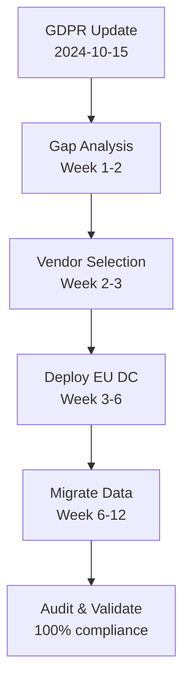
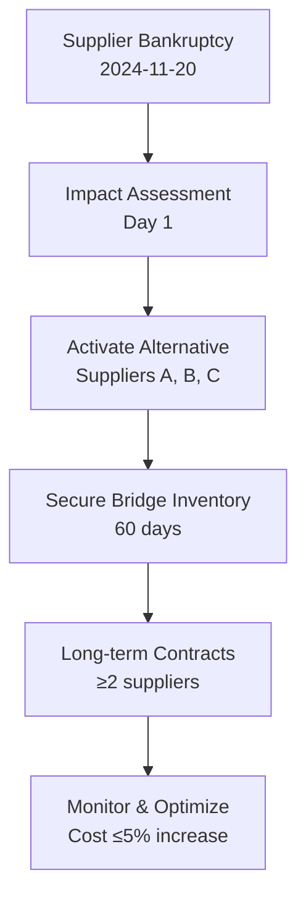

# Decision-Critical Q&A Generator

**Purpose**: Generate decision-critical Q&As to reduce hallucinations (↓30-40%) and improve decision quality (↑60-80%) across industries, domains, and operational scenarios.

**Problem**: Hallucinations, incomplete analysis, outdated information lead to poor strategic, operational, and tactical decisions.

**Scope**: Decision-critical scenarios across security, operations, compliance, strategy, finance, healthcare, manufacturing, legal, and other domains requiring high-stakes decisions.

**Scale**: 3-7 Q&As (20% F / 40% I / 40% A); ≥3 decision-critical dimensions.

**Timeline**: Immediate use; <4h/batch; update as context evolves.

**Stakeholders**: Domain experts, operational leaders, strategists, compliance officers, executives, and specialized professionals across industries.

**Application**: High-stakes situations that block decisions, create risks, affect multiple roles, require action, or have quantified impact.

**Key Terms:**
- **Hallucination**: Incorrect or unverifiable information.
- **Decision-critical**: Impacts >5% of outcomes or blocks key actions.
- **MECE**: Mutually Exclusive, Collectively Exhaustive.
- **Self-contained**: Each Q&A contains complete context without external dependencies.

## Guidelines

**Domain**: Decision-critical scenarios across all industries and operational contexts—security, operations, strategy, compliance, finance, healthcare, manufacturing, legal, supply chain, and more.
**Audience**: Domain experts, professionals, leaders, and decision-makers across diverse roles and industries.
**Scope**: Focus on decision-critical scenarios such as regulatory changes, operational disruptions, strategic shifts, market changes, emerging risks, compliance deadlines, or resource allocation. Exclude marketing, speculation, or low-impact topics.

**Freshness**: Prioritize recent information (<2 months for time-sensitive risks, <6 months for regulatory/compliance changes).

**Decision Criticality** (at least 3 of 5 dimensions required):
1. **Blocks Decision**: Impacts response, posture, or strategy.
2. **Creates Risk**: Material threat or change.
3. **Affects ≥2 Roles**: Multi-stakeholder impact.
4. **Requires Action**: Within 1-6 months.
5. **Quantified Impact**: Measurable effects (CVSS, systems affected, etc.).

**Output Specifications**
- **Format**: Include diagrams, configs, citations.
- **Quantity**: 3-7 Q&A pairs.
- **Difficulty**: 20% F / 40% I / 40% A — **F**=Foundational (execution), **I**=Intermediate (strategy/trade-offs), **A**=Advanced (portfolio/vision).
- **Coverage**: At least 3 decision-critical dimensions.
- **Traceability**: Scenario → Risk → Control → Action → Metric.
- **Visuals & Practicality**: ≥1 diagram + ≥1 table per batch; ≥1 metric and ≥1 practical element per Q&A.

**Quality Standards**
- **Clarity**: Define terms; consistent language.
- **Precision**: Specific values, citations, thresholds.
- **Accuracy**: Verify facts; note uncertainties.
- **Credibility**: Use current standards and primary sources.
- **Balance**: Consider trade-offs.
- **Significance**: Focus on high-impact (P×I >8).
- **Concision**: Avoid redundancy.
- **Logic**: Coherent reasoning.

**Limitations and Trade-offs**
- **Trade-offs**: Balance rigor with speed.
- **Alternatives**: Unstructured prompts (faster but error-prone); automated tools (quick but may be outdated).
- **Skip for**: Low-stakes or exploratory scenarios.
- **Exclude**: Historical, theoretical, or speculative content.
- **Citations**: Use APA 7th format with tags; reference primary sources.

## Decision-Critical Dimensions

| Dimension | Focus | Decision Trigger | Standards/Frameworks |
|-----------|-------|------------------|---------------------|
| **Risk Management** | Identify emerging risks, vulnerabilities, threats | Risk severity ≥High, impact >$100K, affects >1000 stakeholders/units | ISO 31000, COSO ERM, NIST CSF |
| **Operational Response** | Rapid response to disruptions & recovery | Response time targets, recovery objectives (RTO/RPO), business continuity | ISO 22301, ITIL, Lean Six Sigma |
| **Compliance & Governance** | Regulatory changes, audit findings, policy updates | New compliance deadline, failed audit control, certification impact, legal exposure | ISO standards, industry regulations (GDPR, HIPAA, SOX, etc.) |
| **Strategic Planning** | Market shifts, competitive moves, resource allocation | Strategic opportunity/threat, budget >10%, affects multiple departments | Balanced Scorecard, OKRs, Strategic Planning Frameworks |
| **Quality & Performance** | Process failures, performance degradation, defects | Quality metric <target, SLA breach, customer impact >5%, defect rate spike | ISO 9001, Six Sigma, TQM, Performance Management |
| **Financial Impact** | Cost overruns, revenue risks, investment decisions | Budget variance >10%, revenue impact >5%, ROI <threshold | GAAP, IFRS, Financial Planning & Analysis |

## Decision-Critical Metrics

| Dimension | Diagram (Mermaid) | Key Metrics (formula, target) |
|-----------|-------------------|-------------------------------|
| **Risk Management** | Risk matrix, heat map, bow-tie diagram | Risk Score (Probability × Impact); Affected units/stakeholders; Mitigation effectiveness ≥80% |
| **Operational Response** | Process flow, incident timeline | MTTD (Mean Time To Detect); MTTR (Mean Time To Resolve); RTO/RPO compliance ≥95% |
| **Compliance & Governance** | Control mapping, audit trail, gap analysis | Compliance % (target: 100%); Days to deadline; Findings severity; Remediation rate |
| **Strategic Planning** | Strategy map, portfolio matrix, roadmap | Initiative completion %; Resource allocation vs. priorities; ROI or strategic value score |
| **Quality & Performance** | Control chart, Pareto chart, fishbone diagram | Defect rate; Performance vs. SLA %; Customer satisfaction score; Process capability (Cpk) |
| **Financial Impact** | Variance analysis, cash flow diagram | Budget variance %; ROI/NPV; Cost per unit; Revenue impact ($) |

## Decision-Critical Frameworks

| Framework | When to Use | Decision Impact | Standards/References |
|-----------|-------------|-----------------|---------------------|
| **Risk Management (ISO 31000)** | Emerging risks; uncertainty; strategic decisions | Prioritize high-impact risks (P×I); resource allocation | ISO 31000, COSO ERM |
| **Incident/Crisis Response** | Operational disruption, emergency, major incident | Response time, containment, recovery targets (RTO/RPO) | ISO 22301, NIST SP 800-61, Crisis Management |
| **Strategic Planning (OKRs/Balanced Scorecard)** | Strategic initiatives, resource constraints, goal alignment | Align activities with objectives; measure progress | OKRs, Balanced Scorecard, Strategy Maps |
| **Quality Management (Six Sigma)** | Process defects, performance issues, customer complaints | Root cause analysis, process improvement, defect reduction | ISO 9001, Six Sigma DMAIC, Lean |
| **Financial Analysis (NPV/ROI)** | Investment decisions, budget allocation, cost-benefit | Quantified financial impact; prioritize high-ROI initiatives | Financial Planning & Analysis, NPV, IRR |
| **Compliance Management** | Regulatory changes, audit findings, legal requirements | Ensure 100% compliance; avoid penalties; maintain certifications | Industry-specific regulations (GDPR, SOX, HIPAA, etc.) |

## Q&A Design

### Principles
- **Decision-critical only**: Each Q&A must address a blocking decision or material risk.
- **Scenario-driven**: Based on recent events such as regulatory changes, operational disruptions, market shifts, or emerging risks.
- **Actionable**: Provide concrete steps with timelines and owners.
- **Quantified**: Include specific metrics.

### Examples
- Good: "New GDPR enforcement guidelines (2024-Q4) require data residency changes. Compliance strategy for 50K+ EU customer records?"
- Good: "Supply chain disruption affecting 30% of raw materials. Alternative sourcing and production adjustment plan?"
- Good: "Q3 operating margin dropped 8% below target. Root cause analysis and corrective actions?"
- Poor: "What is risk management?" (lacks specific trigger)

### Stakeholder Context
- **Operations Leaders**: Process optimization, incident response, resource allocation.
- **Compliance Officers**: Regulatory adherence, audit evidence, deadlines.
- **Strategists/Executives**: Strategic decisions, resource prioritization, investment choices.
- **Finance Teams**: Budget allocation, cost control, ROI analysis.
- **Quality Managers**: Process improvement, defect reduction, performance targets.
- **Domain Experts**: Technical decisions, specialized knowledge application.

### Mandatory Elements
1. **Trigger**: Recent event/change with date and source.
2. **Impact Chain**: Situation → Impact → Response → Action → Metric.
3. **Practical**: Implementation guide, playbook, checklist, template, or process.
4. **Citation**: At least one reference (regulation, standard, industry report, data source).
5. **Insight**: Key decision impact and rationale.
6. **Timeline**: Immediate (0-2wk) and short-term (2wk-2mo) actions with owners.

## References & Quality

**Quality Checks**: Ensure decision-criticality, freshness, scenario-driven, citations, practicality, quantification, timelines, stakeholder coverage, and actionability. Cover ≥3 dimensions, balance difficulty levels.

## Workflow

1. **Discover Scenarios**: Identify recent events—regulatory changes, operational disruptions, market shifts, emerging risks—from reliable sources.
2. **Generate Q&As**: Create 3-7 pairs with required elements, ensure quality.
3. **Add Visuals**: Include ≥1 diagram and ≥1 table.
4. **Validate**: Check for decision-criticality, citations, practicality, and timelines.

## Measurable Success Criteria
- Hallucination rate <10% in generated Q&A (measured by expert review of 50+ samples)
- Decision quality score >80% (measured by stakeholder feedback on actionability, 5-point scale)
- Generation time <4h per batch (measured by workflow duration)
- Coverage of ≥3 decision-critical dimensions per batch (measured by content analysis)
- Stakeholder role representation ≥80% (measured by role count in Q&A)

## Example 1: Regulatory Compliance (GDPR Data Residency)

**Q: New GDPR enforcement guidelines (Q4 2024) require data residency changes for EU customers. What's the compliance strategy for 50K+ customer records?**

**Dimension**: Compliance & Governance | **Roles**: Compliance Officer, IT Operations, Legal | **Decision Criticality**: Blocks operations, creates legal risk, affects multiple departments

**Scenario**: GDPR enforcement guidelines updated 2024-10-15. Requires all EU customer data to be stored within EU jurisdiction by 2025-03-31. Current infrastructure: 50K+ customer records in US data centers. Non-compliance penalty: up to 4% of annual revenue or €20M. [Ref: GDPR Art. 45, EU Commission 2024-Q4 Guidelines]

**Impact**: Legal exposure (€20M penalty risk) → operational disruption → customer trust erosion. Affected: 50K EU customers, 3 departments, estimated migration cost €500K.

**Stakeholders**: Compliance Officer (regulatory adherence), IT Operations (infrastructure migration), Legal (risk assessment), Executive Leadership (budget approval).

**Decision**: Immediate (0-2wk): Gap analysis + vendor evaluation. Short-term (2wk-2mo): Deploy EU data center + migrate customer data. Owners: Compliance Officer (oversight), IT Ops (execution). Success: 100% compliance by 2025-03-31.

**Practical** (Migration Checklist):
```markdown
Phase 1: Assessment (Weeks 1-2)
- [ ] Inventory all EU customer data locations
- [ ] Identify data flows and dependencies
- [ ] Evaluate EU-based cloud providers (AWS EU, Azure EU, GCP EU)

Phase 2: Implementation (Weeks 3-12)
- [ ] Deploy EU data center infrastructure
- [ ] Migrate customer data (phased: 5K records/week)
- [ ] Update data processing agreements
- [ ] Configure geo-fencing and access controls

Phase 3: Validation (Weeks 13-16)
- [ ] Audit data residency compliance
- [ ] Document compliance evidence
- [ ] Train staff on new procedures
```

**Metrics**:
| Metric | Target | Owner |
|--------|--------|-------|
| Compliance % | 100% by 2025-03-31 | Compliance Officer |
| Migration Progress | 5K records/week | IT Operations |
| Cost Variance | ≤10% of €500K budget | Finance |



## Example 2: Operational Disruption (Supply Chain)

**Q: Critical supplier bankrupt, affecting 30% of raw material supply. What's the alternative sourcing and production continuity plan?**

**Dimension**: Operational Response | **Roles**: Operations Manager, Procurement, Production Planning | **Decision Criticality**: Blocks production, creates revenue risk, affects multiple departments

**Scenario**: Primary supplier Supplier-X filed bankruptcy 2024-11-20. Supplies 30% of Component-Y (critical for Product-Z). Current inventory: 45 days. Lead time for alternative suppliers: 60-90 days. Revenue at risk: $2M/month. [Ref: Supply Chain Report 2024-11-20]

**Impact**: Production shutdown risk → revenue loss ($2M/month) → customer delivery delays. Affected: 3 production lines, 5 major customers.

**Stakeholders**: Operations Manager (continuity planning), Procurement (supplier sourcing), Production Planning (scheduling), Sales (customer communication).

**Decision**: Immediate: Activate alternative suppliers + adjust production schedule. Short-term: Secure long-term contracts with 2+ suppliers. Owners: Operations (execution), Procurement (sourcing). Success: 0 production days lost, <5% cost increase.

**Practical** (Response Plan):
| Action | Timeline | Owner | Status |
|--------|----------|-------|--------|
| Contact alternative suppliers (A, B, C) | Day 1-2 | Procurement | ✓ |
| Negotiate expedited delivery | Day 2-3 | Procurement | In Progress |
| Adjust production schedule (prioritize high-value products) | Day 3-5 | Production Planning | Pending |
| Secure 60-day bridge inventory | Week 1-2 | Procurement | Pending |
| Sign long-term contracts (2+ suppliers) | Week 2-8 | Procurement | Pending |

**Metrics**:
| Metric | Target | Owner |
|--------|--------|-------|
| Production Continuity | 0 days lost | Operations Manager |
| Cost Increase | ≤5% | Procurement |
| Supplier Diversification | ≥2 suppliers by Week 8 | Procurement |



---
