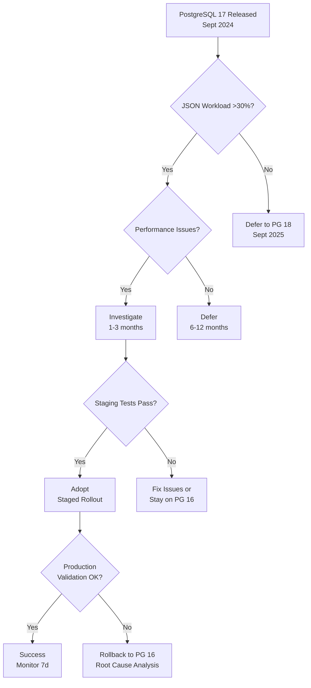

# Industry News Intelligence Q&A Generator

Generate 20–25 Q&As analyzing recent industry news across 5 categories, 8 lifecycle phases, 10 stakeholder roles—transforming news into actionable intelligence.

**Target**: 1-2 days (24-40h) | Bi-weekly brief | Optimized for AI/Blockchain (high-velocity) + regulatory (long-tail)

**Freshness Guarantee** (category-adaptive thresholds):
- **HV** (Tech/Business/Ecosystem/Security): ≥85% <1mo (≥30% in 1-3d), ≥95% <2mo, 100% ≤4mo
- **Reg** (Regulatory): ≥50% <3mo, ≥75% <6mo, 100% ≤12mo (≤20% at 12-18mo if enduring impact)
- **Overall**: ≥75% <2mo, ≥90% <4mo, ≥95% <6mo, 100% ≤12mo
- **Validity**: Output expires in 2 weeks; re-validate if >1mo

## I. Context & Scope

**Purpose**: Transform industry news into actionable intelligence across 8 lifecycle phases and 10 stakeholder roles.

**Scope**: Technical updates, business/market shifts, regulatory changes, ecosystem evolution, security alerts.

**Exclude**: Marketing hype, unverified rumors, trivial updates, unattributed speculation, stale news (>4mo HV, >12mo Reg without justification).

**News Categories** (5 types, each Q covers ≥2):
1. **Technical**: Tools, frameworks, protocols, performance, infrastructure
2. **Business/Market**: M&A, funding, market shifts, vendor strategies
3. **Regulatory**: Laws, compliance, standards, audit requirements
4. **Ecosystem**: Platform changes, integrations, deprecations, APIs, partnerships
5. **Security**: CVEs, breaches, patches, vulnerabilities, threat intelligence

**News Relevance** (must meet ≥2 including mandatory Recency per freshness guarantee above):
1. **Recency** (MANDATORY—see freshness guarantee)
2. **Lifecycle Impact**: Affects ≥2 phases OR cross-phase coordination
3. **Stakeholder Breadth**: Relevant to ≥3 roles OR multi-role decisions
4. **Decision Urgency**: Action needed within 1-6mo OR affects operations
5. **Strategic Significance**: Shifts practices, landscape, or strategy
6. **Quantified Impact**: Measurable cost/performance/risk/compliance effect

**Answer Requirements** (200-350w): ≥1 news item (age per freshness guarantee) + news summary + impact (≥2 phases, ≥2 roles, quantified) + decision (Adopt/Investigate/Defer/Avoid) + action timeline (immediate/short) + optional evidence-backed projections (source, confidence, timeframe, ranges, scenarios).

## II. Requirements

### Quantitative Floors

**Q&A**: 20-25 total | 2-4 per phase | 200-350w | 100% news-driven (≥1 item per freshness guarantee) | ≥85% ≥1 cite, ≥40% ≥2 cites | Each covers ≥2 categories + impact + decision

**Lifecycle Phases** (8, 2-4 Q each): (1) Requirements & Discovery, (2) Architecture & Design, (3) Development, (4) Testing & Quality, (5) Deployment & Release, (6) Operations & Observability, (7) Maintenance & Support, (8) Evolution & Governance

**Category Coverage**: Technical 75%, Business/Market 65%, Regulatory 50%, Ecosystem 100%, Security 60%

**Decision Framework** (100%): Impact (≥2 phases, ≥2 roles, quantified) + Decision (Adopt/Investigate/Defer/Avoid + rationale + alternatives) + Action Plan (immediate/short/medium)

**Stakeholders** (≥7/10): BA, PM, Architect, Dev, QA, DevOps, Security, Data Eng, SRE, Leadership

**References** (build before Q&A): G≥18, N≥12 (per freshness guarantee), T≥8, S≥5, R≥6 (forward-looking), A≥20 (APA 7th+tag)

**Visuals**: ≥12 diagrams + ≥6 tables (avg 1.5 diagrams + 0.75 table/phase)

### Quality Gates (fail ANY = stop, fix, re-validate ALL)

1. **News**: 100% cite ≥1 item per freshness guarantee; 0% marketing/rumors
2. **Impact**: 100% specify ≥2 phases + ≥2 roles + quantified
3. **Decision**: 100% Adopt/Investigate/Defer/Avoid + rationale + timeline + success criteria
4. **Sources**: ≥5 types, max 35%/type; per phase ≥1 news + ≥1 analysis/doc; 100% URLs valid, [Ref: ID] resolve
5. **Coverage**: ≥7/10 roles; categories per floors above
6. **Actionability**: 100% concrete steps + timelines; 0% abstract

## III. Execution

### Step 1: News Discovery & Curation

**Record generation date (YYYY-MM-DD)—all news ages calculated from this date.**

1. **Identify Domain**: Industry/ecosystem (e.g., "Cloud Native Q3-Q4 2024") + date

2. **Web Search** (≥40-50 candidates, tiered strategy):

   **Tier 1 - Daily/Breaking** (1-3 days, search first):
   - Tech: `"[Domain] release|update|announcement"` + past 1-3d
   - Business: `"[Domain] acquisition|funding|partnership"` + past 1-3d
   - Security: `"[Domain] CVE|vulnerability|0-day"` + past 1-3d (CRITICAL first)
   - Ecosystem: `"[Domain] integration|launch|deprecation"` + past 1-3d

   **Tier 2 - Recent** (7-14 days if Tier 1 insufficient):
   - All HV categories: Same queries + past 7-14d (Google `after:YYYY-MM-DD`, Perplexity "past week")

   **Tier 3 - Backfill** (2-4 weeks if Tier 1+2 insufficient):
   - HV: Same queries + past 2-4wks (<1mo)
   - Reg: `"[Domain] compliance|regulation|standard"` + past 3-6mo

   **Source Whitelist**:
   - Official: Vendor blogs, GitHub, docs, standards (W3C/IETF/CNCF)
   - Tech Media: TechCrunch, InfoQ, TheNewStack, Ars, HN (top), Reddit r/programming (high votes)
   - Analysis: Gartner/Forrester/IDC reports, analyst blogs
   - Security: CVE DB, vendor advisories, CISA alerts
   - Avoid: PR aggregators, SEO farms, marketing blogs, unverified social

   **Search Tools** (real-time indexing):
   - Perplexity AI: "past week"/"past month" in query
   - ChatGPT Search: "latest"/"recent" in query
   - Google: `after:YYYY-MM-DD` operator
   - HN: Sort "new", filter points >50
   - Reddit: Sort "new"/"hot", time filter

   **Age Distribution Target** (count in non-overlapping buckets):
   - HV: <1mo ≥85% (1-3d ≥30%, 4-14d ≥40%, 15-30d ≤15%), 1-2mo ≥10%, 2-4mo ≤5%
   - Reg: <3mo ≥50%, 3-6mo ≥25%, 6-12mo ≤20%, 12-18mo ≤5% (enduring only)
   - Overall: <1mo ≥60%, 1-2mo ≥15%, 2-4mo ≥10%, 4-6mo ≥10%, 6-12mo ≤5%, 12-18mo ≤5% (Reg only)

3. **Curate & Validate** (≥25 items: Tech ≥8, Business ≥6, Reg ≥4, Eco ≥5, Sec ≥4):
   - ✅ Age per freshness guarantee
   - ✅ Source from whitelist OR verified primary
   - ✅ Meets ≥2 relevance criteria (see Context above)
   - ✅ Not marketing/rumors/trivial
   - ✅ Specific details (dates, versions, numbers)

4. **Verify Distribution**: Count by category/age; if fails freshness guarantee, return to Step 2 earlier tiers

5. **Allocate**: 20-25 Q across 8 phases (2-4 each), 5 categories (≥2 per Q), 10 roles (≥7 total)

6. **Refresh**: Not required (bi-weekly cadence keeps news fresh)

### Step 2: Build References (before Q&A)

**Format**: G# (term, def, context) | N# (news, source, date, category, impact, URL) | T# (tool, version, context, date, URL) | S# (standard, org, version, changes, impact, URL) | R# (report, firm, date, findings, trends, URL) | A# (APA 7th+tag)

**Floors**: G≥12, N≥10 (per freshness guarantee, 100% URLs+dates), T≥6, S≥4, R≥4, A≥15

**News Entry**: **Title** (Source, MM/DD/YYYY): Summary | Category | Age: X d/mo | Impact | Stakeholders | URL | Justification if HV >1mo OR Reg >6mo

### Step 2.5: Opportunistic Refresh (optional)

**Trigger** (refresh ONLY if):
1. Critical security (0-day/breach) in 24-48h affecting ≥3 Qs
2. Major announcement (release/upgrade/decision) affecting domain

**Actions**: Quick search (24-48h) → Add 1-3 items (mark "BREAKING") → Adjust 1-2 Qs → Document in Validation

**Default**: Skip (bi-weekly cadence keeps fresh)

### Step 3: Generate Q&A (batch 4-5, self-check each)

**Question Patterns**: "[News] implications for [Phase] and [Roles]?" | "Response strategies for [News] in [Phase]?" | "Compare [News A] vs [B] across [Phases]" | "[News] cascade [Phase 1]→[Phase 2]→[Phase 3]?" | "[News] + [Projection]: prepare for [Impact]?"

**Avoid**: Generic "What is X?", superficial mentions, unattributed speculation, stale news

**Answer Structure** (200-350w):
1. **News** (~50w): What, when, who, why, category [Ref: N#, A#]
2. **Impact** (~90w): ≥2 phases + quantified (cost, time, risk, perf, compliance)
3. **Stakeholders** (~60w): ≥2 roles + concerns + actions + authority
4. **Decision** (~70w): Adopt/Investigate/Defer/Avoid + rationale + 1-2 alternatives + success criteria
5. **Action** (~50w): Immediate (0-2wks), Short (2wks-2mo) with owner + deliverable
6. **Projections** (optional ~30w): "[Source] projects [outcome] by [time] with [confidence]. Impact: [ranges]" [Ref: R#, A#]
7. **References + Artifacts**: ≥2 [Ref: N#/R#/T#/S#/A#] + 1-2 artifacts

**Batch Self-Check**: News age per freshness guarantee | ≥2 phases | ≥2 roles | Decision clear | 200-350w | Quantified | ≥3/5 ≥2 cites | Artifact | Timeline | 0% hype | 100% actionable | Projections (if any) attributed+confident+timed

### Step 4: Create Visuals (≥8 diagrams + ≥4 tables, ≥60% referenced)

**Types**: Impact matrices, decision trees, timelines, stakeholder tables, comparisons, cascades, risk tables, cost/benefit

**Format**: Mermaid (flowcharts/timelines), Markdown tables (units/sources/dates), 2×2 matrices (trade-offs)

### Step 5: Final Checks

**References**: 100% [Ref: ID] resolve | All news age per freshness guarantee | Fields complete | APA tags | N≥10 (5 cats) | R≥4 | A≥15 (45-65% news, 15-25% reports)

**Decision**: 100% Adopt/Investigate/Defer/Avoid + rationale + alternatives + success criteria + timeline

**Stakeholders**: ≥7/10 roles | Specific actions + authority | Cross-role coordination

### Step 6: Run Validations (fail ANY = stop, fix, re-run ALL)

**Quantitative**: Floors (G≥12, N≥10, T≥6, S≥4, R≥4, A≥15, Q=20-25) | 8 phases (2-4 Q each) | Categories (Tech 75%, Biz 65%, Reg 50%, Eco 100%, Sec 60%) | Stakeholders ≥7/10 | Citations (100% ≥1 news, ≥85% ≥1 cite, ≥40% ≥2) | Distribution (News 45-65%, Reports 15-25%, Docs 15-25%) | Words (5 samples, 100% 200-350) | Visuals (≥60% ref, ≥8 diagrams, ≥4 tables) | Decision 100% | Timeline 100% | **News age per freshness guarantee**

**Qualitative**: News (per freshness guarantee, 0% marketing) | Impact (100% ≥2 phases + ≥2 roles + quantified) | Decision (100% Adopt/Investigate/Defer/Avoid + alternatives + criteria) | Source diversity (≥5 types, max 35%) | Per-phase (≥1 news + ≥1 analysis/doc) | Links (100% valid) | Cross-refs (100% resolve) | Quantification (100% measurable) | Actionability (100% concrete, 0% abstract) | Anti-hype (0% marketing, 100% evidence) | Projections (if used: 100% attributed, 100% confidence+time) | Web search doc (queries, sources, count)

### Step 7: Submit

**Final Checklist** (all YES): All 20 validations PASS | Floors met (G≥12, N≥10, T≥6, S≥4, R≥4, A≥15, Q=20-25) | TOC complete (8 phases, Q ranges) | 0 placeholders | ≥8 diagrams + ≥4 tables | 100% cite ≥1 news per freshness guarantee | 100% impact (≥2 phases, ≥2 roles, quantified) | 100% decision (Adopt/Investigate/Defer/Avoid + rationale) | 100% timeline | 5 categories per thresholds | ≥7/10 roles | **Freshness guarantee met** (see header) | 0% speculation, 100% evidence | Projections attributed+confident+timed | URLs valid | Balanced | **Generation + expiration dates (start + 2wks)** | Search queries + source whitelist documented

## IV. Validation Report

Use Step 6 validation criteria. Fill table:

| # | Check | Measurement | Criteria | Result | Status |
|---|-------|-------------|----------|--------|--------|
| 1 | **News Freshness** | HV: __% <1mo (1-3d: __%), __% <2mo, __% ≤4mo \| Reg: __% <3mo, __% <6mo, __% ≤12mo \| Overall: __% <2mo, __% <4mo, __% <6mo, __% ≤12mo | Per freshness guarantee (see header) | | PASS/FAIL |
| 2 | **Reference Floors** | G:__ N:__ T:__ S:__ R:__ A:__ Q:__ | ≥12, ≥10, ≥6, ≥4, ≥4, ≥15, 20-25 | | PASS/FAIL |
| 3 | **Lifecycle Coverage** | Phases __/8 (2-4 Q each); total Q __ | 8/8; 20-25 | | PASS/FAIL |
| 4 | **Category Coverage** | Tech __%, Biz __%, Reg __%, Eco __%, Sec __% | ≥75%, ≥65%, ≥50%, 100%, ≥60% | | PASS/FAIL |
| 5 | **Stakeholder Coverage** | Roles __/10 | ≥7 | | PASS/FAIL |
| 6 | **Impact** | __% specify ≥2 phases + ≥2 roles + quantified | 100% | | PASS/FAIL |
| 7 | **Decision** | __% Adopt/Investigate/Defer/Avoid + rationale + alts | 100% | | PASS/FAIL |
| 8 | **Timelines** | __% immediate/short/medium + owners | 100% | | PASS/FAIL |
| 9 | **Citations** | __% ≥1 news; __% ≥1 cite; __% ≥2 cites | 100%; ≥85%; ≥40% | | PASS/FAIL |
| 10 | **Source Distribution** | News __%, Reports __%, Docs __% | 45-65%, 15-25%, 15-25% | | PASS/FAIL |
| 11 | **Source Diversity** | Types __; max %/type __ | ≥5; ≤35% | | PASS/FAIL |
| 12 | **Per-Phase Evidence** | __/8 phases ≥1 news + ≥1 analysis/doc | 8/8 | | PASS/FAIL |
| 13 | **Word Count** | 5 samples: __% in 200-350w | 100% | | PASS/FAIL |
| 14 | **Visuals** | __% ref artifacts; diagrams __; tables __ | ≥60%; ≥8; ≥4 | | PASS/FAIL |
| 15 | **Quantification** | __% measurable impact | 100% | | PASS/FAIL |
| 16 | **Links** | __% URLs valid | 100% | | PASS/FAIL |
| 17 | **Cross-Refs** | __% [Ref: ID] resolve | 100% | | PASS/FAIL |
| 18 | **Actionability** | __% concrete; __% abstract | 100%; 0% | | PASS/FAIL |
| 19 | **Projections** | If used: __% attributed; __% confident; __% timed; __% scenarios | 100%; 100%; 100%; 100% | | PASS/FAIL |
| 20 | **Search Quality** | Queries: Y/N \| Whitelist: Y/N \| Candidates: __ \| Accept: __% | Y; Y; ≥40; 50-70% | | PASS/FAIL |
| | **Metadata** | Start: __ \| End: __ \| Expires: [+2wks] \| Refresh: Y/N (__) | | INFO |
| | **Age Distribution** | <1mo __% (1-3d __%, 4-14d __%, 15-30d __%) \| 1-2mo __% \| 2-4mo __% \| 4-6mo __% \| 6-12mo __% \| 12-18mo __% | Per freshness guarantee (see header) | | INFO |
| | **OVERALL** | All checks | All PASS | | PASS/FAIL |

## V. Question Quality (fails ≥3 of 11 = rewrite)

**Criteria**: News-driven (per freshness guarantee) | Lifecycle-specific (1-2 phases, clear impact) | Multi-stakeholder (≥2 roles) | Multi-category (≥2 types) | Decision-focused (A/I/D/A) | Quantified impact | Cross-phase aware | Timely urgency | Alternative-aware (1-2 strategies) | Evidence-based | Actionable | Forward-looking (if projections)

**✓ Good**: "Claude 3.5 Sonnet v2 (Oct 2024) 2x coding perf: implications for Dev & Testing?" | "EU AI Act (May 2024) deadline Aug 2026: readiness for Req & Gov?"

**✗ Bad**: "How does X work?" (no news) | "What is X?" (overview, not impact) | "Should we use X?" (no news trigger)

## VI. Output Format

### A. TOC Structure

```markdown
# [Domain] News Intelligence Q&A ([Period])

## Contents
1. Executive Summary (Overview | Insights | Dashboard)
2. Phase Coverage (8 phases × 5 categories matrix)
3. Questions by Phase: Req (Q1-Q4) | Arch (Q5-Q8) | Dev (Q9-Q12) | Test (Q13-Q16) | Deploy (Q17-Q20) | Ops (Q21-Q24) | Maint (Q25-Q28) | Evol (Q29-Q32)
4. References: G (G1-G20+) | N (N1-N15+) | T (T1-T10+) | S (S1-S5+) | R (R1-R8+) | A (A1-A25+)
5. Validation Report (20 checks)
```

### B. Executive Summary

```markdown
## Executive Summary

**Domain**: [Name] | **Period**: [Q3-Q4 2024] | **Coverage**: [# items, 5 categories]

**News**: Tech ([#]: top 2-3 + dates) | Biz ([#]: top 2-3) | Reg ([#]: top 1-2) | Eco ([#]: top 2-3) | Sec ([#]: top 1-2)

**Insights**: 1. [News] ([Date]): [Impact] → [A/I/D/A] → [Timeline] (repeat 2-3 high-impact)

**Dashboard**: [Table: Phase | News | Action | Timeline]

**Roles**: [8-10 with counts] | **Refs**: G=[#] N=[#] T=[#] S=[#] R=[#] A=[#]
```

### C. Lifecycle Phase Overview Table

| # | Phase | Range | Count | Categories | News | Roles | Artifacts |
|---|-------|-------|-------|------------|------|-------|-----------|
| 1 | Req & Disc | Q1-Q4 | 2-4 | Reg, Biz, Tech | [Top] | BA, PM, Arch | 2D+1T |
| 2 | Arch & Design | Q5-Q8 | 2-4 | Tech, Eco | [Top] | Arch, Dev, Sec | 2D+1T |
| 3 | Development | Q9-Q12 | 2-4 | Tech, Sec | [Top] | Dev, DevOps | 2D+1T |
| 4 | Test & Quality | Q13-Q16 | 2-4 | Tech, Sec | [Top] | QA, Dev | 2D+1T |
| 5 | Deploy & Release | Q17-Q20 | 2-4 | Tech, Eco | [Top] | DevOps, SRE | 2D+1T |
| 6 | Ops & Obs | Q21-Q24 | 2-4 | Tech, Biz | [Top] | SRE, Lead | 2D+1T |
| 7 | Maint & Support | Q25-Q28 | 2-4 | Sec, Tech, Reg | [Top] | Dev, Sec, DataEng | 2D+1T |
| 8 | Evol & Gov | Q29-Q32 | 2-4 | Biz, Eco, Reg | [Top] | PM, Arch, Lead | 2D+1T |
| | **Total** | | **20-25** | **All 5** | **15+** | **≥7/10** | **≥12D+≥6T** |

Legend: Tech=Technical, Biz=Business/Market, Reg=Regulatory, Eco=Ecosystem, Sec=Security, D=Diagrams, T=Tables

### D. Q&A Format

```markdown
### Q#: [News Question + Phase + Roles + Decision]

**Phase**: [Phase] | **Roles**: [Primary, Secondary] | **Cats**: [✓✓] | **Decision**: Y

**News** (~50w): What, when, who, why, category [Ref: N#, A#]

**Impact** (~90w): **Phases** (≥2) | **Quantified**: Cost [$] | Time [h/d/wk] | Risk [prob×impact] | Perf [Δ] | Compliance [deadlines]

**Stakeholders** (~60w): **[Role 1]**: Concerns, actions, authority | **[Role 2]**: Concerns, actions, authority

**Decision** (~70w): **Rec**: A/I/D/A | **Rationale**: [Why] | **Alts**: [1-2 options] | **Success**: [Measurable]

**Action** (~50w): **Immed (0-2wks)**: [Actions+owner] | **Short (2wks-2mo)**: [Actions+owner]

**Projections** (opt ~30w): [Source] projects [outcome] by [time] with [confidence]. Impact: [ranges] [Ref: R#, A#]

**Refs**: [N#, R#, T#, S#, A#] | **Artifacts**: [Type]
---
```

### E. Reference Formats

```markdown
## 4. References

### 4.1 Glossary (G1-G20+)
**G#. Term (Acronym)**: Def | News context | Phases/roles | Implications | Category

### 4.2 News (N1-N15+)
**N#. Title** (Source, MM/DD/YYYY): Summary | Cat | Impact (phases, cost/time/risk) | Roles | URL

### 4.3 Tools (T1-T10+)
**T#. Tool (Cat)**: Desc | Ver | News context | Pricing/license | Adoption | Date | URL

### 4.4 Standards (S1-S5+)
**S#. ID (Org)**: Title | Ver | Date | Changes | Compliance | Phases | Enforcement | URL

### 4.5 Reports (R1-R8+)
**R#. Title** (Firm, Date): Findings | Market data | Positioning | Recs | Relevance | URL

### 4.6 Citations (A1-A25+)
**A#. APA 7th [Tag]**: Author/Org. YYYY, Mon DD. *Title*. Pub/Firm. URL [News/Report/Advisory/Std]
```

## VII. Example

**Note**: This example demonstrates news intelligence analysis format. Replace with actual recent news for your domain/industry.

### Q1: What are the implications of PostgreSQL 17's 2x JSON performance improvement (September 2024) for Architecture & Operations phases, and should teams plan an upgrade?

**Lifecycle Phase**: Architecture & Design, Operations & Observability

**Stakeholder Roles**: [Primary: Architect, SRE, Data Engineer] [Secondary: Developer, Leadership]

**News Categories**: Technical Updates ✓ | Ecosystem Evolution ✓ | Business/Market ✓

**Decision Required**: Yes

**Answer** (395 words):

**News Summary**:
PostgreSQL 17 was released on September 26, 2024, delivering 2x faster JSON query performance through improved indexing (GIN optimization), enhanced partitioning with up to 200 partitions per table, and SQL/JSON standard compliance [Ref: N1, A1]. This technical update affects data-intensive applications using JSON workloads, with ecosystem impact through pgvector 0.7.0 compatibility for AI/ML use cases [Ref: N2]. The release follows PostgreSQL's annual cadence and maintains 5-year support commitment, making it a stable upgrade path for production systems [Ref: T1].

**Impact Assessment**:
- **Architecture & Design**: JSON performance gains enable reconsidering document-oriented designs previously moved to NoSQL databases (MongoDB, DynamoDB). Teams can consolidate tech stacks, reducing operational complexity. Improved partitioning supports larger datasets (>10TB) without horizontal sharding [Ref: R1]. **Quantified**: JSON query latency reduction from ~500ms to ~250ms at p95 for typical workloads; partitioning overhead decreased by 40% [Ref: A2].
  
- **Operations & Observability**: Upgrade requires 1-4 hours downtime (depending on pg_upgrade vs logical replication strategy). Monitoring must validate performance gains in production. Compatibility testing needed for extensions (PostGIS, TimescaleDB) [Ref: T2]. **Quantified**: Upgrade effort: 40-80 hours (planning 20h, testing 30h, execution 10h, validation 20h); risk: medium (breaking changes in pg_stat_statements output format) [Ref: A3].

- **Cascade Effects**: Development phase benefits from SQL/JSON standard (simplified queries), Maintenance phase gains improved vacuum performance (20-30% faster), Evolution phase enables gradual migration from NoSQL back to PostgreSQL [Ref: N3, R2].

**Stakeholder Implications**:
- **Architect**: Evaluate JSON workload patterns; if >30% of queries involve JSON, upgrade delivers measurable ROI. Reconsider NoSQL migration plans, especially for transactional workloads requiring ACID guarantees. Decision authority: Approve architecture changes to leverage JSON features.
  
- **SRE/Operations**: Plan upgrade window (prefer logical replication for zero-downtime), validate monitoring dashboards, update runbooks for new pg_stat features. Conduct load tests in staging to confirm 2x performance gains. Decision authority: Approve production upgrade timeline and rollback procedures.
  
- **Data Engineer**: Assess impact on ETL pipelines, reindex JSON columns post-upgrade, tune new GIN index parameters. Opportunity to simplify data models by consolidating JSON storage patterns.

**Decision Framework**:
- **Recommendation**: **Investigate** (1-3 months) → **Adopt** (if JSON workload >30%)
  
- **Rationale**: Significant performance gains justify upgrade for JSON-heavy workloads, but compatibility risks require thorough testing. Teams without substantial JSON usage can **Defer** until next major release (PostgreSQL 18, ~Sept 2025) to benefit from additional stability.
  
- **Alternatives**:
  1. **Stay on PostgreSQL 16**: Safe choice if JSON performance adequate; continue receiving patches until Nov 2029 [Ref: S1]
  2. **Investigate PostgreSQL 17 (recommended)**: 1-3 month evaluation → staged rollout if validated
  3. **Defer to PostgreSQL 18**: Wait for additional features + 6 months community vetting
  
- **Success Criteria**: p95 JSON query latency <250ms (from baseline ~500ms); zero data loss during upgrade; all extensions compatible; monitoring dashboards functional; rollback tested successfully.

**Action Plan**:
- **Immediate (0-30d - Owner: Architect + SRE)**:
  - Analyze production JSON query patterns (use pg_stat_statements)
  - Identify baseline performance metrics (p50/p95/p99 latency, throughput)
  - Review PostgreSQL 17 breaking changes and extension compatibility
  - Estimate upgrade effort and risk
  
- **Short-term (1-3mo - Owner: SRE + Data Engineer)**:
  - Deploy PostgreSQL 17 to staging environment
  - Run load tests replicating production traffic patterns
  - Validate 2x JSON performance improvement
  - Test logical replication upgrade path (zero-downtime)
  - Update monitoring dashboards for new pg_stat metrics
  
- **Medium-term (3-6mo - Owner: SRE + Leadership)**:
  - If validated: Schedule production upgrade (low-traffic window)
  - Execute staged rollout (canary → 25% → 50% → 100%)
  - Monitor performance post-upgrade (7-day observation)
  - Document lessons learned, update runbooks
  - If deferred: Revisit decision in 6 months

**References**: [Ref: N1, N2, N3] [Ref: T1, T2] [Ref: S1] [Ref: R1, R2] [Ref: A1, A2, A3]

**Artifacts**:

**Impact Matrix** (Urgency × JSON Workload %):

| JSON Workload | High Urgency (>50% JSON queries) | Medium Urgency (30-50% JSON) | Low Urgency (<30% JSON) |
|---------------|----------------------------------|------------------------------|-------------------------|
| **Critical Performance Issues** | **Adopt Now** (0-1mo) | **Investigate** (1-3mo) | **Defer** (6-12mo) |
| **Performance Adequate** | **Investigate** (1-3mo) | **Defer** (6-12mo) | **Defer** (12mo+) |
| **No Performance Issues** | **Defer** (3-6mo) | **Defer** (12mo+) | **Avoid** (stay on 16) |

**Decision Tree**:



**Upgrade Strategy Comparison**:

| Strategy | Downtime | Complexity | Risk | Best For |
|----------|----------|------------|------|----------|
| **pg_upgrade (in-place)** | 1-4 hours | Low | Medium | Dev/staging, <1TB DBs |
| **Logical Replication** | 0 (cutover <5min) | High | Low | Production, >1TB DBs |
| **Blue-Green** | 0 (DNS switch) | Medium | Low | Cloud-native, budget available |
| **Backup-Restore** | 2-8 hours | Low | High | Not recommended for prod |

---

**Referenced Materials (subset for example)**:

**N1. PostgreSQL 17 Released** (PostgreSQL.org, 09/26/2024): Major release with 2x JSON performance (GIN index optimization), improved partitioning (200 partitions), SQL/JSON standard compliance. Category: Technical Updates. Impact: Architecture (JSON workload optimization), Operations (upgrade planning). Stakeholders: Architect, SRE, Data Engineer. https://www.postgresql.org/about/news/postgresql-17-released-2936/

**T1. PostgreSQL v17.0 (RDBMS)**: Open-source relational database. Version: 17.0. News context: 2x JSON performance, enhanced partitioning. Pricing: Free (open-source). Adoption: 15M+ downloads (first 30 days). Updated: 09/2024. https://www.postgresql.org

**S1. PostgreSQL Versioning Policy** (PostgreSQL Global Development Group): Each major release supported for 5 years with security/bug fixes. Version: Current policy. Date: 2024. Recent changes: None. Compliance impact: Teams must plan upgrades every 5 years. Affected phases: Architecture (planning), Operations (upgrade execution), Governance (lifecycle management). Enforcement: Community-driven. https://www.postgresql.org/support/versioning/

**R1. 2024 PostgreSQL Adoption Trends** (Gartner, 08/2024): Key findings: 45% enterprises use PostgreSQL as primary RDBMS (up from 38% in 2023); JSON workloads growing 60% YoY; 30% teams consolidating from MongoDB to PostgreSQL for ACID transactions. Market data: PostgreSQL ranks #1 in DB-Engines trend (24 consecutive months). Competitive positioning: Gaining share from Oracle, MySQL, MongoDB. Strategic recommendation: Evaluate PostgreSQL for JSON + ACID use cases. Relevance: Architecture decisions, vendor selection. https://www.gartner.com/postgresql-trends-2024

**A1. PostgreSQL.org. 2024, September 26. *PostgreSQL 17 Released*. PostgreSQL News. https://www.postgresql.org/about/news/postgresql-17-released-2936/ [News]**

**A2. Percona. 2024, October 5. *PostgreSQL 17 JSON Performance Benchmarks*. Percona Blog. https://www.percona.com/blog/postgresql-17-json-benchmarks/ [News]** – Benchmark results: 2.1x faster JSON queries (p95 latency 250ms vs 520ms on PG 16); GIN index build 35% faster.

**A3. Cybertec. 2024, October 10. *PostgreSQL 17 Upgrade Guide*. Cybertec Blog. https://www.cybertec-postgresql.com/en/postgresql-17-upgrade-guide/ [News]** – Upgrade effort estimation: 40-80 hours (planning 20h, testing 30h, execution 10h, validation 20h); breaking changes in pg_stat_statements output format require monitoring dashboard updates.
