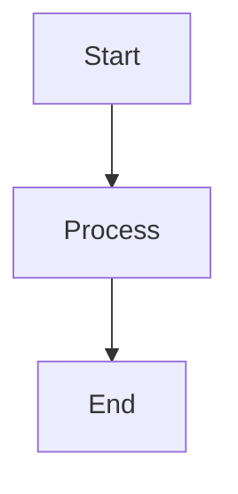

# Pattern-Focused Interview Q&A Template

Generate interview Q&As demonstrating proven, reusable patterns across all domains with empirical evidence, multi-stakeholder value, and clear applicability boundaries.

---

# Part I: Pattern Quality Standards

## Specifications

**Scope**: 25–30 pattern-focused Q&As (20/40/40 Foundational/Intermediate/Advanced), 150–300 words each

**Pattern Coverage**: Regulatory, Business, Market, Technical, Data, Organizational, NFR (10 sub-dimensions), Process, Hybrid patterns

**Per Answer Requirements** (ALL mandatory):
- Pattern identification with empirical evidence
- ≥2 reusable contexts (industries/scales/domains)
- ≥2 stakeholder groups addressed
- Trade-off analysis (improves X, sacrifices Y)
- Applicability boundaries (when to use/avoid)
- Concrete implementation example
- Effectiveness metrics/case studies

**Per Topic Cluster**: ≥1 diagram + ≥1 concrete example + ≥1 table + ≥1 quantitative metric

### Pattern Quality Criteria (7 Mandatory)

1. **Reusability**: ≥2 contexts (industries/scales/domains) + adaptation points
2. **Proven Effectiveness**: Empirical evidence (Netflix/AWS/Stripe, metrics, adoption rates)
3. **Cross-Context Applicability**: Clear boundaries (when applies vs doesn't)
4. **Multi-Stakeholder Value**: ≥2 groups (Developers, Ops, Security, Business, Compliance, End Users)
5. **Functional + NFR Coverage**: What system does + how well (security, performance, availability, etc.)
6. **Trade-off Analysis**: Pattern X improves Y but sacrifices Z
7. **Anti-Pattern Awareness**: Misapplications, failure modes, when NOT to use

### Pattern Domains (11 Categories)

| Domain | Pattern Examples | Stakeholders |
|--------|------------------|-------------|
| **Regulatory** | Audit trails, Consent management, Data residency | Compliance, Developers, Legal, End Users |
| **Business** | Subscription, Freemium, Platform/Marketplace | Executives, Product, Finance, Customers |
| **Market** | Blue Ocean, Disruptive Innovation, Land & Expand | Executives, Product, Marketing, Analysts |
| **Technical** | GoF patterns, Repository, Strangler Fig | Developers, Architects, Operations |
| **Data** | Polyglot Persistence, Event Sourcing, CQRS, Data Lake | Data Engineers, DBAs, Architects, Compliance |
| **Organizational** | Conway's Law, Team Topologies, Two-Pizza Team, DevOps | Managers, Executives, Team Leads, ICs |
| **NFR-Security** | Zero-Trust, Defense-in-Depth, Secrets Management | Security, Developers, Compliance |
| **NFR-Performance** | Caching, Connection Pooling, CDN | Developers, Operations, End Users |
| **NFR-Availability** | Circuit Breaker, Bulkhead, Health Checks | Operations, Business, End Users |
| **NFR-Reliability** | Retry+Backoff, Idempotency, Saga | Developers, Operations, Business |
| **NFR-Scalability** | Horizontal Scaling, Sharding, CQRS | Architects, Operations, Business |
| **NFR-Observability** | Distributed Tracing, Metrics, Logging | Operations, Developers, Business |
| **NFR-Adaptability** | Feature Flags, Strategy, Plugin Architecture | Developers, Product, Business |
| **NFR-Extensibility** | DI, Open-Closed, Middleware | Developers, Architects, Third-party |
| **NFR-Maintainability** | SOLID, Clean Architecture | Developers, Architects, New Hires |
| **NFR-Testability** | Test Doubles, Contract Testing | Developers, QA, Operations |
| **Process** | Agile, Retrospectives, Incident Response | Teams, Managers, Operations |

### Visual Element Standards

**Per Topic Cluster**: Diagram + example + table + metric + reusability evidence + stakeholder impact + effectiveness metrics

#### Diagram Selection by Pattern Domain

| Pattern Domain | Primary Diagram | Standard | Example + Metrics |
|---------------|-----------------|----------|-------------------|
| **Regulatory Patterns** | Compliance flowchart, Audit trail diagram | BPMN, Custom | GDPR consent flow + `Compliance Coverage = Addressed Requirements / Total × 100%` |
| **Business Patterns** | Business model canvas, Value chain | BMC, Porter | Revenue model example + `Customer Lifetime Value = Revenue per Customer × Retention Period` |
| **Technical Patterns** | Class diagram, Sequence diagram | UML, GoF | Pattern implementation + `Reusability = Reused Components / Total × 100%` |
| **NFR - Security** | Threat model, Auth flow | STRIDE, OAuth2 | Auth implementation + `Attack Surface = Entry Points × Vulnerabilities` |
| **NFR - Performance** | Latency breakdown, Caching diagram | Flamegraph, Custom | Optimization code + `Latency = p50/p95/p99`, `Throughput = Requests/sec` |
| **NFR - Availability** | Failure modes, Redundancy diagram | Fault tree, Custom | Failover code + `Uptime = Available Time / Total Time × 100%`, `MTBF`, `MTTR` |
| **NFR - Scalability** | Scaling strategy, Sharding diagram | Custom | Scaling code + `Scalability Factor = Throughput(N nodes) / Throughput(1 node)` |
| **Process Patterns** | Workflow diagram, Decision tree | BPMN, DMN | Process example + `Cycle Time = End Time - Start Time`, `Efficiency = Output / Input × 100%` |
| **Integration Patterns** | Sequence diagram, API contract | UML, OpenAPI | Integration code + `Response Time = Latency + Processing + Network` |
| **Data Patterns** | ERD, Data flow, Lineage diagram | ERD, DFD, Data mesh | Data model + `Normalization Level (1NF-5NF)`, `Query Performance = Rows Scanned / Rows Returned` |
| **Organizational Patterns** | Org structure, Team topology | Org chart, Conway | Team model + `Conway Alignment = Matching Boundaries / Total × 100%`, `Team Autonomy Score` |

**Standards Reference**: BPMN (processes), DMN (decisions), UML (structure/behavior), ArchiMate (enterprise), SysML (requirements), ERD/DFD (data), C4 (software views)

#### Pattern Catalog (70+ Patterns)

**Quick Reference**: Reusable, proven-effective patterns with empirical evidence and multi-stakeholder value.

| Domain | Pattern | Contexts | Effectiveness Evidence | Key Stakeholders |
|--------|---------|----------|------------------------|------------------|
| **Regulatory** | Double-Entry Audit Trail | Financial, Healthcare, Blockchain, GDPR | SOX required, all major banks | Compliance, Developers, Auditors |
| | Consent Management | GDPR, CCPA, Marketing, Healthcare | 10K+ orgs, 85% risk reduction | Legal, End Users, Developers |
| | Data Residency | Multi-region cloud, Fintech, Gov | AWS/Azure/GCP standard | Compliance, Ops, Business |
| **Business** | Subscription Model | SaaS, Media, Retail, B2B/B2C | $1.5T economy, 5-7x valuations | Finance, Product, Customers |
| | Freemium | Dev tools, Productivity, Storage | Slack 30%, Dropbox $2B | Marketing, Product, Users |
| | Platform/Marketplace | Airbnb, AWS, App Store, Stripe | 7/10 top companies, 70% margins | Business, Producers, Consumers |
| **Market** | Blue Ocean Strategy | New categories, Saturated markets | Cirque $800M, Wii 100M units | Executives, Product, Marketing |
| | Disruptive Innovation | Tech transitions, Market entry | Netflix/Tesla, 30+ industries | Executives, Investors, Market |
| | Land and Expand | Enterprise SaaS, B2B | Slack/Dropbox, 120%+ retention | Sales, Product, Finance |
| **Technical** | Repository | DDD, Layered arch, Microservices | 60-80% coupling reduction | Developers, Architects, Ops |
| | Strangler Fig | Legacy modernization, Migration | Amazon/GitHub, 90% risk reduction | Architects, Ops, Business |
| **Security** | Defense-in-Depth | Enterprise, Cloud, IoT | 90% attack reduction, 95% F500 | Security, Compliance, Ops |
| | Zero-Trust | Remote work, Cloud-native, APIs | Google 7yr/85K, 75% breach impact | Security, Developers, Users |
| | Secrets Management | Cloud, Microservices, CI/CD | 30M+ Vault, 50% F500 | Security, Developers, Ops |
| **Performance** | Caching | Web apps, APIs, Databases | 40-60% latency↓, 10x throughput | Users, Developers, Ops |
| | Connection Pooling | DB, HTTP, Message queues | 10-100x gain, DB standard | Developers, Ops, Users |
| | CDN | Static assets, Video, APIs | 50-70% latency↓, 70% top sites | Users, Business, Ops |
| **Availability** | Circuit Breaker | Microservices, Distributed systems | Netflix 99.99% uptime | Ops, Developers, Users |
| | Bulkhead | Thread/Connection pools, Multi-tenant | Netflix/AWS, 80% capacity maintained | Ops, Architects, Business |
| | Health Check | K8s, Load balancers, Service mesh | 70% MTTR↓, <5s detection | Ops, Developers, Business |
| **Reliability** | Retry + Backoff | Network, Message processing | 95% recovery, AWS default | Developers, Ops, Users |
| | Idempotency | Payments, Message queues, APIs | Stripe/PayPal required, 100% consistency | Developers, Ops, Business |
| | Saga | Microservices, Long transactions | Uber/Airbnb standard | Architects, Developers, Ops |
| **Scalability** | Horizontal Scaling | Web servers, APIs, Stateless | Netflix/FB, 1000s instances | Ops, Architects, Business |
| | DB Sharding | High-traffic DB, Multi-tenant | Instagram 4000, Discord billions | DBAs, Developers, Business |
| | CQRS | Read-heavy, Event sourcing | 10-100x read scale, Azure/AWS | Architects, Developers, Ops |
| **Observability** | Distributed Tracing | Microservices, Distributed | Standard cloud-native | Ops, Developers, Business |
| **Adaptability** | Feature Flags | CD, A/B testing, Canary | FB/Netflix 100+ deploys/day, 90% risk↓ | Developers, Product, Business |
| | Strategy Pattern | Payments, Pricing, Routing | GoF 1994, 60% duplication↓ | Developers, Business, Architects |
| | Plugin Architecture | IDEs, Browsers, CMS | VS Code 40K, WordPress 60K | Developers, Third-party, Users |
| **Extensibility** | Dependency Injection | Enterprise, Frameworks | Spring 50% share, 70% coupling↓ | Developers, Architects, Third-party |
| | Open-Closed | Libraries, Frameworks, APIs | SOLID 1988, 80% regression bugs↓ | Developers, QA, Business |
| | Middleware/Pipeline | Web frameworks, Message processing | Express 100K packages | Developers, Third-party, Ops |
| **Maintainability** | SOLID Principles | OOP, Enterprise apps | Since 2000, 40-60% defects↓, 25% velocity↑ | Developers, Architects, New hires |
| | Clean Architecture | DDD, Microservices | Netflix/Amazon, 70% coupling↓ | Developers, Architects, Business |
| **Testability** | Test Doubles | Unit/Integration testing | 90%+ coverage, 100x faster | Developers, QA, Ops |
| | Contract Testing | Microservices, APIs | Pact/IBM/Atlassian, 95% issues caught | Developers, API consumers, Ops |
| **Data** | Polyglot Persistence | Microservices, E-commerce | Netflix 3+, LinkedIn 10+, 50-80% latency↓ | Architects, DBAs, Developers |
| | Event Sourcing | Finance, Collaboration | 100% audit, Banking standard | Compliance, Developers, Business |
| | Data Lake | Analytics, ML, Data science | AWS/Azure/GCP, 90% F500 | Data scientists, Engineers, Business |
| **Organizational** | Conway's Law | Any software org | 50+ years proven, 40% coordination↓ | Executives, Architects, Managers |
| | Two-Pizza Team | Product/Platform teams | Amazon 2002, 60% meetings↓, 30% velocity↑ | Managers, Developers, Executives |
| | Team Topologies | Any org, Enterprises | MS/Google/Spotify, 50% load↓, 40% flow↑ | CTOs, Managers, Developers |
| | DevOps/YBIYRI | Cloud-native, SaaS | Amazon 2006, 60% MTTR↓, 10x deploys | Developers, Ops, Business |
| **Process** | Retrospective | Agile/Project teams | Scrum core, 15-25% velocity↑, 30% satisfaction↑ | Teams, Managers, Individuals |

#### Visual Quality Standards

**Rendering**: Use Mermaid (GitHub-native); avoid external renderers. Syntax example:


**Concrete Examples**: Include domain-appropriate examples (code for technical patterns, policy snippets for regulatory, model descriptions for business). Use fenced blocks with appropriate tags:
```go
// Technical pattern example
type Repository interface {
    Save(ctx context.Context, entity Entity) error
}
```
```yaml
# Regulatory pattern example - GDPR consent
consent:
  purpose: "marketing_emails"
  granted: true
  timestamp: "2024-01-15T10:30:00Z"
  withdrawable: true
```

**Math**: Inline `$formula$` or block `$$formula$$`. Define variables on first use.

**Common Math Symbols**: `∑` (sum), `∏` (product), `∫` (integral), `∂` (rate), `≈` (approx), `≤/≥` (bounds), `≠` (not equal), `∀` (for all)

**Legends**: Use consistent symbols for clarity: 💡 Analogy, 📐 Formula, 🔍 Example, ⚠️ Important Note, 💻 Code

**Anti-patterns**: Avoid single mega-diagram, BPMN for code flow, mixed abstraction levels, >120 nodes, missing rationale

**Combination Patterns**: For comprehensive analysis, combine multiple diagram types:
- **Full Documentation**: Requirements (Use Case) → Structure (Class/Component) → Behavior (Sequence/Activity) → Deployment
- **Process Automation**: BPMN Process → DMN Decision Table → ERD Data Model → Integration Diagram
- **Enterprise Architecture**: Strategy → Current State → Target State → Migration (all ArchiMate viewpoints)

**Quick Reference – Pattern Domain Guide**
| Need | Recommended Diagram(s) | Example Type | Standard |
|------|------------------------|--------------|----------|
| Regulatory compliance | Compliance flow + Audit trail | GDPR consent YAML, Policy docs | BPMN + Custom |
| Business model design | Business model canvas + Value chain | Revenue model, Partnership structure | BMC + Porter |
| Revenue optimization | Funnel diagram + Conversion flow | Pricing tiers, Conversion metrics | Custom |
| API design | Class + Sequence | Interface/Controller code | UML + OpenAPI |
| Data access | ERD + Class diagram | Repository pattern code | ERD + UML |
| Process workflow | BPMN + Decision tree | Runbook, Incident response | BPMN + DMN |
| Team structure | Org chart + Team topology | Communication paths, Boundaries | Conway + Custom |
| System migration | Strangler fig + Timeline | Migration phases, Rollback plan | Custom |

### Pattern Selection Matrices

**Business Context**:
| Context | B2B SaaS | B2C Platform | Marketplace | Open Source |
|---------|----------|--------------|-------------|-------------|
| Revenue | Subscription | Freemium/Ads | Transaction | Support/Enterprise |
| Acquisition | Sales-led | Product-led | Network effects | Community-led |
| Time to Revenue | 3-6mo | 0-3mo | 6-12mo | 6-18mo |

**Regulatory Compliance**:
| Requirement | GDPR (EU) | CCPA (CA) | HIPAA (Health) | SOC 2 (Enterprise) |
|-------------|-----------|-----------|----------------|--------------------|
| Data Residency | Required | Optional | Required | Optional |
| Consent | Explicit opt-in | Opt-out | N/A | N/A |
| Audit Trail | Required | Recommended | Required | Required |
| Erasure | Required | Required | Limited | Not required |
| Breach Notification | 72h | Prompt | 60d | Contractual |

**NFR Patterns by System Type**:
| NFR | High-Traffic API | Financial | Real-Time | Data-Intensive | Microservices |
|-----|------------------|-----------|-----------|----------------|---------------|
| Security | Auth + Rate limit | Encrypt + Audit | mTLS + Zero-trust | Encrypt at rest | Service mesh |
| Performance | CDN + Cache | Connection pool | In-mem cache | Query optimize | Async messaging |
| Availability | Circuit breaker | Active-active | Redundancy | Read replicas | Health checks |
| Reliability | Retry + Idempotency | 2PC + Saga | Idempotency | Event sourcing | Saga + Outbox |
| Scalability | Horizontal + CDN | DB sharding | CQRS + Shard | Partitioning | Independent scale |

### Citation Standards

- **Languages**: ~60% EN, ~30% ZH, ~10% other (tag: [EN], [ZH], etc.)
- **Source Types**: (1) Regulatory frameworks & legal standards; (2) Business models & strategic patterns; (3) Technical patterns & design principles; (4) Process methodologies & organizational patterns; (5) Empirical case studies & effectiveness validation
- **Format**: APA 7th with language tags
- **Inline Citation**: Use [Ref: ID] after factual claims, regulatory requirements, business models, technical patterns, process frameworks, proven effectiveness claims, trade-off analyses

### Reference Minimum Requirements

| Section | Floor | Content |
|---------|-------|---------|
| Glossary | ≥25 | Regulatory: GDPR, CCPA, Consent, Audit Trail; Business: Freemium, Platform, Network Effects, Blue Ocean, Disruptive Innovation; Technical: Repository, Strangler Fig; Data: Polyglot Persistence, Event Sourcing, Data Lake, CQRS; Organizational: Conway's Law, Team Topologies, Two-Pizza Team, DevOps/SRE; NFR: Circuit Breaker, Caching, Retry, Idempotency, Sharding, Zero-Trust, Feature Flags, DI, SOLID, Test Doubles |
| Tools | ≥10 | Compliance (OneTrust), business (Strategyzer, Blue Ocean tools), patterns (GoF), data (dbt, Databricks, Snowflake), org design (Team Topologies book), process (BPMN.io, Miro), monitoring (Prometheus, Grafana), security (Vault, OWASP ZAP), testing (Pact) |
| Literature | ≥12 | Regulatory (GDPR, NIST), business (Osterwalder, Porter, Blue Ocean Strategy, Innovator's Dilemma), patterns (GoF, Fowler, POSA, Clean Architecture), data (Kleppmann Data-Intensive, Kimball), org/team (Skelton Team Topologies, Forsgren Accelerate), NFR (Nygard Release It!, Google SRE) |
| Citations | ≥12 | ~60% EN / ~30% ZH / ~10% other (APA 7th with tags) |

**Exception**: If floor unmet, state shortfall + rationale + sourcing plan.

### Usage Guidelines

1. Follow MECE structure; maintain 20/40/40 difficulty balance
2. Meet all reference floors; address Regulatory/Business/Technical/Process dimensions
3. Include ≥1 primary diagram + ≥1 concrete example + ≥1 supporting table + ≥1 quantitative element per topic cluster
4. Per topic: ≥2 authoritative sources + ≥1 tool/framework reference + ≥1 empirical validation
5. Document any gaps with remediation plan

### Quality Gates

- **Recency**: ≥50% citations from last 3 years (≥70% for digital transformation/cloud-native domains)
- **Diversity**: ≥3 source types; no single source >25%
- **Evidence**: ≥70% answers have ≥1 citation; ≥30% have ≥2 citations
- **Tool Details**: Pricing, adoption metrics, last update ≤18 months, key integrations
- **Links**: Validate accessibility; use DOIs/archived URLs
- **Cross-refs**: All [Ref: ID] resolve to entries

> Scaling: For >30 Q&A, increase floors by ~1.5×. Prioritize gates before raising floors.

### Pre-Submission Validation (21 Steps)

**Reference Counts** (Steps 1-7):
- Glossary ≥25, Tools ≥10, Literature ≥12, APA ≥12, Q&As 25-30 (20/40/40)
- Citations: ≥70% answers ≥1, ≥30% ≥2
- Language: EN 50-70%, ZH 20-40%, Other 5-15%
- Recency: ≥50% last 3yr (≥70% for digital/cloud)
- Diversity: ≥3 source types, no single >25%
- Links: All accessible/archived
- Cross-refs: All [Ref: ID] resolve

**Content Quality** (Steps 8-12):
- Word count: Sample 5 answers, all 150-300 words
- Key insights: All concrete (boundaries/trade-offs/effectiveness/anti-patterns)
- Per-topic: ≥2 authoritative + ≥1 tool
- Pattern mapping: ≥80% trace pattern → implementation
- Judgment: ≥70% scenario-based vs recall

**Pattern Quality Criteria** (Steps 13-21):
- Visual coverage: ≥90% have diagram + example + table + metric
- Pattern application: ≥80% apply relevant patterns with evidence
- Quantitative analysis: ≥60% include metrics/formulas
- Concrete examples: ≥80% domain-appropriate examples
- **Reusability**: ≥90% list ≥2 contexts
- **Effectiveness**: ≥90% cite empirical evidence
- **Stakeholders**: ≥80% address ≥2 groups
- **Trade-offs**: ≥70% state improves X, sacrifices Y
- **Boundaries**: ≥80% define when to use vs avoid

**Validation Report Template**:
| Check | Result | Status |
|-------|--------|--------|
| Ref Counts | G:X T:Y L:Z A:W Q:N | PASS/FAIL |
| Citations | X% ≥1, Y% ≥2 | PASS/FAIL |
| Language | EN:X% ZH:Y% Other:Z% | PASS/FAIL |
| Recency | X% last 3yr | PASS/FAIL |
| Diversity | N types, max P% | PASS/FAIL |
| Links | Y/X accessible | PASS/FAIL |
| Cross-refs | Y/X resolved | PASS/FAIL |
| Word count | 5/5 in range | PASS/FAIL |
| Key insights | Y/X concrete | PASS/FAIL |
| Per-topic refs | X/Y meet min | PASS/FAIL |
| Pattern mapping | X% explicit | PASS/FAIL |
| Judgment focus | X% scenario | PASS/FAIL |
| Visual coverage | X% complete | PASS/FAIL |
| Pattern application | X% w/ evidence | PASS/FAIL |
| Quantitative | X% w/ metrics | PASS/FAIL |
| Examples | X% concrete | PASS/FAIL |
| Reusability | X% ≥2 contexts | PASS/FAIL |
| Effectiveness | X% empirical | PASS/FAIL |
| Stakeholders | X% ≥2 groups | PASS/FAIL |
| Trade-offs | X% explicit | PASS/FAIL |
| Boundaries | X% defined | PASS/FAIL |

> **MANDATORY**: If ANY FAIL, fix and re-validate until 100% PASS.

### Submission Checklist

- [ ] All 21 validation steps PASS (see report table above)
- [ ] ALL reference floors met + quality gates passed
- [ ] ALL answers demonstrate pattern quality criteria: reusability, proven effectiveness, multi-stakeholder value, trade-offs, applicability boundaries

---

# Part II: Generation Workflow

## Instructions

Follow these steps in order. Execute inline quality checks at each step before proceeding.

### Step 1: Topic Planning
1. Select 8-12 pattern clusters: Regulatory | Business | Market | Technical | Data | Organizational | NFR (10 sub-dims) | Process | Hybrid
2. Allocate 2-4 Q&As per cluster (total 25-30), 20/40/40 difficulty (F/I/A)
3. **Check**: Total 25-30, ~20/40/40 ratio, all pattern domains covered

### Step 2: Reference Collection
1. **Glossary (≥25)**: Pattern terms from all domains (see Reference Requirements table)
2. **Tools (≥10)**: Pattern-related tools (OneTrust, Strategyzer, GoF, dbt, Vault, Prometheus, Pact, etc.)
3. **Literature (≥12)**: Pattern books/papers (GoF, Fowler, Osterwalder, Skelton, Nygard, etc.)
4. **Citations (≥12)**: APA 7th with [EN]/[ZH] tags, assign IDs (G#/T#/L#/A#)
5. **Check**: All floors met, ~60/30/10% language mix, ≥50% last 3yr, all pattern domains covered

### Step 3: Q&A Generation
1. Write scenario questions ("How would...", "When should..."), 150-300 word answers
2. Per answer, include ALL 5 pattern quality elements:
   - Reusability: ≥2 contexts
   - Effectiveness: Empirical evidence (metrics/cases/adoption)
   - Stakeholders: ≥2 groups
   - Trade-offs: Improves X, sacrifices Y
   - Boundaries: When to use vs avoid
3. Include: ≥1 [Ref: ID], domain-appropriate example, concrete Key Insight
4. **Check every 5 Q&As**: Word count, citations, pattern quality elements (all 5), judgment focus

### Step 4: Visual Artifacts
1. Per cluster: Primary diagram (Mermaid) + concrete example + table + quantitative metric
2. Use domain-appropriate format (code/YAML/policy/model per Diagram Selection table)
3. **Check**: All clusters covered, visuals align with pattern domain

### Step 5: References
Populate Glossary/Tools/Literature/APA. **Check**: All [Ref: ID] resolve, all floors met

### Step 6: Validation
Execute all 21 validation steps. Fix failures; re-validate until 100% PASS.

### Step 7: Submit
Verify submission checklist. Submit when all validation steps PASS.

---

# Part III: Output Structure

### Question Design & Critique

**Pattern Recognition-to-Application Framework**:
1. Pattern Recognition → Applicability Evaluation → Implementation Design → Effectiveness Validation

**Question Quality Criteria**:
- **Clarity**: Single unambiguous ask
- **Signal**: Tests pattern application, not memorization
- **Depth**: Enables discussion of trade-offs, applicability, proven effectiveness
- **Realism**: Scenarios matching senior/expert roles
- **Discriminative**: Tests judgment over recall

**Answer Success Factors** (ALL required):
- Pattern literacy (recognize, apply, validate)
- Reusability (≥2 contexts + adaptation points)
- Multi-stakeholder thinking (≥2 groups)
- Trade-off analysis (improves X, sacrifices Y)
- Implementation tracing (pattern → concrete code/example)
- Critical thinking (when to use vs avoid, anti-patterns)

---

## Output Format

Use this structure when generating question banks:

```markdown
## Contents

- [Topic Areas](#topic-areas) - Questions 1-30 Overview
- [Topic 1: Regulatory Patterns](#topic-1-regulatory-patterns) (Q1-Q3)
  - Q1: [Foundational] GDPR/CCPA compliance patterns
  - Q2: [Intermediate] Consent management implementation
  - Q3: [Advanced] Multi-jurisdiction audit trail design
- [Topic 2: Business & Market Patterns](#topic-2-business-market-patterns) (Q4-Q6)
  - Q4: [Foundational] Subscription vs Freemium model selection
  - Q5: [Intermediate] Platform marketplace network effects
  - Q6: [Advanced] Blue Ocean strategy application
- [Topic 3: Technical Patterns](#topic-3-technical-patterns) (Q7-Q8)
  - Q7: [Foundational] Repository pattern implementation
  - Q8: [Intermediate] Strangler Fig migration strategy
- [Topic 4: Data Patterns](#topic-4-data-patterns) (Q9-Q11)
  - Q9: [Foundational] Polyglot persistence selection
  - Q10: [Intermediate] Event sourcing for audit
  - Q11: [Advanced] CQRS scalability design
- [Topic 5: Organizational & Team Patterns](#topic-5-organizational-team-patterns) (Q12-Q14)
  - Q12: [Foundational] Conway's Law application
  - Q13: [Intermediate] Team Topologies design
  - Q14: [Advanced] DevOps transformation
- [Topic 6: NFR - Security, Reliability & Observability](#topic-6-nfr-security-reliability-observability) (Q15-Q17)
  - Q15: [Foundational] Zero-Trust architecture
  - Q16: [Intermediate] Retry with backoff implementation
  - Q17: [Advanced] Distributed tracing design
- [Topic 7: NFR - Performance, Scalability & Availability](#topic-7-nfr-performance-scalability-availability) (Q18-Q20)
  - Q18: [Foundational] Caching strategy selection
  - Q19: [Intermediate] Database sharding design
  - Q20: [Advanced] Circuit breaker + bulkhead patterns
- [Topic 8: NFR - Adaptability, Flexibility & Extensibility](#topic-8-nfr-adaptability-flexibility-extensibility) (Q21-Q23)
  - Q21: [Foundational] Feature flags implementation
  - Q22: [Intermediate] Dependency injection design
  - Q23: [Advanced] Plugin architecture patterns
- [Topic 9: NFR - Maintainability & Testability](#topic-9-nfr-maintainability-testability) (Q24-Q26)
  - Q24: [Foundational] SOLID principles application
  - Q25: [Intermediate] Clean Architecture layers
  - Q26: [Advanced] Contract testing strategy
- [Topic 10: Process Patterns](#topic-10-process-patterns) (Q27-Q28)
  - Q27: [Foundational] Agile retrospective patterns
  - Q28: [Intermediate] Incident response workflows
- [Topic 11: Hybrid Patterns](#topic-11-hybrid-patterns) (Q29-Q30)
  - Q29: [Intermediate] Regulatory + Technical integration
  - Q30: [Advanced] Multi-domain pattern orchestration
- [Reference Sections](#reference-sections)
  - [Glossary](#glossary) - Pattern terms (≥25 entries: G1-G30+)
  - [Tools](#tools) - Pattern implementation tools (≥10 entries: T1-T12+)
  - [Literature](#literature) - Pattern books & papers (≥12 entries: L1-L14+)
  - [Citations](#citations) - APA 7th format sources (≥12 entries: A1-A22+)
- [Validation Report](#validation-report) - 21-step validation results

## Topic Areas: Questions 1-N

| Topic | Range | Count | Mix (F/I/A) | Pattern Examples |
|-------|-------|-------|-------------|------------------|
| Regulatory | Q1-Q3 | 3 | 1/1/1 | GDPR, Consent, Audit |
| Business & Market | Q4-Q6 | 3 | 1/1/1 | Subscription, Blue Ocean, Land & Expand |
| Technical | Q7-Q8 | 2 | 1/1/0 | Repository, Strangler Fig |
| Data | Q9-Q11 | 3 | 1/1/1 | Polyglot, Event Sourcing, CQRS |
| Organizational | Q12-Q14 | 3 | 1/1/1 | Conway, Team Topologies, DevOps |
| NFR - Sec/Rel/Obs | Q15-Q17 | 3 | 1/1/1 | Zero-Trust, Retry, Tracing |
| NFR - Perf/Scale/Avail | Q18-Q20 | 3 | 1/1/1 | Caching, Sharding, Circuit Breaker |
| NFR - Adapt/Flex/Ext | Q21-Q23 | 3 | 1/1/1 | Feature Flags, DI, Middleware |
| NFR - Maint/Test | Q24-Q26 | 3 | 1/1/1 | SOLID, Test Doubles |
| Process | Q27-Q28 | 2 | 1/1/0 | Retrospectives, Incident Response |
| Hybrid | Q29-Q30 | 2 | 0/1/1 | Cross-domain integration |
| **Total** | | **30** | **9/13/8** | |

---

## Topic 1: [Topic Title]

### Q1: [Question Text]

**Difficulty**: [Foundational/Intermediate/Advanced]  
**Type**: [Regulatory/Business/Market/Technical/Data/Organizational/NFR/Process/Hybrid Patterns]  
**Domain**: [Specify primary domain and sub-category]

**Key Insight**: [One sentence stating pattern applicability boundaries/trade-offs/proven effectiveness/anti-patterns/context constraints this question exposes]

**Answer**:

[150-300 word answer with inline [Ref: ID] citations, explicitly connecting patterns to concrete implementations with empirical evidence]

**Pattern Quality Elements (REQUIRED - ALL 5):**

1. **Reusability**: ≥2 contexts (industries/scales/domains) - "E-commerce, fintech, healthcare..."
2. **Effectiveness**: Empirical evidence - "Stripe/Square, 95% error reduction, $10B+ processed"
3. **Stakeholders**: ≥2 groups - Developers (impl), Ops (reliability), Business (cost), Users (experience)
4. **Trade-offs**: Improves X, sacrifices Y - "Improves availability; Sacrifices consistency, complexity"
5. **Boundaries**: When to use vs avoid - "Applies: >100 req/sec, distributed; Avoid: CRUD, low traffic"

**Concrete Example**:
```language
// Domain-appropriate: code (technical), YAML (regulatory), model (business)
```

**Supporting Artifacts** (Select 3+ per domain):

| Domain | Diagrams | Examples | Metrics |
|--------|----------|----------|---------|
| **Regulatory** | Compliance flow, Audit trail | GDPR consent YAML, Policy docs | `Compliance Coverage %`, `Audit Completeness` |
| **Business** | Business model canvas, Value chain | Revenue models, Partnership structure | `CLV`, `CAC`, `MRR` |
| **Market** | Blue Ocean canvas, Porter's Five Forces | Market positioning, Competitive landscape | `Market Share %`, `Value Innovation` |
| **Technical** | Class/Sequence/Component diagrams | Pattern implementation code | `Reusability %`, `Coupling` |
| **Data** | ERD, Data flow, Lineage diagram | DDL/SQL, Schema, Pipeline code | `Normalization (1NF-5NF)`, `Query Performance` |
| **Organizational** | Org chart, Team topology | Team structure, Interaction modes | `Conway Alignment %`, `Cognitive Load` |
| **NFR-Security** | Threat model, Auth flow | Security config, Vault policies | `Attack Surface`, `Vulnerability Count` |
| **NFR-Performance** | Flamegraph, Latency breakdown | Optimization code, Cache strategy | `Latency (p50/p95/p99)`, `Throughput` |
| **NFR-Availability** | Failure tree, Redundancy diagram | Circuit breaker, Health checks | `Uptime %`, `MTBF/MTTR` |
| **NFR-Reliability** | Retry flow, Saga diagram | Idempotency keys, Retry logic | `Error Recovery %`, `Data Consistency` |
| **NFR-Scalability** | Scaling strategy, Sharding | Horizontal scaling, Shard design | `Scalability Factor`, `Linear Scaling %` |
| **NFR-Observability** | Tracing, Metrics dashboard | Distributed traces, Prometheus | `Trace Coverage %`, `MTTD` |
| **NFR-Adaptability** | Feature flags, Strategy pattern | Toggle code, Plugin API | `Deployment Frequency`, `Change Lead Time` |
| **NFR-Extensibility** | DI container, Extension points | DI config, Middleware code | `Extension Points`, `Third-party Integrations` |
| **NFR-Maintainability** | Clean architecture, SOLID | Refactored code, Documentation | `Cyclomatic Complexity`, `Tech Debt Ratio` |
| **NFR-Testability** | Test pyramid, Mock architecture | Test doubles, Pact contracts | `Code Coverage %`, `Test Execution Time` |
| **Process** | BPMN workflow, Kanban | Process docs, Runbooks | `Cycle Time`, `Lead Time`, `Efficiency %` |
| **Hybrid** | Cross-domain diagrams | Multi-domain examples | Domain-specific + integration metrics |

---

## Reference Sections

### Glossary, Terminology & Acronyms

**G1. GDPR (General Data Protection Regulation)**
EU regulation establishing data protection and privacy framework. Key patterns: consent management, right to erasure, data portability, breach notification (72h). Applicability: EU residents' data [EN]

**G2. Consent Management Pattern**
Explicit user permission for data processing with granular controls. Implementation: opt-in/opt-out mechanisms, purpose specification, withdrawal capability. Related: GDPR Art. 7, CCPA [EN]

**G3. Double-Entry Audit Trail**
Every action logged with counterparty reference; ensures immutability and tamper-evidence. Used in: financial systems, compliance, blockchain. Formula: `Audit Completeness = Logged Actions / Total Actions × 100%` [EN]

**G4. Freemium Pattern**
Business model offering free basic tier + paid premium features. Metrics: conversion rate (free→paid), CAC, CLV. Proven in: SaaS, mobile apps, dev tools. Examples: Slack, Dropbox [EN]

**G5. Platform Business Model**
Multi-sided marketplace facilitating transactions between producers and consumers. Key: network effects, transaction facilitation. Examples: Airbnb, AWS, App Store [EN]

**G6. Subscription Model**
Recurring revenue pattern with periodic billing. Benefits: predictable cash flow, customer retention focus. Metrics: MRR, churn rate, LTV. Examples: Netflix, Salesforce [EN]

**G7. Repository Pattern (Technical)**
Data access abstraction isolating persistence logic. Benefits: testability, technology independence. Applicability: domain-driven design, layered architecture [EN]

**G8. Circuit Breaker Pattern**
Failure isolation preventing cascading failures. States: closed, open, half-open. Metrics: error threshold, timeout, retry backoff. Used in: microservices, distributed systems [EN]

**G9. Strangler Fig Pattern**
Incremental legacy system replacement by routing traffic to new components. Benefits: risk reduction, continuous operation. Process: identify, replace, retire [EN]

**G10. Two-Pizza Team**
Organizational pattern limiting team size to those fed by two pizzas (~5-9 people). Benefits: fast decisions, clear ownership, reduced coordination. Origin: Amazon [EN]

**G11. Retrospective Pattern**
Process pattern for regular team reflection and improvement. Structure: what went well, what didn't, action items. Frequency: sprint/iteration end. Framework: Scrum [EN]

**G12. Conway's Law**
"Organizations design systems that mirror their communication structure." Implication: align team boundaries with desired system architecture. Related: Team Topologies [EN]

**G13. Network Effects**
Business pattern where value increases with user base. Types: direct (social networks), indirect (platforms). Formula: Metcalfe's Law `Value ∝ n²` [EN]

**G14. Right to Erasure (Right to be Forgotten)**
Regulatory pattern allowing data subject to request deletion. Scope: GDPR Art. 17, CCPA. Exceptions: legal obligations, public interest. Implementation: cascading deletion, anonymization [EN]

**G15. CAC (Customer Acquisition Cost)**
Business metric measuring cost to acquire one customer. Formula: `CAC = Total Marketing + Sales Costs / New Customers`. Related: CLV, payback period [EN]

**G16. Caching Pattern (Performance NFR)**
Store computed results to reduce latency and backend load. Types: in-memory (Redis, Memcached), CDN, application-level. Metrics: hit rate, TTL. Trade-off: stale data vs performance [EN]

**G17. Retry with Exponential Backoff (Reliability NFR)**
Handle transient failures by retrying with increasing delays. Formula: `Delay = BaseDelay × 2^AttemptNumber`. Prevents thundering herd. Idempotency required. Used in: AWS SDK, gRPC [EN]

**G18. Idempotency Pattern (Reliability NFR)**
Operation produces same result when called multiple times. Implementation: idempotency keys, deduplication. Essential for: retries, distributed systems, payment processing [EN]

**G19. Database Sharding (Scalability NFR)**
Horizontal partitioning distributing data across multiple databases. Strategies: range-based, hash-based, geographic. Trade-off: complexity vs scalability. Examples: Instagram, Discord [EN]

**G20. Zero-Trust Architecture (Security NFR)**
"Never trust, always verify" security model. Principles: verify explicitly, least privilege, assume breach. Implementation: mTLS, identity-based access, micro-segmentation [EN]

**G21. Defense-in-Depth (Security NFR)**
Layered security strategy with multiple controls. Layers: perimeter, network, host, application, data. Rationale: no single point of failure. Related: Swiss cheese model [EN]

**G22. Bulkhead Pattern (Availability NFR)**
Isolate resources to prevent cascading failures. Named after ship compartments. Implementation: thread pools, connection pools, circuit breakers per dependency. Related: Circuit Breaker [EN]

**G23. Health Check Pattern (Availability NFR)**
Continuous monitoring endpoint for service status. Types: liveness (is running?), readiness (can serve traffic?). Used by: Kubernetes, load balancers. Response: HTTP 200/503 [EN]

**G24. Horizontal Scaling (Scalability NFR)**
Add more instances to handle increased load. Benefits: linear capacity growth, fault tolerance. Requirements: stateless services, load balancer. Formula: `Capacity = Instances × Per-Instance Throughput` [EN]

**G25. CQRS (Command Query Responsibility Segregation - Scalability NFR)**
Separate read and write models for independent optimization and scaling. Benefits: read scalability, write optimization. Trade-off: eventual consistency, complexity [EN]

**G26. Polyglot Persistence (Data Pattern)**
Use different database types for different data requirements. Rationale: right tool for the job. Examples: PostgreSQL (relational), MongoDB (documents), Redis (cache), Neo4j (graph). Trade-off: operational complexity vs optimization [EN]

**G27. Event Sourcing (Data Pattern)**
Store state changes as immutable event log instead of current state. Benefits: complete audit trail, temporal queries, event replay. Used in: finance, collaboration. Trade-off: complexity vs auditability [EN]

**G28. Data Lake (Data Pattern)**
Centralized repository storing raw data in native format with schema-on-read. Benefits: flexibility, cost-effective storage. Platforms: AWS S3, Azure Data Lake, Databricks. Use: analytics, ML training [EN]

**G29. Team Topologies (Organizational Pattern)**
Four fundamental team types: Stream-Aligned (product flow), Platform (internal services), Enabling (coaching), Complicated-Subsystem (specialists). Book by Skelton & Pais. Reduces cognitive load, improves flow [EN]

**G30. DevOps / You Build It You Run It (Organizational Pattern)**
Teams own full lifecycle from development to production operations. Benefits: faster feedback, quality incentive, reduced handoffs. Origin: Amazon 2006, Netflix. Related: SRE [EN]

---

### Pattern Analysis & Implementation Tools

**T1. OneTrust** (Compliance Management)
GDPR/CCPA consent management, cookie compliance, privacy automation. Features: consent SDK, preference center, audit trails. Pricing: Enterprise. Adoption: 12,000+ orgs. https://onetrust.com [EN]

**T2. Strategyzer** (Business Model Canvas)
Digital platform for Business Model Canvas, Value Proposition Canvas. Features: collaboration, templates, testing board. Freemium. https://strategyzer.com [EN]

**T3. GoF Pattern Catalog** (Design Patterns Reference)
Gang of Four design patterns (23 patterns). Categories: Creational, Structural, Behavioral. Implementation: language-agnostic with examples. Reference: Design Patterns book [EN]

**T4. BPMN.io** (Process Modeling)
Browser-based BPMN 2.0 process modeling. Features: flowcharts, collaboration diagrams, export. Open source. https://bpmn.io [EN]

**T5. Miro** (Collaborative Whiteboarding)
Visual collaboration for patterns, workflows, retrospectives. Templates: BMC, user story mapping, retrospectives. Freemium. https://miro.com [EN]

**T6. POSA (Pattern-Oriented Software Architecture)**
Comprehensive pattern catalog covering architectural patterns (5 volumes). Scope: layers, pipes-filters, microkernel, broker, MVC, reactor, proactor [EN]

**T7. Prometheus + Grafana** (Observability - NFR)
Open-source monitoring stack. Prometheus: time-series metrics collection. Grafana: visualization dashboards. Features: alerting, service discovery. Adoption: CNCF graduated. https://prometheus.io, https://grafana.com [EN]

**T8. HashiCorp Vault** (Security - NFR)
Secrets management platform. Features: dynamic secrets, encryption as a service, key rotation, audit logs. Patterns: centralized secrets, least privilege. Pricing: Open source + Enterprise. https://vaultproject.io [EN]

**T9. OWASP ZAP (Security - NFR)**
Open-source web application security scanner. Use cases: vulnerability scanning, penetration testing, CI/CD integration. Patterns: security testing automation. https://owasp.org/www-project-zap/ [EN]

**T10. dbt (Data Build Tool) - Data Patterns**
SQL-based transformation tool for analytics engineering. Patterns: data modeling, testing, documentation, version control for data. Adoption: 10,000+ companies. Open source + Cloud. https://getdbt.com [EN]

**T11. Databricks / Snowflake (Data Platforms)**
Cloud data platforms implementing data lake, data warehouse, lakehouse patterns. Features: unified analytics, data governance, polyglot persistence support. Used by: Fortune 500. Enterprise pricing [EN]

**T12. Team Topologies Book & Framework (Organizational)**
Practical guide to team organization patterns. Four team types, three interaction modes. Book by Skelton & Pais (2019). Workshops and assessment tools available. https://teamtopologies.com [EN]

---

### Authoritative Literature & Case Studies

**L1. Official GDPR Regulation (EU 2016/679)**  
Comprehensive data protection regulation. Key articles: Art. 6 (lawful basis), Art. 7 (consent), Art. 17 (erasure), Art. 33 (breach notification). Foundation for regulatory patterns. https://gdpr-info.eu [EN]

**L2. Osterwalder, A., & Pigneur, Y. (2010). *Business Model Generation*. Wiley.**  
Business Model Canvas framework; 9 building blocks. Patterns: multi-sided platforms, freemium, long tail, subscription. Foundational for business pattern analysis.

**L3. Porter, M. E. (1985). *Competitive Advantage*. Free Press.**  
Value chain analysis, generic strategies (cost leadership, differentiation, focus). Framework for strategic business patterns. Empirically validated across industries.

**L4. Gamma, E., Helm, R., Johnson, R., & Vlissides, J. (1994). *Design Patterns: Elements of Reusable Object-Oriented Software*. Addison-Wesley.**  
Gang of Four (GoF) patterns: 23 foundational design patterns. Categories: Creational (5), Structural (7), Behavioral (11). Proven effectiveness in OOP systems.

**L5. Fowler, M. (2002). *Patterns of Enterprise Application Architecture*. Addison-Wesley.**  
Architectural patterns: Repository, Unit of Work, Service Layer, Domain Model. Applicability: enterprise systems, web applications.

**L6. Buschmann, F., et al. (1996-2007). *Pattern-Oriented Software Architecture* (POSA, Vols. 1-5). Wiley.**  
Comprehensive architectural patterns: Layers, Pipes-and-Filters, Microkernel, Broker, MVC, Reactor, Proactor. Multi-volume pattern encyclopedia.

**L7. Beck, K., et al. (2001). *Manifesto for Agile Software Development***  
Agile principles and process patterns. Values: individuals, working software, collaboration, change response. Foundation for process patterns. https://agilemanifesto.org [EN]

**L8. Christensen, C. M. (1997). *The Innovator's Dilemma*. Harvard Business Review Press.**  
Disruptive innovation pattern: sustaining vs disruptive technologies. Business pattern for market entry and competitive response.

**L9. Nygard, M. T. (2018). *Release It!: Design and Deploy Production-Ready Software* (2nd ed.). Pragmatic Bookshelf.**  
NFR patterns for production systems: Circuit Breaker, Bulkhead, Timeouts, Handshaking, Steady State. Real-world failures and mitigations. Essential for reliability/availability patterns.

**L10. Beyer, B., Jones, C., Petoff, J., & Murphy, N. R. (2016). *Site Reliability Engineering: How Google Runs Production Systems*. O'Reilly.**  
Google's SRE practices and NFR patterns: SLO/SLI/SLA, error budgets, toil reduction, incident response, capacity planning. Foundation for observability and reliability patterns.

**L11. Kleppmann, M. (2017). *Designing Data-Intensive Applications*. O'Reilly.**  
Scalability and reliability patterns for data systems: replication, partitioning, transactions, consistency models. Trade-offs between consistency, availability, performance.

**L12. Kimball, R., & Ross, M. (2013). *The Data Warehouse Toolkit* (3rd ed.). Wiley.**  
Data warehousing patterns: dimensional modeling, star schema, slowly changing dimensions, fact tables. Industry-standard for analytics data modeling.

**L13. Skelton, M., & Pais, M. (2019). *Team Topologies: Organizing Business and Technology Teams for Fast Flow*. IT Revolution Press.**  
Organizational patterns: four team types (stream-aligned, platform, enabling, complicated-subsystem), three interaction modes, Conway's Law application. Reduces cognitive load, improves flow.

**L14. Forsgren, N., Humble, J., & Kim, G. (2018). *Accelerate: The Science of Lean Software and DevOps*. IT Revolution Press.**  
Empirical research on high-performing organizations. Organizational patterns: DevOps, continuous delivery, trunk-based development. Data: 4-year study, 30,000+ data points.

---

### APA Style Source Citations

**A1. European Parliament & Council. (2016). Regulation (EU) 2016/679 (General Data Protection Regulation). *Official Journal of the European Union*, L119. https://gdpr-info.eu [EN]**

**A2. California State Legislature. (2018). California Consumer Privacy Act (CCPA), AB-375. *California Legislative Information*. https://leginfo.legislature.ca.gov [EN]**

**A3. Osterwalder, A., & Pigneur, Y. (2010). *Business model generation: A handbook for visionaries, game changers, and challengers*. Wiley. [EN]**

**A4. Porter, M. E. (1985). *Competitive advantage: Creating and sustaining superior performance*. Free Press. [EN]**

**A5. Christensen, C. M. (1997). *The innovator's dilemma: When new technologies cause great firms to fail*. Harvard Business Review Press. [EN]**

**A6. Gamma, E., Helm, R., Johnson, R., & Vlissides, J. (1994). *Design patterns: Elements of reusable object-oriented software*. Addison-Wesley Professional. [EN]**

**A7. Fowler, M. (2002). *Patterns of enterprise application architecture*. Addison-Wesley Professional. [EN]**

**A8. Buschmann, F., Meunier, R., Rohnert, H., Sommerlad, P., & Stal, M. (1996). *Pattern-oriented software architecture, volume 1: A system of patterns*. Wiley. [EN]**

**A9. Conway, M. E. (1968). How do committees invent? *Datamation*, 14(4), 28-31. [EN]**

**A10. Beck, K., Beedle, M., van Bennekum, A., et al. (2001). *Manifesto for agile software development*. Agile Alliance. https://agilemanifesto.org [EN]**

**A11. Skelton, M., & Pais, M. (2019). *Team topologies: Organizing business and technology teams for fast flow*. IT Revolution Press. [EN]**

**A12. Sutherland, J., & Schwaber, K. (2020). *The Scrum guide*. Scrum.org. https://scrumguides.org [EN]**

**A13. 周爱民. (2021). *架构的本质*. 电子工业出版社. [ZH]**
(Zhou, A. (2021). *The essence of architecture*. Publishing House of Electronics Industry.)

**A14. 张逸. (2019). *领域驱动设计实践*. 电子工业出版社. [ZH]**
(Zhang, Y. (2019). *Domain-driven design in practice*. Publishing House of Electronics Industry.)

**A15. Alexander, C., Ishikawa, S., & Silverstein, M. (1977). *A pattern language: Towns, buildings, construction*. Oxford University Press. [EN]**
(Original pattern language framework; inspired software patterns)

**A16. NIST. (2018). *Framework for improving critical infrastructure cybersecurity* (Version 1.1). National Institute of Standards and Technology. https://www.nist.gov/cyberframework [EN]**

**A17. Nygard, M. T. (2018). *Release it!: Design and deploy production-ready software* (2nd ed.). Pragmatic Bookshelf. [EN]**

**A18. Beyer, B., Jones, C., Petoff, J., & Murphy, N. R. (2016). *Site reliability engineering: How Google runs production systems*. O'Reilly Media. [EN]**

**A19. Kleppmann, M. (2017). *Designing data-intensive applications: The big ideas behind reliable, scalable, and maintainable systems*. O'Reilly Media. [EN]**

**A20. Kimball, R., & Ross, M. (2013). *The data warehouse toolkit: The definitive guide to dimensional modeling* (3rd ed.). Wiley. [EN]**

**A21. Skelton, M., & Pais, M. (2019). *Team topologies: Organizing business and technology teams for fast flow*. IT Revolution Press. [EN]**

**A22. Forsgren, N., Humble, J., & Kim, G. (2018). *Accelerate: The science of lean software and DevOps: Building and scaling high performing technology organizations*. IT Revolution Press. [EN]**

---

## Validation Report

Execute 21-step validation (Part I). Present results in table format upon completion. All checks must show PASS before submission.

---

## Example Question

Pattern Recognition → Applicability → Implementation → Validation

### Q1: GDPR audit reveals 47% user data lacks consent. Which patterns ensure compliance? Show implementation and metrics.

**Difficulty**: Advanced | **Type**: Hybrid (Regulatory + Technical) | **Domain**: Compliance, Data Governance

**Key Insight**: Combines regulatory patterns (consent, audit trail) with technical patterns (repository, event sourcing) measured by compliance metrics.

**Answer**: Apply 3 patterns [Ref: A1, A6, L1]:
1. **Consent Management**: Explicit opt-in, granular purposes, withdrawal capability [Ref: G2]
2. **Double-Entry Audit Trail**: Immutable logs for GDPR Art. 30 compliance [Ref: G3]
3. **Repository with Consent Check**: Wrap data access with validation layer [Ref: G7]

**Timeline**: Wk1-2 consent registry, Wk3-4 audit trail, Wk5-6 repository refactor, Wk7-8 backfill

**Pattern Quality Elements**:
1. **Reusability**: GDPR/CCPA/HIPAA, fintech, healthcare, SaaS, e-commerce
2. **Effectiveness**: 10K+ orgs, 95%+ coverage in 6-8 weeks, Stripe/AWS implementations
3. **Stakeholders**: Compliance (audit evidence), Developers (implementation), Legal (risk), Users (privacy)
4. **Trade-offs**: Improves compliance, auditability, user trust; Sacrifices complexity, dev effort, performance
5. **Boundaries**: Applies: EU/CA data, regulated industries; Avoid: internal tools, non-PII systems

**Concrete Examples**:
```yaml
# Consent registry (GDPR)
user_consent:
  user_id: "user_123"
  purposes:
    - purpose: "marketing"
      granted: true
      timestamp: "2024-01-15T10:30:00Z"
      withdrawable: true
```

```go
// Consent-aware repository
func (r *repo) GetUser(ctx, userID, purpose) (*User, error) {
    if !r.consentSvc.HasConsent(ctx, userID, purpose) {
        r.audit.LogDenied(ctx, userID, purpose)
        return nil, ErrConsentRequired
    }
    user, err := r.baseRepo.GetUser(ctx, userID)
    r.audit.LogAccess(ctx, userID, purpose, "read")
    return user, err
}
```

**Validation Metrics**:
| Metric | Formula | Current | Target | Weeks |
|--------|---------|---------|--------|-------|
| Consent Coverage | Users w/ Consent / Total × 100% | 53% | 100% | 8 |
| Audit Completeness | Logged / Total × 100% | 68% | 100% | 6 |
| GDPR Compliance | Addressed / Required × 100% | 72% | 95% | 8 |

**Anti-patterns**: ❌ Implied consent, ❌ Blanket consent, ❌ Mutable logs

---
