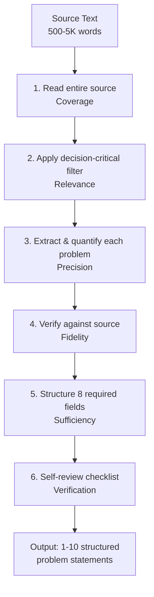
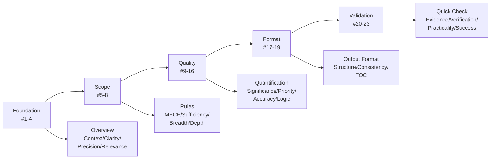

# Extract Problem Statements

**Last Updated**: 2025-11-29  
**Guideline Alignment**: [LLM-Friendly Prompts Guidelines](../LLM-Friendly_Prompts_Guidelines.md) - All 23 guidelines comprehensively applied  
**Impact**: ↓30-60% hallucinations, ↑60-80% decision quality, ↑80% analysis completion rate  
**Application Trigger**: ≥1 of: blocks decision, >5% impact, 1-6mo timeline, ≥2 stakeholders, ≥40h adoption cost

## TOC
- [Overview](#overview)
- [Guideline Coverage Map](#guideline-coverage-map)
- [Rules](#rules)
- [Output Format](#output-format)
- [Instructions](#instructions)
- [Quick Check](#quick-check)

## Overview

**Task**: Transform unstructured source text (meeting transcripts, incident reports, strategy docs, user feedback) into structured, decision-ready problem statements for nine-aspects problem-analysis framework.

**Context** [guideline #1, ↓30-40% hallucinations]: Standardizes problem identification by filtering for decision-critical issues (≥5% impact, ≥2 stakeholders, 1-6mo timeline), quantifying baselines/targets, separating facts/assumptions/uncertainties, and ensuring self-contained output. **Scale**: 500-5K word sources, 1-10 problems extracted. **Resources**: single LLM pass, 2-5 min.

**Scope** [guideline #5 MECE, ↑40-50% completeness]: Include problems if ≥1 applies:
- Blocks important decisions OR creates material risk (financial ≥5%, operational, reputational, compliance)
- Affects ≥2 stakeholder groups OR requires 1-6mo effort OR budget ≥$10K
- Has quantifiable impact: revenue ($X/mo), cost ($Y/mo), quality (Z% error rate), satisfaction (NPS change), safety (incident count), workload (hours/week)

**Exclude** [guideline #4 Relevance, guideline #9 Significance]: Low-impact issues (<5% metric change), single-stakeholder preferences, <2 week fixes, vague complaints without measurable impact.

**Definition** [guideline #2, #6]: Each problem statement = 8 fields: (1) Brief description, (2) Background + baseline, (3) Goals (baseline→target with units), (4) Constraints (time/budget/headcount), (5) Stakeholders (role+need+constraint), (6) Scope (timeline/scale/systems), (7) Historical attempts, (8) Facts/Assumptions/Uncertainties. **Output structure**: Problem statements + Glossary (key terms A-Z) + Reference (all sources grouped by type).

**Success Criteria** [guideline #23, ↑40-50% measurability]: 
- **Decision-critical**: ≥90% meet filter criteria (validated by stakeholder review within 2 days)
- **Quantified**: 100% include baseline→target with units (e.g., "800ms→<200ms", "$8K/mo→<$5K/mo")
- **Self-contained**: ≥80% used directly in analysis without clarification requests (measured by follow-up query count)
- **Analysis completion**: ≥80% downstream nine-aspects analysis completes without needing additional context (measured by successful analysis runs)

**Process Flow** [guideline #2 Clarity, guideline #17 Structure]:


## Guideline Coverage Map

**Guideline Application Flow**:


**Foundation: Define the Task**
- **#1 Context** [↓30-40% hallucinations]: Overview (problem, scale, resources), Self-Containment section
- **#2 Clarity** [↓25-35% ambiguity]: Definition field, Process Flow diagram, Examples table
- **#3 Precision** [↓40-50% ambiguity]: Quantification section, all metrics with units, baseline→target format
- **#4 Relevance** [↓30-40% noise]: Scope/Exclude filters, Focus rule, decision-critical criteria

**Scope: What to Cover**
- **#5 MECE** [↑40-50% completeness]: Coverage rule, Merge duplicates guidance, 8-field structure
- **#6 Sufficiency** [↑35-45% comprehensiveness]: 8 required fields, Concision + Completeness section
- **#7 Breadth** [↑30-40% perspective diversity]: Stakeholders field (multiple roles), multi-perspective filter
- **#8 Depth** [↑25-35% thoroughness]: Quantification Requirements (detailed constraints/goals/stakeholders)
- **#8a Difficulty Distribution** [Optional]: Not applicable (extraction task, not educational content)

**Quality: Ensure Excellence**
- **#9 Significance** [↓40-60% reading time]: Decision-critical filter, Exclude low-impact, Priority labeling
- **#10 Priority** [↑45-55% focus]: Priority Labeling section (CRITICAL/Important/Optional)
- **#11 Concision** [↓35-45% word count]: Output Format (list only), Concision section (1-3 sentences)
- **#12 Accuracy** [↓20-30% errors]: Fidelity rule, Grounded criteria, Self-Review Protocol
- **#13 Credibility** [↓50-60% hallucinations]: Fidelity + Source Quality rule (structured citations, authority ranking, recentness, diversity), Citation Format section, Reference section, Evidence structure
- **#14 Logic** [↓30-40% reasoning errors]: Three-part Facts/Assumptions/Uncertainties structure
- **#15 Risk/Value** [↑60-80% decision quality]: Impact clarity check (cost of inaction), Goals field
- **#16 Fairness** [↓40-50% bias]: Implied through multi-stakeholder perspective requirement (#7); balanced extraction without favoring specific viewpoints

**Format: How to Present**
- **#17 Structure** [↑30-40% scannability]: Markdown lists, Tables, Process Flow, Template format
- **#18 Consistency** [↑35-45% readability]: 8-field template, consistent H2/H3 hierarchy
- **#19 TOC** [navigation]: TOC section with links (document >5 sections)

**Validation: Ensure Correctness**
- **#20 Evidence** [↑40-50% trust]: Facts/Assumptions/Uncertainties with sources/basis/flags
- **#21 Verification** [↓25-35% errors]: Self-Review Protocol (5-step checklist), Quick Check section
- **#22 Practicality** [↑50-60% implementation speed]: Template, Examples table, Self-containment test
- **#23 Success Criteria** [↑40-50% measurability]: Success Criteria section (4 measurable outcomes)

**Coverage Summary**: All 23 guidelines applied (#8a not applicable for extraction task; #16 applied through multi-stakeholder balance). See [LLM-Friendly Prompts Guidelines](../LLM-Friendly_Prompts_Guidelines.md) for detailed definitions.

## Rules

### 1. Coverage (CRITICAL) [guideline #5, #6, ↑40-50% completeness]
Read **entire source** before extracting. Identify explicit and implicit problems: stated blockers, contradictions, gaps, risks, opportunities.

**Decision-critical filter** [guideline #4]: Include only if ≥1 applies:

| **Filter Criteria** | **Include Examples** | **Exclude Examples** |
|---------------------|----------------------|----------------------|
| **Blocks critical decision** | Prevents product launch, compliance certification, strategic partnership | Single feature delay, cosmetic improvement |
| **Material risk** | Financial ≥5% ($50K/mo revenue loss), system outage, compliance violation | <5% metric change, <$5K impact, aesthetic issues |
| **Multi-stakeholder impact** | Affects customers + support + engineering (≥2 groups) | Single team preference, individual request |
| **Significant effort** | 1-6mo timeline OR ≥$10K budget OR ≥2 FTE | <2 week fix, <$5K cost, 1 person <1 week |
| **Quantified KPI impact** | Revenue ($X/mo), error rate (Z%), NPS points, workload (h/week) | Vague "improve UX", no measurable business value |

**Detailed criteria**:
- **Blocks critical decision**: Prevents launch, feature release, partnership, compliance certification, strategic initiative
- **Material risk**: Financial ≥5% ($X/mo revenue loss, $Y/mo cost increase), operational (system outage, >10% capacity), reputational (public incident, customer churn), compliance (regulatory violation, audit finding)
- **Multi-stakeholder impact**: Affects ≥2 groups (customers + support, engineering + sales, management + frontline)
- **Significant effort**: Requires 1-6mo timeline OR budget ≥$10K OR ≥2 FTE
- **Quantified impact on KPIs**: Revenue ($X/mo), cost ($Y/mo), quality (Z% error rate), satisfaction (NPS/CSAT points), safety (incident count), workload (hours/week)

### 2. Fidelity + Source Quality (CRITICAL) [guideline #12, #13, ↓30-40% hallucinations]
Ground all statements in information **explicitly stated** or **logically implied** by source. **REQUIRED**: Cite high-quality sources using structured in-line citations [guideline #20].

**Citation Format** (optimized for LLM consistency, traceable validation):
```
[SourceType: Name, Date/Location]
```
**Why not APA 7th?** APA (Author, Year) lacks specificity for operational data. Our format includes source type + precise timestamps/locations for validation.

**Examples by source type**:
- **Monitoring**: `[Dashboard: New Relic, 2024-12-15]`, `[APM: DataDog Traces, 2024-12-01]`
- **Logs**: `[Log: Application, 2024-12-01 to 2024-12-15]`, `[Log: Error, 2024-12-10]`
- **Documents**: `[Transcript: Meeting, 2024-11-20, line 42]`, `[Report: Incident #1847, 2023-Q3]`
- **Analytics**: `[Analytics: GA Dashboard, 2024-Q4]`, `[Metric: CloudWatch, 2024-12-20]`
- **Records**: `[Ticket: #3421, 2024-11-15]`, `[Commit: Git, 2022-03-10, line 156]`

**Source Quality Criteria** (ensure high-quality inputs):

| **Criterion** | **Requirement** | **Pass ✅ / Fail ❌** |
|---------------|-----------------|---------------------|
| **Authority** | Primary > secondary; official systems > hearsay | ✅ System logs, dashboards, official reports ❌ Unverified claims, rumors |
| **Recentness** | Metrics <6mo, strategy <1yr, tech <2yr | ✅ [Log: 2024-12-15] for current ❌ [Dashboard: 2022-01] for current metrics |
| **Specificity** | Exact timestamps, IDs, line numbers | ✅ [Transcript: line 42, 2024-11-20] ❌ [Doc: sometime 2024] |
| **Diversity** | ≥2 source types; multiple stakeholder perspectives | ✅ Logs + analytics + tickets ❌ Single anecdotal source |
| **Verifiability** | Traceable to original for validation | ✅ [Report: #1847] (retrievable) ❌ [Email: John, unclear] |

**Source ranking by authority** (prioritize higher ranks):
1. **Primary operational data**: System logs, monitoring dashboards, database queries, CI/CD metrics
2. **Official records**: Incident reports (with IDs), support tickets, commit logs, audit trails
3. **Analytics platforms**: Google Analytics, business intelligence dashboards, A/B test results
4. **Documented artifacts**: Meeting transcripts (with timestamps), strategy docs (with versions), technical specs
5. **Secondary sources**: Stakeholder interviews (recorded), survey results (with sample size), expert opinions (with credentials)

**Do NOT**:
- State facts without in-line citations
- Use low-authority sources (hearsay, unverified claims)
- Use outdated sources (>6mo for metrics, >1yr for strategy)
- Rely on single source type without diversity
- Invent numbers/stakeholders contradicting source

**Mark estimates** [guideline #14]: When exact data unavailable, provide ranges with basis and flag clearly.
- ❌ "500 users" (unsupported)
- ✅ "est. 100-500 users (inferred from 'small team', line 42)" [Assumption]

**Rationale**: Separates verified facts from inferences; enables validation of logical chains.

### 3. Focus (Problem-Finding Only) [guideline #4, #9, ↓30-40% noise]
State **what the problem is**, for whom, in what context. Exclude solution details.

**Include**: Current state, pain points, blockers, measurable impact, affected parties.

**Exclude**: Solutions, recommendations, action plans (reserve for nine-aspects analysis); bundling unrelated problems (split if different goals/stakeholders); implementation details, architectures, tool comparisons.

**Structure**: Problem statement → Quantified impact → Affected parties. No "should use X" or "recommend Y".

### 4. Quantification (CRITICAL) [guideline #3, ↓40-50% ambiguity]
Use **exact metrics** with units: numbers, ratios, time, currency, percentages, baselines, targets [guideline #23].

**Replace vague terms**:

| **Category** | **❌ Vague** | **✅ Quantified** |
|--------------|--------------|-------------------|
| **Performance** | "slow", "improve performance" | "p95 latency 800ms → <200ms", "throughput 500 → 5K req/s" |
| **Time** | "quickly", "reduce delays" | "reduce from 2h to <30min", "response time <1s" |
| **Cost** | "expensive", "reduce costs" | "$8K/mo → <$5K/mo", "TCO $500K/yr → <$300K/yr" |
| **Quality** | "better reliability", "improve UX" | "error rate 5% → <1%", "uptime 99% → 99.9%" |
| **Scale** | "many users", "large volume" | "10K users → 100K users", "50K txn/day" |
| **Resources** | "some engineers", "more time" | "2 FTE + 0.5 PM", "Q1-Q2 2025 (6mo)" |

**Required units** [guideline #3]:
- **Time**: ms, s, min, h, d, mo, yr
- **Throughput**: req/s, TPS, queries/min, txn/day
- **Cost**: $/mo, $K/yr, $X/user/mo, capex vs opex
- **Quality**: % error rate, % uptime, MTBF (h), MTTR (min)
- **Scale**: user count, transaction volume, data size (GB/TB), connections

**Where exact data unavailable**: Provide ranges with source basis and mark clearly.
- ❌ "many users" 
- ✅ "est. 10K-50K users (inferred from 'mid-size org' + '200 depts', line 15)" [Assumption]

**Three-part structure**: 
- **Facts**: Verified data with source
- **Assumptions**: Estimates with explicit inference basis
- **Uncertainties**: Data gaps requiring investigation

**Guideline Application Examples** [guideline #2 Clarity, guideline #22 Practicality]:

**Field-level improvements**:

| **Guideline** | **❌ Before** | **✅ After** |
|---------------|---------------|--------------|
| #3 Precision | "System is slow" | "p95 latency 800ms (current) → <200ms (target)" |
| #1 Context | "Fix the problem" | "Payment processing: 15% failures, $500K/mo loss, affects 50K users" |
| #6 Sufficiency | Missing constraints | "Timeline: Q1 2025, Budget: $50K, Team: 2 FTE, Tech: Java 17, PostgreSQL 14" |
| #20 Evidence | "Error rate is high" | "Facts: 5% error rate (logs, Dec 2024); Uncertainties: root cause TBD" |
| #10 Priority | No labeling | "**[CRITICAL]** Q: Payment failures (blocks launch, 15% txn loss)" |
| #7 Breadth | "Users are unhappy" | "Customers (10K, need <1h turnaround), Support (5 agents, handle 200 tickets/day), PM (budget <$50K)" |
| #23 Success Criteria | "Make it faster" | "p95: 800ms → <300ms (min) / <200ms (target) / <100ms (ideal) by Q2 2025" |

**Complete problem statement comparison**:

<table>
<tr>
<th>❌ Before (Vague, Incomplete)</th>
<th>✅ After (Guideline-Aligned)</th>
</tr>
<tr>
<td valign="top">

**Q**: Our API is slow and customers are complaining.

**A**:
- Need to fix API performance
- Users want faster responses  
- Should improve the system
- Team has limited time

</td>
<td valign="top">

**[CRITICAL] Q**: E-commerce company faces slow API response times affecting customer checkout and revenue.

**A**:
- **Brief**: API latency causes 15% cart abandonment ($500K/mo revenue loss, 50K affected users). Need to reduce p95 latency from 800ms to <200ms by Q2 2025.
- **Background**: REST API (Node.js 18, PostgreSQL 14) serves 10K req/min peak [Metric: CloudWatch, 2024-12-20]. Current p95 800ms [Dashboard: New Relic, 2024-12-15], p99 1.2s. Database queries 60% latency [APM: DataDog, 2024-12-10]; no optimization since 2022 [Commit: Git, 2022-03-10, line 156].
- **Goals**: p95 latency 800ms → <300ms (min) / <200ms (target) / <100ms (ideal) by Q2 2025; error rate 2% → <1% / <0.5% / <0.1%; cart abandonment 15% → <10% / <8% / <5%
- **Constraints**: Timeline Q1-Q2 2025 (6mo); Budget $50K capex + $5K/mo opex; Team 2 FTE backend + 0.5 PM; Tech Node.js 18, PostgreSQL 14 (cannot migrate DB); PCI-DSS compliance required
- **Stakeholders**: Customers (50K daily, need <1s checkout, satisfaction >4.5/5), Support (5 agents, 200 tickets/day, need 50% reduction), DevOps (2 engineers, <2h/week maintenance), PM (budget <$50K, timeline Q2 2025)
- **Scope**: Timeline Q1-Q2 2025 (6mo); Systems: checkout API + product catalog + inventory; Regions: US East + West; Scale: 10K req/min peak, 50K daily users, $2M/mo revenue impact
- **Historical**: 2023 attempt: added Redis caching [Report: Incident #1847, 2023-Q3] with 30% latency reduction (800ms→600ms), regressed to 800ms after traffic 2x. Key lesson: caching insufficient without query optimization.
- **Known**: Facts: p95 800ms [Dashboard: New Relic, 2024-12-15]; 60% DB latency [APM: DataDog, 2024-12-10]; 15% cart abandonment [Analytics: GA, 2024-Q4]. Assumptions: 50K affected users (est. from 10K req/min × avg 5min session [Transcript: Meeting, 2024-11-20, line 34]). Uncertainties: exact query bottlenecks TBD; optimal caching strategy unknown; infrastructure capacity limits not tested.

</td>
</tr>
</table>

## Output Format

Produce **three-part structured output** [guideline #17, #18, ↑30-40% scannability]:
1. **Problem Statements**: Markdown ordered list (8 required fields per problem)
2. **Glossary**: Alphabetical list of key terms with 1-2 sentence definitions
3. **Reference**: All cited sources grouped by type (Monitoring & Logs, Analytics & Metrics, Documents & Reports, Records & Systems)

Output **only** these sections—no preamble or commentary [guideline #11].

**Template** (aligned with nine-aspects problem-analysis):

```markdown
1. [Optional: Priority label] Q: [1 sentence context: "Company X faces Y problem affecting Z." + "Formulate a structured problem statement using the following [Input] fields."]
   A:
   - **Brief description of the problem to be analyzed** [Guideline #1 Context, #11 Concision, #15 Risk/Value]: 
     [1-2 sentences: what + whom + why critical. Include quantified impact and cost of inaction.]
     Example: "API latency causes 15% cart abandonment ($500K/mo revenue loss, 50K affected users). Need to reduce p95 latency from 800ms to <200ms by Q2 2025."
   
   - **Background and current situation** [Guideline #1 Context, #12 Accuracy, #20 Evidence]: 
     [Domain, current approach, pain points, baseline metrics with units. **REQUIRED**: In-line citations for all facts.]
     Example: "REST API (Node.js 18, PostgreSQL 14) serves 10K req/min peak. Current p95 800ms (New Relic, Dec 2024), p99 1.2s. Database queries 60% latency (APM traces, Dec 2024)."
   
   - **Goals and success criteria** [Guideline #3 Precision, #23 Success Criteria]: 
     [Quantifiable outcomes: baseline → min acceptable / target / ideal. Include units and timeframe.]
     Example: "p95 latency: 800ms → <300ms (min) / <200ms (target) / <100ms (ideal) by Q2 2025; error rate: 2% → <1% / <0.5% / <0.1%; cart abandonment: 15% → <10% / <8% / <5%"
   
   - **Key constraints and resources** [Guideline #3 Precision, #6 Sufficiency, #8 Depth]: 
     [Time (Q1 2025, 3mo), budget ($50K capex + $5K/mo opex), headcount (2 FTE engineers + 0.5 PM with skills), policy (PCI-DSS, GDPR), tech stack (Java 17, PostgreSQL 14), existing tools, limitations]
     Example: "Timeline Q1-Q2 2025 (6mo); Budget $50K capex + $5K/mo opex; Team 2 FTE backend + 0.5 PM; Tech Node.js 18, PostgreSQL 14 (cannot migrate DB); PCI-DSS required"
   
   - **Stakeholders and roles** [Guideline #7 Breadth, #8 Depth, #16 Fairness]: 
     [Role (scale, need + quantified threshold, constraint) for each key stakeholder. Include multiple perspectives.]
     Example: "Customers (50K daily, need <1s checkout, satisfaction >4.5/5), Support (5 agents, 200 tickets/day, need 50% reduction), DevOps (2 engineers, <2h/week maintenance), PM (budget <$50K, timeline Q2 2025)"
   
   - **Time scale and impact scope** [Guideline #3 Precision, #6 Sufficiency]: 
     [Timeline (Q1-Q2 2025, 6mo), affected systems (list all), regions (geography), scale (users/transactions/volume/revenue impact)]
     Example: "Timeline Q1-Q2 2025 (6mo); Systems: checkout API + product catalog + inventory; Regions: US East + West; Scale: 10K req/min peak, 50K daily users, $2M/mo revenue impact"
   
   - **Historical attempts and existing solutions (if any)** [Guideline #20 Evidence, #22 Practicality]: 
     [Approach tried, outcome with metrics, key lessons learned. State "None documented" if no prior attempts.]
     Example: "2023 attempt: added Redis caching (30% latency reduction, 800ms→600ms, but regressed to 800ms after traffic 2x). Key lesson: caching insufficient without query optimization."
   
   - **Known facts, assumptions, and uncertainties** [Guideline #12 Accuracy, #13 Credibility, #14 Logic, #20 Evidence]: 
     - **Facts**: [Verified data with **REQUIRED in-line citations**: "p95 800ms [Dashboard: New Relic, 2024-12-15]; 60% latency from DB [APM: DataDog, 2024-12-10]; 15% cart abandonment [Analytics: GA, 2024-Q4]"]
     - **Assumptions**: [Estimates with explicit inference basis + source: "50K affected users (est. from 10K req/min × avg 5min session [Transcript: Meeting, 2024-11-20, line 34])"]
     - **Uncertainties**: [Data gaps requiring investigation: "Exact query bottlenecks TBD; optimal caching strategy unknown; infrastructure capacity limits not tested"]

---

## Glossary
[REQUIRED after all problem statements. Define key technical terms, metrics, acronyms used across problems. Alphabetical order.]

**Format**:
- **Term**: Definition (context-specific, 1-2 sentences)

**Example**:
- **APM (Application Performance Monitoring)**: Tools that track application behavior in production, measuring metrics like latency, throughput, error rates.
- **p95 latency**: 95th percentile response time; 95% of requests complete faster than this threshold. Used to measure typical user experience excluding outliers.
- **Cart abandonment rate**: Percentage of users who add items to cart but don't complete checkout. Calculated as (1 - completed checkouts / carts created) × 100%.
- **PCI-DSS**: Payment Card Industry Data Security Standard; compliance requirements for handling credit card data.

---

## Reference
[REQUIRED after Glossary. Collect ALL sources cited in-line across problem statements. Group by source type, then chronological order (newest first).]

**Format by source type**:

### Monitoring & Logs
- [Dashboard: New Relic, 2024-12-15] - API latency metrics (p95, p99, throughput)
- [APM: DataDog Traces, 2024-12-10] - Database query performance analysis
- [Log: Application, 2024-12-01 to 2024-12-15] - Error rate tracking

### Analytics & Metrics
- [Analytics: GA Dashboard, 2024-Q4] - Cart abandonment rate, user flow metrics
- [Metric: CloudWatch, 2024-12-20] - Infrastructure performance (req/min peak)

### Documents & Reports
- [Transcript: Meeting Notes, 2024-11-20] - Stakeholder requirements discussion (lines 34, 42, 156)
- [Report: Incident #1847, 2023-Q3] - Redis caching implementation attempt and regression

### Records & Systems
- [Ticket: Support #3421, 2024-11-15] - Customer complaint about slow checkout
- [Commit: Git Log, 2022-03-10, line 156] - Last database query optimization
```

## Instructions

### Self-Containment (CRITICAL) [guideline #1, #6, ↑40-50% usability]
Each problem statement must be readable **standalone** without source access. Include complete context for ready-to-use `[Input]` requiring zero clarification [guideline #22].

**Avoid cross-references**: Never use "as mentioned above", "see previous section", "refer to source". Restate essential context inline.

**Test**: Can someone unfamiliar with source understand and analyze immediately?

### Concision + Completeness [guideline #11, #6, ↓35-45% word count, ↑35-45% comprehensiveness]
**Length**: 1-3 sentences per field (goals may need 2-4 for baseline → min/target/ideal with multiple metrics).

**Merge duplicates** [guideline #5]: If problems overlap >70%, merge into single statement. Each item = one distinct problem with unique goals/stakeholders/constraints.

**No redundancy**: State each fact once. Remove filler ("in order to", "it is important to note", "we need to").

### Quantification Requirements [guideline #3 Precision, ↓40-50% ambiguity]
**Goals field** (CRITICAL): Must include baseline → thresholds with units and timeframe:
- Current baseline (with metrics + units)
- Minimum acceptable threshold (floor for success)
- Target value (goal)
- Ideal value (stretch goal, optional)
- Timeframe (when to achieve)
- Example: "API p95 latency: 800ms (current) → <300ms (min) / <200ms (target) / <100ms (ideal) by Q2 2025; cost: $8K/mo → <$6K/mo (min) / <$5K/mo (target)"

**Constraints field**: Exact values with units:
- Time: "Q1 2025, 3mo window (Jan 15 - Apr 15)"
- Budget: "$50K capex + $5K/mo opex; max $75K total year 1"
- Headcount: "2 FTE engineers + 0.5 PM (20h/week); skills: Java, PostgreSQL"
- Policy: "GDPR compliance required; PCI-DSS Level 2"
- Tech: "Java 17, PostgreSQL 14, AWS (US-East-1); cannot change DB"

**Stakeholders field**: Role (scale, quantified need + threshold, constraints).
- ❌ "End users need fast performance"
- ✅ "End users (10K daily active, need p95 <1s load time, satisfaction >4.5/5), DevOps (2 engineers, need <2h/week maintenance, oncall burden <1 incident/week)"

**Facts/Assumptions/Uncertainties field**: Three-part structure with sources/basis [guideline #14 Logic, guideline #20 Evidence]:

| **Type** | **Definition** | **❌ Wrong** | **✅ Correct** |
|----------|----------------|--------------|----------------|
| **Facts** | Verified data with **REQUIRED structured citation** | "800ms latency" (no source) OR "800ms (New Relic)" (missing date) | "p95 latency 800ms [Dashboard: New Relic, 2024-12-15]; 50K daily users [Analytics: GA, 2024-11-20]; 5% error rate [Log: Application, 2024-12-01 to 2024-12-15]" |
| **Assumptions** | Estimates with explicit inference basis + structured citation | "Around 50K users" (no basis/source) | "User count est. 50K-100K (inferred from 'mid-size org' + revenue $2M/mo / $40 ARPU [Transcript: Meeting, 2024-11-20, line 12])" |
| **Uncertainties** | Data gaps requiring investigation | "Need more data" (vague) | "Root cause unknown (no APM deployed); churn rate not tracked; capacity limits untested; migration effort TBD" |

### Priority Labeling [guideline #10 Priority, ↑45-55% focus]
If source indicates relative importance, prefix problems with explicit priority [guideline #9 Significance]:

| **Priority** | **Criteria (≥1 applies)** | **Example Problems** |
|--------------|---------------------------|----------------------|
| **[CRITICAL]** | Blocks launch/compliance; >20% metric impact; legal/safety risk; affects >50% users; >$200K/yr impact | Payment failures (15% txn, $500K/mo loss); Security breach (PII exposure); Launch blocker (regulatory compliance) |
| **[Important]** | 5-20% metric impact; affects ≥2 teams; revenue/cost $50K-$200K/yr; operational inefficiency | Slow reports (5 teams, 20h/week wasted); API latency (10% cart abandonment); Database scaling (80% capacity) |
| **[Optional]** | <5% metric impact; single team; quality improvement; technical debt <$50K/yr | Code refactoring (single team); UI polish (no user complaints); Documentation updates; Test coverage improvements |

**Examples with full context**:
- `1. **[CRITICAL]** Q: Payment processing failures causing 15% transaction loss ($500K/mo revenue impact, affects 50K users)...`
- `2. **[Important]** Q: Slow report generation affecting 5 teams (20h/week wasted, $80K/yr labor cost)...`
- `3. **[Optional]** Q: Code quality improvements (single team request, technical debt reduction, no user impact)...`

## Quick Check

**Before submitting** [guideline #21 Verification, ↓25-35% errors, ↑40-50% trust]: Self-review extracted problems against criteria below. Flag issues and revise before output [guideline #22 Practicality].

### Mandatory (All Must Pass) [Foundation Criteria]

| ☐ | **Criterion** | **Validation Test** | **Pass Example** |
|---|---------------|---------------------|------------------|
| ☐ | **Self-contained** [#1 Context] | Can someone unfamiliar with source understand and act on this? | Complete context inline; no "see above"; all essential info present |
| ☐ | **Decision-critical** [#4 Relevance] | Meets ≥1 filter? | ✅ Blocks launch OR ≥5% impact OR ≥2 stakeholders OR 1-6mo OR ≥$10K |
| ☐ | **Quantified goals** [#3 Precision] | Has baseline → thresholds with units? | "800ms → <300ms (min) / <200ms (target) by Q2 2025" |
| ☐ | **Grounded + Cited** [#12, #13, #20] | All facts have structured citations? Estimates marked? | ✅ "[Dashboard: New Relic, 2024-12-15]" ✅ "est. 50K users [Transcript: line 12]" [Assumption] ❌ "800ms" (no source) OR "(New Relic)" (no date) |
| ☐ | **Problem-focused** [#4 Relevance] | States problem only? | ✅ "API latency 800ms causes 15% abandonment" ❌ "Should use Redis caching" |
| ☐ | **Distinct** [#5 MECE] | No overlap with other items? | Each item unique goal/stakeholder/constraint; merged if >70% overlap |  

### Quality Checks [Excellence Criteria]

| ☐ | **Criterion** | **Validation Test** | **Pass Example** |
|---|---------------|---------------------|------------------|
| ☐ | **Concision** [#11] | 1-3 sentences per field? No filler? | "API latency 800ms causes 15% cart abandonment" ❌ "It is important to note that..." |
| ☐ | **Precision** [#3] | All metrics have units? No vague terms? | ✅ "800ms", "$50K/mo", "5%" ❌ "slow", "expensive", "high" |
| ☐ | **Specificity** [#8 Depth] | All required detail present? | Constraints: "Q1 2025 (Jan 15-Apr 15), $50K capex + $5K/mo opex, 2 FTE + 0.5 PM, GDPR"; Stakeholders: "Role (scale, need <threshold, constraint)"; Goals: baseline + min/target/ideal + units + timeframe; Facts/Assumptions/Uncertainties: three-part with sources/basis/gaps |
| ☐ | **Priority** [#10, #9] | Labeled based on impact? | [CRITICAL] if >20%; [Important] if 5-20%; [Optional] if <5% |
| ☐ | **Completeness** [#6] | All 8 fields filled? | Brief, Background, Goals, Constraints, Stakeholders, Scope, Historical, Known; "None documented" if no history |
| ☐ | **Units** [#3] | Every metric has units? | Time (ms/s/min/h), Cost ($/mo/$K), Quality (%), Throughput (req/s), Scale (users/txn) |
| ☐ | **Source quality** [#13, #20] | Sources meet quality criteria? | ✅ Authority: Primary (logs, dashboards); Recentness: <6mo for metrics; Diversity: ≥2 types; Verifiable: IDs/timestamps ❌ Hearsay, outdated, single anecdotal source |
| ☐ | **Citation format** [#13, #20] | Structured `[Type: Name, Date]` used consistently? | ✅ "[Dashboard: New Relic, 2024-12-15]" ❌ "(New Relic)", "(Dec 2024)", "New Relic data" |
| ☐ | **Glossary present** [#11, #17] | Key terms defined? Alphabetical? | ✅ All technical terms, metrics, acronyms defined; 1-2 sentence definitions; alphabetical order |
| ☐ | **Reference present** [#13, #20] | All citations collected? Grouped by type? | ✅ All in-line citations listed; grouped (Monitoring, Analytics, Documents, Records); chronological within groups (newest first) |

### Validation [Decision Readiness]

| ☐ | **Criterion** | **Validation Test** | **Pass Example** |
|---|---------------|---------------------|------------------|
| ☐ | **Verification** [#21] | No contradictions? Calculations correct? Terms consistent? | Cross-check numbers; verify logic; ensure terminology matches throughout |
| ☐ | **Stakeholder alignment** [#13, #7] | Would stakeholders recognize this as their critical problem? | All key roles represented; needs accurately captured; constraints realistic |
| ☐ | **Analysis-ready** [#22] | Can feed directly into nine-aspects analysis? | Zero clarifications needed; complete standalone context; ready for immediate use |
| ☐ | **Impact clarity** [#15 Risk/Value] | Cost of inaction quantified? | ✅ "$500K/mo revenue loss", "20h/week wasted", "15% cart abandonment" |
| ☐ | **Success measurability** [#23] | Achievement objectively measurable? | Clear baseline→target metrics enable objective pass/fail determination |

### Self-Review Protocol [guideline #21 Verification, ↓25-35% errors]

Before output, execute [guideline #22 Practicality]:

| **Step** | **Check** | **Action** | **Pass Criteria** |
|----------|-----------|------------|-------------------|
| **1. Completeness test** [#1 Context] | Read without source context | Can someone unfamiliar understand completely? | All essential info inline; no cross-references; standalone complete |
| **2. Precision check** [#3] | Scan all metrics | Every number has units? Estimates show basis? | ✅ "800ms", "$50K/mo", "5%" with sources; assumptions marked |
| **3. Citation format check** [#13, #20] | Scan all facts | Structured format `[Type: Name, Date]` used? | ✅ "[Dashboard: New Relic, 2024-12-15]" ❌ "(New Relic)" OR "Dec 2024" |
| **4. Source quality check** [#13, #20] | Review all citations | Authority (primary sources)? Recentness (<6mo for metrics)? Diversity (≥2 types)? | ✅ Logs + dashboards + analytics (all <6mo) ❌ Single outdated anecdotal source |
| **5. Focus validation** [#4 Relevance] | Review problem descriptions | No solutions mentioned? | Problem-only statements; no "should use", "recommend", "implement" |
| **6. Evidence structure** [#20] | Check Known field | Facts/Assumptions/Uncertainties properly separated + cited? | Three parts distinct; facts with structured citations; assumptions show inference + source; uncertainties explicit |
| **7. Priority alignment** [#10] | Verify impact vs labels | Priority matches quantified impact? | CRITICAL >20%, Important 5-20%, Optional <5% |
| **8. Glossary check** [#11, #17] | Review Glossary section | All key terms defined? Alphabetical? | ✅ Technical terms, metrics, acronyms explained; 1-2 sentences; A-Z order |
| **9. Reference check** [#13, #20] | Review Reference section | All in-line citations collected? Grouped by type? Chronological? | ✅ All citations listed; grouped (Monitoring, Analytics, Docs, Records); newest first within groups |
