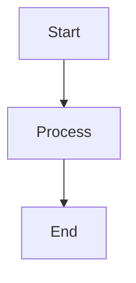

# Interview Q&A - Regulatory Compliance & Legal Frameworks for Software Systems

Generates interview question banks covering regulatory compliance across stakeholders (Legal, Compliance, Security, Architecture, Product, Executive, Audit). Maps regulatory obligations to implementation: legal requirements → compliance policy → technical controls → system design → user experience.

---

# Part I: Specifications

Define quality requirements, standards, and constraints.

## Specifications

### Scope and Structure

- **Scope**: 25–30 Q&A pairs for cross-functional stakeholders (Legal, Compliance, Security, Architecture, Product, Executive, Audit)
- **Audience**: Senior/expert level across functions: compliance officers, architects, security engineers, legal counsel, product managers, auditors, executives
- **Answer Length**: 150–300 words covering regulatory obligations, technical controls, compliance trade-offs, risk mitigation, cross-functional coordination
- **Difficulty Distribution**: Maintain 20/40/40 balance (Foundational/Intermediate/Advanced)
- **Visual Requirements**: ≥1 primary diagram + ≥1 supporting table + ≥1 quantitative element per topic cluster
- **Regulatory Analysis Depth**: All evaluation dimensions (Legal, Compliance, Security, Architecture, Product, Executive, Audit) with cross-stakeholder coordination

### Content Principles

- **MECE Coverage**: Four dimensions (Compliance Modeling, Audit & Documentation, Privacy & Security, Risk Analysis) × Seven stakeholder perspectives (see Evaluation Dimensions below)
- **Analysis Required**: Regulatory mapping through implementation chain (legal obligations → compliance policy → technical controls → system design → user experience), risk assessment (legal/compliance/security/financial), constraint analysis, remediation planning, cross-functional coordination
- **Regulatory Comprehensiveness**: Legal frameworks, standards, controls, data subject rights, breach notification, cross-border mechanisms, vendor risk, incident response, reporting timelines
- **Framework Handling**: Present framework trade-offs within categories (Privacy: GDPR vs CCPA vs LGPD; Standards: ISO 27001 vs 27701; Attestation: SOC2 Type I vs II; Controls: NIST CSF vs CIS); cite interpretations; address jurisdiction (EU/US/APAC) and sector (financial/healthcare/general); include region- and sector-specific nuances
- **Practitioner Clarity**: Distinguish mandatory vs recommended controls, universal vs jurisdiction-specific requirements; trace cross-functional implementation chain; highlight stakeholder tensions and resolution patterns

### Evaluation Dimensions

- **Legal**: Privacy laws, sector regulations, and standards; legal obligations, jurisdictional requirements, penalty structures, contractual commitments, regulatory interpretation
- **Compliance**: Audit requirements, certification standards (ISO 27001, SOC2, FedRAMP), control frameworks (NIST, CIS), evidence collection, continuous monitoring, policy management
- **Security**: Threat modeling, vulnerability management, incident response, security controls, penetration testing, security architecture, risk mitigation
- **Architecture**: Regulatory-technical mapping, compliance patterns, audit trails, data retention/deletion, geographic constraints, technical controls, scalability, technical debt
- **Product**: User consent flows, privacy UX, feature constraints, data minimization, user rights implementation, usability-compliance balance
- **Executive**: Risk exposure, budget allocation, strategic decisions, regulatory roadmap, vendor selection, insurance, board reporting
- **Audit**: Audit requirements, audit trails, evidence collection, audit committee oversight, audit report analysis

### Visual Element Standards

**Per Topic Cluster Requirements**: Primary diagram + supporting table + quantitative element

#### Diagram Selection by Analysis Type

| Analysis Type | Primary Diagram | Standard | Supporting Elements |
|---------------|-----------------|----------|---------------------|
| **Compliance Modeling** | Compliance matrix, Control mapping | NIST, ISO 27001 | Coverage: `Implemented Controls / Required Controls × 100%` |
| **Risk & Threat Analysis** | Threat model, Risk matrix, Attack tree | STRIDE, DREAD | Risk: `Likelihood × Impact × Asset Value` |
| **Privacy Architecture** | Data flow diagram, Privacy controls | GDPR, Privacy-by-Design | Consent: `Explicit Consent / Total Processing × 100%` |
| **Audit & Evidence** | Audit trail diagram, Evidence mapping | SOC2, ISO 19011 | Audit Coverage: `Auditable Events / Critical Events × 100%` |
| **Architecture Translation** | Regulation→Control mapping, Security architecture | C4, UML | Compliance Debt: `Remediation Cost / System Cost × 100%` |
| **Remediation & Evolution** | Remediation roadmap, Compliance timeline | Gantt | TCO: `Initial + Ongoing + Penalty Risk` |
| **Stakeholder Coordination** | RACI matrix, Decision flow, Communication plan | Custom | Coordination: `Aligned Stakeholders / Total Stakeholders × 100%` |

**Standards Reference**: BPMN (processes), DMN (decisions), UML (structure/behavior), ArchiMate (enterprise), SysML (requirements), ERD/DFD (data), C4 (software views)

#### Regulatory Frameworks (Apply Relevant Combination)

**Data Protection & Privacy Laws:**
- **GDPR (EU)**: Data protection principles, consent management, right to erasure, data residency
- **CCPA/CPRA (California)**: Consumer privacy rights, opt-out, data portability, breach notification
- **PIPL (China)**: Personal information protection, cross-border transfer, consent requirements
- **LGPD (Brazil)**: Data subject rights, breach notification, international data transfer

**Sector-Specific Regulations:**
- **HIPAA (Healthcare)**: PHI protection, encryption, access controls, business associate agreements
- **PCI-DSS (Payments)**: Cardholder data security, network segmentation, key management
- **SOX (Financial)**: Audit trails, separation of duties, change management

**Certification Standards & Frameworks:**
- **ISO 27001/27701**: ISMS implementation, privacy extension, risk management
- **SOC2 Type I/II**: Trust services criteria, security/availability/processing integrity/confidentiality/privacy
- **FedRAMP**: Cloud security, continuous monitoring, authorization boundaries
- **NIST CSF 2.0**: Govern, identify, protect, detect, respond, recover functions

**Emerging Regulations:**
- **ePrivacy Regulation (EU)**: Electronic communications, cookie consent, tracking restrictions
- **State privacy laws (US)**: Virginia VCDPA, Colorado CPA, Utah UCPA - consumer rights, data inventory, opt-out mechanisms

#### Visual Quality Standards

**Rendering**: Prefer Mermaid (GitHub-native). Syntax example:


**Math**: Inline `$formula$` or block `$$formula$$`. Define variables on first use.

**Common Math Symbols**: `∑` (sum), `∏` (product), `∫` (integral), `∂` (rate), `≈` (approx), `≤/≥` (bounds), `≠` (not equal), `∀` (for all)

**Legends**: Use consistent symbols for clarity: 💡 Analogy, 📐 Formula, 🔍 Example, ⚠️ Important Note

**Anti-patterns**: Avoid single mega-diagram, BPMN for code flow, mixed abstraction levels, >120 nodes, missing rationale

**Combination Patterns**: For comprehensive compliance analysis, combine multiple diagram types:
- **Full Compliance Documentation**: Regulatory Requirements → Control Mapping → Architecture Implementation → Audit Evidence
- **Privacy Compliance**: Data Inventory (ERD) → Processing Activities (BPMN) → Consent Flow (Sequence) → Privacy Controls (C4)
- **Security Compliance**: Threat Model (Attack Tree) → Risk Assessment (Matrix) → Control Implementation (Architecture) → Monitoring (Deployment)

**Quick Reference – Diagram Shortcut Guide**
| Need | Recommended Diagram(s) | Standard |
|------|-----------------------|----------|
| Compliance mapping | Control matrix + Gap analysis | NIST / ISO 27001 |
| Threat modeling | Attack tree + Data flow + STRIDE | STRIDE / DREAD |
| Privacy architecture | Data flow + Consent flow + Processing activities | GDPR / Privacy-by-Design |
| Audit trail design | Sequence + Event flow + Evidence mapping | SOC2 / ISO 19011 |
| Data protection | ERD + Encryption zones + Access control | ISO 27001 / C4 |
| Security architecture | Component + Deployment + Trust boundaries | C4 / UML |
| Compliance remediation | Roadmap + Timeline + Risk mitigation | Gantt / NIST |

### Additional Decision & Cost Tables

**Risk‑Based Decision Matrix** (choose tool/approach based on risk level):
| Risk Factor | Low‑Risk Approach | Medium‑Risk Approach | High‑Risk Approach |
|------------|-------------------|----------------------|-------------------|
| Budget Constraints | Open‑source (PlantUML, Archi) | Mixed (Free + Limited paid) | Full commercial suite |
| Timeline Pressure | Familiar tools only | Quick‑learning tools | Comprehensive training |
| Integration Needs | Stand‑alone tools | API‑connected tools | Fully integrated platform |
| Compliance Requirements | Basic standards compliance | Industry‑specific compliance | Regulatory‑grade compliance |

**Cost‑Benefit Analysis Framework** (estimate ROI of tooling):
| Investment Level | Tool Cost | Training Cost | ROI Timeline | Total Value |
|----------------|----------|--------------|--------------|------------|
| Starter | $0‑5K | $1‑2K | 3‑6 months | Quick wins, limited scale |
| Professional | $10‑50K | $5‑15K | 6‑12 months | Balanced investment, good ROI |
| Enterprise | $100K+ | $25K+ | 12‑24 months | Long‑term value, high impact |

### Citation Standards

- **Languages**: ~60% EN, ~30% ZH, ~10% other (tag: [EN], [ZH], etc.)
- **Source Types**: (1) Regulatory standards & legal frameworks; (2) Compliance certifications & audit standards; (3) Security controls & privacy patterns; (4) Compliance tools & platforms
- **Format**: APA 7th with language tags
- **Inline Citation**: Use [Ref: ID] after regulatory requirements, compliance frameworks, legal obligations, control standards, architectural patterns, penalty structures

### Reference Minimum Requirements

| Section | Floor | Content Examples (Must Cover Regulatory Comprehensiveness) |
|---------|-------|---------|
| Glossary | ≥18 | **Privacy Laws**: GDPR, CCPA/CPRA, PIPL, LGPD, ePrivacy Regulation<br>**Sector Regulations**: HIPAA, PCI-DSS, SOX<br>**Standards**: ISO 27001/27701, SOC2 Type I/II, FedRAMP, NIST CSF 2.0<br>**Concepts**: Privacy-by-Design, Zero Trust, Data Controller/Processor<br>**Rights**: Right to Erasure, Access, Portability, Rectification<br>**Data**: PHI, PII, Sensitive Data<br>**Controls**: Encryption at Rest/Transit, Audit Trail, Breach Notification<br>**Cross-border**: SCCs, BCRs, Adequacy Decision<br>**Vendor**: BAA, DPA, Sub-processor |
| Tools | ≥6 | Compliance management (OneTrust, TrustArc), GRC (ServiceNow, Archer), SIEM (Splunk), vulnerability scanning (Nessus, Qualys), policy management (Vanta, Drata), incident response |
| Literature | ≥8 | **Regulatory texts** (GDPR, HIPAA, PCI-DSS v4.0), **Standards** (NIST SP 800-53, ISO 27001), **Frameworks** (SOC2 TSC, NIST CSF), **Guidance** (CIS Controls, OWASP Top 10) |
| Citations | ≥12 | ~60% EN / ~30% ZH / ~10% other (APA 7th with tags) |

**Exception**: If floor unmet, state shortfall + rationale + sourcing plan.

### Usage Guidelines

1. Follow MECE structure; maintain 20/40/40 difficulty balance
2. Meet all reference floors; address all stakeholder dimensions (Legal/Compliance/Security/Architecture/Product/Executive/Audit)
3. Include ≥1 primary diagram + ≥1 supporting table + ≥1 quantitative element per topic cluster
4. Per topic: ≥2 authoritative regulatory sources + ≥1 compliance tool reference
5. Address cross-functional coordination: identify stakeholder roles, decision ownership, communication flows
6. Document compliance gaps with remediation plan including stakeholder responsibilities

### Quality Gates

- **Recency**: ≥50% citations from last 3 years (≥80% for privacy/data protection regulations with frequent updates)
- **Diversity**: ≥3 source types (regulatory text, standards, guidance); no single source >25%
- **Evidence**: ≥70% answers have ≥1 citation; ≥30% have ≥2 citations (regulatory requirements must cite official sources)
- **Tool Details**: Compliance scope, certification support, audit capabilities, last update ≤18 months, regulatory coverage
- **Links**: Validate accessibility; prefer official regulatory websites, standards bodies
- **Cross-refs**: All [Ref: ID] resolve to entries

> Scaling: For >30 Q&A, increase floors by ~1.5×. Prioritize gates before raising floors.

### Pre-Submission Validation

Execute ALL steps below. Present results in a validation report table. Fix any failures and re-run validation until all checks pass.

**Step 1 – Counts**: Glossary ≥18, Tools ≥6, Literature ≥8, APA ≥12, Q&As 25-30 (20/40/40)

**Step 2 – Citations**: ≥70% answers have ≥1; ≥30% have ≥2

**Step 3 – Language**: EN 50-70%, ZH 20-40%, Other 5-15%

**Step 4 – Recency**: ≥50% from last 3 years (≥80% for privacy/data protection regulations)

**Step 5 – Diversity**: ≥3 source types; no single >25%

**Step 6 – Links**: All accessible or archived

**Step 7 – Cross-refs**: All [Ref: ID] resolve (G#/T#/L#/A#)

**Step 8 – Word Count**: Sample 5 answers; all 150-300 words

**Step 9 – Key Insights**: All concrete (regulatory non-compliance/control gap/privacy violation/audit failure)

**Step 10 – Per-Topic**: Each has ≥2 authoritative regulatory sources + ≥1 compliance tool

**Step 11 – Regulatory-Technical Mapping**: ≥80% of answers explicitly connect regulatory requirements to architectural controls with citations

**Step 12 – Judgment**: ≥70% scenario-based ("How would...", "When should...") vs recall ("What is...")

**Step 13 – Visual Element Coverage**: ≥90% of answers include compliance diagram + control table + risk/coverage metric

**Step 14 – Regulatory Framework Application**: ≥80% answers apply relevant regulatory frameworks (GDPR, HIPAA, ISO 27001, etc.)

**Step 15 – Risk & Coverage Analysis**: ≥60% answers include quantitative risk calculations or compliance coverage metrics

**Step 16 – Stakeholder Coordination**: ≥50% answers explicitly address cross-functional coordination, decision ownership, or stakeholder trade-offs

**Validation Report Template:**
```
| Check | Result | Status |
|-------|--------|--------|
| Floors | G:X T:Y L:Z A:W Q:N (F/I/A) | PASS/FAIL |
| Citation coverage | X% ≥1, Y% ≥2 | PASS/FAIL |
| Language dist | EN:X% ZH:Y% Other:Z% | PASS/FAIL |
| Recency | X% last 3yr | PASS/FAIL |
| Source diversity | N types, max P% | PASS/FAIL |
| Links | Y/X accessible | PASS/FAIL |
| Cross-refs | Y/X resolved | PASS/FAIL |
| Word counts | 5/5 compliant | PASS/FAIL |
| Key Insights | Y/X concrete | PASS/FAIL |
| Per-topic mins | X/Y topics meet | PASS/FAIL |
| Reg-Tech mapping | X/Y explicit | PASS/FAIL |
| Judgment vs Recall | X% judgment-based | PASS/FAIL |
| Visual coverage | X% have compliance diagram+control table+metric | PASS/FAIL |
| Framework application | X% apply regulatory frameworks | PASS/FAIL |
| Risk & coverage analysis | X% include quantitative risk/coverage metrics | PASS/FAIL |
| Stakeholder coordination | X% address cross-functional coordination | PASS/FAIL |
```

> **MANDATORY:** If ANY check shows FAIL, stop, fix issues, regenerate, and re-run validation. Only proceed when ALL checks show PASS.

### Submission Checklist

- [ ] All 16 validation steps PASS (see report table above)
- [ ] ALL reference floors met + quality gates passed
- [ ] Cross-functional stakeholder perspectives addressed

---

# Part II: Instructions

Execute generation workflow with inline quality checks at each step.

## Instructions

Follow these steps in order. Execute inline quality checks at each step before proceeding.

### Step 1: Topic Identification & Planning
1. Identify 5-6 clusters aligned with framework: Compliance Modeling (Regulatory Frameworks, Obligations) | Risk & Threat Analysis | Privacy & Data Protection | Audit & Evidence | Architectural Translation | Remediation & Evolution
2. Allocate 4-6 Q&As per cluster (total 25-30); assign 20/40/40 difficulty (F/I/A)
3. **Check**: Total = 25-30, ratio ≈20/40/40

### Step 2: Reference Collection
1. **Glossary (≥18)**: Must cover comprehensive regulatory areas—Privacy Laws (GDPR, CCPA/CPRA, PIPL, LGPD, ePrivacy), Sector Regulations (HIPAA, PCI-DSS, SOX), Standards (ISO 27001/27701, SOC2 Type I/II, FedRAMP, NIST CSF 2.0), Concepts (Privacy-by-Design, Zero Trust, Data Controller/Processor), Rights (Erasure, Access, Portability, Rectification), Data Types (PHI, PII, Sensitive Data), Controls (Encryption, Audit Trail, Breach Notification), Cross-border (SCCs, BCRs, Adequacy), Vendor (BAA, DPA, Sub-processor)
2. **Tools (≥6)**: OneTrust/TrustArc (compliance), ServiceNow/Archer (GRC), Splunk (SIEM), Nessus/Qualys (vulnerability), Vanta/Drata (policy), incident response tools
3. **Literature (≥8)**: Regulatory texts (GDPR, HIPAA, PCI-DSS v4.0), Standards (NIST SP 800-53, ISO 27001), Frameworks (SOC2 TSC, NIST CSF), Guidance (CIS, OWASP) + ZH sources (GB/T standards, 网络安全法)
4. **Citations (≥12)**: Tag language, year, type (1-4); assign IDs (G#/T#/L#/A#)
5. **Check**: Counts meet floors, language ~60/30/10%, recency ≥50% last 3yr (≥80% for privacy/data protection), ≥3 source types, Regulatory Comprehensiveness coverage complete

**Reference Generation Checklist**
- Output all sections with IDs (G#/T#/L#/A#) and language tags ([EN]/[ZH]/etc.)
- Verify floors met (Glossary ≥18, Tools ≥6, Literature ≥8, APA ≥12)
- Validate all [Ref: ID] resolve and links are accessible or archived

### Step 3: Q&A Generation
1. Write scenario-based questions ("How would...", "When should..."); draft 150-300 word answers
2. Include ≥1 [Ref: ID] per answer; explicitly trace implementation chain (legal obligations → compliance policy → technical controls → system design → user experience)
3. State concrete Key Insight (non-compliance/control gap/privacy violation/audit failure/stakeholder conflict)
4. **Check**: Every 5 Q&As verify word counts, citations, implementation chain tracing, cross-functional coordination, judgment focus

### Step 4: Visual Artifacts
1. Per topic cluster, create ≥3 elements: compliance diagram + control table + risk/coverage metric
2. Use Mermaid for diagrams; include captions and legends
3. Apply relevant regulatory frameworks (GDPR, HIPAA, ISO 27001) with architectural control mapping
4. **Check**: All clusters covered; visuals align with analysis type (see Diagram Selection table in Part I)

### Step 5: References
1. Populate Glossary/Tools/Literature/APA with required fields
2. **Check**: All [Ref: ID] resolve

### Step 6: Validation
Execute all 16 steps (Part I). Fix failures; re-validate until all PASS.

### Step 7: Final Review
Apply critique criteria. Check submission checklist. Submit when all PASS.

---

## Practical Prompts

Copy-paste ready prompts for deliverables. Replace bracketed terms.

- **Compliance Control Matrix**
```text
Generate control matrix mapping [Frameworks e.g., GDPR, HIPAA, PCI-DSS] to [System] controls.
Columns: Framework | Article/Req | Obligation | Control | Evidence | Owner | Frequency.
Include [Ref: G#/L#/A#] and coverage: `Implemented/Required × 100%`.
```

- **DPIA (GDPR Art. 35)**
```text
Produce DPIA for [Processing Activity]. Include: description; necessity/proportionality; risks;
mitigations; residual risk; decision; consultation need. Add risk matrix and [Ref: A1, A14].
```

- **ROPA (GDPR Art. 30)**
```text
Create ROPA table: Processing | Purpose | Legal Basis | Data Categories | Subjects | Recipients |
Transfers | Retention | Security Measures | System Owner. Cite [Ref: G18].
```

- **Cross-Border Transfer Assessment**
```text
Prepare SCC/TIA for [Data Flow to Country]. Assess destination law, safeguards, supplementary measures,
DPF/adequacy status, encryption, key control. Cite EDPB [Ref: A22] and SCCs.
```

- **Vendor DPA/BAA Checklist**
```text
Generate DPA/BAA checklist for vendor onboarding. Clauses: purpose/processing, confidentiality,
sub-processors, security controls, audits, breach notice, deletion/return, transfers, liability.
Map to frameworks (GDPR/HIPAA/SOC2) with [Ref].
```

- **Audit Evidence Log & Schema**
```text
Design audit evidence log for [Scope]. Fields: Control | Evidence | Source | Periodicity | Owner | Link.
Define log schema for audit trail (who/what/when/where) + retention per law. Cite SOC2/ISO 19011 [Ref].
```

- **Breach Notification Playbook**
```text
Create notification decision table by jurisdiction (GDPR, CPRA, PIPL, LGPD): thresholds, timelines,
contacts, required contents, regulators. Include workflow diagram and [Ref].
```

- **Regulatory→Architecture Mapping**
```text
Map legal obligations to technical controls and system components (C4). Output: table + C4 diagram.
Include testable metrics and [Ref] to specific articles/controls.
```

- **Consent & Data Subject Rights**
```text
Plan endpoints/UI for consent, access, erasure, portability, rectification. Include SLAs, verification,
proof-of-fulfillment, evidence storage. Cite GDPR/CCPA articles [Ref].
```

- **Data Minimization & Retention**
```text
Define data classes, retention periods, deletion workflows, backup/analytics exclusions, crypto-erasure.
Provide retention schedule table and control owners. Include [Ref].
```

- **Quantitative Compliance Metrics**
```text
Compute and report: Control Coverage, Audit Coverage, Consent Rate, Incident MTTR, Compliance Debt, TCO.
Provide formulas and example values. Include [Ref].
```

- **Stakeholder RACI**
```text
Create RACI covering Legal, Compliance, Security, Architecture, Product, Executive, Audit for [Program].
Include decision flows and escalation paths. Align with validation gates.
```

---

# Part III: Output Format

Template structure for question banks.

### Question Design & Critique

**Implementation Approach:**

Guide candidates through cross-functional compliance:
1. **Regulatory Mapping**: Identify obligations → map controls → assess impact → prioritize by risk
2. **Risk & Threat**: Document regulatory risks → evaluate security threats → consider jurisdiction → quantify exposure
3. **Audit & Evidence**: Align with audit requirements → establish evidence collection → continuous monitoring
4. **Stakeholder Coordination**: Define decision ownership → establish communication → resolve tensions
5. **Implementation Trace**: Show connection from requirements → policy → controls → features → UX

**Quality Criteria:**

- **Clarity**: Single unambiguous ask
  - ✅ "How would you translate GDPR's right to erasure into architectural requirements for multi-tenant SaaS?"
  - ❌ "Explain GDPR and microservices"
  
- **Signal**: Tests regulatory-technical translation, not trivia
  - ✅ "Your company must achieve SOC2 Type II in 6 months. How does this drive architectural changes?"
  - ❌ "List the five NIST CSF functions"
  
- **Depth**: Enables discussion of constraints, trade-offs, impacts
  - ✅ "Choose: encryption at application, database, or file system for HIPAA PHI. How do you decide?"
  - ❌ "Should you encrypt data? Yes/no"
  
- **Realism**: Scenarios matching senior/architect/expert roles bridging compliance and technology
  - ✅ "Legal requires PII deletion within 30 days. Your warehouse uses append-only logs. How do you navigate?"
  - ❌ "Design a secure payment system from scratch"
  
- **Discriminative**: Tests judgment over recall
  - ✅ "When does jurisdiction require data residency over cloud cost optimization?"
  - ❌ "What is data residency?"
  
- **Alignment**: Match seniority and role (Senior: tactical | Architect/Security: control design | Compliance/Legal: policy | Product: UX | Executive: strategic risk)

**Success Factors:**

Answers should demonstrate:
- **Cross-functional understanding**: Regulatory review (legal), policy (compliance), control design (security/architecture), UX constraints (product), risk decisions (executive)
- **Clear communication**: Stakeholder-appropriate documentation (legal memos, compliance policies, architecture diagrams, user guides, board reports)
- **Coordination**: Decision ownership (RACI), escalation paths, cross-functional trade-off resolution
- **Risk alignment**: Trace requirements → controls → impact; measure coverage; adjust based on audit findings and feedback

---

## Output Format

Start the output with a TOC (e.g., '## Contents') linking to all top-level headings and list items.

- Use lists tables diagrams formulas code blocks; diagrams in Mermaid; code with language-tagged fences.

Structure for generated question banks:

```markdown
## Contents

- [Topic Areas](#topic-areas-questions-1-n)
- [Topic 1: [Topic title]](#topic-1-topic-title)
  - [Q1: [Question text]](#q1-question-text)
  - [Q2: [Question text]](#q2-question-text)
- [Topic 2: [Topic title]](#topic-2-topic-title)
  - [Q3: [Question text]](#q3-question-text)
- [Reference Sections](#reference-sections)
  - [Glossary, Terminology & Acronyms](#glossary-terminology--acronyms)
  - [How to Find/Verify Regulations](#how-to-findverify-regulations)
  - [Compliance & Regulatory Tools](#compliance--regulatory-tools)
  - [Authoritative Regulatory Standards & Compliance Literature](#authoritative-regulatory-standards--compliance-literature)
  - [APA Style Source Citations](#apa-style-source-citations)

```

---

## Topic Areas: Questions 1-N

Overview of coverage and difficulty distribution.

| Topic | Question Range | Count | Difficulty Mix |
|-------|---------------|-------|----------------|
| Compliance Modeling (Regulatory Frameworks, Obligations) | Q1-Q5 | 5 | 1F, 2I, 2A |
| Risk & Threat Analysis | Q6-Q10 | 5 | 1F, 2I, 2A |
| Privacy & Data Protection | Q11-Q15 | 5 | 1F, 2I, 2A |
| Audit & Evidence | Q16-Q20 | 5 | 1F, 2I, 2A |
| Architectural Translation | Q21-Q25 | 5 | 1F, 2I, 2A |
| Remediation & Evolution | Q26-Q30 | 5 | 1F, 2I, 2A |
| **Total** | | **30** | **6F, 12I, 12A** |

**Legend**: F = Foundational, I = Intermediate, A = Advanced

---

## Topic 1: [Topic Title]

### Q1: [Question Text]

**Difficulty**: [Foundational/Intermediate/Advanced]  
**Type**: [Compliance Modeling/Risk & Threat/Privacy & Data Protection/Audit & Evidence/Architectural Translation/Remediation & Evolution]

**Key Insight**: [One sentence: specific non-compliance/gap/violation/failure this question exposes]

**Answer**:

[150-300 words with inline [Ref: ID] citations, connecting regulatory requirements to architectural controls]

**Supporting Artifacts** (Select 3+ matching analysis):

| Artifact Type | Examples | Key Formulas |
|---------------|----------|--------------|  
| **Compliance** | Control matrix, Gap analysis, Obligation mapping, Compliance roadmap | `Coverage = Implemented Controls / Required Controls × 100%` |
| **Risk & Threat** | Threat model, Attack tree, Risk matrix, STRIDE/DREAD analysis | `Risk = Likelihood × Impact × Asset Value`<br>`CVSS Score = Base × Temporal × Environmental` |
| **Privacy** | Data flow, Consent management, Processing activities, Privacy controls | `Consent Rate = Explicit Consent / Total Processing × 100%` |
| **Audit** | Audit trail, Evidence mapping, Log architecture, Monitoring dashboard | `Audit Coverage = Auditable Events / Critical Events × 100%` |
| **Remediation** | Remediation roadmap, Timeline, Compliance debt, TCO analysis | `Compliance Debt = Remediation Cost / System Cost × 100%`<br>`TCO = Initial + Ongoing + Penalty Risk` |

---

## Reference Sections

### Glossary, Terminology & Acronyms

**G1. GDPR (General Data Protection Regulation)**  
EU regulation (2016/679) for data protection and privacy rights. Key principles: lawfulness, fairness, transparency, purpose limitation, data minimization, accuracy, storage limitation, integrity, confidentiality, accountability. Architectural: consent management, right to erasure, data portability, privacy-by-design. Related: CCPA, Data Controller/Processor [EN]

**G2. HIPAA (Health Insurance Portability and Accountability Act)**  
US federal law (1996) protecting patient health information (PHI). Security Rule: administrative, physical, technical safeguards. Privacy Rule: PHI use/disclosure. Architectural: encryption at rest/transit, audit logging, access controls, business associate agreements, minimum necessary access. Related: PHI, ePHI, BAA [EN]

**G3. PCI-DSS (Payment Card Industry Data Security Standard)**  
Security standard for organizations handling credit card data. 12 requirements, 6 objectives: secure network, protect cardholder data, vulnerability management, access control, monitoring, security policy. Architectural: network segmentation, encryption, tokenization, key management, logging. Version 4.0 (2022). Related: Cardholder Data, SAD, Tokenization [EN]

**G4. ISO 27001/27002**  
International standards for ISMS. ISO 27001: requirements for establishing, implementing, maintaining ISMS. ISO 27002: 93 controls across 4 themes (organizational, people, physical, technological). Architectural: risk-based control selection, continuous improvement. Related: ISMS, Annex A, ISO 27017/27018 [EN]

**G5. SOC2 (Service Organization Control 2)**  
AICPA attestation framework for service providers. Trust Services Criteria: security (mandatory), availability, processing integrity, confidentiality, privacy (optional). Type I: point-in-time; Type II: 3-12 months operational effectiveness. Architectural: access controls, encryption, monitoring, incident response, change management. Related: AICPA, TSC, Type I/II [EN]

**G6. Privacy-by-Design**  
Framework embedding privacy into system design. 7 principles: proactive not reactive, privacy as default, privacy embedded, full functionality, end-to-end security, visibility and transparency, respect for user privacy. Used for GDPR compliance, minimizing privacy risks. Related: Privacy-by-Default, DPIA [EN]

**G7. Data Controller vs Data Processor**  
GDPR roles. Controller determines purposes and means of processing; Processor processes on controller's behalf. Controllers have broader responsibilities (lawfulness, transparency, rights); processors follow instructions, maintain security. Architectural: data processing agreements, liability allocation, control boundaries. Related: Sub-processor, Joint Controller [EN]

**G8. PHI/PII (Protected Health Information / Personally Identifiable Information)**  
PHI (HIPAA): individually identifiable health information (past/present/future health, care, payment); 18 identifiers. PII: information identifying specific individual (name, SSN, biometrics, email, IP when combined). Architectural: encryption, access controls, data minimization, anonymization/pseudonymization. Related: ePHI, De-identification, Safe Harbor [EN]

**G9. Audit Trail**  
Chronological record of system activities capturing who, what, when, where of security-relevant events. Tamper-evident, immutable logs. Retention requirements: HIPAA (6 years), SOX (7 years), GDPR (demonstrate compliance). Architectural: centralized logging, log integrity, retention policies, monitoring/alerting. Related: SIEM, Immutable Logs, Chain of Custody [EN]

**G10. Encryption at Rest vs Transit**  
At rest: protects stored data (disk, database, backups) using symmetric encryption (AES-256); key management critical. In transit: protects data in motion using TLS 1.2+; prevents eavesdropping, MITM. Requirements: HIPAA (addressable), PCI-DSS (required for cardholder data), GDPR (pseudonymization/encryption). Related: Key Management, HSM, TLS, Perfect Forward Secrecy [EN]

**G11. Zero Trust Architecture**  
Security model: "never trust, always verify"; assumes breach, verifies every request. Principles: verify explicitly, least privilege, assume breach. Components: identity verification, device health, micro-segmentation, continuous monitoring. Architectural: identity-centric security, API gateways, policy enforcement points. Related: NIST SP 800-207, Least Privilege, BeyondCorp [EN]

**G12. Right to Erasure (Right to be Forgotten)**  
GDPR Article 17: data subject's right to request deletion without undue delay. Applies when data no longer necessary, consent withdrawn, unlawful processing, legal obligation. Architectural: data inventory, deletion workflows, backup management, distributed system propagation, proof of deletion. Related: Retention Policies, Data Lifecycle Management [EN]

**G13. NIST Cybersecurity Framework (CSF)**  
Voluntary framework for cybersecurity risk management. 5 core functions: Identify, Protect, Detect, Respond, Recover; 23 categories, 108 subcategories. Used for risk assessment, control selection, maturity evaluation. Architectural: continuous monitoring, incident response, resilience design. Version 2.0 (2024) adds Govern function. Related: NIST SP 800-53, CIS Controls [EN]

**G14. SOX (Sarbanes-Oxley Act)**  
US federal law (2002) for financial reporting accuracy and internal controls. Section 302: management certification; Section 404: internal control assessment; Section 802: record retention (7 years). Architectural: audit trails, separation of duties, change management, financial data integrity, automated controls. Related: PCAOB, ITGC, COSO Framework [EN]

**G15. Data Residency and Sovereignty**  
Residency: physical location where data is stored. Sovereignty: data subject to laws of country where stored. Requirements: GDPR (EU transfers require adequacy/SCCs), China (critical data in China), Russia (personal data of Russian citizens). Architectural: multi-region deployment, data localization, cross-border transfer controls. Related: Schrems II, SCCs, Privacy Shield [EN]

---

**G16. Data Protection Impact Assessment (DPIA)**  
GDPR Article 35: assessment required for high-risk processing (e.g., large-scale special category data, systematic monitoring). Includes processing description, necessity/proportionality, risks to rights/freedoms, mitigation measures. Architectural: early privacy risk identification, control design, potential DPA consultation. Related: High Risk, Prior Consultation [EN]

**G17. Data Protection Officer (DPO)**  
GDPR Articles 37-39: monitors compliance, advises on DPIAs, liaises with supervisory authorities. Required for public authorities, large-scale monitoring, or large-scale special category processing. Must be independent, report to highest management. Architectural: governance, oversight, evidence requirements. Related: Accountability, Independence [EN]

**G18. Records of Processing Activities (ROPA)**  
GDPR Article 30: controllers and processors maintain records (purposes, categories, recipients, transfers, retention, security measures). Supports accountability and audits. Architectural: data inventory, system-of-record for processing, CMDB integration. Related: Article 30 Register, Accountability [EN]

---

### How to Find/Verify Regulations

- **Official Sources**: National regulators, government gazettes, legislative databases
- **Standards Bodies**: ISO/IEC, NIST, PCI SSC, AICPA, CIS, OWASP, national agencies
- **Legal Databases**: EUR-Lex, Federal Register, Official Journal, LexisNexis, Westlaw
- **Compliance Tools**: OneTrust DataGuidance, TrustArc Privacy Hub, IAPP Resource Center, NIST Catalog, Compliance.ai
- **Monitoring**: Regulatory alerts, RSS feeds, official/compliance newsletters, mailing lists
- **Verification**: Cross-check sources, verify effective dates, check amendments, confirm jurisdiction

### Compliance & Regulatory Tools

**T1. OneTrust** (Privacy & Data Governance)  
GRC platform for privacy, security, ethics. Features: data mapping, consent, DSR automation, cookie compliance, vendor risk, policy management. $10K-100K+ annually. 14K+ customers (AWS, Adobe, LinkedIn). SOC2, ISO 27001. Updated Q4 2024 (AI discovery). Integrates: Salesforce, ServiceNow, Slack, Azure, AWS. Coverage: GDPR, CCPA, HIPAA, ISO 27001. https://www.onetrust.com [EN]

**T2. ServiceNow GRC** (Governance, Risk & Compliance)  
Integrated GRC for risk, compliance, audit, policy/vendor management. $100-150/user/yr. 7K+ enterprises (Deloitte, Accenture, PwC). Updated Q3 2024 (predictive compliance). Integrates: SIEM, ITSM, SecOps. Standards: NIST, ISO 27001, SOC2, COBIT. Use cases: IT compliance, risk assessments, audit workflows, control monitoring. https://www.servicenow.com/products/governance-risk-compliance.html [EN]

**T3. Vanta** (Compliance Automation)  
Automated compliance for SOC2, ISO 27001, HIPAA, PCI-DSS, GDPR. Features: continuous monitoring, evidence collection, control automation, security questionnaires. $24K-60K+ annually. 6K+ companies (Atlassian, Quora, Convoy). Updated Q4 2024 (AI trust center). Integrates: AWS, GCP, Azure, GitHub, Okta, Jira. Use cases: SOC2 Type II (3-6 months), multi-framework compliance. https://www.vanta.com [EN]

**T4. Splunk Enterprise Security** (SIEM & Log Management)  
SIEM for threat detection, incident response, compliance monitoring. $2K-5K/GB/yr. 21K+ customers (Booz Allen, McLaren). SOC2, FedRAMP certified. Updated Q4 2024 (AI analytics). Use cases: audit logging (HIPAA, PCI-DSS), threat hunting, compliance reporting, forensics. Coverage: GDPR Article 32, HIPAA §164.312(b), PCI-DSS Req 10. https://www.splunk.com [EN]

**T5. Nessus Professional** (Vulnerability Scanning)  
Vulnerability scanner; 75K+ plugins for CVE/configuration checks. $4K-6K/sensor/yr. 30K+ organizations (Cisco, Oracle, US DoD). Updated weekly. Standards: PCI-DSS ASV, NIST, CIS. Use cases: PCI-DSS quarterly scans, HIPAA risk assessments, ISO 27001 vulnerability management, compliance evidence. Integrates: ServiceNow, Jira, Splunk. https://www.tenable.com/products/nessus [EN]

**T6. TrustArc** (Privacy Management)  
Enterprise privacy platform for assessments, data inventory, consent, DSR, cookie management. $50K-150K+ annually. 1K+ enterprises (Microsoft, Oracle, Apple). Certifications: TRUSTe, EDAA. Updated Q4 2024 (AI privacy assessment). Coverage: 100+ global privacy laws. Integrates: Salesforce, SAP, OneTrust. Use cases: GDPR/CCPA compliance, privacy impact assessments, global consent. https://trustarc.com [EN]

---

### Authoritative Regulatory Standards & Compliance Literature

**L1. European Parliament and Council. (2016). Regulation (EU) 2016/679 (GDPR). Official Journal of the European Union.**  
99 articles covering data protection principles, lawful processing, rights, controller/processor obligations, transfers, enforcement. Penalties up to €20M or 4% global revenue. Foundational for privacy architecture.

**L2. NIST. (2020). *Security and Privacy Controls for Information Systems and Organizations* (SP 800-53 Rev. 5).**  
1,100+ security/privacy controls across 20 families; supports FISMA, FedRAMP, DoD compliance. Control baselines: low/moderate/high impact. Essential for federal/defense contractors.

**L3. ISO/IEC. (2022). *Information Security Management Systems – Requirements* (ISO/IEC 27001:2022).**  
International standard for ISMS. Annex A: 93 controls across 4 themes (organizational, people, physical, technological). Risk-based approach. Globally recognized certification. Updated October 2022.

**L4. PCI Security Standards Council. (2022). *Payment Card Industry Data Security Standard v4.0*.**  
12 requirements, 6 control objectives for cardholder data protection. Applies to all entities storing/processing/transmitting card data. Compliance validated via QSA/ISA. Updated March 2022; transition deadline March 2025.

**L5. U.S. Department of Health and Human Services. (2013). *HIPAA Security Rule* (45 CFR Part 164, Subparts A and C).**  
Administrative, physical, technical safeguards for ePHI. Addressable vs required specifications. Enforcement by OCR; penalties up to $1.5M per violation type annually. Core reference for healthcare systems.

**L6. AICPA. (2017). *SOC 2 – Trust Services Criteria*.**  
Service organization control framework. 5 trust principles (security, availability, processing integrity, confidentiality, privacy). Type I (point-in-time), Type II (6-12 months). Used for SaaS vendor attestation.

**L7. NIST. (2024). *The NIST Cybersecurity Framework 2.0*.**  
6 functions (Govern, Identify, Protect, Detect, Respond, Recover), 23 categories, 108 subcategories. Implementation tiers, profiles. Updated February 2024 adding Govern function.

**L8. OWASP Foundation. (2021). *OWASP Top 10 – 2021*.**  
Top 10 web application security risks: Broken Access Control, Cryptographic Failures, Injection, Insecure Design, Security Misconfiguration, Vulnerable Components, Identification/Authentication Failures, Software/Data Integrity Failures, Logging/Monitoring Failures, SSRF. Updated every 3-4 years.

---

### APA Style Source Citations

**A1. European Parliament and Council of the European Union. (2016). Regulation (EU) 2016/679 of the European Parliament and of the Council on the protection of natural persons with regard to the processing of personal data and on the free movement of such data (General Data Protection Regulation). *Official Journal of the European Union*, L119, 1-88. https://eur-lex.europa.eu/eli/reg/2016/679/oj [EN]**

**A2. National Institute of Standards and Technology. (2020). *Security and privacy controls for information systems and organizations* (NIST Special Publication 800-53, Revision 5). U.S. Department of Commerce. https://doi.org/10.6028/NIST.SP.800-53r5 [EN]**

**A3. International Organization for Standardization. (2022). *Information security, cybersecurity and privacy protection — Information security management systems — Requirements* (ISO/IEC 27001:2022). ISO. [EN]**

**A4. PCI Security Standards Council. (2022). *Payment Card Industry Data Security Standard: Requirements and testing procedures* (Version 4.0). https://www.pcisecuritystandards.org/document_library [EN]**

**A5. U.S. Department of Health and Human Services. (2013). *HIPAA Security Rule* (45 CFR Part 160 and Part 164, Subparts A and C). Federal Register. https://www.hhs.gov/hipaa/for-professionals/security/index.html [EN]**

**A6. American Institute of Certified Public Accountants. (2017). *SOC 2 reporting on an examination of controls at a service organization relevant to security, availability, processing integrity, confidentiality, or privacy*. AICPA. [EN]**

**A7. National Institute of Standards and Technology. (2024). *The NIST Cybersecurity Framework 2.0*. U.S. Department of Commerce. https://doi.org/10.6028/NIST.CSWP.29 [EN]**

**A8. OWASP Foundation. (2021). *OWASP Top 10 - 2021: The ten most critical web application security risks*. https://owasp.org/Top10/ [EN]**

**A9. 全国信息安全标准化技术委员会. (2020). *信息安全技术 个人信息安全规范* (GB/T 35273-2020). 中国标准出版社. [ZH]**
(National Information Security Standardization Technical Committee. (2020). *Information security technology—Personal information security specification* (GB/T 35273-2020). Standards Press of China.)

**A10. Cavoukian, A. (2011). *Privacy by design: The 7 foundational principles*. Information and Privacy Commissioner of Ontario. https://www.ipc.on.ca/wp-content/uploads/Resources/7foundationalprinciples.pdf [EN]**

**A11. Rose, S., Borchert, O., Mitchell, S., & Connelly, S. (2020). *Zero trust architecture* (NIST Special Publication 800-207). National Institute of Standards and Technology. https://doi.org/10.6028/NIST.SP.800-207 [EN]**

**A12. Center for Internet Security. (2021). *CIS Controls Version 8*. https://www.cisecurity.org/controls/v8 [EN]**

**A13. 国家互联网信息办公室. (2021). *数据安全法*. 中华人民共和国主席令第84号. [ZH]**
(Cyberspace Administration of China. (2021). *Data Security Law of the People's Republic of China*. Presidential Decree No. 84.)

**A14. European Data Protection Board. (2020). *Guidelines 4/2019 on Article 25 Data Protection by Design and by Default* (Version 2.0). https://edpb.europa.eu/our-work-tools/our-documents/guidelines/guidelines-42019-article-25-data-protection-design-and_en [EN]**

**A15. Shostack, A. (2014). *Threat modeling: Designing for security*. Wiley. [EN]**

**A16. Howard, M., & LeBlanc, D. (2003). *Writing secure code* (2nd ed.). Microsoft Press. [EN]**

---

**A17. California Privacy Protection Agency. (2023). *California Privacy Rights Act (CPRA) Regulations*. https://cppa.ca.gov/regulations/ [EN]**

**A18. European Commission. (2023). *EU–U.S. Data Privacy Framework*. https://commission.europa.eu/law/law-topic/data-protection/international-dimension-data-protection/eu-us-data-privacy-framework_en [EN]**

**A19. 中华人民共和国全国人民代表大会常务委员会. (2021). *中华人民共和国个人信息保护法* (PIPL). [ZH]**
(Standing Committee of the National People's Congress. (2021). *Personal Information Protection Law of the People's Republic of China*.)

**A20. 国家互联网信息办公室. (2022). *数据出境安全评估办法*. [ZH]**
(Cyberspace Administration of China. (2022). *Measures for Security Assessment of Cross-Border Data Transfers*.)

**A21. Presidência da República. (2018/2020). *Lei Geral de Proteção de Dados Pessoais (LGPD)*. https://www.planalto.gov.br/ccivil_03/_ato2015-2018/2018/lei/l13709.htm [PT]**

**A22. European Data Protection Board. (2022). *Guidelines 01/2021 on Examples regarding Data Breach Notification* (Version 2.0). https://edpb.europa.eu/our-work-tools/our-documents/guidelines/guidelines-012021-examples-regarding-data-breach_en [EN]**

**A23. 中华人民共和国全国人民代表大会常务委员会. (2017). *中华人民共和国网络安全法*. [ZH]**
(Standing Committee of the National People's Congress. (2017). *Cybersecurity Law of the People's Republic of China*.)

**A24. 国家互联网信息办公室. (2023). *个人信息出境标准合同办法*. [ZH]**
(Cyberspace Administration of China. (2023). *Provisions on the Standard Contract for Outbound Transfer of Personal Information*.)

**A25. 国家市场监督管理总局; 国家标准化管理委员会. (2019). *GB/T 22239-2019 信息安全技术 网络安全等级保护基本要求*. [ZH]**
(State Administration for Market Regulation; Standardization Administration. (2019). *Information security technology—Baseline for cybersecurity classified protection*.)

**A26. Commission nationale de l'informatique et des libertés (CNIL). (2020). *Lignes directrices relatives aux cookies et autres traceurs* (Version consolidée). https://www.cnil.fr [FR]**

## Validation Report

Execute 16-step validation. Present results in table format. All checks must pass before submission.

---

## Example Question

Demonstrates compliance framework: Regulatory Requirements → Risk/Threat Models → Architectural Controls.

### Q1: How would you translate GDPR's right to erasure (Article 17) into architectural requirements for a multi-tenant healthcare SaaS platform already subject to HIPAA?

**Difficulty**: Advanced  
**Type**: Compliance Modeling, Privacy & Data Protection, Architectural Translation

**Key Insight**: Tests ability to trace regulatory obligations through risk to controls; distinguishes architects who systematically translate compliance from those treating regulation as post-implementation. Exposes tensions between conflicting frameworks (GDPR deletion vs HIPAA retention).

**Answer**:

**Regulatory Mapping** [Ref: G1, G12]: GDPR Article 17 mandates erasure "without undue delay" when data no longer necessary, consent withdrawn, or unlawful processing [Ref: A1]. HIPAA requires 6-year PHI retention [Ref: G2, A5]. Resolution: GDPR Article 17(3)(b) exempts erasure when processing necessary for legal obligations [Ref: A14].

**Privacy Architecture** [Ref: G6]: Implement pseudonymization [Ref: G10]: separate identifiable data from PHI. Erasure deletes identifiable data while retaining pseudonymized PHI for HIPAA. Data inventory required: classify PII vs PHI, map processing activities, document legal bases [Ref: T1, A10].

**Risk & Threat Model**: Legal risk: €20M GDPR / $1.5M HIPAA fines [Ref: A1, A5]. Technical risks: incomplete deletion (backups, logs, analytics), distributed propagation delays, proof-of-deletion auditing [Ref: A15]. Data sovereignty: EU data residency required [Ref: G15].

**Architectural Controls** [Ref: G11, A11]: (1) **Data Lifecycle**: retention policies, automated deletion workflows, immutable audit logs [Ref: G9, T4]; (2) **Multi-region**: EU data isolated in EU regions [Ref: G15]; (3) **Encryption**: destroy keys for crypto-erasure [Ref: G10, L4]; (4) **Audit Trail**: tamper-evident logs proving deletion [Ref: G9, T4]; (5) **Data Minimization**: collect only necessary data, automated purging [Ref: A1, A14].

**Compliance Debt**: Legacy assumptions (single database, no data classification, 10-year backups) require remediation. Cost: $500K implementation + $100K annual monitoring. Coverage metric: `Deletable Data / Total PII × 100%` target 95% [Ref: T3].

**Technical Implementation** [Ref: A16]: PostgreSQL row-level security for tenant isolation; event sourcing for audit trail; Kafka for deletion event propagation; Vault for key management; Terraform for multi-region IaC. Document via Architecture Decision Records [Ref: T2].

**Stakeholder Coordination**: (1) **Legal**: Interprets GDPR 17(3)(b), approves retention policy; (2) **Compliance**: Drafts DPAs, manages audit evidence [Ref: T1]; (3) **Security**: Implements encryption & key management [Ref: T4]; (4) **Architecture**: Designs pseudonymization, multi-region deployment [Ref: A11]; (5) **Product**: Builds deletion UI, user communication; (6) **Executive**: Approves $600K budget, accepts €700K residual risk. RACI: Legal=Accountable (policy), Architecture=Responsible (implementation), Compliance=Consulted (audit), Security=Responsible (controls), Product=Responsible (UX).

**Supporting Artifact**:

```
Compliance Framework: Regulatory Requirements → Architectural Controls

┌─────────────────────────────────────────────────────────────────────────┐
│ REGULATORY OBLIGATIONS (GDPR + HIPAA)                                   │
├─────────────────────────────────────────────────────────────────────────┤
│ GDPR Art. 17: Right to Erasure (within 30 days)                        │
│ HIPAA §164.530: 6-year PHI retention requirement                       │
│ GDPR Art. 17(3)(b): Legal obligation exemption                         │
│ GDPR Art. 32: Pseudonymization as technical safeguard                  │
└─────────────────────────────────────────────────────────────────────────┘
                              ↓
┌─────────────────────────────────────────────────────────────────────────┐
│ RISK MODEL                     │ THREAT MODEL                           │
├────────────────────────────────┼────────────────────────────────────────┤
│ • Legal: €20M GDPR / $1.5M     │ • Incomplete deletion (backups, logs)  │
│   HIPAA fines                  │ • Propagation delay (distributed sys)  │
│ • Operational: 30-day SLA      │ • Proof-of-deletion failure            │
│ • Reputational: breach impact  │ • Key management compromise            │
│ • Technical: conflict resolution│ • Jurisdiction mixing (EU/US data)    │
└────────────────────────────────┴────────────────────────────────────────┘
                              ↓
┌─────────────────────────────────────────────────────────────────────────┐
│ ARCHITECTURAL CONTROLS                                                  │
├──────────────────────────┬──────────────────────────┬──────────────────┤
│ Regulatory Requirement   │ Technical Control        │ Coverage         │
├──────────────────────────┼──────────────────────────┼──────────────────┤
│ Right to Erasure         │ Deletion workflows, APIs │ 95% PII          │
│ PHI retention (6yr)      │ Pseudonymization layer   │ 100% PHI         │
│ Data residency (EU)      │ Multi-region deployment  │ 100% EU data     │
│ Proof of deletion        │ Immutable audit logs     │ 100% requests    │
│ Encryption safeguards    │ Crypto-erasure (key rot) │ 100% at-rest     │
│ Backup management        │ 30-day backup lifecycle  │ 100% backups     │
└──────────────────────────┴──────────────────────────┴──────────────────┘

Compliance Remediation Roadmap:
Phase 1 (M1-3): Data classification, pseudonymization architecture
Phase 2 (M4-6): Deletion workflows, multi-region deployment
Phase 3 (M7-9): Audit logging, crypto-erasure implementation
Phase 4 (M10-12): Automated compliance monitoring, evidence automation

Risk Calculation: 
  Likelihood (High: 70%) × Impact (€20M fine) × Asset Value (100M users) 
  = €14M expected annual risk without controls
  Control effectiveness: 95% → Residual risk: €700K
```

---

```
