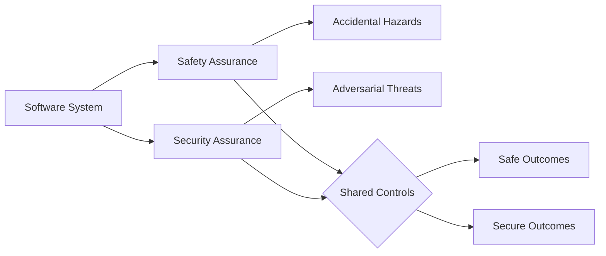
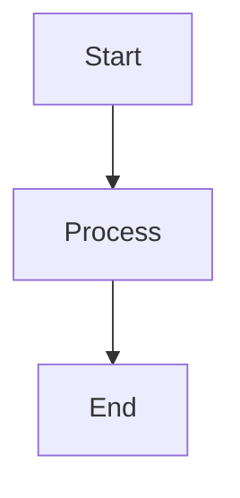

# Interview Q&A - Software Safety & Security

## Purpose

Generate comprehensive, high-quality interview question banks covering software safety and security for technical, operational, and management stakeholders.

## Context & Scope

**Target Audience**: Engineers (implementation), operators (monitoring), managers (policy), regulators (audits)

**Domain Coverage**: Software safety and security across safety-critical and security-critical systems (industrial control, medical devices, automotive, critical infrastructure)

**Constraints**: 
- 25–30 Q&A pairs total
- 150–300 words per answer
- 20/40/40 difficulty distribution (Foundational/Intermediate/Advanced)
- MECE (Mutually Exclusive, Collectively Exhaustive) coverage across all dimensions
- APA 7th edition citations with language tags

**Assumptions**: 
- Readers have basic software engineering knowledge
- Access to cited standards and tools is available for deep study
- Implementation examples use common formats (YAML, Mermaid diagrams)

---

# Part I: Requirements

## Core Specifications

### Scope

- **Count**: 25–30 Q&A pairs
- **Audience**: Engineers, operators, managers, regulators
- **Length**: 150–300 words/answer
- **Difficulty**: 20% Foundational, 40% Intermediate, 40% Advanced
- **Visuals/Cluster**: ≥1 diagram + ≥1 scenario + ≥1 table + ≥1 metric
- **Coverage**: Hazard/threat ID, risk assessment, controls, incident response, compliance

### Content Principles

**MECE Coverage**:
- **Dimensions**: Safety, Security, Resilience, Governance (4 mutually exclusive categories)
- **Lifecycle Phases**: Prevent, Detect, Respond, Recover (4 sequential stages)
- **Complete Matrix**: 4×4 = 16 topic combinations ensuring comprehensive, non-overlapping coverage

**Analysis Framework**: Sequential risk-to-controls mapping
1. Hazard/Threat Identification → 
2. Risk Assessment (Probability × Impact) → 
3. Control Design & Effectiveness → 
4. Incident Management → 
5. Regulatory Compliance Alignment

**Stakeholder Perspectives**: Address all four roles with role-appropriate content
- **Technical**: Detailed implementation guidance, code examples, configurations
- **Operational**: Monitoring procedures, metrics, incident playbooks
- **Management**: Policy decisions, resource allocation, risk trade-offs
- **Regulatory**: Audit evidence, compliance mapping, documentation requirements

**Framework Comparisons**: For each approach comparison, explicitly state:
1. **Context**: When to use each approach
2. **Trade-offs**: Advantages vs. disadvantages
3. **Decision Criteria**: Cost, criticality, regulatory requirements
4. **Examples**: Real-world application scenarios
- Fail-Safe vs. Fail-Operational vs. Redundant systems
- Zero-Trust vs. Perimeter-based security
- Proactive vs. Reactive incident response

**Clarity Standards**:
- Use accessible language understandable to all stakeholder levels
- Define all technical terms before use (see Glossary)
- Explicitly distinguish mandatory requirements (regulatory "must") from best practices ("should", "recommended")
- Provide complete traceability chain: Requirements → Controls → Procedures → Evidence
- Avoid jargon; when domain-specific terms are necessary, link to glossary definitions

### Evaluation Dimensions

**1. Safety Assurance** (Prevent unintended harm from faults, errors, environmental factors)
- **Analysis Methods**: FMEA (Failure Mode and Effects Analysis), FTA (Fault Tree Analysis), HAZOP (Hazard and Operability Study)
- **Design Patterns**: Fail-safe, redundancy (N+1, 2oo3 voting), fault tolerance, graceful degradation
- **Systems**: SIS (Safety Instrumented Systems), safety interlocks, emergency shutdown
- **Certification**: SIL (Safety Integrity Levels) 1-4, ASIL (Automotive) A-D, PL (Machinery)
- **Standards**: IEC 61508, IEC 61511, ISO 26262, IEC 62304

**2. Security Assurance** (Prevent malicious compromise; protect CIA triad)
- **Threat Modeling**: STRIDE (Spoofing, Tampering, Repudiation, Info Disclosure, DoS, Privilege Escalation), PASTA, Attack Trees
- **Testing**: 
  - SAST (Static Application Security Testing): Source/byte code analysis
  - DAST (Dynamic Application Security Testing): Runtime black-box testing
  - SCA (Software Composition Analysis): Dependency vulnerability scanning
  - Fuzz Testing: Automated malformed input generation
  - Penetration Testing: Adversarial exploitation validation
  - API Security: OWASP API Top 10 validation
  - IaC/Container Scanning: Infrastructure and image misconfiguration detection
- **Controls**: Access control (RBAC, ABAC), encryption (at-rest, in-transit), IDS/IPS, security audits
- **Standards**: ISO/IEC 27001, NIST CSF 2.0, ISO/SAE 21434, IEC 62443

**3. Resilience & Incident Response** (Detect, respond, recover from adverse events)
- **Detection**: SIEM correlation, anomaly detection, statistical baselines, threat intelligence
- **Response**: Emergency procedures, incident playbooks, containment strategies
- **Recovery**: BCDR (Business Continuity/Disaster Recovery), RTO/RPO targets, backup validation
- **Monitoring**: Real-time dashboards, alerting, metrics (MTTD, MTTR, detection rate)
- **Standards**: NIST SP 800-61, ISO 22301

**4. Governance & Compliance** (Organizational frameworks, audits, continuous improvement)
- **Frameworks**: Risk management (ISO 31000), quality management, safety/security management systems
- **Standards Compliance**: IEC 61508, ISO 26262, ISO 27001, industry-specific (FDA, NERC CIP, PCI DSS)
- **Evidence**: Audit trails, documentation, traceability matrices, test reports
- **Training**: Staff competency, awareness programs, certification
- **Continuous Improvement**: Lessons learned, post-incident reviews, threat model updates

### Quick Orientation — Safety vs Security

| Dimension | Safety | Security |
| --- | --- | --- |
| Goal | Prevent unintended harm | Prevent malicious compromise |
| Threats | Faults, human error, environment | Adversaries, insiders, exploits |
| Focus | Fail-safe, redundancy, hazards | CIA, access control, detection |
| Evaluation | FMEA, FTA, HAZOP | STRIDE, CVSS, testing (SAST/DAST/Fuzz/Pentest) |
| Outcomes | Safe states, SIL targets | Risk reduction, ISMS controls |



### Visual Element Standards

**Per Topic Cluster Requirements**: Primary diagram + example scenario + supporting table + quantitative metric

| Analysis Type | Diagram | Standard | Scenario + Metrics |
|---------------|---------|----------|--------------------|
| **Hazard** | Fault tree, Bow-tie | IEC 61025, ISO 31010 | Failure scenario + `Risk = P × S`, `MTBF` |
| **Threat** | Attack tree, DFD | STRIDE, PASTA | Attack path + `CVSS`, Attack Surface |
| **Prevention** | Control hierarchy | ISO 12100, NIST CSF | Control impl + Effectiveness % |
| **Detection** | State machine, Alert flow | SIEM | Logic + Detection %, `MTTD` |
| **Response** | Incident workflow | NIST SP 800-61, ISO 22301 | Procedure + `MTTR`, `RTO` |
| **Compliance** | Audit trail, Control map | ISO 27001, IEC 61508 | Evidence + Compliance % |
| **Security Testing** | Attack chain, Coverage map | NIST SP 800-115, OWASP ASVS | Test plan + Coverage %, Defect Escape % |

**Standards**: IEC 61508/61511 (functional safety), ISO 26262 (automotive), ISO/SAE 21434 (auto cyber), IEC 62304/ISO 14971 (medical), IEC 62443 (industrial), ISO 27001 (infosec), NIST CSF 2.0, ISO 31000 (risk), ISO 22301 (BCDR)

### Metrics

**Purpose**: Quantitative measurement of safety, security, and resilience effectiveness. All metrics should be tracked over time, baselined, and have defined targets.

| Metric | Formula | Variables | Target | Significance | Use Case |
|--------|---------|-----------|--------|--------------|----------|
| **Risk Score** | `P × I` | P = Probability (0-1 or Low/Med/High)<br>I = Impact (1-5 or severity scale) | Varies by context; typically Critical if >8 | Prioritizes risk treatment | Risk assessment, control selection |
| **MTBF** (Mean Time Between Failures) | `Total Operating Time / Number of Failures` | Operating time in hours<br>Failures = system-level incidents | >10,000 hrs for critical systems | Reliability indicator; higher = better | Safety system design, maintenance planning |
| **MTTR** (Mean Time To Repair/Recovery) | `Total Restoration Time / Number of Incidents` | Restoration time includes diagnosis + repair + verification | <30 min for critical systems<br>Varies by RTO | Recovery speed; lower = better | Incident response, BCDR planning |
| **MTTD** (Mean Time To Detect) | `Total Detection Time / Number of Incidents` | Detection time from incident start to alert | ≤5 min for critical systems | Exposure window; lower = faster response | SIEM tuning, monitoring effectiveness |
| **Detection Rate** | `True Positives / (True Positives + False Negatives) × 100%` | TP = Correctly identified threats<br>FN = Missed threats | ≥95% for critical systems<br>≥99% for high-consequence | Security monitoring effectiveness | IDS/IPS tuning, SOC performance |
| **False Positive Rate** | `False Positives / Total Alerts × 100%` | FP = Incorrect alerts<br>Total = All alerts generated | ≤2% to prevent alert fatigue<br>≤5% acceptable for lower criticality | Alert quality; lower = less noise | SIEM rule refinement, threshold tuning |
| **CVSS** (Common Vulnerability Scoring System) | `Base × Temporal × Environmental` | Base (0-10): Exploitability + Impact<br>Temporal: Exploit availability<br>Environmental: Local context | Critical ≥9.0<br>High 7.0-8.9<br>Medium 4.0-6.9<br>Low 0.1-3.9 | Vulnerability severity standardization | Patch prioritization, risk assessment |
| **Availability** | `Uptime / (Uptime + Downtime) × 100%` | Uptime = Operational hours<br>Downtime = Outage hours | 99.9% ("three nines") = 8.76h/yr downtime<br>99.99% = 52.6 min/yr<br>99.999% = 5.26 min/yr | Service continuity | SLA definition, redundancy design |
| **Test Coverage** | `Test Cases Executed / Total Test Vectors × 100%` | Test cases = Actual tests run<br>Test vectors = All identified scenarios | ≥80% code coverage<br>100% critical path coverage | Assurance completeness | Security testing, safety validation |
| **Defect Escape Rate** | `Post-Release Defects / Total Defects × 100%` | Post-release = Defects found in production<br>Total = All defects (pre + post-release) | <5% for mature products<br><1% for safety-critical | Quality process effectiveness | Process improvement, testing adequacy |

**Metric Selection Guidance**:
- **Safety-Critical Systems**: Prioritize MTBF, Availability, SIL compliance metrics
- **Security-Critical Systems**: Prioritize Detection Rate, MTTD, CVSS, Test Coverage
- **High-Availability Systems**: Prioritize Availability, MTTR, Redundancy effectiveness
- **All Systems**: Track Risk Score, Defect Escape Rate for continuous improvement

### Safety & Security Frameworks

**Purpose**: Established architectural patterns and principles for designing safe and secure systems. Understanding when and how to apply each framework is critical for effective risk mitigation.

**1. Defense-in-Depth** (Layered Security)
- **Principle**: Deploy multiple independent control layers so failure of one layer doesn't compromise entire system
- **Layers**: Perimeter (firewall) → Network (segmentation) → Host (hardening) → Application (validation) → Data (encryption)
- **Advantage**: No single point of failure; compensating controls
- **Disadvantage**: Complexity in management; potential performance impact
- **Use When**: Security-critical systems requiring high assurance; compliance requirements mandate layered controls
- **Related**: Swiss Cheese Model (Reason, 1990) - multiple defenses with different failure modes
- **Standards**: NIST CSF (Protect function), ISO/IEC 27001 (A.13 Communications Security)

**2. Fail-Safe Design** (Safe State on Failure)
- **Principle**: System automatically enters predefined safe state when failure occurs, preventing harm
- **Examples**: Deadman switch (releases when operator incapacitated), spring-return valves (default to safe position), railway signals (default to red/stop)
- **Advantage**: Guarantees safety even with complete system failure; simple, predictable behavior
- **Disadvantage**: May cause unnecessary shutdowns (availability impact); not suitable for mission-critical continuous operations
- **Use When**: Safety consequences of failure are catastrophic; system can tolerate temporary shutdown; regulatory requirements mandate safe failure modes
- **Contrasts With**: Fail-operational (maintains degraded function), fault tolerance (masks failures)
- **Standards**: IEC 61508 SIL 3-4, IEC 61511 (process safety)

**3. Zero-Trust Architecture** (Never Trust, Always Verify)
- **Principle**: Assume breach; verify every access request regardless of network location; enforce least privilege and micro-segmentation
- **Core Elements**: 
  - Identity verification for every access
  - Least privilege access (minimal permissions)
  - Micro-segmentation (limit lateral movement)
  - Continuous monitoring and validation
- **Advantage**: Limits blast radius of breaches; effective against insider threats and lateral movement
- **Disadvantage**: Implementation complexity; potential user friction; requires mature identity infrastructure
- **Use When**: High-value assets; distributed/cloud environments; insider threat concerns; perimeter security insufficient
- **Contrasts With**: Perimeter-based security (trust internal network)
- **Standards**: NIST SP 800-207, BeyondCorp (Google)

**4. Swiss Cheese Model** (Multiple Imperfect Defenses)
- **Principle**: Layer multiple imperfect defenses (each with "holes") such that holes rarely align, preventing end-to-end compromise
- **Application**: Combine preventive, detective, and corrective controls with different failure modes
- **Advantage**: Acknowledges no single control is perfect; realistic defense strategy
- **Use When**: Complex systems where perfect defense is impractical; need for compensating controls
- **Related**: Defense-in-depth, but explicitly recognizes imperfections

**5. Risk-Based Approach** (Prioritize by Impact)
- **Principle**: Allocate resources to highest-priority risks based on Probability × Impact; accept low risks; mitigate high risks
- **Process**: 
  1. Identify all hazards/threats
  2. Assess probability and impact for each
  3. Calculate risk score (P × I)
  4. Prioritize controls for highest scores
  5. Re-assess residual risk after controls
  6. Continuous monitoring and reassessment
- **Advantage**: Efficient resource allocation; focuses on actual threats
- **Disadvantage**: Requires accurate risk assessment; subjective probability estimates; may miss emerging threats
- **Use When**: Limited resources require prioritization; diverse threat landscape; cost-benefit analysis needed
- **Standards**: ISO 31000 (Risk Management), NIST CSF (Identify function)

**6. Safety-Security Convergence** (Unified Threat View)
- **Principle**: Treat safety hazards and security threats as integrated concerns sharing common controls and governance
- **Rationale**: Security breaches can cause safety incidents (e.g., Stuxnet centrifuge destruction); safety failures can create security vulnerabilities
- **Integrated Controls**: Access control protects both from unauthorized changes (security) and accidental misoperation (safety); monitoring detects both attacks and failures
- **Advantage**: Comprehensive protection; avoids conflicting controls; efficient resource use
- **Disadvantage**: Requires cross-domain expertise; organizational silos resist integration
- **Use When**: Cyber-physical systems (ICS, medical devices, automotive); regulatory convergence (ISO/SAE 21434)
- **Standards**: IEC 62443 (industrial cyber-physical), ISO/SAE 21434 (automotive cyber-safety)

### Visual Standards

**Diagrams**: Use Mermaid (GitHub-native). Syntax:


**Scenarios**: Include configs, procedures, code (YAML, scripts, playbooks) in fenced blocks:
```
safety_limits:
  temperature_max: 85
  shutdown_on_exceed: true
```

**Math**: Inline `$formula$` or block `$$formula$$`. Define variables first.

**Symbols**: ∑ (sum), ∏ (product), ∫ (integral), ∂ (rate), ≈ (approx), ≤/≥ (bounds), ≠, ∀

**Legends**: 💡 Analogy, 📐 Formula, 🔍 Example, ⚠️ Important, 💻 Code

**Avoid**: Single mega-diagram, BPMN for code flow, mixed abstraction levels, >120 nodes, missing rationale

### Diagram Patterns

Combine diagrams for comprehensive analysis:

| Need | Diagram | Scenario | Standard |
|------|---------|----------|----------|
| Hazard ID | Fault tree, FMEA table | Equipment failure cascade | IEC 61025, ISO 31010 |
| Threat model | Attack tree, DFD | Unauthorized access path | STRIDE, PASTA |
| Access control | Role hierarchy, Permission matrix | Auth/authz flow | RBAC, NIST SP 800-53 |
| Incident response | Workflow, Decision tree | Breach containment | NIST SP 800-61, ISO 22301 |
| Safety system | Logic diagram, State machine | Emergency shutdown | IEC 61511, ISA-84 |
| Security monitor | Alert flow, Dashboard | Intrusion detection | SIEM, SOC |
| Compliance | Control matrix, Audit trail | Evidence collection | ISO 27001, IEC 61508 |

### Safety & Security Decision Matrices

**Control Selection Matrix**

| Risk Context | Fail-Safe | Fail-Operational | Redundant | Zero-Trust |
|--------------|-----------|------------------|-----------|------------|
| Criticality | Safety-Critical | Mission-Critical | High-Avail | Security-Critical |
| Tolerance | Zero | Degradation | Continued Ops | Zero Unauth |
| Cost | High | Medium | Low | Medium |
| Recovery | Immediate | Minutes | Seconds | Immediate |
| Regulatory | IEC 61508 SIL 3-4 | ISO 26262 ASIL C-D | IEC 62443 SL 2-3 | ISO 27001 High |

**Risk Prioritization Matrix**

| System | Safety | Security | Availability | Cost | Compliance |
|--------|--------|----------|--------------|------|------------|
| Medical | Critical | Critical | High | Medium | FDA, IEC 62304 |
| Industrial Control | Critical | High | Critical | Medium | IEC 62443 |
| Autonomous Vehicle | Critical | Critical | Critical | Low | ISO 26262 |
| Financial | Medium | Critical | Critical | Medium | PCI DSS, SOX |
| Critical Infra | Critical | Critical | Critical | Low | NERC CIP, NIST |

### Citations

- **Format**: APA 7th with language tags [EN], [ZH]
- **Distribution**: ~60% EN, ~30% ZH, ~10% other
- **Types**: (1) Safety/security standards; (2) Risk methodologies; (3) Incident lessons; (4) Tools/frameworks
- **Inline**: Use [Ref: ID] after claims, standards, metrics, frameworks, statistics, requirements

### Reference Requirements

**Purpose**: Ensure answers are grounded in authoritative, current, and credible sources across multiple languages and source types.

**Minimum Thresholds** (for 25-30 Q&A output):

| Category | Minimum Count | Required Content | Quality Criteria |
|----------|---------------|------------------|------------------|
| **Glossary** | ≥10 terms | FMEA, FTA, HAZOP, STRIDE, CVSS, Defense-in-Depth, Fail-Safe, Redundancy, Zero-Trust, MTBF, MTTR, MTTD, SIL, CIA Triad, Attack Surface, Threat Vector, SAST, DAST, SCA, Fuzz Testing, Penetration Testing, IaC Scanning, API Security | Clear definitions; distinguish similar terms; include formulas/examples where applicable |
| **Tools** | ≥5 tools | **Risk Assessment**: BowTieXP, FMEA tools<br>**Threat Modeling**: Microsoft Threat Modeling Tool<br>**SIEM**: Splunk, ELK Stack<br>**Vulnerability Scanning**: Nessus, Qualys<br>**Incident Management**: PagerDuty, ServiceNow<br>**Security Testing**: OWASP ZAP (DAST), Semgrep (SAST), Snyk (SCA), AFL++/libFuzzer (fuzz), Burp Suite (API), Trivy (container/IaC) | Include: purpose, pricing model, recent updates (≤18 months), key integrations, adoption metrics |
| **Literature** | ≥10 sources | **Safety Standards**: IEC 61508, IEC 61511, ISO 26262, IEC 62304, ISO 14971<br>**Security Standards**: ISO/IEC 27001, ISO/SAE 21434, IEC 62443<br>**Risk/Response**: ISO 31000, ISO 22301, NIST CSF 2.0, NIST SP 800-61, NIST SP 800-82, NIST SP 800-115<br>**Testing**: OWASP ASVS<br>**Books**: Leveson (STAMP), Shostack (Threat Modeling)<br>**Incident Analysis**: Stuxnet, major breaches<br>**Chinese Sources**: Functional safety and infosec texts | Cover all four dimensions (Safety/Security/Resilience/Governance); balance standards, methodologies, and practical incident lessons |
| **Citations** | ≥20 inline | Language distribution: ~60% EN, ~30% ZH, ~10% other (APA 7th with [EN]/[ZH] tags) | Cite after: standards, metrics, frameworks, statistics, requirements, tools, best practices |

**Scaling Rule**: For outputs >30 Q&A, multiply minimum thresholds by 1.5 (e.g., ≥15 glossary terms, ≥8 tools, ≥15 literature sources, ≥30 citations).

**Exception Handling**: If minimums cannot be met, document:
1. Specific shortfall (e.g., "Only 8 tools identified, target was ≥10")
2. Rationale (e.g., "Limited open-source IaC scanners with recent updates")
3. Sourcing plan (e.g., "Will add Checkov and tfsec in next revision")

**Citation Application**: Use [Ref: ID] inline after:
- Standards or regulatory requirements (e.g., "SIL 2 rated [Ref: A1]")
- Metrics or quantitative claims (e.g., "MTTR ≤30 min [Ref: A16]")
- Framework descriptions (e.g., "Defense-in-Depth [Ref: L3]")
- Best practices (e.g., "Air-gap OT networks [Ref: L9]")
- Incident lessons (e.g., "Stuxnet demonstrated ICS vulnerabilities [Ref: L13]")
- Tool recommendations (e.g., "SIEM correlation [Ref: T3]")

### Usage

**Step-by-Step Application**:

1. **Structure Coverage**: Follow MECE framework; maintain 20/40/40 difficulty distribution (Foundational/Intermediate/Advanced)
2. **Reference Completeness**: Meet all minimum thresholds in Reference Requirements section; ensure balanced coverage across Safety/Security/Resilience/Governance dimensions
3. **Visual Elements**: Per cluster provide ≥1 diagram + ≥1 practical scenario + ≥1 table + ≥1 quantitative metric
4. **Source Grounding**: Per topic include ≥2 authoritative standards/sources + ≥1 tool with complete information
5. **Gap Documentation**: Document any unmet requirements with: specific shortfall + rationale + remediation plan

**Quality Assurance**: Execute all quality gates (see Quality Gates section) before submission; iterate until all checks PASS.

### Quality Gates

**Purpose**: Ensure all outputs meet high standards for currency, credibility, diversity, and evidence before submission.

**All checks must PASS. Fix failures and re-validate until 100% compliance.**

| Gate | Criterion | Target | Measurement Method | Significance | Failure Remediation |
|------|-----------|--------|-------------------|--------------|---------------------|
| **Recency** | Source publication date | ≥50% published in last 3 years<br>≥70% for digital/cloud domains (rapid evolution) | Count sources by year; calculate percentage of recent sources | Ensures current best practices; avoids obsolete guidance | Update to latest standard editions; replace outdated incident examples |
| **Diversity** | Source type variety | ≥3 source types (standards, books, tools, incident reports, academic papers)<br>No single type >25% of total | Categorize each source; count per category | Prevents over-reliance on one perspective; balances theory and practice | Add missing categories; reduce dominant type |
| **Evidence** | Citation density | ≥70% of answers have ≥1 citation<br>≥30% have ≥2 citations | Count answers with citations; calculate percentages | Grounds claims in authoritative sources; enables verification | Add citations to unsupported answers; prioritize high-impact claims |
| **Tool Practicality** | Tool information completeness | For each tool, include: pricing model, adoption indicators, last update date (≤18 months), key integrations | Review tool entries for completeness | Enables readers to evaluate and adopt tools | Research missing information; replace unmaintained tools |
| **Link Validity** | URL accessibility | 100% of URLs accessible or archived | Test each URL; use Wayback Machine for broken links | Prevents broken references; ensures long-term usability | Update URLs; use DOIs where available; archive with Wayback Machine |
| **Cross-Reference Integrity** | Reference resolution | 100% of [Ref: ID] resolve to defined references | Parse all [Ref: ID]; verify each exists in reference sections | Prevents dangling references; maintains traceability | Add missing references; correct IDs; remove unused entries |
| **Security Testing Coverage** | Modern testing methods | Include all: SAST, DAST, SCA, fuzz testing, penetration testing<br>For cloud/containerized systems add: IaC scanning, container image scanning | Count testing method mentions; verify examples/tools for each | Comprehensive security validation; reflects current practices | Add missing testing methods; include tool examples for each |
| **Language Balance** | Citation language distribution | ~60% English, ~30% Chinese, ~10% other languages | Tag and count citations by language | Reflects global knowledge; reduces geographic bias | Seek Chinese sources for safety/security topics; balance EN/ZH |
| **Metric Completeness** | Quantitative measurement | ≥1 metric per topic cluster; all metrics have: formula, variables, target, use case | Count metrics per cluster; verify metric table completeness | Enables measurement; supports continuous improvement | Define missing metrics; complete metric descriptions |

**Validation Workflow**:
1. Execute all quality gates after completing draft output
2. Document results in validation table (see Part III template)
3. For each FAIL, implement remediation actions
4. Re-validate changed sections
5. Iterate until all gates show PASS
6. Submit only when validation table shows 100% compliance

**Prioritization**: If resource constraints prevent fixing all failures, prioritize in order: Cross-Reference Integrity > Link Validity > Evidence > Security Testing Coverage > Recency > Diversity > Tool Practicality > Language Balance > Metric Completeness

### Validation

**Success Criteria**: All quality gate checks must PASS before submission.

**Process**: 
1. Complete draft output following all requirements in Part I and Part II
2. Execute comprehensive validation using Quality Gates criteria (see Quality Gates section)
3. For each FAIL result: analyze root cause → implement fix → document change
4. Re-validate all affected sections after fixes
5. Iterate steps 3-4 until 100% of quality gates show PASS
6. Generate validation report table (see Part III Output Format template)
7. Submit only when validation report confirms full compliance

**Accountability**: The validation report becomes part of the deliverable, demonstrating due diligence and quality assurance.

---

# Part II: Workflow

## Generation Steps

### Step 1: Topic Planning

**Objective**: Establish comprehensive, MECE topic coverage with appropriate difficulty distribution.

1. **Identify Topic Clusters** (5-6 clusters recommended):
   - Suggested clusters aligned with MECE framework:
     - **Safety Assurance**: Hazard analysis, fail-safe design, redundancy, SIL certification
     - **Security Assurance**: Threat modeling, security testing (SAST/DAST/SCA/fuzz/pentest), access control, encryption
     - **Risk Assessment & Management**: FMEA, STRIDE, risk quantification (P×I), control selection
     - **Prevention & Control Measures**: Defense-in-depth, detection mechanisms, monitoring
     - **Incident Response & Recovery**: Emergency procedures, BCDR, MTTR/RTO, lessons learned
     - **Compliance & Governance**: Standards adherence (IEC 61508, ISO 27001, etc.), audits, documentation, training
   - **Validate**: Clusters are mutually exclusive (no overlap); collectively exhaustive (cover all four dimensions: Safety, Security, Resilience, Governance)

2. **Allocate Questions** (total 25-30 Q&As):
   - Distribute 4-6 questions per cluster for balanced coverage
   - Example distribution for 30 questions: 5 per cluster × 6 clusters = 30 total
   - Ensure coverage spans all lifecycle phases: Prevent, Detect, Respond, Recover
   - **Validate**: Total count within 25-30 range; roughly equal distribution across clusters

3. **Assign Difficulty Levels** (20/40/40 distribution):
   - **Foundational (20%)**: Definitions, basic concepts, standard procedures
     - Target: 5-6 questions for 25-30 total
     - Example: "What is FMEA and how does it differ from FTA?"
   - **Intermediate (40%)**: Application, comparison, basic troubleshooting
     - Target: 10-12 questions for 25-30 total
     - Example: "Compare fail-safe and fail-operational designs for emergency shutdown systems. When would you choose each?"
   - **Advanced (40%)**: Complex trade-offs, system design, integration, edge cases
     - Target: 10-12 questions for 25-30 total
     - Example: "Design a comprehensive defense-in-depth strategy for a SCADA system. Address safety-security convergence, monitoring, and incident response with specific metrics."
   - **Validate**: Difficulty distribution approximately 20/40/40 (tolerance: ±5%)

4. **Create Planning Matrix**: Document allocation before proceeding
   
   | Cluster | Question Count | Foundational | Intermediate | Advanced |
   |---------|----------------|--------------|--------------|----------|
   | Safety Assurance | 5 | 1 | 2 | 2 |
   | Security Assurance | 5 | 1 | 2 | 2 |
   | Risk Assessment | 5 | 1 | 2 | 2 |
   | Prevention/Control | 5 | 1 | 2 | 2 |
   | Incident Response | 5 | 1 | 2 | 2 |
   | Compliance/Governance | 5 | 1 | 2 | 2 |
   | **Total** | **30** | **6 (20%)** | **12 (40%)** | **12 (40%)** |

5. **Final Validation**:
   - [ ] Total Q&A count: 25-30
   - [ ] Difficulty ratio: ~20% F / ~40% I / ~40% A (tolerance: ±5%)
   - [ ] All clusters cover aspects of 4 dimensions (Safety/Security/Resilience/Governance)
   - [ ] All lifecycle phases represented (Prevent/Detect/Respond/Recover)

### Step 2: References

**Objective**: Establish comprehensive, credible reference foundation before Q&A creation.

1. **Glossary (≥10 terms)**: Define all technical terms used across questions and answers
   - Required: FMEA, FTA, HAZOP, STRIDE, CVSS, Defense-in-Depth, Fail-Safe, Redundancy, Zero-Trust, MTBF, MTTR, MTTD, SIL, CIA Triad, Attack Surface, Threat Vector
   - Format: Term name, clear definition, related concepts, formulas where applicable
   - **Validate**: All terms defined; no duplicates; consistent terminology across all Q&As

2. **Tools (≥5 tools with complete information)**: Identify practical tools for each major category
   - Risk Assessment: BowTieXP, FMEA tools
   - Threat Modeling: Microsoft Threat Modeling Tool
   - SIEM: Splunk, ELK Stack  
   - Vulnerability Scanning: Nessus, Qualys
   - Incident Management: PagerDuty, ServiceNow
   - Security Testing: OWASP ZAP (DAST), Semgrep (SAST), Snyk (SCA), AFL++/libFuzzer (fuzz), Burp Suite (API), Trivy (container/IaC)
   - For each tool document: Purpose, pricing model (free/commercial/freemium), last update date (≤18 months ago), key integrations, adoption metrics
   - **Validate**: Tool count ≥5; all required information present; no unmaintained tools (>18 months without updates)

3. **Literature (≥10 authoritative sources)**: Balance standards, methodologies, and practical lessons
   - Safety Standards: IEC 61508, IEC 61511, ISO 26262, IEC 62304, ISO 14971
   - Security Standards: ISO/IEC 27001, ISO/SAE 21434, IEC 62443
   - Risk/Response Frameworks: ISO 31000, ISO 22301, NIST CSF 2.0, NIST SP 800-61, NIST SP 800-82, NIST SP 800-115
   - Testing Standards: OWASP ASVS
   - Books: Leveson (STAMP methodology), Shostack (Threat Modeling)
   - Incident Analysis: Stuxnet case study, major breach analyses (Colonial Pipeline, SolarWinds, etc.)
   - Chinese Sources: Functional safety and information security academic/industry texts
   - **Validate**: Literature count ≥10; balanced across Safety/Security/Resilience/Governance; includes both prescriptive standards and descriptive incident analyses

4. **Citations (≥20 inline references)**: Assign unique IDs for inline citation
   - Tag each with language [EN]/[ZH]/[OTHER], publication year, source type (standard/book/tool/incident/paper)
   - Assign systematic IDs: G# (Glossary), T# (Tool), L# (Literature), A# (APA citation)
   - Format: APA 7th edition with language tags
   - **Validate**: Citation count ≥20; language distribution ~60% EN / ~30% ZH / ~10% other; ≥50% published in last 3 years (≥70% for digital/cloud topics); ≥3 source types; no single type >25%

5. **Cross-Reference Integrity**: Before proceeding to Q&A creation, verify all reference IDs are unique and properly formatted

### Step 3: Q&A Creation

**Objective**: Generate high-quality, scenario-based questions with comprehensive, well-cited answers.

1. **Question Design**:
   - Use scenario-based formats: "How would...", "When should...", "Compare and justify..."
   - Each question must be: Clear (single unambiguous ask), Realistic (match stakeholder context), Discriminative (test judgment over recall)
   - Target word count: 150-300 words per answer
   - Ensure accessible language understandable to all stakeholder groups (Technical/Operational/Management/Regulatory)
   - **Validate**: Questions are unambiguous; appropriate for assigned difficulty level; aligned with topic cluster

2. **Answer Quality**:
   - Include ≥1 [Ref: ID] citation per answer minimum; aim for ≥2 citations for complex topics
   - Provide complete traceability chain: Requirements → Controls → Implementation Procedures → Metrics
   - Use specific technical details; avoid vague generalizations
   - For framework comparisons, explicitly state: context for use, trade-offs, decision criteria
   - **Validate**: Word count within 150-300 range; ≥1 citation; technical accuracy; completeness of traceability

3. **Practical Scenarios**: Every answer must include at least one of:
   - Failure/attack scenario with consequence analysis
   - Response procedure or incident playbook
   - Configuration example (YAML, firewall rules, etc.)
   - Implementation code snippet
   - **Validate**: Scenario is realistic, detailed, and actionable; directly supports answer content

4. **Key Insight Statement**: For each Q&A, provide one-sentence summary stating:
   - Specific risk trade-off exposed by this question, OR
   - Control effectiveness consideration, OR
   - Incident response impact, OR
   - Regulatory compliance requirement
   - **Validate**: Key Insight is concrete (not generic); directly relates to question; provides learning value

5. **Incremental Validation**: After every 5 Q&As created, check:
   - Word count compliance (150-300 words/answer)
   - Citation presence (≥1 [Ref: ID] per answer)
   - Practical example inclusion (scenario/config/code)
   - Traceability completeness (requirements→controls→procedures)
   - Judgment testing (not just factual recall)
   - **Action**: Fix any deficiencies immediately before proceeding to next batch

### Step 4: Visuals

**Objective**: Provide comprehensive visual and practical elements to support understanding and implementation.

1. **Per-Cluster Visual Requirements**: Each topic cluster must include ≥4 elements:
   - ≥1 diagram (required)
   - ≥1 practical scenario (required)
   - ≥1 table (required)
   - ≥1 quantitative metric (required)
   - **Validate**: All four element types present in each cluster; visual types match analysis needs

2. **Diagram Standards**:
   - Use Mermaid syntax (GitHub-native rendering)
   - Match diagram type to analysis type (see Visual Element Standards table):
     - Hazard analysis: Fault tree, Bow-tie
     - Threat modeling: Attack tree, Data Flow Diagram (DFD)
     - Prevention: Control hierarchy, Defense-in-depth layers
     - Detection: State machine, Alert flow
     - Response: Incident workflow, Decision tree
     - Compliance: Audit trail, Control mapping
   - Include clear captions and legends
   - Avoid: Single mega-diagrams (>120 nodes), mixed abstraction levels, missing rationale
   - **Validate**: Syntax is valid Mermaid; diagram type appropriate for content; caption/legend present; complexity manageable

3. **Practical Scenarios**: Include executable/deployable artifacts:
   - Configuration files: YAML, JSON, XML (safety limits, firewall rules, SIEM correlations)
   - Scripts: Monitoring scripts, validation checks, automation playbooks
   - Procedures: Incident response playbooks, emergency procedures
   - Use language-tagged fenced code blocks (```yaml, ```python, etc.)
   - **Validate**: Code is syntactically correct; comments explain key elements; realistic and actionable

4. **Framework Application**: Demonstrate established frameworks with concrete examples:
   - Defense-in-Depth: Show specific layers with controls per layer
   - Fail-Safe: Demonstrate safe-state behavior with failure scenario
   - Zero-Trust: Illustrate verification checkpoints and least-privilege access
   - For each framework, state: when to use, advantages, disadvantages, implementation specifics
   - **Validate**: Framework applied correctly; trade-offs explicitly discussed; implementation details sufficient for replication

5. **Final Visual Validation**: 
   - All topic clusters have required visual elements
   - Visual types align with analysis type (hazard/threat/prevention/detection/response/compliance)
   - Diagrams render correctly in Mermaid
   - Code examples are syntactically valid
   - Tables are properly formatted
   - Metrics include formula, variables, targets

### Step 5: References

**Objective**: Complete all reference sections with full details and ensure cross-reference integrity.

1. **Populate Reference Sections**:
   - **Glossary**: Complete definitions for all terms (minimum 10, as identified in Step 2)
     - Format: **Term Name**: Definition. Related concepts. [Language tag]
     - Include formulas for quantitative terms (MTBF, CVSS, Risk, etc.)
     - Distinguish similar terms (MTTR vs MTTD, Fail-Safe vs Fail-Operational)
   
   - **Tools**: Complete tool descriptions (minimum 5, as identified in Step 2)
     - Format: **Tool Name** (Category): Description. Pricing: [model]. Last updated: [date]. Integrations: [key systems]. URL. [Language tag]
     - Ensure last update ≤18 months ago; replace unmaintained tools
   
   - **Literature**: Complete literature entries (minimum 10, as identified in Step 2)
     - Format: **Reference ID. Title. Publication details.**
     - Cover all four dimensions: Safety, Security, Resilience, Governance
     - Balance standards, methodologies, tools, and incident analyses
   
   - **APA Citations**: Format all citations per APA 7th edition with language tags
     - Format: **Citation ID. Author(s). (Year). *Title*. Publisher/Journal. DOI/URL [Language tag]**
     - Verify: ~60% EN, ~30% ZH, ~10% other languages

2. **Cross-Reference Validation**:
   - Parse all inline [Ref: ID] references in Q&A content
   - Verify each reference ID exists in one of: Glossary (G#), Tools (T#), Literature (L#), APA Citations (A#)
   - Check for: Dangling references (cited but not defined), Orphaned entries (defined but never cited)
   - **Action**: Add missing reference definitions; remove unused entries; correct mismatched IDs

3. **Completeness Check**:
   - Reference minimums met: ≥10 glossary, ≥5 tools, ≥10 literature, ≥20 citations
   - Quality gates met: Recency (≥50% last 3yr), Diversity (≥3 types, no single >25%), Language balance (~60/30/10)
   - All URLs accessible or archived (use Wayback Machine for broken links; prefer DOIs)
   - **Action**: If any minimums unmet, document shortfall + rationale + sourcing plan per Exception Handling protocol

### Step 6: Validation

**Objective**: Execute comprehensive quality assurance before submission.

**Process**:
1. **Execute All Quality Gates** (see Quality Gates section for complete criteria):
   - Recency: Verify ≥50% sources from last 3 years (≥70% for digital/cloud)
   - Diversity: Confirm ≥3 source types; no single type >25%
   - Evidence: Check ≥70% answers have ≥1 citation; ≥30% have ≥2
   - Tool Practicality: Verify all tools have pricing, adoption, update date (≤18mo), integrations
   - Link Validity: Test all URLs; archive broken links with Wayback Machine
   - Cross-Reference Integrity: Confirm 100% of [Ref: ID] resolve to defined references
   - Security Testing Coverage: Verify all methods included (SAST, DAST, SCA, fuzz, pentest; +IaC/container for cloud)
   - Language Balance: Count citations by language; verify ~60/30/10 EN/ZH/other
   - Metric Completeness: Check ≥1 metric per cluster; all have formula, variables, target, use case

2. **Document Results**: Create validation table (see Part III template) with:
   - Gate name | Criterion | Target | Actual | Status (PASS/FAIL) | Remediation (if FAIL)

3. **Remediation Loop**:
   - For each FAIL: Analyze root cause → Implement fix → Document change
   - Re-validate affected sections
   - Update validation table with new results
   - Repeat until all gates show PASS

4. **Final Checklist**:
   - [ ] All quality gates show PASS in validation table
   - [ ] Total Q&A count: 25-30
   - [ ] Difficulty distribution: ~20% F, ~40% I, ~40% A
   - [ ] Reference minimums met: ≥10 glossary, ≥5 tools, ≥10 literature, ≥20 citations
   - [ ] Per cluster: ≥1 diagram, ≥1 scenario, ≥1 table, ≥1 metric
   - [ ] All diagrams render in Mermaid
   - [ ] All code examples are syntactically valid
   - [ ] TOC links to all sections

**Output**: Validation report table showing 100% compliance before proceeding to Step 7.

### Step 7: Review

**Objective**: Final quality review against success criteria before submission.

**Review Criteria** (apply systematically to entire output):

1. **Clarity & Accessibility**:
   - [ ] All questions are unambiguous with single clear ask
   - [ ] Language is accessible to all stakeholder levels (Technical/Operational/Management/Regulatory)
   - [ ] Technical terms defined before use or linked to glossary
   - [ ] Jargon minimized; where necessary, explained

2. **Precision & Accuracy**:
   - [ ] Terminology is consistent throughout
   - [ ] Technical details are specific, not vague
   - [ ] Metrics include complete formulas with variable definitions
   - [ ] All factual claims are cited

3. **Relevance & Focus**:
   - [ ] All content directly supports safety/security question bank purpose
   - [ ] No tangential information or scope creep
   - [ ] Examples and scenarios are realistic and applicable

4. **MECE Coverage**:
   - [ ] All 4 dimensions covered: Safety, Security, Resilience, Governance
   - [ ] All 4 lifecycle phases addressed: Prevent, Detect, Respond, Recover
   - [ ] No significant gaps in coverage
   - [ ] No redundant or overlapping questions

5. **Sufficiency & Depth**:
   - [ ] Comprehensive coverage of necessary aspects per dimension
   - [ ] Sufficient detail for implementation (not just high-level concepts)
   - [ ] Trade-offs and alternatives discussed where relevant
   - [ ] Practical scenarios enable hands-on application

6. **Concision & Significance**:
   - [ ] All content is essential; no fluff or filler
   - [ ] Answers prioritize important information over trivial details
   - [ ] Word counts within 150-300 range (sufficient but not verbose)

7. **Logic & Structure**:
   - [ ] Risk-to-controls framework applied consistently
   - [ ] Traceability chains are complete (requirements→controls→procedures→metrics)
   - [ ] Framework comparisons include context, trade-offs, decision criteria
   - [ ] Arguments are coherent and well-reasoned

8. **Credibility & Evidence**:
   - [ ] All sources are authoritative (standards bodies, established researchers, reputable tools)
   - [ ] Recent sources prioritized (≥50% last 3 years)
   - [ ] Multiple source types prevent single-perspective bias
   - [ ] Citations ground all significant claims

9. **Fairness & Balance**:
   - [ ] Multiple perspectives presented where appropriate
   - [ ] Assumptions and limitations explicitly stated
   - [ ] Alternatives and counterarguments acknowledged
   - [ ] Bias awareness (geographic, vendor, methodology)

10. **Format & Presentation**:
    - [ ] TOC links to all major sections
    - [ ] Visual hierarchy clear (headings, lists, tables)
    - [ ] Diagrams enhance understanding (not decorative)
    - [ ] Code blocks are formatted and tagged
    - [ ] Tables are properly structured

11. **Practicality & Actionability**:
    - [ ] Guidance is implementable, not just theoretical
    - [ ] Configuration examples are realistic and adaptable
    - [ ] Procedures are specific enough to follow
    - [ ] Tools and standards are accessible

12. **Success Criteria Verification**:
    - [ ] Questions test judgment and risk-to-controls translation
    - [ ] Answers demonstrate risk awareness
    - [ ] Communication is clear with accessible language and visuals
    - [ ] Implementation traceability is complete and measurable

**Final Action**: Submit only when all review criteria are met AND all quality gates show PASS in validation report.

---

# Part III: Output Format

## Question Design

### Risk-to-Controls Framework

1. **Hazard/Threat ID**: Identify risks → assess P × I → prioritize
2. **Control Requirements**: Define goals → evaluate effectiveness → check compliance
3. **Control Design**: Prevention → detection → response
4. **Trace**: Requirements → deployed controls → procedures

### Quality Criteria

**Clarity**: Single unambiguous ask, accessible to all stakeholders
- ✅ "How would you assess and mitigate risk of undetected sensor failure in a medical infusion pump?"
- ❌ "Explain safety and security in medical devices"

**Signal**: Tests risk-to-controls translation, not trivia
- ✅ "Implement defense-in-depth for industrial control. Show layers and monitoring."
- ❌ "List defense-in-depth layers"

**Depth**: Enables risk/control/incident trade-off discussion
- ✅ "Choose: fail-safe, fail-operational, or redundant for autonomous braking. Justify with risk analysis."
- ❌ "Should you use redundancy? Yes/no"

**Realism**: Match stakeholder roles (Technical/Operational/Management/Regulatory)
- ✅ "SCADA had 10-min outage. How determine if safety incident, security breach, or benign?"
- ❌ "Design secure control system from scratch"

**Discriminative**: Tests judgment over recall
- ✅ "When choose fail-safe over fail-operational? Show real-world scenarios."
- ❌ "What is fail-safe design?"

### Success Factors

- **Risk awareness**: Hazard/threat ID, P × I assessment, regulatory requirements
- **Clear communication**: Accessible language, visuals, concrete scenarios
- **Implementation**: Trace requirements → controls, measure effectiveness, document lessons

---

## Output Format

Start the output with a TOC (e.g., '## Contents') linking to all top-level headings and list items.

- Use lists tables diagrams formulas code blocks; diagrams in Mermaid; code with language-tagged fences.

Use this structure when generating question banks:

```markdown
## Contents

- [Topic Areas](#topic-areas-questions-1-n)
- [Topic 1: [Topic title]](#topic-1-topic-title)
  - [Q1: [Question text]](#q1-question-text)
  - [Q2: [Question text]](#q2-question-text)
- [Topic 2: [Topic title]](#topic-2-topic-title)
  - [Q3: [Question text]](#q3-question-text)
- [Reference Sections](#reference-sections)
  - [Glossary, Terminology & Acronyms](#glossary-terminology--acronyms)
  - [Safety & Security Tools](#safety--security-tools)
  - [Authoritative Standards & Literature](#authoritative-standards--literature)
  - [APA Style Source Citations](#apa-style-source-citations)

---

## Topic Areas: Questions 1-N

Overview of coverage and difficulty distribution.

| Topic | Question Range | Count | Difficulty Mix |
|-------|---------------|-------|----------------|
| Safety Assurance (Hazard Analysis, Fail-Safe, Redundancy) | Q1-Q5 | 5 | 1F, 2I, 2A |
| Security Assurance (Threat Modeling, Security Testing, Access Control, Encryption) | Q6-Q10 | 5 | 1F, 2I, 2A |
| Risk Assessment & Management (FMEA, STRIDE, Quantification) | Q11-Q15 | 5 | 1F, 2I, 2A |
| Prevention & Control Measures (Defense-in-Depth, Detection) | Q16-Q20 | 5 | 1F, 2I, 2A |
| Incident Response & Recovery (Emergency Procedures, BCDR) | Q21-Q25 | 5 | 1F, 2I, 2A |
| Compliance & Governance (Standards, Audits, Documentation) | Q26-Q30 | 5 | 1F, 2I, 2A |
| **Total** | | **30** | **6F, 12I, 12A** |

**Legend**: F = Foundational, I = Intermediate, A = Advanced

---

## Topic 1: [Topic Title]

### Q1: [Question Text]

**Difficulty**: [Foundational/Intermediate/Advanced]  
**Type**: [Safety Assurance/Security Assurance/Risk Assessment/Prevention Measures/Incident Response/Compliance & Governance]

**Key Insight**: [One sentence stating specific risk trade-offs/control effectiveness/incident impact/regulatory requirements this question exposes]

**Answer**:

[150-300 word answer with inline [Ref: ID] citations accessible to all stakeholders, explicitly connecting safety/security requirements to control implementations]

**Practical Scenario**:
```
# Example configuration, procedure, or implementation
# Can be YAML config, monitoring script, incident playbook, etc.
```

**Supporting Artifacts** (Select 3+ matching analysis type):

| Artifact Type | Diagrams | Practical Scenarios | Metrics |
|---------------|----------|---------------------|----------|
| **Safety Assurance** | Fault tree, FMEA table, Bow-tie | Equipment failure scenarios, Safety interlock configs | `Risk = Likelihood × Severity`, `MTBF = Operating Time / Failures` |
| **Security Assurance** | Attack tree, Data flow, Defense-in-depth | Attack scenarios, Access control policies | `Attack Surface = Entry Points × Vulnerabilities`, `CVSS Score` |
| **Risk Assessment** | Risk matrix, Probability-Impact | Risk quantification, Control selection | `Risk Score = P × I`, `Residual Risk = Initial Risk - Control Effectiveness` |
| **Prevention Measures** | Control hierarchy, Monitoring flow | Prevention controls, Detection mechanisms | `Control Effectiveness = Prevented / Total × 100%`, `False Positive Rate` |
| **Compliance** | Audit trail, Control mapping | Evidence documentation, Training records | `Compliance Rate = Controls Met / Total × 100%`, `Audit Findings` |
| **Security Testing** | Attack chain, Test coverage map | Pentest/fuzz runs, API test cases | `Coverage = Tests Run / Identified Vectors × 100%`, `Defect Escape Rate` |

### Template Stubs (use when needed)

**Incident Playbook (YAML)**
```
incident_playbook:
  id: PLAY-001
  scope: [safety, security]
  triggers: [alarm_high_pressure, failed_auth_n_times]
  roles:
    - incident_commander
    - safety_officer
    - sec_ops_lead
  steps:
    - detect: "SIEM alert or safety alarm"
    - contain: "isolate segment; engage interlocks"
    - eradicate: "patch; rollback configs"
    - recover: "restore services within RTO"
  comms:
    channels: [phone, pager, chat]
    stakeholders: [ops, management, regulator]
  metrics:
    mttd_target_min: 5
    mttr_target_min: 30
  severity_matrix:
    critical:
      escalation: "immediate (≤5min)"
      mttd_target: 5
      mttr_target: 30
      stakeholders: [ciso, ceo, regulator]
    high:
      escalation: "within 15min"
      mttd_target: 15
      mttr_target: 60
      stakeholders: [security_lead, ops_manager]
    medium:
      escalation: "within 1hour"
      mttd_target: 30
      mttr_target: 120
      stakeholders: [team_lead, ops]
    low:
      escalation: "next business day"
      mttd_target: 60
      mttr_target: 240
      stakeholders: [oncall_engineer]
  response_procedures:
    detect: "siem_alert + threat_intel + validation"
    contain: "isolate_segments + preserve_evidence + block_indicators"
    eradicate: "patch_vulnerabilities + rollback_configs + purge_compromise"
    recover: "restore_from_backup + verify_integrity + monitor_anomalies"
  communications:
    channels: [phone, pager, chat, email]
    templates: [initial_alert, status_update, resolution_report]
  post_incident:
    lessons_learned: true
    threat_model_update: true
    control_improvement: true
```

**Risk Register (Table)**
| ID | Hazard/Threat | P (0-1) | I (1-5) | Risk (P×I) | Control | Owner | Due |
|----|----------------|---------|---------|------------|---------|-------|-----|
| R-01 | Sensor spoofing | 0.2 | 4 | 0.8 | Authenticated telemetry + anomaly detection | SecOps | 2025-01-31 |

**Assurance Evidence Mapping (Table)**
| Requirement | Control | Evidence | Metric |
|-------------|---------|---------|--------|
| Prevent overpressure | Safety interlock SIL2 | Interlock test report, change log | `MTTR`, `Incidents Prevented` |
| Protect command channel | mTLS + RBAC | Cert inventory, access reviews | `Failed Auth Rate`, `CVSS` |
| Restore within 30 min | BCDR runbook | Drill report, timestamps | `MTTR ≤ 30 min`, `RTO` |
| Detect anomalies within 5 min | SIEM + baseline monitoring | Alert logs, correlation rules | `MTTD ≤ 5 min`, `Detection Rate ≥ 95%` |

---

## Reference Sections

### Glossary, Terminology & Acronyms

**G1. FMEA (Failure Mode and Effects Analysis)**
Systematic method to identify potential failure modes, their causes, and effects on system performance. Prioritizes risks by RPN (Risk Priority Number = Severity × Occurrence × Detection). Related: FMECA [EN]

**G2. FTA (Fault Tree Analysis)**
Top-down deductive analysis using Boolean logic gates to identify root causes of hazardous events. Quantifies probability of top event. Related: Event Tree Analysis [EN]

**G3. HAZOP (Hazard and Operability Study)**
Structured brainstorming technique using guide words (No, More, Less, Reverse) to identify deviations from design intent in process systems. Related: HAZID [EN]

**G4. STRIDE (Threat Modeling)**
Mnemonic for threat categories: Spoofing, Tampering, Repudiation, Information Disclosure, Denial of Service, Elevation of Privilege. Microsoft framework for systematic threat identification. [EN]

**G5. CVSS (Common Vulnerability Scoring System)**
Standardized method to assess vulnerability severity. Score 0-10 based on exploitability, impact, and temporal/environmental factors. Used for prioritizing patches. [EN]

**G6. Defense-in-Depth**
Layered security strategy deploying multiple controls at different levels (network, host, application, data) so failure of one layer doesn't compromise entire system. Related: Swiss Cheese Model [EN]

**G7. Fail-Safe Design**
System enters predefined safe state when failure occurs. Examples: deadman switch, spring-return valves. Contrasts with fail-operational. Related: Intrinsic Safety [EN]

**G8. Redundancy**
Duplication of critical components to maintain function when primary fails. Types: active (hot standby), passive (cold standby), diverse (different technologies). Related: N+1, 2oo3 voting [EN]

**G9. Zero-Trust Architecture**
Security model: never trust, always verify. Enforces least privilege, micro-segmentation, continuous authentication regardless of network location. Related: BeyondCorp [EN]

**G10. MTBF (Mean Time Between Failures)**
Average operating time between failures for repairable systems. Formula: `MTBF = Total Operating Time / Number of Failures`. Higher MTBF indicates better reliability. Related: Availability, Reliability, SIL. [EN]

**G11. MTTR (Mean Time To Repair/Recovery)**
Average time to restore service after failure. Formula: `MTTR = Total Restoration Time / Number of Incidents`. Includes diagnosis, repair, and verification. Lower MTTR indicates better maintainability. Related: MTTF, MTTD, RTO. [EN]

**G12. SIL (Safety Integrity Level)**
IEC 61508/61511 discrete level (1-4) for specifying safety system reliability. Determines required risk reduction and control measures based on hazard severity.

| Level | PFD (Probability of Failure on Demand) | RRF (Risk Reduction Factor) | Usage Examples |
|-------|---------------------------------------|---------------------------|----------------|
| SIL 4 | 10⁻⁵ to 10⁻⁴ | 100,000-10,000 | Nuclear protection, commercial aviation |
| SIL 3 | 10⁻⁴ to 10⁻³ | 10,000-1,000 | Chemical plants, railway signaling |
| SIL 2 | 10⁻³ to 10⁻² | 1,000-100 | Process industry, heavy machinery |
| SIL 1 | 10⁻² to 10⁻¹ | 100-10 | Basic industrial protection |

Related: ASIL (automotive), PL (machinery), Hardware/Software fault tolerance requirements. [EN]

**G13. CIA Triad**
Foundational security principles: Confidentiality (prevent unauthorized disclosure), Integrity (prevent unauthorized modification), Availability (ensure authorized access). Related: Parkerian Hexad [EN]

**G14. Attack Surface**
Sum of entry points (network ports, APIs, user inputs) where unauthorized user can attempt to access or extract data. Reduction minimizes security risk. Related: Threat Vector [EN]

**G15. Threat Vector**
Path or means by which attacker gains unauthorized access. Examples: phishing (social), SQL injection (code), physical access (facilities). Related: Attack Chain [EN]

**G16. MTTD (Mean Time To Detect)**
Average time to detect incidents from occurrence. Formula: `MTTD = Total Detection Time / Number of Incidents`. Lower MTTD reduces exposure window; pairs with MTTR for comprehensive response assessment. Related: Detection Rate, MTTR, Security Monitoring. [EN]

**G17. SAST (Static Application Security Testing)**
Analyzes source/byte code without execution to find vulnerabilities early (shift‑left). Complements DAST. [EN]

**G18. DAST (Dynamic Application Security Testing)**
Tests running applications externally to find exploitable issues (black‑box/gray‑box). [EN]

**G19. SCA (Software Composition Analysis)**
Identifies vulnerabilities and licenses in dependencies; produces SBOM; monitors CVEs. [EN]

**G20. Fuzz Testing**
Automated generation of malformed/random inputs to trigger crashes or unexpected states. [EN]

**G21. Penetration Testing**
Controlled adversarial testing to exploit weaknesses and validate real‑world impact. [EN]

**G22. IaC & Container Scanning**
Scans Infrastructure‑as‑Code and container images for misconfigurations and known vulnerabilities. [EN]

**G23. API Security Testing**
Validates API endpoints against OWASP API Top 10; auth, rate‑limit, input handling. [EN]

---

### Safety & Security Tools

**T1. BowTieXP** (Risk Assessment)
Visualization tool for bow-tie diagrams connecting hazards, threats, top events, consequences, and barriers. Integrates with HAZOP, LOPA. Commercial. https://www.cgerisk.com/bowtiexp [EN]

**T2. Microsoft Threat Modeling Tool** (Threat Analysis)
Free STRIDE-based tool for identifying security threats in software design. Auto-generates threat lists from DFDs. https://aka.ms/threatmodelingtool [EN]

**T3. Splunk / ELK Stack** (SIEM - Security Information and Event Management)
Real-time log aggregation, correlation, alerting for security incidents. Splunk (commercial), ELK (open source: Elasticsearch, Logstash, Kibana). [EN]

**T4. Nessus / Qualys** (Vulnerability Scanning)
Automated network scanners detecting misconfigurations, missing patches, known vulnerabilities. Nessus (Tenable), Qualys (cloud-based). Generate CVSS scores. [EN]

**T5. PagerDuty / ServiceNow** (Incident Management)
Incident response platforms for alerting, escalation, collaboration, and post-mortem tracking. Integrates with monitoring tools (Prometheus, Datadog). [EN]

**T6. OWASP ZAP** (DAST)
Open-source web/app DAST scanner for automated and manual testing. https://www.zaproxy.org/ [EN]

**T7. Semgrep** (SAST)
Lightweight static analysis with rule packs for common vulns; CI integration. https://semgrep.dev/ [EN]

**T8. Snyk / OWASP Dependency-Check** (SCA/SBOM)
Dependency vulnerability and license scanning; SBOM generation. https://snyk.io/ • https://owasp.org/www-project-dependency-check/ [EN]

**T9. AFL++ / libFuzzer** (Fuzzing)
Modern fuzzers for native code; coverage‑guided testing. https://github.com/AFLplusplus/AFLplusplus • https://llvm.org/docs/LibFuzzer.html [EN]

**T10. Burp Suite** (Web/API testing)
Intercepting proxy for manual/automated testing, including APIs. https://portswigger.net/burp [EN]

**T11. Trivy** (Container & IaC scanning)
Scans container images, SBOMs, and IaC for CVEs/misconfigurations. https://aquasecurity.github.io/trivy/ [EN]

---

### Authoritative Standards & Literature

**L1. IEC 61508:2010 & IEC 61511:2016. *Functional Safety of E/E/PE Systems & Safety Instrumented Systems for Process Industry*.**  
IEC 61508: International standard defining SIL levels and safety lifecycle across industries. IEC 61511: Process industry application with HAZOP integration, SIS design, and operations. Basis for domain-specific standards (ISO 26262, IEC 62443).

**L2. ISO 26262:2018. *Road Vehicles - Functional Safety*.**  
Automotive adaptation of IEC 61508 defining ASIL (Automotive Safety Integrity Levels A-D), V-model development, and safety case requirements for vehicles.

**L3. NIST Cybersecurity Framework (CSF) 2.0. (2024).**  
Updated framework for managing cybersecurity risk: Govern, Identify, Protect, Detect, Respond, Recover. Widely adopted across critical infrastructure sectors. https://www.nist.gov/cyberframework

**L4. ISO/IEC 27001:2022. *Information Security Management Systems - Requirements*.**  
International standard for establishing, implementing, maintaining, and improving an ISMS. Includes Annex A controls covering organizational, technical, and physical security.

**L5. NIST SP 800-61 Rev. 2. (2012). *Computer Security Incident Handling Guide*.**  
Incident response lifecycle: Preparation, Detection & Analysis, Containment/Eradication/Recovery, Post-Incident Activity. Reference for SOC operations.

**L6. Leveson, N. G. (2011). *Engineering a Safer World: Systems Thinking Applied to Safety*. MIT Press.**  
STAMP (Systems-Theoretic Accident Model and Processes) framework for analyzing complex socio-technical system accidents. Alternative to traditional chain-of-events models.

**L7. ISO/SAE 21434:2021. *Road vehicles — Cybersecurity engineering*.**  
Automotive cybersecurity engineering across lifecycle: risk assessment, cybersecurity goals, and assurance activities integrated with safety.

**L8. IEC 62304:2006+A1:2015. *Medical device software — Software life cycle processes*.**  
Processes for development and maintenance of medical device software; integrates risk management (ISO 14971) and traceability.

**L9. NIST SP 800-82 Rev. 2. (2015). *Guide to Industrial Control Systems (ICS) Security*.**  
Security architecture and controls for ICS/SCADA, including segmentation, whitelisting, and monitoring in OT environments.

**L10. ISO 14971:2019. *Medical devices — Application of risk management to medical devices*.**  
Framework for identifying hazards, estimating and evaluating risks, controlling risks, and monitoring post‑production information.

**L11. NIST SP 800-115. (2008). *Technical Guide to Information Security Testing and Assessment*.**
Comprehensive methodology for security testing including penetration testing, vulnerability assessment, and security assessment planning.

**L12. OWASP ASVS 4.0. (2019). *Application Security Verification Standard*.**
Framework for testing application security controls and providing developers with security requirements list.

**L13. Langner, R. (2011). *Stuxnet: Dissecting a cyberweapon*. IEEE Security & Privacy, 9(3), 49-51.**
Technical analysis of the first known cyberweapon targeting industrial control systems; lessons for ICS security.

**L14. Krebs, B. (2014). *Krebs on Security: In-depth security news and investigation*.**
Comprehensive coverage of major data breaches including Target, Equifax; attack patterns and defensive lessons.

**L15. CISA. (2021). *Colonial Pipeline cybersecurity incident: Lessons learned*.**
Official analysis of ransomware attack on critical infrastructure; emergency response and recovery insights.

**L16. Mandiant. (2021). *Highly Evasive Attacker Leverages SolarWinds Supply Chain*.**
Analysis of supply chain compromise via software updates; nation-state APT tactics and detection strategies.

---

### APA Style Source Citations

**A1. International Electrotechnical Commission. (2010). *IEC 61508: Functional safety of electrical/electronic/programmable electronic safety-related systems* (2nd ed.). IEC. [EN]**

**A2. International Organization for Standardization. (2018). *ISO 26262: Road vehicles - Functional safety* (2nd ed.). ISO. [EN]**

**A3. National Institute of Standards and Technology. (2024). *Cybersecurity Framework (CSF) 2.0*. NIST. https://www.nist.gov/cyberframework [EN]**

**A4. International Organization for Standardization. (2022). *ISO/IEC 27001: Information security, cybersecurity and privacy protection - Information security management systems - Requirements*. ISO/IEC. [EN]**

**A5. Cichonski, P., Millar, T., Grance, T., & Scarfone, K. (2012). *Computer security incident handling guide* (NIST SP 800-61 Rev. 2). NIST. https://doi.org/10.6028/NIST.SP.800-61r2 [EN]**

**A6. Leveson, N. G. (2011). *Engineering a safer world: Systems thinking applied to safety*. MIT Press. [EN]**

**A7. Shostack, A. (2014). *Threat modeling: Designing for security*. Wiley. [EN]**

**A8. 张东明, & 李明. (2020). *功能安全技术及应用*. 机械工业出版社. [ZH]**
(Zhang, D., & Li, M. (2020). *Functional safety technology and applications*. China Machine Press.)

**A9. International Organization for Standardization. (2018). *ISO 31000: Risk management - Guidelines* (2nd ed.). ISO. [EN]**

**A10. International Electrotechnical Commission. (2016). *IEC 62443: Industrial communication networks - Network and system security*. IEC. [EN]**

**A11. Hopkin, P. (2018). *Fundamentals of risk management: Understanding, evaluating and implementing effective risk management* (5th ed.). Kogan Page. [EN]**

**A12. 王志刚, & 刘康. (2019). *信息安全技术*. 清华大学出版社. [ZH]**
(Wang, Z., & Liu, K. (2019). *Information security technology*. Tsinghua University Press.)

**A13. Freund, J., & Jones, J. (2014). *Measuring and managing information risk: A FAIR approach*. Butterworth-Heinemann. [EN]**

**A14. Center for Chemical Process Safety. (2008). *Guidelines for hazard evaluation procedures* (3rd ed.). Wiley. [EN]**

**A15. National Institute of Standards and Technology. (2020). *Security and privacy controls for information systems and organizations* (NIST SP 800-53 Rev. 5). NIST. https://doi.org/10.6028/NIST.SP.800-53r5 [EN]**

**A16. International Organization for Standardization. (2019). *ISO 22301: Security and resilience - Business continuity management systems - Requirements*. ISO. [EN]**

**A17. International Organization for Standardization & Society of Automotive Engineers. (2021). *ISO/SAE 21434: Road vehicles — Cybersecurity engineering*. ISO/SAE. [EN]**

**A18. International Electrotechnical Commission. (2006, amended 2015). *IEC 62304: Medical device software — Software life cycle processes*. IEC. [EN]**

**A19. Stouffer, K., Pillitteri, V., Lightman, S., Abrams, M., & Hahn, A. (2015). *Guide to Industrial Control Systems (ICS) Security* (NIST SP 800‑82 Rev. 2). NIST. [EN]**

**A20. International Organization for Standardization. (2019). *ISO 14971: Medical devices — Application of risk management to medical devices*. ISO. [EN]**

**A21. Scarfone, K., Souppaya, M., Cody, A., & Orebaugh, A. (2008). *Technical guide to information security testing and assessment* (NIST SP 800-115). NIST. https://doi.org/10.6028/NIST.SP.800-115 [EN]**

**A22. OWASP Foundation. (2019). *Application Security Verification Standard (ASVS) 4.0*. OWASP. https://owasp.org/www-project-application-security-verification-standard/ [EN]**

**A23. Langner, R. (2011). Stuxnet: Dissecting a cyberweapon. *IEEE Security & Privacy*, 9(3), 49-51. https://doi.org/10.1109/MSP.2011.67 [EN]**

**A24. Krebs, B. (2014). *Krebs on Security: In-depth security news and investigation*. https://krebsonsecurity.com/ [EN]**

**A25. Cybersecurity and Infrastructure Security Agency. (2021). *Colonial Pipeline cybersecurity incident analysis*. CISA. https://www.cisa.gov/colonial-pipeline-cyber-incident [EN]**

**A26. Mandiant. (2021). *Highly evasive attacker leverages SolarWinds supply chain to compromise multiple global victims with SUNBURST backdoor*. Mandiant. https://www.mandiant.com/resources/blog/evasive-attacker-leverages-solarwinds-supply-chain-compromises-with-sunburst-backdoor [EN]**

---

## Validation Report

Execute full validation (Part I). Present results in table format upon completion. All checks must show PASS before submission.

---

## Example Question

Demonstrates the risk-to-controls framework: Hazard/Threat Identification → Risk Assessment → Control Implementation → Metrics.

### Q1: How would you implement defense-in-depth for a SCADA system controlling a water treatment plant? Show the control layers, monitoring approach, and key risk metrics.

**Difficulty**: Advanced  
**Type**: Security Assurance, Prevention Measures

**Key Insight**: Tests ability to apply layered security controls, reason about safety-security convergence, and connect requirements to deployed controls with measurable effectiveness.

**Answer**:

Defense-in-depth for critical infrastructure SCADA requires multiple control layers addressing both cyber threats and safety hazards [Ref: A10]. Implementation spans network segmentation, access control, monitoring, and fail-safe mechanisms [Ref: L3, L6].

**Control Architecture**: (1) Network layer: air-gapped OT/IT networks, firewalls with deny-by-default rules, DMZ for historian access; (2) Host layer: hardened OS, application whitelisting, patch management; (3) Application layer: role-based access control (RBAC), command authentication, audit logging; (4) Physical layer: facility access control, tamper detection on PLCs; (5) Safety layer: independent SIL 2-rated interlocks ensuring safe shutdown on anomaly detection [Ref: A1].

**Monitoring Strategy**: Deploy SIEM correlating IT security events with OT process alarms to detect indicators of compromise (e.g., unauthorized configuration changes, communication pattern anomalies, failed authentication attempts). Baseline normal operations using statistical process control; alert on deviations exceeding 3σ thresholds [Ref: T3].

**Safety-Security Convergence**: Safety interlocks provide last line of defense if security controls fail—e.g., pressure relief valves open mechanically if SCADA commands exceed safe limits, independent of network integrity [Ref: G7].

```
flowchart TD
    EXT[External Threats] --> FW1[Perimeter Firewall]
    FW1 --> DMZ[DMZ: Historian/HMI]
    DMZ --> FW2[Internal Firewall]
    FW2 --> SCADA[SCADA Server]
    SCADA --> PLC[PLCs/RTUs]
    PLC --> PROC[Physical Process]
    
    SIEM[SIEM Monitoring] -.-> FW1
    SIEM -.-> FW2
    SIEM -.-> SCADA
    SIEM -.-> PLC
    
    SAFETY[Safety Interlocks] -.-> PROC
    SAFETY -.independent.-> PLC
```

**Implementation Example** (Network Segmentation Config):
```
# Firewall rule template (simplified)
zones:
  - name: enterprise
    trust_level: low
  - name: dmz
    trust_level: medium
  - name: scada
    trust_level: high
    
policies:
  - from: enterprise
    to: dmz
    services: [https]
    action: allow
    log: true
    
  - from: dmz
    to: scada
    services: [modbus_read_only]
    action: allow
    authentication: required
    log: true
    
  - from: enterprise
    to: scada
    action: deny  # Air gap: no direct access
    alert: critical
```

| Metric | Formula | Target | Rationale |
|--------|---------|--------|------------|
| Detection Rate | `True Positives / Total Incidents × 100%` | ≥ 95% | Ensures anomalies trigger alerts [Ref: L5] |
| False Positive Rate | `False Alarms / Total Alerts × 100%` | ≤ 2% | Prevents alert fatigue [Ref: T3] |
| MTTD (Mean Time To Detect) | Time from incident start to alert | ≤ 5 min | Minimizes exposure window [Ref: G16] |
| MTTR (Mean Time To Recover) | Time from detection to restoration | ≤ 30 min | Meets RTO for water service continuity [Ref: A16] |
| Control Effectiveness | `Prevented Attacks / Total Attempts × 100%` | ≥ 99% | Validates defense layers [Ref: G6] |

**Validation**: Conduct annual red team exercises simulating APT scenarios (e.g., spear phishing → lateral movement → PLC manipulation). Measure time-to-detect, time-to-contain, and safety interlock activation. Document lessons learned and update threat model [Ref: A7].

---
---

## Example Question

Demonstrates the risk-to-controls framework: Hazard/Threat Identification → Risk Assessment → Control Implementation → Metrics.

### Q1: How would you implement defense-in-depth for a SCADA system controlling a water treatment plant? Show the control layers, monitoring approach, and key risk metrics.

**Difficulty**: Advanced  
**Type**: Security Assurance, Prevention Measures

**Key Insight**: Tests ability to apply layered security controls, reason about safety-security convergence, and connect requirements to deployed controls with measurable effectiveness.

**Answer**:

Defense-in-depth for critical infrastructure SCADA requires multiple control layers addressing both cyber threats and safety hazards [Ref: A10]. Implementation spans network segmentation, access control, monitoring, and fail-safe mechanisms [Ref: L3, L6].

**Control Architecture**: (1) Network layer: air-gapped OT/IT networks, firewalls with deny-by-default rules, DMZ for historian access; (2) Host layer: hardened OS, application whitelisting, patch management; (3) Application layer: role-based access control (RBAC), command authentication, audit logging; (4) Physical layer: facility access control, tamper detection on PLCs; (5) Safety layer: independent SIL 2-rated interlocks ensuring safe shutdown on anomaly detection [Ref: A1].

**Monitoring Strategy**: Deploy SIEM correlating IT security events with OT process alarms to detect indicators of compromise (e.g., unauthorized configuration changes, communication pattern anomalies, failed authentication attempts). Baseline normal operations using statistical process control; alert on deviations exceeding 3σ thresholds [Ref: T3].

**Safety-Security Convergence**: Safety interlocks provide last line of defense if security controls fail—e.g., pressure relief valves open mechanically if SCADA commands exceed safe limits, independent of network integrity [Ref: G7].

```
flowchart TD
    EXT[External Threats] --> FW1[Perimeter Firewall]
    FW1 --> DMZ[DMZ: Historian/HMI]
    DMZ --> FW2[Internal Firewall]
    FW2 --> SCADA[SCADA Server]
    SCADA --> PLC[PLCs/RTUs]
    PLC --> PROC[Physical Process]
    
    SIEM[SIEM Monitoring] -.-> FW1
    SIEM -.-> FW2
    SIEM -.-> SCADA
    SIEM -.-> PLC
    
    SAFETY[Safety Interlocks] -.-> PROC
    SAFETY -.independent.-> PLC
```

**Implementation Example** (Network Segmentation Config):
```
# Firewall rule template (simplified)
zones:
  - name: enterprise
    trust_level: low
  - name: dmz
    trust_level: medium
  - name: scada
    trust_level: high
    
policies:
  - from: enterprise
    to: dmz
    services: [https]
    action: allow
    log: true
    
  - from: dmz
    to: scada
    services: [modbus_read_only]
    action: allow
    authentication: required
    log: true
    
  - from: enterprise
    to: scada
    action: deny  # Air gap: no direct access
    alert: critical
```

| Metric | Formula | Target | Rationale |
|--------|---------|--------|------------|
| Detection Rate | `True Positives / Total Incidents × 100%` | ≥ 95% | Ensures anomalies trigger alerts [Ref: L5] |
| False Positive Rate | `False Alarms / Total Alerts × 100%` | ≤ 2% | Prevents alert fatigue [Ref: T3] |
| MTTD (Mean Time To Detect) | Time from incident start to alert | ≤ 5 min | Minimizes exposure window [Ref: G16] |
| MTTR (Mean Time To Recover) | Time from detection to restoration | ≤ 30 min | Meets RTO for water service continuity [Ref: A16] |
| Control Effectiveness | `Prevented Attacks / Total Attempts × 100%` | ≥ 99% | Validates defense layers [Ref: G6] |

**Validation**: Conduct annual red team exercises simulating APT scenarios (e.g., spear phishing → lateral movement → PLC manipulation). Measure time-to-detect, time-to-contain, and safety interlock activation. Document lessons learned and update threat model [Ref: A7].

---
