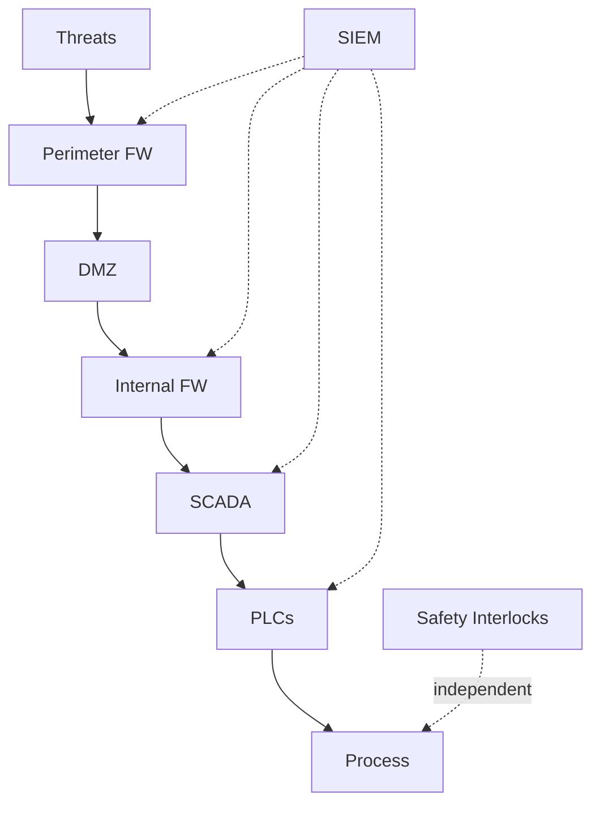

# Software Safety & Security Interview Generator

Generate 25-30 interview Q&A pairs testing risk-to-controls translation for safety-critical and security-critical systems.

## Requirements

**Scope**: Industrial control, medical devices, automotive, critical infrastructure
**Audience**: Engineers, operators, managers, regulators
**Format**: 150-300 words/answer with diagrams (Mermaid), configs (YAML), APA 7th citations [EN]/[ZH]
**Difficulty**: 20% Foundational, 40% Intermediate, 40% Advanced
**Coverage**: MECE across Safety, Security, Resilience, Governance × Prevent, Detect, Respond, Recover = 16 cells
**Traceability**: Requirements → Controls → Procedures → Evidence → Metrics
**Per Cluster**: ≥1 diagram, ≥1 scenario, ≥1 table, ≥1 metric

## Dimensions

| Dimension | Focus | Methods | Standards |
|-----------|-------|---------|-----------|
| **Safety** | Prevent unintended harm from faults/errors | FMEA, FTA, HAZOP; Fail-safe, redundancy; SIS, interlocks; SIL 1-4, ASIL A-D | IEC 61508/61511, ISO 26262, IEC 62304 |
| **Security** | Prevent malicious compromise | STRIDE, Attack Trees; SAST/DAST/SCA/Fuzz/Pentest/IaC; RBAC, encryption, IDS/IPS | ISO 27001, NIST CSF 2.0, ISO/SAE 21434, IEC 62443 |
| **Resilience** | Detect, respond, recover | SIEM, anomaly detection; Emergency playbooks; BCDR, RTO/RPO; MTTD, MTTR | NIST SP 800-61, ISO 22301 |
| **Governance** | Frameworks, audits, improvement | Risk management (ISO 31000); Audit trails, traceability; Training; Lessons learned | IEC 61508, ISO 26262, ISO 27001, FDA, NERC CIP, PCI DSS |

## Visuals & Metrics

| Analysis | Diagram (Mermaid) | Metrics (with formula, target) |
|----------|-------------------|--------------------------------|
| **Hazard** | Fault tree, Bow-tie (IEC 61025) | `Risk = P × I` (Critical >8); `MTBF = Uptime / Failures` (>10k hrs) |
| **Threat** | Attack tree, DFD (STRIDE) | `CVSS: Base × Temporal × Environmental` (Critical ≥9.0); Attack Surface |
| **Prevention** | Control hierarchy, Defense-in-depth | Control Effectiveness % (≥80%); `Detection Rate = TP/(TP+FN)` (≥95%) |
| **Detection** | Alert flow, State machine | `MTTD = Detection Time / Incidents` (≤5 min); False Positive Rate (≤2%) |
| **Response** | Incident workflow (NIST SP 800-61) | `MTTR = Restoration Time / Incidents` (<30 min); `RTO/RPO` targets |
| **Compliance** | Audit trail, Control mapping | Compliance % (100%); `Defect Escape = Post-Release / Total` (<5%) |
| **Testing** | Coverage map (OWASP ASVS) | `Test Coverage = Tests / Vectors` (≥80% code, 100% critical path) |

## Frameworks

| Framework | When to Use | Advantage | Disadvantage | Standards |
|-----------|-------------|-----------|--------------|-----------|
| **Defense-in-Depth** | Security-critical; compliance | No single point of failure; compensating controls | Complexity; performance impact | NIST CSF, ISO 27001 A.13 |
| **Fail-Safe** | Catastrophic consequences; can tolerate shutdown | Guarantees safety on failure; simple | Availability impact; unnecessary shutdowns | IEC 61508 SIL 3-4, IEC 61511 |
| **Zero-Trust** | High-value assets; distributed/cloud; insider threats | Limits blast radius; effective against lateral movement | Implementation complexity; user friction | NIST SP 800-207 |
| **Risk-Based** | Limited resources; diverse threats; cost-benefit needed | Efficient allocation; focuses on P×I priorities | Requires accurate assessment; may miss emerging threats | ISO 31000, NIST CSF |
| **Safety-Security Convergence** | Cyber-physical (ICS, medical, automotive) | Comprehensive protection; avoids conflicting controls | Cross-domain expertise needed; organizational silos | IEC 62443, ISO/SAE 21434 |

## Question Design

**Test risk-to-controls translation, not recall**

✅ Good: "How assess/mitigate undetected sensor failure in medical infusion pump? Show risk analysis and controls."  
❌ Poor: "What is FMEA?"

✅ Good: "Choose fail-safe, fail-operational, or redundant for autonomous braking. Justify with P×I analysis."  
❌ Poor: "List redundancy types."

**Match stakeholder context**: Engineers (implementation), Operators (monitoring), Managers (policy), Regulators (audit evidence)

**Each Q&A must include**:
- Risk-to-controls chain: Hazard/Threat → P×I → Control → Procedure → Metric
- ≥1 practical element: YAML config, monitoring script, incident playbook, or test procedure
- ≥1 citation [Ref: ID]
- Key insight: One-sentence summary of risk trade-off/control effectiveness/incident impact/regulatory requirement

## References & Quality

**Minimum for 25-30 Q&A** (scale by 1.5× if >30):
- **≥10 Glossary**: FMEA, FTA, HAZOP, STRIDE, CVSS, Defense-in-Depth, Fail-Safe, Redundancy, Zero-Trust, MTBF/MTTR/MTTD, SIL, CIA, Attack Surface, SAST/DAST/SCA/Fuzz/Pentest/IaC (with formulas, distinctions)
- **≥5 Tools**: BowTieXP, MS TMT, Splunk/ELK, Nessus/Qualys, PagerDuty, ZAP, Semgrep, Snyk, AFL++, Burp, Trivy (purpose, pricing, last update ≤18mo, integrations)
- **≥10 Literature**: IEC 61508/61511, ISO 26262/27001/31000/22301, ISO/SAE 21434, IEC 62443/62304, ISO 14971, NIST CSF 2.0/SP 800-61/82/115, OWASP ASVS, Leveson, Shostack, Stuxnet, breach analyses
- **≥20 Citations**: APA 7th [EN]/[ZH] (~60/30/10%); cite standards, metrics, frameworks, requirements

**Quality Gates** (all must PASS):
- Recency: ≥50% last 3yr (≥70% digital/cloud)
- Diversity: ≥3 source types, none >25%
- Evidence: ≥70% answers ≥1 cite, ≥30% ≥2 cites
- Cross-refs: 100% [Ref: ID] resolve
- Testing: Cover SAST, DAST, SCA, fuzz, pentest (+IaC/container for cloud)
- Links: 100% accessible or archived (DOI/Wayback)

---

## Workflow

1. **Plan Topics** (5-6 clusters): Safety Assurance, Security Assurance, Risk Assessment, Prevention/Control, Incident Response, Compliance. Allocate 4-6 Q&As per cluster. Distribute difficulty 20/40/40 (Foundational/Intermediate/Advanced). Validate MECE coverage across 4 dimensions × 4 lifecycle phases.

2. **Build References**: Create glossary (≥10), tools (≥5), literature (≥10), citations (≥20) BEFORE writing Q&As. Assign IDs: G#, T#, L#, A#. Verify unique IDs and completeness.

3. **Write Q&As**: Scenario-based questions testing risk-to-controls translation. Each answer 150-300 words with ≥1 [Ref: ID], risk chain (Hazard→P×I→Control→Procedure→Metric), practical element (YAML/script/playbook), key insight. Validate every 5 Q&As.

4. **Add Visuals**: Per cluster include ≥1 diagram (Mermaid: fault tree, attack tree, workflow), ≥1 table, ≥1 metric (formula+target), ≥1 scenario (YAML config/incident playbook). Match diagram type to analysis.

5. **Complete References**: Populate all sections with full details. Cross-check 100% [Ref: ID] resolve. Verify minimums, recency (≥50% last 3yr), diversity (≥3 types), language balance (~60/30/10 EN/ZH/other).

6. **Validate**: Execute quality gates. Verify 25-30 Q&As, difficulty 20/40/40, references complete, cross-refs resolve, testing methods covered (SAST/DAST/SCA/fuzz/pentest+IaC). Create validation table showing PASS on all gates.

7. **Review**: Final check for clarity (no jargon without definition), precision (specific not vague), MECE coverage, sufficient depth, concision (no fluff), credible sources, balanced perspectives, proper formatting, actionable guidance.

---

## Output Format

TOC linking to all sections. Use Mermaid diagrams, YAML configs, tables, formulas. Structure:

```markdown
## Contents
- Topic Areas (coverage overview)
- Q&A sections by topic cluster  
- References: Glossary, Tools, Literature, Citations

## Topic 1: [Name]
### Q1: [Question]
**Difficulty**: [F/I/A] | **Type**: [Safety/Security/Resilience/Governance]  
**Key Insight**: [One-sentence risk/control/incident/regulatory insight]

**Answer**: [150-300 words with [Ref: ID] citations, risk chain: Hazard→P×I→Control→Procedure→Metric]

**Practical**: [YAML config OR script OR playbook]
**Visual**: [Mermaid diagram if applicable]
**Table**: [Risk register OR evidence mapping OR metrics]

---

## Reference Templates

**Glossary**: **G#. Term**: Definition. Formula (if applicable). Related concepts. [EN/ZH]

**Tools**: **T#. ToolName** (Category): Purpose. Pricing. Last update. Integrations. URL. [EN/ZH]

**Literature**: **L#. Title. Details.** Description. Coverage area.

**Citations**: **A#. Author(s). (Year). *Title*. Publisher/Journal. DOI/URL [EN/ZH]**
```

## Example (SCADA Defense-in-Depth)

**Q: Implement defense-in-depth for SCADA controlling water treatment. Show control layers, monitoring, and metrics.**

**Difficulty**: Advanced | **Type**: Security Assurance, Prevention  
**Key Insight**: Tests layered security, safety-security convergence, requirement-to-control traceability with measurable effectiveness.

Defense-in-depth for critical infrastructure SCADA requires multiple control layers addressing cyber threats and safety hazards [Ref: A10]. Implementation spans network segmentation, access control, monitoring, and fail-safe mechanisms [Ref: L3, L6].

**Control Architecture**: (1) Network: air-gapped OT/IT, firewalls, DMZ for historian; (2) Host: hardened OS, application whitelisting, patching; (3) Application: RBAC, command authentication, audit logging; (4) Physical: facility access, PLC tamper detection; (5) Safety: independent SIL 2-rated interlocks for safe shutdown [Ref: A1].

**Monitoring**: SIEM correlates IT security events with OT alarms detecting unauthorized config changes, communication anomalies, failed auth. Baseline using statistical process control; alert on 3σ deviations [Ref: T3].

**Safety-Security Convergence**: Safety interlocks provide last defense—pressure relief valves open mechanically if SCADA commands exceed limits, independent of network [Ref: G7].



**Config Example**:
```yaml
zones:
  - {name: enterprise, trust: low}
  - {name: dmz, trust: medium}
  - {name: scada, trust: high}
policies:
  - {from: enterprise, to: dmz, services: [https], action: allow, log: true}
  - {from: dmz, to: scada, services: [modbus_ro], action: allow, auth: required}
  - {from: enterprise, to: scada, action: deny, alert: critical}
```

| Metric | Target | Rationale [Ref] |
|--------|--------|-----------------|
| Detection Rate: TP/(TP+FN) | ≥95% | Anomaly alerting [L5] |
| False Positive Rate | ≤2% | Prevent fatigue [T3] |
| MTTD | ≤5 min | Minimize exposure [G16] |
| MTTR | ≤30 min | RTO for service [A16] |
| Control Effectiveness | ≥99% | Validate layers [G6] |

**Validation**: Annual red team (phishing→lateral movement→PLC manipulation). Measure detection, containment, interlock activation. Document lessons [Ref: A7].

---
