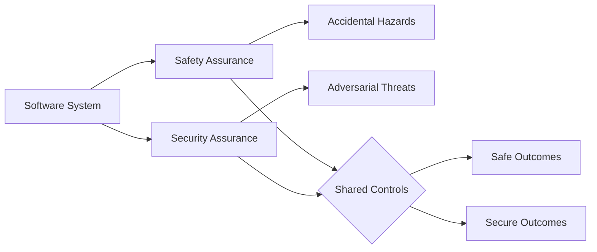
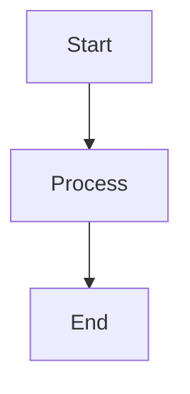

# Interview Q&A - Software Safety & Security

Generate interview question banks covering software safety and security for technical, operational, and management stakeholders.

**Constraints**: 25–30 Q&A pairs | 150–300 words/answer | 20/40/40 difficulty (F/I/A) | MECE coverage | APA 7th citations

---

# Part I: Requirements

## Core Specifications

### Scope

- **Count**: 25–30 Q&A pairs
- **Audience**: Engineers, operators, managers, regulators
- **Length**: 150–300 words/answer
- **Difficulty**: 20% Foundational, 40% Intermediate, 40% Advanced
- **Visuals/Cluster**: ≥1 diagram + ≥1 scenario + ≥1 table + ≥1 metric
- **Coverage**: Hazard/threat ID, risk assessment, controls, incident response, compliance

### Content Principles

- **MECE Structure**: 4 dimensions (Safety, Security, Resilience, Governance) × 4 phases (Prevent, Detect, Respond, Recover)
- **Analysis**: Hazard/threat ID → risk assessment → control effectiveness → incident mgmt → regulatory alignment
- **Stakeholders**: Technical (implementation), Operational (monitoring), Management (policy), Regulatory (audits)
- **Frameworks**: Compare approaches (Fail-Safe vs Fail-Operational, Zero-Trust vs Perimeter); cite trade-offs; specify context
- **Clarity**: Accessible language; distinguish mandatory vs best practices; trace requirements → controls → procedures

### Evaluation Dimensions

- **Safety**: FMEA, FTA, HAZOP, fail-safe, redundancy, fault tolerance, SIS, certification
- **Security**: STRIDE/PASTA, SAST/DAST/SCA, fuzz/pentest, API/IaC/container scan, access control, encryption, IDS, audits
- **Resilience**: Incident detection, emergency response, BCDR, monitoring, anomaly detection
- **Governance**: IEC 61508, ISO 26262/27001, risk frameworks, audit trails, documentation, training

### Quick Orientation — Safety vs Security

| Dimension | Safety | Security |
| --- | --- | --- |
| Goal | Prevent unintended harm | Prevent malicious compromise |
| Threats | Faults, human error, environment | Adversaries, insiders, exploits |
| Focus | Fail-safe, redundancy, hazards | CIA, access control, detection |
| Evaluation | FMEA, FTA, HAZOP | STRIDE, CVSS, testing (SAST/DAST/Fuzz/Pentest) |
| Outcomes | Safe states, SIL targets | Risk reduction, ISMS controls |



### Visual Element Standards

**Per Topic Cluster Requirements**: Primary diagram + example scenario + supporting table + quantitative metric

| Analysis Type | Diagram | Standard | Scenario + Metrics |
|---------------|---------|----------|--------------------|
| **Hazard** | Fault tree, Bow-tie | IEC 61025, ISO 31010 | Failure scenario + `Risk = P × S`, `MTBF` |
| **Threat** | Attack tree, DFD | STRIDE, PASTA | Attack path + `CVSS`, Attack Surface |
| **Prevention** | Control hierarchy | ISO 12100, NIST CSF | Control impl + Effectiveness % |
| **Detection** | State machine, Alert flow | SIEM | Logic + Detection %, `MTTD` |
| **Response** | Incident workflow | NIST SP 800-61, ISO 22301 | Procedure + `MTTR`, `RTO` |
| **Compliance** | Audit trail, Control map | ISO 27001, IEC 61508 | Evidence + Compliance % |
| **Security Testing** | Attack chain, Coverage map | NIST SP 800-115, OWASP ASVS | Test plan + Coverage %, Defect Escape % |

**Standards**: IEC 61508/61511 (functional safety), ISO 26262 (automotive), ISO/SAE 21434 (auto cyber), IEC 62304/ISO 14971 (medical), IEC 62443 (industrial), ISO 27001 (infosec), NIST CSF 2.0, ISO 31000 (risk), ISO 22301 (BCDR)

### Metrics

| Metric | Formula | Target/Notes |
|--------|---------|------------|
| Risk | `P × I` | Scale: 0–10 or qualitative |
| MTBF | `Operating Time / Failures` | Higher = better |
| MTTR | `Restoration Time / Incidents` | Includes diagnosis + repair + verify |
| MTTD | `Detection Time / Incidents` | Lower = faster detection |
| Detection Rate | `TP / Total × 100%` | ≥95% critical systems |
| False Positive | `False Alarms / Total × 100%` | ≤2% prevent fatigue |
| CVSS | `Base × Temporal × Environmental` | 0–10; Critical ≥9.0 |
| Availability | `Uptime / (Up + Down) × 100%` | 99.9% = 8.76h/yr down |
| Test Coverage | `Tests Run / Vectors × 100%` | Security completeness |
| Defect Escape | `Post-Release / Total × 100%` | Lower = better quality |

### Safety & Security Frameworks

- **Defense-in-Depth**: Layered controls → no single point of failure
- **Fail-Safe**: Safe state on failure → graceful degradation
- **Zero-Trust**: Never trust, always verify → least privilege
- **Swiss Cheese**: Multiple defenses → compensating controls
- **Risk-Based**: Prioritize by P × I → continuous assessment
- **Safety-Security Convergence**: Unified threat landscape → integrated response

### Visual Standards

**Diagrams**: Use Mermaid (GitHub-native). Syntax:


**Scenarios**: Include configs, procedures, code (YAML, scripts, playbooks) in fenced blocks:
```
safety_limits:
  temperature_max: 85
  shutdown_on_exceed: true
```

**Math**: Inline `$formula$` or block `$$formula$$`. Define variables first.

**Symbols**: ∑ (sum), ∏ (product), ∫ (integral), ∂ (rate), ≈ (approx), ≤/≥ (bounds), ≠, ∀

**Legends**: 💡 Analogy, 📐 Formula, 🔍 Example, ⚠️ Important, 💻 Code

**Avoid**: Single mega-diagram, BPMN for code flow, mixed abstraction levels, >120 nodes, missing rationale

### Diagram Patterns

Combine diagrams for comprehensive analysis:

| Need | Diagram | Scenario | Standard |
|------|---------|----------|----------|
| Hazard ID | Fault tree, FMEA table | Equipment failure cascade | IEC 61025, ISO 31010 |
| Threat model | Attack tree, DFD | Unauthorized access path | STRIDE, PASTA |
| Access control | Role hierarchy, Permission matrix | Auth/authz flow | RBAC, NIST SP 800-53 |
| Incident response | Workflow, Decision tree | Breach containment | NIST SP 800-61, ISO 22301 |
| Safety system | Logic diagram, State machine | Emergency shutdown | IEC 61511, ISA-84 |
| Security monitor | Alert flow, Dashboard | Intrusion detection | SIEM, SOC |
| Compliance | Control matrix, Audit trail | Evidence collection | ISO 27001, IEC 61508 |

### Safety & Security Decision Matrices

**Control Selection Matrix**

| Risk Context | Fail-Safe | Fail-Operational | Redundant | Zero-Trust |
|--------------|-----------|------------------|-----------|------------|
| Criticality | Safety-Critical | Mission-Critical | High-Avail | Security-Critical |
| Tolerance | Zero | Degradation | Continued Ops | Zero Unauth |
| Cost | High | Medium | Low | Medium |
| Recovery | Immediate | Minutes | Seconds | Immediate |
| Regulatory | IEC 61508 SIL 3-4 | ISO 26262 ASIL C-D | IEC 62443 SL 2-3 | ISO 27001 High |

**Risk Prioritization Matrix**

| System | Safety | Security | Availability | Cost | Compliance |
|--------|--------|----------|--------------|------|------------|
| Medical | Critical | Critical | High | Medium | FDA, IEC 62304 |
| Industrial Control | Critical | High | Critical | Medium | IEC 62443 |
| Autonomous Vehicle | Critical | Critical | Critical | Low | ISO 26262 |
| Financial | Medium | Critical | Critical | Medium | PCI DSS, SOX |
| Critical Infra | Critical | Critical | Critical | Low | NERC CIP, NIST |

### Citations

- **Format**: APA 7th with language tags [EN], [ZH]
- **Distribution**: ~60% EN, ~30% ZH, ~10% other
- **Types**: (1) Safety/security standards; (2) Risk methodologies; (3) Incident lessons; (4) Tools/frameworks
- **Inline**: Use [Ref: ID] after claims, standards, metrics, frameworks, statistics, requirements

### Reference Requirements

| Section | Minimum | Content |
|---------|---------|---------|
| Glossary | ≥10 | FMEA, FTA, HAZOP, STRIDE, CVSS, Defense-in-Depth, Fail-Safe, Redundancy, Zero-Trust, MTBF, MTTR, MTTD, SIL, CIA, Attack Surface, Threat Vector |
| Tools | ≥5 | BowTieXP/FMEA (risk), MS Threat Model (threat), Splunk/ELK (SIEM), Nessus/Qualys (vuln scan), PagerDuty/ServiceNow (incident) |
| Literature | ≥10 | IEC 61508/61511, ISO 26262/27001/31000, ISO/SAE 21434, IEC 62304/62443, ISO 14971, NIST CSF/SP 800-82/61/115, OWASP ASVS, incident analysis (Stuxnet, breaches), Shostack, Leveson + ZH sources |
| Citations | ≥20 | ~60% EN / ~30% ZH / ~10% other (APA 7th with tags); for international standards, EN-heavy acceptable |

**Exception**: If unmet, state shortfall + rationale + sourcing plan.

### Usage

1. Follow MECE; maintain 20/40/40 difficulty
2. Meet reference minimums; cover Safety/Security/Resilience/Governance
3. Per cluster: ≥1 diagram + ≥1 scenario + ≥1 table + ≥1 metric
4. Per topic: ≥2 standards/sources + ≥1 tool
5. Document gaps with remediation plan

### Quality Gates

- **Recency**: ≥50% last 3yr (≥70% for digital/cloud domains)
- **Diversity**: ≥3 source types; no single >25%
- **Evidence**: ≥70% answers ≥1 citation; ≥30% have ≥2
- **Tools**: Pricing, adoption, update ≤18mo, integrations
- **Links**: Validate access; use DOIs/archived URLs
- **Cross-refs**: All [Ref: ID] resolve
- **Security Testing**: Include SAST/DAST/SCA; fuzz/pentest; IaC/container scan for cloud

> Scale: For >30 Q&A, increase minimums ×1.5. Prioritize gates before raising floors.

### Validation

**Success Criteria**: All checks PASS before submission.

Execute validation (Part II). Fix failures; re-validate until all PASS.

---

# Part II: Workflow

## Generation Steps

### Step 1: Topic Planning
1. Identify 5-6 clusters: Safety | Security | Resilience | Governance | Prevention | Response
2. Allocate 4-6 Q&As/cluster (total 25-30); assign 20/40/40 difficulty
3. **Validate**: Total=25-30, ratio≈20/40/40

### Step 2: References
1. **Glossary (≥10)**: FMEA, FTA, HAZOP, STRIDE, CVSS, Defense-in-Depth, Fail-Safe, Redundancy, Zero-Trust, MTBF, MTTR, MTTD, SIL, CIA, Attack Surface, Threat Vector
2. **Tools (≥5)**: BowTieXP/FMEA, MS Threat Model, Splunk/ELK, Nessus/Qualys, PagerDuty/ServiceNow
3. **Literature (≥10)**: IEC 61508/61511, ISO 26262/27001/31000, ISO/SAE 21434, IEC 62304/62443, ISO 14971, NIST CSF/SP 800-82/61/115, OWASP ASVS, Shostack, Leveson + ZH sources
4. **Citations (≥20)**: Tag language, year, type; assign IDs (G#/T#/L#/A#)
5. **Validate**: Counts, ~60/30/10% language, ≥50% last 3yr, ≥3 types

### Step 3: Q&A Creation
1. Write scenario-based questions ("How would...", "When should..."); 150-300 words, accessible to all
2. Include ≥1 [Ref: ID]/answer; trace requirements → controls
3. Add practical scenarios (failures, attacks, responses, configs)
4. State concrete Key Insight (risk/control/incident/regulatory)
5. **Validate**: Every 5 Q&As check word count, citations, examples, tracing, judgment

### Step 4: Visuals
1. Per cluster: ≥4 elements (diagram + scenario + table + metric)
2. Use Mermaid; add captions/legends
3. Include configs (YAML, scripts, playbooks)
4. Apply frameworks (Defense-in-Depth, Fail-Safe, Zero-Trust) with examples
5. **Validate**: All clusters covered; visuals align with analysis type

### Step 5: References
1. Populate Glossary/Tools/Literature/APA
2. **Validate**: All [Ref: ID] resolve

### Step 6: Validation
Execute all quality gates. Fix failures; re-validate until PASS.

### Step 7: Review
Apply critique criteria. Submit when all PASS.

---

# Part III: Output Format

## Question Design

### Risk-to-Controls Framework

1. **Hazard/Threat ID**: Identify risks → assess P × I → prioritize
2. **Control Requirements**: Define goals → evaluate effectiveness → check compliance
3. **Control Design**: Prevention → detection → response
4. **Trace**: Requirements → deployed controls → procedures

### Quality Criteria

**Clarity**: Single unambiguous ask, accessible to all stakeholders
- ✅ "How would you assess and mitigate risk of undetected sensor failure in a medical infusion pump?"
- ❌ "Explain safety and security in medical devices"

**Signal**: Tests risk-to-controls translation, not trivia
- ✅ "Implement defense-in-depth for industrial control. Show layers and monitoring."
- ❌ "List defense-in-depth layers"

**Depth**: Enables risk/control/incident trade-off discussion
- ✅ "Choose: fail-safe, fail-operational, or redundant for autonomous braking. Justify with risk analysis."
- ❌ "Should you use redundancy? Yes/no"

**Realism**: Match stakeholder roles (Technical/Operational/Management/Regulatory)
- ✅ "SCADA had 10-min outage. How determine if safety incident, security breach, or benign?"
- ❌ "Design secure control system from scratch"

**Discriminative**: Tests judgment over recall
- ✅ "When choose fail-safe over fail-operational? Show real-world scenarios."
- ❌ "What is fail-safe design?"

### Success Factors

- **Risk awareness**: Hazard/threat ID, P × I assessment, regulatory requirements
- **Clear communication**: Accessible language, visuals, concrete scenarios
- **Implementation**: Trace requirements → controls, measure effectiveness, document lessons

---

## Output Format

Start the output with a TOC (e.g., '## Contents') linking to all top-level headings and list items.

- Use lists tables diagrams formulas code blocks; diagrams in Mermaid; code with language-tagged fences.

Use this structure when generating question banks:

```markdown
## Contents

- [Topic Areas](#topic-areas-questions-1-n)
- [Topic 1: [Topic title]](#topic-1-topic-title)
  - [Q1: [Question text]](#q1-question-text)
  - [Q2: [Question text]](#q2-question-text)
- [Topic 2: [Topic title]](#topic-2-topic-title)
  - [Q3: [Question text]](#q3-question-text)
- [Reference Sections](#reference-sections)
  - [Glossary, Terminology & Acronyms](#glossary-terminology--acronyms)
  - [Safety & Security Tools](#safety--security-tools)
  - [Authoritative Standards & Literature](#authoritative-standards--literature)
  - [APA Style Source Citations](#apa-style-source-citations)

---

## Topic Areas: Questions 1-N

Overview of coverage and difficulty distribution.

| Topic | Question Range | Count | Difficulty Mix |
|-------|---------------|-------|----------------|
| Safety Assurance (Hazard Analysis, Fail-Safe, Redundancy) | Q1-Q5 | 5 | 1F, 2I, 2A |
| Security Assurance (Threat Modeling, Security Testing, Access Control, Encryption) | Q6-Q10 | 5 | 1F, 2I, 2A |
| Risk Assessment & Management (FMEA, STRIDE, Quantification) | Q11-Q15 | 5 | 1F, 2I, 2A |
| Prevention & Control Measures (Defense-in-Depth, Detection) | Q16-Q20 | 5 | 1F, 2I, 2A |
| Incident Response & Recovery (Emergency Procedures, BCDR) | Q21-Q25 | 5 | 1F, 2I, 2A |
| Compliance & Governance (Standards, Audits, Documentation) | Q26-Q30 | 5 | 1F, 2I, 2A |
| **Total** | | **30** | **6F, 12I, 12A** |

**Legend**: F = Foundational, I = Intermediate, A = Advanced

---

## Topic 1: [Topic Title]

### Q1: [Question Text]

**Difficulty**: [Foundational/Intermediate/Advanced]  
**Type**: [Safety Assurance/Security Assurance/Risk Assessment/Prevention Measures/Incident Response/Compliance & Governance]

**Key Insight**: [One sentence stating specific risk trade-offs/control effectiveness/incident impact/regulatory requirements this question exposes]

**Answer**:

[150-300 word answer with inline [Ref: ID] citations accessible to all stakeholders, explicitly connecting safety/security requirements to control implementations]

**Practical Scenario**:
```
# Example configuration, procedure, or implementation
# Can be YAML config, monitoring script, incident playbook, etc.
```

**Supporting Artifacts** (Select 3+ matching analysis type):

| Artifact Type | Diagrams | Practical Scenarios | Metrics |
|---------------|----------|---------------------|----------|
| **Safety Assurance** | Fault tree, FMEA table, Bow-tie | Equipment failure scenarios, Safety interlock configs | `Risk = Likelihood × Severity`, `MTBF = Operating Time / Failures` |
| **Security Assurance** | Attack tree, Data flow, Defense-in-depth | Attack scenarios, Access control policies | `Attack Surface = Entry Points × Vulnerabilities`, `CVSS Score` |
| **Risk Assessment** | Risk matrix, Probability-Impact | Risk quantification, Control selection | `Risk Score = P × I`, `Residual Risk = Initial Risk - Control Effectiveness` |
| **Prevention Measures** | Control hierarchy, Monitoring flow | Prevention controls, Detection mechanisms | `Control Effectiveness = Prevented / Total × 100%`, `False Positive Rate` |
| **Compliance** | Audit trail, Control mapping | Evidence documentation, Training records | `Compliance Rate = Controls Met / Total × 100%`, `Audit Findings` |
| **Security Testing** | Attack chain, Test coverage map | Pentest/fuzz runs, API test cases | `Coverage = Tests Run / Identified Vectors × 100%`, `Defect Escape Rate` |

### Template Stubs (use when needed)

**Incident Playbook (YAML)**
```
incident_playbook:
  id: PLAY-001
  scope: [safety, security]
  triggers: [alarm_high_pressure, failed_auth_n_times]
  roles:
    - incident_commander
    - safety_officer
    - sec_ops_lead
  steps:
    - detect: "SIEM alert or safety alarm"
    - contain: "isolate segment; engage interlocks"
    - eradicate: "patch; rollback configs"
    - recover: "restore services within RTO"
  comms:
    channels: [phone, pager, chat]
    stakeholders: [ops, management, regulator]
  metrics:
    mttd_target_min: 5
    mttr_target_min: 30
  severity_matrix:
    critical:
      escalation: "immediate (≤5min)"
      mttd_target: 5
      mttr_target: 30
      stakeholders: [ciso, ceo, regulator]
    high:
      escalation: "within 15min"
      mttd_target: 15
      mttr_target: 60
      stakeholders: [security_lead, ops_manager]
    medium:
      escalation: "within 1hour"
      mttd_target: 30
      mttr_target: 120
      stakeholders: [team_lead, ops]
    low:
      escalation: "next business day"
      mttd_target: 60
      mttr_target: 240
      stakeholders: [oncall_engineer]
  response_procedures:
    detect: "siem_alert + threat_intel + validation"
    contain: "isolate_segments + preserve_evidence + block_indicators"
    eradicate: "patch_vulnerabilities + rollback_configs + purge_compromise"
    recover: "restore_from_backup + verify_integrity + monitor_anomalies"
  communications:
    channels: [phone, pager, chat, email]
    templates: [initial_alert, status_update, resolution_report]
  post_incident:
    lessons_learned: true
    threat_model_update: true
    control_improvement: true
```

**Risk Register (Table)**
| ID | Hazard/Threat | P (0-1) | I (1-5) | Risk (P×I) | Control | Owner | Due |
|----|----------------|---------|---------|------------|---------|-------|-----|
| R-01 | Sensor spoofing | 0.2 | 4 | 0.8 | Authenticated telemetry + anomaly detection | SecOps | 2025-01-31 |

**Assurance Evidence Mapping (Table)**
| Requirement | Control | Evidence | Metric |
|-------------|---------|---------|--------|
| Prevent overpressure | Safety interlock SIL2 | Interlock test report, change log | `MTTR`, `Incidents Prevented` |
| Protect command channel | mTLS + RBAC | Cert inventory, access reviews | `Failed Auth Rate`, `CVSS` |
| Restore within 30 min | BCDR runbook | Drill report, timestamps | `MTTR ≤ 30 min`, `RTO` |
| Detect anomalies within 5 min | SIEM + baseline monitoring | Alert logs, correlation rules | `MTTD ≤ 5 min`, `Detection Rate ≥ 95%` |

---

## Reference Sections

### Glossary, Terminology & Acronyms

**G1. FMEA (Failure Mode and Effects Analysis)**
Systematic method to identify potential failure modes, their causes, and effects on system performance. Prioritizes risks by RPN (Risk Priority Number = Severity × Occurrence × Detection). Related: FMECA [EN]

**G2. FTA (Fault Tree Analysis)**
Top-down deductive analysis using Boolean logic gates to identify root causes of hazardous events. Quantifies probability of top event. Related: Event Tree Analysis [EN]

**G3. HAZOP (Hazard and Operability Study)**
Structured brainstorming technique using guide words (No, More, Less, Reverse) to identify deviations from design intent in process systems. Related: HAZID [EN]

**G4. STRIDE (Threat Modeling)**
Mnemonic for threat categories: Spoofing, Tampering, Repudiation, Information Disclosure, Denial of Service, Elevation of Privilege. Microsoft framework for systematic threat identification. [EN]

**G5. CVSS (Common Vulnerability Scoring System)**
Standardized method to assess vulnerability severity. Score 0-10 based on exploitability, impact, and temporal/environmental factors. Used for prioritizing patches. [EN]

**G6. Defense-in-Depth**
Layered security strategy deploying multiple controls at different levels (network, host, application, data) so failure of one layer doesn't compromise entire system. Related: Swiss Cheese Model [EN]

**G7. Fail-Safe Design**
System enters predefined safe state when failure occurs. Examples: deadman switch, spring-return valves. Contrasts with fail-operational. Related: Intrinsic Safety [EN]

**G8. Redundancy**
Duplication of critical components to maintain function when primary fails. Types: active (hot standby), passive (cold standby), diverse (different technologies). Related: N+1, 2oo3 voting [EN]

**G9. Zero-Trust Architecture**
Security model: never trust, always verify. Enforces least privilege, micro-segmentation, continuous authentication regardless of network location. Related: BeyondCorp [EN]

**G10. MTBF (Mean Time Between Failures)**
Average operating time between failures for repairable systems. Formula: `MTBF = Total Operating Time / Number of Failures`. Higher MTBF indicates better reliability. Related: Availability, Reliability, SIL. [EN]

**G11. MTTR (Mean Time To Repair/Recovery)**
Average time to restore service after failure. Formula: `MTTR = Total Restoration Time / Number of Incidents`. Includes diagnosis, repair, and verification. Lower MTTR indicates better maintainability. Related: MTTF, MTTD, RTO. [EN]

**G12. SIL (Safety Integrity Level)**
IEC 61508/61511 discrete level (1-4) for specifying safety system reliability. Determines required risk reduction and control measures based on hazard severity.

| Level | PFD (Probability of Failure on Demand) | RRF (Risk Reduction Factor) | Usage Examples |
|-------|---------------------------------------|---------------------------|----------------|
| SIL 4 | 10⁻⁵ to 10⁻⁴ | 100,000-10,000 | Nuclear protection, commercial aviation |
| SIL 3 | 10⁻⁴ to 10⁻³ | 10,000-1,000 | Chemical plants, railway signaling |
| SIL 2 | 10⁻³ to 10⁻² | 1,000-100 | Process industry, heavy machinery |
| SIL 1 | 10⁻² to 10⁻¹ | 100-10 | Basic industrial protection |

Related: ASIL (automotive), PL (machinery), Hardware/Software fault tolerance requirements. [EN]

**G13. CIA Triad**
Foundational security principles: Confidentiality (prevent unauthorized disclosure), Integrity (prevent unauthorized modification), Availability (ensure authorized access). Related: Parkerian Hexad [EN]

**G14. Attack Surface**
Sum of entry points (network ports, APIs, user inputs) where unauthorized user can attempt to access or extract data. Reduction minimizes security risk. Related: Threat Vector [EN]

**G15. Threat Vector**
Path or means by which attacker gains unauthorized access. Examples: phishing (social), SQL injection (code), physical access (facilities). Related: Attack Chain [EN]

**G16. MTTD (Mean Time To Detect)**
Average time to detect incidents from occurrence. Formula: `MTTD = Total Detection Time / Number of Incidents`. Lower MTTD reduces exposure window; pairs with MTTR for comprehensive response assessment. Related: Detection Rate, MTTR, Security Monitoring. [EN]

**G17. SAST (Static Application Security Testing)**
Analyzes source/byte code without execution to find vulnerabilities early (shift‑left). Complements DAST. [EN]

**G18. DAST (Dynamic Application Security Testing)**
Tests running applications externally to find exploitable issues (black‑box/gray‑box). [EN]

**G19. SCA (Software Composition Analysis)**
Identifies vulnerabilities and licenses in dependencies; produces SBOM; monitors CVEs. [EN]

**G20. Fuzz Testing**
Automated generation of malformed/random inputs to trigger crashes or unexpected states. [EN]

**G21. Penetration Testing**
Controlled adversarial testing to exploit weaknesses and validate real‑world impact. [EN]

**G22. IaC & Container Scanning**
Scans Infrastructure‑as‑Code and container images for misconfigurations and known vulnerabilities. [EN]

**G23. API Security Testing**
Validates API endpoints against OWASP API Top 10; auth, rate‑limit, input handling. [EN]

---

### Safety & Security Tools

**T1. BowTieXP** (Risk Assessment)
Visualization tool for bow-tie diagrams connecting hazards, threats, top events, consequences, and barriers. Integrates with HAZOP, LOPA. Commercial. https://www.cgerisk.com/bowtiexp [EN]

**T2. Microsoft Threat Modeling Tool** (Threat Analysis)
Free STRIDE-based tool for identifying security threats in software design. Auto-generates threat lists from DFDs. https://aka.ms/threatmodelingtool [EN]

**T3. Splunk / ELK Stack** (SIEM - Security Information and Event Management)
Real-time log aggregation, correlation, alerting for security incidents. Splunk (commercial), ELK (open source: Elasticsearch, Logstash, Kibana). [EN]

**T4. Nessus / Qualys** (Vulnerability Scanning)
Automated network scanners detecting misconfigurations, missing patches, known vulnerabilities. Nessus (Tenable), Qualys (cloud-based). Generate CVSS scores. [EN]

**T5. PagerDuty / ServiceNow** (Incident Management)
Incident response platforms for alerting, escalation, collaboration, and post-mortem tracking. Integrates with monitoring tools (Prometheus, Datadog). [EN]

**T6. OWASP ZAP** (DAST)
Open-source web/app DAST scanner for automated and manual testing. https://www.zaproxy.org/ [EN]

**T7. Semgrep** (SAST)
Lightweight static analysis with rule packs for common vulns; CI integration. https://semgrep.dev/ [EN]

**T8. Snyk / OWASP Dependency-Check** (SCA/SBOM)
Dependency vulnerability and license scanning; SBOM generation. https://snyk.io/ • https://owasp.org/www-project-dependency-check/ [EN]

**T9. AFL++ / libFuzzer** (Fuzzing)
Modern fuzzers for native code; coverage‑guided testing. https://github.com/AFLplusplus/AFLplusplus • https://llvm.org/docs/LibFuzzer.html [EN]

**T10. Burp Suite** (Web/API testing)
Intercepting proxy for manual/automated testing, including APIs. https://portswigger.net/burp [EN]

**T11. Trivy** (Container & IaC scanning)
Scans container images, SBOMs, and IaC for CVEs/misconfigurations. https://aquasecurity.github.io/trivy/ [EN]

---

### Authoritative Standards & Literature

**L1. IEC 61508:2010 & IEC 61511:2016. *Functional Safety of E/E/PE Systems & Safety Instrumented Systems for Process Industry*.**  
IEC 61508: International standard defining SIL levels and safety lifecycle across industries. IEC 61511: Process industry application with HAZOP integration, SIS design, and operations. Basis for domain-specific standards (ISO 26262, IEC 62443).

**L2. ISO 26262:2018. *Road Vehicles - Functional Safety*.**  
Automotive adaptation of IEC 61508 defining ASIL (Automotive Safety Integrity Levels A-D), V-model development, and safety case requirements for vehicles.

**L3. NIST Cybersecurity Framework (CSF) 2.0. (2024).**  
Updated framework for managing cybersecurity risk: Govern, Identify, Protect, Detect, Respond, Recover. Widely adopted across critical infrastructure sectors. https://www.nist.gov/cyberframework

**L4. ISO/IEC 27001:2022. *Information Security Management Systems - Requirements*.**  
International standard for establishing, implementing, maintaining, and improving an ISMS. Includes Annex A controls covering organizational, technical, and physical security.

**L5. NIST SP 800-61 Rev. 2. (2012). *Computer Security Incident Handling Guide*.**  
Incident response lifecycle: Preparation, Detection & Analysis, Containment/Eradication/Recovery, Post-Incident Activity. Reference for SOC operations.

**L6. Leveson, N. G. (2011). *Engineering a Safer World: Systems Thinking Applied to Safety*. MIT Press.**  
STAMP (Systems-Theoretic Accident Model and Processes) framework for analyzing complex socio-technical system accidents. Alternative to traditional chain-of-events models.

**L7. ISO/SAE 21434:2021. *Road vehicles — Cybersecurity engineering*.**  
Automotive cybersecurity engineering across lifecycle: risk assessment, cybersecurity goals, and assurance activities integrated with safety.

**L8. IEC 62304:2006+A1:2015. *Medical device software — Software life cycle processes*.**  
Processes for development and maintenance of medical device software; integrates risk management (ISO 14971) and traceability.

**L9. NIST SP 800-82 Rev. 2. (2015). *Guide to Industrial Control Systems (ICS) Security*.**  
Security architecture and controls for ICS/SCADA, including segmentation, whitelisting, and monitoring in OT environments.

**L10. ISO 14971:2019. *Medical devices — Application of risk management to medical devices*.**  
Framework for identifying hazards, estimating and evaluating risks, controlling risks, and monitoring post‑production information.

**L11. NIST SP 800-115. (2008). *Technical Guide to Information Security Testing and Assessment*.**
Comprehensive methodology for security testing including penetration testing, vulnerability assessment, and security assessment planning.

**L12. OWASP ASVS 4.0. (2019). *Application Security Verification Standard*.**
Framework for testing application security controls and providing developers with security requirements list.

**L13. Langner, R. (2011). *Stuxnet: Dissecting a cyberweapon*. IEEE Security & Privacy, 9(3), 49-51.**
Technical analysis of the first known cyberweapon targeting industrial control systems; lessons for ICS security.

**L14. Krebs, B. (2014). *Krebs on Security: In-depth security news and investigation*.**
Comprehensive coverage of major data breaches including Target, Equifax; attack patterns and defensive lessons.

**L15. CISA. (2021). *Colonial Pipeline cybersecurity incident: Lessons learned*.**
Official analysis of ransomware attack on critical infrastructure; emergency response and recovery insights.

**L16. Mandiant. (2021). *Highly Evasive Attacker Leverages SolarWinds Supply Chain*.**
Analysis of supply chain compromise via software updates; nation-state APT tactics and detection strategies.

---

### APA Style Source Citations

**A1. International Electrotechnical Commission. (2010). *IEC 61508: Functional safety of electrical/electronic/programmable electronic safety-related systems* (2nd ed.). IEC. [EN]**

**A2. International Organization for Standardization. (2018). *ISO 26262: Road vehicles - Functional safety* (2nd ed.). ISO. [EN]**

**A3. National Institute of Standards and Technology. (2024). *Cybersecurity Framework (CSF) 2.0*. NIST. https://www.nist.gov/cyberframework [EN]**

**A4. International Organization for Standardization. (2022). *ISO/IEC 27001: Information security, cybersecurity and privacy protection - Information security management systems - Requirements*. ISO/IEC. [EN]**

**A5. Cichonski, P., Millar, T., Grance, T., & Scarfone, K. (2012). *Computer security incident handling guide* (NIST SP 800-61 Rev. 2). NIST. https://doi.org/10.6028/NIST.SP.800-61r2 [EN]**

**A6. Leveson, N. G. (2011). *Engineering a safer world: Systems thinking applied to safety*. MIT Press. [EN]**

**A7. Shostack, A. (2014). *Threat modeling: Designing for security*. Wiley. [EN]**

**A8. 张东明, & 李明. (2020). *功能安全技术及应用*. 机械工业出版社. [ZH]**
(Zhang, D., & Li, M. (2020). *Functional safety technology and applications*. China Machine Press.)

**A9. International Organization for Standardization. (2018). *ISO 31000: Risk management - Guidelines* (2nd ed.). ISO. [EN]**

**A10. International Electrotechnical Commission. (2016). *IEC 62443: Industrial communication networks - Network and system security*. IEC. [EN]**

**A11. Hopkin, P. (2018). *Fundamentals of risk management: Understanding, evaluating and implementing effective risk management* (5th ed.). Kogan Page. [EN]**

**A12. 王志刚, & 刘康. (2019). *信息安全技术*. 清华大学出版社. [ZH]**
(Wang, Z., & Liu, K. (2019). *Information security technology*. Tsinghua University Press.)

**A13. Freund, J., & Jones, J. (2014). *Measuring and managing information risk: A FAIR approach*. Butterworth-Heinemann. [EN]**

**A14. Center for Chemical Process Safety. (2008). *Guidelines for hazard evaluation procedures* (3rd ed.). Wiley. [EN]**

**A15. National Institute of Standards and Technology. (2020). *Security and privacy controls for information systems and organizations* (NIST SP 800-53 Rev. 5). NIST. https://doi.org/10.6028/NIST.SP.800-53r5 [EN]**

**A16. International Organization for Standardization. (2019). *ISO 22301: Security and resilience - Business continuity management systems - Requirements*. ISO. [EN]**

**A17. International Organization for Standardization & Society of Automotive Engineers. (2021). *ISO/SAE 21434: Road vehicles — Cybersecurity engineering*. ISO/SAE. [EN]**

**A18. International Electrotechnical Commission. (2006, amended 2015). *IEC 62304: Medical device software — Software life cycle processes*. IEC. [EN]**

**A19. Stouffer, K., Pillitteri, V., Lightman, S., Abrams, M., & Hahn, A. (2015). *Guide to Industrial Control Systems (ICS) Security* (NIST SP 800‑82 Rev. 2). NIST. [EN]**

**A20. International Organization for Standardization. (2019). *ISO 14971: Medical devices — Application of risk management to medical devices*. ISO. [EN]**

**A21. Scarfone, K., Souppaya, M., Cody, A., & Orebaugh, A. (2008). *Technical guide to information security testing and assessment* (NIST SP 800-115). NIST. https://doi.org/10.6028/NIST.SP.800-115 [EN]**

**A22. OWASP Foundation. (2019). *Application Security Verification Standard (ASVS) 4.0*. OWASP. https://owasp.org/www-project-application-security-verification-standard/ [EN]**

**A23. Langner, R. (2011). Stuxnet: Dissecting a cyberweapon. *IEEE Security & Privacy*, 9(3), 49-51. https://doi.org/10.1109/MSP.2011.67 [EN]**

**A24. Krebs, B. (2014). *Krebs on Security: In-depth security news and investigation*. https://krebsonsecurity.com/ [EN]**

**A25. Cybersecurity and Infrastructure Security Agency. (2021). *Colonial Pipeline cybersecurity incident analysis*. CISA. https://www.cisa.gov/colonial-pipeline-cyber-incident [EN]**

**A26. Mandiant. (2021). *Highly evasive attacker leverages SolarWinds supply chain to compromise multiple global victims with SUNBURST backdoor*. Mandiant. https://www.mandiant.com/resources/blog/evasive-attacker-leverages-solarwinds-supply-chain-compromises-with-sunburst-backdoor [EN]**

---

## Validation Report

Execute full validation (Part I). Present results in table format upon completion. All checks must show PASS before submission.

---

## Example Question

Demonstrates the risk-to-controls framework: Hazard/Threat Identification → Risk Assessment → Control Implementation → Metrics.

### Q1: How would you implement defense-in-depth for a SCADA system controlling a water treatment plant? Show the control layers, monitoring approach, and key risk metrics.

**Difficulty**: Advanced  
**Type**: Security Assurance, Prevention Measures

**Key Insight**: Tests ability to apply layered security controls, reason about safety-security convergence, and connect requirements to deployed controls with measurable effectiveness.

**Answer**:

Defense-in-depth for critical infrastructure SCADA requires multiple control layers addressing both cyber threats and safety hazards [Ref: A10]. Implementation spans network segmentation, access control, monitoring, and fail-safe mechanisms [Ref: L3, L6].

**Control Architecture**: (1) Network layer: air-gapped OT/IT networks, firewalls with deny-by-default rules, DMZ for historian access; (2) Host layer: hardened OS, application whitelisting, patch management; (3) Application layer: role-based access control (RBAC), command authentication, audit logging; (4) Physical layer: facility access control, tamper detection on PLCs; (5) Safety layer: independent SIL 2-rated interlocks ensuring safe shutdown on anomaly detection [Ref: A1].

**Monitoring Strategy**: Deploy SIEM correlating IT security events with OT process alarms to detect indicators of compromise (e.g., unauthorized configuration changes, communication pattern anomalies, failed authentication attempts). Baseline normal operations using statistical process control; alert on deviations exceeding 3σ thresholds [Ref: T3].

**Safety-Security Convergence**: Safety interlocks provide last line of defense if security controls fail—e.g., pressure relief valves open mechanically if SCADA commands exceed safe limits, independent of network integrity [Ref: G7].

```
flowchart TD
    EXT[External Threats] --> FW1[Perimeter Firewall]
    FW1 --> DMZ[DMZ: Historian/HMI]
    DMZ --> FW2[Internal Firewall]
    FW2 --> SCADA[SCADA Server]
    SCADA --> PLC[PLCs/RTUs]
    PLC --> PROC[Physical Process]
    
    SIEM[SIEM Monitoring] -.-> FW1
    SIEM -.-> FW2
    SIEM -.-> SCADA
    SIEM -.-> PLC
    
    SAFETY[Safety Interlocks] -.-> PROC
    SAFETY -.independent.-> PLC
```

**Implementation Example** (Network Segmentation Config):
```
# Firewall rule template (simplified)
zones:
  - name: enterprise
    trust_level: low
  - name: dmz
    trust_level: medium
  - name: scada
    trust_level: high
    
policies:
  - from: enterprise
    to: dmz
    services: [https]
    action: allow
    log: true
    
  - from: dmz
    to: scada
    services: [modbus_read_only]
    action: allow
    authentication: required
    log: true
    
  - from: enterprise
    to: scada
    action: deny  # Air gap: no direct access
    alert: critical
```

| Metric | Formula | Target | Rationale |
|--------|---------|--------|------------|
| Detection Rate | `True Positives / Total Incidents × 100%` | ≥ 95% | Ensures anomalies trigger alerts [Ref: L5] |
| False Positive Rate | `False Alarms / Total Alerts × 100%` | ≤ 2% | Prevents alert fatigue [Ref: T3] |
| MTTD (Mean Time To Detect) | Time from incident start to alert | ≤ 5 min | Minimizes exposure window [Ref: G16] |
| MTTR (Mean Time To Recover) | Time from detection to restoration | ≤ 30 min | Meets RTO for water service continuity [Ref: A16] |
| Control Effectiveness | `Prevented Attacks / Total Attempts × 100%` | ≥ 99% | Validates defense layers [Ref: G6] |

**Validation**: Conduct annual red team exercises simulating APT scenarios (e.g., spear phishing → lateral movement → PLC manipulation). Measure time-to-detect, time-to-contain, and safety interlock activation. Document lessons learned and update threat model [Ref: A7].

---
