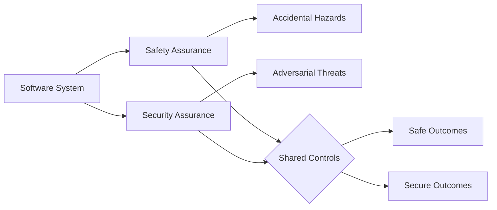
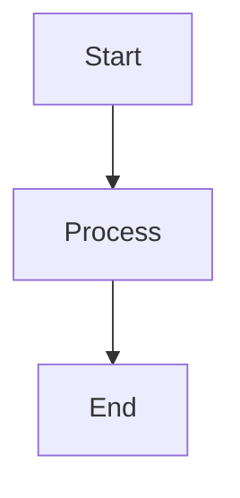
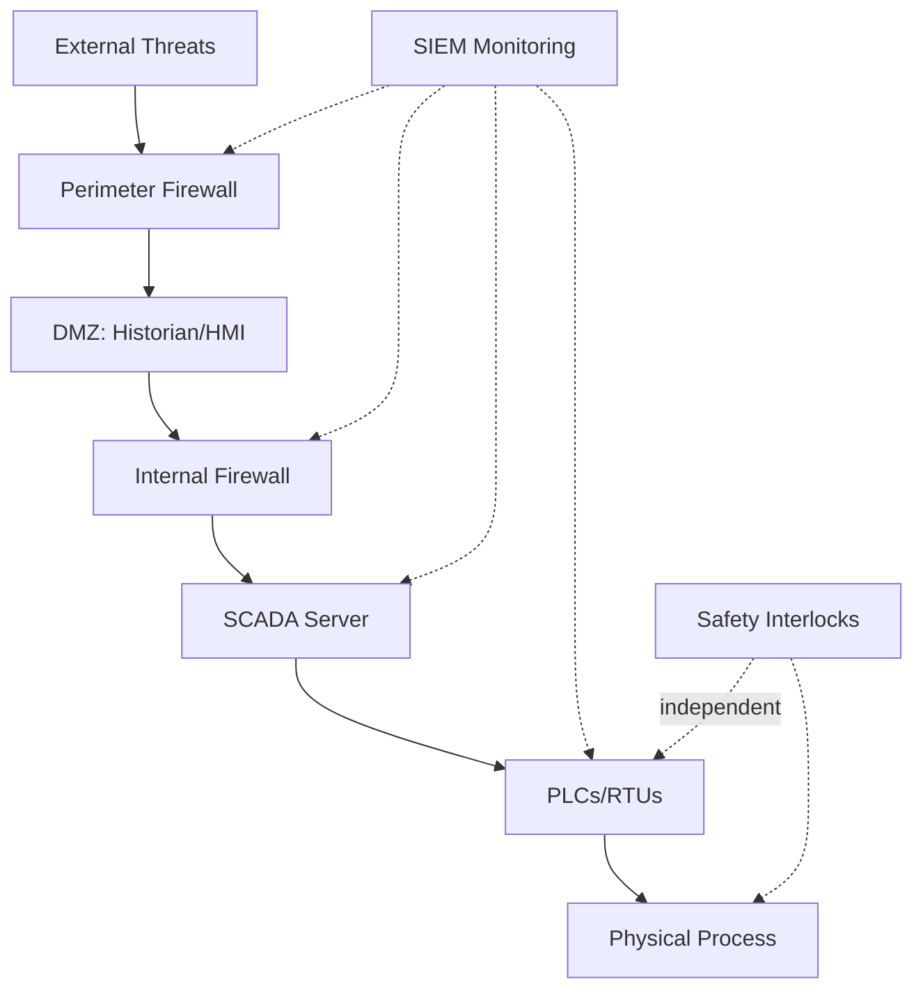

# Interview Q&A - Software Safety & Security for Comprehensive Understanding

Framework for generating high-quality interview question banks focused on software safety and security across all stakeholder perspectives—from technical implementation to operational governance.

---

# Part I: Specifications

Define quality requirements, standards, and constraints.

## Specifications

### Scope and Structure

- **Scope**: 25–30 Q&A pairs for cross-functional stakeholders (engineers, operators, managers, regulators)
- **Answer Length**: 150–300 words covering safety hazards, security threats, prevention measures, emergency response, compliance requirements
- **Difficulty Distribution**: Maintain 20/40/40 balance (Foundational/Intermediate/Advanced)
- **Visual Requirements**: ≥1 primary diagram + ≥1 example scenario + ≥1 supporting table + ≥1 quantitative metric per topic cluster
- **Analysis Depth**: Hazard/threat identification, risk assessment, control measures, incident response, regulatory compliance

### Content Principles

- **MECE Coverage**: Four dimensions (Safety Assurance, Security Assurance, Operational Resilience, Compliance & Governance) × Four perspectives (Prevention, Detection, Response, Recovery)
- **Analysis Required**: Hazard/threat identification, risk assessment methodology, control effectiveness, incident management, regulatory alignment, safety-security convergence analysis
- **Multi-Stakeholder**: Technical (implementation, testing), Operational (monitoring, response), Management (policy, resources), Regulatory (standards, audits)
- **Framework Handling**: Present competing approaches (Fail-Safe vs Fail-Operational, Zero-Trust vs Perimeter Defense, Proactive vs Reactive Monitoring); cite trade-offs; acknowledge context (criticality, threat landscape, regulatory environment)
- **Stakeholder Clarity**: Use accessible language for non-technical audiences; distinguish mandatory standards vs best practices; connect requirements to implementation and operational procedures

### Evaluation Dimensions

- **Safety Assurance**: Hazard analysis (FMEA, FTA, HAZOP), fail-safe design, redundancy, fault tolerance, safety instrumented systems, safety certification
- **Security Assurance**: Threat modeling (STRIDE, PASTA), vulnerability assessment, access control, encryption, intrusion detection, security audits
- **Operational Resilience**: Incident detection, emergency response procedures, business continuity, disaster recovery, system monitoring, anomaly detection
- **Compliance & Governance**: Regulatory standards (IEC 61508, ISO 26262, ISO 27001), risk management frameworks, audit trails, documentation, training programs

### Quick Orientation — Safety vs Security

| Dimension | Safety | Security |
| --- | --- | --- |
| Goal | Prevent unintended harm | Prevent malicious compromise |
| Threats | Faults, human error, environment | Adversaries, insiders, exploits |
| Focus | Fail-safe, redundancy, hazards | CIA, access control, detection |
| Evaluation | FMEA, FTA, HAZOP | STRIDE, CVSS, testing (SAST/DAST) |
| Outcomes | Safe states, SIL targets | Risk reduction, ISMS controls |



### Visual Element Standards

**Per Topic Cluster Requirements**: Primary diagram + example scenario + supporting table + quantitative metric

#### Diagram Selection by Analysis Type

| Analysis Type | Primary Diagram | Standard | Example Scenario + Metrics |
|---------------|-----------------|----------|----------------------------|
| **Hazard Analysis** | Fault tree, Bow-tie diagram | IEC 61025, ISO 31010 | Failure scenario + `Risk = Likelihood × Severity`, `MTBF = Operating Time / Failures` |
| **Threat Modeling** | Attack tree, Data flow diagram | STRIDE, PASTA | Attack scenario + `Attack Surface = Entry Points × Vulnerabilities`, `CVSS Score` |
| **Prevention Measures** | Control hierarchy, Defense-in-depth | ISO 12100, NIST CSF | Control implementation + `Control Effectiveness = Incidents Prevented / Total Threats × 100%` |
| **Detection & Monitoring** | State machine, Alert flow | Custom, SIEM | Monitoring logic + `Detection Rate = True Positives / Total Incidents × 100%`, `MTTD = Time to Detection` |
| **Incident Response** | Incident workflow, Recovery process | NIST SP 800-61, ISO 22301 | Response procedure + `MTTR = Time to Recovery`, `RTO = Recovery Time Objective` |
| **Compliance** | Audit trail, Control mapping | ISO 27001, IEC 61508 | Evidence documentation + `Compliance Rate = Controls Met / Total Controls × 100%` |

**Standards Reference**: IEC 61508 (functional safety), IEC 61511 (process industry safety), ISO 26262 (automotive safety), ISO/SAE 21434 (automotive cybersecurity), IEC 62443 (industrial security), ISO 27001 (information security), NIST CSF (cybersecurity framework), ISO 31000 (risk management), ISO 22301 (business continuity)

#### Metrics Quick Reference

| Metric | Formula |
|--------|---------|
| Risk Score | `Risk = Likelihood × Severity` |
| MTBF | `MTBF = Operating Time / Failures` |
| MTTR | `MTTR = Recovery Time / Incidents` |
| MTTD | `MTTD = Detection Time / Incidents` |
| Detection Rate | `True Positives / Total Incidents × 100%` |
| False Positive Rate | `False Alarms / Total Alerts × 100%` |
| CVSS | `0–10` (Base × Temporal × Environmental) |
| Availability | `Uptime / Total × 100%` |

#### Safety & Security Frameworks (Apply Relevant Combination)

- **Defense-in-Depth**: Layered controls → multiple protection barriers → no single point of failure
- **Fail-Safe Design**: Safe state on failure → hazard elimination → graceful degradation
- **Zero-Trust Architecture**: Never trust, always verify → least privilege → continuous validation
- **Swiss Cheese Model**: Multiple defenses → redundancy → compensating controls
- **Risk-Based Approach**: Prioritize by severity × likelihood → resource optimization → continuous assessment
- **Safety-Security Convergence**: Unified threat landscape → coordinated governance → integrated response

#### Visual Quality Standards

**Rendering**: Use Mermaid (GitHub-native); avoid external renderers. Syntax example:


**Implementation Examples**: Include practical scenarios with configuration, procedures, or code where applicable (YAML configs, monitoring scripts, incident playbooks). Use fenced code blocks:
```yaml
# Safety interlock configuration
safety_limits:
  temperature_max: 85
  pressure_max: 150
  shutdown_on_exceed: true
```

**Math**: Inline `$formula$` or block `$$formula$$`. Define variables on first use.

**Common Math Symbols**: `∑` (sum), `∏` (product), `∫` (integral), `∂` (rate), `≈` (approx), `≤/≥` (bounds), `≠` (not equal), `∀` (for all)

**Legends**: Use consistent symbols for clarity: 💡 Analogy, 📐 Formula, 🔍 Example, ⚠️ Important Note, 💻 Code

**Anti-patterns**: Avoid single mega-diagram, BPMN for code flow, mixed abstraction levels, >120 nodes, missing rationale

**Combination Patterns**: For comprehensive analysis, combine multiple diagram types:
- **Full Documentation**: Risk Identification (Hazard/Threat) → Control Architecture → Monitoring & Response → Compliance Evidence
- **Process Operations**: BPMN Process → Incident Workflow → Control Mapping → Audit Trail
- **Enterprise Governance**: Risk Appetite → Current Posture → Target Posture → Assurance Roadmap

**Quick Reference – Diagram & Scenario Guide**
| Need | Recommended Diagram(s) | Example Scenario | Standard |
|------|------------------------|------------------|----------|
| Hazard identification | Fault tree, FMEA table | Equipment failure cascade | IEC 61025, ISO 31010 |
| Threat modeling | Attack tree, DFD | Unauthorized access path | STRIDE, PASTA |
| Access control | Role hierarchy, Permission matrix | Authentication/authorization flow | RBAC, NIST SP 800-53 |
| Incident response | Workflow, Decision tree | Breach containment procedure | NIST SP 800-61, ISO 22301 |
| Safety instrumentation | Logic diagram, State machine | Emergency shutdown sequence | IEC 61511, ISA-84 |
| Security monitoring | Alert flow, Dashboard layout | Intrusion detection workflow | SIEM, SOC procedures |
| Compliance mapping | Control matrix, Audit trail | Evidence collection process | ISO 27001, IEC 61508 |

### Safety & Security Decision Matrices

**Control Strategy Selection Matrix** (choose control approach based on risk context):
| Risk Context | Fail-Safe Design | Fail-Operational | Redundant Systems | Zero-Trust Security |
|--------------|------------------|------------------|-------------------|---------------------|
| Criticality Level | Safety-Critical | Mission-Critical | High-Availability | Security-Critical |
| Failure Tolerance | Zero | Graceful Degradation | Continued Operation | Zero Unauthorized Access |
| Cost Constraint | High | Medium | Low | Medium |
| Recovery Time | Immediate | Minutes | Seconds | Immediate Detection |
| Regulatory Requirement | IEC 61508 SIL 3-4 | ISO 26262 ASIL C-D | IEC 62443 SL 2-3 | ISO 27001 High |

**Risk Prioritization Trade‑Off Matrix** (prioritize controls based on system context):
| System Context | Safety | Security | Availability | Cost | Regulatory Compliance |
|----------------|--------|----------|--------------|------|----------------------|
| **Medical Devices** | Critical | Critical | High | Medium | Critical (FDA, IEC 62304) |
| **Industrial Control** | Critical | High | Critical | Medium | Critical (IEC 62443) |
| **Autonomous Vehicles** | Critical | Critical | Critical | Low | Critical (ISO 26262) |
| **Financial Systems** | Medium | Critical | Critical | Medium | Critical (PCI DSS, SOX) |
| **Critical Infrastructure** | Critical | Critical | Critical | Low | Critical (NERC CIP, NIST) |

### Citation Standards

- **Languages**: ~60% EN, ~30% ZH, ~10% other (tag: [EN], [ZH], etc.)
- **Source Types**: (1) Safety & security standards; (2) Risk assessment methodologies; (3) Incident case studies & lessons learned; (4) Tools & frameworks
- **Format**: APA 7th with language tags
- **Inline Citation**: Use [Ref: ID] after factual claims, standards, risk metrics, control frameworks, incident statistics, regulatory requirements

### Reference Minimum Requirements

| Section | Floor | Content |
|---------|-------|---------|
| Glossary | ≥10 | FMEA, FTA, HAZOP, STRIDE, CVSS, Defense-in-Depth, Fail-Safe, Redundancy, Zero-Trust, MTBF, MTTR, MTTD, SIL (Safety Integrity Level), CIA Triad, Attack Surface, Threat Vector |
| Tools | ≥5 | Risk assessment (BowTieXP, FMEA tools), threat modeling (Microsoft Threat Modeling Tool), SIEM (Splunk, ELK), vulnerability scanning (Nessus, Qualys), incident management (PagerDuty, ServiceNow) |
| Literature | ≥10 | Safety standards (IEC 61508, IEC 61511, ISO 26262, ISO/SAE 21434, IEC 62304, ISO 14971), security frameworks (NIST CSF, ISO 27001, IEC 62443, NIST SP 800-82, NIST SP 800-61), risk management (ISO 31000, FAIR), threat modeling (Shostack), safety engineering (Leveson) |
| Citations | ≥20 | ~60% EN / ~30% ZH / ~10% other (APA 7th with tags); for international standards, EN-heavy distributions are acceptable |

**Exception**: If floor unmet, state shortfall + rationale + sourcing plan.

### Usage Guidelines

1. Follow MECE structure; maintain 20/40/40 difficulty balance
2. Meet all reference floors; address Safety/Security/Resilience/Compliance dimensions
3. Include ≥1 primary diagram + ≥1 example scenario + ≥1 supporting table + ≥1 quantitative metric per topic cluster
4. Per topic: ≥2 authoritative standards/sources + ≥1 tool reference
5. Document any gaps with remediation plan

### Quality Gates

- **Recency**: ≥50% citations from last 3 years (≥70% for digital transformation/cloud-native domains)
- **Diversity**: ≥3 source types; no single source >25%
- **Evidence**: ≥70% answers have ≥1 citation; ≥30% have ≥2 citations
- **Tool Details**: Pricing, adoption metrics, last update ≤18 months, key integrations
- **Links**: Validate accessibility; use DOIs/archived URLs
- **Cross-refs**: All [Ref: ID] resolve to entries

> Scaling: For >30 Q&A, increase floors by ~1.5×. Prioritize gates before raising floors.

### Pre-Submission Validation

Execute ALL steps below. Present results in a validation report table. Fix any failures and re-run validation until all checks pass.

**Step 1 – Counts**: Glossary ≥10, Tools ≥5, Literature ≥10, APA ≥20, Q&As 25-30 (20/40/40)

**Step 2 – Citations**: ≥70% answers have ≥1; ≥30% have ≥2

**Step 3 – Language**: EN 50-70%, ZH 20-40%, Other 5-15%

**Step 4 – Recency**: ≥50% from last 3 years (≥70% for digital transformation/cloud-native)

**Step 5 – Diversity**: ≥3 source types; no single >25%

**Step 6 – Links**: All accessible or archived

**Step 7 – Cross-refs**: All [Ref: ID] resolve (G#/T#/L#/A#)

**Step 8 – Word Count**: Sample 5 answers; all 150-300 words

**Step 9 – Key Insights**: All concrete (risk trade-offs/control effectiveness/incident impact/regulatory requirements)

**Step 10 – Per-Topic**: Each has ≥2 authoritative + ≥1 tool

**Step 11 – Requirements-to-Controls Mapping**: ≥80% of answers explicitly connect safety/security requirements to control implementations with citations

**Step 12 – Judgment**: ≥70% scenario-based ("How would...", "When should...") vs recall ("What is...")

**Step 13 – Visual Element Coverage**: ≥90% of answers include primary diagram + example scenario + supporting table + risk/performance metric

**Step 14 – Framework Application**: ≥80% answers apply relevant safety/security frameworks (Defense-in-Depth, Fail-Safe, Zero-Trust, etc.)

**Step 15 – Risk Analysis**: ≥60% answers include risk metrics, formulas, or calculations where appropriate

**Step 16 – Practical Example Coverage**: ≥80% of answers include practical scenarios demonstrating prevention, detection, or response measures

**Validation Report Template:**
```
| Check | Result | Status |
|-------|--------|--------|
| Floors | G:X T:Y L:Z A:W Q:N (F/I/A) | PASS/FAIL |
| Citation coverage | X% ≥1, Y% ≥2 | PASS/FAIL |
| Language dist | EN:X% ZH:Y% Other:Z% | PASS/FAIL |
| Recency | X% last 3yr | PASS/FAIL |
| Source diversity | N types, max P% | PASS/FAIL |
| Links | Y/X accessible | PASS/FAIL |
| Cross-refs | Y/X resolved | PASS/FAIL |
| Word counts | 5/5 compliant | PASS/FAIL |
| Key Insights | Y/X concrete | PASS/FAIL |
| Per-topic mins | X/Y topics meet | PASS/FAIL |
| Req-Controls mapping | X/Y explicit | PASS/FAIL |
| Judgment vs Recall | X% judgment-based | PASS/FAIL |
| Visual coverage | X% have diagram+scenario+table+metric | PASS/FAIL |
| Framework application | X% apply safety/security frameworks | PASS/FAIL |
| Risk analysis | X% include risk metrics/formulas | PASS/FAIL |
| Practical examples | X% include prevention/detection/response scenarios | PASS/FAIL |
```

> **MANDATORY:** If ANY check shows FAIL, stop, fix issues, regenerate, and re-run validation. Only proceed when ALL checks show PASS.

### Submission Checklist

- [ ] All 16 validation steps PASS (see report table above)
- [ ] ALL reference floors met + quality gates passed

---

# Part II: Instructions

Execute generation workflow with inline quality checks at each step.

## Instructions

Follow these steps in order. Execute inline quality checks at each step before proceeding.

### Step 1: Topic Identification & Planning
1. Identify 5-6 clusters aligned with framework: Safety Assurance | Security Assurance | Operational Resilience | Compliance & Governance | Prevention Measures | Incident Response
2. Allocate 4-6 Q&As per cluster (total 25-30); assign 20/40/40 difficulty (F/I/A)
3. **Check**: Total = 25-30, ratio ≈20/40/40

### Step 2: Reference Collection
1. **Glossary (≥10)**: FMEA, FTA, HAZOP, STRIDE, CVSS, Defense-in-Depth, Fail-Safe, Redundancy, Zero-Trust, MTBF, MTTR, MTTD, SIL, CIA Triad, Attack Surface, Threat Vector
2. **Tools (≥5)**: BowTieXP/FMEA tools (risk assessment), Microsoft Threat Modeling Tool (threat analysis), Splunk/ELK (SIEM), Nessus/Qualys (vulnerability scanning), PagerDuty/ServiceNow (incident management)
3. **Literature (≥10)**: IEC 61508/IEC 61511/ISO 26262/ISO/SAE 21434/IEC 62304/ISO 14971 (safety), NIST CSF/ISO 27001/IEC 62443/NIST SP 800-82/NIST SP 800-61 (security), ISO 31000/FAIR (risk), Shostack (threat modeling), Leveson (safety engineering) + ZH sources (安全工程, 信息安全)
4. **Citations (≥20)**: Tag language, year, type (1-4); assign IDs (G#/T#/L#/A#)
5. **Check**: Counts, language ~60/30/10%, recency ≥50% last 3yr, ≥3 types

### Step 3: Q&A Generation
1. Write scenario-based questions ("How would...", "When should..."); draft 150-300 word answers accessible to all stakeholders
2. Include ≥1 [Ref: ID] per answer; explicitly trace safety/security requirements → control implementations
3. Include practical scenarios (failure cases, attack scenarios, response procedures, control configurations)
4. State concrete Key Insight (risk trade-offs/control effectiveness/incident impact/regulatory requirements)
5. **Check**: Every 5 Q&As verify word counts, citations, practical examples, requirement-to-control tracing, judgment focus

### Step 4: Visual Artifacts
1. Per topic cluster, create ≥4 elements: primary diagram + example scenario + supporting table + risk/performance metric
2. Use Mermaid for diagrams; include captions and legends
3. Include practical scenarios with configurations (YAML, monitoring scripts, incident playbooks) where applicable
4. Apply relevant safety/security frameworks (Defense-in-Depth, Fail-Safe, Zero-Trust, Risk-Based) with implementation examples
5. **Check**: All clusters covered; visuals + scenarios align with analysis type (see Diagram Selection table in Part I)

### Step 5: References
1. Populate Glossary/Tools/Literature/APA with required fields
2. **Check**: All [Ref: ID] resolve

### Step 6: Validation
Execute all 16 steps (Part I). Fix failures; re-validate until all PASS.

### Step 7: Final Review
Apply critique criteria. Check submission checklist. Submit when all PASS.

---

# Part III: Output Format

Template structure for generated question banks with quality criteria.

### Question Design & Critique

**Implementation Approach:**

Questions should guide stakeholders through the risk-to-controls framework:
1. **Start with Hazard/Threat Identification**: Identify risks → assess severity × likelihood → prioritize by impact
2. **Assess Control Requirements**: Define safety/security goals → evaluate control effectiveness → consider regulatory compliance
3. **Design Control Measures**: Select prevention controls → implement detection mechanisms → plan response procedures
4. **Trace to Implementation**: Show explicit connection from requirements to deployed controls and operational procedures

**Quality Criteria:**

- **Clarity**: Single unambiguous ask accessible to cross-functional stakeholders
  - ✅ "How would you assess and mitigate the risk of an undetected sensor failure in a medical infusion pump?"
  - ❌ "Explain safety and security in medical devices"
  
- **Signal**: Tests risk-to-controls translation, not trivia
  - ✅ "How would you implement defense-in-depth for an industrial control system? Show the control layers and monitoring approach."
  - ❌ "List the layers of defense-in-depth"
  
- **Depth**: Enables discussion of risk trade-offs, control effectiveness, incident impact
  - ✅ "Choose one: fail-safe, fail-operational, or redundant systems for an autonomous vehicle braking system. Justify with risk analysis."
  - ❌ "Should you use redundancy? Yes/no"
  
- **Realism**: Scenarios matching stakeholder roles across technical, operational, and management levels
  - ✅ "Your SCADA system experienced a 10-minute communication outage. How would you determine if it was a safety incident, security breach, or benign failure?"
  - ❌ "Design a secure control system from scratch"
  
- **Discriminative**: Tests judgment over recall
  - ✅ "When should you choose fail-safe over fail-operational design? Demonstrate both with real-world scenarios."
  - ❌ "What is fail-safe design?"
  
- **Alignment**: Match stakeholder role (Technical: implementation | Operational: procedures | Management: policy | Regulatory: compliance)

**Success Factors:**

Answers should demonstrate:
- Risk awareness (hazard/threat identification, likelihood × severity assessment, regulatory requirements)
- Clear communication (accessible to non-technical stakeholders, visual aids, concrete scenarios)
- Implementation excellence (trace requirements to controls, measure control effectiveness, document lessons learned from incidents)

---

## Output Format

Use this structure when generating question banks:

```markdown
## Contents

- [Topic Areas](#topic-areas-questions-1-n)
- [Topic 1: [Topic title]](#topic-1-topic-title)
  - [Q1: [Question text]](#q1-question-text)
  - [Q2: [Question text]](#q2-question-text)
- [Topic 2: [Topic title]](#topic-2-topic-title)
  - [Q3: [Question text]](#q3-question-text)
- [Reference Sections](#reference-sections)
  - [Glossary, Terminology & Acronyms](#glossary-terminology--acronyms)
  - [Safety & Security Tools](#safety--security-tools)
  - [Authoritative Standards & Literature](#authoritative-standards--literature)
  - [APA Style Source Citations](#apa-style-source-citations)

---

## Topic Areas: Questions 1-N

Overview of coverage and difficulty distribution.

| Topic | Question Range | Count | Difficulty Mix |
|-------|---------------|-------|----------------|
| Safety Assurance (Hazard Analysis, Fail-Safe, Redundancy) | Q1-Q5 | 5 | 1F, 2I, 2A |
| Security Assurance (Threat Modeling, Access Control, Encryption) | Q6-Q10 | 5 | 1F, 2I, 2A |
| Risk Assessment & Management (FMEA, STRIDE, Quantification) | Q11-Q15 | 5 | 1F, 2I, 2A |
| Prevention & Control Measures (Defense-in-Depth, Detection) | Q16-Q20 | 5 | 1F, 2I, 2A |
| Incident Response & Recovery (Emergency Procedures, BCDR) | Q21-Q25 | 5 | 1F, 2I, 2A |
| Compliance & Governance (Standards, Audits, Documentation) | Q26-Q30 | 5 | 1F, 2I, 2A |
| **Total** | | **30** | **6F, 12I, 12A** |

**Legend**: F = Foundational, I = Intermediate, A = Advanced

---

## Topic 1: [Topic Title]

### Q1: [Question Text]

**Difficulty**: [Foundational/Intermediate/Advanced]  
**Type**: [Safety Assurance/Security Assurance/Risk Assessment/Prevention Measures/Incident Response/Compliance & Governance]

**Key Insight**: [One sentence stating specific risk trade-offs/control effectiveness/incident impact/regulatory requirements this question exposes]

**Answer**:

[150-300 word answer with inline [Ref: ID] citations accessible to all stakeholders, explicitly connecting safety/security requirements to control implementations]

**Practical Scenario**:
```yaml
# Example configuration, procedure, or implementation
# Can be YAML config, monitoring script, incident playbook, etc.
```

**Supporting Artifacts** (Select 3+ matching analysis type):

| Artifact Type | Diagrams | Practical Scenarios | Metrics |
|---------------|----------|---------------------|----------|
| **Safety Assurance** | Fault tree, FMEA table, Bow-tie | Equipment failure scenarios, Safety interlock configs | `Risk = Likelihood × Severity`, `MTBF = Operating Time / Failures` |
| **Security Assurance** | Attack tree, Data flow, Defense-in-depth | Attack scenarios, Access control policies | `Attack Surface = Entry Points × Vulnerabilities`, `CVSS Score` |
| **Risk Assessment** | Risk matrix, Probability-Impact | Risk quantification, Control selection | `Risk Score = P × I`, `Residual Risk = Initial Risk - Control Effectiveness` |
| **Prevention Measures** | Control hierarchy, Monitoring flow | Prevention controls, Detection mechanisms | `Control Effectiveness = Prevented / Total × 100%`, `False Positive Rate` |
| **Incident Response** | Incident workflow, Recovery process | Emergency procedures, Communication plans | `MTTR = Time to Recovery`, `RTO = Recovery Time Objective`, `RPO = Data Loss Window` |
| **Compliance** | Audit trail, Control mapping | Evidence documentation, Training records | `Compliance Rate = Controls Met / Total × 100%`, `Audit Findings` |

### Template Stubs (use when needed)

**Incident Playbook (YAML)**
```yaml
incident_playbook:
  id: PLAY-001
  scope: [safety, security]
  triggers: [alarm_high_pressure, failed_auth_n_times]
  roles:
    - incident_commander
    - safety_officer
    - sec_ops_lead
  steps:
    - detect: "SIEM alert or safety alarm"
    - contain: "isolate segment; engage interlocks"
    - eradicate: "patch; rollback configs"
    - recover: "restore services within RTO"
  comms:
    channels: [phone, pager, chat]
    stakeholders: [ops, management, regulator]
  metrics:
    mttd_target_min: 5
    mttr_target_min: 30
```

**Risk Register (Table)**
| ID | Hazard/Threat | P (0-1) | I (1-5) | Risk (P×I) | Control | Owner | Due |
|----|----------------|---------|---------|------------|---------|-------|-----|
| R-01 | Sensor spoofing | 0.2 | 4 | 0.8 | Authenticated telemetry + anomaly detection | SecOps | 2025-01-31 |

**Assurance Evidence Mapping (Table)**
| Requirement | Control | Evidence | Metric |
|-------------|---------|---------|--------|
| Prevent overpressure | Safety interlock SIL2 | Interlock test report, change log | `MTTR`, `Incidents Prevented` |
| Protect command channel | mTLS + RBAC | Cert inventory, access reviews | `Failed Auth Rate`, `CVSS` |
| Restore within 30 min | BCDR runbook | Drill report, timestamps | `MTTR ≤ 30 min`, `RTO` |
| Detect anomalies within 5 min | SIEM + baseline monitoring | Alert logs, correlation rules | `MTTD ≤ 5 min`, `Detection Rate ≥ 95%` |

---

## Reference Sections

### Glossary, Terminology & Acronyms

**G1. FMEA (Failure Mode and Effects Analysis)**
Systematic method to identify potential failure modes, their causes, and effects on system performance. Prioritizes risks by RPN (Risk Priority Number = Severity × Occurrence × Detection). Related: FMECA [EN]

**G2. FTA (Fault Tree Analysis)**
Top-down deductive analysis using Boolean logic gates to identify root causes of hazardous events. Quantifies probability of top event. Related: Event Tree Analysis [EN]

**G3. HAZOP (Hazard and Operability Study)**
Structured brainstorming technique using guide words (No, More, Less, Reverse) to identify deviations from design intent in process systems. Related: HAZID [EN]

**G4. STRIDE (Threat Modeling)**
Mnemonic for threat categories: Spoofing, Tampering, Repudiation, Information Disclosure, Denial of Service, Elevation of Privilege. Microsoft framework for systematic threat identification. [EN]

**G5. CVSS (Common Vulnerability Scoring System)**
Standardized method to assess vulnerability severity. Score 0-10 based on exploitability, impact, and temporal/environmental factors. Used for prioritizing patches. [EN]

**G6. Defense-in-Depth**
Layered security strategy deploying multiple controls at different levels (network, host, application, data) so failure of one layer doesn't compromise entire system. Related: Swiss Cheese Model [EN]

**G7. Fail-Safe Design**
System enters predefined safe state when failure occurs. Examples: deadman switch, spring-return valves. Contrasts with fail-operational. Related: Intrinsic Safety [EN]

**G8. Redundancy**
Duplication of critical components to maintain function when primary fails. Types: active (hot standby), passive (cold standby), diverse (different technologies). Related: N+1, 2oo3 voting [EN]

**G9. Zero-Trust Architecture**
Security model: never trust, always verify. Enforces least privilege, micro-segmentation, continuous authentication regardless of network location. Related: BeyondCorp [EN]

**G10. MTBF (Mean Time Between Failures)**
Average operating time between failures for repairable systems. Formula: `MTBF = Total Operating Time / Number of Failures`. Higher MTBF indicates better reliability. Related: Availability, Reliability, SIL. [EN]

**G11. MTTR (Mean Time To Repair/Recovery)**
Average time to restore service after failure. Formula: `MTTR = Total Restoration Time / Number of Incidents`. Includes diagnosis, repair, and verification. Lower MTTR indicates better maintainability. Related: MTTF, MTTD, RTO. [EN]

**G12. SIL (Safety Integrity Level)**
IEC 61508/61511 discrete level (1-4) for specifying safety system reliability. Determines required risk reduction and control measures based on hazard severity.

| Level | PFD (Probability of Failure on Demand) | RRF (Risk Reduction Factor) | Usage Examples |
|-------|---------------------------------------|---------------------------|----------------|
| SIL 4 | 10⁻⁵ to 10⁻⁴ | 100,000-10,000 | Nuclear protection, commercial aviation |
| SIL 3 | 10⁻⁴ to 10⁻³ | 10,000-1,000 | Chemical plants, railway signaling |
| SIL 2 | 10⁻³ to 10⁻² | 1,000-100 | Process industry, heavy machinery |
| SIL 1 | 10⁻² to 10⁻¹ | 100-10 | Basic industrial protection |

Related: ASIL (automotive), PL (machinery), Hardware/Software fault tolerance requirements. [EN]

**G13. CIA Triad**
Foundational security principles: Confidentiality (prevent unauthorized disclosure), Integrity (prevent unauthorized modification), Availability (ensure authorized access). Related: Parkerian Hexad [EN]

**G14. Attack Surface**
Sum of entry points (network ports, APIs, user inputs) where unauthorized user can attempt to access or extract data. Reduction minimizes security risk. Related: Threat Vector [EN]

**G15. Threat Vector**
Path or means by which attacker gains unauthorized access. Examples: phishing (social), SQL injection (code), physical access (facilities). Related: Attack Chain [EN]

**G16. MTTD (Mean Time To Detect)**
Average time to detect incidents from occurrence. Formula: `MTTD = Total Detection Time / Number of Incidents`. Lower MTTD reduces exposure window; pairs with MTTR for comprehensive response assessment. Related: Detection Rate, MTTR, Security Monitoring. [EN]

---

### Safety & Security Tools

**T1. BowTieXP** (Risk Assessment)
Visualization tool for bow-tie diagrams connecting hazards, threats, top events, consequences, and barriers. Integrates with HAZOP, LOPA. Commercial. https://www.cgerisk.com/bowtiexp [EN]

**T2. Microsoft Threat Modeling Tool** (Threat Analysis)
Free STRIDE-based tool for identifying security threats in software design. Auto-generates threat lists from DFDs. https://aka.ms/threatmodelingtool [EN]

**T3. Splunk / ELK Stack** (SIEM - Security Information and Event Management)
Real-time log aggregation, correlation, alerting for security incidents. Splunk (commercial), ELK (open source: Elasticsearch, Logstash, Kibana). [EN]

**T4. Nessus / Qualys** (Vulnerability Scanning)
Automated network scanners detecting misconfigurations, missing patches, known vulnerabilities. Nessus (Tenable), Qualys (cloud-based). Generate CVSS scores. [EN]

**T5. PagerDuty / ServiceNow** (Incident Management)
Incident response platforms for alerting, escalation, collaboration, and post-mortem tracking. Integrates with monitoring tools (Prometheus, Datadog). [EN]

---

### Authoritative Standards & Literature

**L1. IEC 61508:2010 & IEC 61511:2016. *Functional Safety of E/E/PE Systems & Safety Instrumented Systems for Process Industry*.**  
IEC 61508: International standard defining SIL levels and safety lifecycle across industries. IEC 61511: Process industry application with HAZOP integration, SIS design, and operations. Basis for domain-specific standards (ISO 26262, IEC 62443).

**L2. ISO 26262:2018. *Road Vehicles - Functional Safety*.**  
Automotive adaptation of IEC 61508 defining ASIL (Automotive Safety Integrity Levels A-D), V-model development, and safety case requirements for vehicles.

**L3. NIST Cybersecurity Framework (CSF) 2.0. (2024).**  
Updated framework for managing cybersecurity risk: Govern, Identify, Protect, Detect, Respond, Recover. Widely adopted across critical infrastructure sectors. https://www.nist.gov/cyberframework

**L4. ISO/IEC 27001:2022. *Information Security Management Systems - Requirements*.**  
International standard for establishing, implementing, maintaining, and improving an ISMS. Includes Annex A controls covering organizational, technical, and physical security.

**L5. NIST SP 800-61 Rev. 2. (2012). *Computer Security Incident Handling Guide*.**  
Incident response lifecycle: Preparation, Detection & Analysis, Containment/Eradication/Recovery, Post-Incident Activity. Reference for SOC operations.

**L6. Leveson, N. G. (2011). *Engineering a Safer World: Systems Thinking Applied to Safety*. MIT Press.**  
STAMP (Systems-Theoretic Accident Model and Processes) framework for analyzing complex socio-technical system accidents. Alternative to traditional chain-of-events models.

**L7. ISO/SAE 21434:2021. *Road vehicles — Cybersecurity engineering*.**  
Automotive cybersecurity engineering across lifecycle: risk assessment, cybersecurity goals, and assurance activities integrated with safety.

**L8. IEC 62304:2006+A1:2015. *Medical device software — Software life cycle processes*.**  
Processes for development and maintenance of medical device software; integrates risk management (ISO 14971) and traceability.

**L9. NIST SP 800-82 Rev. 2. (2015). *Guide to Industrial Control Systems (ICS) Security*.**  
Security architecture and controls for ICS/SCADA, including segmentation, whitelisting, and monitoring in OT environments.

**L10. ISO 14971:2019. *Medical devices — Application of risk management to medical devices*.**  
Framework for identifying hazards, estimating and evaluating risks, controlling risks, and monitoring post‑production information.

---

### APA Style Source Citations

**A1. International Electrotechnical Commission. (2010). *IEC 61508: Functional safety of electrical/electronic/programmable electronic safety-related systems* (2nd ed.). IEC. [EN]**

**A2. International Organization for Standardization. (2018). *ISO 26262: Road vehicles - Functional safety* (2nd ed.). ISO. [EN]**

**A3. National Institute of Standards and Technology. (2024). *Cybersecurity Framework (CSF) 2.0*. NIST. https://www.nist.gov/cyberframework [EN]**

**A4. International Organization for Standardization. (2022). *ISO/IEC 27001: Information security, cybersecurity and privacy protection - Information security management systems - Requirements*. ISO/IEC. [EN]**

**A5. Cichonski, P., Millar, T., Grance, T., & Scarfone, K. (2012). *Computer security incident handling guide* (NIST SP 800-61 Rev. 2). NIST. https://doi.org/10.6028/NIST.SP.800-61r2 [EN]**

**A6. Leveson, N. G. (2011). *Engineering a safer world: Systems thinking applied to safety*. MIT Press. [EN]**

**A7. Shostack, A. (2014). *Threat modeling: Designing for security*. Wiley. [EN]**

**A8. 张东明, & 李明. (2020). *功能安全技术及应用*. 机械工业出版社. [ZH]**
(Zhang, D., & Li, M. (2020). *Functional safety technology and applications*. China Machine Press.)

**A9. International Organization for Standardization. (2018). *ISO 31000: Risk management - Guidelines* (2nd ed.). ISO. [EN]**

**A10. International Electrotechnical Commission. (2016). *IEC 62443: Industrial communication networks - Network and system security*. IEC. [EN]**

**A11. Hopkin, P. (2018). *Fundamentals of risk management: Understanding, evaluating and implementing effective risk management* (5th ed.). Kogan Page. [EN]**

**A12. 王志刚, & 刘康. (2019). *信息安全技术*. 清华大学出版社. [ZH]**
(Wang, Z., & Liu, K. (2019). *Information security technology*. Tsinghua University Press.)

**A13. Freund, J., & Jones, J. (2014). *Measuring and managing information risk: A FAIR approach*. Butterworth-Heinemann. [EN]**

**A14. Center for Chemical Process Safety. (2008). *Guidelines for hazard evaluation procedures* (3rd ed.). Wiley. [EN]**

**A15. National Institute of Standards and Technology. (2020). *Security and privacy controls for information systems and organizations* (NIST SP 800-53 Rev. 5). NIST. https://doi.org/10.6028/NIST.SP.800-53r5 [EN]**

**A16. International Organization for Standardization. (2019). *ISO 22301: Security and resilience - Business continuity management systems - Requirements*. ISO. [EN]**

**A17. International Organization for Standardization & Society of Automotive Engineers. (2021). *ISO/SAE 21434: Road vehicles — Cybersecurity engineering*. ISO/SAE. [EN]**

**A18. International Electrotechnical Commission. (2006, amended 2015). *IEC 62304: Medical device software — Software life cycle processes*. IEC. [EN]**

**A19. Stouffer, K., Pillitteri, V., Lightman, S., Abrams, M., & Hahn, A. (2015). *Guide to Industrial Control Systems (ICS) Security* (NIST SP 800‑82 Rev. 2). NIST. [EN]**

**A20. International Organization for Standardization. (2019). *ISO 14971: Medical devices — Application of risk management to medical devices*. ISO. [EN]**

---

## Validation Report

Execute 16-step validation (Part I). Present results in table format upon completion. All checks must show PASS before submission.

---

## Example Question

Demonstrates the risk-to-controls framework: Hazard/Threat Identification → Risk Assessment → Control Implementation → Metrics.

### Q1: How would you implement defense-in-depth for a SCADA system controlling a water treatment plant? Show the control layers, monitoring approach, and key risk metrics.

**Difficulty**: Advanced  
**Type**: Security Assurance, Prevention Measures

**Key Insight**: Tests ability to apply layered security controls, reason about safety-security convergence, and connect requirements to deployed controls with measurable effectiveness.

**Answer**:

Defense-in-depth for critical infrastructure SCADA requires multiple control layers addressing both cyber threats and safety hazards [Ref: A10]. Implementation spans network segmentation, access control, monitoring, and fail-safe mechanisms [Ref: L3, L6].

**Control Architecture**: (1) Network layer: air-gapped OT/IT networks, firewalls with deny-by-default rules, DMZ for historian access; (2) Host layer: hardened OS, application whitelisting, patch management; (3) Application layer: role-based access control (RBAC), command authentication, audit logging; (4) Physical layer: facility access control, tamper detection on PLCs; (5) Safety layer: independent SIL 2-rated interlocks ensuring safe shutdown on anomaly detection [Ref: A1].

**Monitoring Strategy**: Deploy SIEM correlating IT security events with OT process alarms to detect indicators of compromise (e.g., unauthorized configuration changes, communication pattern anomalies, failed authentication attempts). Baseline normal operations using statistical process control; alert on deviations exceeding 3σ thresholds [Ref: T3].

**Safety-Security Convergence**: Safety interlocks provide last line of defense if security controls fail—e.g., pressure relief valves open mechanically if SCADA commands exceed safe limits, independent of network integrity [Ref: G7].



**Implementation Example** (Network Segmentation Config):
```yaml
# Firewall rule template (simplified)
zones:
  - name: enterprise
    trust_level: low
  - name: dmz
    trust_level: medium
  - name: scada
    trust_level: high
    
policies:
  - from: enterprise
    to: dmz
    services: [https]
    action: allow
    log: true
    
  - from: dmz
    to: scada
    services: [modbus_read_only]
    action: allow
    authentication: required
    log: true
    
  - from: enterprise
    to: scada
    action: deny  # Air gap: no direct access
    alert: critical
```

| Metric | Formula | Target | Rationale |
|--------|---------|--------|------------|
| Detection Rate | `True Positives / Total Incidents × 100%` | ≥ 95% | Ensures anomalies trigger alerts [Ref: L5] |
| False Positive Rate | `False Alarms / Total Alerts × 100%` | ≤ 2% | Prevents alert fatigue [Ref: T3] |
| MTTD (Mean Time To Detect) | Time from incident start to alert | ≤ 5 min | Minimizes exposure window [Ref: G16] |
| MTTR (Mean Time To Recover) | Time from detection to restoration | ≤ 30 min | Meets RTO for water service continuity [Ref: A16] |
| Control Effectiveness | `Prevented Attacks / Total Attempts × 100%` | ≥ 99% | Validates defense layers [Ref: G6] |

**Validation**: Conduct annual red team exercises simulating APT scenarios (e.g., spear phishing → lateral movement → PLC manipulation). Measure time-to-detect, time-to-contain, and safety interlock activation. Document lessons learned and update threat model [Ref: A7].

---
