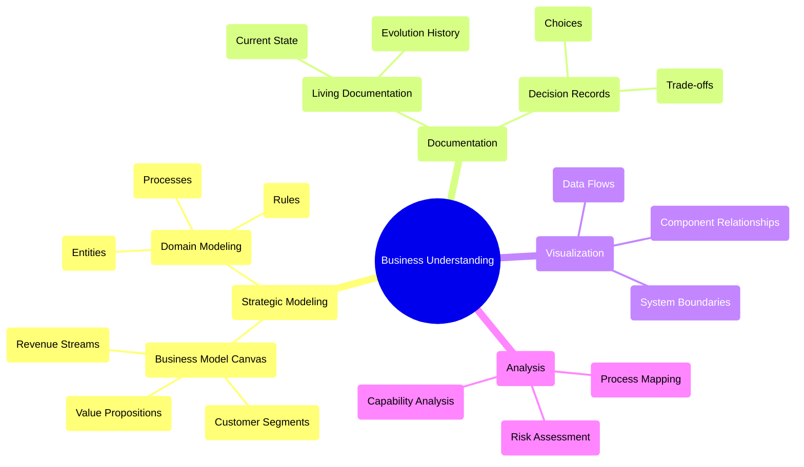
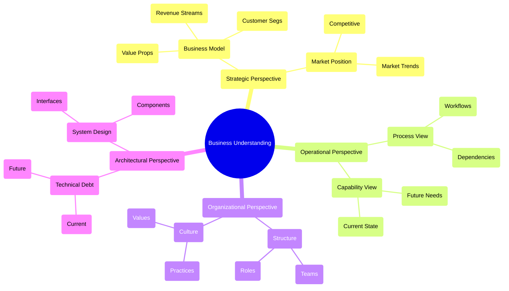
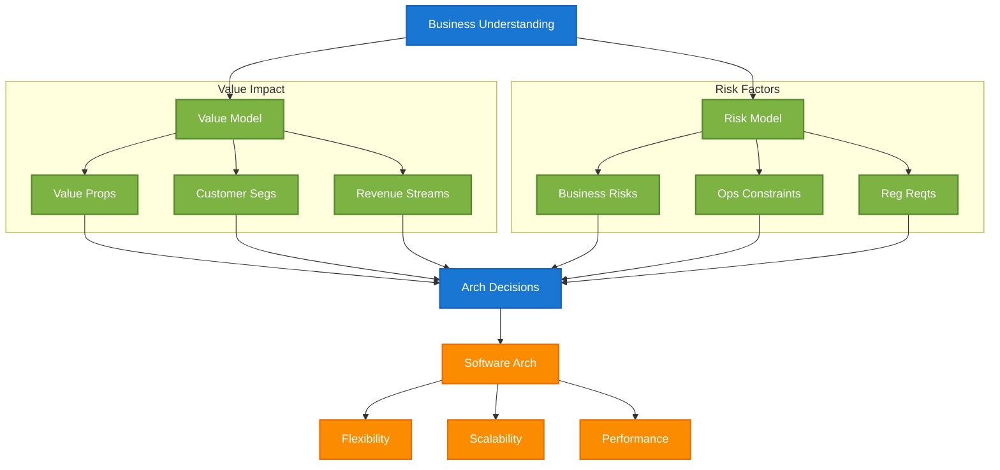

#  Comprehensive Guide to Business Understanding for Software Architecture

This report synthesizes the essential elements of business understanding and its application to software architecture decisions, providing a complete framework for architects and technical leaders.

###  1. Business Understanding Framework

The foundation of effective software architecture begins with comprehensive business understanding. Let's visualize the key components:

The mindmap above illustrates the four key dimensions of business understanding: Strategic Modeling, Documentation, Visualization, and Analysis. Each branch represents a major category of tools and techniques, with specific methods branching out underneath.

###  2. Essential Perspectives for Business Understanding

Several key perspectives are crucial for deep business comprehension:

These perspectives work together with the business understanding framework shown in the first diagram. The Strategic Perspective aligns with Strategic Modeling, while the Operational and Organizational Perspectives inform Documentation and Analysis approaches. The Architectural Perspective guides Visualization and System Boundaries understanding.

###  3. Transition to Architecture

The journey from business understanding to architectural decisions follows a structured path:

The diagram illustrates the transition process, where:

- Blue boxes represent primary drivers (Business Understanding and Architectural Decisions)
- Green boxes show intermediate analysis factors (Value and Risk Models)
- Orange boxes indicate architectural outcomes (Software Architecture characteristics)

###  4. Implementation Guidelines

To effectively implement this framework:

1. **Start with Value Mapping**  - Identify core value propositions
  - Map to technical requirements
  - Prioritize based on business impact

2. **Assess Risk Factors**  - Document business risks
  - Evaluate operational constraints
  - Consider regulatory requirements

3. **Consider Organizational Factors**  - Align with team structure
  - Reflect communication patterns
  - Account for future changes

###  5. Practical Examples

Example: E-commerce Platform

- Value Propositions \u2192 Technical Features:
          - Fast shipping \u2192 Real-time inventory, logistics integration
  - Personalized shopping \u2192 Recommendation engines, user profiling
  - Competitive pricing \u2192 Dynamic price adjustment, competitor monitoring

- Customer Segments \u2192 System Design:
          - Bulk buyers \u2192 Special ordering interfaces, quantity discounts
  - Marketplace sellers \u2192 Seller dashboards, inventory management

###  6. Evolution Considerations

Business understanding must accommodate future changes:

1. **Growth Adaptability**  - New revenue streams \u2192 Modular design for easy extension
  - Market changes \u2192 Flexible integration points
  - Scaling needs \u2192 Horizontal scaling capabilities

2. **Technical Evolution**  - Legacy system migration \u2192 Gradual replacement strategies
  - Technology updates \u2192 Isolation of core business logic
  - Integration needs \u2192 Standardized interfaces

###  7. Success Factors

For successful implementation:

1. **Maintain Current Understanding**  - Regular review of business changes
  - Update documentation promptly
  - Adjust architectural decisions as needed

2. **Ensure Clear Communication**  - Document architectural decisions
  - Share knowledge across teams
  - Maintain living documentation

3. **Focus on Value Alignment**  - Trace decisions to business value
  - Measure impact on value propositions
  - Adjust based on feedback

Architectural decisions should always trace back to business value. When evaluating any technical choice, ask: "How does this support our business model and value propositions?" This ensures that technical decisions remain aligned with business objectives while maintaining flexibility for future evolution.