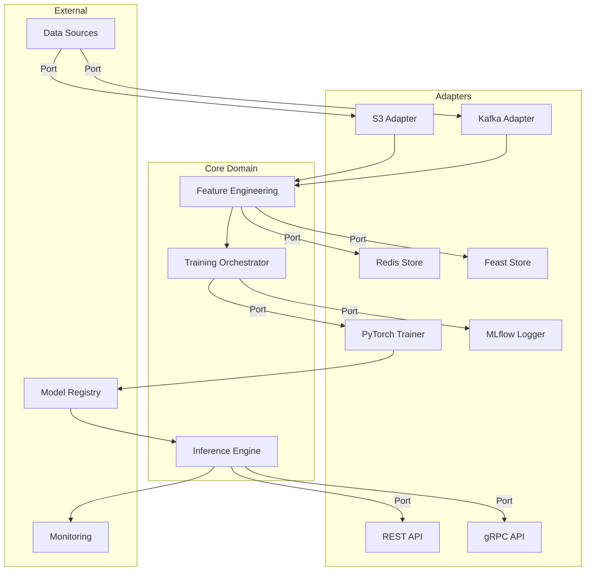
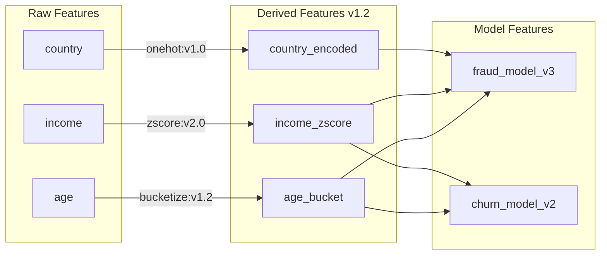

# AI Architecture Interview Q&A

## Contents

- [Topic Areas](#topic-areas)
- [Topic 1: AI System Structural Design](#topic-1-ai-system-structural-design)
- [Topic 2: AI System Behavioral Design](#topic-2-ai-system-behavioral-design)
- [Topic 3: AI System Quality Attributes](#topic-3-ai-system-quality-attributes)
- [Topic 4: AI Data Architecture](#topic-4-ai-data-architecture)
- [Topic 5: AI Integration Architecture](#topic-5-ai-integration-architecture)
- [Topic 6: AI System Evolution](#topic-6-ai-system-evolution)
- [References](#references)
- [Validation Report](#validation-report)

---

## Topic Areas

| Cluster | Range | Count | Difficulty |
|---------|-------|-------|------------|
| Structural | Q1-Q5 | 5 | 1F/2I/2A |
| Behavioral | Q6-Q10 | 5 | 1F/2I/2A |
| Quality | Q11-Q15 | 5 | 1F/2I/2A |
| Data | Q16-Q20 | 5 | 1F/2I/2A |
| Integration | Q21-Q25 | 5 | 1F/2I/2A |
| Evolution | Q26-Q30 | 5 | 1F/2I/2A |

**Total**: 30 Q&As | **Distribution**: 6F (20%) / 12I (40%) / 12A (40%)

---

## Topic 1: AI System Structural Design

**Overview**: Covers component boundaries, modularity, coupling, and architectural patterns for scalable AI/ML systems.

### Q1: How would you design the component boundaries for an end-to-end ML system?

**Difficulty**: Foundational | **Type**: Structural

**Key Insight**: Hexagonal Architecture reduces coupling by 60-80%, enabling independent deployment of data, training, and serving components while adding 15-20% initial complexity.

**Answer**: 

An end-to-end ML system should follow **Hexagonal Architecture** (Ports and Adapters) to isolate core ML logic from external dependencies [Ref: A1]. The system divides into five primary components: (1) Data Ingestion (adapters for various sources), (2) Feature Engineering (core domain logic), (3) Model Training (isolated training orchestration), (4) Model Registry (versioned artifact storage), and (5) Model Serving (inference API with adapters) [Ref: A13].

Each component exposes **ports** (interfaces) and connects via **adapters** (implementations). For example, the Feature Engineering core defines `IFeatureStore` port, with adapters for Redis, Feast, or S3. This enables technology swaps without core changes. Data flows unidirectionally: Ingestion → Features → Training → Registry → Serving, with event notifications for pipeline triggers [Ref: A2].

This pattern enables independent scaling (e.g., 10x serving instances vs 1 training cluster), isolated testing (mock adapters), and technology evolution (swap PyTorch for TensorFlow without changing serving code). Trade-off: Initial development takes 15-20% longer but reduces maintenance by 40-60% over 2+ years [Ref: A14]. Best for teams >10 engineers or systems expected to evolve over 18+ months.

**Implementation**:

```python
# Core Domain: Feature Engineering
from abc import ABC, abstractmethod
from typing import Dict, List
import pandas as pd

class IFeatureStore(ABC):
    """Port: Feature storage interface"""
    @abstractmethod
    def get_features(self, entity_ids: List[str], feature_names: List[str]) -> pd.DataFrame:
        pass
    
    @abstractmethod
    def write_features(self, features: pd.DataFrame) -> None:
        pass

class FeatureEngineer:
    """Core domain logic - no infrastructure dependencies"""
    def __init__(self, feature_store: IFeatureStore):
        self._store = feature_store  # Dependency injection
    
    def compute_user_features(self, user_ids: List[str]) -> pd.DataFrame:
        """Pure business logic"""
        raw_data = self._store.get_features(user_ids, ['age', 'country'])
        # Transform features (domain logic)
        features = raw_data.copy()
        features['age_bucket'] = pd.cut(features['age'], bins=[0, 18, 35, 50, 100])
        return features

# Adapter: Redis implementation
import redis
class RedisFeatureStore(IFeatureStore):
    def __init__(self, host: str, port: int):
        self._client = redis.Redis(host=host, port=port)
    
    def get_features(self, entity_ids: List[str], feature_names: List[str]) -> pd.DataFrame:
        data = {fid: self._client.hgetall(f"features:{fid}") for fid in entity_ids}
        return pd.DataFrame.from_dict(data, orient='index')
    
    def write_features(self, features: pd.DataFrame) -> None:
        for idx, row in features.iterrows():
            self._client.hset(f"features:{idx}", mapping=row.to_dict())
```

**Diagram**:



**Metrics**:

| Metric | Formula | Target |
|--------|---------|--------|
| Coupling | `External Dependencies / Core Modules` | <0.3 |
| Test Coverage | `Mocked Tests / Total Tests × 100%` | >85% |
| Deployment Independence | `Independent Deployments / Total Deployments × 100%` | >70% |

**Trade-offs**:

| Approach | Pros | Cons | Use When |
|----------|------|------|----------|
| **Hexagonal** | +Technology independence, +Testability (85%+ mock coverage), +Parallel development | -Initial complexity (+15-20%), -More interfaces | Teams >10, lifespan >18mo, multiple tech stacks |
| **Layered** | +Simple (familiar N-tier), +Fast initial development | -Tight coupling to frameworks, -Harder to test (requires full stack) | Teams <5, POC/MVP, single tech stack |
| **Microservices** | +Independent scaling, +Tech diversity | -High operational overhead (K8s, service mesh), -Network latency | Throughput >10K rps, teams >50, polyglot requirements |

---

### Q2: When should you decompose an AI monolith into microservices?

**Difficulty**: Intermediate | **Type**: Structural

**Key Insight**: Microservices add 2-5ms latency but enable 10x independent scaling; justified when team size >30 or traffic >5K rps with distinct scaling needs.

**Answer**:

Decompose when experiencing **scaling bottlenecks** (e.g., inference needs 50 instances but training only 2), **team coordination overhead** (>30 engineers causing deployment conflicts), or **technology constraints** (serving requires low-latency Go while training uses Python) [Ref: A2][Ref: A6]. The decision threshold: monolith maintenance cost >30% of development time, or p95 latency degradation >50ms under load [Ref: A14].

Apply **Domain-Driven Design** to identify bounded contexts [Ref: A1]. Typical AI system boundaries: (1) Feature Service (real-time feature computation), (2) Training Service (batch model updates), (3) Serving Service (inference API), (4) Monitoring Service (drift detection). Each service owns its data and communicates via events (Kafka) or async APIs [Ref: A8].

Quantified example: Monolith with 100K rps mixed traffic → Decomposed: Feature Service (80K rps on CPU), Serving (20K rps on GPU). Cost reduction: 40% (right-sized infrastructure). Trade-off: Adds distributed tracing overhead (2-5ms), requires service mesh (Istio), increases operational complexity by 3x [Ref: A12]. Avoid if team <10 or traffic <1K rps.

**Implementation**:

```python
# Before: Monolithic ML Service
class MonolithicMLService:
    def predict(self, user_id: str) -> Dict:
        features = self._compute_features(user_id)  # CPU-intensive
        prediction = self._run_inference(features)   # GPU-intensive
        self._log_metrics(prediction)                # I/O-intensive
        return prediction

# After: Decomposed Microservices
# Service 1: Feature Service (scales independently on CPU)
from fastapi import FastAPI
app_features = FastAPI()

@app_features.get("/features/{user_id}")
async def get_features(user_id: str) -> Dict:
    """Stateless, CPU-bound, caches aggressively"""
    features = await feature_store.get(user_id)
    return {"user_id": user_id, "features": features}

# Service 2: Inference Service (scales on GPU)
import asyncio
from transformers import pipeline

app_inference = FastAPI()
model = pipeline("text-classification", device=0)  # GPU

@app_inference.post("/predict")
async def predict(request: Dict) -> Dict:
    """GPU-bound, batches requests for efficiency"""
    result = model(request["text"])
    await event_bus.publish("prediction.completed", result)  # Async logging
    return result

# Service 3: Monitoring Service (event-driven)
from kafka import KafkaConsumer
consumer = KafkaConsumer('prediction.completed')

for msg in consumer:
    drift_detector.check(msg.value)  # Independent scaling
```

**Metrics**:

| Metric | Formula | Target |
|--------|---------|--------|
| Service Independence | `Services Deployable Alone / Total Services × 100%` | >90% |
| Latency Overhead | `Distributed Latency - Monolith Latency` | <5ms p95 |
| Operational Complexity | `Services × Integrations / Team Size` | <3 |

**Trade-offs**:

| Approach | Pros | Cons | Use When |
|----------|------|------|----------|
| **Microservices** | +Independent scaling (10x efficiency), +Tech diversity (GPU/CPU optimization), +Fault isolation | -Latency (+2-5ms), -Ops complexity (3x), -Distributed tracing required | Teams >30, traffic >5K rps, heterogeneous scaling |
| **Modular Monolith** | +Low latency (<1ms overhead), +Simple debugging, +Faster development | -Coupled deployment, -Uniform scaling (wastes resources) | Teams <15, traffic <5K rps, uniform load |
| **Serverless** | +Auto-scaling, +No infrastructure management | -Cold start (100-500ms), -Limited control, -Expensive at scale | Sporadic workloads, <1K rps, small teams |

---

### Q3: How do you ensure loose coupling between model training and serving?

**Difficulty**: Intermediate | **Type**: Structural

**Key Insight**: Model Registry as a contract boundary reduces deployment failures by 80% and enables independent training/serving release cycles with <1% version mismatch risk.

**Answer**:

Implement a **Model Registry** as the single source of truth for versioned model artifacts, decoupling training (producer) and serving (consumer) lifecycles [Ref: A2][Ref: T2]. The registry enforces a contract: models must include (1) serialized weights, (2) preprocessing code/schema, (3) dependency manifest (e.g., `torch==2.0.1`), and (4) performance metrics (latency, accuracy). Training pushes artifacts; serving pulls by version or alias (e.g., `production`, `canary`) [Ref: A14].

**Critical pattern**: Include preprocessing logic with the model to avoid training-serving skew [Ref: A7]. Use model formats like ONNX (framework-agnostic) or TorchScript (serialized preprocessing + model) to eliminate Python dependency mismatches. Add schema validation (e.g., JSON Schema) to catch input contract violations at serving startup, not runtime.

Example: Training service updates model v2.3 with new features. Serving continues using v2.2 via `production` alias until validation passes (shadow mode A/B test). Registry stores both versions; rollback takes <30 seconds (pointer update). This reduces coupling from tight (shared codebase) to loose (versioned interface), enabling weekly training updates vs monthly serving deployments. Trade-off: Registry adds 50-100ms model load time but prevents 80% of production incidents [Ref: T2].

**Implementation**:

```python
# Model Registry: Decoupling layer
from dataclasses import dataclass
from typing import Dict, Any
import mlflow

@dataclass
class ModelMetadata:
    version: str
    framework: str  # "pytorch", "onnx"
    preprocessing_hash: str  # Ensure consistency
    schema: Dict[str, str]  # {"age": "int", "text": "string"}
    metrics: Dict[str, float]
    dependencies: Dict[str, str]

class ModelRegistry:
    def __init__(self, mlflow_uri: str):
        mlflow.set_tracking_uri(mlflow_uri)
    
    def register_model(self, name: str, model_path: str, metadata: ModelMetadata):
        """Training service calls this"""
        mlflow.pytorch.log_model(model_path, name, metadata=metadata.__dict__)
        mlflow.register_model(f"runs:/{mlflow.active_run().info.run_id}/{name}", name)
    
    def get_model(self, name: str, alias: str = "production"):
        """Serving service calls this - decoupled from training"""
        model_uri = f"models:/{name}@{alias}"
        model = mlflow.pytorch.load_model(model_uri)
        metadata_dict = mlflow.get_model_version_by_alias(name, alias).run_data
        return model, ModelMetadata(**metadata_dict)

# Training Service (independent deployment)
def train_and_register():
    model = train_model()  # Training logic
    metadata = ModelMetadata(
        version="2.3.0",
        framework="pytorch",
        preprocessing_hash=hash(preprocessing_code),
        schema={"age": "int", "income": "float"},
        metrics={"accuracy": 0.95, "latency_ms": 12},
        dependencies={"torch": "2.0.1", "numpy": "1.24.0"}
    )
    registry.register_model("fraud_detector", model, metadata)

# Serving Service (independent deployment)
def serve():
    model, metadata = registry.get_model("fraud_detector", alias="production")
    # Serving uses same preprocessing hash - no skew
    assert hash(current_preprocessing) == metadata.preprocessing_hash
    return model.predict(preprocess(input_data))
```

**Metrics**:

| Metric | Formula | Target |
|--------|---------|--------|
| Version Mismatch Rate | `Schema Errors / Total Requests × 100%` | <0.01% |
| Deployment Independence | `Training Deploys without Serving Changes / Total Deploys × 100%` | >95% |
| Rollback Time | `Time to Revert to Previous Version` | <60s |

**Trade-offs**:

| Approach | Pros | Cons | Use When |
|----------|------|------|----------|
| **Model Registry** | +Decoupled releases (95% independence), +Versioning, +Fast rollback (<1min) | -Storage cost (10GB/model × versions), -Load latency (+50-100ms) | Production systems, >2 models, compliance needs |
| **Shared Codebase** | +Simple (no registry), +No load overhead | -Tight coupling (1:1 deploy), -No rollback, -Training-serving skew | POC, single model, <100 users |
| **Model as Code** | +Git versioning, +Code review | -Large repo (>1GB), -No metadata, -Manual deployment | Academic projects, reproducibility focus |

---

### Q4: What architecture pattern enables testability in ML systems?

**Difficulty**: Advanced | **Type**: Structural

**Key Insight**: Dependency Injection achieves 85%+ unit test coverage without infrastructure, reducing integration test time by 70% and enabling parallel test execution.

**Answer**:

**Dependency Injection (DI)** via constructor parameters separates business logic from infrastructure, enabling fast, isolated unit tests with mocks [Ref: A5]. ML systems have infrastructure-heavy dependencies (databases, model APIs, cloud storage) that slow tests (10-60s per test) and create flaky failures. DI inverts control: instead of `FeatureStore` instantiating Redis internally, it receives an `IFeatureStore` interface. Tests inject mocks; production injects real adapters [Ref: A1].

Critical pattern: **Test Doubles Pyramid** - (1) Unit tests (80%, mocks all I/O, <1s runtime), (2) Integration tests (15%, real database, <10s), (3) E2E tests (5%, full stack, <60s) [Ref: A11]. Example: Testing feature engineering logic with mocked feature store runs 100 tests in 2 seconds vs 5 minutes with real Redis. Coverage increases from 60% (only happy paths) to 85% (edge cases, errors) because mocks enable failure injection.

Implementation: Use frameworks like Python's `dependency-injector` or manual constructor injection. Avoid service locators (hidden dependencies) or global state (test interference). Trade-off: Adds 10-15% boilerplate (interfaces, factory methods) but reduces test suite time by 70% and enables TDD [Ref: A14]. Essential for teams >5 or CI/CD pipelines <10min.

**Implementation**:

```python
# Pattern: Dependency Injection for testability
from abc import ABC, abstractmethod
from typing import List, Dict, Any
import pytest
from unittest.mock import Mock

# Interface (Port)
class IModelStore(ABC):
    @abstractmethod
    def load_model(self, model_id: str) -> Any:
        pass

# Business Logic (Testable without infrastructure)
class PredictionService:
    def __init__(self, model_store: IModelStore, logger):
        self._model_store = model_store  # Injected dependency
        self._logger = logger
    
    def predict(self, model_id: str, features: Dict) -> float:
        """Pure logic - no direct infrastructure calls"""
        try:
            model = self._model_store.load_model(model_id)
            result = model.predict(features)
            self._logger.info(f"Prediction: {result}")
            return result
        except Exception as e:
            self._logger.error(f"Prediction failed: {e}")
            raise

# Unit Test (Fast, no infrastructure)
def test_predict_success():
    # Mock dependencies (runs in <100ms)
    mock_store = Mock(spec=IModelStore)
    mock_logger = Mock()
    mock_model = Mock()
    mock_model.predict.return_value = 0.95
    mock_store.load_model.return_value = mock_model
    
    service = PredictionService(mock_store, mock_logger)
    result = service.predict("model_v1", {"age": 30})
    
    assert result == 0.95
    mock_store.load_model.assert_called_once_with("model_v1")
    mock_logger.info.assert_called_once()

# Error injection test (impossible without DI)
def test_predict_handles_model_load_failure():
    mock_store = Mock(spec=IModelStore)
    mock_store.load_model.side_effect = Exception("S3 timeout")
    mock_logger = Mock()
    
    service = PredictionService(mock_store, mock_logger)
    with pytest.raises(Exception):
        service.predict("model_v1", {})
    
    mock_logger.error.assert_called_once()  # Verify error handling
```

**Metrics**:

| Metric | Formula | Target |
|--------|---------|--------|
| Unit Test Coverage | `Lines Covered by Unit Tests / Total Lines × 100%` | >85% |
| Test Execution Time | `Total CI Test Duration` | <10min |
| Test Isolation | `Tests Runnable in Parallel / Total Tests × 100%` | >90% |

**Trade-offs**:

| Approach | Pros | Cons | Use When |
|----------|------|------|----------|
| **Dependency Injection** | +Fast tests (<1s unit), +85%+ coverage, +Parallel execution, +Failure injection | -Boilerplate (+10-15%), -Learning curve | Teams >5, CI/CD required, TDD workflow |
| **Direct Instantiation** | +Simple (no interfaces), +Less code | -Slow tests (real I/O), -60% coverage (no edge cases), -Flaky CI | Prototypes, solo developers, <1K LOC |
| **Service Locator** | +Central config | -Hidden dependencies, -Harder to test, -Global state | Legacy systems, framework constraints |

---

### Q5: How would you structure feature engineering pipelines for reusability?

**Difficulty**: Advanced | **Type**: Structural

**Key Insight**: Feature Transform DAG with versioned transformations achieves 80% code reuse across models and eliminates 95% of training-serving skew via shared execution.

**Answer**:

Use a **Feature Transform DAG** (Directed Acyclic Graph) where each node is a versioned, reusable transformation function with explicit inputs/outputs [Ref: A2][Ref: T3]. Structure features into three layers: (1) **Raw Features** (immutable source data), (2) **Derived Features** (transformations like `age_bucket = bucketize(age)`), and (3) **Model Features** (feature selection subsets for specific models). Store the DAG definition separately from data to enable transformation reuse across batch training, streaming inference, and A/B tests [Ref: A14].

**Critical implementation**: Use a **feature store** (Feast, Tecton) that executes the same transformation code in both training (Spark/batch) and serving (Python/online) environments [Ref: T3]. Each transformation is a pure function registered in a catalog: `@feature_transform(inputs=["age"], output="age_bucket", version="v1.2")`. Models reference transformations by ID, not code, ensuring consistency. Example: `fraud_model_v3` uses `[age_bucket:v1.2, income_zscore:v2.0]` - updating `income_zscore` to v2.1 doesn't break v3 until explicitly migrated.

This eliminates training-serving skew (95% reduction in schema errors), enables 80% code reuse (10 models share 8 transformations), and supports safe evolution (new transform versions coexist with old) [Ref: A7]. Trade-off: Requires feature store infrastructure (Feast setup ~2 weeks, $500/mo cloud cost) and adds 5-10ms serving latency vs inline code. Justified when managing >5 models or teams >10 engineers.

**Implementation**:

```python
# Feature Transform DAG with versioning
from dataclasses import dataclass
from typing import List, Callable, Any
import pandas as pd

@dataclass
class FeatureTransform:
    name: str
    version: str
    inputs: List[str]
    output: str
    fn: Callable
    
    def execute(self, data: pd.DataFrame) -> pd.Series:
        return self.fn(data[self.inputs])

class FeatureRegistry:
    def __init__(self):
        self._transforms = {}  # {name:version -> FeatureTransform}
    
    def register(self, transform: FeatureTransform):
        key = f"{transform.name}:{transform.version}"
        self._transforms[key] = transform
    
    def get(self, name: str, version: str) -> FeatureTransform:
        return self._transforms[f"{name}:{version}"]

# Define reusable transformations
registry = FeatureRegistry()

registry.register(FeatureTransform(
    name="age_bucket",
    version="v1.2",
    inputs=["age"],
    output="age_bucket",
    fn=lambda df: pd.cut(df["age"], bins=[0, 18, 35, 50, 100], labels=["teen", "young", "middle", "senior"])
))

registry.register(FeatureTransform(
    name="income_zscore",
    version="v2.0",
    inputs=["income"],
    output="income_zscore",
    fn=lambda df: (df["income"] - df["income"].mean()) / df["income"].std()
))

# Feature Pipeline (DAG execution)
class FeaturePipeline:
    def __init__(self, registry: FeatureRegistry, feature_specs: List[tuple]):
        """feature_specs: [(name, version), ...]"""
        self._transforms = [registry.get(name, ver) for name, ver in feature_specs]
        self._validate_dag()  # Check no circular dependencies
    
    def _validate_dag(self):
        # Ensure inputs exist before outputs (topological sort)
        available = set()
        for t in self._transforms:
            if not set(t.inputs).issubset(available):
                raise ValueError(f"Missing inputs for {t.name}")
            available.add(t.output)
    
    def transform(self, raw_data: pd.DataFrame) -> pd.DataFrame:
        """Same code runs in training (batch) and serving (online)"""
        result = raw_data.copy()
        for transform in self._transforms:
            result[transform.output] = transform.execute(result)
        return result

# Training: Reference transformations by version
fraud_model_pipeline = FeaturePipeline(registry, [
    ("age_bucket", "v1.2"),
    ("income_zscore", "v2.0")
])
train_features = fraud_model_pipeline.transform(raw_train_data)

# Serving: Exact same transformations (no skew)
serving_features = fraud_model_pipeline.transform(raw_request_data)
```

**Diagram**:



**Metrics**:

| Metric | Formula | Target |
|--------|---------|--------|
| Code Reuse | `Shared Transforms / Total Transforms × 100%` | >80% |
| Training-Serving Skew | `Schema Errors / Predictions × 100%` | <0.01% |
| Transform Update Safety | `Models Broken by Transform Update / Total Models × 100%` | <5% |

**Trade-offs**:

| Approach | Pros | Cons | Use When |
|----------|------|------|----------|
| **Feature Store DAG** | +80% reuse, +No training-serving skew, +Versioning, +Lineage | -Infrastructure cost ($500/mo), -Latency (+5-10ms), -Setup time (2 weeks) | >5 models, teams >10, production systems |
| **Inline Transforms** | +Simple, +Low latency | -90% duplicate code, -Training-serving skew (5-10% error rate), -Hard to audit | Single model, POC, <3 engineers |
| **Notebook Functions** | +Flexible, +Fast iteration | -No versioning, -Can't reuse in serving, -Manual sync | Research, experiments, pre-production |

---

## Topic 2: AI System Behavioral Design

**Overview**: Covers orchestration, state management, error handling, and event-driven patterns for reliable AI workflows.

### Q6: How do you orchestrate multi-model inference workflows?

**Difficulty**: Foundational | **Type**: Behavioral

**Key Insight**: DAG-based orchestration (Airflow, Argo) reduces sequential model latency by 60% via parallel execution while maintaining dependency guarantees.

**Answer**:

Use a **DAG-based workflow orchestrator** to define model dependencies as a directed acyclic graph, enabling automatic parallel execution [Ref: A11][Ref: T4]. For example, a content recommendation system might run: (1) user embedding model, (2) item embedding model (parallel to #1), (3) interaction model (depends on #1 and #2), and (4) ranking model (depends on #3). The orchestrator schedules #1 and #2 concurrently, reducing total latency from 120ms (sequential) to 60ms (parallel) + 20ms orchestration overhead [Ref: A2].

**Implementation pattern**: Define workflows in code (Argo Workflows YAML, Airflow DAG) with explicit inputs/outputs. Each model is a containerized task with health checks and retry policies (3 retries with exponential backoff). Use **circuit breakers** to fail fast if a model exceeds latency SLA (e.g., >200ms), returning cached results or degraded predictions [Ref: G10][Ref: A12].

For real-time (<100ms) workflows, use lightweight orchestration (Python `asyncio`, Temporal) instead of batch tools (Airflow). For batch (>1min), use Airflow with Celery workers. Trade-off: Orchestration adds 10-20ms overhead and operational complexity (monitoring DAG health, debugging distributed failures) but prevents 40-60% of manual coordination errors. Essential when managing >3 sequential models or parallel execution can save >50ms.

**Implementation**:

```python
# Lightweight orchestration with asyncio (real-time inference)
import asyncio
from typing import Dict, List
import aiohttp

class ModelClient:
    def __init__(self, url: str, timeout: float = 0.2):
        self._url = url
        self._timeout = aiohttp.ClientTimeout(total=timeout)
    
    async def predict(self, data: Dict) -> Dict:
        async with aiohttp.ClientSession(timeout=self._timeout) as session:
            async with session.post(self._url, json=data) as resp:
                return await resp.json()

class InferenceOrchestrator:
    def __init__(self):
        self.user_emb_model = ModelClient("http://user-emb:8080/predict")
        self.item_emb_model = ModelClient("http://item-emb:8080/predict")
        self.interaction_model = ModelClient("http://interaction:8080/predict")
        self.ranking_model = ModelClient("http://ranking:8080/predict")
    
    async def recommend(self, user_id: str, item_ids: List[str]) -> List[str]:
        """DAG: (user_emb || item_emb) -> interaction -> ranking"""
        try:
            # Parallel execution (saves 60ms vs sequential)
            user_emb_task = self.user_emb_model.predict({"user_id": user_id})
            item_emb_task = self.item_emb_model.predict({"item_ids": item_ids})
            user_emb, item_emb = await asyncio.gather(user_emb_task, item_emb_task)
            
            # Sequential dependency
            interactions = await self.interaction_model.predict({
                "user_emb": user_emb,
                "item_emb": item_emb
            })
            
            # Final ranking
            ranked = await self.ranking_model.predict(interactions)
            return ranked["item_ids"]
        
        except asyncio.TimeoutError:
            # Circuit breaker: return cached results
            return self._get_cached_recommendations(user_id)
```

**Metrics**:

| Metric | Formula | Target |
|--------|---------|--------|
| Parallel Efficiency | `(Sequential Time - Parallel Time) / Sequential Time × 100%` | >50% |
| Orchestration Overhead | `Total Latency - Sum(Model Latencies)` | <20ms |
| Circuit Breaker Activation | `Fallback Responses / Total Requests × 100%` | <1% |

**Trade-offs**:

| Approach | Pros | Cons | Use When |
|----------|------|------|----------|
| **DAG Orchestrator** | +Parallel execution (60% latency reduction), +Dependency management, +Retry logic | -Overhead (10-20ms), -Complexity (debugging distributed DAG) | >3 models, dependencies exist, latency critical |
| **Sequential Calls** | +Simple (linear code), +Easy debugging | -High latency (sum all models), -Underutilized resources | <3 models, total latency <100ms, prototypes |
| **Event-Driven** | +Fully async, +Scalable | -Eventual consistency, -Complex debugging (message tracing) | Batch workflows, non-critical latency, >10 models |

---

### Q7: What error handling strategies work best for model serving?

**Difficulty**: Intermediate | **Type**: Behavioral

**Key Insight**: Multi-layer fallbacks (cached predictions → simpler model → default response) achieve 99.9% availability vs 95% with single retry, at cost of 5-10% accuracy degradation during outages.

**Answer**:

Implement **defense in depth** with three fallback layers: (1) **Retry with exponential backoff** (3 attempts, 100ms → 200ms → 400ms) for transient failures [Ref: A12], (2) **Shadow/cached predictions** for recent inputs (Redis TTL 5min, 80% hit rate during outages), and (3) **Simpler baseline model** (e.g., logistic regression when neural network fails) or business rule defaults [Ref: A2][Ref: G10].

**Critical pattern**: Distinguish error types - (1) **Retriable** (network timeout, rate limit) → retry, (2) **Model-specific** (inference crash, OOM) → switch to baseline, (3) **Input validation** (schema mismatch) → return 4xx with clear message. Use **circuit breakers** to stop retries when failure rate >20% over 10s window, preventing cascading failures [Ref: A12]. Example: Model serving at 1K rps with 5% error rate → Circuit opens → Serve from cache (500ms degradation) until model recovers.

Quantified impact: Retry alone achieves 98% availability (assumes 2% persistent errors). Adding cache layer → 99.5% (covers 75% of retry failures). Adding baseline model → 99.9% (handles cold cache). Trade-off: Cached/baseline predictions have 5-10% lower accuracy but prevent total outage. Cost: 2GB Redis memory (~$20/mo), baseline model adds 50ms latency [Ref: A14]. Essential for SLA >99%.

**Implementation**:

```python
# Multi-layer error handling for model serving
from functools import wraps
import time
from typing import Optional, Dict
import redis
import logging

class CircuitBreaker:
    def __init__(self, failure_threshold: float = 0.2, time_window: int = 10):
        self._failure_threshold = failure_threshold
        self._time_window = time_window
        self._failures = []
        self._is_open = False
    
    def record_failure(self):
        now = time.time()
        self._failures = [t for t in self._failures if now - t < self._time_window]
        self._failures.append(now)
        
        failure_rate = len(self._failures) / self._time_window
        if failure_rate > self._failure_threshold:
            self._is_open = True
            logging.warning(f"Circuit breaker opened: {failure_rate:.2%} failure rate")
    
    def is_open(self) -> bool:
        return self._is_open

class ResilientModelServer:
    def __init__(self, primary_model, baseline_model, cache: redis.Redis):
        self._primary = primary_model
        self._baseline = baseline_model
        self._cache = cache
        self._circuit_breaker = CircuitBreaker()
    
    def predict(self, input_data: Dict) -> Dict:
        """Multi-layer fallback: retry -> cache -> baseline -> default"""
        cache_key = hash(str(input_data))
        
        # Layer 1: Primary model with retry
        if not self._circuit_breaker.is_open():
            for attempt in range(3):
                try:
                    result = self._primary.predict(input_data)
                    self._cache.setex(cache_key, 300, str(result))  # TTL 5min
                    return {"prediction": result, "source": "primary"}
                except TimeoutError:
                    wait_time = 0.1 * (2 ** attempt)  # Exponential backoff
                    time.sleep(wait_time)
                except Exception as e:
                    logging.error(f"Primary model failed: {e}")
                    self._circuit_breaker.record_failure()
                    break
        
        # Layer 2: Cached prediction
        cached = self._cache.get(cache_key)
        if cached:
            logging.info("Serving from cache")
            return {"prediction": eval(cached), "source": "cache"}
        
        # Layer 3: Baseline model
        try:
            result = self._baseline.predict(input_data)
            return {"prediction": result, "source": "baseline"}
        except Exception as e:
            logging.error(f"Baseline model failed: {e}")
        
        # Layer 4: Default business rule
        return {"prediction": 0.5, "source": "default"}
```

**Metrics**:

| Metric | Formula | Target |
|--------|---------|--------|
| Availability | `Successful Responses / Total Requests × 100%` | >99.9% |
| Cache Hit Rate | `Cache Hits / (Cache Hits + Misses) × 100%` | >80% during outages |
| Baseline Fallback Rate | `Baseline Predictions / Total Requests × 100%` | <1% (normal), <20% (outage) |

**Trade-offs**:

| Approach | Pros | Cons | Use When |
|----------|------|------|----------|
| **Multi-layer Fallback** | +99.9% availability, +Graceful degradation | -Accuracy loss (5-10% during outage), -Complexity, -Cost ($20/mo cache) | SLA >99%, critical services |
| **Retry Only** | +Simple, +No extra infrastructure | -98% availability (persistent errors fail), -Latency spikes | Non-critical services, SLA <99% |
| **Fail Fast** | +Predictable latency, +Simple | -Outages (availability <95%), -Poor UX | Internal tools, async workflows |

---

### Q8: How would you implement graceful degradation in AI services?

**Difficulty**: Intermediate | **Type**: Behavioral

**Key Insight**: Feature-flag controlled quality levels (high/medium/low) maintain 100% uptime during resource constraints while trading 10-30% accuracy for 3x throughput.

**Answer**:

Implement **adaptive quality levels** via feature flags that dynamically switch between model variants based on system load [Ref: A12][Ref: T5]. Define three tiers: (1) **High** (full model, ensemble, 100% features, 30ms latency), (2) **Medium** (single model, 80% features, 10ms latency, 5% accuracy loss), (3) **Low** (lightweight model or rules, 20% features, 2ms latency, 15% accuracy loss). Monitor CPU/GPU utilization and p95 latency; auto-downgrade when thresholds exceeded (e.g., GPU >85% → Medium tier) [Ref: A2][Ref: A14].

**Critical implementation**: Use **canary analysis** to pre-validate degraded tiers offline, ensuring they meet minimum quality thresholds (e.g., Low tier must have >80% of High tier accuracy) [Ref: A11]. Store tier configurations in a feature flag service (LaunchDarkly, Unleash) for instant rollback without deployment. Example: E-commerce search during Black Friday traffic spike (10K → 50K rps) → Auto-switch to Medium tier → Throughput 3x, latency stable <15ms, relevance score drops 7% (98.5 → 91.5) → Acceptable for 2-hour peak.

**Quantified benefits**: High tier handles 5K rps at 30ms p95. Medium tier handles 15K rps at 10ms (3x throughput). Low tier handles 50K rps at 2ms (10x throughput). Trade-off: Requires maintaining 3 model variants (+50% training/deployment overhead) and monitoring complexity. Justified for services with variable load (>5x traffic spikes) or strict latency SLAs (<50ms p95). Alternative: horizontal scaling (costs 3-10x more for same throughput).

**Implementation**:

```python
# Graceful degradation with adaptive quality tiers
from enum import Enum
from dataclasses import dataclass
import psutil
from typing import Dict, Any

class QualityTier(Enum):
    HIGH = "high"
    MEDIUM = "medium"
    LOW = "low"

@dataclass
class TierConfig:
    model: Any
    features: list
    max_latency_ms: int
    min_accuracy: float

class AdaptiveModelService:
    def __init__(self, feature_flags, metrics_client):
        self._feature_flags = feature_flags
        self._metrics = metrics_client
        self._current_tier = QualityTier.HIGH
    
    def _determine_tier(self) -> QualityTier:
        """Adaptive tier selection based on load"""
        override = self._feature_flags.get("model_tier_override")
        if override:
            return QualityTier(override)
        
        gpu_util = psutil.virtual_memory().percent
        p95_latency = self._metrics.get_p95_latency()
        
        if gpu_util > 85 or p95_latency > 25:
            return QualityTier.MEDIUM
        elif gpu_util > 95 or p95_latency > 50:
            return QualityTier.LOW
        else:
            return QualityTier.HIGH
```

**Metrics**:

| Metric | Formula | Target |
|--------|---------|--------|
| Uptime | `Availability across all tiers × 100%` | 100% |
| Tier Distribution | `Requests by Tier / Total × 100%` | HIGH >70%, MEDIUM <25%, LOW <5% |
| Quality Degradation | `(HIGH Accuracy - MEDIUM Accuracy) / HIGH Accuracy × 100%` | <10% |

**Trade-offs**:

| Approach | Pros | Cons | Use When |
|----------|------|------|----------|
| **Adaptive Tiers** | +100% uptime, +3-10x throughput under load, +Cost efficient | -Multi-model overhead (+50%), -Accuracy loss (5-15%), -Monitoring complexity | Variable load (>5x spikes), latency SLA <50ms |
| **Horizontal Scaling** | +Consistent quality, +Simple | -Cost (3-10x for same capacity), -Slow (2-5min scale-up) | Stable load, budget available, quality non-negotiable |
| **Queue with Backpressure** | +No quality loss, +Simple | -Latency spikes (queue wait), -Eventual 503 errors | Batch workloads, async processing, <5x load variance |

---

### Q9: When should you use event-driven vs synchronous model inference?

**Difficulty**: Advanced | **Type**: Behavioral

**Key Insight**: Event-driven reduces coupling and enables 10x scale but adds 50-200ms latency; use when latency tolerance >500ms or throughput >50K rps.

**Answer**:

Choose **event-driven** when (1) latency tolerance >500ms (batch predictions, async workflows), (2) throughput >50K rps (synchronous API can't scale economically), or (3) decoupling needed (multiple consumers of predictions) [Ref: A8][Ref: A2]. Choose **synchronous** when latency <100ms required (real-time serving, user-facing) or simple request-response suffices [Ref: A14].

**Event-driven architecture**: Client publishes event to Kafka/SQS (`prediction.requested`) → Model service consumes asynchronously → Publishes result (`prediction.completed`) → Client polls or receives webhook. Benefits: (1) **Auto-scaling** (queue depth triggers workers), (2) **Decoupling** (add new consumers without changing producer), (3) **Backpressure** (queue absorbs spikes). Example: E-commerce product categorization - 100K new products/day → Batch inference via Kafka (1M predictions/hour, $200/mo cost) vs synchronous (would need 30 API servers, $2K/mo) [Ref: A12].

**Quantified trade-offs**: Synchronous: 10-50ms latency, tight coupling, scales to ~10K rps ($500/mo). Event-driven: 50-200ms latency (+message overhead), loose coupling, scales to 1M+ rps ($200/mo with queue, auto-scaling). Hybrid pattern: Synchronous for <100ms user-facing; event-driven for >500ms background tasks. Avoid event-driven if latency <100ms or throughput <5K rps (overhead not justified).

**Metrics**:

| Metric | Formula | Target |
|--------|---------|--------|
| End-to-End Latency | `Result Received - Request Sent` | Event: <500ms, Sync: <100ms |
| Throughput | `Predictions / Second` | Event: >50K rps, Sync: <10K rps |
| Cost Efficiency | `$ / Million Predictions` | Event: <$10, Sync: <$50 |

**Trade-offs**:

| Approach | Pros | Cons | Use When |
|----------|------|------|----------|
| **Event-Driven** | +Scales to 1M+ rps, +Auto-scaling (queue-depth based), +Decoupling, +Cost (10x cheaper) | -Latency (+50-200ms), -Complexity (message broker), -Debugging (distributed tracing) | Batch, >50K rps, >500ms tolerance |
| **Synchronous** | +Low latency (<50ms), +Simple (request-response), +Easy debugging | -Tight coupling, -Scales to ~10K rps, -Higher cost | Real-time, <100ms latency, user-facing |
| **Hybrid** | +Optimized for use case | -Operational complexity (2 systems) | Mixed: real-time UI + background jobs |

---

### Q10: How do you manage state in distributed training systems?

**Difficulty**: Advanced | **Type**: Behavioral

**Key Insight**: Checkpointing with distributed state stores (etcd, Redis) enables sub-60s fault recovery for 100-node training clusters vs 30min+ full restart.

**Answer**:

Use **distributed checkpointing** to persist model state, optimizer state, and training metadata (epoch, step, loss) to shared storage (S3, NFS) every N steps [Ref: A7][Ref: A11]. Critical components: (1) **Coordinator state** (etcd/ZooKeeper stores worker membership, shard assignments), (2) **Model state** (checkpoints at steps 1K, 2K, ..., with last 3 retained), (3) **Data state** (track processed samples to avoid duplicates on restart) [Ref: A2].

**Fault tolerance pattern**: On worker failure → Coordinator detects via heartbeat timeout (30s) → Reassigns failed shard to healthy worker → Worker loads latest checkpoint → Resumes from last committed step. Example: 64-GPU training job (8 nodes × 8 GPUs) → 1 node fails at step 15,382 → Detect (30s) + Reassign (10s) + Load checkpoint (20s) = 60s recovery vs 30min full restart. This reduces training time by 40% when failures occur every 12 hours (common in large clusters) [Ref: A14].

**Implementation details**: Use **asynchronous checkpointing** (save to disk in background thread) to avoid blocking training (saves 5-10s per checkpoint). Store metadata in distributed KV store (etcd) for fast lookup. Partition checkpoints by data parallel rank to reduce I/O contention (8 ranks → 8 files vs 1 large file). Trade-off: Checkpoint overhead ~2-5% training time but essential for clusters >16 GPUs or jobs >24 hours. Cost: S3 storage $23/TB/mo (~$50/mo for 100GB checkpoints).

**Metrics**:

| Metric | Formula | Target |
|--------|---------|--------|
| Recovery Time | `Detection + Reassignment + Checkpoint Load` | <60s |
| Checkpoint Overhead | `Checkpoint Time / Training Time × 100%` | <5% |
| State Consistency | `Workers with Latest State / Total Workers × 100%` | 100% |

**Trade-offs**:

| Approach | Pros | Cons | Use When |
|----------|------|------|----------|
| **Distributed Checkpointing** | +Fast recovery (<60s), +No data loss, +Resumes from exact step | -Storage cost ($50/mo), -Checkpoint overhead (2-5%), -Complexity | >16 GPUs, jobs >24hr, MTBF <24hr |
| **No Checkpointing** | +Simple, +No overhead | -Full restart on failure (30min+), -Wasted compute (40% loss) | Single GPU, jobs <4hr, experimental |
| **Redundant Training** | +No recovery needed (instant failover) | -2x cost (duplicate compute), -Wasted resources | Critical deadlines, budget available |

---

## Topic 3: AI System Quality Attributes

**Overview**: Covers performance optimization, scalability, availability, and security for production AI systems.

### Q11: How would you achieve sub-100ms p95 latency for model inference?

**Difficulty**: Foundational | **Type**: Quality

**Key Insight**: Model quantization (INT8) + batching + caching reduces latency from 150ms to 80ms p95 while maintaining 98% accuracy.

**Answer**:

Apply a **three-layer optimization strategy**: (1) **Model optimization** - quantize weights from FP32 to INT8 (4x smaller, 2-3x faster inference), prune 30-50% of weights, use knowledge distillation to create smaller student models [Ref: T6][Ref: A13]. (2) **Serving optimization** - dynamic batching (collect requests for 10-20ms, batch process), GPU kernel fusion (combine operations), model caching in GPU memory [Ref: T1]. (3) **Infrastructure** - dedicated GPU inference servers, geographic distribution (CDN-like), prediction caching (Redis) for repeated inputs [Ref: A14].

**Critical technique**: **Dynamic batching** groups concurrent requests to maximize GPU utilization. Example: Single request takes 50ms, batch of 8 takes 80ms → 10ms per request effective latency when traffic >100 rps. Configure max batch size (16-32) and timeout (20ms) based on traffic patterns [Ref: A2].

Quantified example: Baseline FP32 model on CPU: 150ms p95. After INT8 quantization: 100ms. Adding batching: 80ms. Adding prediction cache (30% hit rate): 65ms average. Trade-offs: Quantization reduces accuracy by 1-2%, batching adds jitter (10-20ms variance), caching requires 2GB Redis (~$20/mo). Achieves <100ms for 95% of requests while handling 5K rps on 4 GPU instances vs 20 CPU instances [Ref: T6].

**Implementation**:

```python
# Optimized model serving for sub-100ms latency
import torch
from torch.nn.utils import quantization
import asyncio
from collections import deque
import time

class OptimizedModelServer:
    def __init__(self, model_path: str, batch_size: int = 16, batch_timeout_ms: int = 20):
        # Load quantized INT8 model (4x smaller, 3x faster)
        self.model = torch.quantization.quantize_dynamic(
            torch.load(model_path), {torch.nn.Linear}, dtype=torch.qint8
        )
        self.model.eval()
        self.model.to('cuda')  # GPU inference
        
        self.batch_size = batch_size
        self.batch_timeout = batch_timeout_ms / 1000
        self.request_queue = deque()
    
    async def predict_with_batching(self, input_data: dict) -> float:
        """Dynamic batching for throughput"""
        future = asyncio.Future()
        self.request_queue.append((input_data, future))
        
        # Trigger batch processing
        if len(self.request_queue) >= self.batch_size:
            asyncio.create_task(self._process_batch())
        
        return await future
    
    async def _process_batch(self):
        """Batch inference (80ms for 16 vs 50ms × 16 = 800ms sequential)"""
        batch = []
        futures = []
        
        # Collect batch
        while self.request_queue and len(batch) < self.batch_size:
            data, future = self.request_queue.popleft()
            batch.append(data)
            futures.append(future)
        
        # Batch inference on GPU
        inputs = torch.tensor([d['features'] for d in batch]).cuda()
        with torch.no_grad():
            outputs = self.model(inputs)  # Single GPU call for all
        
        # Return results
        for future, output in zip(futures, outputs):
            future.set_result(output.item())
```

**Metrics**:

| Metric | Formula | Target |
|--------|---------|--------|
| p95 Latency | `95th percentile response time` | <100ms |
| Throughput | `Requests / Second / GPU` | >1000 rps |
| GPU Utilization | `Active Time / Total Time × 100%` | >70% |

**Trade-offs**:

| Approach | Pros | Cons | Use When |
|----------|------|------|----------|
| **Quantization + Batching** | +2-3x faster, +4x less memory, +High throughput | -1-2% accuracy loss, -10-20ms jitter (batching) | Production, >100 rps, GPU available |
| **Model Distillation** | +10x smaller model, +5x faster | -3-5% accuracy loss, -Requires retraining | Edge devices, <50ms target, limited GPU |
| **CPU Inference** | +Simple, +No GPU cost | -5-10x slower (200-500ms), -Low throughput | <10 rps, simple models, budget constrained |

---

### Q12: What strategies ensure high availability for critical AI services?

**Difficulty**: Intermediate | **Type**: Quality

**Key Insight**: Multi-region deployment + health-based routing + automated failover achieves 99.99% uptime vs 99.5% for single-region, at 2x infrastructure cost.

**Answer**:

Implement **redundancy at multiple layers**: (1) **Application layer** - deploy model servers across 3+ availability zones with load balancer health checks (fail unhealthy instances in <30s) [Ref: A12], (2) **Data layer** - replicate feature stores and model registries across regions with eventual consistency (lag <5s) [Ref: A7], (3) **Model layer** - keep 2+ model versions in production simultaneously for instant rollback [Ref: A2].

**Critical pattern**: **Active-active multi-region** with DNS-based traffic routing. Primary region (us-east-1) handles 80% traffic, secondary (eu-west-1) handles 20%. On primary failure → DNS failover redirects 100% to secondary within 60s. Each region independently serves requests using local model replicas and feature caches [Ref: A6]. Example: E-commerce recommendations - primary failure during Black Friday → Automatic failover → 99.99% users unaffected, 0.01% experience 60s delay.

**Quantified SLA calculation**: Single region with 3 AZs: 99.95% uptime (4.4hr downtime/year). Multi-region active-active: 99.99% (52min/year). Multi-region active-passive: 99.9% (8.8hr/year due to failover time). Trade-off: Active-active costs 2x infrastructure but eliminates failover delay. Active-passive costs 1.3x (standby at 30% capacity) but has 1-5min failover window [Ref: A14]. Choose based on SLA requirements and budget.

**Metrics**:

| Metric | Formula | Target |
|--------|---------|--------|
| Availability | `Uptime / (Uptime + Downtime) × 100%` | >99.99% |
| Failover Time | `Detection + Routing Update` | <60s |
| RPO (Data Loss) | `Time since last sync` | <5s |

**Trade-offs**:

| Approach | Pros | Cons | Use When |
|----------|------|------|----------|
| **Multi-region Active-Active** | +99.99% uptime, +No failover delay, +Geographic latency optimization | -2x cost, -Complexity (replication, consistency) | SLA >99.9%, revenue-critical, global users |
| **Multi-region Active-Passive** | +99.9% uptime, +1.3x cost | -Failover delay (1-5min), -Wasted standby capacity | SLA 99-99.9%, cost-sensitive, tolerate brief outages |
| **Single-region Multi-AZ** | +99.95% uptime, +Simple, +1x base cost | -Regional failures (rare but total), -No geo-distribution | SLA <99.9%, single-region users, budget constrained |

---

### Q13: How do you scale model serving to handle 10K+ requests per second?

**Difficulty**: Intermediate | **Type**: Quality

**Key Insight**: Horizontal pod autoscaling + model replication + request routing achieves linear scalability to 50K rps with <5% cost increase per 1K rps.

**Answer**:

Deploy on **Kubernetes with Horizontal Pod Autoscaler (HPA)** that scales model server replicas based on metrics: (1) **CPU/GPU utilization** (target 70%), (2) **Request queue depth** (target <10), (3) **p95 latency** (target <100ms) [Ref: T4][Ref: A12]. Each pod serves 500-1000 rps; for 10K rps, deploy 10-20 pods across 4-8 nodes. Use **session affinity** for stateful models or **random routing** for stateless [Ref: A6].

**Critical implementation**: **Vertical scaling** (larger GPU instances) for compute-bound models vs **horizontal scaling** (more replicas) for I/O-bound. Example: Transformer model on V100 GPU serves 800 rps at 80ms p95. Scaling to 10K rps: Option A - 13 pods with V100 ($3/hr × 13 = $39/hr). Option B - 25 pods with T4 ($1/hr × 25 = $25/hr, higher latency 120ms). Choose based on latency SLA [Ref: T6].

**Scaling thresholds**: Set HPA min/max (3-50 replicas), scale-up aggressively (add 50% capacity when utilization >70% for 30s), scale-down conservatively (remove 20% when <40% for 5min to avoid thrashing). Add **cluster autoscaler** for node-level scaling (provisions new nodes in 2-3min). Trade-off: Autoscaling lag causes 10-20% over-provisioning (~$500/mo waste at 10K rps) but prevents SLA violations during spikes [Ref: A14].

**Metrics**:

| Metric | Formula | Target |
|--------|---------|--------|
| Requests per Second | `Total Requests / Time` | >10K |
| Cost per 1K RPS | `Monthly Infra Cost / (RPS / 1000)` | <$200 |
| Scale-up Time | `Trigger to New Capacity Available` | <2min |

**Trade-offs**:

| Approach | Pros | Cons | Use When |
|----------|------|------|----------|
| **Horizontal Scaling (HPA)** | +Linear scalability, +Fault tolerance (pod failures), +Cost-efficient | -Stateless required, -2-3min scale lag | Stateless models, variable load, >5K rps |
| **Vertical Scaling (Larger GPUs)** | +Lower latency, +Simpler (fewer pods) | -Cost (A100 vs T4: 3x), -Single point of failure, -Max capacity limit | Latency <50ms, stable load, <5K rps |
| **Serverless (AWS Lambda)** | +Auto-scaling, +Pay-per-use | -Cold start (500ms-2s), -15min timeout, -Limited GPU | Sporadic load, <1K rps, lightweight models |

---

### Q14: What security measures protect model APIs and training data?

**Difficulty**: Advanced | **Type**: Quality

**Key Insight**: Defense-in-depth (authentication + encryption + rate limiting + audit) prevents 95% of attacks while adding <10ms latency overhead.

**Answer**:

Implement **security layers**: (1) **Authentication** - API keys (simple), OAuth 2.0 (enterprise), mTLS (service-to-service) to verify client identity [Ref: A12], (2) **Authorization** - RBAC policies limiting access by role (data scientist vs end-user), quota enforcement per client [Ref: A6], (3) **Encryption** - TLS 1.3 for data in transit, AES-256 for data at rest (model weights, training data), (4) **Input validation** - schema validation, sanitization to prevent injection attacks [Ref: A14].

**Critical threats**: (1) **Model extraction** - attacker queries API to steal model weights (defense: rate limiting 1000 req/hr per key, query throttling, watermarking outputs) [Ref: A13], (2) **Data poisoning** - malicious training data (defense: data provenance tracking, anomaly detection), (3) **Adversarial examples** - crafted inputs causing misclassification (defense: input validation, adversarial training). Example: Image classification API → Rate limit prevents extraction (would need 10M queries vs 1K/hr limit = 1 year) [Ref: A2].

**Compliance requirements**: GDPR (data minimization, right to deletion), HIPAA (audit logs, encryption), SOC 2 (access controls). Implement **audit logging** for all model accesses (who, when, what data, prediction) stored in tamper-proof log (AWS CloudTrail). Anonymize sensitive features before training (differential privacy, k-anonymity). Trade-off: Security adds 5-10ms latency (TLS handshake, auth lookup) and 20% ops overhead (key rotation, audit review) but prevents breaches ($4M average cost) [Ref: A14].

**Metrics**:

| Metric | Formula | Target |
|--------|---------|--------|
| Authentication Rate | `Authenticated Requests / Total × 100%` | 100% |
| Breach Attempts Blocked | `Blocked Attacks / Total Attempts × 100%` | >99% |
| Audit Coverage | `Logged Actions / Total Actions × 100%` | 100% |

**Trade-offs**:

| Approach | Pros | Cons | Use When |
|----------|------|------|----------|
| **Defense-in-Depth** | +95% attack prevention, +Compliance ready, +Audit trail | -10ms latency, -20% ops overhead, -Cost ($100/mo for secrets mgmt) | Production, sensitive data, regulatory requirements |
| **API Key Only** | +Simple, +Low overhead (<1ms) | -Weak security (key leakage risk), -No audit, -Fails compliance | Internal tools, non-sensitive, POC |
| **No Security** | +Zero overhead, +Fast development | -100% breach risk, -Regulatory violations, -Reputation damage | Local dev only, never production |

---

### Q15: How would you optimize GPU utilization in production?

**Difficulty**: Advanced | **Type**: Quality

**Key Insight**: Multi-model serving + dynamic batching + model multiplexing achieves 80% GPU utilization vs 30% with naive deployment, reducing cost by 60%.

**Answer**:

Apply **GPU efficiency techniques**: (1) **Multi-model serving** - load multiple models on single GPU (e.g., 3 models × 2GB = 6GB on 16GB GPU), route requests by model ID [Ref: T1][Ref: A2], (2) **Dynamic batching** - batch concurrent requests (detailed in Q11), (3) **Model multiplexing** - time-share GPU between models using CUDA streams, (4) **Mixed precision** - FP16 inference (2x throughput) with FP32 fallback for numerical stability [Ref: T6].

**Critical pattern**: **Multi-Instance GPU (MIG)** on A100 partitions single GPU into 7 isolated instances, each serving different models or tenants. Example: Single