# 25 Deep Interview Q&A — Consortium Blockchain Architecture (RWA, Mobility SaaS)

Aligned to `Job_Description.md` and generated per `Prompts_(Deep).md` (date: 2025-11-01).

## Contents

- [Executive Summary](#executive-summary)
- [Coverage & Difficulty Summary](#coverage--difficulty-summary-meets-requirements-1--2)
- [Glossary & Acronym Index](#glossary--acronym-index)
- [How to Use This in Interviews](#how-to-use-this-in-interviews)
- [Key Decision Criteria Checklist](#key-decision-criteria-checklist)
- [Key Decision Criteria Matrix (Quick Picks)](#key-decision-criteria-matrix-quick-picks)
- [Alliance chain architecture & governance (Q1–Q5)](#alliance-chain-architecture--governance-questions-1-5)
  - [Q1: Choose between FISCO BCOS vs Fabric](#q1-how-would-you-choose-between-fisco-bcos-and-hyperledger-fabric-for-a-consortium-chain-serving-vehicle-rwa-and-mobility-saas)
  - [Q2: Permissioning and identity](#q2-how-do-you-design-permissioning-and-identity-in-a-consortium-mobility-network-with-regulators-and-rental-firms)
  - [Q3: Consensus/performance tuning](#q3-which-consensus-and-performance-tuning-strategies-would-you-apply-to-meet-sub-500-ms-p95-latency-and-1000-tps)
  - [Q4: Contract architecture (lease/commission)](#q4-what-smart-contract-architecture-would-you-use-for-digital-lease-agreements-and-commission-split-in-an-rwa-context)
  - [Q5: Off-chain storage under GDPR/PIPL](#q5-how-do-you-handle-off-chain-storage-ipfsarweave-for-contracts-and-evidence-under-gdprpipl-constraints)
- [Consensus, contracts, security & performance (Q6–Q12)](#consensus-contracts-security--performance-questions-6-12)
  - [Q6: Tokenization models for vehicle RWA](#q6-what-tokenization-models-suit-vehicle-rwa-title-tokens-revenue-share-tokens-or-structured-notes)
  - [Q7: Oracle integration design](#q7-how-would-you-design-oracle-integration-for-traffic-violations-insurance-status-and-market-prices)
  - [Q8: IoT TBox integrity & anchoring](#q8-how-do-you-ensure-iot-tbox-telemetry-integrity-and-selective-on-chain-anchoring)
  - [Q9: Reliable/idempotent gateway](#q9-how-would-you-design-the-gateway-service-in-gojavanode-to-be-reliable-and-idempotent-under-retries)
  - [Q10: Securing/auditing Solidity](#q10-how-will-you-secure-and-audit-solidity-contracts-for-revenue-splits-and-rwa-compliance)
  - [Q11: Privacy patterns (channels/ZK/MPC)](#q11-which-privacy-patterns-fitfabric-channelsprivate-data-evm-zk-proofs-or-off-chain-mpc)
  - [Q12: Cross-chain liquidity strategy](#q12-what-cross-chain-strategy-enables-liquidity-while-keeping-core-ops-on-a-consortium-chain)
- [Data, integration, ops & economics (Q13–Q19)](#data-integration-ops--economics-questions-13-19)
  - [Q13: Incentive design without gaming](#q13-how-would-you-design-token-incentives-for-rental-companies-managers-and-drivers-without-creating-perverse-incentives)
  - [Q14: Upgrade/rollback strategy](#q14-what-is-your-upgraderollback-strategy-for-contracts-and-network-configuration)
  - [Q15: Data access patterns (CouchDB vs events)](#q15-how-will-you-design-data-access-patternsfabrics-couchdb-vs-evm-event-indexing)
  - [Q16: HA/DR and observability](#q16-how-do-you-ensure-hadr-and-observability-for-consortium-nodes-and-orderers)
  - [Q17: Wallets & key management UX](#q17-what-wallet-and-key-management-approach-would-you-use-to-reduce-user-friction-custodialsocial-recovery)
  - [Q18: Legal/regulatory alignment](#q18-how-do-you-align-with-legalregulatory-regimes-for-rwa-kycaml-securities-data-privacy)
  - [Q19: Benchmarking and SLOs](#q19-how-will-you-benchmark-and-set-slos-for-the-blockchain-layer-and-gateway)
- [Strategy, security & cross-functional (Q20–Q25)](#strategy-security--cross-functional-questions-20-25)
  - [Q20: TCO comparison (consortium vs L2)](#q20-what-is-the-tco-comparison-between-a-consortium-chain-and-using-a-public-l2-for-core-operations)
  - [Q21: Integrating SAAS, AI, and blockchain](#q21-how-do-you-integrate-saas-ai-models-and-blockchain-without-leaking-pii)
  - [Q22: Consortium governance & sanctions](#q22-how-do-you-govern-consortium-membership-onboardingoffboarding-and-sanctions-slashing)
  - [Q23: Fraud detection (on/off-chain)](#q23-how-would-you-detect-and-mitigate-fraud-using-on-chainoff-chain-analytics-eg-odometer-rollback-collusion)
  - [Q24: Threat model and mitigations](#q24-what-is-your-threat-model-mev-replay-oracle-manipulation-collusion-and-mitigations)
  - [Q25: Program leadership over 12 months](#q25-how-would-you-lead-cross-functional-delivery-for-the-consortium-rwa-program-over-12-months)

## Executive Summary

- Purpose: Provide 25 expert-level, MECE Q&As to assess and design a consortium blockchain for mobility RWA, spanning architecture, security, performance, privacy, IoT, tokenization, compliance, cross-chain, SRE/ops, and program leadership.
- Platform choices: FISCO BCOS vs Hyperledger Fabric; favor EVM for Solidity reuse/interoperability vs Fabric for channel/PDC privacy and endorsement controls.
- Performance goals: p95 < 500 ms, ≥1,000 TPS via batching, endorsement tuning, and optimized state DB/indexing; SLOs with Caliper and tracing.
- Security & privacy: Defense-in-depth for contracts (Slither/Echidna/audits), KMS/HSM, MSP/CA, DID/VC options, channels/PDC + ZK/MPC hybrids; off-chain encrypted storage with crypto-shredding.
- Oracles & IoT: Multi-source signed feeds (Chainlink + enterprise adapters), TBox signed telemetry, Merkle-root anchoring, selective ZK attestations.
- RWA models: Start with revenue-share tokens; progress to title tokens as legal rails mature; compliance oracles, transfer restrictions, SPV structures.
- Cross-chain/liquidity: Hub-and-spoke with capped, monitored bridges (e.g., CCIP); exposure tokens on L2; fraud windows and watchers.
- Ops excellence: HA/DR with multi-region orderers/peers, IaC, chaos drills, observability (OpenTelemetry), error budgets.
- Program leadership: Quarterly milestones; governance board; risk register; clear SLOs and DR/audit cadence.

## Coverage & Difficulty Summary (meets Requirements 1 & 2)

- Difficulty distribution: Foundational (5), Intermediate (10), Advanced (10)

| Difficulty | Count | Questions |
|---|---:|---|
| Foundational | 5 | Q1, Q2, Q5, Q17, Q25 |
| Intermediate | 10 | Q3, Q4, Q6, Q7, Q8, Q9, Q10, Q13, Q15, Q19 |
| Advanced | 10 | Q11, Q12, Q14, Q16, Q18, Q20, Q21, Q22, Q23, Q24 |

| Topic Cluster | Scope | Questions |
|---|---|---|
| Alliance chain architecture & governance | Platform choice, identity/permissioning, storage, token models | Q1–Q6 |
| Consensus, contracts, security & performance | Consensus tuning, contract design, security, privacy, cross-chain | Q3–Q12 |
| Data, integration, ops & economics | Data models, gateway, SLOs, HA/DR, incentives, legal | Q13–Q19 |
| Strategy & cross-functional leadership | TCO, AI/SAAS integration, governance, fraud/risk, program delivery | Q20–Q25 |

- Content design coverage across the set: each question provides technical and business evaluation, trade-offs and decision guidance, governance/assurance considerations, and macro narratives where relevant; all include a Mermaid diagram and at least one table, aligned with senior/expert audience needs.

## Glossary & Acronym Index

- MSP: Membership Service Provider defining org identities and policies (Fabric).
- CA: Certificate Authority; issues X.509 certs; manages CRLs/OCSP.
- PDC: Private Data Collection in Fabric for fine-grained privacy.
- EVM: Ethereum Virtual Machine; runs Solidity contracts.
- PBFT/Raft: Consensus families (Byzantine vs crash fault tolerance).
- KMS/HSM: Key Management Service / Hardware Security Module for key custody.
- DID/VC: Decentralized Identifiers / Verifiable Credentials.
- ZK/MPC: Zero-Knowledge proofs / Multi-Party Computation for privacy.
- TBox: Telematics box in vehicles providing signed telemetry.
- CCIP: Cross-Chain Interoperability Protocol (Chainlink).
- SPV: Special Purpose Vehicle for securitization.
- SLO/SLA: Service Level Objective/Agreement; error budgets guide reliability.
- RTO/RPO: Recovery Time Objective / Recovery Point Objective.
- DPIA: Data Protection Impact Assessment; mandated under GDPR/PIPL.
- SBOM/SLSA: Software Bill of Materials / Supply-chain Levels for Software Artifacts.

## How to Use This in Interviews

- Pick 5–7 questions aligned to the candidate’s background (Fabric vs EVM, RWA issuance vs ops, IoT vs oracles) and ask for trade-offs and decision criteria, not just facts.
- Use the diagrams and tables as prompts: ask them to modify the architecture (e.g., change consensus or privacy model) and justify the impact on performance, security, and compliance.
- Probe governance and rollback plans with scenario questions (bridge exploit, oracle outage, DR failover). Look for runbooks, SLOs, and audit posture.
- Validate real-world experience by requesting concrete benchmarks, tools (e.g., Caliper, Slither/Echidna), and ops artifacts (dashboards, incident reports).

## Key Decision Criteria Checklist

- Privacy and compliance: Channels/PDC vs ZK/MPC, data minimization, crypto-shredding, DPIA coverage.
- Performance SLOs: p95 latency, TPS, endorsement policy impacts, batching/tuning strategy.
- Security posture: Key custody (KMS/HSM), contract assurance (static/fuzz/formal), oracle integrity (multi-source).
- Interop & liquidity: EVM alignment, bridge design (caps, fraud windows), exposure tokens on L2.
- Operations & HA/DR: Multi-region quorum, snapshots/backups, chaos testing, observability, error budgets.
- Governance & upgrades: Versioning vs proxies, timelocks, canary rollout, rollback scripts.
- Tokenomics & RWA: Legal structuring (SPV), compliance transfers, waterfall payouts, investor disclosures.

### Key Decision Criteria Matrix (Quick Picks)

| Criteria | Prefer Hyperledger Fabric | Prefer FISCO BCOS (EVM) | Notes/Signals |
|---|---|---|---|
| Privacy & compliance | Strong: channels + Private Data Collections; fine-grained endorsement policies | Adequate for permissioning; less native data partitioning | Choose Fabric when bilateral/private workflows and regulator read-views are required |
| Performance SLOs | Excellent with Raft + tuned endorsement; CouchDB/LevelDB choice | Excellent with PBFT variants + batching | Tie; profile with Caliper on your workload; watch p95 under contention |
| Security posture | Mature MSP/CA, policy-as-code; org-level controls | Rich EVM security tooling (Slither/Echidna), OZ patterns | EVM tooling advantage for contract audits; Fabric advantage for org governance |
| Interop & liquidity | Limited direct EVM interop | Strong: ABI/SDK reuse, easier L2/public chain bridges | Prefer EVM if future cross-chain/token listings are in scope |
| Ops & HA/DR | Enterprise-grade ops (orderers/peers), lifecycle policies | Simpler EVM ops if team already Ethereum-native | Pick what matches team/partners’ operational maturity |
| Governance & upgrades | Chaincode lifecycle approvals, endorsement updates | Proxy patterns (UUPS/transparent), timelocks/defender | Fabric if governance-by-organizations; EVM if upgrade-by-contracts |
| Tokenomics & RWA | Private asset registries, compliance-first flows | Token standards (ERC-20/721/1155), DeFi/DEX access | Prefer EVM for on-chain liquidity; Fabric for private markets |

## Alliance Chain Architecture & Governance (Questions 1-5)

### Q1: How would you choose between FISCO BCOS and Hyperledger Fabric for a consortium chain serving vehicle RWA and mobility SaaS?

**Difficulty:** Foundational  
**Question Type:** Practical

#### Answer Narrative (150-300 words)
For a consortium of rental companies, platform managers, and drivers, both FISCO BCOS and Hyperledger Fabric are viable. FISCO BCOS is EVM-compatible, enabling Solidity contracts and reuse of Ethereum tooling (Hardhat/Truffle, Slither, Echidna). It uses BFT-style consensus (PBFT variants) and provides mature permissioning and group/agency models, with strong adoption in Chinese enterprise settings. Hyperledger Fabric offers channel-based privacy, pluggable consensus (Raft commonly), and chaincode in Go/Java/Node. Fabric’s endorsement policies and private data collections provide fine-grained confidentiality for contracts like revenue-sharing and KYC/AML. If you prioritize Solidity/EVM skills, on-chain token logic, and easier future L2 interoperability, FISCO BCOS fits well. If you need granular privacy segmentation (e.g., per-rental bilateral privacy) and non-EVM languages, Fabric may be superior. Performance-wise, both deliver low-latency hundreds-to-thousands TPS in realistic enterprise deployments when tuned. Operationally, consider ecosystem maturity, available SDKs, compliance posture, and your team’s language stack. A pragmatic approach is to prototype the core digital lease and commission contracts on both, benchmark SLOs (p50/p95 latency, throughput under endorsement policies), and assess developer velocity and auditability before final selection.

#### Supporting Artifacts

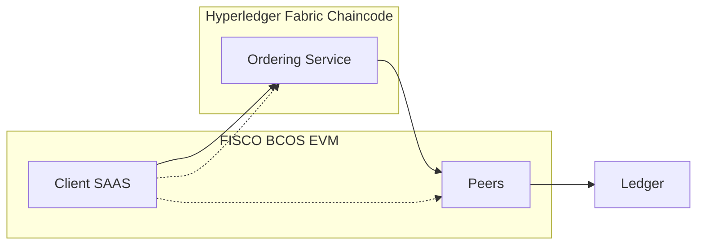

| Criterion | FISCO BCOS | Hyperledger Fabric |
|---|---|---|
| Smart contract | Solidity (EVM) | Chaincode (Go/Java/Node) |
| Privacy | Group/agency, permissioning | Channels, private data collections |
| Consensus | PBFT variants | Raft (v2+), pluggable |
| Tooling reuse | High (Ethereum stack) | Rich enterprise SDKs |

#### Comparisons
- EVM reuse vs channel privacy granularity; Solidity sec tooling vs Fabric endorsement policies.
- Technical Techniques, Protocols, Frameworks & Design Patterns: EVM, Solidity, PBFT, Raft, endorsement policies, private data collections, group-based permissioning, event sourcing.
- Theoretical Principles & Models: Byzantine fault tolerance, CAP trade-offs, deterministic replay, access control models.
- Practical Regulations, Permission Models & Use Cases: Consortium governance, KYC/AML partitioning, audit trails.

#### Technical Evaluation (Performance | Security | Scalability | Maintainability)
- Performance: Both achieve 100s–1,000s TPS with batching and parallel validation; measure p50/p95 latency.
- Security: Mature crypto primitives; audit supply chain of dependencies.
- Scalability: Horizontal peers; channels/groups partition state; consider ordering service bottlenecks.
- Maintainability: EVM familiarity vs chaincode language maintainers; CI for contracts/chaincode.
- Algorithm Complexity & Error Tolerance: BFT O(n^2) messaging; Raft leader-follower resilience.
- Reliability & HA: Multi-orderer (Fabric), multi-consensus nodes; quorum sizing.
- Hardware & Optimizations: NVMe, high core count, pinned containers; tune CouchDB or EVM caches.

#### Business Evaluation (Cost | Efficiency | Impact | Market Fit)
- Cost: Training vs hiring; ops for orderers/validators; audit costs.
- Efficiency: EVM reuse shortens time-to-market; Fabric’s granular privacy reduces legal friction.
- Impact: Faster settlements, reconciliations, and compliance reporting.
- Market Fit: Chinese enterprise ecosystems favor both; partner preferences matter.

#### Multi-Angle Evaluation
- Pros: Mature stacks; strong community support.
- Cons: Vendor/tooling lock-in patterns; added ops complexity.
- Risks: Misconfigured privacy; performance under heavy endorsement policies.
- Benefits: Compliance-aligned traceability; programmable incentives.
- Stakeholder Impact: Legal comfort with channels/privacy; engineers benefit from Solidity reuse.
- Market Sentiment: Positive for consortium chains in regulated verticals.
- Trust & Privacy/Transparency: Select models to satisfy least-privilege and auditability.

#### Collaboration & Communication Plan
- Stakeholders: Architecture, Backend, Legal/Compliance, Partners.
- Cadence: Bi-weekly architecture reviews; monthly performance benchmarks.
- Alignment: Proof-of-concept on both; shared SLO dashboard.

#### Organizational & Strategic Fit
- Business Model Impact: Enables RWA financing and automated settlement.
- Capabilities & Gaps: Solidity/Go skills; DevSecOps for blockchain.
- Change Management: Phased rollout; data governance council.
- Strategic Positioning: Bridge to future L2 liquidity.

#### Trade-offs & Decision Guidance
- Choose FISCO BCOS for EVM and token logic velocity; Fabric for fine-grained privacy and enterprise IAM alignment. Pilot, benchmark, and audit both before long-term commitment.

#### Context & Trend Signals
- Evolution: From PoC enterprise chains to production-grade BFT/raft systems.
- Regulation: Stronger data protection expectations (GDPR/PIPL); enterprise provenance demand.
- Future: Converging EVM-compatible permissioned stacks; L2 interop.
- Stats: Fabric wide adoption in supply chain; FISCO BCOS in Chinese finance/government.

#### Perspective-Based Insights
- Engineering: Contract ABIs vs chaincode APIs; SDK integration.
- Architecture: Ordering service sizing; privacy topology.
- Data Engineering: Event indexing, analytics warehouse.
- QA: Deterministic test harnesses.
- Product: Feature parity vs privacy requirements.
- PMO: Milestone gates tied to SLOs.
- Ops/DevOps: CI/CD for contracts; node health probes.
- Marketing: Partner co-marketing with vendors.

#### Market & Macro Systems Analysis
- Systemic Forces: Compliance and audit demand drive consortium adoption.
- Policy Trajectories: Privacy-by-design hardening.
- Liquidity Dynamics: EVM alignment eases future RWA distribution.
- Geopolitics: Data residency constraints shape choices.

#### Inference Summary
- Adoption Signals: Existing partner stacks (EVM or Fabric).
- Interoperability Impacts: EVM eases cross-chain bridges.
- Roadmap: Start with chosen stack; keep adapters for future interop.
- Operational Risks: Misconfigured endorsement policies; under-provisioned orderers.

#### Terminology & Key Concepts
- PBFT: Byzantine fault-tolerant consensus with message rounds; resilient to f faulty nodes where n ≥ 3f + 1.

#### Assumptions & Preconditions
- Assumes consortium with multiple orgs; data segmentation required.

#### Validation & Evidence Checks
- Run standard benchmarks with representative endorsement policies; profile CPU/IO hotspots.

#### Counterexamples & Edge Cases
- If strict per-transaction confidentiality is mandatory across many bilateral pairs, Fabric channels may dominate despite EVM familiarity.

#### Alternatives Considered
- Quorum/GoQuorum (EVM permissioned), Besu permissions; Tendermint-based permissioned stacks.

#### Codebase & Library References
- hyperledger/fabric (Apache-2.0), FISCO-BCOS/FISCO-BCOS (GPLv3) — SDKs in Go/Java/Node, EVM toolchain.

#### Authoritative Literature & Reports
- Castro, M., & Liskov, B. (1999). Practical Byzantine Fault Tolerance. OSDI.  
- Hyperledger Fabric Docs (v2+). https://hyperledger-fabric.readthedocs.io/

#### Actionable Conclusions & Next Steps
- Build two thin vertical slices (digital lease + settlement) on both stacks; decide via SLOs and auditability.

#### Open Questions & Research Agenda
- Evaluate developer velocity and audit readiness across stacks; test EVM interop requirements.

#### APA Style Source Citations
- Castro, M., & Liskov, B. (1999). Practical Byzantine Fault Tolerance. In OSDI.  
- The Linux Foundation. (2023). Hyperledger Fabric documentation (v2+). https://hyperledger-fabric.readthedocs.io/
- FISCO BCOS. (2024). FISCO BCOS Documentation. https://fisco-bcos-documentation.readthedocs.io/

---

### Q2: How do you design permissioning and identity in a consortium mobility network with regulators and rental firms?

**Difficulty:** Foundational  
**Question Type:** Theoretical/Practical

#### Answer Narrative (150-300 words)
Consortium identity should start with a PKI-backed MSP (Fabric) or CA certificates (FISCO) to anchor organizations and node identities. Roles include validator, orderer, operator, auditor, oracle, and application clients. Implement layered authorization: organization-level membership, channel/group participation, and contract-level RBAC. For user-level identity (drivers/managers), use OIDC/OAuth2 for app authentication and mint short-lived, scoped credentials for gateway access; map to on-chain identities via DID or internal registry. Sensitive PII remains off-chain; store hashed pointers with salted hashes and verifiable credentials. For regulators, provide read-only auditor roles with channel access and query views. Apply least privilege and rotate keys using HSM/TEE-backed KMS. Enforce governance for onboarding/offboarding: certificate issuance, CRLs, and policy updates as code with multisig approvals. Include data residency and traceability controls with signed logs.

#### Supporting Artifacts

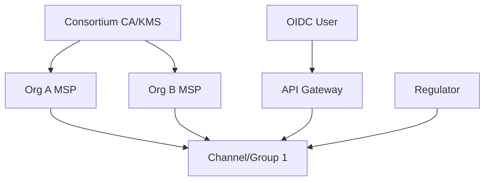

| Layer | Mechanism | Example |
|---|---|---|
| Org Identity | CA/MSP | X.509 certs, CRLs |
| Access | Channels/Groups | Fabric channels, FISCO groups |
| App Auth | OIDC/OAuth2 | Keycloak, Auth0 |
| On-chain AuthZ | RBAC in contract | Role enums, policy modules |

#### Comparisons
- CA/MSP vs DID-based identity bridging; off-chain auth vs direct wallet-based auth.
- Techniques: X.509, CRL/OCSP, OIDC/OAuth2, DID/VCs, RBAC/ABAC, KMS/HSM.
- Principles: Least privilege, separation of duties, non-repudiation.
- Practice: Regulator read-only channels, audit trails.

#### Technical Evaluation
- Performance: Authn off-chain caches; sign/verify costs amortized.
- Security: HSM-backed keys; CRL distribution; policy-as-code reviews.
- Scalability: Federate CAs; shard channels/groups by data domains.
- Maintainability: Rotations automated; IAM integration playbooks.

#### Business Evaluation
- Cost: Managed IdP reduces build; HSM/KMS cost justified by risk.
- Efficiency: Faster partner onboarding; clearer audit.
- Impact: Compliance readiness; reduced breach blast radius.
- Market Fit: Aligns with enterprise IAM standards.

#### Multi-Angle Evaluation
- Pros: Fine-grained control; auditable.
- Cons: IAM complexity; cert lifecycle overhead.
- Risks: Misconfigured channel policies.
- Benefits: Regulator trust; partner autonomy.
- Stakeholder Impact: Security confidence; clearer responsibilities.

#### Collaboration & Communication Plan
- Roles: IAM, Security, Blockchain Ops, Legal.
- Cadence: Monthly CA policy reviews; quarterly audits.
- Tactics: Policy-as-code PRs; tabletop incident drills.

#### Organizational & Strategic Fit
- Business Impact: Simplifies compliance assurance.
- Capabilities: CA ops, IdP management.
- Governance: Onboarding/offboarding runbooks.
- Strategy: Interop with external regulators via read-only nodes.

#### Trade-offs & Decision Guidance
- Balance RBAC simplicity with ABAC flexibility; keep PII off-chain with hashed attestations.

#### Context & Trend Signals
- Rising adoption of DID/VCs; stricter privacy laws.

#### Perspective-Based Insights
- Engineering: Token exchange with IdP.
- Architecture: CA topology; CRL distribution.
- Data: VC schemas and revocation.
- QA: AuthZ tests and fuzzing.

#### Market & Macro Systems Analysis
- Policy: KYC/AML identity mandates; auditability norms.

#### Inference Summary
- Adoption Signals: Partners with mature IAM prefer MSP/CA mapping.

#### Terminology & Key Concepts
- MSP: Membership Service Provider defining org identities and policies.

#### Assumptions & Preconditions
- Consortium members can federate to a root CA; IdP exists.

#### Validation & Evidence Checks
- Verify certificate chains; test CRL/OCSP behavior.

#### Counterexamples & Edge Cases
- Offline regulators; provide snapshot-based proofs for periodic audits.

#### Alternatives Considered
- Wallet-native DID-only auth; higher user friction and compliance ambiguity.

#### Codebase & Library References
- hyperledger/fabric-ca; Keycloak; go-ethereum crypto libs.

#### Authoritative Literature & Reports
- NIST SP 800-57 for key management; W3C DID/VC specifications.

#### Actionable Conclusions & Next Steps
- Stand up CA hierarchy; define RBAC matrices; integrate IdP.

#### Open Questions & Research Agenda
- Evaluate DID/VC for regulator attestations.

#### APA Style Source Citations
- National Institute of Standards and Technology. (2020). SP 800-57 Part 1 Rev. 5. https://doi.org/10.6028/NIST.SP.800-57pt1r5  
- W3C. (2022). Decentralized Identifiers (DIDs) v1.0. https://www.w3.org/TR/did-core/

---

### Q3: Which consensus and performance tuning strategies would you apply to meet sub-500 ms p95 latency and 1,000+ TPS?

**Difficulty:** Intermediate  
**Question Type:** Practical/Scenario

#### Answer Narrative (150-300 words)
Targeting sub-500 ms p95 and 1,000+ TPS requires end-to-end queuing and batching discipline. For FISCO BCOS (PBFT variants), tune view-change timeouts, batch sizes, and parallel EVM execution where supported; isolate consensus/quorum nodes on low-latency networks. For Fabric, prefer Raft with 3–5 orderers, set adequate snapshot/segment sizes, and right-size endorsement policies (e.g., 2-of-N) to minimize cross-org latencies. Use LevelDB when rich queries are not needed; otherwise tune CouchDB (indexes, HTTP keep-alive, cache). Enable client-side load shedding and idempotent retry with exponential backoff. Profile critical paths: signature verifications, state DB reads/writes, and event emission. Employ async commit acknowledgments and micro-batching in the gateway. Conduct capacity tests with realistic endorsement/topology and gradually increase concurrency to map saturation points. Always separate read-only query paths (event-driven indexing, materialized views) from write paths, and avoid hot-key contention via sharding or key prefix partitioning.

#### Supporting Artifacts

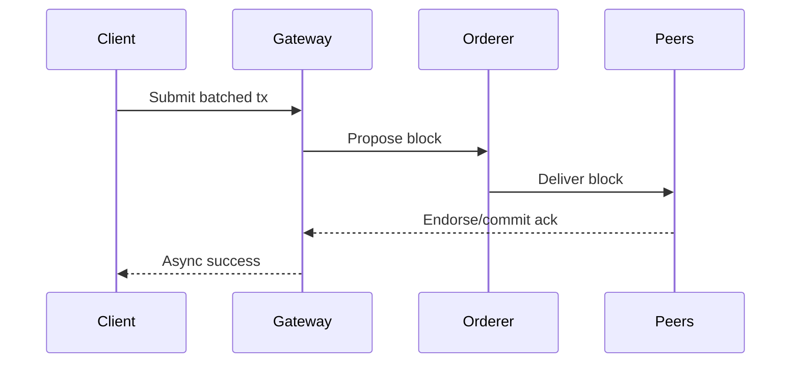

| Tuning Area | Technique | Notes |
|---|---|---|
| Batching | Block size/time | Control p95 latency |
| Endorsement | 2-of-N policy | Reduce cross-org waits |
| State DB | LevelDB vs CouchDB | Index hot queries |
| Network | Low-latency links | Pin CPU, isolate I/O |

#### Comparisons
- PBFT message complexity vs Raft leader throughput.
- Techniques: Micro-batching, async acks, idempotency keys, pre-indexing.
- Principles: Little’s Law, backpressure, queueing.
- Practice: Performance SLO dashboards.

#### Technical Evaluation
- Performance: Target p50<200 ms, p95<500 ms under nominal load.
- Security: Preserve endorsement guarantees.
- Scalability: Horizontal peers; shard keys.
- Maintainability: Config as code; test profiles versioned.

#### Business Evaluation
- Cost: NVMe/CPU spend vs reduced SLA penalties.
- Efficiency: Higher throughput -> lower per-transaction overhead.
- Impact: Faster settlements, better UX.
- Market Fit: Competitive latency vs centralized systems.

#### Multi-Angle Evaluation
- Pros: Predictable latency, better UX.
- Cons: Operational tuning overhead.
- Risks: Over-batching increases tail latency.
- Benefits: Capacity headroom.

#### Collaboration & Communication Plan
- Stakeholders: SRE, Backend, Blockchain Ops.
- Cadence: Weekly performance tests; canary rollouts.

#### Organizational & Strategic Fit
- Capability: Perf engineering; chaos testing.

#### Trade-offs & Decision Guidance
- Balance batching with tail latency; simplify endorsement policies.

#### Context & Trend Signals
- Increasing enterprise TPS expectations; NVMe ubiquity.

#### Perspective-Based Insights
- Engineering: Idempotent retries and tracing.
- Data: Hot key distribution awareness.

#### Market & Macro Systems Analysis
- SLA-driven contracts favor predictable p95.

#### Inference Summary
- Adoption: Mature perf SRE -> feasible SLOs.

#### Terminology & Key Concepts
- Little’s Law: L = λW linking throughput, latency, and concurrency.

#### Assumptions & Preconditions
- Cross-org network <10 ms RTT between validators.

#### Validation & Evidence Checks
- Load test with production-like topology; record saturation curves.

#### Counterexamples & Edge Cases
- High variance networks; mitigate with co-location or edge peers.

#### Alternatives Considered
- Kafka orderer (legacy) vs Raft; BFT-SMaRt variants.

#### Codebase & Library References
- hyperledger/fabric; FISCO-BCOS; benchmark tools (caliper).

#### Authoritative Literature & Reports
- Cooper, R. (2019). Hyperledger Caliper. Linux Foundation.  
- FISCO BCOS Performance Whitepaper.

#### Actionable Conclusions & Next Steps
- Implement micro-batching and 2-of-N policies; run weekly Caliper tests.

#### Open Questions & Research Agenda
- Evaluate GPU offload for signature verification.

#### APA Style Source Citations
- The Linux Foundation. (2023). Hyperledger Caliper documentation. https://hyperledger.github.io/caliper/  
- FISCO BCOS. (2023). Performance Whitepaper. https://fisco-bcos-documentation.readthedocs.io/

---

### Q4: What smart contract architecture would you use for digital lease agreements and commission split in an RWA context?

**Difficulty:** Intermediate  
**Question Type:** Practical/Scenario

#### Answer Narrative (150-300 words)
Model leases as state machines with clear lifecycle: Draft → Active → Settled → Disputed → Resolved. Store essential terms on-chain (asset ID, lessor/lessee, rate, duration, collateral) and keep sensitive attachments off-chain with IPFS/Arweave hashes. Commission contracts distribute revenue among rental company (B), platform manager (small B), and driver with configurable percentages and clawbacks. Use upgradeable proxy patterns only under rigorous governance, or prefer versioned contracts with migration functions to reduce upgrade risk. Emit events for all transitions to power analytics. Include role-based access (OWNER, AUDITOR, ORACLE) and reentrancy guards. For RWA mapping, maintain an asset registry that binds VIN/TBox fingerprint to token IDs; use a compliance module to gate transfers based on KYC/blacklists. Implement pause/kill switches gated by multisig governance. Write invariant tests (e.g., sum of shares == 100%) and property-based tests for edge cases such as early termination and partial payments.

#### Supporting Artifacts

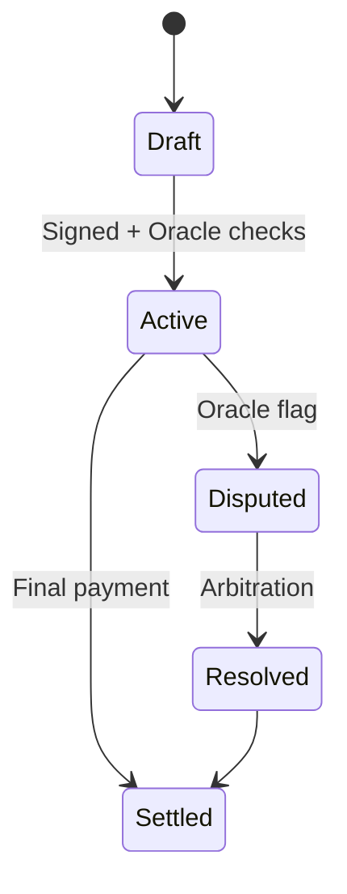

| Module | Responsibility | Notes |
|---|---|---|
| LeaseRegistry | Lifecycle, terms | Events, RBAC |
| CommissionSplit | Revenue splits | Invariants, clawback |
| AssetRegistry | VIN→Token binding | Compliance gate |
| OracleAdapter | External data | Rate, violation feeds |

#### Comparisons
- Proxy upgrades vs versioned deployments; monolith vs modular contracts.
- Techniques: RBAC, invariant testing, event sourcing, proxy patterns.
- Principles: Least authority, single responsibility, explicit state machines.

#### Technical Evaluation
- Performance: Minimal storage writes; event-heavy design for reads.
- Security: Access control, pausable, reentrancy-safe, compliance gates.
- Scalability: Modular contracts; off-chain indexing.
- Maintainability: Versioned interfaces; semver.

#### Business Evaluation
- Cost: Gas/storage minimized via packing and events.
- Efficiency: Automated settlement reduces ops.
- Impact: Clear audit trail; faster financing.
- Market Fit: Aligns with asset-backed lending needs.

#### Multi-Angle Evaluation
- Pros: Clarity; auditability.
- Cons: Upgrade complexity.
- Risks: Oracle dependency; mis-specified terms.
- Benefits: Predictable payouts.

#### Collaboration & Communication Plan
- Legal reviews of templates; joint testing with finance ops.

#### Organizational & Strategic Fit
- Supports RWA financing and secondary market readiness.

#### Trade-offs & Decision Guidance
- Prefer versioned contracts unless strong need for proxy upgrades; enforce governance.

#### Context & Trend Signals
- Enterprise shift to event-driven patterns and off-chain analytics.

#### Perspective-Based Insights
- QA: Property-based tests for payouts.
- Ops: Runbooks for pauses and disputes.

#### Market & Macro Systems Analysis
- Lenders demand determinism and transparency.

#### Inference Summary
- Modular, event-driven contracts ease audits and analytics.

#### Terminology & Key Concepts
- Invariant: Property that must always hold (e.g., sum of shares).

#### Assumptions & Preconditions
- Oracles provide reliable settlement inputs.

#### Validation & Evidence Checks
- Slither/Mythril static analysis; Echidna fuzzing.

#### Counterexamples & Edge Cases
- Dispute storms; rate-limit oracle effects.

#### Alternatives Considered
- Centralized settlement; loses auditability.

#### Codebase & Library References
- OpenZeppelin Contracts; Hardhat/Truffle; Slither, Echidna.

#### Authoritative Literature & Reports
- OpenZeppelin Docs; Ethereum Yellow Paper for EVM semantics.

#### Actionable Conclusions & Next Steps
- Implement minimal viable modules; audit before production.

#### Open Questions & Research Agenda
- Evaluate formal verification (Certora/KEVM) for critical invariants.

#### APA Style Source Citations
- OpenZeppelin. (2024). OpenZeppelin Contracts. https://docs.openzeppelin.com/contracts/  
- Wood, G. (2014). Ethereum: A secure decentralised generalised transaction ledger. https://ethereum.github.io/yellowpaper/paper.pdf

---

### Q5: How do you handle off-chain storage (IPFS/Arweave) for contracts and evidence under GDPR/PIPL constraints?

**Difficulty:** Foundational  
**Question Type:** Practical

#### Answer Narrative (150-300 words)
Store large documents (lease PDFs, images, telemetry archives) in IPFS/Arweave and reference their content hashes on-chain. To comply with GDPR/PIPL erasure requirements, keep only encrypted blobs off-chain and store encryption keys in a revocable KMS; on “delete,” purge keys (crypto-shredding) and remove access gateways. Avoid uploading plain PII to immutable stores. Use salting and keyed hashing (HMAC) for on-chain fingerprints to prevent dictionary attacks. Maintain access via authenticated gateways (enterprise IPFS pinning, Arweave gate policies). Version and timestamp evidence; maintain Merkle proofs for collections. For regulators, provide read-only portals with redaction and data minimization. Document data lineage and consent; run Data Protection Impact Assessments (DPIA). Ensure data residency by pinning nodes in required regions and controlling replication scope.

#### Supporting Artifacts

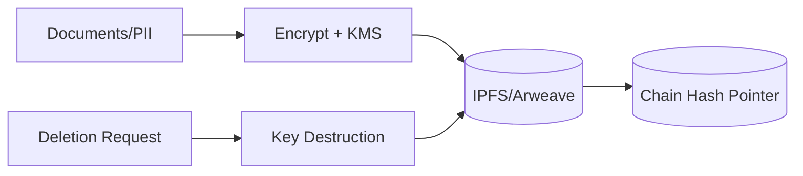

| Concern | Technique | Tooling |
|---|---|---|
| Erasure | Crypto-shredding | KMS/HSM |
| Linkability | Salted/HMAC hashes | HMAC-SHA256 |
| Residency | Region pin policies | Private IPFS |
| Access | Auth gateways | JWT/OIDC |

#### Comparisons
- Plain hash pointers vs encrypted blobs + key revocation.
- Techniques: HMAC, crypto-shredding, Merkle proofs, pinning policies.
- Principles: Data minimization, purpose limitation.

#### Technical Evaluation
- Performance: Gateway caching; batched writes.
- Security: Strong encryption (AES-GCM); key lifecycle in HSM.
- Scalability: Pinning clusters; CDN.
- Maintainability: Data catalogs and lineage.

#### Business Evaluation
- Cost: Storage/pinning fees vs compliance risk.
- Efficiency: Faster evidence retrieval; fewer legal escalations.
- Impact: Trust with regulators.
- Market Fit: Enterprise-grade archiving.

#### Multi-Angle Evaluation
- Pros: Auditability without PII exposure.
- Cons: Gateway complexity.
- Risks: Key loss locking data.
- Benefits: Compliance and integrity.

#### Collaboration & Communication Plan
- DPO, Legal, Security, Data Engineering alignment on DPIA.

#### Organizational & Strategic Fit
- Supports cross-border operations with regional controls.

#### Trade-offs & Decision Guidance
- Prefer encrypted storage; never pin raw PII.

#### Context & Trend Signals
- Increasing enforcement of erasure and data minimization.

#### Perspective-Based Insights
- Engineering: Envelope encryption for large files.

#### Market & Macro Systems Analysis
- Regulatory regimes tightening globally.

#### Inference Summary
- Keys-as-control-plane satisfies erasure semantics on immutable media.

#### Terminology & Key Concepts
- Crypto-shredding: Destroying keys to render ciphertext irretrievable.

#### Assumptions & Preconditions
- HSM-backed KMS; consent captured.

#### Validation & Evidence Checks
- Simulate key deletion; verify access is impossible.

#### Counterexamples & Edge Cases
- Third-party re-pinning copies; mitigate via agreements and access control.

#### Alternatives Considered
- Centralized object storage; weaker integrity guarantees.

#### Codebase & Library References
- ipfs/kubo; arweave; hashicorp/vault.

#### Authoritative Literature & Reports
- EDPB GDPR guidelines; CN PIPL text and commentaries.

#### Actionable Conclusions & Next Steps
- Implement envelope encryption; build redaction workflows.

#### Open Questions & Research Agenda
- Threshold cryptography for escrowed access.

#### APA Style Source Citations
- European Data Protection Board. (2020). Guidelines on GDPR. https://edpb.europa.eu/  
- Standing Committee of the National People’s Congress. (2021). Personal Information Protection Law of the PRC.

---

## Consensus, Contracts, Security & Performance (Questions 6-12)

### Q6: What tokenization models suit vehicle RWA—title tokens, revenue-share tokens, or structured notes?

**Difficulty:** Intermediate  
**Question Type:** Theoretical/Practical

#### Answer Narrative (150-300 words)
Vehicle RWA can be represented as (1) title tokens reflecting ownership (often non-fungible, with liens/encumbrances), (2) revenue-share tokens entitling holders to rental income streams (fungible or tranche-based), or (3) structured notes combining principal protection with variable coupons linked to utilization rates. Compliance wrappers restrict transfers to KYC’d investors and enforce lock-ups. On-chain registries bind VIN/TBox fingerprints and lien statuses; oracle inputs verify insurance, registration, and valuation. Revenue-share tokens simplify financing and align with off-balance-sheet SPV structures; title tokens require closer integration with legal title registries. Implement waterfall logic for cash flows, reserve accounts for maintenance, and default scenarios with repossession logic triggered by telemetry and legal workflows. Start with revenue-share tokens for faster time-to-market, adding title tokens once legal rails mature.

#### Supporting Artifacts

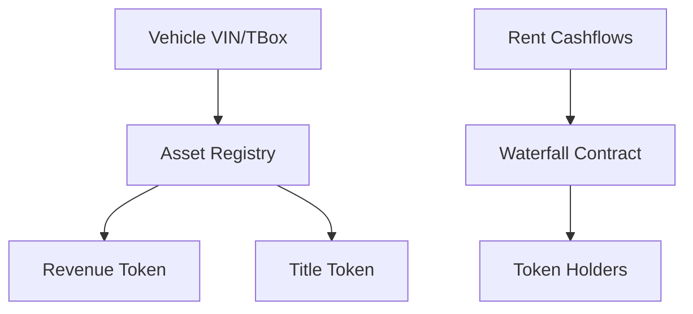

| Model | Pros | Cons |
|---|---|---|
| Title Token | Strong ownership | Legal/title integration heavy |
| Revenue-Share | Faster go-live | Investor rights complexity |
| Structured Note | Risk/return tuning | Complex disclosures |

#### Comparisons
- Asset title certainty vs financing speed.
- Techniques: Compliance transfer restrictions, waterfall payouts, SPV linkage.
- Principles: True sale, bankruptcy remoteness, investor protection.

#### Technical Evaluation
- Performance: Event-driven payouts; batch distributions.
- Security: Compliance gates; oracle attestations.
- Scalability: Tranches and holder registries.
- Maintainability: Modular cashflow logic.

#### Business Evaluation
- Cost: Legal documentation vs distribution reach.
- Efficiency: Revenue-share minimizes friction.
- Impact: Unlocks working capital.
- Market Fit: Matches private credit appetite.

#### Multi-Angle Evaluation
- Pros: Programmable compliance and cashflows.
- Cons: Legal complexity.
- Risks: Oracle misreports; transfer to ineligible investors.

#### Collaboration & Communication Plan
- Legal, Finance, Blockchain dev co-design term sheets.

#### Organizational & Strategic Fit
- Phased roadmap from revenue-share to title-backed issuance.

#### Trade-offs & Decision Guidance
- Start with revenue-share; pilot title tokens in limited jurisdictions.

#### Context & Trend Signals
- BIS, MAS, HKMA pilots show momentum for tokenized assets.

#### Perspective-Based Insights
- Product: Investor relations and disclosure UX.

#### Market & Macro Systems Analysis
- Private credit liquidity cycles influence demand.

#### Inference Summary
- Revenue-share first; expand to title when legal rails mature.

#### Terminology & Key Concepts
- SPV: Special purpose vehicle for asset securitization.

#### Assumptions & Preconditions
- KYC/AML stack; compliant investor onboarding.

#### Validation & Evidence Checks
- Waterfall payout simulations under stress.

#### Counterexamples & Edge Cases
- Jurisdictions banning tokenized securities; geo-fence transfers.

#### Alternatives Considered
- Off-chain syndicated loans; less transparent.

#### Codebase & Library References
- OpenZeppelin ERC-20/721/1155 extensions; Tokenized cashflow libraries.

#### Authoritative Literature & Reports
- BIS (2023) reports on tokenization; MAS Project Guardian updates.

#### Actionable Conclusions & Next Steps
- Implement revenue-share tokens with compliance module; run pilot.

#### Open Questions & Research Agenda
- Explore on-chain registries tied to motor vehicle departments.

#### APA Style Source Citations
- Bank for International Settlements. (2023). Tokenisation experiments. https://www.bis.org/  
- Monetary Authority of Singapore. (2024). Project Guardian updates. https://www.mas.gov.sg/

---

### Q7: How would you design oracle integration for traffic violations, insurance status, and market prices?

**Difficulty:** Intermediate  
**Question Type:** Practical

#### Answer Narrative (150-300 words)
Use a hybrid oracle approach: (1) pull-based signed data feeds for market prices (e.g., Chainlink), (2) push-based event subscriptions from authoritative APIs (traffic violations, insurance) via enterprise oracle adapters, and (3) proof-of-origin attestation (mTLS + signed payloads). Aggregate multiple sources, timestamp with block numbers, and set deviation thresholds and heartbeat intervals. Contracts should read from a canonical OracleRegistry with staleness checks and circuit breakers. For sensitive PII, store off-chain; only attest booleans or scores on-chain. Apply replay protection and sequence numbers. Include fallback to manual attestation with multisig if feeds fail. Monitor feeds with SLOs, and simulate failure modes (stuck, manipulated, delayed) with chaos testing. Maintain data provider SLAs and audit logs.

#### Supporting Artifacts

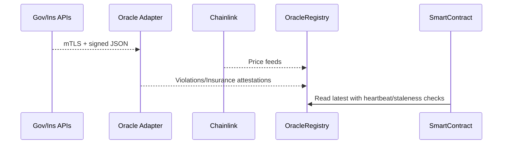

| Feed | Source | Update Policy |
|---|---|---|
| Prices | Chainlink | Heartbeat + deviation |
| Violations | Gov API | Event-driven |
| Insurance | Insurer API | Daily + events |

#### Comparisons
- On-chain price feeds vs enterprise API adapters.
- Techniques: Heartbeat, deviation thresholds, circuit breakers, signed payloads.
- Principles: Least disclosure, replay protection.

#### Technical Evaluation
- Performance: Cached reads; batched updates.
- Security: Signed payloads, mTLS, quorum of feeds.
- Scalability: Feed multiplexing; topic-based routing.
- Maintainability: Provider SLAs, schema versioning.

#### Business Evaluation
- Cost: Oracle fees; API licensing.
- Efficiency: Automated compliance checks.
- Impact: Reduces fraud; accelerates settlement.
- Market Fit: Enterprise-grade assurances.

#### Multi-Angle Evaluation
- Pros: Resilient multi-source design.
- Cons: Ops complexity; provider contracts.
- Risks: Data source outages; regulatory API changes.

#### Collaboration & Communication Plan
- Legal for data rights; Security for PKI; Dev for adapters.

#### Organizational & Strategic Fit
- Key enabler for RWA risk monitoring.

#### Trade-offs & Decision Guidance
- Prefer attestations over raw PII; keep staleness guardrails tight.

#### Context & Trend Signals
- Growth of decentralized oracles and enterprise bridges.

#### Perspective-Based Insights
- Ops: On-call rotations for oracle outages.

#### Market & Macro Systems Analysis
- Price volatility requires robust deviation policies.

#### Inference Summary
- Multi-source, signed, and monitored oracles minimize systemic risk.

#### Terminology & Key Concepts
- Heartbeat: Minimum update interval regardless of price moves.

#### Assumptions & Preconditions
- Access to gov/ins APIs with SLAs.

#### Validation & Evidence Checks
- Chaos tests: stuck, delayed, manipulated feeds.

#### Counterexamples & Edge Cases
- API schema changes; roll forward via adapter versioning.

#### Alternatives Considered
- Single-source oracles; unacceptable risk.

#### Codebase & Library References
- smartcontractkit/chainlink; enterprise signing libs.

#### Authoritative Literature & Reports
- Chainlink whitepaper and docs; ENISA API security guidelines.

#### Actionable Conclusions & Next Steps
- Implement OracleRegistry with staleness and circuit breakers; integrate Chainlink.

#### Open Questions & Research Agenda
- Evaluate CCIP for cross-chain oracle portability.

#### APA Style Source Citations
- Ellis, S., Juels, A., & Nazarov, S. (2017). Chainlink: A decentralized oracle network. https://chain.link/whitepaper  
- European Union Agency for Cybersecurity. (2019). API Security Guidelines. https://www.enisa.europa.eu/publications/api-security-guidelines

---

### Q8: How do you ensure IoT TBox telemetry integrity and selective on-chain anchoring?

**Difficulty:** Intermediate  
**Question Type:** Practical/Scenario

#### Answer Narrative (150-300 words)
TBox devices should sign telemetry with device-bound keys (secure elements/TEE) and rotate keys via over-the-air (OTA) policies. Data pipelines perform ingestion (MQTT/HTTPS), verification, and normalization. Anchor periodic Merkle roots of telemetry batches on-chain to guarantee tamper-evidence without storing raw PII. For high-value signals (e.g., odometer, GPS at rental start/end), commit signed summaries or zero-knowledge attestations to protect privacy. Use remote attestation for device firmware integrity and attest firmware versions in the asset registry. Apply rate limiting, anti-replay windows, and nonce sequencing. Store raw telemetry in a time-series database with WORM policies and retention tiers. Provide auditors with proofs (Merkle path + signature chain) to verify any record against on-chain anchors.

#### Supporting Artifacts

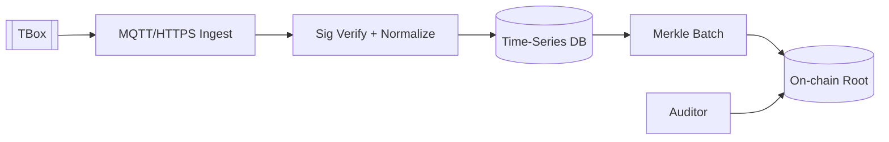

| Control | Mechanism | Tool |
|---|---|---|
| Signing | Device keys | SE/TEE |
| Anchoring | Merkle roots | Keccak/SHA-256 |
| Privacy | ZK attestations | zk-SNARKs |
| Storage | WORM tiers | TSDB + object store |

#### Comparisons
- Full data on-chain vs root anchoring + proofs.
- Techniques: Merkle batching, OTA key rotation, remote attestation.
- Principles: Tamper evidence, minimal disclosure.

#### Technical Evaluation
- Performance: Anchoring costs amortized per batch.
- Security: SE/TEE keys; attested firmware.
- Scalability: Batch by time/vehicle; shard topics.
- Maintainability: OTA policies; schema versioning.

#### Business Evaluation
- Cost: Lower on-chain fees; TSDB storage tiers.
- Efficiency: Faster audits; privacy-compliant.
- Impact: Trustworthy utilization metrics.
- Market Fit: Enterprise telematics standards.

#### Multi-Angle Evaluation
- Pros: Strong integrity and privacy.
- Cons: Added pipeline complexity.
- Risks: Key compromise; OTA failures.

#### Collaboration & Communication Plan
- Work with hardware vendors, Security, Data.

#### Organizational & Strategic Fit
- Core to performance-based financing.

#### Trade-offs & Decision Guidance
- Anchor roots; keep PII off-chain; selective ZK for sensitive claims.

#### Context & Trend Signals
- Growth in ZK attestations for IoT.

#### Perspective-Based Insights
- Data Engineering: Time-based batching windows.

#### Market & Macro Systems Analysis
- Insurance and lenders prefer cryptographically verified data.

#### Inference Summary
- Merkle anchoring delivers integrity with privacy.

#### Terminology & Key Concepts
- Remote attestation: Proving device firmware state.

#### Assumptions & Preconditions
- TBox supports secure keys and OTA.

#### Validation & Evidence Checks
- Pen-tests on OTA & key extraction; audit Merkle proofs.

#### Counterexamples & Edge Cases
- Offline devices; buffer and sign with monotonic counters.

#### Alternatives Considered
- Full on-chain storage; impractical for volume/privacy.

#### Codebase & Library References
- libp2p/mqtt brokers; zkSNARK libs; Merkle tree libraries.

#### Authoritative Literature & Reports
- NIST IoT device cybersecurity baseline; ZK proof systems literature.

#### Actionable Conclusions & Next Steps
- Implement anchoring service; pilot ZK attestations for odometer.

#### Open Questions & Research Agenda
- Evaluate device attestation standards (DICE, PSA Certified).

#### APA Style Source Citations
- National Institute of Standards and Technology. (2022). IoT Device Cybersecurity Baseline. https://www.nist.gov/  
- Ben-Sasson, E. et al. (2014). Zerocash. IEEE S&P.

---

### Q9: How would you design the gateway service in Go/Java/Node to be reliable and idempotent under retries?

**Difficulty:** Intermediate  
**Question Type:** Practical

#### Answer Narrative (150-300 words)
The gateway should expose idempotent endpoints with client-provided idempotency keys and enforce deduplication via a write-ahead log (WAL) or durable cache. Use transactional outbox/inbox patterns to ensure at-least-once semantics while preventing duplicates on chain. Implement circuit breakers, bulkheads, and exponential backoff with jitter. For reads, return strongly consistent views when possible, and clearly label eventual consistency paths sourced from indices. Sign requests to the blockchain nodes, enforce TLS/mTLS, and throttle per-tenant. Maintain request tracing (W3C Trace Context) across services and include on-chain tx hashes in logs. Support micro-batching to amortize costs and async acknowledgments when business allows. Provide health endpoints and SLOs. Containerize with resource limits; implement blue/green or canary deployments with versioned APIs.

#### Supporting Artifacts

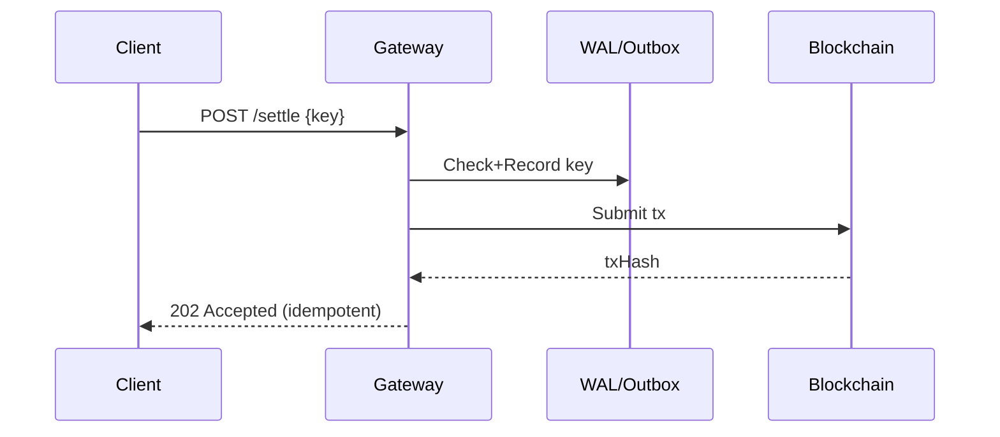

| Pattern | Purpose | Tooling |
|---|---|---|
| Idempotency key | De-dup | Redis/DB WAL |
| Transactional outbox | Reliable publish | Debezium |
| Circuit breaker | Resilience | Resilience4j |
| Tracing | Observability | OpenTelemetry |

#### Comparisons
- Idempotency keys vs exactly-once illusions; async 202 vs sync 200.

#### Technical Evaluation
- Performance: Micro-batching; async ack.
- Security: mTLS; request signing.
- Scalability: Stateless workers + WAL.
- Maintainability: Versioned APIs; canary deploys.

#### Business Evaluation
- Cost: Reduced duplicate tx fees.
- Efficiency: Better throughput at stable latency.
- Impact: Predictable UX.
- Market Fit: Enterprise-grade reliability.

#### Multi-Angle Evaluation
- Pros: Strong resilience.
- Cons: Slightly complex state management.

#### Collaboration & Communication Plan
- SRE + Backend define SLOs and error budgets.

#### Organizational & Strategic Fit
- Aligns with fintech reliability norms.

#### Trade-offs & Decision Guidance
- Prefer at-least-once + idempotency over fragile exactly-once.

#### Context & Trend Signals
- OpenTelemetry adoption.

#### Perspective-Based Insights
- QA: Chaos retries and failure injection.

#### Market & Macro Systems Analysis
- SLAs reward predictable behavior.

#### Inference Summary
- Idempotent, traced gateway reduces risk and cost.

#### Terminology & Key Concepts
- Idempotency: Multiple identical requests yield one effect.

#### Assumptions & Preconditions
- Durable store available for keys.

#### Validation & Evidence Checks
- Load tests with retry storms.

#### Counterexamples & Edge Cases
- Long-lived locks; use TTL and retry-after.

#### Alternatives Considered
- Best-effort without keys; higher cost and risk.

#### Codebase & Library References
- OpenTelemetry, Resilience4j, Fabric/FISCO SDKs.

#### Authoritative Literature & Reports
- IETF (2020). RFC 7231/Idempotency semantics.  
- Microsoft Patterns & Practices: Transactional outbox.

#### Actionable Conclusions & Next Steps
- Implement idempotency middleware; ship tracing and SLOs.

#### Open Questions & Research Agenda
- Evaluate gRPC streaming for batch submit.

#### APA Style Source Citations
- Fielding, R. et al. (2014). RFC 7231: Hypertext Transfer Protocol (HTTP/1.1): Semantics and Content. IETF.  
- Microsoft. (2023). Cloud Design Patterns – Transactional Outbox.

---

### Q10: How will you secure and audit Solidity contracts for revenue splits and RWA compliance?

**Difficulty:** Intermediate  
**Question Type:** Practical

#### Answer Narrative (150-300 words)
Security starts with threat modeling (reentrancy, integer issues, oracle manipulation, access control bypass, upgrade risk). Use battle-tested libraries (OpenZeppelin), enable compiler safety features, and apply checks-effects-interactions. Enforce RBAC and pause/kill switches via multisig. Static analysis (Slither), symbolic execution (Mythril), property-based fuzzing (Echidna), and differential tests catch issues early. Write formal specs for invariants (e.g., no loss of funds, sum of shares == 100%). Limit external calls and validate oracle inputs against staleness thresholds. Use time-locks for sensitive operations and timelined upgrades. Commission third-party audits and run continuous monitoring for anomalous events. Maintain SBOMs and pin tool versions.

#### Supporting Artifacts

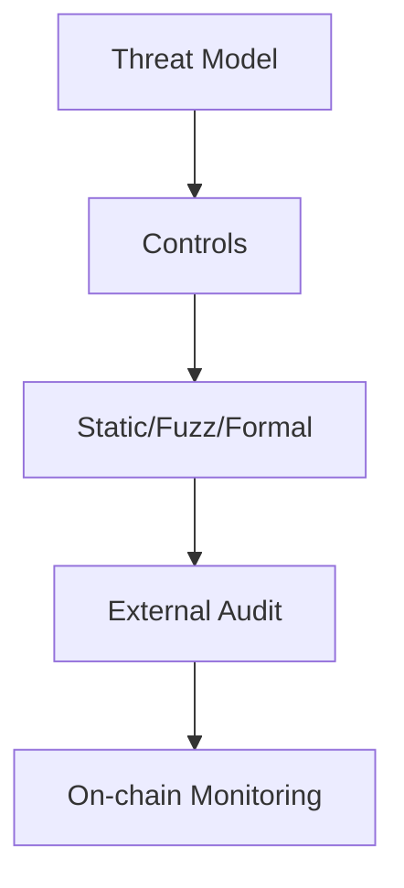

| Control | Tool | Purpose |
|---|---|---|
| Static Analysis | Slither | Detect anti-patterns |
| Fuzzing | Echidna | Property violations |
| Symbolic | Mythril | Path exploration |
| Libraries | OpenZeppelin | Safe primitives |

#### Comparisons
- Monolithic audits vs continuous verification pipelines.

#### Technical Evaluation
- Performance: Minimal overhead; cost on test infra.
- Security: Defense-in-depth; audit trails.
- Scalability: Modular test suites; CI runners.
- Maintainability: Version pinning; SBOM.

#### Business Evaluation
- Cost: Audit fees justified by risk reduction.
- Efficiency: Early bug catch lowers rework.
- Impact: Investor/regulator confidence.
- Market Fit: Standard practice for token offerings.

#### Multi-Angle Evaluation
- Pros: Strong assurance.
- Cons: Time and cost.

#### Collaboration & Communication Plan
- Security reviews at design/PR; audit vendor coordination.

#### Organizational & Strategic Fit
- Prerequisite for financing and listings.

#### Trade-offs & Decision Guidance
- Prefer more tests and smaller upgrade scope.

#### Context & Trend Signals
- Growing use of formal verification tooling.

#### Perspective-Based Insights
- QA: Property invariants first-class citizens.

#### Market & Macro Systems Analysis
- Audit reputation affects distribution channels.

#### Inference Summary
- Layered assurance is non-negotiable.

#### Terminology & Key Concepts
- SBOM: Software Bill of Materials.

#### Assumptions & Preconditions
- Budget/time for audits.

#### Validation & Evidence Checks
- Track defect discovery rates over time.

#### Counterexamples & Edge Cases
- Emergency patches; have pre-audited kill switches.

#### Alternatives Considered
- Post-deploy audits; unacceptable risk.

#### Codebase & Library References
- trailofbits/slither; ConsenSys/mythril; crytic/echidna.

#### Authoritative Literature & Reports
- SWC Registry; OpenZeppelin best practices.

#### Actionable Conclusions & Next Steps
- Stand up CI with Slither/Echidna; schedule external audit.

#### Open Questions & Research Agenda
- Evaluate Certora or Spector for critical modules.

#### APA Style Source Citations
- Ethereum Smart Contract Weakness Classification (SWC). (2024). https://swcregistry.io/  
- OpenZeppelin. (2024). Security best practices. https://docs.openzeppelin.com/

---

### Q11: Which privacy patterns fit—Fabric channels/private data, EVM ZK proofs, or off-chain MPC?

**Difficulty:** Advanced  
**Question Type:** Theoretical/Scenario

#### Answer Narrative (150-300 words)
Privacy needs vary: (1) Fabric channels offer coarse-grained isolation for subsets of orgs; private data collections add finer-grained sharing. (2) EVM-compatible ZK proofs enable selective disclosure (e.g., “odometer ≥ X” without revealing exact). (3) MPC can compute aggregates without exposing inputs. Use channels/collections for routine bilateral privacy (e.g., per-rental terms), ZK for public-chain verifiable claims without PII, and MPC for analytics over partner data. Combine with off-chain encryption and on-chain commitments. Consider performance: channels scale operationally but increase management overhead; ZK proof generation imposes CPU/GPU costs but yields minimal on-chain footprint; MPC adds latency and coordination. Pick the simplest model that meets legal and business requirements.

#### Supporting Artifacts

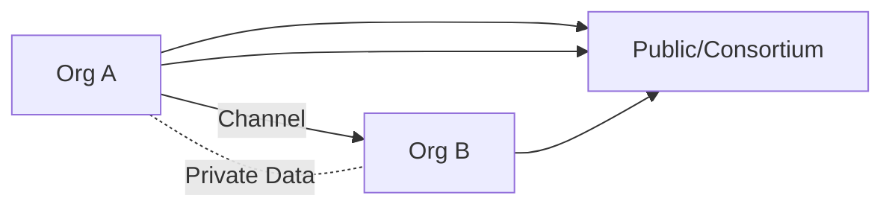

| Pattern | Strength | Drawback |
|---|---|---|
| Channels/PDC | Operational simplicity | Fragmentation |
| ZK Proofs | Minimal disclosure | Prover cost |
| MPC | Joint analytics | Latency/complexity |

#### Comparisons
- Operational overhead vs cryptographic overhead.

#### Technical Evaluation
- Performance: Channels fast; ZK/MPC cost heavy off-chain.
- Security: Strong privacy; key management critical.
- Scalability: Channels per pair; ZK scalable verifying.
- Maintainability: Proof circuits versioning is hard.

#### Business Evaluation
- Cost: ZK/MPC infra costs; training.
- Efficiency: Targeted privacy reduces data handling.
- Impact: Enabler for compliance-friendly analytics.

#### Multi-Angle Evaluation
- Pros: Tailored privacy to use case.
- Cons: Multiple patterns to operate.

#### Collaboration & Communication Plan
- Joint privacy council; DPO sign-offs.

#### Organizational & Strategic Fit
- Competitive differentiator with regulators and lenders.

#### Trade-offs & Decision Guidance
- Prefer channels/PDC where possible; ZK for public attestations.

#### Context & Trend Signals
- Rapid maturation of ZK toolchains; MPC in finance analytics.

#### Perspective-Based Insights
- Engineering: Circuit complexity budgeting.

#### Market & Macro Systems Analysis
- Privacy-preserving finance gaining traction.

#### Inference Summary
- Hybrid privacy stack balances ops and cryptography.

#### Terminology & Key Concepts
- PDC: Private Data Collection in Fabric.

#### Assumptions & Preconditions
- Skilled cryptography team and budget.

#### Validation & Evidence Checks
- Pilot ZK proofs for odometer and late fees.

#### Counterexamples & Edge Cases
- Cross-jurisdiction privacy laws; keep policies flexible.

#### Alternatives Considered
- Data tokenization without cryptography; weaker assurances.

#### Codebase & Library References
- zksnark libraries (snarkjs, circom); Fabric PDC APIs.

#### Authoritative Literature & Reports
- Fabric private data docs; ZK system benchmarks (Halo2/Groth16).

#### Actionable Conclusions & Next Steps
- Start with PDC; add ZK for public attestations.

#### Open Questions & Research Agenda
- Evaluate proof systems trade-offs per use case.

#### APA Style Source Citations
- The Linux Foundation. (2023). Fabric Private Data Collections. https://hyperledger-fabric.readthedocs.io/  
- Bünz, B., et al. (2020). ZK Proof systems survey.

---

### Q12: What cross-chain strategy enables liquidity while keeping core ops on a consortium chain?

**Difficulty:** Advanced  
**Question Type:** Scenario

#### Answer Narrative (150-300 words)
Adopt a hub-and-spoke model: core operational ledger on the consortium chain; exposure tokens on a public EVM L2 for liquidity/distribution. Synchronize via a canonical bridge governed by the consortium with attestations from orderers/validators. Consider Chainlink CCIP or bespoke light-client bridges with rate limits, pause switches, and daily caps. Use message-level replay protection and nonce sequencing. Publish periodic Merkle roots of positions from the consortium to L2, and enable redemption flows back with fraud windows. Keep sensitive data private; only expose aggregate positions and compliance statuses. For secondary trading, restrict transfers to compliant wallets (on-chain allowlists). Monitor bridge security with independent watchers and multi-region keys.

#### Supporting Artifacts

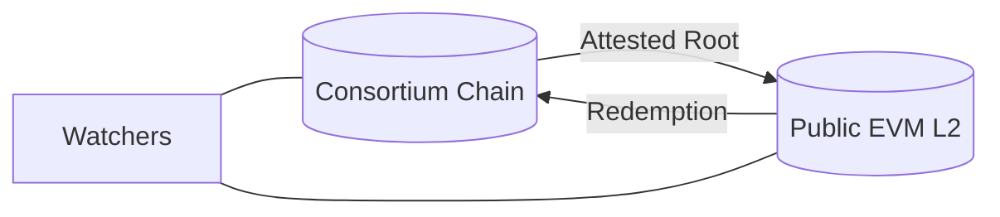

| Component | Choice |
|---|---|
| Bridge | CCIP or light-client |
| Limits | Daily caps, rate limits |
| Controls | Pause, multisig |
| Compliance | On-chain allowlists |

#### Comparisons
- CCIP managed infra vs bespoke light-clients.

#### Technical Evaluation
- Performance: Batches across windows; manageable latency.
- Security: Multisig governance; watchers; fraud windows.
- Scalability: L2 markets scale trading.
- Maintainability: Bridge versioning and monitoring.

#### Business Evaluation
- Cost: Bridge ops; L2 fees.
- Efficiency: Unlocks investor liquidity.
- Impact: Broader distribution and pricing.
- Market Fit: Aligns with tokenization trends.

#### Multi-Angle Evaluation
- Pros: Liquidity without exposing core ops.
- Cons: Bridge risk.
- Risks: Bridge exploits; halt and recover plans.

#### Collaboration & Communication Plan
- Security, Exchanges, Legal, Ops alignment.

#### Organizational & Strategic Fit
- Diversifies financing channels.

#### Trade-offs & Decision Guidance
- Prefer mature bridges with strong audits and controls.

#### Context & Trend Signals
- Increasing institutional use of L2 tokenization.

#### Perspective-Based Insights
- SRE: Runbooks for pauses and rollbacks.

#### Market & Macro Systems Analysis
- Bridge risk remains key systemic factor.

#### Inference Summary
- Conservative bridge with caps minimizes blast radius.

#### Terminology & Key Concepts
- Fraud window: Period to challenge messages.

#### Assumptions & Preconditions
- Partner exchange/wallet infrastructure.

#### Validation & Evidence Checks
- Dry runs of redemption under failure.

#### Counterexamples & Edge Cases
- L2 reorgs; rely on finality depth.

#### Alternatives Considered
- Custodial wrapping; higher centralization risk.

#### Codebase & Library References
- smartcontractkit/ccip; Gnosis Safe; OpenZeppelin AccessControl.

#### Authoritative Literature & Reports
- Chainlink CCIP docs; L2 risk assessments.

#### Actionable Conclusions & Next Steps
- Pilot capped bridge; list exposure token on compliant venues.

#### Open Questions & Research Agenda
- Evaluate light-client feasibility vs CCIP SLAs.

#### APA Style Source Citations
- Chainlink. (2024). CCIP Documentation. https://chain.link/ccip  
- Gudgeon, L. et al. (2020). The dangers of cross-chain bridges. arXiv.

---

## Data, Integration, Ops & Economics (Questions 13-19)

### Q13: How would you design token incentives for rental companies, managers, and drivers without creating perverse incentives?

**Difficulty:** Intermediate  
**Question Type:** Theoretical/Scenario

#### Answer Narrative (150-300 words)
Tie rewards to verified performance indicators: utilization rates, on-time payments, low incident scores, and verified maintenance. Use decay functions and caps to avoid gaming; include clawbacks for fraud or misreporting. Issue staking requirements for managers; slashing upon misconduct verified via oracles and arbitration. Separate liquidity/financing tokens from utility/reward tokens to reduce regulatory risk. Align emissions with revenue growth (supply schedule linked to net productive miles). Provide non-token perks (fee discounts) to reduce sell pressure. Simulate outcomes under different market conditions to avoid reflexive downturn dynamics. Ensure transparent dashboards and dispute resolution.

#### Supporting Artifacts

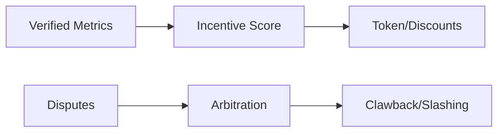

| Actor | Metric | Mechanism |
|---|---|---|
| Company | Fleet utilization | Weighted rewards |
| Manager | Compliance | Stake+slash |
| Driver | Safety score | Bonuses |

#### Comparisons
- Emissions schedules vs revenue-linked distributions.

#### Technical Evaluation
- Performance: Off-chain scoring; on-chain settlement.
- Security: Oracle integrity; anti-Sybil.
- Scalability: Batched payouts.
- Maintainability: Configurable weights.

#### Business Evaluation
- Cost: Rewards budget governance.
- Efficiency: Behavior-aligned incentives.
- Impact: Better asset utilization.
- Market Fit: Matches platform economics.

#### Multi-Angle Evaluation
- Pros: Outcome-aligned; transparent.
- Cons: Complexity; disputes.

#### Collaboration & Communication Plan
- Work with Risk and Operations.

#### Organizational & Strategic Fit
- Drives KPIs sustainably.

#### Trade-offs & Decision Guidance
- Cap rewards; prefer non-dilutive perks.

#### Context & Trend Signals
- Post-2021 tokenomics pivot to real-yield.

#### Perspective-Based Insights
- Product: Clear score explanations.

#### Market & Macro Systems Analysis
- Avoid reflexivity; tie to real cashflows.

#### Inference Summary
- Verified metrics + caps mitigate gaming.

#### Terminology & Key Concepts
- Slashing: Penalizing staked participants for rule breaches.

#### Assumptions & Preconditions
- Reliable data and appeals process.

#### Validation & Evidence Checks
- Backtest scoring vs outcomes.

#### Counterexamples & Edge Cases
- Metric manipulation; use multi-source evidence.

#### Alternatives Considered
- Flat rewards; easy but misaligned.

#### Codebase & Library References
- OpenZeppelin Governor, Timelock.

#### Authoritative Literature & Reports
- Token engineering handbooks; academic work on mechanism design.

#### Actionable Conclusions & Next Steps
- Implement scoring oracle; pilot with caps and clawbacks.

#### Open Questions & Research Agenda
- Explore reputation NFTs bound to identity.

#### APA Style Source Citations
- Buterin, V. (2020). On Collusion. https://vitalik.ca/  
- Weyl, E. G., et al. (2022). Mechanism design for crypto.

---

### Q14: What is your upgrade/rollback strategy for contracts and network configuration?

**Difficulty:** Advanced  
**Question Type:** Practical

#### Answer Narrative (150-300 words)
Adopt versioned contracts with explicit migration paths; proxy upgrades only for modules with strong, stable storage layouts and thorough audit. Use timelocks and multi-party approvals. Pre-stage canaries on a non-critical channel/group and practice rollbacks. For network config (orderers/endorsers), treat as code with review gates and integration tests. Maintain snapshot/backup of world state and blocks; verify restore drills quarterly. Track compatibility matrices and deprecate gracefully. For critical operations, have a “break glass” pause switch and scripted rollback. Publish release notes and migration guides, and maintain schema migration tools for off-chain stores.

#### Supporting Artifacts

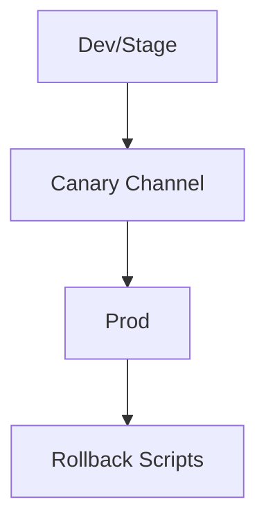

| Area | Strategy |
|---|---|
| Contracts | Versioned + timelocked proxy |
| Network | Config-as-code + tests |
| Data | Snapshots + restores |
| Governance | Multisig approvals |

#### Comparisons
- Proxy flexibility vs versioned clarity.

#### Technical Evaluation
- Performance: Minimal impact if staged.
- Security: Timelocks; limited upgrade surface.
- Scalability: Rolling upgrades per org.
- Maintainability: Docs and tooling.

#### Business Evaluation
- Cost: Extra environments and tests.
- Efficiency: Reduced downtime risk.
- Impact: Stakeholder confidence.
- Market Fit: Enterprise expectations.

#### Multi-Angle Evaluation
- Pros: Predictable changes.
- Cons: Overhead to manage.

#### Collaboration & Communication Plan
- Release trains; change advisory board.

#### Organizational & Strategic Fit
- Core governance competence.

#### Trade-offs & Decision Guidance
- Default to versioned deployments; proxies for vetted modules only.

#### Context & Trend Signals
- Post-incident best practices emphasize rollbacks.

#### Perspective-Based Insights
- SRE: Runbooks and drills.

#### Market & Macro Systems Analysis
- Avoid loss events through rehearsed rollback.

#### Inference Summary
- Practice makes reliable upgrades.

#### Terminology & Key Concepts
- Timelock: Delay before upgrade executes.

#### Assumptions & Preconditions
- Staging and canary infra exist.

#### Validation & Evidence Checks
- Quarterly DR drills.

#### Counterexamples & Edge Cases
- Emergency zero-day; pre-audited kill switch.

#### Alternatives Considered
- Ad-hoc upgrades; unacceptable risk.

#### Codebase & Library References
- OpenZeppelin Upgrades Plugins; Ansible/Terraform for config.

#### Authoritative Literature & Reports
- SRE books on change management; OpenZeppelin upgrade guides.

#### Actionable Conclusions & Next Steps
- Establish release trains and rollback scripts.

#### Open Questions & Research Agenda
- Formal upgradeability proofs for storage layout.

#### APA Style Source Citations
- OpenZeppelin. (2024). Upgrades. https://docs.openzeppelin.com/upgrades-plugins/  
- Beyer, B. et al. (2016). Site Reliability Engineering. O’Reilly.

---

### Q15: How will you design data access patterns—Fabric’s CouchDB vs EVM event indexing?

**Difficulty:** Intermediate  
**Question Type:** Theoretical/Practical

#### Answer Narrative (150-300 words)
Fabric supports rich JSON documents with CouchDB, enabling ad-hoc queries and secondary indexes; LevelDB is faster for key-value workloads but lacks rich queries. EVM chains favor event sourcing: write minimal state and emit events, then build indices off-chain (e.g., The Graph-like pattern) for queries. For consortium operations: if contracts require complex queries (by org, vehicle attributes), Fabric with CouchDB and well-designed indexes excels. For EVM (FISCO), design event schemas carefully, index with an ELK or Postgres pipeline, and expose query APIs. Choose read models per use case: operational dashboards via materialized views, auditor reports via deterministic replays. Ensure idempotent re-indexing on reorganizations (or group reconfigurations), and maintain schema versioning for events.

#### Supporting Artifacts

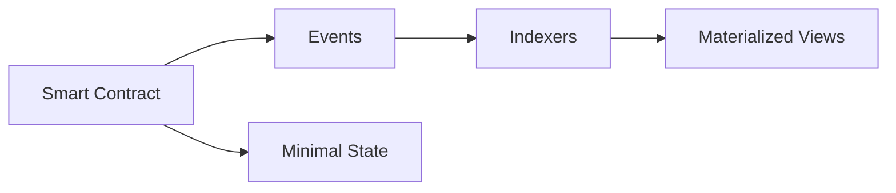

| Option | Strength | Caveat |
|---|---|---|
| Fabric+CouchDB | Rich queries | Index mgmt overhead |
| EVM+Events | Fast writes | Off-chain index infra |
| LevelDB | Speed | No JSON queries |

#### Comparisons
- On-chain rich queries vs off-chain indexing trade-offs.

#### Technical Evaluation
- Performance: Event-heavy designs reduce state writes.
- Security: Indexer integrity and replay.
- Scalability: Horizontal indexers; sharded views.
- Maintainability: Schema versioning; migration scripts.

#### Business Evaluation
- Cost: Index infra vs query flexibility.
- Efficiency: Faster analytics.
- Impact: Real-time visibility.
- Market Fit: Enterprise reporting needs.

#### Multi-Angle Evaluation
- Pros: Tailored read models.
- Cons: More moving parts.

#### Collaboration & Communication Plan
- Data + Backend co-own schemas.

#### Organizational & Strategic Fit
- Supports reporting, risk, and finance workflows.

#### Trade-offs & Decision Guidance
- Pick per query complexity; avoid over-indexing.

#### Context & Trend Signals
- Event-driven designs dominate blockchain analytics.

#### Perspective-Based Insights
- QA: Replay tests for indexers.

#### Market & Macro Systems Analysis
- Audit trails rely on deterministic events.

#### Inference Summary
- Use the right tool per workload profile.

#### Terminology & Key Concepts
- Materialized view: Precomputed query result.

#### Assumptions & Preconditions
- Index infra operated by consortium.

#### Validation & Evidence Checks
- Indexer consistency checksums.

#### Counterexamples & Edge Cases
- Schema drift; enforce version headers.

#### Alternatives Considered
- Hybrid: some rich queries on Fabric, EVM events for others.

#### Codebase & Library References
- Hyperledger Fabric CouchDB; The Graph concepts; log pipelines.

#### Authoritative Literature & Reports
- Fabric docs on CouchDB; Ethereum event processing patterns.

#### Actionable Conclusions & Next Steps
- Define event schemas; deploy index pipeline.

#### Open Questions & Research Agenda
- Evaluate CDC from peers for near-real-time updates.

#### APA Style Source Citations
- The Linux Foundation. (2023). Hyperledger Fabric: CouchDB as state database. https://hyperledger-fabric.readthedocs.io/en/latest/couchdb_as_state_database.html  
- The Graph Foundation. (2022). The Graph documentation: Subgraphs and indexing. https://thegraph.com/docs/en/

---

### Q16: How do you ensure HA/DR and observability for consortium nodes and orderers?

**Difficulty:** Advanced  
**Question Type:** Practical

#### Answer Narrative (150-300 words)
Design for redundancy: multiple orderers across regions (quorum), redundant peers per org, and snapshot/backup pipelines. Use infrastructure-as-code and immutable images. Monitoring includes p50/p95/p99 latencies, block production rates, endorsement failures, disk IO, and queue depths. Implement SLOs and error budgets; alert on finality delays and fork/reorg indicators. For DR, maintain warm standbys with regular restore drills and documented RTO/RPO. Use quorum-based health checks before leader elections. Protect keys with HSMs and ensure secure boot on nodes. For observability, adopt OpenTelemetry, structured logs, and dashboards per channel/group. Practice chaos engineering (node loss, network partition) and ensure degraded modes (read-only).

#### Supporting Artifacts

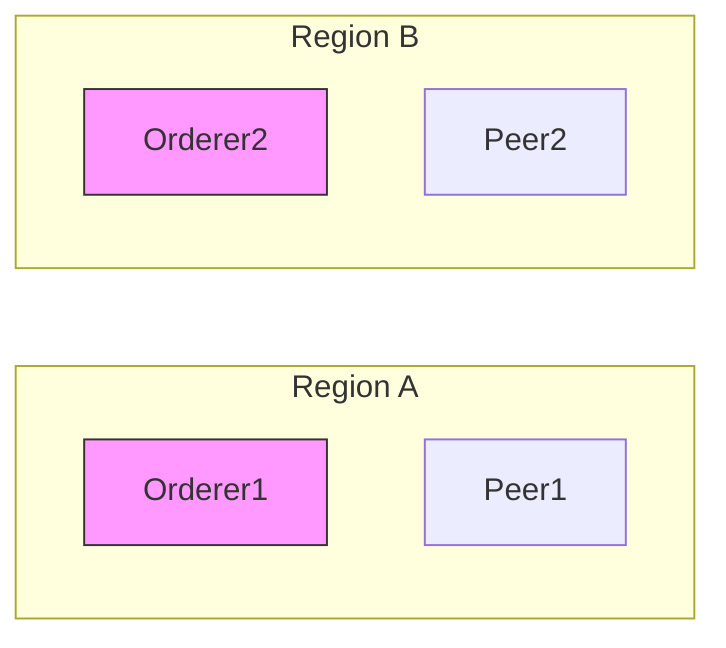

| Capability | Target |
|---|---|
| RTO | < 1 hour |
| RPO | < 5 minutes |
| p95 latency | < 500 ms |
| Availability | ≥ 99.9% |

#### Comparisons
- Active-active vs warm standby.

#### Technical Evaluation
- Performance: Cross-region latency vs quorum size.
- Security: HSM, secure boot, MFA.
- Scalability: Add peers/orderers horizontally.
- Maintainability: IaC + runbooks.

#### Business Evaluation
- Cost: Multi-region infra; justified by uptime SLAs.
- Efficiency: Faster incident recovery.
- Impact: Trust and contractual uptime.
- Market Fit: Enterprise SLAs.

#### Multi-Angle Evaluation
- Pros: Resilient operations.
- Cons: Higher infra cost.

#### Collaboration & Communication Plan
- SRE on-call; quarterly DR tests with partners.

#### Organizational & Strategic Fit
- Essential for financing-grade services.

#### Trade-offs & Decision Guidance
- Balance quorum size vs latency; regional distribution.

#### Context & Trend Signals
- Regulators ask for DR evidence.

#### Perspective-Based Insights
- Ops: Incident command system.

#### Market & Macro Systems Analysis
- Downtime affects investor confidence.

#### Inference Summary
- Quorum redundancy + observability = reliability.

#### Terminology & Key Concepts
- RTO/RPO definitions.

#### Assumptions & Preconditions
- Budget for multi-region deploy.

#### Validation & Evidence Checks
- DR drill metrics; MTTR trends.

#### Counterexamples & Edge Cases
- Simultaneous region failures; prioritize read-only mode.

#### Alternatives Considered
- Single-region; insufficient for SLAs.

#### Codebase & Library References
- Prometheus/Grafana; OpenTelemetry; HashiCorp tools.

#### Authoritative Literature & Reports
- SRE best practices; NIST SP 800-34 on contingency planning.

#### Actionable Conclusions & Next Steps
- Implement IaC; schedule quarterly DR.

#### Open Questions & Research Agenda
- Evaluate erasure-coded storage for snapshots.

#### APA Style Source Citations
- National Institute of Standards and Technology. (2010). Contingency Planning Guide for Federal Information Systems (SP 800-34 Rev. 1). https://csrc.nist.gov/publications/detail/sp/800-34/rev-1/final  
- Beyer, B., Jones, C., Petoff, J., & Murphy, N. R. (2016). Site Reliability Engineering. O’Reilly Media.

---

### Q17: What wallet and key management approach would you use to reduce user friction (custodial/social recovery)?

**Difficulty:** Foundational  
**Question Type:** Practical

#### Answer Narrative (150-300 words)
For drivers/managers, use managed custodial wallets or account abstraction with social recovery to minimize friction (login via phone/email + 2FA). Keys are stored in HSM-backed KMS with per-user encryption. Support guardians (trusted contacts or company) and recovery policies with time delays. For enterprises, use multi-sig (e.g., Safe) with role segregation. Rotate keys regularly and enforce spending limits/rate-limits. Provide export procedures for advanced users. Secure mobile SDKs with device binding and attestation. Log all key operations and integrate with SIEM. Ensure legal clarity on custody responsibilities and insurance coverage.

#### Supporting Artifacts

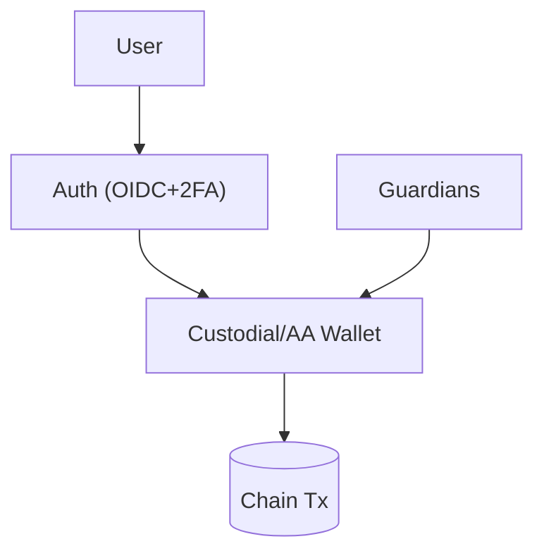

| User Type | Approach | Control |
|---|---|---|
| Driver/Manager | Custodial/AA | Social recovery |
| Enterprise | Multisig Safe | Role-based |
| Regulator/Auditor | View-only | Read-only keys |

#### Comparisons
- Custodial simplicity vs self-custody sovereignty.

#### Technical Evaluation
- Performance: Low overhead signing services.
- Security: HSM/KMS, guardian recovery, policy engine.
- Scalability: Tenant-isolated KMS.
- Maintainability: Recovery workflows.

#### Business Evaluation
- Cost: KMS/HSM + compliance.
- Efficiency: Lower support burden than seed phrases.
- Impact: Higher adoption.
- Market Fit: Web2-like UX with Web3 guarantees.

#### Multi-Angle Evaluation
- Pros: Frictionless UX.
- Cons: Custody liability.

#### Collaboration & Communication Plan
- Legal defines custody terms; Security runs KMS.

#### Organizational & Strategic Fit
- Aligns with mass-market mobility users.

#### Trade-offs & Decision Guidance
- Default custodial/AA; allow opt-out to self-custody.

#### Context & Trend Signals
- EIP-4337 adoption; enterprise custody providers.

#### Perspective-Based Insights
- Engineering: Rate-limit signing per policy.

#### Market & Macro Systems Analysis
- Custody risk requires insurance.

#### Inference Summary
- Managed wallets maximize adoption with safeguards.

#### Terminology & Key Concepts
- Account abstraction: Smart wallets with programmable policies.

#### Assumptions & Preconditions
- KMS/HSM available; clear ToS.

#### Validation & Evidence Checks
- Recovery drills; guardian compromise tests.

#### Counterexamples & Edge Cases
- Guardian collusion; require multiple guardians and delays.

#### Alternatives Considered
- Pure self-custody; higher friction and loss risk.

#### Codebase & Library References
- safe-global/safe-contracts; EIP-4337 toolchains.

#### Authoritative Literature & Reports
- Ethereum EIP-4337; custody best practices.

#### Actionable Conclusions & Next Steps
- Roll out custodial + AA pilot; define insurance.

#### Open Questions & Research Agenda
- Explore MPC-based custody for enterprises.

#### APA Style Source Citations
- Ethereum Foundation. (2023). EIP-4337: Account Abstraction. https://eips.ethereum.org/EIPS/eip-4337  
- Safe. (2024). Safe technical docs. https://docs.safe.global/

---

### Q18: How do you align with legal/regulatory regimes for RWA (KYC/AML, securities, data privacy)?

**Difficulty:** Advanced  
**Question Type:** Theoretical/Scenario

#### Answer Narrative (150-300 words)
Classify tokens under securities/collective investment standards where applicable and implement transfer restrictions (whitelists, lock-ups) and disclosures. KYC/AML includes identity verification, sanctions screening, transaction monitoring, and SARs. Data privacy aligns with GDPR/PIPL via minimization, purpose limitation, and crypto-shredding. Use SPVs for bankruptcy remoteness and clear investor rights; maintain registers for beneficial owners. Establish compliance oracles for eligibility attestations. Partner with regulated custodians/brokers where needed. Document risks and governance; implement complaint handling and redress. Keep audit-ready logs and board-approved policies.

#### Supporting Artifacts


| Area | Control |
|---|---|
| Securities | Transfer restrictions |
| KYC/AML | Screening + monitoring |
| Privacy | Minimization + shredding |
| Governance | Board policies |

#### Comparisons
- Permissioned compliant markets vs public unrestricted.

#### Technical Evaluation
- Performance: Compliance checks cached.
- Security: Audit trails; segregation of duties.
- Scalability: KYC providers and batch checks.
- Maintainability: Policy-as-code.

#### Business Evaluation
- Cost: KYC/licensing; justified by access to capital.
- Efficiency: Automated checks reduce manual ops.
- Impact: Eligibility for institutional investors.
- Market Fit: Aligns with regulatory expectations.

#### Multi-Angle Evaluation
- Pros: Legitimacy and access.
- Cons: Constraints on transfers.

#### Collaboration & Communication Plan
- Legal/Compliance lead with Engineering support.

#### Organizational & Strategic Fit
- Foundation for sustainable capital access.

#### Trade-offs & Decision Guidance
- Default to conservative classification; over-communicate disclosures.

#### Context & Trend Signals
- Global convergence on tokenization rules.

#### Perspective-Based Insights
- Product: Investor UX for eligibility.

#### Market & Macro Systems Analysis
- Regulatory clarity unlocks distribution.

#### Inference Summary
- Compliance-by-design de-risks strategy.

#### Terminology & Key Concepts
- SPV, beneficial ownership, SAR.

#### Assumptions & Preconditions
- Access to KYC providers; legal counsel.

#### Validation & Evidence Checks
- Periodic independent compliance audits.

#### Counterexamples & Edge Cases
- Cross-border conflicts; geo-fence and segregate.

#### Alternatives Considered
- Unrestricted tokens; unacceptable legal risk.

#### Codebase & Library References
- Compliance modules; allowlist contracts; audit loggers.

#### Authoritative Literature & Reports
- IOSCO tokenization reports; EU MiCA; FATF guidance.

#### Actionable Conclusions & Next Steps
- Build compliance oracles; draft offering docs.

#### Open Questions & Research Agenda
- Standardized eligibility attestations on-chain.

#### APA Style Source Citations
- International Organization of Securities Commissions. (2023). Policy recommendations for crypto and digital asset markets. https://www.iosco.org/  
- Financial Action Task Force. (2020). Guidance for a risk-based approach to virtual assets and virtual asset service providers. https://www.fatf-gafi.org/en/publications/Fatfrecommendations/Virtual-Assets-VASPs-Guidance.html  
- European Union. (2023). Regulation (EU) 2023/1114 on markets in crypto-assets (MiCA). https://eur-lex.europa.eu/eli/reg/2023/1114/oj

---

### Q19: How will you benchmark and set SLOs for the blockchain layer and gateway?

**Difficulty:** Intermediate  
**Question Type:** Practical

#### Answer Narrative (150-300 words)
Define SLOs: p50/p95 latency for writes/reads, throughput (TPS), error rates, and availability. Use Hyperledger Caliper or custom load generators mirroring endorsement policies and payload sizes. Benchmark across scenarios: nominal, peak, failure (node loss), and network impairment. Capture end-to-end metrics including gateway, orderer, peers, and state DB. Produce saturation curves and determine safe operating regions. Instrument tracing and logs; validate that idempotency protects cost under retries. Track resource utilization and cost per transaction. Publish SLO dashboards and error budgets; tie releases to performance gates and canaries.

#### Supporting Artifacts

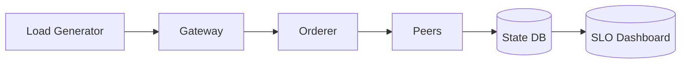

| Metric | Target |
|---|---|
| p95 write | < 500 ms |
| TPS | ≥ 1,000 |
| Error rate | < 0.1% |
| Availability | ≥ 99.9% |

#### Comparisons
- Synthetic vs production-like workloads.

#### Technical Evaluation
- Performance: Realistic payloads and policies.
- Security: Include auth overhead.
- Scalability: Horizontal scaling scenarios.
- Maintainability: Automated periodic runs.

#### Business Evaluation
- Cost: Tooling time; avoids SLA penalties.
- Efficiency: Clear capacity planning.
- Impact: Reliable user experience.
- Market Fit: Enterprise SLAs.

#### Multi-Angle Evaluation
- Pros: Objective performance gates.
- Cons: Test environment cost.

#### Collaboration & Communication Plan
- SRE + Dev perf guild.

#### Organizational & Strategic Fit
- Baseline for change management.

#### Trade-offs & Decision Guidance
- Prefer production-like benches; protect prod.

#### Context & Trend Signals
- Continuous performance testing adoption.

#### Perspective-Based Insights
- QA: Regression perf tests in CI.

#### Market & Macro Systems Analysis
- SLAs affect contracts and pricing.

#### Inference Summary
- Measurable SLOs guide architecture.

#### Terminology & Key Concepts
- Error budget: Allowed unreliability window.

#### Assumptions & Preconditions
- Staging mirrors production.

#### Validation & Evidence Checks
- Compare staged vs production metrics.

#### Counterexamples & Edge Cases
- Test data skew; randomize keys.

#### Alternatives Considered
- Ad-hoc testing; risks regressions.

#### Codebase & Library References
- Hyperledger Caliper; k6; Locust.

#### Authoritative Literature & Reports
- Caliper docs; SRE metrics practices.

#### Actionable Conclusions & Next Steps
- Establish monthly perf gates; block releases failing SLOs.

#### Open Questions & Research Agenda
- Evaluate HW acceleration for signatures.

#### APA Style Source Citations
- The Linux Foundation. (2023). Hyperledger Caliper documentation. https://hyperledger.github.io/caliper/  
- Beyer, B. et al. (2016). Site Reliability Engineering. O’Reilly.

---

## Strategy, Security & Cross-Functional (Questions 20-25)

### Q20: What is the TCO comparison between a consortium chain and using a public L2 for core operations?

**Difficulty:** Advanced  
**Question Type:** Theoretical/Practical

#### Answer Narrative (150-300 words)
Consortium TCO includes infra (validators/orderers/peers), operations (SRE, audits, DR), compliance, and development. Public L2 reduces infra ops but adds variable gas fees, MEV risk, and dependence on third-party governance. Consortium improves privacy and deterministic costs, aligning with regulated data. Hybrid: core ops on consortium; exposure tokens on L2. Conduct a 3-year NPV analysis including capex/opex, audit/incident costs, and capital access benefits via L2 liquidity. Sensitivity-test gas prices, tx volume, and failure incidents.

#### Supporting Artifacts

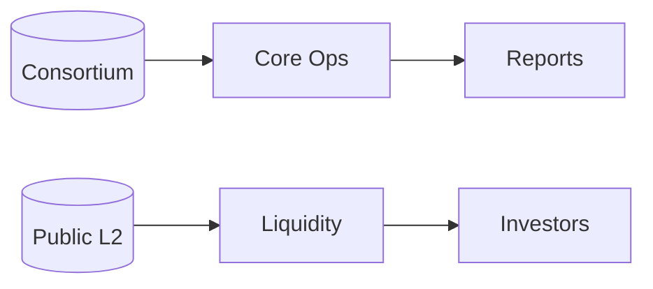

| Cost Driver | Consortium | Public L2 |
|---|---|---|
| Infra Ops | High | Low |
| Gas Fees | Low/None | Variable |
| Privacy | High | Lower |
| Governance | In-house | External |

#### Comparisons
- Deterministic cost vs variable fees.

#### Technical Evaluation
- Performance: Tailored SLOs vs shared L2 variability.

#### Business Evaluation
- Cost: Model NPV; include risk reserves.
- Efficiency: Control vs outsourcing ops.
- Impact: Liquidity access via hybrid.
- Market Fit: Regulated verticals favor consortium core.

#### Multi-Angle Evaluation
- Pros: Predictability and privacy.
- Cons: Ops overhead.

#### Collaboration & Communication Plan
- Finance partners on NPV model.

#### Organizational & Strategic Fit
- Hybrid balances control and market access.

#### Trade-offs & Decision Guidance
- Hybrid recommended; revisit annually.

#### APA Style Source Citations
- Enterprise Ethereum Alliance. (2018). Enterprise Ethereum Client Specification. https://entethalliance.org/  
- Deloitte & The Linux Foundation. (2021). The total cost of (blockchain) ownership: A guide to enterprise blockchain costs. https://www.linuxfoundation.org/research

---

### Q21: How do you integrate SAAS, AI models, and blockchain without leaking PII?

**Difficulty:** Advanced  
**Question Type:** Scenario

#### Answer Narrative (150-300 words)
Architect a privacy-preserving data flow: SAAS authenticates users and writes events; AI features are computed from minimized datasets in a feature store; blockchain receives only hashes/attestations. For model governance, store model cards and lineage; sign model artifacts and attest via supply-chain security (SLSA). Use synthetic data for training where possible and differential privacy for aggregations. Ensure lawful basis and consent; apply federated learning for cross-org models. Separate compute planes and apply confidentiality controls (VPC, KMS, IAM). Provide auditors with proofs tying predictions to on-chain anchors.

#### Supporting Artifacts

```mermaid
flowchart LR
  SAAS --> FS[Feature Store]
  FS --> AI[Models]
  AI --> Attest[Signed Attestations]
  Attest --> Chain[(On-chain)]
```

| Component | Control |
|---|---|
| Feature Store | Data minimization |
| Models | Signed artifacts |
| Blockchain | Hashes/attestations |
| Auditing | Lineage & proofs |

#### Comparisons
- Raw data on-chain vs attestations only.

#### Technical Evaluation
- Performance: Async pipelines; cache features.
- Security: SLSA/SBOM; signed artifacts.
- Scalability: Feature store sharding.
- Maintainability: Model/version registries.

#### Business Evaluation
- Cost: ML infra; offset by risk reduction.
- Efficiency: Faster approvals with auditable lineage.
- Impact: Better risk scoring and pricing.
- Market Fit: Enterprise AI governance norms.

#### Multi-Angle Evaluation (Pros | Cons | Risks | Benefits | Stakeholder Impact | Market Sentiment)
- Pros: Privacy-by-design reduces regulatory risk; auditability accelerates approvals.
- Cons: Added complexity in data separation and governance; model registry overhead.
- Risks: Model drift causing biased outputs; PII leakage via features.
- Benefits: Trustworthy AI with verifiable lineage tied to on-chain anchors.
- Stakeholder Impact: Regulators gain confidence; users see fewer data prompts.
- Market Sentiment: Strong push for governed AI in enterprise settings.

#### Collaboration & Communication Plan
- Stakeholders & Roles: Data Eng (feature store), MLOps (models/registries), Security (KMS/IAM), Compliance (DPIA), Backend (gateways).
- Cadence & Channels: Weekly model review; monthly DPIA check-ins; incident channels for data leaks.
- Alignment Tactics: Policy-as-code for data access; signed model cards required for deploy.

#### Organizational & Strategic Fit
- Business Model Impact: Improves pricing and fraud risk; faster RWA underwriting.
- Institutional Capabilities & Gaps: Need MLOps maturity and data governance council.
- Change Management & Governance: Data classification rollout; training on privacy engineering.
- Strategic Positioning & Differentiation: Verified-AI posture vs competitors.

#### Trade-offs & Decision Guidance
- Prefer attestations over raw data on-chain; adopt federated learning where cross-org data needed; use differential privacy when aggregating sensitive metrics.

#### Inference Summary
- Adoption Signals: IdP/KMS maturity, existing feature store; partner data-sharing readiness.
- Interoperability Impacts: Standardized schema/attestation formats ease partner integration.
- Roadmap Implications: Add lineage dashboards; automate drift detection.
- Operational Risks: Model drift, feature leakage; define rollback triggers.

#### Codebase & Library References
- Feast (feature store), MLflow (model registry), Great Expectations (data quality), OpenTelemetry (tracing), HashiCorp Vault (KMS), Kubernetes (workload isolation).

#### APA Style Source Citations
- National Institute of Standards and Technology. (2023). Artificial Intelligence Risk Management Framework (AI RMF 1.0). https://www.nist.gov/itl/ai-risk-management-framework  
- Mitchell, M., Wu, S., Zaldivar, A., Barnes, P., Vasserman, L., Hutchinson, B., Spitzer, E., Raji, I. D., & Gebru, T. (2019). Model Cards for Model Reporting. Proceedings of the Conference on Fairness, Accountability, and Transparency (FAT* 2019), 220–229. https://doi.org/10.1145/3287560.3287596  
- SLSA. (2024). Supply-chain Levels for Software Artifacts. https://slsa.dev/

---

### Q22: How do you govern consortium membership, onboarding/offboarding, and sanctions (slashing)?

**Difficulty:** Advanced  
**Question Type:** Theoretical/Scenario

#### Answer Narrative (150-300 words)
Define a charter and bylaws codified as on-chain governance: membership criteria, voting weights, quorum, and sanctions. Onboarding involves identity vetting, CA issuance, and policy distribution. Offboarding revokes certs, removes access to channels/groups, and migrates responsibilities. Sanctions (economic or reputation) follow due process with evidence from oracles and audits; apply slashing of staked bonds or suspension. Maintain an appeals process and transparency logs. Use timelocks for policy changes; emergency powers tightly scoped.

#### Supporting Artifacts

```mermaid
flowchart TD
  Apply[Apply] --> Vet[Vetting]
  Vet --> Vote[Consortium Vote]
  Vote --> Issue[Issue Certs]
  Off[Offboard] --> Revoke[Revoke Certs]
```

| Phase | Control |
|---|---|
| Onboard | Vetting + CA issuance |
| Operate | Policy votes |
| Sanction | Evidence-based slashing |
| Offboard | Revocation + data handover |

#### Comparisons
- Off-chain legal agreements only vs on-chain codified bylaws; the latter improves transparency and automation.

#### Technical Evaluation (Performance | Security | Scalability | Maintainability)
- Performance: Lightweight governance tx; negligible runtime cost.
- Security: Certificate lifecycle management and CRLs; timelock governance.
- Scalability: Voting scales with org count; delegate representation helps.
- Maintainability: Policy-as-code repositories and PR workflows.

#### Business Evaluation (Cost | Efficiency | Impact | Market Fit)
- Cost: Governance ops overhead offset by faster dispute resolution.
- Efficiency: Clear onboarding/offboarding reduces downtime.
- Impact: Higher partner trust and audit readiness.
- Market Fit: Aligns with regulated consortium needs.

#### Multi-Angle Evaluation
- Pros: Transparent, auditable decisions.
- Cons: Process overhead; potential gridlock.
- Risks: Governance capture; emergency power abuse.
- Benefits: Predictable sanctions and recourse.

#### Collaboration & Communication Plan
- Stakeholders: Legal, Security, Blockchain Ops, Partner reps.
- Cadence: Quarterly bylaw review; incident-specific emergency sessions.

#### Trade-offs & Decision Guidance
- Keep emergency powers narrow and time-bound; prefer supermajority for sanctions; separate proposal and approval roles.

#### Codebase & Library References
- hyperledger/fabric-ca (cert mgmt), Keycloak (IdP), Open Policy Agent (policy-as-code), OpenZeppelin Governor (if EVM governance used).

#### APA Style Source Citations
- The Linux Foundation. (2023). Consortium governance patterns.  
- Ostrom, E. (1990). Governing the Commons. Cambridge University Press.

---

### Q23: How would you detect and mitigate fraud using on-chain/off-chain analytics (e.g., odometer rollback, collusion)?

**Difficulty:** Advanced  
**Question Type:** Scenario

#### Answer Narrative (150-300 words)
Fuse TBox telemetry with on-chain events and off-chain signals (payments, support tickets). Build feature sets (speed variance, idle ratios, geofencing violations) and anomaly detectors. Anchor critical telemetry on-chain to deter manipulation and allow retrospective proofs. Flag anomalies to a risk oracle that can trigger increased collateral, manual reviews, or temporary holds. Use graph analytics for collusion (shared addresses, unusual transfer patterns). Establish feedback loops to continuously improve models; ensure explainability for decisions affecting payouts. Maintain an appeals process and human-in-the-loop review.

#### Supporting Artifacts

```mermaid
flowchart LR
  Telemetry --> Features
  ChainEvents --> Features
  Payments --> Features
  Features --> Anomaly[Models]
  Anomaly --> Actions[Holds/Reviews]
```

| Signal | Example |
|---|---|
| Telemetry | Odometer jumps |
| On-chain | Rapid transfers |
| Off-chain | Chargeback spikes |

#### Technical Evaluation (Performance | Security | Scalability | Maintainability)
- Performance: Batch feature extraction; streaming pipelines for low-latency flags.
- Security: Signed telemetry; tamper-evident anchors.
- Scalability: Topic sharding and partitioned consumers.
- Maintainability: Versioned feature schemas; model registry.

#### Business Evaluation (Cost | Efficiency | Impact | Market Fit)
- Cost: Data infra + modeling; offset by fraud loss reduction.
- Efficiency: Automated triage reduces manual reviews.
- Impact: Lowers defaults and abuse; improves investor confidence.
- Market Fit: Standard in fintech risk systems.

#### Multi-Angle Evaluation
- Pros: Early detection; explainable signals.
- Cons: False positives; appeals workload.
- Risks: Concept drift; adversarial behavior.
- Benefits: Better pricing and reserves.

#### Codebase & Library References
- Apache Kafka (streaming), Flink/kSQL (processing), NetworkX/Neo4j (graph analytics), scikit-learn/XGBoost (models), Feast (features).

#### Actionable Conclusions & Next Steps
- Launch streaming anomaly flags with human-in-the-loop review; measure precision/recall; iterate thresholds.

#### APA Style Source Citations
- Akoglu, L., Tong, H., & Koutra, D. (2015). Graph-based anomaly detection and description: A survey. Data Mining and Knowledge Discovery, 29(3), 626–688. https://doi.org/10.1007/s10618-014-0365-y  
- Aggarwal, C. C. (2015). Outlier Analysis (2nd ed.). Springer. https://doi.org/10.1007/978-3-319-47578-3  
- National Institute of Standards and Technology. (2023). Artificial Intelligence Risk Management Framework (AI RMF 1.0). https://www.nist.gov/itl/ai-risk-management-framework

---

### Q24: What is your threat model (MEV, replay, oracle manipulation, collusion) and mitigations?

**Difficulty:** Advanced  
**Question Type:** Theoretical/Practical

#### Answer Narrative (150-300 words)
In consortium settings, classic public-chain MEV is limited but ordering abuses may exist; mitigate via fair ordering within the orderer, randomized batching, and audit logs. Replay attacks are blocked with nonces and chain IDs; oracle manipulation mitigated with multi-source signed feeds and deviation checks. Collusion risks among validators handled by quorum sizing, external audits, and rotation. Protect against key compromise with HSM, least-privilege, and short-lived credentials. Implement rate limits, anomaly detection, and transaction content checks. Practice red team exercises and table-top incident response.

#### Supporting Artifacts

```mermaid
flowchart LR
  Threats[Threats] --> Controls{Controls}
  Controls --> Ordering[Fair ordering]
  Controls --> Oracles[Multi-source]
  Controls --> Keys[HSM]
  Controls --> Nonces[Nonces/ChainID]
```

| Threat | Control |
|---|---|
| Ordering abuse | Fair ordering, audits |
| Replay | Nonces, chain IDs |
| Oracle | Multi-source, heartbeats |
| Collusion | Quorum, rotation |

#### Business Evaluation (Cost | Efficiency | Impact | Market Fit)
- Cost: Monitoring and audits; justified by avoided incidents.
- Efficiency: Clear runbooks shorten response times.
- Impact: Reduces catastrophic bridge/ordering risks.
- Market Fit: Required for institutional-grade platforms.

#### Collaboration & Communication Plan
- Security (red team/blue team), SRE, Blockchain Ops; quarterly tabletop exercises; shared postmortems.

#### Codebase & Library References
- OpenZeppelin Defender (monitoring/response), Slither/Echidna (testing), Chainlink OCR/CCIP (oracle/bridge), HashiCorp Vault (KMS).

#### APA Style Source Citations
- Daian, P. et al. (2020). Flash Boys 2.0. IEEE S&P.  
- NIST SP 800-57; Chainlink whitepaper.

---

### Q25: How would you lead cross-functional delivery for the consortium RWA program over 12 months?

**Difficulty:** Foundational  
**Question Type:** Scenario

#### Answer Narrative (150-300 words)
Run a quarterly delivery cadence with measurable milestones: Q1 (architecture, POC on chosen stack, identity, lease/commission MVP), Q2 (oracle integration, TBox anchoring, compliance module, audits), Q3 (pilot with 2–3 partners, HA/DR readiness, token incentives), Q4 (cross-chain exposure token, liquidity pilots, scaling). Set up a governance board (Legal, Ops, Engineering, Security, Finance) and a change advisory board. Define SLOs, risk registers, and communication plans. Establish documentation, runbooks, and on-call rotations. Budget for audits, DR drills, and legal reviews. Publish KPIs (utilization, default rates, payout latency) and investor updates. Ensure knowledge sharing and hiring to close skill gaps.

#### Supporting Artifacts

```mermaid
gantt
  title 12-Month Consortium RWA Program
  dateFormat  YYYY-MM
  section Q1
  Architecture & POC     :done,    q1a, 2025-01, 1M
  Identity & IAM         :active,  q1b, 2025-02, 1M
  section Q2
  Oracles & TBox         :         q2a, 2025-04, 2M
  Compliance & Audit     :         q2b, 2025-05, 2M
  section Q3
  Partner Pilot          :         q3a, 2025-07, 2M
  HA/DR Readiness        :         q3b, 2025-08, 1M
  section Q4
  Cross-chain Liquidity  :         q4a, 2025-10, 2M
  Scale & Optimize       :         q4b, 2025-11, 2M
```

| Workstream | Owner |
|---|---|
| Architecture | Chief Architect |
| Compliance | Legal/Compliance |
| Oracles/IoT | Data & Backend |
| Ops/SRE | SRE Lead |

#### Multi-Angle Evaluation (Pros | Cons | Risks | Benefits | Stakeholder Impact)
- Pros: Predictable cadence; measurable milestones; audit readiness.
- Cons: Program overhead; dependency management across partners.
- Risks: Scope creep; key vendor delays; regulatory changes.
- Benefits: Institutional trust and financing access.
- Stakeholder Impact: Clear accountability reduces conflict.

#### Trade-offs & Decision Guidance
- Keep scope per quarter focused on 2–3 outcomes; timebox experiments; use canary pilots before scale.

#### Actionable Conclusions & Next Steps
- Stand up a PMO board; publish RACI; lock Q1 OKRs and SLOs; schedule quarterly DR/audit drills.

#### APA Style Source Citations
- PMI. (2021). PMBOK Guide (7th ed.). Project Management Institute.  
- Beyer, B. et al. (2016). Site Reliability Engineering. O’Reilly.
