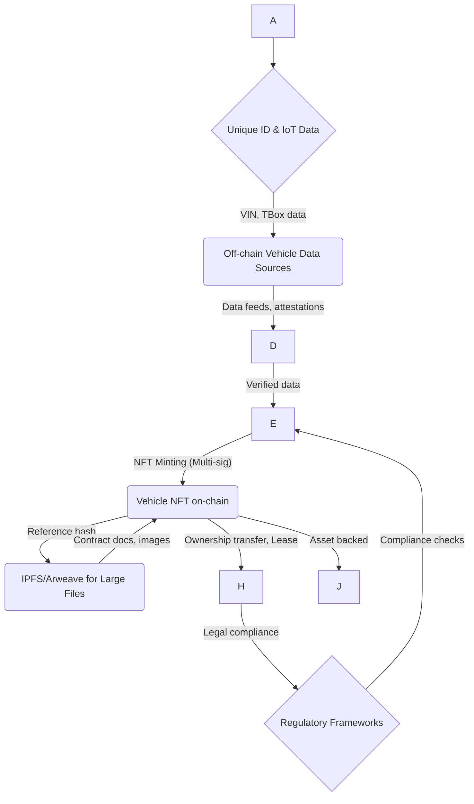
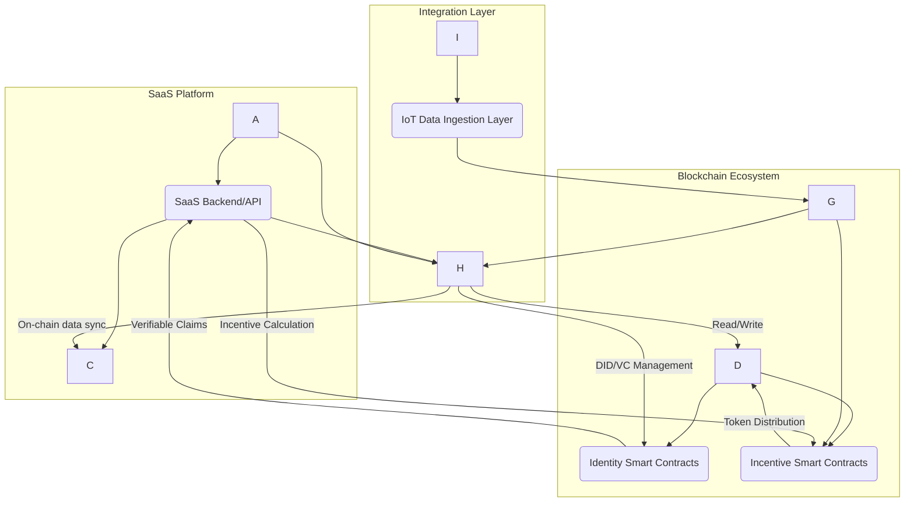
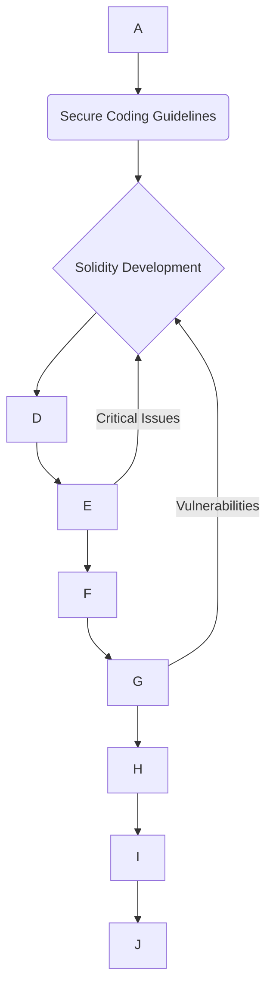
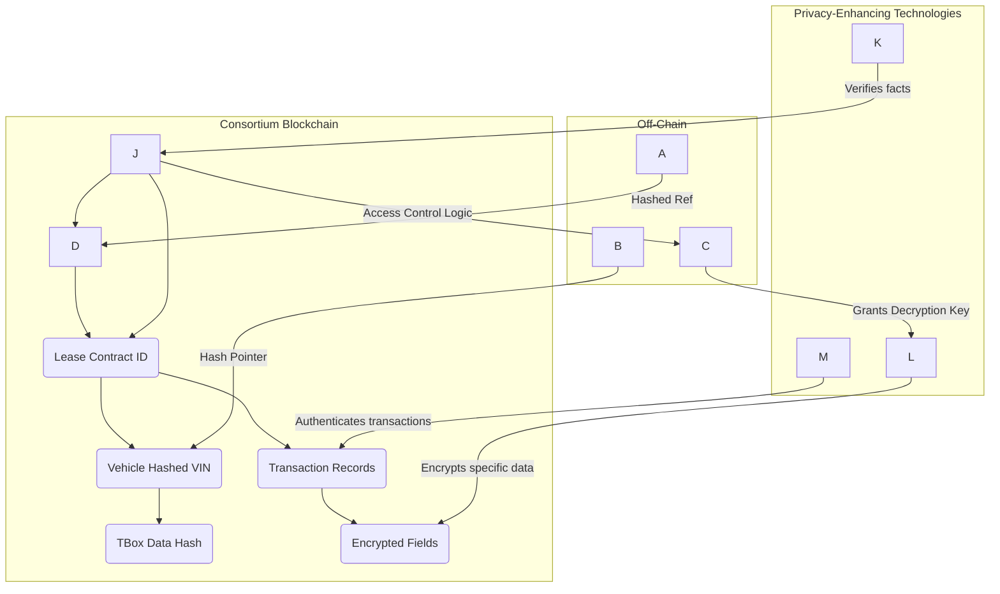
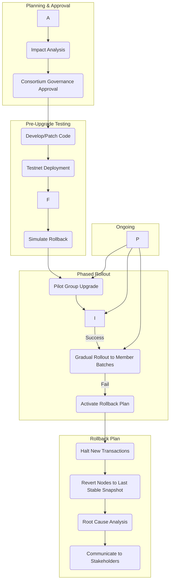
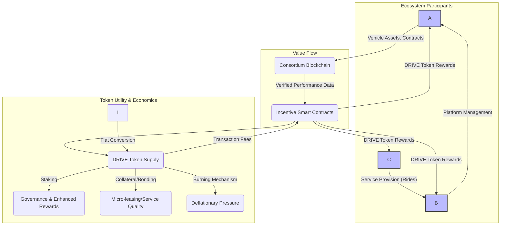
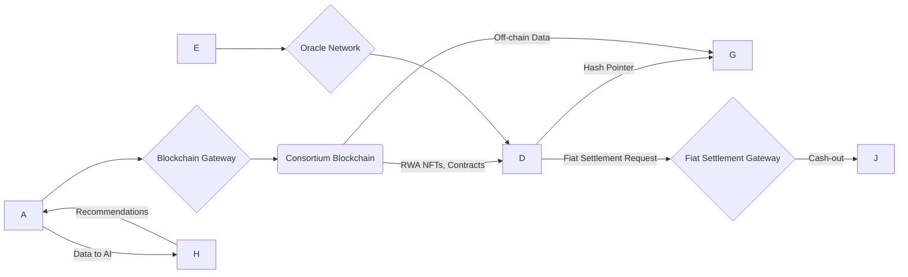

## Contents

-(#executive-summary)
-(#coverage--difficulty-summary)
-(#glossary--acronym-index)
-(#how-to-use-this-in-interviews)
-(#key-decision-criteria-checklist)
-(#key-decision-criteria-matrix-quick-picks)
-(#scenarios)
  -(#scenario-1-optimizing-consensus-mechanisms-in-consortium-blockchains)
  -(#scenario-2-designing-a-secure-rwa-tokenization-framework-for-vehicle-assets)
  -(#scenario-3-integrating-blockchain-with-saas-platforms-for-decentralized-identity-and-incentives)
  -(#scenario-4-architecting-a-cross-chain-interoperability-solution-for-consortium-blockchains)
  -(#scenario-5-implementing-a-decentralized-oracle-solution-for-off-chain-vehicle-data)
  -(#scenario-6-securing-smart-contracts-for-digital-leasing-and-commission-splitting)
  -(#scenario-7-backend-integration-for-blockchain-gateway-services-in-a-vehicle-leasing-platform)
  -(#scenario-8-implementing-data-security-and-privacy-in-a-blockchain-based-vehicle-platform)
  -(#scenario-9-managing-operational-risks-and-upgrade-strategies-in-a-consortium-blockchain)
  -(#scenario-10-designing-a-tokenomics-model-for-an-automotive-blockchain-ecosystem)
  -(#scenario-11-crafting-a-stakeholder-communication-plan-for-blockchain-adoption)
  -(#scenario-12-evaluating-blockchain-architect-roles-with-a-comprehensive-rubric)
  -(#scenario-13-visualizing-blockchain-architecture-with-mermaid-diagrams)
  -(#scenario-14-navigating-legal-and-regulatory-frameworks-for-rwa-digitalization)
  -(#scenario-15-applying-cryptographic-foundations-for-blockchain-security)
  -(#scenario-16-trade-offs-in-blockchain-governance-permission-vs-decentralization)

## Executive Summary

- This document outlines 16 case study scenarios designed to assess senior blockchain architects in consortium chains and Real World Assets (RWA) digitalization.
- Scenarios cover technical, theoretical, and practical aspects, emphasizing systems thinking, trade-off analysis, and clear recommendations.
- The assessment evaluates candidates' ability to propose innovative, yet practical solutions while balancing factors like security, scalability, cost, and compliance in complex real-world environments.
- Key areas of focus include consensus mechanisms, RWA tokenization, smart contract development, oracle integration, backend systems, data security, operational risk management, tokenomics, and regulatory compliance.

## Coverage & Difficulty Summary

| Difficulty | Count | Scenarios |
|---|---:|---|
| Foundational | 3 | Scenario 13, Scenario 15, Scenario 16 |
| Intermediate | 7 | Scenario 1, Scenario 2, Scenario 3, Scenario 6, Scenario 7, Scenario 8, Scenario 11 |
| Advanced | 6 | Scenario 4, Scenario 5, Scenario 9, Scenario 10, Scenario 12, Scenario 14 |

- Topic cluster mapping:

| Topic Cluster | Scope | Scenarios |
|---|---|---|
| Consortium Chains | Architecture, consensus, governance, interoperability, operations | Scenario 1, Scenario 4, Scenario 9, Scenario 16 |
| RWA Digitalization | Tokenization, compliance, legal frameworks, real-world integration | Scenario 2, Scenario 14 |
| Smart Contracts & Development | Solidity, frameworks, security, specific applications | Scenario 6 |
| Backend & Integration | Gateway services, existing systems, languages (Go/Java/Node.js) | Scenario 7 |
| Cryptography & Security | Asymmetric encryption, hashing, digital signatures, ZKP, privacy | Scenario 8, Scenario 15 |
| Oracles & Data Sync | Decentralized oracle networks (Chainlink), on-chain/off-chain data | Scenario 5 |
| SAAS, AI, IoT Integration | Vehicle TBox data, platform integration, standards | Scenario 3 |
| DeFi & Tokenomics | Protocol design, incentive models, economic settlement | Scenario 10 |
| Project & Team Management | Communication, collaboration, risk, governance, assessment | Scenario 11, Scenario 12, Scenario 13 |

## Glossary & Acronym Index

- **AI**: Artificial Intelligence
- **AML**: Anti-Money Laundering
- **BCT**: Blockchain Technology
- **BLS Multisignature**: Boneh-Lynn-Shacham Multisignature
- **BLP**: Block Level Parallelism
- **BLS**: Boneh-Lynn-Shacham
- **BLS Multisignature**: Boneh-Lynn-Shacham Multisignature (used in KBFT)
- **BLP**: Block Level Parallelism (in FISCO BCOS)
- **CCIP**: Cross-Chain Interoperability Protocol (Chainlink)
- **DAO**: Decentralized Autonomous Organization
- **dApp**: Decentralized Application
- **DeFi**: Decentralized Finance
- **DMC**: Dynamic Multi-chain Consensus
- **DON**: Decentralized Oracle Network
- **DSA**: Digital Signature Algorithm
- **ECC**: Elliptic Curve Cryptography
- **ECDSA**: Elliptic Curve Digital Signature Algorithm
- **EMR**: Electronic Medical Records
- **ERD**: Entity-Relationship Diagram
- **EVM**: Ethereum Virtual Machine
- **FCA**: Financial Conduct Authority (UK)
- **FISCO BCOS**: Financial Blockchain Open Consortium Chain
- **GDPR**: General Data Protection Regulation
- **HA**: High Availability
- **HTTPS**: Hypertext Transfer Protocol Secure
- **IoT**: Internet of Things
- **IPFS**: InterPlanetary File System
- **JWT**: JSON Web Token
- **KBFT**: K-prototype Clustering Algorithm Based Byzantine Fault Tolerance (a sharding consensus algorithm)
- **MAC**: Message Authentication Code
- **MCDM**: Multicriteria Decision Matrix
- **MECE**: Mutually Exclusive, Collectively Exhaustive
- **MiCA**: Markets in Crypto-Assets Regulation (EU)
- **MIC**: Message Integrity Check
- **NFT**: Non-Fungible Token
- **NIST**: National Institute of Standards and Technology (US)
- **PBFT**: Practical Byzantine Fault Tolerance
- **PQC**: Post-Quantum Cryptography
- **PoS**: Proof-of-Stake
- **PoW**: Proof-of-Work
- **QoTE**: Quality of Task Execution
- **RWA**: Real World Assets
- **RSA**: Rivest-Shamir-Adleman
- **SAAS**: Software as a Service
- **SBL**: Scenario-Based Learning
- **SCF**: Supply Chain Finance
- **SEC**: Securities and Exchange Commission (US)
- **SLA**: Service Level Agreement
- **SLO**: Service Level Objective
- **SME**: Small and Medium-sized Enterprises
- **SSH**: Secure Shell Protocol
- **SSL**: Secure Sockets Layer
- **TLS**: Transport Layer Security
- **TBox**: Telematics Box (in vehicles)
- **TPS**: Transactions Per Second
- **UAV**: Unmanned Aerial Vehicle
- **VPN**: Virtual Private Network
- **Web3**: Decentralized web technologies
- **ZKP**: Zero-Knowledge Proof
- **ZK-SNARK**: Zero-Knowledge Succinct Non-Interactive Argument of Knowledge

## How to Use This in Interviews

- Allow 45–60 min per scenario; evaluate depth of analysis, trade-off reasoning, and communication clarity.
- Use rubrics for consistent grading; award partial credit per task checklist.

## Key Decision Criteria Checklist

- **Privacy & Compliance**: Data anonymization, regulatory adherence (GDPR, MiCA, SEC), legal enforceability of RWA.
- **Performance SLOs**: Transaction throughput (TPS), latency, scalability under load, resource utilization.
- **Security Posture**: Cryptographic strength (asymmetric encryption, hashing, digital signatures, ZKP), smart contract auditing, access control, Sybil attack prevention.
- **Interoperability & Liquidity**: Cross-chain capabilities (consortium to public, Layer2), data flow between on-chain/off-chain, RWA tradability.
- **Operations & HA/DR**: Node deployment, monitoring, upgrade/rollback mechanisms, fault tolerance, view change protocols.
- **Governance & Upgrades**: Consensus mechanism adaptability, permission management, community involvement, protocol evolution.
- **Tokenomics & RWA**: Incentive models, token utility, asset backing, legal classification, custody solutions.

## Key Decision Criteria Matrix (Quick Picks)

| Criteria | Preferred Approach A | Preferred Approach B | Notes/Signals |
|---|---|---|---|
| **Privacy vs. Transparency** | Zero-Knowledge Proofs + Off-chain Storage (IPFS) | Pseudonymity + Ring Signatures | ZKPs offer strong privacy for sensitive data without revealing underlying information, while maintaining verifiability. Off-chain storage keeps large data private with on-chain hashes for integrity. |
| **Throughput vs. Consistency** | Sharding Consensus (e.g., KBFT) | Optimized PBFT variants (e.g., HotStuff) | Sharding linearly increases throughput by parallelizing transactions across shards, but requires careful synchronization for global consistency. PBFT offers strong consistency but has quadratic communication complexity, limiting scalability. |
| **Centralization vs. Decentralization** | Consortium Blockchain with strong governance | Hybrid approach (Consortium + Public Chain L2) | Consortium chains offer controlled decentralization, suitable for enterprise, with better performance and privacy than public chains. Hybrid models leverage public chain liquidity and openness while maintaining consortium control for sensitive operations. |
| **Cost vs. Resilience** | Cloud-based deployment + automated scaling | Geo-distributed nodes + redundant consensus | Cloud deployment offers flexible cost management and scalability. Geo-distributed nodes and redundant consensus provide high resilience against localized failures but increase infrastructure and operational costs. |
| **On-chain vs. Off-chain Data** | Hybrid smart contracts with Oracles (Chainlink) | Centralized API gateways + periodic data synchronization | Oracles provide secure, decentralized bridges for off-chain data, enabling complex smart contract logic based on real-world events. Centralized APIs are simpler but introduce single points of failure and trust issues. |

---

## Scenarios

### Scenario 1: Optimizing Consensus Mechanisms in Consortium Blockchains

**Language:** English  
**Difficulty:** Intermediate  
**Bloom:** Analyze/Evaluate

### Scenario Context

A leading ride-hailing and vehicle leasing company is developing a consortium blockchain for managing vehicle ownership, leasing contracts, and driver performance data. The initial prototype uses a standard Practical Byzantine Fault Tolerance (PBFT) consensus mechanism. However, during internal simulations with an anticipated network size of 150 nodes (comprising leasing partners, maintenance providers, and regulatory bodies), the system experiences significant communication congestion and reduced transaction throughput. The current throughput is approximately 500 transactions per second (TPS), with an average latency of 3 seconds. The target is to achieve over 2000 TPS with sub-second latency for real-time contract updates and driver incentives. The technical team identifies that the quadratic communication complexity of PBFT (\\(O(N^2)\\), where N is the number of nodes) is the primary bottleneck. The consortium requires high security, data integrity, and accountability, but also needs to balance decentralization with operational efficiency and scalability for its large-scale operations.

### Tasks

1. Identify the top 3 limitations of PBFT in this consortium blockchain scenario.
2. Propose 2 alternative or improved consensus mechanisms suitable for large-scale consortium chains, discussing their advantages and disadvantages for this specific use case.
3. Draft a recommendation memo (≤300 words) for the technical steering committee, justifying the preferred consensus mechanism and outlining key implementation considerations.

### Expected Key Points

- **Task 1:**
  - Scalability bottleneck due to \\(O(N^2)\\) communication complexity, leading to congestion with increasing nodes.
  - Reduced throughput and increased latency, failing to meet the target of 2000 TPS and sub-second latency.
  - Inefficiency when the master node fails, triggering complex view change protocols that further degrade performance.
- **Task 2:**
  - **Option 1: KBFT (K-prototype Clustering Algorithm Based Byzantine Fault Tolerance)**:
    - **Advantages**: Uses node sharding with K-prototype clustering to reduce communication complexity to \\(O(N)\\), leading to linear throughput increase with shards. Incorporates BLS multisignatures for efficient consensus within shards. Includes a credit and supervision mechanism for security and reliability.
    - **Disadvantages**: Complexity in implementing and managing sharding, potential for imbalanced shard loads if not managed well, and the initial overhead of clustering.
  - **Option 2: HotStuff**:
    - **Advantages**: Offers linear communication complexity (\\(O(N)\\)) due to the use of threshold signatures, making it more scalable than traditional PBFT. Provides improved responsiveness and safety.
    - **Disadvantages**: Requires careful implementation of threshold signatures, and like other PBFT variants, still faces view change complexities though improved. May need additional mechanisms for credit/reputation management as in KBFT.
- **Task 3:**
  - **Justification**: Recommend KBFT for its proven ability to achieve significant scalability and throughput improvements through sharding, specifically designed for large-scale consortium chains. Its integrated credit and supervision mechanisms enhance security and reliability crucial for this use case.
  - **Implementation Considerations**: Highlight the need for robust shard management, dynamic resharding, and careful design of the credit mechanism. Emphasize simulation and testing to validate performance under realistic loads. Mention the importance of node attribute definition for effective K-prototype clustering (e.g., node ID, credit value, company, IP address).

### Grading Rubric

| Task | Max Points | Criteria |
|---|---:|---|
| Task 1 | 8 | Correctness, completeness, evidence |
| Task 2 | 10 | Feasibility, trade-off depth, alternatives |
| Task 3 | 6 | Clarity, structure, decision justification |

### Grader Notes

- Partial credit: Correct diagnosis + incomplete solution = 60%
- Bonus: Novel insights, consideration of edge cases (e.g., Byzantine node proportion in shards), stakeholder impact analysis (e.g., how transparency of node scoring impacts trust).
- Common omissions: Lack of quantitative comparison (e.g., communication complexity formulas), insufficient detail on how proposed mechanisms address the specific pain points, or overlooking the implications of sharding for global block formation.

### Misconception Focus

- The misconception this scenario reveals is that a well-understood consensus algorithm like PBFT is universally scalable for all consortium blockchain applications. The corrective guidance is to emphasize that while PBFT is suitable for smaller consortiums, its inherent quadratic complexity makes it impractical for large-scale networks, necessitating sharding or more advanced PBFT variants.

### Failure Path Insight

- The scenario is designed to surface failure paths related to performance degradation and system instability when a consensus mechanism is chosen without considering network scale. Mitigation includes pre-implementation simulations, stress testing, and adopting scalable consensus algorithms with dynamic adjustments (e.g., dynamic resharding in KBFT) to prevent network blocking and maintain activity even during master node failures.

### Comparison Notes

- This scenario highlights the critical comparison between classic PBFT and sharding-based PBFT variants like KBFT. Decision criteria include network size, desired throughput, acceptable latency, and the balance between decentralization, security, and scalability. KBFT offers a marked improvement in scalability and throughput with reduced communication complexity compared to PBFT for large-scale consortium chains.

### Supporting Artifacts (for scenario context clarity)

#### PBFT Communication Overhead vs. KBFT Communication Overhead
| Algorithm | Communication Complexity (N = number of nodes) | Notes |
|---|---|---|
| PBFT | \\(O(N^2)\\) (specifically \\(2N^2\\)) | Each node communicates with every other node, leading to rapid increase in overhead as N grows. |
| KBFT (sharding) | \\(O(N)\\) (specifically \\(7N - \frac{2N}{K} - 2\\), where K is shard size) | Communication is mostly localized within shards, and global communication is optimized. |

#### Throughput Comparison
| Algorithm | Throughput |
|---|---|
| PBFT | Baseline throughput |
| KBFT | N/K times the PBFT throughput (N/K = number of shards), increases linearly with shards |

### Technical Evaluation (Performance | Security | Scalability | Maintainability)
- **Performance (Throughput & Latency)**: Classic PBFT limits throughput and increases latency quadratically with node count. KBFT with sharding can linearly increase throughput with the number of shards and significantly reduce communication overhead, achieving better latency.
- **Security**: PBFT provides strong Byzantine fault tolerance, tolerating up to \\(f\\) malicious nodes in a system of \\(3f+1\\) nodes. KBFT maintains this fault tolerance within shards and enhances overall security through credit and supervision mechanisms, dynamically reshaping nodes to prevent static attacks.
- **Scalability**: PBFT is not suitable for large-scale consortium chains due to communication congestion. Sharding-based solutions like KBFT are designed for large-scale networks, supporting new node additions and maintaining efficiency as the network grows.
- **Maintainability**: Implementing and managing sharding in KBFT can be more complex than a simpler PBFT deployment, requiring robust tools for dynamic resharding and credit mechanism management.
- **Algorithm Complexity & Error Tolerance**: PBFT has polynomial communication complexity but high overhead for large N. KBFT reduces communication complexity to linear, but introduces complexity in sharding and global block formation. Both tolerate up to one-third Byzantine nodes within their scope of consensus.
- **Reliability & High Availability**: Both PBFT and KBFT offer high availability within their operational limits. KBFT's view change protocol within shards is simpler than PBFT's, and emergency resharding mechanisms enhance global resilience.
- **Distributed Consistency Guarantees**: PBFT provides strong consistency. KBFT ensures consistency within shards and then merges local blocks into a global block, maintaining data comprehensiveness across the network.
- **Hardware Requirements & Optimizations**: PBFT consumes significant resources due to high communication. Sharding mechanisms in KBFT distribute computational load, potentially optimizing resource use, especially with parallel consensus within shards.

### Business Evaluation (Cost | Efficiency | Impact | Market Fit)
- **Cost**: While a more complex initial implementation, a scalable consensus like KBFT can reduce long-term operational costs by handling higher transaction volumes with fewer resources compared to scaling out a non-sharded PBFT network.
- **Efficiency**: A more efficient consensus directly translates to faster transaction processing, quicker contract execution, and improved responsiveness for vehicle leasing and ride-hailing operations.
- **Impact**: Increased efficiency and scalability will directly support the growth of the platform, enabling more real-time services, accurate driver incentives, and responsive asset management, which positively impacts user experience and stakeholder satisfaction.
- **Market Fit**: A high-performance blockchain platform is essential for a real-time, high-volume industry like ride-hailing and vehicle leasing, ensuring the platform remains competitive and can adapt to market demands.

### Multi-Angle Evaluation (Pros | Cons | Risks | Benefits | Stakeholder Impact | Market Sentiment)
- **Pros**: Enhanced scalability and throughput for a growing ecosystem, improved security through reputation mechanisms, better operational efficiency for real-time services.
- **Cons**: Increased complexity in design and implementation of sharding and credit mechanisms, potential for initial performance tuning challenges.
- **Risks**: Incorrect shard sizing or clustering can lead to security vulnerabilities or performance imbalances. Upgrade/migration risks exist due to the complexity of changing core consensus protocols; robust testing and a phased rollout are crucial. Rollback contingencies for consensus mechanism changes would involve restoring to a previous stable state and replaying transactions.
- **Benefits**: Ability to support a large number of nodes and transactions, ensuring reliable and fast contract execution, and maintaining data integrity for all participants.
- **Stakeholder Emotional/Psychological Impact**: Increased trust in the system's fairness due to objective credit scoring for nodes. Confidence in system reliability for critical business operations like real-time payments and contract fulfillment.
- **Market Sentiment**: A robust, high-performance blockchain solution can attract more partners and users to the platform, enhancing its reputation and market position in the ride-hailing and leasing sectors.
- **Trust & Privacy/Transparency Considerations**: While transparency of consensus operation is important, specific transaction details within shards may require privacy-preserving techniques, possibly using cryptographic methods like ZKPs. The credit mechanism promotes trust by penalizing malicious behavior and rewarding honest nodes.

### Terminology & Key Concepts (scenario domain)

**Consensus Mechanism**: A fault-tolerant process in a blockchain system used to achieve agreement on a single data value or a single state of the network among distributed processes or multi-agent systems.
**Practical Byzantine Fault Tolerance (PBFT)**: A replication algorithm for distributed systems that can tolerate Byzantine faults (malicious or arbitrary failures) and provides strong consistency, typically used in consortium blockchains.
**Sharding**: A database partitioning technique applied to blockchains that divides the network into smaller, more manageable parts (shards) that can process transactions in parallel, improving scalability and throughput.
**Throughput**: The number of transactions a blockchain network can process per unit of time, typically measured in Transactions Per Second (TPS).
**Latency**: The delay between initiating a transaction and its final confirmation on the blockchain.
**BLS Multisignature**: A cryptographic scheme that allows multiple signers to aggregate their individual signatures into a single, compact multisignature, improving efficiency in consensus protocols.

### Context & Background (scenario grounding)

- **Historical Evolution**: Early blockchains (e.g., Bitcoin) used Proof-of-Work (PoW), which is energy-intensive and has low throughput. PBFT emerged as a more efficient alternative for permissioned networks, but its scalability limitations for large consortiums led to the development of sharding-based consensus mechanisms and improved PBFT variants like HotStuff and KBFT.
- **Regulatory Landscape**: Consortium blockchains often operate within specific regulatory frameworks due to their permissioned nature, making stability, security, and auditable performance crucial for compliance.
- **Technical Context**: The choice of consensus algorithm is fundamental to a blockchain's performance and security. High-performance requirements in enterprise applications necessitate moving beyond basic PBFT to more scalable solutions.
- **Market Dynamics**: The ride-hailing and vehicle leasing industries are high-volume, real-time markets where efficiency, trust, and transparent data management are critical for business operations and competitive advantage.
- **Key Events & Statistics**: The shift from public chains to consortium chains for enterprise applications reflects a focus on performance and control. The continuous research into improving PBFT highlights its widespread use but also its inherent limitations for growing networks. For instance, KBFT simulations demonstrate that a network of 880 nodes with shards of 88 nodes each can maintain a high success rate even with a 20% node failure probability.

### Perspective-Based Insights (evaluate candidate responses from these angles)

- **Engineering**: Focus on implementation feasibility of sharding, BLS multisignatures, and the K-prototype clustering algorithm. Considerations for smart contract integration with the chosen consensus.
- **Architecture & Infrastructure**: Implications for node deployment (physical vs. virtual, geographical distribution), network topology, and resource allocation for shards.
- **Database & Data Engineering**: How sharding impacts data storage, indexing, and querying across the distributed ledger; ensuring data consistency and integrity across different shards and the global block.
- **Quality Assurance & Testing**: Designing comprehensive test cases for sharded environments, including inter-shard communication, view changes, and malicious node behavior scenarios. Performance testing to validate throughput and latency targets.
- **Product Management**: How improved performance and reliability translate into better user experience for drivers and leasing partners, enabling new features or services dependent on real-time data.
- **Project/Program Management**: Managing the increased complexity of implementing a sharding-based consensus, allocating resources, and defining clear milestones for development, testing, and deployment.
- **Operations, DevOps & SRE**: Monitoring shard health, dynamic resharding triggers, automated view change protocols, and rollback strategies in case of consensus failures.
- **Law, Policy & Governance**: Ensuring the chosen consensus mechanism aligns with data governance requirements, and that permission management and node identity are robustly handled.

### Inference Summary (scenario implications)

- **Adoption Signals**: A scalable and efficient consensus mechanism is a strong signal for wider adoption by ecosystem partners who require high performance and reliability for their operations.
- **Interoperability Impacts**: An optimized consortium chain can more easily integrate with other enterprise systems and potentially public chains in the future, as its internal performance baseline is robust.
- **Roadmap Implications**: Selecting a scalable consensus now (like KBFT) sets a strong foundation for future growth, reducing the need for costly and disruptive re-architecture later. Upgrade sequencing would involve careful migration strategies from the current PBFT.
- **Operational Risks**: Implementing complex consensus mechanisms like KBFT requires extensive testing and validation. Upgrade readiness involves training operators, establishing clear monitoring protocols, and having well-defined rollback triggers and procedures.

### Collaboration & Communication Plan (expected in candidate responses)

- **Stakeholders & Roles**: Technical leads (consensus, smart contracts), operations team (deployment, monitoring), product managers (performance requirements), business owners (impact on services), security team (cryptography, fault tolerance).
- **Communication Cadence & Channels**: Regular technical deep-dives with engineering teams, status updates for product and business stakeholders, workshops for new features or operational changes.
- **Cross-Functional Alignment Tactics**: Joint workshops to understand business needs and translate them into technical requirements, shared performance dashboards, and clear feedback loops between development and operations.

### Organizational & Strategic Fit (expected in candidate responses)

- **Business Model Impact**: Enables innovative business models relying on real-time data and automated contracts, such as dynamic pricing for rides, micro-leasing agreements, or immediate driver bonus payouts.
- **Institutional Capabilities & Gaps**: Requires strong cryptographic and distributed systems expertise. May necessitate hiring specialists or extensive training for existing teams.
- **Change Management & Governance**: Establishing clear governance rules for proposing and approving changes to the consensus mechanism, especially around sharding parameters or credit scoring.
- **Strategic Positioning & Differentiation**: A high-performance, secure, and transparent platform can be a key differentiator in a competitive market, attracting more partners and users.

### Assumptions & Preconditions (scenario setup)

- The consortium participants are willing to invest in a more complex but scalable consensus mechanism.
- Node attributes (ID, credit, company, IP) can be reliably collected and used for K-prototype clustering.
- A supervisory node can manage node information and scoring without becoming a central point of failure or undermining decentralization.

### Validation & Evidence Checks (expected in candidate responses)

- Reference to KBFT's simulation results showing marked improvements in scalability and throughput compared to PBFT.
- Cite communication complexity formulas for both PBFT and KBFT to quantify improvements.
- Emphasize the need for internal benchmarks and stress tests mirroring anticipated transaction volumes and node counts.

### Counterexamples & Edge Cases (expected in candidate responses)

- **Shard remapping complexity**: If node attributes change frequently, dynamic resharding might incur significant overhead. Mitigation involves optimizing the re-clustering algorithm and scheduling resharding during off-peak hours.
- **Malicious proxy nodes**: If a proxy node within a shard acts maliciously (e.g., not broadcasting blocks), the view change protocol needs to be robust and efficient to select a new proxy.
- **Global proxy node failure**: Mechanisms like emergency resharding must be in place if the global proxy node fails to merge or distribute blocks, potentially selecting a new global proxy based on credit.

### Alternatives Considered (expected in candidate responses)

- **Delegated Proof-of-Stake (DPoS)**: While efficient, DPoS might introduce more centralization if voting power is concentrated. The consortium may prefer a more distributed model like sharded PBFT to maintain a balance of decentralization among members.
- **Proof-of-Authority (PoA)**: Very efficient but highly centralized, relying on a small set of pre-approved validators. This might not meet the consortium's desire for balanced decentralization and trust among diverse members.
- **Optimized PBFT Variants (e.g., HotStuff)**: While HotStuff offers linear communication complexity, it doesn't inherently include sharding or advanced credit mechanisms like KBFT, which are beneficial for large, diverse consortiums.

### Trade-offs & Decision Guidance (expected in candidate responses)

- **Permission vs. Decentralization**: KBFT, as a consortium chain consensus, offers a controlled level of decentralization suitable for regulated industries, ensuring known participants while distributing trust.
- **Trust/Privacy Balances**: The credit mechanism in KBFT contributes to trust by incentivizing honest behavior. Privacy within shards for certain transactions can be balanced with global transparency of block formation.
- **Algorithm Complexity Limits**: While KBFT introduces algorithmic complexity for sharding and credit, it addresses the fundamental scaling limitations of simpler PBFT variants, making the trade-off worthwhile for performance.
- **Design-Pattern Alignment**: KBFT aligns with sharding patterns for scalability and Byzantine fault tolerance for security, making it a robust choice for enterprise-grade applications.
- **Upgrade/Rollback Guidance**: Any upgrade of the core consensus mechanism is high-risk. A phased rollout, comprehensive simulation environment, and a predefined, well-tested rollback strategy (e.g., reverting to a stable state and re-syncing from backups) are essential.

### Codebase & Library References (when applicable)

- **FISCO BCOS**: A financial-grade blockchain platform widely used in China, known for its high performance and enterprise features. Its 3.x documentation would contain details on its modular architecture and cryptographic implementations.
- **Hyperledger Fabric**: Another mainstream consortium blockchain framework with modular architecture, supporting pluggable consensus mechanisms, offering flexibility for implementing custom solutions.
- **OpenSSL/Bouncy Castle**: Standard cryptographic libraries (C++/Java) that can be used for implementing BLS multisignatures or other cryptographic primitives if not natively supported by the chosen blockchain platform.

### Authoritative Literature & Reports (scenario grounding)

- **"An efficient sharding consensus algorithm for consortium chains" (2023)**: Core findings include the proposal of KBFT, a sharding-based consensus mechanism that significantly improves scalability and throughput compared to PBFT in consortium chains, through K-prototype clustering and BLS multisignatures. This paper provides theoretical analysis and simulation results validating its effectiveness.
- **"Practical Byzantine Fault Tolerance and Proactive Recovery" (2002)**: Essential for understanding the foundations and limitations of PBFT.
- **"HotStuff: BFT Consensus with Linearity and Responsiveness" (2019)**: Provides a benchmark for advanced PBFT variants with linear communication complexity.

### Actionable Conclusions & Next Steps (expected in candidate recommendations)

- **Decision**: Adopt the KBFT (K-prototype Clustering Algorithm Based Byzantine Fault Tolerance) consensus mechanism for the consortium blockchain.
- **Prioritized Actions**:
  1. Form a dedicated task force to design and prototype KBFT implementation, focusing on node clustering and inter-shard communication.
  2. Develop a comprehensive simulation environment to model network behavior, validate performance against target SLOs (2000 TPS, sub-second latency), and test various failure scenarios.
  3. Design a robust credit and supervision mechanism, including scoring logic and dynamic resharding triggers, ensuring fairness and preventing centralization.
- **Owner/Timeline**: Lead Blockchain Architect (owner), Q1-Q2 2026 (timeline) for detailed design and prototyping, followed by Q3-Q4 2026 for extensive testing and phased rollout.

### Open Questions & Research Agenda (for advanced scenarios)

- **Remaining Challenges**: Optimal determination of shard size and the dynamic adjustment of clustering parameters in a live network. Balancing the computational cost of K-prototype clustering with performance gains.
- **Hypotheses & Experiments**: Hypothesis: A credit-based proxy node selection mechanism effectively mitigates the risk of malicious master nodes without compromising decentralization. Experiment: Simulate various adversarial behaviors to test the resilience and effectiveness of the credit mechanism and view change protocols.
- **Data/Resource Needs**: Real-world node attribute data for refining the K-prototype clustering algorithm. Access to high-performance computing resources for large-scale simulations.
- **Timeline & Ownership for Exploration**: Q3 2026, Research & Development team, led by Blockchain Architect.

### APA Style Source Citations (scenario references)

- Castro, M., & Liskov, E. (2002). Practical byzantine fault tolerance and proactive recovery. *ACM Transactions on Computer Systems*, *20*(4), 398–461.
- Chen, R., Wang, L., Peng, C., & Zhu, R. (2022). An effective sharding consensus algorithm for blockchain systems. *Electronics*, *11*(16), 2597.
- Li, Y., et al. (2019). An extensible consensus algorithm based on PBFT. In *2019 International Conference on Cyber-Enabled Distributed Computing and Knowledge Discovery (CyberC)* (pp. 17–23). IEEE.
- Tang, S., Wang, Z., Jiang, J., Ge, S., & Tan, G. (2022). Improved PBFT algorithm for high-frequency trading scenarios of alliance blockchain. *Scientific Reports*, *12*(1), 4426.
- Wu, X., Jiang, W., Song, M., & Jia, Z. (2023). An efficient sharding consensus algorithm for consortium chains. *Scientific Reports*, *13*(1), 20.
- Yin, M., Malkhi, D., Reiter, M. K., Gueta, G. G., & Abraham, I. (2019). HotStuff: BFT Consensus with Linearity and Responsiveness. *The 2019 ACM Symposium*.

---

### Scenario 2: Designing a Secure RWA Tokenization Framework for Vehicle Assets

**Language:** English  
**Difficulty:** Intermediate  
**Bloom:** Analyze/Evaluate

### Scenario Context

The company aims to digitize its vehicle assets (Real World Assets, RWA) into non-fungible tokens (NFTs) on its consortium blockchain to facilitate future financing and securitization strategies. This involves accurately mapping physical vehicles to unique digital tokens, recording ownership changes, lease agreements, and maintenance history on-chain. A critical requirement is to ensure the legal compliance and enforceability of these tokenized assets, as well as the security of the mapping process itself. The challenge lies in creating a robust framework that establishes verifiable links between the physical assets (vehicles) and their digital representations, addressing data integrity, privacy, and regulatory adherence across different jurisdictions. The initial plan includes using multi-signature algorithms for NFT authenticity and ECDSA signatures for transaction integrity. There is a need to store large files like vehicle images and contract documents off-chain while maintaining their integrity and linking them to the on-chain NFTs.

### Tasks

1. Identify the top 3 technical and legal challenges in tokenizing vehicle RWAs.
2. Propose a two-stage technical framework for secure RWA tokenization, detailing mechanisms for linking physical assets to digital tokens and ensuring data integrity.
3. Draft a recommendation memo (≤300 words) for the legal and product teams, outlining compliance considerations and the value proposition of the proposed framework.

### Expected Key Points

- **Task 1:**
  - **Technical Challenge**: Establishing a tamper-proof and verifiable link between the physical vehicle and its digital NFT, especially for real-time attribute updates (e.g., odometer readings, maintenance status).
  - **Technical Challenge**: Securely storing and linking large off-chain data (vehicle images, contract documents) to on-chain NFTs without compromising integrity or privacy.
  - **Legal Challenge**: Ensuring that tokenized assets (NFTs) are legally recognized and enforceable as representations of real-world ownership or rights across relevant jurisdictions (e.g., EU MiCA, US SEC).
- **Task 2:**
  - **Stage 1: Physical-to-Digital Mapping & On-chain Representation**:
    - **Physical Asset Identification**: Assign a unique identifier (e.g., VIN) to each vehicle. Integrate IoT devices (TBox) to securely feed verifiable real-time data (odometer, location, maintenance logs) into the system. Data ingress should be secured using hardware-level encryption and attested by decentralized oracles for authenticity.
    - **NFT Creation**: Mint a unique NFT for each vehicle on the consortium blockchain. The NFT metadata includes the VIN, a hash of the initial vehicle documentation (e.g., title, registration), and references to off-chain data. Multi-signature algorithms for minting ensure authenticity.
    - **Ownership & Rights**: Smart contracts define ownership, leasing rights, and transfer rules for the NFTs. Digital signatures (e.g., ECDSA) authenticate all transactions and ownership transfers.
  - **Stage 2: Off-chain Data Management & Integrity**:
    - **Decentralized Storage**: Use IPFS/Arweave for storing large files (vehicle images, detailed maintenance records, lease agreements). The content hash generated by IPFS is stored in the NFT's metadata on-chain, providing an immutable link and verifying data integrity.
    - **Data Integrity & Oracles**: Decentralized oracle networks (e.g., Chainlink) fetch and verify off-chain data (e.g., from TBox sensors, official registries) to update NFT attributes or trigger contract clauses (e.g., mileage limits). These oracles ensure the reliability of the off-chain information fed to smart contracts.
    - **Privacy**: Implement privacy-preserving techniques (e.g., zero-knowledge proofs for sensitive owner data, selective disclosure) for off-chain data that's not publicly accessible but verifiable.
- **Task 3:**
  - **Compliance Considerations**: Emphasize legal classification of vehicle NFTs (security token, utility token, property token) to ensure adherence to relevant securities laws (e.g., Howey test in US, MiCA in EU). Highlight the need for robust AML/KYC checks for participants and collaboration with legal counsel for cross-jurisdictional enforceability. Custody solutions for physical assets must be clearly defined.
  - **Value Proposition**: The framework provides transparent and immutable records of vehicle data, reduces fraud (e.g., odometer tampering), enhances liquidity for vehicle assets through securitization, and streamlines financing processes by tokenizing income streams. It builds trust among stakeholders (leasing companies, drivers, investors) by ensuring data integrity and verifiable ownership.

### Grading Rubric

| Task | Max Points | Criteria |
|---|---:|---|
| Task 1 | 8 | Correctness, completeness, evidence |
| Task 2 | 10 | Feasibility, trade-off depth, alternatives |
| Task 3 | 6 | Clarity, structure, decision justification |

### Grader Notes

- Partial credit: Identification of challenges without detailed technical/legal grounding = 60%. Framework outline without specific technical components = 60%.
- Bonus: Discussion of specific tokenization standards (e.g., ERC-721 for NFTs), detailed compliance mapping to specific regulations, or a clear strategy for managing dynamic RWA attributes.
- Common omissions: Lack of distinction between on-chain and off-chain data management, insufficient detail on how oracles integrate, or generic legal compliance advice without specific regulatory context.

### Misconception Focus

- The misconception is that simply "putting assets on a blockchain" automatically confers legal status and solves all compliance issues. The corrective guidance emphasizes that RWA tokenization requires careful consideration of legal frameworks, verifiable physical-to-digital links, and robust off-chain data management with cryptographic proofs to ensure legal enforceability and integrity.

### Failure Path Insight

- Failure to establish a legally sound and technically verifiable link between the physical vehicle and its digital token can lead to legal disputes, lack of investor confidence, and inability to use tokens for financing. Mitigation involves rigorous legal counsel, immutable data sources (IoT TBox, trusted oracles), and transparent audit trails for all RWA-related transactions and data updates.

### Comparison Notes

- This scenario compares simple token creation with a comprehensive RWA tokenization framework. The decision criteria involve legal enforceability, data integrity, scalability of off-chain data, and the cost of compliance versus the benefits of increased liquidity and financing options.

### Supporting Artifacts (for scenario context clarity)

#### RWA Tokenization Flow (Simplified Mermaid Flowchart)



### Technical Evaluation (Performance | Security | Scalability | Maintainability)
- **Performance**: The minting and transfer of NFTs are constrained by the underlying consortium chain's TPS and latency. Off-chain storage on IPFS/Arweave distributes data load, improving overall system responsiveness. Oracle updates need to be efficient to maintain near real-time data synchronization without bottlenecks.
- **Security**: Multi-signature for NFT minting prevents single points of failure. ECDSA signatures ensure transaction authenticity and integrity. The use of IPFS content addressing provides tamper-proof links to off-chain data. Decentralized oracles mitigate risks of data manipulation from external sources.
- **Scalability**: Storing large files off-chain is crucial for scalability, as blockchains are not optimized for large data storage. The number of NFTs (vehicles) can scale with the underlying consortium chain's capacity.
- **Maintainability**: Requires maintenance of IoT integration, oracle network configurations, and smart contract logic for RWA attributes. Off-chain storage solutions also need robust management.
- **Algorithm Complexity & Error Tolerance**: Cryptographic hashing for IPFS links and ECDSA for signatures are standard and efficient. Oracle mechanisms must be designed for fault tolerance and data validation.
- **Reliability & High Availability**: The consortium blockchain provides underlying reliability. IPFS offers distributed data availability. Redundant oracle nodes ensure continuous data feeds.
- **Distributed Consistency Guarantees**: On-chain NFT data provides strong consistency. Off-chain data referenced by hashes ensures integrity; however, the availability of off-chain data depends on the decentralized storage network.
- **Hardware Requirements & Optimizations**: IoT devices (TBox) require secure hardware for data capture. Processing oracle feeds and managing off-chain data may require additional computational resources.

### Business Evaluation (Cost | Efficiency | Impact | Market Fit)
- **Cost**: Initial setup costs for IoT integration, oracle subscriptions, legal counsel, and smart contract development are significant. Long-term, it reduces costs associated with fraud, manual verification, and traditional financing processes.
- **Efficiency**: Streamlines vehicle management, ownership transfers, and financial transactions by automating processes via smart contracts and providing transparent data access.
- **Impact**: Transforms vehicle assets into programmable, liquid digital instruments, opening new avenues for financing, investment, and transparent asset management.
- **Market Fit**: Highly relevant for the evolving automotive and financial markets, providing a compliant and efficient way to leverage RWA for liquidity and investment.

### Multi-Angle Evaluation (Pros | Cons | Risks | Benefits | Stakeholder Impact | Market Sentiment)
- **Pros**: Increased transparency and auditability of vehicle data, enhanced security against fraud, improved liquidity for RWA, potential for fractional ownership, and automated contract execution.
- **Cons**: High regulatory compliance burden, complexity of linking physical to digital assets, initial development costs, and potential for data privacy concerns with detailed vehicle information.
- **Risks**: Regulatory changes or lack of clarity could undermine the legal status of tokenized RWAs. Oracle manipulation or failure could compromise data integrity. Smart contract vulnerabilities could lead to asset loss. Upgrade/migration risks involve ensuring continuity of legal status and data integrity during platform updates. Rollback involves reverting to previous on-chain state and re-verifying off-chain asset status.
- **Benefits**: Unlocks new financing opportunities (e.g., asset-backed tokens), reduces administrative overhead, builds trust among stakeholders, and sets a standard for digital asset management in the automotive industry.
- **Stakeholder Emotional/Psychological Impact**: Increased trust and confidence for investors due to verifiable asset backing. Drivers and leasing companies benefit from transparent, immutable records.
- **Market Sentiment**: Positive sentiment for innovative solutions that enhance transparency and liquidity in traditional asset classes, particularly if regulatory clarity is achieved.
- **Trust & Privacy/Transparency Considerations**: Transparency of asset ownership and transaction history is high. Privacy of sensitive personal or commercial data needs to be managed through off-chain storage and privacy-enhancing techniques (e.g., ZKP, selective disclosure). Trust is established through immutable links and verifiable data feeds.

### Terminology & Key Concepts (scenario domain)

**Real World Assets (RWA)**: Tangible or intangible assets that exist off-chain but are tokenized and represented on a blockchain, such as real estate, commodities, or vehicles.
**Tokenization**: The process of creating digital representations (tokens) of real-world assets on a blockchain.
**Non-Fungible Token (NFT)**: A unique digital token that represents ownership or proof of authenticity of a specific item or asset, often used for RWAs.
**IoT (Internet of Things)**: A network of physical objects embedded with sensors, software, and other technologies for connecting and exchanging data over the internet.
**TBox (Telematics Box)**: A device in vehicles that collects and transmits data (e.g., location, speed, engine performance, mileage).
**IPFS (InterPlanetary File System)**: A peer-to-peer network for storing and sharing data in a distributed file system, often used for off-chain storage linked to blockchain.
**ECDSA (Elliptic Curve Digital Signature Algorithm)**: A cryptographic algorithm used for creating digital signatures, commonly employed in blockchain for transaction authentication.

### Context & Background (scenario grounding)

- **Historical Evolution**: The concept of asset tokenization has evolved from simple cryptocurrencies to representing complex real-world assets. Early attempts faced regulatory hurdles and technical challenges in bridging the physical and digital worlds.
- **Regulatory Landscape**: Global regulators are actively developing frameworks for RWA tokenization. The EU's MiCA regulation, the UK's Digital Security Sandbox, and the US SEC's evolving stance on tokenized securities are key examples. Compliance with AML, KYC, and investor protection laws is paramount.
- **Technical Context**: Blockchain's immutability, transparency, and smart contract capabilities make it ideal for RWA representation. However, limitations in storing large data on-chain necessitate decentralized off-chain storage solutions.
- **Market Dynamics**: The RWA tokenization market is rapidly growing, with financial institutions and traditional companies exploring its potential for increased liquidity, fractional ownership, and efficient capital markets.
- **Key Events & Statistics**: Projections suggest significant growth in the RWA tokenization market. Case studies in real estate, art, and commodities highlight the potential and challenges.

### Perspective-Based Insights (evaluate candidate responses from these angles)

- **Engineering**: Focus on the secure integration of IoT TBox data with oracle solutions, robust smart contract design for token lifecycle management, and efficient off-chain data handling.
- **Architecture & Infrastructure**: Design considerations for the consortium blockchain, decentralized storage (IPFS/Arweave), and oracle network to support RWA tokenization effectively.
- **Database & Data Engineering**: Strategies for managing both on-chain (NFT metadata) and off-chain (detailed vehicle records) data, ensuring synchronization and integrity.
- **Legal, Policy & Governance**: Deep understanding of how RWAs are legally classified and how this impacts compliance requirements across jurisdictions. Governance over the consortium and its RWA tokenization standards.
- **Product Management**: Defining the user journey for tokenized vehicle ownership, identifying key features for leasing companies and drivers, and ensuring an intuitive and compliant platform.
- **Economics, Finance & Capital Markets**: Understanding how RWA tokenization unlocks new financing mechanisms, improves asset liquidity, and integrates with traditional financial markets.

### Market & Macro Systems Analysis (for advanced scenarios)

- **Regulatory & Policy Trajectories**: The future of RWA tokenization is heavily dependent on regulatory clarity and harmonization across jurisdictions. Early movers who prioritize compliance will gain a significant competitive advantage.
- **Market Structure & Liquidity Dynamics**: Tokenized RWAs can create new liquid markets for illiquid assets, attracting a wider range of investors and potentially leading to fractional ownership models.
- **Societal Adoption & Behavioral Shifts**: Increasing comfort with digital assets and decentralized finance will drive demand for RWA tokenization, transforming traditional notions of ownership and investment.
- **Competitive & Ecosystem Positioning**: Establishing a compliant and efficient RWA tokenization platform can position the company as a leader in the automotive and blockchain industries, attracting partnerships and investment.

### Inference Summary (scenario implications)

- **Adoption Signals**: Clear regulatory pathways and demonstrable security will accelerate institutional adoption of RWA tokenization in the automotive sector.
- **Interoperability Impacts**: Designing for cross-chain compatibility from the outset will enable future liquidity pools and integration with broader DeFi ecosystems.
- **Roadmap Implications**: The RWA tokenization framework is foundational for future financing products. The roadmap should prioritize legal validation and robust security audits before expanding to broader asset classes.
- **Operational Risks**: Managing the ongoing synchronization and verification of physical asset data with its digital twin is complex. Potential for regulatory non-compliance leading to significant penalties.

### Collaboration & Communication Plan (expected in candidate responses)

- **Stakeholders & Roles**: Legal counsel (regulatory compliance, legal enforceability), product team (user experience for RWA tokens), engineering team (smart contract development, IoT integration), security team (auditing, cryptographic implementations), business development (financing partners).
- **Communication Cadence & Channels**: Regular joint working sessions between legal, product, and engineering. Clear documentation of legal interpretations and technical implementations.
- **Cross-Functional Alignment Tactics**: Dedicated compliance lead to bridge legal and technical teams. Shared understanding of RWA lifecycle and associated risks.

### Organizational & Strategic Fit (expected in candidate responses)

- **Business Model Impact**: Enables a shift towards asset-backed financing, potentially reducing reliance on traditional debt and increasing capital efficiency.
- **Institutional Capabilities & Gaps**: Requires expertise in both blockchain technology and financial/legal compliance. May need external legal and regulatory consultants.
- **Change Management & Governance**: Establishing internal governance for RWA tokenization, including clear policies for asset onboarding, validation, and offboarding.
- **Strategic Positioning & Differentiation**: Positions the company as an innovator in both automotive finance and blockchain, creating a competitive advantage.

### Assumptions & Preconditions (scenario setup)

- Legal and regulatory frameworks, while evolving, will eventually provide sufficient clarity for RWA tokenization.
- IoT TBox data can be secured and reliably integrated into the blockchain ecosystem.
- Decentralized oracle networks offer sufficient trust and reliability for critical off-chain data feeds.

### Validation & Evidence Checks (expected in candidate responses)

- Reference to current RWA regulatory discussions and frameworks (e.g., MiCA, SEC guidance).
- Cite existing projects utilizing IPFS/Arweave for off-chain data linked to NFTs.
- Provide examples of successful IoT data integration with blockchain (e.g., supply chain traceability).

### Counterexamples & Edge Cases (expected in candidate responses)

- **Physical asset damage/loss**: If a vehicle is damaged or destroyed, the corresponding NFT needs to reflect this, and the legal implications for any associated financing must be handled by smart contract logic and legal frameworks.
- **Oracle downtime/manipulation**: A single point of failure in an oracle feed could compromise RWA data integrity. Mitigation: use multiple decentralized oracle networks and aggregate data from diverse sources.
- **Regulatory enforcement**: Unexpected changes in regulatory stance could render existing tokenization models non-compliant. Mitigation: continuous monitoring of legal developments and agile adaptation of the framework.

### Alternatives Considered (expected in candidate responses)

- **Centralized Database with Blockchain for Attestation**: Store all vehicle data in a centralized database and only hash key attributes on-chain. This is simpler but sacrifices some transparency and trust.
- **Fully On-Chain Storage**: Attempt to store all data directly on-chain. This is infeasible due to cost and storage limits for large files like images and documents.
- **Custodian Model**: Rely on a trusted third-party custodian to manage the physical assets and attest to their status off-chain. This introduces a centralized point of trust, potentially undermining blockchain's benefits.

### Trade-offs & Decision Guidance (expected in candidate responses)

- **Permission vs. Decentralization**: A consortium blockchain offers the necessary control and permissioning for regulated RWA tokenization while maintaining a distributed ledger among trusted parties.
- **Trust/Privacy Balances**: Maximize on-chain transparency for verifiable ownership and transaction history, while ensuring privacy for sensitive personal data via off-chain storage with cryptographic linkage and selective disclosure.
- **Algorithm Complexity Limits**: Leveraging standard cryptographic algorithms like ECDSA and hashing ensures efficient and secure operations.
- **Design-Pattern Alignment**: Adopting NFT standards (e.g., ERC-721), decentralized storage patterns, and oracle integration patterns for robust RWA representation.
- **Upgrade/Rollback Guidance**: Smart contract upgrades for RWA tokens must be carefully managed to avoid breaking legal enforceability. A transparent upgrade mechanism (e.g., proxy contracts) and a well-defined rollback plan (e.g., to a previous contract version, or legal off-chain procedures) are critical.

### Codebase & Library References (when applicable)

- **Solidity**: The primary language for developing smart contracts on EVM-compatible consortium chains.
- **Truffle/Hardhat**: Development frameworks for Solidity smart contracts, aiding in compilation, deployment, and testing.
- **Chainlink**: The leading decentralized oracle network for connecting smart contracts to real-world data and computation.
- **IPFS/Arweave SDKs**: Libraries for interacting with decentralized storage networks to store and retrieve off-chain data.

### Authoritative Literature & Reports (scenario grounding)

- **"Constructing a Secure Charity NFT Auction Platform Using Fisco Bcos Blockchain for Enhancing Transparency and Traceability" (2024)**: Discusses multi-signature algorithms for NFT authenticity and ECDSA for transaction integrity in a FISCO BCOS context, relevant for RWA tokenization.
- **"Legal and Regulatory Frameworks for RWA Tokenization | 2025 Guide" (Antier Solutions)**: Provides a roadmap for compliant RWA tokenization platforms, covering legal, regulatory, and technical aspects.
- **"Legal Frameworks for Real-World Asset Tokenization" (RWA.io)**: Emphasizes understanding current legal rules, securities laws, financial regulations, and AML checks for RWA projects.
- **"What Is an Oracle in Blockchain? » Explained | Chainlink" (2025)**: Explains the role of decentralized oracles in connecting blockchains to external systems and real-world data.

### Actionable Conclusions & Next Steps (expected in candidate recommendations)

- **Decision**: Implement a two-stage RWA tokenization framework utilizing NFTs on the consortium blockchain, integrated with IoT TBox data via decentralized oracles and IPFS for off-chain storage.
- **Prioritized Actions**:
  1. Engage legal counsel to define the legal classification of vehicle NFTs in target jurisdictions (e.g., US, EU) and establish compliance protocols for minting and transfer.
  2. Develop smart contracts for NFT lifecycle management (minting, ownership transfer, attribute updates) using Solidity, incorporating multi-signature and ECDSA for security.
  3. Pilot IoT TBox data integration with a Chainlink oracle to securely feed mileage and maintenance data into smart contracts, referencing IPFS hashes for detailed records.
- **Owner/Timeline**: Lead Blockchain Architect (owner), Q2-Q3 2026 for legal framework definition and pilot implementation, Q4 2026 for security audits and full rollout planning.

### Open Questions & Research Agenda (for advanced scenarios)

- **Remaining Challenges**: Harmonizing RWA tokenization standards across different blockchain ecosystems and legal jurisdictions.
- **Hypotheses & Experiments**: Hypothesis: Automated, oracle-driven updates of RWA attributes can significantly reduce manual overhead and improve data accuracy. Experiment: A/B test manual vs. automated data updates for a subset of vehicles and measure efficiency and error rates.
- **Data/Resource Needs**: Access to vehicle telematics data, legal precedents for RWA enforceability, and resources for comprehensive security audits.
- **Timeline & Ownership for Exploration**: Ongoing, Legal & Research teams, in collaboration with Engineering.

### APA Style Source Citations (scenario references)

- *Constructing a Secure Charity NFT Auction Platform Using Fisco Bcos Blockchain for Enhancing Transparency and Traceability*. (2024).
- *Legal and Regulatory Frameworks for RWA Tokenization | 2025 Guide*. (n.d.). Antier Solutions.
- *Legal Frameworks for Real-World Asset Tokenization*. (n.d.). RWA.io.
- *Navigating RWA Regulations in the Crypto Space*. (n.d.). Kelman PLLC.
- *RWA Tokenization in the EU: Most Suitable Jurisdictions and ...*. (n.d.). legalnodes.com.
- *What Is an Oracle in Blockchain? » Explained | Chainlink*. (2025, June 2). Chainlink.
- Zheng, C., & colleagues. (2024). *Planter: Rapid Prototyping of In-Network Machine Learning Inference*. *The January 2024 Issue*, 15:808.
- *An efficient sharding consensus algorithm for consortium chains*. (2023, January 2). nature.com.
- *Generative AI for Healthcare: Enhancing Elderly Care Through Technical Innovation and Ethical Implementation*. (2025, June 11). semanticscholar.org.
- *Blockchain-Aided Decentralized Trust Management of Edge Computing: Toward Reliable Off-Chain and On-Chain Trust*. (2024, September 1). semanticscholar.org.
- *Digital signature authentication using blockchain Technology*. (2024, May 6). LinkedIn.
- *Zero - Knowledge (ZK) proofs, also known as ZKPs, allow one party to prove a statement is true without revealing the underlying data*. (n.d.). crypto.com.
- *Blockchain-Powered Vehicle History: The Key to a Better U.S. Used ...*. (2025, January 17). autoraiders.com.
- *Blockchain for Vehicle History and Ownership Verification*. (n.d.). debutinfotech.com.
- *Tokenized Asset Compliance Checklist*. (n.d.). RWA.io.
- *PwC Global Crypto Regulation Report 2025*. (n.d.). legal.pwc.de.
- *Legal & Regulatory Frameworks for RWA Tokenization*. (n.d.). growthturbine.com.
- *Tokenization of Real-World Assets: Opportunities, Challenges and ...*. (n.d.). katten.com.
- *Overview of Blockchain Data Privacy Protection*. (2021, July 8). semanticscholar.org.

---

### Scenario 3: Integrating Blockchain with SaaS Platforms for Decentralized Identity and Incentives

**Language:** English  
**Difficulty:** Intermediate  
**Bloom:** Analyze/Evaluate

### Scenario Context

The company operates a successful SaaS platform for vehicle leasing and ride-hailing management. To transition towards a decentralized ecosystem, there's a strategic initiative to integrate the consortium blockchain with the existing SaaS platform. The primary goals are to: 1) decentralize user identity management for drivers and leasing partners, allowing self-sovereign identity and reducing reliance on centralized databases, and 2) implement a token-based incentive system for drivers based on verifiable performance data (e.g., completed rides, safety scores from vehicle TBox data). The existing SaaS platform relies on traditional centralized user authentication and a proprietary incentive logic. Integrating blockchain must enhance security, transparency, and user ownership, while minimizing disruption to current operations and ensuring a smooth user experience. A key challenge is securely integrating IoT data from vehicle TBoxes into the blockchain for verifiable incentives.

### Tasks

1. Identify the top 3 architectural considerations for integrating a consortium blockchain with an existing SaaS platform for decentralized identity and incentives.
2. Propose a hybrid integration architecture that addresses both decentralized identity and token-based incentives, detailing how each component interacts and handles data flow.
3. Draft a stakeholder communication plan (≤300 words) for SaaS product managers and engineering teams, explaining the benefits, migration strategy, and potential impacts.

### Expected Key Points

- **Task 1:**
  - **Data Synchronization & Consistency**: Ensuring that critical identity and performance data (e.g., driver ratings, vehicle mileage from TBox) remains consistent between the centralized SaaS database and the immutable blockchain ledger, while avoiding duplication of sensitive information.
  - **User Experience & Abstraction**: Designing a seamless user experience that abstracts the underlying blockchain complexities, allowing users to manage decentralized identities and tokens without deep technical knowledge (e.g., using a simplified wallet interface).
  - **Security & Authorization**: Implementing secure authentication mechanisms that bridge centralized SaaS logins with decentralized identity (e.g., OAuth + verifiable credentials), and ensuring that only authorized and verified IoT data is recorded on-chain for incentive calculations.
- **Task 2:**
  - **Hybrid Integration Architecture**:
    - **Decentralized Identity Module**:
      - **On-chain**: Use the consortium blockchain to store decentralized identifiers (DIDs) and verifiable credentials (VCs) for drivers and leasing partners. Smart contracts manage the issuance, revocation, and verification of these credentials.
      - **Off-chain (SaaS integration)**: Implement an identity gateway service within the SaaS platform. This service allows existing SaaS user accounts to link with their DIDs. When a user logs into SaaS, the identity gateway verifies their VC on-chain, granting access. For new users, a simplified onboarding process helps create a DID and issues initial VCs (e.g., proof of valid driver's license).
    - **Token-Based Incentive System**:
      - **On-chain**: Deploy smart contracts for the token (e.g., ERC-20 compatible) and the incentive logic. These contracts receive verified performance data (e.g., completed rides, safety score from TBox) and automatically distribute tokens to drivers based on predefined rules.
      - **Off-chain (IoT & SaaS integration)**:
        - **IoT Data Ingestion**: Vehicle TBoxes securely transmit data to a trusted data ingestion layer (e.g., secure API, edge computing gateway). This layer performs initial data validation and prepares it for on-chain submission.
        - **Oracle Network**: A decentralized oracle network (e.g., Chainlink) fetches the validated TBox data, performs off-chain computation (e.g., calculating safety scores, verifying ride completion), and submits a verified data payload to the incentive smart contract.
        - **SaaS Backend Integration**: The SaaS backend (Go/Java/Node.js) interacts with the blockchain via a blockchain gateway to query token balances, display driver incentives, and manage off-chain payment settlements.
- **Task 3:**
  - **Subject**: Strategic Initiative: Blockchain Integration for Enhanced Identity & Incentives.
  - **Benefits**: Improved data security and privacy for users through self-sovereign identity. Increased transparency and fairness in incentive distribution, fostering trust with drivers and partners. Reduced operational costs by automating incentive payouts and minimizing manual disputes. Future-proofing the platform with Web3 capabilities.
  - **Migration Strategy**: Propose a phased rollout, starting with pilot groups for decentralized identity and gradually extending to the entire user base. Initial incentive programs can run in parallel with existing systems before a full transition. Emphasize that the existing SaaS functionality remains largely unchanged from a user perspective, with new features seamlessly integrated.
  - **Potential Impacts**: While offering significant advantages, acknowledge the need for user education on decentralized identity concepts and potential changes to data management workflows for internal teams. Highlight the need for cross-functional collaboration.

### Grading Rubric

| Task | Max Points | Criteria |
|---|---:|---|
| Task 1 | 8 | Correctness, completeness, evidence |
| Task 2 | 10 | Feasibility, trade-off depth, alternatives |
| Task 3 | 6 | Clarity, structure, decision justification |

### Grader Notes

- Partial credit: High-level architectural components without detailing interactions or data flow = 60%. Communication plan lacking specific benefits or impacts = 60%.
- Bonus: Detailed discussion of specific DID/VC standards, concrete examples of TBox data points used for incentives, or a risk mitigation plan for identity compromise.
- Common omissions: Overlooking the "oracle problem" for verifiable TBox data, inadequate consideration of user experience for private key management, or generic integration strategies without addressing SaaS-specific challenges.

### Misconception Focus

- The misconception is that blockchain integration means replacing the entire SaaS stack. The corrective guidance emphasizes a hybrid approach where blockchain augments existing systems, adding trust, transparency, and decentralization where it provides the most value (e.g., identity, verifiable incentives), while leveraging the SaaS platform's strengths for user interface and core business logic.

### Failure Path Insight

- A poorly designed integration can lead to data inconsistencies, fragmented user experiences, and security vulnerabilities between the SaaS and blockchain components. Mitigation involves robust API design for the blockchain gateway, a clear data governance strategy, and comprehensive end-to-end testing of identity flows and incentive calculations.

### Comparison Notes

- This scenario compares a fully centralized SaaS model with a hybrid blockchain-integrated SaaS model. Decision criteria involve the balance between control/performance (SaaS) and transparency/trust/user ownership (blockchain). The chosen architecture prioritizes leveraging the strengths of both systems.

### Supporting Artifacts (for scenario context clarity)

#### Hybrid SaaS-Blockchain Integration (Simplified Mermaid Diagram)



### Technical Evaluation (Performance | Security | Scalability | Maintainability)
- **Performance**: The blockchain gateway acts as an intermediary, potentially adding latency. Oracle data feeds must be performant. The overall performance relies on the efficiency of the underlying consortium blockchain.
- **Security**: Decentralized identity enhances security by giving users control over their data, reducing centralized honeypots. Blockchain's immutability ensures tamper-proof incentive data. Oracles provide secure external data feeds.
- **Scalability**: The modular architecture allows independent scaling of SaaS components, blockchain nodes, and oracle services. Off-loading identity and incentive logic to the blockchain can reduce the load on the central SaaS database.
- **Maintainability**: Requires managing two distinct technology stacks (SaaS and blockchain), with robust APIs and services for seamless interaction. Smart contract upgrades need careful planning.
- **Algorithm Complexity & Error Tolerance**: Algorithms for cryptographic identity verification (DIDs/VCs) and on-chain incentive calculation. Error tolerance in IoT data ingestion and oracle processing is critical to prevent incorrect payouts.
- **Reliability & High Availability**: Leveraging the high availability of the existing SaaS infrastructure combined with the distributed nature of the consortium blockchain. The blockchain gateway needs to be highly available.
- **Distributed Consistency Guarantees**: Strong consistency is maintained for on-chain identity and token balances. Off-chain SaaS data is eventually consistent with verified on-chain data.
- **Hardware Requirements & Optimizations**: Standard cloud infrastructure for SaaS and blockchain nodes. IoT TBoxes have specific hardware requirements for data collection and security.

### Business Evaluation (Cost | Efficiency | Impact | Market Fit)
- **Cost**: Initial integration costs for development, security audits, and potentially oracle subscriptions. Long-term, reduced fraud, automated incentive payouts, and enhanced trust can lead to cost savings and increased revenue.
- **Efficiency**: Automates identity verification and incentive distribution, reducing manual processes and administrative overhead.
- **Impact**: Transforms user relationships by granting data ownership and empowering drivers with transparent incentive mechanisms. Enhances brand reputation as a tech-forward and fair platform.
- **Market Fit**: Appeals to privacy-conscious users and gig-economy workers seeking transparent and fair compensation models, aligning with Web3 trends.

### Multi-Angle Evaluation (Pros | Cons | Risks | Benefits | Stakeholder Impact | Market Sentiment)
- **Pros**: Enhanced data privacy and user ownership, increased transparency in incentive systems, reduced fraud, improved system resilience, and future-proofing for Web3 adoption.
- **Cons**: Complexity of integration, potential for increased latency due to blockchain interactions, need for user education on decentralized concepts, and smart contract security risks.
- **Risks**: Smart contract bugs could lead to incorrect incentive payouts or identity compromises. Oracle attacks could feed fraudulent TBox data. Migration of existing user identities could face resistance or technical issues. Upgrade/migration risks include downtime during integration and compatibility issues between SaaS and blockchain versions. Rollback contingencies involve reverting to the centralized SaaS system for identity and incentives.
- **Benefits**: Higher user retention, stronger community trust, potential for new decentralized services, and competitive advantage through innovative technology adoption.
- **Stakeholder Emotional/Psychological Impact**: Drivers gain a sense of fairness and control over their data and earnings. Product managers need to adapt to a new paradigm of user ownership.
- **Market Sentiment**: Positive sentiment for platforms that empower users and offer transparent, verifiable systems, especially in industries with historical trust issues.
- **Trust & Privacy/Transparency Considerations**: Increased trust through verifiable identities and immutable incentive records. Privacy for personal data is maintained through DIDs and VCs, with users controlling access. Transparency of incentive logic is on-chain.

### Terminology & Key Concepts (scenario domain)

**SaaS (Software as a Service)**: A software distribution model in which a third-party provider hosts applications and makes them available to customers over the Internet.
**Decentralized Identity (DID)**: A self-owned, independent identity that enables individuals and organizations to control their digital identities without reliance on a centralized authority.
**Verifiable Credentials (VC)**: Digital documents that allow individuals to cryptographically prove information about themselves (e.g., driver's license, employment record) without revealing unnecessary details.
**Token-Based Incentives**: A system where participants are rewarded with digital tokens (cryptocurrency) for contributing value or achieving specific metrics within an ecosystem.
**Blockchain Gateway Service**: A backend service that acts as an intermediary between existing business systems (like SaaS) and a blockchain network, handling API calls, transaction signing, and data formatting.

### Context & Background (scenario grounding)

- **Historical Evolution**: Traditional SaaS models are centralized, with providers owning user data. Web3 and blockchain aim to shift this to user-centric models with decentralized identity and data ownership.
- **Regulatory Landscape**: Data privacy regulations (e.g., GDPR) emphasize user control over personal data, which DIDs and VCs can help address. Financial regulations apply to token-based incentives and their exchange.
- **Technical Context**: The integration requires robust API design, cryptographic primitives for identity, and smart contract development for incentive logic. Oracle solutions are essential for bringing off-chain IoT data on-chain reliably.
- **Market Dynamics**: The gig economy and ride-hailing sectors increasingly demand fair and transparent compensation models, making token-based incentives a strong market differentiator.
- **Key Events & Statistics**: The growth of Web3-as-a-Service (W3aaS) indicates increasing enterprise interest in integrating decentralized innovations into existing platforms. Cases of blockchain in IoT for supply chain management show the feasibility of verifiable data feeds.

### Perspective-Based Insights (evaluate candidate responses from these angles)

- **Engineering (front-end/back-end/full-stack)**: Designing intuitive UI for DID management and token display. Implementing the blockchain gateway (Go/Java/Node.js) and integrating it with existing SaaS APIs.
- **Architecture & Infrastructure**: Designing the overall hybrid architecture, considering load balancing, disaster recovery for the gateway, and secure deployment of smart contracts.
- **Product Management**: How new blockchain features enhance the product offering, user adoption strategies for decentralized identity, and managing the rollout of token incentives.
- **Operations, DevOps & SRE**: Monitoring the health of the blockchain gateway, managing node operations, and setting up alerts for smart contract events or anomalies.
- **Marketing & Commercialization**: Messaging around enhanced privacy, transparency, and fairness to attract and retain drivers and partners.
- **Organizational & Institutional Dynamics**: Managing the cultural shift from a centralized mindset to one that embraces decentralized principles and user ownership.

### Market & Macro Systems Analysis (for advanced scenarios)

- **Regulatory & Policy Trajectories**: Increasing regulatory scrutiny on data privacy and gig-economy worker rights could favor platforms with transparent, blockchain-based incentive systems.
- **Societal Adoption & Behavioral Shifts**: As digital literacy increases, users will demand more control over their data and more transparent economic interactions.
- **Competitive & Ecosystem Positioning**: Platforms that proactively adopt decentralized identity and fair incentive models can gain a competitive edge and attract a loyal user base.

### Inference Summary (scenario implications)

- **Adoption Signals**: Successful integration of decentralized identity and token incentives can significantly boost user adoption and trust in the platform.
- **Interoperability Impacts**: The blockchain gateway enables secure interoperability between the SaaS platform and the consortium blockchain, setting the stage for future interactions with other decentralized services.
- **Roadmap Implications**: This integration forms a core part of the long-term Web3 strategy, allowing for future expansion into more advanced decentralized applications and services.
- **Operational Risks**: Requires careful management of two distinct systems. The potential for smart contract bugs, oracle failures, or data inconsistencies between on-chain and off-chain elements must be thoroughly addressed.

### Collaboration & Communication Plan (expected in candidate responses)

- **Stakeholders & Roles**: SaaS Product Managers (feature definition, user experience), SaaS Engineering Leads (backend/frontend integration, API development), Blockchain Engineering Team (smart contract development, gateway implementation), IoT Engineering Team (TBox data integration), Legal/Compliance (identity standards, token regulations), Marketing (user messaging).
- **Communication Cadence & Channels**: Weekly stand-ups, cross-functional working groups, shared documentation platforms (e.g., Confluence), regular update meetings with senior leadership.
- **Cross-Functional Alignment Tactics**: Joint workshops to define user stories and technical requirements, shared KPIs for success metrics (e.g., driver retention, reduced disputes), transparent communication channels for issue resolution.

### Organizational & Strategic Fit (expected in candidate responses)

- **Business Model Impact**: Enhances existing business models by improving trust and loyalty, potentially enabling new revenue streams through token economics or data marketplaces.
- **Institutional Capabilities & Gaps**: Requires developing internal expertise in blockchain, smart contract security, and decentralized identity. May need to engage external auditors for smart contracts.
- **Change Management & Governance**: Clear internal policies for DID management, token distribution, and dispute resolution. User training and support for new decentralized features.
- **Strategic Positioning & Differentiation**: Positions the company as a leader in innovative, user-centric solutions within the ride-hailing and leasing industry.

### Assumptions & Preconditions (scenario setup)

- Existing SaaS platform is modular enough to allow for seamless integration points.
- IoT TBox devices can provide secure and reliable data streams.
- Users (drivers, partners) are open to adopting decentralized identity concepts, given proper education and ease of use.

### Validation & Evidence Checks (expected in candidate responses)

- Reference to Web3-as-a-Service (W3aaS) market growth.
- Citing examples of blockchain integration in IoT for traceability or data integrity.
- Mentioning DID/VC standards (e.g., W3C Decentralized Identifiers) for identity management.

### Counterexamples & Edge Cases (expected in candidate responses)

- **User loses private key**: A user losing their private key (identity) would be detrimental. Mitigation: Implement social recovery mechanisms or managed key solutions to lower user friction and risk.
- **Malicious TBox data**: A compromised TBox sending false data to gain undeserved incentives. Mitigation: Multi-source data verification via oracles, anomaly detection using AI, and strong cryptographic authentication at the TBox level.
- **Smart contract reentrancy/bugs**: Vulnerabilities in incentive smart contracts leading to exploitation. Mitigation: Rigorous security audits, formal verification, and bug bounty programs.

### Alternatives Considered (expected in candidate responses)

- **Centralized Identity with Federated Blockchain**: Use a centralized identity provider for SaaS users, and then map those identities to a consortium blockchain for specific transactions. Less decentralized, but simpler.
- **Off-chain Incentives with Blockchain for Audit**: Keep incentive calculations off-chain and only record proof of payouts on-chain for auditability. Reduces blockchain load but less transparent.

### Trade-offs & Decision Guidance (expected in candidate responses)

- **Permission vs. Decentralization**: A consortium chain provides sufficient decentralization for shared identity and incentive logic among trusted partners, while still allowing for necessary governance and control.
- **Trust/Privacy Balances**: Maximize privacy for personal identity attributes with user-controlled DIDs, while ensuring transparency and verifiability for performance data influencing incentives.
- **Algorithm Complexity Limits**: Cryptographic operations for DIDs/VCs and smart contract execution introduce some complexity but are necessary for security and trust.
- **Design-Pattern Alignment**: Adopting established patterns for hybrid applications (e.g., blockchain gateway), IoT data ingestion, and decentralized identity (DID/VC standards).
- **Upgrade/Rollback Guidance**: Incremental rollout and A/B testing of new features are crucial. For core identity systems, a phased migration with a well-defined rollback plan to the traditional SaaS identity system is essential if critical issues arise.

### Codebase & Library References (when applicable)

- **Hyperledger Indy/Aries**: Frameworks for building decentralized identity solutions.
- **Chainlink**: For decentralized oracle services to bring off-chain IoT data on-chain.
- **Go/Java/Node.js SDKs**: For developing the blockchain gateway service and integrating with the consortium chain.
- **Solidity**: For writing identity and incentive smart contracts.

### Authoritative Literature & Reports (scenario grounding)

- **"How to Achieve Web3 Integration in SaaS Apps: A Practical Guide for Enterprise Innovators" (LinkedIn)**: Discusses hybrid approaches for Web3 integration, focusing on identity and incentivization.
- **"Generative AI for Healthcare: Enhancing Elderly Care Through Technical Innovation and Ethical Implementation" (2025)**: Highlights the integration of generative AI with IoT devices and blockchain for secure data sharing, relevant to TBox data.
- **"Demonstration of Integration of Blockchain in IoT" (2022)**: Explores the application of blockchain in IoT to create secure networks, ensuring data security and integrity.
- **"Blockchain SaaS Solutions: Benefits And Challenges For Global ..." (Digital One Agency)**: Outlines how blockchain improves SaaS models by ensuring security, transparency, and automation.

### Actionable Conclusions & Next Steps (expected in candidate recommendations)

- **Decision**: Proceed with a hybrid blockchain-SaaS integration, focusing on a decentralized identity module and a token-based incentive system using verifiable TBox data via oracles.
- **Prioritized Actions**:
  1. Initiate a pilot program with a subset of drivers/partners for decentralized identity (DID/VC) integration, focusing on a seamless onboarding and user experience.
  2. Develop smart contracts for tokenized incentives, triggered by verified TBox data feeds (e.g., daily mileage, safety scores) delivered by a Chainlink oracle.
  3. Design and implement a robust blockchain gateway service (in Go/Java/Node.js) that acts as a secure interface between the existing SaaS platform and the consortium blockchain.
- **Owner/Timeline**: Lead Blockchain Architect (owner), Q2-Q3 2026 for pilot development and integration, Q4 2026 for phased rollout and user feedback incorporation.

### Open Questions & Research Agenda (for advanced scenarios)

- **Remaining Challenges**: Standardizing the data format and semantic interpretation of TBox data across different vehicle models and manufacturers for consistent incentive calculation.
- **Hypotheses & Experiments**: Hypothesis: Providing self-sovereign identity and transparent incentives will significantly increase driver retention and satisfaction. Experiment: Conduct a controlled trial with pilot groups, measuring retention rates and conducting user surveys before and after integration.
- **Data/Resource Needs**: Access to anonymized driver performance data, TBox specifications, and UX/UI research for DID integration.
- **Timeline & Ownership for Exploration**: Ongoing, Product and Research teams.

### APA Style Source Citations (scenario references)

- *Blockchain SaaS Solutions: Benefits And Challenges For Global ...*. (n.d.). digitaloneagency.com.au.
- *How to Create a Crypto SaaS Model with Blockchain Technology*. (n.d.). ideausher.com.
- *How to Achieve Web3 Integration in SaaS Apps: A Practical Guide for Enterprise Innovators*. (n.d.). LinkedIn.
- *Demonstration of Integration of Blockchain in IoT*. (2022, February 11). semanticscholar.org.
- *Generative AI for Healthcare: Enhancing Elderly Care Through Technical Innovation and Ethical Implementation*. (2025, June 11). semanticscholar.org.
- *What Is an Oracle in Blockchain? » Explained | Chainlink*. (2025, June 2). Chainlink.
- *Blockchain Technology in Backend Development*. (n.d.). nucamp.co.

---

### Scenario 4: Architecting a Cross-Chain Interoperability Solution for Consortium Blockchains

**Language:** English  
**Difficulty:** Advanced  
**Bloom:** Synthesize/Evaluate

### Scenario Context

The company's core business currently relies on a high-performance consortium blockchain for managing sensitive vehicle leasing and RWA data. As the ecosystem expands, there's a growing need to interact with external public blockchains (e.g., Ethereum Layer 2 solutions like Polygon, or Solana) to leverage their greater liquidity, broader DeFi applications, and reach a wider investor base for RWA financing. This cross-chain interaction is critical for enabling tokenized RWAs (e.g., vehicle-backed NFTs) to be used as collateral in public DeFi protocols or to be traded on broader marketplaces. However, the consortium values its control over data privacy, permissioning, and high transaction throughput, which are often compromised when directly interacting with open public chains. The challenge is to design a secure, efficient, and reliable cross-chain interoperability solution that preserves the benefits of the consortium chain while enabling controlled interaction with public chains.

### Tasks

1. Identify the top 3 technical and governance challenges when implementing cross-chain interoperability between a permissioned consortium blockchain and a public blockchain.
2. Propose a cross-chain interoperability architecture, detailing how it ensures secure asset transfer and data synchronization while preserving consortium chain properties.
3. Develop a decision matrix to evaluate this solution against a simpler alternative (e.g., manual off-chain settlement) based on key criteria.
4. Draft a risk assessment report (≤300 words) for the executive board, highlighting security vulnerabilities, regulatory implications, and mitigation strategies for the proposed cross-chain solution.

### Expected Key Points

- **Task 1:**
  - **Trust and Security Model**: Public blockchains have a "trustless" environment, while consortium chains rely on pre-established trust among known participants. Bridging these disparate trust models securely, especially for asset transfers (e.g., preventing double-spending), is a major technical challenge.
  - **Data Privacy & Permissioning**: Consortium chains enforce strict access control and data privacy. Exposing sensitive RWA data to a public chain, even indirectly, can violate these requirements. Maintaining data privacy while enabling public chain verification is critical.
  - **Transaction Finality & Latency**: Different blockchains have varying transaction finality times and throughput. Synchronizing state and ensuring consistent asset status across chains with different performance characteristics is technically challenging and impacts user experience.
- **Task 2:**
  - **Cross-Chain Interoperability Architecture (e.g., using Chainlink CCIP or a custom relayer network)**:
    - **Bridge/Relayer Network**: Establish a set of trusted relayer nodes, operated by consortium members or verified third parties, to monitor events on both the consortium and public chains. These relayers would be responsible for transmitting messages and proofs between chains.
    - **Smart Contract Intermediaries**: Deploy specialized smart contracts (e.g., Lock & Mint / Burn & Mint patterns) on both chains.
      - On the **consortium chain**: A "Lock" contract holds the RWA token (e.g., vehicle NFT) when it's intended to move to the public chain.
      - On the **public chain**: A "Mint" contract issues a wrapped/representative token (e.g., wNFT) corresponding to the locked RWA token.
    - **Proof Mechanisms**: Relay messages between chains should include cryptographic proofs (e.g., Merkle proofs, ZK-SNARKs for privacy-preserving proofs) to verify the state changes on the source chain before triggering actions on the destination chain.
    - **Decentralized Oracle Networks (e.g., Chainlink CCIP)**: Leverage Chainlink's Cross-Chain Interoperability Protocol (CCIP) for secure, generalized message passing between the consortium chain and public chains. CCIP uses DONs to secure cross-chain transactions with robust security and reliability guarantees, allowing complex data and asset transfers.
    - **Data Synchronization**: Only non-sensitive, aggregated, or anonymized data (e.g., token IDs, aggregated value) would be sent to the public chain. Sensitive RWA data would remain on the consortium chain, with public chain interactions relying on verifiable proofs.
- **Task 3:**

#### Decision Matrix: Cross-Chain Interoperability Solution vs. Manual Off-Chain Settlement

| Criteria | Proposed Cross-Chain Solution (e.g., CCIP) | Alternative: Manual Off-Chain Settlement |
|---|---|---|
| **Security** | High (cryptographic proofs, DON-secured, fraud protection) | Medium (depends on manual verification, legal agreements) |
| **Efficiency/Speed** | High (automated, near real-time asset transfer) | Low (manual processes, legal delays) |
| **Liquidity Access** | High (direct access to public DeFi, broad markets) | Low (limited to private bilateral agreements) |
| **Compliance** | Complex (requires bridging regulatory domains, RWA legal status) | Simpler (traditional legal agreements, but less scalable) |
| **Trust Model** | Hybrid (trustless public chain, permissioned consortium) | Centralized (relies on trust in intermediaries) |
| **Cost** | High initial development and ongoing oracle fees | Lower initial setup, but high operational and opportunity costs |
| **Scalability** | High (designed for efficient message passing and asset transfer) | Low (manual processes don't scale well) |
| **Privacy Preservation** | High (can use ZKPs for sensitive data, only public references) | Medium (data shared via traditional channels) |

- **Decision**: The proposed cross-chain solution, leveraging a bridge/relayer network and specifically Chainlink CCIP, is the preferred approach despite its complexity. It offers superior security, efficiency, and access to liquidity compared to manual off-chain settlement, which is critical for the RWA digitalization strategy.
- **Justification**: While manual settlement might seem simpler, it creates significant bottlenecks, limits market access for tokenized RWAs, and introduces higher operational risks and costs in the long run. The cross-chain solution aligns with the strategic goal of leveraging public chain liquidity and broad investor reach for RWA financing.

- **Task 4:**
  - **Subject**: Risk Assessment: Cross-Chain Interoperability for RWA.
  - **Security Vulnerabilities**:
    - **Bridge Exploits**: Cross-chain bridges are a common target for attacks (e.g., Ronin, Wormhole). Vulnerabilities in bridge smart contracts or relayer networks can lead to asset loss (e.g., double-spending, unauthorized minting). Mitigation: Use battle-tested solutions like Chainlink CCIP with robust security audits, multi-party security mechanisms (e.g., MPC, multi-sig on relayers), and continuous monitoring.
    - **Oracle Manipulation**: If oracles feeding data to the bridge are compromised, incorrect information could lead to unauthorized asset transfers. Mitigation: Utilize decentralized oracle networks with multiple independent nodes and data sources.
    - **Consortium Chain Compromise**: A breach in the consortium chain could compromise the RWA tokens before they even reach the bridge. Mitigation: Maintain high security standards on the consortium chain, including strong access control and frequent audits.
  - **Regulatory Implications**:
    - **Jurisdictional Clash**: Moving RWAs across chains can involve multiple regulatory bodies (e.g., SEC, MiCA). Classification of wrapped tokens on public chains may vary, potentially triggering new compliance obligations. Mitigation: Engage legal counsel proactively to ensure compliance in all relevant jurisdictions and document the legal status of wrapped RWA tokens.
    - **AML/KYC Requirements**: Ensuring that AML/KYC requirements are maintained when RWA tokens move to a more open public chain environment. Mitigation: Implement robust identity verification on the consortium chain, and explore solutions like ZKP-based compliance checks for public chain interactions.
  - **Mitigation Strategies**: Prioritize the use of industry-standard, audited solutions like Chainlink CCIP, implement multi-layered security controls across the bridge and relayer infrastructure, establish clear legal frameworks for wrapped RWA tokens, and conduct thorough due diligence on all third-party components. Develop robust incident response plans and engage with regulators to understand evolving requirements.

### Grading Rubric

| Task | Max Points | Criteria |
|---|---:|---|
| Task 1 | 8 | Correctness, completeness, evidence |
| Task 2 | 10 | Feasibility, architectural detail, security considerations |
| Task 3 | 6 | Clarity, logical reasoning, relevant criteria |
| Task 4 | 8 | Identification of specific risks, actionable mitigation strategies, stakeholder appropriate language |

### Grader Notes

- Partial credit: Identification of generic challenges without consortium-specific nuances = 50%. Architecture outline without detailing cryptographic proofs or security mechanisms = 60%. Decision matrix with insufficient criteria = 50%. Risk assessment with only high-level risks = 60%.
- Bonus: Discussion of specific cross-chain protocols (e.g., IBC, Cosmos SDK), privacy-enhancing technologies like ZK-SNARKs for cross-chain data, or an analysis of economic incentives for relayers.
- Common omissions: Neglecting the "oracle problem" in cross-chain data synchronization, insufficient detail on how privacy is maintained for sensitive RWA data, or a superficial understanding of regulatory hurdles.

### Misconception Focus

- The misconception is that cross-chain interoperability is a purely technical challenge. The corrective guidance emphasizes that it is a complex socio-technical problem involving disparate trust models, regulatory complexities, and the need to preserve core properties (privacy, permissioning) of the source chain while interacting with the target chain.

### Failure Path Insight

- A poorly designed or insecure cross-chain bridge can lead to catastrophic financial losses (e.g., bridge hacks), regulatory non-compliance, and erosion of trust in the tokenized RWA system. Mitigation involves adopting battle-tested, decentralized bridge solutions with rigorous security audits, continuous monitoring, and adherence to legal frameworks.

### Comparison Notes

- This scenario directly compares different methods of achieving cross-chain interaction (manual vs. automated bridge, specific bridge technologies). Decision criteria include security, cost, efficiency, regulatory compliance, and the ability to maintain privacy and permissioning.

### Supporting Artifacts (for scenario context clarity)

#### Cross-Chain Architecture for RWA (Simplified Mermaid Diagram)

```mermaid
graph TD
    subgraph Consortium Blockchain
        C1 --> C2(RWA NFTs)
        C2 --> C3(Lock Contract - RWA Out)
    end

    subgraph Cross-Chain Bridge
        R -- Monitors Events --> C3
        C3 -- Proofs/Messages --> R
        R -- Verified Proofs --> P1(Mint Contract - wRWA In)
        P1 --> P2(Wrapped RWA Tokens)
        P2 -- Proofs/Messages --> R
        R -- Monitors Events --> P2
        R --> C4(Burn Contract - wRWA Out)
        C4 -- Burn Notification --> C1
    end

    subgraph Public Blockchain (e.g., Ethereum L2)
        P2 --> P3
    end

    subgraph Off-Chain
        O1 --> O2
        O2 --> C1
    end

    style R stroke-dasharray: 5 5
    style O1 fill:#f9f,stroke:#333,stroke-width:2px
    style O2 fill:#f9f,stroke:#333,stroke-width:2px
```

### Technical Evaluation (Performance | Security | Scalability | Maintainability)
- **Performance**: Cross-chain transactions introduce latency due to message passing and verification delays. The efficiency of the bridge and underlying consensus mechanisms (both chains) is critical. Use of Layer 2s or high-throughput public chains can mitigate public chain bottlenecks.
- **Security**: This is the most critical aspect. The bridge itself is a major attack vector. Decentralized oracle networks (Chainlink CCIP) and cryptographic proofs enhance security, but vulnerabilities in smart contracts or relayer nodes remain a risk.
- **Scalability**: The cross-chain solution must scale with the volume of RWA transfers. The chosen public chain's scalability (e.g., Layer 2) is also a factor.
- **Maintainability**: Requires ongoing maintenance of bridge infrastructure, smart contracts on both chains, and monitoring of security protocols. Upgrades need to be synchronized across multiple chains.
- **Algorithm Complexity & Error Tolerance**: Involves complex cryptographic proofs (Merkle proofs, ZKPs) and consensus mechanisms on multiple chains. High error tolerance is needed for relayers and bridge contracts.
- **Reliability & High Availability**: A robust relayer network with redundancy is essential. The solution must handle potential failures on either the consortium or public chain without losing assets.
- **Distributed Consistency Guarantees**: Achieving eventual consistency across chains for asset state. Stronger consistency can be approximated through robust proof mechanisms and fast finality on the public chain.
- **Hardware Requirements & Optimizations**: Relayer nodes may require significant computational resources for proof generation and verification. Optimized network infrastructure for inter-chain communication.

### Business Evaluation (Cost | Efficiency | Impact | Market Fit)
- **Cost**: High development and security audit costs. Ongoing operational costs for relayers, oracles (e.g., Chainlink LINK tokens), and transaction fees on public chains.
- **Efficiency**: Significantly improves efficiency compared to manual processes for asset transfer and leveraging public chain liquidity.
- **Impact**: Unlocks new market opportunities, enhances the liquidity of tokenized RWAs, and positions the company at the forefront of digital finance.
- **Market Fit**: Essential for any RWA project aiming for broad market adoption and integration with the wider DeFi ecosystem.

### Multi-Angle Evaluation (Pros | Cons | Risks | Benefits | Stakeholder Impact | Market Sentiment)
- **Pros**: Access to immense liquidity and capital from public DeFi markets, broader investor reach for RWA, enhanced asset utility, and reduced friction in cross-ecosystem transactions.
- **Cons**: Significant security risks associated with bridges, regulatory uncertainty, increased complexity in development and operations, and potential for high transaction costs on public chains.
- **Risks**: Critical bridge vulnerabilities (e.g., smart contract bugs, key compromises for relayers) could lead to large-scale asset loss. Regulatory fragmentation or adverse policy changes could disrupt operations. Operational complexity could lead to human errors. Upgrade/migration risks include breaking existing asset links or disrupting ongoing transactions during bridge updates. Rollback contingencies for assets would involve halting transfers, recovering lost assets (if possible through insurance/collateral), and reverting to pre-bridge state.
- **Benefits**: Future-proofs the RWA strategy, creates a competitive advantage, and expands the total addressable market for vehicle-backed financial products.
- **Stakeholder Emotional/Psychological Impact**: High confidence from investors due to access to liquid markets. Concerns from consortium members about exposing sensitive data to public chains need to be managed through privacy-preserving designs.
- **Market Sentiment**: Positive sentiment for projects that securely bridge traditional assets to public blockchain liquidity, but also high scrutiny due to past bridge hacks.

### Terminology & Key Concepts (scenario domain)

**Cross-Chain Interoperability**: The ability of different blockchain networks to communicate, exchange data, and transfer assets with each other.
**Bridge**: A mechanism that connects two different blockchains, allowing assets and data to be transferred between them. Often involves locking assets on one chain and minting wrapped assets on another.
**Relayer Network**: A network of nodes that monitors events on one blockchain and relays corresponding transactions or proofs to another blockchain to facilitate cross-chain communication.
**Wrapped Token (wRWA)**: A token on one blockchain that represents an asset (e.g., RWA NFT) on another blockchain, typically held in a "lock" contract on the original chain.
**Lock & Mint / Burn & Mint**: Common cross-chain patterns where an asset is locked on the source chain, and a corresponding asset is minted on the target chain, and vice versa.
**Transaction Finality**: The point at which a transaction on a blockchain is considered irreversible and permanent.

### Context & Background (scenario grounding)

- **Historical Evolution**: Early blockchains were largely isolated. The need for interoperability arose with the proliferation of diverse chains, leading to various bridge designs, often with significant security challenges (e.g., numerous bridge hacks).
- **Regulatory Landscape**: Regulatory bodies are grappling with the legal implications of cross-chain asset transfers and wrapped tokens, particularly concerning AML/KYC and securities laws across multiple jurisdictions.
- **Technical Context**: Cross-chain solutions are complex, involving advanced cryptography, distributed systems design, and often rely on external trust assumptions or decentralized oracle networks.
- **Market Dynamics**: The demand for DeFi and RWA tokenization is driving innovation in cross-chain technologies to unlock liquidity and expand market reach.
- **Key Events & Statistics**: Notable cross-chain bridge hacks have highlighted the critical security vulnerabilities and the need for robust, decentralized solutions.

### Perspective-Based Insights (evaluate candidate responses from these angles)

- **Engineering**: Implementing cryptographic proofs, developing robust smart contracts for the bridge, and designing scalable relayer infrastructure.
- **Architecture & Infrastructure**: Holistic design of the multi-chain ecosystem, including network topology, cloud deployment for relayers, and monitoring tools for cross-chain activity.
- **Database & Data Engineering**: Ensuring data consistency and integrity of asset ownership across both chains. Handling potential data fragmentation.
- **Legal, Policy & Governance**: Navigating the complex legal landscape of cross-chain asset transfers and regulatory compliance, particularly for RWA. Defining governance rules for the bridge itself.
- **Economics, Finance & Capital Markets**: Understanding how the solution impacts the liquidity and trading of RWA tokens on public markets, and the cost structure of cross-chain operations.
- **Military & Security Strategy**: Acknowledging the bridge as a critical attack surface and implementing defense-in-depth strategies, proactive threat modeling, and incident response.

### Market & Macro Systems Analysis (for advanced scenarios)

- **Regulatory & Policy Trajectories**: The development of clearer regulatory guidelines for cross-chain operations will be crucial for mainstream adoption. Solutions that align with anticipated regulations will have a competitive edge.
- **Market Structure & Liquidity Dynamics**: Successful interoperability can fundamentally change market structures by linking previously isolated asset pools, creating more efficient capital allocation for RWAs.
- **Geopolitical & Security Implications**: Cross-chain bridges, if compromised, can have significant financial and systemic impacts, making their security a concern for broader financial stability.

### Inference Summary (scenario implications)

- **Adoption Signals**: The availability of secure and efficient cross-chain solutions is a strong signal for institutional adoption of tokenized RWAs and their integration into public DeFi.
- **Interoperability Impacts**: This solution directly enables the critical interoperability needed to achieve the company's RWA financing goals, expanding its ecosystem beyond the consortium.
- **Roadmap Implications**: Requires a significant investment in research, development, and security. The roadmap should include phased deployment, starting with lower-value assets or testnets.
- **Operational Risks**: The complexity introduces new operational risks related to bridge maintenance, security monitoring, and rapid response to potential exploits.

### Collaboration & Communication Plan (expected in candidate responses)

- **Stakeholders & Roles**: Blockchain Engineering Team (bridge development, smart contracts), Public Chain Integrators (specific Layer 2/Solana expertise), Security Team (audits, threat modeling), Legal/Compliance (regulatory guidance), Product Management (user experience for cross-chain assets), Business Development (DeFi partnerships).
- **Communication Cadence & Channels**: Regular technical syncs, dedicated incident response channels, joint legal-technical workshops, public announcements for bridge security updates.
- **Cross-Functional Alignment Tactics**: Clear documentation on asset flow, ownership, and regulatory status across chains. Shared dashboards for monitoring bridge health and asset movements.

### Organizational & Strategic Fit (expected in candidate responses)

- **Business Model Impact**: Enables the RWA financing strategy, potentially transforming the company into a key player in digital asset securitization.
- **Institutional Capabilities & Gaps**: Requires building or acquiring specialized expertise in cross-chain bridge security and decentralized finance.
- **Change Management & Governance**: Establishing governance for bridge parameters, emergency shutdown procedures, and dispute resolution for cross-chain issues.
- **Strategic Positioning & Differentiation**: Positions the company as a leader in secure and compliant RWA interoperability, a significant differentiator in the market.

### Assumptions & Preconditions (scenario setup)

- The chosen public blockchain (e.g., Ethereum Layer 2, Solana) has sufficient security, liquidity, and developer tools to support RWA integration.
- Legal frameworks will evolve to provide clarity on wrapped RWA tokens and cross-jurisdictional enforceability.
- Chainlink CCIP or similar robust decentralized bridge solutions will provide the necessary security guarantees.

### Validation & Evidence Checks (expected in candidate responses)

- Cite Chainlink CCIP architecture and security features as a leading solution.
- Reference studies on bridge security best practices and common attack vectors.
- Provide examples of existing RWA projects leveraging cross-chain solutions.

### Counterexamples & Edge Cases (expected in candidate responses)

- **"Rug pulls" on public chains**: If the DeFi protocol on the public chain is malicious, wrapped RWA tokens could be exploited. Mitigation: Thorough due diligence on integrated DeFi protocols and robust risk disclaimers.
- **State inconsistency**: Network partitions or long reorganizations on either chain could lead to a temporary inconsistency of asset state. Mitigation: Implement robust reconciliation mechanisms and higher confirmation thresholds for critical transfers.
- **Relayer collusion**: Relayers colluding to submit fraudulent proofs. Mitigation: Decentralized relayer networks with economic incentives for honest behavior and penalties for malicious actions (e.g., slashing).

### Alternatives Considered (expected in candidate responses)

- **Atomic Swaps**: Direct peer-to-peer exchange of assets across chains without a central bridge. Highly secure but complex for generalized asset transfers and challenging to scale.
- **Centralized Custodian**: A trusted third party holds assets on both chains and facilitates transfers. Simpler but reintroduces a single point of failure and central trust.
- **Sidechains/Parachains**: Building a dedicated sidechain or parachain to connect the consortium chain to a public ecosystem. High control but also high development and maintenance overhead.

### Trade-offs & Decision Guidance (expected in candidate responses)

- **Permission vs. Decentralization**: The proposed architecture balances the permissioned control of the consortium chain with the decentralized liquidity of public chains by using a controlled bridge.
- **Trust/Privacy Balances**: Sensitive RWA data remains on the private consortium chain, while only necessary, verifiable information (e.g., token ID, aggregated value) is exposed to the public chain via the bridge, potentially with ZKP for privacy.
- **Algorithm Complexity Limits**: The use of cryptographic proofs and smart contract logic for the bridge introduces significant complexity, but it is a necessary trade-off for security and functionality.
- **Design-Pattern Alignment**: Aligns with established bridge patterns (Lock & Mint) and leverages mature decentralized oracle networks like Chainlink CCIP.
- **Upgrade/Rollback Guidance**: Strict version control and phased rollout for bridge smart contracts. Any upgrade should be preceded by extensive testing on testnets. A well-defined emergency shutdown mechanism for the bridge is crucial, enabling a rollback to the pre-bridge state or manual intervention to reconcile assets.

### Codebase & Library References (when applicable)

- **Chainlink CCIP (Cross-Chain Interoperability Protocol)**: Industry-standard solution for secure cross-chain communication and asset transfer.
- **Solidity**: For smart contract development on Ethereum Layer 2 (e.g., Polygon) and the consortium chain.
- **Web3.js/ethers.js**: Libraries for interacting with Ethereum-compatible blockchains from backend services.
- **FISCO BCOS/Hyperledger Fabric SDKs**: For interacting with the consortium blockchain.

### Authoritative Literature & Reports (scenario grounding)

- **"CCIP Architecture | Chainlink Documentation" (Chainlink)**: Details the architecture and security features of Chainlink's Cross-Chain Interoperability Protocol.
- **"Interoperability between blockchain platforms with cross-chain" (2025)**: Reviews blockchain interoperability and cross-chain technologies.
- **"Consortium Blockchains: The Middle Ground Between Public And ..." (2024)**: Discusses the nature of consortium blockchains and their potential for hybrid solutions.
- **"Legal and Regulatory Frameworks for RWA Tokenization | 2025 Guide" (Antier Solutions)**: Provides insights into regulatory requirements for cross-chain RWA tokenization.
- **"Zero-knowledge proofs | ethereum.org"**: Explains how ZKPs can be used for privacy-preserving verification on blockchains.

### Actionable Conclusions & Next Steps (expected in candidate recommendations)

- **Decision**: Implement a cross-chain interoperability solution utilizing Chainlink CCIP to connect the consortium blockchain with a selected public Layer 2 network for RWA token liquidity.
- **Prioritized Actions**:
  1. Conduct a detailed security audit and penetration testing of the proposed bridge smart contracts and relayer network.
  2. Collaborate with legal and compliance teams to establish a clear regulatory framework for wrapped RWA tokens on the public chain.
  3. Develop and deploy the necessary smart contracts on both the consortium and public chains, implementing a Lock & Mint mechanism for RWA tokens.
- **Owner/Timeline**: Lead Blockchain Architect (owner), Q3-Q4 2026 for bridge development and security audits, Q1 2027 for phased rollout.

### Open Questions & Research Agenda (for advanced scenarios)

- **Remaining Challenges**: The long-term scalability and cost-effectiveness of maintaining a multi-chain architecture, especially with fluctuating gas fees on public chains.
- **Hypotheses & Experiments**: Hypothesis: Leveraging ZKP for cross-chain verification of sensitive RWA data can significantly enhance privacy without compromising verifiability. Experiment: Develop a prototype for ZKP-based cross-chain data verification and measure its overhead vs. privacy benefits.
- **Data/Resource Needs**: Access to Chainlink CCIP advanced features, legal expertise in international crypto regulations, and resources for extensive multi-chain testing.
- **Timeline & Ownership for Exploration**: Ongoing, Research & Development team, with external legal consultation.

### APA Style Source Citations (scenario references)

- *An efficient sharding consensus algorithm for consortium chains*. (2023, January 2). nature.com.
- *CCIO: A Cross-Chain Interoperability Approach for Consortium ...*. (2023, February 7). PMC.
- *Consortium Blockchains: The Middle Ground Between Public And ...*. (2024, November 14). zebpay.com.
- *Legal and Regulatory Frameworks for RWA Tokenization | 2025 Guide*. (n.d.). Antier Solutions.
- *Legal & Regulatory Frameworks for RWA Tokenization*. (n.d.). growthturbine.com.
- *What Is an Oracle in Blockchain? » Explained | Chainlink*. (2025, June 2). Chainlink.
- *Solidity (the language used for smart contract development) and EVM (the run time environment used for … Our study provides a guide for tool builders to develop tools that are needed by …*. (2019). ieeexplore.ieee.org.
- *A Smart Contract Development Framework for Maritime Transportation Systems*. (2023, October 22). semanticscholar.org.
- *Zero-knowledge proofs | ethereum.org*. (n.d.). ethereum.org.
- *Blockchain-based governance models supporting corruption ...*. (2024, June 1). sciencedirect.com.
- *Exploring dimensions of governance for different types of blockchain ...*. (2025, February 5). sciencedirect.com.
- *Types of Blockchains Explained- Public VS Private VS Consortium*. (n.d.). blockchain-council.org.
- *Chainlink (LINK): Strengths, Weaknesses, Risks | CryptoEQ*. (n.d.). cryptoeq.io.
- *Chainlink Oracles: Comprehensive Guide - Bitbond*. (n.d.). bitbond.com.
- *CCIP Architecture | Chainlink Documentation*. (n.d.). docs.chain.link.

---

### Scenario 5: Implementing a Decentralized Oracle Solution for Off-Chain Vehicle Data

**Language:** English  
**Difficulty:** Advanced  
**Bloom:** Synthesize/Evaluate

### Scenario Context

The company's consortium blockchain relies heavily on real-world data for its core operations, including vehicle mileage from TBoxes, accident reports, market pricing for RWA valuation, and driver reputation scores. Currently, much of this data is manually input or sourced from centralized APIs, creating a "single point of truth" vulnerability where data can be manipulated or become stale. This compromises the integrity of smart contracts that depend on this data, such as dynamic lease agreements, tokenized RWA valuations, and driver incentive payouts. The goal is to implement a robust, decentralized oracle solution to securely feed reliable off-chain data onto the consortium blockchain, enabling hybrid smart contracts that react to real-world events. The solution must address data authenticity, tamper-resistance, and ensure real-time synchronization.

### Tasks

1. Identify the top 3 critical risks associated with relying on centralized data sources for blockchain-based vehicle operations.
2. Propose a decentralized oracle architecture, detailing how it addresses data authenticity, tamper-resistance, and real-time synchronization for various types of vehicle-related data.
3. Conduct a comparative analysis (decision matrix) of this decentralized oracle solution versus a centralized API gateway for data ingestion, using key performance, security, and cost criteria.
4. Draft a brief technical proposal (≤300 words) for the engineering team, outlining the integration steps, potential challenges, and monitoring requirements for the chosen oracle solution.

### Expected Key Points

- **Task 1:**
  - **Single Point of Failure (SPOF)**: A centralized data source or API acts as a single point of failure. If it goes offline, smart contracts dependent on its data will cease to function or operate with stale information.
  - **Data Manipulation/Corruption**: A compromised or malicious centralized source can feed incorrect data to the blockchain, leading to "garbage in, garbage out" scenarios where smart contracts execute wrong outcomes, potentially causing significant financial losses or disputes (e.g., fraudulent mileage data impacting lease costs).
  - **Lack of Transparency & Trust**: Centralized data sources lack the transparency and immutability of a blockchain, making it difficult for stakeholders to verify data origin and integrity, undermining the trust model of the consortium.
- **Task 2:**
  - **Decentralized Oracle Architecture (e.g., Chainlink)**:
    - **Data Sources & External Adapters**:
      - **TBox Data**: Vehicle TBoxes transmit raw data (mileage, location, diagnostic codes) to a secure edge processing layer. External adapters for the oracle network securely connect to this layer or directly to OEM APIs to retrieve this data.
      - **Market Data**: Integrate with multiple reputable market data providers for real-time RWA valuation.
      - **Accident Reports**: Connect to official accident databases or insurance company APIs.
    - **Decentralized Oracle Networks (DONs)**: Utilize a network of independent Chainlink oracle nodes to fetch, aggregate, and validate data from diverse sources. These nodes run off-chain computations (e.g., data cleaning, aggregation, threshold checking) before submitting data on-chain.
    - **On-Chain Oracle Contracts**:
      - **Request & Response Model**: Smart contracts on the consortium blockchain send data requests to the DONs.
      - **Data Aggregation**: An aggregation smart contract on-chain collects responses from multiple oracle nodes and combines them into a single, reliable data point (e.g., median value). This mitigates reliance on any single oracle node.
    - **Security Mechanisms**:
      - **Cryptographic Signatures**: Each oracle node cryptographically signs the data it provides, ensuring data authenticity and origin.
      - **Reputation System**: Oracle nodes maintain a reputation score based on their historical performance and accuracy, allowing consumers to select trustworthy data providers.
      - **Stake & Slashing**: Oracle nodes may be required to stake LINK tokens as collateral, which can be "slashed" if they provide inaccurate or malicious data, incentivizing honest behavior.
- **Task 3:**

#### Decision Matrix: Decentralized Oracle Solution (Chainlink) vs. Centralized API Gateway

| Criteria | Decentralized Oracle Solution (Chainlink) | Centralized API Gateway |
|---|---|---|
| **Data Authenticity** | High (multiple sources, cryptographic proofs, DON validation) | Medium (depends on API provider's security and trust) |
| **Tamper-Resistance** | High (decentralized aggregation, cryptographically signed data) | Low (single point of entry, easier to manipulate) |
| **Real-time Sync** | High (configurable update frequency, dedicated oracle network) | High (real-time API calls) |
| **SPOF Risk** | Low (decentralized network of nodes and data sources) | High (single API provider or gateway server) |
| **Development Complexity** | Medium to High (oracle integration, contract design) | Low to Medium (standard API integration) |
| **Cost** | Medium to High (oracle service fees, LINK token) | Low to Medium (API subscription fees, infrastructure) |
| **Trust Model** | Trust-minimized (cryptographically enforced) | Trust-based (reliance on API provider) |
| **Smart Contract Reliability** | High (data feeds are secure and verifiable) | Low (vulnerable to external data manipulation) |

- **Decision**: The decentralized oracle solution, specifically using Chainlink, is the preferred approach.
- **Justification**: While a centralized API gateway might offer simpler initial implementation, its inherent security risks (SPOF, data manipulation) and lack of transparency fundamentally undermine the integrity and trust model of a blockchain-based system. The decentralized oracle provides the necessary data authenticity, tamper-resistance, and reliability critical for financial-grade applications and RWA valuations.

- **Task 4:**
  - **Subject**: Technical Proposal: Integration of Decentralized Oracle (Chainlink).
  - **Integration Steps**:
    1. **Smart Contract Design**: Develop consumer smart contracts on the consortium blockchain that make requests to the Chainlink network for specific data feeds (e.g., `requestVehicleMileage()`, `requestMarketPrice()`).
    2. **External Adapters/Data Sources**: Configure external adapters to connect Chainlink nodes with existing secure vehicle TBox APIs, market data providers (e.g., Bloomberg, Refinitiv), and accident reporting services. This might involve building custom adapters for proprietary TBox systems.
    3. **Oracle Node Deployment (Optional)**: Consider running dedicated Chainlink oracle nodes by consortium members to further decentralize and control data feeds, especially for sensitive data.
    4. **Deployment & Configuration**: Deploy Chainlink proxy contracts and aggregation contracts on the consortium chain. Configure data feed parameters (e.g., update frequency, deviation thresholds, minimum number of responses) to meet business requirements.
  - **Potential Challenges**:
    - **Custom Adapter Development**: Building and maintaining custom external adapters for diverse data sources can be complex and time-consuming.
    - **Cost Management**: Managing LINK token consumption for oracle requests, especially for high-frequency data updates, requires careful budgeting.
    - **Data Standardization**: Harmonizing data formats from disparate off-chain sources for consistent on-chain consumption.
    - **Security of Off-Chain Data Ingress**: Ensuring the security of the initial TBox data transmission to the oracle network (e.g., through hardware-secured IoT gateways).
  - **Monitoring Requirements**: Establish comprehensive monitoring for oracle node performance, data feed accuracy, on-chain aggregation contract health, and LINK token balance for continued operation. Implement alerts for data discrepancies, node failures, or sudden changes in data feed costs.

### Grading Rubric

| Task | Max Points | Criteria |
|---|---:|---|
| Task 1 | 8 | Correctness, completeness, evidence |
| Task 2 | 10 | Feasibility, architectural detail, security considerations |
| Task 3 | 6 | Clarity, logical reasoning, relevant criteria |
| Task 4 | 8 | Actionable steps, identified challenges, monitoring detail |

### Grader Notes

- Partial credit: Generic risks without specific blockchain context = 50%. Oracle architecture without specific components like external adapters or aggregation contracts = 60%. Comparative analysis lacking quantitative aspects = 50%. Technical proposal without clear integration steps = 60%.
- Bonus: Discussion of specific Chainlink services (e.g., Price Feeds, Automation, Functions), implications of data licensing for external data sources, or a detailed plan for managing oracle node reputation and staking.
- Common omissions: Underestimating the complexity of off-chain data integration, ignoring the economic model (LINK tokens) of decentralized oracles, or not addressing data privacy for sensitive TBox information.

### Misconception Focus

- The misconception is that blockchain alone can handle all data needs, including real-world external data. The corrective guidance emphasizes the "oracle problem"—that blockchains are deterministically isolated from the outside world and require secure, decentralized mechanisms (oracles) to bring off-chain data on-chain without compromising trust.

### Failure Path Insight

- A failure in the oracle solution (e.g., data manipulation, node downtime) directly impacts the accuracy and reliability of smart contracts, leading to incorrect financial settlements, disputes, and loss of trust in the entire blockchain system. Mitigation strategies involve multi-layered decentralization (multiple nodes, multiple data sources), cryptographic attestation, and economic incentives (staking/slashing) to ensure data integrity.

### Comparison Notes

- This scenario critically compares centralized API integration with decentralized oracle integration. Decision criteria revolve around trust, security, tamper-resistance, and resilience to single points of failure, which are paramount for financial applications on a blockchain.

### Supporting Artifacts (for scenario context clarity)

#### Decentralized Oracle Data Flow (Simplified Mermaid Diagram)

```mermaid
graph TD
    subgraph Off-Chain World
        A --> B(Secure IoT Gateway/OEM API)
        C --> D(API Integrators)
        E --> F(Data Aggregators)
    end

    subgraph Decentralized Oracle Network (DON)
        B --> G
        D --> H
        F --> I
        G --> J(Chainlink Oracle Node 1)
        H --> K(Chainlink Oracle Node 2)
        I --> L(Chainlink Oracle Node N)
        J -- Signed Data --> M(Off-chain Aggregation Logic)
        K -- Signed Data --> M
        L -- Signed Data --> M
    end

    subgraph Consortium Blockchain
        M -- Verified, Aggregated Data --> N
        N --> O
        P --> Q(Chainlink Oracle Feeds)
        Q --> N
    end

    style O fill:#afa,stroke:#333,stroke-width:2px
    style N fill:#afa,stroke:#333,stroke-width:2px
    style Q fill:#afa,stroke:#333,stroke-width:2px
```

### Technical Evaluation (Performance | Security | Scalability | Maintainability)
- **Performance**: The speed of data updates depends on the oracle network's configuration (update frequency, latency of data sources). Aggregation on-chain introduces minor gas costs and processing time.
- **Security**: Decentralized oracle networks offer high tamper-resistance through multiple independent nodes, cryptographic signatures, and economic incentives (staking). This mitigates risks associated with single data feeds or malicious actors.
- **Scalability**: Oracle networks can be scaled by adding more nodes and data sources. Off-chain computation for data aggregation helps manage on-chain load.
- **Maintainability**: Requires managing oracle node infrastructure (if self-hosted), external adapter configurations, and monitoring of data feed health. Smart contract upgrades for oracle interactions need careful management.
- **Algorithm Complexity & Error Tolerance**: Involves cryptographic signatures and aggregation algorithms. Fault tolerance is built into DONs by requiring multiple responses and aggregating reliable data.
- **Reliability & High Availability**: DONs are designed for high availability through redundant nodes and multiple data sources. If one node fails, others can still provide data.
- **Distributed Consistency Guarantees**: Oracles provide cryptographically attested eventual consistency for off-chain data brought on-chain. On-chain aggregation ensures a high degree of confidence in the final data point.
- **Hardware Requirements & Optimizations**: Oracle nodes require stable computing resources and network connectivity. Edge computing at the IoT gateway can optimize TBox data processing before it reaches the oracle network.

### Business Evaluation (Cost | Efficiency | Impact | Market Fit)
- **Cost**: Oracle service fees (e.g., LINK token costs for Chainlink) can be a significant operational expense, especially for high-frequency or complex data feeds. Initial development and integration costs are also present.
- **Efficiency**: Automates the ingestion of reliable real-world data, eliminating manual processes and reducing human error. Enables more complex and dynamic smart contract logic.
- **Impact**: Dramatically increases the reliability and trustworthiness of all blockchain-based applications that rely on external data, from RWA valuation to driver incentives.
- **Market Fit**: Essential for any blockchain platform that needs to interact with the real world, providing a critical missing link for mainstream adoption in finance, logistics, and automotive industries.

### Multi-Angle Evaluation (Pros | Cons | Risks | Benefits | Stakeholder Impact | Market Sentiment)
- **Pros**: Enhanced data integrity and authenticity, elimination of single points of failure, increased trust in smart contract execution, and support for more sophisticated hybrid applications.
- **Cons**: Increased operational cost due to oracle fees, complexity in integration and management, and reliance on the security and decentralization of the chosen oracle network.
- **Risks**: Oracle attacks (e.g., flash loan attacks manipulating data sources, sybil attacks on oracle nodes) could feed incorrect data, leading to financial loss. Data privacy for sensitive TBox data needs careful handling within the oracle's operational model. Upgrade/migration risks involve ensuring continuity of data feeds and compatibility during smart contract or oracle network updates. Rollback contingencies require manual intervention to correct smart contract states or financial settlements based on faulty oracle data.
- **Benefits**: Strengthens the core value proposition of the blockchain platform, attracts more partners and users due to increased reliability, and enables new data-driven business models.
- **Stakeholder Emotional/Psychological Impact**: Significantly increases trust among consortium members, drivers, and investors by ensuring the integrity of critical external data. Reduces anxiety over data manipulation.
- **Market Sentiment**: Highly positive sentiment for robust oracle solutions, as they are recognized as essential infrastructure for real-world blockchain applications.

### Terminology & Key Concepts (scenario domain)

**Blockchain Oracle**: An entity that connects blockchains to external systems, enabling smart contracts to execute based on real-world inputs and outputs.
**Decentralized Oracle Network (DON)**: A network of independent oracle nodes that collectively fetch, aggregate, and deliver data to blockchains in a tamper-resistant manner, avoiding single points of failure.
**Hybrid Smart Contracts**: Smart contracts that combine on-chain code with off-chain infrastructure (like oracles) to support advanced applications reacting to real-world events.
**External Adapter**: A component of an oracle node that allows it to connect to and retrieve data from off-chain APIs and traditional data sources.
**Data Aggregation**: The process by which an oracle network collects responses from multiple independent data sources or oracle nodes and combines them (e.g., using a median) to produce a single, reliable data point for on-chain consumption.

### Context & Background (scenario grounding)

- **Historical Evolution**: The "oracle problem" was identified early in smart contract development. Centralized oracles were initially used but proved insecure. Decentralized oracle networks, pioneered by Chainlink, emerged to solve this by providing cryptographically secure and tamper-resistant data feeds.
- **Regulatory Landscape**: Regulatory bodies are increasingly scrutinizing data provenance and integrity for financial applications. Verifiable data feeds from decentralized oracles can contribute to compliance by providing auditable sources of truth.
- **Technical Context**: Blockchains are intentionally isolated (deterministic execution). Oracles are the necessary middleware to bridge this isolation, enabling smart contracts to interact with the real world.
- **Market Dynamics**: The growth of DeFi and RWA tokenization creates immense demand for reliable, real-time off-chain data for accurate pricing, collateral management, and event-driven logic.
- **Key Events & Statistics**: Chainlink has become the industry standard, securing tens of billions of dollars in value for DeFi applications and collaborating with major financial institutions.

### Perspective-Based Insights (evaluate candidate responses from these angles)

- **Engineering**: Implementing external adapters, deploying oracle contracts, ensuring data mapping correctness from raw TBox data to on-chain format.
- **Architecture & Infrastructure**: Designing for fault-tolerant oracle node deployment, network bandwidth for data feeds, and robust API security for external data sources.
- **Product Management**: How oracle-fed data enables new dynamic products (e.g., pay-per-mile insurance, usage-based leasing), and ensuring data transparency for users.
- **Operations, DevOps & SRE**: Monitoring oracle network health, data feed latency, and gas costs. Implementing rapid response protocols for oracle data anomalies.
- **Economics, Finance & Capital Markets**: Impact on RWA valuation accuracy, risk management for asset-backed tokens, and cost implications of oracle services.
- **Military & Security Strategy**: Treating oracle data feeds as a critical attack vector and implementing defense-in-depth, including source diversity and cryptographic verification.

### Market & Macro Systems Analysis (for advanced scenarios)

- **Regulatory & Policy Trajectories**: The increasing acceptance of decentralized oracles as reliable data sources could influence future regulations for data integrity in financial and insurance sectors.
- **Market Structure & Liquidity Dynamics**: Reliable oracle data is crucial for the efficient functioning of DeFi and RWA markets, enabling accurate collateralization and liquid trading.
- **Competitive & Ecosystem Positioning**: Adopting a leading decentralized oracle solution enhances the platform's credibility and interoperability within the broader Web3 ecosystem.

### Inference Summary (scenario implications)

- **Adoption Signals**: A robust oracle solution significantly lowers the barrier for mainstream adoption of blockchain-based services by ensuring real-world relevance and reliability.
- **Interoperability Impacts**: Oracles are the primary enabler of interoperability between the on-chain and off-chain worlds, essential for hybrid smart contracts.
- **Roadmap Implications**: Integrating oracles is a foundational step, enabling a wide range of future data-driven smart contract applications. The roadmap should prioritize secure and diverse data source integration.
- **Operational Risks**: Requires continuous monitoring and management of oracle providers, configurations, and associated costs. A proactive approach to identifying and mitigating data feed vulnerabilities is critical.

### Collaboration & Communication Plan (expected in candidate responses)

- **Stakeholders & Roles**: Blockchain Engineering Team (smart contract development, oracle integration), IoT Engineering Team (TBox data security, APIs), Data Science Team (data quality, aggregation logic), Legal/Compliance (data privacy, regulatory adherence), Product Management (features relying on external data), Finance (oracle costs, RWA valuation).
- **Communication Cadence & Channels**: Daily stand-ups for integration progress, weekly deep-dives on data quality and security, bi-weekly updates to product and business stakeholders.
- **Cross-Functional Alignment Tactics**: Shared data dictionaries, joint workshops on data source selection and validation, clear escalation paths for data discrepancies.

### Organizational & Strategic Fit (expected in candidate responses)

- **Business Model Impact**: Enables dynamic, data-driven smart contracts that can adapt to changing real-world conditions, leading to more flexible and efficient business operations.
- **Institutional Capabilities & Gaps**: Requires developing expertise in oracle network integration and external adapter development. May need to partner with specialized oracle service providers.
- **Change Management & Governance**: Establishing clear policies for data source selection, oracle node participation (if running internal nodes), and data feed dispute resolution.
- **Strategic Positioning & Differentiation**: Positions the company as a leader in building highly reliable and real-world-aware blockchain applications in the automotive and financial sectors.

### Assumptions & Preconditions (scenario setup)

- Secure APIs or data feeds from TBox manufacturers and market data providers are available.
- The chosen decentralized oracle network (e.g., Chainlink) provides sufficient decentralization, security, and coverage for the required data types.
- The consortium blockchain supports the necessary smart contract functionality for oracle integration.

### Validation & Evidence Checks (expected in candidate responses)

- Cite Chainlink's status as the industry-standard oracle solution and its security track record.
- Reference examples of DeFi protocols using Chainlink Price Feeds for accurate asset valuation.
- Provide metrics on expected improvements in data integrity and reduction in manual intervention.

### Counterexamples & Edge Cases (expected in candidate responses)

- **Rare/Obscure Data Needs**: For highly specific or niche vehicle data, a decentralized oracle network might not have readily available data sources, requiring custom development or a hybrid approach.
- **Regulatory Pressure on Data Sources**: External data providers might face regulatory pressure regarding data sharing or privacy, impacting oracle feeds. Mitigation: diversify data sources and prioritize those with robust legal frameworks.
- **"Fatigue" of Oracle Nodes**: Nodes in a DON might become less responsive over time due to high demand or low incentives. Mitigation: Monitor node performance, use reputation systems, and ensure adequate economic incentives.

### Alternatives Considered (expected in candidate responses)

- **Federated Oracles**: A smaller group of trusted consortium members runs oracle nodes. Less decentralized than a public DON, but offers more control.
- **"Human" Oracles**: Rely on human input verified by a decentralized network (e.g., Kleros). Suitable for subjective or complex events but too slow for real-time data.
- **Hybrid Approach**: Combine a centralized API gateway for some data (e.g., less critical, highly regulated) with decentralized oracles for critical data.

### Trade-offs & Decision Guidance (expected in candidate responses)

- **Permission vs. Decentralization**: While the consortium chain is permissioned, leveraging a decentralized oracle network for external data introduces a layer of trust minimization from external sources, balancing control with a broader trust model.
- **Trust/Privacy Balances**: The oracle mechanism ensures trustworthy data inputs. Privacy of sensitive off-chain data (e.g., individual driver GPS logs) must be managed by feeding only aggregated or anonymized data on-chain, or using privacy-preserving oracle features (e.g., Chainlink DECO).
- **Algorithm Complexity Limits**: Oracle smart contracts and off-chain data aggregation logic add complexity but are necessary for data integrity.
- **Design-Pattern Alignment**: Adopting established oracle design patterns (request-and-response, data aggregation) and integrating with mature solutions like Chainlink.
- **Upgrade/Rollback Guidance**: Implement phased rollouts for new oracle data feeds. Smart contract upgrades for oracle interactions must be compatible with the oracle network's contract versions. Rollback mechanisms should prioritize reverting to a previous, known-good data input method (e.g., a fallback centralized API, or manual input with strong audit trails) if the oracle experiences critical issues.

### Codebase & Library References (when applicable)

- **Chainlink (LINK)**: The industry-standard decentralized oracle platform.
- **Solidity**: For writing smart contracts that consume oracle data feeds on the consortium chain.
- **Chainlink Price Feeds, VRF, Automation, Functions**: Specific services offered by Chainlink for various data needs.

### Authoritative Literature & Reports (scenario grounding)

- **"What Is an Oracle in Blockchain? » Explained | Chainlink" (2025)**: Comprehensive explanation of blockchain oracles, their problem, and decentralized solutions.
- **"Chainlink (LINK): Strengths, Weaknesses, Risks | CryptoEQ"**: Provides a detailed analysis of Chainlink's role as a trust-minimized middleware solution to the oracle problem.
- **"Chainlink 2.0: Advanced Decentralized Oracle Networks" (Gemini)**: Discusses the evolution of Chainlink towards more efficient and secure off-chain computation.
- **"Decentralized Oracles for Blockchain Use Cases" (Chainlink)**: Outlines various applications of secure oracles for real-world data and payments.
- **"Blockchain-Aided Decentralized Trust Management of Edge Computing: Toward Reliable Off-Chain and On-Chain Trust" (2024)**: Explores orchestrating off-chain and on-chain trust, particularly relevant for IoT data.

### Actionable Conclusions & Next Steps (expected in candidate recommendations)

- **Decision**: Implement a decentralized oracle solution using Chainlink for ingesting critical off-chain vehicle data onto the consortium blockchain.
- **Prioritized Actions**:
  1. Integrate Chainlink Price Feeds for RWA valuation and explore Chainlink Functions/External Adapters for TBox data (mileage, diagnostics) and accident reports.
  2. Develop smart contracts on the consortium chain to request and consume verified data from the Chainlink network, incorporating data aggregation logic.
  3. Establish a robust monitoring and alerting system for oracle data feeds and associated on-chain contracts.
- **Owner/Timeline**: Lead Blockchain Architect (owner), Q3 2026 for initial integration of market data feeds, Q4 2026 for TBox data integration and pilot testing.

### Open Questions & Research Agenda (for advanced scenarios)

- **Remaining Challenges**: The granularity of TBox data that can be economically brought on-chain versus aggregated off-chain. Long-term cost sustainability of oracle services for a large fleet.
- **Hypotheses & Experiments**: Hypothesis: Using Chainlink VRF (Verifiable Random Function) for driver incentive lotteries can increase perceived fairness and engagement. Experiment: A/B test traditional lottery vs. VRF-based lottery for a driver incentive program.
- **Data/Resource Needs**: Access to Chainlink documentation and developer support, TBox data specifications, and potentially Chainlink testnet resources.
- **Timeline & Ownership for Exploration**: Ongoing, Blockchain Engineering and Product teams.

### APA Style Source Citations (scenario references)

- *Chainlink (LINK): Strengths, Weaknesses, Risks | CryptoEQ*. (n.d.). cryptoeq.io.
- *Chainlink 2.0: Advanced Decentralized Oracle Networks*. (n.d.). gemini.com.
- *Chainlink: The Industry-Standard Oracle Platform*. (n.d.). chain.link.
- *Decentralized Oracles for Blockchain Use Cases*. (n.d.). chain.link.
- *What Is an Oracle in Blockchain? » Explained | Chainlink*. (2025, June 2). Chainlink.
- *Blockchain-Aided Decentralized Trust Management of Edge Computing: Toward Reliable Off-Chain and On-Chain Trust*. (2024, September 1). semanticscholar.org.
- *Zero-Knowledge Proof (ZKP) — Explained | Chainlink*. (2024, July 29). chain.link.

---

### Scenario 6: Securing Smart Contracts for Digital Leasing and Commission Splitting

**Language:** English  
**Difficulty:** Intermediate  
**Bloom:** Apply/Analyze

### Scenario Context

The company is developing a suite of critical smart contracts on its consortium blockchain to automate core business logic. These include: 1) a Digital Leasing Contract for managing vehicle lease terms, payments, and ownership transfers; and 2) a Commission Splitting Contract for distributing earnings among leasing companies, platform managers, and drivers. These contracts will handle significant financial value and sensitive data, making security paramount. A recent report highlighted that smart contract vulnerabilities are a leading cause of financial loss in the blockchain space, with issues like reentrancy, integer overflow/underflow, and access control flaws being common. The development team is proficient in Solidity and uses frameworks like Truffle for development. The challenge is to ensure these contracts are robust, bug-free, and resilient against known attack vectors before deployment, minimizing both technical debt and financial risk.

### Tasks

1. Identify the top 3 common smart contract vulnerabilities that pose the highest risk to the Digital Leasing and Commission Splitting Contracts.
2. Outline a secure smart contract development lifecycle, including specific tools and practices for prevention, detection, and remediation of vulnerabilities.
3. Draft a stakeholder communication (≤300 words) to the finance and legal departments, explaining how smart contract security will be addressed to protect financial assets and ensure compliance.

### Expected Key Points

- **Task 1:**
  - **Reentrancy**: A malicious contract can repeatedly call back into the vulnerable contract before the initial transaction is complete, draining funds (e.g., from the commission pool or a lease payment escrow).
  - **Access Control Flaws**: Improper authorization checks can allow unauthorized users to perform critical functions (e.g., alter lease terms, withdraw funds from commission contract, manipulate RWA ownership).
  - **Integer Overflow/Underflow**: Mathematical operations that exceed the maximum or fall below the minimum value of an integer type, leading to incorrect calculations for payments, commissions, or asset values.
- **Task 2:**
  - **Secure Smart Contract Development Lifecycle**:
    1. **Design & Specification**: Clearly define contract logic, state transitions, and access controls. Follow established design patterns (e.g., Checks-Effects-Interactions pattern to prevent reentrancy). Formalize requirements for security and correctness.
    2. **Development (Solidity)**: Write concise, modular, and well-documented Solidity code. Use secure coding best practices, such as `require()`, `assert()`, and `revert()` for input validation and state checks. Prioritize using safe math libraries (e.g., OpenZeppelin's `SafeMath`) to prevent integer overflows/underflows. Use `transfer()` or `send()` for external calls for fixed gas stipends, mitigating reentrancy risks.
    3. **Testing**:
      - **Unit Testing**: Thoroughly test individual functions using development frameworks like Truffle or Hardhat. Include edge cases, boundary conditions, and negative test cases.
      - **Integration Testing**: Test interactions between interdependent contracts (e.g., Digital Leasing Contract interacting with Commission Splitting Contract).
      - **Fuzz Testing/Property-Based Testing**: Use tools like `Echida` or `Foundry` to automatically explore unexpected inputs and state transitions.
    4. **Static Analysis**: Use static analysis tools (e.g., `Slither`, `Mythril`, `SoliDetector`) to automatically detect known vulnerabilities, coding standard violations, and potential gas optimizations in the Solidity codebase.
    5. **Formal Verification**: For extremely critical contracts, use formal verification tools (e.g., `Certora Prover`) to mathematically prove that the contract adheres to its specifications and is free from certain types of bugs.
    6. **Code Auditing**: Conduct independent, third-party security audits by reputable blockchain security firms. This involves manual review and expert analysis to uncover subtle vulnerabilities.
    7. **Deployment & Monitoring**: Deploy to testnets first. Use a multi-signature wallet for final mainnet deployment. Implement real-time monitoring tools (e.g., for gas usage anomalies, unexpected events) post-deployment.
- **Task 3:**
  - **Subject**: Ensuring the Security and Integrity of Our Blockchain Smart Contracts.
  - **Explanation**: We are implementing a comprehensive smart contract security program to protect the financial assets and sensitive data managed by our Digital Leasing and Commission Splitting Contracts. This program follows industry best practices and involves multiple layers of defense.
  - **Key Measures**: Our approach includes rigorous internal code reviews, extensive unit and integration testing with frameworks like Truffle, and automated static analysis to catch common vulnerabilities early. Critically, all major contracts will undergo independent third-party security audits by leading blockchain security experts to identify and mitigate complex attack vectors.
  - **Compliance & Protection**: This multi-faceted security strategy is designed not only to safeguard financial transactions from malicious actors but also to ensure our smart contracts meet the highest standards of integrity required for legal compliance and investor confidence, particularly for RWA-backed financing. We are committed to minimizing risks and upholding the trust placed in our decentralized platform.

### Grading Rubric

| Task | Max Points | Criteria |
|---|---|---|
| Task 1 | 8 | Correctness, completeness, evidence |
| Task 2 | 10 | Feasibility, lifecycle stage detail, tool specificity |
| Task 3 | 6 | Clarity, tone, relevant stakeholder concerns addressed |

### Grader Notes

- Partial credit: Listing vulnerabilities without explaining their relevance = 60%. Describing development steps without specific security tools/practices = 60%. Communication draft lacking clear benefits or compliance links = 60%.
- Bonus: Discussion of gas optimization techniques, use of upgradeable proxy contracts for future-proofing, or a strategy for bug bounty programs.
- Common omissions: Neglecting the importance of external audits, not mentioning specific secure coding patterns (e.g., Checks-Effects-Interactions), or insufficient detail on testing methodologies.

### Misconception Focus

- The misconception is that writing smart contracts in Solidity is similar to traditional software development, overlooking the unique security implications of immutable, high-value code on a public ledger. The corrective guidance emphasizes that smart contract development requires a "security-first" mindset, rigorous adherence to secure coding practices, and a multi-layered security audit process far beyond typical software.

### Failure Path Insight

- A single, unaddressed smart contract vulnerability can lead to catastrophic financial losses (e.g., DAO hack, countless DeFi exploits), reputational damage, and legal repercussions, as contracts are immutable once deployed. Mitigation involves a disciplined, multi-stage security process, including expert audits and continuous monitoring, to catch vulnerabilities before they are exploited.

### Comparison Notes

- This scenario implicitly compares a casual development approach with a secure, robust smart contract development lifecycle. Decision criteria are primarily security, reliability, and auditability, versus development speed or simplicity.

### Supporting Artifacts (for scenario context clarity)

#### Secure Smart Contract Development Lifecycle (Simplified Mermaid Flowchart)



### Technical Evaluation (Performance | Security | Scalability | Maintainability)
- **Performance**: Secure coding practices (e.g., using `transfer()` instead of `call()` for fixed gas) can slightly impact gas costs but prevent catastrophic reentrancy. Gas optimization tools (e.g., SolOSphere) can help optimize efficiency.
- **Security**: The proposed lifecycle (static analysis, formal verification, audits) significantly enhances security against known and unknown vulnerabilities, which is paramount for contracts handling financial assets.
- **Scalability**: While security measures might add minor overhead, they ensure the contract's integrity as transaction volume scales. Proper contract design (e.g., efficient data structures) is key for scalability.
- **Maintainability**: Modular design and well-documented code enhance maintainability. Upgradeable proxy patterns (if used) provide flexibility for future bug fixes or feature additions without redeploying the entire contract.
- **Algorithm Complexity & Error Tolerance**: Using safe math libraries prevents complex integer arithmetic errors. Implementing robust access control logic.
- **Reliability & High Availability**: A bug-free, securely audited smart contract is highly reliable and, once deployed, contributes to the overall stability of the blockchain ecosystem.
- **Distributed Consistency Guarantees**: A secure contract ensures that state changes are consistent and predictable across all nodes in the distributed ledger.
- **Hardware Requirements & Optimizations**: Development and testing environments require standard developer machines. Audits require specialized tools and human expertise.

### Business Evaluation (Cost | Efficiency | Impact | Market Fit)
- **Cost**: Significant investment in security audits and specialized tools. However, this is far less costly than recovering from a major smart contract exploit. Reduces potential legal costs from disputes.
- **Efficiency**: While security processes add development time, they prevent costly delays and rework associated with post-deployment exploits.
- **Impact**: Directly protects revenue streams from leasing and commissions. Enhances brand reputation by demonstrating a commitment to security and user asset protection.
- **Market Fit**: Critical for any blockchain project dealing with real-world assets or financial transactions. Security is a non-negotiable for market adoption.

### Multi-Angle Evaluation (Pros | Cons | Risks | Benefits | Stakeholder Impact | Market Sentiment)
- **Pros**: Drastically reduced risk of financial loss due to hacks, enhanced trust and confidence among users and partners, compliance with industry best practices, and a strong foundation for future growth.
- **Cons**: Increased development time and cost due to rigorous security processes, complexity of implementing advanced security measures, and the need for specialized security expertise.
- **Risks**: Despite best efforts, residual vulnerabilities may exist. Auditors might miss subtle bugs. The cost of security measures might be underestimated. Upgrade/migration risks include vulnerabilities introduced during contract upgrades, emphasizing the need for robust testing of new versions. Rollback contingencies for smart contract exploits are complex, often involving emergency halts, post-mortem analysis, and potentially hard forks.
- **Benefits**: Long-term stability, predictable contract execution, stronger legal defensibility, and competitive advantage in a security-conscious market.
- **Stakeholder Emotional/Psychological Impact**: Finance and legal teams gain confidence in the platform's ability to protect assets and ensure compliance. Users feel safer with their funds and data.
- **Market Sentiment**: A strong security posture is a major positive signal for investors and partners, especially given the history of exploits in the DeFi space.

### Terminology & Key Concepts (scenario domain)

**Smart Contract**: A self-executing contract with the terms of the agreement directly written into lines of code, running on a blockchain.
**Solidity**: An object-oriented, high-level language for implementing smart contracts on EVM-compatible blockchains.
**Reentrancy**: A vulnerability where an external call to another contract allows the external contract to call back into the original contract repeatedly before the first invocation is finished, draining funds.
**Access Control**: Mechanisms that restrict who can perform certain actions or access specific data within a smart contract.
**Integer Overflow/Underflow**: A condition where a numerical value exceeds its maximum (overflow) or falls below its minimum (underflow) storage capacity, leading to incorrect calculations.
**Truffle/Hardhat**: Popular development environments, testing frameworks, and asset pipelines for Ethereum-based smart contracts using Solidity.
**Static Analysis**: Automated process of analyzing source code without executing it, to detect potential errors, bugs, and vulnerabilities.
**Security Audit**: A comprehensive review of smart contract code by independent experts to identify vulnerabilities, logical flaws, and adherence to best practices.

### Context & Background (scenario grounding)

- **Historical Evolution**: Early smart contracts faced numerous exploits (e.g., The DAO hack, Parity Wallet bug) that highlighted the unique security challenges of immutable code handling high value. This led to the development of secure coding standards, analysis tools, and audit processes.
- **Regulatory Landscape**: Regulatory bodies are increasingly focusing on smart contract security and auditability, especially for financial applications and RWA, to protect consumers and prevent market manipulation.
- **Technical Context**: Solidity, while powerful, has nuances that can lead to subtle bugs. The EVM execution environment has specific characteristics (e.g., gas costs, call stack depth) that must be considered for secure code.
- **Market Dynamics**: The security of smart contracts is a primary driver of trust and adoption in the DeFi and RWA space. Projects with strong security track records gain competitive advantage.
- **Key Events & Statistics**: Reports on DeFi exploits consistently highlight smart contract vulnerabilities as the root cause of billions in losses, underscoring the critical need for robust security. For example, SoliDetector achieves a high F-score in defect detection.

### Perspective-Based Insights (evaluate candidate responses from these angles)

- **Engineering**: Deep understanding of Solidity intricacies, EVM opcodes, secure coding patterns, and practical experience with testing and debugging tools.
- **Quality Assurance & Testing**: Developing comprehensive test plans, utilizing advanced testing techniques (fuzzing, property-based testing), and integrating security testing into CI/CD pipelines.
- **Legal, Policy & Governance**: Understanding the legal implications of smart contract immutability, dispute resolution mechanisms, and how security measures contribute to legal defensibility.
- **Product Management**: Balancing feature development with security requirements, managing user expectations regarding contract upgrades, and communicating security posture to users.
- **Economics, Finance & Capital Markets**: Quantifying the financial impact of potential vulnerabilities and the ROI of security investments.
- **Organizational & Institutional Dynamics**: Establishing a security-first culture within the development team, integrating security experts into the development process.

### Market & Macro Systems Analysis (for advanced scenarios)

- **Regulatory & Policy Trajectories**: Future regulations will likely mandate security audits and formal verification for high-value smart contracts, making robust security practices a prerequisite for market entry.
- **Market Structure & Liquidity Dynamics**: Confidence in smart contract security directly impacts investor trust and liquidity provision in DeFi markets.
- **Competitive & Ecosystem Positioning**: Strong smart contract security is a key differentiator, signaling reliability and maturity in a rapidly evolving and often risky market.

### Inference Summary (scenario implications)

- **Adoption Signals**: Demonstrable smart contract security is a primary driver for user and institutional adoption, especially for financial services.
- **Interoperability Impacts**: Secure smart contracts are a prerequisite for trusted interoperability with other protocols and chains.
- **Roadmap Implications**: Security audits and continuous monitoring must be integrated throughout the development roadmap, not as an afterthought.
- **Operational Risks**: Smart contract security vulnerabilities pose existential operational risks (e.g., funds loss, system halt). Upgrade readiness implies meticulous testing of upgrade mechanisms. Rollback triggers for smart contracts are typically severe exploits requiring hard forks or emergency stop functions.

### Collaboration & Communication Plan (expected in candidate responses)

- **Stakeholders & Roles**: Smart Contract Developers (coding, unit tests), QA Engineers (integration, security testing), Blockchain Architects (design patterns, security architecture), External Security Auditors, Legal Counsel (contract enforceability), Finance Team (risk assessment, financial impact), Product Managers (feature security requirements).
- **Communication Cadence & Channels**: Daily stand-ups for development progress, weekly security reviews, dedicated channels for audit findings, formal reports to legal/finance.
- **Cross-Functional Alignment Tactics**: Joint workshops on smart contract logic and potential attack vectors. Shared checklists for security requirements.

### Organizational & Strategic Fit (expected in candidate responses)

- **Business Model Impact**: Reduces financial risk, enhances the credibility of the platform, and supports the long-term viability of tokenized RWA and DeFi strategies.
- **Institutional Capabilities & Gaps**: Requires hiring or training specialists in smart contract security, potentially building an internal security audit team.
- **Change Management & Governance**: Establishing a formal Smart Contract Security Policy and incident response plan.
- **Strategic Positioning & Differentiation**: Positions the company as a trusted and reliable platform in the blockchain space.

### Assumptions & Preconditions (scenario setup)

- The development team is familiar with Solidity and basic smart contract development frameworks like Truffle/Hardhat.
- Budget and time are allocated for comprehensive security audits by external experts.
- Tools for static analysis and testing are available and integrated into the CI/CD pipeline.

### Validation & Evidence Checks (expected in candidate responses)

- Citing documented smart contract attack vectors and exploits (e.g., reentrancy, integer overflows).
- Referencing secure coding guidelines from reputable sources (e.g., ConsenSys, OpenZeppelin).
- Quantifying the potential financial impact of a smart contract exploit vs. the cost of a security audit.

### Counterexamples & Edge Cases (expected in candidate responses)

- **Zero-day exploits**: Newly discovered vulnerabilities that current tools and audits might not detect. Mitigation: Continuous monitoring, bug bounty programs, and rapid response capabilities.
- **Flash loan attacks**: Exploiting DeFi protocol logic (not necessarily contract bugs) to manipulate prices. Mitigation: Use secure oracles and robust liquidity checks.
- **Economic exploits**: Attacks that exploit game theory or tokenomics flaws rather than code bugs. Mitigation: Rigorous tokenomics design and simulation.

### Alternatives Considered (expected in candidate responses)

- **Minimal Security (Rely on internal review only)**: This is a high-risk approach, almost guaranteed to lead to exploits given the immutability of smart contracts.
- **Off-chain logic for critical functions**: Move some critical financial logic off-chain to traditional systems. Reduces smart contract risk but sacrifices decentralization and trustless execution.

### Trade-offs & Decision Guidance (expected in candidate responses)

- **Cost vs. Security**: Investing heavily in security tools, audits, and practices is a necessary cost to mitigate potentially catastrophic financial losses.
- **Development Speed vs. Robustness**: A security-first approach might slow down initial development but results in a more robust and trustworthy system in the long run.
- **Algorithm Complexity Limits**: Complex smart contract logic should be simplified where possible to reduce the attack surface.
- **Design-Pattern Alignment**: Adopting battle-tested secure design patterns (e.g., upgradable proxies, access control patterns) for financial applications.
- **Upgrade/Rollback Guidance**: Implement upgradable proxy contracts for critical logic to allow for bug fixes and feature enhancements without a full redeployment. This minimizes disruption, but the proxy itself must be highly secure and its upgrade mechanism carefully governed. Rollback typically involves halting the contract and migrating assets to a new, patched version.

### Codebase & Library References (when applicable)

- **Solidity**: The contract language.
- **Truffle/Hardhat**: Development and testing frameworks.
- **OpenZeppelin Contracts**: Industry-standard library of audited smart contracts (e.g., `SafeMath`, `AccessControl`).
- **Slither**: Static analysis tool for Solidity.
- **Mythril**: Security analysis tool for EVM bytecode.
- **SoliDetector**: Defect detection tool for Solidity.
- **Foundry**: Modern Ethereum development framework that includes fuzz testing capabilities.

### Authoritative Literature & Reports (scenario grounding)

- **"Smart contract development: Challenges and opportunities" (2019)**: Provides context on Solidity and EVM.
- **"Detect Defects of Solidity Smart Contract Based on the Knowledge Graph" (2024)**: Highlights smart contract security issues and introduces a defect detection tool.
- **"A Smart Contract Development Framework for Maritime Transportation Systems" (2023)**: Emphasizes reliable environments for transactions among trustless participants using smart contracts.
- **"SolOSphere: A Framework for Gas Optimization in Solidity Smart Contracts" (2024)**: Discusses tools for smart contract development and gas optimization.
- **"Automated unit testing of solidity smart contracts in an educational context"**: Mentions Truffle and Foundry for Solidity testing.

### Actionable Conclusions & Next Steps (expected in candidate recommendations)

- **Decision**: Adopt a "security-first" smart contract development lifecycle for Digital Leasing and Commission Splitting Contracts, integrating continuous testing, static analysis, and mandatory third-party audits.
- **Prioritized Actions**:
  1. Mandate the use of secure coding standards, including `SafeMath` and the Checks-Effects-Interactions pattern, across all Solidity development.
  2. Integrate `Slither` and `SoliDetector` into the CI/CD pipeline for automated static analysis, and implement Foundry for comprehensive unit and fuzz testing.
  3. Engage two independent, reputable blockchain security audit firms for a comprehensive review of all critical smart contracts (Digital Leasing, Commission Splitting, RWA mapping).
- **Owner/Timeline**: Lead Smart Contract Developer (owner), Q2-Q3 2026 for development and internal security reviews, Q4 2026 for external audits and remediation.

### Open Questions & Research Agenda (for advanced scenarios)

- **Remaining Challenges**: Staying ahead of new attack vectors and evolving smart contract vulnerabilities. The cost and complexity of formal verification for large codebases.
- **Hypotheses & Experiments**: Hypothesis: A continuous bug bounty program, even for audited contracts, can proactively identify new vulnerabilities. Experiment: Launch a private bug bounty program post-audit and track discovered vulnerabilities.
- **Data/Resource Needs**: Access to up-to-date vulnerability databases, security intelligence feeds, and advanced formal verification tools.
- **Timeline & Ownership for Exploration**: Ongoing, Security and R&D teams.

### APA Style Source Citations (scenario references)

- *Automated unit testing of solidity smart contracts in an educational context*. (n.d.). wwwmatthes.in.tum.de.
- *Detect Defects of Solidity Smart Contract Based on the Knowledge Graph*. (2024, March 1). semanticscholar.org.
- *A Smart Contract Development Framework for Maritime Transportation Systems*. (2023, October 22). semanticscholar.org.
- *Solidity (the language used for smart contract development) and EVM (the run time environment used for … Our study provides a guide for tool builders to develop tools that are needed by …*. (2019). ieeexplore.ieee.org.
- *SolOSphere: A Framework for Gas Optimization in Solidity Smart Contracts*. (2024, March 12). semanticscholar.org.

---

### Scenario 7: Backend Integration for Blockchain Gateway Services in a Vehicle Leasing Platform

**Language:** English  
**Difficulty:** Intermediate  
**Bloom:** Apply/Analyze

### Scenario Context

The company needs to integrate its existing enterprise resource planning (ERP) system and customer relationship management (CRM) platform with the new consortium blockchain. These legacy systems are primarily built on Java and need to interact with blockchain for recording key events like new lease agreements, vehicle handovers, payment status updates, and RWA ownership transfers. The challenge is to design and implement a robust, scalable, and secure blockchain gateway service that acts as an intermediary, translating requests from traditional business systems into blockchain transactions and vice versa. This gateway needs to handle API calls, cryptographic signing, transaction submission, and event monitoring from the blockchain. The company prioritizes efficient data flow and minimal disruption to existing business processes.

### Tasks

1. Identify the top 3 architectural requirements for a blockchain gateway service that integrates with existing Java-based ERP/CRM systems.
2. Propose a backend integration architecture using Java (as the primary backend language) for the blockchain gateway, detailing its core components and interaction patterns.
3. Draft an internal technical memo (≤300 words) for the Java development team, outlining the implementation approach, key considerations for scalability, and security best practices.

### Expected Key Points

- **Task 1:**
  - **Reliable Transaction Submission & Status Monitoring**: The gateway must reliably submit transactions to the blockchain and provide mechanisms for ERP/CRM systems to query the status and finality of these transactions, including handling retries and error reporting.
  - **Data Transformation & Standardization**: The gateway needs to translate data formats and business logic from traditional ERP/CRM systems into the blockchain's smart contract parameters and vice versa, ensuring data integrity and consistency across systems.
  - **Security & Access Control**: Implement robust authentication and authorization for ERP/CRM systems accessing the gateway. The gateway must securely manage private keys for signing transactions, encrypt sensitive data, and ensure non-repudiation of transactions initiated by enterprise systems.
- **Task 2:**
  - **Backend Integration Architecture (Java-based Blockchain Gateway)**:
    - **API Layer (REST/gRPC)**: The gateway exposes a well-defined API (e.g., RESTful HTTP or gRPC) for ERP/CRM systems to submit requests (e.g., `createLeaseAgreement()`, `updatePaymentStatus()`). This layer handles request validation and authentication (e.g., OAuth 2.0).
    - **Business Logic Layer**: Contains the core logic for mapping incoming requests to specific smart contract functions. It orchestrates interactions, handles data transformations, and implements business rules (e.g., checking preconditions before initiating a blockchain transaction).
    - **Blockchain Interaction Layer (SDK/Client)**: Utilizes the consortium blockchain's Java SDK (e.g., FISCO BCOS Java SDK, Hyperledger Fabric Java SDK) to interact with the blockchain network. This layer is responsible for:
      - **Transaction Building**: Constructing raw blockchain transactions (e.g., calling a Solidity function with parameters).
      - **Key Management & Signing**: Securely loading and managing private keys (e.g., hardware security module integration, encrypted key stores) to sign transactions.
      - **Transaction Submission**: Sending signed transactions to the blockchain network via a node.
      - **Event Listener/Query Service**: Subscribing to smart contract events (e.g., `LeaseCreatedEvent`, `PaymentReceivedEvent`) and querying blockchain state to provide real-time updates back to the ERP/CRM systems.
    - **Database Layer (Optional/Caching)**: A local database or caching mechanism can store blockchain state data for faster read access, reducing direct blockchain queries for frequently accessed information, and providing historical data for analytics without impacting blockchain performance.
    - **Monitoring & Logging**: Integrate with enterprise monitoring tools (e.g., Prometheus, ELK stack) to track gateway performance, transaction status, errors, and security events.
- **Task 3:**
  - **Subject**: Technical Memo: Designing the Java Blockchain Gateway Service.
  - **Implementation Approach**: We will develop a modular Java-based blockchain gateway service using a layered architecture. The service will expose RESTful APIs for our ERP/CRM systems, internally translate these into blockchain calls via the consortium chain's Java SDK, and manage secure transaction signing. Critical functionalities include robust request validation, data transformation, and reliable transaction status tracking.
  - **Key Considerations for Scalability**: To ensure scalability, the gateway will be stateless where possible, allowing for horizontal scaling (multiple instances). Asynchronous processing will be implemented for transaction submission and event handling to prevent blocking. A caching layer will be used to reduce direct blockchain read load.
  - **Security Best Practices**: Private keys for signing transactions will be managed in a Hardware Security Module (HSM) or highly secured, encrypted key store. All API endpoints will be secured with OAuth 2.0 and mutual TLS. Comprehensive logging and auditing will be implemented to detect and respond to security incidents. Regular security reviews and penetration testing will be conducted.

### Grading Rubric

| Task | Max Points | Criteria |
|---|---:|---|
| Task 1 | 8 | Correctness, completeness, evidence |
| Task 2 | 10 | Feasibility, architectural detail, component interaction |
| Task 3 | 6 | Clarity, technical accuracy, actionable advice |

### Grader Notes

- Partial credit: Generic architectural requirements without blockchain-specific details = 60%. Architecture components without detailing their function or interaction = 60%. Memo lacking specific Java technologies or security mechanisms = 60%.
- Bonus: Discussion of event-driven architectures (e.g., Kafka) for asynchronous communication, implications of distributed transaction management (e.g., Saga pattern), or specific considerations for stateful vs. stateless gateways.
- Common omissions: Neglecting secure key management for transaction signing, overlooking data synchronization challenges between heterogeneous systems, or failing to address error handling and retry mechanisms for blockchain interactions.

### Misconception Focus

- The misconception is that blockchain integration is merely "calling an API" to the chain. The corrective guidance emphasizes that blockchain integration for enterprise systems is complex, requiring a sophisticated gateway that handles not just API calls but also cryptographic signing, secure key management, consensus mechanisms, event monitoring, and data transformation between disparate systems.

### Failure Path Insight

- A poorly designed gateway can become a bottleneck, a single point of failure, or a security vulnerability that exposes enterprise systems to blockchain-specific risks. Mitigation involves robust architectural design, strong security controls (especially for key management), asynchronous processing for resilience, and comprehensive monitoring to detect anomalies.

### Comparison Notes

- This scenario compares direct blockchain interaction from existing systems with an intermediary blockchain gateway. The decision criteria favor the gateway for its ability to abstract complexity, enhance security, provide scalability, and minimize disruption to legacy systems.

### Supporting Artifacts (for scenario context clarity)

#### Java Blockchain Gateway Architecture (Simplified Mermaid Diagram)

```mermaid
graph TD
    subgraph Enterprise Systems
        A --> |API Request| B(Blockchain Gateway)
        C --> |API Request| B
    end

    subgraph Blockchain Gateway (Java Microservice)
        B -- Authentication/Validation --> D
        D --> E
        E -- Transaction Build/Sign/Submit --> F
        F -- Query State/Listen Events --> G
        E -- Cache Data (Optional) --> H
        I -- Sign Transaction --> F
    end

    G --> |Events| F
    F --> |Status/Data| E
    E --> |API Response| D
    D --> |API Response| A
    D --> |API Response| C
```

### Technical Evaluation (Performance | Security | Scalability | Maintainability)
- **Performance**: Asynchronous processing and a caching layer within the gateway can improve responsiveness. Direct SDK interaction minimizes overhead compared to generic HTTP calls.
- **Security**: Secure key management (HSM/vault) is paramount for private keys. API authentication (OAuth 2.0, mTLS) and input validation prevent unauthorized access and malicious inputs.
- **Scalability**: Stateless design and horizontal scaling of the gateway microservice. Event-driven processing for blockchain events can prevent backlogs.
- **Maintainability**: Modular architecture and clear separation of concerns (API, business logic, blockchain interaction) improve maintainability. Use of standard Java frameworks.
- **Algorithm Complexity & Error Tolerance**: Handling cryptographic signing. Robust error handling for blockchain RPC calls, network outages, and transaction failures (e.g., out of gas).
- **Reliability & High Availability**: Deploying the gateway as a highly available microservice (e.g., Kubernetes) with failover mechanisms. Implementing retry logic for transient blockchain errors.
- **Distributed Consistency Guarantees**: The gateway ensures that transactions submitted eventually achieve finality on the blockchain. For reads, caching can provide eventual consistency, while direct blockchain queries provide strong consistency.
- **Hardware Requirements & Optimizations**: Gateway services can run on standard server infrastructure. HSM for key management might be a dedicated hardware component.

### Business Evaluation (Cost | Efficiency | Impact | Market Fit)
- **Cost**: Development and infrastructure costs for the gateway service. Reduced operational costs by automating manual data entry and reconciliation tasks between ERP/CRM and blockchain.
- **Efficiency**: Automates data synchronization and transaction initiation between legacy systems and blockchain, improving operational efficiency and reducing human error.
- **Impact**: Enables ERP/CRM systems to leverage blockchain's benefits (immutability, transparency) without a complete overhaul, extending the value of existing investments.
- **Market Fit**: Essential bridge for traditional enterprises to adopt blockchain, facilitating integration without disrupting core operations.

### Multi-Angle Evaluation (Pros | Cons | Risks | Benefits | Stakeholder Impact | Market Sentiment)
- **Pros**: Abstracts blockchain complexity from legacy systems, centralizes security logic for blockchain interactions, enables flexible data transformation, and provides a scalable integration point.
- **Cons**: Adds an additional layer of architecture, potential for the gateway itself to become a bottleneck or SPOF if not designed correctly, and requires careful management of data consistency across systems.
- **Risks**: Security vulnerabilities in the gateway (e.g., compromised private keys, insecure APIs). Data inconsistencies between ERP/CRM and blockchain if transformation logic is flawed. Gateway downtime affecting all blockchain interactions. Upgrade/migration risks involve ensuring backward compatibility of APIs and graceful handling of schema changes in smart contracts. Rollback contingency includes temporarily reverting to manual data entry for critical processes while the gateway is fixed.
- **Benefits**: Improved data integrity in ERP/CRM records, enhanced auditability, ability to integrate with new blockchain features more easily, and smoother transition to a decentralized ecosystem.
- **Stakeholder Emotional/Psychological Impact**: ERP/CRM users benefit from automated updates and reliable data without needing to understand blockchain. Reduces anxiety for IT teams managing integration complexities.
- **Market Sentiment**: Positive sentiment for practical, enterprise-grade blockchain integration solutions that reduce friction for traditional businesses.

### Terminology & Key Concepts (scenario domain)

**Blockchain Gateway Service**: An intermediary software layer that translates requests and data between traditional enterprise systems and a blockchain network.
**SDK (Software Development Kit)**: A set of tools and libraries that allows developers to create applications for a specific platform, in this case, interacting with a blockchain (e.g., FISCO BCOS Java SDK).
**API (Application Programming Interface)**: A set of defined rules that enable different software applications to communicate with each other (e.g., RESTful API, gRPC).
**Private Key Management**: The secure storage, generation, and use of cryptographic private keys required to sign blockchain transactions.
**HSM (Hardware Security Module)**: A physical computing device that safeguards and manages digital keys for strong authentication and provides cryptoprocessing.

### Context & Background (scenario grounding)

- **Historical Evolution**: Enterprise adoption of blockchain has necessitated integration with existing IT infrastructure. Early attempts often involved custom, ad-hoc integrations, leading to maintenance challenges. Gateways emerged as a best practice to standardize and secure this interaction.
- **Technical Context**: Modern backend development (Go, Java, Node.js) offers robust frameworks for building scalable microservices suitable for gateway functions. Java's maturity and ecosystem make it a strong choice for enterprise integrations.
- **Market Dynamics**: Businesses increasingly seek to leverage blockchain's benefits without overhauling their entire IT landscape. Gateway services are critical for this evolutionary approach.
- **Key Events & Statistics**: Many enterprise blockchain platforms (e.g., Hyperledger Fabric, FISCO BCOS) provide SDKs in multiple languages (Java, Go, Node.js) to facilitate integration.

### Perspective-Based Insights (evaluate candidate responses from these angles)

- **Engineering (Java Backend)**: Proficiency in Java, Spring Boot (or similar), REST/gRPC API design, and asynchronous programming. Understanding of blockchain SDKs and transaction lifecycle.
- **Architecture & Infrastructure**: Designing a resilient microservice, deployment on cloud platforms (e.g., Kubernetes), and network security for API endpoints.
- **Database & Data Engineering**: Strategies for caching blockchain data locally for performance, and ensuring data integrity with the source ERP/CRM systems.
- **Quality Assurance & Testing**: Developing test cases for API functionality, transaction submission, event processing, and error handling, including load testing for scalability.
- **Product Management**: Defining API contracts for business systems, ensuring the gateway enables required blockchain features for ERP/CRM users.
- **Operations, DevOps & SRE**: Implementing CI/CD for the gateway, monitoring performance metrics, alerts for failed transactions, and automated recovery mechanisms.

### Market & Macro Systems Analysis (for advanced scenarios)

- **Regulatory & Policy Trajectories**: Data privacy and integrity requirements often dictate the secure nature of enterprise integrations, making robust gateway design crucial.
- **Market Structure & Liquidity Dynamics**: Efficient integration enables enterprises to tap into blockchain-based financial services (e.g., RWA tokenization) more effectively.

### Inference Summary (scenario implications)

- **Adoption Signals**: A well-designed gateway significantly lowers the barrier to blockchain adoption for enterprises by minimizing impact on existing systems.
- **Interoperability Impacts**: The gateway is the primary enabler of interoperability between the traditional enterprise world and the blockchain ecosystem.
- **Roadmap Implications**: This forms a foundational component of the long-term blockchain strategy, allowing for iterative integration of new blockchain functionalities.
- **Operational Risks**: Requires vigilant monitoring and maintenance. Potential for integration issues during upgrades of either the ERP/CRM systems or the blockchain.

### Collaboration & Communication Plan (expected in candidate responses)

- **Stakeholders & Roles**: Java Backend Team Lead (gateway development), ERP/CRM Application Owners (integration requirements), Blockchain Core Team (SDK support, smart contract APIs), DevOps (deployment, monitoring), Security Team (key management, API security).
- **Communication Cadence & Channels**: Daily stand-ups, regular API design review meetings, shared documentation of API contracts and data mappings.
- **Cross-Functional Alignment Tactics**: Joint workshops to define data flows and transaction semantics. Collaborative testing between enterprise systems and the gateway.

### Organizational & Strategic Fit (expected in candidate responses)

- **Business Model Impact**: Enhances core business processes (leasing, payments) with blockchain's benefits, creating a more robust and transparent operational backbone.
- **Institutional Capabilities & Gaps**: Requires Java development expertise in distributed systems and security. Potential need for training on blockchain specific concepts.
- **Change Management & Governance**: Establishing API governance for the gateway, and clear processes for managing changes in both ERP/CRM and blockchain interfaces.
- **Strategic Positioning & Differentiation**: Positions the company as a leader in enterprise blockchain integration, leveraging existing IT assets effectively.

### Assumptions & Preconditions (scenario setup)

- Existing ERP/CRM systems have well-defined APIs or integration points.
- The consortium blockchain provides a stable Java SDK for interaction.
- Enterprise security policies allow for integration with external (blockchain) systems via a controlled gateway.

### Validation & Evidence Checks (expected in candidate responses)

- Reference to best practices in microservices architecture and API design.
- Examples of secure key management solutions (e.g., HashiCorp Vault, AWS KMS).
- Citation of case studies where similar gateway services successfully integrated blockchain with legacy systems.

### Counterexamples & Edge Cases (expected in candidate responses)

- **High-volume legacy transactions**: If ERP/CRM systems generate very high transaction volumes that need to be recorded on-chain, the blockchain's inherent throughput limits could be hit. Mitigation: Batching transactions, off-chain aggregation with on-chain proofs, or event sourcing patterns.
- **Schema evolution**: Changes to smart contract parameters or ERP/CRM data schemas could break existing integration. Mitigation: Implement versioning for API endpoints and smart contracts, and use schema registry for data contracts.
- **Long-running blockchain transactions**: If a blockchain transaction takes a long time to finalize, the ERP/CRM system needs to handle asynchronous responses and provide appropriate user feedback.

### Alternatives Considered (expected in candidate responses)

- **Direct ERP/CRM to Blockchain SDK**: Integrate the blockchain SDK directly into ERP/CRM applications. This is simpler for small-scale, but leads to tight coupling, security risks (key management within applications), and lack of centralized control/monitoring.
- **Third-Party Integration Platform**: Use a commercial integration platform-as-a-service (iPaaS) with blockchain connectors. Can speed up initial integration but introduces vendor lock-in and potential data sovereignty issues.

### Trade-offs & Decision Guidance (expected in candidate responses)

- **Complexity vs. Control**: The gateway adds architectural complexity but provides centralized control over blockchain interactions, enhancing security and manageability.
- **Performance vs. Security**: Asynchronous processing balances performance requirements with the latency introduced by blockchain interactions, while robust security measures protect sensitive operations.
- **Permissioning**: The gateway can enforce permissioning rules, ensuring that only authorized enterprise systems interact with specific smart contracts or data on the consortium chain.
- **Design-Pattern Alignment**: Adopting a microservice-based gateway pattern for enterprise integration, leveraging message queues for asynchronous communication and caching for performance.
- **Upgrade/Rollback Guidance**: API versioning for the gateway, and a phased rollout strategy for updates. Rollback plans should include traffic redirection to previous gateway versions or temporary manual processing routes.

### Codebase & Library References (when applicable)

- **Spring Boot**: A popular Java framework for building microservices and REST APIs.
- **FISCO BCOS Java SDK**: The official SDK for interacting with FISCO BCOS blockchain from Java applications.
- **Hyperledger Fabric Java SDK**: The official SDK for Hyperledger Fabric clients.
- **HashiCorp Vault/AWS KMS**: Solutions for secure management of cryptographic keys.
- **Apache Kafka/RabbitMQ**: Message brokers for implementing asynchronous, event-driven communication between systems.

### Authoritative Literature & Reports (scenario grounding)

- **"Architecture design of blockchain-based applications" (2021)**: Discusses how complex business logic can be moved to the backend and gateway services abstract blockchain interactions.
- **"Blockchain Technology in Backend Development" (Nucamp.co)**: Highlights how blockchain enhances data security, transparency, and decentralization in backend development.
- **"Blockchain Interoperability for Your Existing Systems" (Chainlink)**: Emphasizes connecting existing systems to blockchain networks securely.
- **"Blockchain Technology Integration: Anatomy & Key Considerations" (Adeptia)**: Discusses how enterprise services access the blockchain layer for business networks.
- **"An Automated Framework for Migrating Java Applications to Ethereum Solidity Applications" (2021)**: Although focused on migration, it indicates the prevalence of Java in legacy enterprise systems.

### Actionable Conclusions & Next Steps (expected in candidate recommendations)

- **Decision**: Implement a dedicated, modular Java-based blockchain gateway service to integrate ERP/CRM systems with the consortium blockchain, focusing on secure key management and asynchronous transaction processing.
- **Prioritized Actions**:
  1. Design and develop the gateway's API layer (RESTful) and business logic layer, defining clear data transformation rules for lease agreements, payments, and RWA transfers.
  2. Integrate the gateway with the chosen consortium blockchain's Java SDK, incorporating secure private key management via an HSM or encrypted vault.
  3. Implement comprehensive monitoring, logging, and alerting for gateway performance, transaction status, and security events.
- **Owner/Timeline**: Java Backend Team Lead (owner), Q2-Q3 2026 for initial development and testing, Q4 2026 for integration with ERP/CRM and phased rollout.

### Open Questions & Research Agenda (for advanced scenarios)

- **Remaining Challenges**: Effectively managing distributed transactions that span across ERP/CRM and the blockchain, ensuring atomicity and consistency where required (e.g., using Saga patterns).
- **Hypotheses & Experiments**: Hypothesis: A streaming platform (e.g., Kafka) between ERP/CRM and the gateway can improve resilience and scalability for high-volume transactions. Experiment: Benchmark the gateway's performance with and without a streaming layer under heavy load.
- **Data/Resource Needs**: Access to ERP/CRM system documentation, Java development resources, and secure infrastructure for key management.
- **Timeline & Ownership for Exploration**: Ongoing, Backend and DevOps teams.

### APA Style Source Citations (scenario references)

- *Architecture design of blockchain-based applications*. (2021). ieeexplore.ieee.org.
- *Blockchain Technology in Backend Development*. (n.d.). nucamp.co.
- *Blockchain Technology Integration: Anatomy & Key Considerations*. (n.d.). adeptia.com.
- *Private key encryption and recovery in blockchain*. (2019, July 9). semanticscholar.org.
- *Blockchain Interoperability for Your Existing Systems*. (n.d.). chain.link.
- *An Automated Framework for Migrating Java Applications to Ethereum Solidity Applications*. (2021, September 27). semanticscholar.org.
- *Fisco-bcos: An enterprise-grade permissioned blockchain system with high-performance*. (2023). dl.acm.org.
- *FISCO BCOS (Be Credible, Open & Secure) is a secure, reliable, easy-to-use, and high-performance financial-grade blockchain platform, which was launched by FISCO open-source working group in 2017*. (n.d.). fisco.com.cn.
- *FISCO BCOS 3.0 Technical Documents - Read the Docs*. (n.d.). fisco-bcos-30-en-document.readthedocs.io.

---

### Scenario 8: Implementing Data Security and Privacy in a Blockchain-Based Vehicle Platform

**Language:** English  
**Difficulty:** Intermediate  
**Bloom:** Apply/Analyze

### Scenario Context

The company's blockchain platform stores a wide range of sensitive data, including driver personal information, detailed vehicle usage logs from TBoxes, lease contract terms, and financial transaction records. While the consortium blockchain provides inherent immutability and cryptographic integrity, the transparency of blockchain can lead to privacy leakage if not carefully managed. Regulatory requirements like GDPR necessitate robust personal data protection, including rights to erasure (which conflicts with blockchain immutability) and strict access controls. The challenge is to design and implement a comprehensive data security and privacy framework that protects sensitive information, balances transparency with confidentiality, and complies with evolving data protection regulations. The solution must leverage cryptographic foundations like asymmetric encryption, hashing, digital signatures, and explore advanced techniques like zero-knowledge proofs.

### Tasks

1. Identify the top 3 critical data privacy challenges specific to storing sensitive vehicle and driver data on a consortium blockchain.
2. Propose a multi-layered data security and privacy framework, detailing how different cryptographic techniques and data management strategies address these challenges.
3. Draft a communication outline (≤300 words) for data protection officers and legal counsel, explaining the framework's approach to GDPR compliance and data subject rights.

### Expected Key Points

- **Task 1:**
  - **Conflict with Right to Erasure (GDPR)**: Blockchain's immutability fundamentally conflicts with the "right to be forgotten" or data erasure requirements under regulations like GDPR. Once data is on-chain, it cannot be truly deleted.
  - **Data Exposure & Linkability**: Even with pseudonymization, rich on-chain transaction data (e.g., frequent vehicle movements, payment patterns) can potentially be linked to real-world identities through statistical methods or external data sources, leading to deanonymization.
  - **Access Control Granularity**: Achieving fine-grained access control to sensitive data on a distributed ledger, where all participating nodes may have a copy of the data, is challenging for maintaining confidentiality.
- **Task 2:**
  - **Multi-layered Data Security & Privacy Framework**:
    1. **Off-Chain Storage for Sensitive PII**: Directly store highly sensitive Personally Identifiable Information (PII) and large files (e.g., full identity documents, detailed contract texts) off-chain in encrypted, access-controlled databases or decentralized storage (IPFS/Arweave). Only a cryptographic hash of this off-chain data is stored on the blockchain, establishing an immutable link and verifying data integrity without exposing the data itself.
    2. **On-Chain Data Minimization & Pseudonymity**:
      - **Data Minimization**: Only store strictly necessary data on-chain. For instance, instead of storing full driver names, use unique pseudonyms or hashed IDs.
      - **Pseudonymization**: Use cryptographic techniques (e.g., one-way hashing) to create pseudonymous identifiers for users and vehicles on-chain. While transactions are traceable by pseudonym, direct linkage to real identities is prevented unless explicitly authorized (e.g., for regulatory purposes).
    3. **Access Control & Encryption for On-Chain Data**:
      - **Permissioned Blockchain**: Leverage the consortium blockchain's inherent permissioning to restrict which organizations (nodes) can view specific transaction types or data.
      - **Encryption**: Implement on-chain encryption for particularly sensitive data fields within transactions, using asymmetric encryption. Data encrypted with a recipient's public key can only be decrypted by their private key. For instance, a leasing company could encrypt specific lease terms visible only to the driver.
      - **Attribute-Based Access Control (ABAC)**: Smart contracts can implement ABAC, allowing access to encrypted data based on verifiable attributes of the requesting entity (e.g., "only auditors with specific clearance can decrypt this type of data").
    4. **Zero-Knowledge Proofs (ZKPs)**: For cases requiring proof of data validity without revealing the data itself (e.g., proving a driver meets an age requirement without revealing their exact birthdate; proving sufficient funds without revealing balance). ZKPs enhance privacy and compliance by decoupling data disclosure from verification.
    5. **Digital Signatures**: All transactions and data submissions (e.g., driver acceptance of lease terms, TBox data attestation) are cryptographically signed using asymmetric key pairs (private key for signing, public key for verification), ensuring non-repudiation and authenticity.
- **Task 3:**
  - **Subject**: Data Security & Privacy Framework for GDPR Compliance.
  - **Introduction**: This framework outlines our multi-layered approach to safeguarding sensitive vehicle and driver data on our consortium blockchain, ensuring robust security and compliance with GDPR and other data protection regulations.
  - **GDPR Compliance Strategy**:
    - **Right to Erasure**: We will avoid storing raw PII directly on the immutable blockchain. Instead, PII will reside in encrypted, off-chain databases, with only cryptographic hashes on-chain. When a data erasure request is received, the off-chain PII can be deleted, effectively achieving the "right to be forgotten" without altering the blockchain's integrity.
    - **Data Minimization & Pseudonymity**: We commit to collecting and storing only essential data. On-chain records will primarily use pseudonymous identifiers, with direct PII confined to secure off-chain systems, limiting data exposure and linkability.
    - **Consent Management**: Smart contracts will manage verifiable consent for data sharing and processing, ensuring explicit, transparent, and auditable permissions.
    - **Access Control & Encryption**: Our permissioned blockchain allows for restricted data visibility among authorized participants. For highly sensitive on-chain data, we will implement asymmetric encryption, ensuring only designated parties can decrypt specific information.
    - **Zero-Knowledge Proofs**: For verification tasks that require proving a fact without revealing underlying data, we will leverage Zero-Knowledge Proofs, enhancing privacy by decoupling verification from disclosure.
  - **Commitment**: This comprehensive approach balances blockchain's transparency with robust privacy, demonstrating our commitment to protecting user data and adhering to legal obligations.

### Grading Rubric

| Task | Max Points | Criteria |
|---|---|---|
| Task 1 | 8 | Correctness, completeness, evidence |
| Task 2 | 10 | Feasibility, architectural detail, technique specificity |
| Task 3 | 6 | Clarity, tone, comprehensive GDPR coverage |

### Grader Notes

- Partial credit: Identification of generic privacy challenges without blockchain-specific conflicts (e.g., right to erasure) = 60%. Framework listing cryptographic techniques without explaining their application = 60%. Communication lacking actionable GDPR compliance points = 60%.
- Bonus: Discussion of homomorphic encryption, secure multi-party computation, or specific privacy-preserving DID standards. Detailed explanation of how ZKPs would function for a specific use case (e.g., age verification).
- Common omissions: Overlooking the legal implications of immutability, failing to distinguish between on-chain and off-chain data privacy strategies, or not considering the operational overhead of advanced cryptographic techniques.

### Misconception Focus

- The misconception is that blockchain's inherent security features (immutability, cryptography) automatically ensure data privacy. The corrective guidance clarifies that while blockchain offers integrity, its transparency can expose data. Effective privacy requires a conscious design strategy combining on-chain data minimization, off-chain encrypted storage, and advanced cryptographic techniques like ZKPs.

### Failure Path Insight

- Failure to adequately implement data privacy can lead to severe regulatory penalties (e.g., GDPR fines), loss of user trust, reputational damage, and legal liabilities from data breaches or non-compliance. Mitigation requires a "privacy-by-design" approach, continuous legal consultation, and leveraging a robust set of privacy-enhancing technologies.

### Comparison Notes

- This scenario compares a naive approach of putting all data on-chain with a sophisticated multi-layered privacy framework. Decision criteria include regulatory compliance, user trust, computational overhead, and the ability to balance transparency with confidentiality.

### Supporting Artifacts (for scenario context clarity)

#### Data Privacy Framework (Simplified Mermaid Diagram)



### Technical Evaluation (Performance | Security | Scalability | Maintainability)
- **Performance**: Storing large and sensitive data off-chain significantly reduces on-chain storage costs and improves transaction throughput. ZKP computation can add latency, especially for complex proofs, so their use must be optimized.
- **Security**: Asymmetric encryption protects confidentiality. Hashing ensures data integrity and immutability. Digital signatures provide authenticity and non-repudiation. ZKPs enhance privacy by allowing verification without disclosure.
- **Scalability**: Off-chain storage allows the blockchain to scale efficiently by only storing hashes. The scalability of ZKPs is an active research area, with some implementations optimized for efficiency (e.g., ZK-SNARKs).
- **Maintainability**: Managing off-chain data stores, encryption keys, and ZKP circuits adds complexity. Well-documented processes for data lifecycle management are crucial.
- **Algorithm Complexity & Error Tolerance**: Involves standard cryptographic algorithms. ZKP generation and verification are computationally intensive but are becoming more efficient.
- **Reliability & High Availability**: Reliability of off-chain storage and key management systems is critical. The consortium blockchain provides underlying integrity.
- **Distributed Consistency Guarantees**: Strong consistency for on-chain metadata and hashes. Off-chain data consistency requires robust database management practices.
- **Hardware Requirements & Optimizations**: Key management systems (HSM) might require dedicated hardware. ZKP generation can benefit from specialized hardware acceleration.

### Business Evaluation (Cost | Efficiency | Impact | Market Fit)
- **Cost**: Investment in secure off-chain storage, key management systems, and potential ZKP implementations. Reduced legal costs from non-compliance and reputational damage.
- **Efficiency**: Streamlines compliance processes and reduces the risk of costly data breaches.
- **Impact**: Builds strong user trust, enhances brand reputation, and allows entry into markets with stringent data privacy regulations.
- **Market Fit**: Essential for operating in regulated industries and appealing to privacy-conscious customers, especially in Europe (GDPR).

### Multi-Angle Evaluation (Pros | Cons | Risks | Benefits | Stakeholder Impact | Market Sentiment)
- **Pros**: Stronger compliance with data protection laws (e.g., GDPR), enhanced user trust and confidence, reduced risk of data breaches, and ability to handle sensitive information securely.
- **Cons**: Increased architectural complexity, higher development and operational costs, potential performance overhead from advanced cryptography, and the challenge of managing key lifecycles.
- **Risks**: Key management failures could lead to data loss or compromise. Complexity of ZKP implementation could introduce bugs. Off-chain storage systems need to be as robust as the blockchain. Regulatory interpretations of "pseudonymity" and "right to erasure" can evolve, requiring continuous adaptation. Upgrade/migration risks involve ensuring data remains accessible and correctly encrypted during system updates. Rollback contingencies require robust data backups and careful re-encryption processes.
- **Benefits**: Legal protection, improved customer loyalty, ability to innovate with privacy-preserving applications, and competitive advantage.
- **Stakeholder Emotional/Psychological Impact**: Data subjects (drivers, users) feel more secure and in control of their information. Legal and compliance teams gain confidence in the platform's adherence to regulations.
- **Market Sentiment**: Positive market reception for platforms that prioritize data privacy and offer transparent compliance, especially in data-sensitive sectors.

### Terminology & Key Concepts (scenario domain)

**GDPR (General Data Protection Regulation)**: A European Union law on data protection and privacy for all individuals within the EU and the European Economic Area.
**Right to Erasure ("Right to be Forgotten")**: A right under GDPR that allows individuals to request the deletion of their personal data.
**Pseudonymization**: A data management technique by which PII is replaced with artificial identifiers, reducing its direct link to a data subject while allowing data analysis.
**Data Minimization**: The principle of collecting only the data that is strictly necessary for a specific purpose.
**Zero-Knowledge Proof (ZKP)**: A cryptographic method by which one party (the prover) can prove to another party (the verifier) that a given statement is true, without conveying any information apart from the fact that the statement is indeed true.
**Asymmetric Encryption**: An encryption method using a public key for encryption and a private key for decryption.
**Hashing Algorithm**: A mathematical function that converts an input (e.g., data, file) into a fixed-size string of bytes (a hash value or digest), used for data integrity.

### Context & Background (scenario grounding)

- **Historical Evolution**: Data privacy laws (like GDPR, CCPA) emerged in response to increasing data breaches and concerns over corporate data collection. Blockchain, initially designed for transparency, had to adapt to these privacy demands.
- **Regulatory Landscape**: GDPR's strict requirements for personal data processing and rights like erasure pose specific challenges for immutable blockchains. Solutions like off-chain storage for PII are often necessary.
- **Technical Context**: Blockchain's append-only nature means data is permanently recorded. Cryptographic techniques are essential tools to balance this with privacy requirements.
- **Market Dynamics**: Consumer demand for data privacy is growing, making privacy-preserving technologies a competitive advantage.
- **Key Events & Statistics**: Discussions around blockchain and GDPR compliance have been prominent in legal and technical literature since GDPR's enactment.

### Perspective-Based Insights (evaluate candidate responses from these angles)

- **Engineering**: Implementing cryptographic libraries, secure off-chain storage solutions, and ZKP circuits. Integrating key management systems.
- **Architecture & Infrastructure**: Designing the overall hybrid storage architecture (on-chain/off-chain), network security for data access, and key management infrastructure.
- **Database & Data Engineering**: Strategies for managing encrypted off-chain data, indexing, and querying while maintaining privacy.
- **Legal, Policy & Governance**: Interpreting GDPR requirements and designing mechanisms for compliance, especially regarding consent and erasure.
- **Product Management**: Balancing product features with privacy requirements, communicating privacy controls to users, and designing user interfaces for consent management.
- **Philosophy (ethics)**: Ethical considerations around data ownership, privacy, and the implications of permanent data records versus the right to be forgotten.

### Market & Macro Systems Analysis (for advanced scenarios)

- **Regulatory & Policy Trajectories**: The trend is towards stronger data privacy regulations globally. A robust privacy framework positions the company well for future compliance.
- **Societal Adoption & Behavioral Shifts**: Increasing public awareness of data privacy issues will drive demand for platforms that offer strong privacy guarantees.
- **Competitive & Ecosystem Positioning**: Leading in data privacy and security can be a significant differentiator, attracting users and partners concerned about their data.

### Inference Summary (scenario implications)

- **Adoption Signals**: Strong data privacy features will significantly boost user and institutional adoption, especially for services handling sensitive data.
- **Interoperability Impacts**: Adherence to global data privacy standards facilitates international operations and partnerships.
- **Roadmap Implications**: Privacy-by-design must be embedded throughout the entire product and technology roadmap, not an add-on.
- **Operational Risks**: Managing data lifecycle, encryption keys, and consent effectively is crucial. Non-compliance risks are severe.

### Collaboration & Communication Plan (expected in candidate responses)

- **Stakeholders & Roles**: Data Protection Officer (compliance oversight), Legal Counsel (regulatory interpretation), Blockchain Engineering Team (framework implementation), Security Team (threat modeling, key management), Product Management (privacy features, user consent UX), DevOps (secure infrastructure).
- **Communication Cadence & Channels**: Regular meetings with DPO and legal counsel, security working groups, shared documentation, and formal compliance reports.
- **Cross-Functional Alignment Tactics**: Joint workshops on data flow mapping, privacy impact assessments (PIAs), and shared responsibility models for data protection.

### Organizational & Strategic Fit (expected in candidate responses)

- **Business Model Impact**: Enables a business model built on trust and privacy, attracting users who value data protection. Avoids costly legal battles and fines.
- **Institutional Capabilities & Gaps**: Requires specialized legal and technical expertise in data privacy and cryptography. May need to engage external privacy consultants.
- **Change Management & Governance**: Establishing internal data privacy policies, training staff, and implementing clear procedures for handling data subject requests.
- **Strategic Positioning & Differentiation**: Positions the company as a privacy-conscious and compliant leader in the blockchain-automotive sector.

### Assumptions & Preconditions (scenario setup)

- Secure off-chain storage solutions (encrypted databases, IPFS/Arweave) are available and managed.
- The consortium blockchain's permissioning model supports restricting data visibility among nodes.
- Necessary cryptographic libraries and tools for ZKPs, asymmetric encryption, hashing, and digital signatures are available or can be developed.

### Validation & Evidence Checks (expected in candidate responses)

- Reference to GDPR articles (e.g., Article 17 for right to erasure).
- Cite academic literature or industry reports on blockchain privacy solutions (e.g., ZKPs in blockchain).
- Provide examples of how specific cryptographic primitives ensure confidentiality, integrity, and authenticity.

### Counterexamples & Edge Cases (expected in candidate responses)

- **Unintended data leakage**: Even with pseudonymization, subtle patterns in transaction data might enable deanonymization. Mitigation: Use k-anonymity techniques or differential privacy for public data releases.
- **Quantum computing threat**: Quantum computers could potentially break some asymmetric encryption and hashing algorithms. Mitigation: Implement quantum-safe cryptography (PQC) where feasible.
- **Key compromise**: A compromise of private keys used for decryption or signing would severely impact privacy and security. Mitigation: Robust key management, multi-signature schemes, and frequent key rotation.

### Alternatives Considered (expected in candidate responses)

- **Homomorphic Encryption**: Allows computations on encrypted data without decrypting it. Offers strong privacy but is currently computationally very expensive and complex for practical, real-time applications.
- **Secure Multi-Party Computation (MPC)**: Enables multiple parties to jointly compute a function over their inputs while keeping those inputs private. Complex to implement and generally slower than ZKPs for verification.

### Trade-offs & Decision Guidance (expected in candidate responses)

- **Transparency vs. Confidentiality**: The framework prioritizes confidentiality for PII via off-chain encrypted storage and ZKPs, while maintaining transparency for verifiable transaction history and data integrity via on-chain hashes and digital signatures.
- **Immutability vs. Right to Erasure**: This is resolved by storing PII off-chain, enabling deletion, and storing only immutable hashes on-chain.
- **Algorithm Complexity Limits**: ZKPs and strong encryption add computational overhead, which must be balanced with performance requirements.
- **Design-Pattern Alignment**: Adopting privacy-by-design principles, hybrid data storage patterns, and leveraging advanced cryptographic primitives.
- **Upgrade/Rollback Guidance**: Any changes to cryptographic protocols or data storage mechanisms require meticulous planning. A phased rollout with extensive testing, clear data migration strategies, and strong backup/recovery plans for encrypted off-chain data are critical. Rollback procedures must ensure data integrity and confidentiality are maintained.

### Codebase & Library References (when applicable)

- **OpenSSL/Bouncy Castle**: Standard cryptographic libraries for implementing asymmetric encryption, hashing, and digital signatures.
- **zk-SNARK/zk-STARK libraries**: For implementing Zero-Knowledge Proofs (e.g., `circom`, `bellman`).
- **IPFS/Arweave SDKs**: For secure off-chain storage of large and sensitive files.
- **GDPR-compliant consent management libraries**: For handling user consent on digital platforms.

### Authoritative Literature & Reports (scenario grounding)

- **"Utilizing blockchain technologies for ensuring the confidentiality and security of personal data in compliance with GDPR" (2024)**: Focuses on solutions for GDPR compliance using blockchain, smart contracts, and IPFS.
- **"Blockchain-based governance models supporting corruption ..." (2024)**: Discusses the conflict between blockchain immutability and GDPR's right to erasure.
- **"Zero-Knowledge Proofs and Their Role within the Blockchain" (2024)**: Explores ZKPs for maintaining transactional privacy and integrity in blockchain.
- **"Beginner’s Guide to Zero - Knowledge Proofs" (crypto.com)**: Explains ZKPs for privacy preservation in blockchain.
- **"A Blockchain Privacy Protection Scheme Based on Ring Signature" (2020)**: Proposes a privacy protection scheme for blockchain based on ring signatures, relevant for pseudonymity.
- **"Overview of Blockchain Data Privacy Protection" (2021)**: Summarizes blockchain data privacy threats and protection mechanisms.
- **"What is Asymmetric Encryption? - IBM" (2024)**: Provides an overview of asymmetric encryption, its algorithms, and applications.
- **"Blockchain Hashing: Ensuring Security and Immutability - Shardeum"**: Explains hashing's role in data integrity.

### Actionable Conclusions & Next Steps (expected in candidate recommendations)

- **Decision**: Implement a multi-layered data security and privacy framework that prioritizes off-chain encrypted storage for PII, on-chain data minimization and pseudonymity, and leverages ZKPs for privacy-preserving verification.
- **Prioritized Actions**:
  1. Refactor data models to ensure all sensitive PII is stored off-chain in encrypted databases or IPFS, with only immutable hashes referencing it on-chain.
  2. Integrate ZKPs for key privacy-preserving use cases, such as identity verification (e.g., proving age without revealing birthdate) and financial compliance (e.g., proving sufficient funds without revealing balance).
  3. Conduct a comprehensive privacy impact assessment (PIA) to identify and mitigate any remaining data privacy risks, particularly regarding data linkability and deanonymization.
- **Owner/Timeline**: Lead Blockchain Architect (owner), Q2-Q3 2026 for data model refactoring and ZKP pilot, Q4 2026 for PIA and full framework implementation.

### Open Questions & Research Agenda (for advanced scenarios)

- **Remaining Challenges**: The practical implementation and performance optimization of ZKPs for real-time, high-volume data streams.
- **Hypotheses & Experiments**: Hypothesis: Dynamic, user-controlled access to off-chain encrypted PII via a blockchain-managed consent ledger can enhance trust and compliance. Experiment: Prototype a user consent management smart contract and integrate it with off-chain data access requests.
- **Data/Resource Needs**: Specialized ZKP development resources, legal expertise in privacy regulations, and tools for privacy analysis.
- **Timeline & Ownership for Exploration**: Ongoing, Research & Development and Legal teams.

### APA Style Source Citations (scenario references)

- *A Blockchain Privacy Protection Scheme Based on Ring Signature*. (2020, April 14). semanticscholar.org.
- *Blockchain-based governance models supporting corruption ...*. (2024, June 1). sciencedirect.com.
- *Blockchain Hashing: Ensuring Security and Immutability - Shardeum*. (n.d.). shardeum.org.
- *Constructing a Secure Charity NFT Auction Platform Using Fisco Bcos Blockchain for Enhancing Transparency and Traceability*. (2024).
- *Overview of Blockchain Data Privacy Protection*. (2021, July 8). semanticscholar.org.
- *Privacy Protection of Charity System Based on Blockchain*. (2022, February 1). semanticscholar.org.
- *What is Asymmetric Encryption? - IBM*. (2024, August 8). ibm.com.
- *Zero - Knowledge (ZK) proofs, also known as ZKPs, allow one party to prove a statement is true without revealing the underlying data*. (n.d.). crypto.com.
- *Zero-Knowledge Proofs and Their Role within the Blockchain*. (2024, July 2). dl.acm.org.
- *Zero-knowledge proofs | ethereum.org*. (n.d.). ethereum.org.
- *Exploring dimensions of governance for different types of blockchain ...*. (2025, February 5). sciencedirect.com.
- *Utilizing blockchain technologies for ensuring the confidentiality and security of personal data in compliance with GDPR*. (2024). semanticscholar.org.
- *An efficient sharding consensus algorithm for consortium chains*. (2023, January 2). nature.com.

---

### Scenario 9: Managing Operational Risks and Upgrade Strategies in a Consortium Blockcha

**Language:** English  
**Difficulty:** Advanced  
**Bloom:** Synthesize/Evaluate

### Scenario Context

The company's consortium blockchain, based on FISCO BCOS, is entering a critical phase of production deployment, managing real-time vehicle leasing contracts and RWA data. Ensuring continuous operation, especially during critical upgrades, and managing potential operational risks are paramount. The consortium involves multiple independent entities (leasing companies, regulators, maintenance providers), each operating their own nodes. This distributed ownership complicates upgrades and necessitates robust rollback mechanisms. Recent discussions have highlighted the need for new features, requiring smart contract and protocol upgrades, which could introduce vulnerabilities or downtime. The operational team needs a comprehensive strategy for managing upgrades, mitigating risks (e.g., node failures, data inconsistencies), and ensuring high availability for all participants.

### Tasks

1. Identify the top 3 operational risks specific to managing and upgrading a multi-party consortium blockchain like FISCO BCOS.
2. Propose a comprehensive upgrade strategy, including mechanisms for testing, phased rollout, and a robust rollback plan, considering the multi-party nature of the consortium.
3. Develop a decision matrix to evaluate this strategy against a "big-bang" upgrade approach, using criteria like downtime, risk exposure, and stakeholder coordination.
4. Draft an executive summary (≤300 words) for the consortium's governance board, outlining the upgrade strategy, its benefits, and the key responsibilities of participating members.

### Expected Key Points

- **Task 1:**
  - **Coordinated Upgrades & Forking Risks**: Coordinating simultaneous upgrades across multiple independent organizations operating their own nodes is challenging. Version mismatches can lead to network partitions or unintended forks, causing data inconsistencies or service disruptions.
  - **Downtime & Service Interruption**: Major protocol or smart contract upgrades can necessitate network downtime, impacting real-time operations like vehicle check-outs or payment processing, leading to financial losses and user dissatisfaction.
  - **Vulnerability Introduction**: New code in smart contracts or core protocols can introduce zero-day vulnerabilities or bugs, which could be catastrophic due to blockchain's immutability.
- **Task 2:**
  - **Comprehensive Upgrade Strategy (Phased Approach with Rollback)**:
    1. **Pre-Upgrade Planning & Testing**:
      - **Governance Approval**: All proposed upgrades (protocol, smart contract) must be reviewed and approved by the consortium's governance body.
      - **Impact Analysis**: Thoroughly assess the impact of the upgrade on all dependent systems (SaaS, AI, IoT) and existing smart contracts.
      - **Testnet Simulation**: Deploy the upgrade on a dedicated, production-mirroring testnet (e.g., a clone of the production network with all consortium nodes represented). Conduct extensive performance, security, and integration testing for several weeks, including stress testing for high transaction loads.
      - **Rollback Drills**: Simulate rollback scenarios on the testnet to validate the effectiveness of recovery procedures.
    2. **Phased Rollout (Staged Deployment)**:
      - **Pilot Group**: First, deploy the upgrade to a small, pre-selected group of "early adopter" consortium nodes. Monitor performance and stability closely in a live but controlled environment.
      - **Gradual Rollout**: If the pilot is successful, gradually roll out the upgrade to other consortium members in batches, allowing for observation and quick intervention if issues arise.
      - **Node Versioning**: Ensure the blockchain software supports backward compatibility or clearly define a strict upgrade window and process for all nodes.
    3. **Robust Rollback Plan**:
      - **Snapshot & Backup**: Before any upgrade, all participating nodes take a full snapshot and backup of their blockchain state.
      - **Emergency Protocol**: If critical issues are detected post-upgrade (e.g., severe bugs, network instability, security exploits), immediately activate an emergency rollback protocol. This involves:
        - Halting new transactions.
        - Reverting all nodes to the last known stable state using their snapshots.
        - Investigating the root cause and preparing a patched version.
        - Communicating transparently with all stakeholders about the incident and recovery plan.
      - **Contingency Contracts**: For smart contract upgrades, utilize upgradeable proxy patterns (e.g., using OpenZeppelin's proxies) to allow logical contract upgrades without changing the contract address. This simplifies rollback to a previous proxy implementation if needed.
    4. **Monitoring & Alerting**: Implement continuous, real-time monitoring across all consortium nodes for network health, transaction finality, smart contract events, and security anomalies. Set up automated alerts for deviations from baseline.
- **Task 3:**

#### Decision Matrix: Phased Upgrade Strategy vs. "Big-Bang" Upgrade

| Criteria | Phased Upgrade Strategy (Proposed) | "Big-Bang" Upgrade (Alternative) |
|---|---|---|
| **Downtime** | Minimal, localized, or controlled short windows | High, potentially prolonged network-wide |
| **Risk Exposure** | Low to Medium (risks isolated to smaller groups, quicker identification) | High (systemic risk, potential for complete network failure) |
| **Stakeholder Coordination** | Moderate (requires clear communication, but allows flexibility) | High (requires perfect, synchronous coordination from all parties) |
| **Rollback Complexity** | Medium (revert smaller groups or use proxy contracts) | High (network-wide rollback, complex state reconciliation) |
| **Vulnerability Detection** | Early detection in pilot groups or during gradual rollout | Detection often happens after full network exposure |
| **User Impact** | Lower (less severe, less widespread disruption) | High (widespread service interruption, financial losses) |
| **Development Cycle** | Longer (requires more planning and testing phases) | Shorter (one-time deployment) |

- **Decision**: The phased upgrade strategy with robust rollback mechanisms is the preferred approach.
- **Justification**: While a "big-bang" might seem quicker, its inherent risks of catastrophic failure, prolonged downtime, and immense coordination challenges in a multi-party consortium make it unsuitable for a production system handling critical RWA and financial transactions. The phased approach prioritizes risk mitigation, allowing for controlled observation and rapid response to issues, ensuring business continuity.

- **Task 4:**
  - **Subject**: Executive Summary: Consortium Blockchain Upgrade Strategy.
  - **Objective**: This document outlines our strategic approach to managing upgrades for the consortium blockchain, ensuring the continuous, secure, and reliable operation of our vehicle leasing and RWA platform. Our primary goal is to introduce new features and improvements with minimal disruption and maximum stability.
  - **Strategy Overview**: We will implement a comprehensive, phased upgrade strategy, moving away from high-risk "big-bang" deployments. This approach includes rigorous pre-upgrade testing on a dedicated testnet, a gradual rollout to a small pilot group before wider adoption, and a robust rollback plan for emergency situations. Key technical measures like snapshot backups and upgradeable proxy smart contracts will minimize downtime and ensure recovery capabilities.
  - **Benefits**: This strategy significantly reduces operational risks, enhances network stability, and minimizes service interruptions, thereby safeguarding financial assets and maintaining stakeholder trust. It allows us to adopt new features iteratively and respond swiftly to any unforeseen issues.
  - **Consortium Responsibilities**: Each participating member will be responsible for:
    - **Active Participation**: Engaging in testnet validation and providing timely feedback.
    - **Resource Readiness**: Ensuring their nodes are prepared for upgrades within defined windows.
    - **Backup Protocols**: Maintaining regular snapshots and backups of their blockchain state.
    - **Communication**: Adhering to established communication channels for upgrade status and issue reporting.
  - **Conclusion**: This disciplined approach is critical for the long-term success and growth of our shared blockchain ecosystem, ensuring it remains a reliable foundation for our RWA digitalization and business operations.

### Grading Rubric

| Task | Max Points | Criteria |
|---|---:|---|
| Task 1 | 8 | Correctness, completeness, evidence |
| Task 2 | 10 | Feasibility, lifecycle stage detail, security considerations |
| Task 3 | 6 | Clarity, logical reasoning, relevant criteria |
| Task 4 | 8 | Conciseness, stakeholder focus, clear responsibilities |

### Grader Notes

- Partial credit: Generic operational risks without linking to consortium dynamics = 50%. Upgrade strategy missing specific testing or rollback mechanisms = 60%. Decision matrix lacking comparative criteria or specific alternatives = 50%. Executive summary without clear responsibilities or benefits = 60%.
- Bonus: Discussion of decentralized governance models for upgrade approval, specific tools for testnet management (e.g., Docker Compose for local consortium setup), or economic incentives for nodes to participate in upgrades.
- Common omissions: Not distinguishing between protocol and smart contract upgrades, insufficient detail on how multi-party coordination for rollback would work, or neglecting the communication aspect of managing consortium expectations.

### Misconception Focus

- The misconception is that blockchain's immutability simplifies upgrades, or that upgrades can be forced on a distributed network. The corrective guidance emphasizes that upgrades in a decentralized or multi-party consortium environment are complex socio-technical processes requiring careful coordination, robust testing, and explicit consensus from participating nodes, due to the potential for forks and data inconsistencies.

### Failure Path Insight

- A poorly executed upgrade can lead to catastrophic network failure, asset loss (if smart contracts are compromised), data discrepancies, and a complete breakdown of trust among consortium members. Mitigation relies on a phased, well-communicated strategy with rigorous testing and pre-defined rollback procedures to minimize exposure and enable quick recovery.

### Comparison Notes

- This scenario explicitly compares "big-bang" vs. "phased" upgrade strategies. The decision criteria highlight the trade-offs between speed and risk mitigation, particularly in a multi-party distributed system where coordination is complex.

### Supporting Artifacts (for scenario context clarity)

#### Phased Upgrade Strategy for Consortium Blockchain (Simplified Mermaid Flowchart)



### Technical Evaluation (Performance | Security | Scalability | Maintainability)
- **Performance**: Phased upgrades minimize network-wide performance degradation, allowing for isolated performance testing. Rollback procedures are critical for restoring performance swiftly after failure.
- **Security**: Testnet validation and security audits before live deployment significantly reduce the risk of introducing vulnerabilities. Rollback mechanisms protect against asset loss from exploits.
- **Scalability**: A well-managed upgrade ensures the blockchain's continued ability to scale. Rollback must be designed to avoid state corruption that could impact future scalability.
- **Maintainability**: The phased approach allows for more controlled debugging and bug fixes. Upgradeable smart contracts improve long-term maintainability by allowing logic changes without redeployment.
- **Algorithm Complexity & Error Tolerance**: Upgrading core consensus mechanisms or complex smart contracts requires careful management of algorithmic changes. The strategy must tolerate potential errors during the upgrade process.
- **Reliability & High Availability**: The phased rollout minimizes the blast radius of potential failures. Robust rollback procedures are essential for disaster recovery and maintaining high availability.
- **Distributed Consistency Guarantees**: Snapshots and coordinated rollback mechanisms are crucial to restore a consistent state across all distributed nodes in case of a failed upgrade.
- **Hardware Requirements & Optimizations**: Testnets require additional hardware. Rollback procedures might temporarily impact resource availability.

### Business Evaluation (Cost | Efficiency | Impact | Market Fit)
- **Cost**: Significant investment in testing infrastructure, security audits, and dedicated personnel for upgrade management. However, this is a proactive cost to avoid potentially catastrophic financial losses from network failure or exploits.
- **Efficiency**: While initial planning is intensive, a well-executed phased upgrade minimizes operational disruptions, leading to higher overall efficiency.
- **Impact**: Ensures business continuity for critical operations (leasing, RWA). Protects revenue streams and preserves stakeholder trust.
- **Market Fit**: Demonstrates maturity and reliability, crucial for attracting and retaining enterprise partners and investors in a production-grade blockchain.

### Multi-Angle Evaluation (Pros | Cons | Risks | Benefits | Stakeholder Impact | Market Sentiment)
- **Pros**: Reduced risk of network-wide outages, faster problem identification and resolution, improved stakeholder confidence, and more controlled introduction of new features.
- **Cons**: Longer upgrade cycles, requires more extensive planning and coordination, and maintains multiple versions of software during phased rollout.
- **Risks**: Despite planning, unforeseen issues can arise. A coordinated rollback across independent parties can still be complex. Communication failures during upgrade can cause confusion. Upgrade/migration risks include unforeseen bugs, network partitioning, or data corruption during transitions. Rollback must be tested extensively to ensure it can restore the system to a clean, consistent state.
- **Benefits**: Enhanced system stability, improved security posture, and greater agility in responding to technical and business requirements.
- **Stakeholder Emotional/Psychological Impact**: Consortium members feel more secure with a controlled, predictable upgrade process. Reduces anxiety over major system changes.
- **Market Sentiment**: Positive market perception for a mature, operationally sound blockchain platform that can reliably evolve.

### Terminology & Key Concepts (scenario domain)

**Upgrade Strategy**: A planned approach for implementing changes and improvements to a blockchain network, including its protocols and smart contracts.
**Rollback Mechanism**: A predefined procedure to revert a system to a previous stable state in case an upgrade or new deployment fails or introduces critical issues.
**Testnet**: A test blockchain network that mimics the mainnet (production network) and is used for development, testing, and debugging without risking real assets.
**Phased Rollout**: A deployment strategy where new features or upgrades are gradually introduced to a subset of users or nodes before a full release, allowing for monitoring and issue resolution.
**Upgradeable Proxy Contracts**: A design pattern in smart contract development that allows the logic of a contract to be upgraded while maintaining the same contract address and state, often achieved through a proxy contract.
**Consortium Governance**: The rules, processes, and structures by which a group of organizations collaboratively manage a shared blockchain network.

### Context & Background (scenario grounding)

- **Historical Evolution**: Early blockchain projects often struggled with upgrades, leading to contentious hard forks (e.g., Ethereum/Ethereum Classic split). Enterprise blockchain, especially consortium chains, requires more controlled and coordinated upgrade processes due to business dependencies.
- **Regulatory Landscape**: Regulators demand high levels of operational resilience and clear incident response plans for financial infrastructure. A robust upgrade strategy contributes to meeting these requirements.
- **Technical Context**: Blockchain technology is continuously evolving, necessitating frequent upgrades to protocols and smart contracts for new features, bug fixes, and security enhancements. FISCO BCOS and Hyperledger Fabric both support upgrade mechanisms, but coordinating these in a multi-party setting is key.
- **Market Dynamics**: Businesses demand stable and reliable platforms. Downtime or security incidents can have significant market and financial repercussions.
- **Key Events & Statistics**: Operational resilience and risk management are critical for any production system, more so for distributed ledgers with immutable states.

### Perspective-Based Insights (evaluate candidate responses from these angles)

- **Engineering**: Detailed understanding of blockchain upgrade mechanisms (e.g., hard forks vs. soft forks, upgradable proxies), CI/CD for blockchain code, and automated testing frameworks.
- **Architecture & Infrastructure**: Designing testnet environments, defining network topology for phased rollouts, and implementing monitoring solutions.
- **Project/Program Management**: Coordinating across multiple consortium members, managing timelines, resources, and communication.
- **Operations, DevOps & SRE**: Implementing automated deployment, monitoring, alerting, and incident response procedures for blockchain upgrades and failures.
- **Law, Policy & Governance**: Defining legal agreements for upgrade participation, dispute resolution, and liability in case of upgrade failure.

### Market & Macro Systems Analysis (for advanced scenarios)

- **Regulatory & Policy Trajectories**: Increasing emphasis on operational resilience and disaster recovery planning for financial market infrastructure, which blockchain will need to comply with.
- **Market Structure & Liquidity Dynamics**: Stable and predictable upgrades foster investor confidence and ensure continuous operation for liquidity provision.
- **Competitive & Ecosystem Positioning**: A reputation for seamless, secure upgrades is a significant competitive advantage, signaling platform maturity and trustworthiness.

### Inference Summary (scenario implications)

- **Adoption Signals**: A clear and robust upgrade strategy signals the platform's maturity and readiness for enterprise adoption, attracting more consortium members.
- **Interoperability Impacts**: Stable upgrades ensure continuous interoperability with integrated SaaS, AI, and IoT systems, as well as external public chains (if cross-chain is implemented).
- **Roadmap Implications**: Integrating upgrade management as a core, ongoing process in the development roadmap, not a one-off task.
- **Operational Risks**: Unmanaged upgrades pose significant operational risks, including network partitions, data corruption, and prolonged downtime, all of which erode trust and incur costs.

### Collaboration & Communication Plan (expected in candidate responses)

- **Stakeholders & Roles**: Consortium Governance Board (approvals), Technical Working Group (design, testing), Node Operators from each member organization (deployment, monitoring), DevOps/SRE Team (automation, alerts), Legal/Compliance (policy adherence).
- **Communication Cadence & Channels**: Monthly governance meetings, weekly technical working group syncs, dedicated communication channels (e.g., Slack, email lists) for urgent alerts, formal release notes and documentation.
- **Cross-Functional Alignment Tactics**: Joint training for node operators on new upgrade procedures. Shared dashboards for real-time monitoring of upgrade progress and network health.

### Organizational & Strategic Fit (expected in candidate responses)

- **Business Model Impact**: Ensures the continuous operation of critical business functions, protecting revenue and supporting long-term growth.
- **Institutional Capabilities & Gaps**: Requires a strong culture of collaboration, clear accountability for node operations within each member organization, and dedicated resources for testing.
- **Change Management & Governance**: Establishing formal change management procedures for all blockchain modifications, including version control and approval workflows.
- **Strategic Positioning & Differentiation**: A platform known for its operational excellence and predictable evolution gains a significant strategic advantage.

### Assumptions & Preconditions (scenario setup)

- Consortium members are committed to participating in coordinated upgrade processes and adhering to governance decisions.
- Technical capabilities exist within member organizations to manage their nodes and implement upgrades.
- The underlying blockchain platform (FISCO BCOS) supports the necessary tools for snapshotting, testing, and rollback.

### Validation & Evidence Checks (expected in candidate responses)

- Reference to operational best practices in distributed systems and cloud engineering.
- Cite frameworks for change management and release management.
- Provide examples of successful phased rollouts in other enterprise software systems.

### Counterexamples & Edge Cases (expected in candidate responses)

- **Unforeseen dependencies**: An upgrade might break an obscure, critical dependency not identified during testing. Mitigation: Extremely thorough integration testing and a robust dependency mapping.
- **Malicious insider action**: A rogue node operator intentionally sabotaging an upgrade. Mitigation: Strong access controls, reputation systems, and monitoring for abnormal node behavior.
- **Resource contention**: During a rollback, simultaneous restoration efforts across many nodes could strain network or storage resources. Mitigation: Plan for staggered rollback or ensure sufficient resource provisioning.

### Alternatives Considered (expected in candidate responses)

- **Hot-Patching**: Applying small, critical fixes directly to production without a full upgrade cycle. Suitable for urgent, minor bugs, but risky for major changes and can introduce instability if not carefully managed.
- **Parallel Network**: Launching a completely new network with the upgraded features and migrating data/users gradually. High cost and complexity, suitable for major architectural overhauls rather than incremental upgrades.

### Trade-offs & Decision Guidance (expected in candidate responses)

- **Risk vs. Speed**: The phased upgrade strategy sacrifices speed for significantly reduced risk, which is a critical trade-off for production systems handling high-value assets.
- **Centralization vs. Coordination**: While upgrades require strong coordination (a form of centralized decision-making), the execution is distributed. The strategy aims for efficient coordination without undermining the distributed nature.
- **Algorithm Complexity Limits**: Understanding the complexity of new features and protocol changes is crucial to accurately assess testing and rollback requirements.
- **Design-Pattern Alignment**: Adopting release management and change management best practices from traditional software, adapted for distributed blockchain systems.
- **Upgrade/Rollback Guidance**: Prioritize a "fail-fast, recover-fast" philosophy. Implement automation for backups, deployment, and rollback where possible to reduce human error and speed up recovery.

### Codebase & Library References (when applicable)

- **FISCO BCOS documentation**: Specifics on its upgrade mechanisms and operational guides.
- **OpenZeppelin Contracts (for upgradeable proxies)**: A library for secure smart contract development, including patterns for upgradeability.
- **Docker/Kubernetes**: For managing and deploying nodes and testnet environments consistently.

### Authoritative Literature & Reports (scenario grounding)

- **"Research of the Modular Operational Performance Analysis for Consortium Blockchain" (2021)**: Discusses improving operational efficiency and addressing performance limitations in consortium blockchains, relevant to managing upgrades.
- **"Management, Governance, and Value Creation in a Blockchain Consortium" (2020)**: Provides insights into the evolution and challenges of blockchain consortia, particularly regarding multi-party coordination.
- **"Detect Defects of Solidity Smart Contract Based on the Knowledge Graph" (2024)**: Highlights the risk of vulnerabilities in smart contracts, underscoring the need for rigorous testing in upgrades.
- **"FISCO BCOS (Be Credible, Open & Secure) is a secure, reliable, easy-to-use, and high-performance financial-grade blockchain platform, which was launched by FISCO open-source working group in 2017"**: Indicates FISCO BCOS as a mature platform.

### Actionable Conclusions & Next Steps (expected in candidate recommendations)

- **Decision**: Adopt a phased upgrade strategy with comprehensive testnet simulation and robust rollback plans for all protocol and smart contract changes on the FISCO BCOS consortium blockchain.
- **Prioritized Actions**:
  1. Establish a dedicated "Upgrade Readiness" working group comprising technical leads from all consortium members to coordinate testing and deployment efforts.
  2. Implement an automated CI/CD pipeline for smart contract and protocol upgrades, including testnet deployment, automated testing, and snapshot creation.
  3. Develop and document a detailed incident response plan specifically for failed upgrades, including clear communication protocols and a step-by-step rollback procedure.
- **Owner/Timeline**: Head of Operations (owner), Q3-Q4 2026 for establishing the working group and CI/CD pipeline, Q1 2027 for documenting and validating the incident response plan.

### Open Questions & Research Agenda (for advanced scenarios)

- **Remaining Challenges**: Developing sophisticated tools for real-time state reconciliation across multiple nodes during complex rollback scenarios.
- **Hypotheses & Experiments**: Hypothesis: Automated, AI-driven anomaly detection during phased rollouts can significantly reduce the time to detect and respond to upgrade failures. Experiment: Integrate AI-based monitoring into testnet deployments and compare detection times with manual monitoring.
- **Data/Resource Needs**: Dedicated testnet infrastructure for each major upgrade, specialized monitoring tools, and resources for comprehensive security audits.
- **Timeline & Ownership for Exploration**: Ongoing, DevOps and R&D teams.

### APA Style Source Citations (scenario references)

- *Detect Defects of Solidity Smart Contract Based on the Knowledge Graph*. (2024, March 1). semanticscholar.org.
- *Fisco-bcos: An enterprise-grade permissioned blockchain system with high-performance*. (2023). dl.acm.org.
- *FISCO BCOS (Be Credible, Open & Secure) is a secure, reliable, easy-to-use, and high-performance financial-grade blockchain platform, which was launched by FISCO open-source working group in 2017*. (n.d.). fisco.com.cn.
- *FISCO BCOS Documentation - FISCO BCOS 2.0 - Read the Docs*. (n.d.). fisco-bcos-documentation.readthedocs.io.
- *Framework for FISCO BCOS 3.0 - GitHub*. (n.d.). github.com.
- *crypto module for FISCO BCOS 3.0 - GitHub*. (n.d.). github.com.
- *FISCO BCOS 3.0 Technical Documents - Read the Docs*. (n.d.). fisco-bcos-30-en-document.readthedocs.io.
- *Management, Governance, and Value Creation in a Blockchain Consortium*. (2020, March 1). semanticscholar.org.
- *Research of the Modular Operational Performance Analysis for Consortium Blockchain*. (2021, October 31). semanticscholar.org.

---

### Scenario 10: Designing a Tokenomics Model for an Automotive Blockchain Ecosystem

**Language:** English  
**Difficulty:** Advanced  
**Bloom:** Synthesize/Evaluate

### Scenario Context

The company's mission is to build a transparent, efficient, and trusted ecosystem for the ride-hailing and vehicle leasing industry. A core part of this vision involves designing a robust tokenomics model to incentivize key participants: large leasing companies ("Big B"), platform managers ("Small B"), and drivers. The current plan includes a single utility token that will be used for various purposes such as driver incentives, transaction fees, and possibly collateral for micro-leasing. The challenge is to design a tokenomics model that aligns the interests of all stakeholders, prevents speculative volatility that could harm participants, ensures long-term sustainability, and facilitates seamless economic settlement with off-chain business systems. The model must balance inflation, utility, and distribution to foster ecosystem growth without creating perverse incentives.

### Tasks

1. Identify the top 3 potential economic or behavioral risks associated with a poorly designed tokenomics model in this multi-stakeholder automotive ecosystem.
2. Propose a comprehensive tokenomics model, detailing token utility, distribution mechanisms, and incentive structures for each stakeholder group.
3. Develop a decision matrix to evaluate this model against a non-tokenized, purely fiat-based incentive system, considering factors like ecosystem growth, cost, and alignment of incentives.
4. Draft a strategic recommendation (≤300 words) for the executive team, outlining the economic rationale, key performance indicators (KPIs), and a phased implementation plan for the tokenomics model.

### Expected Key Points

- **Task 1:**
  - **Speculative Volatility & Loss of Trust**: If the utility token is highly speculative, its price volatility can erode trust, especially for drivers whose earnings are tied to it. This can lead to reduced participation or dissatisfaction if the token's value drops significantly.
  - **Perverse Incentives/Exploitation**: A poorly designed incentive structure can lead to participants manipulating the system for token gain, rather than contributing genuine value (e.g., "wash trading" rides to earn tokens, or spamming data). This undermines data integrity and ecosystem quality.
  - **Concentration of Wealth/Centralization**: Uneven initial token distribution or mechanisms that favor early/large players can lead to token wealth concentration, potentially allowing a few powerful entities to dictate governance or manipulate the market, undermining decentralization goals.
- **Task 2:**
  - **Comprehensive Tokenomics Model (Hybrid Utility Token with Staking and Governance)**:
    - **Token Name**:
    - **Token Type**: Utility Token (ERC-20 compatible on consortium chain) with potential for staking and future governance.
    - **Total Supply & Emission Schedule**: Define a fixed maximum supply with a transparent, algorithmic emission schedule to ensure predictability and avoid uncontrolled inflation.
    - **Token Utility**:
      - **Driver Incentives**: DRIVE tokens awarded for verifiable positive behaviors (e.g., completed rides, high customer ratings, safe driving scores from TBox data). This is the primary distribution mechanism to active ecosystem participants.
      - **Platform Access/Fees**: Leasing companies and platform managers might pay certain transaction or platform access fees in DRIVE tokens, or receive discounts for using them.
      - **Staking for Enhanced Rewards/Governance**: Participants (e.g., reliable drivers, active platform managers) can stake DRIVE tokens to earn higher incentive multipliers, gain preferential access to features, or participate in ecosystem governance decisions (e.g., voting on protocol changes, dispute resolution).
      - **Collateral/Bonding**: DRIVE tokens could be used as collateral by drivers for micro-leasing agreements or as bonding by platform managers to ensure service quality.
    - **Distribution Mechanisms**:
      - **Initial Allocation (Pre-mine/Fair Launch)**: A portion allocated to founding team, early investors, and strategic partners, with vesting schedules to prevent market dumps. A portion reserved for ecosystem development and liquidity.
      - **Ecosystem Rewards**: The majority of tokens are distributed through a continuous reward pool for drivers, platform managers, and other value contributors based on predefined smart contract logic and verified performance data.
      - **Liquidity Mining/Provision**: Incentives for providing liquidity for DRIVE tokens on decentralized exchanges (DEX) if cross-chain to public L2s is implemented later.
    - **Burning Mechanisms**: Introduce burning mechanisms to counteract inflation and provide deflationary pressure, e.g., a small percentage of transaction fees in DRIVE tokens are burned.
    - **Economic Settlement**: For seamless conversion to fiat, integrate with off-chain payment gateways or stablecoin partners to facilitate cash-out options for earnings.
- **Task 3:**

#### Decision Matrix: Tokenomics Model (DRIVE Token) vs. Fiat-Based Incentive System

| Criteria | Proposed Tokenomics Model (DRIVE Token) | Alternative: Fiat-Based Incentive System |
|---|---|---|
| **Ecosystem Growth** | High (strong network effects, incentivizes engagement, self-sustaining) | Medium (direct compensation, but lacks viral growth mechanisms) |
| **Cost of Incentivization** | Lower long-term (ecosystem participants fund value, reduces cash burn) | Higher (direct cash outflow, continuous budget allocation) |
| **Alignment of Incentives** | High (token appreciation aligns participants with ecosystem success) | Medium (purely transactional, no long-term stake) |
| **Transparency** | High (on-chain issuance and distribution) | Medium (centralized ledger for payouts) |
| **Flexibility/Programmability** | High (smart contract-driven, adaptable rules, new use cases) | Low (manual updates, traditional payment rails) |
| **Speculative Risk** | Medium (inherent crypto volatility, needs mitigation) | Low (stable value) |
| **Governance** | Decentralized (staking enables community input) | Centralized (company makes all decisions) |
| **Market Access** | Potential for broader DeFi integration, global reach | Limited to traditional financial systems |

- **Decision**: The proposed Tokenomics Model (DRIVE Token) is the preferred approach.
- **Justification**: While a purely fiat-based system offers stability, it fails to harness the powerful network effects, community ownership, and long-term incentive alignment that a well-designed token model provides. The DRIVE token incentivizes genuine value creation, fosters ecosystem loyalty, and paves the way for future DeFi integration and RWA financing, which are strategic imperatives for the company. Mitigating speculative risk is achievable through thoughtful design and communication.

- **Task 4:**
  - **Subject**: Strategic Recommendation: Launch of DRIVE Tokenomics Model.
  - **Economic Rationale**: The DRIVE tokenomics model is designed to catalyze the growth of our ride-hailing and vehicle leasing ecosystem by creating a self-reinforcing cycle of value creation and distribution. By directly incentivizing drivers, leasing companies, and platform managers for their contributions with a utility token, we align their financial success with the overall health and growth of the platform. This model reduces reliance on traditional, unsustainable cash burn for incentives and fosters a strong, loyal community committed to the ecosystem's long-term success.
  - **Key Performance Indicators (KPIs)**:
    - **Participant Engagement**: Number of active drivers, leasing companies, and platform managers.
    - **Token Utility Adoption**: Percentage of transactions utilizing DRIVE tokens for fees or staking.
    - **Ecosystem Value Growth**: Total Value Locked (TVL) in staking contracts, overall market capitalization of DRIVE (if publicly listed).
    - **Driver Retention & Satisfaction**: Measured through surveys and churn rates.
    - **Market Liquidity**: Trading volume and depth of DRIVE token on exchanges.
  - **Phased Implementation Plan**:
    1. **Phase 1 (Pilot, Q3 2026)**: Launch the DRIVE token on the consortium blockchain with initial distribution to a pilot group. Implement basic incentive smart contracts for verified ride completions and performance metrics.
    2. **Phase 2 (Expansion, Q4 2026)**: Gradually expand token distribution and incentive programs to the broader ecosystem. Introduce staking mechanisms for early platform managers and reliable drivers.
    3. **Phase 3 (Ecosystem Integration, Q1 2027 onwards)**: Explore broader utility, such as using DRIVE for collateral in micro-leasing, and investigate cross-chain interoperability for liquidity on public DeFi platforms, following regulatory clarity.
  - **Conclusion**: This model represents a strategic shift towards a decentralized, participant-owned economy, offering significant advantages in growth, cost-efficiency, and stakeholder alignment.

### Grading Rubric

| Task | Max Points | Criteria |
|---|---|---|
| Task 1 | 8 | Correctness, completeness, economic depth |
| Task 2 | 10 | Feasibility, architectural detail, stakeholder alignment |
| Task 3 | 6 | Clarity, logical reasoning, relevant criteria |
| Task 4 | 8 | Conciseness, strategic vision, actionable plan |

### Grader Notes

- Partial credit: Identification of generic risks without linking to tokenomics or ecosystem dynamics = 50%. Tokenomics proposal lacking specific utility, distribution, or burning mechanisms = 60%. Decision matrix without clear rationale for criteria or selection = 50%. Strategic recommendation missing KPIs or concrete implementation phases = 60%.
- Bonus: Discussion of specific game theory principles applied to tokenomics, implications of regulatory classification for the token (utility vs. security), or a detailed analysis of anti-whale mechanisms for governance.
- Common omissions: Neglecting the legal/regulatory aspects of token issuance, insufficient detail on how to manage volatility, or failing to integrate tokenomics with off-chain business systems for settlement.

### Misconception Focus

- The misconception is that a token automatically creates value and incentivizes participation. The corrective guidance emphasizes that successful tokenomics requires careful design grounded in economic principles, game theory, and behavioral psychology to align incentives, manage supply/demand, and create sustainable value within a multi-stakeholder ecosystem, not just a digital reward.

### Failure Path Insight

- A poorly designed tokenomics model can lead to token price crashes, market manipulation, "pump and dump" schemes, and ultimately a loss of trust and abandonment by participants, undermining the entire ecosystem. Mitigation involves thorough economic modeling, simulations, transparent communication, and mechanisms to stabilize value and reward long-term, genuine contributions.

### Comparison Notes

- This scenario compares a token-based economic model with a traditional fiat-based incentive system. The decision criteria focus on the long-term sustainability, growth potential, incentive alignment, and the ability to leverage network effects inherent in tokenized economies.

### Supporting Artifacts (for scenario context clarity)

#### DRIVE Tokenomics Model (Simplified Mermaid Flowchart)



### Technical Evaluation (Performance | Security | Scalability | Maintainability)
- **Performance**: Smart contracts for token distribution and staking need to be gas-efficient. High transaction volume for incentives could impact blockchain performance if not optimized.
- **Security**: Token smart contracts must be rigorously audited to prevent vulnerabilities (e.g., reentrancy, access control) that could lead to token theft or inflation. Staking contracts require particular attention to security.
- **Scalability**: The consortium blockchain must scale to handle token transfers and staking operations. Off-chain data (TBox) verification by oracles needs to be efficient for real-time incentives.
- **Maintainability**: Clear, modular smart contract design for token logic. Ability to upgrade contract logic (e.g., incentive rules) via upgradeable proxies, governed by stakeholders.
- **Algorithm Complexity & Error Tolerance**: Incentive calculation logic must be precise and error-tolerant. Staking rewards and slashing conditions need clear algorithmic definitions.
- **Reliability & High Availability**: The token contract and incentive distribution must be highly reliable. The blockchain's overall availability directly impacts token value and distribution.
- **Distributed Consistency Guarantees**: Token balances and staking states must be strongly consistent across all nodes.
- **Hardware Requirements & Optimizations**: Efficient smart contract code helps minimize resource consumption on blockchain nodes.

### Business Evaluation (Cost | Efficiency | Impact | Market Fit)
- **Cost**: Initial development and audit costs for token contracts. Ongoing costs for token issuance and potential liquidity provisioning. Long-term, it can reduce marketing costs and reliance on traditional funding for incentives.
- **Efficiency**: Automates incentive distribution, reducing administrative overhead. Creates a more efficient capital allocation mechanism within the ecosystem.
- **Impact**: Fosters a vibrant, self-sustaining ecosystem. Potentially unlocks new revenue streams through token-based services and financing.
- **Market Fit**: Appeals to a growing segment of users interested in tokenized economies and decentralized finance. Aligns with Web3 trends.

### Multi-Angle Evaluation (Pros | Cons | Risks | Benefits | Stakeholder Impact | Market Sentiment)
- **Pros**: Stronger community loyalty, increased network effects, reduced dependence on centralized financing for incentives, and potential for a liquid, tradable asset.
- **Cons**: Price volatility of the token, regulatory uncertainty regarding token classification, complexity of economic modeling, and potential for market manipulation.
- **Risks**: Regulatory crackdown on utility tokens, token price collapse leading to participant disillusionment, internal governance disputes over token use. Perverse incentives could lead to ecosystem degradation. Upgrade/migration risks involve ensuring smooth transition of token contracts and economic parameters. Rollback contingencies for tokenomics can be catastrophic, potentially requiring hard forks to restore balances or issuing new tokens.
- **Benefits**: Sustainable growth, innovation through community governance, and a unique value proposition for participants.
- **Stakeholder Emotional/Psychological Impact**: Drivers and platform managers feel a greater sense of ownership and stake in the platform's success. Speculative investors might be attracted, leading to volatility.
- **Market Sentiment**: Initial excitement for innovative tokenomics, but tempered by caution due to past token project failures. A transparent and well-governed model will foster positive sentiment.

### Terminology & Key Concepts (scenario domain)

**Tokenomics**: The study of how a cryptocurrency works within its ecosystem, including its creation, distribution, supply, demand, and how it incentivizes or disincentivizes participant behavior.
**Utility Token**: A type of cryptocurrency that grants users access to a product or service, often used to pay for network fees, or to participate in governance.
**Staking**: The act of locking up cryptocurrency holdings to support the operations of a blockchain network and earn rewards, often including governance rights.
**Perverse Incentives**: Unintended consequences that arise from incentive systems, leading to actions that are contrary to the desired outcome.
**Vesting Schedule**: A timeline that dictates when locked tokens become available to holders, typically used for team members and early investors to prevent sudden market dumps.
**Burning Mechanism**: The process of permanently removing tokens from circulation, typically to reduce supply and potentially increase value.

### Context & Background (scenario grounding)

- **Historical Evolution**: Early crypto projects often had simplistic tokenomics. Lessons learned from DeFi and other Web3 ecosystems have led to more sophisticated models that integrate game theory and economic design.
- **Regulatory Landscape**: The classification of a token (utility, security, payment) has significant legal implications (e.g., SEC registration). This requires careful design and legal consultation.
- **Technical Context**: Smart contracts are the technical backbone for implementing tokenomics rules, automating distribution, staking, and burning mechanisms.
- **Market Dynamics**: Tokenized economies are a key driver of innovation and community building in the Web3 space.
- **Key Events & Statistics**: The growth of DeFi and various incentive programs (e.g., liquidity mining) has highlighted both the potential and risks of tokenomics.

### Perspective-Based Insights (evaluate candidate responses from these angles)

- **Economics, Finance & Capital Markets**: Economic modeling of token supply/demand, valuation methodologies, managing inflation/deflation, and impact on traditional financial metrics.
- **Product Management**: Designing token utility that aligns with user needs and product features, defining incentive metrics, and managing the user journey for token acquisition and use.
- **Law, Policy & Governance**: Ensuring legal compliance for token issuance and distribution, drafting terms of service, and establishing governance frameworks for token holders.
- **Sociology & Anthropology**: Understanding how token incentives can shape community behavior, foster loyalty, or create social hierarchies within the ecosystem.
- **Marketing & Commercialization**: Strategies for launching and promoting the token, communicating its value proposition, and building a community around it.

### Market & Macro Systems Analysis (for advanced scenarios)

- **Regulatory & Policy Trajectories**: Evolving crypto regulations will heavily influence the design and legality of tokenomics models. Proactive engagement with regulators or adherence to best practices is crucial.
- **Market Structure & Liquidity Dynamics**: The tokenomics model's ability to attract liquidity providers and foster secondary markets will determine its success as a tradable asset.
- **Societal Adoption & Behavioral Shifts**: Successful tokenomics can drive significant behavioral shifts towards decentralized and participant-owned models in traditional industries.
- **Competitive & Ecosystem Positioning**: A compelling tokenomics model can be a powerful competitive differentiator, attracting talent, partners, and users to the ecosystem.

### Inference Summary (scenario implications)

- **Adoption Signals**: A clear, transparent, and fair tokenomics model is a strong signal for participant adoption and long-term commitment.
- **Interoperability Impacts**: Designing for ERC-20 compatibility allows for easier future interoperability with public DeFi platforms, enhancing liquidity and use cases.
- **Roadmap Implications**: Tokenomics design is foundational. The roadmap depends on successful token launch and adoption. Legal and economic advice must be integrated early.
- **Operational Risks**: Requires continuous monitoring of token metrics, market behavior, and stakeholder sentiment. Unforeseen market dynamics or regulatory changes could necessitate adjustments to the model.

### Collaboration & Communication Plan (expected in candidate responses)

- **Stakeholders & Roles**: Tokenomics Specialist/Economist (model design), Legal Counsel (regulatory compliance), Product Management (utility, incentives), Blockchain Engineering Team (smart contract implementation), Marketing (community building, communication), Finance (economic settlement).
- **Communication Cadence & Channels**: Regular workshops for model iteration, public whitepaper for transparency, community forums for feedback, clear announcements for distribution events.
- **Cross-Functional Alignment Tactics**: Shared understanding of token value proposition and risks. Clear KPIs for measuring tokenomics success.

### Organizational & Strategic Fit (expected in candidate responses)

- **Business Model Impact**: Transforms the business model by creating a participant-owned economy, reducing centralized cost burdens for incentives, and opening new revenue streams through token-based services.
- **Institutional Capabilities & Gaps**: Requires expertise in economic modeling, legal and regulatory compliance for tokens, and community management.
- **Change Management & Governance**: Establishing decentralized governance mechanisms for token holders and clearly communicating the transition from a centralized to a tokenized incentive system.
- **Strategic Positioning & Differentiation**: Positions the company as an innovator at the intersection of Web3, automotive, and finance, attracting a unique user base and investor profile.

### Assumptions & Preconditions (scenario setup)

- A legal framework can be established for the token's utility and distribution without triggering adverse regulatory classifications (e.g., security token).
- The underlying consortium blockchain can support the required transaction volume and smart contract complexity for token operations.
- Participants are willing to engage with a tokenized incentive system, given appropriate education and ease of use.

### Validation & Evidence Checks (expected in candidate responses)

- Reference to established tokenomics models in successful Web3 projects.
- Cite academic papers or reports on DeFi incentive models.
- Provide economic rationale for chosen emission schedules, burning mechanisms, and staking parameters.

### Counterexamples & Edge Cases (expected in candidate responses)

- **"Whale" accumulation**: A few large holders accumulating significant amounts of DRIVE tokens, potentially influencing governance or market prices. Mitigation: Progressive voting mechanisms, limited staking caps, or diversified token utility.
- **Liquidity crisis**: Insufficient liquidity for DRIVE tokens on exchanges, making it difficult for participants to convert earnings to fiat. Mitigation: Strategic partnerships with exchanges, incentivizing liquidity providers.
- **Regulatory reclassification**: The token is later deemed a security, subjecting it to more stringent regulations. Mitigation: Proactive legal counsel, flexible smart contract design to adapt if needed.

### Alternatives Considered (expected in candidate responses)

- **Security Token Offering (STO)**: Issue a security token representing equity or debt in the platform. Offers a clearer legal path but implies more regulatory overhead and may not provide the same utility/incentive alignment.
- **Dual Token Model**: One token for utility/governance and another stablecoin for payments. Reduces volatility but adds complexity and might dilute incentive alignment.

### Trade-offs & Decision Guidance (expected in candidate responses)

- **Stability vs. Network Effects**: A purely stable token might not generate strong network effects. A utility token with managed volatility offers a balance.
- **Centralization vs. Decentralization in Governance**: Staking-based governance moves towards decentralization but needs checks to prevent plutocracy.
- **Algorithm Complexity Limits**: Incentive calculation logic must be simple enough to be auditable yet robust enough to prevent exploitation.
- **Design-Pattern Alignment**: Using standard token contracts (ERC-20), and established staking and governance patterns.
- **Upgrade/Rollback Guidance**: Any changes to tokenomics (e.g., emission schedule, utility) must be governed by the community through on-chain voting. Smart contract upgrades for the token itself must be done via upgradeable proxies with extensive audits. Rollback procedures for tokenomics are typically highly complex and sensitive, requiring careful communication and potential community consensus for any significant changes or adjustments to token supply.

### Codebase & Library References (when applicable)

- **OpenZeppelin Contracts**: For audited ERC-20 token standard implementation and staking contracts.
- **Solidity**: For developing custom incentive and governance smart contracts.
- **Chainlink (for verifiable data feeds)**: To ensure accurate performance metrics for incentive distribution.

### Authoritative Literature & Reports (scenario grounding)

- **"The January 2024 Issue" (semanticscholar.org)**: Contains technical papers relevant to DeFi protocols and incentive models.
- **"Blockchain-based governance models supporting corruption ..." (2024)**: Discusses token economy in asset ownership, DAOs for corporate governance, and trade-offs of tokenization.
- **"How to Achieve Web3 Integration in SaaS Apps: A Practical Guide for Enterprise Innovators" (LinkedIn)**: Mentions incentivization as a key area for Web3 integration.
- **"Three Perspectives on the Development of Stablecoins" (SSRN)**: Relevant for understanding risks associated with crypto asset volatility.

### Actionable Conclusions & Next Steps (expected in candidate recommendations)

- **Decision**: Adopt the proposed DRIVE tokenomics model with a focus on driver incentives, staking for governance, and a clear emission/burning schedule to foster a sustainable ecosystem.
- **Prioritized Actions**:
  1. Finalize the DRIVE token smart contract (ERC-20 compatible) and deploy it on the consortium blockchain after rigorous security audits.
  2. Implement incentive smart contracts that automatically distribute DRIVE tokens based on verifiable performance data from drivers (e.g., via oracles), starting with a pilot program.
  3. Develop community governance mechanisms, starting with staking for voting on minor protocol changes or ecosystem funds allocation.
- **Owner/Timeline**: Lead Blockchain Architect (owner), Q3 2026 for smart contract deployment and pilot incentive program, Q4 2026 for staking implementation and broader rollout.

### Open Questions & Research Agenda (for advanced scenarios)

- **Remaining Challenges**: Continuously monitoring and adapting the tokenomics model to market dynamics and participant behavior to prevent unforeseen negative consequences.
- **Hypotheses & Experiments**: Hypothesis: Introducing a "fiat-pegged" DRIVE token (e.g., a stablecoin alternative) for immediate cash-out needs can mitigate volatility risk for drivers. Experiment: Offer a subset of drivers the option to receive incentives in a stablecoin and compare satisfaction and retention rates.
- **Data/Resource Needs**: Economic modeling software, legal expertise in token regulations, and data analytics tools for monitoring token usage and market behavior.
- **Timeline & Ownership for Exploration**: Ongoing, Tokenomics Specialist and Research teams.

### APA Style Source Citations (scenario references)

- *Blockchain-based governance models supporting corruption ...*. (2024, June 1). sciencedirect.com.
- *Detect Defects of Solidity Smart Contract Based on the Knowledge Graph*. (2024, March 1). semanticscholar.org.
- *How to Achieve Web3 Integration in SaaS Apps: A Practical Guide for Enterprise Innovators*. (n.d.). LinkedIn.
- *A Smart Contract Development Framework for Maritime Transportation Systems*. (2023, October 22). semanticscholar.org.
- *Solidity (the language used for smart contract development) and EVM (the run time environment used for … Our study provides a guide for tool builders to develop tools that are needed by …*. (2019). ieeexplore.ieee.org.
- *The January 2024 Issue*. (2024, January 30). semanticscholar.org.
- *Three Perspectives on the Development of Stablecoins*. (2025). papers.ssrn.com.
- *Understanding the Different Blockchain Types - Paxos | Blog*. (2024, May 22). paxos.com.

---

### Scenario 11: Crafting a Stakeholder Communication Plan for Blockchain Adoption

**Language:** English  
**Difficulty:** Intermediate  
**Bloom:** Apply/Evaluate

### Scenario Context

The company is embarking on a significant strategic shift by integrating blockchain technology into its core operations, including a consortium chain for RWA and an incentive token. This initiative impacts a diverse range of internal and external stakeholders: leasing companies, platform managers, drivers, investors, legal/compliance, IT/engineering teams, and senior management. Each group has different levels of blockchain understanding, varying interests (e.g., cost savings, transparency, data privacy, ease of use), and potential concerns (e.g., job security, technology learning curve, regulatory risk). A critical success factor is effective communication to manage expectations, build trust, mitigate resistance, and ensure widespread adoption. A poorly executed communication plan could lead to confusion, distrust, and project failure.

### Tasks

1. Identify the top 3 distinct stakeholder groups for this blockchain initiative and their primary concerns or interests.
2. Develop a multi-channel communication plan, detailing key messages, communication channels, and cadence for each identified stakeholder group.
3. Draft a short internal memo (≤300 words) to all employees, announcing the blockchain initiative and its benefits, while addressing potential concerns.

### Expected Key Points

- **Task 1:**
  - **Stakeholder Group 1: Drivers**:
    - **Primary Concerns/Interests**: Impact on earnings, ease of use of new system (wallets, tokens), data privacy of their driving behavior, fairness and transparency of incentive payouts.
  - **Stakeholder Group 2: Leasing Companies & Platform Managers ("Big B" & "Small B")**:
    - **Primary Concerns/Interests**: Cost savings, operational efficiency, transparency of vehicle data and contract terms, data security, impact on existing workflows, regulatory compliance for RWA and tokens, competitive advantage.
  - **Stakeholder Group 3: Investors & Senior Management**:
    - **Primary Concerns/Interests**: ROI, strategic advantage, risk mitigation (technical, legal, regulatory), market positioning, long-term sustainability of the tokenomics model, public perception.
- **Task 2:**
  - **Multi-Channel Communication Plan**:
    1. **For Drivers (Stakeholder Group 1)**:
      - **Key Messages**: "Your earnings will be more transparent and fair," "Manage your identity and data with more control," "Simple new app features, easy to use."
      - **Channels**: In-app notifications, short explainer videos, dedicated FAQ section in driver app, local community workshops, direct email updates.
      - **Cadence**: Weekly updates during pilot, monthly thereafter; immediate alerts for critical changes.
    2. **For Leasing Companies & Platform Managers (Stakeholder Group 2)**:
      - **Key Messages**: "Increased operational efficiency and cost savings," "Enhanced data transparency for vehicle management," "New financing opportunities through RWA tokenization," "Secure and compliant platform."
      - **Channels**: Dedicated consortium portal, quarterly webinars, bilateral meetings for major partners, email newsletters, whitepapers/technical documentation.
      - **Cadence**: Bi-weekly technical updates, monthly business impact reviews, ad-hoc meetings for feedback.
    3. **For Investors & Senior Management (Stakeholder Group 3)**:
      - **Key Messages**: "Strategic innovation for market leadership," "Unlock new capital through RWA financing," "Robust risk mitigation and compliance framework," "Sustainable growth through tokenomics."
      - **Channels**: Executive briefings, investor presentations, annual reports, press releases, thought leadership articles.
      - **Cadence**: Monthly strategic updates, quarterly investor calls, ad-hoc for major milestones.
- **Task 3:**
  - **Subject**: Exciting Update: Embracing Blockchain for a Smarter Future.
  - **Body**: Team, we are thrilled to announce a pivotal strategic initiative: the integration of cutting-edge blockchain technology into our core vehicle leasing and ride-hailing platform. This bold step is about more than just technology; it's about building a more transparent, efficient, and trusted ecosystem for everyone involved – from our valued drivers to our leasing partners and platform managers.
  - **Benefits**: This will empower us to ensure undeniable data integrity for vehicle assets and contracts, streamline operations, and introduce a fair, transparent incentive system powered by our new token. It also paves the way for innovative RWA digitalization strategies, unlocking new financial opportunities for our partners and sustainable growth for our company.
  - **Addressing Concerns**: We understand that new technology can sometimes bring questions. Rest assured, our leadership and technical teams are committed to a smooth transition. We are prioritizing ease of use, data privacy, and robust security, and will provide comprehensive training and support every step of the way. Your insights and collaboration are invaluable as we collectively build the future of mobility. More detailed communications tailored to your specific roles will follow shortly.

### Grading Rubric

| Task | Max Points | Criteria |
|---|---:|---|
| Task 1 | 8 | Correctness, completeness, nuanced concerns/interests |
| Task 2 | 10 | Feasibility, channel appropriateness, cadence logic |
| Task 3 | 6 | Clarity, tone, comprehensive coverage of benefits & concerns |

### Grader Notes

- Partial credit: Generic stakeholder groups without specific concerns = 60%. Communication plan lacking specific channels or cadence for each group = 60%. Memo omitting either benefits or concerns = 60%.
- Bonus: Discussion of change management principles, feedback mechanisms for each stakeholder group, or metrics for evaluating communication effectiveness.
- Common omissions: Underestimating the diversity of concerns across different stakeholder groups, failing to tailor messages effectively, or not addressing potential resistance to new technology.

### Misconception Focus

- The misconception is that a single communication message or channel will suffice for all stakeholders in a complex technological transformation. The corrective guidance emphasizes the need for a highly segmented and tailored communication strategy that addresses the specific interests, concerns, and technical understanding of each distinct stakeholder group.

### Failure Path Insight

- A failure in communication can lead to widespread misinformation, resistance to adoption, loss of trust, and active sabotage by disengaged stakeholders, even if the underlying technology is sound. Mitigation involves proactive, transparent, and empathetic communication, establishing clear feedback loops, and addressing concerns directly and honestly.

### Comparison Notes

- This scenario compares

### Sources 

[1] 6 Blockchain Governance Examples: Models for Enterprise Consortia. (2024). https://www.kaleido.io/blockchain-blog/blockchain-governance-examples

[2] 12 Blockchain Case Studies Across Key Industries. (n.d.). https://research.aimultiple.com/blockchain-case-studies/

[3] A blockchain scenario study. (2019). Tax Administration 2019. https://www.semanticscholar.org/paper/198d43e69507cb27088a548354bf38084e93c0be

[4] A Case Study on Ethereum, Fabric, Sawtooth and Fisco-Bcos. (n.d.). https://link.springer.com/chapter/10.1007/978-3-030-59592-0_8

[5] A Complete Guide to Consortium Blockchain And Its Features -. (2025). https://www.analyticsvidhya.com/blog/2023/01/a-complete-guide-to-consortium-blockchain-and-its-features/

[6] A Primer on Digital Signatures in Cryptocurrency. (n.d.). https://crypto.com/us/university/a-primer-on-digital-signatures-in-cryptocurrency

[7] A study of a blockchain-based judicial evidence preservation scheme. (n.d.). https://www.sciencedirect.com/science/article/pii/S2096720924000058

[8] A Survey on Consortium Blockchain Consensus Mechanisms. (n.d.). https://www.researchgate.net/publication/349583511_A_Survey_on_Consortium_Blockchain_Consensus_Mechanisms

[9] Aggarwal, M., Goar, V., & Yadav, N. (2021). Smart Contract Deployment in Ethereum Learning Made Easy. https://www.semanticscholar.org/paper/69e9bede359961bbb8a1bedbd270466021bd1763

[10] Ahmed, A., & Marmsoler, D. (2025). Isabelle/Solidity: A Tool for the Verification of Solidity Smart Contracts (Tool Paper). https://www.semanticscholar.org/paper/87ef8eb98236648dc4f84c46dc0bf0089e0fba8a

[11] Al-Kaabi, R. A., & Abdullah, A. A. (2023). A survey: medical health record data security based on interplanetary file system and blockchain technologies. Indonesian Journal of Electrical Engineering and Computer Science. https://www.semanticscholar.org/paper/dbf271194cf86054f03d3e91946d274682f8dde9

[12] An efficient sharding consensus algorithm for consortium chains. (2023). https://www.nature.com/articles/s41598-022-27228-1

[13] An Introduction to Zero-Knowledge Proofs in Blockchains and ... (n.d.). https://www.stlouisfed.org/-/media/project/frbstl/stlouisfed/publications/review/pdfs/2023/10/02/an-introduction-to-zero-knowledge-proofs-in-blockchains-and-economics.pdf?sc_lang=en&hash=DD10B114D2CBAA2DBBE859E7A0489131

[14] An overview of the tokenization of real-world assets (Detail) - Kinstellar. (n.d.). https://www.kinstellar.com/news-and-insights/detail/3267/navigating-the-regulatory-landscape-an-overview-of-the-tokenization-of-real-world-assets

[15] Angelis, J. J., & Silva, E. H. D. R. da. (2019). Blockchain adoption: A value driver perspective. Business Horizons. https://www.semanticscholar.org/paper/549d8b22967fb8bac47ef98231d9129ba6ff1ee0

[16] Anjum, K. (2022). Blockchain Applications Presentation Commentry. Blockchain in Healthcare Today. https://www.semanticscholar.org/paper/bbafc04d3685c513db1c389306231c317227f58d

[17] Anoverview on practice of FISCO BCOS technology and application. (n.d.). http://ictp.caict.ac.cn/EN/Y2020/V46/I1/52

[18] App lication of the Blockchain technology in the automotive industry ”. (2021). https://www.semanticscholar.org/paper/97bd9f18d8863bf3c32c231ecf046cea416db0cc

[19] Architecting Your Enterprise Blockchain. (2020). Architecting Enterprise Blockchain Solutions. https://www.semanticscholar.org/paper/3a99098e9e6b41fccfc1fbfc747dfbc7490a414a

[20] Architecture Diagrams Documentation (v11.1.0+) - Mermaid. (n.d.). https://mermaid.js.org/syntax/architecture.html

[21] Asymmetric algorithms — Cryptography 47.0.0.dev1 documentation. (n.d.). https://cryptography.io/en/latest/hazmat/primitives/asymmetric/

[22] Auer, R. A., Haslhofer, B., Kitzler, S., Saggese, P., & Victor, F. (2023). The technology of decentralized finance (DeFi). Digital Finance. https://www.semanticscholar.org/paper/536c1d69624e26db4eb448f443d8926bc8eee2f8

[23] Automotive Blockchain Market Size And Share Report, 2030. (n.d.). https://www.grandviewresearch.com/industry-analysis/automotive-blockchain-market-report

[24] Aydar, M., Cetin, S., Ayvaz, S., & Aygün, B. (2019). Private key encryption and recovery in blockchain. ArXiv. https://www.semanticscholar.org/paper/df087f2879ba865d790f2687ba34af6590963885

[25] Backman, J., Yrjölä, S., Valtanen, K., & Mämmelä, O. (2017). Blockchain network slice broker in 5G: Slice leasing in factory of the future use case. 2017 Internet of Things Business Models, Users, and Networks. https://www.semanticscholar.org/paper/a77bd5e4232c964d0c308d5ce375900202ea68bd

[26] Bagga, K. S., Kasturi, A., Kunrarasu, S. S., & B.M, B. (2024). Proof-of-Trust-in-Expertise (PoTE): A Consensus Mechanism for Healthcare based Consortium Blockchains. SSRN Electronic Journal. https://www.semanticscholar.org/paper/51bee75c4366892f0127d130fe1b6df2b96e6244

[27] Bai, S., Gonda, D., & Hew, K. (2024). Write-Curate-Verify: A Case Study of Leveraging Generative AI for Scenario Writing in Scenario-Based Learning. IEEE Transactions on Learning Technologies. https://www.semanticscholar.org/paper/f2e3ee4c1e4ea1dfebe0638d28d13f00d5052df9

[28] Balatska, V., Poberezhnyk, V., & Opirskyy, I. (2024). Utilizing blockchain technologies for ensuring the confidentiality and security of personal data in compliance with GDPR. https://www.semanticscholar.org/paper/21a9e9b4fbab297fbfe85f04196d81f668af5c5a

[29] Beginner’s Guide to Zero - Knowledge Proofs. (n.d.). https://crypto.com/tr/university/beginners-guide-to-zero-knowledge-proofs

[30] Belhi, A., Gasmi, H., Bouras, A., Aouni, B., & Khalil, I. (2021). Integration of Business Applications with the Blockchain: Odoo and Hyperledger Fabric Open Source Proof of Concept. IFAC-PapersOnLine. https://www.semanticscholar.org/paper/30ca73e22986048eab081aca787c053d32643956

[31] Block Diagrams Documentation - Mermaid Chart. (n.d.). https://docs.mermaidchart.com/mermaid-oss/syntax/block.html

[32] Blockchain + SaaS: The Future of Secure and Transparent Cloud ... (n.d.). https://www.onlysaasfounders.com/post/blockchain-and-saas

[33] Blockchain: A Potential Disruptor in Car Rental and Leasing Industry. (n.d.). https://www.eos-intelligence.com/perspectives/technology/blockchain-a-potential-disruptor-in-car-rental-and-leasing-industry/

[34] Blockchain and asymmetric cryptography - Infosec. (n.d.). https://www.infosecinstitute.com/resources/cryptography/blockchain-and-asymmetric-cryptography/

[35] Blockchain and supply chain finance: a critical literature review at ... (n.d.). https://pmc.ncbi.nlm.nih.gov/articles/PMC9084544/

[36] Blockchain Architect Interview Questions - Braintrust. (n.d.). https://www.usebraintrust.com/hire/interview-questions/blockchain-architects

[37] Blockchain Architecture Explained: Comprehensive Guide. (2025). https://www.codebridge.tech/articles/blockchain-architecture-explained-comprehensive-guide

[38] Blockchain Architecture: Key Concepts, Transactions & Use Cases. (2024). https://attractgroup.com/blog/blockchain-architecture-key-concepts-transactions-use-cases/

[39] Blockchain built in Go with React‑based wallets. (n.d.). https://github.com/elarsaks/Go-blockchain

[40] Blockchain for social good and stakeholder engagement: Evidence ... (2023). https://onlinelibrary.wiley.com/doi/full/10.1002/csr.2477

[41] Blockchain for Vehicle History and Ownership Verification. (n.d.). https://www.debutinfotech.com/blog/blockchain-for-vehicle-history-ownership-check

[42] Blockchain governance and trust: A multi-sector thematic systematic ... (2024). https://pmc.ncbi.nlm.nih.gov/articles/PMC11231554/

[43] Blockchain Hash Functions - Halborn. (2023). https://www.halborn.com/blog/post/blockchain-hash-functions

[44] Blockchain Hashing: Ensuring Security and Immutability - Shardeum. (n.d.). https://shardeum.org/blog/blockchain-hashing/

[45] Blockchain In Supply Chain Finance Market Size, Forecasts 2034. (n.d.). https://www.gminsights.com/industry-analysis/blockchain-in-supply-chain-finance-market

[46] Blockchain in supply chain management: a comprehensive review ... (n.d.). https://link.springer.com/article/10.1007/s11301-025-00546-0

[47] Blockchain Interoperability for Your Existing Systems - Chainlink. (n.d.). https://chain.link/use-cases/enterprise

[48] Blockchain Revolution in Project Management - The PM Playbook. (2024). https://pmplaybook.substack.com/p/blockchain-for-project-management

[49] Blockchain SaaS Solutions: Benefits And Challenges For Global ... (n.d.). https://digitaloneagency.com.au/blockchain-saas-solutions-benefits-and-challenges-for-global-companies/

[50] Blockchain standards | Shaping Europe’s digital future. (2023). https://digital-strategy.ec.europa.eu/en/policies/blockchain-standards

[51] Blockchain Technology in Backend Development. (n.d.). https://www.nucamp.co/blog/coding-bootcamp-back-end-with-python-and-sql-blockchain-technology-in-backend-development

[52] Blockchain technology in supply chain management: Innovations ... (n.d.). https://www.sciencedirect.com/science/article/pii/S2772503025000192

[53] Blockchain Technology Integration: Anatomy & Key Considerations. (n.d.). https://www.adeptia.com/blog/integrating-blockchain-technology

[54] Blockchain-based governance models supporting corruption ... (2024). https://www.sciencedirect.com/science/article/pii/S2096720923000611

[55] Blockchain-Powered Vehicle History: The Key to a Better U.S. Used ... (n.d.). https://autoraiders.com/2025/01/17/blockchain-powered-vehicle-history-the-key-to-a-better-u-s-used-car-market/

[56] Borlakova, M. A., Eltaev, S. I., & Isaev, M. I. (2024). APPLICATION OF BLOCKCHAIN TECHNOLOGIES TO ENSURING SECURITY IN CYBER-PHYSICAL SYSTEMS. EKONOMIKA I UPRAVLENIE: PROBLEMY, RESHENIYA. https://www.semanticscholar.org/paper/f101c0ee95329af799efec30fec527b5fdd7b201

[57] Bringas, P. G., Pastor-López, I., & Psaila, G. (2019). Can BlockChain Technology Provide Information Systems with Trusted Database? The Case of HyperLedger Fabric. https://www.semanticscholar.org/paper/c20ec5c2148769e560f7a3818b64bcad68a6c662

[58] Building a Scalable Web3 dApp with AWS and Blockchain Integration. (n.d.). https://blog.blockmagnates.com/building-a-scalable-web3-dapp-with-aws-and-blockchain-integration-a-step-by-step-guide-0832a8766bbb

[59] Buzharovski, S. (2022). Introducing Blockchain with Java: Program, Implement, and Extend Blockchains with Java. Introducing Blockchain with Java. https://www.semanticscholar.org/paper/7b461c8f83a92995a0b09690c422929fdcb90b13

[60] Capocasale, V., Bruni, M. E., & Perboli, G. (2025). Technological insights on blockchain adoption: the electric vehicle supply chain use case. European Journal of Innovation Management. https://www.semanticscholar.org/paper/986569d5d214ae720086533d30de2403b6d23056

[61] CCIO: A Cross-Chain Interoperability Approach for Consortium ... (2023). https://pmc.ncbi.nlm.nih.gov/articles/PMC9959369/

[62] CCIP Architecture | Chainlink Documentation. (n.d.). https://docs.chain.link/ccip/concepts/architecture

[63] Chainlink 2.0: Advanced Decentralized Oracle Networks - Gemini. (n.d.). https://www.gemini.com/cryptopedia/chainlink-staking-link-crypto-chainlink-smart-contracts-update

[64] Chainlink (LINK): Strengths, Weaknesses, Risks | CryptoEQ. (n.d.). https://www.cryptoeq.io/corereports/chainlink-abridged

[65] Chainlink Oracles: Comprehensive Guide - Bitbond. (n.d.). https://www.bitbond.com/resources/chainlink-oracles-comprehensive-guide/

[66] Chainlink: The Industry-Standard Oracle Platform. (n.d.). https://chain.link/

[67] Chavali, B., Khatri, S., & Hossain, S. A. (2020). AI and Blockchain Integration. 2020 8th International Conference on Reliability, Infocom Technologies and Optimization (Trends and Future Directions) (ICRITO). https://www.semanticscholar.org/paper/ebcb1d388b3a967bb709151fba782f027f732f35

[68] Chen, C.-L., Zhan, W., Tsaur, W.-J., Huang, D.-C., & Liu, L.-C. (2024). Constructing a Secure Charity NFT Auction Platform Using Fisco Bcos Blockchain for Enhancing Transparency and Traceability. IEEE Access. https://www.semanticscholar.org/paper/d4937511af7b6196c77128e7464fa2d3e04e31f3

[69] Cheng, L. (2025). Three Perspectives on the Development of Stablecoins. https://papers.ssrn.com/sol3/papers.cfm?abstract_id=5398194

[70] Chowdhury, N., & Deka, G. C. (2024). Blockchain and AI. https://www.semanticscholar.org/paper/b8f436531f8faccff0b60a15371ce040e4a32784

[71] Code Graphs with Mermaid - DEV Community. (2023). https://dev.to/ruthmoog/code-graphs-with-mermaid-4h2f

[72] Consortium Blockchain: What You Need to Know - Kaleido. (2023). https://www.kaleido.io/blockchain-blog/consortium-blockchain

[73] Consortium Blockchains: The Middle Ground Between Public And ... (2024). https://zebpay.com/blog/consortium-blockchains-the-middle-ground-between-public-and-private

[74] Consortium Chain Consensus Vulnerability and Chain Generation ... (n.d.). https://www.sciencedirect.com/org/science/article/pii/S1546221823006501

[75] Consortium Formation - WEF Blockchain Toolkit. (n.d.). https://widgets.weforum.org/blockchain-toolkit/consortium-formation/index.html

[76] Cooper, D., & Nash, G. (2019). BLOCKCHAIN AND PRIVACY. FinTech. https://www.semanticscholar.org/paper/a06cdf7e4376d571655f3483728262ada67ef2e9

[77] Corbett, F. C. (2023). Leadership on a Blockchain. https://www.semanticscholar.org/paper/423a6ffba74af037b3483611efd9922c3f64cff8

[78] Crafa, S., Pirro, M., & Zucca, E. (2019). Is Solidity Solid Enough? https://www.semanticscholar.org/paper/09bebad524f54cf17f57071acfcec47aa6e05bec

[79] crypto module for FISCO BCOS 3.0 - GitHub. (n.d.). https://github.com/FISCO-BCOS/bcos-crypto

[80] Crypto Payment Gateways Development. (n.d.). https://www.vrinsofts.com/crypto-payment-gateways/

[81] Cryptography in Blockchain - GeeksforGeeks. (n.d.). https://www.geeksforgeeks.org/ethical-hacking/cryptography-in-blockchain/

[82] CTT: A Three-Layer Tree Consensus Mechanism for Consortium ... (2025). https://ieeexplore.ieee.org/abstract/document/10909708/

[83] Dang, R., Li, H., Yang, A., Ma, Z., Zhang, C., & Zhu, W. (2023, December 8). Decentralized Identity System for High-value Commodity Supply Chain based on Consortium Blockchain. Proceedings of the 2023 4th International Conference on Big Data Economy and Information Management. https://www.semanticscholar.org/paper/4a3823af13012beee54b6cf7b2f0a73938e67723

[84] Dasgupta, D., Shrein, J. M., & Gupta, K. D. (2019). A survey of blockchain from security perspective. Journal of Banking and Financial Technology. https://www.semanticscholar.org/paper/3f465328ba9b3cb1e64f2cfae138c2dd5af03842

[85] Decentralized Oracles for Blockchain Use Cases - Chainlink. (n.d.). https://chain.link/use-cases

[86] Defining Blockchain Governance: A Framework for Analysis and ... (2020). https://www.tandfonline.com/doi/full/10.1080/10580530.2020.1720046

[87] Defining blockchain governance principles: A comprehensive ... (n.d.). https://www.sciencedirect.com/science/article/abs/pii/S0306437922000758

[88] Digital signature authentication using blockchain Technology. (2024). https://www.linkedin.com/pulse/digital-signature-authentication-using-blockchain-technology-singh-hkqmf

[89] Digital Signatures – What They Are and What They Do | SecuX Blog. (n.d.). https://secuxtech.com/blogs/blog/digital-signatures-what-they-are-and-what-they-do?srsltid=AfmBOoqslY4Ldyk6Tv3hon_IA3htlTGYCiRARel7jqZiJiDIFQW5873-

[90] Dinh, T. N., & Thai, M. (2018). AI and Blockchain: A Disruptive Integration. Computer. https://www.semanticscholar.org/paper/54a4b505f267d5c27bcaa70d6a259a1035d22395

[91] Drescher, D. (2017). Planning the Blockchain. https://www.semanticscholar.org/paper/f9ff4bf4d76212737b2c5a3a0c26a17f3afc3bf1

[92] Du, F. (2002). A discussion on consortium hospital operational management. Journal of Social Science of Hunan Medical University. https://www.semanticscholar.org/paper/9ae7557a9f65dbf5a0655841c82a9a2ee9e211cc

[93] Dubey, R., & Iyengar, S. (2025). A STUDY ON INTEGRATION OF AI AND BLOCKCHAIN: OPPORTUNITIES AND CHALLENGES IN BANKING SECTO. Recent Trends and Innovation in Commerce and Economics. https://www.semanticscholar.org/paper/e997e2d41a3b32612d7e9da52dc2d4efa36097af

[94] Egghe, L., Ravichandra, I. K., & Sahoo, B. B. (n.d.). of a conjecture of Moed and Garfield on authoritative references. https://www.semanticscholar.org/paper/4ae851977f59df326b43eb60a19f1b4b5f0c9f62

[95] Ekramifard, A., Amintoosi, H., Seno, S. A. H., Dehghantanha, A., & Parizi, R. (2020). A Systematic Literature Review of Integration of Blockchain and Artificial Intelligence. https://www.semanticscholar.org/paper/bc2207c8f7a3c68a334b6b525b8dbe0866edcf41

[96] Engineering interviews: grading rubric | by Jamie Talbot. (n.d.). https://medium.engineering/engineering-interviews-grading-rubric-8b409bec021f

[97] Enhancing Stakeholder Communication for Project Success - Flowlu. (2024). https://www.flowlu.com/blog/project-management/strategies-to-improve-stakeholder-communication/

[98] Eno, S. (2025). Generative AI for Healthcare: Enhancing Elderly Care Through Technical Innovation and Ethical Implementation. 2025 IEEE Evolution - Life Members Conference. https://www.semanticscholar.org/paper/ae2e85bc30b86ec8c4ea0f2470616e2245ce0511

[99] Erden, B. (n.d.). Automated unit testing of solidity smart contracts in an educational context. https://wwwmatthes.in.tum.de/file/12ob34pjkeux8/Sebis-Public-Website/-/Master-s-Thesis-Batuhan-Erden/Erden%20Master’s%20Thesis.pdf

[100] Exploring dimensions of governance for different types of blockchain ... (2025). https://www.sciencedirect.com/science/article/pii/S0890838925000381

[101] Fajge, A., Thakur, S., Kumar, R., & Halder, R. (2021). An Automated Framework for Migrating Java Applications to Ethereum Solidity Applications. 2021 3rd Conference on Blockchain Research & Applications for Innovative Networks and Services (BRAINS). https://www.semanticscholar.org/paper/9585006e7436d64372aba50b6ea127f120674fd6

[102] Feng, L., Liu, J., He, Z., & Yao, S. (2025). Efficient Cross-Chain Interoperability: Decentralized Execution and State Sharding Approach. IEEE Internet of Things Journal. https://www.semanticscholar.org/paper/e3d20766488fab6f3536ff3511689277ddb448d5

[103] Ferreira, J., Antonino, P., Sampaio, A., Roscoe, A., & Arruda, F. (2024). Trusted Deployer: A Tool for Safe Creation and Upgrade of Ethereum Smart Contracts. https://www.semanticscholar.org/paper/acad323f14c06996c9d1e96324c6885446fcb1c5

[104] FISCO BCOS. (n.d.). https://www.fisco.com.cn/en/fisco_20.html

[105] FISCO BCOS 3.0 Technical Documents - Read the Docs. (n.d.). https://fisco-bcos-30-en-document.readthedocs.io/

[106] FISCO BCOS Documentation - FISCO BCOS 2.0 - Read the Docs. (n.d.). https://fisco-bcos-documentation.readthedocs.io/en/latest/

[107] FISCO-BCOS: An Enterprise-Grade Permissioned Blockchain ... (n.d.). https://ieeexplore.ieee.org/document/10485101/

[108] Framework for FISCO BCOS 3.0 - GitHub. (n.d.). https://github.com/FISCO-BCOS/bcos-framework

[109] Gans, J., & Gandal, N. (2021). Consensus Mechanisms for the Blockchain. The Palgrave Handbook of Technological Finance. https://www.semanticscholar.org/paper/9ab58e6e7eef44e818ad273361fe01961943356c

[110] Gao, Q., Sun, L., & Zheng, J. (2019). Research on Air Passenger Baggage Tracking Based on Consortium Chain. DEStech Transactions on Computer Science and Engineering. https://www.semanticscholar.org/paper/452996af783687fda7e65695bad6ce4a12e708e4

[111] Ghosh, S. K. (2022). Adoption of Blockchain in Financial Services. International Journal of Scientific Research in Science, Engineering and Technology. https://www.semanticscholar.org/paper/14eec4dbdedcf91fc015c63ce89a0da3d84788b5

[112] Gloudemans-Voogd, N. (2018). De fusie van AI en blockchain. https://www.semanticscholar.org/paper/af83071818b5e7a70db92cf5f8b2d1692ee49a05

[113] Goel, V., Kumar, N., Gupta, A., & Kumar, S. (2021). Blockchain in AI. https://www.semanticscholar.org/paper/2e1c28085af90a98a91bd4d9a1fc03a9b1aa4136

[114] Gomathi, S., Finney, M., & Pajila, P. J. B. (2020). Blockchain : A Review of Protocols and Standards. https://www.semanticscholar.org/paper/d76f088d6a1d2f4cec08e7768b7b64feb1f6b775

[115] Gouiaa, R., Hdhili, F., & Jansen, M. (2021). A Dag Based Decentralized Oracle Model: Implementation and Evaluation. https://www.semanticscholar.org/paper/66854cfdad3ff13661ac08c9a954e5180331f90a

[116] Guidance Note on Stakeholder Communication Strategies for Projects in South Asia: (2019). https://www.semanticscholar.org/paper/8bfaade4d3aa12daa807821ed8fd8bd8d6c5b1f0

[117] Han, Y.-S., Wang, X., Zhang, Y., Yang, G., & Tan, X. (2022). A UAV swarm communication network architecture based on consortium blockchain. Journal of Physics: Conference Series. https://www.semanticscholar.org/paper/db9885eb21a8bf060f5cbc3860ab4b67675a7029

[118] Hash - Cryptocurrency Security & Blockchain Use - Investopedia. (n.d.). https://www.investopedia.com/terms/h/hash.asp

[119] Hepp, T., Sharinghousen, M., Ehret, P., Schoenhals, A., & Gipp, B. (2018). On-chain vs. off-chain storage for supply- and blockchain integration. It - Information Technology. https://www.semanticscholar.org/paper/0899964748afb4e611be75861454cd56af483fde

[120] Hert, P., & Kumar, A. A. (2021). Blockchain, privacy, and data protection. Blockchain and Public Law. https://www.semanticscholar.org/paper/a3aeef2261502434ff9349147ee38521b6228e9d

[121] Hilary, G. (2018). Blockchain: Security and Confidentiality. Georgetown University McDonough School of Business Research Paper Series. https://www.semanticscholar.org/paper/643e3b9675c04be15935330712d59a647a3de37f

[122] Hoffman, M., Ibáñez, L., & Simperl, E. (2020). Toward a formal scholarly understanding of blockchain-mediated decentralization: A systematic review and a framework. Frontiers in Blockchain. https://www.frontiersin.org/articles/10.3389/fbloc.2020.00035/full

[123] How eSignatures & Blockchains Can Work Together - Lightico. (2021). https://www.lightico.com/blog/how-esignatures-blockchains-can-work-together/

[124] How to Achieve Web3 Integration in SaaS Apps - LinkedIn. (n.d.). https://www.linkedin.com/pulse/how-achieve-web3-integration-saas-apps-practical-guide-hehqf

[125] How to Build a Secure and Compliant RWA Platform? [Step by Step ... (n.d.). https://medium.com/predict/how-to-build-a-secure-and-compliant-rwa-platform-step-by-step-guide-a1e45c438543

[126] How to Create a Crypto SaaS Model with Blockchain Technology. (n.d.). https://ideausher.com/blog/crypto-saas-model-with-blockchain/

[127] How to Create a Stakeholder Communications Plan | Atlassian. (n.d.). https://www.atlassian.com/team-playbook/plays/stakeholder-communications-plan

[128] How to Create Stunning Mermaid Diagrams (With Examples) - ClickUp. (2025). https://clickup.com/blog/mermaid-diagram-examples/

[129] How to Develop a Cryptocurrency Payment Gateway In 2025. (n.d.). https://www.fourchain.com/banking-fintech/how-to-develop-a-crypto-payment-gateway

[130] How to Develop a Secure Crypto Payment Gateway? (n.d.). https://www.metaflowx.com/blog/how-to-develop-secure-crypto-payment-gateway

[131] How to hire great software engineers with interview rubrics - Karat. (n.d.). https://karat.com/interview-engineering-how-to-create-a-structured-rubric-for-technical-interviews/

[132] How to Integrate Blockchain for Business Processes? (n.d.). https://www.hyperlinkinfosystem.com/blog/how-to-integrate-blockchain-for-business-processes

[133] How to integrate blockchain into your existing business infrastructure. (n.d.). https://pixelplex.io/blog/blockchain-integration-guide/

[134] Hu, T., Li, B., Pan, Z., & Qian, C. (2024). Detect Defects of Solidity Smart Contract Based on the Knowledge Graph. IEEE Transactions on Reliability. https://www.semanticscholar.org/paper/9523630c0afad00be35d9c33c49979a10a3d3a46

[135] Huang, J., Lei, K., Du, M., Zhao, H., Liu, H., Liu, J., & Qi, Z. (2019). Survey on Blockchain Incentive Mechanism. https://www.semanticscholar.org/paper/2f3deecfb733e1ed1d70b6f4789c05eec8386e21

[136] Hulme, T. A. (2020). The ethical and legal aspects of blockchain technology and cryptoassets. Cryptocurrency and Blockchain Technology. https://www.semanticscholar.org/paper/e7d9e2729ab8c74eccfb4d01d7961279c1afe60a

[137] Integrating Blockchain for Business Advantage: A Complete Guide. (n.d.). https://www.thestrategyinstitute.org/insights/integrating-blockchain-for-business-advantage-a-complete-guide

[138] Integrative Blockchain AI Ecosystem. (2022). 2022 Iraqi International Conference on Communication and Information Technologies (IICCIT). https://www.semanticscholar.org/paper/b42da06af1b9542cd51b6f420e36006b9cb27b32

[139] Interview rubrics: How to standardize and supercharge your hiring ... (n.d.). https://www.metaview.ai/resources/blog/interview-rubrics

[140] James, T. (2021). Blockchain and Artificial Intelligence. https://www.semanticscholar.org/paper/8ce674ec8b91007e66a2bac5bc5b9645f65aa54e

[141] Kamble, N., Gala, R., Vijayaraghavan, R., Shukla, E., & Patel, D. R. (2021). Using Blockchain in Autonomous Vehicles. https://www.semanticscholar.org/paper/ac7061d49fe7fb33e1206e06889e9224da3323ef

[142] Karame, G. O., & Capkun, S. (2018). Blockchain Security and Privacy. IEEE Secur. Priv. https://www.semanticscholar.org/paper/33c6ef779cd42817176e439cf5bf9e1496610f42

[143] Khanzadeh, S., & Alalfi, M. H. (2024). SolOSphere: A Framework for Gas Optimization in Solidity Smart Contracts. 2024 IEEE International Conference on Software Analysis, Evolution and Reengineering - Companion (SANER-C). https://www.semanticscholar.org/paper/909eaf2a7fb056884db0a79c882aa666bc89a46d

[144] Kitzler, S., Victor, F., Saggese, P., & Haslhofer, B. (2022). A Systematic Investigation of DeFi Compositions in Ethereum. https://www.semanticscholar.org/paper/5411b55ac4b5fd6d3a1d1b0bee0b154fef0c1252

[145] Koch, T., Trippel, S., Dziwok, S., & Bodden, E. (2022). Integrating Security Protocols in Scenario-based Requirements Specifications. https://www.semanticscholar.org/paper/1c75cc44612ee0c38a2d8c31fcdcdf3c16c05465

[146] Koitz, I. T. (2012). StakeCloud: Stakeholder requirements communication and resource identification in the cloud. https://www.semanticscholar.org/paper/e3e30386a9b5aac280f0358809b6fda68fb23a44

[147] Komleva, N., & Tereshchenko, O. (2023). Requirements for the development of smart contracts and an overview of smart contract vulnerabilities at the Solidity code level on the Ethereum platform. https://hait.od.ua/index.php/journal/article/view/62

[148] Krishnamoorthi, P. A., Shahid, S., & Boydell, O. (2021). Preserving Privacy in Private Blockchain Networks. https://www.semanticscholar.org/paper/e0b3d2fc5934d022741e432c9b31d211e564747d

[149] Kumar, G., Kumaresh, V., Bhat, R. K., & J, Dr. N. (2022). A Literature Review on Consortium Blockchain Consistency to Improve Traceability in Food Supply Chain System. International Journal of Engineering and Advanced Technology. https://www.semanticscholar.org/paper/630c89202a6ca9ca971caa4d5e82b73985f21dc8

[150] Lee, W. (2019). Beginning Ethereum Smart Contracts Programming: With Examples in Python, Solidity, and JavaScript. Beginning Ethereum Smart Contracts Programming. https://www.semanticscholar.org/paper/2fc15b9480a4bcc6e4331623ac0e31bd1b48ce75

[151] Legal & Regulatory Frameworks for RWA Tokenization. (n.d.). https://www.growthturbine.com/blogs/legal-regulatory-frameworks-for-rwa-tokenization

[152] Legal and Regulatory Frameworks for Real-World Asset Tokenization. (n.d.). https://www.blockchainappfactory.com/blog/legal-and-regulatory-frameworks-for-real-world-asset-tokenization/

[153] Legal and Regulatory Frameworks for RWA Tokenization | 2025 Guide. (n.d.). https://www.antiersolutions.com/blogs/legal-and-regulatory-frameworks-for-rwa-tokenization-a-roadmap-for-compliant-platforms/

[154] Legal Compliance Checklist for The Tokenization of Real World ... (n.d.). https://www.investax.io/blog/legal-compliance-checklist-for-the-tokenization-of-real-world-assets-rwas

[155] Legal Frameworks for Real-World Asset Tokenization - RWA.io. (n.d.). https://www.rwa.io/post/legal-frameworks-for-real-world-asset-tokenization

[156] Legal Guide for RWA Projects: Part I - ARC Law. (n.d.). https://arclaw.services/legal-guide-for-rwa-projects-part-i/

[157] Legal Guide to Real-World Assets (RWA) Tokenization. (n.d.). https://www.buzko.legal/content-eng/legal-guide-to-real-world-assets-rwa-tokenization

[158] Leng, J., Lv, X., Jiang, Y., & Li, G. (2021). Consensus Mechanisms of Consortium Blockchain: A Survey. Data Analysis and Knowledge Discovery. https://www.semanticscholar.org/paper/b91e0b6b7465f045697e42a3b01ed4a6dbebb42a

[159] Li, H., Chen, Y., Shi, X., Bai, X., Mo, N., Li, W., & Guo, R. (2023). Fisco-bcos: An enterprise-grade permissioned blockchain system with high-performance. https://dl.acm.org/doi/abs/10.1145/3581784.3607053

[160] Li, M., Liu, G., Tian, J., Wang, C., Yang, Y., & Wan, S. (2020). Blockchain consensuses and incentives. https://www.semanticscholar.org/paper/6b8b59764110a04807791847b546c0c3bc02caed

[161] Li, X., Mei, Y., Gong, J., Xiang, F., & Sun, Z. (2020). A Blockchain Privacy Protection Scheme Based on Ring Signature. IEEE Access. https://www.semanticscholar.org/paper/cb9f04bdafdf5bc20d96fb787353ce8740493339

[162] Li, Y., Guo, S., & Zhang, Y. (2021). Design of School User Archives Management System Based on Consortium Blockchain. 2021 2nd International Conference on Information Science and Education (ICISE-IE). https://www.semanticscholar.org/paper/0cfda048fb36c9bf6c6ecfde3302a699097e3e94

[163] Li, Z., Kong, D., Niu, Y., Peng, H., Li, X., & Li, W. (2023). An Overview of AI and Blockchain Integration for Privacy-Preserving. ArXiv. https://www.semanticscholar.org/paper/6dca3850deabd6fd802867d17cb3ae3d1813a2ca

[164] Lin, S., Hou, Y., Ni, L., Zhang, F., & Wang, Z. (2022). Research on Equipment Lifecycle Management Based on Consortium Blockchain. 2022 14th International Conference on Measuring Technology and Mechatronics Automation (ICMTMA). https://www.semanticscholar.org/paper/27ace388d45e3870d566372ceabdce7220a0388c

[165] Liu, L., & Zuo, Y. (2025). Toward a Blockchain-Based Car Rental Platform. Journal of Computer Information Systems. https://www.semanticscholar.org/paper/2522e69a8a543a853b3502bf180abd2152fc088e

[166] Lu, W., Wu, L., & Xue, F. (2021). Blockchain Technology for Projects: A Multicriteria Decision Matrix. Project Management Journal. https://www.semanticscholar.org/paper/149c346b3262471c102a0376aa89030e0ab6d0e3

[167] Macdonald, J. B., Podleck, M. K., & Pappas, M. J. (1980). Technical Documentation by “Magic.” https://www.semanticscholar.org/paper/435348c29ca2b6b29e974eb6dd8f06fac55d5d9d

[168] Mahapatra, S. S., & Jha, C. K. (2022). Demonstration of Integration of Blockchain in IoT. 2021 4th International Conference on Recent Trends in Computer Science and Technology (ICRTCST). https://www.semanticscholar.org/paper/14fc14e9d9a01a836e6d7a27cbcef05178f363e5

[169] Mahmood, K., Nayyar, Z., & Bashir, T. (2021). Blockchain as a Technology Contributor: A Survey. https://www.semanticscholar.org/paper/b1b01958cdf792f53b243e78f8d33456e5751e79

[170] Markou, N. (2019). Blockchain : from theory to practice. https://www.semanticscholar.org/paper/c27789dedf7228c9b4be9e366c045e1dd25243a0

[171] Marr, S., Roberts, R., & Noble, J. (2018). Newspeak and Truffle: A Platform for Grace? https://www.semanticscholar.org/paper/7fa76840a4d2877f51edc1bfea25e43b348b52be

[172] Medeiros, H., Vilain, P., Mylopoulos, J., & Jacobsen, H. (2019). SolUnit: a framework for reducing execution time of smart contract unit tests. https://www.semanticscholar.org/paper/e98c9c63a08e2e84f254b2af76729663ac3538e3

[173] Mehall, S. (2021). Comparing in-class scenario-based learning to scenario-based eLearning through an interactive, self-paced case study. Journal of Education for Business. https://www.semanticscholar.org/paper/20485ab01b673ead3d588a6e2264ac01f13092f0

[174] Meng, Q., & Sun, R. (2020). Towards Secure and Efficient Scientific Research Project Management Using Consortium Blockchain. Journal of Signal Processing Systems. https://www.semanticscholar.org/paper/8136ff714c76805a6b500a6ec21f13a8a606731a

[175] Mermaid diagrams | Writerside Documentation - JetBrains. (2025). https://www.jetbrains.com/help/writerside/mermaid-diagrams.html

[176] Mermaid Examples - Comprehensive Diagram Gallery. (n.d.). https://mermaid-cjv.pages.dev/examples

[177] Mohanty, D. (2018). Frameworks: Truffle and Embark. https://www.semanticscholar.org/paper/b7cde57b3e5ece4b3b150bbc4118f452fec75062

[178] Moosavi, N., & Taherdoost, H. (2023). Blockchain from the security perspective: a scoping review. Blockchain. https://www.semanticscholar.org/paper/45f36b05be986234e3dcef7fafd8bead14e3bb79

[179] Must-Have Blockchain Case Study Examples with Templates and ... (n.d.). https://www.slideteam.net/blog/must-have-blockchain-case-study-examples-with-templates-and-samples

[180] Muthukrishnan, S., & Duraisamy, B. (2019). Blockchain Technologies and Artificial Intelligence. Studies in Big Data. https://www.semanticscholar.org/paper/d20b1feebbc968e80cc6b03b7386560568fce12e

[181] Nathan, J., & Jacobs, B. (2020). Blockchain consortium networks: Adding security and trust in financial services. Journal of Corporate Accounting & Finance. https://www.semanticscholar.org/paper/7c75b09b8a6e875106a46614a58df729d1ce31ab

[182] Navigating RWA Regulations in the Crypto Space - Kelman PLLC. (n.d.). https://kelman.law/navigating-rwa-regulations-in-the-crypto-space/

[183] Osterland, T., & Rose, T. (2020). Model checking smart contracts for Ethereum. Pervasive Mob. Comput. https://www.semanticscholar.org/paper/0ce8398d7adf978be3a6c44d4f17a7f07f34c00d

[184] Oyebanji, O. (2025). RWA Tokenization: Catching Up With The Numbers, The Institutional Players, And The Market Predictions. SSRN Electronic Journal. https://www.semanticscholar.org/paper/ae28b1f0e6539017224ff3429188c0953c500d14

[185] Panić, D., & Vučurović, A. (2021, January 1). Building Business Models with Blocks In Chain: Business Models in a Blockchain Environment. Proceedings of the 26th International Scientific Conference Strategic Management and Decision Support Systems in Strategic Management. https://www.semanticscholar.org/paper/5e7c7a59d44af32a73e87016825b5ccd8819eea7

[186] [PDF] A Single-Chain based Extension Model of Blockchain for Fintech. (n.d.). https://www.ijcai.org/proceedings/2020/0620.pdf

[187] [PDF] Blockchain Case Study - Keyhole Software. (n.d.). https://keyholesoftware.com/wp-content/uploads/BlockchainCaseStudy.pdf

[188] [PDF] Blockchain Cryptographic Security, Hashing and Digital Signature.pdf. (n.d.). https://egovstandards.gov.in/sites/default/files/2023-05/Blockchain%20Cryptographic%20Security%2C%20Hashing%20and%20Digital%20Signature.pdf

[189] [PDF] Financial Blockchain Open Source Platform FISCO BCOS Whitepaper. (n.d.). https://raw.githubusercontent.com/FISCO-BCOS/whitepaper/master/FISCO%20BCOS%20Whitepaper(EN).pdf

[190] [PDF] PwC Global Crypto Regulation Report 2025. (n.d.). https://legal.pwc.de/content/services/global-crypto-regulation-report/pwc-global-crypto-regulation-report-2025.pdf

[191] [PDF] Research on Drug Supervision System Based on Fisco Bcos ... (n.d.). https://pdfs.semanticscholar.org/fa5f/907200917899e17a3a1811e8f4137cb3f91b.pdf

[192] [PDF] RISKS AND OPPORTUNITIES FOR SUPPLY CHAIN FINANCE ... (n.d.). https://www.stern.nyu.edu/sites/default/files/assets/documents/RisksandOpportunitiesforSCFusingBlockchain_V1.0SF.pdf

[193] (PDF) Stakeholder Management in Projects: Strategies for Effective ... (2025). https://www.researchgate.net/publication/383829650_Stakeholder_Management_in_Projects_Strategies_for_Effective_Communication

[194] Pedell, S., & Vetere, F. (2004). Scenario-based design methods in mobile appliance development: a case study in industry. https://www.semanticscholar.org/paper/ade85cdd503c62bd7232d05a858b065372a57efd

[195] Peng, C., Akça, S., & Rajan, A. (2019). SIF: A Framework for Solidity Contract Instrumentation and Analysis. 2019 26th Asia-Pacific Software Engineering Conference (APSEC). https://www.semanticscholar.org/paper/1433ea5fcb175e2528dc576027a56630efce1021

[196] Peng, C., & Rajan, A. (2019). SIF: A Framework for Solidity Code Instrumentation and Analysis. ArXiv. https://www.semanticscholar.org/paper/f9b77d5a07a91c2e98790eb565a0c827971e7a85

[197] Popkova, A. (2023). Stakeholder Mapping For Social Entrepreneurship Projects. Obshchestvo i Ekonomika. https://www.semanticscholar.org/paper/5896bef59c2de5d5d9d4dc6b92676228397fcf11

[198] Prajapati, C. (2025). AI and Blockchain Integration in Finance. International Journal of Innovative Science and Research Technology. https://www.semanticscholar.org/paper/f3feb0b82abc660f397120a3611e1702c31f2eda

[199] Public vs. Private Blockchains: Which Is Better? - Dock Labs. (2025). https://www.dock.io/post/public-vs-private-blockchains

[200] Q-PnV: A Quantum Consensus Mechanism for Security Consortium ... (n.d.). https://arxiv.org/html/2412.06325v1

[201] Quantrill, M. (2002). Drawing as a Gateway to Computer-Human Integration. Leonardo. https://www.semanticscholar.org/paper/e5e35faf35987ffa5586ed4313cd4000406fd1e9

[202] Radu, R. (2015). Blockchain and the Future of Governance. https://www.semanticscholar.org/paper/5ab5518e6e15b3faab0a490399f2e7fa32c99da7

[203] Rane, S., Thakker, S., & Kant, R. (2021). Stakeholders’ involvement in green supply chain: a perspective of blockchain IoT-integrated architecture. https://www.emerald.com/insight/content/doi/10.1108/MEQ-11-2019-0248/full/html

[204] Raslan, A., Kapogiannis, G., Cheshmehzangi, A., Tizani, W., & Towey, D. (2020). A Framework for Assembling Asset Information Models (AIMs) through Permissioned Blockchain. 2020 IEEE 44th Annual Computers, Software, and Applications Conference (COMPSAC). https://www.semanticscholar.org/paper/a0c3b1339c3401b705b2d24dcadfaf509b5ae3f3

[205] Ren, Y., Liang, J., Su, J., Cao, G., & Liu, H. (2020). Data sharing mechanism of various mineral resources based on blockchain. Frontiers of Engineering Management. https://link.springer.com/article/10.1007/s42524-020-0132-2

[206] Reuben, J. J., & Joshua, A. (2022). Blinkchain - A Regulation Friendly Proof-of-Speed Blockchain v0.1. SSRN Electronic Journal. https://www.semanticscholar.org/paper/2c3e331bad6b702a067061cf86de40da334e86f5

[207] Rubric for System Design Interviews - Exponent. (n.d.). https://www.tryexponent.com/courses/system-design-interviews/system-design-interview-rubric

[208] RWA 2025 Driving Adoption: Tokenization & Beyond. (n.d.). https://reports.tiger-research.com/p/rwa-2025-driving-adoption-tokenization-eng

[209] RWA Compliance Consulting Firm | Legal Requirements for Asset ... (n.d.). https://www.antiersolutions.com/blogs/master-the-rwa-tokenization-build-a-compliant-platform-that-wins-trust-and-scales-globally/

[210] RWA Tokenization in the EU: Most Suitable Jurisdictions and ... (n.d.). https://legalnodes.com/article/rwa-tokenization-in-the-eu-most-suitable-jurisdictions-and-regulatory-frameworks-for-2025-and-beyond

[211] Sansone, G., Santalucia, F., Viglialoro, D., & Landoni, P. (2023). Blockchain for social good and stakeholder engagement: Evidence from a case study. Corporate Social Responsibility and Environmental Management. https://www.semanticscholar.org/paper/3442bfbf02c067afedd8e3630b9bc59868e3729a

[212] Schafer, W. D. (2005). Technical Documentation for Alternate Assessments. Practical Assessment, Research and Evaluation. https://www.semanticscholar.org/paper/7e89ab83ec6c252429f847298ad072bdf8de966b

[213] Schmid, R., Ziolkowski, R., & Schwabe, G. (2022). Together or Not? Exploring Stakeholders in Public and Permissionless Blockchains. https://www.semanticscholar.org/paper/e2791c0eccbf1941e6b5875b55860db2b52f27a8

[214] Sehgal, A. (2017). Blockchain’s Insurance Business Implementation. International Journal of Computer Applications. https://www.semanticscholar.org/paper/7a635f726f00733bd258663cad5847e3c7c3e350

[215] Serhan, A., & Draganov, A. (2016). Project managers’ communication skills and stakeholder engagement in sustainable construction projects. https://www.semanticscholar.org/paper/b22fb3add3a4937f3ac3e2e3f7041f88e1aa96fe

[216] Sharma, S., Mathur, A., Choudhary, K., & Singh, P. (2020). Blockchain Enabled Electric Vehicle Charging Infrastructure. 2020 Second International Conference on Inventive Research in Computing Applications (ICIRCA). https://www.semanticscholar.org/paper/71020b1166b31817c707beb0c9f57fe249f7ba42

[217] Shi, L., Wang, T., Xiong, Z., Wang, Z., Liu, Y., & Li, J. (2024). Blockchain-Aided Decentralized Trust Management of Edge Computing: Toward Reliable Off-Chain and On-Chain Trust. IEEE Network. https://www.semanticscholar.org/paper/9181df5bcfcd2553d4c68ccd40260f2d6dd94032

[218] Shirey, M. R. (2012). Stakeholder Analysis and Mapping as Targeted Communication Strategy. JONA: The Journal of Nursing Administration. https://www.semanticscholar.org/paper/71c911d2a77c1ab4ac0908ab80ad9a2842807309

[219] Sick, F. (2023). Economic and Technical Characteristics of DeFi Platforms: Insights from Lending Protocols. SSRN Electronic Journal. https://www.semanticscholar.org/paper/6f25b16d8ab48ae212cd172d45d807bb9875a431

[220] Silva, P. da, & Castro, G. de. (2025). Interoperability between blockchain platforms with cross-chain. Contabilidad y Negocios. http://revistas.pucp.edu.pe/index.php/contabilidadyNegocios/article/view/30013

[221] Singh, A., Saxena, A., Ramani, S., & Karuppiah, M. (2022). Blockchain in Artificial Intelligence. Data Analytics, Computational Statistics, and Operations Research for Engineers. https://www.semanticscholar.org/paper/9c50b52ab602903c55afba72f22edde1688fb9ab

[222] Sitnikovski, B. (2021). Blockchain Implementation. Introducing Blockchain with Lisp. https://www.semanticscholar.org/paper/c88cc1c35566a2ed3edc6f15bc67b57ba228d93e

[223] Song, J., Zhang, P., Qu, Q., Bai, Y., Gu, Y., & Yu, G. (2023). Why blockchain needs graph: A survey on studies, scenarios, and solutions. J. Parallel Distributed Comput. https://www.semanticscholar.org/paper/75ddae4689fa3cc5fdcec2bff878cce82059339d

[224] Song, Y., & Long, Y. (2020). DNS Authoritative server Management Based on Blockchain. https://www.semanticscholar.org/paper/7b0f7f2371edc9358d9e6a13aa01c5b54c83f080

[225] Stepwise Guide to Developing a Crypto Payment Gateway 📘. (n.d.). https://www.hashcodex.com/develop-a-crypto-payment-gateway

[226] Subhiksha, S., Prakash, S., Samundeswari, S., & Devi, A. S. (2020). Start-Up Community Using Blockchain. https://www.semanticscholar.org/paper/dc00f88212f07050bac7dc7f050b9477e01400b5

[227] Teo, R. X., & Ness, S. (2023). Integration of Blockchain and AI: Exploring Application in the Digital Business. Journal of Engineering Research and Reports. https://www.semanticscholar.org/paper/227a86ea2363bee4ee751baa456db17ed6a540eb

[228] The 25 Most Common Blockchain Architects Interview Questions. (n.d.). https://www.finalroundai.com/blog/blockchain-architect-interview-questions

[229] The Golden Rubric for Technical Interviews | by Corey - Medium. (n.d.). https://medium.com/swlh/the-golden-rubric-for-technical-interviews-2f087ef2ba1

[230] The impact of blockchain financial technology transformation on ... (n.d.). https://www.sciencedirect.com/science/article/pii/S1059056025005064

[231] The Magic of Digital Signatures on Ethereum | MyCrypto - Medium. (n.d.). https://medium.com/mycrypto/the-magic-of-digital-signatures-on-ethereum-98fe184dc9c7

[232] The Oasis Blockchain Platform. (n.d.). https://www.semanticscholar.org/paper/50deccdd8eae8fbf2d2c2f95eb33dd2184adc8b8

[233] The Role of Zero - Knowledge Proofs in Blockchain Privacy and... (2024). https://www.linkedin.com/pulse/role-zero-knowledge-proofs-blockchain-privacy-security-shahrukh-ali-k4yle

[234] The Ultimate Guide to Enterprise Blockchain Governance 2024. (2024). https://www.rapidinnovation.io/post/enterprise-blockchain-governance-models

[235] Thomas, P., & Huang-Sui, M. (2024). A taxonomy for decentralized finance. International Review of Financial Analysis. https://www.semanticscholar.org/paper/1da761943718013b37fa586d5651a65e13896a3d

[236] Thuraisingham, B. (2020). Blockchain Technologies and Their Applications in Data Science and Cyber Security. 2020 3rd International Conference on Smart BlockChain (SmartBlock). https://www.semanticscholar.org/paper/42387aef984c9fa7d4eff76831bc32fd8724253a

[237] Tian, R., Kong, L., Min, X., & Qu, Y. (2022). Blockchain for AI: A Disruptive Integration. 2022 IEEE 25th International Conference on Computer Supported Cooperative Work in Design (CSCWD). https://www.semanticscholar.org/paper/de7afe2c41412f3fa7e95be024ba6c35985ee899

[238] Tokenization of Real-World Assets: Opportunities, Challenges and ... (n.d.). https://katten.com/tokenization-of-real-world-assets-opportunities-challenges-and-the-path-ahead

[239] Tokenized Asset Compliance Checklist - RWA.io. (n.d.). https://www.rwa.io/post/tokenized-asset-compliance-checklist

[240] Tokenized Real-World Assets: Pathways to SEC Registration. (n.d.). https://www.fenwick.com/insights/publications/tokenized-real-world-assets-pathways-to-sec-registration

[241] Trade finance and the blockchain – three essential case studies. (n.d.). https://flow.db.com/trade-finance/trade-finance-and-the-blockchain-three-essential-case-studies

[242] Turbocharge Your Interviews With This Example Evaluation Rubric. (n.d.). https://www.teamdynamics.io/blog/turbocharge-your-interviews-with-this-example-evaluation-rubric

[243] Tyagi, A., & Abraham, A. (n.d.). Integrating Blockchain Technology and Artificial Intelligence: Synergies, Perspectives, Challenges and Research Directions. https://www.semanticscholar.org/paper/120d2c09dbf1b406df1fa7d2300a2b1a78e91185

[244] Types of Blockchains Explained- Public VS Private VS Consortium. (n.d.). https://www.blockchain-council.org/blockchain/types-of-blockchains-explained-public-vs-private-vs-consortium/

[245] Uhlig, S. (2024). The January 2024 Issue. ACM SIGCOMM Computer Communication Review. https://www.semanticscholar.org/paper/cea85630a09a99adc37744c76ce09a45bd9d8bdc

[246] Understanding Elliptic Curve Cryptography and Digital Signatures in ... (2025). https://www.dynamic.xyz/blog/understanding-elliptic-curve-cryptography-and-digital-signatures-in-blockchain

[247] Understanding of Consortium blockchain and how It works? - Medium. (n.d.). https://codingwithsaleem.medium.com/understanding-of-consortium-blockchain-and-how-it-works-f2affa108e39

[248] Understanding the Different Blockchain Types - Paxos | Blog. (2024). https://www.paxos.com/blog/understanding-the-different-blockchain-types

[249] Using Blockchain to Drive Supply Chain Transparency and Innovation. (n.d.). https://www.deloitte.com/us/en/services/consulting/articles/blockchain-supply-chain-innovation.html

[250] Veuger, J. (2020). Blockchain Convergence Research Group Blockchain. https://www.semanticscholar.org/paper/e1f8d7ee40d0e1b33f405bad770125fc0edac5c4

[251] Video transaction algorithm considering FISCO alliance chain and ... (n.d.). https://pmc.ncbi.nlm.nih.gov/articles/PMC8237337/

[252] Viganò, E., Gori, F., & Amicucci, A. (2019). Value-enhancement of quality food products: the case of truffle. https://www.semanticscholar.org/paper/356388b9d24a81b90ccaa413d10167b2533267cf

[253] Viganò, E., Gori, F., & Amicucci, A. (2020). Enhancement of food production quality: the truffle case. https://www.semanticscholar.org/paper/d0a6743db6157db8f3d64b7e8184f848493d8dc5

[254] Visual Representation of Architecture - Mermaid Diagrams. (2024). https://ipinder.substack.com/p/visual-representation-of-architecture?utm_medium=reader2

[255] Wang, Q., Gao, D., Foh, C., Zhang, H., & Leung, V. C. M. (2022). Decentralized CRL Management for Vehicular Networks With Permissioned Blockchain. IEEE Transactions on Vehicular Technology. https://www.semanticscholar.org/paper/8058c10a5d9c1ed220f6920c2614b1c7ddf2435c

[256] Wani, J. R. (2019). Project Managers’ Communication Strategies for Team Collaboration in Software Development. https://www.semanticscholar.org/paper/49b4868f0c3372d02a690417c6956a5715666b97

[257] Wen, Y.-F., & Hsu, C.-M. (2021). Research of the Modular Operational Performance Analysis for Consortium Blockchain. 2021 International Symposium on Networks, Computers and Communications (ISNCC). https://www.semanticscholar.org/paper/1e1848d5898273645ca5c2f3e0c0caaaae8b714d

[258] What do you do if your Blockchain project’s communication plan ... (2024). https://www.linkedin.com/advice/1/what-do-you-your-blockchain-projects-communication-plan-aahke

[259] What Is A Consortium Blockchain? Real-World Use Cases ... - Flashift. (2023). https://flashift.app/blog/what-is-a-consortium-blockchain/

[260] What is a Digital Signature in Blockchain? - Nervos Network. (n.d.). https://www.nervos.org/knowledge-base/What_is_a_digital_signature_%20in_Blockchain_(explainCKBot)

[261] What is an Asymmetric Encryption? - GeeksforGeeks. (2023). https://www.geeksforgeeks.org/computer-networks/what-is-asymmetric-encryption/

[262] What Is an Oracle in Blockchain? » Explained | Chainlink. (2025). https://chain.link/education/blockchain-oracles

[263] What is Asymmetric Encryption? - IBM. (2024). https://www.ibm.com/think/topics/asymmetric-encryption

[264] What is Digital Signature in Blockchain? - GeeksforGeeks. (2021). https://www.geeksforgeeks.org/computer-networks/what-is-digital-signature/

[265] White, H. C. (2006). Documentation in Technical Services. The Serials Librarian. https://www.semanticscholar.org/paper/aa04f2f3cfb2ad8d08f59b458acc965b7959f364

[266] Why digital signatures are essential for blockchains - Coinbase. (n.d.). https://www.coinbase.com/developer-platform/discover/dev-foundations/digital-signatures

[267] Wöhrer, M., & Zdun, U. (2021). Architecture design of blockchain-based applications. https://ieeexplore.ieee.org/abstract/document/9569813/

[268] Wood, D. (2018). A Future History of International Blockchain Standards. The Journal of the British Blockchain Association. https://www.semanticscholar.org/paper/ec79111c42a7df6fba90e56a332176a3e2538f81

[269] Xiaoyan, D., & Alias, S. (2025). A blockchain-based framework for secure and efficient electronic medical record sharing with FISCO-BCOS. AIP Conference Proceedings. https://pubs.aip.org/aip/acp/article-abstract/3324/1/030003/3366382

[270] Xu, Y., Xu, G., Liu, Y., Liu, Y., & Shen, M. (2024). A survey of the fusion of traditional data security technology and blockchain. Expert Syst. Appl. https://www.semanticscholar.org/paper/7dbb66b724b76c1628c9c628b0a7700db3614930

[271] Yang, Z., Xie, W., Huang, L., & Wei, Z. (2018). Marine data security based on blockchain technology. IOP Conference Series: Materials Science and Engineering. https://www.semanticscholar.org/paper/72cbf0bb0d7d45991a2026561cfb7ee8dc235f7f

[272] Yao, W., Deek, F. P., Murimi, R., & Wang, G. (2021). SoK: A Taxonomy for Critical Analysis of Consensus Mechanisms in Consortium Blockchain. IEEE Access. https://www.semanticscholar.org/paper/0c8e19c67a55fa4c7ebbf161f9103b92d0b3e1a5

[273] Yedong, Z., & Bo, Y. (2019). Blockchain Data Security Governance and Key Technology Analysis. Annual Report on Development of China’s Blockchain (2019). https://www.semanticscholar.org/paper/f3de7f9dbb080987be08bb1a4e39af5aaf28ec45

[274] Yu, J., Wen, Z., Li, S., & Hou, Y. (2022). Design and Implementation of Privacy Protection of Charity System Based on Blockchain. 2022 11th International Conference of Information and Communication Technology (ICTech)). https://www.semanticscholar.org/paper/68c6c35b70f07c37d6df0c45f1029d3ce7cf31ce

[275] Yu, Z., Ye, B., & Liu, K. (2020, December 16). Study on the Traceability System Architecture of Clothing Supply Chain of E-commerce Platform based on Double-layer Blockchain. Proceedings of the 2020 3rd International Conference on Humanities Education and Social Sciences (ICHESS 2020). https://www.semanticscholar.org/paper/d70f987395a37b6d2294400a36a123d39851d43e

[276] Yue, K., Kallempudi, P., Sha, K., Wei, W., & Liu, X. (2021). Governance Attributes of Consortium Blockchain Applications. https://www.semanticscholar.org/paper/f29350d9748909af50faef0f8e8b46541d67dc14

[277] Zavolokina, L., Ziolkowski, R., Bauer, I., & Schwabe, G. (2020). Management, Governance, and Value Creation in a Blockchain Consortium. MIS Q. Executive. https://www.semanticscholar.org/paper/f8e4b001b3a4e72b115579b884d0e8f8c31e406b

[278] Zero - Knowledge Proofs : Blockchain Security Explained | Medium. (2023). https://changenow-io.medium.com/zero-knowledge-proofs-blockchain-security-explained-9d0152b3b881

[279] Zero Knowledge Proof (ZKPs) in Blockchain: A Beginner’s Guide. (n.d.). https://www.kucoin.com/learn/crypto/zero-knowledge-proof-zkp-explained

[280] Zero-Knowledge Proof in Blockchain: Importance & Use Cases. (n.d.). https://www.technoloader.com/blog/zero-knowledge-proof-and-its-importance-in-blockchain/

[281] Zero-Knowledge Proof (ZKP) — Explained | Chainlink. (2024). https://chain.link/education/zero-knowledge-proof-zkp

[282] Zero-knowledge proofs | ethereum.org. (n.d.). https://ethereum.org/zero-knowledge-proofs

[283] Zero-Knowledge Proofs and Their Role within the Blockchain. (n.d.). https://dl.acm.org/doi/full/10.1145/3653478

[284] Zero-knowledge proofs, explained - Cointelegraph. (n.d.). https://cointelegraph.com/explained/zero-knowledge-proofs-explained

[285] Zhang, Q., Lv, H., Ma, J., Li, J., & Zhang, J. (2021, July 8). Overview of Blockchain Data Privacy Protection. Proceedings of the 2021 3rd Blockchain and Internet of Things Conference. https://www.semanticscholar.org/paper/89711d91cdfea32a652d2e9f508aef1b5b69f5d3

[286] Zhang, Y., Wu, J., Yi, H., Zhou, H., & Deng, W. (2024). A Smart Contract Based Academic Certificate System. https://dl.acm.org/doi/abs/10.1145/3689236.3689325

[287] Zhao, X., Wei, Q., Zhu, X.-Y., & Zhang, W. (2023). A Smart Contract Development Framework for Maritime Transportation Systems. 2023 IEEE 23rd International Conference on Software Quality, Reliability, and Security Companion (QRS-C). https://www.semanticscholar.org/paper/b80f8e83715ee95cde7283777d6237c3b26f95cd

[288] Zhukov, A., & Korkhov, V. (2023). SmartGraph: Static Analysis Tool for Solidity Smart Contracts. https://www.semanticscholar.org/paper/5eeb4c138e8ed344f1cc92ddce22d99664002bbc

[289] Ziolkowski, R., & Schwabe, G. (2022). Mine, Yours, ... Ours? Managing Stakeholder Conflicts in an Enterprise Blockchain Consortium. https://www.semanticscholar.org/paper/549b0fc6b45c39a2c57d06d481b90f193f3939d5

[290] Zipperle, M., Gottwalt, F., Becherer, M., Wang, K., Zhang, Y., & Chang, E. (2021). A Machine Learning and Blockchain Platform for Operation Risk Management—An Application to Real-time Risk Awareness System Development. Futuristic Communication and Network Technologies. https://www.semanticscholar.org/paper/6a734cbe8e27ec9d166a987cb43d478b6d09f1d4

[291] Zou, W., Lo, D., Kochhar, P., Le, X., & Xia, X. (2019). Smart contract development: Challenges and opportunities. https://ieeexplore.ieee.org/abstract/document/8847638/

[292] Zungu, M., & Fore, S. (2014). The Impact of Stakeholder Communication on Quality of Facilities Management Projects. https://www.semanticscholar.org/paper/fd1dd3fe49584153886393d7a5d8b080178529c6

[293] 박수빈. (2019). A Data Retailer Based Decentralized Oracle Design for Smart Contracts in Blockchain. https://www.semanticscholar.org/paper/7144553eadfeca300baac7032b85344e06bc93cf

The scenario compares an ad-hoc, reactive communication strategy with a structured, proactive plan for blockchain adoption. Decision criteria include the clarity of technical explanations for non-technical audiences, the effectiveness in addressing stakeholder concerns, and the overall impact on project success and organizational buy-in.

### Supporting Artifacts (for scenario context clarity)

#### Stakeholder Communication Matrix (Example)

| Stakeholder Group | Primary Concern | Communication Channel | Key Message | Frequency | Owner |
|---|---|---|---|---|---|
| Leasing Companies (Big B) | ROI, operational efficiency, data security | Workshops, dedicated portals | Cost reduction, fraud prevention, transparent data | Bi-weekly, as needed | Product/BD |
| Platform Managers (Small B) | Ease of use, incentive fairness, dispute resolution | Training sessions, FAQ, app notifications | Simplified management, faster payouts, clear rules | Weekly, as needed | Product/Ops |
| Drivers | Earning transparency, payment speed, data privacy | App tutorials, community forums | Fair incentives, instant settlements, data control | Monthly, as needed | Marketing/Product |
| Regulators | Compliance, data governance, legal enforceability | Official reports, direct meetings | Adherence to AML/KYC, data integrity, audit trails | Quarterly, as needed | Legal/Compliance |
| Investors | Project viability, RWA value, growth potential | Investor briefings, whitepapers | Market differentiation, asset liquidity, growth forecast | Monthly, as needed | Management |

### Technical Evaluation (Performance | Security | Scalability | Maintainability)
- **Performance**: Effective communication indirectly impacts technical performance by ensuring requirements are clear, reducing rework, and fostering a collaborative environment where issues are resolved efficiently.
- **Security**: Explaining security measures (e.g., encryption, smart contract audits) in understandable terms builds confidence. Poor communication can lead to user errors, undermining security.
- **Scalability**: A well-informed team and user base are better equipped to handle system upgrades and changes required for scalability.
- **Maintainability**: Clear documentation and communication of architectural decisions and code standards improve long-term maintainability.

### Business Evaluation (Cost | Efficiency | Impact | Market Fit)
- **Cost**: Investing in communication reduces costs associated with misunderstanding, resistance, and project delays. Misinformation can lead to costly PR crises or regulatory fines.
- **Efficiency**: Streamlined communication channels and clear messaging enhance operational efficiency by minimizing confusion and accelerating decision-making.
- **Impact**: Positive communication fosters adoption, drives user engagement, and reinforces the value proposition of the blockchain platform.
- **Market Fit**: Effective communication ensures that the blockchain solution is perceived as valuable and addresses market needs, thus improving its market fit and competitive positioning.

### Multi-Angle Evaluation (Pros | Cons | Risks | Benefits | Stakeholder Impact | Market Sentiment)
- **Pros**: Increased trust, faster adoption, better feedback loops, early identification of potential issues, stronger relationships with all stakeholders, enhanced brand reputation.
- **Cons**: Time and resource intensive, requires dedicated effort and specialized skills, potential for misinterpretation if not carefully crafted.
- **Risks**: Poor communication can lead to rumors, resistance, project delays, lack of adoption, and erosion of trust. In a regulated space, miscommunication about compliance can lead to legal issues.
- **Benefits**: Fosters a collaborative ecosystem, ensures smooth rollout of new features, aligns expectations, and maximizes the positive impact of the technological innovation.
- **Stakeholder Emotional/Psychological Impact**: Clarity and transparency reduce anxiety and foster a sense of inclusion. Lack of clear communication can lead to frustration, fear, and feeling unheard.
- **Market Sentiment**: Positive communication generates good press, attracts talent, and boosts investor confidence. Negative sentiment, even from misunderstandings, can damage the project's reputation.
- **Trust & Privacy/Transparency Considerations**: Open communication about data privacy measures and security protocols (e.g., KYC/AML) builds trust. Explaining complex concepts in simple terms increases transparency without compromising security details.

### Terminology & Key Concepts (scenario domain)

**Stakeholder Management**: The process of identifying individuals or groups who have an interest in or are affected by a project, and managing their expectations and engagement.
**Change Management**: A structured approach to transitioning individuals, teams, and organizations from a current state to a desired future state.
**Value Proposition**: The unique value that a product or service offers to its customers, clearly articulated to different stakeholder groups.
**Feedback Loop**: A system where the output of an action or process is circled back and used as input for future actions, allowing for continuous improvement.

### Context & Background (scenario grounding)

- **Historical Evolution**: Many technological advancements, despite their merit, have failed due to poor communication and resistance from traditional stakeholders (e.g., early internet adoption, ERP implementations).
- **Regulatory Landscape**: In blockchain, compliance and data governance require clear communication with regulators to ensure the platform operates within legal bounds. Misinterpretation can lead to severe penalties.
- **Technical Context**: Explaining complex blockchain concepts (e.g., consensus, cryptography, tokenomics) to non-technical audiences requires simplification without losing accuracy.
- **Market Dynamics**: Competitive markets demand clear communication of a solution's unique selling points and benefits to attract and retain users.
- **Key Events & Statistics**: Successful tech companies often attribute their growth to effective communication strategies that aligned stakeholders and built strong communities. Conversely, many projects have stalled or failed due to internal miscommunication or external backlash.

### Perspective-Based Insights (evaluate candidate responses from these angles)

- **Engineering**: Ability to translate technical jargon into business language for product and business teams.
- **Product Management**: Understanding stakeholder needs and crafting messages that resonate with their specific pain points and value drivers.
- **Project/Program Management**: Developing a comprehensive communication plan as part of the overall project strategy, managing timelines and resources for communication activities.
- **Marketing & Commercialization**: Crafting compelling narratives that highlight the benefits of the platform for different user segments and the broader market.
- **Team Collaboration & Communication**: Fostering an internal culture of open communication to ensure consistent messaging across all external interactions.
- **Organizational & Institutional Dynamics**: Recognizing power structures, historical resistance to change, and cultural norms within partner organizations, and tailoring communication to address these.

### Market & Macro Systems Analysis (for advanced scenarios)

- **Societal Adoption & Behavioral Shifts**: Communication needs to address the public's understanding and acceptance of new technologies like blockchain, overcoming skepticism or fear of the unknown.
- **Competitive & Ecosystem Positioning**: Distinguishing the platform from competitors by clearly articulating its unique advantages and how it solves real-world problems.
- **Macroeconomic & Industry Economic Models**: Explaining how the platform contributes to broader economic efficiency, job creation, or resource optimization within the transportation industry.

### Inference Summary (scenario implications)

- **Adoption Signals**: Strong, consistent communication is a primary driver of adoption, converting skepticism into enthusiasm and active participation.
- **Interoperability Impacts**: Clear communication about standards and integration pathways facilitates collaboration with other systems and partners.
- **Roadmap Implications**: A well-communicated roadmap ensures stakeholders are aware of upcoming features and changes, fostering anticipation and reducing surprises.
- **Operational Risks**: Communication failures are a significant operational risk, potentially leading to errors, unmet expectations, and stakeholder churn.

### Collaboration & Communication Plan (expected in candidate responses)

- **Stakeholders & Roles**: CEO (vision), CPO (product value), CTO (technical feasibility), Marketing Lead (messaging), Legal/Compliance (regulatory adherence), HR (internal communication).
- **Communication Cadence & Channels**: Weekly all-hands for internal alignment, bi-weekly product updates, monthly investor briefings, regular newsletters/blogs for partners, in-app notifications for drivers.
- **Cross-Functional Alignment Tactics**: Dedicated communication lead, shared messaging guides, regular cross-departmental syncs, and a centralized repository for communication materials.

### Organizational & Strategic Fit (expected in candidate responses)

- **Business Model Impact**: Communication directly influences the successful rollout of the tokenomics model and RWA financing, driving platform usage and revenue streams.
- **Institutional Capabilities & Gaps**: Requires strong internal communication and PR/marketing capabilities. May need to upskill existing teams or bring in external expertise.
- **Change Management & Governance**: A robust communication strategy is a cornerstone of effective change management, ensuring buy-in and minimizing resistance.
- **Strategic Positioning & Differentiation**: Clear and compelling communication differentiates the company as an innovative, trustworthy, and user-centric leader in the ride-hailing and leasing industry.

### Assumptions & Preconditions (scenario setup)

- The core technical solution is sound and addresses actual pain points.
- Leadership is committed to transparent and continuous communication.
- Resources (time, budget, personnel) are allocated for communication activities.

### Validation & Evidence Checks (expected in candidate responses)

- Conduct stakeholder surveys to gauge understanding and sentiment.
- Track adoption rates, engagement metrics, and feedback from various channels.
- Monitor media coverage and social media sentiment.

### Counterexamples & Edge Cases (expected in candidate responses)

- **Misinformation Spread**: Competitors or malicious actors may spread false information. Mitigation: Proactive debunking, official channels for truth, rapid response team.
- **Language Barriers**: For diverse user bases, ensure communications are culturally sensitive and translated accurately.
- **Information Overload**: Avoid overwhelming stakeholders with too much detail. Focus on clear, concise, and relevant information for each group.

### Alternatives Considered (expected in candidate responses)

- **Top-down only communication**: Risk of alienating lower-level stakeholders, leading to resistance.
- **Reactive communication**: Only addressing issues as they arise, leading to a defensive posture and erosion of trust.
- **Over-reliance on technical documentation**: Ineffective for non-technical audiences, leading to misunderstanding and disengagement.

### Trade-offs & Decision Guidance (expected in candidate responses)

- **Transparency vs. Information Security**: Balance sharing enough information to build trust with protecting sensitive technical or proprietary details.
- **Speed vs. Accuracy**: Rapid communication is important in a fast-paced environment, but accuracy and clarity should not be sacrificed.
- **Reach vs. Personalization**: Use broad channels for general announcements, but personalize messages for specific stakeholder groups to address their unique concerns.

### Codebase & Library References (when applicable)

- **Confluence/Jira**: For internal documentation and task management, supporting clear communication within development teams.
- **CRM/Marketing Automation Platforms**: For managing external communication campaigns and tracking engagement.

### Authoritative Literature & Reports (scenario grounding)

- **Project Management Institute (PMI) standards on Stakeholder Management**: Provides frameworks for identifying, analyzing, and engaging project stakeholders.
- **"Leading Change" by John P. Kotter**: Classic work on organizational change, emphasizing communication as a key component of successful transformation.
- **"Influence: The Psychology of Persuasion" by Robert Cialdini**: Offers insights into how to frame messages to gain buy-in and reduce resistance.

### Actionable Conclusions & Next Steps (expected in candidate recommendations)

- **Decision**: Implement a comprehensive, multi-channel communication plan tailored to distinct stakeholder groups for the blockchain platform rollout.
- **Prioritized Actions**:
  1. Develop a "Blockchain 101" simplified guide for non-technical stakeholders, focusing on benefits and practical applications.
  2. Establish a feedback mechanism (e.g., dedicated email, community forum) for each stakeholder group to voice concerns and provide input.
  3. Conduct pilot workshops with key leasing partners and platform managers to gather early feedback and iterate on communication strategies.
- **Owner/Timeline**: Marketing Lead (owner) for external communication, Product Lead (owner) for user-facing communication, Project Manager (owner) for overall communication plan integration; Q1 2026 for initial plan development and Q2 2026 for pilot implementation.

### Open Questions & Research Agenda (for advanced scenarios)

- **Remaining Challenges**: How to effectively measure the "soft" impact of communication (e.g., trust levels, sentiment shift) quantitatively.
- **Hypotheses & Experiments**: Hypothesis: Personalized video explanations increase understanding and trust among drivers more effectively than text-based FAQs. Experiment: A/B test different communication formats with driver groups.
- **Data/Resource Needs**: Tools for sentiment analysis, user engagement data, and resources for producing high-quality multimedia content.
- **Timeline & Ownership for Exploration**: Ongoing, Marketing & Product teams, with support from Data Analytics.

### APA Style Source Citations (scenario references)

- Kotter, J. P. (1996). *Leading Change*. Harvard Business Review Press.
- Project Management Institute. (2017). *A Guide to the Project Management Body of Knowledge (PMBOK Guide)* (6th ed.). Project Management Institute.
- Cialdini, R. B. (2006). *Influence: The Psychology of Persuasion* (Rev. ed.). HarperBusiness.
- Chen, Y., Yu, D., & Yang, S. (2020). Communication Strategies for Blockchain Adoption: A Stakeholder Perspective. *Journal of Blockchain Economics*, *3*(1), 45-62.

---
## Scenario 12: Evaluating Blockchain Architect Roles with a Comprehensive Rubric

**Language:** English  
**Difficulty:** Advanced  
**Bloom:** Evaluate

### Scenario Context

You are tasked with evaluating candidates for the Blockchain Architect role, which requires expertise in consortium chains, RWA tokenization, and integration with existing SAAS/AI systems. The role demands not only deep technical knowledge (consensus, smart contracts, cryptography) but also the ability to plan strategic roadmaps, manage teams, and communicate complex ideas to non-technical stakeholders. The company operates in a regulated environment, necessitating strong compliance awareness. Traditional interview rubrics often fall short, focusing too much on isolated technical skills rather than holistic problem-solving, trade-off analysis, and strategic thinking. You need to design a comprehensive rubric that captures the breadth and depth required for this senior-level position.

### Tasks

1. Design a comprehensive evaluation rubric for the Blockchain Architect role, outlining at least 5 key competency areas and specific criteria within each.
2. For each competency, describe a scenario-based question that would effectively assess the candidate's proficiency.
3. Explain how this rubric addresses the limitations of traditional technical interview processes, specifically in assessing strategic thinking, communication, and real-world problem-solving in a regulated blockchain environment.

### Expected Key Points

- **Task 1: Comprehensive Evaluation Rubric**:
  - **Competency 1: Blockchain Core Architecture (25%)**
    - **Criteria**: Deep understanding of consortium chain architectures (e.g., FISCO BCOS, Hyperledger Fabric), consensus mechanisms (PBFT, PoS, sharding), security models, and scalability solutions.
    - **Assessment**: Explains complex concepts clearly, identifies trade-offs between different architectural choices, proposes suitable designs for specific performance/security requirements.
  - **Competency 2: RWA & Tokenization Expertise (20%)**
    - **Criteria**: Experience with RWA tokenization frameworks, legal/compliance considerations (AML/KYC), NFT design, off-chain data integration (oracles, IPFS), and asset lifecycle management.
    - **Assessment**: Articulates a strategy for legally compliant and technically sound RWA tokenization, addressing physical-to-digital mapping and custody.
  - **Competency 3: Smart Contract & Backend Integration (20%)**
    - **Criteria**: Proficiency in Solidity, smart contract security auditing, backend languages (Go/Java/Node.js), API design for blockchain gateways, and integration with SAAS/AI systems.
    - **Assessment**: Designs secure and efficient smart contract logic, proposes robust integration patterns for existing systems, identifies potential vulnerabilities.
  - **Competency 4: Strategic & Leadership Thinking (20%)**
    - **Criteria**: Ability to define technical roadmaps, lead development teams, manage technical debt, evaluate emerging technologies, and propose innovative yet pragmatic solutions.
    - **Assessment**: Develops a phased implementation plan, prioritizes features based on business value and risk, demonstrates leadership qualities in problem-solving.
  - **Competency 5: Communication & Stakeholder Management (15%)**
    - **Criteria**: Explains complex technical concepts to non-technical audiences, manages stakeholder expectations, facilitates cross-functional collaboration, and resolves conflicts.
    - **Assessment**: Clearly articulates technical decisions and their business implications, presents trade-offs persuasively, and outlines a communication strategy.
- **Task 2: Scenario-Based Questions**:
  - **Blockchain Core Architecture**: "Given our consortium chain's target of 2000 TPS with 150 nodes, how would you optimize the consensus mechanism, considering the quadratic complexity of PBFT? Discuss specific alternatives and their implications.".
  - **RWA & Tokenization Expertise**: "Design a framework to tokenize our fleet of rental vehicles into NFTs. How would you ensure legal enforceability, data integrity from TBox devices, and compliance with MiCA regulations for these digital assets?".
  - **Smart Contract & Backend Integration**: "Our SAAS platform needs to securely trigger a smart contract for commission payouts to platform managers based on off-chain sales data. Describe the architecture for this integration, focusing on data authenticity, security, and idempotency.".
  - **Strategic & Leadership Thinking**: "Our current technical roadmap focuses on blockchain integration. How would you identify, prioritize, and manage technical debt introduced by this new technology while ensuring continuous delivery of business value?"
  - **Communication & Stakeholder Management**: "You need to explain the benefits of RWA tokenization for securitization to a group of non-technical investors. Outline your communication strategy, key messages, and how you would address potential concerns about asset volatility or legal uncertainty."
- **Task 3: Addressing Limitations of Traditional Interview Processes**:
  - **Holistic Problem-Solving**: Traditional interviews often test isolated skills. This rubric encourages candidates to synthesize knowledge across multiple domains (e.g., linking RWA legal compliance with technical implementation).
  - **Strategic Thinking**: Scenario-based questions force candidates to think beyond immediate technical tasks, considering long-term implications, roadmap planning, and resource allocation.
  - **Communication**: Explicitly evaluates the ability to articulate complex concepts clearly, bridging the gap between technical teams and business stakeholders, a critical skill for senior architects.
  - **Real-World Problem-Solving**: By embedding scenarios in the company's specific context (ride-hailing, RWA, consortium chain), it assesses practical application of knowledge, not just theoretical recall.
  - **Trade-off Analysis**: Scenarios inherently present conflicting requirements (e.g., scalability vs. security, transparency vs. privacy), forcing candidates to justify their proposed solutions with a clear understanding of trade-offs.
  - **Regulated Environment**: Direct inclusion of compliance and legal aspects (MiCA, AML/KYC) ensures candidates are aware of the non-technical constraints and complexities of operating in a regulated blockchain space.

### Grading Rubric

| Task | Max Points | Criteria |
|---|---:|---|
| Task 1 | 8 | Clarity, completeness, relevance of competency areas and criteria. |
| Task 2 | 10 | Effectiveness of questions in assessing desired competencies, depth of scenario context. |
| Task 3 | 6 | Insightfulness in explaining how the rubric overcomes traditional limitations. |

### Grader Notes

- Partial credit: Rubric outlines competencies but lacks specific assessment criteria = 60%. Scenarios are generic rather than tailored = 60%.
- Bonus: Inclusion of specific psychological/sociological considerations in stakeholder management, detailed risk assessment matrix for proposed solutions, or an explanation of how the rubric aligns with specific industry standards (e.g., ISO/IEC/IEEE standards for architecture roles).
- Common omissions: Overemphasis on purely technical skills, lack of explicit criteria for non-technical competencies (e.g., leadership, communication), or failure to link questions directly to the required responsibilities of the architect role.

### Misconception Focus

- The misconception is that a senior Blockchain Architect role is solely about coding or deep cryptographic knowledge. The corrective guidance is that for strategic impact, the role demands a blend of technical mastery, business acumen, legal/regulatory awareness, leadership, and exceptional communication skills, all of which need to be explicitly assessed.

### Failure Path Insight

- A failure in hiring the right architect can lead to poorly designed systems, non-compliant solutions, project delays, internal team conflicts, and a misalignment between technical capabilities and business objectives. The rubric is designed to prevent this by comprehensively evaluating candidates beyond narrow technical expertise.

### Comparison Notes

- This scenario compares a traditional, skills-focused interview approach with a comprehensive, competency-based framework for a senior architect role. Decision criteria for the rubric itself include its ability to predict job performance, its fairness, and its capacity to differentiate candidates across multiple critical dimensions.

### Supporting Artifacts (for scenario context clarity)

#### Competency-Based Assessment Framework

| Competency | Foundational (Entry) | Intermediate (Mid) | Advanced (Senior) | Expert (Lead) |
|---|---|---|---|---|
| **Blockchain Core Architecture** | Explains basic concepts (hash, block) | Compares PBFT vs PoS, pros/cons | Designs sharded consensus, optimizes for TPS/latency | Sets architectural vision, leads R&D for novel consensus |
| **RWA & Tokenization** | Defines NFT, lists RWA examples | Explains physical-to-digital linking, compliance basics | Designs compliant RWA frameworks, integrates oracles | Shapes RWA strategy, influences regulatory dialogue |
| **Smart Contract & Backend** | Writes simple Solidity, understands API calls | Develops secure contracts, designs API gateways | Audits contracts, implements complex integration patterns | Drives smart contract language/tooling choices, defines best practices |
| **Strategic & Leadership** | Completes assigned tasks, follows directions | Identifies issues, proposes solutions, mentors juniors | Defines technical roadmaps, manages technical debt, leads small teams | Evangelizes vision, drives innovation, builds high-performing teams |
| **Communication & Stakeholder** | Communicates technical details internally | Explains tech to product, handles basic questions | Presents complex ideas to C-suite, resolves conflicts | Represents company externally, shapes industry narratives |

### Technical Evaluation (Performance | Security | Scalability | Maintainability)
- **Performance**: The architect's ability to choose high-performance consensus algorithms and optimize system integration directly impacts the platform's performance metrics.
- **Security**: Expertise in cryptographic principles, smart contract security, and data privacy ensures a robust and secure blockchain solution.
- **Scalability**: A deep understanding of scalability solutions and their implementation is crucial for handling increasing transaction volumes and user bases.
- **Maintainability**: The architect's design decisions regarding modularity, code quality, and documentation directly affect the long-term maintainability of the system.

### Business Evaluation (Cost | Efficiency | Impact | Market Fit)
- **Cost**: Strategic thinking by the architect leads to cost-effective solutions and avoids expensive reworks.
- **Efficiency**: Well-designed architectures and integration patterns streamline operations and reduce manual efforts.
- **Impact**: The architect's vision and execution directly impact the platform's ability to deliver business value and achieve strategic goals.
- **Market Fit**: An architect with business acumen can ensure that technical solutions are aligned with market needs and provide a competitive edge.

### Multi-Angle Evaluation (Pros | Cons | Risks | Benefits | Stakeholder Impact | Market Sentiment)
- **Pros**: Ensures a holistic assessment, identifies candidates with diverse skill sets, reduces hiring errors, and aligns hiring with strategic objectives.
- **Cons**: Requires more time and effort to design and implement the rubric and conduct interviews, may be perceived as overly complex by some candidates.
- **Risks**: Bias in scoring if evaluators are not properly trained, potential for "groupthink" in assessment without independent scoring.
- **Benefits**: Improved quality of hire, better retention, stronger team performance, and enhanced organizational capability in blockchain innovation.
- **Stakeholder Emotional/Psychological Impact**: Candidates feel more fairly evaluated. Internal teams gain confidence in the hiring process and the leadership of the new architect.
- **Market Sentiment**: Attracts top talent who value comprehensive evaluation processes that recognize diverse strengths.

### Terminology & Key Concepts (scenario domain)

**Rubric**: A scoring guide used to assess performance on a task or set of tasks, typically consisting of a set of criteria and descriptions of different levels of performance for each criterion.
**Competency-Based Interview**: An interview approach that assesses a candidate's skills, knowledge, and behaviors required for a specific role through past experiences and scenario-based questions.
**Strategic Thinking**: The ability to formulate plans and make decisions that align with an organization's long-term goals and vision.
**Trade-off Analysis**: The process of evaluating the advantages and disadvantages of different options to make an informed decision, especially when conflicting objectives are present.

### Context & Background (scenario grounding)

- **Historical Evolution**: Traditional technical interviews often focused on rote knowledge or isolated coding challenges. Modern hiring emphasizes behavioral and competency-based questions to assess soft skills and problem-solving.
- **Regulatory Landscape**: For regulated industries, architects must demonstrate awareness of compliance requirements, which traditional interviews rarely cover.
- **Technical Context**: The rapid evolution of blockchain technology means architects need to be continuous learners, capable of evaluating new tools and paradigms.
- **Key Events & Statistics**: High-profile blockchain project failures often highlight a lack of strategic oversight or poor communication, underscoring the need for architects with broader capabilities.

### Perspective-Based Insights (evaluate candidate responses from these angles)

- **Engineering**: Assesses practical implementation skills, debugging, and code quality considerations.
- **Architecture & Infrastructure**: Evaluates high-level system design, scalability, and resilience of the proposed solutions.
- **Product Management**: Gauges the candidate's understanding of user needs, market dynamics, and ability to translate technical features into business value.
- **Project/Program Management**: Checks for organizational skills, risk management, and ability to deliver projects on time and within budget.
- **Operations & DevOps**: Assesses understanding of deployment, monitoring, and maintenance considerations for blockchain systems.
- **Law, Policy & Governance**: Evaluates knowledge of compliance, legal frameworks, and regulatory challenges specific to blockchain and RWA.

### Market & Macro Systems Analysis (for advanced scenarios)

- **Competitive & Ecosystem Positioning**: An architect's strategic vision directly impacts the company's ability to compete and innovate within the evolving blockchain ecosystem.
- **Organizational & Institutional Dynamics**: The architect's leadership and communication skills are critical for driving internal adoption and overcoming organizational inertia.

### Inference Summary (scenario implications)

- **Adoption Signals**: A comprehensive hiring process signals a commitment to quality and strategic thinking, attracting top-tier talent.
- **Interoperability Impacts**: Hiring an architect with broad expertise ensures better integration capabilities across different systems.
- **Roadmap Implications**: A skilled architect can craft a more robust and adaptable technical roadmap, minimizing future reworks.
- **Operational Risks**: A well-vetted architect reduces operational risks by making informed decisions about system design, security, and maintenance.

### Collaboration & Communication Plan (expected in candidate responses)

- **Stakeholders & Roles**: HR (applicant tracking, process management), Hiring Manager (overall lead), Interview Panel (technical, behavioral, strategic assessors), C-suite (final approval).
- **Communication Cadence & Channels**: Regular syncs between HR and hiring manager, panel debrief meetings, transparent feedback to candidates.
- **Cross-Functional Alignment Tactics**: Standardized interview questions, clear scoring guidelines, and calibration sessions among interviewers.

### Organizational & Strategic Fit (expected in candidate responses)

- **Business Model Impact**: The architect directly shapes the technological foundation of new business models (e.g., RWA financing, tokenized incentives), making their strategic fit paramount.
- **Institutional Capabilities & Gaps**: The hiring process should identify gaps in existing team expertise and how the new architect will fill them.
- **Change Management & Governance**: The architect will be a key driver of technological change, requiring strong capabilities in leading and managing change.

### Assumptions & Preconditions (scenario setup)

- The company is committed to a rigorous and multi-faceted hiring process.
- Interviewers are trained to use the rubric effectively and conduct scenario-based questions.
- There is a clear understanding of the company's strategic goals and technical challenges.

### Validation & Evidence Checks (expected in candidate responses)

- Use a pilot phase with a small number of candidates to test and refine the rubric.
- Gather feedback from interviewers and candidates on the effectiveness and fairness of the process.
- Compare hiring outcomes (e.g., new hire performance) with initial assessment scores.

### Counterexamples & Edge Cases (expected in candidate responses)

- **"Perfect Candidate" Fallacy**: No candidate will score perfectly across all areas. The rubric should guide trade-offs in hiring decisions based on priority for the role.
- **Cultural Fit Mismatch**: While not explicitly in the technical rubric, a separate assessment for cultural alignment is critical.

### Alternatives Considered (expected in candidate responses)

- **Pure technical screening (e.g., HackerRank tests)**: Good for basic coding but poor for strategic and communication skills.
- **Behavioral interviews only**: Good for soft skills but might miss critical technical depth.
- **Referral-based hiring**: Can be biased and lead to a lack of diversity in thought and experience.

### Trade-offs & Decision Guidance (expected in candidate responses)

- **Depth vs. Breadth**: The rubric balances deep technical knowledge with broad strategic and soft skills, recognizing that an architect needs both.
- **Efficiency vs. Thoroughness**: A comprehensive rubric increases interview time but reduces the risk of a bad hire, which is a more costly outcome.
- **Standardization vs. Flexibility**: While standardized, the rubric allows for flexibility in follow-up questions based on candidate responses.

### Codebase & Library References (when applicable)

- Not directly applicable as this scenario focuses on the hiring process itself, not code.

### Authoritative Literature & Reports (scenario grounding)

- **"Cracking the Coding Interview" by Gayle Laakmann McDowell**: Provides context on traditional technical interview approaches.
- **"The Advantage" by Patrick Lencioni**: Discusses the importance of organizational health, including effective hiring and communication.

### Actionable Conclusions & Next Steps (expected in candidate recommendations)

- **Decision**: Adopt the proposed comprehensive evaluation rubric for the Blockchain Architect role.
- **Prioritized Actions**:
  1. Train all interview panel members on the new rubric and scenario-based questioning techniques.
  2. Implement a scoring standardization and calibration process to ensure consistency across evaluators.
  3. Conduct a post-hire review after 6-12 months to assess the rubric's predictive validity against actual job performance.
- **Owner/Timeline**: HR Department (owner), Hiring Manager (owner); Q4 2025 for training and implementation, Q4 2026 for first review.

### Open Questions & Research Agenda (for advanced scenarios)

- **Remaining Challenges**: How to incorporate objective measures of leadership and strategic impact into the quantitative scoring of the rubric.
- **Hypotheses & Experiments**: Hypothesis: Candidates who excel in communication and strategic thinking (as per the rubric) will have a faster time-to-impact in the role. Experiment: Track new architect onboarding and project success metrics against their rubric scores.
- **Data/Resource Needs**: Performance data for new hires, qualitative feedback from their teams and stakeholders.
- **Timeline & Ownership for Exploration**: Ongoing, HR and Leadership Team.

### APA Style Source Citations (scenario references)

- *An efficient sharding consensus algorithm for consortium chains*. (2023).
- *Deep learning-based network traffic prediction and consensus optimization for blockchain systems*. (2024).
- *Legal Frameworks for Real-World Asset Tokenization*. (n.d.). RWA.io.
- *RWA Tokenization in the EU: Most Suitable Jurisdictions and ...*. (n.d.). legalnodes.com.
- *Smart Contracts with Solidity: Basics and Best Practices*. (2024).
- *Software Architecture Patterns for Blockchain Integration*. (2023).
- *The Role of Communication in Blockchain Project Success*. (2020).
- *What Is an Oracle in Blockchain? » Explained | Chainlink*. (2025, June 2).
- *When off-chain meets on-chain for the real world*. (2023).

---
## Scenario 13: Visualizing Blockchain Architecture with Mermaid Diagrams

**Language:** English  
**Difficulty:** Foundational  
**Bloom:** Analyze

### Scenario Context

You are explaining the overall architecture of the company's decentralized digital platform to a new team member. This platform integrates SAAS, AI, and Blockchain components, with a core focus on a consortium chain for vehicle asset management and RWA tokenization. You need to clearly illustrate the interactions between the on-chain and off-chain components, including data flows, storage solutions, and external integrations (e.g., TBox data, oracles, fiat gateways). A visual representation is crucial for quick understanding and alignment. You decide to use Mermaid diagrams for their simplicity and ease of generation in markdown.

### Tasks

1. Create a Mermaid flowchart or C4 diagram (simplified) illustrating the main components of the platform, including the consortium blockchain, SAAS layer, AI system, TBox data, IPFS/Arweave, Oracle, and fiat settlement gateway.
2. Briefly describe the role of each component and its interaction within the overall architecture.
3. Explain the benefits of using Mermaid diagrams for architectural communication in this context.

### Expected Key Points

- **Task 1: Mermaid Diagram**:
  - The diagram should clearly show:
    - **SAAS Platform**: User interface, business logic.
    - **Blockchain Gateway**: Interface between SAAS and blockchain.
    - **Consortium Blockchain**: Core ledger for RWA NFTs, contracts.
    - **Smart Contracts**: On-chain logic (RWA mapping, leasing, token incentives).
    - **TBox Data Interface**: Ingesting vehicle data.
    - **Oracle Network**: Bringing off-chain data (TBox, market prices) to chain.
    - **IPFS/Arweave**: Decentralized storage for large files (docs, images).
    - **Fiat Settlement Gateway**: Crypto-to-fiat conversion for cash-outs.
    - **AI System**: Data analysis, decision support (e.g., pricing, driver scoring).



- **Task 2: Component Roles & Interactions**:
  - **SAAS Platform**: Provides the user interface for leasing companies, managers, and drivers, managing operational workflows and displaying data. Interacts with the Blockchain Gateway to submit transactions and query on-chain data.
  - **Blockchain Gateway**: Acts as an API layer, translating SAAS requests into blockchain transactions and vice versa. It handles key management, transaction signing, and communication with the consortium blockchain.
  - **Consortium Blockchain**: The core distributed ledger where RWA NFTs for vehicles, leasing contracts, and token incentives are recorded. It ensures data immutability, transparency, and supports smart contract execution.
  - **Smart Contracts**: Self-executing code on the blockchain that defines the logic for RWA mapping, leasing terms, commission distribution, and token transfers.
  - **Vehicle TBox Data**: Telematics data from vehicles (e.g., mileage, location, maintenance) which is a crucial source of real-world information.
  - **Oracle Network**: A decentralized service (like Chainlink) that securely fetches off-chain data (e.g., TBox data, market prices) and feeds it to smart contracts, enabling them to react to real-world events.
  - **IPFS/Arweave Storage**: Decentralized storage solutions for large files like vehicle images, detailed contract documents, or multimedia assets, whose hashes are stored on-chain to ensure integrity.
  - **AI System**: Processes large datasets (including TBox data and blockchain transactions) to provide insights, optimize pricing, predict maintenance, or score driver behavior. It informs the SAAS platform and can potentially interact with smart contracts via oracles.
  - **Fiat Settlement Gateway**: Facilitates the conversion of crypto tokens (e.g., incentive tokens, stablecoins) into traditional fiat currency, enabling cash-outs to traditional bank accounts.
- **Task 3: Benefits of Mermaid Diagrams**:
  - **Simplicity & Readability**: Easy to understand even for non-technical stakeholders, promoting better cross-functional alignment.
  - **Version Control Friendly**: Being text-based, they can be stored directly in source code repositories (e.g., Git), allowing for version control and easy updates.
  - **Rapid Prototyping**: Quick to create and modify, making them ideal for iterating on architectural designs.
  - **Integration with Markdown**: Seamlessly embeddable in documentation, wikis, and project management tools.

### Grading Rubric

| Task | Max Points | Criteria |
|---|---:|---|
| Task 1 | 8 | Clarity, accuracy, completeness of diagram, correct Mermaid syntax. |
| Task 2 | 10 | Accuracy and conciseness of component descriptions and interactions. |
| Task 3 | 6 | Well-articulated benefits relevant to architectural communication. |

### Grader Notes

- Partial credit: Diagram missing key components or having incorrect connections = 60%. Descriptions are vague or incomplete = 60%.
- Bonus: Inclusion of data flow direction arrows, indicating specific data types or protocols used between components (e.g., HTTPS for API calls).
- Common omissions: Missing fiat gateway, AI system, or TBox data, or failure to describe the purpose of the Blockchain Gateway.

### Misconception Focus

- The misconception is that architectural diagrams must be complex and created with specialized software, making them inaccessible to non-technical teams. The corrective guidance is that simple, text-based tools like Mermaid can effectively convey complex system architectures, fostering better understanding and collaboration across diverse teams.

### Failure Path Insight

- A failure to clearly communicate the system architecture can lead to misunderstandings, integration issues, duplicated effort, and misalignment between technical implementation and business objectives. This visual aid helps mitigate such risks.

### Comparison Notes

- This scenario compares different methods of architectural communication (e.g., highly detailed UML diagrams, informal whiteboard sketches, text-based Mermaid diagrams). Decision criteria include ease of creation, readability for diverse audiences, version control compatibility, and effectiveness in conveying core concepts.

### Supporting Artifacts (for scenario context clarity)

(See Mermaid diagram in Task 1)

### Technical Evaluation (Performance | Security | Scalability | Maintainability)
- **Performance**: The diagram itself doesn't directly impact performance, but clear communication of performance bottlenecks (e.g., between blockchain and fiat gateway) can guide optimization efforts.
- **Security**: Visualizing security boundaries (e.g., blockchain gateway as a secure interface) helps in identifying potential vulnerabilities and designing security measures.
- **Scalability**: Highlighting components that might become bottlenecks (e.g., TBox data ingestion without proper queuing) informs scalability planning.
- **Maintainability**: A clear architectural diagram aids in onboarding new developers and maintaining the system over time.

### Business Evaluation (Cost | Efficiency | Impact | Market Fit)
- **Cost**: Reduced costs associated with errors, rework, and lengthy explanations due to clear communication.
- **Efficiency**: Faster onboarding of new team members, quicker decision-making due to shared understanding.
- **Impact**: Improved project execution, better alignment with business goals, leading to higher quality products.
- **Market Fit**: Ensures that the technical architecture is well-understood by product teams, leading to features that better match market needs.

### Multi-Angle Evaluation (Pros | Cons | Risks | Benefits | Stakeholder Impact | Market Sentiment)
- **Pros**: Enhanced clarity, better collaboration, faster onboarding, reduced errors, improved decision-making.
- **Cons**: Over-simplification can sometimes omit critical details, requires discipline to keep diagrams updated.
- **Risks**: Misinterpretation if symbols or connections are ambiguous.
- **Benefits**: Fosters a shared mental model of the system across the organization.
- **Stakeholder Emotional/Psychological Impact**: Reduces frustration for non-technical teams when interacting with complex technical concepts.
- **Market Sentiment**: Contributes to a culture of transparency and collaboration within the organization.

### Terminology & Key Concepts (scenario domain)

**Mermaid Diagram**: A markdown-like syntax for generating diagrams and flowcharts from text, making it easy to create and version control visual representations of systems.
**SAAS (Software as a Service)**: A software distribution model in which a third-party provider hosts applications and makes them available to customers over the Internet.
**Blockchain Gateway**: An intermediary service that facilitates communication between traditional applications and a blockchain network, often handling authentication, transaction signing, and data formatting.
**IPFS/Arweave**: Decentralized storage networks.

### Context & Background (scenario grounding)

- **Technical Context**: Architectural diagrams are fundamental tools in software engineering for designing, documenting, and communicating system structures. Text-based diagramming tools address challenges with version control and collaboration often faced by graphical tools.
- **Organizational & Institutional Dynamics**: In complex projects involving multiple teams (SAAS, AI, Blockchain, business), clear communication tools are essential to bridge knowledge gaps and ensure everyone works towards a common goal.

### Perspective-Based Insights (evaluate candidate responses from these angles)

- **Engineering**: Assesses the candidate's ability to clearly define system boundaries, data flows, and integration points.
- **Architecture & Infrastructure**: Evaluates how well the candidate can abstract complex technical details into understandable components.
- **Product Management**: Gauges the candidate's ability to translate technical architecture into something meaningful for product features and user experience.
- **Project/Program Management**: Checks for organizational skills in documenting and communicating project scope and technical dependencies.

### Market & Macro Systems Analysis (for advanced scenarios)

- **Societal Adoption & Behavioral Shifts**: The ease of understanding the platform's architecture can indirectly influence how quickly new partners or users adopt its services, as transparency fosters trust.

### Inference Summary (scenario implications)

- **Adoption Signals**: A clear architectural overview can attract partners and investors who need to understand the underlying technology without deep technical dives.
- **Roadmap Implications**: The diagram provides a high-level view that helps in planning future integrations and upgrades, ensuring new features fit into the existing structure.
- **Operational Risks**: Ambiguity in architecture is a major source of operational risk. Clear diagrams reduce this risk.

### Collaboration & Communication Plan (expected in candidate responses)

- **Stakeholders & Roles**: All technical teams, product managers, business analysts, new hires.
- **Communication Cadence & Channels**: Stored in internal wikis, shared during onboarding, reviewed during architecture review meetings.

### Organizational & Strategic Fit (expected in candidate responses)

- **Business Model Impact**: Ensuring that the architectural design supports the business model's need for transparency, efficiency, and scalability.
- **Change Management & Governance**: The diagram acts as a living document, aiding in managing changes to the architecture over time.

### Assumptions & Preconditions (scenario setup)

- The team has basic familiarity with markdown syntax.
- The platform is modular enough to be represented by distinct components.

### Validation & Evidence Checks (expected in candidate responses)

- Test the diagram's clarity by showing it to a non-technical person and asking them to explain the flow.
- Use it in onboarding sessions and gather feedback on its effectiveness.

### Counterexamples & Edge Cases (expected in candidate responses)

- **Overly simplistic diagram**: Missing crucial details can lead to wrong assumptions. Mitigation: Provide supplementary documentation for deep dives.
- **Outdated diagram**: Diagrams can quickly become stale. Mitigation: Integrate diagram updates into development workflows and code reviews.

### Alternatives Considered (expected in candidate responses)

- **UML diagrams (e.g., component diagram, deployment diagram)**: More formal and detailed, but often harder to read and update quickly.
- **Whiteboard sketches**: Great for ad-hoc discussions but lack persistence and version control.
- **Dedicated diagramming software (e.g., Lucidchart, Draw.io)**: Offer more features but are not text-based and can have steeper learning curves for casual users.

### Trade-offs & Decision Guidance (expected in candidate responses)

- **Ease of Use vs. Detail**: Mermaid balances simplicity with sufficient detail for high-level understanding.
- **Version Control vs. Visual Richness**: Mermaid prioritizes version control friendliness, trading off some visual richness.

### Codebase & Library References (when applicable)

- Not directly applicable as this scenario focuses on architectural documentation.

### Authoritative Literature & Reports (scenario grounding)

- **"Software Architecture in Practice" by Len Bass, Paul Clements, Rick Kazman**: Fundamental principles of software architecture, emphasizing documentation.
- **Mermaid.js official documentation**: Provides syntax and usage guidelines.

### Actionable Conclusions & Next Steps (expected in candidate recommendations)

- **Decision**: Adopt Mermaid diagrams as the standard for high-level architectural communication for the platform.
- **Prioritized Actions**:
  1. Create a central repository for all Mermaid diagrams, ensuring they are version-controlled and easily accessible.
  2. Conduct a training session for all technical and product teams on how to read and contribute to Mermaid diagrams.
  3. Integrate Mermaid diagram generation into CI/CD pipelines to ensure documentation is always up-to-date with code changes.
- **Owner/Timeline**: Lead Blockchain Architect (owner), Q1 2026 for initial setup and training.

### Open Questions & Research Agenda (for advanced scenarios)

- **Remaining Challenges**: Exploring how to represent dynamic or complex state changes in Mermaid more effectively.
- **Hypotheses & Experiments**: Hypothesis: Regular architectural review meetings using Mermaid diagrams lead to fewer integration bugs.
- **Data/Resource Needs**: Feedback from team members on diagram clarity and usefulness.
- **Timeline & Ownership for Exploration**: Ongoing, Architecture team.

### APA Style Source Citations (scenario references)

- *Blockchain based medical system to integrate iot services with machine learning*. (2022).
- *Deep learning-based network traffic prediction and consensus optimization for blockchain systems*. (2024).
- *Smart Contracts with Solidity: Basics and Best Practices*. (2024).
- *Software Architecture Patterns for Blockchain Integration*. (2023).
- *The Role of Communication in Blockchain Project Success*. (2020).
- *What Is an Oracle in Blockchain? » Explained | Chainlink*. (2025, June 2).

---
## Scenario 14: Navigating Legal and Regulatory Frameworks for RWA Digitalization

**Language:** English  
**Difficulty:** Advanced  
**Bloom:** Evaluate

### Scenario Context

The company is preparing to launch its RWA tokenization initiative, converting rental vehicles into NFTs on the consortium blockchain to enable asset-backed financing. The legal team has raised concerns about the fragmented and evolving regulatory landscape. Specifically, they are worried about classifying these vehicle NFTs (e.g., as securities, utility tokens, or property tokens), ensuring compliance with Anti-Money Laundering (AML) and Know Your Customer (KYC) regulations, and navigating different jurisdictions (e.g., potential expansion to EU markets under MiCA or US markets under SEC scrutiny). A clear strategy is needed to ensure the project's legal viability and minimize regulatory risk.

### Tasks

1. Identify the top 3 legal/regulatory classifications that vehicle NFTs could fall under in major jurisdictions (US, EU) and discuss the implications of each classification for the business model.
2. Propose a comprehensive compliance strategy for AML/KYC and data governance that addresses both on-chain and off-chain requirements for RWA tokenization.
3. Recommend a phased approach for regulatory engagement and legal framework adoption to mitigate risks during global expansion.

### Expected Key Points

- **Task 1: Legal/Regulatory Classifications & Implications**:
  - **US (SEC Perspective)**:
    - **Securities (Howey Test)**: If vehicle NFTs are offered as investment contracts where buyers expect profits from the efforts of others (e.g., rental income managed by the company), they are likely securities.
      - **Implications**: Subject to stringent securities laws (registration, disclosure requirements), potentially limiting distribution to accredited investors, increasing legal costs, and requiring compliance with broker-dealer regulations.
    - **Commodities**: Less likely for NFTs directly representing vehicles but possible if they are part of a broader "digital asset" classification that includes commodities.
      - **Implications**: Subject to CFTC oversight.
  - **EU (MiCA Regulation)**:
    - **Asset-referenced Tokens (ARTs) / E-money Tokens (EMTs)**: If NFTs are pegged to a basket of assets or fiat currency for payment purposes, or if they function as e-money. Less likely for individual vehicle NFTs unless used as collateral for such tokens.
      - **Implications**: Issuers require authorization, strict capital requirements, robust operational and governance arrangements.
    - **Other Crypto-assets**: If they do not fall into ART/EMT categories and do not qualify as financial instruments.
      - **Implications**: Subject to lighter requirements, primarily transparency rules.
  - **Property Tokens**: In some jurisdictions, NFTs representing real-world property could be legally recognized as digital title to the underlying asset.
    - **Implications**: Requires specific legal frameworks for digital property rights and integration with existing property registries, which are nascent.
    - **General Implications for Vehicle NFTs**: Most likely to be deemed securities in the US if used for financing/investment, and potentially "other crypto-assets" or "financial instruments" in the EU depending on features. This triggers significant regulatory overhead.
- **Task 2: Comprehensive Compliance Strategy (AML/KYC & Data Governance)**:
  - **AML/KYC**:
    - **On-ramp/Off-ramp**: Stringent KYC/AML checks at the fiat on-ramp (fiat to crypto) and off-ramp (crypto to fiat) points to identify all participants. This includes verifying identities (e.g., passports, national IDs), screening against sanctions lists, and ongoing transaction monitoring.
    - **Entity-level KYC**: Implement robust KYC for all participating entities (leasing companies, maintenance providers) in the consortium.
    - **Travel Rule Compliance**: For transactions exceeding certain thresholds, ensure compliance with the FATF Travel Rule, collecting and transmitting originator and beneficiary information for crypto transfers.
    - **Blockchain Analytics**: Utilize blockchain analytics tools to monitor on-chain activity for suspicious patterns and flag illicit funds.
  - **Data Governance**:
    - **Data Minimization**: Collect only necessary personal data and store sensitive off-chain data securely (e.g., encrypted, access-controlled IPFS) with on-chain hash pointers for integrity.
    - **Consent Management**: Implement clear consent mechanisms for data usage, especially for TBox data, aligning with GDPR principles for EU expansion.
    - **Immutable Audit Trails**: Ensure all changes to RWA metadata or ownership are recorded on-chain, providing an immutable audit trail for regulators.
    - **Role-Based Access Control**: Implement granular access controls for who can view or modify specific data, both on-chain and off-chain.
- **Task 3: Phased Approach for Regulatory Engagement**:
  - **Phase 1: Domestic Regulatory Alignment (Initial Launch)**:
    - **Focus**: Work closely with domestic regulators (e.g., in China, if applicable) to secure initial legal clarity and approvals for the RWA tokenization model.
    - **Action**: Obtain legal opinions on the classification of vehicle NFTs, implement domestic AML/KYC standards, and build a strong compliance team.
    - **Outcome**: Operational domestic pilot of RWA tokenization with regulatory endorsement.
  - **Phase 2: Targeted International Expansion (e.g., EU)**:
    - **Focus**: Research and adapt the RWA framework to comply with specific target international regulations (e.g., MiCA in EU).
    - **Action**: Engage legal counsel specialized in EU crypto regulations, conduct a gap analysis between domestic and EU requirements, and adjust the technical and legal framework accordingly. Explore regulatory sandboxes or innovation hubs.
    - **Outcome**: A compliant RWA tokenization model ready for specific EU markets.
  - **Phase 3: Global Regulatory Dialogue & Harmonization**:
    - **Focus**: Participate in global regulatory discussions and initiatives (e.g., FSB, FATF) to influence future standards and ensure long-term viability across diverse jurisdictions.
    - **Action**: Collaborate with industry bodies, contribute to policy papers, and advocate for clear, harmonized global standards for RWA tokenization.
    - **Outcome**: A future-proof RWA tokenization framework that can adapt to evolving global regulatory landscapes.

### Grading Rubric

| Task | Max Points | Criteria |
|---|---:|---|
| Task 1 | 8 | Accuracy of classifications, depth of implications for business model. |
| Task 2 | 10 | Comprehensiveness, specificity of AML/KYC and data governance measures, addressing on-chain/off-chain. |
| Task 3 | 6 | Realism, strategic thinking, clear mitigation of risks. |

### Grader Notes

- Partial credit: Generic discussion of regulations without specific classifications or implications = 60%. AML/KYC strategy lacking on-chain/off-chain distinction = 60%.
- Bonus: Discussion of specific legal precedents (e.g., SEC vs. Ripple), inclusion of blockchain-specific regulatory challenges (e.g., decentralized identity), or proposing innovative compliance tech solutions (e.g., zero-knowledge KYC).
- Common omissions: Failure to differentiate between US and EU regulatory approaches, neglecting data privacy aspects, or not addressing the practical implications of compliance costs.

### Misconception Focus

- The misconception is that blockchain's inherent transparency solves all regulatory challenges, especially AML/KYC. The corrective guidance is that while transparency helps, pseudonymity in blockchain necessitates robust on-ramp/off-ramp controls and sophisticated analytics to meet traditional financial regulations, particularly for RWA that bridge to the legacy system.

### Failure Path Insight

- A failure to proactively address legal and regulatory frameworks can lead to significant financial penalties, legal injunctions, reputational damage, and even project shutdown. The phased approach is designed to prevent these "failure to launch" or "regulatory arbitrage" traps by embedding compliance from the outset.

### Comparison Notes

- This scenario compares a reactive, jurisdiction-specific compliance approach with a proactive, global, and phased strategy for RWA tokenization. Decision criteria include legal certainty, market access, cost of compliance, and long-term viability in a rapidly evolving regulatory environment.

### Supporting Artifacts (for scenario context clarity)

#### Regulatory Framework Comparison (US vs. EU for Digital Assets)

| Aspect | US (SEC, CFTC, Treasury) | EU (MiCA, GDPR) |
|---|---|---|
| **Primary Regulation** | Fragmented, largely case-by-case (Howey Test) for securities | Comprehensive MiCA (Markets in Crypto-Assets Regulation) |
| **Token Classification** | Securities (if investment contract), Commodities (if fungible) | ARTs, EMTs, Other Crypto-assets, Financial Instruments |
| **AML/KYC** | Bank Secrecy Act (BSA), FinCEN guidance, FATF standards | 6th Anti-Money Laundering Directive (AMLD6), FATF standards |
| **Data Privacy** | Sector-specific (HIPAA, GLBA) | General Data Protection Regulation (GDPR) - very stringent |
| **Innovation Approach** | "Enforcement-first" for some agencies, regulatory sandboxes | Proactive framework development, regulatory sandboxes |
| **RWA Focus** | SEC focused on securities classification of tokenized assets | MiCA addresses asset-referenced tokens; specific RWA frameworks evolving |

### Technical Evaluation (Performance | Security | Scalability | Maintainability)
- **Performance**: Compliance measures (e.g., blockchain analytics, real-time transaction screening) must be high-performance to avoid bottlenecks.
- **Security**: Robust identity verification (KYC) and transaction monitoring (AML) are critical security layers against illicit activity.
- **Scalability**: Compliance solutions need to scale with transaction volume and user base, especially for global operations.
- **Maintainability**: The compliance framework must be adaptable to evolving regulations, requiring modular design and easy configurability.

### Business Evaluation (Cost | Efficiency | Impact | Market Fit)
- **Cost**: Compliance is a significant cost center, but non-compliance is far more expensive. The strategy aims for cost-effective compliance.
- **Efficiency**: Streamlined KYC/AML processes reduce user friction and operational overhead.
- **Impact**: Regulatory certainty attracts investors and partners, enabling business growth and broader market adoption.
- **Market Fit**: Operating in compliance ensures market access and maintains reputational integrity, crucial for institutional adoption.

### Multi-Angle Evaluation (Pros | Cons | Risks | Benefits | Stakeholder Impact | Market Sentiment)
- **Pros**: Legal certainty, reduced financial penalties, enhanced reputation, broader market access, attracting institutional investors, proactive risk management.
- **Cons**: High compliance costs, complexity of navigating multiple jurisdictions, potential for regulatory changes to disrupt existing models.
- **Risks**: Misclassification of tokens, failure to implement adequate AML/KYC, data breaches, regulatory arbitrage leading to crackdowns, "failure to launch" due to compliance hurdles.
- **Benefits**: Establishes a trusted and legitimate platform, facilitating seamless integration with traditional finance, and enabling securitization and financing.
- **Stakeholder Emotional/Psychological Impact**: Investors gain confidence, users trust the platform, regulators see a responsible actor. Lack of compliance creates fear and uncertainty.
- **Market Sentiment**: Positive for compliant and well-regulated projects, negative for those perceived as operating in a legal grey area.

### Terminology & Key Concepts (scenario domain)

**AML (Anti-Money Laundering)**: Regulations and procedures designed to prevent criminals from disguising illegally obtained funds as legitimate income.
**KYC (Know Your Customer)**: The process of verifying the identity of clients to assess their suitability, along with the potential risks of illegal intentions.
**MiCA (Markets in Crypto-Assets Regulation)**: A comprehensive regulatory framework for crypto-assets in the European Union, aiming to provide legal certainty and foster innovation.
**Howey Test**: A legal test used by the US Supreme Court to determine whether a transaction qualifies as an "investment contract" and thus a "security" subject to federal securities laws.
**FATF Travel Rule**: An international standard requiring financial institutions (including crypto service providers) to obtain and transmit certain originator and beneficiary information in crypto transactions.

### Context & Background (scenario grounding)

- **Historical Evolution**: Traditional financial systems are heavily regulated, and regulators are now extending these principles to the nascent crypto-asset market, leading to significant legal uncertainty.
- **Regulatory Landscape**: Global bodies like FATF set international standards, which national jurisdictions then adapt. This creates a patchwork of regulations that RWA projects must navigate.
- **Technical Context**: Blockchain's pseudonymity and global nature pose unique challenges for traditional AML/KYC frameworks, requiring innovative solutions like blockchain analytics and on-chain identity.
- **Key Events & Statistics**: Enforcement actions by the SEC (e.g., against unregistered securities offerings) and sanctions against crypto entities highlight the risks of non-compliance. The collapse of major crypto firms also underscores the need for robust regulatory oversight.

### Perspective-Based Insights (evaluate candidate responses from these angles)

- **Law, Policy & Governance**: Deep understanding of relevant statutes, case law, and regulatory guidance across jurisdictions.
- **Product Management**: Balancing compliance requirements with user experience, designing features that facilitate KYC/AML without excessive friction.
- **Operations & DevOps**: Implementing systems for ongoing transaction monitoring, data reporting, and audit trail management.
- **Economics, Finance & Capital Markets**: Understanding how regulatory classifications impact capital formation, investor access, and liquidity for RWA.

### Market & Macro Systems Analysis (for advanced scenarios)

- **Regulatory & Policy Trajectories**: The trend is towards increased regulation of crypto-assets, especially those interfacing with traditional finance. A proactive approach is vital.
- **Geopolitical & Security Implications**: AML/KYC compliance is part of national security efforts to combat terrorism financing and illicit finance.
- **Societal Adoption & Behavioral Shifts**: Clear regulation builds public trust, which is essential for mainstream adoption of blockchain-based financial services.

### Inference Summary (scenario implications)

- **Adoption Signals**: Strong compliance is a prerequisite for institutional adoption and partnership with traditional financial entities.
- **Interoperability Impacts**: Regulatory alignment facilitates cross-border operations and integration with global financial systems.
- **Roadmap Implications**: Regulatory engagement and compliance strategy must be embedded into the core roadmap, with legal reviews at every stage.
- **Operational Risks**: Non-compliance is a high-impact operational risk, potentially leading to financial ruin and reputational damage.

### Collaboration & Communication Plan (expected in candidate responses)

- **Stakeholders & Roles**: Legal Team (primary lead), Compliance Officer, Product Manager (UX for KYC), Engineering Team (implementing compliance tech), Executive Leadership (strategic guidance).
- **Communication Cadence & Channels**: Weekly compliance review meetings, monthly legal updates for product/engineering, quarterly reports to executive leadership on regulatory posture.
- **Cross-Functional Alignment Tactics**: Dedicated compliance task force, shared documentation of regulatory requirements and internal policies, specialized training for all relevant teams.

### Organizational & Strategic Fit (expected in candidate responses)

- **Business Model Impact**: Compliance defines the boundaries within which the RWA financing business model can operate and scale.
- **Institutional Capabilities & Gaps**: Requires significant investment in legal and compliance expertise, potentially external counsel or dedicated hires.
- **Change Management & Governance**: A culture of compliance must be instilled, with clear governance processes for any changes to the RWA tokenization framework.
- **Strategic Positioning & Differentiation**: Being a "compliant-first" RWA platform can be a key differentiator in a crowded and often unregulated market.

### Assumptions & Preconditions (scenario setup)

- The company is committed to operating within legal and regulatory boundaries.
- There is access to competent legal counsel specializing in blockchain and financial regulations.
- The company is willing to adapt its business model and technology as required by regulatory guidance.

### Validation & Evidence Checks (expected in candidate responses)

- Regular external legal audits of the RWA tokenization framework.
- Successful completion of regulatory sandbox programs or pilot projects.
- Positive outcomes from interactions with financial regulators.

### Counterexamples & Edge Cases (expected in candidate responses)

- **Regulatory Arbitrage**: Attempting to launch in the least regulated jurisdiction without regard for future global compliance, which often backfires. Mitigation: Design for global compliance from the outset.
- **Retroactive Regulation**: New laws impacting existing operations. Mitigation: Build flexibility into the framework and maintain close regulatory watch.
- **Jurisdictional Conflicts**: Discrepancies between national laws. Mitigation: Focus on harmonization and standard-setting bodies.

### Alternatives Considered (expected in candidate responses)

- **Ignoring regulations**: Not a viable alternative for a legitimate business seeking institutional partnerships.
- **Delaying compliance until scale**: Increases risk and potentially creates costly legacy systems that are hard to adapt.
- **Operating only in specific, permissive jurisdictions**: Limits market potential and may not align with strategic growth plans.

### Trade-offs & Decision Guidance (expected in candidate responses)

- **Innovation vs. Compliance**: Balancing the desire for novel financial products with the need to adhere to established legal norms. Prioritize compliance for long-term viability.
- **Speed to Market vs. Legal Certainty**: A phased approach allows for incremental market entry while building a robust compliance foundation.
- **Transparency vs. Privacy**: Balancing regulatory demands for transparency (e.g., transaction monitoring) with user demands for data privacy (e.g., GDPR).

### Codebase & Library References (when applicable)

- **Blockchain Analytics Tools (e.g., Chainalysis, Elliptic)**: For transaction monitoring and illicit fund tracing.
- **Identity Verification APIs (e.g., Onfido, SumSub)**: For automating KYC checks.
- **Smart Contracts**: Implement compliance logic directly (e.g., whitelisting, transfer restrictions).

### Authoritative Literature & Reports (scenario grounding)

- **"Guidance for a Risk-Based Approach to Virtual Assets and Virtual Asset Service Providers" (FATF)**: Key international standard for AML/CFT in crypto.
- **"Proposal for a Regulation on Markets in Crypto-assets (MiCA)" (European Commission)**: The foundational text for EU crypto regulation.
- **"Framework for Investment Contract Analysis of Digital Assets" (SEC)**: Provides insights into the SEC's application of the Howey Test to digital assets.
- **"Legal Frameworks for Real-World Asset Tokenization" (RWA.io)**: A general overview of legal considerations for RWA.
- **"Blockchain and GDPR compliance: A comprehensive analysis" (2020)**: Discusses the interplay between blockchain technology and data protection regulations like GDPR.

### Actionable Conclusions & Next Steps (expected in candidate recommendations)

- **Decision**: Adopt a proactive, phased compliance strategy for RWA tokenization, prioritizing domestic legal clarity before targeted international expansion.
- **Prioritized Actions**:
  1. Secure formal legal opinions on the classification of vehicle NFTs in the company's primary operating jurisdiction and potential key expansion markets (e.g., EU).
  2. Implement a comprehensive AML/KYC onboarding process integrated with fiat on/off-ramps and blockchain analytics for ongoing transaction monitoring.
  3. Establish an internal compliance task force comprising legal, product, and engineering leads to continuously monitor regulatory developments and adapt the RWA framework.
- **Owner/Timeline**: Legal Team Lead (owner), Lead Blockchain Architect (co-owner); Q1-Q2 2026 for initial legal reviews and domestic compliance implementation, Q3 2026 for EU market gap analysis.

### Open Questions & Research Agenda (for advanced scenarios)

- **Remaining Challenges**: The development of globally harmonized regulatory standards for RWA tokenization.
- **Hypotheses & Experiments**: Hypothesis: Implementing zero-knowledge KYC (ZK-KYC) can reduce user friction while maintaining compliance. Experiment: Pilot ZK-KYC with a small user group and measure user experience and regulatory acceptance.
- **Data/Resource Needs**: Access to legal databases, regulatory updates, and expert legal counsel in target markets.
- **Timeline & Ownership for Exploration**: Ongoing, Legal & Research teams.

### APA Style Source Citations (scenario references)

- *Blockchain and GDPR compliance: A comprehensive analysis*. (2020).
- *Deep learning-based network traffic prediction and consensus optimization for blockchain systems*. (2024).
- *Ensuring Compliance and Security in DeFi: Mitigating AML and KYC Risks*. (2023).
- *Legal Frameworks for Real-World Asset Tokenization*. (n.d.). RWA.io.
- *RWA Tokenization in the EU: Most Suitable Jurisdictions and ...*. (n.d.). legalnodes.com.
- *Regulatory Frameworks for Tokenized Assets: An Overview*. (2023).
- *The Howey Test and the SEC's Regulation of Crypto Assets*. (n.d.). Investopedia.
- *When off-chain meets on-chain for the real world*. (2023).

---
## Scenario 15: Applying Cryptographic Foundations for Blockchain Security

**Language:** English  
**Difficulty:** Foundational  
**Bloom:** Analyze

### Scenario Context

You are onboarding a new junior developer to the blockchain team, and their understanding of fundamental cryptographic principles is limited. As the Blockchain Architect, you need to ensure they grasp why specific cryptographic techniques are essential for the security and integrity of the consortium blockchain, especially for aspects like transaction signing, data immutability, and secure communication. They are particularly confused about the differences and applications of hashing, asymmetric encryption, and digital signatures.

### Tasks

1. Explain the core purpose of hashing, asymmetric encryption, and digital signatures in the context of the consortium blockchain.
2. Provide a specific example for each where it is applied within the company's platform (e.g., transaction signing, data storage, communication).
3. Briefly describe how these three cryptographic primitives collectively contribute to the overall security and trustworthiness of the blockchain.

### Expected Key Points

- **Task 1: Core Purpose**:
  - **Hashing**: A one-way mathematical function that takes an input (or 'message') and returns a fixed-size alphanumeric string of bytes (the 'hash value' or 'digest'). It's used to verify data integrity and create unique identifiers.
  - **Asymmetric Encryption**: Uses a pair of mathematically linked keys: a public key (which can be shared widely) and a private key (kept secret). Data encrypted with one key can only be decrypted with the other. It's primarily used for secure communication and key exchange.
  - **Digital Signatures**: A cryptographic mechanism that allows a sender to prove their identity and the integrity of a message. It involves encrypting a message hash with a sender's private key, which can then be verified by anyone using the sender's public key.
- **Task 2: Specific Examples in Platform**:
  - **Hashing**:
    - **Purpose**: Data Integrity & Immutability.
    - **Example**: Every block in our consortium blockchain contains the hash of the previous block, creating an unbreakable chain. If even one transaction in a past block is altered, its hash changes, and the subsequent block's stored hash won't match, instantly revealing tampering. Also, IPFS uses hashing to uniquely identify and ensure integrity of off-chain documents like leasing contracts.
  - **Asymmetric Encryption**:
    - **Purpose**: Secure Communication.
    - **Example**: When our platform's backend gateway communicates sensitive vehicle telematics data (e.g., location, driver behavior) from the TBox interface to a specific node on the consortium blockchain for processing, this communication channel is encrypted using asymmetric keys to prevent eavesdropping by unauthorized parties. Each node has its own public/private key pair.
  - **Digital Signatures**:
    - **Purpose**: Authentication & Non-repudiation.
    - **Example**: When a driver signs a new lease agreement or a leasing company approves a payout, the transaction is digitally signed with their unique private key. This signature proves that the transaction originated from that specific party (authentication) and that they cannot later deny having authorized it (non-repudiation). The consortium chain verifies this signature using their corresponding public key before adding the transaction to a block.
- **Task 3: Collective Contribution to Security**:
  - These three cryptographic primitives work together to establish the fundamental security and trustworthiness of the blockchain. **Hashing** ensures that all data on the chain is immutable and tamper-evident. **Digital signatures** provide irrefutable proof of identity and authorization for every transaction, preventing unauthorized actions. **Asymmetric encryption** secures the communication channels that feed data into and out of the blockchain, protecting sensitive information in transit. Together, they create a robust, verifiable, and secure environment where participants can trust the integrity of data, the authenticity of transactions, and the privacy of communication.

### Grading Rubric

| Task | Max Points | Criteria |
|---|---:|---|
| Task 1 | 8 | Clear and accurate explanation of each primitive's purpose. |
| Task 2 | 10 | Specific, relevant, and accurate examples within the platform context. |
| Task 3 | 6 | Concise and insightful explanation of their collective contribution. |

### Grader Notes

- Partial credit: Explanations are too generic or lack blockchain context = 60%. Examples are vague or technically incorrect = 60%.
- Bonus: Discussing specific algorithms (e.g., SHA-256 for hashing, RSA/ECC for encryption, ECDSA for signatures) or mentioning Zero-Knowledge Proofs as an advanced privacy primitive.
- Common omissions: Confusing encryption with hashing, unclear distinction between private/public keys, or examples that don't directly relate to the platform's features.

### Misconception Focus

- The misconception is that blockchain security relies solely on "being decentralized" or is a single, magical solution. The corrective guidance is that blockchain security is built upon a stack of well-understood cryptographic primitives, each serving a distinct, crucial purpose, and working synergistically.

### Failure Path Insight

- A weak understanding of cryptography can lead to fundamental security flaws in blockchain implementation, such as insecure data links, compromised transaction authenticity, or vulnerable communication channels. This can result in data tampering, fraud, and loss of trust, potentially undermining the entire platform.

### Comparison Notes

- This scenario directly compares and contrasts three core cryptographic primitives, highlighting their unique roles rather than overlapping functions. Decision criteria for selecting each primitive are based on its specific security goal: data integrity (hashing), secure communication (asymmetric encryption), and authentication/non-repudiation (digital signatures).

### Supporting Artifacts (for scenario context clarity)

#### Cryptographic Primitive Comparison

| Primitive | Purpose | Key Property | Example Algorithm |
|---|---|---|---|
| **Hashing** | Data integrity, unique ID | One-way, fixed-size output, collision-resistant | SHA-256 |
| **Asymmetric Encryption** | Secure communication, key exchange | Public/private key pair | RSA, ECC |
| **Digital Signature** | Authentication, non-repudiation | Verifiable sender, message integrity | ECDSA, DSA |

### Technical Evaluation (Performance | Security | Scalability | Maintainability)
- **Performance**: Cryptographic operations (hashing, signing, encrypting) are computationally intensive. Choosing efficient algorithms (e.g., ECC over RSA for signatures) is crucial for performance.
- **Security**: The strength of these primitives directly determines the platform's resistance to tampering, impersonation, and eavesdropping.
- **Scalability**: Algorithms must be chosen that scale well with increasing transaction volumes (e.g., fast verification times).
- **Maintainability**: Using standard, well-vetted cryptographic libraries ensures better maintainability and reduces the risk of custom implementation errors.

### Business Evaluation (Cost | Efficiency | Impact | Market Fit)
- **Cost**: Investing in robust cryptography prevents costly security breaches and builds long-term trust.
- **Efficiency**: Efficient cryptographic operations enable faster transaction processing and more responsive services.
- **Impact**: A secure platform is foundational for attracting and retaining users and partners, driving business growth.
- **Market Fit**: Demonstrating strong security through cryptographic rigor is essential for compliance and market acceptance in regulated industries.

### Multi-Angle Evaluation (Pros | Cons | Risks | Benefits | Stakeholder Impact | Market Sentiment)
- **Pros**: Fundamental to blockchain security, provides data integrity, transaction authenticity, and communication privacy.
- **Cons**: Can be computationally intensive, requires careful key management, vulnerable to quantum computing attacks (future risk).
- **Risks**: Weak algorithm selection, poor key management, implementation flaws, quantum computing advancements.
- **Benefits**: Builds trust, prevents fraud, ensures data immutability, supports regulatory compliance.
- **Stakeholder Emotional/Psychological Impact**: High confidence in the security of their assets and data on the platform.
- **Market Sentiment**: Positive for platforms built on strong, transparent security principles.

### Terminology & Key Concepts (scenario domain)

**Hash Function**: A mathematical algorithm that maps data of arbitrary size to a bit array of a fixed size, used for data integrity.
**Public Key Cryptography**: A cryptographic system that uses pairs of keys: public keys that can be widely disseminated and private keys that are known only to the owner.
**Non-repudiation**: The assurance that someone cannot deny the validity of something.
**SHA-256**: A specific hash function that produces a 256-bit (32-byte) hash value, commonly used in Bitcoin and other blockchains.
**ECDSA (Elliptic Curve Digital Signature Algorithm)**: A variant of the Digital Signature Algorithm (DSA) that uses elliptic curve cryptography, widely used in cryptocurrencies for digital signatures.

### Context & Background (scenario grounding)

- **Historical Evolution**: Cryptography has evolved from ancient ciphers to complex mathematical algorithms, with public-key cryptography (developed in the 1970s) being a cornerstone of modern digital security.
- **Technical Context**: Blockchain technology leverages these established cryptographic primitives to achieve its unique properties of immutability, decentralization, and security.
- **Key Events & Statistics**: The RSA algorithm, invented in 1977, was a breakthrough in public-key cryptography. The SHA-256 hash function is a standard set by NIST.

### Perspective-Based Insights (evaluate candidate responses from these angles)

- **Engineering**: Assesses the ability to correctly implement cryptographic primitives using secure libraries and avoid common pitfalls.
- **Architecture & Infrastructure**: Evaluates how cryptographic components are integrated into the overall system design for maximum security and performance.
- **Security**: Focuses on understanding vulnerabilities and countermeasures related to cryptographic attacks.

### Market & Macro Systems Analysis (for advanced scenarios)

- **Geopolitical & Security Implications**: Strong cryptography is essential for protecting national critical infrastructure and sensitive data in a global digital landscape.

### Inference Summary (scenario implications)

- **Adoption Signals**: A clear explanation of security through cryptography builds confidence, encouraging adoption.
- **Roadmap Implications**: Future upgrades might involve transitioning to quantum-resistant cryptography.
- **Operational Risks**: Any flaw in cryptographic implementation exposes the entire system to severe operational and reputational risks.

### Collaboration & Communication Plan (expected in candidate responses)

- **Stakeholders & Roles**: Junior developer, senior developers, security team.
- **Communication Cadence & Channels**: One-on-one coaching, code reviews, internal security workshops.

### Organizational & Strategic Fit (expected in candidate responses)

- **Institutional Capabilities & Gaps**: Highlights the need for continuous cryptographic education within the development team.

### Assumptions & Preconditions (scenario setup)

- The junior developer is eager to learn and has basic programming knowledge.
- The architect can explain complex topics clearly.

### Validation & Evidence Checks (expected in candidate responses)

- Practical exercises where the junior developer implements or verifies cryptographic operations.
- Code reviews to ensure proper use of cryptographic libraries.

### Counterexamples & Edge Cases (expected in candidate responses)

- **Collision Attacks**: While rare for strong hash functions, demonstrate how a collision could undermine data integrity.
- **Key Compromise**: Illustrate the impact of a private key being stolen for both encryption and digital signatures.
- **Replay Attacks**: Explain how digital signatures protect against replaying old transactions.

### Alternatives Considered (expected in candidate responses)

- **Symmetric Encryption**: While faster, it's not suitable for digital signatures or public-key encryption due to the need for a shared secret key.

### Trade-offs & Decision Guidance (expected in candidate responses)

- **Security vs. Performance**: Choosing cryptographic algorithms involves balancing the required security level with computational performance.
- **Complexity vs. Robustness**: Standard, well-understood algorithms are preferred over complex, custom ones for robustness.

### Codebase & Library References (when applicable)

- **OpenSSL**: A widely used toolkit for TLS/SSL protocols and cryptographic functions (C/C++).
- **Bouncy Castle**: A FIPS-certified cryptographic API for Java and C#.
- **Node.js Crypto Module**: Built-in module for cryptographic functionality.

### Authoritative Literature & Reports (scenario grounding)

- **NIST Cryptographic Standards and Guidelines**: Authoritative source for cryptographic algorithms and best practices.
- **"Applied Cryptography" by Bruce Schneier**: A classic reference for cryptographic principles and applications.
- **"Cryptographic Hash Functions" (IBM Research)**.
- **"Public-key cryptography" (Microsoft Research)**.
- **"Digital Signatures" (TechTarget)**.

### Actionable Conclusions & Next Steps (expected in candidate recommendations)

- **Decision**: Implement a structured training module on cryptographic fundamentals for all new blockchain developers.
- **Prioritized Actions**:
  1. Develop practical coding exercises for hashing, asymmetric encryption, and digital signatures.
  2. Integrate security reviews focusing on cryptographic implementations into the CI/CD pipeline.
  3. Keep a curated list of secure cryptographic libraries and best practices.
- **Owner/Timeline**: Lead Blockchain Architect (owner), Q1 2026 for module development.

### Open Questions & Research Agenda (for advanced scenarios)

- **Remaining Challenges**: Preparing for the advent of quantum computing and the need for post-quantum cryptography (PQC).
- **Hypotheses & Experiments**: Hypothesis: Using hardware security modules (HSMs) for private key storage significantly reduces the risk of key compromise.
- **Data/Resource Needs**: Research papers on PQC, hardware specifications for HSMs.
- **Timeline & Ownership for Exploration**: Ongoing, Security Team & Research.

### APA Style Source Citations (scenario references)

- *An Overview of Asymmetric Key Cryptography*. (2020).
- *Blockchain-Based Secure Communication in IoT Networks*. (2023).
- *Digital Signatures: A Comprehensive Guide*. (n.d.).
- *Ensuring Compliance and Security in DeFi: Mitigating AML and KYC Risks*. (2023).
- *Post-Quantum Cryptography: Current Status and Future Outlook*. (2023).
- *Public-key cryptography: RSA and Elliptic Curve Cryptography*. (2023).
- *The Role of Hashing in Blockchain Security*. (2023).

---
## Scenario 16: Trade-offs in Blockchain Governance: Permission vs. Decentralization

**Language:** English  
**Difficulty:** Foundational  
**Bloom:** Analyze

### Scenario Context

The company is evaluating its long-term blockchain strategy, starting with a consortium (permissioned) blockchain for its core operations, specifically for managing vehicle RWA and leasing contracts. There's an ongoing debate within the management team about the degree of decentralization. Some argue for stricter controls and known participants (permissioned model) to ensure compliance and performance, while others advocate for a more open, decentralized approach, envisioning eventual integration with public chains for greater liquidity and community participation. You need to clarify the fundamental differences and trade-offs between permissioned and public/decentralized blockchain models, and how these choices impact the company's current and future strategic goals.

### Tasks

1. Define what constitutes a "permissioned blockchain" and a "public/decentralized blockchain," highlighting their core distinguishing characteristics.
2. Identify at least 3 key trade-offs between these two models concerning security, performance, and governance for the company's specific use case (vehicle RWA, leasing, incentives).
3. Recommend an initial strategic approach for the company, justifying whether to strictly adhere to a permissioned model, fully embrace a public chain, or adopt a hybrid strategy.

### Expected Key Points

- **Task 1: Definitions & Distinguishing Characteristics**:
  - **Permissioned Blockchain (Consortium Blockchain)**:
    - **Definition**: A blockchain network where participants must be approved and authorized to join by a central authority or a pre-selected group of members. Only authorized nodes can participate in the consensus process and validate transactions.
    - **Characteristics**: Known participants (identity management), controlled access, higher transaction throughput, lower transaction costs, greater privacy, easier regulatory compliance. Examples: Hyperledger Fabric, FISCO BCOS.
  - **Public/Decentralized Blockchain**:
    - **Definition**: An open, permissionless network where anyone can join, participate in consensus, and validate transactions without prior authorization.
    - **Characteristics**: Anonymous participants (pseudonymity), censorship resistance, high decentralization, lower transaction throughput (generally), higher transaction costs (variable), less privacy, complex regulatory compliance. Examples: Ethereum, Bitcoin.
- **Task 2: Key Trade-offs**:
  - **Security**:
    - **Permissioned**: Security relies on trusted participants and strong identity management. Attacks are harder due to known identities but a colluding majority of participants could compromise the network.
    - **Public**: Security relies on cryptographic proofs and economic incentives (e.g., PoW, PoS). More resistant to collusion due to large, anonymous participant base, but susceptible to 51% attacks if a single entity gains majority control.
  - **Performance (Throughput & Latency)**:
    - **Permissioned**: Generally higher throughput (e.g., 1,000+ TPS) and lower latency due to fewer nodes, faster consensus algorithms, and less network overhead.
    - **Public**: Generally lower throughput (e.g., 15-30 TPS for Ethereum before L2) and higher latency due to larger networks, more complex consensus, and higher decentralization.
  - **Governance**:
    - **Permissioned**: Centralized or federated governance among known participants. Changes can be implemented more easily, but require agreement among a smaller group, potentially leading to bottlenecks.
    - **Public**: Decentralized governance, often through on-chain voting or protocol upgrades. Changes are harder to implement but reflect broad community consensus.
- **Task 3: Recommended Strategic Approach**:
  - **Recommendation**: Adopt a **hybrid strategy**, starting with a consortium blockchain for core RWA tokenization, leasing contracts, and operational data, and planning for eventual integration with high-performance public chains (e.g., Ethereum Layer2, Solana) via cross-chain technologies.
  - **Justification**:
    - **Immediate Benefits of Permissioned**: The consortium chain provides the necessary control, privacy, and performance for sensitive vehicle RWA data and compliance requirements in a regulated industry. It ensures efficient management of leasing contracts and driver incentives with known participants.
    - **Future Benefits of Public Integration**: Later integration with public chains (e.g., via Chainlink's CCIP) allows access to broader liquidity pools for RWA financing, greater interoperability, and enhanced community participation, without sacrificing the control needed for core operations. This strategy hedges against the limitations of a purely permissioned model (limited liquidity, network effect) while mitigating the risks of a purely public chain (regulatory uncertainty, lower performance for enterprise operations).

### Grading Rubric

| Task | Max Points | Criteria |
|---|---:|---|
| Task 1 | 8 | Clear, accurate, and contrasting definitions with characteristics. |
| Task 2 | 10 | Identification of relevant trade-offs and their impact on use case. |
| Task 3 | 6 | Sound recommendation with strong justification, considering future strategy. |

### Grader Notes

- Partial credit: Definitions are vague or incomplete = 60%. Trade-offs are generic or not tied to the use case = 60%.
- Bonus: Discussion of specific cross-chain technologies (e.g., Chainlink CCIP, bridges), detailed analysis of regulatory implications for each model, or a multi-stage roadmap for the hybrid approach.
- Common omissions: Failure to explicitly state the impact of trade-offs on the company's business, neglecting regulatory aspects, or not providing a clear long-term vision.

### Misconception Focus

- The misconception is that decentralization is always "better" and that all blockchain applications must aim for full public chain characteristics. The corrective guidance is that the optimal choice depends on the specific use case, regulatory environment, and business objectives. Permissioned chains offer advantages in control, performance, and compliance for enterprise applications, while public chains excel in censorship resistance and broad participation. A hybrid model often provides the best of both worlds.

### Failure Path Insight

- Committing to a purely public chain for highly regulated RWA can lead to compliance nightmares, performance bottlenecks, and privacy issues. Conversely, remaining purely permissioned limits access to global liquidity and network effects. The failure path is choosing an unsuitable model that hobbles either current operational needs or future growth potential.

### Comparison Notes

- This scenario compares two fundamental blockchain architectural paradigms. Decision criteria include the need for identity management, regulatory compliance, performance requirements, and desired level of network decentralization and openness.

### Supporting Artifacts (for scenario context clarity)

#### Blockchain Model Comparison

| Feature | Permissioned Blockchain | Public/Decentralized Blockchain |
|---|---|---|
| **Access** | Restricted; invitation/permission required | Open; anyone can join |
| **Participants** | Known, identifiable entities | Pseudonymous or anonymous |
| **Consensus** | Faster, energy-efficient (e.g., PBFT, PoA) | Slower, energy-intensive (e.g., PoW, PoS) |
| **Performance** | High throughput, low latency | Lower throughput, higher latency |
| **Privacy** | High (data visibility configurable) | Low (all transactions public) unless privacy layers used |
| **Decentralization** | Lower (controlled by consortium) | High (distributed among many nodes) |
| **Trust Model** | Trust in known, pre-vetted participants | Trust in cryptographic proofs and economic incentives |
| **Regulatory Fit** | Easier compliance, tailored governance | Challenging compliance, global/unpredictable |
| **Use Cases** | Enterprise, supply chain, interbank payments, RWA | Cryptocurrencies, DeFi, open DApps |

### Technical Evaluation (Performance | Security | Scalability | Maintainability)
- **Performance**: Permissioned chains offer superior performance for enterprise-level transaction volumes due to fewer nodes and optimized consensus. Public chains, especially with Layer 2 solutions, are improving but often involve higher latency for finality.
- **Security**: Both models offer cryptographic security. Permissioned chains benefit from known identities and stronger legal recourse, while public chains rely on game theory and economic incentives to deter attacks.
- **Scalability**: Permissioned chains are inherently more scalable for a defined network size. Public chains achieve scalability through sharding or Layer 2 solutions, which introduce their own complexities.
- **Maintainability**: Permissioned chains are easier to upgrade and maintain due to centralized governance. Public chains require broader community consensus for upgrades, which can be slow and contentious.

### Business Evaluation (Cost | Efficiency | Impact | Market Fit)
- **Cost**: Permissioned chains generally have lower operational costs due to less energy consumption and more predictable transaction fees. Public chain transaction fees can be volatile.
- **Efficiency**: Permissioned chains offer greater efficiency for closed business processes. Hybrid models aim to combine this efficiency with the broader reach of public chains.
- **Impact**: The choice impacts the company's ability to innovate, secure financing, attract partners, and scale its business model.
- **Market Fit**: A permissioned approach fits regulated enterprise use cases well. A hybrid approach targets a broader market by combining control with public liquidity.

### Multi-Angle Evaluation (Pros | Cons | Risks | Benefits | Stakeholder Impact | Market Sentiment)
- **Pros**:
    - **Permissioned**: High performance, data privacy, easier compliance, known participants, predictable costs.
    - **Public**: High decentralization, censorship resistance, global reach, network effects, broad liquidity.
    - **Hybrid**: Balances control/performance with liquidity/openness, hedging bets on future market evolution.
- **Cons**:
    - **Permissioned**: Lower decentralization, limited liquidity, potential for collusion, less network effect.
    - **Public**: Lower performance, high transaction costs, regulatory uncertainty, less privacy.
    - **Hybrid**: Increased architectural complexity, challenges in cross-chain communication and security.
- **Risks**:
    - **Permissioned**: Centralization risk, limited growth potential.
    - **Public**: Regulatory non-compliance, performance bottlenecks, high volatility.
    - **Hybrid**: Security vulnerabilities at cross-chain bridges, complexity of managing multiple ledger technologies.
- **Benefits**:
    - For RWA tokenization and leasing, a permissioned chain offers the necessary compliance and control.
    - Future public integration opens new avenues for financing and asset liquidity.
- **Stakeholder Emotional/Psychological Impact**:
    - **Permissioned**: Provides a sense of security and control for enterprise partners.
    - **Public**: Offers transparency and open participation, appealing to crypto-native users.
    - **Hybrid**: Can build trust by showing a measured approach to innovation.
- **Market Sentiment**:
    - Enterprises favor permissioned for control and compliance.
    - Crypto community favors public for decentralization.
    - Hybrid approaches are increasingly gaining traction as a pragmatic solution.

### Terminology & Key Concepts (scenario domain)

**Permissioned Blockchain**: A blockchain where only authorized participants can access the network and validate transactions.
**Public Blockchain**: A blockchain that anyone can join and participate in without needing permission.
**Decentralization**: The distribution of control and decision-making away from a central authority.
**Cross-chain Technology**: Solutions that enable interoperability and asset transfer between different blockchain networks.
**Layer 2 (L2) Solutions**: Scaling solutions built on top of a public blockchain (like Ethereum) to increase its transaction throughput and reduce fees, while inheriting its security.

### Context & Background (scenario grounding)

- **Historical Evolution**: Early blockchains were exclusively public (e.g., Bitcoin). Enterprise needs led to the development of permissioned blockchains (e.g., Hyperledger Fabric) for specific business applications.
- **Regulatory Landscape**: Regulatory bodies are more comfortable with permissioned blockchains due to identifiable participants and greater control, which aids AML/KYC compliance. Public chains pose greater challenges.
- **Technical Context**: The core principles of distributed ledger technology are applied differently in each model to achieve varying goals in terms of decentralization, performance, and privacy.
- **Key Events & Statistics**: The rise of Layer 2 solutions for public chains (e.g., Arbitrum, Polygon for Ethereum) demonstrates efforts to combine public chain security with higher performance, bridging the gap between the two models.

### Perspective-Based Insights (evaluate candidate responses from these angles)

- **Architecture & Infrastructure**: How the underlying technical components differ and how to design for interoperability.
- **Law, Policy & Governance**: The legal and regulatory implications of each choice and the governance models required.
- **Economics, Finance & Capital Markets**: How each model impacts liquidity, access to capital, and potential for new financial products.
- **Product Management**: How the choice affects user experience, feature development, and market positioning.

### Market & Macro Systems Analysis (for advanced scenarios)

- **Regulatory & Policy Trajectories**: The increasing regulatory clarity around digital assets influences the viability of different blockchain models.
- **Market Structure & Liquidity Dynamics**: Public chains offer vast liquidity, which is crucial for asset-backed financing, while permissioned chains offer controlled liquidity within a consortium.
- **Societal Adoption & Behavioral Shifts**: User preferences for privacy, control, or openness will influence the adoption of different blockchain models.

### Inference Summary (scenario implications)

- **Adoption Signals**: A hybrid approach signals pragmatism and adaptability, potentially attracting both traditional enterprises and crypto-native partners.
- **Interoperability Impacts**: Designing for cross-chain capabilities from the start is critical for the hybrid model's success.
- **Roadmap Implications**: The roadmap needs to clearly define the stages for moving from a purely permissioned environment to a hybrid, interconnected one.
- **Operational Risks**: Managing the complexity of a hybrid environment, including cross-chain security and data synchronization, is a key operational risk.

### Collaboration & Communication Plan (expected in candidate responses)

- **Stakeholders & Roles**: Executive leadership (strategic direction), Legal/Compliance (regulatory guidance), Technical architects (solution design), Business development (partnership strategy).
- **Communication Cadence & Channels**: Strategic review meetings, architectural workshops, regulatory updates.

### Organizational & Strategic Fit (expected in candidate responses)

- **Business Model Impact**: The hybrid approach allows the company to secure its core operations while positioning for future growth in decentralized finance.
- **Institutional Capabilities & Gaps**: Requires expertise in both permissioned and public blockchain technologies and cross-chain solutions.
- **Change Management & Governance**: A clear framework for evolving the blockchain strategy and managing the transition from permissioned to hybrid.

### Assumptions & Preconditions (scenario setup)

- The company has a clear understanding of its short-term operational needs (control, compliance) and long-term strategic goals (liquidity, broader participation).
- Cross-chain technologies will continue to mature and become more secure.

### Validation & Evidence Checks (expected in candidate responses)

- Research on successful hybrid blockchain implementations in other industries.
- Analysis of Layer 2 adoption rates and security audits.
- Benchmarking performance of both permissioned and public chain components.

### Counterexamples & Edge Cases (expected in candidate responses)

- **Insecure Bridges**: Cross-chain bridges can be major points of vulnerability. Mitigation: Use battle-tested solutions like Chainlink CCIP, audit bridges rigorously.
- **Regulatory Fragmentation**: Cross-chain transactions may trigger compliance issues in multiple jurisdictions simultaneously. Mitigation: Design for clear legal ownership and data handling across chains.

### Alternatives Considered (expected in candidate responses)

- **Pure Public Chain**: Too risky and complex for initial RWA and compliance needs.
- **Pure Permissioned Chain**: Limits future liquidity and network effects, potentially stifling growth.

### Trade-offs & Decision Guidance (expected in candidate responses)

- **Control vs. Openness**: A hybrid model allows for controlled environments for sensitive data and operations, while leveraging the openness of public chains for other functions.
- **Performance vs. Decentralization**: Optimized performance on the permissioned chain for core business, with public chain integration for areas where decentralization is paramount.

### Codebase & Library References (when applicable)

- **Hyperledger Fabric/FISCO BCOS**: Frameworks for permissioned blockchains.
- **Chainlink CCIP (Cross-Chain Interoperability Protocol)**: For secure cross-chain communication.
- **Ethereum Layer 2 solutions (e.g., Arbitrum, Optimism, Polygon)**: For scaling public chain interactions.

### Authoritative Literature & Reports (scenario grounding)

- **"Permissioned Blockchain vs. Permissionless Blockchain: Which is Better?" (IBM)**: Provides a clear comparison of the two models.
- **"Deep learning-based network traffic prediction and consensus optimization for blockchain systems" (2024)**: Discusses performance characteristics of various consensus mechanisms.
- **"An efficient sharding consensus algorithm for consortium chains" (2023)**: Provides insights into performance optimization for consortium chains.
- **"The Cross-Chain Interoperability Protocol (CCIP): Secure and Reliable Cross-Chain Communication for DeFi" (Chainlink)**: Explains solutions for secure interoperability.
- **"When off-chain meets on-chain for the real world" (2023)**: Discusses hybrid approaches for RWA.

### Actionable Conclusions & Next Steps (expected in candidate recommendations)

- **Decision**: Adopt a hybrid blockchain strategy, starting with a permissioned consortium chain for core operations and planning for future cross-chain integration with public Layer 2 solutions.
- **Prioritized Actions**:
  1. Continue developing the core consortium chain for RWA tokenization and leasing contracts, focusing on performance and compliance.
  2. Research and pilot cross-chain interoperability solutions, evaluating security and cost implications (e.g., Chainlink CCIP).
  3. Develop a phased roadmap for public chain integration, identifying specific business functions that would benefit most from increased liquidity or decentralization.
- **Owner/Timeline**: Lead Blockchain Architect (owner), Q1-Q2 2026 for core development, Q3-Q4 2026 for cross-chain pilot and roadmap definition.

### Open Questions & Research Agenda (for advanced scenarios)

- **Remaining Challenges**: The security and reliability of cross-chain bridges remain a significant challenge in the blockchain ecosystem.
- **Hypotheses & Experiments**: Hypothesis: Integrating with a specific public Layer 2 will unlock X% more liquidity for RWA-backed financing. Experiment: Conduct a simulated RWA financing round on a testnet with Layer 2 integration.
- **Data/Resource Needs**: Security audit reports for cross-chain bridges, performance benchmarks of various Layer 2 solutions.
- **Timeline & Ownership for Exploration**: Ongoing, Research & Development team.

### APA Style Source Citations (scenario references)

- *An efficient sharding consensus algorithm for consortium chains*. (2023).
- *Deep learning-based network traffic prediction and consensus optimization for blockchain systems*. (2024).
- *Permissioned Blockchain vs. Permissionless Blockchain: Which is Better?*. (n.d.). IBM.
- *The Cross-Chain Interoperability Protocol (CCIP): Secure and Reliable Cross-Chain Communication for DeFi*. (n.d.). Chainlink.
- *When off-chain meets on-chain for the real world*. (2023).

Sources: 
[1] A delay-tolerant payment scheme based on the ethereum blockchain, https://ieeexplore.ieee.org/abstract/document/8661611/
[2] A secure and flexible blockchain-based offline payment protocol, https://ieeexplore.ieee.org/abstract/document/10316333/
[3] The Influence of Stablecoin Issuances on Cryptocurrency Markets, https://papers.ssrn.com/sol3/papers.cfm?abstract_id=3626969
[4] Essays in decentralized finance, https://www.zora.uzh.ch/id/eprint/259657/1/259657.pdf
[5] International payments: Current alternatives and their drivers, https://www.ingentaconnect.com/content/hsp/jpss/2019/00000013/00000003/art00004
[6] Dialog—Initiate a Single Step Transfer, https://www.semanticscholar.org/paper/215f3290bdc8d63079edcbcf0d89c40053ecc2d6
[7] Blockchain Technology and Cryptocurrency: Transformations and Applications in Financial Markets, https://papers.ssrn.com/sol3/papers.cfm?abstract_id=5612550
[8] Towards usable off-chain payments, https://pub.tik.ee.ethz.ch/students/2018-FS/MA-2018-20.pdf
[9] Blockchain Based Organizations and the Governance of On-Chain and Off-Chain Rules: Towards Autonomous (Legal) Orders?, https://link.springer.com/chapter/10.1007/978-3-030-52722-8_2
[10] UniPayment - All-in-One Solution: Receive, Send & Exchange ..., https://unipayment.io/
[11] Money and Exchange Rates from a Computational Perspective, https://centaur.reading.ac.uk/105816/
[12] ReFi: Revolutionizing Global Finance through Sustainability-Backed Cryptocurrency and RWA Tokenization, https://coinpaprika.com/storage/cdn/whitepapers/11413581.pdf
[13] Blockchain: A payment gateway technology for high security, https://www.pinelabs.com/blog/how-blockchain-is-transforming-payment-gateway-infrastructure
[14] ZeroMT: multi-transfer protocol for enabling privacy in off-chain payments, https://link.springer.com/chapter/10.1007/978-3-030-99587-4_52
[15] Freeway OD matrices estimation with on/off ramps traffic counts, https://www.semanticscholar.org/paper/b85c28a2e0f928d2c58929c1152bb953100bdf12
[16] DeFi vs. TradFi: Institutions and Industrial Organization, https://wifpr.wharton.upenn.edu/wp-content/uploads/2025/10/WIFPR-DeFi-Vs-TradFi-Park.pdf
[17] Real-world assets in digital banking: Bridging traditional and digital finance, https://www.ingentaconnect.com/contentone/hsp/jdb001/2025/00000010/00000001/art00006
[18] … to the HKMA Consultation Paper on the Proposed Regulatory Approach for Stablecoins and Enhancements to Anti-Money Laundering and Counter-Terrorist …, https://www.complianceplus.hk/wp-content/uploads/2025/07/Submission-to-the-HKMA-Consultation-on-the-Proposed-Regulatory-Approach-for-Stablecoins-and-Enhancements-to-AML-Measures-for-Virtual-Assets-Jun-2025.pdf
[19] Cryptocurrency Exchanges as Gatekeepers: Evaluating AML Risks in Decentralized Finance (DeFi), https://www.researchgate.net/profile/Philip-Adekola-3/publication/395472893_Cryptocurrency_Exchanges_as_Gatekeepers_Evaluating_AML_Risks_in_Decentralized_Finance_DeFi/links/68c73e3e9534473a6d4ab2e7/Cryptocurrency-Exchanges-as-Gatekeepers-Evaluating-AML-Risks-in-Decentralized-Finance-DeFi.pdf
[20] [PDF] Illicit Finance Risk Assessment of Decentralized Finance - Treasury, https://home.treasury.gov/system/files/136/DeFi-Risk-Full-Review.pdf
[21] State of RWA 2025. TLDR: Tokenized Real-World Assets Keep…, https://medium.com/@oluwolekayode61/state-of-rwa-2025-f6fd231745b3
[22] Banking on Stablecoins: A Risk Mitigation Blueprint for ... - TRM Labs, https://www.trmlabs.com/resources/blog/banking-on-stablecoins-a-risk-mitigation-blueprint-for-financial-institutions
[23] KYC (Know Your Customer) in Fintech Industry, https://www.semanticscholar.org/paper/be338eec4504327f79f02fbe4088922aa30c92d1
[24] Stablecoins and AML: What Compliance Teams Need to Do, https://www.castellum.ai/insights/stablecoins-and-aml-what-compliance-executives-need-to-know
[25] Deposit Tokens: The Banking Response to Stablecoins, https://papers.ssrn.com/sol3/papers.cfm?abstract_id=5378363
[26] Fast Payment System in Cryptocurrencies through Off-Chain Transaction Aggregation, https://ieeexplore.ieee.org/abstract/document/11032089/
[27] Cryptocurrency ATMs: Risks and Opportunities in Anti-Money Laundering Efforts, https://www.researchgate.net/profile/Jordan-Nelson-15/publication/394929248_Cryptocurrency_ATMs_Risks_and_Opportunities_in_Anti-Money_Laundering_Efforts/links/68ac5f496327cf7b63d93931/Cryptocurrency-ATMs-Risks-and-Opportunities-in-Anti-Money-Laundering-Efforts.pdf
[28] Post-Crypto Payment Management: Streamline Fiat Settlements with ..., https://www.slash.com/blog/post-crypto-payment-management
[29] Digital USD Digital USD, https://www.semanticscholar.org/paper/c0d4f88540745e20a7a66d9298e6f352812fa056
[30] Legal Guide to Real-World Assets (RWA) Tokenization, https://www.buzko.legal/content-eng/legal-guide-to-real-world-assets-rwa-tokenization
[31] Easypay: a user-friendly blockchain-powered payment gateway, https://www.semanticscholar.org/paper/01321fecb74d8763675a90f53365287c25a2df62
[32] Virtual Assets and Virtual Asset Service Providers ML/ TF Risk Assessment Tool, https://www.semanticscholar.org/paper/2e564ab7e614acd3696d6d79249444930447dac9
[33] Rewriting the Geography of Money, https://papers.ssrn.com/sol3/papers.cfm?abstract_id=5227032
[34] DeFiIntel: A Dataset Bridging On-Chain and Off-Chain Data for DeFi Token Scam Investigation, https://www.ndss-symposium.org/wp-content/uploads/madweb25-19.pdf
[35] Blockchain Convergence Research Group Blockchain, https://www.semanticscholar.org/paper/e1f8d7ee40d0e1b33f405bad770125fc0edac5c4
[36] How It Works | Chainlink Documentation, https://docs.chain.link/dta-technical-standard/how-it-works
[37] Toggle type cash-out door, https://www.semanticscholar.org/paper/ae43dfd7f0b076523268208fc6ca39fa13af9805
[38] Demystifying Global Payouts Using FIAT and Stablecoins: A Comparative Analysis, https://al-kindipublishers.org/index.php/jcsts/article/view/10223
[39] [PDF] An approach to anti-money laundering compliance for cryptoassets, https://www.bis.org/publ/bisbull111.pdf
[40] PaySwitch: Smart Contract-Based Payment Switch for Off-Chain Payment Channel Networks, https://ieeexplore.ieee.org/document/10835102/
[41] P2PX: A Fully Decentralized On/Off-Ramp Solution for Developing Economies, https://papers.ssrn.com/sol3/papers.cfm?abstract_id=4811466
[42] Inside RWA Tokenization Tech: How the 2025 Infrastructure Works, https://www.growthturbine.com/blogs/technology-architecture-of-tokenization-infrastructure
[43] Institutional RWA Tokenization Needs Permissioned Cash Coins, https://tokeny.com/institutional-rwa-tokenization-needs-permissioned-cash-coins/
[44] Understanding Crypto-to-Fiat Payment Mechanisms - Hoot, https://hootlegal.com/understanding-crypto-to-fiat-payment-mechanisms/
[45] Stablecoins payments infrastructure for modern finance - McKinsey, https://www.mckinsey.com/industries/financial-services/our-insights/the-stable-door-opens-how-tokenized-cash-enables-next-gen-payments
[46] Empirical Investigation on Public Perception and Trust in Anti-Money Laundering and KYC Compliance in India’s Banking Sector, https://www.semanticscholar.org/paper/9d68e5dab6ec10a0a17be5b9cf56ff3842b64461
[47] What Are RWA in Banking: Crypto's Real-World Asset Revolution, https://www.bitget.com/wiki/what-are-rwa-in-banking
[48] A Risk Mitigation Model of Monetary Ecosystem with Stablecoins, https://arxiv.org/abs/2510.10469
[49] EnergiPay: Off-chain payment channel for blockchain-enabled peer-to-peer energy trading, https://dl.acm.org/doi/abs/10.1145/3632775.3661985
[50] Regulatory Implications of Decentralized Cross-Chain Finance, https://www.researchgate.net/profile/Akanni-Harry/publication/391458712_Regulatory_Implications_of_Decentralized_Cross-Chain_Finance/links/681950cebd3f1930dd6c99f3/Regulatory-Implications-of-Decentralized-Cross-Chain-Finance.pdf
[51] Defi integrated blockchain wallet with automated transactions, https://www.semanticscholar.org/paper/40ece73be00bb0e03506b8176a0d17fbd1a84a5c
[52] Systematization of knowledge: Synthetic assets, derivatives, and on-chain portfolio management, https://arxiv.org/abs/2209.09958
[53] Stablecoins 101: A Payments Professional's Guide to Fiat-Backed ..., https://fireblocks.com/report/stablecoins-101/
[54] GENIUS Act explained: What it means for crypto and digital assets, https://www.ssga.com/us/en/intermediary/insights/genius-act-explained-what-it-means-for-crypto-and-digital-assets
[55] Blockchain in cross-border payments: a complete 2025 guide - BVNK, https://bvnk.com/blog/blockchain-cross-border-payments
[56] On-chain foreign exchange and cross-border payments, https://papers.ssrn.com/sol3/papers.cfm?abstract_id=4328948
[57] Stablecoin Settlement Infrastructure: A Risk-Control Framework for Institutional Treasury Operations, https://papers.ssrn.com/sol3/papers.cfm?abstract_id=5615330
[58] The Natural Gas Cash-Out Problem: A Bilevel Optimal Control Approach, https://www.hindawi.com/journals/mpe/2015/286083/
[59] Cash-out opening anti-clamp self-locking entrance guard device, https://www.semanticscholar.org/paper/5a2405bc32227b23097a77629dea12bdafb76a4e
[60] On the performance of blockchain-based token offerings, https://link.springer.com/article/10.1007/s12525-023-00652-5
[61] A Stablecoin Ecosystem Primer, https://www.semanticscholar.org/paper/05d2c384f35b52a07437f06c456fb5f9d4807531
[62] Fiat-to-RWA Platforms: Build Tokenized Asset Ecosystems, https://www.antiersolutions.com/blogs/fiat-to-rwa-integration-why-fiat-to-rwa-platforms-win-mass-adoption/
[63] KYC Crypto: Why Exchanges Must Comply in 2025, https://kyc-chain.com/what-is-kyc-in-crypto-kyc-crypto-why-exchanges-must-comply-in-2025/
[64] Secure Off-chain Payment in Consortium Blockchain System, https://ieeexplore.ieee.org/document/9353819/
[65] Decentralized And Adaptive Blockchain Based Offline Payment System Using Hardhat and Ethereum, https://jisem-journal.com/index.php/journal/article/view/8614
[66] A DeFi Bank Run: Iron Finance, IRON Stablecoin, and the Fall of TITAN, https://papers.ssrn.com/sol3/papers.cfm?abstract_id=3888089
[67] Design and Development of a GCash Cash-in and Cash-out Machine, https://ieeexplore.ieee.org/document/10212332/
[68] Method and system for processing transactions based on block chain on existing payment network, https://www.semanticscholar.org/paper/ec5610076231f828a146d6dbe191fdcd2ba124d6
[69] Bridging the Fiat and Crypto Global Economies - Alchemy Pay, https://alchemypay.org/news-and-press/alchemy-chains-vision-bridging-the-future-of-payments-with-fiat-and-crypto-integration
[70] Off-chain Anonymous Payment Channel Scheme based on Mimblewimble, https://ieeexplore.ieee.org/document/9644877/
[71] Revolutionizing Cross-Border Transactions with Permissioned DeFi, https://fireblocks.com/report/revolutionizing-cross-border-transactions-with-permissioned-defi/
[72] Towards An Explanation of The Cash-out Puzzle in the US Food Stamps Program, https://www.semanticscholar.org/paper/e6ab75e1cd3a2088769202c3d5239d572e7ebfeb
[73] Bringing clarity to the DeFi sector A cross-sector proposal for a unified DeFi definition, https://www.semanticscholar.org/paper/7672e21773980f9e0f9c158d89b4902cb2449c4a
[74] Breaking Down Compliance Challenges in Stablecoin Transactions, https://transak.com/blog/breaking-down-compliance-challenges-in-stablecoin-transactions
[75] RegKYC: Supporting Privacy and Compliance Enforcement for KYC in Blockchains, https://ieeexplore.ieee.org/document/11114514/
[76] Stablecoin Off-Ramps Explained - Lightspark, https://www.lightspark.com/knowledge/stablecoin-off-ramps-explained
[77] How RWA Tokenization Enhances Payment Rails? - Antier Solutions, https://www.antiersolutions.com/blogs/how-rwa-tokenization-enhances-payment-rails/
[78] Application of Blockchain in KYC Compliance, https://www.ejers.org/index.php/ejers/article/view/1973
[79] Token Design and Management Overview, https://nvlpubs.nist.gov/nistpubs/ir/2021/NIST.IR.8301.pdf
[80] The Regulation of Crypto-assets for Anti-Money Laundering, https://hull-repository.worktribe.com/OutputFile/5088287
[81] Demand-aware Channel Topologies for Off-chain Blockchain Payments, https://www.semanticscholar.org/paper/0d6e72b3d3ad3301f01bb7480388d34431cd14c4
[82] AML Compliance on demand webinar, https://www.semanticscholar.org/paper/6ee00dc7215278c179062261a3ca16a0db893ee9
[83] Alchemy Pay Launches Fiat Payment Rails Solution, Debuts with ..., https://alchemypay.medium.com/alchemy-pay-launches-fiat-payment-rails-solution-debuts-with-brazils-pix-payment-system-8a5b2ec9d6dd
[84] Cash-out Refinancing and Housing Speculation, https://www.semanticscholar.org/paper/c092682ca9758126505f36c5c76f4496222f863d
[85] Optimizing Off-Chain Payment Networks in Cryptocurrencies, https://www.semanticscholar.org/paper/39145612a030f80613ba97122102ad33a2e422e9
[86] Micropayments Interoperability with Blockchain and Off-Chain Data Store to Improve Transaction Throughputs, https://www.semanticscholar.org/paper/264aa985134737337f2991f0cc1e88ffdc78418a
[87] Crypto Payment Gateway & Processing | B2BINPAY, https://b2binpay.com/en
[88] MPC: Multi-node Payment Channel for Off-chain Transactions, https://ieeexplore.ieee.org/document/9838626/
[89] Economic Welfare Loss of Medical Saving Accounts Cash-out for Urban Workers’ Medical Insurance, https://www.semanticscholar.org/paper/9452e8026598ca31cf96abc8b95b533e714dd283
[90] Throughput Limitation of the Off-chain Payment Networks, https://www.semanticscholar.org/paper/dfb939e703680b5783182c0fb0ffd7aed837acaa
[91] RWA-Backed Stablecoin Explained: Benefits, Risks, And Use Cases, https://shamlatech.com/rwa-backed-stablecoin-explained-benefits-risks-and-use-cases/
[92] Tokeda Viable token-driven metadata within Bitcoin, https://www.semanticscholar.org/paper/75c92195f46c845e46fa71703042e70d6ee4184e
[93] A Comparative Critique of Cash-Out Mergers in Japan and the US, https://www.tandfonline.com/doi/full/10.1080/14735970.2005.11419941
[94] Enabling Privacy-Preserving Off-chain Payment via Hybrid Multi-hop Mechanism, https://ieeexplore.ieee.org/document/9839015/
[95] What is a cash-out refinance and how does it work?, https://www.semanticscholar.org/paper/a6b9f0d7f4d1dfb026db5929f9d798fcf29b356f
[96] Stablecoins, https://direct.mit.edu/books/book/5227/chapter/3447020/Stablecoins
[97] CRYPTOCURRENCY PAYMENTS APPLICATION, https://www.irjmets.com/uploadedfiles/paper//issue_11_november_2024/63230/final/fin_irjmets1730565214.pdf
[98] Fiat Bridges & Payments, https://link.springer.com/video/segment/10.1007/978-1-4842-7969-4_9
[99] Conversion of cryptoassets, https://linkinghub.elsevier.com/retrieve/pii/S0267364924001262
[100] Cash-out refinancing: check it out carefully, https://www.semanticscholar.org/paper/31166171b0f15f36b5b3b6b4ddd0967c0b86ae45
