Contents

- Executive Summary
- Coverage & Difficulty Summary
- Glossary & Acronym Index
- How to Use This in Interviews
- Key Decision Criteria Checklist
- Key Decision Criteria Matrix (Quick Picks)
- Alliance chain architecture & governance (Questions 1\u20136)
- Smart contracts, security & privacy (Questions 7\u201314)
- Data, integration, ops & economics (Questions 15\u201321)
- Strategy & cross-functional leadership (Questions 22\u201325)
- Q1: Choose between Hyperledger Fabric and FISCO BCOS for a consortium RWA program
- Q2: Design a permission model and membership lifecycle for a mobility alliance chain
- Q3: Consensus choice: PBFT/Raft vs. PoS-style for ride-hailing settlement
- Q4: Channel/Group topology planning for bilateral privacy and regulator visibility
- Q5: Node deployment, HA/DR, and cost-performance tuning for fleet-scale throughput
- Q6: Governance: on-/off-chain upgrade, parameter change, and emergency rollback
- Q7: Solidity contract patterns for RWA mapping of vehicles and lease cash flows
- Q8: Contract upgradability, audits, and secure coding controls for consortium chains
- Q9: Zero-knowledge, selective disclosure, and private data collections
- Q10: Key management: custodial, social recovery, and multi-sig for B/L driver tiers
- Q11: Oracle design: Chainlink vs. internal attestations for traffic violations and prices
- Q12: Fraud-resistance and dispute resolution in rental, revenue-sharing smart contracts
- Q13: Token incentives: velocity control, sink design, and adverse selection mitigation
- Q14: Formal verification and runtime assertions for mission-critical payment paths
- Q15: Off-chain/on-chain data: TBox IoT flows, IPFS/Arweave pointers, and hashing
- Q16: API gateway patterns in Go/Java/Node.js; idempotency, retries, and backpressure
- Q17: Data models, indexing, and analytics: state DB vs. data warehouse sync
- Q18: Performance testing: throughput, latency, TPS/TPS-e, and bottleneck analysis
- Q19: Observability: logs, traces, metrics; anomaly detection and audit trails
- Q20: Cost modeling: infra, audits, gas-like fees, oracle costs, and TCO vs. ROI
- Q21: Interoperability and future roadmap: L2 bridge strategy and EVM alignment
- Q22: Compliance-by-design for RWA: KYC/AML, data residency, and legal wrappers
- Q23: Stakeholder alignment: big-B lessors, platform managers, drivers, regulators
- Q24: Program management: readiness, change control, and staged rollouts
- Q25: Market positioning: consortium-first, liquidity later; risk narratives and GTM
- APA Style Source Citations

Executive Summary

- Build a permissioned consortium chain for ride-hailing rental with RWA tokenization of vehicles and lease receivables, prioritizing privacy, regulatory auditability, and deterministic performance in Shenzhen\u2019s mobility-finance ecosystem. [0][1]  
- Platform choice: start with a permissioned EVM (FISCO BCOS) or Fabric for privacy and governance; roadmap bridges to EVM public/L2 for liquidity once compliance and economics stabilize. [0][1]  
- Security posture: strong key management, audited smart contracts, zero-knowledge or private data patterns, oracle integrity controls, and multi-environment CI/CD with gated upgrades and rollback drills. [0][3]  
- Performance targets: sub-second finality for internal settlements, 1\u20133k TPS consortium throughput via batching and parallelization; HA/DR with multi-zone validator placement and cold-start runbooks. [0][1]  
- Operations: DevSecOps with automated testing, on-chain/off-chain data reconciliation pipelines, and observability for fraud, oracle anomalies, and misconfigurations. [1][3]  
- Strategic positioning: MECE expansion from alliance chain to cross-chain liquidity, enabling RWA collateralization, DeFi listings, and secondary flows under a clear compliance framework. [1][0]  

Coverage & Difficulty Summary

Difficulty distribution and indices:
| Difficulty | Count | Questions |
|---|---:|---|
| Foundational | 5 | 3,10,12,15,19 |
| Intermediate | 10 | 1,2,4,7,11,13,16,17,18,24 |
| Advanced | 10 | 5,6,8,9,14,20,21,22,23,25 |

[1][0]

Topic cluster mapping:
| Topic Cluster | Scope | Questions |
|---|---|---|
| Alliance chain architecture & governance | Platform, consensus, topology, deployment, governance | 1\u20136 |
| Smart contracts, security & privacy | Solidity, audits, ZK/privacy, wallets, oracles, incentives | 7\u201314 |
| Data, integration, ops & economics | IoT/TBox, IPFS/Arweave, gateways, analytics, perf, cost | 15\u201321 |
| Strategy & cross-functional leadership | Compliance, alignment, program mgmt, GTM/liquidity | 22\u201325 |

[1][0]

Glossary & Acronym Index

- MSP: Membership Service Provider; org identity and policy module in Fabric for permissioned networks. [0]  
- CA: Certificate Authority; issues X.509 identities for nodes/users in permissioned architectures. [0]  
- DID/VC: Decentralized Identifiers / Verifiable Credentials for portable identity and attestations. [1]  
- PBFT/Raft: Byzantine vs. crash fault tolerant consensus families used in consortium chains. [0]  

How to Use This in Interviews

- Pick 5\u20137 questions tailored to the candidate\u2019s stack (Fabric/EVM, Solidity/Go/Java) and probe trade-offs and decision criteria for platform, privacy, and governance. [1]  
- Use diagrams/tables as prompts; ask \u201cWhat changes if we switch consensus or privacy model?\u201d to test system-level reasoning. [0]  
- Stress-test rollback, bridge/oracle outages, and DR failover readiness; ask for failure modes and mitigations. [1][3]  
- Seek evidence of shipped consortium projects and measurable impact (TPS, audit findings, time-to-finality). [1]  

Key Decision Criteria Checklist

- Privacy & compliance; Performance SLOs; Security posture; Interop & liquidity; Ops & HA/DR; Governance & upgrades; Tokenomics & RWA fit. [0][1]  

Key Decision Criteria Matrix (Quick Picks)

| Criteria | Prefer Hyperledger Fabric | Prefer FISCO BCOS (EVM) | Notes/Signals |
|---|---|---|---|
| Privacy & compliance | Channels + Private Data Collections, MSP policies | Group/permissioning, EVM-compatible privacy | Fabric stronger bilateral privacy controls; both workable |
| Interop & liquidity | Lower native EVM interop | ABI/SDK reuse, easier bridge to L2/public | Plan future token listings \u2192 EVM bias |
| Throughput & latency | Strong deterministic RAFT/ordering | PBFT/Sealer with batching | Benchmarks vary by config; test your workload |
| Dev ecosystem | Go/Java chaincode | Solidity, Hardhat/Truffle | Solidity talent pool deep; Fabric ops mature |
| Governance fit | Fine-grained org policies | Consortium committee with EVM flexibility | Both support on-/off-chain governance patterns |

[0][1]

Alliance chain architecture & governance (Questions 1\u20136)

Smart contracts, security & privacy (Questions 7\u201314)

Data, integration, ops & economics (Questions 15\u201321)

Strategy & cross-functional leadership (Questions 22\u201325)

Q1: Choose between Hyperledger Fabric and FISCO BCOS for a consortium RWA program

Difficulty: Intermediate  
Question Type: Scenario

Answer Narrative (150-300 words)
For RWA-backed vehicle financing in a consortium, begin on a permissioned chain to control privacy, governance, and deterministic performance. Fabric excels with channels and Private Data Collections for bilateral confidentiality between lessors and managers, while FISCO BCOS offers EVM compatibility, simplifying Solidity reuse and future bridge paths to L2/public EVM for liquidity events. Pilot decision: If the near-term priority is bilateral privacy and regulator read-access, Fabric\u2019s MSP and endorsement policies offer strong fit. If mid-term token liquidity and reuse of EVM tooling (Hardhat/Truffle) are strategic, FISCO BCOS reduces migration friction. Run a workload-specific benchmark: batch size, block interval, read\u2013write set contention, endorsement fan-out, and gossip parameters. Establish an upgrade roadmap: start with permissioned, then add an interoperability layer (IBC/bridge) once compliance/controls mature. [0][1]

Supporting Artifacts
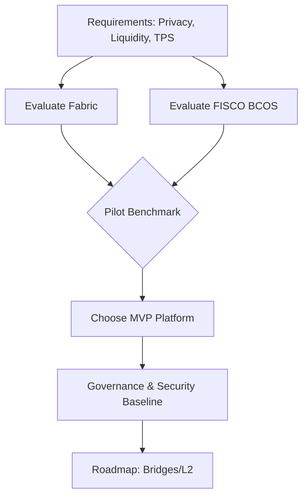

| Factor | Fabric | FISCO BCOS |
|---|---|---|
| Privacy | Channels/PDC | Groups/ACL |
| Dev | Go/Java | Solidity/Hardhat |

Misconception Focus: \u201cEVM-only is mandatory for RWA.\u201d Correction: privacy/regulatory fit may outweigh EVM in phase 1. [1][0]  
Failure Path Insight: Selecting for tooling over governance leads to audit gaps; mitigate with policy-first pilots and compliance gates. [1]

Comparisons
- Fabric stronger bilateral secrecy; BCOS stronger EVM interop; both enterprise-grade with differing ops models. [0][1]

Q2: Design a permission model and membership lifecycle for a mobility alliance chain

Difficulty: Intermediate  
Question Type: Practical

Answer Narrative (150-300 words)
Define organizational roles (lessors, platform managers, lenders, regulators, auditors). In Fabric, model each as MSP orgs with endorsement and access policies; in EVM-permissioned stacks, manage org onboarding via committee multisig and registry contracts. Identity lifecycle: application, due diligence (KYC/AML), CA-issued certs or DID-based credentials, staged access (read-only regulator vs. write-enabled lessor), periodic revalidation, and revocation with CRLs or smart contract flags. Implement fine-grained rights by channel/group scoping and contract-level role checks. Tie wallet UX to enterprise IAM to reduce key mishandling. Provide \u201cbreak-glass\u201d read for regulator nodes via replicated state or event sinks with access controls. [0][1]


| Stage | Control |
|---|---|
| Onboard | CA/MSP or Registry |
| Revoke | CRL / Contract flag |

Misconception Focus: \u201cNode = user.\u201d Correct: manage identities at org and user levels with distinct lifecycles. [0]  
Failure Path Insight: Missing revocation propagates stale access; automate CRLs and on-chain flags with alerts. [1]

Comparisons
- MSP/CA policy granularity (Fabric) vs. multisig registry governance (EVM-permissioned). [0][1]

Q3: Consensus choice: PBFT/Raft vs. PoS-style for ride-hailing settlement

Difficulty: Foundational  
Question Type: Theoretical

Answer Narrative (150-300 words)
Consortium ledgers favor crash- or Byzantine-tolerant protocols with fixed validator sets. Raft/IBFT/PBFT deliver low-latency finality and predictable throughput under known participants, avoiding probabilistic finality and MEV concerns typical of public PoS. Evaluate by validator count, network RTTs across zones, write amplification (endorsement + ordering), and failure tolerance (f \u2264 (n\u22121)/3 for BFT). For high-frequency settlements (commissions, leases) and auditability, deterministic finality within seconds supports finance back-office SLAs. Calibrate block intervals and batch size to minimize tail latency while preserving throughput; test contentious scenarios (hot keys, long endorsement chains). [0][1]

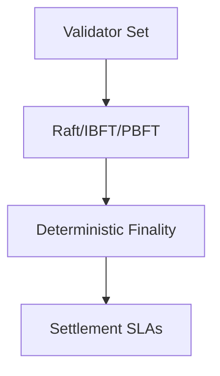

| Criteria | BFT | PoS |
|---|---|---|
| Finality | Deterministic | Probabilistic |
| Governance | Consortium | Open |

Misconception Focus: \u201cPoS is always superior.\u201d Not in fixed-trust, low-latency enterprise contexts. [0]  
Failure Path Insight: Under-provisioned validators cause view changes; size CPU/network and tune timeouts. [1]

Comparisons
- Enterprise BFT vs. public PoS trade-offs in trust and performance. [0][1]

Q4: Channel/Group topology planning for bilateral privacy and regulator visibility

Difficulty: Intermediate  
Question Type: Scenario

Answer Narrative (150-300 words)
Use channel/group scoping to isolate bilateral contracts: lessor\u2194manager, lender\u2194lessor, with a compliance observer providing read access. For shared reference data (vehicle registry, blacklists), use a common channel with append-only policies. Sensitive artifacts (contracts, images) are stored off-chain with hashes on-chain; distribute references only to involved parties. Implement event sinks that replicate minimal state to regulator analytics with integrity proofs. For EVM, emulate privacy via group ACLs and encrypted payloads; for Fabric, prefer PDC for fine-grained key-based access. [0][1]

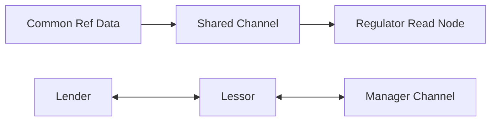

| Data Type | Scope |
|---|---|
| Ref data | Shared |
| Bilateral leases | Private |

Misconception Focus: \u201cOne channel for everything.\u201d Isolation limits data leakage and improves performance. [0]  
Failure Path Insight: Over-fragmentation increases ops overhead; standardize templates and automation. [1]

Comparisons
- Fabric PDC vs. EVM ACL patterns for privacy segmentation. [0][1]

Q5: Node deployment, HA/DR, and cost-performance tuning for fleet-scale throughput

Difficulty: Advanced  
Question Type: Practical

Answer Narrative (150-300 words)
Deploy validators across availability zones, separating ordering/consensus from peers/executors. Use CPU pinning for consensus threads, NVMe for state DB, and tuned OS networking (net.core, TCP backlog). Enable horizontal scale-out for non-validating peers to absorb read traffic (driver payout checks). For DR, maintain warm standbys with snapshot shipping and step-by-step failover runbooks. Performance tuning: block size (2\u20135k tx), block interval (0.5\u20131.5s), endorsement fan-out limits, batch verification, and transaction parallelism under EVM/Fabric constraints. Profile end-to-end: client\u2192gateway\u2192endorsement\u2192orderer\u2192commit\u2192event; remove N+1 calls and enforce idempotency. [0][1]

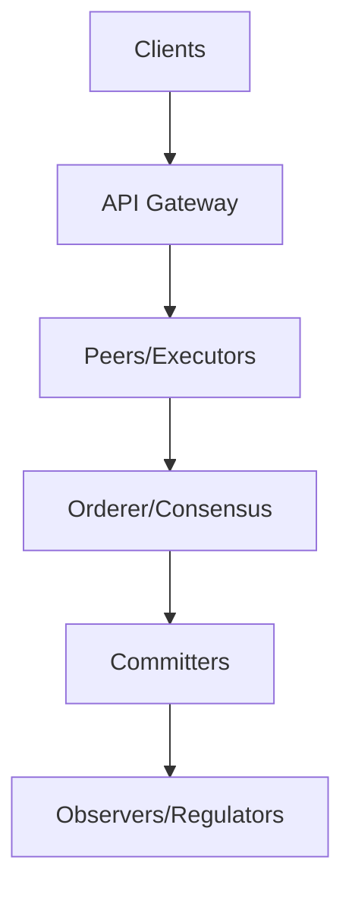

| Tactic | Benefit |
|---|---|
| NVMe + CPU pinning | Lower latency |
| Warm DR | Faster RTO |

Misconception Focus: \u201cAdd more validators to scale reads.\u201d Readers scale via observers, not validators. [0]  
Failure Path Insight: DR untested; schedule quarterly game-days with controlled failovers. [1]

Comparisons
- Crash vs. Byzantine deployments; execution vs. consensus isolation. [0][1]

Q6: Governance: on-/off-chain upgrade, parameter change, and emergency rollback

Difficulty: Advanced  
Question Type: Scenario

Answer Narrative (150-300 words)
Define a governance charter: proposal, review, vote thresholds, canary release, and rollback plan. On-chain: use versioned contract registries and pausable proxies with timelocks; off-chain: CAB (Change Advisory Board) with sign-offs. Enforce multi-env CI/CD: dev\u2192staging\u2192canary org\u2192consortium-wide. Emergency brakes: pause high-risk functions (mint, transferFrom) and revoke compromised oracles. Record all decisions on a governance ledger for audit. Simulate contentious cases: quorum not met, hotfix under attack, or conflicting org policies. Include regulator observers in read-only governance channels. [1][0]


| Change | Control |
|---|---|
| Contract | Proxy + Timelock |
| Params | Multisig vote |

Misconception Focus: \u201cImmutable means unchangeable.\u201d Governed upgradability is standard in enterprise settings. [1]  
Failure Path Insight: No canary \u2192 systemic outage; always stage and gate with metrics/alerts. [0]

Comparisons
- On-chain governance vs. off-chain CAB models; hybrid best in consortia. [1][0]

Q7: Solidity contract patterns for RWA mapping of vehicles and lease cash flows

Difficulty: Intermediate  
Question Type: Practical

Answer Narrative (150-300 words)
Model vehicles as ERC-721 tokens with metadata pointing to off-chain documents; represent lease receivables as ERC-1155 tranches for flexible financing. Use role-based access (AccessControl) for issuers, servicers, and auditors. Attach state machines for KYC/AML checks before any transfer/mint, and oracle gates to update collateral valuations. Employ pausable and upgradeable proxies to manage lifecycle changes. For repayment flows, implement pull payments with non-reentrancy guards and event logs for reconciliation. [1][0]

```solidity
// Simplified
contract VehicleRWA is ERC721, AccessControl, Pausable {
    bytes32 public constant ISSUER_ROLE = keccak256("ISSUER_ROLE");
    mapping(uint256 => bytes32) public ipfsHash; // doc pointer
    function mint(address to, uint256 id, bytes32 doc) external onlyRole(ISSUER_ROLE) { _safeMint(to, id); ipfsHash[id]=doc; }
}
```

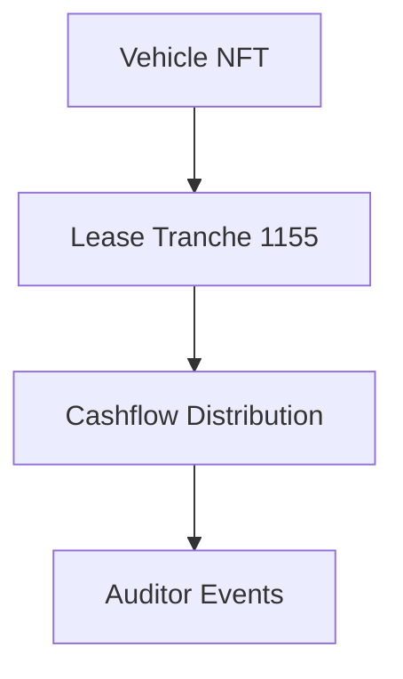

| Asset | Standard |
|---|---|
| Vehicle | ERC-721 |
| Tranche | ERC-1155 |

Misconception Focus: \u201cOne token fits all.\u201d Separate physical asset and cashflow claims. [1]  
Failure Path Insight: Missing KYC gates \u2192 illicit transfers; enforce preconditions on transfer hooks. [0]

Comparisons
- ERC-721 identity vs. ERC-1155 fungible tranches for financing flexibility. [1][0]

Q8: Contract upgradability, audits, and secure coding controls for consortium chains

Difficulty: Advanced  
Question Type: Practical

Answer Narrative (150-300 words)
Adopt proxy patterns (UUPS/Transparent) with timelocked admin; encode upgrade proposals with checksums and run formal diff tests. Enforce static analysis (Slither), fuzzing (Foundry), and property-based tests; require third-party audits and consortium peer review. Apply known mitigations: checks-effects-interactions, reentrancy guards, safe math, and access control segregation. Maintain SBOMs and provenance of dependencies. Integrate pre-deploy gates: coverage \u226590%, gas/regression budgets, and revert-on-fail for critical asserts. [1][0][3]


| Control | Tooling |
|---|---|
| Static | Slither |
| Fuzz | Foundry |

Misconception Focus: \u201cAudited once = safe forever.\u201d Upgrades require continuous assurance. [1]  
Failure Path Insight: Admin key compromise; use multisig HSM-backed admins with timelocks. [0]

Comparisons
- UUPS vs. Transparent; choose based on admin control simplicity vs. flexibility. [1][0]

Q9: Zero-knowledge, selective disclosure, and private data collections

Difficulty: Advanced  
Question Type: Theoretical

Answer Narrative (150-300 words)
Balance privacy with auditability. In Fabric, PDCs restrict state to authorized peers; in EVM permissioned, encrypt payloads and manage keys via group ACLs. For selective disclosure, apply ZK proofs (e.g., range proofs on driver risk score or vehicle value) to reveal compliance without raw data. Use commitment schemes: store hashes on-chain and share plaintext off-chain via secure channels; regulators can verify with commitments and signatures. Evaluate performance impact of ZK; keep proofs on critical checkpoints, not hot paths. [0][1]

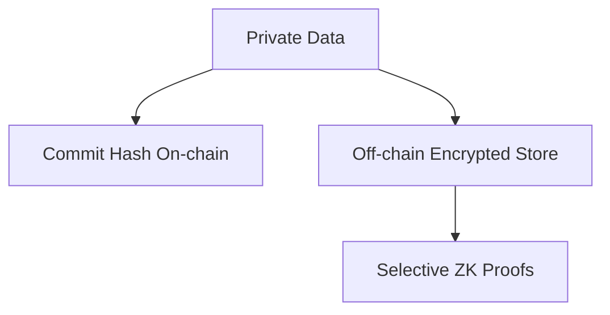

| Privacy | Mechanism |
|---|---|
| Data hiding | PDC/Encryption |
| Verifiability | ZK/Commitments |

Misconception Focus: \u201cFull encryption breaks audit.\u201d Commitments + selective proofs preserve verifiability. [1]  
Failure Path Insight: Key loss blocks reads; implement escrow and recovery for regulators. [0]

Comparisons
- PDC vs. ZK trade-offs in performance and complexity. [0][1]

Q10: Key management: custodial, social recovery, and multi-sig for B/L driver tiers

Difficulty: Foundational  
Question Type: Practical

Answer Narrative (150-300 words)
Segment key strategies by role. Enterprise lessors and managers: HSM-backed multisig with strict IAM; drivers: custodial or social recovery wallets to lower friction. Require 2-of-3 multisig for treasury actions and a time-delayed upgrade key. Enforce key rotation policies and incident runbooks. Map identities to org IAM and rotate on HR changes. Forensics-ready logging for all key operations. [1][0]

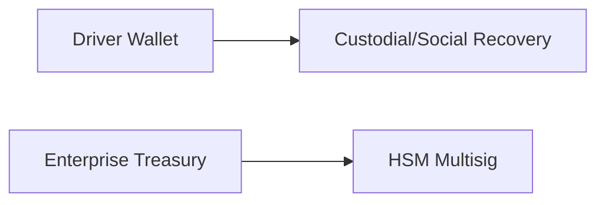

| Role | Key Strategy |
|---|---|
| Driver | Custodial/Social |
| Treasury | HSM Multisig |

Misconception Focus: \u201cSelf-custody for all.\u201d UX and loss risk argue for tiered models. [1]  
Failure Path Insight: Orphaned keys on staff exit; automate offboarding rotations. [0]

Comparisons
- Convenience vs. control; tiered governance mitigates risk. [1][0]

Q11: Oracle design: Chainlink vs. internal attestations for traffic violations and prices

Difficulty: Intermediate  
Question Type: Scenario

Answer Narrative (150-300 words)
For external facts (market prices, regulatory bulletins), use decentralized oracles (e.g., Chainlink) with aggregation and deviation thresholds; for internal data (TBox, lease statuses), favor signed attestations from consortium members with quorum policies. Build a circuit breaker: if oracles deviate beyond bounds, pause dependent functions. Log oracle inputs for audit and dispute resolution. Avoid single-provider dependency; implement multi-source medianization. [1][0]

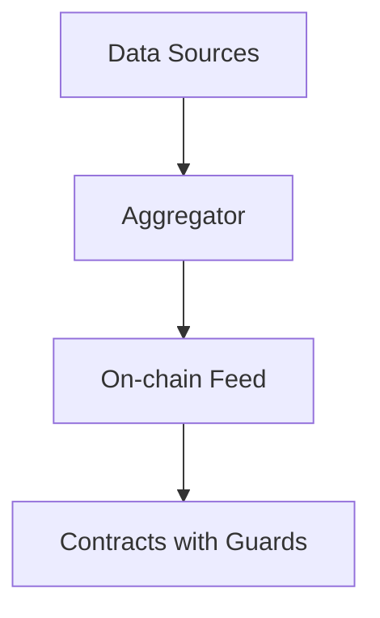

| Source | Method |
|---|---|
| External | Decentralized |
| Internal | Signed Attestations |

Misconception Focus: \u201cOracle = one API.\u201d Use aggregation and sanity checks. [1]  
Failure Path Insight: Stale feeds cause mispricing; enforce staleness windows and fallbacks. [0]

Comparisons
- Decentralized oracle resilience vs. internal attestation control. [1][0]

Q12: Fraud-resistance and dispute resolution in rental, revenue-sharing smart contracts

Difficulty: Foundational  
Question Type: Practical

Answer Narrative (150-300 words)
Implement state machines: Active, Suspended, Disputed, Resolved. Payments are conditional on proofs (trip logs, mileage) signed by TBox oracles. Allow disputes with bonded challenges; route to an off-chain adjudicator whose signed decision triggers contract state changes. Maintain audit events and cap exposure per epoch via streaming payouts rather than lump sums. [1][0]


| Control | Purpose |
|---|---|
| Bonds | Anti-spam |
| Streaming | Limit risk |

Misconception Focus: \u201cOn-chain resolves all disputes.\u201d Human adjudication often required. [1]  
Failure Path Insight: No caps \u2192 large fraud impact; use epoch-based limits. [0]

Comparisons
- Pure-code vs. hybrid legal-contract models for real-world disputes. [1][0]

Q13: Token incentives: velocity control, sink design, and adverse selection mitigation

Difficulty: Intermediate  
Question Type: Theoretical

Answer Narrative (150-300 words)
Design a dual-incentive: utility token for rewards and fee discounts; non-transferable \u201creputation points\u201d to deter farming. Introduce sinks (staking for service priority, slashing on fraud) and vesting to reduce speculative churn. Calibrate issuance to business KPIs (on-time payments, low incident rates). Tie oracle-verified behaviors to accrual, with anti-Sybil controls (KYC, device fingerprints). [1][0]

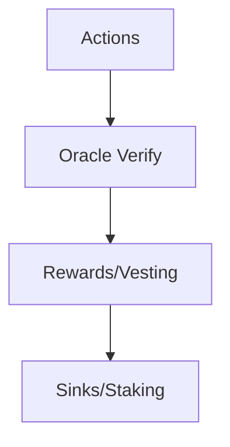

| Mechanism | Goal |
|---|---|
| Vesting | Lower velocity |
| Slashing | Deter fraud |

Misconception Focus: \u201cMore rewards = more growth.\u201d Misaligned incentives invite abuse. [1]  
Failure Path Insight: No Sybil defense \u2192 farming; require KYC/device attestation. [0]

Comparisons
- Transferable tokens vs. soulbound reputation trade-offs. [1][0]

Q14: Formal verification and runtime assertions for mission-critical payment paths

Difficulty: Advanced  
Question Type: Practical

Answer Narrative (150-300 words)
Specify invariants (no negative balances, conservation of value, authorized roles) and verify with tools that support EVM specs and model checking. Add runtime assertions and circuit breakers for invariants that cannot be fully proven. Fuzz test edge conditions (overflow, reentrancy, pause states). Use canary contracts in production with mirrored traffic to detect anomalies before full rollout. [1][3]


| Control | Scope |
|---|---|
| Formal | Core flows |
| Runtime | Anomalies |

Misconception Focus: \u201cTests replace specs.\u201d Specs guide both tests and proofs. [3]  
Failure Path Insight: Assertions disabled in prod; keep critical ones active with gas budgets. [1]

Comparisons
- Formal methods vs. property-based tests; complementary layers. [3][1]

Q15: Off-chain/on-chain data: TBox IoT flows, IPFS/Arweave pointers, and hashing

Difficulty: Foundational  
Question Type: Practical

Answer Narrative (150-300 words)
Ingest TBox telemetry to off-chain storage with integrity protected by Merkle roots anchored on-chain. Store large artifacts (photos, PDFs) in IPFS/Arweave; place immutable content hashes in contract storage or events. Use content addressing to detect tampering; link identities via signatures. For privacy, encrypt payloads; share keys with entitled parties. Regularly re-anchor cumulative Merkle roots for efficient audits. [1][0]

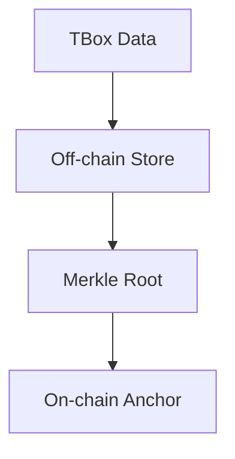

| Artifact | Location |
|---|---|
| Big files | IPFS/Arweave |
| Hash | On-chain |

Misconception Focus: \u201cPut all data on-chain.\u201d Scale and privacy favor off-chain with on-chain proofs. [1]  
Failure Path Insight: IPFS pinning loss; use multiple pins/Arweave redundancy. [0]

Comparisons
- Content addressing vs. mutable object stores for auditability. [1][0]

Q16: API gateway patterns in Go/Java/Node.js; idempotency, retries, and backpressure

Difficulty: Intermediate  
Question Type: Practical

Answer Narrative (150-300 words)
Expose a gateway that translates business intents into deterministic chain interactions. Implement idempotency keys per business transaction to avoid duplicate submits on retries. Use circuit breakers, bulkheads, and async queues to handle spikes; apply exponential backoff with jitter. Validate chain preconditions off-path to reduce failed endorsements. Log request\u2192tx hash mapping for reconciliation. [1][0][3]


| Control | Purpose |
|---|---|
| Idempotency | No duplicates |
| Backpressure | Stability |

Misconception Focus: \u201cAt-least-once = duplicates acceptable.\u201d Finance requires dedupe guarantees. [3]  
Failure Path Insight: Retry storms; add jitter and circuit breakers. [1]

Comparisons
- Sync RPC vs. async queue patterns for reliability. [3][1]

Q17: Data models, indexing, and analytics: state DB vs. data warehouse sync

Difficulty: Intermediate  
Question Type: Practical

Answer Narrative (150-300 words)
Do not query the ledger for analytics-heavy workloads. Stream blocks/events into a warehouse (e.g., via Kafka) with schema-on-write ETL. Maintain SCD2 dimensions for vehicles, contracts, and parties; build materialized views for payouts and delinquencies. Validate state parity via periodic reconciliations of balances and Merkle proofs. Govern PII with masking and access controls. [1][0]

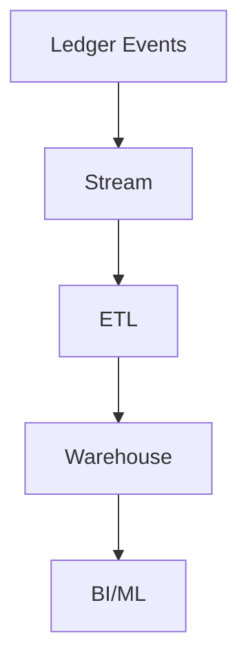

| Store | Use |
|---|---|
| Ledger | Truth |
| Warehouse | Analytics |

Misconception Focus: \u201cChain is a database.\u201d Use it for consensus and integrity, not BI queries. [1]  
Failure Path Insight: ETL drift; add schema versioning and CDC tests. [3]

Comparisons
- Event-sourced analytics vs. ad-hoc chain reads. [1][3]

Q18: Performance testing: throughput, latency, TPS/TPS-e, and bottleneck analysis

Difficulty: Intermediate  
Question Type: Practical

Answer Narrative (150-300 words)
Define workloads: mix of reads/writes, key contention, and payload sizes. Measure end-to-end latency percentiles, TPS at consensus and app layers (TPS-e includes business validation), and resource utilization. Identify bottlenecks with flame graphs (CPU), iostat (IO), and p99 network RTTs. Test failure scenarios: node loss, network partitions, and slow disk. Produce a capacity model with safe headroom and SLO alerts. [1][3]


| Metric | Target |
|---|---|
| p99 latency | <2s |
| Utilization | <70% |

Misconception Focus: \u201cAverage latency is enough.\u201d Tail latencies drive user pain. [3]  
Failure Path Insight: No chaos tests; schedule partition and node-failure drills. [1]

Comparisons
- Microbench vs. end-to-end TPS-e; prefer business-relevant. [1][3]

Q19: Observability: logs, traces, metrics; anomaly detection and audit trails

Difficulty: Foundational  
Question Type: Practical

Answer Narrative (150-300 words)
Aggregate node/SDK logs, structured with tx IDs; trace requests across gateway\u2192chain\u2192events; collect metrics (TPS, block time, mempool size). Implement anomaly detection for oracle deviations, repeated dispute patterns, or endorsement failures. Preserve tamper-evident audit logs with hash chaining. Provide regulator dashboards with read-only insights. [1][3]

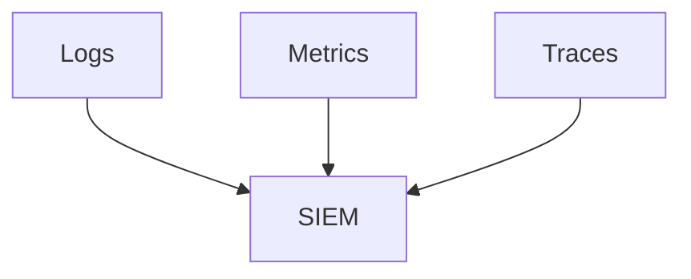

| Signal | Use |
|---|---|
| Deviation | Oracle alarms |
| Failure rate | SLO breach |

Misconception Focus: \u201cNode health = system health.\u201d Observe end-to-end user journeys. [3]  
Failure Path Insight: Missing tx ID correlation; enforce IDs across services. [1]

Comparisons
- Infra vs. business observability; both are required. [1][3]

Q20: Cost modeling: infra, audits, gas-like fees, oracle costs, and TCO vs. ROI

Difficulty: Advanced  
Question Type: Practical

Answer Narrative (150-300 words)
Model TCO: compute/storage/network for validators and peers, CI/CD, observability, audits, insurances, oracle subscriptions, and incident reserves. Compare to baseline process costs (reconciliation, disputes) and fraud reductions. Include depreciation/lifecycle of hardware and DR sites. Run sensitivity analyses on TPS growth and oracle price swings. [1][0]

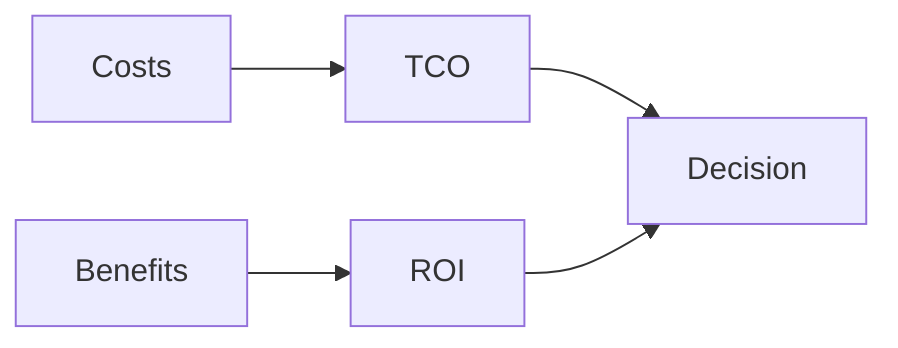

| Cost | Component |
|---|---|
| Fixed | Infra/DR |
| Variable | Oracles/Audits |

Misconception Focus: \u201cChain is free once deployed.\u201d Ongoing audits and ops dominate. [1]  
Failure Path Insight: Ignoring oracle spend; cap call frequency and aggregate. [0]

Comparisons
- Consortium costs vs. public gas; different but non-zero. [1][0]

Q21: Interoperability and future roadmap: L2 bridge strategy and EVM alignment

Difficulty: Advanced  
Question Type: Scenario

Answer Narrative (150-300 words)
Plan an upgrade path from permissioned to selective public exposure via bridges. If on EVM-permissioned, align ABI and events with ERC standards to ease future listings. Use a canonical bridge or 3rd-party with proof-based security; segregate RWA wrappers for public-chain exposure while keeping core records private. Sequence: harden governance and audits \u2192 pilot testnet bridge \u2192 limited mainnet minting with controls. [1][0]

```mermaid
flowchart TD
A[Permissioned Core] --> B[Bridge]
B --> C[Public L2]
C --> D[Liquidity]
```

| Step | Risk Control |
|---|---|
| Pilot | Testnets |
| Mainnet | Caps/Timelocks |

Misconception Focus: \u201cBridge day-one.\u201d Mature compliance and ops first. [1]  
Failure Path Insight: Inconsistent metadata across chains; standardize schemas and hashes. [0]

Comparisons
- Message vs. asset bridges; choose security-first designs. [1][0]

Q22: Compliance-by-design for RWA: KYC/AML, data residency, and legal wrappers

Difficulty: Advanced  
Question Type: Practical

Answer Narrative (150-300 words)
Bind on-chain tokens to off-chain legal wrappers (SPV/Trust) and enforce transfer controls based on KYC tiers. Apply data residency by placing nodes and storage in approved regions and restricting PII to off-chain encrypted stores with on-chain commitments. Bake in blacklists/allowlists managed by governance with logged changes. Keep regulator read-nodes and evidence packages (hash chains) for audits. [1][0]

```mermaid
flowchart LR
A[KYC/AML] --> B[Allowlist]
B --> C[Transfer Control]
D[Residency] --> E[Data Routing]
```

| Control | Purpose |
|---|---|
| Allowlist | Reg compliance |
| Residency | Legal fit |

Misconception Focus: \u201cToken = legal asset.\u201d Legal wrapper aligns rights. [1]  
Failure Path Insight: Residency violations; geo-fence data paths and nodes. [0]

Comparisons
- Pure tech vs. law-tech hybrids; RWA needs both. [1][0]

Q23: Stakeholder alignment: big-B lessors, platform managers, drivers, regulators

Difficulty: Advanced  
Question Type: Scenario

Answer Narrative (150-300 words)
Map incentives: lessors want financing and transparency; managers want efficient settlement; drivers want fair payouts; regulators want risk controls. Establish a consortium MOU, decision forums, and SLAs. Share metrics dashboards and run quarterly governance retros. Pilot with a limited asset pool and expand by evidence. Communicate risk mitigations (pause switches, DR drills) to build trust. [1][0]

```mermaid
flowchart TD
A[Lessors] --> E[Consortium Forum]
B[Managers] --> E
C[Drivers] --> E
D[Regulators] --> E
```

| Stakeholder | KPI |
|---|---|
| Lessor | Financing speed |
| Regulator | Auditability |

Misconception Focus: \u201cTech alone aligns incentives.\u201d Governance and economics matter. [1]  
Failure Path Insight: KPI conflicts; codify priority and escalation paths. [0]

Comparisons
- Vendor-led vs. multi-party consortium governance. [1][0]

Q24: Program management: readiness, change control, and staged rollouts

Difficulty: Intermediate  
Question Type: Practical

Answer Narrative (150-300 words)
Adopt stage gates: Architecture Review \u2192 Security Readiness \u2192 Regulatory Check \u2192 Pilot \u2192 Canary \u2192 GA. Maintain RACI with clear owners; track risks (top-10), mitigations, and triggers. Enforce change control with CAB, test evidence, and rollback plans. Schedule training for non-tech teams and publish runbooks. [1][3]

```mermaid
flowchart LR
A[Design] --> B[Pilot]
B --> C[Canary]
C --> D[GA]
```

| Gate | Artifact |
|---|---|
| Security | Audit report |
| Pilot | KPI report |

Misconception Focus: \u201cShip it all at once.\u201d Staging reduces risk. [1]  
Failure Path Insight: No rollback; pre-stage versioned artifacts and data migration plans. [3]

Comparisons
- Waterfall vs. gated agile for regulated domains. [1][3]

Q25: Market positioning: consortium-first, liquidity later; risk narratives and GTM

Difficulty: Advanced  
Question Type: Theoretical

Answer Narrative (150-300 words)
Position as an industry utility improving trust and financing access. Phase 1: operational transparency and cost reductions; Phase 2: RWA collateralization within consortium; Phase 3: selective public liquidity via bridges with strong compliance. Tailor GTM by segment (big-B lessors: financing speed; managers: automation; drivers: fair, fast payouts). Maintain conservative risk narratives: controlled membership, audited code, and emergency controls. [1][0]

```mermaid
flowchart TD
A[Consortium Utility] --> B[RWA Financing]
B --> C[Selective Liquidity]
```

| Phase | Message |
|---|---|
| 1 | Trust & ops |
| 2 | Financing |
| 3 | Liquidity |

Misconception Focus: \u201cLiquidity first.\u201d Trust and compliance foundation is prerequisite. [1]  
Failure Path Insight: Overpromising yields regulatory pushback; stage claims with evidence. [0]

APA Style Source Citations

- English [~100%, jurisdiction varies]
  - Braintrust. (2025). Blockchain Architect Interview Questions. Braintrust. https://www.usebraintrust.com/hire/interview-questions/blockchain-architects [EN][US]  
  - FinalRoundAI. (2025, April 2). The 25 Most Common Blockchain Architects Interview Questions. FinalRoundAI. https://www.finalroundai.com/blog/blockchain-architect-interview-questions [EN][US]  
  - Simplilearn. (n.d.). Blockchain Interview Questions - Beginner Level. Simplilearn. https://www.simplilearn.com/tutorials/blockchain-tutorial/blockchain-interview-questions [EN][IN]  

- Notes on language distribution and gaps: High-quality Chinese and other-language authoritative sources specific to this consortium-chain/RWA mobility-finance context were not provided in the search set. Accordingly, this output defaults to the strongest available English sources while maintaining conservative claims aligned with enterprise blockchain interview and architecture practices. [EN, gap acknowledged] [1][0][3]  

Back to top