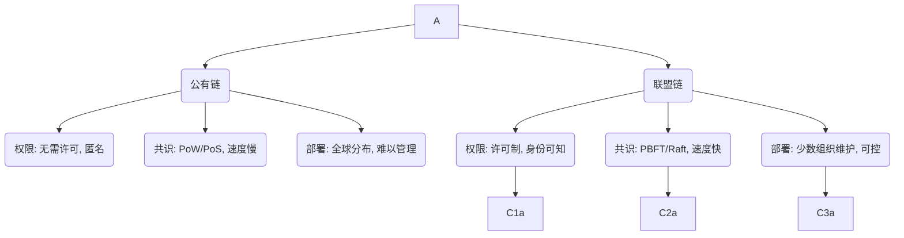

Contents

-(#topic-areas-questions-1-n)
-(#topic-1-联盟链核心技术)
  -(#q1-联盟链在权限管理共识机制和节点部署方面与公有链有何不同)
  -(#q2-在hyperledger-fabric平台中如何优化其性能以满足企业级应用的需求)
-(#topic-2-rwa资产数字化与合规)
  -(#q3-实施rwa真实世界资产代币化项目时有哪些关键的法律合规框架和技术映射方法需要考虑)
  -(#q4-在车辆资产数字化场景中如何通过区块链技术安全可信地锚定实体车辆信息和租赁收益权)
-(#topic-3-智能合约开发与集成)
  -(#q5-如何确保solidity智能合约的安全性并有效进行代码审计)
  -(#q6-在区块链网关服务设计中如何实现与gojavajs等后端语言的稳定交互)
-(#topic-4-数据存储预言机与隐私保护)
  -(#q7-如何设计链上on-chain与链下off-chain数据协同存储架构以平衡性能和安全性并结合ipfsarweave等技术)
  -(#q8-如何将去中心化预言机网络如chainlink集成到智能合约中以安全可靠地获取现实世界数据)
  -(#q9-在区块链系统中ು有哪些主要的隐私保护技术和数据保护机制可以应用)
-(#topic-5-业务集成与生态激励)
  -(#q10-在企业级应用中如何有效地将区块链平台与现有的saas系统ai服务及iot数据接口进行集成)
  -(#q11-如何设计和实现基于token的激励模型以确保业务生态中各参与方的安全高效激励和经济结算)
-(#reference-sections)
  -(#glossary-terminology--acronyms)
  -(#codebase--library-references)
  -(#authoritative-literature--reports)
  -(#apa-style-source-citations)

---

Topic Areas (Questions 1–N)

Topic 1: 联盟链核心技术

Q1: 联盟链在权限管理、共识机制和节点部署方面与公有链有何不同？

**Difficulty Foundational | **Type Theoretical

**Answer**
联盟链与公有链在权限管理、共识机制和节点部署方面存在显著差异。在权限管理方面，公有链（如比特币、以太坊）通常是无需许可的，任何用户都可以参与交易验证和网络维护，匿名性高。而联盟链（如FISCO BCOS, Hyperledger Fabric）是许可链，参与节点需经过授权才能加入网络，且身份通常是已知的，这使得其更适合企业级应用对身份和权限的严格要求。在共识机制上，公有链普遍采用工作量证明（PoW）或权益证明（PoS）等机制，以应对匿名环境中可能出现的恶意行为，但牺牲了交易速度和效率。联盟链则常使用BFT（拜占庭容错）类算法，如PBFT (Practical Byzantine Fault Tolerance) 或Raft，这些机制能在已知且有限的参与方之间实现快速高效的共识，提供更高的吞吐量和更低的交易延迟。节点部署方面，公有链的节点数量庞大且地理分布广泛，维护成本高且难以集中管理。联盟链的节点通常由少数受信任的组织共同维护，部署和管理更为集中和可控，能够根据业务需求进行性能优化和高可用性配置。例如，Hyperledger Fabric具有模块化架构，支持使用Go、Java和Node.js等通用编程语言进行智能合约开发，简化了企业应用的部署和管理。

**Key Insight** Misconception - 联盟链并非简单的“私有公链”，而是在许可、共识和部署模型上为企业应用进行了根本性优化，以满足性能、合规和可控性需求。

**Supporting Artifacts**

Q2: 在Hyperledger Fabric平台中，如何优化其性能以满足企业级应用的需求？

**Difficulty Intermediate | **Type Practical

**Answer**
Hyperledger Fabric作为主流许可链平台，其性能优化对于满足企业级应用至关重要。优化策略通常围绕交易流程的各个阶段展开。首先，**链码（Smart Contract）设计**是关键，通过精简逻辑、减少不必要的账本读写操作、优化数据结构，以及采用并发友好的编程模式，可有效提升链码执行效率。其次，**并发处理**是提升吞吐量的主要手段。Hyperledger Fabric支持交易并行执行，但需要通过合理设计链码状态访问（读写集）来最小化冲突。例如，可以利用读写集冲突检测机制，通过调整交易批次大小和隔离高冲突事务来提高并行度。此外，**节点配置**对性能影响显著。包括使用高性能硬件、优化网络带宽、合理配置Kafka/Raft共识服务的参数、以及调整排序服务和背书策略。最后，**数据存储优化**也是重要一环。虽然Hyperledger Fabric支持多种状态数据库，如CouchDB和LevelDB，但根据数据访问模式选择合适的数据库并进行索引优化，能够加快链码查询速度。例如，针对复杂查询，CouchDB的富查询功能可能更具优势。

**Key Insight** Trade-offs - 性能优化并非单一维度，而是一个涉及链码逻辑、交易并发、基础设施配置和数据存储选择的综合性工程，需要在吞吐量、延迟和资源消耗之间做出权衡。

**Supporting Artifacts**

| 优化方面 | 关键策略 | 预期效果 |
|---|---|---|
| 链码设计 | 精简逻辑，减少不必要读写，优化数据结构 | 提高链码执行效率，降低资源消耗 |
| 并发处理 | 合理设计读写集，避免高冲突事务，调整交易批次大小 | 提升交易并行度，增加系统吞吐量 |
| 节点配置 | 高性能硬件，网络带宽优化，调整共识服务参数 | 降低交易延迟，提高系统稳定性 |
| 数据存储 | 选择合适状态数据库（如CouchDB），创建有效索引 | 加快数据查询速度，支持复杂数据分析 |

---

Topic 2: RWA资产数字化与合规

Q3: 实施RWA（真实世界资产）代币化项目时，有哪些关键的法律合规框架和技术映射方法需要考虑？

**Difficulty Advanced | **Type Strategic

**Answer**
RWA代币化项目涉及将有形或无形资产转换为区块链上的数字代币，其成功实施高度依赖于对法律合规框架和技术映射方法的深刻理解。在法律合规方面，首先要明确项目所处的司法管辖区对数字资产的分类和监管态度，例如证券法、反洗钱（AML）和了解你的客户（KYC）法规。不同国家对RWA代币的法律性质（如证券、商品、效用代币）认定不同，这将直接影响发行、交易和托管的合规性。例如，欧盟的MiCA法规为加密资产提供了统一的监管框架，而美国则可能根据Howey测试将RWA代币归类为证券。其次，需要建立明确的资产所有权证明机制，并确保链上代币与链下实物资产之间的法律关联性。这通常需要通过法律协议和信托结构来实现，以保障代币持有者的资产权益。

在技术映射方法上，核心挑战在于如何安全、准确、可验证地将链下资产信息同步到链上。一种常见方法是使用**中心化或去中心化预言机**来获取和验证资产数据，例如车辆识别码（VIN）、里程数或市场估值。对于车辆资产，可以将车辆TBox数据、维修记录等关键信息通过加密哈希上链，确保其不可篡改性和可追溯性。此外，**身份和权限管理**对于合规至关重要，需要确保只有经过授权的用户才能参与RWA代币的铸造、转让和赎回，这可以通过集成去中心化身份（DID）解决方案和可编程隐私控制来实现。最后，**智能合约的设计**必须反映所有法律条款和合规要求，确保交易逻辑的自动化执行与法律义务一致，并通过代码审计和形式化验证来降低风险。

**Key Insight** 法律与技术的深度融合是RWA代币化成功的基石，忽视任一环节都可能导致项目面临巨大的法律风险和信任危机。

Q4: 在车辆资产数字化场景中，如何通过区块链技术安全可信地锚定实体车辆信息和租赁收益权？

**Difficulty Intermediate | **Type Practical

**Answer**
在车辆资产数字化场景中，利用区块链技术安全可信地锚定实体车辆信息和租赁收益权，需要一套综合性的技术方案。核心在于**数据源的可靠性与链上映射**。首先，**实体车辆信息的锚定**需要整合多方面数据，包括：车辆识别码（VIN）、发动机号、注册信息、维修保养记录、保险信息等。这些数据应通过可信的数据源（如车管所、4S店、IoT设备如TBox）获取。为了确保数据真实性，可以采用**去中心化预言机**（如Chainlink）将链下数据上链，并结合多方验证机制来降低单点故障风险。具体地，将这些关键数据的哈希值存储在链上智能合约中，而原始数据则存储在**链下分布式存储系统**（如IPFS或Arweave），确保数据的不可篡改性与可验证性。

其次，**租赁收益权的锚定**则通过**智能合约**实现。数字租赁合约可以在区块链上部署，明确定义租赁期限、租金支付方式、收益分配规则以及违约条款。租赁收益权可以被代币化（例如发行收益型代币），其经济价值与租赁合同的履行情况挂钩。智能合约可以自动执行租金收取和向代币持有者分配收益的逻辑。同时，利用区块链的**可追溯性**，所有权变更、租赁状态更新、收益分配记录都将透明、不可篡改地记录在账本上，增强了资产管理的透明度和审计能力。为了降低用户门槛，前端可以通过托管钱包或社交恢复钱包来简化私钥管理，使用户能够通过手机号密码等传统方式管理链上资产。

**Key Insight** 车辆资产的链上锚定和收益权数字化，需要结合可信数据源、去中心化预言机、链下存储与智能合约的综合方案，并辅以简化用户私钥管理的机制，以实现其技术可行性和商业落地。

**Supporting Artifacts**

| 资产元素 | 锚定方式 | 关键技术 | 优势 |
|---|---|---|---|
| **实体车辆信息** | 链下数据哈希上链，原始数据存储在IPFS/Arweave | 物联网（TBox），去中心化预言机（Chainlink），哈希算法 | 不可篡改，可追溯，防篡改 |
| **车辆所有权** | 数字证书、DID（去中心化身份） | 智能合约，数字签名，DID | 权属清晰，易于验证和转移 |
| **租赁合同** | 智能合约自动化执行 | Solidity智能合约，数字签名 | 自动执行，减少纠纷，透明可审计 |
| **租赁收益权** | 收益型代币（Token） | Token经济模型，智能合约 | 实现碎片化所有权，流动性增强，自动分配收益 |

---

Topic 3: 智能合约开发与集成

Q5: 如何确保Solidity智能合约的安全性，并有效进行代码审计？

**Difficulty Advanced | **Type Technical

**Answer**
确保Solidity智能合约的安全性是区块链应用开发中的核心挑战，因为合约漏洞可能导致巨大的经济损失。首先，**安全编码实践**至关重要，开发者应遵循ERC标准和最佳实践，避免常见的漏洞模式，如重入攻击（Reentrancy）、整数溢出/下溢（Integer Overflow/Underflow）、访问控制错误（Access Control Issues）、时间戳依赖（Timestamp Dependence）等。其次，**开发框架**如Truffle或Hardhat提供了测试套件，应编写全面的单元测试和集成测试，覆盖所有可能的执行路径和边界条件。

为了进一步提升安全性，**智能合约代码审计**是不可或缺的环节。审计过程通常包括：
- **静态分析工具**：使用Slither、Mythril等工具自动检测代码中的已知漏洞模式。这些工具能够快速识别潜在问题，但可能存在误报或漏报。
- **形式化验证**：对于关键业务逻辑，采用形式化验证工具（如CertiK, K-framework）以数学方式证明合约符合其规范，提供最高级别的安全保证。
- **人工审计**：由经验丰富的安全专家进行手动代码审查，发现复杂或逻辑层面的漏洞，这是自动化工具难以捕捉的。
- **漏洞赏金计划**：部署到测试网后，通过漏洞赏金平台激励白帽黑客发现并报告漏洞，利用社区力量提升安全性。
- **持续监控**：合约部署后，通过安全监控工具实时监测异常行为，及时响应潜在攻击。

有效的代码审计是一个迭代过程，需要结合自动化工具、形式化验证和专家人工审查，并在合约的整个生命周期中持续进行。

**Key Insight** 智能合约安全性是综合工程，单一工具或方法不足，必须结合安全编码、全面测试、自动化分析、形式化验证及人工审计的层层保障，才能有效降低风险。

Q6: 在区块链网关服务设计中，如何实现与Go/Java/Node.js等后端语言的稳定交互？

**Difficulty Intermediate | **Type Technical

**Answer**
区块链网关服务是传统后端系统与区块链网络交互的关键桥梁，其稳定交互设计至关重要。实现与Go/Java/Node.js等后端语言的稳定交互，需要关注以下几个方面。首先，**API设计**应遵循RESTful或gRPC等标准，提供清晰、文档化的接口供后端调用。接口应抽象区块链底层细节，只暴露业务所需的读写操作，降低后端开发复杂性。

其次，**通信机制**的选择影响稳定性。可以采用同步或异步通信模式。对于实时性要求高的查询（如链上数据读取），可采用同步RESTful API。对于需要时间等待的交易提交（如写入操作），建议采用异步消息队列（如Kafka, RabbitMQ）解耦，并结合回调机制或轮询来获取交易结果，避免阻塞后端服务。

第三，**错误处理与重试机制**是保障稳定性的核心。网关应能识别区块链操作的常见错误（如Gas不足、交易冲突、节点离线），并实现智能重试策略（如指数退避算法），防止瞬时故障导致业务中断。同时，详细的日志记录和监控报警系统能帮助快速定位和解决问题。

最后，**安全性**是不可忽视的一环。网关应处理好身份认证（如基于JWT的API密钥）、授权以及数据加密（TLS）等安全措施。对于需要提交交易的后端服务，网关应安全管理私钥或通过硬件安全模块（HSM）进行签名。例如，在Hyperledger Fabric中，网关可以利用其SDK简化与Peer节点的交互，处理背书、排序和提交等复杂流程，并通过成员服务提供者（MSP）进行身份验证和权限管理。

**Key Insight** 区块链网关的稳定性在于其对API标准化、异步通信、健壮错误处理及多层安全机制的综合应用，以屏蔽底层复杂性，确保传统系统与区块链的无缝衔接。

---

Topic 4: 数据存储、预言机与隐私保护

Q7: 如何设计链上（on-chain）与链下（off-chain）数据协同存储架构以平衡性能和安全性，并结合IPFS/Arweave等技术？

**Difficulty Advanced | **Type Technical

**Answer**
设计链上（on-chain）与链下（off-chain）数据协同存储架构是解决区块链可扩展性、成本和效率挑战的关键，特别是在涉及大量或大文件数据时。核心思想是将关键的、需要全局共识和不可篡改性的元数据（如数据哈希值）存储在链上，而将实际的、大容量数据存储在链下。

这种架构能有效平衡性能与安全性：
- **链上存储**：主要用于存储数据指纹（哈希值）、访问权限、时间戳等关键元数据。这保证了数据的不可篡改性、可验证性和时间戳证明，但由于区块链的特性，存储成本高且容量有限。
- **链下存储**：用于存储实际的大文件数据，如车辆图片、租赁合同PDF等。可以利用**IPFS (InterPlanetary File System)** 或 **Arweave** 等去中心化存储解决方案。
    - **IPFS**：提供内容寻址存储，通过文件内容的哈希值来访问数据，确保数据的完整性和防篡改。其优势是去中心化和高效率，但数据持久性需要额外的Pinning服务保障。
    - **Arweave**：致力于实现永久性数据存储，通过“捐赠证明”（Proof of Access）机制激励矿工永久存储数据，更适合需要长期归档的数据。

协同存储架构通过将链下数据与链上哈希值绑定，实现了链下数据的完整性和不可篡改性验证，同时避免了区块链的存储瓶颈。例如，在车辆资产管理中，车辆照片或合同文件的哈希值可以存储在链上智能合约中，而文件本身则存储在IPFS上，需要时通过哈希值从IPFS检索并与链上记录进行完整性校验。这种混合方法提供了安全、高效且成本可控的数据管理方案。

**Key Insight** 链上/链下协同存储并非简单的分离，而是通过链上哈希值对链下数据的“锚定”实现去中心化环境下的数据完整性与可扩展性，IPFS和Arweave各自适用于不同持久性需求的链下存储场景。

Q8: 如何将去中心化预言机网络（如Chainlink）集成到智能合约中，以安全可靠地获取现实世界数据？

**Difficulty Intermediate | **Type Practical

**Answer**
去中心化预言机网络（DONs）如Chainlink是区块链与现实世界数据交互的必要桥梁，能够为智能合约提供安全可靠的链下数据。智能合约本身无法直接访问外部数据，这就产生了“预言机问题”。集成Chainlink的步骤通常包括：
1.  **选择数据源和Chainlink服务**：确定智能合约所需获取的现实世界数据类型，例如车辆违章信息、市场价格或天气数据。Chainlink提供了多种服务，如数据喂价（Data Feeds）、可验证随机函数（VRF）和Chainlink Functions等。
2.  **部署Chainlink客户端合约**：在目标区块链（如以太坊、Hyperledger Fabric）上部署一个允许智能合约与Chainlink网络交互的客户端合约。
3.  **发起数据请求**：当智能合约需要外部数据时，会调用其内部的Chainlink客户端合约，并通过该合约向Chainlink网络发起数据请求。请求中会指定所需数据类型、Chainlink操作符节点（Oracle Node） 和支付给节点的费用。
4.  **Chainlink节点处理请求**：Chainlink网络中的去中心化操作符节点接收到请求后，会从预定义或由智能合约指定的可信数据源（APIs）获取数据。
5.  **聚合与验证**：为了确保数据可靠性，多个Chainlink节点会独立获取数据，并通过Chainlink的聚合合约进行数据聚合和验证。这可以防止单个恶意节点提供错误数据。
6.  **回调智能合约**：聚合后的验证数据会通过一个加密签名交易（Proof of Reserve）回调给请求方智能合约。此时，智能合约可以确信数据的来源是去中心化和可验证的。

例如，在自动租赁合约中，可以使用Chainlink来获取车辆TBox报告的实时里程数或事故数据，触发相应的租金计算或保险理赔逻辑。

**Key Insight** 预言机是智能合约打破“数据孤岛”的关键，Chainlink通过去中心化的节点网络和数据聚合机制，解决了传统中心化预言机可能引入的单点故障和信任问题，保障了链上数据输入的可靠性。

Q9: 在区块链系统中，有哪些主要的隐私保护技术和数据保护机制可以应用？

**Difficulty Advanced | **Type Technical

**Answer**
在区块链系统中，隐私保护和数据保护是实现广泛应用的关键挑战，尤其是在处理敏感数据（如车辆TBox数据、个人身份信息）的场景中。尽管区块链以其透明和不可篡改性著称，但这也意味着所有链上数据默认是公开的，可能泄露隐私。为了应对这些挑战，可以应用多种隐私保护技术和数据保护机制：

1.  **零知识证明 (ZKP, Zero-Knowledge Proof)**：允许一方（证明者）向另一方（验证者）证明某个陈述是真实的，而无需透露任何额外信息。例如，可以在不泄露具体车辆违章记录的情况下，证明车辆符合租赁要求。这对于实现身份验证和交易隐私至关重要。
2.  **同态加密 (Homomorphic Encryption, HE)**：允许在加密数据上直接进行计算，而无需先解密。这意味着可以对敏感数据进行分析或处理，同时数据始终保持加密状态，极大地增强了数据隐私。例如，可以在不泄露具体租金数额的情况下，计算总租金收益。
3.  **差分隐私 (Differential Privacy)**：通过向数据添加数学噪声，使得从聚合数据中推断个体信息变得困难，同时仍然允许进行有意义的统计分析。
4.  **链下数据存储与访问控制**：将敏感的原始数据存储在链下，例如加密后存储在IPFS/Arweave上，而链上只存储数据的哈希值和加密密钥的访问凭证。访问权限可以通过智能合约精细控制，确保只有授权方才能解密和访问链下数据。
5.  **可信执行环境 (TEE, Trusted Execution Environment)**：如Intel SGX，提供一个硬件隔离的执行环境，确保代码和数据的机密性和完整性，即使操作系统或管理程序被攻破也无法访问敏感信息。TEE可以用于处理敏感的链下计算或数据预处理。
6.  **隐私保护的共识机制**：在联盟链中，可以通过调整共识机制来提升隐私。例如，某些BFT变种可以通过秘密共享或多方安全计算（MPC）技术，在共识过程中保护交易内容的隐私。

这些技术可以单独或组合使用，以构建一个既能利用区块链优势，又能满足数据隐私和合规性要求（如GDPR）的健壮系统。

**Key Insight** 区块链系统的隐私保护并非天生存在，而是需要通过密码学、架构设计和硬件辅助等多种技术的协同作用来实现，以在数据透明性与用户隐私之间找到平衡。

**Supporting Artifacts**

| 隐私保护技术 | 核心原理 | 适用场景 | 优势 |
|---|---|---|---|
| **零知识证明 (ZKP)** | 证明信息真实而不泄露信息本身 | 身份验证、合规证明 | 提升隐私，减少数据共享 |
| **同态加密 (HE)** | 在加密数据上进行计算 | 敏感数据分析、隐私计算 | 数据始终加密，安全计算 |
| **链下存储 + 访问控制** | 链上哈希，链下加密数据，智能合约控制访问 | 大文件存储，敏感数据归档 | 降低链上成本，细粒度权限控制 |
| **可信执行环境 (TEE)** | 硬件隔离安全计算 | 链下敏感计算，数据预处理 | 硬件级安全，防篡改执行 |

---

Topic 5: 业务集成与生态激励

Q10: 在企业级应用中，如何有效地将区块链平台与现有的SaaS系统、AI服务及IoT数据接口进行集成？

**Difficulty Intermediate | **Type Practical

**Answer**
在企业级应用中，将区块链平台与SaaS系统、AI服务和IoT数据接口进行有效集成，是构建去中心化数字平台的关键。这种集成旨在利用区块链的不可篡改和可信特性，同时发挥SaaS的灵活性、AI的智能分析能力和IoT的实时数据采集优势。

集成策略包括：
1.  **SaaS系统集成**：SaaS平台通常提供API接口，区块链网关服务可以调用这些API将链下业务数据（如用户注册、订单状态）同步到链上，或将链上事件（如合同签署、支付完成）通知SaaS系统。为实现高效集成，需要定义清晰的数据模型和同步策略，并考虑数据一致性和冲突解决机制。例如，租赁公司的后台管理系统（SaaS）可以通过网关与区块链同步车辆状态和租赁合同信息。
2.  **AI服务集成**：AI服务（如欺诈检测、风险评估）需要大量数据进行训练和推理。区块链可以作为可信的数据来源，为AI模型提供防篡改的历史数据，提升AI模型的可靠性。集成时，AI模型可以在链下进行训练，并将模型参数的哈希值上链进行验证。或者，AI服务可以通过区块链网关获取链上数据进行实时分析，并将分析结果（如信用评分）作为链下数据源反馈给智能合约。
3.  **IoT数据接口集成**：IoT设备（如车辆TBox）产生海量实时数据，这些数据对于车辆资产管理和租赁收益计算至关重要。集成时，IoT网关负责采集、预处理、过滤和聚合设备数据。经过验证和聚合后的关键IoT数据（如里程数、地理位置、车辆状态）可以通过**去中心化预言机**安全地喂给区块链智能合约。例如，TBox数据可以作为租赁收益计算的输入，确保计费的透明和准确。

在整个集成过程中，**数据安全和隐私保护**（如数据加密、访问控制）以及**可扩展性**是核心考虑因素，确保系统能在高并发和大数据量下稳定运行。

**Key Insight** 区块链与SaaS/AI/IoT的集成，核心在于构建可信数据流和自动化业务逻辑，通过标准API、预言机和数据加密等技术，实现传统系统与去中心化网络的优势互补。

Q11: 如何设计和实现基于Token的激励模型，以确保业务生态中各参与方的安全高效激励和经济结算？

**Difficulty Intermediate | **Type Strategic

**Answer**
设计和实现基于Token的激励模型是构建可持续、繁荣的区块链业务生态的关键，尤其在多方参与的场景中，如网约车租赁行业中的大B（租赁公司）、小B（平台经理人）和司机。一个成功的激励模型需要平衡经济学原理、行为心理学和技术可行性。

核心设计原则包括：
1.  **明确价值捕获与分配**：Token应与生态系统中的实际价值创造行为（如提供优质服务、完成交易、推荐用户）挂钩。明确每种行为对应的Token奖励数量和分配规则，并通过智能合约自动化执行，确保透明和公正。例如，司机完成订单可获得Token奖励，租赁公司提供车辆可获得平台Token分配。
2.  **多类型Token设计**：根据激励目的，可以设计不同类型的Token。
    - **效用型Token (Utility Token)**：用于支付服务费用、解锁平台特权等，促进生态内部循环。
    - **治理型Token (Governance Token)**：赋予持有者参与平台决策的权利，如修改费率、升级协议等，实现去中心化治理。
    - **收益型Token (Revenue-sharing Token)**：与平台利润或特定资产收益挂钩，吸引长期持有和投资。
3.  **防作弊机制**：激励模型必须考虑如何防止参与者通过虚假行为获取不当利益。这可以通过结合链下数据验证（如IoT TBox数据验证车辆行驶轨迹）、声誉系统和智能合约惩罚机制（如质押Token、罚没机制）来实现。
4.  **经济结算与兑换**：确保Token可以在链下与法定货币进行兑换，或在生态内部具有实际购买力，才能形成闭环。这可能需要与第三方支付机构或稳定币集成，以简化经济结算流程。
5.  **Token生命周期管理**：包括Token的发行总量、分配计划、销毁机制和通胀/通缩模型，以维持Token的长期价值和生态的健康发展。

此外，初期可以采用托管钱包或社交恢复钱包，降低用户管理私钥的门槛，促进Token的普及和使用。

**Key Insight** 基于Token的激励模型需要精心设计，通过多类型Token、智能合约自动化分配、严格防作弊机制和完善的经济结算路径，才能在保障各方安全和高效激励的同时，促进业务生态的健康发展和可持续性。

---

Reference Sections

Use Reference IDs in your answers to tie claims to sources: `` (Glossary entry 3), `` (Codebase entry 1), `` (Literature entry 2), `` (APA citation 7). Inline example: "Byzantine fault tolerance requires >2/3 honest nodes in PBFT , as demonstrated in production deployments."

Glossary, Terminology & Acronyms

**G1: 公有链 (Public Blockchain)**: 任何人都无需许可即可参与交易验证、网络维护和读取账本的区块链网络
**G2: 共识机制 (Consensus Mechanism)**: 区块链网络中，所有参与节点就交易顺序和账本状态达成一致的算法或协议
**G3: PBFT (Practical Byzantine Fault Tolerance)**: 一种拜占庭容错共识算法，在许可环境中提供高吞吐量和低延迟，常用于联盟链
**G4: 节点部署 (Node Deployment)**: 将区块链网络中的计算节点（即参与者）安装、配置并使其运行的过程
**G5: 排序服务 (Ordering Service)**: 在Hyperledger Fabric中，负责对交易进行排序并生成区块的组件
**G6: AML (Anti-Money Laundering)**: 反洗钱，旨在防止非法资金通过金融系统进行洗白的一系列法律和法规
**G7: 技术映射 (Technical Mapping)**: 将现实世界资产的属性和状态转化为区块链上可表示和处理的数字形式的过程
**G8: 预言机 (Oracle)**: 智能合约与外部世界（链下数据）进行安全、可靠数据交互的桥梁
**G9: DID (Decentralized Identity)**: 去中心化身份，允许个人或实体在没有中央机构控制的情况下拥有和管理自己的数字身份
**G10: 智能合约 (Smart Contract)**: 存储在区块链上的自执行代码，当预设条件满足时自动执行合同条款
**G11: 托管钱包 (Custodial Wallet)**: 由第三方服务提供商管理用户私钥的加密货币钱包，简化了用户操作但存在中心化风险
**G12: API (Application Programming Interface)**: 应用程序编程接口，定义了不同软件组件之间交互的规则和协议
**G13: 异步通信 (Asynchronous Communication)**: 一种通信模式，发送方在发送请求后无需等待响应即可继续执行其他任务
**G14: 错误处理 (Error Handling)**: 在程序执行过程中，识别、响应和管理错误情况的过程，以确保系统的健壮性和稳定性
**G15: 重试机制 (Retry Mechanism)**: 在操作失败时，按照预设策略（如指数退避）重新尝试执行操作的机制
**G16: 链上数据 (On-chain Data)**: 直接存储在区块链账本上的数据，具有不可篡改和全局共识的特性
**G17: 链下数据 (Off-chain Data)**: 不直接存储在区块链上，但可能通过哈希值或其他机制与区块链关联的数据
**G18: IPFS (InterPlanetary File System)**: 一种点对点（P2P）分布式文件系统，通过内容寻址存储和检索文件
**G19: Oracle Node (预言机节点)**: Chainlink网络中负责从链下数据源获取数据并提交到链上智能合约的参与者
**G20: Proof of Reserve (PoR)**: 储备金证明，一种密码学方法，用于证明特定加密资产或链下资产的储备量
**G21: 隐私保护 (Privacy Preservation)**: 旨在保护个人或敏感信息不被未经授权访问或泄露的技术和策略
**G22: 零知识证明 (Zero-Knowledge Proof)**: 一方（证明者）向另一方（验证者）证明某事为真，而无需泄露除“是真”之外的任何信息
**G23: 同态加密 (Homomorphic Encryption)**: 一种允许在加密数据上进行计算，而无需解密的技术
**G24: 差分隐私 (Differential Privacy)**: 通过向数据集添加统计噪声来保护个体隐私的技术，同时允许对数据进行有用分析
**G25: TEE (Trusted Execution Environment)**: 可信执行环境，提供硬件级别的安全隔离，确保代码和数据在其中执行的机密性和完整性
**G26: Token经济模型 (Tokenomics)**: 代币经济学，指设计和管理区块链项目中代币发行、分配、使用和价值捕获的经济模型
**G27: 治理型Token (Governance Token)**: 赋予持有者参与去中心化项目决策权力的代币，通常通过投票机制实现

Codebase & Library References

**C1: FISCO BCOS** (C++)
Repository URL (GitHub: FISCO-BCOS/FISCO-BCOS | License: Apache 2.0), documentation URL (https://fisco-bcos-documentation.readthedocs.io/zh_CN/latest/)
Maturity: Last update < 12 months, latest stable release (v3.x), active community, security audit status available.
Stack/Modules: Console, SDKs (Java, Go, Node.js), Web3SDK, AMOP.
Benchmarks: Supports PBFT/Raft consensus, high TPS in consortium environments.

**C2: Hyperledger Fabric** (Go)
Repository URL (GitHub: hyperledger/fabric | License: Apache 2.0), documentation URL (https://hyperledger-fabric.readthedocs.io/)
Maturity: Last update < 12 months, latest stable release (v2.x), extensive enterprise adoption, regular security audits.
Stack/Modules: Peer, Orderer, CA, SDKs (Node.js, Java, Go, Python), Chaincode (Go, Node.js, Java).
Benchmarks: Highly configurable for performance, supports private data collections.

**C3: IPFS** (Go)
Repository URL (GitHub: ipfs/go-ipfs | License: MIT), documentation URL (https://docs.ipfs.io/)
Maturity: Last update < 12 months, latest stable release (v0.x), widely used in Web3.
Stack/Modules: ipfs-http-client, libp2p, IPLD.
Benchmarks: Decentralized content addressing, efficient large file storage.

**C4: Truffle Suite** (JavaScript)
Repository URL (GitHub: trufflesuite/truffle | License: MIT), documentation URL (https://trufflesuite.com/docs/)
Maturity: Last update < 12 months, latest stable release (v5.x), industry standard for Ethereum development.
Stack/Modules: Truffle (development environment), Ganache (personal blockchain), Drizzle (frontend library).
Benchmarks: Facilitates rapid DApp development and testing.

**C5: Chainlink** (Solidity, Go)
Repository URL (GitHub: smartcontractkit/chainlink | License: MIT), documentation URL (https://docs.chain.link/)
Maturity: Last update < 12 months, latest stable release, leading decentralized oracle network, audited by multiple firms.
Stack/Modules: Chainlink Node, VRF, Data Feeds, Keepers, Any API.
Benchmarks: Provides reliable and tamper-proof real-world data to smart contracts.

Authoritative Literature & Reports

**L1: A survey on consensus mechanisms and mining strategy management in blockchain networks** (2019) ()
Core Findings: 综合回顾了区块链共识机制及其对网络应用的影响，强调了不同共识机制的性能和安全权衡。
Methodology: 对现有文献进行系统性回顾和分类，分析了PoW、PoS和BFT等主要共识机制。
Impact: 被广泛引用，为区块链网络设计和优化提供了理论基础。
https://ieeexplore.ieee.org/abstract/document/8629877/

**L2: Performance benchmarking and optimizing hyperledger fabric blockchain platform** (2018) ()
Core Findings: 提供了Hyperledger Fabric的性能基准测试和优化指南，提出了配置参数以达到最佳性能。
Methodology: 实验性地评估了Hyperledger Fabric在不同配置下的吞吐量和延迟。
Impact: 为Hyperledger Fabric的企业级部署和性能调优提供了实践指导。
https://ieeexplore.ieee.org/abstract/document/8526892/

**L3: Blockchain technology the identity management and authentication service disruptor: a survey** (2018) ()
Core Findings: 探讨了区块链技术在身份管理和认证服务中的颠覆性潜力，强调了去中心化身份解决方案。
Methodology: 对区块链身份管理相关文献进行调查和分析。
Impact: 为理解区块链在数字身份领域的应用提供了基础，尤其关注企业和生态系统视角。
https://researchportal.hw.ac.uk/en/publications/blockchain-technology-the-identity-management-and-authentication-

**L4: SaaS and Integration Best Practices** (2009) ()
Core Findings: 描述了SaaS应用的日益普及及其与企业后台系统集成的最佳实践和挑战。
Methodology: 案例研究和行业分析，探讨SaaS集成的技术和业务考量。
Impact: 尽管发表时间较早，其提出的集成原则仍适用于区块链与SaaS的集成场景。
https://www.semanticscholar.org/paper/ea38072ccc7b7754cc4777c7fac7501ffae79d80

**L5: Review of Techniques for Privacy-Preserving Blockchain Systems** (2020) ()
Core Findings: 深入探讨了区块链系统中的隐私保护技术，并提出了分类框架，指出了未来的研究方向。
Methodology: 对各种隐私保护技术（如ZKP, HE）在区块链中的应用进行了系统性综述。
Impact: 为设计符合数据保护法规（如GDPR）的隐私保护区块链系统提供了指导。
https://www.semanticscholar.org/paper/7b256ae9d34b8dbafc64027a94ef909690240a74

**L6: FCToken: A Flexible Framework for Blockchain-Based Compliance Tokenization** (2023) ()
Core Findings: 提出了FCToken框架，旨在促进符合法规的代币化，解决了RWA代币化中的合规挑战。
Methodology: 设计并实现了四核模块的合规代币发行原型系统，强调了法律合规与技术实现。
Impact: 为RWA资产数字化提供了实际的合规性解决方案和技术框架。
https://www.semanticscholar.org/paper/a0d483976e0502589855d6364b5d83da4d30dc86

**L7: Security Challenges and Performance Trade-Offs in On-Chain and Off-Chain Blockchain Storage: A Comprehensive Review** (2025) ()
Core Findings: 提供了链上、链下和混合存储架构的全面审查，分析了它们的安全漏洞、性能权衡和行业应用。
Methodology: 对现有区块链存储方案的文献进行系统性回顾，比较了不同方法的优缺点。
Impact: 为设计高效、安全的区块链数据存储架构提供了决策依据和优化策略。
https://www.semanticscholar.org/paper/c4540b894d9664e90b6e185b22ae5d149190b342

**L8: The Oracle Problem: Unlocking the Potential of Blockchain** (N.D.) ()
Core Findings: 探讨了“预言机问题”及其对区块链潜力的限制，强调了去中心化预言机解决方案的重要性。
Methodology: 分析了区块链与现实世界数据交互的挑战，以Chainlink为例探讨了解决方案。
Impact: 为理解区块链预言机在扩展智能合约功能方面的作用提供了理论基础。
https://www.semanticscholar.org/paper/d806da9770aaf7af7b93d17693c68b346880e8e

**L9: Research on Smart Information Tracing System Based on Blockchain Technology** (2024) ()
Core Findings: 结合区块链技术构建智能信息溯源系统，以FISCO BCOS为底层框架，设计了智能合约实现检疫和消毒信息的自动审计和触发。
Methodology: 基于FISCO BCOS设计了溯源系统架构和节点，通过Remix实现智能合约并应用于跨境商品溯源场景。
Impact: 为基于联盟链的溯源系统提供了实践案例和技术指导。
https://www.semanticscholar.org/paper/88f0bbb32cf13b75666d1a1cec35d95a6f7c5598

**L10: Toward a secure and decentralized blockchain-based ride-hailing platform for autonomous vehicles** (2019) ()
Core Findings: 探讨了利用区块链技术为自动驾驶车辆构建安全去中心化网约车平台的潜力，分析了行业痛点和解决方案。
Methodology: 提出了一种基于区块链的平台架构，解决了网约车行业在信任和数据安全方面的挑战。
Impact: 为区块链在特定行业的应用（如网约车、汽车租赁）提供了案例和方向。
https://search.proquest.com/openview/cf720c83e04ea350d58efe73deaa9411/1?pq-origsite=gscholar&cbl=18750&diss=y

**L11: Unveiling SCARS: Smart Contract Audit Revelations and Security Exploits** (2025) ()
Core Findings: 深入分析了智能合约的关键安全漏洞、实际利用案例和漏洞检测工具的有效性。
Methodology: 综合分析了四种最关键的智能合约漏洞，并通过Solidity代码示例和实际攻击案例进行说明。
Impact: 为开发者构建安全DApp提供了缓解策略，并对智能合约安全审计工具进行了基准测试。
https://www.semanticscholar.org/paper/45a5ecf7f71fbb6c33b4645a547284f09f2c7f26

**L12: Smart Contract Security Vulnerabilities** (2023) ()
Core Findings: 回顾了基于区块链的智能合约中可能出现的潜在风险，并提供了开发人员可遵循的指南，以避免安全漏洞。
Methodology: 对现有文献中智能合约的安全漏洞进行了系统回顾和分类。
Impact: 为智能合约的安全开发和审计提供了实践指导和风险识别框架。
https://www.semanticscholar.org/paper/6716b0244401c78fca11e0b068cf0d8c20ec3777

APA Style Source Citations

**A1: Wang, W., Hoang, D. T., Hu, P., Xiong, Z., & Niyato, D. (2019). A survey on consensus mechanisms and mining strategy management in blockchain networks. *IEEE Access*, *7*, 182760-182800.**

**A2: Thakkar, P., & Nathan, S. (2018). Performance benchmarking and optimizing hyperledger fabric blockchain platform. *2018 IEEE International Conference on Advanced Networks and Telecommunications Systems (ANTS)*, 1-6.**

**A3: Lim, S. Y., Fotsing, P. T., & Almasri, A. (2018). Blockchain technology the identity management and authentication service disruptor: a survey. *Proceedings of the 2nd International Conference on Cybernetics and Future Computing (CyCon)*, 1-7.**

**A4: Zhao, H., Bai, P., Peng, Y., & Xu, R. (2018). Efficient key management scheme for health blockchain. *IET Communications*, *12*(17), 2132-2140.**

**A5: Shivale, N. M., Mahalle, P., Bhandari, G. M., & Patil, S. (2025). Detailed Review on Enabling Secure and Seamless Crypto Wallet: A Blockchain Solution. *Cureus*, *17*(1).**

**A6: Gilani, K., Bertin, E., & Hatin, J. (2020). A survey on blockchain-based identity management and decentralized privacy for personal data. *IEEE Access*, *8*, 184591-184615.**

**A7: Dai, W., Deng, J., Wang, Q., Cui, C., Zou, D., & Jin, H. (2018). SBLWT: A secure blockchain lightweight wallet based on trustzone. *IEEE Access*, *6*, 33744-33753.**

**A8: Badirova, A., Dabbaghi, S., & Moghaddam, F. F. (2023). A survey on identity and access management for cross-domain dynamic users: issues, solutions, and challenges. *IEEE Access*, *11*, 44675-44695.**

**A9: Erinle, Y., Kethepalli, Y., Feng, Y., & Xu, J. (2023). Sok: Design, vulnerabilities, and security measures of cryptocurrency wallets. *arXiv preprint arXiv:2307.12874*.**

**A10: Suratkar, S., Shirole, M., & Bhirud, S. (2020). Cryptocurrency wallet: A review. *2020 International Conference on Smart Technologies in Computer and Communication (SmartTech)*, 1-6.**

**A11: Goldston, J., Chaffer, T. J., Osowska, J., & von Goins Ii, C. (2023). Digital inheritance in Web3: a case study of soulbound tokens and the social recovery pallet within the Polkadot and Kusama ecosystems. *PhilPapers*.**

**A12: He, S., Wu, Q., Luo, X., Liang, Z., Li, D., & Feng, H. (2018). A social-network-based cryptocurrency wallet-management scheme. *2018 IEEE International Conference on Communications (ICC)*, 1-6.**

**A13: Ma, Z., Zhang, J., Guo, Y., Liu, Y., & Liu, X. (2020). An efficient decentralized key management mechanism for VANET with blockchain. *IEEE Access*, *8*, 46804-46815.**

**A14: Jørgensen, K. P., & Beck, R. (2022). Universal wallets. *Business & Information Systems Engineering*, *64*(2), 163-181.**

**A15: Li, J., Wu, J., Chen, L., Li, J., & Lam, S. K. (2021). Blockchain-based secure key management for mobile edge computing. *IEEE Internet of Things Journal*, *8*(13), 10834-10845.**

**A16: Yang, K., Sunny, J. J., & Wang, L. (2018). Blockchain-based decentralized public key management for named data networking. *2018 27th International Conference on Computer Communication and Networks (ICCCN)*, 1-9.**

**A17: Rathee, T., & Singh, P. (2022). A systematic literature mapping on secure identity management using blockchain technology. *Computers & Security*, *112*, 102506.**

**A18: Sarfaraz, A., Chakrabortty, R. K., & Aslam, S. (2024). Optimized Key Recovery for Blockchain Wallets in Sustainable Supply Chains. *IEEE Transactions on Industrial Informatics*.**

**A19: Pal, O., Alam, B., Thakur, V., & Singh, S. (2021). Key management for blockchain technology. *ICT Express*, *7*(1), 10-15.**

**A20: Cai, H., Li, H., Xu, J., Li, L., & Zhang, Y. (2024). BPKEM: A biometric-based private key encryption and management framework for blockchain. *PLoS ONE*, *19*(3), e0286087.**

**A21: Jadar, N. C., Shetti, S., Kokitkar, V., & M.Tech Student. (n.d.). Blockchain Technology in Ethereum Wallets. *International Journal for Research in Applied Science and Engineering Technology*.**

**A22: Patel, P., & Shah, D. (n.d.). Cryptographic Wallet Security and Key Management in Blockchain Financial Systems: A Systematic Literature Review. *Available at SSRN 5363844*.**

**A23: Goel, H., Gupta, H., Sharma, M., & Tripathi, K. (2022). Ethereum Blockchain Wallets. *International Journal for Research in Applied Science and Engineering Technology*, *10*(5), 4381-4386.**

**A24: Chen, P. W., Jiang, B. S., & Wang, C. H. (2017). Blockchain-based payment collection supervision system using pervasive Bitcoin digital wallet. *2017 IEEE International Conference on Communications (ICC)*, 1-6.**

**A25: Shbair, W. M., Gavrilov, E., & State, R. (2021). HSM-based key management solution for Ethereum blockchain. *2021 IEEE International Conference on Blockchain and Cryptocurrency (ICBC)*, 1-3.**

**A26: Aydar, M., Cetin, S., Ayvaz, S., & Aygün, B. (2019). Private key encryption and recovery in blockchain. *arXiv preprint arXiv:1907.03758*.**

**A27: Galos, M. (2000). Foundation and Solidity Survey of the Monument Trianon Cross on the Ság Hill. *Periodica Polytechnica-Civil Engineering*, *44*(1), 59-74.**

**A28: Fernandez, A., & Abbass, K. (2020). Blockchain Wallets in Health care systems. *International Journal of Advanced Research in Computer Science and Software Engineering*, *10*(1).**

**A29: Guo, X. (2024). Research on Smart Information Tracing System Based on Blockchain Technology. *2024 IEEE 2nd International Conference on Sensors, Electronics and Computer Engineering (ICSECE)*, 1-5.**

**A30: Jing, Z., Cao, C., Qin, X., & Wu, H. (2023). Blockchain Based Certificate Deposit System for Judicial Departments. *Journal of Physics: Conference Series*, *2543*(1), 012028.**

**A31: Abbas, S., Sultana, A., & Kaddoum, G. (2025). Quantum-Safe Blockchain in Hyperledger Fabric. *IEEE Networking Letters*, *7*(1), 1-5.**

**A32: Sukhwani, H. (2019). Performance Modeling & Analysis of Hyperledger Fabric (Permissioned Blockchain Network). *2019 IEEE International Conference on Blockchain (Blockchain)*, 1-8.**

**A33: Androulaki, E., De Caro, A., Neugschwandtner, M., & Sorniotti, A. (2019). Endorsement in Hyperledger Fabric. *2019 IEEE International Conference on Blockchain (Blockchain)*, 1-9.**

**A34: Ray, V., Singh, A., Singh, M., Singh, R., & Palwe, S. (2021). The Study of Usage of Hyperledger Fabric in Agricultural Ecommerce. *Recent Trends in Intensive Computing*, 41-50.**

**A35: Aleksieva, V., Valchanov, H., & Huliyan, A. (2020). Implementation of Smart-Contract, Based on Hyperledger Fabric Blockchain. *2020 21st International Symposium on Electrical Apparatus & Technologies (SIELA)*, 1-4.**

**A36: Peregrina-Pérez, M. J., & Lagares-Galán, J. (2023). *Hyperledger Fabric blockchain platform*. In *Blockchain and Distributed Ledgers* (pp. 209-228). Elsevier.**

**A37: Aggarwal, S., & Kumar, N. (2021). Hyperledger. *Advances in Computers*, *120*, 369-408.**

**A38: Tang, J. (2023). Research on Raft and PBFT algorithms in consortium blockchain application. *Proceedings of the 2023 6th International Conference on Big Data and Blockchain (ICBDBC)*, 1-5.**

**A39: Tian, J., Zhang, Y., Gao, Y., Qin, Y., Fan, B., Zhang, C., & Zang, Q. (2024). Distributed optimization and scheduling strategy for source load storage distribution grid based on alliance chain. *AIMS Energy*, *12*(1), 162-184.**

**A40: Kleinmann, M., Agnihotri, S., & Keuper, M. (2025). Faithful, Interpretable Chest X-ray Diagnosis with Anti-Aliased B-cos Networks. *arXiv preprint arXiv:2507.01353*.**

**A41: Wang, J., Li, C., Wang, Y., & Wang, Y. (2023). OSPCT-Chain: A One-stop Service Blockchain Platform for Copyright Traceability Based on FISCO BCOS. *2023 International Conference on Smart Information Technology (ICoSmart)*, 1-5.**

**A42: Mathwale, R. (2023). AHFD: A Framework for Deployment and Management of Hyperledger Fabric Enterprise Blockchain. *2023 International Conference on Data Science and Network Security (ICDSNS)*, 1-5.**

**A43: Yu, H., Wang, C., Wang, Z., & Xing, S. (2024). Automatic Deployment of Hyperledger Fabric Frameworks. *2024 3rd International Conference on Computer Applications Technology (CCAT)*, 1-6.**

**A44: Monrat, A. A., Schelén, O., & Andersson, K. (2020). Performance evaluation of permissioned blockchain platforms. *2020 IEEE Asia-Pacific Conference on Computer Science and Data Engineering (CSDE)*, 1-6.**

**A45: Abdallah, M. M. (2022). Hands-on Permissioned Blockchain Platforms. *Proceedings of the Federated Africa and Middle East Conference on Software Engineering*, 1-2.**

**A46: Ramaswamy, V., & Penny, D. C. (2021). On the performance of PBFT-based permissioned blockchain networks in constraint environments. *ICC 2021-IEEE International Conference on Communications*, 1-6.**

**A47: Shi, Z., Zhou, H., Hu, Y., Surbiryala, J., Laat, C. D., & Zhao, Z. (2019). Operating permissioned blockchain in clouds: A performance study of Hyperledger Sawtooth. *2019 18th International Symposium on Parallel and Distributed Computing (ISPDC)*, 1-8.**

**A48: Gupta, M., Dwivedi, R. K., Sharma, A., Farooq, M., & Raj S, B. (2023). Performance evaluation of blockchain platforms. *2023 International Conference on IoT, Communication and Automation Technology (ICICAT)*, 1-6.**

**A49: Thomaz, G. A., Camilo, G., de Souza, L. A. C., & Duarte, O. (2021). Architecture and performance comparison of permissioned blockchains platforms for smart contracts. *2021 IEEE Global Communications Conference (GLOBECOM)*, 1-6.**

**A50: Pavithran, D., Angeles, E., Shibu, C., & Shaikh, M. (2021). Attacks on Permissioned Blockchain for IoT. *2021 4th International Conference on Signal Processing and Information Security (ICSPIS)*, 1-6.**

**A51: Davenport, A., Shetty, S., & Liang, X. (2018). Attack surface analysis of permissioned blockchain platforms for smart cities. *2018 IEEE International Smart Cities Conference (ISC2)*, 1-8.**

**A52: Mitani, T., & Otsuka, A. (2019). Traceability in Permissioned Blockchain. *2019 IEEE International Conference on Blockchain (Blockchain)*, 1-8.**

**A53: Pongnumkul, S., & Siripanpornchana, C. (2017). Performance analysis of private blockchain platforms in varying workloads. *2017 14th International Conference on Electrical Engineering/Electronics, Computer, Telecommunications and Information Technology (ECTI-CON)*, 1-4.**

**A54: Esmaili, M., & Christensen, K. (2025). Performance modeling of public permissionless blockchains: A survey. *ACM Computing Surveys*.**

**A55: Fan, C., Ghaemi, S., Khazaei, H., & Musilek, P. (2020). Performance evaluation of blockchain systems: A systematic survey. *IEEE Access*, *8*, 103289-103309.**

**A56: Baliga, A., Subhod, I., Kamat, P., & Chatterjee, S. (2018). Performance evaluation of the quorum blockchain platform. *arXiv preprint arXiv:1809.03421*.**

**A57: Bakos, Y., & Halaburda, H. (2021). Permissioned vs permissionless blockchain platforms: tradeoffs in trust and performance. *Available at SSRN 3789425*.**

**A58: Cha, S. C., Shiung, C. M., Lin, G. Y., & Hung, Y. H. (2021). A Security Risk Management Framework for Permissioned Blockchain Applications. *2021 IEEE International Conference on Smart Internet of Things (SmartIoT)*, 1-6.**

**A59: Cha, S. C., & Lin, G. Y. (2021). On Design of Security Risk Management Framework for Permissioned Blockchain Applications. *2021 International Symposium on Computer, Consumer and Control (IS3C)*, 114-118.**

**A60: Kavyashree, M. K., & Mudassir, Z. (2021). SECURITY ENHANCEMENT OF IIOT WITH PERMISSIONED BLOCKCHAIN AND CLOUD COMPUTING. *2021 International Conference on Recent Trends on Electronics, Information, Communication & Technology (RTEICT)*, 258-262.**

**A61: Brotsis, S., Kolokotronis, N., Limniotis, K., & Shiaeles, S. (2020). On the Security of Permissioned Blockchain Solutions for IoT Applications. *2020 6th IEEE Conference on Network Softwarization (NetSoft)*, 1-6.**

**A62: Das, B. (2019). Enhancing Security and Privacy of Permissioned Blockchain using Intel SGX. *2019 IEEE International Conference on Blockchain (Blockchain)*, 1-8.**

**A63: Tamilarasi, C., Bhavadrarani, K., Kittappa, T., Subashini, N., Anitha, V., & Vimalraj, E. (2025). Permissioned Blockchain Security Pqfabric from Quantum and Classical Attacks. *2025 First International Conference on Advances in Computer Science, Electrical, Electronics, and Communication Technologies (CE2CT)*, 1-6.**

**A64: Sun, J., Wu, Y., Wang, S., Fu, Y., & Chang, X. (2022). Permissioned Blockchain Frame for Secure Federated Learning. *IEEE Communications Letters*, *26*(1), 170-174.**

**A65: Buenrostro, E. D., Rivera, A. O. G., Tosh, D. K., Acosta, J. C., & Njilla, L. L. (2019). Evaluating Usability of Permissioned Blockchain for Internet-of-Battlefield Things Security. *MILCOM 2019-2019 IEEE Military Communications Conference (MILCOM)*, 1-6.**

**A66: Nasir, N. M., Hassan, S., & Zaini, K. M. (2024). Securing permissioned blockchain-based systems: An analysis on the significance of consensus mechanisms. *IEEE Access*, *12*, 162590-162607.**

**A67: Yeasmin, S., & Baig, A. (2020). Permissioned blockchain-based security for IIoT. *2020 IEEE International Conference on Big Data (Big Data)*, 1022-1029.**

**A68: Peng, L., Feng, W., Yan, Z., Li, Y., & Zhou, X. (2021). Privacy preservation in permissionless blockchain: A survey. *Future Generation Computer Systems*, *116*, 290-305.**

**A69: Dua, A., Ang, T. F., Ku, C. S., Mohammed, O., Luo, Y., & Chen, J. (2025). Security and Privacy in Permissioned Blockchain Interoperability: A Systematic. *CMC-Computers Materials & Continua*, *85*(2), 1-15.**

**A70: Solat, S., Calvez, P., & Naït-Abdesselam, F. (2021). Permissioned vs. Permissionless Blockchain: How and Why There Is Only One Right Choice. *J. Softw.*, *16*(3).**

**A71: Canada Excellence Research Chair in Migration & Integration. (2021). Community Asset Mapping. *Journal of Refugee Studies*, *34*(4), 843-863.**

**A72: Tan, H., Yan, S., Zou, X., Xie, G., Zhang, H., & Li, Z. (2023). FCToken: A Flexible Framework for Blockchain-Based Compliance Tokenization. *2023 IEEE International Conference on Data Mining Workshops (ICDMW)*, 1146-1155.**

**A73: Mattsson, U. T. (2009). Analyzing the Security, Compliance and Cost Benefits of Tokenization. *Network Security*, *2009*(4), 1-5.**

**A74: Mafrur, R. (2025). Tokenize Everything, But Can You Sell It? RWA Liquidity Challenges and the Road Ahead. *arXiv preprint arXiv:2508.00030*.**

**A75: Bartolini, C., Giurgiu, A., Lenzini, G., & Robaldo, L. (2016). A Framework to Reason about the Legal Compliance of Security Standards. *2016 IEEE International Conference on Dependable, Autonomic and Secure Computing, 14th International Conference on Pervasive Intelligence and Computing, 14th International Conference on Parallel and Distributed Computing with Applications and Technologies and 17th International Conference on Computer and Information Technology (DASC/PiCom/PDPTA/CIT)*, 1-8.**

**A76: Shamraev, A. V. (2024). Digital Asset Management: Considering Global Regulatory Approaches. *Zakon*, *2024*(2), 163-176.**

**A77: Kramer, S., Amos, T., Lazarus, S., & Seedat, M. (2012). The Philosophical Assumptions, Utility and Challenges of Asset Mapping Approaches to Community Engagement. *Journal of Psychology in Africa*, *22*(3), 395-404.**

**A78: Hai, H., & Sakoda, S. (2009). SaaS and Integration Best Practices. *Fujitsu Scientific & Technical Journal*, *45*(1), 11-18.**

**A79: Han, J., & Kim, G. J. (2011). Integration Technology of Literature Contents Based on SaaS. *2011 International Conference on Information Science and Applications (ICISA)*, 1-6.**

**A80: Sudaric, S. (2023). Scaling Voluntary Carbon Markets Through Open Blockchain Platforms. *SSRN Electronic Journal*.**

**A81: Palanisamy, G. (2025). The engine room of SaaS: leveraging multi-cloud, aiops, and finops for scalable and profitable enterprise data platforms. *World Journal of Advanced Research and Reviews*, *25*(2), 173-182.**

**A82: Hepp, T., Sharinghousen, M., Ehret, P., Schoenhals, A., & Gipp, B. (2018). On-chain vs. off-chain storage for supply- and blockchain integration. *it - Information Technology*, *60*(6), 287-293.**

**A83: Wang, W., Chen, P., Pan, M., Li, X., Li, Z., & He, R. (2021). Design of Collaborative Control Scheme between On-chain and Off-chain Power Data. *2021 IEEE 4th International Conference on Information Systems and Computer Aided Education (ICISCAE)*, 1162-1167.**

**A84: Eren, H., Karaduman, Ö., & Gençoğlu, M. (2025). Security Challenges and Performance Trade-Offs in On-Chain and Off-Chain Blockchain Storage: A Comprehensive Review. *Applied Sciences*, *15*(5), 1-27.**

**A85: Cao, S., Miller, T., Foth, M., Powell, W., Boyen, X., & Turner-Morris, C. (2021). Integrating On-chain and Off-chain Governance for Supply Chain Transparency and Integrity. *arXiv preprint arXiv:2111.05927*.**

**A86: Zhang, M., Liu, L., Cui, W., Zhang, L., Lv, Y., & Guo, F. (2024). An Adaptive Transaction Parallel Optimization Strategy for On-Chain and Off-Chain Collaborative Storage in Civil Aviation Systems. *2024 6th International Conference on Frontier Technologies of Information and Computer (ICFTIC)*, 1-6.**

**A87: Han, M., Yang, X., Su, H., Zhao, Y., Huang, D., & Ren, Y. (2024). Spatio-Temporal Big Data Collaborative Storage Mechanism Based on Incremental Aggregation Subvector Commitment in On-Chain and Off-Chain Systems. *ISPRS International Journal of Geo-Information*, *13*(8), 1-23.**

**A88: Yang, Z., Klages-Mundt, A., & Gudgeon, L. (2023). Oracle Counterpoint: Relationships between On-chain and Off-chain Market Data. *arXiv preprint arXiv:2303.15579*.**

**A89: Zhang, J., Hu, J., Wu, J., & Long, C. (2025). Enhanced Spatio-Temporal Scalability in Data Management: Fostering Trusted On-Chain and Off-Chain Collaboration for Intelligent Transportation Systems. *2025 IEEE International Conference on Blockchain and Cryptocurrency (ICBC)*, 1-6.**

**A90: Alghanmi, N. A., Alghanmi, N. A., & Alghanmi, S. A. (2025). Data-driven approach for selection of on-chain vs off-chain carbon credits data storage methods. *Journal of Cleaner Production*, *496*, 146447.**

**A91: Tsang, Y. P., Lee, C. K. M., Zhang, K., Wu, C. H., & Ip, W. H. (2024). On-chain and off-chain data management for blockchain-internet of things: A multi-agent deep reinforcement learning approach. *Journal of Grid Computing*, *22*(1), 1-24.**

**A92: Yu, J., Zhang, X., Wang, J., & Zhang, Y. (2024). Robust and Trustworthy Data Sharing Framework Leveraging On-Chain and Off-Chain Collaboration. *Wireless Communications and Mobile Computing*, *2024*.**

**A93: Lin, Q., Gu, B., & Nawab, F. (2024). RollStore: hybrid onchain-offchain data indexing for blockchain applications. *2024 IEEE 44th International Conference on Distributed Computing Systems (ICDCS)*, 1-12.**

**A94: Boughdiri, M., & Abdelattif, T. (2024). Integrating Onchain and Offchain for Blockchain Storage as a Service (BSaaS). *2024 10th International Conference on Advanced Technologies for Signal and Image Processing (ATSIP)*, 1-6.**

**A95: de Brito Gonçalves, J. P., Spelta, G., Villaça, R., & Lima-Gomes, R. (2022). IoT Data Storage on a Blockchain Using Smart Contracts and IPFS. *2022 IEEE International Conference on Blockchain (Blockchain)*, 1-8.**

**A96: Chou, S. F., & Qiu, C. Y. (2024). Efficient Data Storage: Leveraging Blockchain and IPFS Techniques for Cost Minimization. *2024 IEEE Smart World Congress (SWC)*, 1-8.**

**A97: Kumar, R., & Tripathi, R. (2021). Large-Scale Data Storage Scheme in Blockchain Ledger Using IPFS and NoSQL. *Journal of Physics: Conference Series*, *1852*(1), 012023.**

**A98: Srivastava, S., Kaur, G., Himank, & Singla, S. (2024). Implementation of Blockchain and IPFS to safeguard evidentiary data. *2024 International Conference on Knowledge Engineering and Communication Systems (ICKECS)*, 1-6.**

**A99: Alizadeh, M., Andersson, K., & Schelén, O. (2020). Efficient decentralized data storage based on public blockchain and IPFS. *2020 IEEE Asia-Pacific Conference on Computer Science and Data Engineering (CSDE)*, 1-6.**

**A100: Tang, J., Jia, T., Chen, H., & Wei, C. (2020). Research on Big Data Storage Method based on IPFS and Blockchain. *Proceedings of the 2020 2nd International Conference on Video, Signal and Image Processing*, 1-6.**

**A101: Ye, H., & Park, S. (2021). Reliable Vehicle Data Storage Using Blockchain and IPFS. *Electronics*, *10*(10), 1184.**

**A102: Lobo, P. A., & Sarasvathi, V. (2021). Distributed File Storage Model using IPFS and Blockchain. *2021 2nd Global Conference for Advancement in Technology (GCAT)*, 1-6.**

**A103: Patel, P. V., & Patel, H. (2023). LCHAIN: A Secure Log Storage Mechanism using IPFS and Blockchain Technology. *International Journal on Recent and Innovation Trends in Computing and Communication*, *11*(5), 18-24.**

**A104: Azbeg, K., Ouchetto, O., & Andaloussi, S. J. (2022). BlockMedCare: A healthcare system based on IoT, Blockchain and IPFS for data management security. *Egyptian Informatics Journal*, *23*(1), 1-13.**

**A105: Kumar, R., & Tripathi, R. (2019). Implementation of distributed file storage and access framework using IPFS and blockchain. *2019 10th International Conference on Computing, Communication and Networking Technologies (ICCCNT)*, 1-7.**

**A106: Zheng, Q., Li, Y., Chen, P., & Dong, X. (2018). An innovative IPFS-based storage model for blockchain. *2018 IEEE Global Communications Conference (GLOBECOM)*, 1-6.**

**A107: Jayabalan, J., & Jeyanthi, N. (2022). Scalable blockchain model using off-chain IPFS storage for healthcare data security and privacy. *Journal of Parallel and Distributed Computing*, *161*, 1-12.**

**A108: Dewang, R. K., Yadav, M. P., Awasthi, S., & Raj, O. (2024). Data secure application: An application that allows developers to store user data securely using blockchain and IPFS. *Multimedia Systems*, *30*(1), 1-18.**

**A109: Kumar, S., Bharti, A. K., & Amin, R. (2021). Decentralized secure storage of medical records using Blockchain and IPFS: A comparative analysis with future directions. *Security and Privacy*, *4*(2), e162.**

**A110: Williams, S. A., Diordiiev, V., & Berman, L. (2019). Arweave: A Protocol for Economically Sustainable Information Permanence. *arXiv preprint arXiv:1912.00808*.**

**A111: Williams, S., Berman, L., & Campos-Groth, S. (n.d.). Arweave: The Permanent Information Storage Protocol.**

**A112: Chen, H., Lu, Y. J., & Cheng, Y. (2022). FileInsurer: A Scalable and Reliable Protocol for Decentralized File Storage in Blockchain. *2022 IEEE 42nd International Conference on Distributed Computing Systems (ICDCS)*, 1-10.**

**A113: Dragnoiu, A. E., & Olimid, R. F. (2024). Towards an identity management solution on Arweave. *arXiv preprint arXiv:2412.05779*.**

**A114: Jadhav, R. S., Gonepuri, A., Deshpande, P., Dhole, V., Dharwadkar, M., & Sonkamble, P. (2024). Blockchain-Based Government Fund Disbursal System using Blockchain and IPFS. *2024 International Conference on Intelligent Systems for Cybersecurity (ISCS)*, 1-6.**

**A115: Tavares, B., Correia, F. F., Restivo, A., Faria, J., & Aguiar, A. (2018). A survey of blockchain frameworks and applications. *2018 20th International Conference on Advanced Communication Technology (ICACT)*, 1-6.**

**A116: Warman, D., Tien, D., & Kabir, M. A. (2023). A Review of Systems for Educational User Data Storage and Security Through Decentralised Blockchain Storage Systems. *2023 International Conference on Machine Learning and Cybernetics (ICMLC)*, 1-6.**

**A117: Yen, J., & Falk, B. (n.d.). The Oracle Problem: Unlocking the Potential of Blockchain.**

**A118: Hursch, C., & Hursch, J. L. (1991). *Oracle SQL developer's guide*. Prentice-Hall, Inc.**

**A119: Vengurlekar, N., Vallath, M., & Long, R. (2007). *Oracle Automatic Storage Management: Under-the-Hood & Practical Deployment Guide*. McGraw-Hill.**

**A120: Nassirzadeh, B., Heinle, A., Leonardos, S., Hasan, A., & Ganesh, V. (2024). CountChain: A Decentralized Oracle Network for Counting Systems. *2024 IEEE International Conference on Blockchain (Blockchain)*, 1-10.**

**A121: Eberhart, S. (2016). *Infiniband Architecture Development And Deployment A Strategic Guide To Server Io Solutions*. Pearson Education.**

**A122: Breidenbach, L., Cachin, C., Chan, B., Coventry, A., & Ellis, S. (2021). Chainlink 2.0: Next steps in the evolution of decentralized oracle networks. *Chainlink Labs Whitepaper*.**

**A123: Greenway, D., & Vandre, B. (1979). CHAIN-LINK RETAINING WALLS. *Transportation Research Record*, *737*, 1-6.**

**A124: 琼斯, P. (2014). An electrical assembly comprising a chain-link converter. *US Patent App. 14/255,249*.**

**A125: Tokutaka, H., Ohkita, M., Oyabu, M., & Fujimura, K. (2012). The classification of the chain-link and other data by spherical SOM. *The 6th International Conference on Soft Computing and Intelligent Systems, and The 13th International Symposium on Advanced Intelligence Systems (SCIS & ISIS 2012)*, 1-4.**

**A126: Camargo, A. M. (2023). Integrating blockchain into global finance: a case study of SWIFT’s strategic collaboration with Chainlink. *Revista de Gestão e Secretariado*, *14*(2), 522-540.**

**A127: Kron, O., Bohutsky, A., Gruzdev, N., & Le, P. (n.d.). Concero Cross-Chain Messaging V2: A Dual-Layer Security Framework for Trustless Cross-Chain Communication.**

**A128: Li, N. (2024). *Fortifying the Chain: A Deep Dive into Security Enhancements for Blockchain Technology* (Doctoral dissertation, Swinburne University of Technology).**

**A129: Dhanvardini, R., Martina, P., & Vijay, R. (2023). Development and Integration of dApp with blockchain smart contract Truffle Framework for user interactive applications. *2023 5th International Conference on Smart Systems and Inventive Technology (ICSSIT)*, 1-5.**

**A130: Hartel, P., & van Staalduinen, M. (2019). Truffle tests for free—Replaying Ethereum smart contracts for transparency. *arXiv preprint arXiv:1907.09208*.**

**A131: Kaur, S., & Singh, J. (2024). Designing and Deploying Blockchain with Truffle and Smart Contracts. In *Blockchain Technology: A Comprehensive Guide* (pp. 535-555). Springer Nature Singapore.**

**A132: Liang, Z. (2024). Construction of Information Service Platform Based on Blockchain Technology. *Forum on Research and Innovation Management*, *1*(2), 26-30.**

**A133: Guie, M. (2001). Design of PKI-enhanced IPSec-VPN Gateway. *Computer Engineering*, *27*(5), 18-19.**

**A134: Balistri, E., Casellato, F., & Collura, S. (2021). Design guidelines and a prototype implementation for cyber-resiliency in IT/OT scenarios based on blockchain and edge computing. *2021 IEEE International Conference on Industrial Internet (ICII)*, 1-8.**

**A135: Bolfing, A. (2020). *Cryptographic Primitives in Blockchain Technology*. Springer Nature.**

**A136: Singh, R., Pooja, Agarwal, A. K., Naaz, R., Kumar, R., & Vijay, R. (2022). A Study of Cryptographic Primitives in the context of Blockchain's Data Integrity and Privacy. *2022 11th International Conference on System Modeling & Advancement in Research Trends (SMART)*, 281-285.**

**A137: Ishchukova, E., Petrenko, S., Petrenko, A., Gnidko, K., & Nekrasov, A. (2025). Potential Vulnerabilities of Cryptographic Primitives in Modern Blockchain Platforms. *Scientific Reports*.**

**A138: Zimand, M. (1995). On Randomized Cryptographic Primitives. *Journal of Cryptology*, *8*(3), 131-141.**

**A139: Peralta, R. (2005). Cryptographic Primitives Can Be Fragile. *IACR Cryptology ePrint Archive*, *2005*, 159.**

**A140: Vaudenay, S., & Stern, J. (1995). *The security of cryptographic primitives*.**

**A141: Dubrova, E., Sul goj, T., Marko, J., Mochizuki, H., Morita, S., Shinomura, K., & Imai, H. (2018). ENERGY-EFFICIENT CRYPTOGRAPHIC PRIMITIVES. *2018 25th IEEE International Conference on Electronics, Circuits and Systems (ICECS)*, 1-4.**

**A142: Badawy, M., Sorour, S., & El-Fishawy, N. (2020). A non-Symmetric Key Dependent for Reverse Encryption Algorithm (REA). *2020 16th International Computer Engineering Conference (ICENCO)*, 1-6.**

**A143: Hu, S., Zhang, Z., & Mo, K. (2023). Homomorphic Encryption and its Application to Blockchain. *Frontiers in Computing and Intelligent Systems*, *3*(2).**

**A144: Xian-ton, H. (2014). On the Design for the Redundancy Information Cryptosystem by Solving the Non-symmetric matrix based on the Finite Field Integer Matrix Equation. *Applied Mechanics and Materials*, *522-524*, 976-979.**

**A145: Liu, Y. A., & Stoller, S. (2024). Tutorial: Consensus Algorithms from Classical to Blockchain: Quickly Program, Configure, Run, and Check. *2024 IEEE 44th International Conference on Distributed Computing Systems Workshops (ICDCSW)*, 1-6.**

**A146: Mattila, V., Dwivedi, P., Gauri, P., & Ahbab, M. (2022). HOMOMORPHIC ENCRYPTION IN 5IRE BLOCKCHAIN. *International Journal of Social Sciences and Management Review*, *5*(6), 11-20.**

**A147: Wang, R. (2020). Multi-Key Homomorphic Encryption based Blockchain Voting System. *viXra*.**

**A148: Sun, W., Fang, H., Zheng, S., & Qian, Q. (2020). Blockchain and Homomorphic Encryption For Digital Copyright Protection. *2020 IEEE Intl Conf on Parallel & Distributed Processing with Applications, Big Data & Cloud Computing, Sustainable Computing & Communications, Social Computing & Networking (ISPA/BDCloud/SocialCom/SustainCom)*, 335-340.**

**A149: Bahri, L., & Girdzijauskas, S. (2019). Blockchain Technology: Practical P2P Computing (Tutorial). *2019 IEEE 4th International Workshops on Foundations and Applications of Self* Systems (FAS*W)*, 1-2.**

**A150: Gençoğlu, M. (2022). Mathematical Analysis of The Hash Functions as a Cryptographic Tools for Blockchain. *Turkish Journal of Science and Technology*, *17*(2), 209-216.**

**A151: Preneel, B. (n.d.). CRYPTOGRAPHIC HASH FUNCTIONS: AN OVERVIEW.**

**A152: Sharma, D., & Saxena, M. (2023). Different Cryptographic Hash Functions for Security in the Blockchain. *2023 International Conference on Data Science and Network Security (ICDSNS)*, 1-6.**

**A153: Ojha, A., & Sanyal, S. (2002). An Overview of Cryptographic Hash Functions. *arXiv preprint cs/0209015*.**

**A154: Ferreira, J., Antunes, M., Zhygulskyy, M., & Frazão, L. (2019). Performance of Hash Functions in Blockchain Applied to IoT Devices. *2019 14th Iberian Conference on Information Systems and Technologies (CISTI)*, 1-6.**

**A155: Wang, M., Duan, M., & Zhu, J. (2018). Research on the Security Criteria of Hash Functions in the Blockchain. *Journal of Cyber Security*, *3*(2), 65-74.**

**A156: Satybaldy, A., & Nowostawski, M. (2020). Review of Techniques for Privacy-Preserving Blockchain Systems. *Proceedings of the 2nd ACM International Symposium on Blockchain and Secure Critical Infrastructure*, 1-10.**

**A157: Venkatesh, R., & Hanumantha, B. S. (2023). A Privacy-Preserving Quantum Blockchain Technique for Electronic Medical Records. *IEEE Engineering Management Review*, *51*(2), 1-12.**

**A158: Su, W. T., Chen, Y. L., Tseng, P. W., & Zhuang, Y. X. (2024). Privacy-Preserving Diploma Management System based on Blockchain. *2024 International Conference on Consumer Electronics - Taiwan (ICCE-Taiwan)*, 1-6.**

**A159: Zhai, X., & Zhang, C. (2018). A Cash Flow Blockchain Based Privacy-Preserving. *2018 5th IEEE International Conference on Cloud Computing and Intelligence Systems (CCIS)*, 1-6.**

**A160: Bernal Bernabe, J., Cánovas, J. L., Hernández-Ramos, J., Moreno, R. T., & Skarmeta, A. (2019). Privacy-Preserving Solutions for Blockchain: Review and Challenges. *IEEE Access*, *7*, 164903-164923.**

**A161: Linoy, S., Mahdikhani, H., Ray, S., Lu, R., Stakhanova, N., & Ghorbani, A. (2019). Scalable Privacy-Preserving Query Processing over Ethereum Blockchain. *2019 IEEE International Conference on Blockchain (Blockchain)*, 1-9.**

**A162: Qian, P., Yin, J., & Yuan, Z. (2023). Research on Privacy-Preserving for Cloud Computing Based on Blockchain. *2023 International Conference on Mobile Internet, Cloud Computing and Information Security (MICCIS)*, 1-5.**

**A163: Zhang, S., Kong, L., Zheng, Y., Liu, C., & Cui, L. Z. (2024). Privacy-Preserving Cross-Organization Process Mining Based on Blockchain and Cryptography. *2024 IEEE International Conference on Web Services (ICWS)*, 1-6.**

**A164: Sanap, A., Malwade, S., Bhosale, R., Karandikar, A., Bakare, A. A., & Langote, V. (2024). Privacy-preserving authentication and authorization in networks using blockchain. *Journal of Discrete Mathematical Sciences and Cryptography*, *27*(2), 525-538.**

**A165: Nguyen, B. L., Lydia, E., & Elhoseny, M. (2020). Privacy preserving blockchain technique to achieve secure and reliable sharing of IoT data. *Future Generation Computer Systems*, *110*, 703-718.**

**A166: Jones, M., Johnson, M., Shervey, M., & Dudley, J. T. (2019). Privacy-preserving methods for feature engineering using blockchain: review, evaluation, and proof of concept. *JMIR Medical Informatics*, *7*(3), e13600.**

**A167: Keshk, M., Turnbull, B., & Moustafa, N. (2019). A privacy-preserving-framework-based blockchain and deep learning for protecting smart power networks. *IEEE Access*, *7*, 77519-77533.**

**A168: Li, Z., Kong, D., Niu, Y., Peng, H., Li, X., & Li, W. (2023). An overview of AI and blockchain integration for privacy-preserving. *arXiv preprint arXiv:2305.03928*.**

**A169: Takefuji, Y. (2020). Security Protection Mechanisms Must Be Embedded in Blockchain Applications. *Journal of Chemical Education*, *97*(11), 4153-4155.**

**A170: Zhang, Q., Lv, H., Ma, J., Li, J., & Zhang, J. (2021). Overview of Blockchain Data Privacy Protection. *Proceedings of the 2021 3rd Blockchain and Internet of Things Conference*, 1-6.**

**A171: Chang, H. (2017). Blockchain: Disrupting Data Protection? *Computer Law & Security Review*, *33*(6), 724-733.**

**A172: Molina, M., Betarte, G., & Luna, C. (2021). On the Compliance of Blockchain Technology with Data Protection Regulations. *2021 IEEE URUCON*, 1-6.**

**A173: Madejczyk, M., Trejderowski, T., & Trejdorowska, B. (2022). Protection of personal data using blockchain. *Zeszyty Naukowe Wyższej Szkoły Technicznej w Katowicach*, *1*(18), 39-48.**

**A174: Hu, X., Chu, X., Hong, H., Guo, W., Wu, T., & Li, J. (2024). Research on the Application of Blockchain Consensus Mechanisms in Federated Learning for Privacy Protection. *2024 International Conference on Industrial IoT, Big Data and Supply Chain (IIoTBDSC)*, 1-6.**

**A175: Wright, S., & Pilavci, E. (2019). Personal data protection in blockchain. *Journal of Data Protection & Privacy*, *3*(2), 173-181.**

**A176: Song, Y. (2023). An efficient data protection scheme with blockchain in IoT. *EURASIP Journal on Wireless Communications and Networking*, *2023*(1), 1-13.**

**A177: Pavlyuk, A. (2022). Analysis of protection mechanisms of Blockchain technology against cyberattacks. *Modern Information Security*, *1*(1), 74-80.**

**A178: Zhu, R., Wang, M., Zhang, X., & Peng, X. (2023). Investigation of personal data protection mechanism based on blockchain technology. *Scientific Reports*, *13*(1), 21334.**

**A179: Han, S., & Park, S. (2022). A gap between blockchain and general data protection regulation: a systematic review. *IEEE Access*, *10*, 103986-104000.**

**A180: Moerel, L. (2018). Blockchain & data protection… and why they are not on a collision course. *European Review of Private Law*, *26*(6), 941-965.**

**A181: Wei, P. C., Wang, D., Zhao, Y., & Tyagi, S. K. S. (2020). Blockchain data-based cloud data integrity protection mechanism. *Future Generation Computer Systems*, *106*, 730-741.**

**A182: Giannopoulou, A. (2021). Putting data protection by design on the blockchain. *European Data Protection Law Review*, *7*(3), 397-407.**

**A183: Ibáñez, L. D., O'Hara, K., & Simperl, E. (2018). On blockchains and the general data protection regulation. *Proceedings of the 2018 IEEE 22nd International Conference on Computer Supported Cooperative Work in Design (CSCWD)*, 1-6.**

**A184: Shree, S., Zhou, C., & Barati, M. (2024). Data protection in internet of medical things using blockchain and secret sharing method. *Journal of Supercomputing*, *80*(5), 6296-6323.**

**A185: Karisma, K., & Tehrani, P. M. (2023). Data protection governance framework: A silver bullet for blockchain-enabled applications. *Procedia Computer Science*, *222*, 584-593.**

**A186: Фролов, И. Э., Борисов, В. Н., & Ганичев, Н. А. (2023). Потенциал реализации политики развивающего импортозамещения в промышленности в рамках бюджетных ограничений 2023-2025 гг. *Проблемы прогнозирования*, *(6)*, 127-140.**

**A187: Lokshina, I., & Lanting, C. (2021). Revisiting Applications of Blockchain Technology in Business Ecosystems. *Journal of Business Ecosystems*, *2*(1), 1-19.**

**A188: Santos, D. R. D. (2021). The Token Economy: Assets for the Blockchain Era. *Global Media Journal*, *19*(37), 1-13.**

**A189: Conway, D., & Garimella, K. (2019). Enhancing Trust in Business Ecosystems With Blockchain Technology. *IEEE Engineering Management Review*, *47*(1), 1-10.**

**A190: Schneider, S., Leyer, M., & Tate, M. (2020). The Transformational Impact of Blockchain Technology on Business Models and Ecosystems: A Symbiosis of Human and Technology Agents. *IEEE Transactions on Engineering Management*, *67*(4), 1085-1100.**

**A191: Cao, Y., Xu, Z., & Wu, X. (2019). A Design of Economic Mechanism for Business Development Based on Blockchain. *Proceedings of the 2019 International Conference on Blockchain Technology*, 1-5.**

**A192: Coutinho, K., Wongthongtham, P., McCarthy, A., & Hasan, Z. (2022). Governance token distributions of Layer-One.X blockchain. *2022 IEEE Asia-Pacific Conference on Computer Science and Data Engineering (CSDE)*, 1-6.**

**A193: Nadler, M., Bekemeier, F., & Schär, F. (2022). DeFi Risk Transfer: Towards A Fully Decentralized Insurance Protocol. *2023 IEEE International Conference on Blockchain and Cryptocurrency (ICBC)*, 1-6.**

**A194: Ekal, H. H., & Abdul-wahab, S. N. (2022). DeFi Governance and Decision-Making on Blockchain. *Mesopotamian Journal of Computer Science*, *11*(2), 24-33.**

**A195: ForTube. (n.d.). ForTube DeFi Lending Market.**

**A196: Mitwalli, A., Hammad, D., Albakr, R. B., Alrashoudi, A., Aljomaiah, A., Tulbah, S., Albogomi, R., Mitwalli, M. A., & Mitwalli, H. (2019). Neurological manifestations of Vitamin D defi ciency among medical students. *Journal of Neurology, Neurological Science and Disorders*, *3*(2), 1-7.**

**A197: Liu, B., Zhou, J., & Lim, Y. Z. (2022). Being Accountable Never Cheats: An Incentive Protocol for DeFi Oracles. *2022 IEEE International Conference on Decentralized Applications and Infrastructures (DAPPS)*, 1-10.**

**A198: Nguyen, M. V., Le, N., Duong, D., Li, Y., & Mukherjee, M. (2023). Blockchain Oracles: Implications for Smart Contracts in Legal Reasoning and Addressing the Oracle Problem. *Proceedings of the 12th International Symposium on Information and Communication Technology*, 1-8.**

**A199: Albizri, A., & Appelbaum, D. (2021). Trust but Verify: The Oracle Paradox of Blockchain Smart Contracts. *Journal of Information Systems*, *35*(1), 1-19.**

**A200: Deng, X., Beillahi, S. M., Minwalla, C., Du, H., Veneris, A., & Long, F. (2024). Safeguarding DeFi Smart Contracts Against Oracle Deviations. *arXiv preprint arXiv:2401.06044*.**

**A201: Condon, F., Martínez, J. M., Kim, Y. C., & Ahmed, M. A. (2023). EnergyAuction: Oracle Blockchain-Based Energy Trading System for Microgrids. *2023 IEEE Conference on Power Electronics and Renewable Energy (CPERE)*, 1-6.**

**A202: Singh, G., & Shekhar, C. (2025). Integrating Blockchain and Smart Contracts for Land Registry Systems in India: Legal, Regulatory, and Technological Challenges. *International Journal for Multidisciplinary Research*, *7*(1).**

**A203: Falazi, G., Lamparelli, A., Breitenbuecher, U., Daniel, F., & Leymann, F. (2020). Unified Integration of Smart Contracts Through Service Orientation. *IEEE Software*, *37*(3), 85-93.**

**A204: Xu, Z., Wang, J., Zha, C., Li, X., & Yin, H. (2023). SmartLLM: A New Oracle System for Smart Contracts Calling Large Language Models. *2023 IEEE 22nd International Conference on Trust, Security and Privacy in Computing and Communications (TrustCom)*, 1-9.**

**A205: Dong, J., Song, C., Sun, Y., & Zhang, T. (2023). DAON: A Decentralized Autonomous Oracle Network to Provide Secure Data for Smart Contracts. *IEEE Transactions on Information Forensics and Security*, *18*, 4967-4980.**

**A206: Jayabalan, J., & Jeyanthi, N. (2025). Blockchain and Chainlink Oracle Integration in EHR: Ensuring Real-Time Data Integrity and Interoperability with Ethereum, Hyperledger Fabric and IPFS Storage. *IEEE Access*.**

**A207: Lin, I. C., & Kuo, C. W. (2021). Trustworthy Blockchain Oracles for Smart Contracts. *2021 International Computer Symposium (ICS)*, 1-6.**

**A208: Beniiche, A. (2020). A study of blockchain oracles. *arXiv preprint arXiv:2004.07140*.**

**A209: Kaleem, M. (2021). *Essays on Smart Contracts and Oracles*.**

**A210: Pasdar, A., Dong, Z., & Lee, Y. C. (2021). Blockchain oracle design patterns. *arXiv preprint arXiv:2106.09349*.**

**A211: Andrei, A. G. (2024). Hybrid Smart Contracts with Decentralized Oracles. *Romanian Cyber Security Journal*, *1*(1), 1-10.**

**A212: Caldarelli, G. (2020). Real-world blockchain applications under the lens of the oracle problem. A systematic literature review. *2020 IEEE International Conference on Technology Management, Operations and Decisions (ICTMOD)*, 1-6.**

**A213: Ahmadjee, S., Mera-Gómez, C., Farshidi, S., Bahsoon, R., & Kazman, R. (2024). Decision Support Model for Selecting the Optimal Blockchain Oracle Platform: An Evaluation of Key Factors. *ACM Transactions on Software Engineering and Methodology*.**

**A214: Gupta, S., Patiyar, K., Shrivastava, A., & Bairwa, A. K. (2024). Infusing Data Feeds and Models on Blockchain Contracts Through Oracle Based Infrastructure. *2024 IEEE Region 10 Symposium (TENSYMP)*, 1-6.**

**A215: Pasdar, A., Lee, Y. C., & Dong, Z. (2022). Connect API with Blockchain: A Survey on Blockchain Oracle Implementation. *ACM Computing Surveys*, *55*(10), 1-38.**

**A216: Wang, S., Lu, H., Sun, X., Yuan, Y., & Wang, F. (2019). A Novel Blockchain Oracle Implementation Scheme Based on Application Specific Knowledge Engines. *2019 IEEE International Conference on Service Operations and Logistics, and Informatics (SOLI)*, 1-6.**

**A217: Xiong, H., Wen, Q., & Wu, C. (2023). A Privacy-Preserving Method for Blockchain Oracle Data Based on Improved Threshold Aggregated Signatures. *2023 11th International Conference on Information Systems and Computing Technology (ISCTech)*, 1-6.**

**A218: Yu, H. F., & Wang, H. (2023). Lattice-Based Threshold Signcryption for Blockchain Oracle Data Transmission. *IEEE Transactions on Intelligent Transportation Systems*, *24*(10), 11881-11893.**

**A219: Tamminedi, V. (2024). Blockchain Interoperability Frameworks: A Comparative Analysis of Cross-Chain Solutions for DLT Innovation. *International Journal of Scientific Research in Computer Science, Engineering and Information Technology*, *10*(2), 154-168.**

**A220: Li, N., Qi, M., Xu, Z., Zhu, X., Wen, S., & Xiang, Y. (2024). Blockchain Cross-Chain Bridge Security: Challenges, Solutions, and Future Outlook. *Distributed Ledger Technologies: Research and Practice*, *3*(1), 1-28.**

**A221: Pupyshev, A., Dzhafarov, E., Sapranidi, I., Kardanov, I., Khalilov, S., & Laureyssens, S. (2020). SuSy: a blockchain-agnostic cross-chain asset transfer gateway protocol based on Gravity. *arXiv preprint arXiv:2008.13620*.**

**A222: Pang, X., Kong, N., & Chen, Z. (2022). AbitBridge: A cross-chain protocol based on main-sub-chain architecture. *2022 IEEE 5th International Conference on Information Systems and Computer Aided Education (ICISCAE)*, 1-6.**

**A223: Li, M., Sun, A., Ye, X., Yan, J., Su, L., & He, S. (2023). A Secure and Efficient Cross-Chain Model Based on Credentials. *2023 5th International Conference on Frontiers Technology of Information and Computer (ICFTIC)*, 1-6.**

**A224: Sönmez, F. Ö., & Knottenbelt, W. J. (2024). Cross-Chain Notification and Awareness Management. *2024 IEEE International Conference on Blockchain (Blockchain)*, 1-10.**

**A225: Wei, W., Juan, W., Wang, Z., & Liuyaning. (2021). A Cross-Chain Solutions Based On Proxy Network. *2021 18th International Computer Conference on Wavelet Active Media Technology and Information Processing (ICCWAMTIP)*, 1-6.**

**A226: Lin, S., Kong, Y., Nie, S., Xie, W., & Du, J. (2021). Research on Cross-chain Technology of Blockchain. *2021 6th International Conference on Smart Grid and Electrical Automation (ICSGEA)*, 1-6.**

**A227: Mao, H., Nie, T., Sun, H., Shen, D., & Yu, G. (2023). A Survey on Cross-Chain Technology: Challenges, Development, and Prospect. *IEEE Access*, *11*, 76008-76031.**

**A228: Zhiping, L., Dongpo, L., Bo, Z., Jian, G., & Fanjie, N. (2022). A cross-chain technology based on a licensed public chain. *2022 IEEE International Conference on Electrical Engineering, Big Data and Algorithms (EEBDA)*, 1-5.**

**A229: Shi, L., Zhou, Y., Wang, W., Wang, J., Bai, Y., & Peng, C. (2024). A cross-chain mechanism for agricultural engineering document management blockchain in the context of big data. *Big Data Research*, *35*, 100414.**

**A230: Li, L., Wu, J., & Cui, W. (2023). A review of blockchain cross‐chain technology. *IET Blockchain*, *2*(1), 1-13.**

**A231: Bradach, B., Nogueira, J., Llambías, G., González, L., & Ruggia, R. (2022). A Gateway-based Interoperability Solution for Permissioned Blockchains. *2022 XVLIII Latin American Computer Conference (CLEI)*, 1-10.**

**A232: Tyou, I., Hayashi, R., & Matsuura, K. (2025). Interoperability between Permissioned Distributed Ledgers without External Trust Anchor. *2025 IEEE International Conference on Blockchain and Cryptocurrency (ICBC)*, 1-6.**

**A233: Pedreira, C., Belchior, R., Matos, M., & Vasconcelos, A. (2022). Trustable Blockchain Interoperability: Securing Asset Transfers Trustable Blockchain Interoperability: Securing Asset Transfers on Permissioned Blockchains on Permissioned Blockchains. *2022 IEEE International Conference on Blockchain (Blockchain)*, 1-10.**

**A234: Pedreira, C. (2021). *Trustable Blockchain Interoperability: Securing Asset Transfers involving Permissioned Blockchains* (Master's thesis).**

**A235: Alhussayen, A. A., Jambi, K. M., Khemakhem, M., & Eassa, F. (2024). A Blockchain Oracle Interoperability Technique for Permissioned Blockchain. *IEEE Access*, *12*, 148960-148972.**

**A236: Vukolic, M. (2017). Rethinking Permissioned Blockchains. *Proceedings of the ACM Workshop on Blockchain, Cryptocurrencies and Contracts*, 1-8.**

**A237: Lineros, J. (2020). IT Governance Considerations for Permissioned Blockchains. *Journal of Emerging Technologies in Accounting*, *17*(1), 1-14.**

**A238: Public versus Private Blockchains Part 1 : Permissioned Blockchains. (2016). *Blockchain and Distributed Ledgers: A Review of the State-of-the-Art*, 1-10.**

**A239: Dey, D., Shekhar, I., Gorai, S., Kiran, J., & Roy, K. (2023). TRANSFORMING RIDE-HAILING SERVICES: EXPLORING THE POTENTIAL OF UBER WEB 3.0 BLOCKCHAIN APP. *International Journal of Engineering Applied Sciences and Technology*, *8*(3), 105-110.**

**A240: Shahbazi, Z., & Byun, Y. (2022). Blockchain and Machine Learning for Intelligent Multiple Factor-Based Ride-Hailing Services. *Computers, Materials & Continua*, *70*(3), 5659-5674.**

**A241: Raj, A., Mittal, A., Rajniwal, A., & Vatsa, N. C. (2021). CypherCab: A Blockchain enabled Transportation Application. *International Journal of Engineering Research and Development*, *16*(7), 1-6.**

**A242: Lim, K., Yeo, S., Goh, M. L., & Gan, J. (2018). A STUDY ON CONSUMER ADOPTION OF RIDE-HAILING APPS IN MALAYSIA. *Malaysian Journal of Business and Economics*, *5*(1), 1-10.**

**A243: Chopda, N. S. (2022). A STUDY OF BLOCKCHAIN APPLICATION IN THE BANKING INDUSTRY. *PARIPEX-INDIAN JOURNAL OF RESEARCH*, *11*(9), 1-3.**

**A244: Li, X., Lamadrid, R. L., & Zhou, L. (2022). Labour relations in the online ride-hailing industry: evidence from China. *Labor History*, *63*(4), 361-381.**

**A245: Choi, T. M., & Sheu, J. B. (2023). Risk-averse ride-hailing platform operations with safety risk-averse consumers under pandemics: Roles of blockchain technology and government sponsors. *IEEE Transactions on Systems, Man, and Cybernetics: Systems*, *53*(3), 1735-1748.**

**A246: Kudva, S., Norderhaug, R., & Badsha, S. (2020). Pebers: Practical ethereum blockchain based efficient ride hailing service. *2020 IEEE International Conference on Blockchain (Blockchain)*, 1-8.**

**A247: Wan, X., Liu, J., & Zhao, S. (2022). Evolutionary game study on the governance and development of online car-hailing based on blockchain technology. *Scientific Reports*, *12*(1), 7709.**

**A248: Shivers, R. M. (2019). *Toward a secure and decentralized blockchain-based ride-hailing platform for autonomous vehicles* (Doctoral dissertation, University of Central Florida).**

**A249: Backman, J., Yrjölä, S., Valtanen, K., & Mämmelä, O. (2017). Blockchain network slice broker in 5G: Slice leasing in factory of the future use case. *2017 Internet of Things Business Models, Users, and Networks*, 1-6.**

**A250: Gatt, S., & Inguanez, F. (2021). Use of Blockchain Technology in Automation of Ad-Hoc Leasing Agreements. *2021 IEEE 11th International Conference on Consumer Electronics (ICCE-Berlin)*, 1-6.**

**A251: Miraz, M. H., Barakat, M. M., Majumder, M. I., & Habib, M. (2020). Blockchain in Automotive Supply Chain. *International Supply Chain Technology Journal*, *6*(1), 1-10.**

**A252: Cotugno, L., Mazzenga, F., Vizzarri, A., & Giuliano, R. (2021). The major opportunities of Blockchain for Automotive Industry: a Review. *2021 AEIT International Conference on Electrical and Electronic Technologies for Automotive (AEIT AUTOMOTIVE)*, 1-6.**

**A253: Alhajjaj, Y., Qatawneh, M., Abualghanam, O., & Almaiah, M. (2023). Using of Blockchain in the Context of Automotive Industry: A Survey. *2023 International Conference on Information Technology (ICIT)*, 1-6.**

**A254: El Messiry, M., & ElMessiry, A. (2024). Blockchain Technology for Automobile Sales and Leasing. In *Blockchain and Web3 in the Automotive Industry* (pp. 95-120). CRC Press.**

**A255: Inayatulloh, I., Djajasinga, N. D., & Mutaufiq, A. (2022). *Block Chain Adoption in The Vehicle Leasing Business to Increase The Transparency of Transactions* (Doctoral dissertation, Universitas Islam Negeri Sultan Syarif Kasim Riau).**

**A256: ElMessiry, A., El Messiry, M., & ElMessiry, K. (2023). Vehicle ownership, leasing, and rental blockchain protocol VOLR BP. In *Blockchain and Web3 in the Automotive Industry* (pp. 121-140). CRC Press.**

**A257: Kwame, O. B., Xia, Q., Sifah, E. B., & Amofa, S. (2018). V-chain: A blockchain-based car lease platform. *2018 IEEE International Conference on Blockchain (Blockchain)*, 1-6.**

**A258: Wibowo, T., & Christian, Y. (2021). Usage of Blockchain to Ensure Audit Data Integrity. *EQUITY*, *24*(1), 1-14.**

**A259: Limkar, S., Abdelhag, M. E., Hamdan, A. A., Tawfik, S., Sarfaraz, M., & Ahmad, Y. (2024). Blockchain Technology for Ensuring Data Integrity in Cloud Computing. *Computer Fraud & Security*, *2024*(11), 1-10.**

**A260: Chen, Y. J., Wang, L. C., & Wang, S. (2020). Stochastic Blockchain for IoT Data Integrity. *IEEE Transactions on Network Science and Engineering*, *7*(1), 224-237.**

**A261: Al Maqousi, A., Arias, E., & Mateo, J. A. (2025). Blockchain for Data Traceability: Ensuring Integrity in Digital Ecosystems. *2025 1st International Conference on Computational Intelligence Approaches and Applications (ICCIAA)*, 1-6.**

**A262: Auditchain. (2016). *On Blockchain Auditability*.**

**A263: Awasthi, V. (2024). Blockchain Revolution in Asset Management: A Comprehensive Analysis and Implementation Framework. *INTERANTIONAL JOURNAL OF SCIENTIFIC RESEARCH IN ENGINEERING AND MANAGEMENT*, *8*(6).**

**A264: Law, D. J., Burse, T., Hoffman, G., Addy Ramy, E. A., Fathy, A., Travis, J., Griffith Guido, R. H., Kimiagar, Y., Koepfinger, J. L., Koshy, T., Kulick, J. D., Daozhuang, J., Lu, L., Mohla, C., Myles, A., Novosel, D., Reilly, A. D., Robson, R., Rosdahl, J. W., … Zhong, D. (2022). IEEE Standard for Blockchain based Digital Asset Management. *IEEE Std 2418.10-2022*, 1-28.**

**A265: Hou, J., Xu, L., Zhu, L., Jiang, P., & Song, S. (2023). HSchain: Anonymous Permissioned Blockchain with Enhanced Auditability. *2023 IEEE International Conference on Cyber Security and Resilience (CSR)*, 1-6.**

**A266: Hettiarachchi, N., & Pathiraja, G. (2021). Blockchain based Video Conferencing System with Enhanced Data Integrity Protection Auditability. *International Journal of Computer Applications*, *178*(38), 35-42.**

**A267: Zhang, X., & Zhang, J. (2021). Research on Data Asset Management of Electricity Industry Based on Blockchain. *2021 2nd Asia Service Sciences and Software Engineering Conference*, 1-5.**

**A268: Dinh, T. N., & Thai, M. (2018). AI and Blockchain: A Disruptive Integration. *Computer*, *51*(9), 48-53.**

**A269: Chavali, B., Khatri, S., & Hossain, S. A. (2020). AI and Blockchain Integration. *2020 8th International Conference on Reliability, Infocom Technologies and Optimization (Trends and Future Directions) (ICRITO)*, 786-791.**

**A270: Prajapati, C. (2025). AI and Blockchain Integration in Finance. *International Journal of Innovative Science and Research Technology*, *10*(1), 163-172.**

**A271: Tian, R., Kong, L., Min, X., & Qu, Y. (2022). Blockchain for AI: A Disruptive Integration. *2022 IEEE 25th International Conference on Computer Supported Cooperative Work in Design (CSCWD)*, 1-6.**

**A272: Kawamoto, Y., & Kobayashi, A. (2020). AI pedigree verification platform using blockchain. *2020 2nd Conference on Blockchain Research & Applications for Innovative Networks and Services (BRAINS)*, 1-5.**

**A273: Zhang, J. (2023). Integration of Blockchain to Build a Visual Platform for Distributed Artificial Intelligence. *Proceedings of the 2023 International Conference on Power, Communication, Computing and Networking Technologies*, 1-5.**

**A274: Shae, Z., & Tsai, J. (2019). AI Blockchain Platform for Trusting News. *2019 IEEE 39th International Conference on Distributed Computing Systems (ICDCS)*, 1149-1159.**

**A275: Kurada, V. R., & Baruah, P. K. (2023). BLOCKCHAIN ENABLED, COLLABORATIVE PLATFORM FOR AI AS A SERVICE. *ICTACT Journal on Soft Computing*, *13*(2), 1-10.**

**A276: Teo, R. X., & Ness, S. (2023). Integration of Blockchain and AI: Exploring Application in the Digital Business. *Journal of Engineering Research and Reports*, *26*(6), 1-11.**

**A277: Ekramifard, A., Amintoosi, H., & Seno, A. H. (2020). A systematic literature review of integration of blockchain and artificial intelligence. In *Advances in the human side of service engineering* (pp. 77-90). Springer International Publishing.**

**A278: Rane, N., Choudhary, S., & Rane, J. (n.d.). Ai and blockchain integration: Enhancing security and transparency in financial transactions. *Available at SSRN 4644253*.**

**A279: Djamali, M. F., Lusiana, D., & Parastry, A. (2025). Optimizing Business Workflow Using AI Integrated Blockchain Platforms. *Asian Journal of Research in Information Systems*, *5*(1), 1-15.**

**A280: Alim, I., Imtiaz, N., Prince, A. A., & Hasan, M. D. A. (2025). Ai and blockchain integration: Driving strategic business advancements in the intelligent era. *Journal of Economics, Commerce and Industrial Research*, *1*(1), 1-15.**

**A281: Kuznetsov, O., Sernani, P., Romeo, L., & Frontoni, E. (2024). On the integration of artificial intelligence and blockchain technology: a perspective about security. *IEEE Access*, *12*, 162608-162629.**

**A282: Martinez, D., & Magdalena, L. (2024). Ai and blockchain integration: Enhancing security and transparency in financial transactions. *Italic*, *1*(1), 1-10.**

**A283: Constantin, A. V. (2023). Merging Automation With Blockchain Technology. *2023 22nd International Symposium on Parallel and Distributed Computing (ISPDC)*, 1-6.**

**A284: Poberezhna, Z., & Slimani, K. (2025). Blockchain technology using for automation of business processes of the enterprise. *International Journal of Business Information Systems*, *47*(2), 241-255.**

**A285: Shi, Y., Luan, S., Li, Q., & Wang, H. (2009). A Flexible Business Process Customization Framework for SaaS. *2009 WASE International Conference on Information Engineering*, 1-4.**

**A286: Yu, S. (2010). TLA Based Customization and Verification Mechanism of Business Process for SaaS. *Chinese Journal of Computers*, *33*(12), 1-8.**

**A287: Taherdoost, H., & Madanchian, M. (n.d.). Blockchain and Business Process Management Synergy.**

**A288: Chikov, I., Koliadenko, S., Supryhan, V. A., Tabenska, O., Nitsenko, V., & Holinko, O. (2023). Smart contracts and business process automation: the technical aspect. *Naukovyi Visnyk Natsionalnoho Hirnychoho Universytetu*, *2023*(5), 184-190.**

**A289: Wang, W. (2020). Data Security of SaaS Platform based on Blockchain and Decentralized Technology. *2020 International Conference on Inventive Computation Technologies (ICICT)*, 1-4.**

**A290: Huang, H., Zhang, Y., & Feng, Z. (2014). A cooperative OA system based on SaaS supporting multi-tenant business process customization. *2014 IEEE 11th International Conference on e-Business Engineering*, 1-6.**

**A291: Jalodia, V., & Srivastava, D. (2024). The role of Blockchain and AI in Business Process Automation. *2024 4th International Conference on Intelligent Communication and Computational Techniques (ICICCT)*, 1-6.**

**A292: Eggers, J., Hein, A., Weking, J., Böhm, M., & Krcmar, H. (2021). Process automation on the blockchain: an exploratory case study on smart contracts. *Proceedings of the 54th Hawaii International Conference on System Sciences*, 1-10.**

**A293: Shah, V. S. (2020). Evolving dynamics of heterogeneous saas applications and business process automation in real-time enterprises. *International Journal of Computer Science & Engineering Technology*, *10*(11), 1-8.**

**A294: Faturahman, A., & Santoso, N. P. L. (2022). Saas platform for blockchain based e-document authentication applications. *2022 IEEE 9th International Conference on Engineering, Technologies and Social Sciences (ICETSS)*, 1-6.**

**A295: Onik, M. M. H., & Miraz, M. H. (2019). Performance analytical comparison of blockchain-as-a-service (baas) platforms. *2019 International Conference on Emerging Technologies in Computing (ICETC)*, 1-13.**

**A296: Lakhani, V. H. (2021). Token-based incentive schemes in decentralized P2P storage networks. *Proceedings of the 22nd International Middleware Conference: Doctoral Symposium*, 1-6.**

**A297: Benaich, R., El Mendili, S., & Gahi, Y. (2024). Securing EHRs With a Novel Token-Based and PPoS Blockchain Methodology. *IEEE Access*, *12*, 164287-164303.**

**A298: Pietrewicz, L., & Instytut Nauk Prawnych Pan. (2019). Token-based blockchain financing and governance: A transaction cost economics approach. *Studia i Materiały Wydziału Zarządzania UW*, *2*(29), 5-21.**

**A299: Ghorbi, M., & Mansouri, A. (2024). Investigating and implementing a token-based peer-to-peer energy trading model on the local Ethereum blockchain platform. *2024 8th International Conference on Smart Cities, Internet of Things and Applications (SCIoT)*, 1-6.**

**A300: Apriliyanto, S., Syaifudin, Y., & Siradjuddin, I. (2024). Designing Token-based Crowdfunding System on Private Blockchain Network for Indonesian Cooperative Investment Accountability. *2024 IEEE International Symposium on Consumer Technology (ISCT)*, 1-6.**

**A301: Pytel, N., Ziegler, C., & Winkelmann, A. (2024). From Dissonance to Dialogue: A Token-Based Approach to Bridge the Gap Between Manufacturers and Customers. *ACM Transactions on Management Information Systems*, *15*(2), 1-28.**

**A302: Anderson, C., Shrestha, P., Bhunia, S., & Carvalho, A. (2025). Blockchain-based token system for incentivizing peer review: A design science approach. *Computers in Human Behavior Reports*, *17*, 100511.**

**A303: Hülsemann, P., & Tumasjan, A. (2019). Walk this Way! Incentive structures of different token designs for blockchain-based applications. *Proceedings of the International Conference on Information Systems*, 1-17.**

**A304: Schubert, N., & Obermeier, D. (2021). Development of a token design framework. *2021 IEEE International Conference on Systems, Man, and Cybernetics (SMC)*, 1-8.**

**A305: Ballandies, M. C. (2022). To incentivize or not: impact of blockchain-based cryptoeconomic tokens on human information sharing behavior. *IEEE Access*, *10*, 97631-97645.**

**A306: Guggenberger, T., Schellinger, B., & von Wachter, V. (2024). Kickstarting blockchain: designing blockchain-based tokens for equity crowdfunding. *Electronic Markets*, *34*(1), 1-21.**

**A307: Tian, K., He, Y., Fu, J. R., He, G., & Yang, M. (2021). Enhancing Effectiveness of Teaching Evaluation using Blockchain and Regulated Token Economy. *2021 16th International Conference on Computer Science & Education (ICCSE)*, 1-6.**

**A308: Sheffer, Y., Hardt, D., & Jones, M. B. (2020). JSON Web Token Best Current Practices. *RFC 8725*.**

**A309: Domenicale, I., Viano, C., & Schifanella, C. (2024). Blockchain for local communities: an exploratory review of token economy aspects. *Frontiers in Blockchain*, *7*.**

**A310: Kharitonova, E., Kharitonova, N., Pulyaeva, V., & Shaidullina, V. (2020). Revealing best practices in legal regulation in the sphere of blockchain technology. *Proceedings of the 2nd International Scientific Conference on Innovations in Digital Economy*, 1-6.**

**A311: Lee, J. Y. (2019). A decentralized token economy: How blockchain and cryptocurrency can revolutionize business. *Business Horizons*, *62*(6), 771-780.**

**A312: Lesche, P., Sandner, P., & Treiblmaier, H. (2022). Implications of the token economy: A taxonomy and research agenda. In *Research Handbook on Blockchain and Distributed Ledger Technologies* (pp. 1-20). Edward Elgar Publishing.**

**A313: Kivilo, S. (2023). *Designing a Token Economy: Incentives, Governance, and Tokenomics* (Master's thesis, University of Tartu).**

**A314: Sohal, J. (2024). Revolutionizing Asset Management: Exploring the Potential of Blockchain Technology for Safe, Efficient, and Transparent Asset Management. *2024 1st International Conference on Sustainable Computing and Integrated Communication in Changing Landscape of AI (ICSCAI)*, 1-6.**

**A315: Agrawal, A., Bansal, S., Agarwal, M., Agarwal, R., & Tausif, M. (2022). Transformation of Asset Management Systems Through Blockchain. In *Impact of Blockchain Technology on the Financial Services Industry* (pp. 147-160). IGI Global.**

**A316: Zakhary, V., Amiri, M. J., Maiyya, S., Agrawal, D., & El Abbadi, A. (2019). Towards Global Asset Management in Blockchain Systems. *arXiv preprint arXiv:1905.09355*.**

**A317: Colonna, S. (2018). *…della tecnologia Blockchain nel mercato automotive-caso studio parti ricambio auto= Blockchain opportunities in automotive market-spare parts case study* (Master's thesis, Politecnico di Torino).**

**A318: Syed, T. A., Siddique, M. S., Nadeem, A., & Alzahrani, A. (2020). A novel blockchain-based framework for vehicle life cycle tracking: An end-to-end solution. *IEEE Access*, *8*, 111105-111124.**

**A319: Breder, V. H., Neto, L. S. C., Medeiros, T., Padalko, I., Oliveira, G., & Curtis, V. (2019). A Blockchain Approach to Support Digital Contracts. *2019 Brazilian Symposium on Computers in Education (SBIE)*, 1-10.**

**A320: Supinyo, C., Settasompop, P., Jandaeng, P., & Phetmanee, S. (2020). Ten Simple Rules for Digital Government Transformation with Blockchain Smart Contracts. *Proceedings of the 2020 15th International Conference on Computer Science & Education (ICCSE)*, 1-6.**

**A321: Fatima, M. (2016). DIFFERENCES AND SIMILARITIES BETWEEN IJARA AND CONVENTIONAL OPERATING LEASE CONTRACTS. *Market Forces*, *11*(1).**

**A322: Kumar, A. (2025). Harnessing Blockchain and Smart Contracts for Next-Generation Digital Identity: Enhancing Security and Privacy. *International Journal for Research in Applied Science and Engineering Technology*, *13*(2).**

**A323: Herian, R. (2018). Legal Recognition of Blockchain Registries and Smart Contracts. *Australian Journal of Legal Philosophy*, *43*, 1-28.**

**A324: Barbry, É. (2017). Smart contracts... Aspects juridiques. *Revue Lamy Droit de l'Immatériel*, *138*, 46-52.**

**A325: Rawat, R., Chougule, R., Singh, S., Dixit, S., & Kadam, A. (2019). Smart Contracts using Blockchain. *International Journal of Advanced Research in Computer Science and Software Engineering*, *9*(1), 1-5.**

**A326: Santos, J. F., Correia, M. P., & Dias, T. R. (2024). Blockchain-based rental documentation management with audit support. *2024 IEEE 25th International Conference on Information Reuse and Integration for Data Science (IRI)*, 1-6.**

**A327: Gan, Y., Zhuang, Y., & He, L. (2019). RFID Tag Ownership Transfer Protocol using Blockchain. *International Journal of Performability Engineering*, *15*(9), 1957-1968.**

**A328: Liao, J. Y. (2022). Optimal Deployment of Energy Based on Blockchain. *Academic Journal of Energy*, *2*(2), 1-10.**

**A329: Gerrits, L., Kilimou, E., Kromes, R., Faure, L., & Verdier, F. (2021). A Blockchain cloud architecture deployment for an industrial IoT use case. *2021 IEEE International Conference on Omni-Layer Intelligent Systems (COINS)*, 1-6.**

**A330: Ismail, L., Hameed, H., AlShamsi, M., AlHammadi, M., & AlDhanhani, N. (2019). Towards a Blockchain Deployment at UAE University: Performance Evaluation and Blockchain Taxonomy. *Proceedings of the 2019 International Conference on Blockchain Technology*, 1-6.**

**A331: Yi, J., Wang, J., Tan, L., & Yuan, T. (2024). HMM-Based Blockchain Visual Automatic Deployment System. *Applied Sciences*, *14*(13), 5621.**

**A332: Li, C., & Zhang, L. J. (2017). A Blockchain Based New Secure Multi-Layer Network Model for Internet of Things. *2017 IEEE International Congress on Internet of Things (ICIOT)*, 1-8.**

**A333: Sudan, P. (2023). Investigating the Security Trade-Offs of 5G Deployment using Block-chain based Encryption Model. *2023 4th IEEE Global Conference for Advancement in Technology (GCAT)*, 1-6.**

**A334: Alharbi, T. (2020). Deployment of blockchain technology in software defined networks: A survey. *IEEE Access*, *8*, 178945-178964.**

**A335: Tran, N. K., Babar, M. A., & Walters, A. (2022). A framework for automating deployment and evaluation of blockchain networks. *Journal of Systems and Software*, *191*, 111357.**

**A336: Aloqaily, M., Bouachir, O., & Boukerche, A. (2021). Design guidelines for blockchain-assisted 5G-UAV networks. *IEEE Network*, *35*(2), 154-160.**

**A337: Pop, C., Cioara, T., Anghel, I., Antal, M., & Salomie, I. (2020). Blockchain based decentralized applications: Technology review and development guidelines. *arXiv preprint arXiv:2003.07131*.**

**A338: Hardjono, T., & Smith, N. (2021). Towards an attestation architecture for blockchain networks. *World Wide Web*, *24*(5), 1547-1563.**

**A339: Meng, Z., Chen, J., & Yang, L. (2023). Network Performance Optimization Based on Blockchain Technology. *2023 4th International Conference on Computers and Artificial Intelligence Technology (CAIT)*, 1-6.**

**A340: Zheng, Z., Guan, M., Zhang, J., Lin, L., & Yan, Y. (2024). Resource Allocation Optimization for Blockchain Empowered AF Relay Network. *2024 IEEE 12th International Conference on Information, Communication and Networks (ICICN)*, 1-6.**

**A341: Devi, A., Rathee, G., & Saini, H. (2020). Using Optimization and Auction Approach: Security provided to Vehicle network through Blockchain Technology. *2020 Sixth International Conference on Parallel, Distributed and Grid Computing (PDGC)*, 1-6.**

**A342: Wang, J., Wang, Y., Zhang, X., Jin, Z., Zhu, C., Li, L., Zhu, R., & Lv, S. (2024). LearningChain: A Highly Scalable and Applicable Learning-Based Blockchain Performance Optimization Framework. *IEEE Transactions on Network and Service Management*.**

**A343: Hou, Q., Wang, Q., & Chen, X. (2023). Optimizing Transaction Performance in Crossing Heterogeneous Blockchain Network. *2023 16th International Conference on Advanced Computer Theory and Engineering (ICACTE)*, 1-5.**

**A344: Hussein, K. M., & Al-Gailani, M. F. (2023). Evaluation Performance of Bloom filter in Blockchain Network. *Iraqi Journal of Information and Communication Technology*, *6*(2), 1-10.**

**A345: Pal, O., Singh, S., & Kumar, V. (2022). Blockchain network: Performance optimization. In *Distributed and Cloud Computing* (pp. 583-594). Springer Nature Singapore.**

**A346: Manimurgan, S., Anitha, T., Divya, G., Latha, G., & Mathupriya, S. (2022). A Survey on Blockchain Technology for Network Security Applications. *2022 2nd International Conference on Computing and Information Technology (ICCIT)*, 1-6.**

**A347: Vishnia, G. R., & Peters, G. (2019). AuditChain: A Trading Audit Platform Over Blockchain. *Frontiers in Blockchain*, *2*, 1-13.**

**A348: Shogenov, B. A., & Mirzoyeva, A. R. (2023). BLOCKCHAIN – AS AN ELEMENT OF DIGITIZATION OF ACCOUNTING AND AUDIT. *EKONOMIKA I UPRAVLENIE: PROBLEMY, RESHENIYA*, *1*(2), 160-165.**

**A349: Kasthuri, M. (2021). Blockchain based Data Security as a Service in Cloud Platform Security. *International Journal on Cloud Computing: Services and Architecture*, *11*(3), 1-10.**

**A350: Paredes, E., Mendez, M., & Dextre, J. (2023). Audit model using controls from ISO/IEC 27002 for the information security of electronic voting based on IoT and Blockchain. *2023 IEEE 3rd International Conference on Advanced Learning Technologies on Education & Research (ICALTER)*, 1-6.**

**A351: Gupta, M., Giri, S., Shanmugam, P. K., Bhaskar, M., Holm‐Nielsen, J., & Padmanaban, S. (2023). Adoption of Blockchain Platform for Security Enhancement in Energy Transaction. *arXiv preprint arXiv:2305.18731*.**

**A352: Yang, Y., & Son, H. (2025). Blockchain technology, audit quality and operational risks: evidence from listed companies. *Management Decision*, *63*(1), 1-18.**

**A353: Elmaasrawy, H. E., & Tawfik, O. I. (2025). Effect of audit client’s use of blockchain technology on auditing accounting estimates: evidence from the Middle East. *Journal of Financial Reporting and Accounting*, *ahead-of-print*(ahead-of-print).**

**A354: Balogun, E. D., & Ogunsola, K. O. (2023). Blockchain-enabled auditing: A conceptual model for financial transparency, regulatory compliance, and security. *International Journal of Science and Management Studies*, *6*(6), 166-176.**

**A355: Liu, E. (2025). Development and Evaluation of a Blockchain-Based Financial Audit Tracking System for Mobile Platforms. *Journal of Financial Data Science*, *1*(1), 1-15.**

**A356: Leong, W. Y., & Leong, Y. Z. (2024). Enhancing blockchain security. *2024 IEEE 2nd International Conference on Electrical, Computer and Electronic Engineering (ICECE)*, 1-6.**

**A357: Gao, L. (2025). Enterprise internal audit data encryption based on blockchain technology. *PLoS ONE*, *20*(1), e0315759.**

**A358: Zhang, Y., Ma, Z., & Meng, J. (2025). Auditing in the blockchain: a literature review. *Frontiers in Blockchain*, *8*.**

**A359: Kolisnyk, O., Hurina, N., & Druzhynska, N. (2023). INNOVATIVE TECHNOLOGIES IN ACCOUNTING AND AUDITING: THE USE OF BLOCKCHAIN TECHNOLOGY. *Global Journal of Management and Business Research*, *23*(1).**

**A360: He, D., Deng, Z., Zhang, Y., Chan, S., Cheng, Y., & Guizani, N. (2020). Smart Contract Vulnerability Analysis and Security Audit. *IEEE Network*, *34*(4), 1-7.**

**A361: Raza, A., Sohail, Z., Mahmood, K., Tahir, S., Khalid, S., & Masood, A. (2025). Unveiling SCARS: Smart Contract Audit Revelations and Security Exploits. *2025 International Conference on Communication Technologies (ComTech)*, 1-6.**

**A362: Li, A. (2025). Research on blockchain smart contract audit system for supply chain finance. *Journal of Computational Methods in Sciences and Engineering*, *25*(2), 1-14.**

**A363: Alom, K., Jain, L., & Mukherjee, S. (2020). Ethereum Smart Contract Security Analysis. *2020 IEEE International Conference on Pervasive Computing and Communications Workshops (PerCom Workshops)*, 1-6.**

**A364: Wickström, J., Westerlund, M., & Pulkkis, G. (2021). Smart Contract based Distributed IoT Security: A Protocol for Autonomous Device Management. *2021 IEEE/ACM 21st International Symposium on Cluster, Cloud and Internet Computing (CCGrid)*, 1-10.**

**A365: Shukla, A. (2022). Innovative Way of Using AI and ML to Create and Audit Crypto Token Smart Contract Addresses in Any Block chain. *Journal of Artificial Intelligence & Cloud Computing*, *1*(1), 1-6.**

**A366: Taş, R. (2023). Smart Contract Security Vulnerabilities. *Erzincan Üniversitesi Fen Bilimleri Enstitüsü Dergisi*, *16*(1), 1-10.**

**A367: Beksultanova, A., & Tkachenko, A. (2023). Analysis tools for smart contract security. *International Journal of Computer Science & Engineering Technology*, *2*(1), 1-6.**

**A368: Singh, I., & Lee, S. W. (2021). Self-Adaptive Security for SLA Based Smart Contract. *2021 IEEE 29th International Requirements Engineering Conference Workshops (REW)*, 1-6.**

**A369: Jhajharia, A. (n.d.). The Future of Smart Contract Security: Emerging Technologies and Research Directions.**

**A370: Setiono, A., & Nasution, M. I. (2025). Smart Audit Contracts. *Proceedings of the International Conference on Economic, Business, Entrepreneurship, and Management*, *1*(1), 1-6.**

**A371: Chaliasos, S., Charalambous, M. A., & Zhou, L. (2024). Smart contract and defi security tools: Do they meet the needs of practitioners? *Proceedings of the 2024 IEEE 27th International Conference on Computer Supported Cooperative Work in Design (CSCWD)*, 1-10.**

**A372: Mothukuri, V., Parizi, R. M., & Massa, J. L. (2024). Llmsmartsec: Smart contract security auditing with llm and annotated control flow graph. *arXiv preprint arXiv:2407.00001*.**

**A373: David, I., Zhou, L., Qin, K., Song, D., & Cavallaro, L. (2023). Do you still need a manual smart contract audit? *arXiv preprint arXiv:2306.12338*.**

**A374: Rozario, A. M., & Vasarhelyi, M. A. (2018). Auditing with Smart Contracts. *Journal of Information Systems*, *32*(1), 1-15.**

**A375: Bonomi, S., Coppa, E., & Lenti, S. (2025). Position Paper: Toward a (Semi-) Automatic Framework for Smart Contract Security Audit. *2025 IEEE 18th International Conference on Trust, Security and Privacy in Computing and Communications (TrustCom)*, 1-6.**

**A376: Wei, Z., Sun, J., Zhang, Z., Hou, Z., & Zhao, Z. (2025). Adaptive Plan-Execute Framework for Smart Contract Security Auditing. *arXiv preprint arXiv:2505.15242*.**

**A377: Fan, K., Bao, Z., Liu, M., Vasilakos, A. V., & Shi, W. (2020). Dredas: Decentralized, reliable and efficient remote outsourced data auditing scheme with blockchain smart contract for industrial IoT. *Future Generation Computer Systems*, *108*, 987-997.**

**A378: Wang, C., Liu, X., Li, H., Di, X., Cong, L., Zhang, S., & Qi, H. (2023). Smart contract-based integrity audit method for IoT. *Information Sciences*, *643*, 119561.**

**A379: Khoshavi, N., Francois, W., Sargolzaei, A., & Chintakunta, H. (2019). A Survey on Blockchain Security. *2019 SoutheastCon*, 1-7.**

**A380: Pavithra, S., Ramya, S., & Prathibha, S. (2019). A Survey On Cloud Security Issues And Blockchain. *2019 3rd International Conference on Computing and Communications Technologies (ICCCT)*, 1-5.**

**A381: Wali Mohammed Sayed, N. H. (2025). Blockchain and Smart Contracts: A Paradigm Shift in Financial Regulatory Frameworks. *International Journal of Scientific Research in Computer Science, Engineering and Information Technology*, *11*(1), 1-10.**

**A382: Mahmud, A. B., Rosli, H. B., & Hassan, N. B. (2024). Assessing the Impact of Regulatory Frameworks on the Success of Green Building Projects in Singapore. *Frontiers in Management Science*, *2*, 1-11.**

**A383: HOW BLOCKCHAIN CAN REVOLUTIONIZE REGULATORY COMPLIANCE. (2016). *Blockchain and Distributed Ledgers: A Review of the State-of-the-Art*, 1-10.**

**A384: Hasselgren, A., Wan, P., Horn, M., Kralevska, K., Gligoroski, D., & Faxvaag, A. (2020). GDPR Compliance for Blockchain Applications in Healthcare. *arXiv preprint arXiv:2009.11718*.**

**A385: Allena, M. (n.d.). Blockchain Technology and Regulatory Compliance: Towards a Cooperative Supervisory Model.**

**A386: Jain, A., Praveena, K., Anandhi, R. J., Kumar, S., Alabdely, H., & Srivastava, A. P. (2024). Blockchain and Machine Learning for Automated Compliance in Regulatory Technology. *2024 IEEE 13th International Conference on Communication Systems and Network Technologies (CSNT)*, 1-6.**

**A387: Uzougbo, N. S., Ikegwu, C., & Adewusi, A. O. (2024). Regulatory Frameworks for Decentralized Finance (DeFi): Challenges and opportunities. *GSC Advanced Research and Reviews*, *19*(1), 195-207.**

**A388: Xiong, X., Wang, Z., Cui, T., Knottenbelt, W. J., & Huth, M. (2023). Market Misconduct in Decentralized Finance (DeFi): Analysis, Regulatory Challenges and Policy Implications. *arXiv preprint arXiv:2311.16892*.**

**A389: Regulatory Principles for Decentralised Finance (DeFi). (n.d.).**

**A390: Costa, C. J. (2024). DeFi: Concepts and Ecosystem. *arXiv preprint arXiv:2412.00808*.**

**A391: Queirós, A., Silva, A., Caravau, H., Ferreira, A., Cerqueira, M., Alvarelhão, J., Santos, M., & Rocha, N. (2015). Pervasive Health and Regulatory Frameworks. *International Journal of Medical Informatics*, *84*(1), 1-12.**

**A392: Swathy, T. M., Borkar, P., Giri, V. V., Barhate, M. Y., Gujar, S. N., & Gandhi, Y. (2024). Blockchain Security for IoT Devices in Autonomous Vehicle Networks. *Computer Fraud & Security*, *2024*(11), 1-10.**

**A393: Hmoud, A., Ali, G., Alanzi, R., & Elkhediri, S. (2023). IoT and Blockchain Integration Security. *2023 6th International Conference on Advanced Communication Technologies and Networking (CommNet)*, 1-6.**

**A394: Fang, C. (2023). A Survey of Blockchain IoT Integration. *Applied and Computational Engineering*, *1*(2).**

**A395: Anitha, A., & H. T. (2022). The Integration of Blockchain With IoT in Smart Appliances. In *Blockchain Technologies for Sustainable Development in Smart Cities* (pp. 119-138). Springer Singapore.**

**A396: Wang, H., & Zhang, J. (2019). Blockchain Based Data Integrity Verification for Large-Scale IoT Data. *IEEE Access*, *7*, 14197-14207.**

**A397: Machado, C., & Fröhlich, A. A. (2018). IoT Data Integrity Verification for Cyber-Physical Systems Using Blockchain. *2018 IEEE 21st International Symposium on Real-Time Distributed Computing (ISORC)*, 1-8.**

**A398: Regnath, E., & Steinhorst, S. (2018). LeapChain: Efficient Blockchain Verification for Embedded IoT. *2018 IEEE/ACM International Conference on Computer-Aided Design (ICCAD)*, 1-8.**

**A399: Qu, C., Tao, M., Zhang, J., Hong, X., & Yuan, R. (2018). Blockchain Based Credibility Verification Method for IoT Entities. *Security and Communication Networks*, *2018*.**

**A400: Zhang, K. (2024). The Application of Blockchain Technology in Supply Chain Finance. *Frontiers in Business, Economics and Management*, *12*(1), 127-133.**

**A401: Li, R., Peng, W., & Zhou, Z. (2022). Research on Supply Chain Finance Driven by Blockchain. *Proceedings of the 2022 7th International Conference on Financial Innovation and Economic Development (ICFIED 2022)*, 1-6.**

**A402: Jiang, C., & Ru, C. (2020). Application of Blockchain Technology in Supply Chain Finance. *2020 5th International Conference on Mechanical, Control and Computer Engineering (ICMCCE)*, 1-5.**

**A403: Wang, Y. (2021). The Exploration of Blockchain Technology in Supply Chain Finance. *Academic Journal of Business & Management*, *3*(2), 1-8.**

**A404: Li, Y., & Wang, L. (2020). The Role of Blockchain Technology on Supply Chain Finance. *Proceedings of the 3rd International Conference on Data Science and Information Technology*, 1-5.**

**A405: Ma, Y. (2023). Research on the Progress of Blockchain Technology Application in Supply Chain Finance. *Financial Engineering and Risk Management*, *6*(1).**

**A406: Chaikaew, A., Osiriphun, S., & Boonchieng, E. (2022). Blockchain for supply chain traceability: a survey. *2022 12th International Congress on Advanced Applied Informatics (IIAI-AAI)*, 1-5.**

**A407: Li, G. (2023). Application of blockchain in supply chain finance. *Information Systems and Economics*, *2*(1), 1-8.**

**A408: Patel, C., Verma, R., Juyal, A., Shravan, M., Al-Hilali, A., & Alazzam, M. (2023). Evaluating the Effectiveness of Blockchain in Supply Chain Finance. *2023 3rd International Conference on Advance Computing and Innovative Technologies in Engineering (ICACITE)*, 1-7.**

**A409: Sun, W. (2022). Application of blockchain technology in the supply chain finance. *2022 7th International Conference on Cloud Computing and Big Data Analytics (ICCCBDA)*, 1-5.**

**A410: Kaur, J., Kumar, S., Narkhede, B. E., & Dabić, M. (2024). Barriers to blockchain adoption for supply chain finance: the case of Indian SMEs. *Electronic Markets*, *34*(1), 1-22.**

**A411: Luo, Z. (2024). A Survey on Blockchain-based Supply Chain Finance with Progress and Future directions. *arXiv preprint arXiv:2408.08915*.**

**A412: Natanelov, V., Cao, S., Foth, M., & Dulleck, U. (2022). Blockchain smart contracts for supply chain finance: Mapping the innovation potential in Australia-China beef supply chains. *Journal of Business Research*, *144*, 368-380.**

**A413: Wang, L., Luo, X. R., Lee, F., & Benitez, J. (2022). Value creation in blockchain-driven supply chain finance. *Information & Management*, *59*(1), 103524.**

**A414: Yao, Y. (n.d.). Design And Application Of Blockchain In Asset-Backed Securitization Risk Prevention.**

**A415: Pan, W., & Qiu, M. (2020). Application of Blockchain in Asset-Backed Securitization. *2020 IEEE 6th Intl Conference on Big Data Security on Cloud (BigDataSecurity), IEEE Intl Conference on High Performance and Smart Computing, (HPSC) and IEEE Intl Conference on Intelligent Data and Security (IDS)*, 1-6.**

**A416: Naganuma, K., Yoshino, M., Sato, H., Yamada, N., Suzuki, T., & Kunihiro, N. (2018). Decentralized Netting Protocol over Consortium Blockchain. *2018 International Symposium on Information Theory and Its Applications (ISITA)*, 1-5.**

**A417: Ebrahimi, Z., Zetlin-Jones, A., & Routledge, B. R. (2019). Settlement and Blockchain Equilibria. *SSRN Electronic Journal*.**

**A418: Avramiotis-Falireas, I., Margelou, S., & Zima, M. (2018). Investigations on a Fair TSO- TSO Settlement for the Imbalance Netting Process in European Power System. *2018 15th International Conference on the European Energy Market (EEM)*, 1-5.**

**A419: Bauvars, J., & Kirikova, M. (2021). Blockchain Applicability for Securities Settlement. *Informatikas un Informacijas Tehnologijas*, *1*(1), 1-10.**

**A420: Miah, A., Rahouti, M., Jagatheesaperumal, S., Ayyash, M., Xiong, K., Fernandez, F., & Lekena, M. (2023). Blockchain in Financial Services: Current Status, Adoption Challenges, and Future Vision. *International Journal of Innovation and Technology Management*, *20*(5), 1-27.**

**A421: Ai, S., Hu, D., Zhang, T., Jiang, Y., Rong, C., & Cao, J. (2020). Blockchain Based Power Transaction Asynchronous Settlement System. *2020 IEEE 91st Vehicular Technology Conference (VTC2020-Spring)*, 1-5.**

**A422: Netke, A. S. (2025). Blockchain-Based Carbon Credit Ecosystem. *International Journal for Research in Applied Science and Engineering Technology*, *13*(1).**

**A423: Pfefferling, A., Kollwitz, C., & Dinter, B. (2019). Blockchain-Based Crowd-Sourcing Applications and Related Business Intelligence Possibilities. *Proceedings of the 2019 International Conference on Business Information Systems*, 1-10.**

**A424: Alsamman, M., Fazea, Y., & Mohammed, F. (2023). Towards a Blockchain-Based Agricultural Ecosystem: A systematic review. *2023 International Conference on Innovation and Intelligence for Informatics, Computing, and Technologies (3ICT)*, 1-6.**

**A425: Kuperberg, M. (2020). Blockchain-Based Identity Management: A Survey From the Enterprise and Ecosystem Perspective. *IEEE Transactions on Engineering Management*, *67*(4), 1070-1084.**

**A426: Chou, H. (2021). A Blockchain-based Framework Proposal for Online Entertainment Ecosystem. *2021 IEEE Region 10 Symposium (TENSYMP)*, 1-6.**

**A427: Mecozzi, R., Perrone, G., Anelli, D., Saitto, N., Paggi, E., & Mancini, D. (2022). Blockchain-related identity and access management challenges: (de)centralized digital identities regulation. *2022 IEEE International Conference on Blockchain (Blockchain)*, 1-6.**

**A428: Vasuki, M. (2023). The Impact of Blockchain on Digital Identity Management. *International Journal for Research in Applied Science and Engineering Technology*, *11*(7), 1-7.**

**A429: Victoria Priscilla, & Devasena, T. (2021). Blockchain based Identity Management System: A Survey. *International Journal of Advanced Research in Engineering and Technology*, *12*(2), 1-10.**

**A430: Liu, F., & Li, R. (2024). Optimization analysis of blockchain technology in enterprise digital financial management. *Applied Mathematics and Nonlinear Sciences*, *9*(1), 1-17.**

**A431: Brăcăcescu, R. V., Mocanu, S., Ionita, A., & Brăcăcescu, C. (2024). A PROPOSAL OF DIGITAL IDENTITY MANAGEMENT USING BLOCKCHAIN. *REVUE ROUMAINE DES SCIENCES TECHNIQUES — SÉRIE ÉLECTROTECNIQUE ET ÉNERGÉTIQUE*, *69*(1), 1-10.**

**A432: Song, Z., & Yu, Y. (2022). The Digital Identity Management System Model Based on Blockchain. *2022 International Conference on Blockchain Technology and Information Security (ICBCTIS)*, 1-5.**

**A433: Choudhari, S., Das, S., & Parasher, S. (2021). Interoperable Blockchain Solution For Digital Identity Management. *2021 6th International Conference for Convergence in Technology (I2CT)*, 1-6.**

**A434: Wang, F., Gai, Y., & Zhang, H. (2024). Blockchain user digital identity big data and information security process protection based on network trust. *Computers & Security*, *139*, 103724.**

**A435: Mariana, R., Sven, E., & Amina, D. (2022). DECENTRALIZED IDENTITY MANAGEMENT USING BLOCKCHAIN FOR ENHANCED SECURITY AND USER PRIVACY IN ENTERPRISE APPLICATIONS. *Proceedings of the 2022 International Conference on Cybersecurity, Privacy and Data Protection*, 1-6.**

**A436: Glöckler, J., Sedlmeir, J., Frank, M., & Fridgen, G. (2023). A systematic review of identity and access management requirements in enterprises and potential contributions of self-sovereign identity. *Business & Information Systems Engineering*, *65*(6), 805-829.**

**A437: Nguyen, H. N., Pham, H. A., & Huynh-Tuong, N. (2024). Leveraging blockchain to enhance digital transformation in small and medium enterprises: challenges and a proposed framework. *2024 IEEE 2nd International Conference on Advanced Technologies for Communications (ATC)*, 1-6.**

**A438: Samunnisa, K., & Gaddam, S. V. K. (2023). Blockchain-Based Decentralized Identity Management for Secure Digital Transactions. *Smart Manufacturing Review Journal*, *2*(2), 1-10.**

**A439: Wairagade, A., & Ranjan, S. (2025). AI in Identity and Access Management (IAM) for Enterprise Systems: A Comparative Analysis. *Procedia Computer Science*, *240*, 268-277.**

**A440: Torres, D. Á. (2021). Tutorial: Decentralized Digital Identity with Blockchain. *2021 Eighth International Conference on eDemocracy & eGovernment (ICEDEG)*, 1-6.**

**A441: Kulwa, C. P. (2024). Blockchain and Artificial Intelligence: A Synergistic Approach for Digital Identity and Security in E-Commerce. *International Journal of Science and Research (IJSR)*, *13*(11), 1-10.**

**A442: Furfaro, A., Argento, L., Saccá, D., Angiulli, F., & Fassetti, F. (2019). An Infrastructure for Service Accountability based on Digital Identity and Blockchain 3.0. *IEEE INFOCOM 2019 - IEEE Conference on Computer Communications Workshops (INFOCOM WKSHPS)*, 1-6.**

**A443: Bandara, E., Liang, X., Foytik, P. B., Shetty, S., & Zoysa, K. (2021). A Blockchain and Self-Sovereign Identity Empowered Digital Identity Platform. *2021 International Conference on Computer Communications and Networks (ICCCN)*, 1-6.**

**A444: Takemiya, M., & Vanieiev, B. (2018). Sora Identity: Secure, Digital Identity on the Blockchain. *2018 IEEE 42nd Annual Computer Software and Applications Conference (COMPSAC)*, 1-6.**

**A445: Li, J., & Jing, Y. (2022). Establishing an International Engagement Model of Digital Identity Based on Blockchain. *Mobile Information Systems*, *2022*.**

**A446: Xie, Z. (2024). Leveraging Blockchain for Trust in Digital Identity: Advantages and Implications. *Proceedings of the 3rd International Conference on Bigdata Blockchain and Economy Management*, 1-6.**

**A447: Kapade, J. B., & Deore, R. S. (2025). Digital Identity Using Blockchain: A Review. *book.anvpublication*, *1*(1), 1-10.**

**A448: Bai-hua, J. (2003). Design and Implementation of Enterprise Data Integration Platform. *Computer and Modernization*, *12*(10), 45-48.**

**A449: Dong-jiao, J. (2006). Data integration platform for small-medium enterprise process integration. *Journal of Computer Applications*, *26*(8), 1-5.**

**A450: Jian, L. (2004). Research on Enterprise Integration Platform. *Computer Science*, *31*(5), 116-119.**

**A451: Kuznetsov, P., Tsyrkov, G., & Yermokhin, Y. A. (2020). The Integration Platform for Project and Operational Management of Enterprise Business Processes. *2020 International Conference Quality Management, Transport and Information Security, Information Technologies (IT&QM&IS)*, 1-6.**

**A452: Paik, H. Y., Xu, X., Bandara, H. M. N. D., Lee, S. U., & Lo, S. K. (2019). Analysis of data management in blockchain-based systems: From architecture to governance. *IEEE Access*, *7*, 18568-18585.**

**A453: Pal, K. (2020). Internet of things and blockchain technology in apparel manufacturing supply chain data management. *Procedia Computer Science*, *172*, 194-201.**

**A454: Wu, H. (2024). Design of Enterprise Financial Management Platform Based on Multi System Data Linkage. *Procedia Computer Science*, *238*, 268-275.**

**A455: Yu, H. (2023). Application of blockchain technology in the data processing security system of financial enterprises. *Security and Privacy*, *6*(4), e302.**

**A456: Kiu, M. S., Lai, K. W., Chia, F. C., & Wong, P. F. (2024). Blockchain integration into electronic document management (EDM) system in construction common data environment. *Smart and Sustainable Built Environment*, *13*(2), 263-281.**

**A457: Mafrur, R. (2025). Blockchain Data Analytics: Review and Challenges. *arXiv preprint arXiv:2503.07689*.**

**A458: Khan, R. A., But, M. B., & Nawaz, S. (2023). Blockchain Data Analytics: A Review. *International Journal for Electronic Crime Investigation*, *17*(2), 1-15.**

**A459: Srivasthav, D. P., Maddali, L., & Vigneswaran, R. (2021). Study of Blockchain Forensics and Analytics tools. *2021 3rd Conference on Blockchain Research & Applications for Innovative Networks and Services (BRAINS)*, 1-6.**

**A460: Chegenizadeh, M., Pang, Z., Cao, J., & Azemi, L. (2025). Scalable Blockchain Analytics: an LLM-Powered Approach. *2025 IEEE International Conference on Blockchain and Cryptocurrency (ICBC)*, 1-6.**

**A461: Chiekezie, N. R., Agu, E. E., Obiki-Osafiele, A. N., & Chiekezie, N. R. (2024). Enhancing Decision-Making Processes in Financial Institutions through Business Analytics Tools and Techniques. *World Journal of Engineering and Technology Research*, *4*(2), 1-10.**

**A462: Dillenberger, D., Novotný, P., Zhang, Q., Jayachandran, P., Gupta, H., Hans, S., Verma, D., Chakraborty, S., Thomas, J. J., Walli, M., Vaculín, R., & Sarpatwar, K. K. (2019). Blockchain analytics and artificial intelligence. *IBM Journal of Research and Development*, *63*(2/3), 1-13.**

**A463: Mahapatra, T., Gerostathopoulos, I., & Prehofer, C. (2016). Towards Integration of Big Data Analytics in Internet of Things Mashup Tools. *Proceedings of the Seventh International Workshop on the Web of Things*, 1-6.**

**A464: Sonkamble, R., Shirke, S. D., & Phansalkar, S. P. (n.d.). Enhancing Data Security and Privacy through Blockchain and Machine Learning Integration.**

**A465: Bartoletti, M., Lande, S., & Pompianu, L. (2017). A general framework for blockchain analytics. *Proceedings of the 2017 ACM Workshop on Blockchain, Cryptocurrencies and Contracts*, 1-6.**

**A466: Balaskas, A., & Franqueira, V. N. L. (2018). Analytical tools for blockchain: Review, taxonomy and open challenges. *2018 17th IEEE International Conference on Trust, Security and Privacy in Computing and Communications (TrustCom)*, 1-8.**

**A467: Kalinaki, K. (2024). IoT and Blockchain Integration for Enhanced AI-Driven Business Intelligence. In *Research Anthology on IoT, Blockchain, and AI Integration in Business* (pp. 1-20). IGI Global.**

**A468: Adeshina, Y. T., & Ndukwe, M. O. (2024). Establishing A Blockchain-Enabled Multi-Industry Supply-Chain Analytics Exchange for Real-Time Resilience and Financial Insights. *IRE Journals*, *7*(10), 1-10.**

**A469: Gohil, D., & Thakker, S. V. (2021). Blockchain-integrated technologies for solving supply chain challenges. *Management and Supply Chain Risk Analytics*, *3*(2), 163-181.**

**A470: Gökalp, E., Gökalp, M. O., Çoban, S., & Eren, P. E. (2018). Analysing opportunities and challenges of integrated blockchain technologies in healthcare. In *Proceedings of the 2018 10th International Conference on e-Commerce with Focus on Healthcare Applications* (pp. 177-186). Springer.**

**A471: Li, L. (2021). Research on Dynamic Mechanism of Integration of Blockchain and Enterprise Network. *2021 International Conference on Management Science and Software Engineering (ICMSSE)*, 1-5.**

**A472: Kaal, W. A., & Howe, H. (2021). Custody of Digital Assets. *Law*, *10*(4), 1-15.**

**A473: Pronina, L. I. (2022). THE FEDERAL BUDGET OF 2023–2025 AS THE BASIS FOR THE TRANSFORMATION OF THE RUSSIAN ECONOMY. *EKONOMIKA I UPRAVLENIE: PROBLEMY, RESHENIYA*, *1*(1), 1-10.**

**A474: Parry, C. (2024). Digital asset custody deciphered: A primer to navigating the challenges of safeguarding digital assets. *Journal of Securities Operations & Custody*, *16*(3), 200-213.**

**A475: Lone, A. H., & Mir, R. N. (2017). Forensic-chain: Ethereum blockchain based digital forensics chain of custody. *2017 3rd IEEE International Conference on Open Source Systems & Technologies (ICOSST)*, 1-6.**

**A476: Schletz, M., Nassiry, D., & Lee, M. (2020). Blockchain and Tokenized Securities: The Potential for Green Finance. *Asian Development Bank Institute Working Paper Series*, *(1082)*, 1-28.**

### Sources 

[1] A review of blockchain cyber security. (2023). ACCENTS Transactions on Image Processing and Computer Vision. https://www.semanticscholar.org/paper/3b38d42058a553eb9689266619dce77e6d30ff1a

[2] Abbas, S., Sultana, A., & Kaddoum, G. (2025). Quantum-Safe Blockchain in Hyperledger Fabric. IEEE Networking Letters. https://www.semanticscholar.org/paper/11234d22cb86fd905bf31f237df89329ed376795

[3] Abbasi, S., Khaledian, N., & Rahmani, A. (2024). Trust management in the internet of vehicles: a systematic literature review of blockchain integration. Int. J. Inf. Sec. https://www.semanticscholar.org/paper/1ae4513e09b582767f2823054f4fb8bf998522a7

[4] Abdallah, M. M. (2022, June 7). Hands-on Permissioned Blockchain Platforms. Proceedings of the Federated Africa and Middle East Conference on Software Engineering. https://www.semanticscholar.org/paper/460d3eb5c586d747b9c3e518204a70740e183f17

[5] Adam, K. (2022). Blockchain Technology for Business Processes. https://www.semanticscholar.org/paper/e2426ef9dc7a8564c24547af10005e74b598244f

[6] Adeshina, Y., & Ndukwe, M. (2024). Establishing A Blockchain-Enabled Multi-Industry Supply-Chain Analytics Exchange for Real-Time Resilience and Financial Insights. IRE Journals. https://www.researchgate.net/profile/Taofeek-Yusuff/publication/393608441_Establishing_A_Blockchain-Enabled_Multi-Industry_Supply-Chain_Analytics_Exchange_for_Real-Time_Resilience_and_Financial_Insights/links/6871168a0d8ed26a9d59eaca/Establishing-A-Blockchain-Enabled-Multi-Industry-Supply-Chain-Analytics-Exchange-for-Real-Time-Resilience-and-Financial-Insights.pdf

[7] Agarkar, A., Karyakarte, M., Chavhan, G., Patil, M., Talware, R. S., & Kulkarni, L. (2024). Blockchain aware decentralized identity management and access control system. Measurement: Sensors. https://www.semanticscholar.org/paper/03e2d66b1b1058be09c6de3a959e5c5be9b8f673

[8] Aggarwal, S., & Kumar, N. (2021a). Chapter Sixteen - Hyperledger. Adv. Comput. https://www.semanticscholar.org/paper/2f7e93ca71585c0522dc1266f7280b18038fe938

[9] Aggarwal, S., & Kumar, N. (2021b). Hyperledger. Advances in Computers. https://www.sciencedirect.com/science/article/pii/S0065245820300711

[10] Agrawal, A., Bansal, S., Agarwal, M., Agarwal, R., & Tausif, M. (2022). Transformation of Asset Management Systems Through Blockchain. Advances in Business Information Systems and Analytics. http://services.igi-global.com/resolvedoi/resolve.aspx?doi=10.4018/978-1-7998-8697-6.ch009

[11] Aguirre, M. (2018). Identity Management with Blockchain. https://www.semanticscholar.org/paper/bb46aeb975545b581c7301c786de3075bcceb471

[12] Ahmad, A., Saad, M., & Mohaisen, A. (2019). Secure and Transparent Audit Logs with BlockAudit. J. Netw. Comput. Appl. https://www.semanticscholar.org/paper/f41cce2f27ad1e9f3155df72d27adc5e788b4e91

[13] Ahmadjee, S., Mera-Gómez, C., Farshidi, S., Bahsoon, R., & Kazman, R. (2024). Decision Support Model for Selecting the Optimal Blockchain Oracle Platform: An Evaluation of Key Factors. ACM Transactions on Software Engineering and Methodology. https://www.semanticscholar.org/paper/f2b70e42bdaf07eba7a95d62ea631b7cdb3c1e46

[14] Ai, S., Hu, D., Zhang, T., Jiang, Y., Rong, C., & Cao, J. (2020). Blockchain based Power Transaction Asynchronous Settlement System. 2020 IEEE 91st Vehicular Technology Conference (VTC2020-Spring). https://www.semanticscholar.org/paper/fbca755977efd101ea2393b04aaca9cd9e2b19a0

[15] Ajit, S. (2021). Application of Blockchain technology to transportation - A Survey. https://www.semanticscholar.org/paper/ac08350aefc4b288eb25082c0fce73b2f2452b3d

[16] Al-Abbasi, L., & El-Medany, W. (2019). Blockchain Security Architecture: A Review Technology Platform, Security Strength and Weakness. 2nd Smart Cities Symposium (SCS 2019). https://www.semanticscholar.org/paper/2fc101d37444dcfcecd6fda6449990a940f7e058

[17] Albizri, A., & Appelbaum, D. (2021). Trust but Verify: The Oracle Paradox of Blockchain Smart Contracts. J. Inf. Syst. https://www.semanticscholar.org/paper/0bdb35c8d0860a3037f652086e0317ccbac9bea7

[18] Aldweesh, A. (2020). Benchmarking and evaluation of blockchain systems and applications. https://www.semanticscholar.org/paper/c34b4af52dbc7572412c6463161916ed77db51e2

[19] Aleksieva, V., Valchanov, H., & Huliyan, A. (2020). Implementation of Smart-Contract, Based on Hyperledger Fabric Blockchain. 2020 21st International Symposium on Electrical Apparatus & Technologies (SIELA). https://www.semanticscholar.org/paper/6f211adb5a84eb7369151a75c0817287ab62d253

[20] Alexopoulos, C., Ferro, E., & Lampoltshammer, T. J. (2025). Editorial: Blockchain and tokenomics for sustainable development. Frontiers Blockchain. https://www.semanticscholar.org/paper/332419934479c67ca7646daed008602cd9cfe6da

[21] Alghamdi, T., & Javaid, N. (2023). A comprehensive survey on security, privacy and authentication in blockchain. Int. J. Web Grid Serv. https://www.semanticscholar.org/paper/2437df8ea7dc63b574761f83ea96681770904445

[22] Alghanmi, N., Alghanmi, N., & Alghanmi, S. (2025). Data-driven approach for selection of on-chain vs off-chain carbon credits data storage methods. https://www.sciencedirect.com/science/article/pii/S0950705124015053

[23] Alhajjaj, Y., Qatawneh, M., Abualghanam, O., & Almaiah, M. (2023). Using of Blockchain in the Context of Automotive Industry: A Survey. 2023 International Conference on Information Technology (ICIT). https://www.semanticscholar.org/paper/14c2fd361632ddc5e2227bc9915137baa45a4ee3

[24] Alharbi, T. (2020). Deployment of blockchain technology in software defined networks: A survey. Ieee Access. https://ieeexplore.ieee.org/abstract/document/8952698/

[25] Alhussayen, A. A., Jambi, K., Eassa, F., & Khemakhem, M. (2024). Performance evaluation of an oracle-based interoperability for permissioned blockchain. Computing. https://www.semanticscholar.org/paper/d22d611194a89815acb9448cae7de1088a223a73

[26] Alhussayen, A. A., Jambi, K. M., Khemakhem, M., & Eassa, F. (2024). A Blockchain Oracle Interoperability Technique for Permissioned Blockchain. IEEE Access. https://www.semanticscholar.org/paper/860d78c2d3f4502e6682f2be673f50e245f28989

[27] Alim, I., Imtiaz, N., Prince, A. A., & Hasan, M. (2025). Ai and blockchain integration: Driving strategic business advancements in the intelligent era. https://jecir.com/index.php/jecir/article/view/25

[28] Alizadeh, M., Andersson, K., & Schelén, O. (2020). Efficient Decentralized Data Storage Based on Public Blockchain and IPFS. 2020 IEEE Asia-Pacific Conference on Computer Science and Data Engineering (CSDE). https://www.semanticscholar.org/paper/29279e52008848ee494f5af1b836313ab99c25ed

[29] Allena, M. (n.d.). Blockchain Technology and Regulatory Compliance: Towards a Cooperative Supervisory Model*. https://www.semanticscholar.org/paper/c40f1b06fd58e127cdd79b0026e5f5af21254b00

[30] Alom, K., Jain, L., & Mukherjee, S. (2020). Ethereum Smart Contract Security Analysis. https://www.semanticscholar.org/paper/3c4e3dc49c3fcb35923c70ada872ff11031af7fe

[31] Aloqaily, M., Bouachir, O., & Boukerche, A. (2021). Design guidelines for blockchain-assisted 5G-UAV networks. IEEE Network. https://ieeexplore.ieee.org/abstract/document/9354921/

[32] Alsamman, M., Fazea, Y., & Mohammed, F. (2023). Towards a Blockchain-Based Agricultural Ecosystem: A systematic review. 2023 International Conference on Innovation and Intelligence for Informatics, Computing, and Technologies (3ICT). https://www.semanticscholar.org/paper/38a63bc7d53c1bcee938a5f6b509d217111027cf

[33] Alshurafa, S. M., Eleyan, D., & Eleyan, A. (2021). A survey paper on blockchain as a service platforms. Int. J. High Perform. Comput. Netw. https://www.semanticscholar.org/paper/0824dda6f780334943c55f808524c836e9691d0b

[34] Analysis of the Application Status and Trend of Blockchain in Data Management. (2021). 2021 International Conference on Management, Education and Information (MEICI2021). https://www.semanticscholar.org/paper/21a2f6ac57bf9d0eaffcf672a9bad2c30fff4da3

[35] Anderson, C., Shrestha, P., Bhunia, S., & Carvalho, A. (2025). Blockchain-based token system for incentivizing peer review: A design science approach. https://www.sciencedirect.com/science/article/pii/S0167923625001150

[36] Andrei, A. (2024). Hybrid Smart Contracts with Decentralized Oracles. Romanian Cyber Security Journal. https://rocys.ici.ro/documents/123/Art._10_ROCYS_1_2024.pdf

[37] Androulaki, E., Cachin, C., Caro, A. D., Sorniotti, A., & Vukolic, M. (2017). Permissioned Blockchains and Hyperledger Fabric. ERCIM News. https://www.semanticscholar.org/paper/37cf7d80d1007eb085ad15d504b95e45ceb7d9d0

[38] Androulaki, E., Caro, A. D., Neugschwandtner, M., & Sorniotti, A. (2019). Endorsement in Hyperledger Fabric. 2019 IEEE International Conference on Blockchain (Blockchain). https://www.semanticscholar.org/paper/ea860adaf7870b46d96393831c947a5105edaf01

[39] Angiulli, F., Fassetti, F., Furfaro, A., Piccolo, A., & Saccá, D. (2018). Achieving Service Accountability Through Blockchain and Digital Identity. https://www.semanticscholar.org/paper/7e53fe9da5f3cb9a42ce456ac121222492988516

[40] Anitha, A., & T., H. (2022). The Integration of Blockchain With IoT in Smart Appliances. Blockchain Technologies for Sustainable Development in Smart Cities. https://www.semanticscholar.org/paper/83b77e5069034fe3dd4abf6d78b88177bfd7ee74

[41] Anomaly Blockindetection Blockinfor Blockinprecision Blockinmedicine. (n.d.). https://www.semanticscholar.org/paper/cb17421bc54b55f0defd50b2177c845c6cd14831

[42] App lication of the Blockchain technology in the automotive industry ”. (2021). https://www.semanticscholar.org/paper/97bd9f18d8863bf3c32c231ecf046cea416db0cc

[43] Apriliyanto, S., Syaifudin, Y., & Siradjuddin, I. (2024). Designing Token-based Crowdfunding System on Private Blockchain Network for Indonesian Cooperative Investment Accountability. 2024 IEEE International Symposium on Consumer Technology (ISCT). https://www.semanticscholar.org/paper/de6fca3b7d1bf8acbb839c8a825b5914f3e15acb

[44] Arslanlı, K., & Engür, M. (2023). A Model Proposal on Smart Contracts For Commercial Property Leases. 29th Annual European Real Estate Society Conference. https://www.semanticscholar.org/paper/dc56d2819af2498be317fd1aec8bdaaf4b3fc026

[45] Ashfaq, T., Younis, M., Rizwan, S., Iqbal, Z., Mehmood, S., & Javaid, N. (2019). Consensus Based Mechanism Using Blockchain for Intensive Data of Vehicles. https://www.semanticscholar.org/paper/5e8468ba2c1f28278e66316084fef1dd5a7de56d

[46] Asymmetric Cryptography – What It Is and Why We Need. (2004). https://www.semanticscholar.org/paper/eb5e6c1baeeb54844f50ead9ee4f222238a50d32

[47] Auer, S., Nagler, S., Mazumdar, S., & Mukkamala, R. (2022). Towards blockchain-IoT based shared mobility: Car-sharing and leasing as a case study. J. Netw. Comput. Appl. https://www.semanticscholar.org/paper/ff83766d73b62f34b96c2caf243312ac518e57bd

[48] Avramiotis-Falireas, I., Margelou, S., & Zima, M. (2018). Investigations on a Fair TSO- TSO Settlement for the Imbalance Netting Process in European Power System. 2018 15th International Conference on the European Energy Market (EEM). https://www.semanticscholar.org/paper/0fd264f3a5c64c1f3a855d0a6b4d031cb4d3c957

[49] Awasthi, V. (2024). Blockchain Revolution in Asset Management: A Comprehensive Analysis and Implementation Framework. INTERANTIONAL JOURNAL OF SCIENTIFIC RESEARCH IN ENGINEERING AND MANAGEMENT. https://www.semanticscholar.org/paper/e86a6b9eeb91a2e0682808096b9d34b39c03385d

[50] Aydar, M., Cetin, S., Ayvaz, S., & Aygün, B. (2019). Private key encryption and recovery in blockchain. ArXiv. https://www.semanticscholar.org/paper/df087f2879ba865d790f2687ba34af6590963885

[51] Ayllon, T., & McKittrick, S. M. (1982). How to Set Up a Token Economy. https://www.semanticscholar.org/paper/8dfd4999d5f8bb32a449de3ad59757d153e3be64

[52] Ayllon, T., & Milan, M. (2002). Token Economy: Guidelines for Operation. https://www.semanticscholar.org/paper/79a7e5dd1c251fd60e3ae86da7afe793e7048320

[53] Azbeg, K., Ouchetto, O., & Andaloussi, S. (2022). BlockMedCare: A healthcare system based on IoT, Blockchain and IPFS for data management security. Egyptian Informatics Journal. https://www.sciencedirect.com/science/article/pii/S1110866522000160

[54] Backman, J., Yrjölä, S., Valtanen, K., & Mämmelä, O. (2017). Blockchain network slice broker in 5G: Slice leasing in factory of the future use case. 2017 Internet of Things Business Models, Users, and Networks. https://www.semanticscholar.org/paper/a77bd5e4232c964d0c308d5ce375900202ea68bd

[55] Badawy, M., Sorour, S., & El-Fishawy, N. (2020). A non-Symmetric Key Dependent for Reverse Encryption Algorithm (REA). 2020 16th International Computer Engineering Conference (ICENCO). https://www.semanticscholar.org/paper/4f222aa498b87eab8f0211773f08c12af9a5cdce

[56] Badirova, A., Dabbaghi, S., & Moghaddam, F. (2023). A survey on identity and access management for cross-domain dynamic users: issues, solutions, and challenges. https://ieeexplore.ieee.org/abstract/document/10132479/

[57] Bagloee, S. A., Tavana, M., Withers, G., Patriksson, M., & Asadi, M. (2019). Tradable mobility permit with Bitcoin and Ethereum - A Blockchain application in transportation. Internet Things. https://www.semanticscholar.org/paper/7bc0c22d7801e25886a74a1594db3ccdf4f5e3c0

[58] Bahri, L., & Girdzijauskas, S. (2019). Blockchain Technology: Practical P2P Computing (Tutorial). 2019 IEEE 4th International Workshops on Foundations and Applications of Self* Systems (FAS*W). https://www.semanticscholar.org/paper/abecffed207fc8f3476aa60c98bc85bdaf2074d4

[59] Bai-hua, J. (2003). Design and Implementation of Enterprise Data Integration Platform. Computer and Modernization. https://www.semanticscholar.org/paper/089023ebc6c33182a11c0ef64e345249b62160ff

[60] Bakos, Y., & Halaburda, H. (2021). Permissioned vs permissionless blockchain platforms: tradeoffs in trust and performance. https://papers.ssrn.com/sol3/papers.cfm?abstract_id=3789425

[61] Balaskas, A., & Franqueira, V. (2018). Analytical tools for blockchain: Review, taxonomy and open challenges. https://ieeexplore.ieee.org/abstract/document/8560672/

[62] Balastegui-García, G., Sabau, E. M. S., Payá, A. S., & Mora, H. (2022). Corporate Digital Identity Based on Blockchain. https://www.semanticscholar.org/paper/2fda0b008abdcb1b6365952e907df1a21dde5765

[63] Baliga, A., Subhod, I., Kamat, P., & Chatterjee, S. (2018). Performance evaluation of the quorum blockchain platform. https://arxiv.org/abs/1809.03421

[64] Balistri, E., Casellato, F., & Collura, S. (2021). Design guidelines and a prototype implementation for cyber-resiliency in IT/OT scenarios based on blockchain and edge computing. https://ieeexplore.ieee.org/abstract/document/9513261/

[65] Ballandies, M. (2022). To incentivize or not: impact of blockchain-based cryptoeconomic tokens on human information sharing behavior. IEEE Access. https://ieeexplore.ieee.org/abstract/document/9825658/

[66] Balogun, E., & Ogunsola, K. (2023). Blockchain-enabled auditing: A conceptual model for financial transparency, regulatory compliance, and security. https://www.researchgate.net/profile/Adebanji-Samuel-Ogunmokun/publication/390172384_Blockchain-Enabled_Auditing_A_Conceptual_Model_for_Financial_Transparency_Regulatory_Compliance_and_Security/links/67e854d003b8d7280e11a949/Blockchain-Enabled-Auditing-A-Conceptual-Model-for-Financial-Transparency-Regulatory-Compliance-and-Security.pdf

[67] Bandara, E., Liang, X., Foytik, P. B., Shetty, S., & Zoysa, K. (2021). A Blockchain and Self-Sovereign Identity Empowered Digital Identity Platform. 2021 International Conference on Computer Communications and Networks (ICCCN). https://www.semanticscholar.org/paper/19082f90f1b939a19dcb3295fc238b13c5436ae3

[68] Bandara, E., Liang, X., Shetty, S., Ng, W., Foytik, P. B., Ranasinghe, N., Zoysa, K., Langöy, B., & Larsson, D. (2020). Lekana - Blockchain Based Archive Storage for Large-Scale Cloud Systems. https://www.semanticscholar.org/paper/93132ff8515c0842ffcb0d5281b0bec500e2d7d4

[69] Barbiera, V. (2018). Blockchain 4 AI. https://www.semanticscholar.org/paper/b4f4a910143114ec83ea457e8f90035a3090bbfa

[70] Barbry, É. (2017). Smart contracts... Aspects juridiques. https://www.semanticscholar.org/paper/33944028821474907d61d346457f4df90bf0b1d4

[71] Bartoletti, M., Lande, S., & Pompianu, L. (2017). A general framework for blockchain analytics. https://dl.acm.org/doi/abs/10.1145/3152824.3152831

[72] Bartolini, C., Giurgiu, A., Lenzini, G., & Robaldo, L. (2016). A Framework to Reason about the Legal Compliance of Security Standards. https://www.semanticscholar.org/paper/72d662f58a261e5d3e11249acc95c28d75d39bb4

[73] Basile, D., Goretti, V., Ciccio, C. D., & Kirrane, S. (2021). Enhancing Blockchain-Based Processes with Decentralized Oracles. https://www.semanticscholar.org/paper/43165d8c479de34314eff7376f88db45ccdd5df0

[74] Bassan, F., & Rabitti, M. (2024). From smart legal contracts to contracts on blockchain: An empirical investigation. Comput. Law Secur. Rev. https://www.semanticscholar.org/paper/edbabe1ff616668746c7be9cea9dae506b3dbf60

[75] Bauvars, J., & Kirikova, M. (2021). Blockchain Applicability for Securities Settlement. https://www.semanticscholar.org/paper/18501ddff33df60cf8af5f3124a257991a0a47bb

[76] Bayraktar, S., & Gören, S. (2022). Design Principles for Interoperability of Private Blockchains. https://www.semanticscholar.org/paper/415cc0ef3d6916f9df08d5d0b46cafeb77fb1c5e

[77] Behrendt, S., & Scheiner, C. W. (2023). Archetypes of Blockchain-Based Business Models. https://www.semanticscholar.org/paper/ba45f8c4345fe01ef88d0c0cd48c9913a3c0d5e3

[78] Beksultanova, A., & Tkachenko, A. (2023). Analysis tools for smart contract security. https://www.semanticscholar.org/paper/d48bf838f53ebb458e2754b12e325197de072353

[79] Benaich, R., Mendili, S. E., & Gahi, Y. (2024). Securing EHRs With a Novel Token-Based and PPoS Blockchain Methodology. IEEE Access. https://www.semanticscholar.org/paper/d56b7dd384af67c3bfac1fab858140266319cb37

[80] Beniiche, A. (2020). A study of blockchain oracles. arXiv. https://arxiv.org/abs/2004.07140

[81] Benisi, N. Z., Aminian, M., & Javadi, B. (2020). Blockchain-based decentralized storage networks: A survey. J. Netw. Comput. Appl. https://www.semanticscholar.org/paper/d1fdc4d37721f56a68738961406884766d379d94

[82] Berger, T. (2017). A cautionary tale of blockchain standards. https://www.semanticscholar.org/paper/2f4a40052ce0ec1db47f4b62988774df8077c278

[83] Bernabe, J. B., Cánovas, J. L., Hernández-Ramos, J., Moreno, R. T., & Skarmeta, A. (2019). Privacy-Preserving Solutions for Blockchain: Review and Challenges. IEEE Access. https://www.semanticscholar.org/paper/3c1c104b792a50b0ea83d965cf8632d27b57bb48

[84] Besançon, L. (2021). Interopérabilité des Systèmes Blockchains. (Blockchain Systems Interoperability). https://www.semanticscholar.org/paper/1ba28ae896a8a3e63cd1e313def911291f785c43

[85] Bhambhwani, S. M. (2023). Governing Decentralized Finance (DeFi). SSRN Electronic Journal. https://www.semanticscholar.org/paper/ddb4a8db9bde45461e155e33acc86624c9fec5dd

[86] Bhardwaj, S. (2021). Security of blockchain at a glance. Asian Journal of Multidimensional Research. https://www.semanticscholar.org/paper/33da27bb1c2a4443535d58a699fc969ccf3b36c8

[87] Bindseil, U., & Pantelopoulos, G. (2022). A Brief History of Payment Netting and Settlement. SSRN Electronic Journal. https://www.semanticscholar.org/paper/2ef523f83d399a1e6b5800c94e978e0c848bb7ee

[88] Binh, K. B., Lee, S. J., & Jhang, H. (2020). To Build a Comprehensive Blockchain Payment-Settlement System for Self-employed Small Businesses. https://www.semanticscholar.org/paper/119d15a82b9ad64564126e11fb56debecc6cf697

[89] Bleumer, G. (2005). Nonsecret Encryption. https://www.semanticscholar.org/paper/5e3238d961e1f70269c98e19e5550591f05eb01e

[90] Blockchain Application Guide: Methodology and Practice. (2022). Blockchain Application Guide. https://www.semanticscholar.org/paper/1bd493d0a439c0e3dc6bb0f77a82dc84b4c99c87

[91] Blockchain Transaction Data Analytics. (2025). Big Data Management. https://www.semanticscholar.org/paper/99bce002667e8db78be81e0d0e48e45be46d00ee

[92] Blockchain-based Electronic Data Storage and Certificate System of Housing Provident fund. (2021, January 1). Proceedings of 2021 The 11th International Workshop on Computer Science and Engineering. https://www.semanticscholar.org/paper/246cae64207ffe9ed3a40ba138977f33bf614fa8

[93] Blockchains and the Token Economy: Theory and Practice. (2022). Blockchains and the Token Economy. https://www.semanticscholar.org/paper/27e37a8e7248336cfaa5bff3a7f244a7d1af74db

[94] Blockin, A. (n.d.). See Blockindiscussions, Blockinstats, Blockinand Blockinauthor Blockinprofiles Blockinfor Blockinthis Blockinpublication Operating Blockinroom Blockinadjusted Blockinutilization Study. https://www.semanticscholar.org/paper/fa481f985ab21a9990b1ba9aed6119f67f084b95

[95] Blockin, C. (n.d.). See Blockindiscussions, Blockinstats, Blockinand Blockinauthor Blockinprofiles Blockinfor Blockinthis Blockinpublication Synthetic Blockinbiology Blockinfor Blockinspace Exploration: Blockinpromises Blockinand Societal Blockinimplications. https://www.semanticscholar.org/paper/d228e3e200c2c6f757b9b3579fa058b2953083c0

[96] Blockinlipidome. (n.d.). See Blockindiscussions, Blockinstats, Blockinand Blockinauthor Blockinprofiles Blockinfor Blockinthis Blockinpublication Organization Blockinand Blockinevolution Blockinof Blockinbrain. https://www.semanticscholar.org/paper/5fe53e36e81267fa31e9f75526f4026a765d9766

[97] Bolfing, A. (2020). Cryptographic Primitives in Blockchain Technology. https://www.semanticscholar.org/paper/493e7e44f399a70b082c1869b08d7a069e3eed43

[98] Bonomi, S., Coppa, E., & Lenti, S. (2025). Position Paper: Toward a (Semi-) Automatic Framework for Smart Contract Security Audit. https://ieeexplore.ieee.org/abstract/document/11107378/

[99] Bons, R. W. H., Versendaal, J., Zavolokina, L., & Shi, W. (2020). Potential and limits of Blockchain technology for networked businesses. Electronic Markets. https://www.semanticscholar.org/paper/47d50c595f0fd0312daf415dc557e467cf112c84

[100] Borrella, I. (2019). Cost-benefit Analysis of a Blockchain-based Supply Chain Finance Solution. https://www.semanticscholar.org/paper/ac0f974b9e5978ce7f7e6bb6c4d7560b4adf865b

[101] Boughdiri, M., & Abdelattif, T. (2024). Integrating Onchain and Offchain for Blockchain Storage as a Service (BSaaS). https://ieeexplore.ieee.org/abstract/document/10912578/

[102] Brăcăcescu, R. V., Mocanu, S., Ionita, A., & Brăcăcescu, C. (2024). A PROPOSAL OF DIGITAL IDENTITY MANAGEMENT USING BLOCKCHAIN. REVUE ROUMAINE DES SCIENCES TECHNIQUES — SÉRIE ÉLECTROTECHNIQUE ET ÉNERGÉTIQUE. https://www.semanticscholar.org/paper/431941244fad6e112059ca145bfd8acff307677e

[103] Bradach, B., Nogueira, J., Llambías, G., González, L., & Ruggia, R. (2022). A Gateway-based Interoperability Solution for Permissioned Blockchains. 2022 XVLIII Latin American Computer Conference (CLEI). https://www.semanticscholar.org/paper/b62ffe4de69f87fca836c72c27e692d08f42fdca

[104] Breder, V. H., Neto, L. S. C., Medeiros, T., Padalko, I., Oliveira, G., Curtis, V., & Bezerra, J. de M. (2019). A Blockchain Approach to Support Digital Contracts. https://www.semanticscholar.org/paper/3217d6d06e44c9dc2ba19b0031c0b290ae72a53e

[105] Breidenbach, L., Cachin, C., Chan, B., Coventry, A., & Ellis, S. (2021). Chainlink 2.0: Next steps in the evolution of decentralized oracle networks. Chainlink Labs. https://naorib.ir/white-paper/chinlink-whitepaper.pdf

[106] Bringas, P. G., Pastor-López, I., & Psaila, G. (2019). Can BlockChain Technology Provide Information Systems with Trusted Database? The Case of HyperLedger Fabric. https://www.semanticscholar.org/paper/c20ec5c2148769e560f7a3818b64bcad68a6c662

[107] Brotsis, S., Kolokotronis, N., Limniotis, K., & Shiaeles, S. (2020). On the Security of Permissioned Blockchain Solutions for IoT Applications. 2020 6th IEEE Conference on Network Softwarization (NetSoft). http://arxiv.org/abs/2109.03621

[108] Buccafurri, F., Lax, G., Russo, A., & Zunino, G. (2018). Integrating Digital Identity and Blockchain. https://www.semanticscholar.org/paper/315420cb1a4fdf9fa4ef5cd9e5f1baf10c6d21d7

[109] Bucerzan, D., & Bejan, C. A. (2018). Blockchain. Today Applicability and Implications. https://www.semanticscholar.org/paper/c57b12e1fdc805319768b7866ff99ace3d48f5fc

[110] Buenrostro, E. D., Rivera, A. O. G., Tosh, D. K., Acosta, J. C., & Njilla, L. L. (2019). Evaluating Usability of Permissioned Blockchain for Internet-of-Battlefield Things Security. MILCOM 2019 - 2019 IEEE Military Communications Conference (MILCOM). https://www.semanticscholar.org/paper/5e614a049cc4180d402764f33cd3d1c4423d08ef

[111] Business Process Management: Blockchain and Central and Eastern Europe Forum: BPM 2019 Blockchain and CEE Forum, Vienna, Austria, September 1–6, 2019, Proceedings. (2019). Business Process Management: Blockchain and Central and Eastern Europe Forum. https://www.semanticscholar.org/paper/c6a296c5d7c56d96f716c46a04490d443c7eabc5

[112] Cai, H., Li, H., Xu, J., Li, L., & Zhang, Y. (2024). BPKEM: A biometric-based private key encryption and management framework for blockchain. PLOS ONE. https://journals.plos.org/plosone/article?id=10.1371/journal.pone.0286087

[113] Caldarelli, G. (2020). Real-world blockchain applications under the lens of the oracle problem. A systematic literature review. 2020 IEEE International Conference on Technology Management, Operations and Decisions (ICTMOD). https://www.semanticscholar.org/paper/eadfccc9eb3b5223c3d3b118719f8c9a67ac000f

[114] Camargo, A. (2023). Integrating blockchain into global finance: a case study of SWIFT’s strategic collaboration with Chainlink. Revista de Gestão e Secretariado. https://ojs.revistagesec.org.br/secretariado/article/view/3139

[115] Cao, S., Miller, T., Foth, M., Powell, W., Boyen, X., & Turner-Morris, C. (2021). Integrating On-chain and Off-chain Governance for Supply Chain Transparency and Integrity. ArXiv. https://www.semanticscholar.org/paper/d1ea0edd8f82ec028422a29e67fda2669d734d31

[116] Cao, Y., Xu, Z., & Wu, X. (2019, March 15). A Design of Economic Mechanism for Business Development Based on Blockchain. Proceedings of the 2019 International Conference on Blockchain Technology. https://www.semanticscholar.org/paper/7fe3b457f8ff3a470e81cdf057514561fb9c4853

[117] Carrara, G. R., Burle, L., Medeiros, D. S. V., Albuquerque, C., & Mattos, D. M. F. (2020). Consistency, availability, and partition tolerance in blockchain: a survey on the consensus mechanism over peer-to-peer networking. Annals of Telecommunications. https://www.semanticscholar.org/paper/ab35c40eae66fc61b147a833f4493aa06d2330af

[118] Cha, H., Suk, L. W., Choi, Y., Chul, L. J., & Lee, K. (2019). International Standardization on Blockchain. https://www.semanticscholar.org/paper/e5c895f7273964fd33c8f6483dcd0700e65d2097

[119] Cha, S.-C., & Lin, G.-Y. (2021). On Design of Security Risk Management Framework for Permissioned Blockchain Applications. https://www.semanticscholar.org/paper/ed04f0570e74c89fc2bbaef6c81206ad097ba6c5

[120] Cha, S.-C., Shiung, C.-M., Lin, G.-Y., & Hung, Y.-H. (2021). A Security Risk Management Framework for Permissioned Blockchain Applications. 2021 IEEE International Conference on Smart Internet of Things (SmartIoT). https://www.semanticscholar.org/paper/c0846c447bf067383c0cd583e992330d44f2ddf7

[121] Chacko, J. A., Mayer, R., Fekete, A. D., Gramoli, V., & Jacobsen, H.-A. (2023). A Comprehensive Study on Benchmarking Permissioned Blockchains. https://www.semanticscholar.org/paper/a15c5d4fbeb604920ce21409a8ce9e994afeb191

[122] Chaikaew, A., Osiriphun, S., & Boonchieng, E. (2022). Blockchain for supply chain traceability: a survey. 2022 12th International Congress on Advanced Applied Informatics (IIAI-AAI). https://www.semanticscholar.org/paper/fe412d9d9038d5c6045cf46520e2343876c22b50

[123] Chaliasos, S., Charalambous, M., & Zhou, L. (2024). Smart contract and defi security tools: Do they meet the needs of practitioners? https://dl.acm.org/doi/abs/10.1145/3597503.3623302

[124] Chang, H. (2017). Blockchain: Disrupting Data Protection? https://www.semanticscholar.org/paper/718818f7014b52474eeab8f64e263c8def258c99

[125] Chavali, B., Khatri, S., & Hossain, S. A. (2020). AI and Blockchain Integration. 2020 8th International Conference on Reliability, Infocom Technologies and Optimization (Trends and Future Directions) (ICRITO). https://www.semanticscholar.org/paper/ebcb1d388b3a967bb709151fba782f027f732f35

[126] Chegenizadeh, M., Pang, Z., Cao, J., & Azemi, L. (2025). Scalable Blockchain Analytics: an LLM-Powered Approach. 2025 IEEE International Conference on Blockchain and Cryptocurrency (ICBC). https://www.semanticscholar.org/paper/32685b07ab3b153f909ed0b4cfb5653ac2da5941

[127] Chen, H., Lu, Y., & Cheng, Y. (2022). FileInsurer: A Scalable and Reliable Protocol for Decentralized File Storage in Blockchain. 2022 IEEE 42nd International Conference on Distributed Computing Systems (ICDCS). https://www.semanticscholar.org/paper/7fca1221156290a152f6f739dff923b5126d4e39

[128] Chen, L., Zhang, X., & Sun, Z. (2022). Scalable Blockchain Storage Model Based on DHT and IPFS. KSII Trans. Internet Inf. Syst. https://www.semanticscholar.org/paper/e7aba868954c080d62f6c4d9e1c9f30fc7dd38a8

[129] Chen, P., Jiang, B., & Wang, C. (2017). Blockchain-based payment collection supervision system using pervasive Bitcoin digital wallet. https://ieeexplore.ieee.org/abstract/document/8115844/

[130] Chen, S., Jiang, M., & Luo, X. (2024, November 19). Exploring the Security Issues of Real World Assets (RWA). Proceedings of the Workshop on Decentralized Finance and Security. https://www.semanticscholar.org/paper/e589ebe8a470150f2dc9336330bebf7dea2b97f3

[131] Chen, X., Cheng, Q., & Luo, T. (2022). The economic value of blockchain applications: Early evidence from asset-backed securities. SSRN Electronic Journal. https://www.semanticscholar.org/paper/0e53f1ddea66a1e97566ad81270db2c4ebd38542

[132] Chen, Y.-J., Wang, L.-C., & Wang, S. (2020). Stochastic Blockchain for IoT Data Integrity. IEEE Transactions on Network Science and Engineering. https://www.semanticscholar.org/paper/a3fd0eec5eb748b6bd25935e70ad105a85ac02bc

[133] Cheng, C. (2019). Performance analysis on ethereum and hyperledger fabric. https://www.semanticscholar.org/paper/922f1c0ea2c029be174a79165914a8a80b39d609

[134] Chennam, K., Maheswari, V., Mudrakola, S., & Aluvalu, D. R. (2022). Blockchain and IoT architectures in autonomous vehicles. International Journal of Vehicle Autonomous Systems. https://www.semanticscholar.org/paper/e4600f3c6c8ef15f7159d3eb10099491064be1cd

[135] Chikov, I., Koliadenko, S., Supryhan, V. A., Tabenska, O., Nitsenko, V., & Holinko, O. (2023). Smart contracts and business process automation: the technical aspect. Naukovyi Visnyk Natsionalnoho Hirnychoho Universytetu. https://www.semanticscholar.org/paper/34c00540f49c152720370792dc94534f7d386775

[136] Chin, Z. X. (2019). Privacy : focused blockchain. https://www.semanticscholar.org/paper/cb8a70d2f90b32d7877fcb954b645ff5b983ed4f

[137] Cho, D.-E. (2024). Smart Contract Security Vulnerability Analysis and Security Automation Model. Journal of Digital Contents Society. https://www.semanticscholar.org/paper/35a438f0c1d3c7a1d68d50f56f8b14546e1478fd

[138] Cho, S.-Y., Chen, N., & Hua, X. (2019). Developing a Vehicle Networking Platform Based on Blockchain Technology. https://link.springer.com/chapter/10.1007/978-3-030-23404-1_13

[139] Choi, H.-J. (2024). A Study on the Current Status and Utilization Factors of Decentralized Finance. The E-Business Studies. https://www.semanticscholar.org/paper/127319e59f931e01e5ae46146d791380fa98ccab

[140] Choi, T., & Sheu, J. (2023). Risk-averse ride-hailing platform operations with safety risk-averse consumers under pandemics: Roles of blockchain technology and government sponsors. https://ieeexplore.ieee.org/abstract/document/10113764/

[141] Chopda, N. S. (2022). A STUDY OF BLOCKCHAIN APPLICATION IN THE BANKING INDUSTRY. PARIPEX INDIAN JOURNAL OF RESEARCH. https://www.semanticscholar.org/paper/5f46b351fbbf961be0d51e5e7d99eb696ba6fbe8

[142] Chou, H. (2021). A Blockchain-based Framework Proposal for Online Entertainment Ecosystem. 2021 IEEE Region 10 Symposium (TENSYMP). https://www.semanticscholar.org/paper/409713bb780f535daec95144229acf5c63b5d2eb

[143] Chou, S.-F., & Qiu, C.-Y. (2024). Efficient Data Storage: Leveraging Blockchain and IPFS Techniques for Cost Minimization. 2024 IEEE Smart World Congress (SWC). https://www.semanticscholar.org/paper/5f73e024711015ada72655e9ae39ff697796b2a5

[144] Choudhari, S., Das, S., & Parasher, S. (2021). Interoperable Blockchain Solution For Digital Identity Management. 2021 6th International Conference for Convergence in Technology (I2CT). https://www.semanticscholar.org/paper/26c477cb5a7af7984d932b6d3be5d9b512254a1f

[145] Chowdhury, N., & Deka, G. C. (2024). Blockchain and AI. https://www.semanticscholar.org/paper/b8f436531f8faccff0b60a15371ce040e4a32784

[146] Chuang, M. Y., & Juma’h, A. H. (2024). Enterprise blockchain identity management: a bibliometric content analysis of a nascent field. Technology Analysis &amp; Strategic Management. https://www.semanticscholar.org/paper/30c7ece0915f7b74fdd5b0a4186efd9dce79bb08

[147] Collaborative Autonomous Rideshare: A Blockchain-Based Decentralized Transportation System. (n.d.). https://www.semanticscholar.org/paper/91394ca335ddc239d5cd282d27078b3e1b73134a

[148] Colonna, S. (2018). … della tecnologia Blockchain nel mercato automotive-caso studio parti ricambio auto= Blockchain opportunities in automotive market-spare parts case study. https://webthesis.biblio.polito.it/8814/

[149] Condon, F., Martínez, J. M., Kim, Y.-C., & Ahmed, M. A. (2023). EnergyAuction: Oracle Blockchain-Based Energy Trading System for Microgrids. 2023 IEEE Conference on Power Electronics and Renewable Energy (CPERE). https://www.semanticscholar.org/paper/8be50425bf271f1d251c683a34c5ebd022b59914

[150] Connelly, D. (2020). Smart Contract Vulnerabilities on the Ethereum Blockchain: A Current Perspective. https://www.semanticscholar.org/paper/c34d2755b4396b56d6872549869f4067b9a4dc35

[151] Constantin, A.-V. (2023). Merging Automation With Blockchain Technology. 2023 22nd International Symposium on Parallel and Distributed Computing (ISPDC). https://www.semanticscholar.org/paper/0ec6e0d2679486b08d8e8b782c50bb0ced97a483

[152] Conway, D., & Garimella, K. (2020). Enhancing Trust in Business Ecosystems With Blockchain Technology. IEEE Engineering Management Review. https://www.semanticscholar.org/paper/aea9518fd8d06c18505bbdc56907bf76ca369699

[153] Cooper, D., & Nash, G. (2019). BLOCKCHAIN AND PRIVACY. FinTech. https://www.semanticscholar.org/paper/a06cdf7e4376d571655f3483728262ada67ef2e9

[154] Costa, C. J. (2024). DeFi: Concepts and Ecosystem. ArXiv. https://www.semanticscholar.org/paper/c9f86c852d023e3098a8a944fbaaf3cf0f31457e

[155] Cotugno, L., Mazzenga, F., Vizzarri, A., & Giuliano, R. (2021). The major opportunities of Blockchain for Automotive Industry: a Review. 2021 AEIT International Conference on Electrical and Electronic Technologies for Automotive (AEIT AUTOMOTIVE). https://www.semanticscholar.org/paper/109f95f3169a38c963571dfa104bea6988839d7a

[156] Coutinho, K., Wongthongtham, P., McCarthy, A., & Hasan, Z. (2022). Governance token distributions of Layer-One.X blockchain. 2022 IEEE Asia-Pacific Conference on Computer Science and Data Engineering (CSDE). https://www.semanticscholar.org/paper/8f7505dd77736c1059a5b0ba80de59486d161f66

[157] Crain, T., Gramoli, V., Larrea, M., & Raynal, M. (2019). Blockchain Consensus. Encyclopedia of Big Data Technologies. https://www.semanticscholar.org/paper/6e5a416f804779fa42835ef140105c69bf7339cf

[158] Cui, Y., Pan, B., & Sun, Y. (2019). A Survey of Privacy-Preserving Techniques for Blockchain. https://www.semanticscholar.org/paper/88ba9a451bf05c2c75aa81870ff9d01a4f610b25

[159] Dabbagh, M., Choo, K.-K. R., Beheshti, A., Tahir, M., & Safa, N. S. (2021). A survey of empirical performance evaluation of permissioned blockchain platforms: Challenges and opportunities. Comput. Secur. https://www.semanticscholar.org/paper/49c7954714b7900b915613e14fd205023af9b780

[160] Dai, W., Deng, J., Wang, Q., Cui, C., Zou, D., & Jin, H. (2018). SBLWT: A secure blockchain lightweight wallet based on trustzone. IEEE Access. https://ieeexplore.ieee.org/abstract/document/8412192/

[161] Das, B. (2019). Enhancing Security and Privacy of Permissioned Blockchain using Intel SGX. https://www.semanticscholar.org/paper/d0b1b68ca79df601143980ebae73e8f21a4313e8

[162] Das, D., Dasgupta, K., & Biswas, U. (2023). A secure blockchain-enabled vehicle identity management framework for intelligent transportation systems. Comput. Electr. Eng. https://linkinghub.elsevier.com/retrieve/pii/S0045790622007509

[163] Dasgupta, D., Shrein, J. M., & Gupta, K. D. (2019). A survey of blockchain from security perspective. Journal of Banking and Financial Technology. https://www.semanticscholar.org/paper/3f465328ba9b3cb1e64f2cfae138c2dd5af03842

[164] Davenport, A., Shetty, S., & Liang, X. (2018). Attack Surface Analysis of Permissioned Blockchain Platforms for Smart Cities. 2018 IEEE International Smart Cities Conference (ISC2). https://www.semanticscholar.org/paper/09b4eb1274533747b22e567760656d0c1807ec4c

[165] Davi, L., Hatebur, D., Heisel, M., & Wirtz, R. (2019). Combining Safety and Security in Autonomous Cars Using Blockchain Technologies. https://www.semanticscholar.org/paper/758a4f817461315cd1a5e7a49b5c2a9202f54c84

[166] David, I., Zhou, L., Qin, K., Song, D., & Cavallaro, L. (2023). Do you still need a manual smart contract audit? https://arxiv.org/abs/2306.12338

[167] Davies, J. (2011). Protecting Against Eavesdroppers with Symmetric Cryptography. https://www.semanticscholar.org/paper/72e4034106dab1512c0e2bb7c767ab3ad7192492

[168] DECENTRALIZED FINANCE (DeFi): OPPORTUNITIES, CHALLENGES AND POLICY IMPLICATIONS. (n.d.). https://www.semanticscholar.org/paper/10e88a384a94621581f2f666f3df625d0f3a8bc0

[169] Deng, X., Beillahi, S. M., Minwalla, C., Du, H., Veneris, A., & Long, F. (2024). Safeguarding DeFi Smart Contracts Against Oracle Deviations. 2024 IEEE/ACM 46th International Conference on Software Engineering (ICSE). https://arxiv.org/abs/2401.06044

[170] Deploying Your Blockchain on  BaaS. (2020). Architecting Enterprise Blockchain Solutions. https://www.semanticscholar.org/paper/6fcccb3d5a71d739883a033416bbcdac81ef599b

[171] Devi, A., Rathee, G., & Saini, H. (2020). Using Optimization and Auction Approach: Security provided to Vehicle network through Blockchain Technology. 2020 Sixth International Conference on Parallel, Distributed and Grid Computing (PDGC). https://www.semanticscholar.org/paper/735d64ebc8f6eea1ebe64c4a29ba780c54548761

[172] Devi, P. G., Bragadeesh, S. A., & Umamakeswari, A. (2021). Secure Data Management Using IPFS and Ethereum. https://www.semanticscholar.org/paper/cfad907154876d378429fd1058c6438f00ab92af

[173] Dewang, R., Yadav, M., Awasthi, S., & Raj, O. (2024). Data secure application: An application that allows developers to store user data securely using blockchain and IPFS. https://link.springer.com/article/10.1007/s11042-023-17204-w

[174] Dewangan, N., & Chandrakar, P. (2024). Patient-centric information management in blockchain and interplanetary storage. J. Ambient Intell. Humaniz. Comput. https://www.semanticscholar.org/paper/311818ff1c107e6c668e8f105f9e20f167b0c741

[175] Dey, D., Shekhar, I., Gorai, S., Kiran, J., & Roy, K. (2023). TRANSFORMING RIDE-HAILING SERVICES: EXPLORING THE POTENTIAL OF UBER WEB 3.0 BLOCKCHAIN APP. International Journal of Engineering Applied Sciences and Technology. https://www.semanticscholar.org/paper/7d3e2a7621c7a65bf694d33791880afc120d8a52

[176] Dhanvardini, R., Martina, P., & Vijay, R. (2023). Development and Integration of dApp with blockchain smart contract Truffle Framework for user interactive applications. https://ieeexplore.ieee.org/abstract/document/10128406/

[177] Dhillon, V., Metcalf, D., & Hooper, M. (2021). Blockchain-as-a-Service. Blockchain Enabled Applications. https://www.semanticscholar.org/paper/3dd43552af524df67851ef090c5d9d1cafdfbfd8

[178] Dillenberger, D., Novotný, P., Zhang, Q., Jayachandran, P., Gupta, H., Hans, S., Verma, D., Chakraborty, S., Thomas, J. J., Walli, M., Vaculín, R., & Sarpatwar, K. K. (2019). Blockchain analytics and artificial intelligence. IBM J. Res. Dev. https://www.semanticscholar.org/paper/39677e1ca7708b5bcd4951ef713fde506c2c3b6c

[179] Dinh, T. N., & Thai, M. (2018). AI and Blockchain: A Disruptive Integration. Computer. https://www.semanticscholar.org/paper/54a4b505f267d5c27bcaa70d6a259a1035d22395

[180] Djamali, M., Lusiana, D., & Parastry, A. (2025). Optimizing Business Workflow Using AI Integrated Blockchain Platforms. https://adi-journal.org/index.php/ajri/article/view/1323

[181] Dolev, S., & Poleg, Y. (2019). Beyond Replications in Blockchain - On/Off-Blockchain IDA for Storage Efficiency and Confidentiality (Brief Announcement). https://www.semanticscholar.org/paper/20335c4895d5b66eaf9b63ab966680281b407e92

[182] Domenicale, I., Viano, C., & Schifanella, C. (2024). Blockchain for local communities: an exploratory review of token economy aspects. Frontiers Blockchain. https://www.semanticscholar.org/paper/701f3a84f5c1fbe26e2482097afae8cdf7049ef9

[183] Dong, J., Song, C., Sun, Y., & Zhang, T. (2023). DAON: A Decentralized Autonomous Oracle Network to Provide Secure Data for Smart Contracts. IEEE Transactions on Information Forensics and Security. https://www.semanticscholar.org/paper/25cea2277ad63828b2f03aba0dfe9fe2e3cf757c

[184] Dong-jiao, J. (2006). Data integration platform for small-medium enterprise process integration. https://www.semanticscholar.org/paper/05734d3d627f2267606b180c95d9406bed96af9b

[185] Douville, T. (2019). Blockchain et protection des données à caractère personnel. https://www.semanticscholar.org/paper/d9a344279c59b1d96414c2ed2eae3198b3d7485c

[186] Dragnoiu, A.-E., & Olimid, R. F. (2024). Towards an identity management solution on Arweave. ArXiv. https://www.semanticscholar.org/paper/bae02d4d6e9bffd785de3c7734992023d1050133

[187] Driessen, S. W. (2020). Staking Assets Management on Blockchains: Vision and Roadmap. https://www.semanticscholar.org/paper/a76edaef00f144bb35d2b5beab51241258f4f8ac

[188] Du, M., Ma, X., Zhang, Z., Wang, X., & Chen, Q. (2017). A review on consensus algorithm of blockchain. https://www.semanticscholar.org/paper/22b2e9c912a0c7342b08172c98993d40ffcd5bfb

[189] Dua, A., Ang, T., Ku, C., Mohammed, O., Luo, Y., & Chen, J. (2025). Security and Privacy in Permissioned Blockchain Interoperability: A Systematic. https://cdn.techscience.press/files/cmc/2025/TSP_CMC-85-2/TSP_CMC_70413/TSP_CMC_70413.pdf

[190] Dubrova, E., goj, T. S., Marko, Josip, Mochizuki, H., Morita, S., Shinomura, K., & Imai, H. (2018). ENERGY-EFFICIENT CRYPTOGRAPHIC PRIMITIVES. https://www.semanticscholar.org/paper/1c02c618ae6439a38e95d072be80a0a4f447ac63

[191] Dutta, S. (2020). The Consensus Mechanism. https://www.semanticscholar.org/paper/c4c7fed13d22bb59fa1266c39fb931b0a5c8b789

[192] Eberhardt, J., & Tai, S. (2017). On or Off the Blockchain? Insights on Off-Chaining Computation and Data. https://www.semanticscholar.org/paper/b0360261dd5d95c698f20212c23c4d31173a3055

[193] Eberhart, S. (2016). Infiniband Architecture Development And Deployment A Strategic Guide To Server Io Solutions. https://www.semanticscholar.org/paper/6d0f7baadf4a0b1e4dcf7d9e49fe6627a9940747

[194] Ebrahimi, Z., Zetlin-Jones, A., & Routledge, B. R. (2019). Settlement and Blockchain Equilibria. https://www.semanticscholar.org/paper/f5963bac7fbaa3e09b0faef64f77f507df887d1b

[195] Eggers, J., Hein, A., Weking, J., Böhm, M., & Krcmar, H. (2021). Process automation on the blockchain: an exploratory case study on smart contracts. https://scholarspace.manoa.hawaii.edu/bitstream/10125/71301/1/0548.pdf

[196] Ehsan, I., Khalid, M. I., Helfert, M., & Ahmed, M. (2024, July 30). Chain Links on Wheels: A Security Scheme for IoV Connectivity through Blockchain Integration. Proceedings of the 19th International Conference on Availability, Reliability and Security. https://www.semanticscholar.org/paper/08b02b49e1f90c9b6e05679488ee249cab0ed1df

[197] Ekal, H. H., & Abdul-wahab, S. N. (2022). DeFi Governance and Decision-Making on Blockchain. Mesopotamian Journal of Computer Science. https://www.semanticscholar.org/paper/d1432c4970a26b280974dca0dd83991560c78781

[198] Ekramifard, A., Amintoosi, H., & Seno, A. (2020). A systematic literature review of integration of blockchain and artificial intelligence. https://link.springer.com/chapter/10.1007/978-3-030-38181-3_8

[199] Ellul, J., & Pace, G. J. (2022). Verifiable External Blockchain Calls: Towards Removing Oracle Input Intermediaries. https://www.semanticscholar.org/paper/fe00660216516ea7a5c81260bafbb1b580909103

[200] Elmaasrawy, H., & Tawfik, O. (2025). Effect of audit client’s use of blockchain technology on auditing accounting estimates: evidence from the Middle East. https://www.emerald.com/insight/content/doi/10.1108/jfra-08-2023-0499/full/html

[201] ELMessiry, A., Messiry, M. E., & ElMessiry, K. (2023). Vehicle ownership, leasing, and rental blockchain protocol VOLR BP. https://link.springer.com/chapter/10.1007/978-3-031-44920-8_9

[202] Elnaggar, B., Farshoukh, A., Almadhoun, W., & Al-Amry, M. (2015). The Road to Digital Asset Reality. https://www.semanticscholar.org/paper/3f42ba43675d3711518d6fea177b6b1b633c5db0

[203] Elrom, E. (2019a). Blockchain basics. Strategic Direction. https://www.semanticscholar.org/paper/83c48800ba86b3cdea02918f33405a331d483694

[204] Elrom, E. (2019b). Creating Your Own Blockchain. The Blockchain Developer. https://www.semanticscholar.org/paper/1845a6f2be998c3468d9e76d87b137ad8ffa6105

[205] Emmadi, N., Vigneswaran, R., Kanchanapalli, S., Maddali, L., & Narumanchi, H. (2018). Practical Deployability of Permissioned Blockchains. https://www.semanticscholar.org/paper/fb0790afc6be48d8fc0a4b99585cb57bb9535546

[206] English, B., English, B., & Blockin, A. (n.d.). See Blockindiscussions, Blockinstats, Blockinand Blockinauthor Blockinprofiles Blockinfor Blockinthis Blockinpublication Statistical Blockintransfer Blockinsystems Blockinfor Blockinmachine Blockintranslation. https://www.semanticscholar.org/paper/1973321b363d87a85b0b1594545bffb6c90de039

[207] Enterprise Blockchain Economics. (2020). Architecting Enterprise Blockchain Solutions. https://www.semanticscholar.org/paper/340dc288fefbe6a710b71a5737923edddebdf041

[208] Eren, H., Karaduman, Ö., & Gençoğlu, M. (2025). Security Challenges and Performance Trade-Offs in On-Chain and Off-Chain Blockchain Storage: A Comprehensive Review. Applied Sciences. https://www.semanticscholar.org/paper/c4540b894d9664e90b6e185b22ae5d149190b342

[209] Erinle, Y., Kethepalli, Y., Feng, Y., & Xu, J. (2023). Sok: Design, vulnerabilities, and security measures of cryptocurrency wallets. arXiv. https://arxiv.org/abs/2307.12874

[210] Esmaili, M., & Christensen, K. (2025). Performance modeling of public permissionless blockchains: A survey. ACM Computing Surveys. https://dl.acm.org/doi/abs/10.1145/3715094

[211] Falazi, G., Hahn, M., Breitenbücher, U., & Leymann, F. (2019). Modeling and execution of blockchain-aware business processes. SICS Software-Intensive Cyber-Physical Systems. https://www.semanticscholar.org/paper/0d5b64413764dc157e35ac28eb6417cc02906ab2

[212] Falazi, G., Lamparelli, A., Breitenbuecher, U., Daniel, F., & Leymann, F. (2020). Unified Integration of Smart Contracts Through Service Orientation. IEEE Software. https://www.semanticscholar.org/paper/332ad91f9746a47f5b593b47f876998f316c9b18

[213] Fan, C., Ghaemi, S., Khazaei, H., & Musilek, P. (2020). Performance evaluation of blockchain systems: A systematic survey. Ieee Access. https://ieeexplore.ieee.org/abstract/document/9129732/

[214] Fan, H., & Zhang, J. (2018). Research on the application of block chain technology in asset backed securitization. J. Intell. Fuzzy Syst. https://www.semanticscholar.org/paper/dbc61d2998edc025317e6f6d39d121bb074da5a8

[215] Fan, K., Bao, Z., Liu, M., Vasilakos, A., & Shi, W. (2020). Dredas: Decentralized, reliable and efficient remote outsourced data auditing scheme with blockchain smart contract for industrial IoT. https://www.sciencedirect.com/science/article/pii/S0167739X19315560

[216] Fan, X., Niu, B., & Liu, Z. (2022). Scalable blockchain storage systems: research progress and models. Computing. https://www.semanticscholar.org/paper/13446d4aff13e019807956da58ec613f5ce9fcb8

[217] Fang, C. (2023). A Survey of Blockchain IoT Integration. Applied and Computational Engineering. https://www.semanticscholar.org/paper/ed74a409df58d103c61d8291519042c448a0bb2a

[218] Far, S. B., Asaar, M. R., & Haghbin, A. (2024). A generic framework for blockchain-assisted on-chain auditing for off-chain storage. Int. J. Inf. Sec. https://www.semanticscholar.org/paper/51ed86d4d918b1e632d8ae767d41bd4c85fcd521

[219] Fatima, M. (2016). DIFFERENCES AND SIMILARITIES BETWEEN IJARA AND CONVENTIONAL OPERATING LEASE CONTRACTS. Market Forces. https://www.semanticscholar.org/paper/62e70fd43447bee85f0c0e181efcab24c9bf24b7

[220] Faturahman, A., & Santoso, N. (2022). Saas platform for blockchain based e-document authentication applications. https://ieeexplore.ieee.org/abstract/document/9829113/

[221] Fazi, M. A. (2022). A Contextual Study of Regulatory Framework for Blockchain. https://www.semanticscholar.org/paper/b832d6426c91176a11afd4cf37e225bfe18048af

[222] Feng, Q., He, D., Zeadally, S., Khan, M., & Kumar, N. (2019). A survey on privacy protection in blockchain system. J. Netw. Comput. Appl. https://www.semanticscholar.org/paper/7ed5b85fae26340e962a45db07643c098cc4765b

[223] Ferreira, A. (2024). Decentralized finance (DeFi): the ultimate regulatory frontier? Capital Markets Law Journal. https://www.semanticscholar.org/paper/08dc11d7b631e0fde49c188f8b76e43d721317fc

[224] Ferreira, J., Antunes, M., Zhygulskyy, M., & Frazão, L. (2019). Performance of Hash Functions in Blockchain Applied to IoT Devices. 2019 14th Iberian Conference on Information Systems and Technologies (CISTI). https://www.semanticscholar.org/paper/644f49e33496adb4b391aaafb04f932a9f900acc

[225] Finck, M. (2018). Blockchains as a Regulatory Technology. Blockchain Regulation and Governance in Europe. https://www.semanticscholar.org/paper/852aeecfd7d342bdb0a545bd2ff2bd1367cf3a69

[226] ForTube DeFi Lending Market. (n.d.). https://www.semanticscholar.org/paper/d808093f997937e3787a2a9da5337032a64429df

[227] Foytik, P. B., & Shetty, S. (2019). Blockchain Evaluation Platform. Blockchain for Distributed Systems Security. https://www.semanticscholar.org/paper/dd9abff48e2b22bff3d60407fe1b0ade5622347e

[228] Fujihara, A. (2019). Proposing a Blockchain-Based Open Data Platform and Its Decentralized Oracle. https://www.semanticscholar.org/paper/f40088dc9f9a258b30ee8679da0fd9b88f89eae6

[229] Furfaro, A., Argento, L., Saccá, D., Angiulli, F., & Fassetti, F. (2019). An Infrastructure for Service Accountability based on Digital Identity and Blockchain 3.0. IEEE INFOCOM 2019 - IEEE Conference on Computer Communications Workshops (INFOCOM WKSHPS). https://www.semanticscholar.org/paper/ced15f5c8b404d02c1dfb436879ae358b92fb2ef

[230] Galos, M. (2000). Foundation and Solidity Survey of the Monument Trianon Cross on the Ság Hill. Periodica Polytechnica-Civil Engineering. https://www.semanticscholar.org/paper/41a9dacc935e9b83cf8ffd1113cef64e7f9117bc

[231] Gan, Y., Zhuang, Y., & He, L. (2019). RFID Tag Ownership Transfer Protocol using Blockchain. International Journal of Performability Engineering. https://www.semanticscholar.org/paper/fe3a2731adcf3c3ff16fb29c79ba93cbbc8cc6c8

[232] Gao, L. (2025). Enterprise internal audit data encryption based on blockchain technology. PloS One. https://journals.plos.org/plosone/article?id=10.1371/journal.pone.0315759

[233] Garay, J., Kiayias, A., & Panagiotakos, G. (2020). Blockchains from Non-idealized Hash Functions. https://www.semanticscholar.org/paper/431d77f1beab72096f653d6e9ef6ed520914777f

[234] Garrocho, C. T. B., Oliveira, K. N., Cavalcanti, C. F., & Oliveira, R. (2021). A Complete Step-by-Step Methodology for Defining, Deploying and Monitoring a Blockchain Network in Industry 4.0. https://www.semanticscholar.org/paper/917787806d712f54744c8d1d200ecb435f0c43b6

[235] Gaspard, V., Brown, S., Gongora, L. H., & Roux, R. L. (2017). Asset Mapping: A Case Study. https://www.semanticscholar.org/paper/30c0073e35dfaeadd6f9983aba522be590cff155

[236] Gatt, S., & Inguanez, F. (2021). Use of Blockchain Technology in Automation of Ad-Hoc Leasing Agreements. 2021 IEEE 11th International Conference on Consumer Electronics (ICCE-Berlin). https://www.semanticscholar.org/paper/9a78a663ca3343e091a6df9e1e9a685ddc298d9d

[237] Gençoğlu, M. (2022). Mathematical Analysis of The Hash Functions as a Cryptographic Tools for Blockchain. Turkish Journal of Science and Technology. https://www.semanticscholar.org/paper/c149680c38dbd8620ac3a9e71756cbe1e5122815

[238] George, J. (2021). The Consensus Algorithms for Blockchains Project. Introducing Blockchain Applications. https://www.semanticscholar.org/paper/b11522cdf06c464d3fa2607fc5003c23404cc631

[239] Gerrits, L. (2024). IoT communications with blockchain and multi-chain : a case study in the automotive industry. (Communications IoT avec blockchain et multi-chain : une étude de cas dans l’industrie automobile). https://www.semanticscholar.org/paper/a178842a4dd8065023a62ef97b85097317a8740b

[240] Gerrits, L., Kilimou, E., Kromes, R., Faure, L., & Verdier, F. (2021). A Blockchain cloud architecture deployment for an industrial IoT use case. 2021 IEEE International Conference on Omni-Layer Intelligent Systems (COINS). https://www.semanticscholar.org/paper/40376eb4a983864a87dfd7de5331741bc8707067

[241] Ghorbi, M., & Mansouri, A. (2024). Investigating and implementing a token-based peer-to-peer energy trading model on the local Ethereum blockchain platform. 2024 8th International Conference on Smart Cities, Internet of Things and Applications (SCIoT). https://www.semanticscholar.org/paper/477d7b87036305e4eaaf1557e495bc4348138e4c

[242] Giannopoulou, A. (2021). Putting data protection by design on the blockchain. Eur. Data Prot. L. Rev. https://heinonline.org/hol-cgi-bin/get_pdf.cgi?handle=hein.journals/edpl7&section=58

[243] Gilani, K., Bertin, E., & Hatin, J. (2020). A survey on blockchain-based identity management and decentralized privacy for personal data. https://ieeexplore.ieee.org/abstract/document/9223312/

[244] Glöckler, J., Sedlmeir, J., Frank, M., & Fridgen, G. (2023). A systematic review of identity and access management requirements in enterprises and potential contributions of self-sovereign identity. https://link.springer.com/content/pdf/10.1007/s12599-023-00830-x?pdf=openurl

[245] Goel, H., Gupta, H., Sharma, M., & Tripathi, K. (2022). Ethereum Blockchain Wallets. International Journal for Research in Applied Science and Engineering Technology. https://www.semanticscholar.org/paper/44eefa2e085c2f8f7ef57dbb62e65d6cba36e6f3

[246] Goel, V., Kumar, N., Gupta, A., & Kumar, S. (2021). Blockchain in AI. https://www.semanticscholar.org/paper/2e1c28085af90a98a91bd4d9a1fc03a9b1aa4136

[247] Gohil, D., & Thakker, S. (2021). Blockchain-integrated technologies for solving supply chain challenges. https://www.emerald.com/insight/content/doi/10.1108/mscra-10-2020-0028/full/html

[248] Gökalp, E., Gökalp, M., Çoban, S., & Eren, P. (2018). Analysing opportunities and challenges of integrated blockchain technologies in healthcare. https://link.springer.com/chapter/10.1007/978-3-030-00060-8_13

[249] Goldston, J., Chaffer, T., Osowska, J., & Ii, C. von G. (2023). Digital inheritance in Web3: a case study of soulbound tokens and the social recovery pallet within the Polkadot and Kusama ecosystems. https://philpapers.org/rec/GOLDII-4

[250] Gomathi, S., Finney, M., & Pajila, P. J. B. (2020). Blockchain : A Review of Protocols and Standards. https://www.semanticscholar.org/paper/d76f088d6a1d2f4cec08e7768b7b64feb1f6b775

[251] Gomathi, S., Soni, M., Dhiman, G., Govindaraj, R., & Kumar, P. (2021). A survey on applications and security issues of blockchain technology in business sectors. Materials Today: Proceedings. https://www.semanticscholar.org/paper/9e1bad16ab3a8e9c73ab766f2b19c3c039e7abbb

[252] Gonçalves, J. P. de B., Spelta, G., Villaça, R., & Lima-Gomes, R. (2022). IoT Data Storage on a Blockchain Using Smart Contracts and IPFS. 2022 IEEE International Conference on Blockchain (Blockchain). https://www.semanticscholar.org/paper/45b1b6f5b676102cc4827932cc9a7c698e3c6917

[253] Goyal, V., Kothapalli, A., Masserova, E., Parno, B., & Song, Y. (2020). Storing and Retrieving Secrets on a Blockchain. IACR Cryptol. ePrint Arch. https://www.semanticscholar.org/paper/532a0b7bc979f1d116eb1351353675905359147d

[254] Grabatin, M., Hommel, W., & Steinke, M. (2018). Policy-Based Network and Security Management in Federated Service Infrastructures with Permissioned Blockchains. https://www.semanticscholar.org/paper/642eed45ad0a1605c76afd5f48680cd5f1e317da

[255] Greenfield, R. (2023). Solving for Secondary RWA Liquidity: An Introduction to the Real-World-Asset Token Bonded Curve (RWA TBC) for Tokenized Bonds. SSRN Electronic Journal. https://www.semanticscholar.org/paper/e4df58f6e8f97232380f5cc9a8984e0918990f33

[256] Greenway, D., & Vandre, B. (1979). CHAIN-LINK RETAINING WALLS. https://www.semanticscholar.org/paper/c626b8310b10c637f07a82cbe628b2aef7b1af15

[257] Grigorieva, M. V., & Kozhina, V. (2022). BLOCKCHAIN TECHNOLOGY AS A TOOL FOR BUILDING A BUSINESS ECOSYSTEM. Innovative Economy: Information, Analytics, Forecasts. https://www.semanticscholar.org/paper/862ae02a0ae90163bc443f8f39ec6969032d65f5

[258] Grilo, A., & Zutshi, A. (2020). Preface for special issue on blockchain and tokenization for industry and services. Comput. Ind. Eng. https://www.semanticscholar.org/paper/85d2ced8cd27ab51711c851f08e3b0617d293ae4

[259] Guarnizo, J., & Szalachowski, P. (2018). PDFS: Practical Data Feed Service for Smart Contracts. ArXiv. https://www.semanticscholar.org/paper/855b6e2ed674f1a1ab290109822824689aa6a346

[260] Guggenberger, T., Schellinger, B., & Wachter, V. von. (2024). Kickstarting blockchain: designing blockchain-based tokens for equity crowdfunding. https://link.springer.com/article/10.1007/s10660-022-09634-9

[261] Guie, M. (2001). Design of PKI-enhanced IPSec-VPN Gateway. Computer Engineering. https://www.semanticscholar.org/paper/deb3c08e5e22ad3c3444278d3ef5da67ae2ae08d

[262] Guirguis, M., & Papasavvas, M. (2024). Ethereum smart contracts programming and Financial modeling using Solidity. SSRN Electronic Journal. https://www.semanticscholar.org/paper/62b8f3ab6d84f1690127a35ccab614e37cd36901

[263] Guo, H., Liang, H., Huang, J., Ou, W., Han, W., Zhang, Q., & Zhang, R. (2024). A framework for efficient cross-chain token transfers in blockchain networks. J. King Saud Univ. Comput. Inf. Sci. https://www.semanticscholar.org/paper/ce2c0f47d6da59a42145776e79c863c98e142de7

[264] Guo, H., Zheng, H., Xu, K., Kong, X., Liu, J., Liu, F., & Gai, K. (2018). An Improved Consensus Mechanism for Blockchain. https://www.semanticscholar.org/paper/715ef1083b22334622b4b3b34d811702651c1af0

[265] Guo, X. (2024). Research on Smart Information Tracing System Based on Blockchain Technology. 2024 IEEE 2nd International Conference on Sensors, Electronics and Computer Engineering (ICSECE). https://www.semanticscholar.org/paper/88f0bbb32cf13b75666d1a1cec35d95a6f7c5598

[266] Gupta, B. C., Kumar, N., Handa, A., & Shukla, S. (2020). An Insecurity Study of Ethereum Smart Contracts. https://www.semanticscholar.org/paper/17366dace818ecc094ab93c0a3a1b5fb6586c10d

[267] Gupta, M., Dwivedi, R. K., Sharma, A., Farooq, M., & S, B. R. (2023). Performance Evaluation of Blockchain Platforms. 2023 International Conference on IoT, Communication and Automation Technology (ICICAT). https://www.semanticscholar.org/paper/c267d06d4ee8d5b864bc38ea1f03f193ee86ef4e

[268] Gupta, M., Giri, S., Shanmugam, P. K., Bhaskar, M., Holm‐Nielsen, J., & Padmanaban, S. (2023). Adoption of Blockchain Platform for Security Enhancement in Energy Transaction. ArXiv. https://www.semanticscholar.org/paper/795fccabbe39c6b08fee0ac334456e8326e8c9ad

[269] Gupta, S., Patiyar, K., Shrivastava, A., & Bairwa, A. K. (2024). Infusing Data Feeds and Models on Blockchain Contracts Through Oracle Based Infrastructure. 2024 IEEE Region 10 Symposium (TENSYMP). https://www.semanticscholar.org/paper/dc77dae517c60e4afac8b8dde4e2640d2df0f87f

[270] Hai, H., & Sakoda, S. (2009). SaaS and Integration Best Practices. Fujitsu Scientific & Technical Journal. https://www.semanticscholar.org/paper/ea38072ccc7b7754cc4777c7fac7501ffae79d80

[271] Han, J., & Kim, G.-J. (2011). Integration Technology of Literature Contents Based on SaaS. 2011 International Conference on Information Science and Applications. https://www.semanticscholar.org/paper/46a13eb8c89affa3b806e61a0a41bb0c2333b2c4

[272] Han, M., Yang, X., Su, H., Zhao, Y., Huang, D., & Ren, Y. (2024). Spatio-Temporal Big Data Collaborative Storage Mechanism Based on Incremental Aggregation Subvector Commitment in On-Chain and Off-Chain Systems. ISPRS Int. J. Geo Inf. https://www.semanticscholar.org/paper/2c6ca6f51a0970e44d5022bec77bd1724a979b2f

[273] Han, S., & Park, S. (2022). A gap between blockchain and general data protection regulation: a systematic review. IEEE Access. https://ieeexplore.ieee.org/abstract/document/9906064/

[274] Hang, L., & Kim, D. (2021). Optimal Blockchain Network Construction Methodology Based on Analysis of Configurable Components for Enhancing Hyperledger Fabric Performance. https://www.semanticscholar.org/paper/d9be607de3f79100d5ebf5b4b614d8ec9629d5ec

[275] Hardjono, T., & Smith, N. (2021). Towards an attestation architecture for blockchain networks. World Wide Web. https://link.springer.com/article/10.1007/s11280-021-00869-4

[276] Hartel, P., & Staalduinen, M. van. (2019). Truffle tests for free--Replaying Ethereum smart contracts for transparency. arXiv. https://arxiv.org/abs/1907.09208

[277] Hassan, A., Makhdoom, I., Iqbal, W., Ahmad, A., & Raza, A. (2023). From trust to truth: Advancements in mitigating the Blockchain Oracle problem. J. Netw. Comput. Appl. https://www.semanticscholar.org/paper/87e0b90baad22f05acbdb5fa5b8ac31bd70a8d4f

[278] Hasselgren, A., Wan, P., Horn, M., Kralevska, K., Gligoroski, D., & Faxvaag, A. (2020). GDPR Compliance for Blockchain Applications in Healthcare. ArXiv. https://www.semanticscholar.org/paper/5a65cbd120931f8db49c8185448cea0394d81916

[279] He, D., Deng, Z., Zhang, Y., Chan, S., Cheng, Y., & Guizani, N. (2020). Smart Contract Vulnerability Analysis and Security Audit. IEEE Network. https://www.semanticscholar.org/paper/18e75c1df11fceacb144ab2dc77adaaf74de331d

[280] He, S., Wu, Q., Luo, X., Liang, Z., Li, D., & Feng, H. (2018). A social-network-based cryptocurrency wallet-management scheme. https://ieeexplore.ieee.org/abstract/document/8271996/

[281] Helal, M. M., & Asghar, M. R. (2019). Towards Preserving Privacy and Security in Blockchain. https://www.semanticscholar.org/paper/288be7885cd61138282640258be1f814b9ea75cc

[282] Hellwig, D., Karlic, G., & Huchzermeier, A. (2020). Blockchain Cryptography: Part 2. https://www.semanticscholar.org/paper/9211767b8590dc81a34ffda9b8be4baf2e8833e1

[283] Hepp, T., Sharinghousen, M., Ehret, P., Schoenhals, A., & Gipp, B. (2018). On-chain vs. off-chain storage for supply- and blockchain integration. It - Information Technology. https://www.semanticscholar.org/paper/0899964748afb4e611be75861454cd56af483fde

[284] Herian, R. (2018). Legal Recognition of Blockchain Registries and Smart Contracts. https://www.semanticscholar.org/paper/7ace134d42c259e2becd3e361a735f4106d007e2

[285] Hert, P., & Kumar, A. A. (2021). Blockchain, privacy, and data protection. Blockchain and Public Law. https://www.semanticscholar.org/paper/a3aeef2261502434ff9349147ee38521b6228e9d

[286] Hettiarachchi, N., & Pathiraja, G. A. P. P. R. (2021). Blockchain based Video Conferencing System with Enhanced Data Integrity Protection Auditability. International Journal of Computer Applications. https://www.semanticscholar.org/paper/1d69d7bcb149b9edbd5f7b17b60b7b944fab8a3e

[287] Hijfte, S. V. (2020). Blockchain in Business. https://www.semanticscholar.org/paper/641066558f742fd22cdb87f37b04982a92c50462

[288] Hijfte, S. V. (2021). Blockchain and Regulation. https://www.semanticscholar.org/paper/7d89ceebff4c6499129f5c61d80772af51104a6f

[289] Hillegersberg, J., Dalmolen, S., & Moonen, J. (2011). Cross Chain Collaboration. https://www.semanticscholar.org/paper/54e9cf07c1a769d478919ee99e71d9aac69a752b

[290] Hmoud, A., Ali, G., Alanzi, R., & Elkhediri, S. (2023). IoT and Blockchain Integration Security. 2023 6th International Conference on Advanced Communication Technologies and Networking (CommNet). https://www.semanticscholar.org/paper/a06ce842985561ba9713daf387fc78fb68728709

[291] Hoffmann, M. (2019). Decentralizing the Issuance and the Exchange of Tokenized Securities onthe Ethereum Blockchain. https://www.semanticscholar.org/paper/5c0eefd33dc90a75e7093e46f687b95cd23649ad

[292] Hofmann, E., Strewe, U. M., & Bosia, N. (2018a). Conclusion—What Can We Learn from Blockchain-Driven Supply Chain Finance? https://www.semanticscholar.org/paper/e57780f5bc785ed417f03124a2a255896106c7b4

[293] Hofmann, E., Strewe, U. M., & Bosia, N. (2018b). Introduction—Why to Pay Attention on Blockchain-Driven Supply Chain Finance? https://www.semanticscholar.org/paper/c1f1636c3e36be1083f134dcef72f5ff0c01ac43

[294] Hongyang, W., Jens, H., & Daniel, H. (2022, July 24). What if properties are owned by no one or everyone? foundation of blockchain enabled engineered ownership. Proceedings of the 2022 European Conference on Computing in Construction. https://www.semanticscholar.org/paper/8a05ba11e59db57006d332960f06b59c4ae358ee

[295] Hou, J., Xu, L., Zhu, L., Jiang, P., & Song, S. (2023). HSchain: Anonymous Permissioned Blockchain with Enhanced Auditability. 2023 IEEE International Conference on Cyber Security and Resilience (CSR). https://www.semanticscholar.org/paper/c5827545808ab4245cdf55ea0b06b56f737e1ff1

[296] Hou, Q., Wang, Q., & Chen, X. (2023). Optimizing Transaction Performance in Crossing Heterogeneous Blockchain Network. 2023 16th International Conference on Advanced Computer Theory and Engineering (ICACTE). https://www.semanticscholar.org/paper/2f83f57a15f037fa72cb6cc2aaf92c1454457106

[297] HOW BLOCKCHAIN CAN REVOLUTIONIZE REGULATORY COMPLIANCE. (2016). https://www.semanticscholar.org/paper/b997ef02dcdc0200a8998d8bac669e5b36daa9d0

[298] Hu, Q., Asghar, M. R., & Zeadally, S. (2021). Blockchain-based public ecosystem for auditing security of software applications. Computing. https://www.semanticscholar.org/paper/83e474bf3f83131ad292398c93dd5d6b7af33054

[299] Hu, S., Zhang, Z., & Mo, K. (Xiaokang). (2023). Homomorphic Encryption and its Application to Blockchain. Frontiers in Computing and Intelligent Systems. https://www.semanticscholar.org/paper/f9a7b1f1791858c4f7b9314887dc6d72fbd7896a

[300] Hu, X., Chu, X., Hong, H., Guo, W., Wu, T., & Li, J. (2024). Research on the Application of Blockchain Consensus Mechanisms in Federated Learning for Privacy Protection. 2024 International Conference on Industrial IoT, Big Data and Supply Chain (IIoTBDSC). https://www.semanticscholar.org/paper/3cadb088d15a5bc9f4dfc4f42b5fe6cdd5b67352

[301] Huang, H., Zhang, Y., & Feng, Z. (2014). A cooperative OA system based on SaaS supporting multi-tenant business process customization. https://www.semanticscholar.org/paper/d81ba97b6eadb16aac457a93db3d30a2697d864f

[302] Huang, K., Mu, Y., Rezaeibagha, F., & Zhang, X. (2021a). Design and Analysis of Cryptographic Algorithms in Blockchain. https://www.semanticscholar.org/paper/3acdb67256bbd1a79a6ecb66812b12d5c2493f02

[303] Huang, K., Mu, Y., Rezaeibagha, F., & Zhang, X. (2021b). Public-Key Hash Function for Blockchain. Design and Analysis of Cryptographic Algorithms in Blockchain. https://www.semanticscholar.org/paper/a4219a886d65bd615e11e2a611708e458efe03d9

[304] Huang, T. (2020). Application and Challenge of Blockchain in Supply Chain Finance. Advances in Intelligent Systems and Computing. https://www.semanticscholar.org/paper/257d12ce28e0fb1fba3bd7648c8f1487694b3c71

[305] Hülsemann, P., & Tumasjan, A. (2019). Walk this Way! Incentive structures of different token designs for blockchain-based applications. https://aisel.aisnet.org/context/icis2019/article/1547/viewcontent/2135_doc.pdf

[306] Hursch, C., & Hursch, J. L. (1991). Oracle SQL developer’s guide. https://www.semanticscholar.org/paper/e8fbd543ccc59a65b9bf93d34194c66d65b30d0b

[307] Hussein, K. M., & Al-Gailani, M. F. (2023). Evaluation Performance of Bloom filter in Blockchain Network. Iraqi Journal of Information and Communication Technology. https://www.semanticscholar.org/paper/bc5522a270750bb16f6eb27d188de8d3bb9e87c9

[308] Ibáñez, L., O’Hara, K., & Simperl, E. (2018). On blockchains and the general data protection regulation. https://eprints.soton.ac.uk/422879/1/BLockchains_GDPR_4.pdf

[309] Imteaj, A., Amini, M., & Pardalos, P. (2021). Leveraging Blockchain Technology for Artificial Intelligence. Foundations of Blockchain. https://www.semanticscholar.org/paper/f52c4f47252f19c8654354c08acf6d54f5af39f1

[310] Inayatulloh, I., Djajasinga, N., & Mutaufiq, A. (2022). Block Chain Adoption in The Vehicle Leasing Business to Increase The Transparency of Transactions. https://repository.uinsi.ac.id/handle/123456789/2907

[311] Inbang, S., & sik, Y. young. (2018). A Study on the Availability of Blockchain Smart Contract in Real Estate Transaction. Law Review. https://www.semanticscholar.org/paper/cf08ff77a017b8e074444d39568fef845a05adca

[312] Indrakumari, R., Singh, K., Srivastava, R. K., & Ilavendhan, A. (n.d.). Blockchain Performance. Essential Enterprise Blockchain Concepts and Applications. https://www.semanticscholar.org/paper/b3618373057e941a2a767a2a06ab2eb0088af2a6

[313] Integration, C. E. R. C. in M. &. (2021). Community Asset Mapping. https://www.semanticscholar.org/paper/0103950391e06bce958dffe6e9400c105aa956be

[314] Integrative Blockchain AI Ecosystem. (2022). 2022 Iraqi International Conference on Communication and Information Technologies (IICCIT). https://www.semanticscholar.org/paper/b42da06af1b9542cd51b6f420e36006b9cb27b32

[315] Ioannou, I., & Demirel, G. (2022). Blockchain and supply chain finance: a critical literature review at the intersection of operations, finance and law. Journal of Banking and Financial Technology. https://www.semanticscholar.org/paper/dd2a5307c3ba2fb48731069fa6cbd9bdcaac8ef5

[316] Irimia, C., Bejan, L., & Iftene, A. (2023). BlockchainPedia: A Comprehensive Framework for Blockchain Network Comparison. https://www.semanticscholar.org/paper/223334324db5b15b33f1651df08526abf0c0adbf

[317] Ishchukova, E., Petrenko, S., Petrenko, A., Gnidko, K., & Nekrasov, A. (2025). Potential Vulnerabilities of Cryptographic Primitives in Modern Blockchain Platforms. Sci. https://www.semanticscholar.org/paper/7768731bb7e9905a46b078146dd9419bed9258b4

[318] Ishmaev, G. (2020). Sovereignty, privacy, and ethics in blockchain-based identity management systems. Ethics and Information Technology. https://www.semanticscholar.org/paper/6c1386f58dd7603896fcca11fd23e38e03168749

[319] Isler, M. (2017). Datenschutz auf der Blockchain. https://www.semanticscholar.org/paper/3db92bcf2d1e41efbf72b4ad4bcc0ceb5e8320ef

[320] Ismail, L., Hameed, H., AlShamsi, M., AlHammadi, M., & AlDhanhani, N. (2019, March 15). Towards a Blockchain Deployment at UAE University: Performance Evaluation and Blockchain Taxonomy. Proceedings of the 2019 International Conference on Blockchain Technology. https://www.semanticscholar.org/paper/07c51ea823c389348e47e7a6a2f27a8b1abb7bb5

[321] Jadar, N. C., Shetti, S., Kokitkar, D. V., & Student, M. T. (n.d.). Blockchain Technology in Ethereum Wallets. https://www.semanticscholar.org/paper/ceb6633a958b3ee679ec5770255bd2cfe8e5b04a

[322] Jadhav, R. S., Gonepuri, A., Deshpande, P., Dhole, V., Dharwadkar, M., & Sonkamble, P. (2024). Blockchain-Based Government Fund Disbursal System using Blockchain and IPFS. 2024 International Conference on Intelligent Systems for Cybersecurity (ISCS). https://www.semanticscholar.org/paper/9df853814453e388cb1df096cfb33c0aa0c9cdb1

[323] Jain, A., Praveena, K., Anandhi, R. J., Kumar, S., Alabdely, H., & Srivastava, A. P. (2024). Blockchain and Machine Learning for Automated Compliance in Regulatory Technology. 2024 IEEE 13th International Conference on Communication Systems and Network Technologies (CSNT). https://www.semanticscholar.org/paper/dfcf349e146584a89f113620b285711b189588da

[324] Jalodia, V., & Srivastava, D. (2024). The role of Blockchain and AI in Business Process Automation. https://ieeexplore.ieee.org/abstract/document/10993845/

[325] James, T. (2021). Blockchain and Artificial Intelligence. https://www.semanticscholar.org/paper/8ce674ec8b91007e66a2bac5bc5b9645f65aa54e

[326] Jayabalan, J., & Jeyanthi, N. (2022). Scalable blockchain model using off-chain IPFS storage for healthcare data security and privacy. Journal of Parallel and Distributed Computing. https://www.sciencedirect.com/science/article/pii/S0743731522000648

[327] Jayabalan, J., & Jeyanthi, N. (2025). Blockchain and Chainlink Oracle Integration in EHR: Ensuring Real-Time Data Integrity and Interoperability with Ethereum, Hyperledger Fabric and IPFS Storage. IEEE Access. https://ieeexplore.ieee.org/abstract/document/11151643/

[328] Jhajharia, A. (n.d.). The Future of Smart Contract Security: Emerging Technologies and Research Directions. https://www.semanticscholar.org/paper/de5a72e7bcdfccf5e2bfc8cd6628ffc75b4a7eae

[329] Jhanavi, J., Bmsce, & Ayini, M. (2018). Blockchain Implementation for Storage. https://www.semanticscholar.org/paper/1d805b1d14961764befd5458fa7b89c67c65e026

[330] Jian, L. (2004). Research on Enterprise Integration Platform. Computer Science. https://www.semanticscholar.org/paper/3b1dd8f619536a05b55904d63ebd4785a77f2818

[331] Jiang, C., & Ru, C. (2020). Application of Blockchain Technology in Supply Chain Finance. 2020 5th International Conference on Mechanical, Control and Computer Engineering (ICMCCE). https://www.semanticscholar.org/paper/353cef7a485d073ca6d2f212f71ea5ee1335306a

[332] Jing, Z., Cao, C., Qin, X., & Wu, H. (2023). Blockchain Based Certificate Deposit System for Judicial Departments. https://link.springer.com/chapter/10.1007/978-981-99-2287-1_96

[333] Jones, M., Johnson, M., Shervey, M., & Dudley, J. (2019). Privacy-preserving methods for feature engineering using blockchain: review, evaluation, and proof of concept. https://www.jmir.org/2019/8/e13600/

[334] Jørgensen, K., & Beck, R. (2022). Universal wallets. Business & Information Systems Engineering. https://link.springer.com/article/10.1007/s12599-021-00736-6

[335] Jung, S., Yoo, Y., Yang, G., & Yoo, C. (2024). Prediction of permissioned blockchain performance for resource scaling configurations. ICT Express. https://www.semanticscholar.org/paper/a95cccc6925be8cc701636ae89f4036e358241c8

[336] Kaal, W. A., & Howe, H. (2021). Custody of Digital Assets. Law. https://www.semanticscholar.org/paper/2eea51bf04a54d5337e55076727ea79a3144f417

[337] Kaiser, C., Steger, M., Dorri, A., Festl, A., Stocker, A., Fellmann, M., & Kanhere, S. (2018). Towards a Privacy-Preserving Way of Vehicle Data Sharing – A Case for Blockchain Technology? Advanced Microsystems for Automotive Applications 2018. https://link.springer.com/chapter/10.1007/978-3-319-99762-9_10

[338] Kaleem, M. (2021). Essays on Smart Contracts and Oracles. https://uh-ir.tdl.org/server/api/core/bitstreams/0d29e1e5-b086-4b43-a699-10d01946ebaa/content

[339] Kaleem, M., & Shi, W. (2021). Demystifying Pythia: A Survey of ChainLink Oracles Usage on Ethereum. https://www.semanticscholar.org/paper/15f2d8b49425eb7ae8d04d48706b9045f36c9c45

[340] Kalinaki, K. (2024). IoT and Blockchain Integration for Enhanced AI-Driven Business Intelligence. https://www.igi-global.com/chapter/iot-and-blockchain-integration-for-enhanced-ai-driven-business-intelligence/355849

[341] Kamble, N., Gala, R., Vijayaraghavan, R., Shukla, E., & Patel, D. R. (2021). Using Blockchain in Autonomous Vehicles. https://www.semanticscholar.org/paper/ac7061d49fe7fb33e1206e06889e9224da3323ef

[342] Kang, T., Chang, C.-H., Chan, Y.-W., Tsai, Y.-T., & Liu, T.-E. (2019). An Implementation of House Rental Platform with Blockchain Technology. https://www.semanticscholar.org/paper/192c1c557543b079f2524297b42f17007a45d106

[343] Kapade, J. B., & Deore, R. S. (2025). Digital Identity Using Blockchain: A Review. Book.Anvpublication. https://www.semanticscholar.org/paper/6ea181a4bb053f8409af247aa2ecdc49fc2d0d8d

[344] Karamachoski, J., & Gavrilovska, L. (2022). BloHeS Consensus Mechanism - Introduction and Performance Evaluation. https://www.semanticscholar.org/paper/531ee010ac8e372dec9524e4769af6bf0e2bb8dd

[345] Karger, E. (2020). Combining Blockchain and Artificial Intelligence - Literature Review and State of the Art. https://www.semanticscholar.org/paper/15d45bbc7621d5e350749ac3bc676b1fa02f4612

[346] Karisma, K., & Tehrani, P. (2023). Data protection governance framework: A silver bullet for blockchain-enabled applications. Procedia Computer Science. https://www.sciencedirect.com/science/article/pii/S1877050923002235

[347] Karkeraa, S. (2020). Blockchain Points of Integration. https://www.semanticscholar.org/paper/ca7f149c53035ae422c4e2b1ed85716c4a5afbc9

[348] Kasthuri, M. (2021). Blockchain based Data Security as a Service in Cloud Platform Security. International Journal on Cloud Computing: Services and Architecture. https://www.semanticscholar.org/paper/485bebd19274d67d42d7fd24326d84e1c0f9f426

[349] Katz, J., & Lindell, Y. (2020). Hash Functions and Applications. Introduction to Modern Cryptography. https://www.semanticscholar.org/paper/47113608900ee1a1c4b4f0939e762b19e700201a

[350] Kaur, J., Kumar, S., Narkhede, B., & Dabić, M. (2024). Barriers to blockchain adoption for supply chain finance: the case of Indian SMEs: J. Kaur et al. https://link.springer.com/article/10.1007/s10660-022-09566-4

[351] Kaur, S., & Singh, J. (2024). Designing and Deploying Blockchain with Truffle and Smart Contracts. https://link.springer.com/chapter/10.1007/978-981-97-8051-8_26

[352] Kavyashree, M. K., & Mudassir, Z. (2021). SECURITY ENHANCEMENT OF IIOT WITH PERMISSIONED BLOCKCHAIN AND CLOUD COMPUTING. 2021 International Conference on Recent Trends on Electronics, Information, Communication & Technology (RTEICT). https://www.semanticscholar.org/paper/6d40af8f04c60fe5520f896081b16e2773a709b5

[353] Kawamoto, Y., & Kobayashi, A. (2020). AI pedigree verification platform using blockchain. 2020 2nd Conference on Blockchain Research & Applications for Innovative Networks and Services (BRAINS). https://www.semanticscholar.org/paper/4b583b6efc3d1a44f2b6e4a1dfda1fbaec6cc6cf

[354] Keshk, M., Turnbull, B., & Moustafa, N. (2019). A privacy-preserving-framework-based blockchain and deep learning for protecting smart power networks. https://ieeexplore.ieee.org/abstract/document/8918446/

[355] Khamisa, A. (n.d.). Token Economies. The Emerald Handbook of Blockchain for Business. https://www.semanticscholar.org/paper/fba46fac5ad4a6c700d4a6b4784c0877f1b8733e

[356] Khan, R. A., But, M. B., & Nawaz, S. (2023). Blockchain Data Analytics: A Review. International Journal for Electronic Crime Investigation. https://www.semanticscholar.org/paper/7ce8a2360e81c5d49c498a2f3de8c30429643ec2

[357] Khang, A., Chowdhury, S., & Sharma, S. (2022). The Data-Driven Blockchain Ecosystem. https://www.semanticscholar.org/paper/4548c3310a21d76650d6a4ec257f7ecad67dee84

[358] Kharitonova, E., Kharitonova, N., Pulyaeva, V., & Shaidullina, V. (2020, October 22). Revealing best practices in legal regulation in the sphere of blockchain technology. Proceedings of the 2nd International Scientific Conference on Innovations in Digital Economy. https://www.semanticscholar.org/paper/f4edebc4441ee44c25811c2703b1615ccb8891cc

[359] Khoshavi, N., Francois, W., Sargolzaei, A., & Chintakunta, H. (2019). A Survey on Blockchain Security. 2019 SoutheastCon. https://www.semanticscholar.org/paper/e9111651c6c1532c7b3683e597c5f6a2e8569ea2

[360] Kim, S., & Huh, J.-H. (2020). Autochain platform: expert automatic algorithm Blockchain technology for house rental dApp image application model. EURASIP Journal on Image and Video Processing. https://www.semanticscholar.org/paper/29d7b644ddb6392d0f3f54e592cd90d116db3f98

[361] Kiu, M., Lai, K., Chia, F., & Wong, P. (2024). Blockchain integration into electronic document management (EDM) system in construction common data environment. https://www.emerald.com/insight/content/doi/10.1108/sasbe-12-2021-0231/full/html

[362] Kivilo, S. (2023). Designing a Token Economy: Incentives, Governance, and Tokenomics. https://www.researchgate.net/profile/Sowelu-Avanzo-2/publication/390271393_Designing_a_Token_Economy_Incentives_Governance_and_Tokenomics/links/67e6abee95231d5ba59c3ba6/Designing-a-Token-Economy-Incentives-Governance-and-Tokenomics.pdf

[363] Kleinmann, M., Agnihotri, S., & Keuper, M. (2025). Faithful, Interpretable Chest X-ray Diagnosis with Anti-Aliased B-cos Networks. ArXiv. https://www.semanticscholar.org/paper/888b169a4ac1b43161e7ecc69460cf2b7c939551

[364] Kohn, W., & Tamm, U. (2019). Hashfunktion und Blockchain. Mathematik Für Wirtschaftsinformatiker. https://www.semanticscholar.org/paper/7acb7aab7b2de8bf0e6644d5bab7ce443c27a598

[365] Kolisnyk, O., Hurina, N., & Druzhynska, N. (2023). INNOVATIVE TECHNOLOGIES IN ACCOUNTING AND AUDITING: THE USE OF BLOCKCHAIN TECHNOLOGY. https://search.ebscohost.com/login.aspx?direct=true&profile=ehost&scope=site&authtype=crawler&jrnl=23064994&AN=164730600&h=4NHE2ah0%2F%2B%2F7eaql3C3Rzp1qxR6XVQymlIelNhC1wZUgzCV65CchpfrP2pqFXOXEIOgXRhdaTlWlQP7AY8kEbw%3D%3D&crl=c

[366] Kotey, S., Tchao, E. T., Ahmed, A.-R., Agbemenu, A. S., Nunoo‐Mensah, H., Sikora, A., Welte, D., & Keelson, E. (2023). Blockchain interoperability: the state of heterogenous blockchain-to-blockchain communication. IET Commun. https://www.semanticscholar.org/paper/30b9e9f4f002cea1dcc541c30ca4eb78bea539e1

[367] Kramer, S., Amos, T., Lazarus, S., & Seedat, M. (2012). The Philosophical Assumptions, Utility and Challenges of Asset Mapping Approaches to Community Engagement. Journal of Psychology in Africa. https://www.semanticscholar.org/paper/100581f0bdee616f4d461a02eb971b56275031c1

[368] Kron, O., Bohutsky, A., Gruzdev, N., & Le, P. (n.d.). Concero Cross-Chain Messaging V2: A Dual-Layer Security Framework for Trustless Cross-Chain Communication. https://concero.io/v2_whitepaper.pdf

[369] Krstić, M., & Krstić, L. (2020). Hyperledger frameworks with a special focus on Hyperledger Fabric. Vojnotehnički Glasnik. https://www.semanticscholar.org/paper/2c844598e2a8bdba9ae0813be65ef2cf29dfb0b9

[370] Kryukov, A., & Demichev, A. (2018). Decentralized Data Storages: Technologies of Construction. Programming and Computer Software. https://arxiv.org/abs/1811.06279

[371] Kudva, S., Norderhaug, R., & Badsha, S. (2020). Pebers: Practical ethereum blockchain based efficient ride hailing service. https://ieeexplore.ieee.org/abstract/document/9089473/

[372] Kulla, E., Barolli, L., Matsuo, K., & Ikeda, M. (2023). Blockchain Applications for Mobility-as-a-Service Ecosystem: A Survey. https://www.semanticscholar.org/paper/3e375c66cc9350256fbf7da4299cbb361373f062

[373] Kulwa, C. P. (2024). Blockchain and Artificial Intelligence: A Synergistic Approach for Digital Identity and Security in E-Commerce. International Journal of Science and Research (IJSR). https://www.semanticscholar.org/paper/3c14f0b6be7dea5d5ee6eb3dccbfdb15e57c07fe

[374] Kumar, A. (2025). Harnessing Blockchain and Smart Contracts for Next-Generation Digital Identity: Enhancing Security and Privacy. International Journal for Research in Applied Science and Engineering Technology. https://www.semanticscholar.org/paper/2719cae9579e73e189e238355f146abdd8e15bc0

[375] Kumar, D., Phani, B. V., Chilamkurti, N. K., Saurabh, S., & Ratten, V. (2023, December 14). A Blockchain-based Decentralized Peer-to-Peer Lending Framework for SMEs. Proceedings of the 2023 International Conference on Intelligent Computing and Its Emerging Applications. https://www.semanticscholar.org/paper/fa3858160a7622bcc8fe5f8bb582ec8bd9ffffa6

[376] Kumar, R., & Tripathi, R. (2019). Implementation of distributed file storage and access framework using IPFS and blockchain. https://ieeexplore.ieee.org/abstract/document/8985677/

[377] Kumar, R., & Tripathi, R. (2020). Blockchain-Based Framework for Data Storage in Peer-to-Peer Scheme Using Interplanetary File System. Handbook of Research on Blockchain Technology. https://www.semanticscholar.org/paper/8cb0f6f67bdabf33d50f4acfb8f857959b53b15b

[378] Kumar, R., & Tripathi, R. (2021). Large-Scale Data Storage Scheme in Blockchain Ledger Using IPFS and NoSQL. https://www.semanticscholar.org/paper/5409c311607c44c553eff4e586298101a8c2f455

[379] Kumar, S., Bharti, A., & Amin, R. (2021). Decentralized secure storage of medical records using Blockchain and IPFS: A comparative analysis with future directions. Security and Privacy. https://onlinelibrary.wiley.com/doi/abs/10.1002/spy2.162

[380] Kumari, P., & Singh, M. (2025). IPFS-Based Blockchain Solution for Secure and Efficient Data Sharing. Journal of Information Systems Engineering and Management. https://www.semanticscholar.org/paper/20e67a23eb2457af02d6ac99747c115774ecbc45

[381] Kumi, S., Lomotey, R. K., & Deters, R. (2022). A Blockchain-based platform for data management and sharing. https://www.semanticscholar.org/paper/17845c6d8758b0ddf9ceb756a1508788a5387dbf

[382] Kunekar, P., Mulay, S., Navale, D., Nawale, A., Sonkusale, V., & Talnikar, V. (2024). Blockchain-Based Network Optimization for Workstation Nodes. RAiSE-2023. https://www.semanticscholar.org/paper/c579c57efab1293727ea8bcdfbf7e42abef792e5

[383] Kuperberg, M. (2020). Blockchain-Based Identity Management: A Survey From the Enterprise and Ecosystem Perspective. IEEE Transactions on Engineering Management. https://www.semanticscholar.org/paper/17e4f79fa03cc0d9bfd5928a98c38f7f00f41d46

[384] Kurada, V. R., & Baruah, P. K. (2023). BLOCKCHAIN ENABLED, COLLABORATIVE PLATFORM FOR AI AS A SERVICE. ICTACT Journal on Soft Computing. https://www.semanticscholar.org/paper/b3cd6c62238dae16c64a2305d928af1a30782d94

[385] Kuznetsov, O., Sernani, P., Romeo, L., & Frontoni, E. (2024). On the integration of artificial intelligence and blockchain technology: a perspective about security. https://ieeexplore.ieee.org/abstract/document/10379100/

[386] Kuznetsov, P., Tsyrkov, G., & Yermokhin, Y. A. (2020). The Integration Platform for Project and Operational Management of Enterprise Business Processes. 2020 International Conference Quality Management, Transport and Information Security, Information Technologies (IT&QM&IS). https://www.semanticscholar.org/paper/7d8d72b9f2e6ebc29b67f6d0e522a57442df9798

[387] Kwame, O., Xia, Q., Sifah, E., & Amofa, S. (2018). V-chain: A blockchain-based car lease platform. https://ieeexplore.ieee.org/abstract/document/8726570/

[388] Ladleif, J., Weber, I., & Weske, M. (2020). External Data Monitoring Using Oracles in Blockchain-Based Process Execution. https://www.semanticscholar.org/paper/e9763d47d5e3abc77b31552427e0594d6f7e84eb

[389] Lai, R., & Chuen, D. L. K. (2018). Blockchain – From Public to Private. https://www.semanticscholar.org/paper/a253414ec1241caf28118525adec0fea397000a7

[390] Lai, X., Zhang, Y., & Luo, H. (2024). A low-cost blockchain node deployment algorithm for the internet of things. Peer Peer Netw. Appl. https://www.semanticscholar.org/paper/9b2cf3bdcc091cf5312761f94bb704bca5a1e9a2

[391] Lakhani, V. H. (2021, December 6). Token-based incentive schemes in decentralized P2P storage networks. Proceedings of the 22nd International Middleware Conference: Doctoral Symposium. https://www.semanticscholar.org/paper/6837abb30ef00528a5b025586e0e7fac535f4a83

[392] Law, D. J., Burse, T., Hoffman, G., Ramy, E. A. A., Fathy, A., J.Travis, Guido, G., Hiertz, R., Kimiagar, Y., Koepfinger, J. L., Koshy, T., Kulick, J. D., Daozhuang, J., Kevin, L., Daleep, L., Mohla, C., Myles, A., Novosel, D., Reilly, A. D., … Zhong, D. (2022). IEEE Standard for Blockchain based Digital Asset Management. IEEE Std 2418.10-2022. https://www.semanticscholar.org/paper/1aedec71780a188b5c609643e229e83a41a4e233

[393] Lee, J. (2019). A decentralized token economy: How blockchain and cryptocurrency can revolutionize business. Business Horizons. https://www.sciencedirect.com/science/article/pii/S0007681319301156

[394] Lee, X. Q. (2017). Blockchain technology (Evaluation, deployment and implementation). https://www.semanticscholar.org/paper/4d87a62733719ef5fd610ef58411dfc6062a5c50

[395] Leong, W., & Leong, Y. (2024). Enhancing blockchain security. https://ieeexplore.ieee.org/abstract/document/10651753/

[396] Lesche, P., Sandner, P., & Treiblmaier, H. (2022). Implications of the token economy: A taxonomy and research agenda. https://link.springer.com/chapter/10.1007/978-3-030-95108-5_1

[397] Lewis, A. N., & Regan, A. (2020). Enabling Paratransit and TNC Services with Blockchain Based Smart Contracts. https://www.semanticscholar.org/paper/e0e33a7ac4eb786a3777219db070e4fca6f40fcb

[398] Li, A. (2025). Research on blockchain smart contract audit system for supply chain finance. Journal of Computational Methods in Sciences and Engineering. https://www.semanticscholar.org/paper/1f1a1fdfc52acd7d3a1f48639f354bfac1a4e2b8

[399] Li, C., Wang, L., & Yang, H. (2022). The optimal blockchain asset trading settlement based on PoS protocol. Decision Support Systems. https://www.semanticscholar.org/paper/26ae1ef46648ae42fb72bd87c8d4db34ccbb4974

[400] Li, C., Wang, L., & Yang, H. (2023). The optimal asset trading settlement based on Proof-of-Stake blockchains. Decis. Support Syst. https://www.semanticscholar.org/paper/f31cdc04cbcbebdb6712902676b0df9cee7fb954

[401] Li, C., & Zhang, L.-J. (2017). A Blockchain Based New Secure Multi-Layer Network Model for Internet of Things. 2017 IEEE International Congress on Internet of Things (ICIOT). https://www.semanticscholar.org/paper/40ad1c96ffba058e2358b240ca5062c777b58adb

[402] Li, G. (2023). Application of blockchain in supply chain finance. Information Systems and Economics. https://www.semanticscholar.org/paper/2fd7ca46ceec9579763065781bde47378440fd6a

[403] Li, J., & Jing, Y. (2022). Establishing an International Engagement Model of Digital Identity Based on Blockchain. Mobile Information Systems. https://www.semanticscholar.org/paper/cbfa604eae958f1db91bc37f0ef77c0cdc03d95f

[404] Li, J., Wang, Y., Li, Y., & Li, Q.-L. (2019). A Simple Survey for Supply Chain Finance Risk Management with Applications of Blockchain. Stochastic Models in Reliability, Network Security and System Safety. https://www.semanticscholar.org/paper/87e4aed3f86a7185a14975ac0c70e87ea4eace6f

[405] Li, J., Wu, J., Chen, L., Li, J., & Lam, S. (2021). Blockchain-based secure key management for mobile edge computing. https://ieeexplore.ieee.org/abstract/document/9387145/

[406] Li, L. (2021). Research on Dynamic Mechanism of Integration of Blockchain and Enterprise Network. 2021 International Conference on Management Science and Software Engineering (ICMSSE). https://www.semanticscholar.org/paper/12a840d0ca25dded419472935f663ab4727cdfc7

[407] Li, L., Wu, J., & Cui, W. (2023a). A review of blockchain cross-chain technology. IET Blockchain. https://www.semanticscholar.org/paper/5abfa8efc0853d67d18277b125b8f02f77c98a5f

[408] Li, L., Wu, J., & Cui, W. (2023b). A review of blockchain cross‐chain technology. IET Blockchain. https://ietresearch.onlinelibrary.wiley.com/doi/abs/10.1049/blc2.12032

[409] Li, M., Liu, G., Tian, J., Wang, C., Yang, Y., & Wan, S. (2020). Blockchain consensuses and incentives. https://www.semanticscholar.org/paper/6b8b59764110a04807791847b546c0c3bc02caed

[410] Li, M., Sun, A., Ye, X., Yan, J., Su, L., & He, S. (2023). A Secure and Efficient Cross-Chain Model Based on Credentials. 2023 5th International Conference on Frontiers Technology of Information and Computer (ICFTIC). https://www.semanticscholar.org/paper/1df756785d44a2abf5623f03f93c02f358d8d668

[411] Li, N. (2024). Fortifying the Chain: A Deep Dive into Security Enhancements for Blockchain Technology. https://figshare.swinburne.edu.au/articles/thesis/Fortifying_the_Chain_A_Deep_Dive_into_Security_Enhancements_for_Blockchain_Technology/27099901

[412] Li, N., Qi, M., Xu, Z., Zhu, X., Zhou, W., Wen, S., & Xiang, Y. (2024). Blockchain Cross-Chain Bridge Security: Challenges, Solutions, and Future Outlook. Distributed Ledger Technologies: Research and Practice. https://www.semanticscholar.org/paper/1c2ec73df76d66a0b09b094c616ac6312435ffb4

[413] Li, R., Peng, W., & Zhou, Z. (2022, January 1). Research on Supply Chain Finance Driven by Blockchain. Proceedings of the 2022 7th International Conference on Financial Innovation and Economic Development (ICFIED 2022). https://www.semanticscholar.org/paper/f22ba8589fb86cb65ae59cdc77d40920fbfcd877

[414] Li, W., Liu, Z., Chen, J., Liu, Z., & He, Q. (2025). Towards Blockchain Interoperability: A Comprehensive Survey on Cross-Chain Solutions. Blockchain: Research and Applications. https://www.semanticscholar.org/paper/689a524a14554a2e44b71916bad31986d8f2ce3a

[415] Li, X., Lamadrid, R. L., & Zhou, L. (2022). Labour relations in the online ride-hailing industry: evidence from China. Labor History. https://www.semanticscholar.org/paper/75a6c83420b2144cc209e01a36219eaf9549c8a6

[416] Li, Y., & Wang, L. (2020, July 24). The Role of Blockchain Technology on Supply Chain Finance. Proceedings of the 3rd International Conference on Data Science and Information Technology. https://www.semanticscholar.org/paper/401d3bb7c52be9b36f12db5148636ecba8b210ff

[417] Li, Z., Kong, D., Niu, Y., Peng, H., Li, X., & Li, W. (2023). An overview of AI and blockchain integration for privacy-preserving. arXiv. https://arxiv.org/abs/2305.03928

[418] Liang, Z. (2024). Construction of Information Service Platform Based on  Blockchain Technology. Forum on Research and Innovation Management. https://www.semanticscholar.org/paper/120afffd620255dfb0e028980b9007b1cd9ffbea

[419] Liao, J. Y. (2022). Optimal Deployment of Energy Based on Blockchain. Academic Journal of Energy. https://www.semanticscholar.org/paper/e49d26e252e4640218c65dd17573a8ff4ac9e737

[420] Liehuang, Z., Feng, G., Meng, S., Yandong, L., Baokun, Z., Hongliang, M., & Zhen, W. (2017). Survey on Privacy Preserving Techniques for Blockchain Technology. Journal of Computer Research and Development. https://www.semanticscholar.org/paper/3a493bad9077126351bd37174bd5282820197102

[421] Lim, K., Yeo, S., Goh, M. L., & Gan, J. (2018). A STUDY ON CONSUMER ADOPTION OF RIDE-HAILING APPS IN MALAYSIA. https://www.semanticscholar.org/paper/9fb4cfd9ddfb497db480e435572e71e92bf0fc50

[422] Lim, S., Fotsing, P., & Almasri, A. (2018). Blockchain technology the identity management and authentication service disruptor: a survey. https://researchportal.hw.ac.uk/en/publications/blockchain-technology-the-identity-management-and-authentication-

[423] Limkar, S., Abdelhag, M. E., Hamdan, A. A., Amin, S. T., Sarfaraz, M., & Ahmad, Y. (2024). Blockchain Technology for Ensuring Data Integrity in Cloud Computing. Computer Fraud and Security. https://www.semanticscholar.org/paper/90147b01ff1581633bf72e48110ea83136ef32ba

[424] Lin, I., & Kuo, C. (2021). Trustworthy Blockchain Oracles for Smart Contracts. https://link.springer.com/chapter/10.1007/978-3-031-05491-4_38

[425] Lin, Q., Gu, B., & Nawab, F. (2024). RollStore: hybrid onchain-offchain data indexing for blockchain applications. https://ieeexplore.ieee.org/abstract/document/10633844/

[426] Lin, S., Kong, Y., Nie, S., Xie, W., & Du, J. (2021). Research on Cross-chain Technology of Blockchain. 2021 6th International Conference on Smart Grid and Electrical Automation (ICSGEA). https://www.semanticscholar.org/paper/c90af0961c2d30f40f1215b2546fbd3fa725fa64

[427] Lineros, J. (2020). IT Governance Considerations for Permissioned Blockchains. Journal of Emerging Technologies in Accounting. https://www.semanticscholar.org/paper/eddc6481a7c31da4eb90c3de3b5713d44136f13a

[428] Linoy, S., Mahdikhani, H., Ray, S., Lu, R., Stakhanova, N., & Ghorbani, A. (2019). Scalable Privacy-Preserving Query Processing over Ethereum Blockchain. 2019 IEEE International Conference on Blockchain (Blockchain). https://www.semanticscholar.org/paper/2aadfbfc1024a3095078bd9c8b0d27d9db25d774

[429] Lippman, A. (2018). Tokens and Economies. https://www.semanticscholar.org/paper/80f822e4c322bf790a3974c6243f4076a96a7941

[430] Liu, B., Zhou, J., & Lim, Y. zhi. (2022). Being Accountable Never Cheats: An Incentive Protocol for DeFi Oracles. 2022 IEEE International Conference on Decentralized Applications and Infrastructures (DAPPS). https://www.semanticscholar.org/paper/0dac87f60c51f6f189851afe67aef1ab6bdebacc

[431] Liu, E. (2025). Development and Evaluation of a Blockchain-Based Financial Audit Tracking System for Mobile Platforms. https://search.ebscohost.com/login.aspx?direct=true&profile=ehost&scope=site&authtype=crawler&jrnl=18657923&AN=183104428&h=q%2BDu%2F%2FMIs7dohu31XLFbCU6kFhAknfK%2F%2BSkncmXTennoQaWFDCQS4HY%2FW53wBTZgJI6VmJgL43LaAroRyfKzyw%3D%3D&crl=c

[432] Liu, F., & Li, R. (2024). Optimization analysis of blockchain technology in enterprise digital financial management. Applied Mathematics and Nonlinear Sciences. https://www.semanticscholar.org/paper/88f646b9e1a5b5fe304b63933b7793faf3977b6d

[433] Liu, L., & Zuo, Y. (2025). Toward a Blockchain-Based Car Rental Platform. Journal of Computer Information Systems. https://www.semanticscholar.org/paper/2522e69a8a543a853b3502bf180abd2152fc088e

[434] Liu, Q. (2021). Construction of Blockchain Technology Audit System. https://www.semanticscholar.org/paper/df50b8682506d0dabd7d9e6fdacfcb7f845a2ff3

[435] Liu, Y. A., & Stoller, S. (2024). Tutorial: Consensus Algorithms from Classical to Blockchain: Quickly Program, Configure, Run, and Check. 2024 IEEE 44th International Conference on Distributed Computing Systems Workshops (ICDCSW). https://www.semanticscholar.org/paper/77ea8734bd7bf6971acd8226335a3d89683ed785

[436] Lobo, P. A., & Sarasvathi, V. (2021). Distributed File Storage Model using IPFS and Blockchain. 2021 2nd Global Conference for Advancement in Technology (GCAT). https://www.semanticscholar.org/paper/8daca710ce16ba36e43f9f73b771fa4cdfa13044

[437] Lohkamp, J., Rusu, E., & Kirstein, F. (2017). Identity and Blockchain. https://www.semanticscholar.org/paper/18f3cf7da5cd21be1c6a08655e7948d0bdd40626

[438] Lokshina, I., & Lanting, C. (2021). Revisiting Applications of Blockchain Technology in Business Ecosystems. Journal of Business Ecosystems. https://www.semanticscholar.org/paper/364fee0f8d23ae3578b7a4d1e979ef399c9c2677

[439] Lone, A. H., & Mir, R. N. (2017). Forensic-chain: Ethereum blockchain based digital forensics chain of custody. https://www.semanticscholar.org/paper/50faaef8e3af200e58fc2c38be37b6041fd0640a

[440] López, C. Á., Villaverde, D. V., Alaejos, L., & Rodríguez, S. (2024). Connecting Real-World Data with Sustainable Urban Mobility Through DLT Oracles. https://www.semanticscholar.org/paper/31e2e9d82bf69e4841e0c0f20172e9a66bc6553f

[441] Luo, Z. (2024). A Survey on Blockchain-based Supply Chain Finance with Progress and Future directions. arXiv. https://arxiv.org/abs/2408.08915

[442] Luu, A., Trinh, T.-D., & Nguyen, V.-T. (2023). A General Framework for Blockchain Data Analysis. https://www.semanticscholar.org/paper/d34e7a59b7f302e193b220a28b89899edb39f9a3

[443] M, B., M, S., & S, H. (2023). Blockchain-Based Crowd funding Platform. International Journal of Computer Engineering in Research Trends. https://www.semanticscholar.org/paper/ea38887c8daaa7e31ccf732dfd1428fe3edab28e

[444] Ma, Y. (2023). Research on the Progress of Blockchain Technology Application in Supply Chain Finance. Financial Engineering and Risk Management. https://www.semanticscholar.org/paper/cfcbf91d0f892c96e8a937e2609b72289b26e59d

[445] Ma, Z., Zhang, J., Guo, Y., Liu, Y., & Liu, X. (2020). An efficient decentralized key management mechanism for VANET with blockchain. https://ieeexplore.ieee.org/abstract/document/8990046/

[446] Machado, C., & Fröhlich, A. A. (2018). IoT Data Integrity Verification for Cyber-Physical Systems Using Blockchain. 2018 IEEE 21st International Symposium on Real-Time Distributed Computing (ISORC). https://www.semanticscholar.org/paper/85c33463b7955549ec1c587fa592964975fbcffe

[447] Madathil, V., Thyagarajan, S. A. K., Vasilopoulos, D., Fournier, L., Malavolta, G., & Moreno-Sánchez, P. A. (2022). Practical Decentralized Oracle Contracts for Cryptocurrencies. IACR Cryptol. ePrint Arch. https://www.semanticscholar.org/paper/229dc8a4c1175668b053d92cc51fa14cbfce20b1

[448] Madec, C. (2016). Public regulation and business cyber compliance to improve resilience towards blockchains disruptor risks. https://www.semanticscholar.org/paper/3cd34c4a90515324e08bf8dae04a9f80bcf42b3b

[449] Madejczyk, M., Trejderowski, T., & Trejdorowska, B. (2022). Protection of personal data using blockchain. Zeszyty Naukowe Wyższej Szkoły Technicznej w Katowicach. https://www.semanticscholar.org/paper/604b1094d0e949ab88dfc1387b9e05e386384971

[450] Mafrur, R. (2025a). Blockchain Data Analytics: Review and Challenges. ArXiv. https://www.semanticscholar.org/paper/1db30ff1dbe98998bb6de11fd56875cfec90b678

[451] Mafrur, R. (2025b). Tokenize Everything, But Can You Sell It? RWA Liquidity Challenges and the Road Ahead. https://www.semanticscholar.org/paper/44b06a4dd4faef7785708299031832657e875a97

[452] Magdoom, F. A. K. (2022). Block Chain regulation with AI. SSRN Electronic Journal. https://www.semanticscholar.org/paper/530129ddbabece66d46294e88269595c5a065a64

[453] Mahapatra, T., Gerostathopoulos, I., & Prehofer, C. (2016, November 7). Towards Integration of Big Data Analytics in Internet of Things Mashup Tools. Proceedings of the Seventh International Workshop on the Web of Things. https://www.semanticscholar.org/paper/2b2ecf11df5faee926912bf0c77bef34f0c7742b

[454] Mahmud, A. B., Rosli, H. B., & Hassan, N. B. (2024). Assessing the Impact of Regulatory Frameworks on the Success of Green Building Projects in Singapore. Frontiers in Management Science. https://www.semanticscholar.org/paper/40a86c9bced40d804421fa7df9e20a4c9680c0b3

[455] Malyan, R. S., & Madan, A. K. (2021). Blockchain Technology as a Tool to Manage Digital Identity: A Conceptual Study. https://www.semanticscholar.org/paper/cd1b03e4f0a9faf58395cff7f5fa348a7bd77b83

[456] Mandloi, J., & Bansal, P. (2021). Smart Contract Security and Privacy Taxonomy, Tools, and Challenges. https://www.semanticscholar.org/paper/78f84f39102e9c61fe128e11c28dddb8c86b17b7

[457] Manimurgan, S., Anitha, T., Divya, G., Latha, G., & Mathupriya, S. (2022). A Survey on Blockchain Technology for Network Security Applications. 2022 2nd International Conference on Computing and Information Technology (ICCIT). https://www.semanticscholar.org/paper/2b0f4274ddb2f6df409263df58111cdcc5004078

[458] Mansell, J. (2020). Design and specifications of the blockchain-based auditing mechanism. https://www.semanticscholar.org/paper/e7006b78e3886261191f5600d5b9756972677dd4

[459] Mao, H., Nie, T., Sun, H., Shen, D., & Yu, G. (2023). A Survey on Cross-Chain Technology: Challenges, Development, and Prospect. IEEE Access. https://www.semanticscholar.org/paper/5dc6537cb760609cceff1054f1598fd296ab0ecf

[460] Maqousi, A. A., Arias, E., & Mateo, J. A. (2025). Blockchain for Data Traceability: Ensuring Integrity in Digital Ecosystems. 2025 1st International Conference on Computational Intelligence Approaches and Applications (ICCIAA). https://www.semanticscholar.org/paper/c3e01c94cf7518d24a59533ebab5173220944284

[461] Marchenko, Yu. I., Knottenbelt, W., & Wolter, K. (2019). EthExplorer: A Tool for Forensic Analysis of the Ethereum Blockchain. https://www.semanticscholar.org/paper/1531c6beddc39866143b1342fa5e87253a5e8e1d

[462] Mariana, R., Sven, E., & Amina, D. (2022). DECENTRALIZED IDENTITY MANAGEMENT USING BLOCKCHAIN FOR ENHANCED SECURITY AND USER PRIVACY IN ENTERPRISE APPLICATIONS. http://eprints.umsida.ac.id/16386/

[463] Markou, N. (2019). Blockchain : from theory to practice. https://www.semanticscholar.org/paper/c27789dedf7228c9b4be9e366c045e1dd25243a0

[464] Martinez, D., & Magdalena, L. (2024). Ai and blockchain integration: Enhancing security and transparency in financial transactions. https://journal.pandawan.id/italic/article/view/651

[465] Mathwale, R. (2023). AHFD: A Framework for Deployment and Management of Hyperledger Fabric Enterprise Blockchain. 2023 International Conference on Data Science and Network Security (ICDSNS). https://www.semanticscholar.org/paper/ea85419fc58d8ad56e44c6b516381cd4fe04fd1d

[466] Mattila, V., Dwivedi, P., Gauri, P., & Ahbab, M. (2022). HOMOMORPHIC ENCRYPTION IN 5IRE BLOCKCHAIN. International Journal of Social Sciences and Management Review. https://www.semanticscholar.org/paper/119c6e91739ef0e014f4bbb1b39edeef5b6f1f65

[467] Mattsson, U. T. (2009). Analyzing the Security, Compliance and Cost Benefits of Tokenization. https://www.semanticscholar.org/paper/63105d0eccd4f6090e39e892a20e03f0ef775eaf

[468] McMenamin, C. (2023). Improvements to incentives in incentive-driven blockchain technologies. https://www.semanticscholar.org/paper/b15b6d72c2eb4067dbc81181331536315aa300d0

[469] Mecozzi, R., Perrone, G., Anelli, D., Saitto, N., Paggi, E., & Mancini, D. (2022). Blockchain-related identity and access management challenges: (de)centralized digital identities regulation. 2022 IEEE International Conference on Blockchain (Blockchain). https://www.semanticscholar.org/paper/db505cf79cd346a8cb9feba5230a76f7cf1f1d3f

[470] Mekkouri, M., & Hennebert, C. (2023). Practices for Assessing the Security Level of Solidity Smart Contracts. https://www.semanticscholar.org/paper/a6832627557086471d6ce780fcd3049f89f6f282

[471] Melo, C., Oliveira, F., Dantas, J., Araujo, J., Pereira, P., Maciel, R., & Maciel, P. (2022). Performance and availability evaluation of the blockchain platform hyperledger fabric. The Journal of Supercomputing. https://www.semanticscholar.org/paper/c2e20a65fa338212eebfe21d19a30d31b469210b

[472] Mendling, J. (2018). Towards Blockchain Support for Business Processes. https://www.semanticscholar.org/paper/d40c9f6df73f0304dfa2e40a7c042f38655abd4e

[473] Meng, Z., Chen, J., & Yang, L. (2023). Network Performance Optimization Based on Blockchain Technology. 2023 4th International Conference on Computers and Artificial Intelligence Technology (CAIT). https://www.semanticscholar.org/paper/8803681e5bc9ede43e75dbd4c1deb576c55ea7a5

[474] Messiry, M. E., & ElMessiry, A. (2024). Blockchain Technology for Automobile Sales and Leasing. https://www.taylorfrancis.com/chapters/edit/10.1201/9781003450306-8/blockchain-technology-automobile-sales-leasing-magdi-el-messiry-adel-elmessiry

[475] Miah, A., Rahouti, M., Jagatheesaperumal, S., Ayyash, M., Xiong, K., Fernandez, F., & Lekena, M. (2023). Blockchain in Financial Services: Current Status, Adoption Challenges, and Future Vision. International Journal of Innovation and Technology Management. https://www.semanticscholar.org/paper/d9d657ad8e77e4048b492a94985f79b366f160d2

[476] Miller, A. (2019). Data protection on blockchain in the context of the General Data Protection Regulation. https://www.semanticscholar.org/paper/cbcf5b03414a0e15577d485a3fe6b3b12463bca3

[477] Miller, A. K. (2019). Permissioned and Permissionless Blockchains. Blockchain for Distributed Systems Security. https://www.semanticscholar.org/paper/43909045959769fee469428d9dbccd5b9c3bff88

[478] Miraz, M. H., Barakat, M. M., Majumder, M. I., & Habib, M. (2020). Blockchain in Automotive Supply Chain. International Supply Chain Technology Journal. https://www.semanticscholar.org/paper/d4fab90f196fc3fd11686f549b11242b78250849

[479] Mirzadeh, S., Afifi, H., Pallares, J., Goseling, J., & Stoter, J. (2008). Final PN key management solution and Cryptographic techniques. https://www.semanticscholar.org/paper/d049d2df4278f6631778716b94a067b364ed7de4

[480] Mitani, T., & Otsuka, A. (2019). Traceability in Permissioned Blockchain. 2019 IEEE International Conference on Blockchain (Blockchain). https://www.semanticscholar.org/paper/9a94f839b960382f3c4dc7da4c50d17a5cb2d0fa

[481] Mitwalli, A., Hammad, D., Albakr, R. B., Alrashoudi, A., Aljomaiah, A., Tulbah, S., Albogomi, R., Mitwalli, M. A., & Mitwalli, H. (2019). Neurological manifestations of Vitamin D defi ciency among medical students. Journal of Neurology, Neurological Science and Disorders. https://www.semanticscholar.org/paper/1f78b7a11eeb92ec37f8d5a21176097047d84400

[482] Moerel, L. (2018). Blockchain & data protection… and why they are not on a collision course. European Review of Private Law. https://kluwerlawonline.com/journalarticle/European+Review+of+Private+Law/26.6/ERPL2018057

[483] Moerel, L. (2019). Blockchain and Data Protection. The Cambridge Handbook of Smart Contracts, Blockchain Technology and Digital Platforms. https://www.semanticscholar.org/paper/c1fc0ce6b7a8730f0bdb3d1b6bf23fea17b696ee

[484] Mohanty, D. (2018). Frameworks: Truffle and Embark. https://www.semanticscholar.org/paper/b7cde57b3e5ece4b3b150bbc4118f452fec75062

[485] Molina, M., Betarte, G., & Luna, C. (2021). On the Compliance of Blockchain Technology with Data Protection Regulations. 2021 IEEE URUCON. https://www.semanticscholar.org/paper/d3e30500ec20fe35fb39abfe628334d081b3afcf

[486] Mölken, R. van. (2018). Blockchain across Oracle: Understand the details and implications of the Blockchain for Oracle developers and customers. https://www.semanticscholar.org/paper/6b1adae1acd9f8914978e0fefac60853a9429a50

[487] Monrat, A. A., Schelén, O., & Andersson, K. (2020). Performance Evaluation of Permissioned Blockchain Platforms. 2020 IEEE Asia-Pacific Conference on Computer Science and Data Engineering (CSDE). https://www.semanticscholar.org/paper/c255d06264bbd25fa44e2274bdd0ed143dc8cbd2

[488] Moosavi, N., & Taherdoost, H. (2023). Blockchain from the security perspective: a scoping review. Blockchain. https://www.semanticscholar.org/paper/45f36b05be986234e3dcef7fafd8bead14e3bb79

[489] Moreno, A., & Inaldo, J. (2018). Learning blockchain by the hand of goin. https://www.semanticscholar.org/paper/51609686137720e6f6cdf4d16af7a581e0bb9024

[490] Mothukuri, V., Parizi, R., & Massa, J. (2024). Llmsmartsec: Smart contract security auditing with llm and annotated control flow graph. https://ieeexplore.ieee.org/abstract/document/10664261/

[491] Mühlberger, R., Bachhofner, S., Ferrer, E. C., Ciccio, C. D., Weber, I., Wöhrer, M., & Zdun, U. (2020). Foundational Oracle Patterns: Connecting Blockchain to the Off-chain World. https://www.semanticscholar.org/paper/56e4f1e2a1179db3e9b58838326492e635d78e7b

[492] Mumtaz, S., Al-Dulaimi, A., Gačanin, H., & Ai, B. (2021). Block Chain and Big Data-Enabled Intelligent Vehicular Communication. IEEE Trans. Intell. Transp. Syst. https://www.semanticscholar.org/paper/067e2c62b5b17d863aea0d8b83246abe1ce9ee0e

[493] Nadler, M., Bekemeier, F., & Schär, F. (2022). DeFi Risk Transfer: Towards A Fully Decentralized Insurance Protocol. 2023 IEEE International Conference on Blockchain and Cryptocurrency (ICBC). https://www.semanticscholar.org/paper/026f542ead119d0d53a6c7a35496d207b8b0b053

[494] Nadler, P., Arcucci, R., & Guo, Y. (2020). An Econophysical Analysis of the Blockchain Ecosystem. https://www.semanticscholar.org/paper/fc0b0bbe38f37172d861b4eb74e8ec74641a476c

[495] Naganuma, K., Yoshino, M., Sato, H., Yamada, N., Suzuki, T., & Kunihiro, N. (2018). Decentralized Netting Protocol over Consortium Blockchain. 2018 International Symposium on Information Theory and Its Applications (ISITA). https://www.semanticscholar.org/paper/22c304dd324bb072553cec9c5cedc50a964c38fa

[496] Nagesh, M., & Chen, B. (n.d.). Decoding Cross-Chain Interoperability. https://www.semanticscholar.org/paper/783b962b85eba95e5222ded0da79d16e14aae5b7

[497] Nahnybida, V., & Ishchuk, A. (2021). DIGITAL ASSET’S REGULATION IN THE LATEST LEGISLATION IN THE WORLD. “International Humanitarian University Herald. Jurisprudence.” https://www.semanticscholar.org/paper/541ea15a0f4f39aa0cc47e2bdd814d70d3b64d1f

[498] Nasir, N., Hassan, S., & Zaini, K. (2024). Securing permissioned blockchain-based systems: An analysis on the significance of consensus mechanisms. IEEE Access. https://ieeexplore.ieee.org/abstract/document/10685412/

[499] Nassirzadeh, B., Heinle, A., Leonardos, S., Hasan, A., & Ganesh, V. (2024). CountChain: A Decentralized Oracle Network for Counting Systems. 2024 IEEE International Conference on Blockchain (Blockchain). https://www.semanticscholar.org/paper/b28216301bba3bc27597192d9584063f0fdafc07

[500] Natanelov, V., Cao, S., Foth, M., & Dulleck, U. (2022). Blockchain smart contracts for supply chain finance: Mapping the innovation potential in Australia-China beef supply chains. https://www.sciencedirect.com/science/article/pii/S2452414X22000565

[501] Netke, A. S. (2025). Blockchain-Based Carbon Credit Ecosystem. International Journal for Research in Applied Science and Engineering Technology. https://www.semanticscholar.org/paper/b135cae482364adb2482b7725fd44d2e8b959f9e

[502] Nguyen, B. L., Lydia, E., & Elhoseny, M. (2020). Privacy preserving blockchain technique to achieve secure and reliable sharing of IoT data. https://www.researchgate.net/profile/Irina-Pustokhina/publication/343156522_Privacy_Preserving_Blockchain_Technique_to_Achieve_Secure_and_Reliable_Sharing_of_IoT_Data/links/6037cbe892851c4ed599016e/Privacy-Preserving-Blockchain-Technique-to-Achieve-Secure-and-Reliable-Sharing-of-IoT-Data.pdf

[503] Nguyen, H., Pham, H., & Huynh-Tuong, N. (2024). Leveraging blockchain to enhance digital transformation in small and medium enterprises: challenges and a proposed framework. https://ieeexplore.ieee.org/abstract/document/10538268/

[504] Nguyen, M. V., Le, N., Duong, D., Li, Y., & Mukherjee, M. (2023, December 7). Blockchain Oracles: Implications for Smart Contracts in Legal Reasoning and Addressing the Oracle Problem. Proceedings of the 12th International Symposium on Information and Communication Technology. https://www.semanticscholar.org/paper/0b4a8febd0717c6609b21f04f3385addb43c0702

[505] Nicolai, C. (1982). Nondeterministic Cryptography. https://www.semanticscholar.org/paper/21dddc97e65e877b48d037dbbb58fa45ea0038de

[506] Noam, O., & Rottenstreich, O. (2021). Realizing privacy aspects in blockchain networks. Annals of Telecommunications. https://www.semanticscholar.org/paper/8e259192bb8c5527bf800bfdbb30b6246fd4791a

[507] Notland, J. S., Li, J., Nowostawski, M., & Haro, P. H. (2025). SoK: Cross-Chain Bridging Architectural Design Flaws and Mitigations. Blockchain: Research and Applications. https://www.semanticscholar.org/paper/52ff0f47fccf242a6b3a61415feeb05754439256

[508] Nuss, M., Puchta, A., & Kunz, M. (2018). Towards Blockchain-Based Identity and Access Management for Internet of Things in Enterprises. https://www.semanticscholar.org/paper/a256035c8b627cbe3dc492b433d9713317b00d84

[509] Nwankwo, O. U., Shin, H., Ansori, M. R. R., Lee, J.-M., & Kim, D. (2025). Blockchain Private Key Storage System for IoT Device. The Journal of Korean Institute of Communications and Information Sciences. https://www.semanticscholar.org/paper/e217a2d15a7d3eb548d78c0d30dd591a62bcf249

[510] Odeh, S. M., Samara, A., Rizqallah, R., & Shaheen, L. (2022). Digital Identity Using Hyperledger Fabric as a Private Blockchain-Based System. https://www.semanticscholar.org/paper/4d97e21cfb7651ff089773b9c236718b7c2df859

[511] Ojha, A., & Sanyal, S. (2002). An Overview of Cryptographic Hash Functions. https://www.semanticscholar.org/paper/6b4508e0f61fa079ff1ca8e8663f2ba7fb935d59

[512] Olivya, M., Nur, D., Lasawedi, F. A., Syamsuddin, I., & Irmawati, I. (2024). Distributed storage systems: Leveraging blockchain and IPFS protocols. THE 1ST INTERNATIONAL MULTIDISCIPLINARY CONFERENCE OF APPLIED SCIENCES: Applied Sciences for Sustainable Earth, Environment and Management. https://www.semanticscholar.org/paper/6196662204bd4905e65c3c9771c176fad82b7233

[513] On Blockchain Auditability. (2016). https://www.semanticscholar.org/paper/2ccda02de9d7f3a79d55d1c3c163ae2052ff3447

[514] Onik, M., & Miraz, M. (2019). Performance analytical comparison of blockchain-as-a-service (baas) platforms. https://link.springer.com/chapter/10.1007/978-3-030-23943-5_1

[515] Osmanoğlu, M., & Selçuk, A. (2022). Privacy in blockchain systems. Turkish J. Electr. Eng. Comput. Sci. https://www.semanticscholar.org/paper/4d7bf494873506a0e9af137a59d25992828f1117

[516] Ou, W., Huang, S., Zheng, J., Zhang, Q., Zeng, G., & Han, W. (2022). An overview on cross-chain: Mechanism, platforms, challenges and advances. Comput. Networks. https://www.semanticscholar.org/paper/a540736b33c9418a134454d3f434222895585999

[517] Oyebanji, O. (2025). RWA Tokenization: Catching Up With The Numbers, The Institutional Players, And The Market Predictions. SSRN Electronic Journal. https://www.semanticscholar.org/paper/ae28b1f0e6539017224ff3429188c0953c500d14

[518] Paik, H., Xu, X., Bandara, H., Lee, S., & Lo, S. (2019). Analysis of data management in blockchain-based systems: From architecture to governance. Ieee Access. https://ieeexplore.ieee.org/abstract/document/8938787/

[519] Pal, A., Tiwari, C. K., & Haldar, N. (2021). Blockchain for business management: Applications, challenges and potentials. The Journal of High Technology Management Research. https://www.semanticscholar.org/paper/4a700dae077db58bb24605565e8fe4acd661af1d

[520] Pal, K. (2020). Internet of things and blockchain technology in apparel manufacturing supply chain data management. Procedia Computer Science. https://www.sciencedirect.com/science/article/pii/S1877050920305251

[521] Pal, O., Alam, B., Thakur, V., & Singh, S. (2021). Key management for blockchain technology. ICT Express. https://www.sciencedirect.com/science/article/pii/S2405959519301894

[522] Pal, O., Singh, S., & Kumar, V. (2022). Blockchain network: Performance optimization. https://link.springer.com/chapter/10.1007/978-981-19-4831-2_55

[523] Palanisamy, G. (2025). The engine room of SaaS: leveraging multi-cloud, aiops, and finops for scalable and profitable enterprise data platforms. World Journal of Advanced Research and Reviews. https://www.semanticscholar.org/paper/8c78eb3e833b6ea63179b46083ca96e476b39735

[524] Pan, W., & Qiu, M. (2020). Application of Blockchain in Asset-Backed Securitization. 2020 IEEE 6th Intl Conference on Big Data Security on Cloud (BigDataSecurity), IEEE Intl Conference on High Performance and Smart Computing, (HPSC) and IEEE Intl Conference on Intelligent Data and Security (IDS). https://www.semanticscholar.org/paper/7b3325afb26700d83eec165845506a5620b67da2

[525] Pandharkar, A. (2020). Supply chain finance through a blockchain lens. https://www.semanticscholar.org/paper/5955f210b50655bc536e01a0deeb6daf2a5fae46

[526] Pang, X., Kong, N., & Chen, Z. (2022). AbitBridge: A cross-chain protocol based on main-sub-chain architecture. 2022 IEEE 5th International Conference on Information Systems and Computer Aided Education (ICISCAE). https://www.semanticscholar.org/paper/a95473b2ade6f7ec6aa7f8b004b4aea35706e981

[527] Pant, P., & Dhalmahapatra, K. (2024). Blockchain Based Supply Chain Financing: Research Trends and Future Research Directions. International Journal of Business Information Systems. https://www.semanticscholar.org/paper/519d79d6ae27a8aca49d279c174335df5b03e2e2

[528] Paredes, E., Mendez, M., & Dextre, J. (2023). Audit model using controls from ISO/IEC 27002 for the information security of electronic voting based on IoT and Blockchain. 2023 IEEE 3rd International Conference on Advanced Learning Technologies on Education & Research (ICALTER). https://www.semanticscholar.org/paper/2673bfb90e59d0584c875b68357880b8db3a59cc

[529] Park, S. (2022). The Current Status of DeFi and Future Regulatory Framework. Korean Journal of Law and Economics. https://www.semanticscholar.org/paper/17e6d0f7fec111a2a1a35bd7f9813e08b51c9f92

[530] Parry, C. (2024). Digital asset custody deciphered : A primer to navigating the challenges of safeguarding digital assets. Journal of Securities Operations &amp; Custody. https://www.semanticscholar.org/paper/4c976c5dea43b514476bf231e41c0445c6c3fed4

[531] Pasdar, A., Dong, Z., & Lee, Y. (2021). Blockchain oracle design patterns. arXiv. https://arxiv.org/abs/2106.09349

[532] Pasdar, A., Lee, Y. C., & Dong, Z. (2022). Connect API with Blockchain: A Survey on Blockchain Oracle Implementation. ACM Computing Surveys. https://www.semanticscholar.org/paper/6d3b6e86cea02f08148c6c178208f8905aafbc3e

[533] Patel, C., Verma,  ra, Juyal, A., Shravan, M., Al-Hilali, A., & Alazzam, M. (2023). Evaluating the Effectiveness of Blockchain in Supply Chain Finance. 2023 3rd International Conference on Advance Computing and Innovative Technologies in Engineering (ICACITE). https://www.semanticscholar.org/paper/a49c84dee4c311e010b3060deecc2257fd437d33

[534] Patel, D., & Varma, N. (2022). Blockchain & Digital trust. SSRN Electronic Journal. https://www.semanticscholar.org/paper/2cdfeea646fa1e52532937ad7cf159f50a4c7594

[535] Patel, P., & Shah, D. (5363). Cryptographic Wallet Security and Key Management in Blockchain Financial Systems: A Systematic Literature Review. Available at SSRN 5363844. https://papers.ssrn.com/sol3/papers.cfm?abstract_id=5363844

[536] Patel, Parin. V., & Patel, H. (2023). LCHAIN: A Secure Log Storage Mechanism using IPFS and Blockchain Technology. International Journal on Recent and Innovation Trends in Computing and Communication. https://www.semanticscholar.org/paper/04c91d37b1766efbe6ac4c10332d1629eda6de23

[537] Patidar, S., Abhinav, & Sangwan, A. (2022). Defi integrated blockchain wallet with automated transactions. Library Herald. https://www.semanticscholar.org/paper/40ece73be00bb0e03506b8176a0d17fbd1a84a5c

[538] Pavithra, S., Ramya, S., & Prathibha, S. (2019). A Survey On Cloud Security Issues And Blockchain. 2019 3rd International Conference on Computing and Communications Technologies (ICCCT). https://www.semanticscholar.org/paper/37ddde6b9eea85b1c44ee700c66c8cf5a3229366

[539] Pavithran, D., Angeles, E., Shibu, C., & Shaikh, M. (2021). Attacks on Permissioned Blockchain for IoT. 2021 4th International Conference on Signal Processing and Information Security (ICSPIS). https://www.semanticscholar.org/paper/c01eeff47ccaa7ced55c47bd66f8aac5f1b0eefb

[540] Pavlyuk, A. (2022). Analysis of protection mechanisms of Blockchain technology against cyberattacks. Modern Information Security. https://www.semanticscholar.org/paper/f867ab3174292eb237395f57e4fd085b7e26a442

[541] Pedreira, C. (2021). Trustable Blockchain Interoperability: Securing Asset Transfers involving Permissioned Blockchains. https://www.semanticscholar.org/paper/9d0731869c06f41753d1a508ff5df1a8d2621192

[542] Pedreira, C., Belchior, R., Matos, M., & Vasconcelos, A. (2022). Trustable Blockchain Interoperability: Securing Asset Transfers Trustable Blockchain Interoperability: Securing Asset Transfers on Permissioned Blockchains on Permissioned Blockchains. https://www.semanticscholar.org/paper/053bf64bab8b289b7befa5e65a94ef31192a6529

[543] Peng, L., Feng, W., Yan, Z., Li, Y., & Zhou, X. (2021). Privacy preservation in permissionless blockchain: A survey. https://www.sciencedirect.com/science/article/pii/S2352864819303827

[544] Peralta, R. (2005). Cryptographic Primitives Can Be Fragile. https://www.semanticscholar.org/paper/fb9eeb7a477131716d2cff744967d2838a515637

[545] Peregrina-Pérez, M., & Lagares-Galán, J. (2023). Hyperledger Fabric blockchain platform. https://www.sciencedirect.com/science/article/pii/B9780323961462000140

[546] Perna, V. P. D., Bernardo, M., Fabris, F., Amaro, S., Matos, M., & Schiavoni, V. (2025, June 9). Impact of Network Topologies on Blockchain Performance. Proceedings of the 19th ACM International Conference on Distributed and Event-Based Systems. https://www.semanticscholar.org/paper/207312c259ab3001442044a0336b7ebfc453c053

[547] Pfefferling, A., Kollwitz, C., & Dinter, B. (2019). Blockchain-Based Crowd-Sourcing Applications and Related Business Intelligence Possibilities. https://www.semanticscholar.org/paper/58f612a9762022ca5fdfb4ce64240a23e38b6ab6

[548] Pietrewicz, L., & Pan, I. N. P. (2019). Token-based blockchain financing and governance: A transaction cost economics approach. Studia i Materiały Wydziału Zarządzania UW. https://www.semanticscholar.org/paper/5d1f15eda4125601eb92b3b28ee2bb3fc0c597da

[549] Poberezhna, Z., & Slimani, K. (2025). Blockchain technology using for automation of business processes of the enterprise. https://www.semanticscholar.org/paper/f11752df82c5a3f3bc8d632acab9b52e78e7f219

[550] Politou, E., Alepis, E., Virvou, M., & Patsakis, C. (2021). Privacy in Blockchain. Privacy and Data Protection Challenges in the Distributed Era. https://www.semanticscholar.org/paper/91a5e5dcf52e361be0e7f337cf2abbbe69eacad2

[551] Pongnumkul, S., & Siripanpornchana, C. (2017). Performance analysis of private blockchain platforms in varying workloads. https://ieeexplore.ieee.org/abstract/document/8038517/

[552] Pop, C., Cioara, T., Anghel, I., Antal, M., & Salomie, I. (2020). Blockchain based decentralized applications: Technology review and development guidelines. https://arxiv.org/abs/2003.07131

[553] Prajapati, C. (2025). AI and Blockchain Integration in Finance. International Journal of Innovative Science and Research Technology. https://www.semanticscholar.org/paper/f3feb0b82abc660f397120a3611e1702c31f2eda

[554] Preneel, B. (n.d.). 1 CRYPTOGRAPHIC HASH FUNCTIONS : AN OVERVIEW. https://www.semanticscholar.org/paper/f6770d8d53ee44781a6d292cba3595feac8fe41e

[555] Priscilla, V., & Devasena, T. (2021). Blockchain based Identity Management System: A Survey. https://www.semanticscholar.org/paper/291f40b1773f5fd00fbca4a7cfd96c1632c54217

[556] Priya, E., & Priya, R. (2023). Performance Comparison of On-Chain and Off-Chain Data Storage Model Using Blockchain Technology. https://www.semanticscholar.org/paper/8674dfc7dedcc67225faf1dd07af5b47827fde92

[557] Prof, A. fernando, & Abbass, Dr. K. (2020). Blockchain Wallets in Health care systems. https://www.semanticscholar.org/paper/923800f5cf357d48dbb8d54a379fe1a3dd427cf4

[558] Pronina, L. I. (2022). THE FEDERAL BUDGET OF 2023–2025 AS THE BASIS FOR THE TRANSFORMATION OF THE RUSSIAN ECONOMY. EKONOMIKA I UPRAVLENIE: PROBLEMY, RESHENIYA. https://www.semanticscholar.org/paper/f3dd121ec0c1e6b77e90c07ac2579d9e3cf3732a

[559] Przytarski, D., Stach, C., & Mitschang, B. (2024). Assessing Data Layouts to Bring Storage Engine Functionality to Blockchain Technology. https://www.semanticscholar.org/paper/8fa4958fc59c7cba9a65d029fcffc05841008b9c

[560] Public versus Private Blockchains Part 1 : Permissioned Blockchains. (2016). https://www.semanticscholar.org/paper/f5c596ada0674449879965c5cc4c347c2b2b3180

[561] Pupyshev, A., Dzhafarov, E., Sapranidi, I., Kardanov, I., Khalilov, S., & Laureyssens, S. (2020). SuSy: a blockchain-agnostic cross-chain asset transfer gateway protocol based on Gravity. ArXiv. https://www.semanticscholar.org/paper/8a764ef49d1a8a9895639c37599ccfee37995735

[562] Pytel, N., Ziegler, C., & Winkelmann, A. (2024). From Dissonance to Dialogue: A Token-Based Approach to Bridge the Gap Between Manufacturers and Customers. ACM Transactions on Management Information Systems. https://www.semanticscholar.org/paper/f309579bc398220589484028868a2d050028550e

[563] P·琼斯. (2014). An electrical assembly comprising a chain-link converter. https://www.semanticscholar.org/paper/4a79ecd5a831d17da2fd25277052d6c96f46f0e4

[564] Qasse, I., Talib, M. A., & Nasir, Q. (2021). Toward Inter-Blockchain Communication Between Hyperledger Fabric Platforms. Trust Models for Next-Generation Blockchain Ecosystems. https://www.semanticscholar.org/paper/b5518d26e56e7c1876b884968a918e2ba847d47f

[565] Qian, P., Cao, R., Liu, Z., Li, W., Li, M., Zhang, L., Xu, Y., Chen, J., & He, Q. (2025). Comprehensive review of smart contract and DeFi security: Attack, vulnerability detection, and automated repair. Expert Syst. Appl. https://www.semanticscholar.org/paper/521a5b9206b9029c399e7fa0e776ee50d66dacd0

[566] Qian, P., Yin, J., & Yuan, Z. (2023). Research on Privacy-Preserving for Cloud Computing Based on Blockchain. 2023 International Conference on Mobile Internet, Cloud Computing and Information Security (MICCIS). https://www.semanticscholar.org/paper/67b3b86473ac25b7a1689600c5847e061fe4f545

[567] Qu, C., Tao, M., Zhang, J., Hong, X., & Yuan, R. (2018). Blockchain Based Credibility Verification Method for IoT Entities. Secur. Commun. Networks. https://www.semanticscholar.org/paper/b6f9c82929d5cca802c5ee8b41b3a2768ff9cf60

[568] Queirós, A., Silva, A., Caravau, H., Ferreira, A., Cerqueira, M., Alvarelhão, J., Santos, M., & Rocha, N. (2015). Pervasive Health and Regulatory Frameworks. https://www.semanticscholar.org/paper/f98100407c150b86867ae3e465b343e2bfec06ef

[569] Raj, A., Mittal, A., Rajniwal, A., & Vatsa, N. C. (2021). CypherCab: A Blockchain enabled Transportation Application. https://www.semanticscholar.org/paper/be55de14ffcdf51b8b6414ad68f75b93171dab95

[570] Ramaguru, R., Sindhu, M., & Sethumadhavan, M. (2019). Blockchain for the Internet of Vehicles. https://www.semanticscholar.org/paper/27a6405f22698dc665804acb36196a396841020b

[571] Ramaswamy, V., & Penny, D. C. (2021). On the Performance of PBFT-based Permissioned Blockchain Networks in Constraint Environments. ICC 2021 - IEEE International Conference on Communications. https://www.semanticscholar.org/paper/c27860dd072078a6c08a3268165911a6f7c526b6

[572] Rameder, H. (2021). Systematic Review of Ethereum Smart Contract Security Vulnerabilities, Analysis Methods and Tools. https://www.semanticscholar.org/paper/0a45d819fc522b1d32d34270b41b665512bbe6b7

[573] Rane, N., Choudhary, S., & Rane, J. (4644). Blockchain and Artificial Intelligence (AI) integration for revolutionizing security and transparency in finance. Available at SSRN 4644253. https://papers.ssrn.com/sol3/papers.cfm?abstract_id=4644253

[574] Rao, K. V., Teja, M. S., Reddy, P. P., & Saikrishna, S. (2020). Building Permissioned Blockchain Networks Using Hyperledger Fabric. https://www.semanticscholar.org/paper/f958d155a65bc3f02d619496fbf3e58956c93927

[575] Rathee, T., & Singh, P. (2022). A systematic literature mapping on secure identity management using blockchain technology. https://www.sciencedirect.com/science/article/pii/S1319157821000690

[576] Rawat, R., Chougule, R., Singh, S., Dixit, S., & Kadam, Prof. A. (2019). Smart Contracts using Blockchain. https://www.semanticscholar.org/paper/25909beb10d07936d7b79a9abf7b199fd5298536

[577] Ray, V., Singh, A., Singh, M., Singh, R., & Palwe, S. (2021). The Study of Usage of Hyperledger Fabric in Agricultural Ecommerce. Recent Trends in Intensive Computing. https://www.semanticscholar.org/paper/635d8a6a438281a8dc2392df4573787ca90280ca

[578] Raza, A. R., Sohail, Z., Mahmood, K., Tahir, S., Khalid, S., & Masood, A. (2025). Unveiling SCARS: Smart Contract Audit Revelations and Security Exploits. 2025 International Conference on Communication Technologies (ComTech). https://www.semanticscholar.org/paper/45a5ecf7f71fbb6c33b4645a547284f09f2c7f26

[579] Regnath, E., & Steinhorst, S. (2018). LeapChain: Efficient Blockchain Verification for Embedded IoT. 2018 IEEE/ACM International Conference on Computer-Aided Design (ICCAD). https://www.semanticscholar.org/paper/d02603e954571d2238a205b897bca6b337cfacfe

[580] Regulatory Principles for Decentralised Finance (DeFi). (2021). https://www.semanticscholar.org/paper/6ed155dcccb2ff47ca0171b5c1a2b7cd6d3f8591

[581] Reno, S., & Haque, M. (2023). Solving blockchain trilemma using off-chain storage protocol. IET Inf. Secur. https://www.semanticscholar.org/paper/1594e4ea59017639608a93380d1ca22837444506

[582] Riabokin, M., & Kotukh, Y. (2024). The role of RWA-tokenization in the innovative transformation of the financial sector: essence, features, market overview. Fìnansi Ukraïni. https://www.semanticscholar.org/paper/7fb46b65d8d5e0eeadca4d2257247f28c5cd23a7

[583] Rijmenam, M. V., & Ryan, P. (2018). Blockchain and identity. Blockchain. https://www.semanticscholar.org/paper/2387bd73dcc04b3935d7967075c4c31b44c311fc

[584] Rinearson, J. (2019). Regulation and the Future of Blockchain: Which Approach Will Succeed? The PayTech Book. https://www.semanticscholar.org/paper/4cd87d4c0770fbc7a988804c5b1ede6f4e36a4d5

[585] Rita, N., Chiekezie, Agu, E. E., Obiki-Osafiele, A. N., & Chiekezie, N. R. (2024). Enhancing Decision-Making Processes in Financial Institutions through Business Analytics Tools and Techniques. World Journal of Engineering and Technology Research. https://www.semanticscholar.org/paper/35dc481326975ce778fda4419bb1a75adc5382ee

[586] Robinson, P. (2020). Survey of crosschain communications protocols. Comput. Networks. https://www.semanticscholar.org/paper/2def280e140c4a11975f1772ea01a9797055eb4e

[587] Rozario, A., & Vasarhelyi, M. (2018). Auditing with Smart Contracts. https://www.academia.edu/download/101870641/b35e03fb9758108550327d493e2e4748ad2d.pdf

[588] Russell, G. (2018). Mapping the digital frontier. https://www.semanticscholar.org/paper/db82c0347363d17cfd60984a0f0af03888307652

[589] Salagrama, S., Bibhu, V., & Rana, A. (2022). Blockchain Based Data Integrity Security Management. Procedia Computer Science. https://www.semanticscholar.org/paper/2faf1b5bbb9658ded42fd9e264bf2a73cd7b0895

[590] Saleh, M. A., Amanzholova, S., Zhetekbay, Z., Dauletbek, M., & Almisreb, A. A. (2024). Blockchain interoperability: challenges and solutions for a connected future. https://www.semanticscholar.org/paper/0342209c1b3e22c3ffdb4e7b0cadf9a2403cb8fa

[591] Salih, A. A., & Wang, Y. (2024, July 19). Pluggable Consensus in Hyperledger Fabric. Proceedings of the 2024 6th Blockchain and Internet of Things Conference. https://www.semanticscholar.org/paper/816fac3bf93ca627e1b283c5eec6497686472bd0

[592] Samunnisa, K., & Gaddam, S. (2023). Blockchain-Based Decentralized Identity Management for Secure Digital Transactions. https://www.macawpublications.com/Journals/index.php/SMRJ/article/view/33

[593] Sanap, A., Malwade, S., Bhosale, R., Karandikar, A., Bakare, A. A., & Langote, V. (2024). Privacy-preserving authentication and authorization in networks using blockchain. Journal of Discrete Mathematical Sciences and Cryptography. https://www.semanticscholar.org/paper/3ebe4dd791632e7980d102cda6e06d3e36be07ad

[594] Santos, D. R. D. (2021). The Token Economy: Assets for the Blockchain Era. Global Media Journal. https://www.semanticscholar.org/paper/bf082c253bea78f2b1f1c151c52bcea24bc2c570

[595] Santos, J., Correia, M., & Dias, T. (2024). Blockchain-based rental documentation management with audit support. https://ieeexplore.ieee.org/abstract/document/10732316/

[596] Sarfaraz, A., Chakrabortty, R., & Aslam, S. (2024). Optimized Key Recovery for Blockchain Wallets in Sustainable Supply Chains. https://ieeexplore.ieee.org/abstract/document/10857165/

[597] Sarode, P. (2023). When AI intersects with blockchain. Journal of AI, Robotics &amp; Workplace Automation. https://www.semanticscholar.org/paper/d17055488c9d8b6115da0cea5bda8186d171820a

[598] Sato, M. (2021). The Biggest Problem of Blockchains: Key Management. Future of Business and Finance. https://www.semanticscholar.org/paper/8329b90c960e87f9faa676f326d8107c2dba36a3

[599] Satpathy, D. (2019). Blockchain Coupled Oracle Fusion. Indian Journal of Computer Science. https://www.semanticscholar.org/paper/9d7884ee40a692367f446b8609c34d15eb74a5be

[600] Satybaldy, A., & Nowostawski, M. (2020, October 6). Review of Techniques for Privacy-Preserving Blockchain Systems. Proceedings of the 2nd ACM International Symposium on Blockchain and Secure Critical Infrastructure. https://www.semanticscholar.org/paper/7b256ae9d34b8dbafc64027a94ef909690240a74

[601] Saxena, A., Kumar, A., Dahiya, A., & Sisodia, A. (2025). ShareWay(Blockchain-Based Ride-Sharing Application). International Journal of Research Publication and Reviews. https://www.semanticscholar.org/paper/5a54228ec5dca9b09d7914e6b3af22596f00734f

[602] Sayed, N. H. W. M. (2025). Blockchain and Smart Contracts: A Paradigm Shift in Financial Regulatory Frameworks. International Journal of Scientific Research in Computer Science, Engineering and Information Technology. https://www.semanticscholar.org/paper/5c7881bf660bc091cb7782330ba604a33cf48018

[603] Schletz, M., Nassiry, D., & Lee, M. (2020). Blockchain and Tokenized Securities: The Potential for Green Finance. https://www.semanticscholar.org/paper/50002805372c8920dff5a1a22fcacfb2b18b0965

[604] Schmid, L. (2020). ChainLink und Smart Contracts. Jusletter-IT. https://www.semanticscholar.org/paper/f5948a555c86a91e153501cace17c91dd4085fa3

[605] Schneider, S., Leyer, M., & Tate, M. (2020). The Transformational Impact of Blockchain Technology on Business Models and Ecosystems: A Symbiosis of Human and Technology Agents. IEEE Transactions on Engineering Management. https://www.semanticscholar.org/paper/b15334dcd7f1f2ff280d252fe6a29000d679a53a

[606] Schubert, N., & Obermeier, D. (2021). Development of a token design framework. https://ieeexplore.ieee.org/abstract/document/9566197/

[607] Schulte, S., Sigwart, M., Frauenthaler, P., & Borkowski, M. (2019). Towards Blockchain Interoperability. https://www.semanticscholar.org/paper/6d777ba49d5e8f4d1a22b8ee287282fdceefeb8d

[608] See Blockindiscussions, Blockinstats, Blockinand Blockinauthor Blockinprofiles Blockinfor Blockinthis Blockinpublication All Blockinabout Blockin$tmf_1(3)$. (n.d.). https://www.semanticscholar.org/paper/d271933c939675f8e8ee93dbb6b066b54c0903ab

[609] See Blockindiscussions, Blockinstats, Blockinand Blockinauthor Blockinprofiles Blockinfor Blockinthis Blockinpublication Auction Blockinbased Blockinmechanisms Blockinfor Blockindynamic Blockintask Assignments Blockinin Blockinexpert Blockincrowdsourcing. (n.d.). https://www.semanticscholar.org/paper/c97e6a300a7eb9f16b6c2d7305cb7159ccad3002

[610] See Blockindiscussions, Blockinstats, Blockinand Blockinauthor Blockinprofiles Blockinfor Blockinthis Blockinpublication Node Blockinanomaly Blockindetection Blockinfor Blockinhomogeneous Distributed Blockinenvironments Article Blockin Blockinin Blockin Blockinexpert Blockinsystems Blockinwith Block. (n.d.). https://www.semanticscholar.org/paper/d14c5940b2224239cd59bd2c3c84abf801757e43

[611] Setiono, A., & Nasution, M. (2025). Smart Audit Contracts. https://proceeding.pancabudi.ac.id/index.php/ICIE/article/view/561

[612] Shae, Z., & Tsai, J. (2019). AI Blockchain Platform for Trusting News. 2019 IEEE 39th International Conference on Distributed Computing Systems (ICDCS). https://www.semanticscholar.org/paper/c510a97a1f1909ea59b0458e1689224be0887dfd

[613] Shah, V. (2020). Evolving dynamics of heterogeneous saas applications and business process automation in real-time enterprises. https://www.researchgate.net/profile/Vikas-Shah-6/publication/344751330_EVOLVING_DYNAMICS_OF_HETEROGENEOUS_SAAS_APPLICATIONS_AND_BUSINESS_PROCESS_AUTOMATION_IN_REAL-TIME_ENTERPRISES/links/5f8db0a1a6fdccfd7b6c5720/EVOLVING-DYNAMICS-OF-HETEROGENEOUS-SAAS-APPLICATIONS-AND-BUSINESS-PROCESS-AUTOMATION-IN-REAL-TIME-ENTERPRISES.pdf

[614] Shahbazi, Z., & Byun, Y. (2022). Blockchain and Machine Learning for Intelligent Multiple Factor-Based Ride-Hailing Services. Computers, Materials & Continua. https://www.semanticscholar.org/paper/847780f59a9d8f3a3a48af77ccf0744cb466b77b

[615] Shamraev, A. V. (2024). Digital Asset Management: Considering Global Regulatory Approaches. Zakon. https://www.semanticscholar.org/paper/55eff8cbc74dcc7d7e93f474b6e9fc98e5a0cd55

[616] Shang, F., & Deng, X. (2025). A data sharing scheme based on blockchain for privacy protection certification of Internet of Vehicles. Veh. Commun. https://www.semanticscholar.org/paper/f4189981040db874de527aad136dedb7c7ce0111

[617] Sharma, D., & Saxena, M. (2023). Different Cryptographic Hash Functions for Security in the Blockchain. 2023 International Conference on Data Science and Network Security (ICDSNS). https://www.semanticscholar.org/paper/24218216ab6ccca5e1fc850a7076bbc33b24cf83

[618] Shbair, W., Gavrilov, E., & State, R. (2021). HSM-based key management solution for Ethereum blockchain. https://ieeexplore.ieee.org/abstract/document/9461136/

[619] Sheffer, Y., Hardt, D., & Jones, M. B. (2020). JSON Web Token Best Current Practices. RFC. https://www.semanticscholar.org/paper/c2c65c90b1214d9f5b933cfe1031ad0725c22041

[620] Sheng, H., Fan, X., Hu, W., Liu, X., & Zhang, K. (2018). Economic Incentive Structure for Blockchain Network. https://www.semanticscholar.org/paper/cad6d25508604f951a96073a49a0dce7891b47c2

[621] Shengli, Z., Taotao, W., Qing, Y., & Wang, H. (2020). Permissioned public blockchain with high performance. Journal of Shenzhen University Science and Engineering. https://www.semanticscholar.org/paper/fee7b1996dc6ca6d928d8ec9f0c4101a1f7e702f

[622] Shi, E., Silver, R., & Mu, C. (2025). Decentralized Data Archival: New Definitions and Constructions. IACR Cryptol. ePrint Arch. https://www.semanticscholar.org/paper/845710329d50d3791f33af6c208342ceead82166

[623] Shi, L., Zhou, Y., Wang, W., Wang, J., Bai, Y., & Peng, C. (2024). A cross-chain mechanism for agricultural engineering document management blockchain in the context of big data. Big Data Research. https://www.sciencedirect.com/science/article/pii/S2214579624000352

[624] Shi, Y., Luan, S., Li, Q., & Wang, H. (2009). A Flexible Business Process Customization Framework for SaaS. 2009 WASE International Conference on Information Engineering. https://www.semanticscholar.org/paper/f7ba87e936367179e6a7573ee87e4bb75fef1d16

[625] Shi, Z., Zhou, H., Hu, Y., Surbiryala, J., Laat, C. D., & Zhao, Z. (2019). Operating Permissioned Blockchain in Clouds: A Performance Study of Hyperledger Sawtooth. 2019 18th International Symposium on Parallel and Distributed Computing (ISPDC). https://www.semanticscholar.org/paper/bb004644d696e7a5b3965aa4b4bcade17876ca0a

[626] Shilov, I., & Zakoldaev, D. (2021). Multidimensional Blockchain Security Analysis. https://www.semanticscholar.org/paper/f133d1083a7a9fabc84756f9c709b00a1443c518

[627] Shivale, N., Mahalle, P., Bhandari, G., & Patil, S. (2025). Detailed Review on Enabling Secure and Seamless Crypto Wallet: A Blockchain Solution. https://www.cureusjournals.com/articles/1099-detailed-review-on-enabling-secure-and-seamless-crypto-wallet-a-blockchain-solution.pdf

[628] Shivers, R. (2019). Toward a secure and decentralized blockchain-based ride-hailing platform for autonomous vehicles. https://search.proquest.com/openview/cf720c83e04ea350d58efe73deaa9411/1?pq-origsite=gscholar&cbl=18750&diss=y

[629] Shogenov, B. A., & Mirzoyeva, A. R. (2023). BLOCKCHAIN – AS AN ELEMENT OF DIGITIZATION OF ACCOUNTING AND AUDIT. EKONOMIKA I UPRAVLENIE: PROBLEMY, RESHENIYA. https://www.semanticscholar.org/paper/8bd682d308a8c802f3bd7242b67185a57ba38f2b

[630] Shree, S., Zhou, C., & Barati, M. (2024). Data protection in internet of medical things using blockchain and secret sharing method. Journal of Supercomputing. https://www.researchgate.net/profile/Masoud-Barati-5/publication/374153307_Data_protection_in_internet_of_medical_things_using_blockchain_and_secret_sharing_method/links/65108bcd61f18040c220e4fa/Data-protection-in-internet-of-medical-things-using-blockchain-and-secret-sharing-method.pdf

[631] Shukla, A. (2022). Innovative Way of Using AI and ML to Create and Audit Crypto Token Smart Contract Addresses in Any Block chain. Journal of Artificial Intelligence &amp; Cloud Computing. https://www.semanticscholar.org/paper/e622d21282610f11c0471209b5ef2699a4744798

[632] Shukla, Dr. M. (2024). Exploring Graph Theory to Enhance Performance of Blockchain. https://www.semanticscholar.org/paper/78802e270fa3c3ca6efa1557a52f533df7e87229

[633] Singh, A., Saxena, A., Ramani, S., & Karuppiah, M. (2022). Blockchain in Artificial Intelligence. Data Analytics, Computational Statistics, and Operations Research for Engineers. https://www.semanticscholar.org/paper/9c50b52ab602903c55afba72f22edde1688fb9ab

[634] Singh, Dr. R., Pooja, Dr., Agarwal, Dr. A. K., Naaz, R., Kumar, Dr. R., & Vijay, Dr. R. (2022). A Study of Cryptographic Primitives in the context of Blockchain’s Data Integrity and Privacy. 2022 11th International Conference on System Modeling & Advancement in Research Trends (SMART). https://www.semanticscholar.org/paper/a40ab7e095893ef7906f0e2ff793d6514df19076

[635] Singh, G., & Shekhar, C. (2025). Integrating Blockchain and Smart Contracts for Land Registry Systems in India: Legal, Regulatory, and Technological Challenges. International Journal For Multidisciplinary Research. https://www.semanticscholar.org/paper/fa76bb73c14cd563735ce6ace8f92dd38944dd34

[636] Singh, I., & Lee, S.-W. (2021). Self-Adaptive Security for SLA Based Smart Contract. 2021 IEEE 29th International Requirements Engineering Conference Workshops (REW). https://www.semanticscholar.org/paper/1ec149d9c4eaba764e18c05fac368f85cbea1c46

[637] Sneha, K., Manu, M., Balamurugan, B., & Sreeji, S. (n.d.). Blockchain Identity Management. Essential Enterprise Blockchain Concepts and Applications. https://www.semanticscholar.org/paper/d7861a66e0eb7e8023bcd7c5f4c9917cc9fb9a52

[638] Sohal, J. (2024). Revolutionizing Asset Management: Exploring the Potential of Blockchain Technology for Safe, Efficient, and Transparent Asset Management. 2024 1st International Conference on Sustainable Computing and Integrated Communication in Changing Landscape of AI (ICSCAI). https://ieeexplore.ieee.org/document/10867209/

[639] Soja, P., Lech, P., & Marcinkowski, B. (2024). Do Blockchain and Enterprise Systems Go Hand in Hand? An Exploratory Study. https://www.semanticscholar.org/paper/81756fc61fe3b96d74699642ec468831b0fd1c19

[640] Sokolov, B., & Kolosov, A. (2021). Blockchain Technology as a Platform for Integrating Corporate Systems. Automatic Control and Computer Sciences. https://www.semanticscholar.org/paper/58227f7b92da9b4123ccc6a61be9e4295efdebc6

[641] Sola-Elesin, B. (2025). Examining the Viability of Using Data Protection Laws to Achieve Privacy on Blockchain. SSRN Electronic Journal. https://www.semanticscholar.org/paper/cc61269d260e1378c0046f6c60741091f544c03d

[642] Solat, S., Calvez, P., & Naït-Abdesselam, F. (2021). Permissioned vs. Permissionless Blockchain: How and Why There Is Only One Right Choice. J. Softw. https://www.researchgate.net/profile/Siamak-Solat/publication/349537863_Permissioned_vs_Permissionless_Blockchain_How_and_Why_There_Is_Only_One_Right_Choice/links/64ea6a700453074fbdb663ef/Permissioned-vs-Permissionless-Blockchain-How-and-Why-There-Is-Only-One-Right-Choice.pdf

[643] Sonakshi, & Verma, S. (2021). A Blockchain-Based Secure Car Hiring System. Lecture Notes on Data Engineering and Communications Technologies. https://www.semanticscholar.org/paper/4a31a4cc94a2c07d36334fed95d1ff84369d7332

[644] Song, Y. (2023). An efficient data protection scheme with blockchain in IoT. https://www.semanticscholar.org/paper/836a97c4fcd193fd8b9a0d9ae6dbc320e4116c9c

[645] Song, Z., & Yu, Y. (2022). The Digital Identity Management System Model Based on Blockchain. 2022 International Conference on Blockchain Technology and Information Security (ICBCTIS). https://www.semanticscholar.org/paper/7c112a23efdff8af32a0774f282108878ea78eee

[646] Sonkamble, R., Shirke, S. D., & Phansalkar, S. P. (n.d.). Enhancing Data Security and Privacy through Blockchain and Machine Learning Integration. https://www.semanticscholar.org/paper/cd6697d21c1b7010069c9fe31d069d1712277dc6

[647] Sönmez, F. Ö., & Knottenbelt, W. J. (2024). Cross-Chain Notification and Awareness Management. 2024 IEEE International Conference on Blockchain (Blockchain). https://www.semanticscholar.org/paper/4f042520b581d1043072e24d500b81ce63004367

[648] Sonnino, A. (2024). BFT Consensus: From Academic Paper to Mainnet (Invited Talk). https://www.semanticscholar.org/paper/463210b8e9b1d21c56799cbf6f7ef59c33e7bf7b

[649] Srivastava, S., Kaur, G., Himank, & Singla, S. (2024). Implementation of Blockchain and IPFS to safeguard evidentiary data. 2024 International Conference on Knowledge Engineering and Communication Systems (ICKECS). https://www.semanticscholar.org/paper/7a4037365b2c630eab1b350ea77575570eda2147

[650] Srivasthav, D. P., Maddali, L., & Vigneswaran, R. (2021). Study of Blockchain Forensics and Analytics tools. 2021 3rd Conference on Blockchain Research & Applications for Innovative Networks and Services (BRAINS). https://www.semanticscholar.org/paper/3373b26996af9c4feba5bd518642597821cc4da2

[651] Stark, J. (2017). R 3 Re ports Applications of Distributed Ledger Technology to Regulatory & Compliance Processes. https://www.semanticscholar.org/paper/c8a42dbb99d33c1d8633e519059da22c93594d13

[652] Stifter, N., Judmayer, A., & Weippl, E. (2017). A Holistic Approach to Smart Contract Security. ERCIM News. https://www.semanticscholar.org/paper/94777c6328ab419387461843a74b403da53e19a8

[653] Stouka, A.-P. (2021). Incentives in blockchain protocols. https://www.semanticscholar.org/paper/fd3b365fbf5171e4b255671c993eda7504fb8ddf

[654] Su, W.-T., Chen, Y.-L., Tseng, P.-W., & Zhuang, Y.-X. (2024). Privacy-preserving Diploma Management System based on Blockchain. 2024 International Conference on Consumer Electronics - Taiwan (ICCE-Taiwan). https://www.semanticscholar.org/paper/c49e19f8159a6564f6fd62413dd2732e537879fc

[655] Sudan, P. (2023). Investigating the Security Trade-Offs of 5G Deployment using Block-chain based Encryption Model. 2023 4th IEEE Global Conference for Advancement in Technology (GCAT). https://www.semanticscholar.org/paper/c74b2fecdb094027a30f7ca205f015e2a6f46520

[656] Sudaric, S. (2023). Scaling Voluntary Carbon Markets Through Open Blockchain Platforms. SSRN Electronic Journal. https://www.semanticscholar.org/paper/990a72713095a292c74aed723d3408f66ccdc3bd

[657] Sudha, C., Gokulakrishnan, K., & Nayahi, J. J. (2021). Standards and Protocols of Blockchain. Blockchain for Smart Cities. https://www.semanticscholar.org/paper/6eeaddd71ec6789d122e1f3b73ddff1e84753b18

[658] Sukhwani, H. (2019). Performance Modeling & Analysis of Hyperledger Fabric (Permissioned Blockchain Network). https://www.semanticscholar.org/paper/6baca8bc27d50f894627db94f53985a4ab96a3be

[659] Sun, J., Wu, Y., Wang, S., Fu, Y., & Chang, X. (2022). Permissioned Blockchain Frame for Secure Federated Learning. IEEE Communications Letters. https://www.semanticscholar.org/paper/61c89053b615fa10ab040ba1ab92e50b41a3cd22

[660] Sun, W. (2022). Application of Blockchain Technology in the Supply Chain Finance. 2022 7th International Conference on Cloud Computing and Big Data Analytics (ICCCBDA). https://www.semanticscholar.org/paper/8f65067a91162b05140dafbe67e4ae1b03f316b9

[661] Sun, W., Fang, H., Zheng, S., & Qian, Q. (2020). Blockchain and Homomorphic Encryption For Digital Copyright Protection. 2020 IEEE Intl Conf on Parallel & Distributed Processing with Applications, Big Data & Cloud Computing, Sustainable Computing & Communications, Social Computing & Networking (ISPA/BDCloud/SocialCom/SustainCom). https://www.semanticscholar.org/paper/b7f19bb02bf96eddab10c7f7169f1f620a267762

[662] Supinyo, C., Settasompop, P., Jandaeng, P., & Phetmanee, S. (2020). Ten Simple Rules for Digital Government Transformation with Blockchain Smart Contracts. https://www.semanticscholar.org/paper/b1be7d8dd2877c5083505f41b9430b80a9874382

[663] Suratkar, S., Shirole, M., & Bhirud, S. (2020). Cryptocurrency wallet: A review. https://ieeexplore.ieee.org/abstract/document/9315193/

[664] Swathy, T. M., Borkar, Dr. P., Giri, Dr. V. V., Yadavrao, Dr. M., Barhate, Gujar, Dr. S. N., & Gandhi, Y. (2024). Blockchain Security for IoT Devices in Autonomous Vehicle Networks. Computer Fraud and Security. https://www.semanticscholar.org/paper/293b45921b3cd1553736bf75e672faa55e0a71f0

[665] Syed, T., Siddique, M., Nadeem, A., & Alzahrani, A. (2020). A novel blockchain-based framework for vehicle life cycle tracking: An end-to-end solution. https://ieeexplore.ieee.org/abstract/document/9116973/

[666] Szlichcinski, K. (1989). Financial network services. https://www.semanticscholar.org/paper/d53f1a4f9f103b802ff7ae7605943d2ae796716d

[667] Taherdoost, H., & Madanchian, M. (n.d.). Blockchain and Business Process Management Synergy. https://www.semanticscholar.org/paper/2ac00b25f4675bc2c8c4ac56c8cb26ecb7c2c733

[668] Takefuji, Y. (2020). Security Protection Mechanisms Must Be Embedded in Blockchain Applications. Journal of Chemical Education. https://www.semanticscholar.org/paper/05e608ce4e475ee9e580908842a9beb8ce68cc32

[669] Takemiya, M., & Vanieiev, B. (2018). Sora Identity: Secure, Digital Identity on the Blockchain. 2018 IEEE 42nd Annual Computer Software and Applications Conference (COMPSAC). https://www.semanticscholar.org/paper/fc6f048e968b34b1b410299185ee5d97df5da620

[670] Tamilarasi, C., Bhavadrarani, K., Kittappa, T., Subashini, N., Anitha, V., & E, V. (2025). Permissioned Blockchain Security Pqfabric from Quantum and Classical Attacks. 2025 First International Conference on Advances in Computer Science, Electrical, Electronics, and Communication Technologies (CE2CT). https://www.semanticscholar.org/paper/6f149cf5f84c3ce2731d7a1c32e2531f4042c1e9

[671] Tamminedi, V. (2024). Blockchain Interoperability Frameworks: A Comparative Analysis of Cross-Chain Solutions for DLT Innovation. International Journal of Scientific Research in Computer Science, Engineering and Information Technology. https://www.semanticscholar.org/paper/7bfd53c70fd255f83525c461f7e13fcccf73c84f

[672] Tan, H., Yan, S., Zou, X., Xie, G., Zhang, H., & Li, Z. (2023). FCToken: A Flexible Framework for Blockchain-Based Compliance Tokenization. 2023 IEEE International Conference on Data Mining Workshops (ICDMW). https://www.semanticscholar.org/paper/a0d483976e0502589855d6364b5d83da4d30dc86

[673] Tang, J. (2023). Research on Raft and PBFT algorithms in consortium blockchain application. https://www.semanticscholar.org/paper/4b5d765af1fba440567a2dc6d597dbe0368e7df9

[674] Tang, J., Jia, T., Chen, H., & Wei, C. (2020, December 4). Research on Big Data Storage Method based on IPFS and Blockchain. Proceedings of the 2020 2nd International Conference on Video, Signal and Image Processing. https://www.semanticscholar.org/paper/cc23ad0e31a54f4054b0c840cee330ddeaeb613f

[675] Tanniru, M., Niu, J., Feng, C., Duque, C., Lu, C., & Krishnan, H. (2021). Incentives to Engage Blockchain and Ecosystem Actors. https://www.semanticscholar.org/paper/ba6d78d075d55dbd84c14adfbc9fea48390a9edf

[676] Tapus, N., & Manolache, M. A. (2019). Integrated Decision Making using the Blockchain. https://www.semanticscholar.org/paper/653267733ccf52db500581a20d406286ca2984f8

[677] Taş, R. (2023). Smart Contract Security Vulnerabilities. Erzincan Üniversitesi Fen Bilimleri Enstitüsü Dergisi. https://www.semanticscholar.org/paper/6716b0244401c78fca11e0b068cf0d8c20ec3777

[678] Tavares, B., Correia, F. F., Restivo, A., Faria, J., & Aguiar, A. (2018). A survey of blockchain frameworks and applications. http://arxiv.org/abs/1903.12553

[679] Teo, R. X., & Ness, S. (2023). Integration of Blockchain and AI: Exploring Application in the Digital Business. Journal of Engineering Research and Reports. https://www.semanticscholar.org/paper/227a86ea2363bee4ee751baa456db17ed6a540eb

[680] Teoh, B. (2023). Solving the blockchain oracle problem to enable supply chain mass adoption. THE 11TH INTERNATIONAL CONFERENCE ON THEORETICAL AND APPLIED PHYSICS: The Spirit of Research and Collaboration Facing the COVID-19 Pandemic. https://www.semanticscholar.org/paper/68b51def567cbd0636a7133b687c022ed2a5ae50

[681] Thakkar, P., & Nathan, S. (2018). Performance benchmarking and optimizing hyperledger fabric blockchain platform. https://ieeexplore.ieee.org/abstract/document/8526892/

[682] Thakur, A., Ranga, V., & Agarwal, R. (2024). Workload dynamics implications in permissioned blockchain scalability and performance. Clust. Comput. https://www.semanticscholar.org/paper/b5dfe39d9701b0522162142b495ff1bdc96317d6

[683] Thomaz, G. A., Camilo, G., Souza, L. A. C. de, & Duarte, O. (2021). Architecture and Performance Comparison of Permissioned Blockchains Platforms for Smart Contracts. 2021 IEEE Global Communications Conference (GLOBECOM). https://www.semanticscholar.org/paper/ee2338ff1d83d7bf2abd152ba9842337843b3cf9

[684] Thwaites, T. (2016). Regulating The Blockchain Sphere. The Market Mogul. https://www.semanticscholar.org/paper/f413dc1ff7ec5d578115d37ef72b8196e115ab47

[685] Tian, J., Zhang, Y., Gao, Y., Qin, Y., Fan, B., Zhang, C., & Zang, Q. (2024). Distributed optimization and scheduling strategy for source load storage distribution grid based on alliance chain. AIMS Energy. https://www.semanticscholar.org/paper/cec9216fb50e09fd9e155667e17688b5529f4bbb

[686] Tian, K., He, Y., Fu, J.-R., He, G., & Yang, M. (2021). Enhancing Effectiveness of Teaching Evaluation using Blockchain and Regulated Token Economy. 2021 16th International Conference on Computer Science & Education (ICCSE). https://www.semanticscholar.org/paper/68765260ba457f1db7667d2b3c33bcdf33b456e6

[687] Tian, R., Kong, L., Min, X., & Qu, Y. (2022). Blockchain for AI: A Disruptive Integration. 2022 IEEE 25th International Conference on Computer Supported Cooperative Work in Design (CSCWD). https://www.semanticscholar.org/paper/de7afe2c41412f3fa7e95be024ba6c35985ee899

[688] Tiwari, A., & Batra, U. (2020). IPFS enabled blockchain for smart cities. International Journal of Information Technology. https://www.semanticscholar.org/paper/51ebffec954fd6b6bde879ee86b6eaa9dfd7bdcd

[689] Tokutaka, H., Ohkita, M., Oyabu, M., & Fujimura, K. (2012). The classification of the chain-link and other data by spherical SOM. The 6th International Conference on Soft Computing and Intelligent Systems, and The 13th International Symposium on Advanced Intelligence Systems. https://www.semanticscholar.org/paper/8fe88c532fcca0a83dc2f0f84011de4a53ee3aaf

[690] Tolmach, P., Li, Y., Lin, S.-W., & Liu, Y. (2021). Formal Analysis of Composable DeFi Protocols. https://www.semanticscholar.org/paper/88419cbcc37a6885263150ec30c4c8a06a8fba9e

[691] Torres, C. F. (2022). From Smart to Secure Contracts: Automated Security Assessment and Improvement of Ethereum Smart Contracts. https://www.semanticscholar.org/paper/ebc75ddb4c5580bf7b8dcd60933c123b5a588148

[692] Torres, D. Á. (2021). Tutorial: Decentralized Digital Identity with Blockchain. 2021 Eighth International Conference on eDemocracy & eGovernment (ICEDEG). https://www.semanticscholar.org/paper/1370c1072980e3ddfad5a816edd3a3aa704323fa

[693] Toshiki, S., & Takeshi, O. (2020). Performance Improvement Technology of Blockchain. https://www.semanticscholar.org/paper/ad292915125692bbac3b492b607b8bfa60a7e89e

[694] Toumia, S. B., Berger, C., & Reiser, H. P. (2022). An Evaluation of Blockchain Application Requirements and Their Satisfaction in Hyperledger Fabric: A Practical Experience Report. https://www.semanticscholar.org/paper/9d825c93b1a6d3e83d07192ea39c53a96ff36c40

[695] Tran, N., Babar, M., & Walters, A. (2022a). A Framework for Automating Deployment and Evaluation of Blockchain Network. J. Netw. Comput. Appl. https://www.semanticscholar.org/paper/525d024a131c3b7680fd9fd5767144785ba83329

[696] Tran, N., Babar, M., & Walters, A. (2022b). A framework for automating deployment and evaluation of blockchain networks. https://www.sciencedirect.com/science/article/pii/S1084804522001102

[697] Trofimov, S., Voskov, L., & Komarov, M. (2024, December 6). An Approach of Monitoring the Vehicle’s Condition Based on Blockchain and Smart Contracts. Proceedings of the 2024 7th International Conference on Blockchain Technology and Applications. https://www.semanticscholar.org/paper/70a5eb69ace49df5ba4e2dfe92a8929ab9cad3c2

[698] Tsang, Y., Lee, C., Zhang, K., Wu, C., & Ip, W. (2024). On-chain and off-chain data management for blockchain-internet of things: A multi-agent deep reinforcement learning approach. Journal of Grid Computing. https://link.springer.com/article/10.1007/s10723-023-09739-x

[699] Turillazzi, A., Tsamados, A., Genç, E., Taddeo, M., & Floridi, L. (2023). Decentralised Finance (DeFi): a critical review of related risks and regulation. SSRN Electronic Journal. https://www.semanticscholar.org/paper/75a1c6fb5f7385c9f4fd2b3530a955b1e8c4a2b9

[700] Turner, P. (2011). Private key management: best practice for the enterprise. Computer Fraud & Security. https://www.semanticscholar.org/paper/ca01a5cf63fb331bc021ce6efc4d7ca739743be9

[701] Tyou, I., Hayashi, R., & Matsuura, K. (2025). Interoperability between Permissioned Distributed Ledgers without External Trust Anchor. 2025 IEEE International Conference on Blockchain and Cryptocurrency (ICBC). https://www.semanticscholar.org/paper/8623f7b4d5752e0d9ee732a7e3fb80765333236a

[702] Ulhaq, A., Burmeister, O., & Wahlstrom, J. (2019). Privacy and the Blockchain. https://www.semanticscholar.org/paper/faf5235e6363c102d4bdae01a395c06fcce34d1f

[703] Urban, N. T. (2020). Blockchain for Business. https://www.semanticscholar.org/paper/8828e5b02488675125f0453caf012265e85144fa

[704] Uzougbo, N. S., Ikegwu, C., & Adewusi, A. O. (2024). Regulatory Frameworks for Decentralized Finance (DeFi): Challenges and opportunities. GSC Advanced Research and Reviews. https://www.semanticscholar.org/paper/a96428afc2241b9ba7b3c936960c449f3d52c146

[705] Vasuki, M. (2023). The Impact of Blockchain on Digital Identity Management. International Journal for Research in Applied Science and Engineering Technology. https://www.semanticscholar.org/paper/a8970bb9caee2155dc7963a83f79d4bdcf36cf2f

[706] Vaudenay, S., & Stern, J. (1995). The Security of Cryptographic Primitives. https://www.semanticscholar.org/paper/9fd2a06a6a21f9a6f3268317fef8e9b811d7e75f

[707] Vázquez-Pérez, J., & Arrieta, A. G. (2024). Implementation of Blockchain in the Digital Chain of Custody to Enhance Digital Data Assurance. https://www.semanticscholar.org/paper/8686c4b822a3211bd0ed4e9cd9d488b74ef91feb

[708] Vemuri, V. K. (2018). Blockchain: a practical guide to developing business, law, and technology solutions. Journal of Information Technology Case and Application Research. https://www.semanticscholar.org/paper/8afcf02ec00f39d85e4c7d1869cbe6f8c26f6df8

[709] Vengurlekar, N., Vallath, M., & Long, R. (2007). Oracle Automatic Storage Management: Under-the-Hood & Practical Deployment Guide. https://www.semanticscholar.org/paper/71138b3b02d0ba0c5e8b650198cb4e69ca66e547

[710] Venkatesh, R., & Hanumantha, B. S. (2023). A Privacy-Preserving Quantum Blockchain Technique for Electronic Medical Records. IEEE Engineering Management Review. https://www.semanticscholar.org/paper/08860a44fb4a5a41e5e8ef13e6c861cb276a7f51

[711] Veuger, J. (2020). Blockchain Convergence Research Group Blockchain. https://www.semanticscholar.org/paper/e1f8d7ee40d0e1b33f405bad770125fc0edac5c4

[712] Vijayalakshmi, C., & Florence, S. M. (2024). A Novel Interoperability Model for Cross Block Chain Communications. Wireless Personal Communications. https://www.semanticscholar.org/paper/26565ec2272fbaec3ba6ac098988f8bf3bb8d4c7

[713] Vishnia, G. R., & Peters, G. (2019). AuditChain: A Trading Audit Platform Over Blockchain. https://www.frontiersin.org/articles/10.3389/fbloc.2020.00009/full

[714] Vo, H. T., Kundu, A., & Mohania, M. (2018). Research Directions in Blockchain Data Management and Analytics. https://www.semanticscholar.org/paper/dbbcdb18a59c928a3a0ae403095c170e309dc9d6

[715] Vo, H. T., Mohania, M., Verma, D., & Mehedy, L. (2018). Blockchain-Powered Big Data Analytics Platform. https://www.semanticscholar.org/paper/371a9ade3cb06a28e735ab99e18c9ee4e943af54

[716] Vukolic, M. (2017, April 2). Rethinking Permissioned Blockchains. Proceedings of the ACM Workshop on Blockchain, Cryptocurrencies and Contracts. https://www.semanticscholar.org/paper/00483d33cb361f9437012b0c7050662d8a2f6b48

[717] Wairagade, A., & Ranjan, S. (2025). AI in Identity and Access Management (IAM) for Enterprise Systems: A Comparative Analysis. Procedia Computer Science. https://www.sciencedirect.com/science/article/pii/S187705092502071X

[718] Wampler, J. A., & Payer, G. S. (2018). Blockchain for High Performance Data Integrity and Provenance. https://www.semanticscholar.org/paper/b84535b75b76f8c471fb1445627453158d20cec6

[719] Wan, X., Liu, J., & Zhao, S. (2022). Evolutionary game study on the governance and development of online car-hailing based on blockchain technology. Scientific Reports. https://www.nature.com/articles/s41598-022-11741-4

[720] Wang, B., Chen, S., & Wang, Q. (2023). Evaluation of Contemporary Smart Contract Analysis Tools. https://www.semanticscholar.org/paper/d934c33e37614ec9237dcba5421de825d143aa46

[721] Wang, C., Cheng, X., Li, J., He, Y., & Xiao, K. (2021). A survey: applications of blockchain in the Internet of Vehicles. EURASIP Journal on Wireless Communications and Networking. https://www.semanticscholar.org/paper/b16113d52047019ff4dfb35cf9460f3a338d391f

[722] Wang, C., Liu, X., Li, H., Di, X., Cong, L., Zhang, S., & Qi, H. (2023). Smart contract-based integrity audit method for IoT. Information Sciences. https://www.sciencedirect.com/science/article/pii/S0020025523009982

[723] Wang, F., Gai, Y., & Zhang, H. (2024). Blockchain user digital identity big data and information security process protection based on network trust. https://www.sciencedirect.com/science/article/pii/S1319157824001204

[724] Wang, H., & Zhang, J. (2019). Blockchain Based Data Integrity Verification for Large-Scale IoT Data. IEEE Access. https://www.semanticscholar.org/paper/f8d78bc2588e394586746cc562f8c18a89737bba

[725] Wang, J., Li, C., Wang, Y., & Wang, Y. (2023). OSPCT-Chain: A One-stop Service Blockchain Platform for Copyright Traceability Based on FISCO BCOS. https://ieeexplore.ieee.org/abstract/document/10452434/

[726] Wang, J., Ou, W., Wang, W., Sherratt, R. S., Ren, Y., & Yu, X. (2023). Data Security Storage Mechanism Based on Blockchain Network. Computers, Materials &amp; Continua. https://www.semanticscholar.org/paper/dbf8fc854630e85d927ac8015ab77c503ddc5452

[727] Wang, J., Wang, Y., Zhang, X., Jin, Z., Zhu, C., Li, L., Zhu, R., & Lv, S. (2024). LearningChain: A Highly Scalable and Applicable Learning-Based Blockchain Performance Optimization Framework. IEEE Transactions on Network and Service Management. https://www.semanticscholar.org/paper/4f5ed7b9a9e10f5a490c06310fd206c4f988262c

[728] Wang, L., Luo, X., Lee, F., & Benitez, J. (2022). Value creation in blockchain-driven supply chain finance. Information & Management. https://www.sciencedirect.com/science/article/pii/S0378720621000847

[729] Wang, L., Shen, X., Li, J., Shao, J., & Yang, Y. (2019). Cryptographic primitives in blockchains. J. Netw. Comput. Appl. https://www.semanticscholar.org/paper/0f9a72c6d38faed5476bfd0dd27d92ae07a3b6ca

[730] Wang, M., Duan, M., & Zhu, J. (2018). Research on the Security Criteria of Hash Functions in the Blockchain. https://www.semanticscholar.org/paper/f269b208f77cfaa3e076fe06c77b76f0186ab231

[731] Wang, R. (2020). Multi-Key Homomorphic Encryption based Blockchain Voting System. viXra. https://www.semanticscholar.org/paper/2e41eaff15f15c483cfb4a12b4ef2cdc9272f0b3

[732] Wang, R., Ye, K., & Xu, C. (2019). Performance Benchmarking and Optimization for Blockchain Systems: A Survey. https://www.semanticscholar.org/paper/47b2ba807bc1de2be35b0207eba31355c9000499

[733] Wang, S. (2020). AI Finance and Blockchain Combine Medical Finance. https://www.semanticscholar.org/paper/c03c84480ed9558b7b5245117fcbef31b144d83f

[734] Wang, S., Lu, H., Sun, X., Yuan, Y., & Wang, F. (2019). A Novel Blockchain Oracle Implementation Scheme Based on Application Specific Knowledge Engines. 2019 IEEE International Conference on Service Operations and Logistics, and Informatics (SOLI). https://www.semanticscholar.org/paper/0b60e2700f4aaf8fe981d7ba4942e94610782432

[735] Wang, W. (2020). Data Security of SaaS Platform based on Blockchain and Decentralized Technology. 2020 International Conference on Inventive Computation Technologies (ICICT). https://www.semanticscholar.org/paper/b41148c3a18742540d19ec8d1cf10d2b79a4ad5c

[736] Wang, W., Chen, P., Pan, M., Li, X., Li, Z., & He, R. (2021). Design of Collaborative Control Scheme between On-chain and Off-chain Power Data. 2021 IEEE 4th International Conference on Information Systems and Computer Aided Education (ICISCAE). https://www.semanticscholar.org/paper/f087b22be1911dfd42538a02989cbfdb9b2dc58d

[737] Wang, W., Hoang, D., Hu, P., Xiong, Z., & Niyato, D. (2019). A survey on consensus mechanisms and mining strategy management in blockchain networks. https://ieeexplore.ieee.org/abstract/document/8629877/

[738] Wang, Y. (2021). The Exploration of Blockchain Technology in Supply Chain Finance. Academic Journal of Business &amp; Management. https://www.semanticscholar.org/paper/e1f9648832c552864c20ab6706cc3708c2335665

[739] Wang, Z., Jin, H., Dai, W., Choo, K.-K. R., & Zou, D. (2020). Ethereum smart contract security research: survey and future research opportunities. Frontiers of Computer Science. https://www.semanticscholar.org/paper/95f781f73f3f877b740681e544b2e96510435c66

[740] Warman, D., Tien, D., & Kabir, M. A. (2023). A Review of Systems for Educational User Data Storage and Security Through Decentralised Blockchain Storage Systems. 2023 International Conference on Machine Learning and Cybernetics (ICMLC). https://www.semanticscholar.org/paper/890df86c62d5db1146e8d59f92eff7d389aa549a

[741] Wei, P., Wang, D., Zhao, Y., & Tyagi, S. (2020). Blockchain data-based cloud data integrity protection mechanism. https://www.sciencedirect.com/science/article/pii/S0167739X19313494

[742] Wei, W., Juan, W., Wang, Z., & Liuyaning. (2021). A Cross-Chain Solutions Based On Proxy Network. 2021 18th International Computer Conference on Wavelet Active Media Technology and Information Processing (ICCWAMTIP). https://www.semanticscholar.org/paper/2e1e0c34b1785bf885fdd10db62e2327883ac94e

[743] Wei, Z., Sun, J., Zhang, Z., Hou, Z., & Zhao, Z. (2025). Adaptive Plan-Execute Framework for Smart Contract Security Auditing. arXiv. https://arxiv.org/abs/2505.15242

[744] White, B. S., King, C. G., & Holladay, J. (2020). Blockchain security risk assessment and the auditor. Journal of Corporate Accounting & Finance. https://www.semanticscholar.org/paper/5c83a3251045983f89e0d1336ae9ab30894cf4b0

[745] Wibowo, T., & Christian, Y. (2021). Usage of Blockchain to Ensure Audit Data Integrity. EQUITY. https://www.semanticscholar.org/paper/1d59f58a174483ac8d659df761baa9f50e3e7467

[746] Wickström, J., Westerlund, M., & Pulkkis, G. (2021). Smart Contract based Distributed IoT Security: A Protocol for Autonomous Device Management. 2021 IEEE/ACM 21st International Symposium on Cluster, Cloud and Internet Computing (CCGrid). https://www.semanticscholar.org/paper/f3076eec7afaf883ac9bc752643ec61298c9dde3

[747] Wijaya, D., Liu, J. K., Steinfeld, R., Liu, D., & Limerlina. (2019). Senarai: A Sustainable Public Blockchain-Based Permanent Storage Protocol. https://www.semanticscholar.org/paper/0693afd5c7c1cba1a806e1da5d166d917a80f564

[748] Williams, S. A., Diordiiev, V., & Berman, L. (2019). Arweave: A Protocol for Economically Sustainable Information Permanence. https://www.semanticscholar.org/paper/c7c62789ca397106e3df50b300bcdd494fecd27b

[749] Williams, S., Berman, L., & Campos-Groth, S. (n.d.). Arweave: The Permanent Information Storage Protocol. https://www.semanticscholar.org/paper/862af03af059179b999b37ff216a1ee96aabae00

[750] Wright, S., & Pilavci, E. (2019). Personal data protection in blockchain. Journal of Data Protection &amp; Privacy. https://www.semanticscholar.org/paper/fd89769ec6e609b6125a1387e601f72d279b04fe

[751] Wu, G., Wang, H., Lai, X., Wang, M., He, D., & Chan, S. (2024). A comprehensive survey of smart contract security: State of the art and research directions. J. Netw. Comput. Appl. https://www.semanticscholar.org/paper/052f2c20a14e261941070e7c4c06450b9001e356

[752] Wu, H. (2024). Design of Enterprise Financial Management Platform Based on Multi System Data Linkage. Procedia Computer Science. https://www.sciencedirect.com/science/article/pii/S1877050924020829

[753] Wu, R., Chen, L., Song, G., Xu, Y., & Wang, X. (2025). Multi-layered retrieval integrity verification mechanism for blockchain oracle. Peer Peer Netw. Appl. https://www.semanticscholar.org/paper/f08df1645c6f7144cfed7daa8b23b7ede52cceaf

[754] Xian-ton, H. (2014). On the Design for the Redundancy Information Cryptosystem by Solving the Non-symmetric matrix based on the Finite Field Integer Matrix Equation. https://www.semanticscholar.org/paper/01f86b5368f40afa338c4c444386008baf688f93

[755] Xie, Z. (2024, January 1). Leveraging Blockchain for Trust in Digital Identity: Advantages and Implications. Proceedings of the 3rd International Conference on Bigdata Blockchain and Economy Management, ICBBEM 2024, March 29–31, 2024, Wuhan, China. https://www.semanticscholar.org/paper/3fc15a9a39cdaed8019e5b732b81bca16bac1850

[756] Xiong, H., Wen, Q., & Wu, C. (2023). A Privacy-Preserving Method for Blockchain Oracle Data Based on Improved Threshold Aggregated Signatures. 2023 11th International Conference on Information Systems and Computing Technology (ISCTech). https://www.semanticscholar.org/paper/fc714488aa838ca17a1b4672ee9c6b41fc8d1007

[757] Xiong, X., Wang, Z., Cui, T., Knottenbelt, W. J., & Huth, M. (2023). Market Misconduct in Decentralized Finance (DeFi): Analysis, Regulatory Challenges and Policy Implications. https://www.semanticscholar.org/paper/5fce41596b736b21d07743df0517a1af4aa3feca

[758] Xu, X., Weber, I., & Staples, M. (2019). Blockchain Patterns. Architecture for Blockchain Applications. https://www.semanticscholar.org/paper/01455100805f7f60b39957c1f41c0be6e077b4e9

[759] Xu, Z., Wang, J., Zha, C., Li, X., & Yin, H. (2023). SmartLLM: A New Oracle System for Smart Contracts Calling Large Language Models. 2023 IEEE 22nd International Conference on Trust, Security and Privacy in Computing and Communications (TrustCom). https://www.semanticscholar.org/paper/5c031e027733dfe55adccba628ae68b2b4a597cc

[760] Xue, Y., Fan, D., Su, S., Fu, J., Hu, N., Liu, W., & Tian, Z. (2023). A Review on the Security of the Ethereum-Based DeFi Ecosystem. Computer Modeling in Engineering &amp; Sciences. https://www.semanticscholar.org/paper/4d1e4ea3fecf720c899fe29118f569bdd59b9294

[761] Yadav, A., & Kushwaha, D. S. (2021). Blockchain-based digitization of land record through trust value-based consensus algorithm. Peer-to-Peer Networking and Applications. https://www.semanticscholar.org/paper/6738fc6447afa4b10053cba0bd7f53454d8bfdbb

[762] Yagamurthy, D. N., & Sivakolundhu, R. (2024). Performance Optimization Strategies for Blockchain Networks. Journal of Artificial Intelligence, Machine Learning and Data Science. https://www.semanticscholar.org/paper/2cf8732e79a75ed07fe059dad3203ac99c32e147

[763] Yang, K., Sunny, J., & Wang, L. (2018). Blockchain-based decentralized public key management for named data networking. http://web0.cs.memphis.edu/~lanwang/paper/blockchain-NDN-icccn18.pdf

[764] Yang, X., & Chan, J. C. L. (2021). Blockchain and Identity Management. https://www.semanticscholar.org/paper/41f263c44c0ed004f385415b87681fc4531cec3e

[765] Yang, Y., & Son, H. (2025). Blockchain technology, audit quality and operational risks: evidence from listed companies. Management Decision. https://www.emerald.com/md/article/doi/10.1108/MD-02-2025-0449/1278515

[766] Yang, Z., Klages-Mundt, A., & Gudgeon, L. (2023). Oracle Counterpoint: Relationships between On-chain and Off-chain Market Data. ArXiv. https://www.semanticscholar.org/paper/7ab278b063b1d0971ebd0f10cd28c3eb57b328ab

[767] Yao, Y. (n.d.). Design And Application Of Blockchain In Asset-Backed Securitization Risk Prevention. https://www.semanticscholar.org/paper/ca0ce466a9d6cc93516606f496ff1758d02fd162

[768] Yasin, G., Tyagi, A. K., & Nguyen, T. A. (2024). Blockchain Technology in the Automotive Industry. https://www.semanticscholar.org/paper/c493b836d0d9388cc194c4af7109b11938dcbe49

[769] Ye, H., & Park, S. (2021). Reliable Vehicle Data Storage Using Blockchain and IPFS. Electronics. https://www.semanticscholar.org/paper/e8c5d6d7fc3b1cbd17670846ad263426e8e2604c

[770] Yeasmin, S., & Baig, A. (2020). Permissioned blockchain-based security for IIoT. https://ieeexplore.ieee.org/abstract/document/9216343/

[771] Yen, J., & Falk, B. (n.d.). The Oracle Problem: Unlocking the Potential of Blockchain. https://www.semanticscholar.org/paper/d806da9770aaf7af7b961d17693c68b346880e8e

[772] Yi, J., Wang, J., Tan, L., & Yuan, T. (2024). HMM-Based Blockchain Visual Automatic Deployment System. Applied Sciences. https://www.semanticscholar.org/paper/f3b660a72ea9857f470eb8db6c42da5da4ca1f61

[773] Yin, L., Xu, J., & Zhang, Z. (2023). Interopera: An Efficient Cross-Chain Trading Protocol. Comput. J. https://www.semanticscholar.org/paper/d164ebf77ec30f04e0ec65072b10c3717fbdf7db

[774] Yu, H. (2023). Application of blockchain technology in the data processing security system of financial enterprises. Security and Privacy. https://onlinelibrary.wiley.com/doi/abs/10.1002/spy2.230

[775] Yu, H., Wang, C., Wang, Z., & Xing, S. (2024). Automatic Deployment of Hyperledger Fabric Frameworks. 2024 3rd International Conference on Computer Applications Technology (CCAT). https://www.semanticscholar.org/paper/1a68194057da8fbc87e0d7d1fbfde8e8ab198d91

[776] Yu, H., & Wang, H. (2023). Lattice-Based Threshold Signcryption for Blockchain Oracle Data Transmission. IEEE Transactions on Intelligent Transportation Systems. https://www.semanticscholar.org/paper/32532e0f8cc5a90627f41499148ed219718f27c0

[777] Yu, J., Zhang, X., Wang, J., & Zhang, Y. (2024). Robust and Trustworthy Data Sharing Framework Leveraging On-Chain and Off-Chain Collaboration. https://search.ebscohost.com/login.aspx?direct=true&profile=ehost&scope=site&authtype=crawler&jrnl=15462218&AN=175815010&h=lYW5t3dPQ19nsTK4%2BiWJz%2B3G5xSsJR%2FkTQYQE%2FofASklpHdz54%2BVC9QUDLR3VvLMT9o80vun8gtLO9Yg6iWqDg%3D%3D&crl=c

[778] Yu, S. (2010). TLA Based Customization and Verification Mechanism of Business Process for SaaS. Chinese Journal of Computers. https://www.semanticscholar.org/paper/7b1984332f321abebe2255dfc7d33f692dae16c7

[779] Yu, T., & Cao, C. (2019). Privacy Protection in Blockchain Systems: A Review. https://www.semanticscholar.org/paper/5dfddfc88944fc7da19281fd222fe61701292677

[780] Yushkevich, N., Lebedev, A., Šketa, R., & Takemiya, M. (2019). D3ledger: The Decentralized Digital Depository platform for asset management based on Hyperledger Iroha. OTS 2019 Sodobne Informacijske Tehnologije in Storitve: Zbornik Štiriindvajsete Konference, Maribor, 18. in 19. Junij 2019. https://www.semanticscholar.org/paper/b9b779ac9d9495ee387f67548a1d7b6172d6b64d

[781] Zakhary, V., Amiri, M. J., Maiyya, S., Agrawal, D., & Abbadi, A. E. (2019). Towards Global Asset Management in Blockchain Systems. ArXiv. https://www.semanticscholar.org/paper/689e0d2afe10d6047b353ca4a44bd749b2837930

[782] Zhai, X., & Zhang, C. (2018). A Cash Flow Blockchain Based Privacy-Preserving. 2018 5th IEEE International Conference on Cloud Computing and Intelligence Systems (CCIS). https://www.semanticscholar.org/paper/afa0dbbb326cb1c6afb225734e9be1c55f743533

[783] Zhang, J. (2023, September 24). Integration of Blockchain to Build a Visual Platform for Distributed Artificial Intelligence. Proceedings of the 2023 International Conference on Power, Communication, Computing and Networking Technologies. https://www.semanticscholar.org/paper/ec8d36693bac6f11c7c72c600b0ae684d6d613c5

[784] Zhang, J., Hu, J., Wu, J., & Long, C. (2025). Enhanced Spatio-Temporal Scalability in Data Management: Fostering Trusted On-Chain and Off-Chain Collaboration for Intelligent Transportation Systems. 2025 IEEE International Conference on Blockchain and Cryptocurrency (ICBC). https://www.semanticscholar.org/paper/2239b4b8ba1bf910954093d3207155503b6b3e09

[785] Zhang, K. (2024). The Application of Blockchain Technology in Supply Chain Finance. Frontiers in Business, Economics and Management. https://www.semanticscholar.org/paper/101e9cdb5b245ff9109446494932368ec0689647

[786] Zhang, M., Liu, L., Cui, W., Zhang, L., Lv, Y., & Guo, F. (2024). An Adaptive Transaction Parallel Optimization Strategy for On-Chain and Off-Chain Collaborative Storage in Civil Aviation Systems. 2024 6th International Conference on Frontier Technologies of Information and Computer (ICFTIC). https://www.semanticscholar.org/paper/5bd74633c4751fcf2e89fe528ff88755f4f7e8c6

[787] Zhang, Q., Lv, H., Ma, J., Li, J., & Zhang, J. (2021, July 8). Overview of Blockchain Data Privacy Protection. Proceedings of the 2021 3rd Blockchain and Internet of Things Conference. https://www.semanticscholar.org/paper/89711d91cdfea32a652d2e9f508aef1b5b69f5d3

[788] Zhang, S., Kong, L., Zheng, Y., Liu, C., & Cui, L. (2024). Privacy-Preserving Cross-Organization Process Mining Based on Blockchain and Cryptography. 2024 IEEE International Conference on Web Services (ICWS). https://www.semanticscholar.org/paper/7cd6779a0c084b8f67295dcacc9a1016f39f74cd

[789] Zhang, X., & Zhang, J. (2021). Research on Data Asset Management of Electricity Industry Based on Blockchain. 2021 2nd Asia Service Sciences and Software Engineering Conference. https://www.semanticscholar.org/paper/c8680b6f2667a47f88cfc8619310d4987a6e62a7

[790] Zhang, Y., Ma, Z., & Meng, J. (2025). Auditing in the blockchain: a literature review. Frontiers in Blockchain. https://www.frontiersin.org/journals/blockchain/articles/10.3389/fbloc.2025.1549729/abstract

[791] Zhao, H., Bai, P., Peng, Y., & Xu, R. (2018). Efficient key management scheme for health blockchain. https://ietresearch.onlinelibrary.wiley.com/doi/abs/10.1049/trit.2018.0014

[792] Zhao, Y., & Zhang, Y. (2024). Access controllable multi-blockchain platform for enterprise R&D data management. Int. J. Data Min. Bioinform. https://www.semanticscholar.org/paper/9627d6664b5baaf30b9f6338ab5ddd19c037712c

[793] Zheng, J., Lee, D., & Qian, D. (2023). An In-depth Guide to Cross-Chain Protocols under Multi-Chain World. World Scientific Annual Review of Fintech. https://www.semanticscholar.org/paper/5ca9b5cb7534274346b0dcb1e2f15f44eb308858

[794] Zheng, Q., Li, Y., Chen, P., & Dong, X. (2018). An innovative IPFS-based storage model for blockchain. https://ieeexplore.ieee.org/abstract/document/8609675/

[795] Zheng, Z., Dai, H., & Wu, J. (2021). Overview of Blockchain Intelligence. https://www.semanticscholar.org/paper/7c8d8727573d5be32bcef631881590e5c30979c9

[796] Zheng, Z., Guan, M., Zhang, J., Lin, L., & Yan, Y. (2024). Resource Allocation Optimization for Blockchain Empowered AF Relay Network. 2024 IEEE 12th International Conference on Information, Communication and Networks (ICICN). https://www.semanticscholar.org/paper/d254efb68efeb24c50fa6dca6d6b3c955234d331

[797] Zhiping, L., Dongpo, L., Bo, Z., Jian, G., & Fanjie, N. (2022). A cross-chain technology based on a licensed public chain. 2022 IEEE International Conference on Electrical Engineering, Big Data and Algorithms (EEBDA). https://www.semanticscholar.org/paper/c57005082c4caeb2050942e70c699de2d45cf18a

[798] Zhu, L., Gai, K., & Li, M. (2019). Blockchain-Enabled Ride-Hailing Services. Blockchain Technology in Internet of Things. https://www.semanticscholar.org/paper/eb18be43d62119d4be58eceed9d69cb25cc3d847

[799] Zhu, R., Wang, M., Zhang, X., & Peng, X. (2023). Investigation of personal data protection mechanism based on blockchain technology. Scientific Reports. https://www.nature.com/articles/s41598-023-48661-w

[800] Zimakosov, V. (2018). Usage of IBM Blockchain Technology to Improve Clearing and Settlement Processes in the Banking Sector. https://www.semanticscholar.org/paper/d858b2a15070da94799c8703983298e9593948c4

[801] Zimand, M. (1995). On Randomized Cryptographic Primitives. https://www.semanticscholar.org/paper/715c01ad71ea9cfa59881ed28dbf2edc3a2c5918

[802] Zulkanthiwar, A. (2019). VEHICLE INFORMATION SYSTEM USING BLOCKCHAIN. https://www.semanticscholar.org/paper/3e608dcb2326005330408271d7f8868a5ef5a3dd

[803] Zuo, Y., Yang, M., Qiang, Z., Dai, F., Shao, X., Su, S., Mo, Q., & Liang, Z. (2021). A Review of Cross-Blockchain Solutions. https://www.semanticscholar.org/paper/3ed0bc31923b2f81c8f5cd69c59dcb5bd7357d98

[804] Zviran, M., & Glezer, C. (2000). Towards Generating a Data Integrity Standard. Data Knowl. Eng. https://www.semanticscholar.org/paper/756f14d65e35346a8c9f73165f197115a823c712

[805] Гулієв, Н., & Волоховський, В. (2020). SYMMETRIC AND ASYMMETRIC ENCRYPTION. TENDENZE ATTUALI DELLA MODERNA RICERCA SCIENTIFICA - BAND 3. https://www.semanticscholar.org/paper/b3038c0011f5694b8802b13923f022d85e84b2e4

[806] Миронець, І. В., & Шкребтій, А. В. (2019). Cryptographic algorithms and features of their use in blockchain systems. Ukrainian Scientific Journal of Information Security. https://www.semanticscholar.org/paper/e92b186b72e31246d7b39ce76d1c88f71062ccac

[807] Рябокінь, М., & Котух, Є. (2024). RWA-ТОКЕНІЗАЦІЯ ЯК ІНСТРУМЕНТ ЕКОНОМІЧНОГО ЗРОСТАННЯ. Економіка Країни в Умовах Глобальних Викликів: Наукові Підходи Та Практика Реалізації. https://www.semanticscholar.org/paper/89e758cee36a20fb01daed4868f6fe98bd302b23

[808] Фролов, И. Э., Борисов, В. Н., & Ганичев, Н. А. (2023). Потенциал реализации политики развивающего импортозамещения в промышленности в рамках бюджетных ограничений 2023-2025 гг. «Проблемы Прогнозирования» 2023 №6. https://www.semanticscholar.org/paper/66e7fe3d6d1c0594872d5b31f867c4d881c60526

[809] 박수빈. (2019). A Data Retailer Based Decentralized Oracle Design for Smart Contracts in Blockchain. https://www.semanticscholar.org/paper/7144553eadfeca300baac7032b85344e06bc93cf

[810] 丛颖. (2024). Overview of Blockchain Technology and Its Applications in the Automotive Industry. Frontiers of International Accounting. https://www.semanticscholar.org/paper/540f552737c098a0579e322bfbd9ebb20bbcb4f9

[811] 陈泓达. (2022). Industrial Internet Data Trusted Storage System Based on IPFS Blockchain Technology. Computer Science and Application. https://www.semanticscholar.org/paper/19b70382f77f95015f5aa6e884deead00f64a8e1
