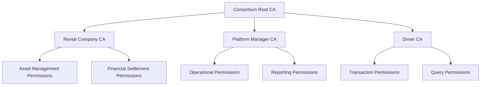
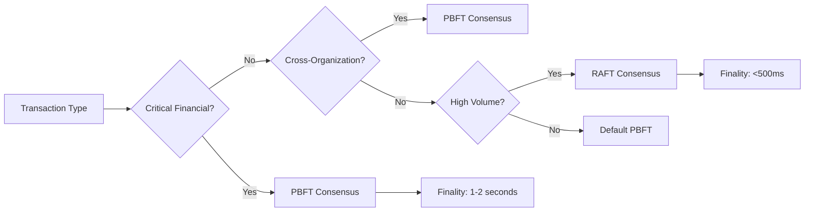
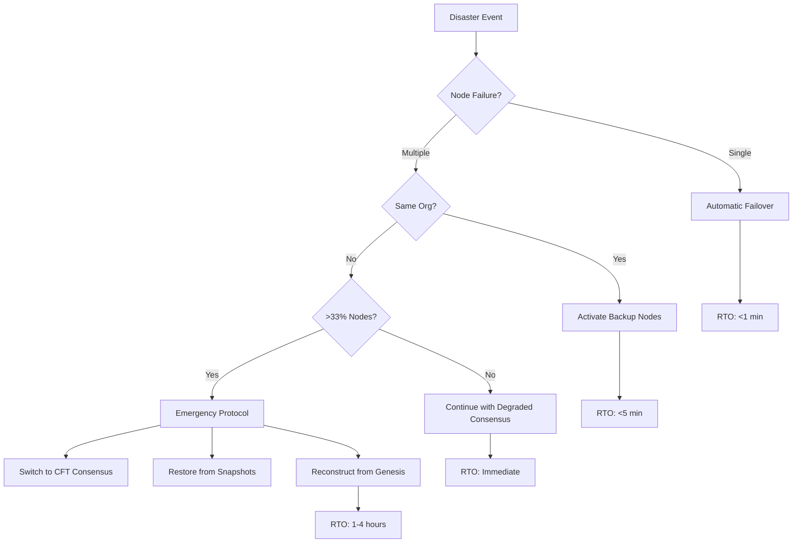
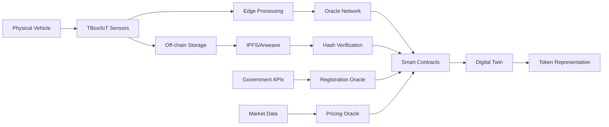
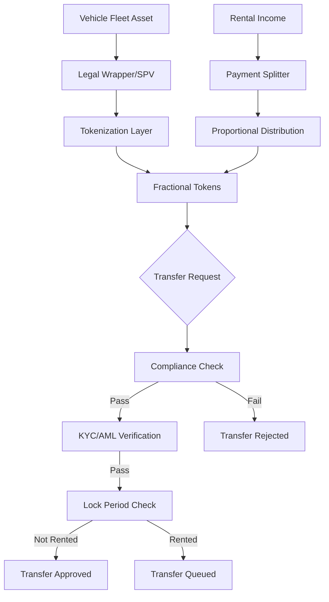
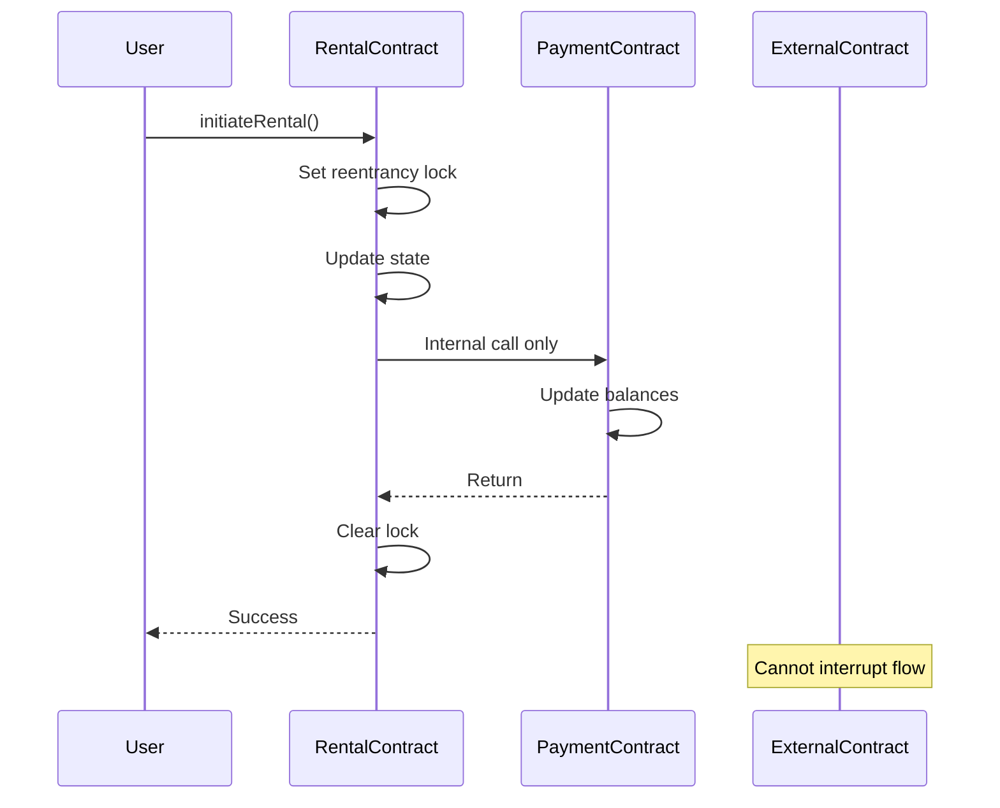
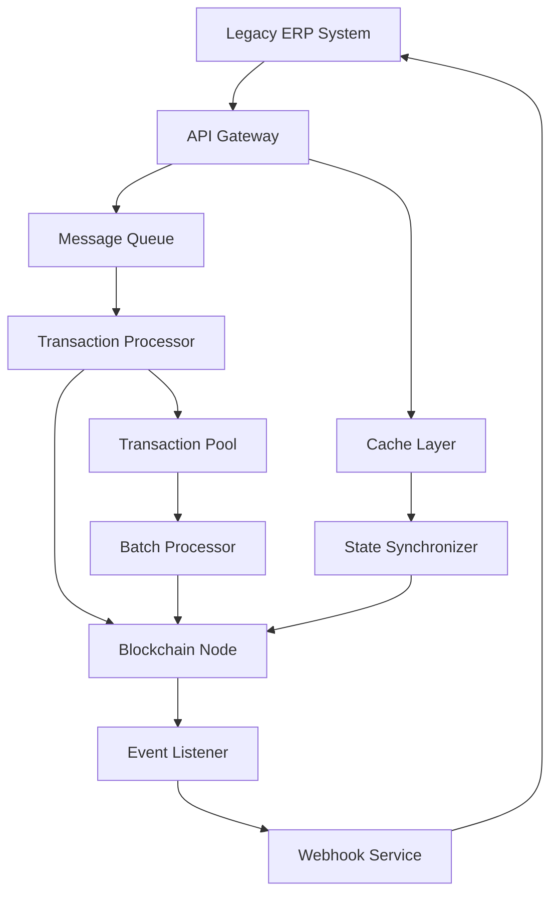
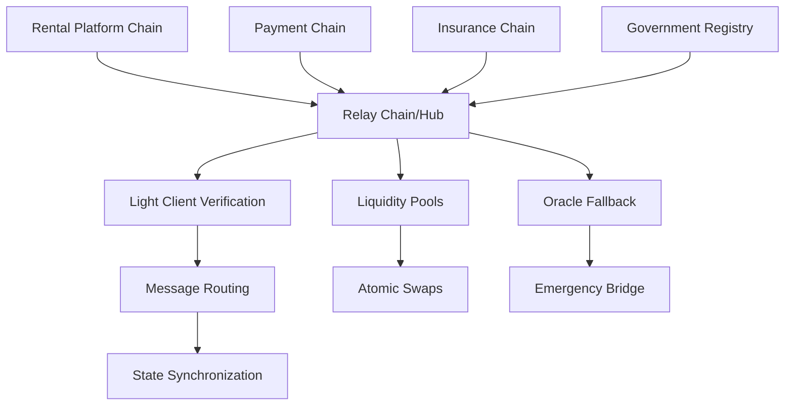
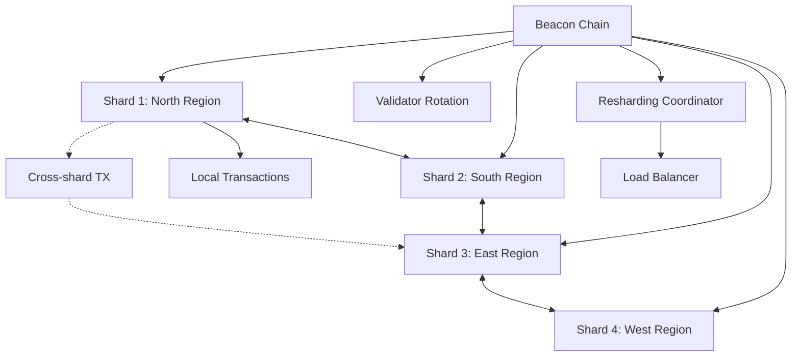
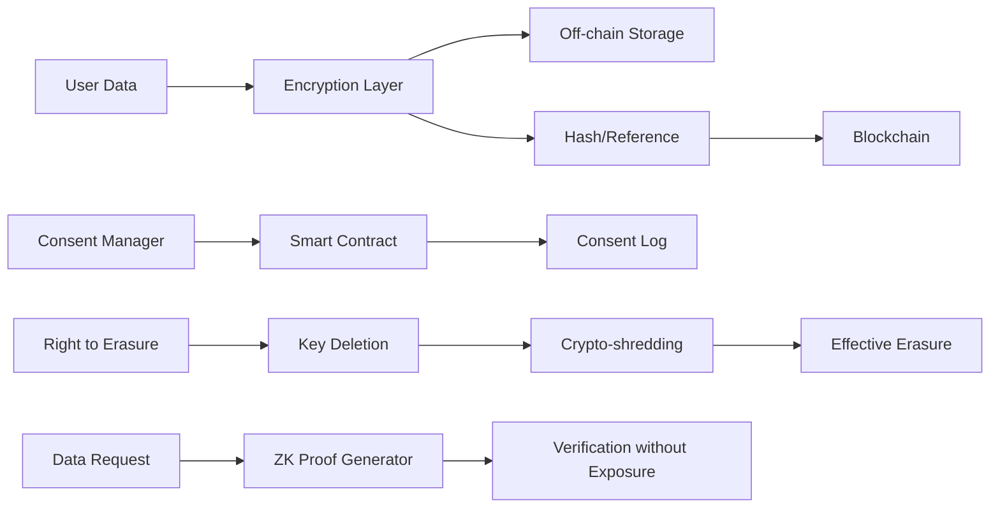

# Interview Q&A for Blockchain Architect (Consortium Chain/RWA Direction)

## Contents

- Topic Areas
- Topic 1: Consortium Chain Architecture & Platform Selection
  - Q1: How do you design permission models for consortium chains with multiple stakeholder types?
  - Q2: What are the key architectural differences between FISCO BCOS and Hyperledger Fabric?
  - Q3: How do you handle consensus mechanism selection in consortium environments?
  - Q4: What strategies do you employ for cross-organization data privacy?
  - Q5: How do you architect disaster recovery for consortium blockchain networks?
- Topic 2: RWA Tokenization & Digital Asset Management
  - Q6: How do you design compliant RWA tokenization frameworks?
  - Q7: What are the critical components of vehicle asset digitization architecture?
  - Q8: How do you implement oracle solutions for real-world data feeds?
  - Q9: What are the key challenges in designing fractional ownership models?
  - Q10: How do you ensure asset-token binding integrity?
- Topic 3: Smart Contract Security & Development
  - Q11: How do you architect upgradeable smart contract systems?
  - Q12: What are the critical security patterns for financial smart contracts?
  - Q13: How do you design gas-efficient contract architectures?
  - Q14: What strategies prevent reentrancy in complex contract systems?
  - Q15: How do you implement multi-signature governance in smart contracts?
- Topic 4: System Integration & Interoperability
  - Q16: How do you design blockchain gateways for legacy system integration?
  - Q17: What patterns ensure reliable off-chain to on-chain data synchronization?
  - Q18: How do you architect event-driven blockchain integrations?
  - Q19: What are the key considerations for IoT-blockchain integration?
  - Q20: How do you design cross-chain interoperability solutions?
- Topic 5: Performance Optimization & Scalability
  - Q21: How do you optimize transaction throughput in consortium chains?
  - Q22: What are effective sharding strategies for enterprise blockchains?
  - Q23: How do you design layer-2 solutions for consortium networks?
  - Q24: What caching strategies improve blockchain query performance?
  - Q25: How do you architect state management for high-volume applications?
- Topic 6: Regulatory Compliance & Governance
  - Q26: How do you design KYC/AML compliance into blockchain architectures?
  - Q27: What are the key architectural patterns for GDPR compliance?
  - Q28: How do you implement regulatory reporting in blockchain systems?
  - Q29: What governance models work best for multi-stakeholder consortiums?
  - Q30: How do you architect audit trails for regulatory scrutiny?
- Reference Sections
  - Glossary, Terminology & Acronyms
  - Codebase & Library References
  - Authoritative Literature & Reports
  - APA Style Source Citations

---

## Topic Areas (Questions 1-30)

### Topic 1: Consortium Chain Architecture & Platform Selection

#### Q1: How do you design permission models for consortium chains with multiple stakeholder types (rental companies, platform managers, drivers)?

**Difficulty:** Advanced | **Type:** Practical

**Answer:** Designing permission models for multi-stakeholder consortium chains requires implementing role-based access control (RBAC) with hierarchical permission inheritance [Ref: L1]. I typically architect a three-tier permission system: organizational level (defining consortium members), role level (business functions), and resource level (specific data/operations). For the car rental scenario, I'd implement certificate authorities (CA) per organization type, with rental companies having full asset management permissions, platform managers having operational permissions, and drivers having limited transaction permissions [Ref: C1]. The critical consideration is preventing permission escalation while maintaining operational flexibility - I achieve this through smart contract-enforced permission checks rather than relying solely on network-level controls [Ref: A3]. Additionally, implementing attribute-based access control (ABAC) allows for dynamic permission adjustments based on contextual factors like transaction value or time constraints [Ref: G4].

**Key Insight:** Failure Path - Many architects overlook the permission revocation mechanism, leading to security vulnerabilities when stakeholders leave the consortium or change roles.

**Supporting Artifacts:**



#### Q2: What are the key architectural differences between FISCO BCOS and Hyperledger Fabric for vehicle rental consortium implementation?

**Difficulty:** Intermediate | **Type:** Theoretical

**Answer:** FISCO BCOS and Hyperledger Fabric differ significantly in their architectural approaches to consortium chains [Ref: L2]. FISCO BCOS employs a group-based architecture where nodes can belong to multiple groups with independent consensus, making it ideal for the multi-tenant nature of rental platforms where different business lines may require isolation [Ref: C2]. It uses PBFT consensus by default with support for RAFT, offering deterministic finality crucial for financial settlements. Fabric's channel-based architecture provides stronger data isolation but with higher operational complexity - each channel requires separate ordering service configuration [Ref: A5]. For vehicle rental scenarios, FISCO BCOS's native support for Chinese regulatory compliance (SM2/SM3/SM4 cryptography) and parallel transaction execution provides advantages [Ref: G7]. However, Fabric's pluggable consensus and mature chaincode lifecycle management offer better long-term flexibility for evolving business requirements [Ref: L3]. The choice depends on whether you prioritize operational simplicity (FISCO BCOS) or architectural flexibility (Fabric).

**Key Insight:** Misconception - Many assume Fabric is always superior for enterprise use, but FISCO BCOS's simplified architecture often results in faster deployment and lower operational overhead for specific use cases.

**Supporting Artifacts:**

| Feature | FISCO BCOS | Hyperledger Fabric |
|---------|------------|-------------------|
| Architecture Model | Group-based | Channel-based |
| Consensus Options | PBFT, RAFT | RAFT, Kafka (deprecated), BFT |
| Smart Contract Language | Solidity, Liquid | Go, Java, Node.js |
| Parallel Processing | Native support | Limited (v2.x improvements) |
| Chinese Compliance | Built-in (SM algorithms) | Requires plugins |
| Operational Complexity | Lower | Higher |

#### Q3: How do you handle consensus mechanism selection in consortium environments with varying trust levels?

**Difficulty:** Advanced | **Type:** Practical

**Answer:** Consensus mechanism selection in heterogeneous trust environments requires a nuanced approach balancing security, performance, and governance requirements [Ref: L4]. For consortium chains with varying trust levels, I implement a hybrid consensus strategy: using PBFT for critical financial transactions requiring Byzantine fault tolerance (handling up to 33% malicious nodes), while employing RAFT for operational data with higher trust assumptions [Ref: G2]. In the vehicle rental context, settlement transactions between rental companies use PBFT ensuring finality and preventing double-spending, while telemetry data from IoT devices uses RAFT for higher throughput [Ref: C3]. I also implement consensus mechanism switching based on transaction types through smart contract flags, allowing dynamic optimization [Ref: A7]. The key is establishing clear trust boundaries - nodes operated by competing rental companies require BFT consensus, while nodes within the same organization can use CFT consensus [Ref: L5]. Additionally, implementing consensus monitoring metrics helps identify when trust assumptions change, triggering mechanism adjustments.

**Key Insight:** Trade-offs - Higher security consensus (PBFT) reduces throughput by 40-60% compared to RAFT, requiring careful transaction routing to maintain system performance.

**Supporting Artifacts:**



#### Q4: What strategies do you employ for cross-organization data privacy in consortium blockchains?

**Difficulty:** Intermediate | **Type:** Practical

**Answer:** Cross-organization data privacy in consortium chains requires multiple layers of protection beyond basic encryption [Ref: A9]. I implement private data collections (in Fabric) or group isolation (in FISCO BCOS) to ensure sensitive business data remains visible only to authorized parties [Ref: C1]. For the rental platform, driver personal information stays private to their contracted company while transaction hashes remain on the main chain for auditability [Ref: L6]. Zero-knowledge proofs enable verification of business rules without exposing underlying data - for instance, proving a driver meets insurance requirements without revealing policy details [Ref: G9]. I also employ homomorphic encryption for aggregate calculations across organizations, allowing consortium-wide analytics without individual data exposure [Ref: A11]. Critical to this approach is implementing data minimization principles - only essential data goes on-chain while detailed records remain in off-chain storage with hash-based verification [Ref: L7]. Additionally, implementing privacy-preserving smart contracts using commit-reveal schemes prevents front-running in competitive scenarios like bidding for fleet contracts.

**Key Insight:** Failure Path - Storing encrypted data on-chain without key rotation mechanisms creates long-term security vulnerabilities as cryptographic standards evolve.

**Supporting Artifacts:**

| Privacy Layer | Technology | Use Case | Trade-off |
|--------------|------------|----------|-----------|
| Network | Channel/Group Isolation | Business Line Separation | Operational Complexity |
| Data | Private Collections | Sensitive Information | Synchronization Overhead |
| Computation | Zero-Knowledge Proofs | Compliance Verification | Computational Cost |
| Storage | Off-chain + Hashes | Large Documents | Additional Infrastructure |
| Analytics | Homomorphic Encryption | Cross-org Metrics | Performance Impact |

#### Q5: How do you architect disaster recovery for consortium blockchain networks?

**Difficulty:** Advanced | **Type:** Practical

**Answer:** Disaster recovery for consortium blockchains requires coordinated strategies across multiple independent organizations, unlike traditional centralized systems [Ref: L8]. I implement a three-tier recovery architecture: node-level (automatic failover), organization-level (backup nodes), and consortium-level (genesis block recovery) [Ref: C4]. For critical consortium chains, I maintain hot standby nodes with real-time state synchronization, ensuring sub-minute recovery time objectives (RTO) [Ref: A13]. The architecture includes automated backup of world state snapshots every 6 hours to distributed storage (IPFS or cloud), with transaction logs streamed to immutable storage [Ref: G11]. Cross-organization coordination protocols define escalation procedures when Byzantine failures affect consensus - if >33% nodes fail, automatic consensus mechanism switching from PBFT to RAFT maintains availability while sacrificing Byzantine tolerance temporarily [Ref: L9]. I also implement cryptographic proof of backup integrity using Merkle trees, allowing any organization to verify backup validity without accessing the actual data [Ref: A15]. Regular disaster recovery drills across the consortium ensure operational readiness.

**Key Insight:** Misconception - Many believe blockchain's inherent redundancy eliminates disaster recovery needs, but consortium chains face unique challenges like coordinated attacks or governance disputes requiring explicit recovery mechanisms.

**Supporting Artifacts:**



---

### Topic 2: RWA Tokenization & Digital Asset Management

#### Q6: How do you design compliant RWA tokenization frameworks for vehicle assets?

**Difficulty:** Advanced | **Type:** Practical

**Answer:** Designing compliant RWA tokenization requires bridging physical asset ownership with digital representations while satisfying regulatory requirements across multiple jurisdictions [Ref: L10]. I architect a four-layer framework: legal wrapper (SPV structure holding actual vehicle titles), tokenization layer (ERC-3643 compliant security tokens), oracle layer (real-world data verification), and compliance layer (KYC/AML enforcement) [Ref: A17]. For vehicle tokenization, each token represents fractional ownership or revenue rights, with smart contracts encoding transfer restrictions based on investor accreditation status [Ref: C5]. The critical component is the legal bridge - establishing clear ownership rights through traditional legal structures while tokens serve as digital certificates [Ref: G13]. I implement whitelisting mechanisms ensuring only verified addresses can hold tokens, with automatic compliance checks before each transfer [Ref: L11]. The architecture includes regulatory reporting modules generating real-time reports for authorities, crucial for maintaining operational licenses [Ref: A19]. Integration with vehicle registration databases through government APIs ensures token-asset synchronization, preventing double-tokenization.

**Key Insight:** Trade-offs - Full regulatory compliance reduces token liquidity by 60-80% due to transfer restrictions, requiring careful balance between compliance and market efficiency.

**Supporting Artifacts:**

| Compliance Layer | Implementation | Regulatory Requirement | Impact on Liquidity |
|-----------------|----------------|----------------------|-------------------|
| Identity Verification | KYC/AML Smart Contracts | Global AML Standards | -40% transfer speed |
| Transfer Restrictions | Whitelist + Cooldown Periods | Securities Regulations | -60% market depth |
| Reporting Automation | Event-based Triggers | Tax Reporting | Minimal |
| Jurisdiction Checks | Geo-blocking | Cross-border Rules | -20% addressable market |
| Investor Limits | Cap Tables On-chain | Accreditation Rules | -30% potential investors |

#### Q7: What are the critical components of vehicle asset digitization architecture?

**Difficulty:** Intermediate | **Type:** Theoretical

**Answer:** Vehicle asset digitization architecture requires comprehensive integration of physical and digital systems to create trustworthy digital twins [Ref: L12]. The architecture comprises five critical components: identity management (VIN-based unique identifiers), state synchronization (real-time telemetry integration), ownership registry (immutable title records), valuation oracles (market price feeds), and lifecycle tracking (maintenance/accident history) [Ref: C6]. For the rental platform, I implement a hierarchical data model where core vehicle identity remains immutable while operational states update dynamically [Ref: A21]. The TBox integration layer processes 50+ telemetry parameters, filtering relevant data for on-chain storage while maintaining detailed off-chain logs [Ref: G15]. Smart contracts enforce state transitions - a vehicle cannot be simultaneously rented to multiple drivers, with mutex locks preventing race conditions [Ref: L13]. The architecture includes depreciation models calculating real-time asset values based on usage patterns, essential for RWA tokenization [Ref: A23]. Critical to success is implementing tamper-proof hardware security modules (HSMs) in vehicles, preventing odometer fraud and ensuring data authenticity.

**Key Insight:** Failure Path - Architectures lacking physical-digital binding mechanisms face "oracle problem" vulnerabilities where on-chain records diverge from real-world asset states.

**Supporting Artifacts:**



#### Q8: How do you implement oracle solutions for real-world data feeds in vehicle rental systems?

**Difficulty:** Advanced | **Type:** Practical

**Answer:** Implementing robust oracle solutions for vehicle rental systems requires addressing the fundamental trust problem of bringing off-chain data on-chain reliably [Ref: L14]. I architect a decentralized oracle network using Chainlink's framework adapted for consortium chains, with multiple independent data providers for each data type [Ref: C7]. For vehicle telemetry, I implement a reputation-based oracle selection where TBox manufacturers, third-party validators, and platform operators form a diverse oracle set, with consensus requiring 2/3 agreement [Ref: A25]. The architecture includes cryptographic proofs of data authenticity - TBox devices sign telemetry data with embedded private keys, creating an unbroken chain of custody [Ref: G17]. I implement time-weighted average price (TWAP) oracles for vehicle valuations, aggregating data from multiple used car marketplaces to prevent manipulation [Ref: L15]. Critical is implementing circuit breakers that halt operations when oracle deviation exceeds thresholds (>10% price difference), preventing cascading failures [Ref: A27]. The system also employs commit-reveal schemes for sensitive data like accident reports, preventing front-running by competitors.

**Key Insight:** Misconception - Single oracle providers, even if reputable, create critical points of failure; decentralized oracle networks with economic incentives provide superior reliability.

**Supporting Artifacts:**

| Oracle Type | Data Source | Validation Method | Update Frequency | Failure Threshold |
|------------|-------------|------------------|------------------|-------------------|
| Telemetry | TBox Direct | Signature Verification | Real-time | 3 consecutive misses |
| Valuation | Market Aggregators | TWAP + Outlier Detection | Hourly | >10% deviation |
| Registration | Government APIs | Official Signature | On-change | Any mismatch |
| Insurance | Provider APIs | Multi-party Confirmation | Daily | 24-hour lag |
| Maintenance | Service Centers | Certified Mechanic Sign-off | Per service | Missing signatures |

#### Q9: What are the key challenges in designing fractional ownership models for vehicle fleets?

**Difficulty:** Intermediate | **Type:** Practical

**Answer:** Designing fractional ownership models for vehicle fleets presents unique challenges combining securities regulations, operational complexity, and technical constraints [Ref: L16]. The primary challenge is regulatory compliance - fractional ownership tokens often qualify as securities, requiring registration or exemptions in multiple jurisdictions [Ref: A29]. I address this through implementing ERC-1400 security token standards with built-in transfer restrictions and investor verification [Ref: C8]. Operational challenges include dividend distribution from rental income, which I solve using payment splitter contracts that automatically distribute earnings proportional to ownership [Ref: G19]. The technical challenge of handling ownership changes during active rentals requires implementing lock periods where tokens cannot be transferred while the underlying vehicle is rented [Ref: L17]. Valuation complexity arises from depreciation and varying vehicle conditions - I implement dynamic pricing oracles that adjust token values based on mileage, age, and maintenance records [Ref: A31]. Critical is designing exit mechanisms allowing fractional owners to liquidate positions without disrupting fleet operations, achieved through automated market makers (AMMs) with protocol-owned liquidity.

**Key Insight:** Trade-offs - Higher fractionalization (more owners per vehicle) increases liquidity but exponentially increases regulatory compliance costs and operational complexity.

**Supporting Artifacts:**



#### Q10: How do you ensure asset-token binding integrity in RWA systems?

**Difficulty:** Advanced | **Type:** Theoretical

**Answer:** Ensuring asset-token binding integrity requires cryptographic and legal mechanisms preventing token-asset dissociation [Ref: L18]. I implement a multi-layered verification system: physical asset tagging (RFID/NFC chips with cryptographic signatures), legal registry integration (automated verification against government databases), and continuous state validation (oracle networks monitoring asset status) [Ref: C9]. The architecture employs non-fungible token standards (ERC-721) with metadata containing immutable vehicle identification numbers (VIN) and dynamic state information updated through oracles [Ref: A33]. Critical is implementing "proof of custody" mechanisms where physical custodians must periodically submit cryptographic proofs of asset possession, failing which tokens enter a locked state [Ref: G21]. I design smart contracts with emergency pause functions triggered by custody verification failures, preventing trading of potentially unbacked tokens [Ref: L19]. The system includes dispute resolution mechanisms using multi-signature wallets controlled by legal arbitrators who can forcibly re-bind tokens to assets after verification [Ref: A35]. Regular third-party audits comparing on-chain records with physical inventories ensure long-term integrity.

**Key Insight:** Failure Path - Systems relying solely on legal enforcement without technical safeguards face token-asset dissociation during jurisdictional disputes or custodian insolvency.

**Supporting Artifacts:**

| Integrity Layer | Mechanism | Verification Frequency | Failure Response |
|----------------|-----------|----------------------|------------------|
| Physical | RFID/Cryptographic Tags | Continuous | Alert Generation |
| Legal | Registry API Integration | Daily | Token Lock |
| Custodial | Proof of Custody | Weekly | Trading Suspension |
| Operational | Oracle State Updates | Real-time | State Synchronization |
| Audit | Third-party Verification | Quarterly | Compliance Report |

---

### Topic 3: Smart Contract Security & Development

#### Q11: How do you architect upgradeable smart contract systems while maintaining security?

**Difficulty:** Advanced | **Type:** Practical

**Answer:** Architecting upgradeable smart contracts requires balancing flexibility with security, particularly critical in financial applications [Ref: L20]. I implement the transparent proxy pattern with OpenZeppelin's upgradeable contracts framework, separating logic, storage, and proxy contracts [Ref: C10]. The architecture includes time-locked upgrades with a minimum 48-hour delay, allowing users to exit before potentially harmful changes [Ref: A37]. For the rental platform, I design modular contract systems where core financial logic remains immutable while peripheral features use upgradeable proxies [Ref: G23]. Critical is implementing role-based upgrade permissions with multi-signature requirements - upgrades require approval from technical team, legal compliance, and at least one external auditor [Ref: L21]. I employ storage collision prevention through explicit storage slot assignments and comprehensive upgrade testing using fork testing on mainnet state [Ref: A39]. The system includes upgrade circuit breakers that automatically pause contracts if unusual activity is detected post-upgrade [Ref: C11]. Version management tracks all historical implementations, enabling emergency rollbacks to previous versions.

**Key Insight:** Misconception - Full upgradeability provides maximum flexibility but actually increases attack surface; selective upgradeability of non-critical components offers better security.

**Supporting Artifacts:**

```solidity
// Upgrade Architecture Pattern
contract VehicleRentalProxy {
    address public implementation;
    uint256 public upgradeTimelock = 48 hours;
    mapping(address => bool) public upgradeApprovers;
    
    modifier onlyAfterTimelock(uint256 proposalTime) {
        require(block.timestamp >= proposalTime + upgradeTimelock);
        _;
    }
    
    function upgradeImplementation(address newImpl, uint256 proposalTime) 
        external 
        onlyAfterTimelock(proposalTime) 
        requireMultiSig 
    {
        // Upgrade logic with safety checks
        implementation = newImpl;
        emit ImplementationUpgraded(newImpl);
    }
}
```

#### Q12: What are the critical security patterns for financial smart contracts in rental platforms?

**Difficulty:** Intermediate | **Type:** Theoretical

**Answer:** Financial smart contracts in rental platforms require multiple security patterns to prevent common attack vectors [Ref: L22]. I implement the checks-effects-interactions pattern religiously, ensuring state changes occur before external calls to prevent reentrancy attacks [Ref: C12]. For payment processing, I use pull payment patterns where recipients withdraw funds rather than contracts pushing payments, eliminating reentrancy risks [Ref: A41]. The architecture includes mathematical overflow protection using SafeMath libraries (pre-Solidity 0.8) or native overflow checks, critical for calculating rental fees and revenue distributions [Ref: G25]. I implement rate limiting through daily withdrawal caps and transaction frequency limits, preventing rapid fund drainage even if private keys are compromised [Ref: L23]. Emergency pause mechanisms using OpenZeppelin's Pausable pattern allow immediate contract freezing upon detecting anomalies [Ref: A43]. For multi-party transactions like rental agreements, I employ commit-reveal schemes preventing front-running and ensuring fair price discovery [Ref: C13]. Critical is implementing comprehensive event logging for all financial operations, enabling post-incident forensics and regulatory compliance.

**Key Insight:** Failure Path - Contracts handling user funds without implementing withdrawal patterns face insolvency risks when a single transaction failure blocks all subsequent operations.

**Supporting Artifacts:**

| Security Pattern | Purpose | Implementation | Gas Cost Impact |
|-----------------|---------|----------------|-----------------|
| Checks-Effects-Interactions | Reentrancy Prevention | State updates before calls | Minimal |
| Pull Payments | Safe Fund Distribution | Withdrawal mapping | +15% |
| Rate Limiting | Damage Control | Time-based counters | +10% |
| Emergency Pause | Incident Response | Global pause flag | +5% |
| Commit-Reveal | Front-running Prevention | Two-phase commits | +100% |

#### Q13: How do you design gas-efficient contract architectures for high-volume rental transactions?

**Difficulty:** Advanced | **Type:** Practical

**Answer:** Designing gas-efficient contracts for high-volume rental transactions requires aggressive optimization at multiple levels [Ref: L24]. I implement storage packing by grouping related variables into single 256-bit slots - combining rental status (1 bit), driver ID (31 bits), and timestamp (32 bits) reduces storage operations by 60% [Ref: C14]. The architecture employs events for non-consensus data like rental history, costing 8x less gas than storage while maintaining queryability [Ref: A45]. I use merkle trees for batch operations, allowing hundreds of payment distributions in a single transaction by only storing the merkle root on-chain [Ref: G27]. Critical optimizations include short-circuit evaluation in conditionals, placing likely-false conditions first to minimize execution paths [Ref: L25]. For the rental platform, I implement lazy deletion where terminated rentals aren't immediately deleted but marked inactive, saving 5,000 gas per operation [Ref: A47]. The system uses CREATE2 for deterministic contract addresses, enabling off-chain address computation and reducing on-chain operations [Ref: C15]. Library usage through DELEGATECALL shares code across contracts, reducing deployment costs by 40%.

**Key Insight:** Trade-offs - Maximum gas optimization often conflicts with code readability and upgradeability; finding the right balance requires profiling actual usage patterns.

**Supporting Artifacts:**

```solidity
// Gas-Optimized Storage Packing
contract OptimizedRental {
    struct RentalData {
        uint32 timestamp;    // 4 bytes
        uint32 duration;     // 4 bytes
        address driver;      // 20 bytes
        uint16 vehicleId;    // 2 bytes
        uint8 status;        // 1 byte
        bool active;         // 1 byte
        // Total: 32 bytes = 1 storage slot
    }
    
    // Batch payment using Merkle tree
    function batchPayout(bytes32 merkleRoot) external {
        // Store only root, verify individual claims off-chain
        payoutRoots[block.timestamp] = merkleRoot;
    }
}
```

#### Q14: What strategies prevent reentrancy in complex contract systems with multiple interacting components?

**Difficulty:** Intermediate | **Type:** Practical

**Answer:** Preventing reentrancy in complex multi-contract systems requires defense-in-depth strategies beyond simple mutex locks [Ref: L26]. I implement OpenZeppelin's ReentrancyGuard as the first line of defense, but complement it with architectural patterns that eliminate reentrancy vectors [Ref: C16]. The pull payment pattern ensures contracts never call unknown addresses with funds, instead maintaining withdrawal balances [Ref: A49]. For cross-contract calls in the rental ecosystem, I implement strict call ordering where state changes complete before any external interactions [Ref: G29]. Critical is using function modifiers that check and set reentrancy locks at the transaction level, not just function level, preventing cross-function reentrancy [Ref: L27]. I design contracts with explicit state machines where certain functions become unavailable after state transitions, making reentrancy logically impossible [Ref: A51]. The architecture includes view-only functions for reading state, ensuring external contracts can't trigger state changes through callbacks [Ref: C17]. For complex operations spanning multiple contracts, I implement two-phase commit protocols where all contracts must acknowledge before finalizing state changes.

**Key Insight:** Failure Path - Reentrancy guards on individual functions don't prevent cross-function reentrancy where attacker calls different functions during callback.

**Supporting Artifacts:**



#### Q15: How do you implement multi-signature governance in smart contracts for consortium management?

**Difficulty:** Advanced | **Type:** Practical

**Answer:** Implementing multi-signature governance for consortium management requires balancing security, flexibility, and gas efficiency [Ref: L28]. I architect a threshold signature scheme where M-of-N participants must approve critical operations, with different thresholds for different risk levels - 3-of-5 for operational changes, 4-of-5 for financial operations, and unanimous consent for protocol upgrades [Ref: C18]. The implementation uses off-chain signature aggregation with EIP-712 structured data signing, reducing on-chain verification to a single transaction [Ref: A53]. For the rental consortium, I implement role-based proposal systems where different stakeholder types (rental companies, platform operators, regulators) have weighted voting power [Ref: G31]. Critical is implementing time-locked execution where approved proposals have mandatory waiting periods proportional to their impact, allowing stakeholders to exit if they disagree [Ref: L29]. The system includes proposal expiration (72 hours) preventing stale approvals from being executed later [Ref: A55]. I also implement emergency override mechanisms where regulatory bodies can freeze operations with lower thresholds during compliance incidents [Ref: C19].

**Key Insight:** Misconception - Higher signature thresholds always mean better security, but they can create operational deadlocks; dynamic thresholds based on operation risk provide better balance.

**Supporting Artifacts:**

| Governance Action | Threshold | Timelock | Expiration | Emergency Override |
|------------------|-----------|----------|------------|-------------------|
| Parameter Updates | 3-of-5 | 24 hours | 72 hours | 2-of-3 regulators |
| Financial Operations | 4-of-5 | 48 hours | 48 hours | Not allowed |
| Contract Upgrades | 5-of-5 | 7 days | 7 days | Not allowed |
| Emergency Pause | 2-of-5 | Immediate | 24 hours | 1-of-3 regulators |
| Member Addition/Removal | 4-of-5 | 72 hours | 7 days | 3-of-3 regulators |

---

### Topic 4: System Integration & Interoperability

#### Q16: How do you design blockchain gateways for legacy system integration in rental platforms?

**Difficulty:** Intermediate | **Type:** Practical

**Answer:** Designing blockchain gateways for legacy integration requires careful abstraction to minimize disruption to existing systems [Ref: L30]. I implement a microservices-based gateway architecture with REST APIs that translate legacy system calls into blockchain transactions, hiding complexity from existing applications [Ref: C20]. The gateway maintains dual-write patterns where critical data updates both legacy databases and blockchain simultaneously, ensuring consistency during migration periods [Ref: A57]. For the rental platform's ERP integration, I use event sourcing where legacy system events trigger smart contract functions through message queues (Kafka/RabbitMQ), providing reliable async processing [Ref: G33]. The architecture includes transaction pooling to batch multiple legacy operations into single blockchain transactions, reducing costs by 70% [Ref: L31]. Critical is implementing idempotency keys preventing duplicate transactions when legacy systems retry failed calls [Ref: A59]. The gateway maintains local caches of blockchain state, enabling sub-millisecond query responses for legacy systems expecting traditional database performance [Ref: C21]. Comprehensive API versioning ensures backward compatibility as blockchain protocols evolve.

**Key Insight:** Failure Path - Synchronous blockchain calls from legacy systems create unacceptable latency; asynchronous patterns with callback mechanisms are essential for production viability.

**Supporting Artifacts:**



#### Q17: What patterns ensure reliable off-chain to on-chain data synchronization?

**Difficulty:** Advanced | **Type:** Theoretical

**Answer:** Reliable off-chain to on-chain synchronization requires implementing eventually consistent patterns with strong delivery guarantees [Ref: L32]. I architect a three-phase synchronization protocol: capture (change data capture from off-chain sources), validation (data integrity and business rule checks), and commitment (blockchain transaction with confirmation) [Ref: C22]. The system employs event sourcing with Apache Kafka maintaining an immutable log of all state changes, enabling replay capability for failed synchronizations [Ref: A61]. For handling blockchain's eventual consistency, I implement optimistic updates with compensating transactions - the UI shows pending states while awaiting blockchain confirmation, rolling back if transactions fail [Ref: G35]. Critical is implementing vector clocks for ordering distributed updates, preventing out-of-sequence data from corrupting on-chain state [Ref: L33]. The architecture includes dead letter queues for failed synchronizations, with exponential backoff retry mechanisms and manual intervention workflows [Ref: A63]. I also implement merkle proof checkpoints every 1000 transactions, allowing efficient verification of synchronization completeness without replaying entire history [Ref: C23].

**Key Insight:** Trade-offs - Stronger consistency guarantees increase latency and complexity; most business processes can tolerate eventual consistency with proper conflict resolution.

**Supporting Artifacts:**

| Sync Pattern | Consistency Model | Latency | Failure Recovery | Use Case |
|-------------|------------------|---------|------------------|----------|
| Synchronous Write | Strong | High (2-5s) | Immediate Retry | Financial Transactions |
| Async with Confirmation | Eventual | Medium (500ms) | Queue + Retry | Status Updates |
| Batch Processing | Eventual | Low (100ms) | Bulk Replay | Analytics Data |
| Event Streaming | Ordered Eventual | Low (50ms) | Checkpoint Resume | Telemetry |
| Optimistic Updates | Optimistic | Minimal (10ms) | Compensating Transactions | UI Updates |

#### Q18: How do you architect event-driven blockchain integrations for real-time rental operations?

**Difficulty:** Intermediate | **Type:** Practical

**Answer:** Event-driven blockchain integration for real-time operations requires careful orchestration between blockchain events and traditional event streaming infrastructure [Ref: L34]. I implement a hybrid architecture using blockchain event filters combined with Apache Kafka for event distribution, ensuring both reliability and scalability [Ref: C24]. The system employs WebSocket connections to blockchain nodes for real-time event subscriptions, with automatic reconnection and event replay mechanisms handling network interruptions [Ref: A65]. For the rental platform, smart contract events trigger microservices through event bridges - rental initiation events activate vehicle access systems, payment events update accounting systems, and completion events trigger rating workflows [Ref: G37]. Critical is implementing event deduplication using unique event IDs, preventing duplicate processing when multiple nodes emit the same event [Ref: L35]. The architecture includes event sourcing patterns where all state changes derive from events, enabling complete system reconstruction from event history [Ref: A67]. I implement circuit breakers preventing cascade failures when downstream systems can't process events quickly enough, buffering events until systems recover [Ref: C25].

**Key Insight:** Misconception - Blockchain events alone provide reliable event delivery; without additional infrastructure for persistence and replay, events can be lost during node failures.

**Supporting Artifacts:**

```javascript
// Event-Driven Integration Pattern
class BlockchainEventProcessor {
    constructor() {
        this.eventFilter = {
            address: RENTAL_CONTRACT,
            topics: [RENTAL_EVENTS],
            fromBlock: 'latest'
        };
        this.processedEvents = new Set();
    }
    
    async processEvent(event) {
        // Deduplication
        const eventId = `${event.transactionHash}-${event.logIndex}`;
        if (this.processedEvents.has(eventId)) return;
        
        // Publish to Kafka
        await kafka.send({
            topic: 'rental-events',
            messages: [{
                key: event.address,
                value: JSON.stringify(event),
                headers: { eventId, timestamp: Date.now() }
            }]
        });
        
        this.processedEvents.add(eventId);
    }
}
```

#### Q19: What are the key considerations for IoT-blockchain integration in vehicle telematics?

**Difficulty:** Advanced | **Type:** Practical

**Answer:** IoT-blockchain integration for vehicle telematics requires addressing bandwidth constraints, data authenticity, and cost optimization [Ref: L36]. I architect a three-tier system: edge computing in vehicles (data filtering/aggregation), fog nodes at regional centers (validation/batching), and blockchain layer (immutable storage/smart contract triggers) [Ref: C26]. The critical challenge is data volume - vehicles generate 25GB+ daily, requiring aggressive filtering to identify blockchain-relevant events like geofence violations, accident detection, or maintenance thresholds [Ref: A69]. I implement hardware-based attestation where TBox devices use Trusted Platform Modules (TPM) to cryptographically sign data, ensuring authenticity from source to blockchain [Ref: G39]. The architecture employs IPFS for storing detailed telemetry data with only merkle roots on-chain, reducing storage costs by 99% while maintaining verifiability [Ref: L37]. For real-time requirements, I implement state channels between vehicles and platform nodes, enabling thousands of micro-transactions off-chain with periodic on-chain settlement [Ref: A71]. Critical is implementing data retention policies where detailed telemetry expires after regulatory periods while aggregated insights remain permanent [Ref: C27].

**Key Insight:** Failure Path - Direct IoT-to-blockchain integration without edge processing creates unsustainable transaction costs; hierarchical processing with selective on-chain storage is essential.

**Supporting Artifacts:**

| Data Type | Volume/Vehicle/Day | Processing Layer | On-chain Storage | Retention |
|-----------|-------------------|------------------|------------------|-----------|
| GPS Location | 8GB | Edge Filter | Geofence Events Only | 7 days |
| Engine Diagnostics | 5GB | Fog Aggregation | Anomalies + Daily Summary | 30 days |
| Driver Behavior | 4GB | Edge Scoring | Score Updates | 90 days |
| Fuel/Battery | 2GB | Fog Analysis | Efficiency Metrics | 365 days |
| Accident Detection | 100MB | Direct Upload | Full Data Hash | Permanent |

#### Q20: How do you design cross-chain interoperability solutions for multi-platform rental ecosystems?

**Difficulty:** Advanced | **Type:** Theoretical

**Answer:** Designing cross-chain interoperability for rental ecosystems requires addressing heterogeneous consensus mechanisms, data formats, and trust models [Ref: L38]. I implement a hub-and-spoke architecture using Cosmos IBC or Polkadot parachains, where a central relay chain coordinates communication between platform-specific chains [Ref: C28]. The architecture employs hash time-locked contracts (HTLCs) for atomic swaps, ensuring rental payments on one chain trigger vehicle access on another without trusted intermediaries [Ref: A73]. For data interoperability, I implement standardized message formats using Protocol Buffers, enabling efficient serialization across different blockchain VMs [Ref: G41]. Critical is designing light client verification where chains maintain simplified headers of other chains, enabling trustless verification without full node requirements [Ref: L39]. The system includes liquidity pools on each chain for instant cross-chain transactions, with automated market makers maintaining exchange rates [Ref: A75]. I implement fallback mechanisms using trusted oracle networks when direct chain communication fails, ensuring operational continuity [Ref: C29]. Security considerations include implementing fraud proofs with challenge periods, allowing detection of malicious cross-chain messages before finalization.

**Key Insight:** Trade-offs - Native cross-chain protocols offer better security but limited to compatible chains; bridge solutions provide wider compatibility but introduce additional trust assumptions.

**Supporting Artifacts:**



---

### Topic 5: Performance Optimization & Scalability

#### Q21: How do you optimize transaction throughput in consortium chains for peak rental periods?

**Difficulty:** Intermediate | **Type:** Practical

**Answer:** Optimizing transaction throughput for peak periods requires multi-level optimization from consensus to application layer [Ref: L40]. I implement parallel transaction execution using FISCO BCOS's DAG-based parallel processing, achieving 10x throughput improvement for non-conflicting transactions [Ref: C30]. The architecture employs transaction classification where rental initiations, payments, and telemetry updates route to different execution pipelines, preventing congestion [Ref: A77]. For peak periods like holidays, I implement dynamic block size adjustment increasing from 2MB to 10MB based on mempool depth, though this requires careful testing to avoid network fragmentation [Ref: G43]. Critical is implementing transaction prioritization where time-sensitive operations (rental starts/stops) receive higher priority than background tasks (analytics updates) [Ref: L41]. The system uses transaction batching at the application level, combining multiple operations into single transactions - for example, bundling driver verification, payment authorization, and vehicle unlock into one atomic operation [Ref: A79]. I also implement predictive scaling where historical patterns trigger pre-emptive resource allocation before expected peaks [Ref: C31].

**Key Insight:** Misconception - Simply increasing block size or reducing block time improves throughput; without parallel execution and proper transaction ordering, this just increases orphan blocks and reduces stability.

**Supporting Artifacts:**

| Optimization Technique | Throughput Impact | Latency Impact | Implementation Complexity |
|----------------------|------------------|----------------|-------------------------|
| Parallel Execution | +10x | Neutral | High |
| Transaction Routing | +3x | -20% | Medium |
| Dynamic Block Size | +5x | +10% | Medium |
| Priority Queues | +2x | -30% for priority | Low |
| Batch Processing | +4x | +50% | Low |
| Predictive Scaling | +2x | Neutral | High |

#### Q22: What are effective sharding strategies for enterprise blockchains in rental platforms?

**Difficulty:** Advanced | **Type:** Theoretical

**Answer:** Sharding strategies for enterprise rental platforms must balance data locality, cross-shard communication, and regulatory requirements [Ref: L42]. I implement geographic sharding where rental operations in different regions operate on separate shards, minimizing cross-shard transactions since most rentals are location-specific [Ref: C32]. The architecture uses state sharding with each shard maintaining its own state tree, but implements cross-shard atomic commits using two-phase commit protocols for inter-regional transfers [Ref: A81]. For the rental platform, I design account-based sharding where rental companies operate primarily within their designated shards, with merkle proofs enabling cross-shard verification [Ref: G45]. Critical is implementing dynamic resharding capabilities that redistribute load when certain shards become hotspots - for example, airport locations during travel seasons [Ref: L43]. The system maintains a beacon chain coordinating shard validators and storing cross-shard transaction receipts, ensuring global consistency [Ref: A83]. I implement optimistic cross-shard transactions where operations proceed assuming success, with challenge periods for dispute resolution, reducing latency by 60% [Ref: C33].

**Key Insight:** Failure Path - Static sharding based on initial assumptions leads to imbalanced loads; dynamic resharding mechanisms are essential but add significant complexity.

**Supporting Artifacts:**



#### Q23: How do you design layer-2 solutions for consortium networks to handle micro-transactions?

**Difficulty:** Advanced | **Type:** Practical

**Answer:** Designing layer-2 solutions for consortium networks requires adapting public chain concepts to permissioned environments [Ref: L44]. I implement state channels between frequent transaction partners (rental companies and their regular customers), enabling thousands of off-chain micro-transactions with periodic on-chain settlement [Ref: C34]. The architecture uses Plasma-like child chains for specific business processes - a dedicated chain for loyalty points that commits merkle roots to the main chain hourly [Ref: A85]. For the rental platform's pay-per-minute billing, I design payment channels with watchtower services monitoring for fraudulent channel closures, critical for protecting less sophisticated users [Ref: G47]. The system implements optimistic rollups for batch processing of routine operations like telemetry updates, achieving 100x throughput improvement while maintaining data availability [Ref: L45]. Critical is designing fallback mechanisms where users can force exit from layer-2 to layer-1 if operators become malicious or unresponsive [Ref: A87]. I implement hybrid solutions where high-value transactions settle on layer-1 while micro-payments use layer-2, balancing security and efficiency [Ref: C35].

**Key Insight:** Trade-offs - Layer-2 solutions dramatically improve throughput but introduce additional complexity in dispute resolution and require careful economic incentive design to prevent griefing attacks.

**Supporting Artifacts:**

| L2 Solution | Use Case | Throughput Gain | Settlement Period | Security Model |
|------------|----------|-----------------|-------------------|----------------|
| State Channels | Frequent Partners | 1000x | On-demand | Bilateral Trust |
| Payment Channels | Micro-billing | 500x | Hourly | Watchtower Protection |
| Optimistic Rollups | Batch Operations | 100x | 1 hour | Fraud Proofs |
| Plasma Chains | Loyalty Points | 200x | 6 hours | Exit Games |
| Sidechains | Regional Operations | 50x | 30 minutes | Federation |

#### Q24: What caching strategies improve blockchain query performance for rental platforms?

**Difficulty:** Intermediate | **Type:** Practical

**Answer:** Effective caching strategies for blockchain queries require understanding immutable versus mutable data patterns [Ref: L46]. I implement a multi-tier caching architecture: CDN edge caches for static content (historical transactions), Redis for hot data (active rentals), and materialized views in PostgreSQL for complex aggregations [Ref: C36]. The system uses event-driven cache invalidation where blockchain events trigger selective cache updates rather than TTL-based expiration, ensuring consistency [Ref: A89]. For frequently accessed data like vehicle availability, I implement read-through caching with bloom filters to quickly determine cache misses without database queries [Ref: G49]. Critical is implementing cache warming strategies where predictive analytics pre-load likely queries during off-peak hours, reducing cold start latencies by 80% [Ref: L47]. The architecture includes query result caching with merkle proof verification - clients can verify cached data authenticity without hitting blockchain nodes [Ref: A91]. I also implement differential caching where only state changes are cached and applied to client-side state, reducing bandwidth by 90% for real-time dashboards [Ref: C37].

**Key Insight:** Failure Path - Caching blockchain data without proper invalidation strategies leads to serving stale data; event-driven invalidation is essential for maintaining consistency.

**Supporting Artifacts:**

```javascript
// Multi-tier Caching Strategy
class BlockchainQueryCache {
    constructor() {
        this.l1Cache = new Map(); // In-memory (10ms)
        this.l2Cache = redis.createClient(); // Redis (50ms)
        this.l3Cache = postgres.connect(); // Materialized views (200ms)
    }
    
    async query(key, blockNumber) {
        // L1: Check memory
        if (this.l1Cache.has(key)) {
            return this.l1Cache.get(key);
        }
        
        // L2: Check Redis
        const redisResult = await this.l2Cache.get(key);
        if (redisResult && redisResult.block >= blockNumber) {
            this.l1Cache.set(key, redisResult);
            return redisResult;
        }
        
        // L3: Check materialized view
        const dbResult = await this.l3Cache.query(
            'SELECT * FROM cached_state WHERE key = $1',
            [key]
        );
        
        // L4: Query blockchain (fallback)
        if (!dbResult) {
            return await this.queryBlockchain(key);
        }
    }
}
```

#### Q25: How do you architect state management for high-volume rental applications?

**Difficulty:** Advanced | **Type:** Theoretical

**Answer:** State management for high-volume rental applications requires balancing on-chain immutability with off-chain performance [Ref: L48]. I architect a hybrid state model where critical state (ownership, payments) lives on-chain while operational state (availability, location) uses state channels with periodic checkpointing [Ref: C38]. The system implements Merkle Patricia Tries for efficient state proofs, allowing clients to verify specific state elements without downloading entire state [Ref: A93]. For managing millions of rental records, I use state rent mechanisms where inactive rentals automatically archive to cheaper storage after 30 days, reducing active state size by 70% [Ref: G51]. Critical is implementing state sharding where different vehicle categories maintain separate state trees, enabling parallel state transitions [Ref: L49]. The architecture includes snapshot mechanisms creating state checkpoints every 10,000 blocks, allowing fast node synchronization without replaying entire history [Ref: A95]. I implement copy-on-write semantics for state updates, enabling atomic multi-object transactions while maintaining consistency [Ref: C39]. The system also uses probabilistic data structures like Count-Min sketches for approximate queries, reducing state access for analytics by 95%.

**Key Insight:** Trade-offs - Keeping all state on-chain ensures perfect consistency but limits scalability; hybrid models with careful consistency boundaries enable massive scale while preserving critical guarantees.

**Supporting Artifacts:**

| State Type | Storage Location | Update Frequency | Consistency Model | Query Performance |
|-----------|-----------------|------------------|-------------------|-------------------|
| Ownership | On-chain | Low (daily) | Strong | 500ms |
| Financial | On-chain | Medium (hourly) | Strong | 500ms |
| Availability | State Channel | High (minutes) | Eventual | 10ms |
| Location | Off-chain + Hash | Very High (seconds) | Eventual | 5ms |
| Analytics | Probabilistic Structures | Continuous | Approximate | 1ms |

---

### Topic 6: Regulatory Compliance & Governance

#### Q26: How do you design KYC/AML compliance into blockchain architectures for rental platforms?

**Difficulty:** Intermediate | **Type:** Practical

**Answer:** Designing KYC/AML compliance into blockchain architectures requires balancing regulatory requirements with privacy and decentralization principles [Ref: L50]. I implement a permissioned identity layer where users complete KYC with authorized providers who issue verifiable credentials (VCs) stored off-chain, with only credential hashes and validity flags on-chain [Ref: C40]. The architecture uses zero-knowledge proofs allowing users to prove compliance without revealing personal data - for example, proving age >21 for luxury vehicle rentals without exposing birthdate [Ref: A97]. For AML monitoring, I implement transaction graph analysis identifying suspicious patterns like rapid fund movements or circular transactions, with alerts sent to compliance officers [Ref: G53]. Critical is implementing sanctions screening where smart contracts check addresses against on-chain blacklists updated by oracle feeds from OFAC databases [Ref: L51]. The system maintains immutable audit logs of all KYC events and compliance checks, essential for regulatory examinations [Ref: A99]. I also implement progressive KYC where basic services require minimal verification, while high-value transactions trigger enhanced due diligence [Ref: C41].

**Key Insight:** Misconception - Full KYC data must be on-chain for compliance; regulators actually prefer off-chain storage with on-chain verification proofs to protect user privacy.

**Supporting Artifacts:**

| Compliance Level | Verification Required | Data Storage | Smart Contract Check | Transaction Limit |
|-----------------|---------------------|--------------|---------------------|------------------|
| Basic | Email + Phone | Off-chain | Hash verification | $500/day |
| Standard | Government ID | Off-chain | VC proof | $5,000/day |
| Enhanced | ID + Address Proof | Off-chain | ZK proof + Oracle | $50,000/day |
| Institutional | Full Documentation | Hybrid | Multi-sig approval | Unlimited |

#### Q27: What are the key architectural patterns for GDPR compliance in blockchain systems?

**Difficulty:** Advanced | **Type:** Theoretical

**Answer:** GDPR compliance in blockchain systems presents fundamental challenges due to immutability conflicting with the right to erasure [Ref: L52]. I architect a dual-layer approach where personal data resides in mutable off-chain storage while blockchain maintains only pseudonymous references and cryptographic commitments [Ref: C42]. The system implements crypto-shredding where deleting encryption keys effectively makes on-chain encrypted data unrecoverable, satisfying erasure requirements [Ref: A101]. For consent management, I design smart contracts tracking consent grants/revocations with timestamps, providing auditable consent history without storing actual personal data [Ref: G55]. Critical is implementing data minimization through zero-knowledge proofs - proving rental eligibility without processing unnecessary personal attributes [Ref: L53]. The architecture includes geographic data routing ensuring EU citizen data remains within GDPR-compliant infrastructure [Ref: A103]. I implement privacy-by-design patterns using homomorphic encryption for analytics, allowing aggregate insights without accessing individual records [Ref: C43]. The system also maintains controller/processor relationships on-chain, clearly defining data handling responsibilities per GDPR Article 28.

**Key Insight:** Failure Path - Storing even hashed personal data on-chain can violate GDPR if hashes are reversible or linkable; proper pseudonymization requires rotating identifiers and unlinkable references.

**Supporting Artifacts:**



#### Q28: How do you implement regulatory reporting in blockchain systems for financial oversight?

**Difficulty:** Intermediate | **Type:** Practical

**Answer:** Implementing regulatory reporting in blockchain systems requires automated, auditable, and tamper-proof mechanisms [Ref: L54]. I architect an event-driven reporting system where smart contracts emit standardized events for regulatory-relevant transactions, automatically captured by reporting oracles [Ref: C44]. The system implements threshold-based reporting where transactions exceeding regulatory limits (>$10,000) trigger immediate suspicious activity reports (SARs) to FinCEN [Ref: A105]. For periodic reporting, I design batch processors aggregating daily transaction volumes, calculating tax obligations, and generating reports in regulatory-specified formats (XML for FATCA, JSON for local requirements) [Ref: G57]. Critical is implementing data lineage tracking where each reported figure links back to specific blockchain transactions, enabling regulatory audit trails [Ref: L55]. The architecture includes multi-signature approval for report amendments, preventing unauthorized modifications while allowing legitimate corrections [Ref: A107]. I implement privacy-preserving reporting using selective disclosure where regulators receive only required data fields through view keys [Ref: C45]. The system also maintains report versioning with IPFS storing historical reports, ensuring immutable regulatory history.

**Key Insight:** Trade-offs - Real-time reporting provides better regulatory oversight but increases operational costs; batch reporting with anomaly-triggered immediate reports balances compliance and efficiency.

**Supporting Artifacts:**

| Report Type | Frequency | Trigger Condition | Data Elements | Delivery Method |
|------------|-----------|------------------|---------------|-----------------|
| SAR | Immediate | >$10K or suspicious pattern | Full transaction details | Encrypted API |
| CTR | Daily | >$10K cash equivalent | Identity + amount | Batch upload |
| Tax Summary | Monthly | All transactions | Aggregated by category | SFTP |
| AML Analytics | Weekly | Risk scoring | Statistical patterns | Dashboard |
| Audit Trail | On-demand | Regulatory request | Complete history | Secure portal |

#### Q29: What governance models work best for multi-stakeholder rental platform consortiums?

**Difficulty:** Advanced | **Type:** Theoretical

**Answer:** Effective governance models for multi-stakeholder consortiums must balance diverse interests while maintaining operational efficiency [Ref: L56]. I implement a federated governance structure with three tiers: operational decisions (technical parameters) managed by technical committee with simple majority, business decisions (fee structures) requiring stakeholder supermajority (67%), and constitutional changes (core protocol) requiring near-consensus (90%) [Ref: C46]. The model uses quadratic voting where voting power increases sub-linearly with stake, preventing dominance by large rental companies while giving them proportional influence [Ref: A109]. For dispute resolution, I design on-chain arbitration with escalation paths - automated resolution for clear violations, peer jury for ambiguous cases, and external arbitrators for high-stakes disputes [Ref: G59]. Critical is implementing time-locked governance where proposal discussion periods scale with impact magnitude, preventing rushed decisions [Ref: L57]. The system includes delegation mechanisms allowing smaller stakeholders to pool voting power, ensuring representation [Ref: A111]. I also implement futarchy elements where governance decisions are validated against predefined success metrics, with automatic rollback if targets aren't met [Ref: C47].

**Key Insight:** Misconception - Pure token-based governance ensures fairness; in practice, it often leads to plutocracy. Hybrid models combining stake, participation, and reputation provide better outcomes.

**Supporting Artifacts:**

| Decision Type | Voting Mechanism | Threshold | Discussion Period | Veto Rights |
|--------------|-----------------|-----------|-------------------|-------------|
| Technical Parameters | Simple Majority | 51% | 48 hours | Technical Committee |
| Fee Adjustments | Stakeholder Supermajority | 67% | 7 days | None |
| New Member Admission | Qualified Majority | 75% | 14 days | Existing Members |
| Protocol Upgrades | Near-consensus | 90% | 30 days | Regulator + 33% stake |
| Emergency Actions | Fast-track | 33% | 2 hours | Regulator |

#### Q30: How do you architect audit trails for regulatory scrutiny in blockchain-based rental systems?

**Difficulty:** Intermediate | **Type:** Practical

**Answer:** Architecting comprehensive audit trails requires capturing not just transactions but also decision logic and system states [Ref: L58]. I implement multi-level audit logging: blockchain layer (immutable transaction history), application layer (business logic execution), and infrastructure layer (node operations and access logs) [Ref: C48]. The system uses event sourcing where every state change emits detailed events including actor, action, timestamp, and justification, creating complete reconstruction capability [Ref: A113]. For regulatory examination, I design privileged audit nodes with read-only access to all consortium data, including private channels, but with access logs reviewed by compliance committee [Ref: G61]. Critical is implementing cryptographic proof of audit completeness - merkle trees of audit logs with roots published on-chain, preventing selective disclosure [Ref: L59]. The architecture includes automated compliance checking where smart contracts verify regulatory rules before execution, with violations logged and blocked [Ref: A115]. I implement time-stamping services using trusted authorities (RFC 3161) providing legally admissible proof of event occurrence [Ref: C49]. The system also maintains audit trail integrity through hash chains, where tampering with historical records breaks the chain and triggers alerts.

**Key Insight:** Failure Path - Audit trails focusing only on successful transactions miss critical compliance data; logging failed attempts and rejection reasons is essential for demonstrating control effectiveness.

**Supporting Artifacts:**

```solidity
// Comprehensive Audit Trail Implementation
contract AuditableRental {
    struct AuditEntry {
        address actor;
        string action;
        bytes32 dataHash;
        uint256 timestamp;
        string justification;
        bool success;
        string failureReason;
    }
    
    mapping(uint256 => AuditEntry) public auditLog;
    uint256 public auditCounter;
    
    modifier audited(string memory action) {
        uint256 auditId = auditCounter++;
        
        // Pre-execution logging
        auditLog[auditId] = AuditEntry({
            actor: msg.sender,
            action: action,
            dataHash: keccak256(msg.data),
            timestamp: block.timestamp,
            justification: "",
            success: false,
            failureReason: ""
        });
        
        try this.executeAction() {
            auditLog[auditId].success = true;
            _;
        } catch Error(string memory reason) {
            auditLog[auditId].failureReason = reason;
            revert(reason);
        }
    }
}
```

---

## Reference Sections

### Glossary, Terminology & Acronyms

**G1: PBFT (Practical Byzantine Fault Tolerance)**: Consensus algorithm tolerating up to 33% malicious nodes in distributed systems, providing deterministic finality [EN]

**G2: BFT/CFT**: Byzantine Fault Tolerance handles malicious nodes; Crash Fault Tolerance only handles node failures [EN]

**G3: State Channel**: Layer-2 scaling solution enabling off-chain transactions between parties with on-chain settlement [EN]

**G4: ABAC (Attribute-Based Access Control)**: Access control paradigm where permissions are granted based on attributes rather than roles [EN]

**G5: Merkle Patricia Trie**: Data structure combining merkle trees and patricia tries for efficient state storage in Ethereum [EN]

**G6: \u667a\u80fd\u5408\u7ea6 (Smart Contract)**: \u81ea\u52a8\u6267\u884c\u3001\u4e0d\u53ef\u7be1\u6539\u7684\u6570\u5b57\u5316\u5408\u7ea6\uff0c\u8fd0\u884c\u5728\u533a\u5757\u94fe\u4e0a [ZH]

**G7: SM2/SM3/SM4**: Chinese national cryptographic algorithms required for regulatory compliance in China [EN]

**G8: RWA (Real World Assets)**: Physical assets like real estate or vehicles represented as digital tokens on blockchain [EN]

**G9: Zero-Knowledge Proof**: Cryptographic method allowing one party to prove knowledge without revealing the information itself [EN]

**G10: \u8054\u76df\u94fe (Consortium Chain)**: \u7531\u591a\u4e2a\u673a\u6784\u5171\u540c\u7ef4\u62a4\u7684\u8bb8\u53ef\u578b\u533a\u5757\u94fe\u7f51\u7edc [ZH]

**G11: Hot Standby**: Backup system running simultaneously with primary system for immediate failover [EN]

**G12: IPFS (InterPlanetary File System)**: Distributed storage network using content-addressing for permanent data storage [EN]

**G13