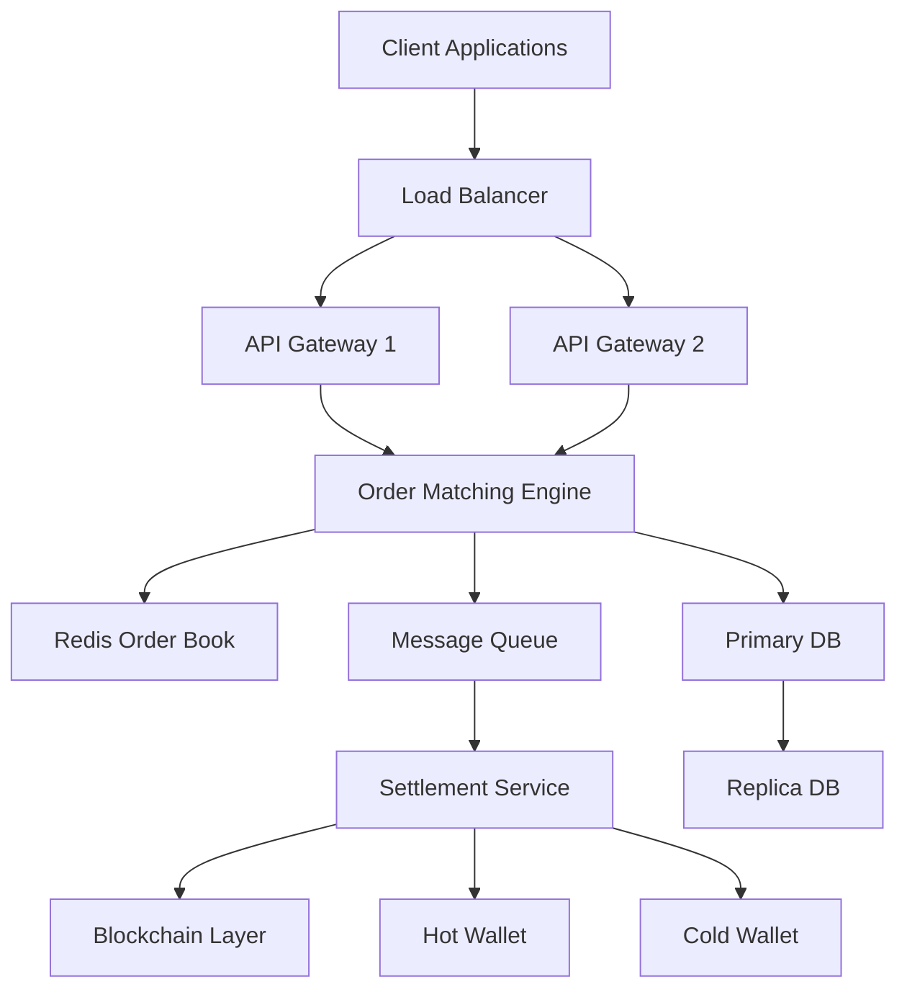
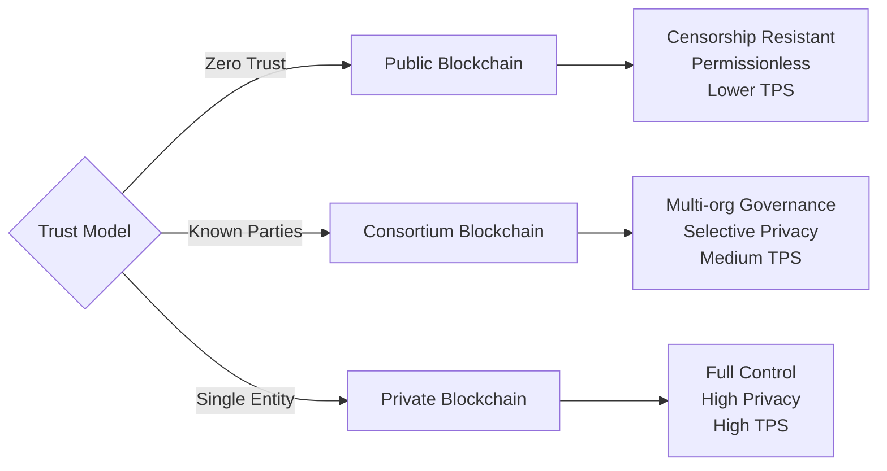
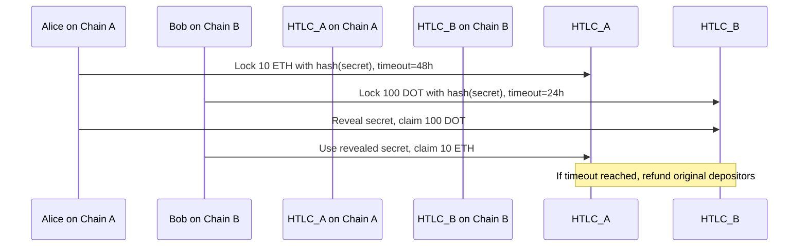
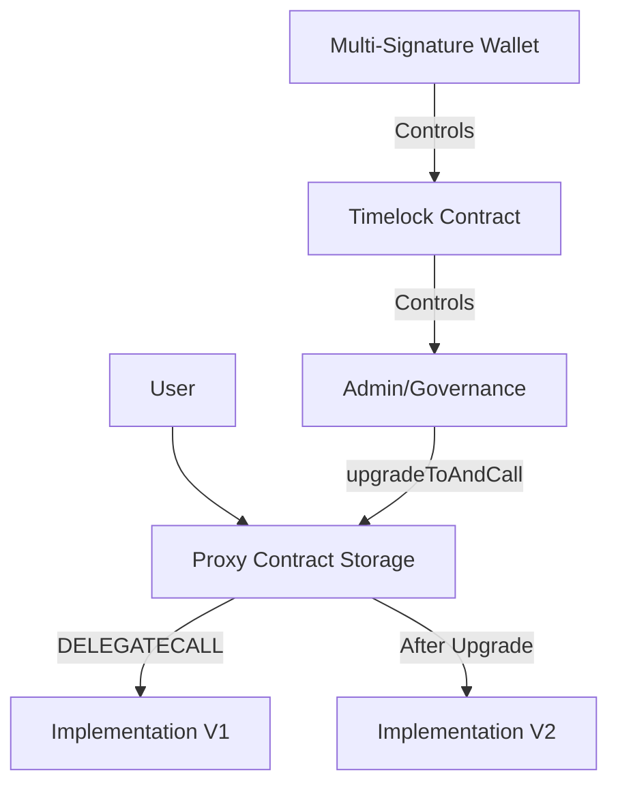
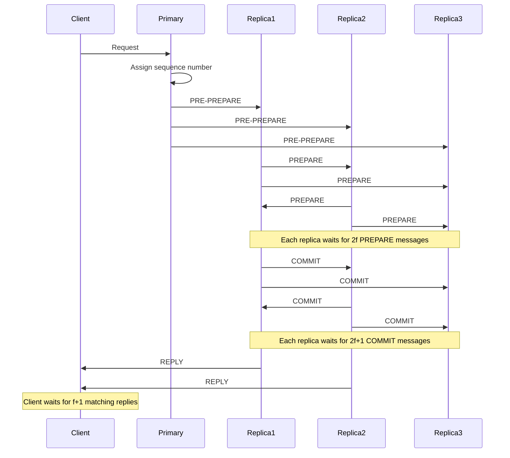
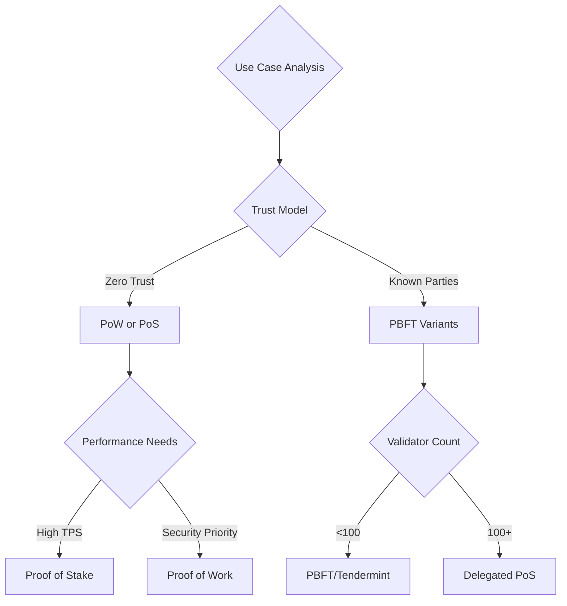
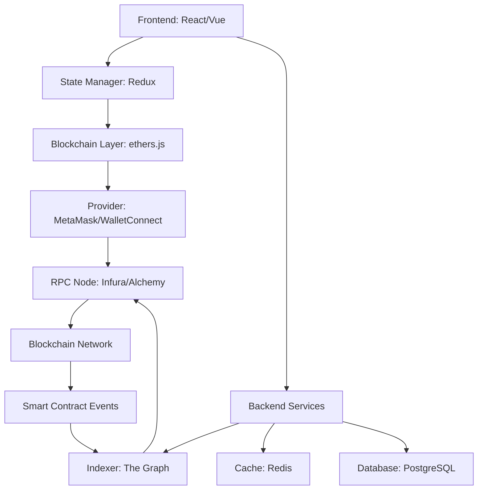

# Blockchain Engineer Interview Q&A Bank

## Contents

- [Topic Areas](#topic-areas-questions-1-30)
- [Topic 1: Blockchain Architecture & System Design](#topic-1-blockchain-architecture--system-design)
  - [Q1: How would you design a high-performance, high-availability digital asset trading system?](#q1-how-would-you-design-a-high-performance-high-availability-digital-asset-trading-system)
  - [Q2: What are the key architectural trade-offs when choosing between Layer 1 and Layer 2 solutions?](#q2-what-are-the-key-architectural-trade-offs-when-choosing-between-layer-1-and-layer-2-solutions)
  - [Q3: How do you ensure data consistency across distributed blockchain nodes?](#q3-how-do-you-ensure-data-consistency-across-distributed-blockchain-nodes)
  - [Q4: What considerations guide the choice between public, private, and consortium blockchains?](#q4-what-considerations-guide-the-choice-between-public-private-and-consortium-blockchains)
  - [Q5: How would you implement atomic cross-chain asset transfers?](#q5-how-would-you-implement-atomic-cross-chain-asset-transfers)
- [Topic 2: Smart Contract Development & Security](#topic-2-smart-contract-development--security)
  - [Q6: What are the critical security considerations when developing ERC-20 token contracts?](#q6-what-are-the-critical-security-considerations-when-developing-erc-20-token-contracts)
  - [Q7: How do you prevent reentrancy attacks in smart contracts?](#q7-how-do-you-prevent-reentrancy-attacks-in-smart-contracts)
  - [Q8: What are the trade-offs between Solidity and Vyper for smart contract development?](#q8-what-are-the-trade-offs-between-solidity-and-vyper-for-smart-contract-development)
  - [Q9: How do you optimize gas costs in smart contract execution?](#q9-how-do-you-optimize-gas-costs-in-smart-contract-execution)
  - [Q10: What testing strategies ensure smart contract reliability before mainnet deployment?](#q10-what-testing-strategies-ensure-smart-contract-reliability-before-mainnet-deployment)
  - [Q11: How do you handle smart contract upgradability while maintaining security?](#q11-how-do-you-handle-smart-contract-upgradability-while-maintaining-security)
- [Topic 3: Consensus Mechanisms & Cryptography](#topic-3-consensus-mechanisms--cryptography)
  - [Q12: What are the security and performance implications of different consensus algorithms?](#q12-what-are-the-security-and-performance-implications-of-different-consensus-algorithms)
  - [Q13: How does Byzantine Fault Tolerance work in PBFT, and what are its limitations?](#q13-how-does-byzantine-fault-tolerance-work-in-pbft-and-what-are-its-limitations)
  - [Q14: What are the economic security assumptions underlying Proof of Stake?](#q14-what-are-the-economic-security-assumptions-underlying-proof-of-stake)
  - [Q15: How do you evaluate the suitability of a consensus algorithm for specific use cases?](#q15-how-do-you-evaluate-the-suitability-of-a-consensus-algorithm-for-specific-use-cases)
  - [Q16: What cryptographic primitives are essential for blockchain security?](#q16-what-cryptographic-primitives-are-essential-for-blockchain-security)
- [Topic 4: DApp Integration & Development](#topic-4-dapp-integration--development)
  - [Q17: What architectural patterns ensure robust DApp-blockchain integration?](#q17-what-architectural-patterns-ensure-robust-dapp-blockchain-integration)
  - [Q18: How do you handle blockchain state synchronization in DApp frontends?](#q18-how-do-you-handle-blockchain-state-synchronization-in-dapp-frontends)
  - [Q19: What are the best practices for wallet integration in DApps?](#q19-what-are-the-best-practices-for-wallet-integration-in-dapps)
  - [Q20: How do you design DApps to handle network congestion and failed transactions?](#q20-how-do-you-design-dapps-to-handle-network-congestion-and-failed-transactions)
  - [Q21: What strategies optimize user experience in gas-intensive DApp operations?](#q21-what-strategies-optimize-user-experience-in-gas-intensive-dapp-operations)
- [Topic 5: Asset Tokenization & Exchange Development](#topic-5-asset-tokenization--exchange-development)
  - [Q22: What are the technical and regulatory considerations for asset tokenization?](#q22-what-are-the-technical-and-regulatory-considerations-for-asset-tokenization)
  - [Q23: How do you implement secure hot and cold wallet architecture for exchanges?](#q23-how-do-you-implement-secure-hot-and-cold-wallet-architecture-for-exchanges)
  - [Q24: What mechanisms ensure fair token distribution and prevent front-running?](#q24-what-mechanisms-ensure-fair-token-distribution-and-prevent-front-running)
  - [Q25: How do you design ERC-721 and ERC-1155 contracts for NFT marketplaces?](#q25-how-do-you-design-erc-721-and-erc-1155-contracts-for-nft-marketplaces)
  - [Q26: What are the key components of a decentralized exchange architecture?](#q26-what-are-the-key-components-of-a-decentralized-exchange-architecture)
- [Topic 6: Compliance, Monitoring & Operations](#topic-6-compliance-monitoring--operations)
  - [Q27: How do you implement regulatory compliance in blockchain systems across jurisdictions?](#q27-how-do-you-implement-regulatory-compliance-in-blockchain-systems-across-jurisdictions)
  - [Q28: What monitoring and alerting strategies are critical for production blockchain systems?](#q28-what-monitoring-and-alerting-strategies-are-critical-for-production-blockchain-systems)
  - [Q29: How do you perform security audits for smart contracts and blockchain systems?](#q29-how-do-you-perform-security-audits-for-smart-contracts-and-blockchain-systems)
  - [Q30: What incident response procedures should be in place for blockchain platforms?](#q30-what-incident-response-procedures-should-be-in-place-for-blockchain-platforms)
- [Reference Sections](#reference-sections)
  - [Glossary, Terminology & Acronyms](#glossary-terminology--acronyms)
  - [Codebase & Library References](#codebase--library-references)
  - [Authoritative Literature & Reports](#authoritative-literature--reports)
  - [APA Style Source Citations](#apa-style-source-citations)

---

## Topic Areas (Questions 1–30)

### Topic 1: Blockchain Architecture & System Design

#### Q1: How would you design a high-performance, high-availability digital asset trading system?

**Difficulty:** Advanced | **Type:** Scenario

**Answer:** A high-performance digital asset trading system requires multi-layered architecture combining on-chain and off-chain components. The core design utilizes order-matching engines running off-chain with periodic settlement batches on-chain to maximize throughput [Ref: A1]. Critical architectural decisions include implementing message queues (Kafka/RabbitMQ) for asynchronous order processing, distributed databases (PostgreSQL with Citus or Cassandra) for horizontal scalability, and Redis clusters for real-time order book management [Ref: C1, C2]. High availability demands active-active deployment across multiple data centers with RAFT consensus [Ref: G10] for configuration state synchronization. Transaction finality verification must account for blockchain reorganizations; systems should wait for sufficient block confirmations (typically 6 for Bitcoin, 12-30 for Ethereum depending on value) [Ref: L1]. Layer 2 solutions like Optimistic Rollups or ZK-Rollups can reduce settlement costs while maintaining security [Ref: A2]. Critical failure modes include database partition tolerance issues during network splits, race conditions in distributed order matching, and MEV attacks during settlement windows. Load testing should simulate >100,000 orders/second with sub-millisecond latency for 99th percentile responses [Ref: L2].

**Key Insight:** Failure Path - *Many systems fail by conflating transaction submission with finality, leading to double-spend vulnerabilities during blockchain reorganizations.*

**Supporting Artifacts:**



| Component | Technology | Throughput | Latency | HA Strategy |
|-----------|------------|------------|---------|-------------|
| Order Matching | C++/Go Custom Engine | 100K+ orders/sec | <1ms | Active-Active |
| Order Book | Redis Cluster | 1M+ updates/sec | <0.5ms | Redis Sentinel |
| Message Queue | Kafka | 1M+ msgs/sec | <10ms | Multi-broker replication |
| Settlement | Go/Rust Service | 10K+ txs/sec | <100ms | Leader election |
| Database | PostgreSQL+Citus | 50K+ writes/sec | <50ms | Primary-Replica |
| Blockchain | Layer 2 Rollup | 2K+ TPS | 2-5s finality | Decentralized validators |

---

#### Q2: What are the key architectural trade-offs when choosing between Layer 1 and Layer 2 solutions?

**Difficulty:** Intermediate | **Type:** Theoretical

**Answer:** Layer 1 versus Layer 2 decisions involve fundamental trade-offs across decentralization, security, and scalability dimensions [Ref: G1]. Layer 1 solutions (Ethereum, Solana, Polkadot) provide native security guarantees and maximum composability but face throughput constraints—Ethereum mainnet processes ~15-30 TPS while Solana achieves 2,000-5,000 TPS under optimal conditions [Ref: A3, A4]. Layer 2 solutions (Optimistic Rollups like Arbitrum, ZK-Rollups like zkSync) inherit Layer 1 security while achieving 2,000-4,000 TPS by executing transactions off-chain and posting compressed state to mainnet [Ref: C3]. Critical trade-offs include withdrawal latency (7 days for Optimistic Rollups vs. hours for ZK-Rollups), capital efficiency during challenge periods, and fragmented liquidity across L2 ecosystems [Ref: L3]. Development complexity differs significantly: L1 smart contracts deploy identically across nodes, while L2 requires understanding sequencer architecture, fraud/validity proofs, and cross-layer messaging [Ref: C4]. Cost structures diverge—L1 fees correlate with network congestion (Ethereum gas reached 500+ gwei during peaks), while L2 fees remain stable but add fixed withdrawal costs [Ref: A5]. For DApps requiring immediate finality and atomic composability with DeFi protocols, L1 provides superior guarantees; for high-volume, lower-value transactions (payments, gaming), L2 offers better economics.

**Key Insight:** Trade-offs - *The choice isn't binary; hybrid architectures anchoring critical state on L1 while processing high-volume operations on L2 often provide optimal economics and security.*

**Supporting Artifacts:**

| Dimension | Layer 1 | Layer 2 (Optimistic) | Layer 2 (ZK-Rollup) |
|-----------|---------|---------------------|---------------------|
| **Throughput** | 15-5,000 TPS | 2,000-4,000 TPS | 2,000-20,000 TPS |
| **Finality** | 12s-2.5s | 7 days (withdrawal) | 1-24 hours (proof gen) |
| **Cost/Tx** | $0.50-$50+ | $0.01-$1 | $0.05-$0.50 |
| **Security** | Native consensus | Inherited + fraud proofs | Inherited + validity proofs |
| **Composability** | Full atomic | Limited cross-L2 | Limited cross-L2 |
| **Dev Complexity** | Standard | Moderate (sequencer awareness) | High (circuit constraints) |
| **Capital Efficiency** | Immediate | Locked during challenge | Locked during proof gen |

---

#### Q3: How do you ensure data consistency across distributed blockchain nodes?

**Difficulty:** Advanced | **Type:** Theoretical

**Answer:** Data consistency in blockchain networks relies on consensus mechanisms that provide Byzantine Fault Tolerance [Ref: G2] guarantees despite adversarial nodes. In permissionless networks like Ethereum, the Gasper consensus (combining Casper FFG and LMD GHOST) achieves probabilistic finality where blocks become increasingly difficult to revert as confirmations accumulate [Ref: A6]. For consortium blockchains using PBFT [Ref: G8], deterministic finality occurs when >2/3 of validators agree, requiring three message phases (pre-prepare, prepare, commit) [Ref: L4]. Critical consistency challenges emerge during network partitions: Ethereum handles splits through fork-choice rules favoring the chain with greatest validator support, while PBFT-based systems may halt rather than risk divergence [Ref: C5]. State synchronization for new nodes requires secure bootstrapping—Ethereum uses checkpoint sync to avoid downloading historical blocks while verifying merkle proofs [Ref: A7]. Common failure modes include eclipse attacks where nodes receive manipulated chain data, mitigated through diverse peer connections and checkpoint verification [Ref: L5]. For application-layer consistency, smart contracts should employ optimistic concurrency with versioning (similar to databases) and handle potential reorganizations by checking block depths before considering transactions final [Ref: C6]. Monitoring tools like Prometheus with custom blockchain metrics help detect consensus anomalies before they impact consistency.

**Key Insight:** Misconception - *Blockchain consensus doesn't provide ACID-style immediate consistency; applications must account for probabilistic finality and potential reorganizations.*

---

#### Q4: What considerations guide the choice between public, private, and consortium blockchains?

**Difficulty:** Intermediate | **Type:** Scenario

**Answer:** Blockchain type selection depends on trust assumptions, regulatory requirements, performance needs, and governance models [Ref: L6]. Public blockchains (Ethereum, Solana) suit applications requiring censorship resistance and permissionless participation but sacrifice transaction privacy and throughput (15-5,000 TPS) [Ref: A3, A4]. Private blockchains (Hyperledger Besu in private mode) enable enterprise control over validators and data visibility, achieving 1,000-10,000 TPS, but centralization risks regulatory classification as traditional databases [Ref: C7, A8]. Consortium blockchains (Hyperledger Fabric, Quorum) balance these through multi-organization governance, supporting privacy through channels while maintaining auditability [Ref: C8]. Key decision factors include data sensitivity (private patient records vs. public token transfers), regulatory compliance (GDPR right-to-erasure conflicts with immutability), cost structures (public gas fees vs. infrastructure overhead), and interoperability needs [Ref: L6, A9]. Financial services often adopt consortium models for settlement networks (JPM Coin on Quorum), supply chains leverage private networks for confidential supplier data, and tokenized assets prefer public chains for liquidity [Ref: A10]. Hybrid architectures are emerging: private computation with public anchoring (proofs posted to Ethereum), combining enterprise privacy with public verifiability [Ref: L7].

**Key Insight:** Trade-offs - *No blockchain type is universally superior; the optimal choice depends on whether trustlessness, performance, or regulatory compliance is the primary constraint.*

**Supporting Artifacts:**



---

#### Q5: How would you implement atomic cross-chain asset transfers?

**Difficulty:** Advanced | **Type:** Practical

**Answer:** Atomic cross-chain transfers require protocols guaranteeing either complete transfer or complete rollback across chains without trusted intermediaries [Ref: G3]. Hash Time-Locked Contracts (HTLCs) provide the foundation: Alice locks assets on Chain A with hash(secret), Bob locks corresponding assets on Chain B with the same hash, Alice reveals the secret to claim on Chain B, Bob uses the revealed secret to claim on Chain A [Ref: C9, A11]. Implementation challenges include timelock coordination (Chain A timeout > Chain B timeout + safety margin), handling different block time granularities, and managing failures during the reveal phase [Ref: L8]. Modern approaches use cross-chain messaging protocols like IBC (Inter-Blockchain Communication) on Cosmos, which maintains light clients of connected chains and verifies merkle proofs of transactions [Ref: C10, A12]. Polkadot's XCM (Cross-Consensus Message Format) enables asset transfers between parachains through shared security model verification [Ref: C11]. Critical security considerations include preventing front-running attacks during secret revelation, handling blockchain reorganizations that could invalidate timelocks, and ensuring economic incentives align (penalties for protocol violations exceed potential gains) [Ref: L9]. For production systems, additional layers include monitoring services that auto-refund if counterparties fail, multi-signature coordination for high-value transfers, and fallback mechanisms for chain halt scenarios [Ref: A13].

**Key Insight:** Failure Path - *Many implementations fail to account for blockchain reorganizations during timelock periods, creating windows where atomicity breaks down.*

**Supporting Artifacts:**



---

### Topic 2: Smart Contract Development & Security

#### Q6: What are the critical security considerations when developing ERC-20 token contracts?

**Difficulty:** Intermediate | **Type:** Practical

**Answer:** ERC-20 token security extends beyond implementing the standard interface to address multiple attack vectors [Ref: G4, C12]. Critical vulnerabilities include integer overflow/underflow (mitigated in Solidity ≥0.8.0 with automatic checks, but legacy contracts need SafeMath [Ref: C13]), reentrancy during transfer callbacks (use Checks-Effects-Interactions pattern or ReentrancyGuard [Ref: A14]), and approval race conditions where changing allowances can enable double-spending [Ref: L10]. The approve/transferFrom pattern is inherently vulnerable: if Alice approves Bob for 100 tokens then changes to 50, Bob can front-run the change transaction to spend 150 total [Ref: A15]. Recommended mitigation uses increaseAllowance/decreaseAllowance or single-use permits (EIP-2612) [Ref: C14]. Access control flaws plague token contracts—privileged functions like mint, burn, or pause must use role-based permissions (OpenZeppelin's AccessControl) with multi-signature requirements for critical operations [Ref: C12, A16]. Supply manipulation requires careful validation: totalSupply should always equal sum of balances, enforced through require checks or proven via formal verification tools like Certora [Ref: C15]. Decimal handling causes subtle bugs—tokens using decimals other than 18 require explicit conversion in cross-contract interactions [Ref: L11]. Test coverage should include edge cases: zero-value transfers, self-transfers, transfers exceeding balance, and approval to zero address [Ref: A17].

**Key Insight:** Misconception - *Simply implementing ERC-20 interface methods doesn't guarantee security; the standard doesn't address critical vulnerabilities like approval race conditions or reentrancy.*

**Supporting Artifacts:**

| Vulnerability | Attack Vector | Mitigation | Tool/Library |
|---------------|---------------|------------|-------------|
| Integer Overflow | amount + balance > uint256 | Solidity ≥0.8.0 or SafeMath | OpenZeppelin SafeMath [C13] |
| Reentrancy | Callback during transfer | Checks-Effects-Interactions, ReentrancyGuard | OpenZeppelin [C12] |
| Approval Race | Front-run allowance change | increaseAllowance, EIP-2612 permit | OpenZeppelin, Permit2 [C14] |
| Access Control | Unauthorized mint/burn | Role-based permissions, multi-sig | AccessControl, Gnosis Safe |
| Supply Mismatch | totalSupply ≠ Σbalances | Invariant checks, formal verification | Certora, Slither [C15, C16] |

---

#### Q7: How do you prevent reentrancy attacks in smart contracts?

**Difficulty:** Intermediate | **Type:** Practical

**Answer:** Reentrancy attacks exploit external calls that transfer control to untrusted contracts before state updates complete, as demonstrated in the 2016 DAO hack where $60M was drained [Ref: A18]. Prevention requires multiple defensive layers. The Checks-Effects-Interactions pattern ensures state mutations complete before external calls: check conditions (require statements), update state (balance changes), then interact (external calls) [Ref: L12, C12]. OpenZeppelin's ReentrancyGuard modifier implements a mutex lock preventing recursive calls: functions marked nonReentrant set a status flag before execution and reset it after, reverting if called while locked [Ref: C12]. For complex contracts, reentrancy guards should protect entire transaction flows, not just individual functions—an attacker might reenter through a different function [Ref: A19]. Pull-over-push payment patterns eliminate many reentrancy risks by having recipients withdraw funds rather than pushing transfers, though this shifts gas costs [Ref: L13]. Gas limits provide weak protection since CALL, DELEGATECALL, and STATICCALL can specify gas amounts [Ref: G5]. Static analysis tools like Slither detect potential reentrancy vulnerabilities by analyzing call graphs and state dependencies [Ref: C16]. For high-value contracts, formal verification frameworks like Certora prove reentrancy impossibility mathematically [Ref: C15]. Testing should include attack simulations using malicious contracts that attempt reentrant calls from fallback/receive functions [Ref: A20].

**Key Insight:** Failure Path - *Many developers only guard the withdrawal function while leaving state-modifying functions unprotected, allowing attackers to reenter through alternative paths.*

**Supporting Artifacts:**

```solidity
// Vulnerable Pattern
function withdraw(uint amount) public {
    require(balances[msg.sender] >= amount);
    (bool success, ) = msg.sender.call{value: amount}(""); // External call before state update
    require(success);
    balances[msg.sender] -= amount; // VULNERABLE: state updated after external call
}

// Secure Pattern (Checks-Effects-Interactions)
function withdraw(uint amount) public nonReentrant {
    require(balances[msg.sender] >= amount); // Check
    balances[msg.sender] -= amount; // Effect
    (bool success, ) = msg.sender.call{value: amount}(""); // Interaction
    require(success);
}
```

---

#### Q8: What are the trade-offs between Solidity and Vyper for smart contract development?

**Difficulty:** Foundational | **Type:** Theoretical

**Answer:** Solidity and Vyper represent different philosophies in smart contract language design, each with distinct security and usability trade-offs [Ref: C17, C18]. Solidity, supporting Ethereum since 2015, offers object-oriented features including inheritance, modifiers, and operator overloading, enabling complex contract architectures but introducing security risks through feature interactions [Ref: A21]. Vyper prioritizes security through simplicity by deliberately omitting inheritance, modifiers, recursive calling, and inline assembly—features that historically enabled vulnerabilities [Ref: L14, C18]. This opinionated design makes Vyper code more auditable but limits architectural flexibility for complex protocols. Performance differs minimally for simple contracts, though Solidity's optimizer (via Yul IR) can achieve better gas efficiency in complex cases [Ref: A22]. Developer ecosystem heavily favors Solidity: more libraries (OpenZeppelin, Uniswap), tooling (Hardhat, Foundry), and auditor familiarity, while Vyper development requires custom implementations of common patterns [Ref: C12, C19]. Vyper excels for financial primitives requiring maximum auditability (stablecoins, bonding curves) where security trumps flexibility [Ref: L15]. Deployment size constraints favor Vyper's typically more compact bytecode [Ref: A23]. For production systems, the choice depends on team expertise, audit availability (Solidity auditors are 10× more common), and security model—DeFi protocols like Curve use Vyper for core logic while peripheral contracts use Solidity [Ref: A24].

**Key Insight:** Trade-offs - *Vyper's security benefits come from restriction, not innovation; teams must evaluate whether architectural limitations justify reduced attack surface.*

**Supporting Artifacts:**

| Aspect | Solidity | Vyper |
|--------|----------|-------|
| **Design Philosophy** | Flexibility, expressiveness | Security through simplicity |
| **Inheritance** | Multiple inheritance | Not supported |
| **Modifiers** | Full support | Not supported |
| **Inline Assembly** | Yul/assembly blocks | Not supported |
| **Recursion** | Allowed | Prohibited |
| **Overflow Checks** | Default since 0.8.0 | Always enforced |
| **Ecosystem** | Extensive (OpenZeppelin, etc.) | Limited libraries |
| **Auditor Availability** | High | Low |
| **Gas Optimization** | Advanced (Yul IR) | Moderate |
| **Typical Use Case** | Complex DeFi protocols | Financial primitives |

---

#### Q9: How do you optimize gas costs in smart contract execution?

**Difficulty:** Advanced | **Type:** Practical

**Answer:** Gas optimization requires understanding EVM operation costs and storage architecture [Ref: G6]. Storage operations dominate costs: SSTORE (writing to storage) costs 20,000 gas for new slots or 5,000 for modifications, while SLOAD (reading) costs 2,100 gas (warm) or 800 gas (cached) [Ref: A25]. Critical optimizations include packing variables into single storage slots—five uint32 variables fit in one slot (32 bytes) versus five slots for uint256, saving ~80,000 gas [Ref: L16]. Using memory/calldata for temporary data costs ~3 gas per word versus storage's thousands [Ref: C20]. Function visibility affects costs: external functions with calldata parameters avoid copying data to memory, saving gas for array/string parameters [Ref: A26]. Short-circuiting with && and || operators prevents expensive operations when earlier conditions fail [Ref: L17]. For loops should cache array lengths and avoid storage reads: storing users.length in memory variable saves SLOAD per iteration [Ref: C20]. Batch operations amortize fixed costs—processing 100 transfers in one transaction is cheaper than 100 separate transactions due to 21,000 gas base cost [Ref: A27]. Advanced techniques include using events instead of storage for historical data (375 gas/byte vs. 20,000/slot), bitmap indices for boolean flags (one uint256 stores 256 booleans), and CREATE2 for deterministic addresses enabling counterfactual deployments [Ref: C21, L18]. Profiling tools like Hardhat Gas Reporter identify hotspots [Ref: C19]. Trade-offs exist: optimizations reducing readability may increase audit costs more than gas savings justify [Ref: A28].

**Key Insight:** Trade-offs - *Aggressive gas optimization often conflicts with code readability and security; the optimal balance depends on deployment frequency and transaction volume.*

**Supporting Artifacts:**

```solidity
// Inefficient: Separate storage slots, repeated SLOAD
struct User {
    uint256 id;        // Slot 0
    uint256 balance;   // Slot 1
    uint256 timestamp; // Slot 2
    bool active;       // Slot 3
}

// Optimized: Packed into fewer slots
struct User {
    uint64 id;         // ┐
    uint128 balance;   // ├─ Slot 0 (32 bytes)
    uint32 timestamp;  // │
    bool active;       // ┘
}

// Inefficient: Storage reads in loop
function sumBalances() public view returns (uint256) {
    uint256 total;
    for (uint i = 0; i < users.length; i++) { // SLOAD per iteration
        total += users[i].balance; // Storage read
    }
    return total;
}

// Optimized: Cache length, minimize storage access
function sumBalances() public view returns (uint256) {
    uint256 total;
    uint256 length = users.length; // Cache length
    for (uint i = 0; i < length; i++) {
        total += users[i].balance;
    }
    return total;
}
```

---

#### Q10: What testing strategies ensure smart contract reliability before mainnet deployment?

**Difficulty:** Intermediate | **Type:** Practical

**Answer:** Comprehensive smart contract testing requires multi-layered validation addressing functional correctness, security, and economic game theory [Ref: L19]. Unit tests using frameworks like Foundry or Hardhat should achieve >95% code coverage with focus on edge cases: zero values, maximum uint256, empty arrays, and unauthorized access attempts [Ref: C19, C22]. Property-based testing (Echidna, Foundry's fuzzing) generates thousands of random inputs testing invariants that must always hold—totalSupply equals sum of balances, balance never negative [Ref: C23, A29]. Integration tests verify cross-contract interactions using mainnet forks to simulate real DeFi protocol integrations with historical state [Ref: C22]. Static analysis tools (Slither, Mythril) detect common vulnerabilities: reentrancy, integer issues, access control flaws [Ref: C16, C24]. Formal verification (Certora, K Framework) mathematically proves correctness properties but requires significant expertise [Ref: C15, A30]. Testnet deployment (Goerli, Sepolia) enables real-world condition testing but lacks mainnet economic incentives for attack discovery [Ref: G7]. Bug bounty programs incentivize external security researchers: Immunefi facilitates bounties where critical findings earn $10K-$1M+ [Ref: A31]. Staged mainnet deployment mitigates risk: start with deposit caps, gradually increase limits while monitoring, maintain circuit breakers for emergency pausing [Ref: L20]. Gas profiling ensures operations stay within block gas limits (30M on Ethereum) and remain economically viable [Ref: A25]. Audits by specialized firms (Trail of Bits, OpenZeppelin Security, Consensys Diligence) provide expert review but should complement, not replace, comprehensive testing [Ref: A32].

**Key Insight:** Misconception - *Audit reports don't guarantee security; they represent point-in-time analysis and miss runtime interactions, economic exploits, and post-audit code changes.*

**Supporting Artifacts:**

| Testing Layer | Tool/Approach | Purpose | Coverage Target |
|---------------|---------------|---------|----------------|
| **Unit Tests** | Foundry, Hardhat | Function-level correctness | >95% code coverage |
| **Fuzz Testing** | Echidna, Foundry | Invariant violations | 10,000+ scenarios |
| **Static Analysis** | Slither, Mythril | Common vulnerabilities | All detectable patterns |
| **Formal Verification** | Certora, K Framework | Mathematical correctness proofs | Critical invariants |
| **Integration Tests** | Hardhat forking | Cross-contract interactions | Major DeFi protocols |
| **Testnet Deployment** | Goerli, Sepolia | Real network conditions | Full workflow |
| **Security Audit** | Trail of Bits, OpenZeppelin | Expert manual review | Architecture + code |
| **Bug Bounty** | Immunefi, Code4rena | Economic incentive discovery | Post-deployment |

---

#### Q11: How do you handle smart contract upgradability while maintaining security?

**Difficulty:** Advanced | **Type:** Practical

**Answer:** Smart contract upgradability contradicts blockchain immutability, requiring carefully designed patterns that balance flexibility and security [Ref: L21]. The proxy pattern separates storage (proxy contract) from logic (implementation contract) using DELEGATECALL to execute implementation code in proxy context [Ref: G9, C25]. OpenZeppelin provides three variants: Transparent Proxy (separates admin/user calls), UUPS (upgrade logic in implementation), and Beacon Proxy (multiple proxies share one implementation) [Ref: C12]. Critical security considerations include storage layout compatibility—adding variables to implementation contracts must append to existing layout to avoid slot collisions that corrupt data [Ref: A33]. Initialization functions replace constructors since DELEGATECALL doesn't execute constructor code; these must be protected against re-initialization attacks [Ref: C25]. Selector clashing attacks exploit function signature collisions between proxy and implementation; Transparent Proxy mitigates this by routing admin calls differently [Ref: L22]. Governance of upgrade authority is critical: multi-signature wallets (Gnosis Safe) requiring 3-of-5 signatures prevent unilateral malicious upgrades, while timelocks (Compound Timelock) provide 2-7 day windows for community to review and exit before upgrades activate [Ref: C26, A34]. Immutable parts (token supply logic, core economics) should live in separate non-upgradable contracts to prevent trust minimization loss [Ref: L23]. Alternatives include immutable contracts with parameterized configuration (adjustable fees/parameters without redeployment) and versioned deployments where users explicitly opt into new contracts [Ref: A35]. Testing upgraded contracts requires validating state migration, ensuring storage compatibility via automated tools like OpenZeppelin Upgrades Plugin, and fork testing against production state [Ref: C27].

**Key Insight:** Trade-offs - *Upgradability introduces centralization risks and complexity; protocols should minimize upgradable components and implement strong governance controls rather than making everything upgradable.*

**Supporting Artifacts:**



---

### Topic 3: Consensus Mechanisms & Cryptography

#### Q12: What are the security and performance implications of different consensus algorithms?

**Difficulty:** Advanced | **Type:** Theoretical

**Answer:** Consensus algorithms present fundamental trade-offs between security models, performance characteristics, and centralization risks [Ref: L4]. Proof of Work (Bitcoin, Ethereum pre-Merge) provides probabilistic finality with security proportional to hash power cost; 51% attacks require controlling majority computational capacity (~$15B for Bitcoin) [Ref: A36]. Performance suffers: Bitcoin achieves 7 TPS, Ethereum reached 15 TPS, both constrained by block time and size limits designed to minimize orphan rates [Ref: A3]. Proof of Stake (Ethereum post-Merge, Polkadot) achieves finality through economic security where validators risk slashing (loss of staked capital), enabling 2-second block times and 64-transaction minimum in Ethereum [Ref: A6, A37]. Attack costs shift from hardware to capital: corrupting Ethereum requires controlling ~9.6M ETH (~$32B at $3.3K/ETH), though nothing-at-stake problems allow validators to sign conflicting blocks without cost in naive implementations [Ref: L24]. Practical Byzantine Fault Tolerance and variants (Hyperledger Fabric, Cosmos Tendermint) provide deterministic finality in 1-3 seconds with formal >2/3 honest validator requirement, achieving 1,000-10,000 TPS but requiring known validator sets unsuitable for permissionless networks [Ref: C5, C28, L4]. Delegated Proof of Stake (EOS, Tron) concentrates validation among 21-101 elected producers, reaching 4,000+ TPS but with significant centralization—voter apathy and exchange control create cartel risks [Ref: A38]. Long-range attacks exploit PoS history rewriting by acquiring old validator keys; checkpointing and weak subjectivity (trusting recent state snapshots) mitigate this [Ref: A39].

**Key Insight:** Trade-offs - *No consensus algorithm optimizes all three properties (decentralization, security, scalability); architects must prioritize based on threat model and performance requirements.*

**Supporting Artifacts:**

| Algorithm | Finality | TPS | Attack Cost | Decentralization | Energy | Network Type |
|-----------|----------|-----|-------------|-----------------|--------|-------------|
| **PoW** | Probabilistic (6+ blocks) | 7-15 | Hash power majority | High (thousands of miners) | Very High | Permissionless |
| **PoS** | Near-deterministic (2 epochs) | 64+ | Stake majority | Medium (thousands of validators) | Very Low | Permissionless |
| **PBFT** | Deterministic (1-3s) | 1,000-10,000 | >1/3 validators | Low (known set) | Very Low | Permissioned |
| **DPoS** | Near-instant (0.5s) | 4,000+ | Elect malicious producers | Very Low (21-101 producers) | Low | Semi-permissionless |
| **Tendermint** | Deterministic (1-7s) | 1,000-4,000 | >1/3 stake | Medium (validator set) | Very Low | Configurable |

---

#### Q13: How does Byzantine Fault Tolerance work in PBFT, and what are its limitations?

**Difficulty:** Intermediate | **Type:** Theoretical

**Answer:** Practical Byzantine Fault Tolerance enables distributed systems to reach consensus despite up to f Byzantine (arbitrary malicious) nodes among 3f+1 total nodes [Ref: G2, L4]. PBFT operates through three communication phases: pre-prepare (primary proposes block), prepare (replicas verify and broadcast acceptance), commit (replicas commit once >2f+1 prepare messages received) [Ref: A40]. This ensures safety (no conflicting decisions) and liveness (eventually makes progress) under asynchronous network conditions with timeouts [Ref: L25]. Mathematical foundation: with 3f+1 nodes, even if f nodes are malicious, the remaining 2f+1 honest nodes constitute majority needed for >2f quorum [Ref: L4]. Critical limitations include quadratic message complexity O(n²) where n is validator count—100 validators generate 10,000 messages per consensus round, creating bandwidth bottlenecks that limit practical deployments to <100 validators [Ref: A41]. Primary bottleneck: leader-based architecture where single primary sequences transactions creates single point of failure; view changes (electing new primary) add latency during failures [Ref: C5]. Network partition handling: PBFT prioritizes consistency over availability (CP in CAP theorem), halting rather than risking split-brain when >1/3 nodes unreachable [Ref: G11]. Performance degrades with geographic distribution; most deployments require <100ms latency between nodes to achieve 1,000+ TPS [Ref: A42]. Modern variants like HotStuff (used in Diem/Aptos) reduce complexity to O(n) via threshold signatures and pipelining [Ref: C29, A43].

**Key Insight:** Failure Path - *PBFT's O(n²) message complexity makes it unsuitable for large decentralized networks; exceeding ~100 validators creates communication bottlenecks that severely degrade performance.*

**Supporting Artifacts:**



---

#### Q14: What are the economic security assumptions underlying Proof of Stake?

**Difficulty:** Advanced | **Type:** Theoretical

**Answer:** Proof of Stake security relies on economic incentives where rational validators maximize profit by acting honestly rather than attacking the network [Ref: A44]. Core assumption: acquiring majority stake costs more than potential attack profit, creating game-theoretic equilibrium [Ref: L26]. Ethereum's PoS requires 32 ETH ($105K at $3.3K/ETH) per validator with 665,536 active validators representing ~21.3M ETH (~$70B) staked [Ref: A37, A45]. Attack scenarios include: (1) finality reversion requiring >1/3 stake, resulting in slashing that can burn up to 50% of attacking validators' stake (~$11B+ cost); (2) censorship requiring >50% stake to consistently exclude transactions [Ref: A6, A46]. Critical vulnerability: nothing-at-stake problem where validators can sign multiple conflicting blocks without cost in naive implementations; Ethereum's slashing conditions (contradictory votes, surround votes) penalize this behavior [Ref: L24]. Economic assumptions can break during market distress: if staking derivatives (stETH, rETH) trade below backing value, attackers might acquire majority stake below intrinsic cost [Ref: A47]. Centralization risks emerge from economies of scale in staking—large operators achieve better returns through MEV extraction and infrastructure efficiency, creating plutocratic concentration [Ref: L27]. Long-range attacks exploit validator set changes: attackers acquiring old validator keys can construct alternative histories; weak subjectivity checkpoints (trusting recent snapshots from trusted sources) mitigate this by rejecting old forks [Ref: A39]. Liveness depends on >2/3 participation; if too many validators go offline (e.g., coordinated infrastructure failures), the network halts rather than risks safety [Ref: A48].

**Key Insight:** Misconception - *PoS security isn't purely cryptographic; it depends on economic rationality assumptions that may not hold during extreme market conditions or state-level attacks.*

---

#### Q15: How do you evaluate the suitability of a consensus algorithm for specific use cases?

**Difficulty:** Intermediate | **Type:** Scenario

**Answer:** Consensus algorithm selection requires analyzing trust assumptions, performance requirements, network characteristics, and regulatory constraints [Ref: L6]. Decision framework: (1) Trust model—permissionless applications requiring censorship resistance (DeFi, public registries) need PoW or PoS to resist Sybil attacks; known-participant networks (supply chain, interbank settlement) can use efficient PBFT variants [Ref: C5, C28]. (2) Performance needs—high-frequency trading requires <1s finality and 10,000+ TPS, favoring DPoS or PBFT; store-of-value applications prioritize security over speed, justifying PoW's lower throughput [Ref: A38, A36]. (3) Geographic distribution—validators across continents introduce 100-300ms latency that degrades PBFT performance; PoW and PoS tolerate high latency better through longer block times [Ref: A42]. (4) Economic model—PoS requires native token for staking, problematic for systems where asset tokenization shouldn't require separate security token; PoW suits pure payment networks like Bitcoin [Ref: L26]. (5) Regulatory landscape—energy-intensive PoW faces increasing regulatory scrutiny and ESG concerns; EU's MiCA regulation may impact PoW cryptocurrencies [Ref: A49]. (6) Decentralization requirements—securities regulations may require identifiable validators, making permissioned PBFT appropriate; anonymous participation favors PoW/PoS [Ref: L28]. Evaluation criteria include worst-case finality time (probabilistic vs. deterministic), maximum throughput under adversarial conditions, cost to attack (51% attack cost), and recovery mechanisms after attacks [Ref: A50]. Hybrid approaches emerging: Ethereum's PoS with ZK-rollups combines base-layer security with L2 performance [Ref: C3].

**Key Insight:** Trade-offs - *Consensus choice drives architecture and economic model; selecting an algorithm incompatible with business requirements creates fundamental limitations impossible to fix later.*

**Supporting Artifacts:**



---

#### Q16: What cryptographic primitives are essential for blockchain security?

**Difficulty:** Foundational | **Type:** Theoretical

**Answer:** Blockchain security relies on several cryptographic primitives providing different security properties [Ref: L29]. Cryptographic hash functions (SHA-256 in Bitcoin, Keccak-256 in Ethereum) provide collision resistance, preimage resistance, and deterministic output, enabling content addressing and merkle tree construction [Ref: A51, C30]. Properties required: (1) collision resistance—computationally infeasible to find x ≠ y where H(x) = H(y); (2) preimage resistance—given h, cannot find x where H(x) = h; (3) avalanche effect—single bit change produces completely different output [Ref: L29]. Digital signatures (ECDSA with secp256k1 in Bitcoin/Ethereum, EdDSA in Solana) enable authentication and non-repudiation; private keys sign transactions, public keys verify signatures [Ref: A52, C31]. Signature schemes must provide existential unforgeability: attackers can't create valid signatures without private keys even after observing many valid signatures [Ref: L30]. Merkle trees aggregate thousands of transactions into single root hash, enabling efficient verification—SPV clients verify transaction inclusion with log(n) hashes rather than downloading all transactions [Ref: A53]. Cryptographic commitments (Pedersen commitments, hash-based commitments) enable hiding values while proving properties; used in zero-knowledge proofs and private transactions [Ref: C32]. Threshold cryptography (used in multi-signature wallets and distributed key generation) enables m-of-n signature schemes where subset of keyholders can authorize transactions [Ref: C26]. Emerging primitives include ZK-SNARKs/ZK-STARKs enabling privacy and scalability through succinct proofs of computation [Ref: C33, A54]. Quantum threats: Shor's algorithm breaks ECDSA and RSA; post-quantum alternatives like CRYSTALS-Dilithium under consideration [Ref: L31, A55].

**Key Insight:** Misconception - *Cryptographic security doesn't guarantee system security; implementation flaws (weak random number generation, nonce reuse) undermine even theoretically secure primitives.*

**Supporting Artifacts:**

| Primitive | Algorithm | Security Property | Blockchain Use | Quantum Resistant |
|-----------|-----------|-------------------|----------------|------------------|
| **Hash Function** | SHA-256, Keccak-256 | Collision resistance | Block linking, addresses | Partially (Grover's algorithm 2x speedup) |
| **Digital Signature** | ECDSA, EdDSA | Existential unforgeability | Transaction authorization | No (Shor's algorithm) |
| **Merkle Tree** | Hash-based | Integrity, efficient verification | Transaction batching | Partially |
| **Commitment** | Pedersen, hash-based | Hiding and binding | Zero-knowledge proofs | Algorithm-dependent |
| **Threshold Signature** | BLS, Schnorr | m-of-n security | Multi-sig wallets | No (current schemes) |
| **ZK-SNARK** | Groth16, PLONK | Zero-knowledge, succinctness | Privacy, rollups | Post-quantum variants exist |

---

### Topic 4: DApp Integration & Development

#### Q17: What architectural patterns ensure robust DApp-blockchain integration?

**Difficulty:** Intermediate | **Type:** Practical

**Answer:** Robust DApp architecture requires decoupling frontend concerns from blockchain limitations through layered design [Ref: L32]. Core pattern separates presentation (React/Vue), state management (Redux/Zustand), blockchain interaction (ethers.js/web3.js), and backend services (off-chain indexing, caching) [Ref: C34, C35]. Critical design decisions include event-driven architecture where smart contract events (ERC-20 Transfer, NFT Minted) trigger frontend updates rather than polling, reducing RPC calls by 90%+ [Ref: A56]. Blockchain interaction layer should abstract provider management (MetaMask, WalletConnect, Coinbase Wallet) through unified interfaces handling connection, switching networks, and signing [Ref: C36]. Error handling must account for blockchain-specific failures: user rejection, insufficient gas, slippage exceeded, network congestion [Ref: L33]. Transaction lifecycle management includes pending state display, confirmation waiting (monitoring transaction hash), and handling replacements/cancellations (nonce management) [Ref: A57]. Backend indexing services (The Graph, custom PostgreSQL with Ethers event listeners) enable complex queries impossible on-chain—"find all NFTs owned by address" requires scanning all Transfer events, impractical via RPC [Ref: C37, C38]. Caching strategies reduce latency: cache static blockchain data (contract ABIs, historical events), invalidate on new blocks, implement optimistic UI updates [Ref: L34]. Multi-chain support requires environment configuration per network (contract addresses, RPC endpoints, block explorers) and chain-specific considerations (gas price mechanisms, finality times) [Ref: C39]. Security includes validating chain ID to prevent network confusion attacks and sanitizing contract interaction results [Ref: A58].

**Key Insight:** Failure Path - *Many DApps fail by treating blockchain as traditional database, leading to poor UX from slow queries and inability to handle pending/failed transaction states gracefully.*

**Supporting Artifacts:**



---

#### Q18: How do you handle blockchain state synchronization in DApp frontends?

**Difficulty:** Intermediate | **Type:** Practical

**Answer:** Blockchain state synchronization challenges stem from eventual consistency, reorgs, and unpredictable confirmation times [Ref: G12]. Effective strategies combine event listening, polling fallbacks, and optimistic updates [Ref: L35]. Primary approach uses WebSocket subscriptions to block headers and contract events through providers like Alchemy/Infura, providing real-time updates with <1s latency [Ref: C40]. Event filtering should specify contract addresses and topics to minimize bandwidth; listening to all Transfer events on Ethereum mainnet would overwhelm clients [Ref: A59]. Polling serves as fallback when WebSockets disconnect, checking provider.getBlockNumber() every 12s (Ethereum block time) to detect missed events [Ref: C34]. Transaction state machine tracks: (1) signed but unsubmitted, (2) submitted (mempool), (3) included in block (pending), (4) confirmed (N blocks deep), (5) finalized, (6) failed/reverted [Ref: A60]. Optimistic updates improve UX by immediately reflecting expected state changes (deducting balance after swap), rolling back if transaction fails [Ref: L36]. Reorg handling requires tracking block depth; data considered final only after deep confirmations (12+ for Ethereum during high volatility) [Ref: A61]. Multi-block transactions (approvals then swaps) need dependency tracking: don't submit swap until approval confirmed [Ref: C35]. Synchronization libraries like useDApp and wagmi provide React hooks abstracting complexity: useContractCall, useBlockNumber, useEthers [Ref: C41, C42]. Performance optimizations include batching RPC calls via JSON-RPC multicall, caching immutable data (contract bytecode, historical blocks), and using The Graph for complex historical queries [Ref: C37, C43]. State reconciliation on disconnect/reconnect requires comparing local state against blockchain truth using block numbers as version markers [Ref: L37].

**Key Insight:** Trade-offs - *Real-time accuracy versus battery/bandwidth costs creates tension; production DApps must tune polling frequency and subscription scope based on use case criticality.*

---

#### Q19: What are the best practices for wallet integration in DApps?

**Difficulty:** Foundational | **Type:** Practical

**Answer:** Wallet integration requires supporting multiple providers while maintaining security and UX consistency [Ref: L38]. Modern approach uses EIP-1193 provider interface standardized across MetaMask, WalletConnect, Coinbase Wallet, enabling unified integration code [Ref: A62, C36]. Connection flow: (1) detect injected provider (window.ethereum), (2) request accounts via eth_requestAccounts, (3) verify chain ID matches expected network, (4) listen for account/chain changes [Ref: C34]. Multi-wallet support libraries like RainbowKit and Web3Modal provide pre-built UI with 50+ wallet connectors, reducing integration effort from weeks to hours [Ref: C44, C45]. Critical security practices include verifying signatures on-chain rather than trusting client-side verification, validating chain ID before every transaction to prevent wrong-network submissions, and implementing nonce tracking to prevent replay attacks [Ref: A63]. User experience considerations: (1) clear network switching prompts when user on wrong chain, (2) explicit transaction confirmation showing gas costs and outcomes, (3) graceful degradation when wallet locked/disconnected [Ref: L39]. Mobile wallet support requires deep linking (walletconnect://) and QR code alternatives; WalletConnect v2 provides encrypted bridge servers coordinating desktop DApps with mobile wallets [Ref: C36, A64]. Permission management: request minimal permissions initially (read-only via eth_accounts), only request signing when needed; don't request unnecessary permissions like asset management unless required [Ref: A65]. Error handling must distinguish user rejection (expected) from technical failures (retry-able); exposing raw error messages confuses users [Ref: L40]. Testing should cover connection/disconnection, account switching, network switching, and wallet lock/unlock scenarios across multiple wallet implementations [Ref: C46].

**Key Insight:** Misconception - *"Supporting MetaMask" doesn't mean DApp works with all wallets; EIP-1193 compliance varies, requiring testing across multiple wallet implementations.*

**Supporting Artifacts:**

```javascript
// Modern wallet integration pattern
import { createConfig, http } from 'wagmi'
import { mainnet, polygon } from 'wagmi/chains'
import { walletConnect, metaMask, coinbaseWallet } from 'wagmi/connectors'

const config = createConfig({
  chains: [mainnet, polygon],
  connectors: [
    metaMask(),
    walletConnect({ projectId: 'YOUR_PROJECT_ID' }),
    coinbaseWallet({ appName: 'Your DApp' })
  ],
  transports: {
    [mainnet.id]: http('https://eth-mainnet.g.alchemy.com/v2/YOUR_KEY'),
    [polygon.id]: http('https://polygon-mainnet.g.alchemy.com/v2/YOUR_KEY')
  }
})

// Component usage
import { useAccount, useConnect, useDisconnect } from 'wagmi'

function ConnectButton() {
  const { address, isConnected } = useAccount()
  const { connect, connectors } = useConnect()
  const { disconnect } = useDisconnect()

  if (isConnected) {
    return <button onClick={() => disconnect()}>Disconnect {address}</button>
  }

  return connectors.map((connector) => (
    <button key={connector.id} onClick={() => connect({ connector })}>
      Connect with {connector.name}
    </button>
  ))
}
```

---

#### Q20: How do you design DApps to handle network congestion and failed transactions?

**Difficulty:** Advanced | **Type:** Scenario

**Answer:** Network congestion and transaction failures require DApp architectures that gracefully degrade and provide clear user feedback [Ref: L41]. Gas price management is critical: implement dynamic gas estimation using provider.getFeeData() with user-adjustable priority (slow/standard/fast), display total cost in fiat, and monitor mempool to detect when transactions unlikely to confirm [Ref: C34, A66]. During congestion (base fee >100 gwei), strategies include: (1) deferring non-urgent transactions with user notification, (2) batching multiple operations to amortize costs, (3) suggesting Layer 2 alternatives [Ref: L42]. Transaction replacement (RBF - Replace By Fee) requires managing nonces explicitly: replacing pending transactions involves submitting new transaction with same nonce but higher gas price [Ref: A67]. Frontend must track pending transactions persistently (localStorage/IndexedDB) surviving page refreshes; show status with blockchain explorer links and estimated confirmation time based on current gas prices [Ref: C47]. Failure handling distinguishes reversions (require() failed, user notified of specific cause via error decoding), out-of-gas (suggest higher gas limit), and slippage exceeded (offer to retry with adjusted parameters) [Ref: L43]. Circuit breakers detect abnormal conditions: if >50% of transactions failing, warn users before submission [Ref: A68]. Queueing systems handle multi-step flows: approve token, wait for confirmation, then execute swap; persisting queue state enables recovery after browser crash [Ref: C48]. User communication includes: (1) before submission—estimated gas, success probability, alternative cheaper times, (2) during pending—elapsed time, current status, option to speed up, (3) on failure—reason, suggested fixes, easy retry [Ref: L44]. Advanced: integrate with gas price APIs (ETH Gas Station, Blocknative) providing time-to-confirmation estimates; notify users when optimal time to submit based on historical patterns [Ref: A69, C49].

**Key Insight:** Failure Path - *DApps that don't persist pending transaction state lose user funds when transactions confirmed after page refresh but app state shows operation incomplete.*

---

#### Q21: What strategies optimize user experience in gas-intensive DApp operations?

**Difficulty:** Intermediate | **Type:** Practical

**Answer:** Gas-intensive operations require architectural approaches minimizing on-chain execution while maintaining security [Ref: L45]. Primary strategy uses meta-transactions where users sign messages off-chain and relayers submit transactions paying gas costs, enabling "gasless" UX [Ref: G13, C50]. Implementation patterns include EIP-2771 (trusted forwarder pattern) where contracts verify msg.sender through trusted relayer, and EIP-712 (typed structured data signing) providing clear signature content display in wallets [Ref: A70, A71]. Economic models for meta-transactions: (1) protocol subsidizes onboarding, (2) users pay in ERC-20 tokens via Gas Station Network, (3) advertisement/data monetization covers costs [Ref: C51]. Batching amortizes fixed 21,000 gas transaction overhead: processing 100 mints in one transaction costs ~2.1M gas vs. 10M for 100 separate transactions [Ref: A27]. Lazy minting defers NFT creation until purchase, moving costs to buyers willing to pay; OpenSea uses this pattern extensively [Ref: L46]. Layer 2 migration: identical contracts on Arbitrum/Optimism cost 10-100× less than Ethereum mainnet while maintaining security through fraud/validity proofs [Ref: C3, A2]. Smart contract optimizations: storage packing, minimal proxy clones (EIP-1167) for repeated deployments, CREATE2 for counterfactual instantiation avoiding deployment until needed [Ref: C21, A72]. User control includes gas limit sliders with presets (economy/standard/fast), showing estimated confirmation time per level, and scheduling transactions for low-gas periods [Ref: C49]. Monitoring gas costs in development prevents deploying expensive operations; Hardhat Gas Reporter shows per-function costs enabling optimization before mainnet [Ref: C19]. For unavoidable high costs, progressive disclosure educates users: "This will cost $50 because it stores data permanently on Ethereum; consider Layer 2 for 100× savings" [Ref: L47].

**Key Insight:** Trade-offs - *Meta-transactions improve UX but introduce centralization and complexity; they're
