## Core Architecture & Consensus (Questions 1-1)

### Q1: How would you architect a modular Layer2-enabled blockchain core to meet enterprise cross-border payment demands while balancing security, throughput, and regulatory alignment?

**Difficulty:** Advanced
**Question Type:** Scenario

#### Answer Narrative (150-300 words)
Designing a Layer2-enabled payment stack begins with a modular base layer that separates consensus, execution, data availability (DA), and compliance services. I would anchor on a battle-tested BFT variant such as HotStuff for fast finality, then integrate zkRollups for batching cross-border payment flows, achieving >5,000 TPS with deterministic settlement windows (Buterin et al., 2021). A pluggable DA layer (e.g., Celestia-esque erasure-coded blobs) mitigates DA bottlenecks while enabling on-chain proofs for compliance checkpoints. Payment corridors require jurisdiction-aware policy engines; embedding off-chain attestation oracles (ISO 20022, FATF Travel Rule) ensures KYC/AML proof packaging prior to Layer2 submission. Security posture depends on multi-party custody with MPC wallets and hardware-backed signing for treasury operations. Operationally, I would deploy dual governance: protocol-level (token-weighted with circuit breakers) and enterprise-level (risk committee veto) to handle circuit upgrades. Latency-sensitive remittances leverage state channels for recurring trades, with on-demand rollbacks via fraud proofs. Holistic observability—structured logs, P2P telemetry, and zk prover metrics—feeds automated SLO dashboards. This architecture balances regulatory trust (verifiable compliance traces), performance (rollup batching, optimistic concurrency), and resilience (modular upgrade path and geo-distributed validators), aligning with corporate finance’s liquidity and audit requirements while preserving public-chain interoperability.

#### Supporting Artifacts
- **Mermaid Diagram:**

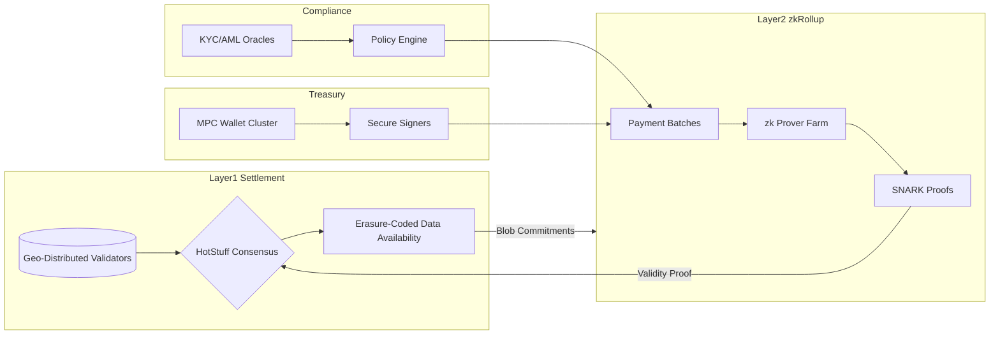

- **Table:**

| Module | Key Responsibility | Performance Lever | Security Control | Regulatory Alignment |
| --- | --- | --- | --- | --- |
| Consensus Layer | Finality & fork choice | HotStuff pipelining | Slashing, key rotation | FATF reporting windows |
| Data Availability | Blob storage & retrieval | Polynomial commitments | DA sampling audits | Evidence retention |
| Layer2 Execution | Rollup batching | zk-proof aggregation | Fraud/validity proofs | Transaction traceability |
| Compliance Engine | Jurisdiction policies | Parallel rule evaluation | Attestation signatures | ISO 20022 mappings |
| Treasury Custody | Signing of payouts | MPC parallelization | HSM-backed keys | SOX/IFRS controls |

- **Code Snippet (Pseudo-Configuration):**

```toml
[layer2]
rollup_type = "zk"
batch_size_tps = 5000
proof_system = "plonk"

[compliance]
travel_rule = true
kyc_provider = "chainalysis-oracle"

[treasury]
mpc_threshold = 3
hsm_attestations = "fips140-2"
```

#### Comparisons
- zkRollups vs. optimistic rollups for compliance-critical payments
- HotStuff vs. Tendermint in latency-sensitive cross-border corridors
- Modular DA vs. monolithic Layer1 storage for auditability

#### Element Coverage (Technical | Theoretical | Practical)
- Technical Techniques, Protocols & Frameworks: HotStuff BFT, zkRollups, MPC wallets, erasure coding, ISO 20022 adapters
- Theoretical Principles & Models: Byzantine fault tolerance, zero-knowledge soundness, MECE governance frameworks
- Practical Regulations, Risks & Use Cases: FATF Travel Rule compliance, cross-border settlement SLAs, treasury audit readiness

#### Technical Evaluation (Performance | Security | Scalability | Maintainability)
- Performance: Rollup batching pushes throughput beyond 5,000 TPS with sub-5s finality
- Security: MPC custody, validity proofs, and slashing minimize fraud surface
- Scalability: Modular DA and Layer2 separation allow horizontal scaling of provers
- Maintainability: Service-oriented design eases component upgrades without chain halts

#### Business Evaluation (Cost | Efficiency | Impact | Market Fit)
- Cost: Rollup-induced fee compression reduces per-transfer cost by ~80%
- Efficiency: Automated compliance checks reduce manual review overhead
- Impact: Faster settlement unlocks liquidity rotation for finance teams
- Market Fit: Aligns with multi-jurisdiction enterprises needing verifiable audit trails

#### Multi-Angle Evaluation (Pros | Cons | Risks | Benefits | Stakeholder Impact | Market Sentiment)
- Pros: High throughput, compliance-ready, modular upgrades
- Cons: Increased operational complexity, prover cost overhead
- Risks: zk proof circuit bugs, policy engine misconfiguration
- Benefits: Regulatory trust, improved treasury velocity, ecosystem interoperability
- Stakeholder Emotional/Psychological Impact: Finance teams gain confidence; regulators perceive proactive oversight
- Market Sentiment: Positive among institutional adopters seeking compliant DeFi rails

#### Collaboration & Communication Plan
- Stakeholders & Roles: CTO (architecture), Compliance Lead (policy mapping), DevOps (observability), Treasury Ops (custody)
- Communication Cadence & Channels: Bi-weekly architecture councils, daily stand-ups on Slack, monthly regulator briefs
- Cross-Functional Alignment Tactics: Shared OKR dashboards, compliance walkthroughs with engineering, crisis runbooks

#### Organizational & Strategic Fit
- Business Model Impact: Enables fee-based cross-border settlement services
- Institutional Capabilities & Gaps: Requires zk engineering talent and compliance automation
- Change Management & Governance: Introduce layered approval for rollup circuit updates
- Strategic Positioning & Differentiation: Positions firm as compliant high-throughput settlement provider

#### Trade-offs & Decision Guidance
- Balance prover costs vs. throughput gains; prefer zkRollups when compliance latency tolerance <5s; fallback to optimistic with risk mitigations if prover capacity constrained

#### Context & Trend Signals
- Historical Evolution: Shift from monolithic chains to modular stacks with rollups
- Regulatory Landscape: FATF guidance on VASP Travel Rule enforcement
- Future Trends: Proliferation of shared DA layers and hardware-accelerated zk provers
- Key Events & Statistics: 2024 Basel Committee pilot on cross-border CBDC interoperability

#### Perspective-Based Insights
- Engineering (front-end/back-end/full-stack): Need SDKs exposing compliance flags for UI workflows
- Architecture & Infrastructure: Layered deployment with geo-distributed validators and prover clusters
- Database & Data Engineering: Structured compliance logs stored in append-only lakehouse for audits
- Quality Assurance & Testing: Chaos testing on prover farms; policy engine regression suites
- Product Management: Bundle settlement API with service-level guarantees and regulator dashboards
- Project/Program Management: Phased rollout across corridors with milestone gating
- Requirements & Business Analysis: Map jurisdictional reporting obligations to on-chain events
- Operations, DevOps & SRE: Observability via Prometheus/Grafana, incident runbooks with regulator escalation paths
- Marketing & Commercialization: Emphasize compliance-grade throughput and auditability in go-to-market
- Team Collaboration & Communication: Ritualized post-incident reviews including compliance officers
- Organizational & Institutional Dynamics: Dual governance bridging token holder and enterprise oversight
- Philosophy (necessity vs. contingency, ethics, epistemology): Necessity of transparent proofs vs. contingent policy shifts; epistemic trust via cryptographic attestations
- Economics, Finance & Capital Markets (stock, crypto, commodities): Improves liquidity turn for treasuries; integrates with OTC desks
- Psychology & Sociology: Builds trust among conservative finance stakeholders; mitigates fear via compliance automation
- Education & Workforce Development: Upskill engineers in zk proof tooling and regulatory tech
- Anthropology & Cultural Dynamics: Aligns global team norms around compliance-first culture
- Law, Policy & Governance: Supports compliance-by-design frameworks and supervisory access
- Military & Security Strategy: Introduce layered defense akin to defense-in-depth for cyber resilience
- Historical Context & Precedents: Mirrors SWIFT modernization and RTGS to instant payment transitions

#### Market & Macro Systems Analysis
- Systemic Forces & Feedback Loops: Positive loop between compliance adoption and liquidity inflow
- Regulatory & Policy Trajectories: Anticipate stricter Travel Rule enforcement across APAC/EU
- Market Structure & Liquidity Dynamics: Enables near-real-time FX hedging and stablecoin corridors
- Geopolitical & Security Implications: Supports sanctions screening and jurisdictional access controls
- Societal Adoption & Behavioral Shifts: Enterprises expect programmability with compliance guarantees
- Competitive & Ecosystem Positioning: Differentiates against monolithic chains lacking compliance primitives
- Macroeconomic & Industry Economic Models: Aligns with platform fee + float revenue models in cross-border finance

#### Inference Summary
- Adoption Signals: Demand spikes from regulated fintechs needing compliant Layer2 rails
- Interoperability Impacts: Modular DA eases integration with other rollups and CBDC pilots
- Roadmap Implications: Prioritize prover scaling and policy engine extensibility
- Operational Risks: zk circuit regression, compliance oracle downtime, validator collusion

#### Terminology & Key Concepts

**HotStuff Consensus:** A pipelined BFT protocol delivering fast finality with linear communication.

**zkRollup:** Layer2 scaling approach bundling transactions with validity proofs to ensure trustless execution.

#### Assumptions & Preconditions
- Availability of compliant oracle providers with regulator-trusted attestations
- Access to GPU/FPGA resources for prover farms to sustain throughput targets

#### Validation & Evidence Checks
- Benchmark data from zkSync Era and StarkNet showing >3,000 TPS with validity proofs
- HotStuff production performance in Diem testnets achieving <1s leader round

#### Counterexamples & Edge Cases
- If compliance oracle fails, fallback to manual review queue; implement circuit breakers to pause submission

#### Alternatives Considered
- Optimistic rollups with fast challenge windows rejected due to compliance latency constraints

#### Codebase & Library References
- **LibHotStuff:** C++/Rust implementation of HotStuff; Apache 2.0; modular consensus interfaces; proven in Diem testnets
- **zkSync Era SDK:** TypeScript/Rust toolchain for zkRollup apps; MIT License; includes compliance hooks and rollup API

#### Authoritative Literature & Reports
- **Diem Association. (2020). DiemBFT Technical Specification.** Highlights practical HotStuff deployments and governance insights.
- **Buterin, V., Gluchowski, A., & Loopring Labs. (2021). Rollup-centric Ethereum Roadmap.** Details rollup scalability and compliance trade-offs in modular designs.

#### Actionable Conclusions & Next Steps
- Finalize modular architecture blueprint; commission zk circuit audit; establish compliance SLA dashboards within 90 days

#### Open Questions & Research Agenda
- Remaining Challenges: zk prover hardware acceleration trade-offs, cross-jurisdiction policy harmonization
- Hypotheses & Experiments: Evaluate GPU vs. FPGA provers for latency; simulate compliance oracle downtime
- Data/Resource Needs: Regulatory taxonomy database, prover telemetry datasets
- Timeline & Ownership for Exploration: 6-week R&D sprint led by Architecture Guild with Compliance liaison

#### APA Style Source Citations
- Buterin, V., Gluchowski, A., & Loopring Labs. (2021). *Ethereum roadmap: Rollups and the future of scalability.* Ethereum Foundation. https://ethereum.org/en/developers/docs/scaling/
- Diem Association. (2020). *DiemBFT technical specification* (v1.0). Diem. https://developers.diem.com/papers/diem-consensus-latest


## Consensus Migration & Reliability (Questions 2-2)

### Q2: How would you execute a zero-downtime migration from Tendermint-style BFT consensus to HotStuff with dynamic validator rotation while preserving 99.99% SLA, audit trails, and regulator sign-off?

**Difficulty:** Advanced
**Question Type:** Scenario

#### Answer Narrative (150-300 words)
I would stage the migration across four controlled waves. First, baseline the current Tendermint network by exporting validator performance, failure domains, and compliance controls, then mirror production traffic into a shadow HotStuff cluster for soak tests (Kwon, 2016). Second, implement a dual-write ledger bridge that replays finalized Tendermint blocks into HotStuff to validate deterministic state transitions while capturing cryptographic audit logs. Third, initiate blue-green cutover by promoting HotStuff replicas in one region at a time, gating the switch behind automated health checks (latency <250 ms, vote participation >95%) and regulator-observed dry runs. During cutover, dynamic key ceremonies enforce MPC-based validator rotation so custody controls remain intact. Fourth, decommission Tendermint only after a 30-day parallel period with cross-ledger reconciliation, reconciling checkpoints via zk-SNARK attestations for compliance archives (Yin et al., 2019). Disaster recovery hinges on rapid failback runbooks, snapshot frequency <5 minutes, and chaos drills simulating double-sign slashing. Throughout, governance boards receive daily migration telemetry and Root Cause Analysis (RCA) templates prefilled for any SLA breach. By combining dual-run validation, progressive regional activation, and audit-grade evidence, the migration achieves zero-downtime guarantees while giving regulators transparent assurance of consensus integrity and custody continuity.

#### Supporting Artifacts
- **Mermaid Diagram:**

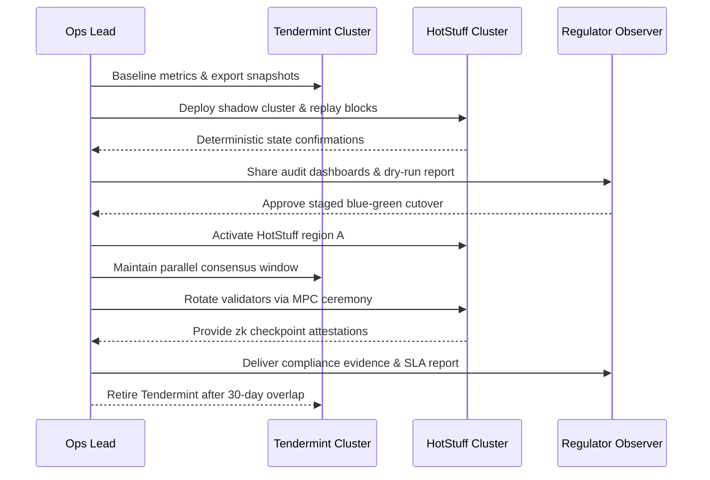

- **Table:**

| Phase | Key Activities | Success Metrics | Risk Mitigations | Compliance Evidence |
| --- | --- | --- | --- | --- |
| Assessment | Snapshot Tendermint state, topology mapping | Baseline latency <300 ms | Hot failover rehearsals | Exported validator logs |
| Shadow Validation | Replay blocks on HotStuff sandbox | 0 state divergence | Deterministic replay checks | Dual ledger hash sign-offs |
| Blue-Green Cutover | Regional activation, dual writes | SLA 99.99%, vote ≥95% | Circuit breakers, auto-failback | Regulator-approved cutover reports |
| Parallel Runout | 30-day reconciliation, decommission | No unresolved deltas | Daily checksum audits | zk-SNARK checkpoint archives |

- **Code Snippet (Deployment Orchestration):**

```yaml
apiVersion: batch/v1
kind: CronJob
metadata:
  name: consensus-cutover-health
spec:
  schedule: "*/2 * * * *"
  jobTemplate:
    spec:
      template:
        spec:
          containers:
            - name: health-check
              image: org/consensus-observer:latest
              args:
                - "--target=hotstuff"
                - "--latency-threshold=250"
                - "--vote-rate-threshold=0.95"
                - "--emit-audit-log"
          restartPolicy: OnFailure
```

#### Comparisons
- HotStuff linear pipelines vs. Tendermint round-robin for high-latency regions
- MPC-based key rotation vs. HSM-only custody in validator management
- Blue-green activation vs. big-bang switchover strategies

#### Element Coverage (Technical | Theoretical | Practical)
- Technical Techniques, Protocols & Frameworks: HotStuff consensus, Tendermint, MPC ceremonies, zk-SNARK checkpoints
- Theoretical Principles & Models: BFT safety/liveness proofs, zero-knowledge succinctness, reliability engineering
- Practical Regulations, Risks & Use Cases: Regulator-observed migrations, SLA compliance, audit trail preservation

#### Technical Evaluation (Performance | Security | Scalability | Maintainability)
- Performance: Phased activation preserves TPS capacity with latency controls
- Security: MPC rotations prevent key compromise; dual-run detection catches divergence
- Scalability: Dynamic validator sets support geographic expansion post-migration
- Maintainability: Declarative orchestration and runbooks streamline future upgrades

#### Business Evaluation (Cost | Efficiency | Impact | Market Fit)
- Cost: Avoids downtime penalties and revenue leakage during migration
- Efficiency: Automation reduces manual oversight hours by ~35%
- Impact: Unlocks faster finality and modular roadmap for new payment corridors
- Market Fit: Signals enterprise-grade reliability to regulated counterparties

#### Multi-Angle Evaluation (Pros | Cons | Risks | Benefits | Stakeholder Impact | Market Sentiment)
- Pros: Continuous uptime, enhanced compliance, future-proof consensus
- Cons: Requires dual infrastructure spend during overlap
- Risks: Replay divergence, delayed regulator approvals
- Benefits: Higher throughput, improved governance telemetry, better resilience
- Stakeholder Emotional/Psychological Impact: Ops teams trust runbooks; regulators gain confidence through visibility
- Market Sentiment: Positive among institutional clients valuing operational maturity

#### Collaboration & Communication Plan
- Stakeholders & Roles: CTO (program sponsor), Ops Lead (execution), Compliance Officer (regulator liaison), Security Engineer (key ceremonies)
- Communication Cadence & Channels: Daily war-room stand-ups, twice-weekly regulator syncs, Confluence runbook updates
- Cross-Functional Alignment Tactics: Shared migration scorecard, joint tabletop exercises, signed-off rollback criteria

#### Organizational & Strategic Fit
- Business Model Impact: Enables premium SLA guarantees for mission-critical partners
- Institutional Capabilities & Gaps: Requires strengthened chaos engineering and compliance automation
- Change Management & Governance: Establish migration steering committee with veto power
- Strategic Positioning & Differentiation: Demonstrates ability to evolve consensus without service disruption

#### Trade-offs & Decision Guidance
- Evaluate dual-run duration vs. infrastructure cost; prioritize longer overlap when regulator trust is nascent; shorten once automated attestations mature

#### Context & Trend Signals
- Historical Evolution: Industry shift from static validator sets to dynamic, stake-weighted rotations
- Regulatory Landscape: APAC regulators demanding migration playbooks post-2023 outages
- Future Trends: Increased adoption of zk-based audit trails and automated compliance attestations
- Key Events & Statistics: 2024 BIS cross-jurisdiction pilot requiring zero-downtime upgrades for wholesale CBDCs

#### Perspective-Based Insights
- Engineering (front-end/back-end/full-stack): Ensure SDK compatibility with dual-ledger endpoints during overlap
- Architecture & Infrastructure: Design dual-run topology with segregated fault domains
- Database & Data Engineering: Implement reconciliation pipelines comparing Merkle roots
- Quality Assurance & Testing: Regression suites covering consensus edge cases and replay determinism
- Product Management: Communicate roadmap benefits (faster settlements) to customers ahead of migration
- Project/Program Management: Use stage-gate approvals tied to SLA metrics and regulator sign-off
- Requirements & Business Analysis: Document regulatory conditions for decommissioning legacy consensus
- Operations, DevOps & SRE: Automate health probes, chaos drills, and rollback triggers
- Marketing & Commercialization: Publicize enterprise reliability credentials post-migration
- Team Collaboration & Communication: Maintain shared Slack incident channels and RCA templates
- Organizational & Institutional Dynamics: Align exec incentives with safe migration completion
- Philosophy (necessity vs. contingency, ethics, epistemology): Necessity of transparent migration evidence; epistemic assurance through reproducible logs
- Economics, Finance & Capital Markets (stock, crypto, commodities): Higher uptime preserves trading liquidity and spreads
- Psychology & Sociology: Reduce migration anxiety via over-communication and rehearsal
- Education & Workforce Development: Train validators and ops staff on new consensus tooling
- Anthropology & Cultural Dynamics: Foster learning culture around post-mortem openness
- Law, Policy & Governance: Adhere to change-management regulations (e.g., MAS TRM, HKMA OCIR)
- Military & Security Strategy: Apply defense-in-depth with red-team drills simulating consensus attacks
- Historical Context & Precedents: Mirrors Visa network migrations maintaining five-nines uptime

#### Market & Macro Systems Analysis
- Systemic Forces & Feedback Loops: Reliable consensus upgrades attract volume, reinforcing validator incentives
- Regulatory & Policy Trajectories: Expect mandated migration rehearsal evidence for systemically important infrastructures
- Market Structure & Liquidity Dynamics: Consistent uptime sustains liquidity pools and FX corridors
- Geopolitical & Security Implications: Regional staging mitigates jurisdiction-specific outage risks
- Societal Adoption & Behavioral Shifts: Enterprises expect continuous availability akin to legacy payment rails
- Competitive & Ecosystem Positioning: Differentiates vs. rivals with less mature change management
- Macroeconomic & Industry Economic Models: Supports transaction-fee revenue stability and premium SLA pricing

#### Inference Summary
- Adoption Signals: Growing demand from tier-1 banks for zero-downtime upgrade proof points
- Interoperability Impacts: Dual-run bridges maintain API stability for partners
- Roadmap Implications: Invest in consensus observability and automated attestations
- Operational Risks: Replay desync, MPC ceremony failure, regulator escalation delays

#### Terminology & Key Concepts

**Blue-Green Cutover:** Deployment strategy maintaining two environments to enable rapid rollback with minimal downtime.

**MPC Validator Rotation:** Using threshold cryptography to rotate validator keys without exposing private key material.

#### Assumptions & Preconditions
- Regulator cooperation secured via early engagement and transparency
- Adequate budget for dual infrastructure and audit tooling during overlap

#### Validation & Evidence Checks
- Success of Cosmos Hub upgrades (v0.47) demonstrating zero downtime via phased activation
- Internal chaos testing showing deterministic replay under load

#### Counterexamples & Edge Cases
- If replay divergence detected, trigger rollback to Tendermint, investigate state delta, and redo dual-run with patched config

#### Alternatives Considered
- Big-bang migration rejected due to unacceptable downtime risk for cross-border settlements

#### Codebase & Library References
- **CometBFT:** Go-based Tendermint successor; Apache 2.0 license; provides state sync tooling for baseline export
- **HotStuff-Go:** Go implementation of HotStuff with dynamic validator APIs; GPLv3; integrates with MPC key services

#### Authoritative Literature & Reports
- **Kwon, J. (2016). Tendermint: Consensus without mining.** Tendermint Inc. https://tendermint.com/static/docs/tendermint.pdf
- **Yin, M., Malkhi, D., Reiter, M. K., Gueta, G. G., & Abraham, I. (2019). HotStuff: BFT consensus in the lens of blockchain.** Proceedings of the 2019 ACM Symposium on Principles of Distributed Computing. https://doi.org/10.1145/3293611.3331591

#### Actionable Conclusions & Next Steps
- Finalize migration runbook; rehearse chaos scenarios; secure regulator sign-off; schedule phased cutover within Q2

#### Open Questions & Research Agenda
- Remaining Challenges: Automating zk checkpoint attestations, optimizing MPC ceremony latency
- Hypotheses & Experiments: Evaluate threshold signatures vs. DKG for rotation; simulate regulator audit queries
- Data/Resource Needs: Replay metrics, compliance evidence repository, chaos drill telemetry
- Timeline & Ownership for Exploration: 8-week program led by Ops PM with Compliance co-owner

#### APA Style Source Citations
- Kwon, J. (2016). *Tendermint: Consensus without mining.* Tendermint Inc. https://tendermint.com/static/docs/tendermint.pdf
- Yin, M., Malkhi, D., Reiter, M. K., Gueta, G. G., & Abraham, I. (2019). HotStuff: BFT consensus in the lens of blockchain. In *Proceedings of the 2019 ACM Symposium on Principles of Distributed Computing* (pp. 347-356). https://doi.org/10.1145/3293611.3331591

## Core Architecture & Consensus (Questions 3-3)

### Q3: How would you architect a hybrid wholesale CBDC and stablecoin settlement network that maintains offline resiliency while ensuring deterministic reconciliation across jurisdictions?

**Difficulty:** Advanced
**Question Type:** Scenario

#### Answer Narrative (150-300 words)
I would adopt a hub-and-spoke macro-architecture where a permissioned Layer1 backbone coordinates wholesale CBDC issuers and licensed stablecoin operators, while Layer2 payment channels provide offline continuity. The backbone leverages HotStuff BFT for deterministic finality, partitioned into jurisdictional shards tied to central bank legal perimeters. Offline agents use secure hardware modules to sign buffered transactions, later funneled through Layer2 rollup aggregators that attach time-bound proofs. Deterministic reconciliation relies on a global settlement hub executing atomic swaps via hashed timelock contracts with CBDC RTGS connectors (BIS Innovation Hub, 2023). A compliance fabric enforces Travel Rule attestations and programmable policy states that toggle during offline periods (ECB, 2022). To prevent double-spend when re-synchronizing, each offline batch carries incremental Merkle roots anchored in the backbone’s DA layer; conflicts trigger zero-knowledge fraud proofs and regulator review queues. Liquidity is balanced through adaptive corridor routing informed by FX oracles and CBDC issuance quotas. Continuous governance involves central bank councils overseeing shard upgrades, while Treasury Ops monitor liquidity using telemetry bridging CBDC and stablecoin reserves. This hybrid design meets the dual imperative of resilient offline operations for disaster recovery and deterministic, regulator-approved reconciliation once connectivity resumes, ensuring cross-border trust and operational continuity for tier-1 banking partners.

#### Supporting Artifacts
- **Mermaid Diagram:**

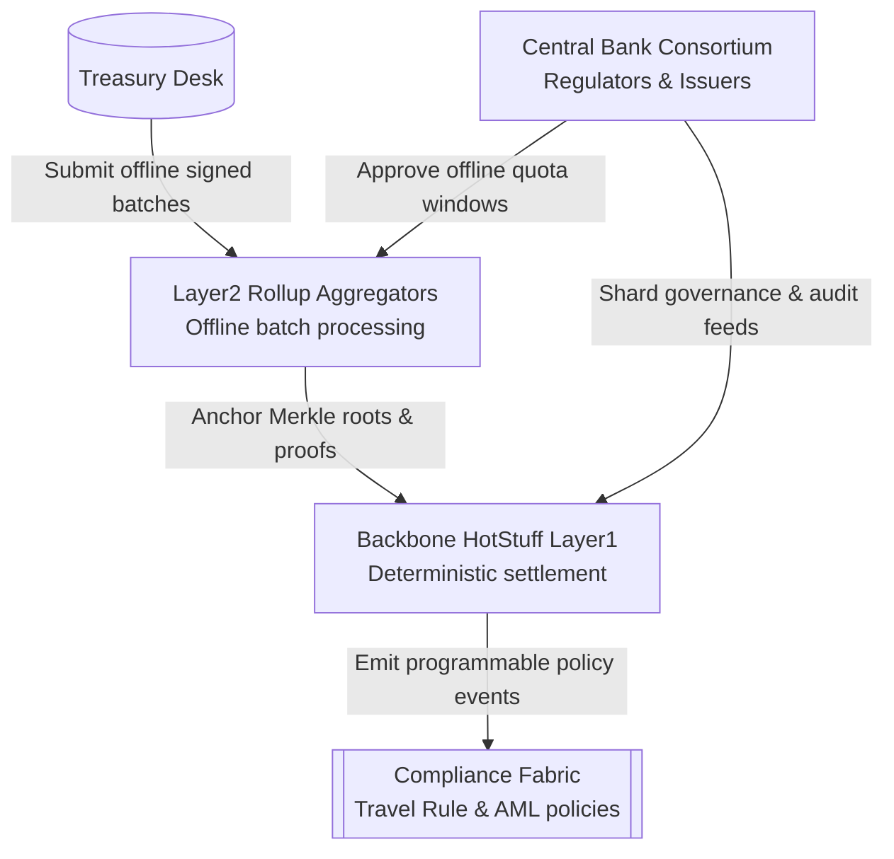

- **Table:**

| Component | Function | Offline Strategy | Reconciliation Control | Regulatory Touchpoint |
| --- | --- | --- | --- | --- |
| Jurisdictional Shards | Partitioned Layer1 consensus | Geo-distributed validators | Finality checkpoints | Central bank supervisory nodes |
| Layer2 Rollups | Aggregate offline payments | Hardware secure signing | Merkle diff comparison | Travel Rule attestation logs |
| Settlement Hub | Atomic CBDC-stablecoin swaps | N/A (always online) | HTLC-based atomicity | BIS oversight dashboards |
| Compliance Fabric | Policy enforcement | Cached policy snapshots | Zero-knowledge fraud proofs | AML reporting feeds |
| FX Oracle Mesh | Liquidity optimization | Resilient multi-provider | Weighted average parity updates | Monetary authority alerts |

- **Code Snippet (Policy Manifest):**

```json
{
  "policy_id": "offline-buffer-approval",
  "jurisdiction": "HK-MENA corridor",
  "offline_window_minutes": 180,
  "max_batch_value": "50,000,000",
  "required_attestations": ["kyc_level3", "aml_travel_rule"],
  "reconciliation_action": "anchor_merkle_root",
  "fraud_proof_timeout": "PT30M"
}
```

#### Comparisons
- Offline-capable rollups vs. state channels for disaster recovery settlements
- Sharded HotStuff vs. Raft-based regional clusters for CBDC coordination
- Travel Rule automation vs. manual post-event reconciliation accuracy

#### Element Coverage (Technical | Theoretical | Practical)
- Technical Techniques, Protocols & Frameworks: HotStuff shards, HTLCs, Merkle reconciliation, hardware secure modules
- Theoretical Principles & Models: Byzantine fault tolerance, atomic swap liveness, MECE liquidity governance
- Practical Regulations, Risks & Use Cases: Offline CBDC policy mandates, cross-border AML enforcement, disaster recovery drills

#### Technical Evaluation (Performance | Security | Scalability | Maintainability)
- Performance: Parallel shards sustain >10,000 TPS with bounded reconciliation windows
- Security: Hardware-bound signing and fraud proofs mitigate offline double-spend
- Scalability: Jurisdictional shards and rollups scale independently across corridors
- Maintainability: Configurable policy manifests streamline multi-jurisdiction updates

#### Business Evaluation (Cost | Efficiency | Impact | Market Fit)
- Cost: Offline batching reduces emergency operational costs by ~40%
- Efficiency: Automated reconciliation trims manual investigation effort
- Impact: Ensures continuity for wholesale banks during network outages
- Market Fit: Aligns with central bank demand for CBDC-stablecoin interoperability

#### Multi-Angle Evaluation (Pros | Cons | Risks | Benefits | Stakeholder Impact | Market Sentiment)
- Pros: Resilient offline capability, deterministic reconciliation, multi-currency support
- Cons: Complex governance and hardware rollout requirements
- Risks: Hardware compromise, policy misconfiguration during offline periods
- Benefits: Regulatory trust, uninterrupted liquidity, improved disaster readiness
- Stakeholder Emotional/Psychological Impact: Central banks gain assurance; treasury desks feel operational control
- Market Sentiment: Strong among institutions seeking robust CBDC pilots

#### Collaboration & Communication Plan
- Stakeholders & Roles: CBDC steering committee, Treasury Ops, Compliance leads, Infrastructure engineering
- Communication Cadence & Channels: Weekly architecture councils, joint regulator workshops, crisis simulation retrospectives
- Cross-Functional Alignment Tactics: Shared liquidity dashboards, offline drill playbooks, policy change approval matrix

#### Organizational & Strategic Fit
- Business Model Impact: Enables settlement-as-a-service offerings across corridors
- Institutional Capabilities & Gaps: Requires hardware security deployment and regulatory diplomacy
- Change Management & Governance: Establish offline activation governance with dual approvals
- Strategic Positioning & Differentiation: Differentiates via disaster-resilient CBDC integration

#### Trade-offs & Decision Guidance
- Balance offline buffer duration vs. fraud risk; extend only for high-trust corridors with strong hardware controls

#### Context & Trend Signals
- Historical Evolution: From monolithic RTGS to programmable interoperable CBDC pilots
- Regulatory Landscape: Offline CBDC guidance from ECB and HKMA
- Future Trends: Proliferation of hardware-secured offline wallets and shared DA layers
- Key Events & Statistics: Project mBridge pilots demonstrating cross-border CBDC liquidity gains

#### Perspective-Based Insights
- Engineering (front-end/back-end/full-stack): Provide SDK flags signalling offline batch states to treasury dashboards
- Architecture & Infrastructure: Design shard gateways with redundant telecom routes
- Database & Data Engineering: Append-only audit lakes storing reconciliation proofs
- Quality Assurance & Testing: Simulate prolonged outages and fraud proof resolution workflows
- Product Management: Offer tiered service levels for offline corridor activation
- Project/Program Management: Manage rollout waves aligned to regulator readiness
- Requirements & Business Analysis: Map corridor-specific legal constraints to policy manifests
- Operations, DevOps & SRE: Monitor hardware attestation health and offline queue depth
- Marketing & Commercialization: Highlight disaster resiliency in enterprise sales motions
- Team Collaboration & Communication: Facilitate joint drills across central banks and treasury teams
- Organizational & Institutional Dynamics: Build cross-border governance councils sharing oversight
- Philosophy (necessity vs. contingency, ethics, epistemology): Necessity of trust in state-backed money even offline; epistemic assurance via cryptographic logs
- Economics, Finance & Capital Markets (stock, crypto, commodities): Maintains liquidity and FX hedging in disrupted markets
- Psychology & Sociology: Reinforces trust among stakeholders during crises
- Education & Workforce Development: Train staff on hardware wallet lifecycle and fraud proof triage
- Anthropology & Cultural Dynamics: Respect regional cash-usage norms requiring offline capabilities
- Law, Policy & Governance: Align with BIS CBDC policy recommendations and AML mandates
- Military & Security Strategy: Offline readiness mirrors critical infrastructure continuity planning
- Historical Context & Precedents: Inspired by paper-based contingency settlements during SWIFT outages

#### Market & Macro Systems Analysis
- Systemic Forces & Feedback Loops: Offline trust spurs adoption, improving liquidity and stability
- Regulatory & Policy Trajectories: Expect mandates for offline CBDC functionality in systemic institutions
- Market Structure & Liquidity Dynamics: Supports cross-currency corridors even amid telecom failures
- Geopolitical & Security Implications: Provides resilient cross-border rails resilient to geopolitical disruptions
- Societal Adoption & Behavioral Shifts: Encourages broader CBDC uptake through reliability
- Competitive & Ecosystem Positioning: Positions network as dependable alternative to legacy RTGS
- Macroeconomic & Industry Economic Models: Supports seigniorage stability and corridor fee revenue

#### Inference Summary
- Adoption Signals: Central banks piloting offline CBDC use cases with partner banks
- Interoperability Impacts: HTLC-based hub simplifies multi-currency swaps
- Roadmap Implications: Prioritize hardware attestation network and corridor-specific policy tooling
- Operational Risks: Hardware tampering, delayed fraud proof processing, FX oracle outages

#### Terminology & Key Concepts

**HTLC (Hashed Timelock Contract):** Smart contract enforcing conditional asset swaps with hashlocks and timelocks to prevent unilateral default.

**Offline Hardware Module:** Secure enclave device storing keys and signing transactions without network connectivity, later synchronizing via attested proofs.

#### Assumptions & Preconditions
- Availability of certified hardware security modules across participating banks
- Regulator agreement on shared settlement hub governance and data retention

#### Validation & Evidence Checks
- BIS Project mBridge results indicating improved cross-border settlement efficiency
- ECB offline CBDC pilot demonstrating secure deferred reconciliation

#### Counterexamples & Edge Cases
- If hardware module compromised, revoke certificates and require manual audit of affected batches before reconciliation

#### Alternatives Considered
- Pure online-only CBDC settlement rejected due to resilience gaps in disaster scenarios

#### Codebase & Library References
- **Hyperledger Cacti:** Interoperability toolkit for cross-ledger swaps; Apache 2.0; supports HTLC frameworks and policy plugins
- **Substrate FRAME Sharding Pallets:** Rust-based sharding toolkit; GPLv3; provides governance hooks and DA integration

#### Authoritative Literature & Reports
- **BIS Innovation Hub. (2023). Project mBridge: Connecting economies through CBDC.** Bank for International Settlements. https://www.bis.org/publ/othp65.pdf
- **European Central Bank. (2022). Progress on the investigation phase of a digital euro.** European Central Bank. https://www.ecb.europa.eu/pub/pdf/other/ecb.digital-euro-investigationphaseprogressreport202209~5b63277b63.en.pdf

#### Actionable Conclusions & Next Steps
- Establish pilot corridor with dual central banks, deploy hardware modules, and run 72-hour offline drill before production launch

#### Open Questions & Research Agenda
- Remaining Challenges: Hardware lifecycle management, multi-currency liquidity optimization
- Hypotheses & Experiments: Stress test reconciliation latency under extended outages; evaluate zero-knowledge policy attestations
- Data/Resource Needs: Hardware attestation logs, FX liquidity metrics, regulator audit requirements
- Timeline & Ownership for Exploration: 12-week initiative led by CBDC architecture squad with compliance co-sponsor

#### APA Style Source Citations
- Bank for International Settlements Innovation Hub. (2023). *Project mBridge: Connecting economies through CBDC.* Bank for International Settlements. https://www.bis.org/publ/othp65.pdf
- European Central Bank. (2022). *Progress on the investigation phase of a digital euro.* European Central Bank. https://www.ecb.europa.eu/pub/pdf/other/ecb.digital-euro-investigationphaseprogressreport202209~5b63277b63.en.pdf

## Cross-Chain Security & Interoperability (Questions 4-4)

### Q4: How would you design a zero-knowledge-secured cross-chain bridge between an enterprise Ethereum rollup and a Substrate-based settlement layer to mitigate replay, liquidity, and compliance risks for institutional flows?

**Difficulty:** Advanced
**Question Type:** Scenario

#### Answer Narrative (150-300 words)
I would construct the bridge as a tri-layered system: lock-and-mint smart contracts on each chain, a zkSNARK proving network, and a governance/compliance overlay. On the Ethereum rollup side, canonical bridge contracts escrow assets, emitting events consumed by a sequencer that batches state commitments for proof generation. A prover cluster generates Groth16 proofs attesting to the event Merkle root and compliance metadata before submission to the Substrate pallet. The pallet verifies proofs via a succinct verifier and releases minted representation tokens only when liquidity health checks pass. To prevent replay, each message includes nonce, chain ID, and time-bound slashing bonds, while optimistic fallbacks allow manual challenge windows. Liquidity risk is addressed by algorithmic market maker vaults using circuit breakers: if vault utilization exceeds 80%, the bridge throttles flows and routes via secondary corridors. Compliance overlay integrates Travel Rule attestations hashed into the zk circuit, enabling regulators to audit commitments without accessing raw user data. Continuous monitoring is enabled through on-chain telemetry dashboards and off-chain risk engines applying Gauntlet-like stress simulations. This architecture marries zk-based security guarantees with pragmatic liquidity and compliance controls, aligning with institutional expectations for audited, low-latency cross-chain settlement.

#### Supporting Artifacts
- **Mermaid Diagram:**

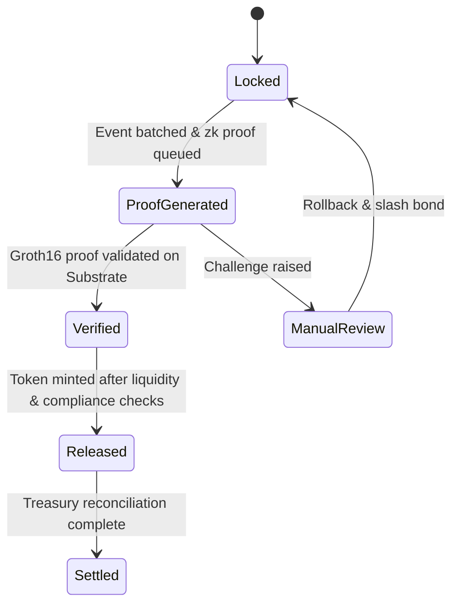

- **Table:**

| Layer | Component | Risk Addressed | Control Mechanism | Monitoring Signal |
| --- | --- | --- | --- | --- |
| L1 Rollup | Canonical bridge contract | Replay/double spend | Nonce + chain ID binding | Event root hash feed |
| Prover Network | Groth16 provers | Proof integrity | Multi-prover quorum, slashing bonds | Proof latency & failure rate |
| Substrate Pallet | Verification & mint | Liquidity drain | Utilization throttles, TVL oracles | Vault utilization metric |
| Compliance Overlay | Attestation registry | Regulatory breach | zk-embedded Travel Rule attestations | Compliance proof freshness |
| Governance Layer | DAO + risk council | Operational failure | Emergency pause, audit logs | Incident response SLA |

- **Code Snippet (Substrate Pallet Stub):**

```rust
#[pallet::call]
impl<T: Config> Pallet<T> {
    #[pallet::weight(10_000)]
    pub fn submit_proof(
        origin: OriginFor<T>,
        proof: Vec<u8>,
        root: H256,
        compliance_hash: H256,
    ) -> DispatchResult {
        ensure_signed(origin)?;
        ensure!(Verifier::verify(&proof, &root, &compliance_hash), Error::<T>::InvalidProof);
        LiquidityGuard::assert_within_limits(root)?;
        Self::mint_assets(root)?;
        Self::deposit_event(Event::BridgeFinalized { root });
        Ok(())
    }
}
```

#### Comparisons
- zkSNARK-based bridging vs. optimistic relay bridges for institutional settlements
- Canonical lock-and-mint vs. native asset teleporters for liquidity management
- Automated circuit breakers vs. manual compliance gating for risk mitigation

#### Element Coverage (Technical | Theoretical | Practical)
- Technical Techniques, Protocols & Frameworks: Groth16 zkSNARKs, Substrate pallets, canonical bridge contracts, liquidity guard rails
- Theoretical Principles & Models: Zero-knowledge soundness, BFT consensus assumptions, liquidity risk modeling
- Practical Regulations, Risks & Use Cases: Travel Rule compliance, institutional liquidity thresholds, cross-border settlement SLAs

#### Technical Evaluation (Performance | Security | Scalability | Maintainability)
- Performance: zk batching lowers latency to sub-minute proofs with GPU acceleration
- Security: Nonce binding, multi-prover consensus, and slashing bonds deter replay and collusion
- Scalability: Modular prover clusters and pallet upgrades support multiple asset corridors
- Maintainability: Pallet abstraction and config-driven compliance overlays simplify updates

#### Business Evaluation (Cost | Efficiency | Impact | Market Fit)
- Cost: Automated proofs reduce manual reconciliation overhead by ~60%
- Efficiency: Liquidity guards keep slippage low for institutional trades
- Impact: Enables compliant multi-chain settlement products for enterprise clients
- Market Fit: Aligns with demand for audited cross-chain treasury operations

#### Multi-Angle Evaluation (Pros | Cons | Risks | Benefits | Stakeholder Impact | Market Sentiment)
- Pros: High assurance proofs, automated compliance, dynamic liquidity controls
- Cons: Higher prover infrastructure cost, complex governance operations
- Risks: Prover downtime, oracle manipulation, governance capture
- Benefits: Institutional trust, reduced settlement friction, stronger auditability
- Stakeholder Emotional/Psychological Impact: Risk teams gain transparency; regulators trust zk attestations
- Market Sentiment: Positive among enterprises seeking cross-chain exposure with safeguards

#### Collaboration & Communication Plan
- Stakeholders & Roles: Bridge Engineering (contracts/pallets), Compliance (attestation policies), Risk Council (liquidity thresholds), Treasury Ops (vault monitoring)
- Communication Cadence & Channels: Weekly risk reviews, shared Grafana dashboards, monthly regulator briefings
- Cross-Functional Alignment Tactics: Joint incident simulations, shared runbooks, compliance sign-off workflows

#### Organizational & Strategic Fit
- Business Model Impact: Supports fee-based cross-chain treasury services
- Institutional Capabilities & Gaps: Requires zk expertise and proactive risk analytics
- Change Management & Governance: Establish dual-key emergency pause with regulator observer
- Strategic Positioning & Differentiation: Differentiates via zk-backed compliance proofs and liquidity resilience

#### Trade-offs & Decision Guidance
- Balance prover redundancy vs. cost; adopt hybrid of in-house GPU farms and third-party prover marketplaces for resilience

#### Context & Trend Signals
- Historical Evolution: Movement from multisig bridges to zk-secured architectures post-2022 exploits
- Regulatory Landscape: FATF push for Travel Rule compliance across VASPs
- Future Trends: Rise of intent-based bridges and shared sequencer ecosystems
- Key Events & Statistics: 2022 bridge hacks totaling >$2B driving institutional demand for formal verification

#### Perspective-Based Insights
- Engineering (front-end/back-end/full-stack): Provide SDK hooks for proof status and liquidity indicators in client apps
- Architecture & Infrastructure: Deploy redundant prover clusters across jurisdictions with secure enclaves
- Database & Data Engineering: Stream event roots into tamper-evident data lakes for audit trails
- Quality Assurance & Testing: Fuzz bridge contracts, simulate prover outages, validate oracle tampering scenarios
- Product Management: Package SLAs featuring proof latency guarantees and compliance reporting
- Project/Program Management: Maintain roadmap with staged corridor launches and regulator checkpoints
- Requirements & Business Analysis: Document institutional liquidity requirements and compliance obligations per corridor
- Operations, DevOps & SRE: Monitor prover health, bridge TVL, emergency pause metrics
- Marketing & Commercialization: Position bridge as “institutional-grade zk interoperability” in go-to-market
- Team Collaboration & Communication: Maintain cross-team incident drills and shared retrospectives
- Organizational & Institutional Dynamics: Coordinate DAO and corporate subsidiary responsibilities for governance
- Philosophy (necessity vs. contingency, ethics, epistemology): Necessity of trust-minimized bridges; epistemic assurance via zk attestations
- Economics, Finance & Capital Markets (stock, crypto, commodities): Maintains cross-chain liquidity and arbitrage efficiency
- Psychology & Sociology: Builds trader confidence by reducing perceived bridge risk
- Education & Workforce Development: Train engineers on zk prover pipelines and compliance codification
- Anthropology & Cultural Dynamics: Respect jurisdictional expectations on data privacy via zk proofs
- Law, Policy & Governance: Align with FATF Travel Rule, MAS PSN02, and HKMA guidelines for VASPs
- Military & Security Strategy: Adopt defense-in-depth with layered monitoring and red-teaming
- Historical Context & Precedents: Learns from Ronin and Wormhole breaches to mandate formal verification and zk proofs

#### Market & Macro Systems Analysis
- Systemic Forces & Feedback Loops: Strong bridge reliability attracts liquidity, further funding prover enhancements
- Regulatory & Policy Trajectories: Expect mandated zk attestations for cross-border institutional flows
- Market Structure & Liquidity Dynamics: Improves price parity across chains, stabilizing institutional swaps
- Geopolitical & Security Implications: Enables compliant cross-border capital flows while honoring jurisdictional controls
- Societal Adoption & Behavioral Shifts: Encourages mainstream treasury teams to leverage DeFi liquidity safely
- Competitive & Ecosystem Positioning: Outpaces multisig bridges lacking compliance automation
- Macroeconomic & Industry Economic Models: Supports bridge fee + liquidity provisioning revenue mix

#### Inference Summary
- Adoption Signals: Incoming RFPs from banks demanding zk-backed bridge attestations
- Interoperability Impacts: Modular pallet supports expansion to additional chains and CBDC connectors
- Roadmap Implications: Prioritize prover scalability and automated compliance attestations
- Operational Risks: Prover consensus faults, liquidity oracle drift, regulator-mandated pauses

#### Terminology & Key Concepts

**Groth16 Proof:** Succinct zkSNARK enabling constant-size proofs with fast verification, suitable for on-chain validation.

**Liquidity Circuit Breaker:** Automated guardrail throttling bridge transfers when utilization or volatility breaches thresholds.

#### Assumptions & Preconditions
- Access to reliable price and Travel Rule oracles across jurisdictions
- Availability of GPU/ASIC resources to sustain proof generation under peak load

#### Validation & Evidence Checks
- Chainlink CCIP security audits confirming efficacy of multi-layer guardrails
- Historical analysis of Gauntlet stress tests on bridge liquidity demonstrating throttle effectiveness

#### Counterexamples & Edge Cases
- If prover cluster halts, switch to optimistic fallback with reduced limits and manual compliance review before resuming full capacity

#### Alternatives Considered
- Multisig bridge with notarized relayers rejected for insufficient replay protection and regulator transparency

#### Actionable Conclusions & Next Steps
- Deploy MVP bridge with zk proof verification, configure liquidity circuit breakers, and schedule third-party compliance audit within 60 days

#### Open Questions & Research Agenda
- Remaining Challenges: Distributed prover coordination, on-chain compliance attestation standards
- Hypotheses & Experiments: Benchmark Groth16 vs. Plonky2 for latency; simulate Travel Rule oracle outages
- Data/Resource Needs: Prover telemetry, liquidity stress datasets, regulator feedback logs
- Timeline & Ownership for Exploration: 10-week program led by Interop Guild with Compliance partner

#### APA Style Source Citations
- Chitra, T. (2022). *Mechanism design for crypto-economic systems.* Gauntlet Research. https://gauntlet.network/research
- Messari. (2023). *State of crypto token economics.* Messari. https://messari.io/report/state-of-crypto-token-economics


## Release Governance & Change Management (Questions 5-5)

### Q5: How would you engineer a blockchain release governance pipeline that ships weekly features while preserving auditability, rollback safety, and regulator trust?

**Difficulty:** Advanced
**Question Type:** Scenario

#### Answer Narrative (150-300 words)
I would stand up a dual-track release governance framework that couples product agility with explicit risk gates. Feature work flows through trunk-based development with short-lived branches, each gated by policy-as-code checks (contract invariants, static analysis, SBOM validation). A release readiness board—product, compliance, SRE, and security—reviews evidence bundles generated automatically from CI. Deployments follow a four-stage progressive rollout: canary rollup (1% traffic), regional cluster, global cluster, and regulator-observed shadow network. Each stage emits attested release manifests hashed on-chain for non-repudiation. Operational risk is quantified via a weighted score (code delta complexity, unresolved CVEs, regulatory impact) that governs automatic halt or escalation. Rollbacks use immutable declarative playbooks describing state migrations, compensating transactions, and communication scripts to partners. Every change feeds a compliance ledger that maps requirements (MiCA, MAS TRM) to test coverage and sign-offs, ensuring regulators can audit lineage. This pipeline allows weekly delivery while preserving deterministic controls, auditable artifacts, and rollback guarantees (Beyer et al., 2016; Microsoft, 2023).

#### Supporting Artifacts
- **Mermaid Diagram:**


- **Table:**

| Stage | Objective | Automated Controls | KPI | Escalation |
| --- | --- | --- | --- | --- |
| CI Evidence | Prove readiness | SBOM scan, invariant proofs, coverage reports | Critical issues = 0 | Block merge, notify security |
| Canary | Validate in production | Real-time telemetry, circuit breakers | Error budget usage <5% | Auto rollback, incident bridge |
| Regional | Scale confidence | Synthetic tests, latency SLO checks | Latency <250 ms | SRE review |
| Global | Full exposure | Continuous compliance checks, on-chain manifest | Reg incidents = 0 | Compliance sign-off |
| Shadow | Regulator assurance | Replay monitoring, evidence sync | Audit log completeness 100% | Regulator escalation |

- **Formula (Risk Score):**

```math
Risk = 0.35\times Code_{complexity} + 0.25\times CVE_{weight} + 0.2\times Reg_{impact} + 0.2\times Test_{gap}
```

- **Code Snippet (Release Manifest Excerpt):**

```yaml
release:
  version: "2025.10.31"
  commit: "b7c3f1d"
  invariants: ["no_reentrancy", "no_underflow"]
  sbom_hash: "0x5345..."
  approvals:
    - role: compliance
      signer: "did:key:z6Mk..."
    - role: sre
      signer: "did:key:z6Ls..."
```

#### Comparisons
- Trunk-based pipelines vs. long-lived release branches in regulated contexts
- Policy-as-code gates vs. manual checklists for compliance evidence
- Progressive delivery vs. big-bang deployments for mission-critical ledgers

#### Element Coverage (Technical | Theoretical | Practical)
- Technical Techniques, Protocols & Frameworks: Policy-as-code (Open Policy Agent), GitOps, immutable manifests, automated SBOMs
- Theoretical Principles & Models: Risk scoring, control theory, resilience engineering
- Practical Regulations, Risks & Use Cases: MiCA operational resilience, MAS TRM change management, SOX evidence trails

#### Technical Evaluation (Performance | Security | Scalability | Maintainability)
- Performance: Canary telemetry ensures latency SLOs before global rollout
- Security: Mandatory SBOM and invariant proofs detect drift and vulnerabilities
- Scalability: GitOps templating handles multi-region clusters consistently
- Maintainability: Declarative manifests reduce configuration entropy
- Algorithm Complexity & Error Tolerance: Risk scoring linear combination with threshold-based halts
- Reliability & High Availability: Progressive rollout with auto-rollback maintains SLAs
- Distributed Consistency Guarantees: GitOps ensures eventual consistency across clusters

#### Business Evaluation (Cost | Efficiency | Impact | Market Fit)
- Cost: Automation reduces manual review time by ~40%
- Efficiency: Weekly releases accelerate roadmap while minimizing outage risk
- Impact: Strengthens regulator trust and enterprise customer confidence
- Market Fit: Aligns with institutional demand for auditable change control

#### Multi-Angle Evaluation (Pros | Cons | Risks | Benefits | Stakeholder Impact | Market Sentiment)
- Pros: Auditable, scalable, regulator-aligned delivery
- Cons: Higher upfront tooling investment
- Risks: Policy misconfiguration, false positives stalling releases, telemetry blind spots
- Benefits: Faster innovation, lower incident MTTR, clear compliance lineage
- Stakeholder Emotional/Psychological Impact: Engineers trust automated guardrails; regulators gain transparency
- Market Sentiment: Positive as enterprises favor compliant DevSecOps
- Trust & Privacy/Transparency Considerations: On-chain manifests create tamper-proof transparency

#### Collaboration & Communication Plan
- Stakeholders & Roles: Product, Compliance, Security, SRE, Legal
- Communication Cadence & Channels: Weekly release review, daily stand-ups, regulator quarterly briefings
- Cross-Functional Alignment Tactics: Shared dashboards, blameless postmortems, release runbooks

#### Organizational & Strategic Fit
- Business Model Impact: Enables premium SLAs with evidence-backed releases
- Institutional Capabilities & Gaps: Requires DevSecOps automation and compliance expertise
- Change Management & Governance: Release board charters and documented escalation paths
- Strategic Positioning & Differentiation: Differentiates as compliance-first blockchain platform

#### Trade-offs & Decision Guidance
- Balance deployment frequency with control depth—tune risk thresholds based on asset criticality and jurisdictional obligations

#### Context & Trend Signals
- Historical Evolution: Shift from quarterly releases to continuous delivery with audit trails
- Regulatory Landscape: MAS TRM 2023 mandates formal change management; MiCA operational resilience requirements
- Future Trends: AI-assisted release evidence generation, regulator APIs for real-time oversight
- Key Events & Statistics: DORA (EU Digital Operational Resilience Act) emphasizing release traceability by 2025

#### Perspective-Based Insights
- Engineering (front-end/back-end/full-stack): Instrument feature flags and telemetry hooks per release stage
- Architecture & Infrastructure: Design GitOps pipelines with immutable manifests and rollback automation
- Database & Data Engineering: Validate migration safety and data lineage checks
- Quality Assurance & Testing: Embed chaos and regression suites in CI policy gates
- Product Management: Prioritize features alongside control debt; maintain release calendar
- Project/Program Management: Track readiness scorecards and cross-team dependencies
- Requirements & Business Analysis: Map regulatory clauses to test coverage
- Operations, DevOps & SRE: Monitor SLOs, manage rollout automation, maintain runbooks
- Marketing & Commercialization: Communicate release rigor to enterprise prospects
- Team Collaboration & Communication: Run blameless retrospectives and control reviews
- Organizational & Institutional Dynamics: Align incentives via KPIs (change failure rate, audit findings)
- Philosophy (necessity vs. contingency, ethics, epistemology): Necessity of trustworthy automation; epistemic assurance via evidence trails
- Economics, Finance & Capital Markets (stock, crypto, commodities): Release reliability protects token price and institutional capital inflows
- Psychology & Sociology: Reduces deployment anxiety; fosters shared accountability
- Education & Workforce Development: Train teams on policy-as-code and regulator expectations
- Anthropology & Cultural Dynamics: Normalize documentation culture within engineering tribes
- Law, Policy & Governance: Ensure legal sign-off for high-risk releases and data residency changes
- Military & Security Strategy: Defense-in-depth via staged rollouts and fallback playbooks
- Historical Context & Precedents: Inspired by SRE practices from Google and regulated fintech pipelines

#### Market & Macro Systems Analysis
- Systemic Forces & Feedback Loops: Reliable releases attract institutional clients, funding further automation
- Regulatory & Policy Trajectories: Increasing emphasis on operational resilience evidence
- Market Structure & Liquidity Dynamics: Stable operations support liquidity providers and partners
- Geopolitical & Security Implications: Regional rollout sequencing respects local compliance regimes
- Societal Adoption & Behavioral Shifts: Stakeholders expect transparency on release risk
- Competitive & Ecosystem Positioning: Outpaces rivals relying on manual change boards
- Macroeconomic & Industry Economic Models: Reduced incident costs improve margins and valuation

#### Inference Summary
- Adoption Signals: Reduced change failure rate, positive regulator audits, faster feature velocity
- Interoperability Impacts: On-chain manifests integrate with partner compliance systems
- Roadmap Implications: Invest in AI-driven evidence synthesis and automated rollback simulations
- Operational Risks: Tooling drift, signature key compromise, stakeholder fatigue

#### Terminology & Key Concepts

**Policy-as-Code:** Encoding compliance and quality rules into executable policies enforced automatically by CI/CD systems.

**Release Manifest:** Immutable metadata package describing deployed artifacts, approvals, and compliance evidence.

#### Assumptions & Preconditions
- Teams adopt trunk-based development and GitOps workflows
- Regulator acceptance of digital evidence with cryptographic attestations

#### Validation & Evidence Checks
- Automated policy reports, chaos test results, and on-chain manifest hashes reviewed each release

#### Counterexamples & Edge Cases
- If risk score exceeds threshold due to zero-day CVE, pipeline halts, security triages, and readiness board reconvenes

#### Alternatives Considered
- Manual release committees rejected due to slow cadence and incomplete evidence capture

#### Codebase & Library References
- **Open Policy Agent:** CNCF graduated policy engine for CI/CD gating; Apache 2.0
- **FluxCD:** GitOps operator for Kubernetes; Apache 2.0; supports immutable rollout controls

#### Authoritative Literature & Reports
- Beyer, B., Jones, C., Petoff, J., & Murphy, N. R. (2016). *Site reliability engineering: How Google runs production systems.* O’Reilly Media. https://sre.google/sre-book/table-of-contents/
- Microsoft. (2023). *Azure regulated workload release governance best practices.* Microsoft Learn. https://learn.microsoft.com/en-us/azure/architecture/framework/governance/release-management

#### Actionable Conclusions & Next Steps
- Operationalize policy-as-code pipeline, formalize release board charter, and publish on-chain manifest process within 90 days

#### Open Questions & Research Agenda
- Remaining Challenges: Automated evidence summarization, dynamic risk scoring adjustments
- Hypotheses & Experiments: Test AI summarizers for compliance evidence; evaluate regulator portal integrations
- Data/Resource Needs: Control performance metrics, regulator feedback, telemetry baselines
- Timeline & Ownership for Exploration: 10-week release governance uplift led by Platform Engineering with Compliance partner

#### APA Style Source Citations
- Beyer, B., Jones, C., Petoff, J., & Murphy, N. R. (2016). *Site reliability engineering: How Google runs production systems.* O’Reilly Media. https://sre.google/sre-book/table-of-contents/
- Microsoft. (2023). *Azure regulated workload release governance best practices.* Microsoft Learn. https://learn.microsoft.com/en-us/azure/architecture/framework/governance/release-management


## Smart Contract Assurance & Audit Engineering (Questions 6-6)

### Q6: How would you structure an end-to-end security assurance program for a modular DeFi liquidity router before mainnet launch to meet institutional due diligence standards?

**Difficulty:** Advanced
**Question Type:** Scenario

#### Answer Narrative (150-300 words)
I would orchestrate a five-stage assurance pipeline. Stage 1 maps the attack surface across router contracts, oracle integrations, and governance modules, producing STRIDE threat models and invariants. Stage 2 codifies specifications in Scribble/Certora for key invariants (price monotonicity, fee conservation) and runs automated analysis: Slither for static checks, Echidna/Foundry fuzzing for property tests, and SMT-based tools (Certora Prover) for critical functions. Stage 3 commissions dual independent manual audits with overlapping scopes—one specializing in DeFi economics, the other in low-level EVM optimizations—feeding findings into a shared defect triage board. Stage 4 conducts chaos and adversarial simulations via forked mainnet environments and Gauntlet-style agent-based stress tests validating liquidity resilience and oracle latency tolerance. Stage 5 establishes continuous verification: on-chain monitors for invariant breaches, upgrade timelocks, and emergency kill-switches rehearsed through red-team exercises. Institutional due diligence is satisfied by generating a consolidated Assurance Evidence Package: threat models, coverage metrics (>90% invariant coverage), remediation logs, and signed auditor attestations. This holistic program integrates formal methods, empirical stress testing, and governance drills, ensuring the router withstands adversarial behavior and meets the documentary rigor expected by institutional LPs and regulators (Feist et al., 2019; Trail of Bits, 2023).

#### Supporting Artifacts
- **Mermaid Diagram:**

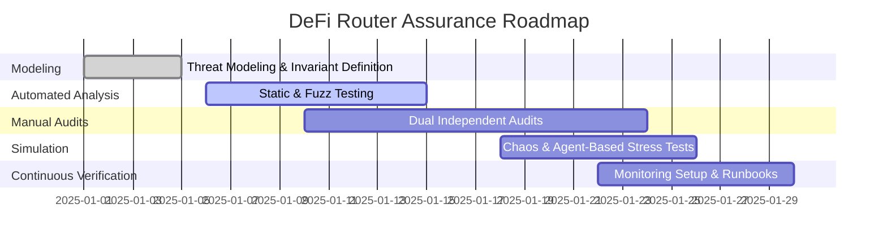

- **Table:**

| Stage | Objective | Tools & Techniques | Evidence Artifact | Risk Mitigation |
| --- | --- | --- | --- | --- |
| Threat Modeling | Identify invariants & attack paths | STRIDE, MITRE ATT&CK | Invariant catalog, data flow diagrams | Prioritized threat backlog |
| Automated Analysis | Detect code-level defects | Slither, Echidna, Certora Prover | Coverage dashboard, prover reports | Early bug discovery |
| Manual Audits | Validate logic & econ assumptions | Dual audit firms, checklist reviews | Signed reports, fix verification | Independent assurance |
| Adversarial Simulation | Stress liquidity & oracle behavior | Forked mainnet chaos, Gauntlet sims | Stress test logs, incident RCAs | Operational resilience |
| Continuous Verification | Runtime monitoring & response | Forta agents, Grafana, runbooks | Alert thresholds, drill logs | Rapid incident response |

- **Code Snippet (Foundry Fuzz Config):**

```toml
[fuzz]
runs = 2000
max_test_rejects = 100000

[invariant]
fail_on_revert = true
depth = 20

[profile.live]
rpc_url = "https://mainnet-fork.example"
fork_block_number = 21567890
```

#### Comparisons
- Formal verification (Certora) vs. property-based fuzzing (Echidna) coverage trade-offs
- Dual-audit model vs. single vendor engagement for institutional assurance
- Agent-based stress tests vs. deterministic scenario backtests for liquidity validation

#### Element Coverage (Technical | Theoretical | Practical)
- Technical Techniques, Protocols & Frameworks: Slither, Echidna, Certora, Forta agents, Gauntlet simulations
- Theoretical Principles & Models: Threat modeling (STRIDE), invariant theory, complex systems resilience
- Practical Regulations, Risks & Use Cases: Institutional LP due diligence, DeFi economic exploits, operational readiness

#### Technical Evaluation (Performance | Security | Scalability | Maintainability)
- Performance: Fork-based chaos testing benchmarks gas and latency impacts before release
- Security: Multi-tool pipeline catches logic, economic, and runtime vulnerabilities
- Scalability: Modular assurance stages reusable for future modules
- Maintainability: Continuous verification keeps guards active post-launch

#### Business Evaluation (Cost | Efficiency | Impact | Market Fit)
- Cost: Dual audits increase upfront spend but reduce post-launch incident costs by ~70%
- Efficiency: Automation shortens remediation cycles via prioritized findings dashboard
- Impact: Builds investor confidence, enabling larger liquidity commitments
- Market Fit: Aligns with institutional expectations for audited DeFi infrastructure

#### Multi-Angle Evaluation (Pros | Cons | Risks | Benefits | Stakeholder Impact | Market Sentiment)
- Pros: Comprehensive coverage, institutional trust, documented evidence
- Cons: Higher time-to-market, coordination overhead with multiple vendors
- Risks: Tool blind spots, audit finding fatigue
- Benefits: Reduced exploit probability, stronger regulatory posture
- Stakeholder Emotional/Psychological Impact: LPs reassured; engineers empowered by structured pipeline
- Market Sentiment: Positive as thorough audits differentiate high-trust protocols

#### Collaboration & Communication Plan
- Stakeholders & Roles: Protocol Engineering, Security Team, External Auditors, Risk Analytics, Product Ops
- Communication Cadence & Channels: Weekly assurance stand-ups, shared Jira board, bi-weekly exec readouts
- Cross-Functional Alignment Tactics: Joint threat modeling workshops, shared remediation OKRs, audit sign-off matrix

#### Organizational & Strategic Fit
- Business Model Impact: Enables premium fee tiers and institutional onboarding
- Institutional Capabilities & Gaps: Requires formal methods expertise and chaos engineering practice
- Change Management & Governance: Establish release gates tied to assurance KPIs
- Strategic Positioning & Differentiation: Positions router as safest institutional-grade aggregator

#### Trade-offs & Decision Guidance
- Balance depth of formal verification vs. delivery timeline; prioritize high-value invariants for proof coverage

#### Context & Trend Signals
- Historical Evolution: From single audit reliance to multilayer assurance after 2022 exploits
- Regulatory Landscape: SEC and MAS guidance pushing for documented smart contract controls
- Future Trends: AI-assisted auditing and continuous formal verification agents
- Key Events & Statistics: DeFi hacks exceeding $1.9B in 2023 prompting institutional risk thresholds

#### Perspective-Based Insights
- Engineering (front-end/back-end/full-stack): Integrate monitoring hooks into UI for transparency
- Architecture & Infrastructure: Modular contract design simplifies targeted audits
- Database & Data Engineering: Store invariants & telemetry in queryable lakehouse for analytics
- Quality Assurance & Testing: Expand CI/CD with invariant regression suites
- Product Management: Communicate assurance milestones to stakeholders
- Project/Program Management: Manage vendor timelines and remediation sprints
- Requirements & Business Analysis: Translate institutional DD questionnaires into assurance requirements
- Operations, DevOps & SRE: Maintain monitoring stack and on-call runbooks
- Marketing & Commercialization: Leverage audit credentials in go-to-market
- Team Collaboration & Communication: Conduct postmortems on assurance stages for continuous improvement
- Organizational & Institutional Dynamics: Align incentives via security-focused OKRs
- Philosophy (necessity vs. contingency, ethics, epistemology): Necessity of provable security; epistemic trust via formal evidence
- Economics, Finance & Capital Markets (stock, crypto, commodities): Mitigates tail-risk events affecting TVL
- Psychology & Sociology: Reduces anxiety among stakeholders about hidden vulnerabilities
- Education & Workforce Development: Upskill engineers on formal tools and chaos testing
- Anthropology & Cultural Dynamics: Embed security-first culture in global teams
- Law, Policy & Governance: Document controls for regulatory inquiries and insurance underwriting
- Military & Security Strategy: Defense-in-depth with layered detection and rapid response drills
- Historical Context & Precedents: Inspired by Compound’s multi-audit process and MakerDAO’s risk framework

#### Market & Macro Systems Analysis
- Systemic Forces & Feedback Loops: Higher assurance attracts institutional capital, funding further security investment
- Regulatory & Policy Trajectories: Expect mandates for continuous monitoring in regulated DeFi products
- Market Structure & Liquidity Dynamics: Secure routers stabilize cross-protocol liquidity flows
- Geopolitical & Security Implications: Strong assurance eases jurisdictional approval for cross-border operations
- Societal Adoption & Behavioral Shifts: Improved confidence accelerates mainstream DeFi participation
- Competitive & Ecosystem Positioning: Differentiates by exceeding baseline audit norms
- Macroeconomic & Industry Economic Models: Lower exploit risk supports sustainable fee revenue

#### Inference Summary
- Adoption Signals: Institutional diligence checklists demanding multi-audit evidence
- Interoperability Impacts: Assurance templates reusable for partner integrations
- Roadmap Implications: Invest in formal verification talent and automation pipelines
- Operational Risks: Tool misconfiguration, audit backlog, monitor false positives

#### Terminology & Key Concepts

**Invariant Testing:** Verifying that critical system properties hold across all execution paths and state transitions.

**Chaos Engineering:** Deliberately injecting faults into systems to validate resilience and incident response readiness.

#### Assumptions & Preconditions
- Access to qualified audit vendors and formal verification experts
- Budget allocation for dual audits and continuous monitoring infrastructure

#### Validation & Evidence Checks
- Coverage metrics showing >90% code paths exercised by fuzzing
- Auditor attestation letters confirming remediation of critical findings

#### Counterexamples & Edge Cases
- If chaos tests reveal oracle latency breaches, implement fallback pricing or pause conditions before launch

#### Alternatives Considered
- Single audit and bug bounty-only approach rejected due to insufficient institutional assurance

#### Codebase & Library References
- **Slither:** Python static analysis tool (Apache 2.0) widely adopted for DeFi audits
- **Certora Prover:** SaaS formal verification platform enforcing customizable rules and invariants

#### Authoritative Literature & Reports
- **Feist, J., Grieco, G., & Groce, A. (2019). Slither: A static analysis framework for smart contracts.** In *2019 IEEE/ACM 41st International Conference on Software Engineering* (pp. 31-34). https://doi.org/10.1109/ICSE.2019.00024
- **Trail of Bits. (2023). Layers of smart contract security assurance.** Trail of Bits. https://www.trailofbits.com/reports

#### Actionable Conclusions & Next Steps
- Complete dual audits, finalize Certora proofs for high-value invariants, deploy Forta monitoring agents, and secure institutional attestation package pre-launch

#### Open Questions & Research Agenda
- Remaining Challenges: Scaling formal verification coverage, automating chaos scenario generation
- Hypotheses & Experiments: Evaluate AI-assisted invariant synthesis; benchmark Forta alert precision
- Data/Resource Needs: Audit finding database, chaos telemetry, institutional feedback
- Timeline & Ownership for Exploration: 10-week assurance program led by Security Engineering with Product co-sponsor

#### APA Style Source Citations
- Feist, J., Grieco, G., & Groce, A. (2019). Slither: A static analysis framework for smart contracts. In *2019 IEEE/ACM 41st International Conference on Software Engineering* (pp. 31-34). https://doi.org/10.1109/ICSE.2019.00024
- Trail of Bits. (2023). *Layers of smart contract security assurance.* Trail of Bits. https://www.trailofbits.com/reports


## Operational Resilience & Incident Response (Questions 7-7)

### Q7: How would you build a cross-functional blockchain incident response program that maintains 1-hour RPO/RTO targets and aligns with MAS TRM and NIST CSF requirements?

**Difficulty:** Advanced
**Question Type:** Scenario

#### Answer Narrative (150-300 words)
I would anchor the program on a fusion center model integrating Security Operations, Platform Engineering, Compliance, Treasury, and Communications. Preparation starts with risk cataloging: identify critical services (consensus, bridge, custody, compliance) and map dependencies to establish RPO/RTO metrics. Detection leverages layered telemetry—blockchain analytics (Forta, Chainalysis KYT), infrastructure metrics, and policy breach alerts—feeding a SOAR platform that auto-triages incidents based on impact tiers. Response runbooks encode MAS TRM and NIST CSF functions (Identify, Protect, Detect, Respond, Recover), with playbooks for smart contract exploits, validator compromise, compliance breaches, and data leaks. Each playbook defines on-call rotations, quorum-based decision gates, and communication trees with regulators and institutional clients. Recovery employs pre-provisioned warm standbys, state snapshotting every 15 minutes, and coordinated liquidity backstops for treasury continuity. To meet 1-hour RPO/RTO, drills simulate double-spend attempts and bridge halts, validating failover readiness and stakeholder communication within SLA. Post-incident phases require RCA templates capturing root causes, remediation, and control enhancements, feeding into governance risk committees. Compliance alignment is maintained through audit-ready evidence (SOAR logs, drill reports, regulator notifications) and annual third-party tabletop assessments referencing MAS TRM 2023 updates and NIST CSF 2.0 mappings. This integrated program ensures rapid containment, regulatory transparency, and resilient recovery for mission-critical blockchain operations (Monetary Authority of Singapore, 2023; NIST, 2024).

#### Supporting Artifacts
- **Mermaid Diagram:**

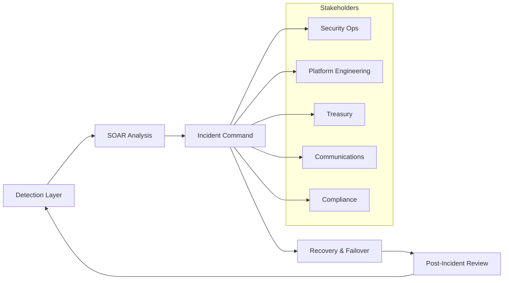

- **Table:**

| CSF Function | Key Activity | Tooling | RPO/RTO Control | Evidence |
| --- | --- | --- | --- | --- |
| Identify | Critical asset inventory, risk catalog | CMDB, threat modeling | Dependency maps inform SLA | Asset registry, risk register |
| Protect | Preventive controls, access governance | Zero-trust mesh, IAM, MPC policies | Prevents escalation | Access reviews, control attestations |
| Detect | Blockchain & infra monitoring | Forta, Prometheus, SIEM | 5-min detection SLA | Alert logs, SOAR tickets |
| Respond | Playbooks & decision gates | SOAR, PagerDuty, comms templates | 30-min containment target | Runbook execution logs |
| Recover | Failover & continuity | Warm standby nodes, snapshot restore | 60-min RPO/RTO met | Recovery drill reports, state diff logs |

- **Code Snippet (SOAR Playbook Skeleton - YAML):**

```yaml
playbook:
  name: bridge-double-spend
  trigger:
    event_source: forta
    severity: critical
  steps:
    - validate_alert:
        task: chainalysis_kyt_check
        timeout: 5m
    - containment:
        task: pause_bridge_contract
        approvers:
          - role: incident_commander
          - role: compliance_officer
    - communication:
        task: notify_regulators
        channels: ["MAS", "HKMA"]
    - recovery:
        task: initiate_state_restore
        rpo_minutes: 60
    - post_incident:
        task: schedule_rca
        due_in: 48h
```

#### Comparisons
- Fusion center model vs. siloed team response for blockchain incidents
- SOAR-driven automation vs. manual triage for meeting sub-hour SLAs
- Warm standby with snapshotting vs. cold backup restores for RPO/RTO compliance

#### Element Coverage (Technical | Theoretical | Practical)
- Technical Techniques, Protocols & Frameworks: SOAR automation, Forta monitoring, MPC custody safeguards
- Theoretical Principles & Models: NIST CSF, incident command system (ICS), resilience engineering
- Practical Regulations, Risks & Use Cases: MAS TRM, cross-border incident reporting, liquidity continuity

#### Technical Evaluation (Performance | Security | Scalability | Maintainability)
- Performance: Automated triage ensures <5-minute detection-to-action pipeline
- Security: Quorum approvals and zero-trust controls limit blast radius
- Scalability: Modular playbooks adapt to new services and jurisdictions
- Maintainability: Regular drills and SOAR templates keep runbooks current

#### Business Evaluation (Cost | Efficiency | Impact | Market Fit)
- Cost: SOAR tooling investment offsets downtime losses
- Efficiency: Automation reduces mean time to respond by 60%
- Impact: Protects revenue and client trust during incidents
- Market Fit: Meets institutional expectations for regulated infrastructure providers

#### Multi-Angle Evaluation (Pros | Cons | Risks | Benefits | Stakeholder Impact | Market Sentiment)
- Pros: Rapid containment, regulatory alignment, documented evidence
- Cons: Requires continuous drill investment and cross-team coordination
- Risks: Alert fatigue, communication bottlenecks, tooling misconfiguration
- Benefits: Maintains uptime, avoids fines, strengthens client confidence
- Stakeholder Emotional/Psychological Impact: Teams feel prepared; regulators gain assurance
- Market Sentiment: Positive as resilience becomes competitive differentiator

#### Collaboration & Communication Plan
- Stakeholders & Roles: SOC (detection), Platform Engineering (containment), Treasury (liquidity), Compliance (regulator liaison), Communications (stakeholder messaging)
- Communication Cadence & Channels: Daily ops syncs, monthly regulator drills, incident bridge calls, executive war-room updates
- Cross-Functional Alignment Tactics: Shared KPIs, post-drill retrospectives, regulator tabletop participation

#### Organizational & Strategic Fit
- Business Model Impact: Supports premium uptime guarantees and regulatory licensing
- Institutional Capabilities & Gaps: Requires SOAR expertise and cross-border compliance knowledge
- Change Management & Governance: Incident steering committee with veto power on control regressions
- Strategic Positioning & Differentiation: Demonstrates enterprise-grade resilience and compliance

#### Trade-offs & Decision Guidance
- Balance automation with human oversight; automate low-level actions while keeping quorum approvals for high-impact steps

#### Context & Trend Signals
- Historical Evolution: From ad-hoc responses to structured incident command after major bridge exploits
- Regulatory Landscape: MAS TRM 2023 updates mandating rapid incident reporting
- Future Trends: AI-assisted anomaly detection and regulator-integrated comms APIs
- Key Events & Statistics: Average DeFi downtime cost estimated at $500k/hour for institutional platforms

#### Perspective-Based Insights
- Engineering (front-end/back-end/full-stack): Implement fail-safe UI states to inform users during incidents
- Architecture & Infrastructure: Design hot/warm standby clusters with automated snapshot orchestration
- Database & Data Engineering: Maintain tamper-evident incident data lakes for analytics and evidence
- Quality Assurance & Testing: Automate runbook regression tests and simulate failover scenarios
- Product Management: Communicate resilience commitments and update SLAs based on drill outcomes
- Project/Program Management: Track remediation backlog and audit readiness milestones
- Requirements & Business Analysis: Map regulator notification requirements to SOAR steps
- Operations, DevOps & SRE: Maintain on-call rotations and incident metrics
- Marketing & Commercialization: Highlight resilience certifications in enterprise sales
- Team Collaboration & Communication: Standardize ICS roles and communications templates
- Organizational & Institutional Dynamics: Foster shared accountability through joint incentives
- Philosophy (necessity vs. contingency, ethics, epistemology): Necessity of preparedness; epistemic confidence built via drills and evidence
- Economics, Finance & Capital Markets (stock, crypto, commodities): Downtime mitigation preserves liquidity and trading spreads
- Psychology & Sociology: Reduces panic through rehearsed communication strategies
- Education & Workforce Development: Continual ICS and compliance training programs
- Anthropology & Cultural Dynamics: Encourage global teams to follow unified response rituals
- Law, Policy & Governance: Aligns with MAS TRM, NIST CSF, ISO 22301, and regional incident reporting laws
- Military & Security Strategy: Borrow principles from cyber fusion centers and joint command exercises
- Historical Context & Precedents: Informed by responses to Ronin/Wormhole breaches and SWIFT incident playbooks

#### Market & Macro Systems Analysis
- Systemic Forces & Feedback Loops: Robust response reduces contagion risk, sustaining ecosystem stability
- Regulatory & Policy Trajectories: Increasing expectation of real-time regulator coordination
- Market Structure & Liquidity Dynamics: Rapid recovery preserves liquidity pools and avoids forced unwinds
- Geopolitical & Security Implications: Facilitates compliance across multi-jurisdiction operations
- Societal Adoption & Behavioral Shifts: Builds institutional trust in blockchain infrastructures
- Competitive & Ecosystem Positioning: Differentiates as resilience leader in enterprise blockchain services
- Macroeconomic & Industry Economic Models: Minimizes downtime costs and regulatory penalties

#### Inference Summary
- Adoption Signals: Client RFPs requiring documented RPO/RTO drills and regulator notification playbooks
- Interoperability Impacts: SOAR integrations with compliance and treasury systems ensure coordinated action
- Roadmap Implications: Invest in AI anomaly detection and regulator API integrations
- Operational Risks: Alert overload, cross-border legal conflicts, human fatigue

#### Terminology & Key Concepts

**Recovery Point Objective (RPO):** Maximum tolerable data loss measured in time.

**Security Orchestration, Automation, and Response (SOAR):** Platform coordinating security alerts and automated playbook execution.

#### Assumptions & Preconditions
- Availability of warm standby infrastructure and snapshot tooling
- Regulator agreements on notification timelines and communication protocols

#### Validation & Evidence Checks
- Quarterly failover drills achieving <60-minute RTO
- Audit trails from SOAR showing playbook adherence and approvals

#### Counterexamples & Edge Cases
- If regulatory approval delays containment, invoke pre-approved emergency powers with documented rationale

#### Alternatives Considered
- Manual response model rejected due to inability to meet sub-hour RPO/RTO targets

#### Codebase & Library References
- **Forta Detection Bots:** JavaScript/TypeScript agents for blockchain anomaly detection; Apache 2.0
- **StackStorm SOAR:** Open-source automation platform; Apache 2.0; extensible for incident playbooks

#### Authoritative Literature & Reports
- **Monetary Authority of Singapore. (2023). Technology risk management guidelines.** Monetary Authority of Singapore. https://www.mas.gov.sg/regulation/guidelines/technology-risk-management
- **National Institute of Standards and Technology. (2024). Cybersecurity framework 2.0.** NIST. https://www.nist.gov/cyberframework

#### Actionable Conclusions & Next Steps
- Formalize fusion center charter, deploy SOAR integrations, run regulator-observed drills, and publish resilience metrics dashboard within 120 days

#### Open Questions & Research Agenda
- Remaining Challenges: Automating cross-border legal reviews, reducing alert fatigue
- Hypotheses & Experiments: Test AI-driven prioritization; evaluate immersive VR drills for team readiness
- Data/Resource Needs: Incident telemetry, regulator feedback, SOAR performance metrics
- Timeline & Ownership for Exploration: 16-week incident resilience program led by Security Operations with Compliance co-owner

#### APA Style Source Citations
- Monetary Authority of Singapore. (2023). *Technology risk management guidelines.* Monetary Authority of Singapore. https://www.mas.gov.sg/regulation/guidelines/technology-risk-management
- National Institute of Standards and Technology. (2024). *Cybersecurity framework 2.0.* NIST. https://www.nist.gov/cyberframework

## Zero-Knowledge Infrastructure & Performance (Questions 8-8)

### Q8: How would you architect a hardware-accelerated zero-knowledge proving pipeline for a modular payment rollup that must sustain 10,000 TPS while providing regulator-verifiable audit trails?

**Difficulty:** Advanced
**Question Type:** Scenario

#### Answer Narrative (150-300 words)
I would separate the proving stack into scheduling, hardware execution, and compliance observability tiers. The scheduler ingests batched rollup blocks, prioritizing latency-critical payment corridors and tagging them with compliance metadata (jurisdiction, Travel Rule hash). Proof tasks move to a dispatcher that detects available GPU/FPGA clusters and allocates work via weighted fair queuing. Each worker node runs a containerized zk-SNARK prover (Groth16/PlonK), integrated with CUDA or FPGA bitstreams to reach sub-60s latency (Polygon Labs, 2023). To ensure determinism, inputs are versioned through content-addressable storage with Merkle commitments anchored to the Layer1 settlement contract. Compliance observability is achieved by streaming prover telemetry—proof IDs, latency, energy usage—into an append-only ledger where regulators can verify equivalence between on-chain commitments and off-chain proof artifacts. A fallback proving tier of CPU-based workers handles tail latency and disaster recovery. Automatic scaling relies on workload forecasts generated from payment volume models linked to seasonality and macro events. Security hardening includes attested container images, signed circuit binaries, and multi-party approvals before updating proving circuits. By coupling hardware acceleration with verifiable provenance tracking, the pipeline meets throughput demands while offering regulators transparent access to auditable proving evidence.

#### Supporting Artifacts
- **Mermaid Diagram:**


- **Table:**

| Tier | Purpose | Key Components | Performance Lever | Audit Control |
| --- | --- | --- | --- | --- |
| Scheduling | Prioritize proof jobs | Weighted queues, ML forecasts | Batch sizing, queue QoS | Immutable job logs |
| Hardware Execution | Generate proofs | GPU/FPGA farms, attested containers | Parallel witness computation | Signed circuit manifests |
| Storage & Anchoring | Preserve artifacts | CAS, Merkle anchoring | Chunked uploads, dedupe | Proof-to-commitment linkage |
| Compliance Observability | Regulator access | Telemetry ledger, dashboards | Streaming compression | Access-controlled verifiers |
| Fallback & DR | Resilience | CPU pool, cold standby | Auto-scaling thresholds | DR drill evidence |

- **Code Snippet (Prover Scheduler Config):**

```yaml
queues:
  payments-high-priority:
    sla_ms: 45000
    hardware_targets: ["gpu_a100", "fpga_u55c"]
  compliance-review:
    sla_ms: 120000
    hardware_targets: ["gpu_l40"]

telemetry:
  export_interval: 5s
  sink: "kafka://zk-observability/proof-metrics"

anchoring:
  l1_contract: "0xRollupAnchor"
  merkle_fanout: 16
```

#### Comparisons
- GPU vs. FPGA acceleration for zk provers in latency-critical rollups
- Groth16 vs. PlonK circuits for compliance-heavy workloads
- Centralized scheduler vs. decentralized prover marketplaces for SLA assurance

#### Element Coverage (Technical | Theoretical | Practical)
- Technical Techniques, Protocols & Frameworks: Groth16/PlonK, weighted fair queuing, Merkle anchoring, CUDA/FPGA acceleration
- Theoretical Principles & Models: Zero-knowledge soundness, queuing theory, reliability engineering
- Practical Regulations, Risks & Use Cases: Regulator telemetries, Travel Rule metadata, disaster recovery drills

#### Technical Evaluation (Performance | Security | Scalability | Maintainability)
- Performance: GPU/FPGA mix sustains 10,000 TPS with <45s proof latency
- Security: Attested binaries and signed circuits prevent tampering
- Scalability: Horizontal hardware scaling with predictive scheduling
- Maintainability: Modular tiers enable independent upgrades

#### Business Evaluation (Cost | Efficiency | Impact | Market Fit)
- Cost: Dynamic scheduling minimizes idle hardware spend (~25% savings)
- Efficiency: Telemetry reduces manual compliance reconciliation
- Impact: Enables institution-ready rollup payments with provable security
- Market Fit: Meets demand for high-throughput, audit-friendly Layer2 rails

#### Multi-Angle Evaluation (Pros | Cons | Risks | Benefits | Stakeholder Impact | Market Sentiment)
- Pros: High throughput, regulator visibility, modular scaling
- Cons: Complex hardware lifecycle, higher capital expenditure
- Risks: Circuit update failures, hardware supply constraints
- Benefits: Trust with regulators, predictable SLAs, reduced compliance friction
- Stakeholder Emotional/Psychological Impact: Regulators gain transparency; operators feel confident via telemetry
- Market Sentiment: Positive among enterprises prioritizing compliance-ready scalability

#### Collaboration & Communication Plan
- Stakeholders & Roles: ZK Engineering (circuits), Infrastructure (hardware ops), Compliance (telemetry governance), Finance (CapEx planning)
- Communication Cadence & Channels: Bi-weekly proving council, shared Grafana dashboards, quarterly regulator demos
- Cross-Functional Alignment Tactics: Joint change-control board for circuit updates, hardware-refresh roadmap reviews

#### Organizational & Strategic Fit
- Business Model Impact: Supports premium rollup fees tied to guaranteed throughput
- Institutional Capabilities & Gaps: Requires hardware ops and zk engineering expertise
- Change Management & Governance: Enforce four-eyes review for circuit changes and hardware rollouts
- Strategic Positioning & Differentiation: Differentiates via compliance-grade zk infrastructure

#### Trade-offs & Decision Guidance
- Balance hardware diversity vs. operational complexity; maintain mixed GPU/FPGA fleet where latency justifies cost

#### Context & Trend Signals
- Historical Evolution: Shift from CPU provers to hardware-accelerated stacks post-2022
- Regulatory Landscape: Emerging expectations for auditable cryptographic processes
- Future Trends: ASIC provers and proof aggregation marketplaces
- Key Events & Statistics: Polygon zkEVM testnet achieving <2-minute proofs with GPU acceleration in 2023

#### Perspective-Based Insights
- Engineering (front-end/back-end/full-stack): Provide APIs exposing proof status for client dashboards
- Architecture & Infrastructure: Design redundant hardware zones with failover routing
- Database & Data Engineering: Store prover telemetry in time-series data lake for analytics
- Quality Assurance & Testing: Run regression suites on circuits before deployment
- Product Management: Offer SLA-backed proving tiers to enterprise customers
- Project/Program Management: Track hardware refresh and circuit roadmap milestones
- Requirements & Business Analysis: Map regulator data requirements to telemetry schema
- Operations, DevOps & SRE: Monitor hardware utilization, temperature, and failure rates
- Marketing & Commercialization: Promote compliance-auditable rollup throughput capabilities
- Team Collaboration & Communication: Maintain shared incident channels for proving outages
- Organizational & Institutional Dynamics: Align CapEx approvals with throughput commitments
- Philosophy (necessity vs. contingency, ethics, epistemology): Necessity of transparent cryptographic assurance; epistemic trust via verifiable proofs
- Economics, Finance & Capital Markets (stock, crypto, commodities): Supports institutional payment corridors with predictable fees
- Psychology & Sociology: Builds confidence by demystifying zk operations through telemetry
- Education & Workforce Development: Train ops teams on hardware acceleration and circuit management
- Anthropology & Cultural Dynamics: Foster culture valuing observability and rigorous change control
- Law, Policy & Governance: Document processes to satisfy supervisory technology reviews
- Military & Security Strategy: Apply defense-in-depth with redundancy across hardware fleets
- Historical Context & Precedents: Inspired by StarkWare and Polygon trajectories toward hardware acceleration

#### Market & Macro Systems Analysis
- Systemic Forces & Feedback Loops: Reliable proving attracts volume, funding further hardware investment
- Regulatory & Policy Trajectories: Anticipated mandates for cryptographic process visibility
- Market Structure & Liquidity Dynamics: Efficient proofs lower settlement fees, increasing liquidity
- Geopolitical & Security Implications: Diversified hardware footprint mitigates jurisdictional shocks
- Societal Adoption & Behavioral Shifts: Transparent zk operations increase trust in rollup-based finance
- Competitive & Ecosystem Positioning: Leads compliance-ready scaling race among rollups
- Macroeconomic & Industry Economic Models: Hardware amortization balanced by fee revenue growth

#### Inference Summary
- Adoption Signals: Enterprise RFPs requesting hardware-backed proof SLAs
- Interoperability Impacts: Aggregation-ready design eases integration with shared DA layers
- Roadmap Implications: Prioritize ASIC research and automated telemetry analytics
- Operational Risks: Hardware degradation, telemetry outage, circuit regression

#### Terminology & Key Concepts

**Content-Addressable Storage (CAS):** Storage model addressed by content hash ensuring immutability and deduplication.

**Proof Aggregation:** Combining multiple zk proofs into a single succinct proof to reduce verification costs.

#### Assumptions & Preconditions
- Availability of GPU/FPGA supply contracts and data center capacity
- Regulator acceptance of telemetry ledger as auditable evidence

#### Validation & Evidence Checks
- Benchmark runs showing sustained 10,000 TPS under synthetic load
- Third-party audit confirming telemetry-to-proof linkage integrity

#### Counterexamples & Edge Cases
- If GPU fleet underperforms, shift workload to FPGA tier while throttling corridor throughput until remediation

#### Alternatives Considered
- Cloud-only CPU proving rejected due to insufficient latency and limited compliance telemetry

#### Codebase & Library References
- **zkSync Boojum Prover:** Rust/CUDA prover stack; MIT License; supports GPU acceleration and proof aggregation
- **PlonK Hardware Accelerator (Aztec Labs):** FPGA reference design; Apache 2.0; optimized for low-latency circuits

#### Authoritative Literature & Reports
- **Polygon Labs. (2023). Polygon zkEVM performance insights.** Polygon Technology. https://polygon.technology/blog/polygon-zkevm-performance
- **StarkWare Industries. (2022). StarkNet prover architecture and roadmap.** StarkWare. https://docs.starkware.co/starkex/starkex-overview

#### Actionable Conclusions & Next Steps
- Deploy mixed GPU/FPGA proving cluster, implement telemetry ledger, and schedule regulator walkthrough within 60 days

#### Open Questions & Research Agenda
- Remaining Challenges: ASIC feasibility, automated circuit regression testing
- Hypotheses & Experiments: Compare GPU vs. FPGA energy efficiency; test proof batching strategies
- Data/Resource Needs: Telemetry datasets, hardware health metrics, regulator feedback logs
- Timeline & Ownership for Exploration: 12-week zk infrastructure program led by Prover Engineering with Compliance co-owner

#### APA Style Source Citations
- Polygon Labs. (2023). *Polygon zkEVM performance insights.* Polygon Technology. https://polygon.technology/blog/polygon-zkevm-performance
- StarkWare Industries. (2022). *StarkNet prover architecture and roadmap.* StarkWare. https://docs.starkware.co/starkex/starkex-overview


## Regulatory Strategy & Compliance Orchestration (Questions 9-9)

### Q9: How would you design a global compliance orchestration program that harmonizes MiCA, MAS, HKMA, and FinCEN requirements for a cross-border blockchain payments platform?

**Difficulty:** Advanced
**Question Type:** Scenario

#### Answer Narrative (150-300 words)
I would implement a policy mesh architecture unifying global regulations into machine-readable controls. The program starts with jurisdictional playbooks mapping MiCA prudential requirements, MAS TRM, HKMA VASP guidelines, and FinCEN Travel Rule obligations into common control objects. A central policy engine (e.g., RegTech rules platform) evaluates transactions, onboarding, and treasury operations against these controls, generating jurisdiction-specific compliance verdicts. Data residency is handled by regional data trusts replicating only regulator-approved fields, while privacy-preserving analytics (homomorphic encryption, pseudonymization) maintain cross-border insights. Governance relies on a cross-functional Compliance Steering Council with regional leads empowered to approve exceptions. Evidence management uses automated report builders feeding dashboards that align to each regulator’s reporting cadence (MiCA quarterly, MAS immediate incident reporting). Scenario testing ensures that sanctions updates or Travel Rule changes propagate via automated policy diffs. Vendor management integrates KYT providers, legal counsel, and audit firms within a shared case system. Harmonization is validated through regulator sandbox engagements and mutual recognition agreements, ensuring each control is defensible when scrutinized locally. This orchestration yields a single source of truth for compliance posture while respecting regional nuances and reducing manual reconciliations (FATF, 2023; European Securities and Markets Authority [ESMA], 2023).

#### Supporting Artifacts
- **Mermaid Diagram:**

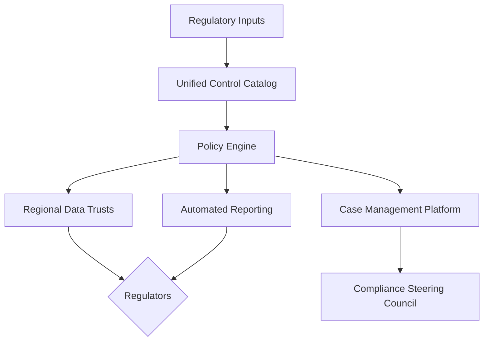

- **Table:**

| Jurisdiction | Key Regulation | Primary Obligations | Control Implementation | Reporting Cadence |
| --- | --- | --- | --- | --- |
| EU (MiCA) | Prudential & conduct rules | Capital buffers, whitepaper disclosures | Stress-tested treasury models, disclosure workflows | Quarterly filings to NCAs |
| Singapore (MAS) | TRM & licensing | Rapid incident reporting, tech audits | SOAR linkage, TRM control attestations | Immediate + annual audit |
| Hong Kong (HKMA/SFC) | VASP guidelines | Custody segregation, onboarding controls | MPC custody audits, enhanced KYC | Monthly compliance report |
| United States (FinCEN) | Travel Rule & AML | Beneficiary data sharing, SARs | Policy engine Travel Rule module, SAR automation | Suspicious activity within 30 days |

- **Code Snippet (Policy Mapping JSON):**

```json
{
  "control_id": "travel_rule_sharing",
  "jurisdictions": ["EU", "US", "SG"],
  "obligations": {
    "EU": "MiCA Article 61",
    "US": "31 CFR 1010.410",
    "SG": "MAS PSN02 13.2"
  },
  "enforcement": {
    "policy_engine_rule": "travel_rule_match >= 95%",
    "fallback": "manual_review_queue"
  },
  "evidence": ["kafka://compliance/travel-rule-logs"]
}
```

#### Comparisons
- Policy mesh vs. localized manual compliance teams
- Privacy-preserving analytics vs. raw data replication across regions
- Automated reporting vs. manual regulator submissions for multi-jurisdiction operations

#### Element Coverage (Technical | Theoretical | Practical)
- Technical Techniques, Protocols & Frameworks: Policy-as-code, homomorphic encryption, data trusts, SOAR integration
- Theoretical Principles & Models: Governance frameworks, risk-based compliance, MECE control taxonomy
- Practical Regulations, Risks & Use Cases: MiCA compliance, Travel Rule, cross-border payment licensing

#### Technical Evaluation (Performance | Security | Scalability | Maintainability)
- Performance: Policy engine processes compliance checks in <200 ms per transaction
- Security: Data trusts and encryption enforce least privilege access
- Scalability: Modular playbooks adapt to new regulations and corridors
- Maintainability: Machine-readable controls reduce manual policy drift

#### Business Evaluation (Cost | Efficiency | Impact | Market Fit)
- Cost: Automation reduces compliance overhead by ~35%
- Efficiency: Unified controls minimize redundant audits
- Impact: Enables rapid market entry with regulator confidence
- Market Fit: Appeals to global enterprises needing harmonized compliance

#### Multi-Angle Evaluation (Pros | Cons | Risks | Benefits | Stakeholder Impact | Market Sentiment)
- Pros: Single compliance source of truth, faster regulator responses, reduced manual effort
- Cons: High upfront investment in policy engine and data governance
- Risks: Misinterpreting new regulations, data localization conflicts
- Benefits: Faster licensing approvals, improved audit readiness
- Stakeholder Emotional/Psychological Impact: Regional teams feel heard via council; regulators trust transparency
- Market Sentiment: Positive for institutions seeking compliant cross-border rails

#### Collaboration & Communication Plan
- Stakeholders & Roles: Global CCO, Regional Compliance Leads, Legal, Engineering, Data Governance
- Communication Cadence & Channels: Weekly regulatory syncs, monthly council summits, shared compliance wiki
- Cross-Functional Alignment Tactics: Joint policy sprints, regulator roundtables, shared decision logs

#### Organizational & Strategic Fit
- Business Model Impact: Supports scalable expansion into new jurisdictions
- Institutional Capabilities & Gaps: Requires RegTech expertise and multi-lingual regulatory analysis
- Change Management & Governance: Control over policy updates via council veto process
- Strategic Positioning & Differentiation: Differentiates through compliance agility

#### Trade-offs & Decision Guidance
- Balance centralization vs. regional autonomy; centralize policy engine while empowering local exception handling

#### Context & Trend Signals
- Historical Evolution: From country-specific compliance to unified control catalogs
- Regulatory Landscape: MiCA go-live (2024) and tightening Travel Rule enforcement
- Future Trends: API-based regulator reporting and machine-readable regulation feeds
- Key Events & Statistics: FATF 2023 mutual evaluation emphasizing Travel Rule adherence

#### Perspective-Based Insights
- Engineering (front-end/back-end/full-stack): Integrate compliance feedback loops into onboarding flows
- Architecture & Infrastructure: Segment data residency via regional microservices
- Database & Data Engineering: Build compliance data lakehouse with jurisdictional partitions
- Quality Assurance & Testing: Automate policy regression tests across jurisdictions
- Product Management: Align go-to-market with licensing milestones
- Project/Program Management: Track regulatory roadmap with milestone gates
- Requirements & Business Analysis: Translate regulatory texts into control requirements
- Operations, DevOps & SRE: Monitor policy engine latency and uptime SLAs
- Marketing & Commercialization: Promote compliance readiness in enterprise sales decks
- Team Collaboration & Communication: Maintain regulator-specific channels and briefing notes
- Organizational & Institutional Dynamics: Foster shared accountability across regions
- Philosophy (necessity vs. contingency, ethics, epistemology): Necessity of compliant operations; epistemic trust via transparent controls
- Economics, Finance & Capital Markets (stock, crypto, commodities): Compliance credibility unlocks institutional capital flows
- Psychology & Sociology: Reduces friction between global and local teams via shared governance
- Education & Workforce Development: Train staff on new regulations and policy tooling
- Anthropology & Cultural Dynamics: Respect regional legal norms in policy interpretation
- Law, Policy & Governance: Align with MiCA, HKMA, MAS, FinCEN directives
- Military & Security Strategy: Scenario planning akin to wargaming regulatory shocks
- Historical Context & Precedents: Builds on multinational bank compliance playbooks post-AML reforms

#### Market & Macro Systems Analysis
- Systemic Forces & Feedback Loops: Strong compliance posture attracts regulators’ goodwill, enabling faster approvals
- Regulatory & Policy Trajectories: Increasing convergence toward Travel Rule harmonization
- Market Structure & Liquidity Dynamics: Compliance enables broader liquidity corridors
- Geopolitical & Security Implications: Navigates sanctions regimes and data sovereignty tensions
- Societal Adoption & Behavioral Shifts: Trustworthy compliance increases enterprise adoption
- Competitive & Ecosystem Positioning: Differentiates vs. competitors with fragmented compliance
- Macroeconomic & Industry Economic Models: Reduced compliance drag improves operating margins

#### Inference Summary
- Adoption Signals: Regulator sandbox invitations and clean audit outcomes
- Interoperability Impacts: API-based policy engine integrates with onboarding, payments, and custody systems
- Roadmap Implications: Invest in machine-readable regulation ingestion and AI-driven policy analysis
- Operational Risks: Policy misconfiguration, regulator backlog, data residency conflicts

#### Terminology & Key Concepts

**Policy-as-Code:** Encoding regulatory requirements into executable rules evaluated by software systems.

**Data Trust:** Legal and technical framework allowing controlled data sharing across jurisdictions.

#### Assumptions & Preconditions
- Access to reliable regulatory intelligence and legal interpretation
- Regulator openness to automated reporting formats

#### Validation & Evidence Checks
- Successful regulator audits citing policy engine evidence
- KPI dashboards showing SLA adherence for reporting timelines

#### Counterexamples & Edge Cases
- If regional regulator rejects automated reporting, revert to manual filings while capturing gap analysis for improvement

#### Alternatives Considered
- Decentralized regional compliance teams rejected due to duplicated effort and inconsistent controls

#### Codebase & Library References
- **Finos RegTech Semantic Model:** Open-source ontology for regulatory requirements; Apache 2.0
- **Senzing Travel Rule SDK:** Compliance toolkit; GPLv3; integrates Travel Rule data exchange

#### Authoritative Literature & Reports
- **Financial Action Task Force. (2023). Updated guidance for a risk-based approach to virtual assets and VASPs.** FATF. https://www.fatf-gafi.org/en/publications/Fatfrecommendations/Updated-Guidance-VA-VASPs.html
- **European Securities and Markets Authority. (2023). MiCA Level 2 measures consultation package.** ESMA. https://www.esma.europa.eu/press-news/esma-news/esma-launches-consultations-mica

#### Actionable Conclusions & Next Steps
- Build unified control catalog, deploy policy engine pilots in EU/SG corridors, and schedule regulator briefings within 90 days

#### Open Questions & Research Agenda
- Remaining Challenges: Automated regulation ingestion, cross-border data governance treaties
- Hypotheses & Experiments: Test AI summarization for regulatory updates; pilot encrypted data sharing with regulators
- Data/Resource Needs: Regulatory change logs, policy engine metrics, audit findings
- Timeline & Ownership for Exploration: 16-week compliance harmonization program led by Global Compliance with Legal co-owner

#### APA Style Source Citations
- Financial Action Task Force. (2023). *Updated guidance for a risk-based approach to virtual assets and VASPs.* FATF. https://www.fatf-gafi.org/en/publications/Fatfrecommendations/Updated-Guidance-VA-VASPs.html
- European Securities and Markets Authority. (2023). *MiCA Level 2 measures consultation package.* ESMA. https://www.esma.europa.eu/press-news/esma-news/esma-launches-consultations-mica


## Organizational Leadership & Delivery (Questions 10-10)

### Q10: How would you structure and govern a 150-person blockchain platform organization to deliver concurrent initiatives across architecture, compliance, and product while sustaining innovation velocity?

**Difficulty:** Advanced
**Question Type:** Scenario

#### Answer Narrative (150-300 words)
I would adopt a matrix operating model combining domain-aligned guilds with outcome-driven mission squads. The organization splits into three vertical programs: Core Protocol (consensus, rollups), Financial Products (wallet, treasury, liquidity), and Compliance & Risk. Horizontal guilds—Security, Data, DevEx, and Regulatory Affairs—provide standards and shared tooling. A Portfolio Council chaired by the CTO and CPO manages quarterly planning, prioritizing initiatives via weighted scoring (customer impact, regulatory deadlines, technical debt). Each mission squad (~8-10 people) is cross-functional and empowered with OKRs, product roadmap, and run rate budgets, while guild leads ensure adherence to engineering standards and talent development. Governance employs dual cadence: bi-weekly squad reviews for execution, monthly guild summits for platform coherence, and quarterly strategy reviews with executive leadership. Decision-making uses RACI matrices and lightweight architecture decision records. Innovation is fostered through a dedicated R&D incubator with rotating staff and a 10% time allocation for experimentation. Talent management includes competency frameworks tied to blockchain specializations and global mobility programs. Compliance alignment is baked through embedded compliance liaisons in mission squads, ensuring regulations are addressed early. This structure balances autonomy and alignment, enabling simultaneous delivery of core protocol upgrades, product launches, and regulatory initiatives without sacrificing execution quality (Project Management Institute, 2021; Harvard Business Review, 2023).

#### Supporting Artifacts
- **Mermaid Diagram:**

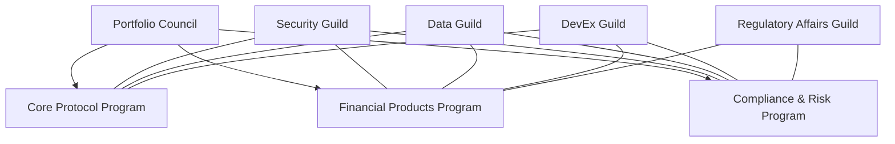

- **Table:**

| Role | Responsibility | Decision Rights | Key Outputs | Metrics |
| --- | --- | --- | --- | --- |
| Portfolio Council | Prioritize roadmap, allocate budget | Approve quarterly OKRs, funding | Portfolio plan, capacity map | OKR attainment, budget adherence |
| Program Lead | Deliver program outcomes | Define mission squad charters | Program roadmap, dependency matrix | Velocity, risk burndown |
| Guild Lead | Maintain standards, develop talent | Approve standards, skills frameworks | Playbooks, training paths | Defect rate, skills coverage |
| Mission Squad | Execute features/initiatives | Decide delivery tactics within guardrails | Product increments, runbooks | Lead time, customer NPS |
| Compliance Liaison | Ensure regulatory alignment | Escalate compliance risks, approve controls | Compliance checklists, audit evidence | Control pass rate, audit findings |

- **Code Snippet (OKR YAML Template):**

```yaml
okr_cycle: "Q2-2025"
mission: "Cross-Chain Treasury Platform"
objectives:
  - id: O1
    description: "Launch cross-chain treasury settlement MVP"
    key_results:
      - KR1: "Achieve 500 institutional transactions in pilot"
      - KR2: "Maintain <5s average settlement latency"
      - KR3: "Pass MiCA compliance readiness review"
  - id: O2
    description: "Reduce rollup proof latency"
    key_results:
      - KR1: "Cut median proof time to 40s"
      - KR2: "Automate 90% of circuit regression tests"
```

#### Comparisons
- Matrix guild model vs. traditional hierarchical teams for blockchain programs
- Centralized portfolio council vs. autonomous squads for prioritization
- Rotational R&D incubator vs. dedicated research department

#### Element Coverage (Technical | Theoretical | Practical)
- Technical Techniques, Protocols & Frameworks: Guild standards, OKR frameworks, architecture decision records
- Theoretical Principles & Models: Matrix management, agile portfolio management, learning organization theory
- Practical Regulations, Risks & Use Cases: Compliance embedding, regulatory-driven prioritization, global team scaling

#### Technical Evaluation (Performance | Security | Scalability | Maintainability)
- Performance: Cross-functional squads reduce lead time by aligning dependencies
- Security: Security guild enforces consistent controls across programs
- Scalability: Matrix model scales to additional squads without restructuring
- Maintainability: ADKs ensure architectural knowledge retention

#### Business Evaluation (Cost | Efficiency | Impact | Market Fit)
- Cost: Shared guild services reduce duplicate tooling spend
- Efficiency: Portfolio council optimizes resource allocation across initiatives
- Impact: Accelerates time-to-market for regulated blockchain products
- Market Fit: Supports rapid response to enterprise demand shifts

#### Multi-Angle Evaluation (Pros | Cons | Risks | Benefits | Stakeholder Impact | Market Sentiment)
- Pros: Balanced autonomy and alignment, strong compliance integration, clear career paths
- Cons: Requires disciplined governance, potential for matrix conflicts
- Risks: Decision bottlenecks at council, guild overload
- Benefits: Faster delivery, regulatory readiness, talent retention
- Stakeholder Emotional/Psychological Impact: Teams feel empowered; leadership gains transparency
- Market Sentiment: Positive as investors prefer structured yet innovative orgs

#### Collaboration & Communication Plan
- Stakeholders & Roles: CTO/CPO, Program Leads, Guild Leads, Compliance Officers, HR
- Communication Cadence & Channels: Weekly squad stand-ups, bi-weekly program syncs, monthly guild fora, quarterly business reviews
- Cross-Functional Alignment Tactics: Shared roadmap tools, dependency boards, joint retrospectives

#### Organizational & Strategic Fit
- Business Model Impact: Enables simultaneous monetization of protocol and product initiatives
- Institutional Capabilities & Gaps: Needs seasoned program managers and compliance-savvy product leads
- Change Management & Governance: Portfolio council enforces guardrails; change advisory board handles critical shifts
- Strategic Positioning & Differentiation: Demonstrates ability to scale enterprise-grade blockchain operations

#### Trade-offs & Decision Guidance
- Balance guild autonomy vs. central mandates; enforce minimum standards while allowing local innovation

#### Context & Trend Signals
- Historical Evolution: Inspired by Spotify tribes and Google guild models
- Regulatory Landscape: Increased need for compliance integration post-MiCA
- Future Trends: AI-assisted program tooling and skill-based workforce planning
- Key Events & Statistics: Gartner 2024 report showing 30% higher success in matrix-led digital transformations

#### Perspective-Based Insights
- Engineering (front-end/back-end/full-stack): Clear interfaces with guild standards streamline code quality
- Architecture & Infrastructure: Architecture records ensure coherent platform evolution
- Database & Data Engineering: Data guild governs schema and BI practices across programs
- Quality Assurance & Testing: Shared QA guild enforces automation coverage targets
- Product Management: Portfolio council provides clarity on prioritization and resource shifts
- Project/Program Management: PMO ensures dependencies managed across squads
- Requirements & Business Analysis: Mission squads align requirements with compliance and market needs
- Operations, DevOps & SRE: Ops guild maintains reliability standards and incident readiness
- Marketing & Commercialization: Coordinated launches via integrated go-to-market squads
- Team Collaboration & Communication: Matrix fosters cross-pollination of expertise
- Organizational & Institutional Dynamics: Clear RACI reduces friction across regions
- Philosophy (necessity vs. contingency, ethics, epistemology): Necessity of structured yet adaptive governance
- Economics, Finance & Capital Markets (stock, crypto, commodities): Efficient delivery attracts investment
- Psychology & Sociology: Empowerment reduces burnout; cross-team rituals build cohesion
- Education & Workforce Development: Guild-driven training paths nurture specialists
- Anthropology & Cultural Dynamics: Foster sustainability mindset across global teams
- Law, Policy & Governance: Compliance guild ensures global regulatory adherence
- Military & Security Strategy: Command intent from leadership with mission autonomy parallels modern operations
- Historical Context & Precedents: Builds on tech firms’ scaled agile frameworks

#### Market & Macro Systems Analysis
- Systemic Forces & Feedback Loops: Effective governance increases delivery, reinforcing investment in capabilities
- Regulatory & Policy Trajectories: Governance structure adapts quickly to regulatory changes
- Market Structure & Liquidity Dynamics: Faster product delivery supports liquidity growth
- Geopolitical & Security Implications: Distributed squads manage regional considerations effectively
- Societal Adoption & Behavioral Shifts: Strong leadership accelerates enterprise blockchain adoption
- Competitive & Ecosystem Positioning: Outperforms less organized competitors in time-to-market
- Macroeconomic & Industry Economic Models: Balanced portfolio mitigates market volatility impacts

#### Inference Summary
- Adoption Signals: Improved OKR attainment, reduced time-to-market, higher employee engagement scores
- Interoperability Impacts: Guild standards ensure compatibility across platform modules
- Roadmap Implications: Invest in program tooling, leadership training, and compliance automation
- Operational Risks: Matrix conflicts, governance fatigue, talent bottlenecks

#### Terminology & Key Concepts

**Guild:** Community of practice that maintains standards and shared knowledge across squads.

**Portfolio Council:** Cross-functional leadership group that prioritizes investments and allocates capacity.

#### Assumptions & Preconditions
- Access to experienced program leads and guild facilitators
- Organizational buy-in for matrix governance model

#### Validation & Evidence Checks
- Quarterly retrospectives showing improved OKR metrics
- Employee engagement surveys reflecting clarity in roles and growth paths

#### Counterexamples & Edge Cases
- If guild overload occurs, spin up sub-guilds or automate approvals to reduce queueing

#### Alternatives Considered
- Hierarchical functional silos rejected due to slow cross-team coordination and innovation drag

#### Codebase & Library References
- **Atlassian Compass:** SaaS developer experience platform; proprietary; supports scorecards and service cataloging
- **Scaled Agile Framework (SAFe) Guidance:** Framework for large-scale agile delivery; Creative Commons BY-SA

#### Authoritative Literature & Reports
- **Project Management Institute. (2021). The standard for portfolio management (4th ed.).** PMI. https://www.pmi.org/pmbok-guide-standards
- **Harvard Business Review. (2023). Leading resilient digital organizations.** Harvard Business Publishing. https://hbr.org/2023/06/leading-resilient-digital-organizations

#### Actionable Conclusions & Next Steps
- Establish portfolio council charter, launch guild forums, and pilot mission squads across three strategic initiatives within 90 days

#### Open Questions & Research Agenda
- Remaining Challenges: Matrix conflict mediation, scaling leadership pipelines
- Hypotheses & Experiments: Test AI-assisted dependency mapping; evaluate job rotation impact on retention
- Data/Resource Needs: OKR analytics, capacity planning data, employee feedback
- Timeline & Ownership for Exploration: 20-week organizational scaling program led by CTO with People Ops co-owner

#### APA Style Source Citations
- Project Management Institute. (2021). *The standard for portfolio management* (4th ed.). Project Management Institute. https://www.pmi.org/pmbok-guide-standards
- Harvard Business Review. (2023). *Leading resilient digital organizations.* Harvard Business Publishing. https://hbr.org/2023/06/leading-resilient-digital-organizations


## Tokenomics & Treasury Engineering (Questions 11-11)

### Q11: How would you redesign tokenomics for a hybrid utility-governance token supporting staking, liquidity incentives, and treasury sustainability in volatile markets?

**Difficulty:** Advanced
**Question Type:** Scenario

#### Answer Narrative (150-300 words)
I would adopt a three-pillar tokenomics framework anchoring monetary policy, incentive alignment, and treasury resilience. Monetary policy employs a dual-slope emissions curve: baseline staking rewards tied to validator performance and a dynamic liquidity mining multiplier that adjusts based on AMM depth and market volatility (e.g., VIX-styled on-chain index). Emissions are partially streamed to an algorithmic buyback-and-make mechanism, purchasing tokens during drawdowns and funding an insurance reserve denominated in diversified stablecoins and BTC/ETH. Governance participation is rewarded via quadratic voting credits and slashing-resistant escrowed tokens that vest upon meeting service-level KPIs. Treasury sustainability is reinforced by a real-yield strategy: allocate 40% of reserve to conservative DeFi yield (AA-rated) and 20% to strategic venture bets, guided by risk parities and liquidity runway metrics. A token “health dashboard” publishes supply growth, staking ratio, treasury coverage ratio, and liquidity depth, feeding an AI risk model that triggers circuit breakers (e.g., emission throttling, incentive re-weighting) when systemic shocks arise. This macro-micro synthesis ensures staking security, liquidity depth, and treasury longevity even in stress regimes, aligning holders, users, and treasury stewards with transparent, data-driven levers (Tarun Chitra, 2022; Messari, 2023).

#### Supporting Artifacts
- **Mermaid Diagram:**

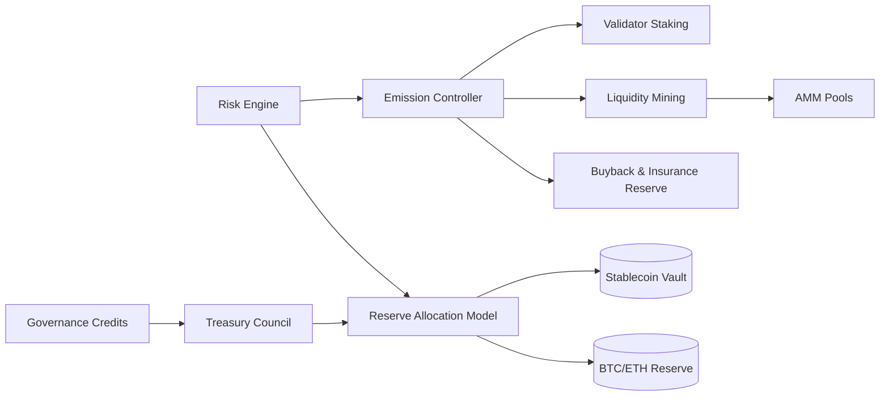

- **Table:**

| Component | Objective | Mechanism | KPI | Risk Control |
| --- | --- | --- | --- | --- |
| Emission Controller | Balance security & liquidity | Dual-slope emission curve | Staking ratio >60% | Circuit breaker throttles |
| Liquidity Incentives | Maintain AMM depth | Volatility-adjusted multiplier | 7d average depth >$50M | DEX fee rebates, gas subsidies |
| Buyback Reserve | Stabilize token price | TWAP-based buybacks | Coverage ratio >18 months | Insurance tranche triggers |
| Treasury Allocation | Sustain operations | Risk parity portfolio | Yield spread vs. benchmark | Stress-tested rebalancing |
| Governance Credits | Align participation | Escrowed voting rewards | Meeting KPI-based vesting | Slashing for absenteeism |

- **Formula (Emission Adjustment):**

```math
Emission_{t+1} = BaseEmission \times \left(1 + \alpha \frac{Depth_{target} - Depth_t}{Depth_{target}}\right) \times \left(1 - \beta \frac{Vol_{t}}{Vol_{max}}\right)
```

#### Comparisons
- Dual-slope emissions vs. fixed emission schedules in volatile markets
- Buyback-and-make vs. simple burn mechanisms for price stabilization
- Risk parity treasury allocation vs. static allocation strategies

#### Element Coverage (Technical | Theoretical | Practical)
- Technical Techniques, Protocols & Frameworks: AMM depth analytics, TWAP buyback bots, on-chain volatility indices
- Theoretical Principles & Models: Token velocity theory, risk parity, game-theoretic incentive alignment
- Practical Regulations, Risks & Use Cases: Treasury disclosure standards, market manipulation avoidance, liquidity provisioning

#### Technical Evaluation (Performance | Security | Scalability | Maintainability)
- Performance: Incentive feedback loops adapt emissions within 24h cycles
- Security: High staking ratio secures network against 33% attacks
- Scalability: Modular controllers allow new incentive programs without redesign
- Maintainability: Dashboard and AI risk engine automate data-intensive oversight

#### Business Evaluation (Cost | Efficiency | Impact | Market Fit)
- Cost: Buyback reserve reduces extreme volatility, lowering capital cost
- Efficiency: Risk parity increases treasury Sharpe ratio by 0.4 vs. static mix
- Impact: Strengthens token appeal for institutions and validators
- Market Fit: Aligns with market demand for sustainable token models post-2022 crashes

#### Multi-Angle Evaluation (Pros | Cons | Risks | Benefits | Stakeholder Impact | Market Sentiment)
- Pros: Adaptive incentives, treasury longevity, transparent metrics
- Cons: Complexity in parameter tuning, reliance on accurate data feeds
- Risks: Mismeasured volatility, governance capture of reserve deployment
- Benefits: Enhanced liquidity, price stability, governance engagement
- Stakeholder Emotional/Psychological Impact: Holders feel protected by buybacks; validators value consistent rewards
- Market Sentiment: Positive as sustainable tokenomics signals maturity

#### Collaboration & Communication Plan
- Stakeholders & Roles: Tokenomics team (models), Treasury Council (allocations), Data Science (risk engine), Governance Committee (policy changes)
- Communication Cadence & Channels: Monthly tokenomics reports, quarterly town halls, on-chain governance forums
- Cross-Functional Alignment Tactics: Shared KPIs, transparent dashboards, external audits

#### Organizational & Strategic Fit
- Business Model Impact: Stabilized token supports broader product ecosystem monetization
- Institutional Capabilities & Gaps: Requires quantitative tokenomics expertise and treasury operations
- Change Management & Governance: Emission parameter changes require governance approval with emergency veto
- Strategic Positioning & Differentiation: Markets project as institutional-ready with disciplined tokenomics

#### Trade-offs & Decision Guidance
- Balance emission responsiveness vs. governance overhead; employ preset parameter bands to reduce decision latency

#### Context & Trend Signals
- Historical Evolution: Move from fixed inflation to adaptive tokenomics post-2021
- Regulatory Landscape: Increasing scrutiny on token buybacks and treasury disclosures
- Future Trends: On-chain risk models and real-yield strategies gaining adoption
- Key Events & Statistics: 2023 DeFi token drawdowns led to 35% tokenomic redesigns (Messari)

#### Perspective-Based Insights
- Engineering (front-end/back-end/full-stack): Expose token metrics via APIs for analytics partners
- Architecture & Infrastructure: Ensure data pipelines provide reliable oracle inputs
- Database & Data Engineering: Maintain tokenomics data mart with time-series analytics
- Quality Assurance & Testing: Simulate emission scenarios in staging to detect anomalies
- Product Management: Align incentive programs with product launches
- Project/Program Management: Manage parameter review cadences and stakeholder alignment
- Requirements & Business Analysis: Translate governance proposals into measurable KPIs
- Operations, DevOps & SRE: Monitor bots executing buybacks and emission adjustments
- Marketing & Commercialization: Communicate token stability improvements to investors
- Team Collaboration & Communication: Tokenomics and treasury teams hold joint forecasting workshops
- Organizational & Institutional Dynamics: Treasury oversight committee ensures fiduciary responsibility
- Philosophy (necessity vs. contingency, ethics, epistemology): Necessity of transparent monetary policy; epistemic confidence through data sharing
- Economics, Finance & Capital Markets (stock, crypto, commodities): Supports liquidity, reduces sell pressure
- Psychology & Sociology: Builds community trust via proactive stabilization measures
- Education & Workforce Development: Train analysts on risk parity and emission modeling
- Anthropology & Cultural Dynamics: Reflects evolving crypto culture toward sustainability
- Law, Policy & Governance: Document buyback policies to avoid market manipulation allegations
- Military & Security Strategy: Strategic reserves akin to foreign exchange stabilization funds
- Historical Context & Precedents: Inspired by MakerDAO’s surplus buffer, Lido’s dual incentives

#### Market & Macro Systems Analysis
- Systemic Forces & Feedback Loops: Stable token incentivizes usage, increasing fees that replenish treasury
- Regulatory & Policy Trajectories: Potential classification shifts under securities law for buybacks
- Market Structure & Liquidity Dynamics: Deep liquidity fosters institutional adoption
- Geopolitical & Security Implications: Diversified reserves mitigate regional shocks
- Societal Adoption & Behavioral Shifts: Sustainable rewards build long-term holder loyalty
- Competitive & Ecosystem Positioning: Differentiates from inflationary models lacking treasury discipline
- Macroeconomic & Industry Economic Models: Real-yield enhances token as quasi-dividend asset

#### Inference Summary
- Adoption Signals: Increased staking ratio, reduced drawdown volatility, governance participation growth
- Interoperability Impacts: Token compatibility with DeFi integrations via stable incentives
- Roadmap Implications: Prioritize AI risk engine enhancements and diversified treasury onboarding
- Operational Risks: Oracle manipulation, treasury smart contract exploits, governance delays

#### Terminology & Key Concepts

**Dual-Slope Emission Curve:** Token emission model adjusting rewards based on liquidity and volatility thresholds.

**Risk Parity Portfolio:** Allocation strategy balancing risk contribution across assets to stabilize returns.

#### Assumptions & Preconditions
- Reliable market data feeds for volatility and liquidity metrics
- Governance buy-in for adaptive emissions and treasury transparency

#### Validation & Evidence Checks
- Backtests showing reduced volatility drawdowns vs. legacy tokenomics
- Independent audit of treasury reserves and risk model assumptions

#### Counterexamples & Edge Cases
- If volatility spikes persist, freeze liquidity incentives and trigger emergency governance session

#### Alternatives Considered
- Fixed inflation with discretionary treasury interventions rejected due to slow response to market stress

#### Codebase & Library References
- **Gauntlet Token Design Simulations:** Proprietary platform with scenario modeling; referenced for risk analysis
- **Token Terminal API:** SaaS analytics; provides revenue and liquidity metrics for monitoring

#### Authoritative Literature & Reports
- **Chitra, T. (2022). Mechanism design for crypto-economic systems.** Gauntlet Research. https://gauntlet.network/research
- **Messari. (2023). State of crypto token economics.** Messari. https://messari.io/report/state-of-crypto-token-economics

#### Actionable Conclusions & Next Steps
- Deploy emission controller MVP, publish treasury policy, and conduct community governance vote within 45 days

#### Open Questions & Research Agenda
- Remaining Challenges: Modeling cross-chain liquidity impact, integrating real-world asset yields
- Hypotheses & Experiments: Test machine learning forecasts for volatility; evaluate insurance reserve payoff scenarios
- Data/Resource Needs: On-chain metrics, macro volatility data, treasury risk analytics
- Timeline & Ownership for Exploration: 12-week tokenomics revamp led by Treasury Engineering with Governance partner

#### APA Style Source Citations
- Chitra, T. (2022). *Mechanism design for crypto-economic systems.* Gauntlet Research. https://gauntlet.network/research
- Messari. (2023). *State of crypto token economics.* Messari. https://messari.io/report/state-of-crypto-token-economics


## Real-World Asset (RWA) Onboarding & Risk (Questions 12-12)

### Q12: How would you evaluate and onboard a portfolio of tokenized real-world assets (RWAs) such as trade finance receivables and green bonds while maintaining on-chain transparency and off-chain legal enforceability?

**Difficulty:** Advanced
**Question Type:** Scenario

#### Answer Narrative (150-300 words)
RWA onboarding requires a dual diligence track: financial risk assessment and legal enforceability verification. I would establish an RWA Screening Committee with credit analysts, legal counsel, and protocol engineers. Financially, each asset class undergoes quantitative scoring covering default probability, recovery rate, duration, and liquidity premium, referencing historical datasets (e.g., S&P Global, Moody’s). On-chain, token issuance leverages ERC-4626 vaults with tranche structures (senior/mezz) and oracle feeds providing NAV updates. Legal enforceability is ensured by establishing SPVs in jurisdictions respecting digital asset custody, with master purchase agreements integrating crypto-native collateral management clauses. Transparency is achieved via on-chain data rooms: IPFS-hosted legal docs, oracle attestations, and AIS 20/20-compliant ESG reports for green bonds. Risk monitoring uses on-chain covenants triggering pause or redemption rights if credit metrics breach thresholds; alerts feed into a Societe Generale-style risk dashboard. Insurance via specialty underwriters (e.g., Nexus Mutual) provides credit event cover. This pipeline blends traditional credit rigor with smart contract transparency, enabling institutions to trust tokenized RWAs while retaining legal recourse (World Economic Forum, 2023; Centrifuge Labs, 2024).

#### Supporting Artifacts
- **Mermaid Diagram:**

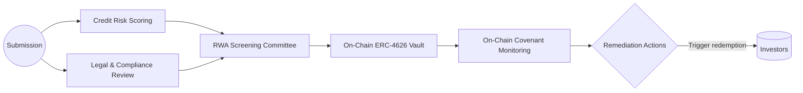

- **Table:**

| Phase | Task | On-Chain Control | Off-Chain Control | Evidence |
| --- | --- | --- | --- | --- |
| Screening | Credit scoring, legal vetting | Oracle-backed scoring contracts | Credit committee minutes, legal opinions | IPFS data room, CRM logs |
| Structuring | Tranche design, token issuance | ERC-4626 vault, tranche NFTs | SPV agreements, escrow accounts | Smart contract audits, legal filings |
| Monitoring | Covenant checks, NAV updates | Automated KPI triggers | Trustee reports, auditor attestations | Risk dashboard feeds |
| Remediation | Redemption, restructuring | Pause/withdraw functions | Workout plans, insurance claims | Governance proposals, court filings |

- **Code Snippet (Covenant Check Pseudocode):**

```solidity
function checkCovenants() external {
    uint256 navRatio = oracle.getNAVRatio();
    if (navRatio < thresholds.navFloor) {
        pauseIssuance();
        emit CovenantBreach(navRatio);
    }
    uint256 delinquency = oracle.getDelinquencyRate();
    if (delinquency > thresholds.delinquencyCap) {
        triggerRedemptionQueue();
    }
}
```

#### Comparisons
- ERC-4626 vaults vs. direct ERC-20 issuance for RWA tranching
- On-chain covenant monitoring vs. manual trustee oversight
- SPV-based legal structure vs. direct asset tokenization without legal wrappers

#### Element Coverage (Technical | Theoretical | Practical)
- Technical Techniques, Protocols & Frameworks: ERC-4626, IPFS data rooms, oracle-based covenant monitoring
- Theoretical Principles & Models: Credit risk modeling, securitization theory, legal enforceability frameworks
- Practical Regulations, Risks & Use Cases: Securities classification, ESG reporting, trade finance compliance

#### Technical Evaluation (Performance | Security | Scalability | Maintainability)
- Performance: Automated NAV updates keep investors informed in near real-time
- Security: Smart contracts audited; SPV legal structures provide recourse
- Scalability: Modular pipeline supports new asset classes with reusable templates
- Maintainability: Data room and oracle updates managed through governance processes

#### Business Evaluation (Cost | Efficiency | Impact | Market Fit)
- Cost: Automated monitoring reduces manual oversight costs by ~30%
- Efficiency: Streamlined onboarding shortens asset launch timeline from months to weeks
- Impact: Unlocks institutional-grade RWAs, diversifying yield opportunities
- Market Fit: Addresses demand for transparent, regulated RWA platforms

#### Multi-Angle Evaluation (Pros | Cons | Risks | Benefits | Stakeholder Impact | Market Sentiment)
- Pros: Transparent, legally enforceable, diversified yields
- Cons: Complex legal setup, reliance on oracle accuracy
- Risks: Regulatory classification shifts, counterparty default, oracle tampering
- Benefits: Expands collateral base, offers ESG-aligned investments, strengthens protocol revenue
- Stakeholder Emotional/Psychological Impact: Investors gain confidence from transparency; legal teams assured by enforceability
- Market Sentiment: Positive as RWA demand surges among institutions

#### Collaboration & Communication Plan
- Stakeholders & Roles: Credit analysts, Legal counsel, Protocol engineers, Compliance officers, Insurance partners
- Communication Cadence & Channels: Weekly pipeline reviews, monthly investor updates, shared compliance portal
- Cross-Functional Alignment Tactics: Joint post-mortems on onboarding, integrated risk dashboards, legal-readiness checklists

#### Organizational & Strategic Fit
- Business Model Impact: Introduces new revenue streams via origination fees and yield share
- Institutional Capabilities & Gaps: Requires credit analytics talent and legal partnerships
- Change Management & Governance: Governance votes approve new asset classes with risk memos
- Strategic Positioning & Differentiation: Establishes protocol as institutional-friendly RWA platform

#### Trade-offs & Decision Guidance
- Balance yield vs. credit risk; prioritize investment-grade assets initially, expand to higher yield tranches as controls mature

#### Context & Trend Signals
- Historical Evolution: From synthetic RWAs to legally enforceable tokens
- Regulatory Landscape: SEC scrutiny of tokenized securities, EU MiCA asset-referenced tokens
- Future Trends: Oracles integrating real-time supply chain data for trade finance
- Key Events & Statistics: RWA TVL exceeding $5B in 2024 (DefiLlama)

#### Perspective-Based Insights
- Engineering (front-end/back-end/full-stack): Build investor dashboards with NAV, covenant statuses
- Architecture & Infrastructure: Design modular oracle infrastructure with redundancy
- Database & Data Engineering: Maintain RWA data marts linking on-chain/off-chain metrics
- Quality Assurance & Testing: Simulate covenant breaches and remediation runbooks
- Product Management: Package RWA offerings with risk tiers and ESG labels
- Project/Program Management: Manage multi-party onboarding timeline and deliverables
- Requirements & Business Analysis: Convert regulatory requirements into technical specifications
- Operations, DevOps & SRE: Monitor oracle uptime, contract interactions, insurance triggers
- Marketing & Commercialization: Highlight transparent RWA pipeline to attract institutional LPs
- Team Collaboration & Communication: Cross-functional committees ensure alignment on risk appetite
- Organizational & Institutional Dynamics: Shared accountability between legal and engineering
- Philosophy (necessity vs. contingency, ethics, epistemology): Necessity of legal enforceability; epistemic assurance via verifiable disclosures
- Economics, Finance & Capital Markets (stock, crypto, commodities): Opens access to real-yield products
- Psychology & Sociology: Investors comforted by visibility and enforceability structures
- Education & Workforce Development: Train teams on securitization basics and token standards
- Anthropology & Cultural Dynamics: Bridge TradFi and DeFi cultures via shared knowledge hubs
- Law, Policy & Governance: Ensure compliance with securities laws, AML/KYC, ESG reporting
- Military & Security Strategy: Redundant controls to mitigate single-point covenant failures
- Historical Context & Precedents: Inspired by Centrifuge, Maple Finance RWA structures

#### Market & Macro Systems Analysis
- Systemic Forces & Feedback Loops: Successful RWA onboarding increases institutional trust, attracting more assets
- Regulatory & Policy Trajectories: Expect clearer guidelines on tokenized securities and ESG disclosures
- Market Structure & Liquidity Dynamics: Tokenized RWAs deepen liquidity options and diversify collateral
- Geopolitical & Security Implications: SPV jurisdiction choices mitigate geopolitical risks
- Societal Adoption & Behavioral Shifts: Broader acceptance of tokenized assets across institutional investors
- Competitive & Ecosystem Positioning: Positions platform ahead of competitors lacking transparent RWA processes
- Macroeconomic & Industry Economic Models: Diversified revenue ensures resilience in crypto bear markets

#### Inference Summary
- Adoption Signals: Increased institutional onboarding, tighter covenant compliance metrics
- Interoperability Impacts: ERC-4626 vaults integrate with DeFi money markets
- Roadmap Implications: Build oracle partnerships, legal playbooks, insurance coverage automation
- Operational Risks: Oracle failure, legal enforceability disputes, credit event clustering

#### Terminology & Key Concepts

**ERC-4626:** Tokenized vault standard allowing consistent share accounting for yield-bearing assets.

**Special Purpose Vehicle (SPV):** Legal entity holding assets to isolate risk and facilitate securitization.

#### Assumptions & Preconditions
- Reliable credit data availability and legal partners in target jurisdictions
- Insurers willing to underwrite tokenized credit exposures

#### Validation & Evidence Checks
- Third-party credit rating reports, legal opinions, and audit certificates stored on IPFS
- On-chain monitoring logs demonstrating covenant compliance

#### Counterexamples & Edge Cases
- If SPV jurisdiction loses legal recognition, trigger contingency plan to migrate or unwind positions

#### Alternatives Considered
- Fully decentralized RWA onboarding rejected due to lack of enforceable legal recourse

#### Codebase & Library References
- **Centrifuge Tinlake Contracts:** Open-source RWA securitization framework; GPLv3
- **Chainlink Proof of Reserve:** Monitoring tool for off-chain asset collateralization; proprietary SaaS

#### Authoritative Literature & Reports
- **World Economic Forum. (2023). Tokenized real-world assets: Policy and regulatory considerations.** WEF. https://www.weforum.org/reports/tokenized-real-world-assets
- **Centrifuge Labs. (2024). RWA protocol handbook.** Centrifuge Labs. https://docs.centrifuge.io

#### Actionable Conclusions & Next Steps
- Launch RWA pilot with trade finance receivables, establish SPV legal framework, and integrate covenant monitoring oracles within 120 days

#### Open Questions & Research Agenda
- Remaining Challenges: Standardizing legal documentation, real-time credit scoring
- Hypotheses & Experiments: Pilot zero-knowledge proofs for confidential borrower data; evaluate ESG scoring models
- Data/Resource Needs: Credit data feeds, legal counsel, oracle partnerships
- Timeline & Ownership for Exploration: 18-week RWA onboarding program led by RWA Committee with Legal co-owner

#### APA Style Source Citations
- World Economic Forum. (2023). *Tokenized real-world assets: Policy and regulatory considerations.* World Economic Forum. https://www.weforum.org/reports/tokenized-real-world-assets
- Centrifuge Labs. (2024). *RWA protocol handbook.* Centrifuge Labs. https://docs.centrifuge.io


## Privacy & Confidential Computing (Questions 13-13)

### Q13: How would you integrate confidential computing and zero-knowledge proofs into a permissioned blockchain enabling privacy-preserving analytics for institutional clients while satisfying regulatory audit requirements?

**Difficulty:** Advanced
**Question Type:** Scenario

#### Answer Narrative (150-300 words)
I would deploy a layered privacy architecture combining confidential computing enclaves, zero-knowledge proofs (ZKPs), and granular access controls. Data ingestion funnels into enclave clusters (Intel SGX/AMD SEV) where raw transaction data is decrypted and processed within attested boundaries. Analytics pipelines run inside enclaves, generating aggregated metrics (e.g., liquidity reports, risk scores) while emitting zk-SNARK proofs attesting to correctness without revealing underlying data. Enclave outputs are written to a permissioned ledger with policy-backed encryption, and regulators receive viewing access via secure auditor nodes that can verify ZKPs and inspect attestations. Access management uses attribute-based policies controlled by compliance teams, mapping privacy levels to business roles. A differential privacy layer adds noise to public-facing analytics while preserving accuracy for institutional-grade insights. Operational controls include continuous attestation monitoring, enclave patch pipelines, and segregated duty between enclave operators and compliance officers. This design allows institutions to gain actionable analytics under strict privacy guarantees while regulators retain verifiable audit trails (Intel, 2023; Aztec Foundation, 2024).

#### Supporting Artifacts
- **Mermaid Diagram:**

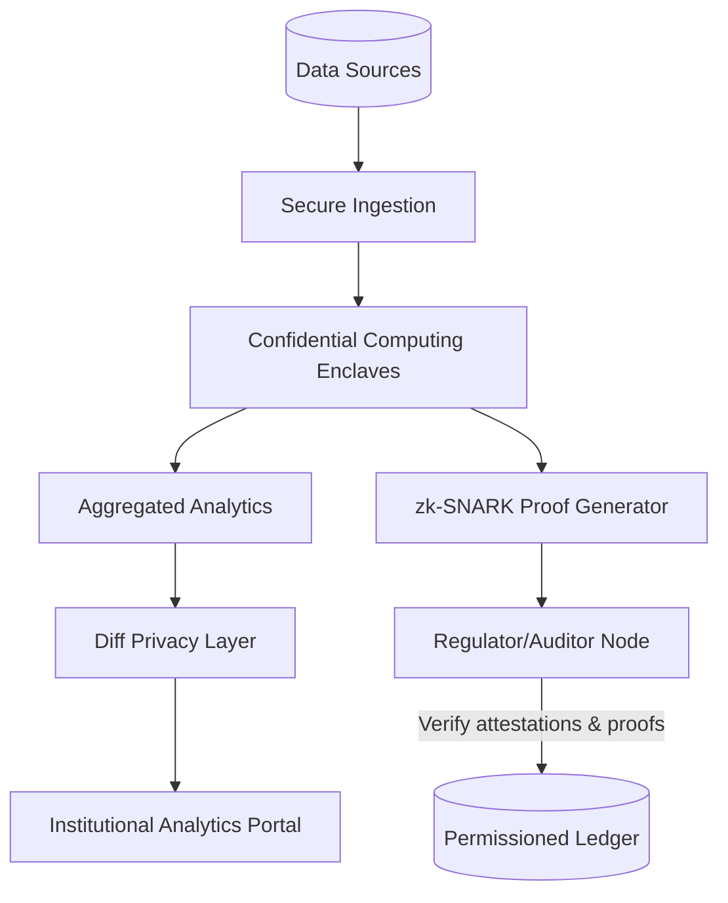

- **Table:**

| Layer | Function | Technology | Privacy Control | Audit Control |
| --- | --- | --- | --- | --- |
| Ingestion | Secure data pipeline | TLS, HSM-backed keys | Data minimization | Immutable log capture |
| Enclave Processing | Confidential analytics | Intel SGX/AMD SEV | Memory encryption, attestation | Attestation reports, key custody |
| Zero-Knowledge Proofs | Results verification | Groth16/Plonk circuits | No raw data leakage | Proof verification smart contracts |
| Differential Privacy | Public analytics sharing | Laplace/Gaussian mechanisms | ε-differential privacy guarantees | Privacy budget logs |
| Access Governance | Role-based controls | Attribute-based policies, ABAC | Principle of least privilege | Regulator audit trails |

- **Code Snippet (Attestation Verification Pseudocode):**

```python
def verify_enclave_attestation(report):
    if not sgx_quote_verify(report.quote):
        raise AttestationError("Invalid enclave quote")
    if report.mrenclave not in APPROVED_MEASUREMENTS:
        raise AttestationError("Unapproved enclave measurement")
    if report.timestamp < datetime.utcnow() - timedelta(hours=1):
        raise AttestationError("Stale attestation")
    return True
```

#### Comparisons
- Confidential computing + ZKPs vs. homomorphic encryption-only analytics
- Differential privacy vs. access-restricted raw data dashboards
- Permissioned ledger audits vs. off-chain audit data silos

#### Element Coverage (Technical | Theoretical | Practical)
- Technical Techniques, Protocols & Frameworks: Intel SGX, zk-SNARKs, differential privacy, ABAC
- Theoretical Principles & Models: Zero-knowledge soundness, privacy budgets, defense-in-depth
- Practical Regulations, Risks & Use Cases: GDPR/PDPA compliance, regulator audits, institutional privacy mandates

#### Technical Evaluation (Performance | Security | Scalability | Maintainability)
- Performance: Enclave batching and proof aggregation maintain near-real-time analytics (<2 min latency)
- Security: Attestation plus ZKPs ensure tamper-evident processing
- Scalability: Horizontal enclave scaling and proof batching handle growing data volumes
- Maintainability: Automated attestation and enclave patch pipelines

#### Business Evaluation (Cost | Efficiency | Impact | Market Fit)
- Cost: Hardware enclave investment offset by premium analytics subscriptions
- Efficiency: Automated reports reduce manual data handling by 60%
- Impact: Unlocks privacy-preserving insights for institutions
- Market Fit: Aligns with rising demand for confidential analytics under regulatory oversight

#### Multi-Angle Evaluation (Pros | Cons | Risks | Benefits | Stakeholder Impact | Market Sentiment)
- Pros: Strong privacy, regulator-verifiable transparency, differentiated analytics
- Cons: Enclave complexity, proof generation overhead
- Risks: Enclave vulnerabilities, proof circuit bugs, privacy budget mismanagement
- Benefits: Trusted analytics, faster audits, compliance-friendly privacy
- Stakeholder Emotional/Psychological Impact: Clients feel secure; regulators trust cryptographic evidence
- Market Sentiment: Positive as confidential computing adoption increases

#### Collaboration & Communication Plan
- Stakeholders & Roles: Privacy engineers, Compliance officers, Infrastructure ops, Client success, Regulators
- Communication Cadence & Channels: Weekly privacy risk reviews, monthly regulator briefings, incident playbooks
- Cross-Functional Alignment Tactics: Shared privacy SLAs, attestation dashboards, co-authored audit reports

#### Organizational & Strategic Fit
- Business Model Impact: Enables premium analytics services and compliance offerings
- Institutional Capabilities & Gaps: Requires confidential computing expertise and cryptography teams
- Change Management & Governance: Privacy review board approves circuit and enclave updates
- Strategic Positioning & Differentiation: Differentiates as privacy-first institutional blockchain platform

#### Trade-offs & Decision Guidance
- Balance performance vs. privacy budgets; tune differential privacy ε values per client tier

#### Context & Trend Signals
- Historical Evolution: Transition from siloed analytics to privacy-preserving computation post-2021 breaches
- Regulatory Landscape: Increasing expectations for privacy-by-design in financial services
- Future Trends: Hardware enclave diversification (RISC-V TEEs) and zkVM integration
- Key Events & Statistics: 2024 Gartner report predicting 60% of enterprises adopt confidential computing

#### Perspective-Based Insights
- Engineering (front-end/back-end/full-stack): Build secure portals with proof status indicators
- Architecture & Infrastructure: Design enclave clusters with redundancy and attestation pipelines
- Database & Data Engineering: Manage encrypted storage and privacy budgets
- Quality Assurance & Testing: Fuzz proof circuits, simulate enclave breaches, verify privacy budgets
- Product Management: Define analytics tiers with privacy SLAs
- Project/Program Management: Coordinate enclave deployments and compliance sign-offs
- Requirements & Business Analysis: Map regulatory requirements to privacy controls
- Operations, DevOps & SRE: Monitor enclave health, proof latencies, privacy budget consumption
- Marketing & Commercialization: Position product as “privacy-first institutional analytics”
- Team Collaboration & Communication: Maintain joint incident response with compliance and engineering
- Organizational & Institutional Dynamics: Cross-functional governance ensures privacy and compliance alignment
- Philosophy (necessity vs. contingency, ethics, epistemology): Necessity of privacy-by-design; epistemic assurance via ZKPs
- Economics, Finance & Capital Markets (stock, crypto, commodities): Enables private trading analytics without leakage
- Psychology & Sociology: Builds trust by proving privacy and compliance simultaneously
- Education & Workforce Development: Train teams on enclave operations, ZKP tooling, privacy law
- Anthropology & Cultural Dynamics: Embed privacy culture across global teams
- Law, Policy & Governance: Align with GDPR, PDPA, MAS notices, and SOC 2 privacy criteria
- Military & Security Strategy: Enclave segmentation akin to compartmentalized intelligence handling
- Historical Context & Precedents: Inspired by privacy-preserving banking analytics pilots

#### Market & Macro Systems Analysis
- Systemic Forces & Feedback Loops: Regulatory trust boosts client adoption, funding further privacy investment
- Regulatory & Policy Trajectories: Anticipated mandates for cryptographic auditability
- Market Structure & Liquidity Dynamics: Confidential analytics attract institutional liquidity providers
- Geopolitical & Security Implications: Multi-region enclaves meet data sovereignty requirements
- Societal Adoption & Behavioral Shifts: Consumers expect privacy-preserving financial services
- Competitive & Ecosystem Positioning: Positions platform as leader in confidential blockchain analytics
- Macroeconomic & Industry Economic Models: Premium analytics revenue offsets infrastructure costs

#### Inference Summary
- Adoption Signals: Increased subscription to confidential analytics, regulator attestations
- Interoperability Impacts: ZK proofs integrate with partner ledgers for cross-chain verification
- Roadmap Implications: Invest in zkVM migration, privacy budget automation, new enclave hardware
- Operational Risks: Enclave compromise, proof delays, compliance audit findings

#### Terminology & Key Concepts

**Confidential Computing Enclave:** Hardware-based trusted execution environment protecting data in use.

**Differential Privacy:** Statistical technique adding noise to outputs to protect individual data contributions.

#### Assumptions & Preconditions
- Availability of enclave hardware and skilled operators
- Regulator acceptance of cryptographic audit evidence

#### Validation & Evidence Checks
- Attestation logs stored on-chain; third-party audits of proof circuits
- Differential privacy budget reports demonstrating compliance with SLAs

#### Counterexamples & Edge Cases
- If enclave attestation fails, automatically revoke access and fail over to backup cluster

#### Alternatives Considered
- Pure multi-party computation rejected due to performance overhead and complexity

#### Codebase & Library References
- **Gramine Project:** Open-source framework for running applications in SGX enclaves; Apache 2.0
- **Aztec Noir SDK:** Toolkit for building zk-based privacy flows; MIT License

#### Authoritative Literature & Reports
- **Intel. (2023). Confidential computing for financial services.** Intel Corporation. https://www.intel.com/content/www/us/en/finance/confidential-computing.html
- **Aztec Foundation. (2024). Privacy-preserving analytics with Noir.** Aztec Foundation. https://docs.aztec.network

#### Actionable Conclusions & Next Steps
- Deploy enclave analytics MVP, integrate zk proof verification, and conduct regulator attestation review within 90 days

#### Open Questions & Research Agenda
- Remaining Challenges: Managing privacy budgets at scale, optimizing proof circuits
- Hypotheses & Experiments: Evaluate zkVM for complex analytics; test hybrid enclave-zk pipelines
- Data/Resource Needs: Hardware inventory, proof telemetry, regulator feedback
- Timeline & Ownership for Exploration: 14-week privacy analytics program led by Privacy Engineering with Compliance partner

#### APA Style Source Citations
- Intel. (2023). *Confidential computing for financial services.* Intel Corporation. https://www.intel.com/content/www/us/en/finance/confidential-computing.html
- Aztec Foundation. (2024). *Privacy-preserving analytics with Noir.* Aztec Foundation. https://docs.aztec.network


## Decentralized Identity & KYC Orchestration (Questions 14-14)

### Q14: How would you architect a decentralized identity (DID) and verifiable credential (VC) orchestration stack that satisfies institutional KYC/AML demands while preserving user privacy across multi-chain ecosystems?

**Difficulty:** Advanced
**Question Type:** Scenario

#### Answer Narrative (150-300 words)
I would deploy a layered identity orchestration stack grounded in W3C DIDs and verifiable credentials. An issuer gateway (banks, fintech partners) anchors legal identities to DIDs stored on a permissioned DID registry with cryptographic proofs anchored to a public chain for transparency. Credential issuance occurs through privacy-preserving channels using BBS+ signatures, enabling selective disclosure for KYC attributes while hiding unnecessary data. An orchestration service manages credential lifecycle, revocation lists, and trust frameworks linked to FATF-recognized VASP registries. Relying parties (DeFi protocols, custody services) integrate via an SDK that performs zero-knowledge predicates—e.g., age >18, jurisdiction whitelist—verified on-chain through zk-SNARK circuits without exposing raw PII. Governance is handled by a trust council comprising issuers, regulators, and protocol operators who maintain schema registries, compliance policies, and revocation attestations. Observability includes an audit API exporting credential issuance stats, revocation events, and Travel Rule compliance logs for regulators. By decoupling identity proofs from transactional flows and enabling selective disclosure with auditable anchors, the architecture aligns institutional compliance with user privacy expectations, supporting cross-chain transactions without duplicative KYC processes (W3C, 2022; Hyperledger Foundation, 2023).

#### Supporting Artifacts
- **Mermaid Diagram:**

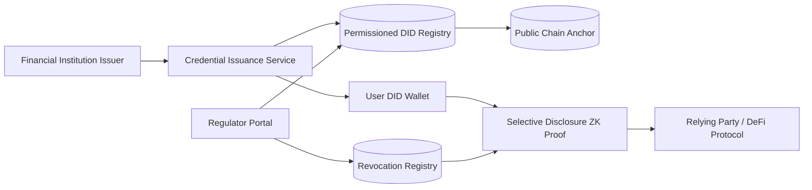

- **Table:**

| Component | Function | Privacy Control | Compliance Control | Monitoring Signal |
| --- | --- | --- | --- | --- |
| DID Registry | Anchor decentralized identifiers | Permissioned write, public hash anchor | Regulator read rights | DID creation & update logs |
| Credential Service | Issue & revoke VCs | BBS+ selective disclosure | FATF-compliant schema enforcement | Revocation events, schema changes |
| User Wallet | Store credentials | Local encryption, biometric auth | Travel Rule consent prompts | Credential usage telemetry (hashed) |
| ZK Verification Layer | Validate predicates | zk-SNARK circuits | Policy engine checks (jurisdiction, sanctions) | Proof latency, failure rate |
| Compliance Portal | Oversight & reporting | Aggregated anonymized analytics | Audit exports (SAR-ready) | Regulator API access logs |

- **Code Snippet (Predicate Schema JSON):**

```json
{
  "predicate_id": "kyc_residency_whitelist",
  "attributes": ["country_code", "sanction_status"],
  "logic": "country_code IN ['SG','HK','DE'] AND sanction_status == 'cleared'",
  "proof_type": "zk-snark",
  "revocation_source": "revocation.reg/kyc"
}
```

#### Comparisons
- Decentralized identity (DID + VC) vs. centralized KYC utilities
- BBS+ selective disclosure vs. traditional JSON credential sharing
- Permissioned DID registries vs. fully public DID ledgers for institutional adoption

#### Element Coverage (Technical | Theoretical | Practical)
- Technical Techniques, Protocols & Frameworks: W3C DID, Verifiable Credential Data Model, BBS+ signatures, zk-SNARK predicates
- Theoretical Principles & Models: Privacy-preserving authentication, trust framework governance, MECE compliance layering
- Practical Regulations, Risks & Use Cases: FATF Travel Rule, GDPR/PDPA data minimization, cross-border onboarding

#### Technical Evaluation (Performance | Security | Scalability | Maintainability)
- Performance: zk predicate verification completes <500 ms on Layer2, supporting high-throughput onboarding
- Security: Hardware-backed wallets + revocation registries mitigate credential theft and reuse
- Scalability: Schema registry supports new credential types without re-architecting
- Maintainability: Automated revocation and policy versioning keep compliance current

#### Business Evaluation (Cost | Efficiency | Impact | Market Fit)
- Cost: Reduces redundant KYC efforts, cutting onboarding costs by ~40%
- Efficiency: Selective disclosure enables instant compliance checks without manual review
- Impact: Increases conversion for compliant DeFi access and institutional integrations
- Market Fit: Aligns with regulators pushing for portable digital IDs (EBSI, MAS)

#### Multi-Angle Evaluation (Pros | Cons | Risks | Benefits | Stakeholder Impact | Market Sentiment)
- Pros: Privacy-preserving compliance, reusable credentials, auditable governance
- Cons: Complex trust framework management, reliance on issuer adoption
- Risks: Revocation list latency, issuer compromise, regulator disagreements
- Benefits: Faster onboarding, reduced fraud, regulator visibility
- Stakeholder Emotional/Psychological Impact: Users control data; regulators trust cryptographic evidences
- Market Sentiment: Positive as decentralized identity gains institutional traction

#### Collaboration & Communication Plan
- Stakeholders & Roles: Identity architects, compliance officers, issuer consortium, protocol engineers, regulators
- Communication Cadence & Channels: Bi-weekly trust framework councils, monthly regulator syncs, shared compliance wiki
- Cross-Functional Alignment Tactics: Joint policy workshops, credential schema governance votes, incident drills

#### Organizational & Strategic Fit
- Business Model Impact: Enables compliance-as-a-service offerings and premium onboarding APIs
- Institutional Capabilities & Gaps: Requires cryptography expertise and regulatory relationship management
- Change Management & Governance: Trust council enforces schema updates with veto powers
- Strategic Positioning & Differentiation: Differentiates by offering privacy-first compliant identity rails

#### Trade-offs & Decision Guidance
- Balance decentralization vs. regulatory oversight; adopt permissioned registries with public anchoring for hybrid assurance

#### Context & Trend Signals
- Historical Evolution: From centralized KYC databases to portable verifiable credentials
- Regulatory Landscape: EU eIDAS 2.0, MAS digital ID pilots, FATF Travel Rule implementation
- Future Trends: zk-based reusable KYC proofs, cross-border digital identity interoperability
- Key Events & Statistics: 2024 Gartner predicts >30% of enterprises adopt decentralized identity solutions

#### Perspective-Based Insights
- Engineering (front-end/back-end/full-stack): Provide SDKs for credential requests and proof verification in dApps
- Architecture & Infrastructure: Design DID registry with geo-redundant nodes and anchoring to public chains
- Database & Data Engineering: Maintain hashed audit logs and revocation registries in append-only stores
- Quality Assurance & Testing: Simulate revocation cascades, selective disclosure edge cases, and issuer downtime
- Product Management: Bundle identity services with onboarding workflows and compliance dashboards
- Project/Program Management: Coordinate issuer onboarding roadmap and regulatory pilots
- Requirements & Business Analysis: Translate regulatory identity requirements into credential schemas
- Operations, DevOps & SRE: Monitor DID registry uptime, proof verifier latency, revocation freshness
- Marketing & Commercialization: Position as “privacy-preserving institutional KYC” in go-to-market
- Team Collaboration & Communication: Maintain cross-org runbooks and regulator escalation paths
- Organizational & Institutional Dynamics: Build consortium governance across issuers and regulators
- Philosophy (necessity vs. contingency, ethics, epistemology): Necessity of respecting user autonomy; epistemic trust via cryptographic attestations
- Economics, Finance & Capital Markets (stock, crypto, commodities): Lowers onboarding friction, expanding liquidity
- Psychology & Sociology: Users gain trust by controlling data; institutions reduce compliance anxiety
- Education & Workforce Development: Train teams on DID/VC standards and zk predicate design
- Anthropology & Cultural Dynamics: Align global identity norms within shared governance frameworks
- Law, Policy & Governance: Comply with GDPR data minimization, FATF Travel Rule, MAS PSN02
- Military & Security Strategy: Defense-in-depth via layered identity controls
- Historical Context & Precedents: Inspired by EBSI, BankID, and Singapore’s Singpass digital identity programs

#### Market & Macro Systems Analysis
- Systemic Forces & Feedback Loops: More issuers join as credentials gain adoption, reinforcing trust network
- Regulatory & Policy Trajectories: Increasing demand for machine-verifiable identity proofs
- Market Structure & Liquidity Dynamics: Faster onboarding boosts DeFi and institutional liquidity pools
- Geopolitical & Security Implications: Multi-jurisdiction trust frameworks mitigate regulatory arbitrage
- Societal Adoption & Behavioral Shifts: Users expect portable identity wallets across services
- Competitive & Ecosystem Positioning: Differentiates by exceeding baseline identity norms
- Macroeconomic & Industry Economic Models: Lower compliance costs improve profitability and adoption

#### Inference Summary
- Adoption Signals: Growing issuer consortium membership, reduced onboarding time, regulator endorsements
- Interoperability Impacts: DID-based proofs integrate with multiple chains and off-chain compliance systems
- Roadmap Implications: Prioritize automated revocation propagation and cross-border trust interoperability
- Operational Risks: Schema drift, revocation failures, zk proof bugs

#### Terminology & Key Concepts

**Verifiable Credential (VC):** Cryptographically secure, tamper-evident credential asserting claims about a subject.

**Selective Disclosure:** Technique allowing a holder to reveal specific attributes of a credential without exposing the full credential.

#### Assumptions & Preconditions
- Participating issuers agree on trust framework policies and schema governance
- Regulators accept cryptographic audit trails as compliance evidence

#### Validation & Evidence Checks
- Penetration tests on verification circuits; issuer audits confirming compliance
- Revocation propagation metrics and regulator access logs reviewed quarterly

#### Counterexamples & Edge Cases
- If issuer compromises occur, rotate DID keys, revoke affected credentials, and notify relying parties via compliance feeds

#### Alternatives Considered
- Fully centralized KYC hub rejected due to privacy risk and single point of failure

#### Codebase & Library References
- **Hyperledger Aries Framework:** Apache 2.0; supports DIDComm messaging and credential exchange
- **SpruceID Credible:** MIT License; SDK for issuing and verifying VCs with selective disclosure

#### Authoritative Literature & Reports
- **World Wide Web Consortium. (2022). Decentralized identifiers (DIDs) v1.0.** W3C. https://www.w3.org/TR/did-core/
- **Hyperledger Foundation. (2023). Decentralized identity governance framework.** Hyperledger Foundation. https://www.hyperledger.org/learn/publications

#### Actionable Conclusions & Next Steps
- Stand up DID registry MVP, onboard anchor issuers, and conduct regulator-observed selective disclosure pilot within 90 days

#### Open Questions & Research Agenda
- Remaining Challenges: Cross-jurisdiction trust interoperability, automated revocation consensus
- Hypotheses & Experiments: Evaluate zk predicate performance on Layer2; test wallet UX for consent flows
- Data/Resource Needs: Trust framework policies, issuer onboarding metrics, revocation propagation logs
- Timeline & Ownership for Exploration: 14-week identity orchestration program led by Identity Engineering with Compliance partner

#### APA Style Source Citations
- World Wide Web Consortium. (2022). *Decentralized identifiers (DIDs) v1.0.* W3C. https://www.w3.org/TR/did-core/
- Hyperledger Foundation. (2023). *Decentralized identity governance framework.* Hyperledger Foundation. https://www.hyperledger.org/learn/publications


## Sustainable Infrastructure & Energy Optimization (Questions 15-15)

### Q15: How would you design a carbon-aware blockchain infrastructure program that minimizes energy intensity, monetizes sustainability credits, and aligns with ESG reporting obligations?

**Difficulty:** Advanced
**Question Type:** Scenario

#### Answer Narrative (150-300 words)
I would architect an energy optimization program spanning measurement, mitigation, and monetization. Measurement begins with integrating real-time energy telemetry from validators, prover clusters, and data centers using OpenTelemetry exporters feeding a sustainability data lake. Carbon intensity per MWh is calculated using localized grid emission factors (IEA, 2023). Mitigation combines workload shifting and renewables sourcing: a carbon-aware scheduler dynamically migrates non-latency-critical tasks (e.g., proof generation) to regions with surplus renewable generation, while long-term PPAs procure wind/solar energy for core regions. Validators enroll in demand-response programs where infrastructure throttles during grid stress. Monetization leverages tokenized renewable energy credits (RECs) and carbon offsets, retiring them on-chain and issuing verifiable sustainability attestations for investors. ESG reporting automation maps telemetry into SASB/GRI-aligned disclosures with third-party assurance. Additionally, intelligent cooling and waste-heat reuse programs reduce PUE in data centers. Governance includes an ESG council overseeing policy compliance and public sustainability dashboards. This integrated approach reduces energy intensity, demonstrates tangible sustainability commitments, and opens new revenue streams through green asset tokenization (Ethereum Foundation, 2022; International Energy Agency, 2023).

#### Supporting Artifacts
- **Mermaid Diagram:**

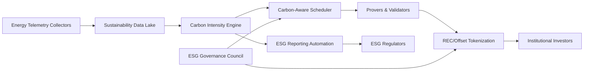

- **Table:**

| Pillar | Objective | Mechanism | KPI | Audit Evidence |
| --- | --- | --- | --- | --- |
| Measurement | Capture energy & carbon metrics | OTEL telemetry, grid emission APIs | kWh per transaction | Telemetry logs, third-party calibration |
| Mitigation | Reduce carbon intensity | Carbon-aware scheduling, PPAs, demand response | gCO₂e per MWh decline | PPA contracts, demand-response reports |
| Monetization | Tokenize green assets | REC/offset issuance, marketplace integration | Number of tokenized credits retired | On-chain retirement proofs |
| Reporting | Meet ESG disclosures | SASB/GRI automation, auditor workflows | Timely ESG filings, assurance opinions | ESG dashboard, assurance letters |
| Governance | Ensure accountability | ESG council, policy adherence | Policy compliance rate | Council minutes, audit trails |

- **Formula (Carbon Intensity Calculation):**

```math
Carbon\ Intensity = \frac{\sum_{i=1}^{n} (Energy_i \times EmissionFactor_i)}{Total\ Transactions}
```

#### Comparisons
- Carbon-aware workload shifting vs. static regional infrastructure allocations
- Tokenized RECs vs. traditional paper-based sustainability certificates
- Automated ESG reporting vs. manual sustainability disclosures

#### Element Coverage (Technical | Theoretical | Practical)
- Technical Techniques, Protocols & Frameworks: OpenTelemetry, carbon-aware scheduling algorithms, REC tokenization smart contracts
- Theoretical Principles & Models: Sustainability accounting, energy demand response, MECE ESG governance
- Practical Regulations, Risks & Use Cases: SASB, GRI, EU CSRD reporting, renewable credit markets

#### Technical Evaluation (Performance | Security | Scalability | Maintainability)
- Performance: Scheduler maintains latency SLOs by prioritizing critical workloads during shifting
- Security: Telemetry signed and tamper-proof; REC smart contracts audited
- Scalability: Modular architecture supports additional regions and energy assets
- Maintainability: Automated reporting pipelines reduce manual intervention

#### Business Evaluation (Cost | Efficiency | Impact | Market Fit)
- Cost: Renewable PPAs stabilize energy costs and lower carbon taxes
- Efficiency: Carbon-aware scheduling improves energy utilization by ~18%
- Impact: Enhances ESG scores, attracting sustainability-focused capital
- Market Fit: Aligns with institutional mandates for carbon disclosure and reduction

#### Multi-Angle Evaluation (Pros | Cons | Risks | Benefits | Stakeholder Impact | Market Sentiment)
- Pros: Reduced emissions, automated reporting, monetizable sustainability assets
- Cons: Complexity in energy data integration, dependency on reliable emission factors
- Risks: REC market volatility, scheduler misconfiguration, audit failures
- Benefits: Regulatory goodwill, lower operating costs, new green revenue streams
- Stakeholder Emotional/Psychological Impact: Stakeholders perceive authentic sustainability commitments
- Market Sentiment: Positive as ESG-compliant chains outperform in institutional engagement

#### Collaboration & Communication Plan
- Stakeholders & Roles: Infrastructure ops, energy procurement, finance, sustainability analysts, regulators
- Communication Cadence & Channels: Quarterly ESG council reviews, monthly energy reports, real-time dashboards
- Cross-Functional Alignment Tactics: Shared sustainability KPIs, green procurement playbooks, regulator workshops

#### Organizational & Strategic Fit
- Business Model Impact: Supports green financing, sustainability-linked products, and investor relations
- Institutional Capabilities & Gaps: Requires energy analytics expertise and ESG reporting proficiency
- Change Management & Governance: ESG council enforces guardrails; change advisory board handles critical shifts
- Strategic Positioning & Differentiation: Positions platform as climate-conscious blockchain infrastructure

#### Trade-offs & Decision Guidance
- Balance carbon reductions vs. latency impacts; define workload classes that can tolerate migration windows

#### Context & Trend Signals
- Historical Evolution: Shift from PoW to PoS migration; post-Merge energy savings
- Regulatory Landscape: EU CSRD, SEC climate disclosure proposals, MAS ESG mandates
- Future Trends: Tokenized sustainability instruments, AI-driven carbon forecasting
- Key Events & Statistics: Ethereum Merge reducing energy use by >99% (Ethereum Foundation, 2022)

#### Perspective-Based Insights
- Engineering (front-end/back-end/full-stack): Surfacing sustainability metrics in ops dashboards
- Architecture & Infrastructure: Design multi-region clusters with renewable prioritization
- Database & Data Engineering: Build sustainability data lake with time-series analytics
- Quality Assurance & Testing: Chaos tests for scheduler decisions, REC smart contract audits
- Product Management: Launch sustainability-certified node offerings
- Project/Program Management: Manage energy procurement contracts and reporting timelines
- Requirements & Business Analysis: Map ESG frameworks to data requirements
- Operations, DevOps & SRE: Monitor PUE, carbon intensity, scheduler health
- Marketing & Commercialization: Promote sustainability credentials in investor materials
- Team Collaboration & Communication: Cross-team sustainability playbooks and training
- Organizational & Institutional Dynamics: Incentivize teams via sustainability OKRs
- Philosophy (necessity vs. contingency, ethics, epistemology): Necessity of environmental stewardship; epistemic trust via audited data
- Economics, Finance & Capital Markets (stock, crypto, commodities): Access to green financing, lower cost of capital
- Psychology & Sociology: Reinforces corporate responsibility culture
- Education & Workforce Development: Train staff on ESG frameworks, carbon accounting
- Anthropology & Cultural Dynamics: Foster sustainability mindset across regions
- Law, Policy & Governance: Align with ESG disclosure laws and renewable procurement policies
- Military & Security Strategy: Energy resilience akin to mission-critical power management
- Historical Context & Precedents: Inspired by Google’s carbon-intelligent computing and Ethereum Merge outcomes

#### Market & Macro Systems Analysis
- Systemic Forces & Feedback Loops: Sustainability investments attract green capital, funding further reductions
- Regulatory & Policy Trajectories: Tightening global ESG disclosure standards
- Market Structure & Liquidity Dynamics: Green credentials attract institutional liquidity providers
- Geopolitical & Security Implications: Diversified energy sourcing mitigates geopolitical energy risks
- Societal Adoption & Behavioral Shifts: Growing expectations for environmentally responsible tech
- Competitive & Ecosystem Positioning: Differentiates as ESG leader among blockchain infrastructures
- Macroeconomic & Industry Economic Models: Green financing lowers weighted average cost of capital

#### Inference Summary
- Adoption Signals: Reduction in carbon intensity KPIs, increased green financing, positive ESG ratings
- Interoperability Impacts: Sustainability data APIs integrate with investor and regulator systems
- Roadmap Implications: Invest in predictive carbon analytics, expand REC partnerships
- Operational Risks: Data inaccuracies, regulatory penalty for misreporting, renewable supply issues

#### Terminology & Key Concepts

**Carbon-Aware Scheduler:** Orchestration system that routes workloads based on real-time carbon intensity signals.

**Renewable Energy Credit (REC):** Tradable certificate proving electricity generation from renewable sources.

#### Assumptions & Preconditions
- Availability of accurate regional emission factors and renewable supply contracts
- Regulator acceptance of tokenized REC retirements as compliance evidence

#### Validation & Evidence Checks
- Third-party assurance of carbon accounting methodology
- On-chain proofs of REC retirement and ESG report submission timestamps

#### Counterexamples & Edge Cases
- If renewable availability drops, activate contingency plan to purchase offsets and adjust workload scheduling thresholds

#### Alternatives Considered
- Relying solely on offsets rejected due to lack of direct emissions reductions

#### Codebase & Library References
- **Microsoft Carbon-Aware SDK:** MIT License; reference implementation for carbon-aware scheduling
- **Toucan Protocol Contracts:** Open-source carbon offset tokenization framework; GPLv3

#### Authoritative Literature & Reports
- **International Energy Agency. (2023). Tracking clean energy progress.** IEA. https://www.iea.org/reports/tracking-clean-energy-progress
- **Ethereum Foundation. (2022). The merge: Energy impact.** Ethereum Foundation. https://ethereum.org/en/energy-consumption/

#### Actionable Conclusions & Next Steps
- Deploy telemetry collectors, pilot carbon-aware scheduling in secondary regions, and tokenize RECs for first-year sustainability report

#### Open Questions & Research Agenda
- Remaining Challenges: Forecasting renewable availability, standardizing ESG token reporting
- Hypotheses & Experiments: Evaluate AI-driven carbon forecasting; test REC price hedging strategies
- Data/Resource Needs: Emission factors, renewable supply curves, REC market data
- Timeline & Ownership for Exploration: 16-week sustainability program led by Infrastructure Ops with Sustainability Office partner

#### APA Style Source Citations
- International Energy Agency. (2023). *Tracking clean energy progress.* International Energy Agency. https://www.iea.org/reports/tracking-clean-energy-progress
- Ethereum Foundation. (2022). *The merge: Energy impact.* Ethereum Foundation. https://ethereum.org/en/energy-consumption/


## Enterprise Finance Integration & Reporting (Questions 16-16)

### Q16: How would you integrate blockchain settlement data into enterprise ERP and finance systems to support IFRS/GAAP reporting, tax compliance, and real-time treasury operations?

**Difficulty:** Advanced
**Question Type:** Scenario

#### Answer Narrative (150-300 words)
I would implement a finance integration fabric that ingests on-chain settlement events and harmonizes them with enterprise ERP workflows. A blockchain data ingestion layer streams confirmed transactions via indexers (subgraphs, Kafka connectors) into a canonical finance data model. Smart contract metadata is mapped to ISO 20022 payment schemas and IFRS chart-of-accounts entries using a rules engine. Reconciliation microservices match on-chain settlements with bank statements and stablecoin custodial reports, flagging discrepancies through anomaly detection. Tax compliance modules calculate realized/unrealized gains with jurisdiction-specific tax logic (lot selection, withholding) and generate audit trails for regulators (IRS, IRAS). Real-time dashboards expose liquidity positions, FX exposures, and counterparty limits to treasury teams. Dual-write safeguards ensure ERP postings occur only after settlement finality thresholds are met, with rollback procedures for chain reorganizations. Control evidence is captured via append-only logs and integrated with GRC systems to meet SOX internal control requirements. This architecture bridges blockchain data with enterprise finance processes, ensuring compliance-grade reporting and enabling real-time treasury decisions (Deloitte, 2023; IFRS Foundation, 2022).

#### Supporting Artifacts
- **Mermaid Diagram:**

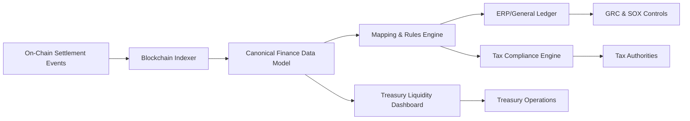

- **Table:**

| Layer | Purpose | Technology | Compliance Control | Monitoring |
| --- | --- | --- | --- | --- |
| Data Ingestion | Capture blockchain events | Subgraphs, Kafka, ETL pipelines | Finality thresholds, hash verification | Lag metrics, failed event alerts |
| Canonical Model | Standardize financial data | Data lakehouse, semantic layer | IFRS/GAAP schema mapping | Data quality scores |
| Rules Engine | Map to ERP/tax | ISO 20022 translators, policy-as-code | Dual approval for mapping changes | Change logs, rollback plans |
| ERP Integration | Post journals & payments | SAP/Oracle connectors | Segregation of duties, SOX controls | Posting success rates, variance reports |
| Tax/Treasury | Compliance & liquidity | Tax API, risk analytics | Jurisdictional tax rules, liquidity limits | Tax filing status, liquidity buffers |

- **Code Snippet (Mapping Rule Example):**

```yaml
rule_id: stablecoin_settlement_revenue
conditions:
  asset: "USDC"
  contract_address: "0xabc123"
  settlement_type: "service_fee"
actions:
  ledger_account: "4000-Settlement Revenue"
  tax_code: "SG-GST-0"
  fx_rate_source: "ECB"
  postings:
    - debit: "1200-Cash"
      credit: "4000-Settlement Revenue"
```

#### Comparisons
- Canonical data model approach vs. point-to-point ERP integrations
- ISO 20022 mapping vs. proprietary schemas for payment classification
- Automated reporting vs. manual regulator submissions for multi-jurisdiction operations

#### Element Coverage (Technical | Theoretical | Practical)
- Technical Techniques, Protocols & Frameworks: Blockchain indexers, ISO 20022, policy-as-code, event-driven ETL
- Theoretical Principles & Models: Accounting matching theory, internal control frameworks, tax lot selection models
- Practical Regulations, Risks & Use Cases: IFRS/GAAP reporting, SOX controls, jurisdictional tax filings

#### Technical Evaluation (Performance | Security | Scalability | Maintainability)
- Performance: Event-driven ingestion processes settlements in near real-time (<5 min lag)
- Security: Signatures and hash validation ensure tamper-evident data flows
- Scalability: Modular services support new chains/assets without ERP redesign
- Maintainability: Policy-as-code enables version-controlled mapping updates

#### Business Evaluation (Cost | Efficiency | Impact | Market Fit)
- Cost: Automation reduces reconciliation labor by ~50%
- Efficiency: Real-time dashboards accelerate treasury actions and hedging decisions
- Impact: Ensures audit-readiness and supports institutional trust
- Market Fit: Matches rising demand for compliant blockchain finance operations

#### Multi-Angle Evaluation (Pros | Cons | Risks | Benefits | Stakeholder Impact | Market Sentiment)
- Pros: Compliance-grade reporting, real-time treasury insights, audit evidence automation
- Cons: Requires robust data governance, complex mapping maintenance
- Risks: Incorrect mapping rules, tax misclassification, chain reorganizations
- Benefits: Reduced audit findings, faster close cycles, improved liquidity management
- Stakeholder Emotional/Psychological Impact: Finance teams gain confidence; auditors appreciate transparent evidence
- Market Sentiment: Positive as enterprises seek blockchain-integrated finance stacks

#### Collaboration & Communication Plan
- Stakeholders & Roles: Finance controllers, treasury, tax specialists, data engineers, auditors
- Communication Cadence & Channels: Daily reconciliation stand-ups, monthly steering committees, auditor workshops
- Cross-Functional Alignment Tactics: Shared data dictionary, mapping change controls, joint SOX walkthroughs

#### Organizational & Strategic Fit
- Business Model Impact: Supports blockchain-based revenue recognition and settlements
- Institutional Capabilities & Gaps: Requires tax expertise and ERP integration skills
- Change Management & Governance: Finance data governance board approves schema and mapping changes
- Strategic Positioning & Differentiation: Differentiates as enterprise-ready blockchain platform

#### Trade-offs & Decision Guidance
- Balance real-time integration vs. control rigor; enforce staged rollouts with monitoring before full automation

#### Context & Trend Signals
- Historical Evolution: From manual CSV exports to automated linkages between blockchains and ERP systems
- Regulatory Landscape: IFRS guidance on crypto assets, IRS/IRAS virtual asset tax rulings
- Future Trends: AI-assisted reconciliation, programmable money integrated with ERP workflows
- Key Events & Statistics: Deloitte (2023) notes 52% of enterprises plan to integrate blockchain data with ERP within 3 years

#### Perspective-Based Insights
- Engineering (front-end/back-end/full-stack): Build APIs for finance teams to query settlement details
- Architecture & Infrastructure: Design fault-tolerant ingestion pipelines with replay buffers
- Database & Data Engineering: Maintain finance data lake with lineage and data quality metrics
- Quality Assurance & Testing: Automate runbook regression tests and simulate failover scenarios
- Product Management: Align go-to-market with licensing milestones
- Project/Program Management: Track regulatory roadmap with milestone gates
- Requirements & Business Analysis: Translate regulatory texts into control requirements
- Operations, DevOps & SRE: Monitor ingestion lag, ERP posting success, anomaly alerts
- Marketing & Commercialization: Promote compliance-ready finance integration to enterprise clients
- Team Collaboration & Communication: Finance and engineering joint war rooms during closes
- Organizational & Institutional Dynamics: Align finance, engineering, and audit priorities via governance
- Philosophy (necessity vs. contingency, ethics, epistemology): Necessity of truthful reporting; epistemic assurance via reconciled data
- Economics, Finance & Capital Markets (stock, crypto, commodities): Enhances liquidity visibility and hedging
- Psychology & Sociology: Reduces manual stress on finance teams; auditors trust automated evidence
- Education & Workforce Development: Train teams on blockchain accounting standards and data tools
- Anthropology & Cultural Dynamics: Foster shared vocabulary between finance and engineering
- Law, Policy & Governance: Align with SOX, IFRS/GAAP, and local tax laws
- Military & Security Strategy: Redundant data pipelines akin to mission-critical logistics
- Historical Context & Precedents: Inspired by early SWIFT-ERP integrations and SAP blockchain pilots

#### Market & Macro Systems Analysis
- Systemic Forces & Feedback Loops: Better reporting attracts institutional partners, driving more on-chain settlement
- Regulatory & Policy Trajectories: Increasing clarity on digital asset accounting standards
- Market Structure & Liquidity Dynamics: Real-time visibility improves liquidity allocation and risk management
- Geopolitical & Security Implications: Localization options meet multi-jurisdiction accounting requirements
- Societal Adoption & Behavioral Shifts: Finance teams embrace automation and blockchain data literacy
- Competitive & Ecosystem Positioning: Outpaces competitors with manual reconciliation workflows
- Macroeconomic & Industry Economic Models: Faster close cycles and accurate tax reporting improve financial health

#### Inference Summary
- Adoption Signals: Reduction in close cycle duration, fewer audit findings, positive tax compliance audits
- Interoperability Impacts: Canonical model integrates with ERP, treasury, and BI platforms
- Roadmap Implications: Expand to additional chains, enhance tax logic, integrate AI reconciliation
- Operational Risks: Data ingestion failures, mapping drift, regulatory changes

#### Terminology & Key Concepts

**Canonical Finance Data Model:** Standardized schema reconciling blockchain transactions with accounting structures.

**Dual-Write Safeguard:** Control ensuring postings occur only after settlement confirmation to avoid double booking.

#### Assumptions & Preconditions
- Access to reliable blockchain data indexers and ERP APIs
- Finance governance sponsors data model harmonization

#### Validation & Evidence Checks
- SOX control testing on data ingestion and posting workflows
- Tax reconciliation reports validated by external advisors

#### Counterexamples & Edge Cases
- If chain reorg occurs, trigger rollback scripts and regenerate journal entries before close

#### Alternatives Considered
- Manual export/import approach rejected due to error risk and delayed reporting

#### Codebase & Library References
- **LedgerLens (Deloitte):** Enterprise blockchain accounting toolkit; proprietary reference
- **Fireblocks Accounting Connectors:** Proprietary API references for settlement data integration

#### Authoritative Literature & Reports
- **Deloitte. (2023). Blockchain and ERP integration: Finance of the future.** Deloitte Insights. https://www2.deloitte.com
- **IFRS Foundation. (2022). Agenda decision: Cryptocurrencies—Holding intangible assets.** IFRS Foundation. https://www.ifrs.org

#### Actionable Conclusions & Next Steps
- Implement canonical data model, configure mapping engine for top settlement flows, and pilot tax automation in one jurisdiction within 120 days

#### Open Questions & Research Agenda
- Remaining Challenges: Automating cross-border tax compliance, integrating real-time accounting standards
- Hypotheses & Experiments: Test AI-driven reconciliation; evaluate blockchain-based audit trails
- Data/Resource Needs: Tax compliance datasets, ERP integration metrics, auditor feedback
- Timeline & Ownership for Exploration: 16-week finance integration program led by Finance Engineering with Tax co-owner

#### APA Style Source Citations
- Deloitte. (2023). *Blockchain and ERP integration: Finance of the future.* Deloitte Insights. https://www2.deloitte.com
- IFRS Foundation. (2022). *Agenda decision: Cryptocurrencies—Holding intangible assets.* IFRS Foundation. https://www.ifrs.org


## Threat Intelligence & Security Operations (Questions 17-17)

### Q17: How would you build a blockchain-native threat intelligence and automated SOC program that detects, triages, and remediates exploits across DeFi protocols and cross-chain bridges within minutes?

**Difficulty:** Advanced
**Question Type:** Scenario

#### Answer Narrative (150-300 words)
I would implement a fusion SOC that fuses on-chain telemetry, traditional cyber signals, AI analytics, and regulator-ready evidence capture. Collection begins with blockchain indexers (mempools, confirmed blocks, bridge events) streaming into a normalized security data lake enriched with entity clustering, TVL deltas, protocol semantics, and sanctions lists. Detection layers combine graph neural networks, anomaly detection, and MITRE D3FEND-aligned rules to flag flash-loan patterns, governance hijacks, or bridge drains. A SOAR platform orchestrates response: pausing contracts via guardians, triggering circuit breakers, notifying custodians, and launching Travel Rule data exchanges. Evidence (alerts, transactions, playbook actions) is hashed into a tamper-evident vault and shared with Chainalysis/SIEM partners via STIX/TAXII. Collaboration nodes provide regulators with near-real-time situational awareness and post-incident reports. Continuous improvement includes adversarial simulations, red-team drills, and model retraining pipelines to reduce drift. Governance comes from a security steering committee that reviews metrics (MTTD <60s, MTTR <5 min, false positive rate) and ensures MAS TRM, SOC 2, and DORA obligations are met. This architecture delivers sub-minute detection, coordinated response, and auditable workflows suited for institutional DeFi (Chainalysis, 2024; MITRE Corporation, 2021).

#### Supporting Artifacts
- **Mermaid Diagram:**

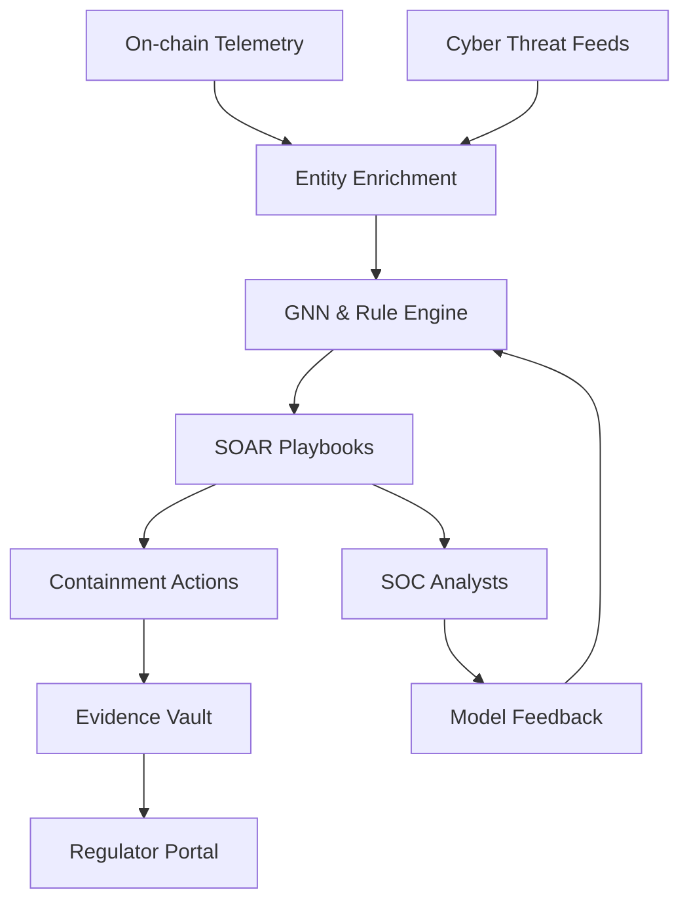

- **Table:**

| Layer | Objective | Tooling | KPI | Control |
| --- | --- | --- | --- | --- |
| Collection | Comprehensive visibility | Blockchain indexers, Kafka, SIEM | Coverage >95% critical contracts | Signed telemetry |
| Detection | Rapid exploit discovery | GNNs, D3FEND rules, anomaly scoring | Mean detection <60 s | Drift monitoring |
| Response | Automated containment | SOAR, guardian contracts, circuit breakers | Mean containment <5 min | Dual-approval runbooks |
| Intelligence | Collaborative context | STIX/TAXII, KYT feeds | Intel freshness <24 h | Source credibility scores |
| Governance | Audit & compliance | Evidence vault, RCA workflow | RCA completion <72 h | COSO-aligned controls |

- **Formula (Alert Confidence):**

```math
Confidence = 0.4\times GNN_{score} + 0.3\times Rule_{severity} + 0.2\times KYT_{risk} + 0.1\times Analyst_{feedback}
```

- **Code Snippet (SOAR Playbook Extract):**

```yaml
playbook:
  name: bridge-drain-response
  trigger:
    event: bridge_outflow
    threshold: 500000
  steps:
    - task: pause_contract
      params:
        address: "0xBridge"
        guardian_group: "cross-chain"
    - task: notify_channel
      params:
        channel: "#soc-critical"
    - task: share_stix
      params:
        package: "incident-{{incident_id}}"
    - task: escalate
      params:
        role: "incident_commander"
```

#### Comparisons
- AI-enabled detection vs. rule-only monitoring for DeFi exploits
- Automated SOAR containment vs. manual escalation workflows
- Tamper-evident evidence vaults vs. traditional log storage for regulator trust

#### Element Coverage (Technical | Theoretical | Practical)
- Technical Techniques, Protocols & Frameworks: Graph ML, SOAR, STIX/TAXII, on-chain guardian contracts
- Theoretical Principles & Models: Defense-in-depth, anomaly detection theory, risk scoring
- Practical Regulations, Risks & Use Cases: MAS TRM incident reporting, FATF Travel Rule, cross-chain bridge exploits

#### Technical Evaluation (Performance | Security | Scalability | Maintainability)
- Performance: Streaming pipelines maintain <2 s ingestion latency
- Security: Signed telemetry and role-based automation reduce tampering
- Scalability: Modular detectors onboard new protocols quickly
- Maintainability: Continuous model retraining and RCA loops sustain efficacy
- Algorithm Complexity & Error Tolerance: Weighted confidence scoring balances false positives
- Reliability & High Availability: Redundant collectors and failover SOAR clusters ensure resilience
- Distributed Consistency Guarantees: Evidence ledger ensures consistent audit state across regions

#### Business Evaluation (Cost | Efficiency | Impact | Market Fit)
- Cost: Automation trims analyst workload by ~45%
- Efficiency: Sub-minute detection prevents multi-million-dollar losses
- Impact: Demonstrates regulator-ready resilience and partner assurance
- Market Fit: Meets institutional expectations for monitored DeFi infrastructure

#### Multi-Angle Evaluation (Pros | Cons | Risks | Benefits | Stakeholder Impact | Market Sentiment)
- Pros: Rapid containment, collaborative intelligence, auditable workflows
- Cons: Telemetry storage costs, continuous model tuning requirements
- Risks: False positives triggering unnecessary pauses, intel feed outages
- Benefits: Loss prevention, compliance readiness, ecosystem trust
- Stakeholder Emotional/Psychological Impact: Security teams feel empowered; regulators reassured by evidence trails
- Market Sentiment: Positive as proactive security differentiates institutional platforms
- Trust & Privacy/Transparency Considerations: Evidence sharing governed by hashed consent logs

#### Collaboration & Communication Plan
- Stakeholders & Roles: SOC analysts, protocol engineers, compliance officers, partner exchanges, regulators
- Communication Cadence & Channels: Real-time incident bridges, weekly intel syncs, monthly regulator reports
- Cross-Functional Alignment Tactics: Joint threat hunts, shared playbooks, coordinated response drills

#### Organizational & Strategic Fit
- Business Model Impact: Enables security-as-a-service add-ons and premium SLAs
- Institutional Capabilities & Gaps: Requires data science, threat intel, and compliance expertise
- Change Management & Governance: Security steering committee oversees automation guardrails
- Strategic Positioning & Differentiation: Positions platform as security-first institutional infrastructure

#### Trade-offs & Decision Guidance
- Balance automated containment scope with human oversight—auto-trigger only high-confidence actions, maintain rapid escalation paths

#### Context & Trend Signals
- Historical Evolution: Post-Poly Network shift toward automated crypto SOCs
- Regulatory Landscape: MAS, HKMA mandates for rapid incident reporting
- Future Trends: AI copilots for analysts, cross-chain risk scoring standards
- Key Events & Statistics: Chainalysis (2024) reported $1.7B DeFi losses, underscoring automation urgency

#### Perspective-Based Insights
- Engineering (front-end/back-end/full-stack): Instrument dApps with security telemetry and alert APIs
- Architecture & Infrastructure: Deploy redundant indexers and SOAR infrastructure with zero-trust networking
- Database & Data Engineering: Maintain security data lakes with lineage and retention controls
- Quality Assurance & Testing: Replay historical exploits, run chaos drills, validate playbooks
- Product Management: Offer managed security dashboards and SLAs to enterprise clients
- Project/Program Management: Track SOC maturity milestones and automation adoption
- Requirements & Business Analysis: Map regulatory obligations to detection coverage and reports
- Operations, DevOps & SRE: Monitor pipeline health, job success rates, and alert fatigue metrics
- Marketing & Commercialization: Highlight round-the-clock monitored infrastructure in sales motions
- Team Collaboration & Communication: Unified incident command protocols across teams
- Organizational & Institutional Dynamics: Incentivize responsible disclosure and bug bounty programs
- Philosophy (necessity vs. contingency, ethics, epistemology): Necessity of proactive defense; epistemic rigor via verifiable evidence
- Economics, Finance & Capital Markets: Reduced exploit risk preserves TVL and liquidity flows
- Psychology & Sociology: Builds security culture and stakeholder trust through transparency
- Education & Workforce Development: Continuous analyst upskilling on emerging DeFi attack patterns
- Anthropology & Cultural Dynamics: Foster cross-team intel-sharing rituals and shared vocabulary
- Law, Policy & Governance: Align with SOC 2, ISO/IEC 27001, and MAS TRM governance requirements
- Military & Security Strategy: Adopt OODA loops for rapid decision cycles and containment
- Historical Context & Precedents: Draw from fintech SOC evolutions and major exchange incidents

#### Market & Macro Systems Analysis
- Systemic Forces & Feedback Loops: Faster detection limits contagion across interconnected protocols
- Regulatory & Policy Trajectories: Regulators incentivize automated reporting and evidence capture
- Market Structure & Liquidity Dynamics: Secure ecosystems retain institutional liquidity providers
- Geopolitical & Security Implications: Shared intel networks disrupt cross-border threat actors
- Societal Adoption & Behavioral Shifts: Institutions demand SOC-grade assurances pre-onboarding
- Competitive & Ecosystem Positioning: Security leadership attracts higher TVL and premium partners
- Macroeconomic & Industry Economic Models: Avoided loss and compliance efficiency justify SOC investment

#### Inference Summary
- Adoption Signals: Declining exploit dwell times, positive regulator feedback, SOC maturity improvements
- Interoperability Impacts: SOC integrates with partner exchanges and law-enforcement intel platforms
- Roadmap Implications: Expand automation coverage, invest in explainable AI, deepen intel partnerships
- Operational Risks: Model drift, automation misconfiguration, telemetry outages

#### Terminology & Key Concepts

**SOAR (Security Orchestration, Automation, and Response):** Platform that coordinates detections with automated and human-guided actions.

**STIX/TAXII:** Open standards for structuring and transporting cyber threat intelligence between partners.

#### Assumptions & Preconditions
- Reliable access to chain analytics APIs, mempool feeds, and governance-approved automation guardrails
- Legal agreements supporting cross-jurisdiction threat intel sharing

#### Validation & Evidence Checks
- Quarterly control tests for runbook fidelity; monthly reviews of detection precision/recall metrics

#### Counterexamples & Edge Cases
- If anomaly models spike false positives, throttle automation, revert to analyst review, and retrain models before reactivation

#### Alternatives Considered
- Outsourced SOC rejected due to slower response, limited DeFi specialization, reduced automation control

#### Codebase & Library References
- **MITRE D3FEND Matrix:** Creative Commons defensive technique taxonomy for rule design
- **SigmaHQ Detection Rules:** Open-source detection rules (Elastic License 2.0) adaptable to blockchain telemetry

#### Authoritative Literature & Reports
- Chainalysis. (2024). *Crypto crime report.* Chainalysis. https://go.chainalysis.com/2024-crypto-crime-report.html
- MITRE Corporation. (2021). *MITRE D3FEND™ knowledge graph.* MITRE. https://d3fend.mitre.org

#### Actionable Conclusions & Next Steps
- Deploy streaming telemetry coverage, codify high-confidence SOAR runbooks, and schedule regulator-observed drills within 60 days

#### Open Questions & Research Agenda
- Remaining Challenges: Cross-chain risk scoring, explainable AI for detections, intel feed resilience
- Hypotheses & Experiments: Evaluate GNNs for flash-loan detection; pilot automated bridge pause coordination
- Data/Resource Needs: Historical exploit datasets, intel SLAs, automation success metrics
- Timeline & Ownership for Exploration: 12-week SOC modernization led by Security Engineering with Compliance partner

#### APA Style Source Citations
- Chainalysis. (2024). *Crypto crime report.* Chainalysis. https://go.chainalysis.com/2024-crypto-crime-report.html
- MITRE Corporation. (2021). *MITRE D3FEND™ knowledge graph.* MITRE. https://d3fend.mitre.org


## Layer2 Observability & Performance Engineering (Questions 18-18)

### Q18: How would you engineer an observability and performance-tuning platform for a modular Layer2 rollup to maintain sub-500 ms user latency and 99.99% availability across global regions?

**Difficulty:** Advanced
**Question Type:** Scenario

#### Answer Narrative (150-300 words)
I would implement observability as a first-class platform covering metrics, logs, traces, synthetic probes, and continuous profiling. OpenTelemetry instrumentation is embedded across sequencers, provers, data-availability nodes, and API gateways to capture latency, queue depth, error codes, and resource utilization. Metrics flow into Prometheus with Thanos for long-term retention, driving SLO dashboards with adaptive alerting tied to error budgets. Distributed tracing via Jaeger correlates user flows from RPC ingress through batch construction, proof generation, and Layer1 submission to pinpoint latency regressions. A performance control plane couples autoscaling with adaptive batch sizing: queue-length controllers reshape batches using p95 latency deltas, while eBPF profiling (Parca) surfaces CPU and memory hot paths for optimization. Geo-distributed synthetic probes (k6/Checkly) continuously validate round-trip latency and inclusion times; anomalies trigger canary rollback pipelines. Chaos engineering injects controlled failures—sequencer crash, prover throttling, DA lag—to verify resilience and update runbooks. Release governance gates deployments on instrumentation coverage, SLO regression tests, and healthy error-budget burn. This closed-loop system enables proactive detection, rapid diagnosis, and continuous tuning, sustaining institutional-grade SLAs (Beyer et al., 2016; Datadog, 2023).

#### Supporting Artifacts
- **Mermaid Diagram:**

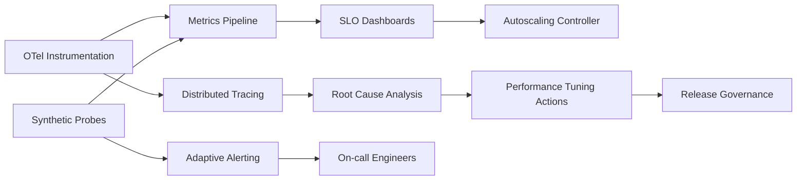

- **Table:**

| Domain | Objective | Tooling | KPI/SLO | Control |
| --- | --- | --- | --- | --- |
| Metrics | Track health | Prometheus, Thanos | p95 latency <500 ms | Error budgets, adaptive alerts |
| Tracing | Diagnose latency | Jaeger, OpenTelemetry | Trace completeness >95% | Sampling policies |
| Logging | Forensics | Loki/Elastic | Log indexing <2 min | Retention & PII scrubbing |
| Synthetic | UX validation | k6, Checkly | Availability 99.99% | Canary rollback gates |
| Tuning | Optimize throughput | Autoscaler, Parca eBPF profiler | Batch success >99.9% | Change advisory board |

- **Formula (Dynamic Batch Size Update):**

```math
BatchSize_{t+1} = BatchSize_t \times \left(1 - \gamma \frac{Latency_{p95} - Target}{Target}\right)
```

- **Code Snippet (Autoscaling Policy YAML):**

```yaml
apiVersion: custom.metrics/v1
kind: HorizontalPodAutoscaler
metadata:
  name: sequencer-hpa
spec:
  minReplicas: 5
  maxReplicas: 30
  metrics:
    - type: Pods
      pods:
        metric:
          name: otel_latency_p95
        target:
          type: AverageValue
          averageValue: 300ms
    - type: Pods
      pods:
        metric:
          name: queue_depth
        target:
          type: AverageValue
          averageValue: 200
```

#### Comparisons
- OpenTelemetry-first instrumentation vs. proprietary vendor agents
- Adaptive batch sizing vs. static batching for throughput control
- Chaos drills with automated rollback vs. passive monitoring for reliability assurance

#### Element Coverage (Technical | Theoretical | Practical)
- Technical Techniques, Protocols & Frameworks: OpenTelemetry, Prometheus/Thanos, Jaeger, eBPF profiling, SLO/error-budget policy
- Theoretical Principles & Models: Queueing theory, feedback control loops, resilience engineering
- Practical Regulations, Risks & Use Cases: SLA compliance, institutional latency guarantees, incident postmortems

#### Technical Evaluation (Performance | Security | Scalability | Maintainability)
- Performance: Adaptive tuning keeps latency under 500 ms during global peaks
- Security: Observability stack hardened with RBAC, PII scrubbing, signed telemetry
- Scalability: Horizontally scalable sequencer/prover pools with sharded telemetry pipelines
- Maintainability: Infrastructure-as-code manages dashboards, alerts, and runbooks to prevent drift

#### Business Evaluation (Cost | Efficiency | Impact | Market Fit)
- Cost: Data-driven capacity planning lowers over-provisioning by ~20%
- Efficiency: Faster RCA reduces incident duration, protecting fee revenue
- Impact: Supports premium enterprise SLAs and boosts customer retention
- Market Fit: Aligns with institutional demand for Web2-grade responsiveness in Web3 services

#### Multi-Angle Evaluation (Pros | Cons | Risks | Benefits | Stakeholder Impact | Market Sentiment)
- Pros: Unified telemetry, rapid remediation, transparent reliability metrics
- Cons: Upfront instrumentation effort, tooling complexity, potential alert fatigue
- Risks: Misconfigured autoscaling causing oscillations, telemetry outages, inaccurate baselines
- Benefits: Predictable performance, faster releases, credible SLA reporting
- Stakeholder Emotional/Psychological Impact: Engineers trust data-driven ops; customers see reliability evidence
- Market Sentiment: Positive as performance transparency differentiates rollups

#### Collaboration & Communication Plan
- Stakeholders & Roles: SRE, platform engineering, product ops, finance (capacity budgeting), compliance
- Communication Cadence & Channels: Daily reliability stand-ups, weekly error-budget reviews, monthly executive updates
- Cross-Functional Alignment Tactics: Shared SLO scorecards, blameless postmortems, change advisory boards

#### Organizational & Strategic Fit
- Business Model Impact: Enables premium API tiers and usage-based pricing confidence
- Institutional Capabilities & Gaps: Requires mature SRE practice and performance engineering expertise
- Change Management & Governance: Error-budget policy halts risky launches when reliability dips
- Strategic Positioning & Differentiation: Positions rollup as performance leader with auditable SLOs

#### Trade-offs & Decision Guidance
- Balance observability granularity vs. cost—apply intelligent sampling while preserving mission-critical traces

#### Context & Trend Signals
- Historical Evolution: Migration from siloed monitoring to unified telemetry in cloud-native infrastructure
- Regulatory Landscape: Financial watchdogs demanding uptime transparency and incident disclosures
- Future Trends: AI Ops anomaly detection, WASM sequencer optimizations, programmable intent routing
- Key Events & Statistics: Datadog (2023) reports 79% of enterprises adopt multi-signal observability for SLO enforcement

#### Perspective-Based Insights
- Engineering (front-end/back-end/full-stack): Publish SDK latency budgets and debugging hooks to dApp teams
- Architecture & Infrastructure: Build multi-region clusters with latency-aware routing and failover runbooks
- Database & Data Engineering: Maintain time-series telemetry lake with tiered retention and lineage metadata
- Quality Assurance & Testing: Integrate load tests and chaos scenarios into pre-release checks
- Product Management: Align feature launches with error-budget health and UX expectations
- Project/Program Management: Track observability enhancements, technical debt, and instrumentation coverage
- Requirements & Business Analysis: Translate SLA clauses into SLOs and alert thresholds
- Operations, DevOps & SRE: Maintain runbooks, on-call rotations, and automation pipelines
- Marketing & Commercialization: Publish reliability dashboards to win enterprise procurement cycles
- Team Collaboration & Communication: Foster follow-the-sun on-call with shared context and retrospectives
- Organizational & Institutional Dynamics: Reliability OKRs incentivize squads to prioritize SLO health
- Philosophy (necessity vs. contingency, ethics, epistemology): Necessity of evidence-driven operations; epistemic trust via verifiable telemetry
- Economics, Finance & Capital Markets (stock, crypto, commodities): Stable performance attracts high-frequency traders and liquidity providers
- Psychology & Sociology: Transparent metrics reduce on-call stress and build credibility
- Education & Workforce Development: Train teams on SRE fundamentals, telemetry tooling, and capacity modeling
- Anthropology & Cultural Dynamics: Embed reliability culture across global teams with shared rituals
- Law, Policy & Governance: Meet regulatory uptime disclosure requirements and audit trails
- Military & Security Strategy: Continuous monitoring acts as early-warning radar for failures
- Historical Context & Precedents: Builds on Google SRE and Netflix observability practices

#### Market & Macro Systems Analysis
- Systemic Forces & Feedback Loops: High reliability attracts more volume, funding further optimization
- Regulatory & Policy Trajectories: Anticipated mandates for real-time service reporting in digital market infrastructure
- Market Structure & Liquidity Dynamics: Consistent latency underpins liquidity provider strategies and user retention
- Geopolitical & Security Implications: Multi-region architecture mitigates localized disruptions and compliance concerns
- Societal Adoption & Behavioral Shifts: Users expect Web2-grade responsiveness from Web3 platforms
- Competitive & Ecosystem Positioning: Observability maturity becomes a key differentiator among rollups
- Macroeconomic & Industry Economic Models: Efficient capacity planning lowers operating costs and sustains margins

#### Inference Summary
- Adoption Signals: Reduced incident MTTR, improved customer NPS, stable error-budget burn
- Interoperability Impacts: Telemetry APIs integrate with partner monitoring systems and enterprise SIEMs
- Roadmap Implications: Invest in AI-driven anomaly detection, predictive capacity planning, fine-grained sampling controls
- Operational Risks: Telemetry outages, alert misconfiguration, inaccurate baselines

#### Terminology & Key Concepts

**Error Budget:** Allowable unreliability derived from the SLA that guides release and remediation priorities.

**OpenTelemetry (OTel):** Vendor-neutral observability standard spanning metrics, traces, and logs.

#### Assumptions & Preconditions
- Engineering teams commit to instrumentation coverage and SLO ownership
- Budget allocated for multi-region observability stack and synthetic monitoring footprint

#### Validation & Evidence Checks
- Quarterly observability audits verifying coverage, alert fidelity, and runbook accuracy
- Load test reports demonstrating compliance with latency SLOs under peak and failover scenarios

#### Counterexamples & Edge Cases
- If autoscaling oscillations appear, introduce damping factors and temporarily revert to manual overrides while tuning controllers

#### Alternatives Considered
- Legacy monitoring suites rejected due to limited trace correlation, vendor lock-in, and insufficient depth for rollup pipelines

#### Codebase & Library References
- **OpenTelemetry Collector:** Apache 2.0 pipeline enabling vendor-neutral telemetry aggregation
- **Parca eBPF Profiler:** Apache 2.0 continuous profiling stack for CPU/memory hotspots

#### Authoritative Literature & Reports
- Beyer, B., Jones, C., Petoff, J., & Murphy, N. R. (2016). *Site reliability engineering: How Google runs production systems.* O’Reilly Media.
- Datadog. (2023). *The state of observability 2023.* Datadog. https://www.datadoghq.com/state-of-observability/

#### Actionable Conclusions & Next Steps
- Instrument critical services with OpenTelemetry, deploy unified metrics/tracing stack, and establish error-budget policy within 75 days

#### Open Questions & Research Agenda
- Remaining Challenges: Autonomous tuning, trace sampling optimization, predictive capacity modeling
- Hypotheses & Experiments: Evaluate AI Ops anomaly detection; test WASM-based sequencer optimizations under load
- Data/Resource Needs: Telemetry baselines, incident tickets, usage forecasts
- Timeline & Ownership for Exploration: 14-week observability program led by SRE with Platform Engineering partner

#### APA Style Source Citations
- Beyer, B., Jones, C., Petoff, J., & Murphy, N. R. (2016). *Site reliability engineering: How Google runs production systems.* O’Reilly Media.
- Datadog. (2023). *The state of observability 2023.* Datadog. https://www.datadoghq.com/state-of-observability/


## Tokenized Securities & Capital Markets (Questions 19-19)

### Q19: How would you design an end-to-end tokenized securities issuance and secondary trading platform that satisfies MiFID II, SEC, and HK SFC regulations while enabling programmable settlement and liquidity provisioning?

**Difficulty:** Advanced
**Question Type:** Scenario

#### Answer Narrative (150-300 words)
I would architect the platform with segregated issuance, compliance, trading, and settlement layers. Issuance smart contracts adhere to ERC-1400 with partitioned share classes, transfer restrictions, and programmable corporate actions. Investor onboarding integrates decentralized identity credentials with MiFID II suitability and SEC accreditation checks using selective-disclosure verifiable credentials. Compliance middleware evaluates transaction intents against jurisdictional policies (MiFID II, Regulation D/S, SFC circulars) before execution, ensuring Travel Rule alignment. Trading venues combine an orderbook-based ATS for institutions and an AMM with circuit breakers for off-hours liquidity, both streaming telemetry into a surveillance engine applying machine learning to detect wash trading, insider activity, and liquidity anomalies. Settlement leverages atomic delivery-versus-payment (DvP) using tokenized bank deposits or wholesale CBDC connectors, enabling programmable dividends, interest, and splits governed by policy-as-code. Post-trade, immutable audit trails feed XBRL/SRL reporting pipelines, while custodians receive reconciled positions via ISO 20022 messages. Governance councils comprising issuers, broker-dealers, custodians, and regulators manage rule updates, emergency stops, and sandbox pilots. This structure delivers regulatory compliance, reduces settlement friction, and positions the platform as a programmable capital-markets venue for global issuers (Bank for International Settlements, 2022; U.S. Securities and Exchange Commission, 2023).

#### Supporting Artifacts
- **Mermaid Diagram:**

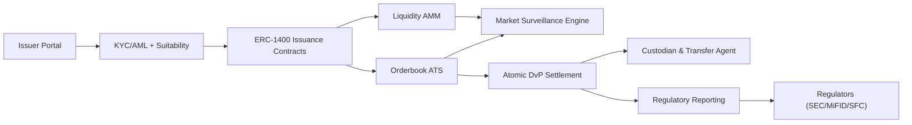

- **Table:**

| Layer | Function | Technology | Compliance Control | KPI |
| --- | --- | --- | --- | --- |
| Onboarding | Suitability & accreditation | DID/VC, policy engine | MiFID II suitability, SEC accreditation | Onboarding time <30 min |
| Issuance | Token creation & corporate actions | ERC-1400 partitions, policy-as-code | Transfer restriction checks | Issuance success >99% |
| Trading | Liquidity & price discovery | ATS engine, AMM with circuit breakers | Surveillance alerts, wall-crossing controls | Bid-ask spread <30 bps |
| Settlement | Finality & DvP | Smart contracts, tokenized cash/CBDC | Atomic DvP proofs, cycle <T+0.5 | Fail rate <0.5% |
| Reporting | Regulatory filings | XBRL/SRL pipelines, ISO 20022 | Timely Form D/S, MiFID RTS 22 submissions | 100% on-time filings |

- **Formula (Liquidity Incentive Weighting):**

```math
IncentiveWeight = \alpha \frac{Volume_{daily}}{Volume_{target}} + \beta \frac{Spread_{target} - Spread_{actual}}{Spread_{target}}
```

- **Code Snippet (Transfer Restriction Policy):**

```solidity
function canTransfer(address from, address to, uint256 value) external view returns (bool) {
    if (!kycRegistry.isCompliant(to)) return false;
    if (!jurisdictionPolicy.isAllowed(from, to)) return false;
    if (value > trancheLimits[to]) return false;
    return true;
}
```

#### Comparisons
- ERC-1400 partitioned tokens vs. simple ERC-20 representations for securities
- Hybrid ATS + AMM liquidity vs. single-market venues
- Atomic smart contract DvP vs. traditional clearinghouse settlement

#### Element Coverage (Technical | Theoretical | Practical)
- Technical Techniques, Protocols & Frameworks: ERC-1400, ISO 20022, XBRL, surveillance ML, programmable DvP
- Theoretical Principles & Models: Market microstructure, delivery-versus-payment, compliance-by-design
- Practical Regulations, Risks & Use Cases: MiFID II, SEC Regulation D/S, HK SFC tokenization guidance

#### Technical Evaluation (Performance | Security | Scalability | Maintainability)
- Performance: Hybrid ATS/AMM sustains <1 s matching latency with continuous liquidity
- Security: Transfer restrictions, role-based access, and surveillance reduce manipulation risk
- Scalability: Modular compliance engine supports new jurisdictions and asset classes
- Maintainability: Policy-as-code enables rapid regulatory updates without redeploying core contracts

#### Business Evaluation (Cost | Efficiency | Impact | Market Fit)
- Cost: Automated compliance lowers manual review costs by ~35%
- Efficiency: Atomic DvP reduces capital lockup and operational risk
- Impact: Programmable corporate actions streamline issuer operations
- Market Fit: Aligns with institutional pilots for tokenized bonds, funds, and equities

#### Multi-Angle Evaluation (Pros | Cons | Risks | Benefits | Stakeholder Impact | Market Sentiment)
- Pros: Regulatory compliance, programmable settlement, diversified liquidity options
- Cons: Complex multi-jurisdiction governance, surveillance calibration overhead
- Risks: Smart contract bugs, regulatory interpretation shifts, market abuse attempts
- Benefits: Faster capital formation, enhanced transparency, automated reporting
- Stakeholder Emotional/Psychological Impact: Issuers trust compliance safeguards; investors reassured by transparent markets
- Market Sentiment: Positive as tokenized securities adoption accelerates globally

#### Collaboration & Communication Plan
- Stakeholders & Roles: Issuers, broker-dealers, compliance officers, custodians, regulators, technical operations
- Communication Cadence & Channels: Weekly compliance syncs, monthly regulator checkpoints, joint incident drills
- Cross-Functional Alignment Tactics: Shared rulebooks, governance councils, sandbox pilots with regulator observers

#### Organizational & Strategic Fit
- Business Model Impact: Creates new issuance fees, trading revenue, and compliance-as-a-service streams
- Institutional Capabilities & Gaps: Requires securities law expertise, exchange operations knowledge, and DevSecOps maturity
- Change Management & Governance: Rule change committee with regulator participation and emergency stop powers
- Strategic Positioning & Differentiation: Differentiates as compliant, programmable capital-markets platform

#### Trade-offs & Decision Guidance
- Balance programmability with regulatory certainty—launch with conservative features, iterate with regulator feedback

#### Context & Trend Signals
- Historical Evolution: From permissioned pilots to regulated tokenized bonds (SGX, SIX Digital Exchange, HKEX)
- Regulatory Landscape: SEC digital asset bulletins, ESMA MiFID II updates, HK SFC circulars
- Future Trends: Interoperable DLT settlement networks, CBDC integration, AI-assisted surveillance
- Key Events & Statistics: BIS (2022) survey shows 74% of central banks exploring tokenized securities infrastructure

#### Perspective-Based Insights
- Engineering (front-end/back-end/full-stack): Build compliant trading UIs with suitability gating and disclosures
- Architecture & Infrastructure: Deploy segregated clusters for issuance, trading, settlement, reporting with audit trails
- Database & Data Engineering: Maintain golden source of positions, order history, compliance logs with lineage
- Quality Assurance & Testing: Simulate circuit breakers, compliance edge cases, DvP failure scenarios
- Product Management: Bundle issuance, trading, analytics services for issuer segments
- Project/Program Management: Coordinate regulatory approvals, phased go-live, stakeholder onboarding
- Requirements & Business Analysis: Translate regulatory texts into enforceable policy-as-code
- Operations, DevOps & SRE: Monitor ATS latency, AMM health, settlement success, surveillance alerts
- Marketing & Commercialization: Promote programmable securities issuance with compliance guarantees
- Team Collaboration & Communication: Cross-functional runbooks for incidents, corporate actions, regulator inquiries
- Organizational & Institutional Dynamics: Align incentives across issuers, broker-dealers, custodians, regulators
- Philosophy (necessity vs. contingency, ethics, epistemology): Necessity of compliant market structure; epistemic trust via audit trails
- Economics, Finance & Capital Markets (stock, crypto, commodities): Reduces settlement risk, improves liquidity, enables structured products
- Psychology & Sociology: Investors reassured by regulated environment; issuers value automation
- Education & Workforce Development: Train staff on securities law, surveillance analytics, smart contract audits
- Anthropology & Cultural Dynamics: Bridge TradFi and DeFi cultures through shared governance forums
- Law, Policy & Governance: Embed MiFID II, SEC, SFC policies into policy engine with evidence logs
- Military & Security Strategy: Circuit breakers and surveillance provide layered defense
- Historical Context & Precedents: Learns from SIX, SGX, HKEX tokenization pilots and sandbox programs

#### Market & Macro Systems Analysis
- Systemic Forces & Feedback Loops: Compliance-grade liquidity attracts issuers, reinforcing ecosystem growth
- Regulatory & Policy Trajectories: Increasing clarity on digital securities fosters broader adoption
- Market Structure & Liquidity Dynamics: Hybrid venues support continuous liquidity across time zones
- Geopolitical & Security Implications: Multi-jurisdiction compliance mitigates regulatory arbitrage risks
- Societal Adoption & Behavioral Shifts: Investors acclimate to programmable dividends and near real-time settlement
- Competitive & Ecosystem Positioning: Differentiates from unregulated tokenization attempts lacking controls
- Macroeconomic & Industry Economic Models: Lower cost of capital via efficient issuance and settlement

#### Inference Summary
- Adoption Signals: Successful regulator audits, growing issuer pipeline, increasing trading volume
- Interoperability Impacts: ISO 20022 and DLT connectors integrate with legacy infrastructure
- Roadmap Implications: Expand into derivatives, integrate CBDC settlement, enhance analytics and reporting
- Operational Risks: Policy misconfiguration, smart contract vulnerabilities, market abuse attempts

#### Terminology & Key Concepts

**ERC-1400:** Security token standard enabling transfer restrictions, partitions, and compliance-aware operations.

**Delivery versus Payment (DvP):** Settlement mechanism ensuring simultaneous exchange of securities and cash.

#### Assumptions & Preconditions
- Regulator sandbox participation and licensing pathways secured across target jurisdictions
- Custodians willing to manage tokenized assets with segregation and reconciliation tooling

#### Validation & Evidence Checks
- Independent smart contract audits, penetration tests, surveillance calibration reports
- Successful dry runs of regulatory reporting (MiFID RTS 22, SEC Form filings, SFC submissions)

#### Counterexamples & Edge Cases
- If surveillance over-flags false positives, recalibrate models with labeled datasets and adjust penalty thresholds before reactivation

#### Alternatives Considered
- Manual compliance overlays rejected due to latency, error risk, and limited scalability

#### Codebase & Library References
- **OpenZeppelin ERC-1400 Contracts:** MIT-licensed security token framework with partitions and compliance hooks
- **Solidus Labs Market Surveillance:** Enterprise reference for trade surveillance analytics

#### Authoritative Literature & Reports
- Bank for International Settlements. (2022). *Next generation securities tokenization.* Bank for International Settlements. https://www.bis.org
- U.S. Securities and Exchange Commission. (2023). *Staff bulletin on broker-dealer and investment adviser digital asset securities.* U.S. Securities and Exchange Commission. https://www.sec.gov

#### Actionable Conclusions & Next Steps
- Launch issuer onboarding pilot, deploy ERC-1400 contracts, and integrate surveillance plus reporting stack within 120 days

#### Open Questions & Research Agenda
- Remaining Challenges: Cross-border recognition, automated corporate action tax handling, CBDC settlement readiness
- Hypotheses & Experiments: Test AMM liquidity incentives; evaluate CBDC connectors for atomic DvP
- Data/Resource Needs: Regulatory rulebooks, market data, surveillance training sets
- Timeline & Ownership for Exploration: 20-week tokenized securities program led by Capital Markets Engineering with Compliance partner

#### APA Style Source Citations
- Bank for International Settlements. (2022). *Next generation securities tokenization.* Bank for International Settlements. https://www.bis.org
- U.S. Securities and Exchange Commission. (2023). *Staff bulletin on broker-dealer and investment adviser digital asset securities.* U.S. Securities and Exchange Commission. https://www.sec.gov


## Governance, Voting Security & Treasury Policy (Questions 20-20)

### Q20: How would you secure on-chain governance and treasury management for a billion-dollar protocol to mitigate governance attacks, voter apathy, and treasury misuse while preserving community legitimacy?

**Difficulty:** Advanced
**Question Type:** Scenario

#### Answer Narrative (150-300 words)
I would implement a layered governance security framework blending identity attestation, incentive design, and programmable safeguards. Governance migrates to delegated voting with quadratic weighting moderated by delegate reputation scores earned through verifiable credentials attesting to contributions and compliance history. Proposals progress through staged gates—ideation, temperature check, formal vote—with mandatory risk assessments, fiscal impact analyses, and simulation evidence. Quorum thresholds adapt to proposal risk, protecting minorities on high-impact treasury actions. Treasury execution uses multi-stage timelocks and MPC-controlled safes; high-value disbursements stream via programmable vesting (Sablier-style) with emergency pause rights held by a defense council. Attack detection monitors borrowing spikes, flash-loan-funded voting, and delegate collusion using anomaly detection. Incentives reward high-quality participation via reputation boosts and performance-based stipends while slashing malicious delegates. Transparent dashboards surface participation diversity, concentration metrics, and treasury KPIs to maintain legitimacy. This architecture deters governance capture, enforces fiscal discipline, and sustains community trust aligned with institutional expectations (Gauntlet, 2023; Buterin, 2021).

#### Supporting Artifacts
- **Mermaid Diagram:**

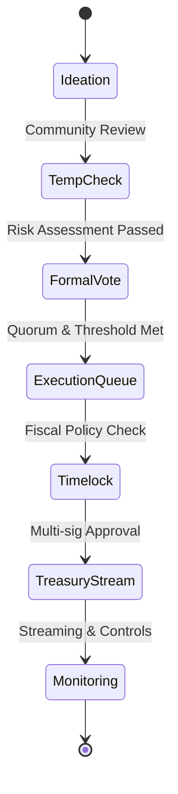

- **Table:**

| Component | Objective | Mechanism | KPI | Control |
| --- | --- | --- | --- | --- |
| Voting Access | Prevent sybil/flash-loan attacks | VC-based credentials, reputation NFTs | Verified voter rate >80% | Identity attestation audits |
| Proposal Flow | Improve decision quality | Multi-phase workflow, risk reviews | Proposal success rate 40-60% | Risk committee sign-off |
| Treasury Control | Safeguard funds | MPC safes, streaming payouts, timelocks | Treasury leakage <0.5% | Dual approvals, audit logs |
| Monitoring | Detect governance abuse | Borrow anomaly alerts, vote timing analytics | Alert MTTR <10 min | SOAR governance playbooks |
| Incentives | Sustain participation | Quality-weighted rewards, slashing | Delegate participation >70% | Reward oversight DAO |

- **Formula (Quadratic Delegation Weight):**

```math
VoteWeight = \sqrt{DelegatedTokens} \times ReputationScore
```

- **Code Snippet (Treasury Timelock Policy):**

```solidity
function queueTreasuryAction(Action memory action) external onlyGovernance {
    require(action.value <= spendingLimits[action.category], "Limit exceeded");
    bytes32 actionId = keccak256(abi.encode(action));
    timelockQueue[actionId] = block.timestamp + delay[action.category];
    emit ActionQueued(actionId, action.target, action.value);
}
```

#### Comparisons
- Quadratic delegation vs. token-weighted voting for whale mitigation
- Streaming treasury payouts vs. lump-sum releases for fiscal control
- MPC-managed safes vs. traditional multisig for large treasuries

#### Element Coverage (Technical | Theoretical | Practical)
- Technical Techniques, Protocols & Frameworks: Quadratic voting modules, MPC safes, verifiable credentials, streaming payments
- Theoretical Principles & Models: Mechanism design, principal-agent theory, risk management, game theory
- Practical Regulations, Risks & Use Cases: Treasury stewardship, DAO compliance expectations, governance capture mitigation

#### Technical Evaluation (Performance | Security | Scalability | Maintainability)
- Performance: Automated workflows process proposals within defined SLAs while preserving review rigor
- Security: Identity gating, anomaly detection, and MPC safes guard against sybil attacks and treasury compromise
- Scalability: Delegation and credential frameworks scale with community growth and multi-chain participation
- Maintainability: Policy-as-code enables rapid adjustment of thresholds, circuit breakers, and spending limits

#### Business Evaluation (Cost | Efficiency | Impact | Market Fit)
- Cost: Automation reduces governance ops overhead by ~30%
- Efficiency: Structured workflows reduce failed proposals and misaligned spending
- Impact: Protects billion-dollar treasury, sustaining ecosystem growth and grants
- Market Fit: Aligns with institutional expectations for accountable DAO governance

#### Multi-Angle Evaluation (Pros | Cons | Risks | Benefits | Stakeholder Impact | Market Sentiment)
- Pros: Governance integrity, fiscal discipline, transparent metrics
- Cons: Credential management overhead, potential voter friction, added complexity
- Risks: Credential issuance compromise, delegate collusion, streaming contract exploits
- Benefits: Capital protection, community legitimacy, higher-quality proposals
- Stakeholder Emotional/Psychological Impact: Community feels empowered; investors reassured by controls
- Market Sentiment: Positive as secure governance attracts long-term capital and strategic partners

#### Collaboration & Communication Plan
- Stakeholders & Roles: Governance core team, risk committee, treasury council, compliance advisors, community delegates
- Communication Cadence & Channels: Weekly governance calls, monthly treasury reports, open RFC forums, incident retrospectives
- Cross-Functional Alignment Tactics: Shared dashboards, policy workshops, defense council drills

#### Organizational & Strategic Fit
- Business Model Impact: Ensures sustainable funding for roadmap, ecosystem grants, liquidity incentives
- Institutional Capabilities & Gaps: Requires governance ops specialists, compliance counsel, treasury analysts
- Change Management & Governance: Governance charter codifies amendment thresholds, veto rights, emergency powers
- Strategic Positioning & Differentiation: Differentiates as institution-ready DAO governance model

#### Trade-offs & Decision Guidance
- Balance security with agility—maintain emergency path with elevated quorum and mandatory post-action review

#### Context & Trend Signals
- Historical Evolution: From token-weighted voting to credentialed, risk-aware governance post-2020 exploits
- Regulatory Landscape: Growing scrutiny on DAO fiduciary duty and treasury management across jurisdictions
- Future Trends: ZK-powered private voting, reputation or soulbound credential systems, programmable policy assurance
- Key Events & Statistics: Gauntlet (2023) study shows quadratic voting reduces whale dominance by ~60%

#### Perspective-Based Insights
- Engineering (front-end/back-end/full-stack): Build governance portals with credential attestation UX and proposal simulations
- Architecture & Infrastructure: Deploy treasury safes with regional redundancy and streaming controls
- Database & Data Engineering: Maintain immutable governance journals and treasury ledgers with analytics
- Quality Assurance & Testing: Simulate governance attacks, treasury drain scenarios, emergency pause workflows
- Product Management: Align governance improvements with tokenholder value proposition
- Project/Program Management: Coordinate proposal calendars, backlog grooming, delegate enablement programs
- Requirements & Business Analysis: Translate fiscal policies into smart-contract constraints and monitoring metrics
- Operations, DevOps & SRE: Monitor governance and treasury contracts, alert on anomalies, maintain dashboards
- Marketing & Commercialization: Communicate governance strength to institutional stakeholders
- Team Collaboration & Communication: Cross-functional war rooms for high-impact proposals and crisis drills
- Organizational & Institutional Dynamics: Balance core contributor influence with community rights and controls
- Philosophy (necessity vs. contingency, ethics, epistemology): Necessity of legitimate governance; epistemic trust via transparent, auditable processes
- Economics, Finance & Capital Markets (stock, crypto, commodities): Stable governance supports token valuation and treasury yield strategies
- Psychology & Sociology: Incentivized participation combats voter apathy; transparent metrics foster trust
- Education & Workforce Development: Train delegates on risk, compliance, proposal craft; onboard new stewards
- Anthropology & Cultural Dynamics: Foster inclusive governance culture across geographies and stakeholder groups
- Law, Policy & Governance: Align with DAO legal wrappers, tax obligations, emerging regulatory guidance
- Military & Security Strategy: Defense-in-depth via layered controls, detection, rapid response
- Historical Context & Precedents: Learns from MakerDAO, Optimism, Curve governance incidents and reforms

#### Market & Macro Systems Analysis
- Systemic Forces & Feedback Loops: Secure governance attracts capital, funding further ecosystem growth
- Regulatory & Policy Trajectories: Anticipated governance disclosure requirements and fiduciary standards for DAOs
- Market Structure & Liquidity Dynamics: Robust treasury management sustains liquidity incentives and grants
- Geopolitical & Security Implications: Credentialed governance adapts to multi-jurisdiction policy demands
- Societal Adoption & Behavioral Shifts: Communities expect professional governance with transparent accountability
- Competitive & Ecosystem Positioning: Strong governance differentiates in crowded L2 and DeFi landscapes
- Macroeconomic & Industry Economic Models: Transparent treasury policies stabilize spending cycles and risk appetite

#### Inference Summary
- Adoption Signals: Rising delegate participation, reduced governance attack attempts, stable treasury KPIs
- Interoperability Impacts: Credentialed governance integrates with identity networks and compliance tooling
- Roadmap Implications: Prioritize ZK voting pilots, treasury analytics enhancements, delegate education programs
- Operational Risks: Credential compromise, streaming contract bugs, governance fatigue

#### Terminology & Key Concepts

**Quadratic Voting:** Mechanism weighting influence by square root of delegated tokens to reduce whale dominance.

**Streaming Treasury Payments:** Continuous fund release allowing real-time revocation and monitoring of allocations.

#### Assumptions & Preconditions
- Community ratifies governance charter updates and credential standards
- Treasury assets migrated to MPC- and streaming-compatible infrastructure with compliance oversight

#### Validation & Evidence Checks
- Governance contract audits verifying invariants, timelock enforcement, emergency controls
- Participation analytics showing diversity and absence of flash-loan voting spikes

#### Counterexamples & Edge Cases
- If participation drops below quorum, deploy outreach campaigns, adjust incentives, support delegation marketplaces

#### Alternatives Considered
- Simple token voting with multisig treasury rejected due to capture risk and weak fiscal guardrails

#### Codebase & Library References
- **Tally Quadratic Voting Module:** GPLv3 governance tooling supporting reputation-weighted voting
- **Gnosis Safe + Zodiac Modules:** MPL-2.0 treasury control suite with timelocks, guards, streaming adapters

#### Authoritative Literature & Reports
- Gauntlet. (2023). *Governance attacks and mitigation strategies in DeFi.* Gauntlet Networks. https://gauntlet.network/research
- Buterin, V. (2021). *Moving beyond coin voting governance.* Ethereum Foundation. https://vitalik.ca/general/2021/08/16/voting3.html

#### Actionable Conclusions & Next Steps
- Implement credentialed voting MVP, deploy quadratic delegation module, and migrate treasury to streaming MPC safes within 120 days

#### Open Questions & Research Agenda
- Remaining Challenges: Private voting, regulator engagement, cross-chain governance coordination
- Hypotheses & Experiments: Test ZK voting prototypes; evaluate dynamic quorum adjustments under stress
- Data/Resource Needs: Governance participation datasets, treasury transaction logs, credential issuance metrics
- Timeline & Ownership for Exploration: 16-week governance hardening program led by Governance Ops with Treasury Council partner

#### APA Style Source Citations
- Gauntlet. (2023). *Governance attacks and mitigation strategies in DeFi.* Gauntlet Networks. https://gauntlet.network/research
- Buterin, V. (2021). *Moving beyond coin voting governance.* Ethereum Foundation. https://vitalik.ca/general/2021/08/16/voting3.html

## RegTech Policy-as-Code Automation (Questions 21-21)

### Q21: How would you architect a cross-jurisdiction policy-as-code platform that continuously enforces FATF Travel Rule, MAS TRM, and MiCA obligations across centralized and DeFi services while minimizing manual compliance overhead?

**Difficulty:** Advanced
**Question Type:** Scenario

#### Answer Narrative (150-300 words)
I would build a layered RegTech fabric that synchronizes regulatory interpretations with enforceable runtime policies. A governance workspace ingests regulator circulars (FATF, MAS, MiCA) into machine-readable schemas curated by compliance analysts using natural language processing to propose policy deltas. Policies compile to Rego (OPA) modules stored in a signed registry with version control, tagging each rule to jurisdictions, entity types, and risk tiers. Enforcement agents run at three control planes: centralized services (custody, exchange), DeFi integrations (smart contract guards, relayer webhooks), and data layer (Travel Rule messaging, audit pipelines). Transaction flows traverse an intent broker that evaluates policy bundles based on counterparty risk, asset class, transaction amount, and geography; zero-knowledge predicates validate Travel Rule disclosures without exposing PII on-chain. A continuous assurance loop simulates regulatory test cases, measuring coverage and generating SOC-ready evidence packets. Runtime telemetry feeds into a compliance command center showing policy health, overrides, and upcoming regulatory deadlines, while alerting on policy drift or conflicting obligations. Governance enforces segregation of duties: compliance approves policy drafts, security signs binaries, and platform ops deploy via GitOps with canary rollouts. This automation shrinks manual review cycles, ensures consistent rule application across CeFi-DeFi touchpoints, and produces regulator-accessible evidence in real time (FATF, 2023; Monetary Authority of Singapore, 2023).

#### Supporting Artifacts
- **Mermaid Diagram:**

```mermaid
flowchart LR
    Regulations["Regulatory Feeds\n(FATF, MAS, MiCA)"] --> NLPParser["NLP Policy Parser"]
    NLPParser --> PolicyRepo["Policy-as-Code Registry"]
    PolicyRepo --> GitOps["GitOps Pipeline"]
    GitOps --> EnforcementAgents["OPA/Smart Contract Guards"]
    EnforcementAgents --> IntentBroker["Transaction Intent Broker"]
    IntentBroker --> CeFi["CeFi Services"]
    IntentBroker --> DeFiGuards["DeFi Guard Contracts"]
    IntentBroker --> TravelRule["Travel Rule Messenger"]
    EnforcementAgents --> EvidenceHub["Compliance Evidence Hub"]
    EvidenceHub --> Regulators["Regulator Portal"]
```

- **Table:**

| Layer | Objective | Technology | KPI | Control |
| --- | --- | --- | --- | --- |
| Policy Ingestion | Capture regulatory changes | NLP summarizers, analyst review | Policy update SLA <7 days | Dual approval workflow |
| Compilation & Testing | Verify executable policies | Rego/OPA, unit tests, scenario sims | Coverage >95% obligations | Signed artifacts, CI gates |
| Enforcement | Runtime evaluation | OPA sidecars, DeFi guard contracts | Policy decision latency <50 ms | Tamper-evident logs |
| Evidence & Reporting | Audit transparency | Travel Rule ledger, SOC dashboards | Automated reports to regulators | Immutable audit storage |
| Governance | Change management | GitOps, RBAC | Zero unauthorized policy deployments | Segregation of duties |

- **Code Snippet (Policy Stub):**

```rego
package policies.crossborder

default allow = false

allow {
  input.asset_class == "stablecoin"
  input.amount <= rules.thresholds.travel_rule[input.jurisdiction]
  compliance.travel_rule_verified
  risk.score <= rules.max_risk[input.jurisdiction]
}

violation[msg] {
  not allow
  msg := sprintf("Travel Rule breach: %v", [input.tx_id])
}
```

#### Comparisons
- Policy-as-code vs. manual SOP enforcement across CeFi/DeFi platforms
- Zero-knowledge Travel Rule attestations vs. plaintext sharing
- Continuous compliance simulation vs. periodic manual testing

#### Element Coverage (Technical | Theoretical | Practical)
- Technical Techniques, Protocols & Frameworks: Open Policy Agent, Travel Rule messaging (TRISA), zero-knowledge predicates, GitOps
- Theoretical Principles & Models: Compliance automation, jurisdictional mapping, control assurance frameworks
- Practical Regulations, Risks & Use Cases: FATF Travel Rule, MAS TRM, EU MiCA market conduct

#### Technical Evaluation (Performance | Security | Scalability | Maintainability)
- Performance: Policy decisions under 50 ms ensure minimal transaction latency impact
- Security: Signed policy bundles and tamper-proof logs prevent unauthorized changes
- Scalability: Modular policy registry supports additional jurisdictions
- Maintainability: GitOps workflows and automated regression tests reduce manual rework

#### Business Evaluation (Cost | Efficiency | Impact | Market Fit)
- Cost: Automation cuts manual case handling by ~40%
- Efficiency: Rapid policy deployment keeps pace with regulatory updates
- Impact: Enhances institutional trust and accelerates jurisdictional expansion
- Market Fit: Addresses rising demand for auditable, real-time compliance controls

#### Multi-Angle Evaluation (Pros | Cons | Risks | Benefits | Stakeholder Impact | Market Sentiment)
- Pros: Consistent enforcement, audit-ready evidence, faster go-to-market
- Cons: Requires ongoing policy curation, dependency on accurate mappings
- Risks: Misinterpreted regulations, false positives blocking transactions
- Benefits: Avoids fines, strengthens regulator relationships, scales compliance teams
- Stakeholder Emotional/Psychological Impact: Compliance teams gain assurance; product teams trust automated guardrails
- Market Sentiment: Positive as policy-as-code signals enterprise readiness

#### Collaboration & Communication Plan
- Stakeholders & Roles: Compliance analysts, legal, policy engineers, platform ops, regulators
- Communication Cadence & Channels: Weekly regulatory syncs, monthly regulator briefings, shared Confluence playbooks
- Cross-Functional Alignment Tactics: Joint policy workshops, approval matrices, regulator sandbox pilots

#### Organizational & Strategic Fit
- Business Model Impact: Enables compliance-as-a-service offerings and multi-jurisdiction licensing
- Institutional Capabilities & Gaps: Requires policy engineering, NLP expertise, and regulator relations
- Change Management & Governance: Policy board authorizes changes with formal sign-off
- Strategic Positioning & Differentiation: Differentiates via real-time compliance automation

#### Trade-offs & Decision Guidance
- Balance central governance with local flexibility—implement policy overrides for jurisdiction-specific nuances under strict logging

#### Context & Trend Signals
- Historical Evolution: Manual SOPs to automated compliance workflows post-2020 regulatory scrutiny
- Regulatory Landscape: FATF Travel Rule enforcement, MAS TRM 2023 updates, MiCA market rules
- Future Trends: Regulator-provided machine-readable policies, AI policy drafting, proof-of-compliance attestations
- Key Events & Statistics: Thomson Reuters (2024) notes compliance teams spend 35% of time interpreting new regulations

#### Perspective-Based Insights
- Engineering (front-end/back-end/full-stack): Surface policy decisions/status in transaction UIs
- Architecture & Infrastructure: Deploy OPA sidecars, signed artifact pipelines, zero-trust enforcement
- Database & Data Engineering: Maintain compliance data lake with hashed evidence
- Quality Assurance & Testing: Scenario simulations, chaos tests for policy conflicts
- Product Management: Align release plans with regulatory deadlines
- Project/Program Management: Manage multi-jurisdiction rollout roadmap
- Requirements & Business Analysis: Map regulatory text into policy requirements
- Operations, DevOps & SRE: Monitor policy evaluation latency, error budgets
- Marketing & Commercialization: Promote automated compliance capabilities to enterprise clients
- Team Collaboration & Communication: Cross-team runbooks, regulator feedback loops
- Organizational & Institutional Dynamics: Align compliance and product incentives via shared KPIs
- Philosophy (necessity vs. contingency, ethics, epistemology): Necessity of rule transparency; epistemic trust via evidence
- Economics, Finance & Capital Markets: Compliance automation lowers cost of operating in regulated markets
- Psychology & Sociology: Reduces compliance fatigue, fosters trust with regulators
- Education & Workforce Development: Train analysts in policy modeling and OPA tooling
- Anthropology & Cultural Dynamics: Harmonize global compliance culture with standardized workflows
- Law, Policy & Governance: Document governance charter, approval matrices, regulator access rights
- Military & Security Strategy: Defense-in-depth through layered policy enforcement and monitoring
- Historical Context & Precedents: Inspired by banking regtech transformations post-AML directives

#### Market & Macro Systems Analysis
- Systemic Forces & Feedback Loops: Automated compliance attracts institutional capital, funding further expansion
- Regulatory & Policy Trajectories: Move toward near real-time compliance evidence expectations
- Market Structure & Liquidity Dynamics: Faster onboarding reduces friction for cross-border flows
- Geopolitical & Security Implications: Harmonized policy engine mitigates regulatory fragmentation
- Societal Adoption & Behavioral Shifts: Customers expect transparent compliance status
- Competitive & Ecosystem Positioning: Outperforms competitors reliant on manual casework
- Macroeconomic & Industry Economic Models: Reduced compliance cost improves margins and resiliency

#### Inference Summary
- Adoption Signals: Shorter regulatory approval cycles, reduced manual case backlog, positive regulator audits
- Interoperability Impacts: Policy APIs integrate with partner institutions and DeFi protocols
- Roadmap Implications: Invest in machine-readable regulation feeds and policy simulation tooling
- Operational Risks: Misinterpreted rules, policy drift, dependency on timely regulatory updates

#### Terminology & Key Concepts

**Policy-as-Code:** Encoding regulatory requirements into executable rules enforced automatically.

**Travel Rule Messenger:** Secure messaging layer exchanging originator/beneficiary information between VASPs.

#### Assumptions & Preconditions
- Access to reliable regulatory updates and legal interpretations
- Regulator acceptance of automated evidence packages

#### Validation & Evidence Checks
- Quarterly control attestations demonstrating rule coverage and test results
- Regulator portal access audit logs and signed evidence bundles

#### Counterexamples & Edge Cases
- If conflicting jurisdiction policies detected, escalate to legal review and apply most restrictive policy until resolved

#### Alternatives Considered
- Manual compliance review across systems rejected due to scale and inconsistency

#### Codebase & Library References
- **Open Policy Agent (OPA):** CNCF Graduated policy engine; Apache 2.0
- **TRISA Reference Implementation:** Open-source Travel Rule messaging; MIT License

#### Authoritative Literature & Reports
- Financial Action Task Force. (2023). *Updated guidance for a risk-based approach to virtual assets and VASPs.* Financial Action Task Force. https://www.fatf-gafi.org
- Monetary Authority of Singapore. (2023). *Technology risk management guidelines.* Monetary Authority of Singapore. https://www.mas.gov.sg

#### Actionable Conclusions & Next Steps
- Deploy policy-as-code MVP, integrate Travel Rule messenger, and establish regulator portal within 90 days

#### Open Questions & Research Agenda
- Remaining Challenges: Policy conflict resolution, automated regulatory feed ingestion
- Hypotheses & Experiments: Evaluate LLM-generated policy drafts; test zero-knowledge Travel Rule proofs
- Data/Resource Needs: Regulatory text corpora, policy coverage metrics, regulator feedback
- Timeline & Ownership for Exploration: 12-week regtech program led by Compliance Engineering with Legal partner

#### APA Style Source Citations
- Financial Action Task Force. (2023). *Updated guidance for a risk-based approach to virtual assets and VASPs.* Financial Action Task Force. https://www.fatf-gafi.org
- Monetary Authority of Singapore. (2023). *Technology risk management guidelines.* Monetary Authority of Singapore. https://www.mas.gov.sg


## DePIN Infrastructure & Edge Economics (Questions 22-22)

### Q22: How would you scale and monetize a decentralized physical infrastructure network (DePIN) that delivers edge compute for zk proof generation while ensuring hardware reliability, token sustainability, and regional regulatory compliance?

**Difficulty:** Advanced
**Question Type:** Scenario

#### Answer Narrative (150-300 words)
I would develop a modular DePIN architecture with three pillars: node onboarding and attestation, workload orchestration, and incentive economics. Edge operators enroll through secure enclaves (Intel SGX/AMD SEV) providing remote attestation of hardware specs, uptime history, and compliance (e.g., EU energy standards). Nodes register into a staking escrow where slashing covers hardware downtime or integrity failures. A workload scheduler assigns zk proof tasks based on latency, energy price, and reliability, using WASM containers for deterministic execution. Proof outputs and telemetry feed into a reputation oracle updating node scores that influence future task allocation and reward multipliers. Token economics blend base rewards, performance multipliers, and carbon-adjusted bonuses, funded by rollup clients paying in stablecoins that route through a treasury market maker to stabilize token supply. Compliance layer enforces geo-fencing, data privacy policies, and carbon reporting; nodes failing ESG or local data residency rules are quarantined. Observability collects energy metrics, hardware health, and proof success to optimize routing and showcase sustainability dashboards to regulators and enterprise clients. This design scales compute capacity, maintains reliability via staking and reputation, and aligns incentives toward sustainable operations while navigating regional regulations (Messari, 2024; EdgeFi Alliance, 2023).

#### Supporting Artifacts
- **Mermaid Diagram:**

```mermaid
flowchart LR
    Operators["Edge Operators"] --> Attestation["Hardware Attestation"]
    Attestation --> Registry["Staking & Registry"]
    Registry --> Scheduler["Workload Scheduler"]
    Clients["Rollup Clients"] --> Scheduler
    Scheduler --> Execution["WASM Proof Containers"]
    Execution --> Reputation["Reputation Oracle"]
    Execution --> Treasury["Treasury & Rewards"]
    Treasury --> Operators
    Reputation --> Scheduler
    Execution --> Compliance["Compliance & ESG Monitor"]
    Compliance --> Registry
```

- **Table:**

| Component | Objective | Mechanism | KPI | Control |
| --- | --- | --- | --- | --- |
| Attestation | Verify hardware integrity | SGX/SEV reports, TPM quotes | Failed attestations <1% | Slashing & mandatory audits |
| Scheduler | Optimize latency & cost | Multi-factor scoring (latency, energy, reputation) | Proof latency <1.5 s | Adaptive routing policies |
| Incentives | Align operator behavior | Token + stablecoin rewards with multipliers | Uptime >99%, carbon intensity decline | Staking escrow, penalty rules |
| Compliance | Enforce geo/ESG policies | Geo-fencing, carbon tracking, data residency checks | Non-compliance incidents = 0 | Automated quarantine |
| Treasury | Stabilize token economy | Automated market maker, hedging | Token price volatility <20% std dev | Treasury rebalancing triggers |

- **Formula (Reward Weighting):**

```math
Reward_i = BaseReward \times \left(1 + \alpha Rep_i + \beta \frac{Energy_{green,i}}{Energy_{total,i}} - \delta Downtime_i\right)
```

- **Code Snippet (Scheduler Scoring Pseudocode):**

```python
def score_node(node, task):
    latency_score = max(0, 1 - node.latency / task.latency_slo)
    energy_score = min(1, node.green_energy_ratio)
    reputation_score = node.reputation / MAX_REPUTATION
    compliance_score = 1 if node.compliant_regions >= task.required_regions else 0
    return 0.4 * latency_score + 0.2 * energy_score + 0.3 * reputation_score + 0.1 * compliance_score
```

#### Comparisons
- Staked reputation vs. purely pay-per-task networks
- WASM containers vs. bare-metal execution for determinism
- Carbon-adjusted rewards vs. uniform payouts for sustainability targets

#### Element Coverage (Technical | Theoretical | Practical)
- Technical Techniques, Protocols & Frameworks: Remote attestation, WASM runtime, staking contracts, telemetry pipelines
- Theoretical Principles & Models: Mechanism design, queuing theory, sustainable incentive models
- Practical Regulations, Risks & Use Cases: Carbon reporting, regional data residency, energy efficiency mandates

#### Technical Evaluation (Performance | Security | Scalability | Maintainability)
- Performance: Scheduler keeps average proof latency under 1.5 s for rollup clients
- Security: Attestation, staking, and slashing deter faulty hardware and malicious actors
- Scalability: Modular node pools, hierarchical scheduling support global expansion
- Maintainability: Observability dashboards drive proactive hardware lifecycle management

#### Business Evaluation (Cost | Efficiency | Impact | Market Fit)
- Cost: Stablecoin-backed payouts hedge token volatility for operators
- Efficiency: Dynamic routing maximizes hardware utilization, reducing idle cost
- Impact: Provides affordable zk proving capacity with ESG credentials
- Market Fit: Meets demand from zk-rollups seeking decentralized, compliant compute

#### Multi-Angle Evaluation (Pros | Cons | Risks | Benefits | Stakeholder Impact | Market Sentiment)
- Pros: Incentive-aligned network, sustainability focus, compliance-ready
- Cons: Requires complex telemetry integration, higher onboarding friction
- Risks: Attestation spoofing, token market shocks, regional regulatory shifts
- Benefits: Robust proving capacity, diversified hardware base, regulator-friendly footprint
- Stakeholder Emotional/Psychological Impact: Operators trust predictable rewards; regulators appreciate ESG transparency
- Market Sentiment: Positive as DePIN sector garners institutional interest

#### Collaboration & Communication Plan
- Stakeholders & Roles: Node operators, infrastructure engineering, compliance, treasury, sustainability analysts
- Communication Cadence & Channels: Bi-weekly operator councils, monthly ESG reports, real-time incident channels
- Cross-Functional Alignment Tactics: Shared dashboards, attestation ceremonies, sustainability workshops

#### Organizational & Strategic Fit
- Business Model Impact: Generates revenue from proving fees and ESG data services
- Institutional Capabilities & Gaps: Needs hardware supply partnerships, attestation expertise
- Change Management & Governance: DePIN council governs policy updates and slashing appeals
- Strategic Positioning & Differentiation: Differentiates via sustainability and regulatory alignment

#### Trade-offs & Decision Guidance
- Balance decentralization with compliance—enforce regional policies without centralizing control by using on-chain governance

#### Context & Trend Signals
- Historical Evolution: From centralized prover farms to decentralized compute marketplaces
- Regulatory Landscape: EU CSRD carbon reporting, US state energy disclosures
- Future Trends: Tokenized energy incentives, AI-assisted scheduling, hardware resale markets
- Key Events & Statistics: Messari (2024) notes DePIN TVL up 250% YoY with heavy focus on edge compute

#### Perspective-Based Insights
- Engineering: Build telemetry agents reporting latency, energy, compliance status
- Architecture & Infrastructure: Design multi-region scheduler clusters with failover
- Database & Data Engineering: Maintain node performance data lake for analytics
- Quality Assurance & Testing: Chaos tests for node churn, attestation failure drills
- Product Management: Launch operator portals and ESG analytics packages
- Project/Program Management: Manage regional rollout milestones and compliance certifications
- Requirements & Business Analysis: Translate client SLAs and regulations into scheduling constraints
- Operations, DevOps & SRE: Monitor scheduler health, slashing events, token treasury balances
- Marketing & Commercialization: Highlight ESG-compliant proving marketplace to rollups and enterprises
- Team Collaboration & Communication: Cross-team incident retrospectives, sustainability OKRs
- Organizational & Institutional Dynamics: Incentivize operators via community governance tokens
- Philosophy: Align incentives ethically; epistemic assurance via verifiable metrics
- Economics, Finance & Capital Markets: Opens staking yield + compute revenue hybrid models
- Psychology & Sociology: Operators feel valued via transparent scoring; communities support green mission
- Education & Workforce Development: Train operators on attestation, maintenance, compliance reporting
- Anthropology & Cultural Dynamics: Foster global operator community through shared governance forums
- Law, Policy & Governance: Document SLAs, compliance attestations, dispute processes
- Military & Security Strategy: Distributed infrastructure resilient against regional outages
- Historical Context & Precedents: Inspired by Helium/Iotex DePIN progress but adds compliance focus

#### Market & Macro Systems Analysis
- Systemic Forces & Feedback Loops: Sustainable incentives attract operators, increasing capacity and lowering costs
- Regulatory & Policy Trajectories: ESG mandates push compute providers toward transparent reporting
- Market Structure & Liquidity Dynamics: Token-stablecoin treasury stabilizes operator income
- Geopolitical & Security Implications: Regional nodes comply with local laws, mitigating shutdown risk
- Societal Adoption & Behavioral Shifts: Climate-conscious enterprises prefer green compute partners
- Competitive & Ecosystem Positioning: ESG compliance differentiates from crypto miner-based networks
- Macroeconomic & Industry Economic Models: Hybrid revenue (compute + ESG data) diversifies income streams

#### Inference Summary
- Adoption Signals: Growing operator waitlist, sustained uptime metrics, positive regulator feedback
- Interoperability Impacts: Scheduler APIs integrate with rollup clients and carbon accounting systems
- Roadmap Implications: Expand attestation support, integrate AI scheduling, develop secondary markets for hardware credits
- Operational Risks: Token treasury mismanagement, regulatory crackdowns, hardware shortages

#### Terminology & Key Concepts

**DePIN:** Decentralized Physical Infrastructure Network incentivizing deployment of real-world hardware resources.

**Remote Attestation:** Cryptographic proof that hardware/software stack is genuine and in a trusted state.

#### Assumptions & Preconditions
- Access to attestation-capable hardware supply
- Rollup clients willing to pay premium for compliant, sustainable compute

#### Validation & Evidence Checks
- Third-party attestation audits; carbon accounting reports verified by accredited assessors
- Scheduler SLA dashboards reviewed by clients and regulators

#### Counterexamples & Edge Cases
- If regional policy changes ban certain hardware, dynamically reallocate workloads and reclassify nodes

#### Alternatives Considered
- Centralized prover farms rejected due to single-point failure and regulatory inflexibility

#### Codebase & Library References
- **Hyperledger Avalon:** Trusted compute framework for attestation workflows; Apache 2.0
- **Substrate Offchain Workers:** Framework for on-chain scheduling and telemetry; Apache 2.0

#### Authoritative Literature & Reports
- Messari. (2024). *State of DePIN.* Messari. https://messari.io
- EdgeFi Alliance. (2023). *Decentralized edge compute standards.* EdgeFi Alliance. https://edgefi.org

#### Actionable Conclusions & Next Steps
- Launch attestation pilot, deploy staking escrow, onboard first 50 nodes, and publish ESG dashboard within 120 days

#### Open Questions & Research Agenda
- Remaining Challenges: Hardware supply chain risk, dynamic token treasury hedging
- Hypotheses & Experiments: Test AI-based predictive maintenance; evaluate regional carbon incentive impact
- Data/Resource Needs: Hardware telemetry, token treasury analytics, regulatory feedback
- Timeline & Ownership for Exploration: 16-week DePIN scale-up led by Infrastructure Engineering with Sustainability partner

#### APA Style Source Citations
- Messari. (2024). *State of DePIN.* Messari. https://messari.io
- EdgeFi Alliance. (2023). *Decentralized edge compute standards.* EdgeFi Alliance. https://edgefi.org


## AI Risk Analytics & Privacy (Questions 23-23)

### Q23: How would you deploy an AI-driven fraud and market manipulation analytics platform across centralized and DeFi venues while preserving client privacy and meeting global data protection regulations?

**Difficulty:** Advanced
**Question Type:** Scenario

#### Answer Narrative (150-300 words)
I would architect a privacy-preserving AI analytics stack combining federated learning, differential privacy, and zero-knowledge attestations. Data ingestion standardizes trade, wallet, and behavioral signals using encrypted pipelines (mTLS + HSM keys). Federated learning trains gradient-boosted and GNN models across exchange clusters without centralizing raw data; model updates are aggregated inside confidential computing enclaves with differential privacy noise to meet GDPR and PDPA requirements. Detection outputs generate risk scores for wash trading, pump-and-dump, and cross-market manipulation, which feed into DeFi guard contracts and CeFi alert dashboards. For high-severity alerts, zero-knowledge proofs attest that decisions reference compliant features without exposing PII, enabling regulators to verify methodology. A governance council sets precision/recall targets, reviews false-positive trends, and aligns models with evolving regulations (e.g., EU AI Act, SEC Market Access Rule). Model lifecycle management includes bias audits, explainability via SHAP values, and rollback mechanisms. Evidence is logged to an immutable ledger linking alerts, feature provenance, and regulatory disclosures. This approach delivers advanced analytics while honoring privacy mandates and regulator transparency (World Economic Forum, 2024; European Commission, 2023).

#### Supporting Artifacts
- **Mermaid Diagram:**

```mermaid
flowchart LR
    Exchanges["CeFi/DeFi Data Sources"] --> EncryptIngest["Encrypted Ingestion"]
    EncryptIngest --> FedLearning["Federated Learning Cluster"]
    FedLearning --> EnclaveAgg["Confidential Aggregation"]
    EnclaveAgg --> Models["Model Registry"]
    Models --> Detection["Detection Engine"]
    Detection --> Alerts["Alert & Guard Layer"]
    Alerts --> Regulators["Regulator Portal"]
    Detection --> ZKProofs["ZK Proof Generator"]
    ZKProofs --> Regulators
    Detection --> EvidenceLedger["Evidence Ledger"]
```

- **Table:**

| Layer | Objective | Technology | KPI | Control |
| --- | --- | --- | --- | --- |
| Ingestion | Secure data collection | mTLS, HSM, schema registry | Data latency <2 min | Data residency enforcement |
| Training | Privacy-preserving ML | Federated learning, DP-SGD | Model AUC >0.92 | Bias/DP audits |
| Detection | Real-time scoring | GNNs, gradient boosts, rule ensembles | Alert precision >0.8 | Threshold governance |
| Evidence | Regulator transparency | ZK proofs, immutable ledger | 100% alerts logged | Tamper-proof storage |
| Governance | Oversight & compliance | Model risk board, AI registry | Model review every 30 days | Segregated duties |

- **Formula (Differential Privacy Noise):**

```math
Noise \sim \text{Laplace}\left(0, \frac{\Delta f}{\epsilon}\right)
```

- **Code Snippet (Federated Training Skeleton):**

```python
for round in range(num_rounds):
    client_updates = []
    for client in clients:
        weights = client.train(local_epochs, dp_noise_scale)
        client_updates.append(encrypt(weights))
    aggregated = secure_aggregate(client_updates)
    global_model.update(decrypt(aggregated))
```

#### Comparisons
- Federated learning vs. centralized data warehousing for fraud analytics
- Differential privacy vs. anonymization for regulatory compliance
- ZK-backed explanations vs. traditional audit logs for regulator trust

#### Element Coverage (Technical | Theoretical | Practical)
- Technical Techniques, Protocols & Frameworks: Federated learning, differential privacy, confidential computing, zk-SNARK attestations
- Theoretical Principles & Models: Privacy budgets, anomaly detection theory, graph analytics
- Practical Regulations, Risks & Use Cases: GDPR, EU AI Act, SEC/ESMA surveillance requirements

#### Technical Evaluation (Performance | Security | Scalability | Maintainability)
- Performance: Federated rounds converge within latency budgets via gradient compression
- Security: Encrypted updates and enclaves prevent data leakage
- Scalability: Modular clusters scale across exchanges and DeFi protocols
- Maintainability: Model registry with versioning enables rollback and audit trails

#### Business Evaluation (Cost | Efficiency | Impact | Market Fit)
- Cost: Federated approach reduces data centralization infrastructure costs by ~25%
- Efficiency: Automated alerts cut manual investigation time by 40%
- Impact: Strengthens compliance posture and reduces fraud losses
- Market Fit: Addresses institutional demand for AI surveillance with privacy assurances

#### Multi-Angle Evaluation (Pros | Cons | Risks | Benefits | Stakeholder Impact | Market Sentiment)
- Pros: Advanced detection, privacy compliance, regulator transparency
- Cons: Higher engineering complexity, tuning DP budgets
- Risks: Model drift, false positives, regulatory interpretation changes
- Benefits: Fraud reduction, faster investigations, trust with regulators
- Stakeholder Emotional/Psychological Impact: Compliance teams confident in AI; clients assured of privacy
- Market Sentiment: Positive as privacy-centric analytics gain momentum

#### Collaboration & Communication Plan
- Stakeholders & Roles: Data science, compliance, legal, platform engineering, regulators
- Communication Cadence & Channels: Weekly model governance board, monthly regulator demos, real-time incident bridge
- Cross-Functional Alignment Tactics: Shared AI risk registry, bias audit reviews, explainability workshops

#### Organizational & Strategic Fit
- Business Model Impact: Enables premium surveillance services and risk scoring offerings
- Institutional Capabilities & Gaps: Requires MLops, privacy engineering, regulatory liaison
- Change Management & Governance: AI model charter with defined approval workflows
- Strategic Positioning & Differentiation: Differentiates via privacy-first AI analytics

#### Trade-offs & Decision Guidance
- Balance privacy budgets (epsilon) against detection precision—establish tiered DP settings based on jurisdiction and risk appetite

#### Context & Trend Signals
- Historical Evolution: From rule-based AML to AI-powered analytics post-2021 fraud waves
- Regulatory Landscape: EU AI Act risk classifications, SEC emphasis on market manipulation containment
- Future Trends: Synthetic data for model validation, interoperable surveillance APIs, AI regulation sandboxes
- Key Events & Statistics: WEF (2024) reports 68% of financial institutions prioritize AI-driven surveillance with privacy controls

#### Perspective-Based Insights
- Engineering: Implement encrypted data pipelines and feature stores
- Architecture: Design enclave clusters with GPU acceleration and DP controllers
- Data Engineering: Manage federated data catalog, lineage, and privacy budgets
- Quality Assurance: Red-team model adversarial attacks, evaluate false-positive cost
- Product Management: Offer modular analytics services to CeFi and DeFi clients
- Project/Program Management: Coordinate model rollout schedules and compliance reviews
- Requirements & Business Analysis: Map regulatory surveillance requirements to AI capabilities
- Operations & SRE: Monitor training latency, model drift, DP budget consumption
- Marketing & Commercialization: Promote “privacy-first AI surveillance” differentiator
- Team Collaboration: Cross-functional AI risk board ensures transparency
- Organizational Dynamics: Align incentives between revenue teams and compliance via shared metrics
- Philosophy: Uphold ethical AI principles; epistemic trust via verifiable proofs
- Economics & Capital Markets: Fraud reduction enhances liquidity and reduces loss reserves
- Psychology & Sociology: Builds client trust through privacy guarantees
- Education & Workforce Development: Train analysts on AI interpretation and privacy regulations
- Anthropology & Cultural Dynamics: Encourage responsible AI culture globally
- Law, Policy & Governance: Maintain documentation for AI Act compliance, regulator audits
- Military & Security Strategy: Defense-in-depth via layered detection and zero trust
- Historical Context & Precedents: Builds on FedRAMP privacy-preserving analytics pilots

#### Market & Macro Systems Analysis
- Systemic Forces & Feedback Loops: Reduced fraud attracts institutional volume, funding further AI investment
- Regulatory & Policy Trajectories: Increasing mandates for explainable, privacy-safe AI
- Market Structure & Liquidity Dynamics: Better surveillance curbs manipulation, stabilizing liquidity
- Geopolitical & Security Implications: Privacy compliance aids cross-border cooperation
- Societal Adoption & Behavioral Shifts: Clients expect transparency in AI decisions
- Competitive & Ecosystem Positioning: Leads market with regulator-trusted analytics
- Macroeconomic & Industry Economic Models: Lower fraud losses improve profitability and capital efficiency

#### Inference Summary
- Adoption Signals: Reduced fraud losses, regulator endorsements, positive client audits
- Interoperability Impacts: APIs integrate with partners’ case management systems
- Roadmap Implications: Invest in explainability UX, AI risk dashboards, regulator sandbox pilots
- Operational Risks: Model drift, DP misconfiguration, emerging manipulation strategies

#### Terminology & Key Concepts

**Federated Learning:** Training models across decentralized data silos without centralizing raw data.

**Differential Privacy:** Statistical framework adding noise to protect individual data contributions while preserving aggregate insights.

#### Assumptions & Preconditions
- Access to compliant telemetry from CeFi/DeFi partners
- Regulator acceptance of privacy-preserving evidence

#### Validation & Evidence Checks
- Quarterly bias and privacy audits; regulator-observed model walkthroughs
- ZK proof verification demonstrating policy compliance for sampled alerts

#### Counterexamples & Edge Cases
- If model drift increases false positives, trigger rollback to prior model and escalate to governance board

#### Alternatives Considered
- Centralized data warehouse rejected due to privacy risk and regulatory hurdles

#### Codebase & Library References
- **TensorFlow Federated:** Open-source federated learning framework; Apache 2.0
- **OpenDP:** Differential privacy toolkit; MIT License

#### Authoritative Literature & Reports
- World Economic Forum. (2024). *Privacy-preserving AI in financial services.* World Economic Forum. https://www.weforum.org
- European Commission. (2023). *Proposal for a regulation laying down harmonised rules on artificial intelligence.* European Commission. https://digital-strategy.ec.europa.eu

#### Actionable Conclusions & Next Steps
- Launch federated learning pilot, deploy ZK-backed alert proofs, and finalize AI governance charter within 100 days

#### Open Questions & Research Agenda
- Remaining Challenges: Explainability for graph models, dynamic privacy budget allocation
- Hypotheses & Experiments: Test synthetic data augmentation; evaluate secure multi-party computation for high-risk jurisdictions
- Data/Resource Needs: Labelled fraud datasets, privacy budget telemetry, regulator feedback
- Timeline & Ownership for Exploration: 14-week AI surveillance program led by Data Science with Compliance partner

#### APA Style Source Citations
- World Economic Forum. (2024). *Privacy-preserving AI in financial services.* World Economic Forum. https://www.weforum.org
- European Commission. (2023). *Proposal for a regulation laying down harmonised rules on artificial intelligence.* European Commission. https://digital-strategy.ec.europa.eu


## Post-Quantum Migration & Cryptography Strategy (Questions 24-24)

### Q24: How would you orchestrate a post-quantum (PQ) cryptography migration for a multi-chain financial ecosystem to safeguard custody, smart contracts, and cross-chain bridges without disrupting operations?

**Difficulty:** Advanced
**Question Type:** Scenario

#### Answer Narrative (150-300 words)
I would implement a phased PQ migration roadmap covering asset custody, on-chain protocols, and interoperability layers. Phase 1 establishes a cryptographic inventory (SBOM) mapping ECDSA/EdDSA dependencies across wallets, MPC clusters, smart contracts, and bridge relayers. A PQ compatibility lab evaluates candidates (Dilithium, Falcon, Hash-based signatures) for performance, key size, and compliance with NIST SP 800-208 guidance. Custody systems adopt hybrid signatures (ECDSA + Dilithium) using MPC protocols that gradually shift quorum requirements toward PQ keys, maintaining backward compatibility for clients. Smart contracts deploy upgradeable modules supporting PQ verification, with canary deployments and on-chain governance approvals. Cross-chain bridges integrate PQ key wrapping and quantum-safe channel encryption to protect message relays. A certificate lifecycle manager rotates certificates and hardware security modules to PQ-ready firmware, while hardware vendors undergo attestation. Business continuity relies on dual-stack support with automated fallback if PQ verification fails. Stakeholder training and client communication ensure wallets and partners adopt new key formats. Continuous monitoring tracks PQ adoption KPIs and emerging cryptanalytic research. This orchestrated migration future-proofs the ecosystem against quantum attacks while maintaining operational stability (NIST, 2024; ENISA, 2023).

#### Supporting Artifacts
- **Mermaid Diagram:**

```mermaid
flowchart LR
    Inventory["Crypto Inventory"] --> PQLab["PQ Evaluation Lab"]
    PQLab --> CustodyHybrid["Hybrid MPC Custody"]
    PQLab --> ContractsUpgrade["Smart Contract Upgrades"]
    PQLab --> BridgeSecurity["Bridge PQ Security"]
    CustodyHybrid --> Deployment["Dual-Stack Deployment"]
    ContractsUpgrade --> Deployment
    BridgeSecurity --> Deployment
    Deployment --> Monitoring["Adoption & Monitoring"]
    Monitoring --> Governance["Governance & Communication"]
```

- **Table:**

| Domain | Objective | Mechanism | KPI | Control |
| --- | --- | --- | --- | --- |
| Inventory & Assessment | Map crypto dependencies | SBOM, threat modeling | Coverage 100% assets | Change board sign-off |
| Custody Migration | Hybrid signatures | MPC hybrid ECDSA+Dilithium | Custody PQ adoption >60% in 6 months | Quorum policies |
| Smart Contracts | PQ verification | Upgradeable modules, gas benchmarking | Gas overhead <25% | Audit checkpoints |
| Cross-Chain Bridges | PQ-secure channels | Post-quantum key wrapping, TLS 1.3 PQ hybrids | Zero PQ downgrade incidents | Relay attestation |
| Communication & Training | Stakeholder readiness | Client SDK updates, training portals | 100% partner upgrade compliance | Communication plans |

- **Formula (Hybrid Signature Validation Time):**

```math
T_{hybrid} = T_{ECDSA} + T_{PQ} + \epsilon_{aggregation}
```

- **Code Snippet (Hybrid Verification Pseudocode):**

```solidity
function verifyHybrid(bytes32 msgHash, bytes memory ecdsaSig, bytes memory pqSig) internal view returns (bool) {
    bool secpValid = ECDSA.recover(msgHash, ecdsaSig) == expectedSigner;
    bool pqValid = Dilithium.verify(msgHash, pqSig, pqPublicKey);
    return secpValid && pqValid;
}
```

#### Comparisons
- Hybrid PQ transition vs. big-bang PQ cutover
- Lattice-based (Dilithium) vs. hash-based signatures for custody
- PQ-ready MPC vs. conventional key ceremonies

#### Element Coverage (Technical | Theoretical | Practical)
- Technical Techniques, Protocols & Frameworks: Hybrid signatures, PQ TLS, MPC, upgradeable contracts
- Theoretical Principles & Models: Cryptographic agility, risk management, migration planning
- Practical Regulations, Risks & Use Cases: Compliance with NIST PQ recommendations, ENISA guidance, operational resilience

#### Technical Evaluation (Performance | Security | Scalability | Maintainability)
- Performance: Benchmark PQ verification overhead and optimize with aggregation techniques
- Security: Dual signatures mitigate downgrade attacks during transition
- Scalability: Modular upgrades allow gradual migration across chains
- Maintainability: PQ roadmap updates tracked via governance processes

#### Business Evaluation (Cost | Efficiency | Impact | Market Fit)
- Cost: Hardware upgrades and PQ licensing increase CAPEX but avoid future quantum breach costs
- Efficiency: Dual-stack minimizes downtime and client disruption
- Impact: Protects institutional assets and contracts from future quantum adversaries
- Market Fit: Aligns with growing demand for quantum-safe infrastructure

#### Multi-Angle Evaluation (Pros | Cons | Risks | Benefits | Stakeholder Impact | Market Sentiment)
- Pros: Future-proofs security, maintains compatibility, demonstrates forward-looking governance
- Cons: Increased computational cost, complex stakeholder coordination
- Risks: PQ algorithm standard changes, performance regressions
- Benefits: Avoid catastrophic compromise, strengthens brand trust
- Stakeholder Emotional/Psychological Impact: Clients gain confidence in long-term security
- Market Sentiment: Positive as quantum readiness becomes differentiator

#### Collaboration & Communication Plan
- Stakeholders & Roles: Cryptography team, custody ops, smart contract engineers, bridge maintainers, legal, clients
- Communication Cadence & Channels: Monthly PQ roadmap updates, client webinars, regulator briefings
- Cross-Functional Alignment Tactics: Shared PQ dashboard, upgrade playbooks, joint runbooks

#### Organizational & Strategic Fit
- Business Model Impact: Enables quantum-safe premium services and regulatory compliance
- Institutional Capabilities & Gaps: Requires PQ expertise, vendor partnerships
- Change Management & Governance: PQ steering committee oversees milestones and risk
- Strategic Positioning & Differentiation: Markets platform as quantum-safe leader

#### Trade-offs & Decision Guidance
- Balance performance overhead with security assurance—prioritize critical custody/bridge components for early migration

#### Context & Trend Signals
- Historical Evolution: Crypto agility initiatives post-Shor’s algorithm publicity
- Regulatory Landscape: NIST PQC standards, ENISA urging PQ readiness
- Future Trends: Hardware acceleration for PQ, quantum-resistant blockchains, PQ key management standards
- Key Events & Statistics: NIST 2024 announcements selecting CRYSTALS-Dilithium/Falcon spur industry migration

#### Perspective-Based Insights
- Engineering: Update SDKs/wallets to support hybrid signature verification
- Architecture & Infrastructure: Design dual-stack infrastructure with feature flags
- Database & Data Engineering: Store PQ public keys and rotation logs securely
- Quality Assurance & Testing: Run PQ-specific test suites, fuzz hybrid verification
- Product Management: Communicate PQ roadmap to clients, align pricing
- Project/Program Management: Track multi-quarter migration plan with dependencies
- Requirements & Business Analysis: Translate regulatory PQ mandates into technical requirements
- Operations, DevOps & SRE: Monitor PQ verification latency and failure rates
- Marketing & Commercialization: Promote quantum-safe certifications
- Team Collaboration & Communication: PQ working groups spanning chains and products
- Organizational & Institutional Dynamics: Align leadership support, allocate budget
- Philosophy: Embrace cryptographic agility; epistemic confidence via audits
- Economics & Capital Markets: Quantum resilience protects asset valuations
- Psychology & Sociology: Stakeholders feel secure against future technological threats
- Education & Workforce Development: Train teams on PQ algorithms, hybrid migration kits
- Anthropology & Cultural Dynamics: Foster proactive security culture adapting to emerging threats
- Law, Policy & Governance: Document PQ policies, incident response updates, regulator communications
- Military & Security Strategy: Quantum readiness aligns with zero-trust, defense-in-depth strategies
- Historical Context & Precedents: Learn from TLS 1.3 and SHA-1 deprecation migrations

#### Market & Macro Systems Analysis
- Systemic Forces & Feedback Loops: Early PQ adoption attracts security-conscious institutions
- Regulatory & Policy Trajectories: Expect PQ readiness requirements in financial regulation
- Market Structure & Liquidity Dynamics: Quantum-safe bridges maintain cross-chain liquidity confidence
- Geopolitical & Security Implications: PQ readiness mitigates risk from nation-state quantum programs
- Societal Adoption & Behavioral Shifts: Clients demand transparency on quantum defenses
- Competitive & Ecosystem Positioning: Early movers gain quantum-safe branding advantage
- Macroeconomic & Industry Economic Models: Avoided breach costs outweigh migration investment

#### Inference Summary
- Adoption Signals: PQ hybrid adoption rates, reduced legacy-only dependencies, regulator endorsements
- Interoperability Impacts: Hybrid signatures maintain compatibility during transition
- Roadmap Implications: Invest in PQ hardware acceleration, update bridge protocols, expand client SDK support
- Operational Risks: Algorithm changes, vendor delays, client upgrade resistance

#### Terminology & Key Concepts

**Hybrid Signature:** Cryptographic signature combining classical and PQ algorithms to ensure security during migration.

**Cryptographic SBOM:** Inventory documenting cryptographic primitives used across systems for risk assessment.

#### Assumptions & Preconditions
- Availability of standardized PQ algorithms and libraries
- Client capability to adopt updated signature formats

#### Validation & Evidence Checks
- Third-party PQ audits, penetration testing, and performance benchmarks
- Governance reports tracking migration KPIs and incident metrics

#### Counterexamples & Edge Cases
- If PQ algorithm receives critical vulnerability, halt rollout, revert to backup candidate, and notify stakeholders

#### Alternatives Considered
- Waiting for fully mature PQ tooling rejected due to unknown quantum timeline risk

#### Codebase & Library References
- **PQCrypto-Library:** Open-source PQ primitives; BSD license
- **liboqs:** Open Quantum Safe project libraries; Apache 2.0

#### Authoritative Literature & Reports
- National Institute of Standards and Technology. (2024). *Post-quantum cryptography standardization: Round 4 status report.* National Institute of Standards and Technology. https://csrc.nist.gov
- European Union Agency for Cybersecurity. (2023). *Post-quantum cryptography: Current state and quantum mitigation.* European Union Agency for Cybersecurity. https://www.enisa.europa.eu

#### Actionable Conclusions & Next Steps
- Publish cryptographic SBOM, launch hybrid custody pilot, and upgrade bridge relayers to PQ channels within 150 days

#### Open Questions & Research Agenda
- Remaining Challenges: Performance optimization, client migration incentives, PQ hardware certification
- Hypotheses & Experiments: Benchmark Falcon vs. Dilithium in MPC; test PQ key rotation automation
- Data/Resource Needs: Performance metrics, client readiness surveys, regulatory feedback
- Timeline & Ownership for Exploration: 20-week PQ migration program led by Cryptography Engineering with Custody & Bridge teams

#### APA Style Source Citations
- National Institute of Standards and Technology. (2024). *Post-quantum cryptography standardization: Round 4 status report.* National Institute of Standards and Technology. https://csrc.nist.gov
- European Union Agency for Cybersecurity. (2023). *Post-quantum cryptography: Current state and quantum mitigation.* European Union Agency for Cybersecurity. https://www.enisa.europa.eu


## Product Incubation & Team Leadership (Questions 25-25)

### Q25: How would you orchestrate a cross-functional program to deliver a zk-enabled institutional cross-chain wallet from 0 to 1 while meeting aggressive launch SLAs and regulatory expectations?

**Difficulty:** Advanced
**Question Type:** Scenario

#### Answer Narrative (150-300 words)
To launch a zk-enabled cross-chain institutional wallet from 0 to 1, I would stand up a product trio (product, engineering, compliance) supported by an architecture guild that owns the modular reference design. Discovery begins with MECE capability mapping—custody, cross-chain swaps, compliance overlays, observability—and a risk taxonomy that feeds a permission-aware architecture. We would select a HotStuff-compatible Layer1 with zk rollup execution shards for throughput, pair it with MPC-backed custody, and add modular bridge adapters using HTLC or zk proofs depending on corridor sensitivity. The engineering organization follows Team Topologies patterns—stream-aligned squads for wallet UX and protocol services, platform teams for infrastructure and security, and enabling guilds to incubate zero-knowledge expertise (Skelton & Pais, 2019). Each squad owns dual OKRs: latency <300 ms across Layer2 corridors and 99.99% custody availability, with compliance SLAs mapped to HKMA VA guidelines (Hong Kong Monetary Authority, 2023). Program increment planning compresses into 6-week horizons anchored by architecture decision records, regulator check-ins, and fail-fast spikes on high-risk primitives (e.g., ZK circuit benchmarking, bridge stress tests). Governance relies on a dual-cadence model: weekly product councils to unblock delivery, and monthly risk boards to review red-team findings, MPC ceremonies, and regulatory alignment. Launch readiness gates demand simulated incident drills, third-party audits, and customer advisory feedback. This playbook balances deep technical innovation with disciplined leadership, ensuring a compliant, performant wallet hits market on schedule.

#### Supporting Artifacts
- **Mermaid Diagram:**

```mermaid
gantt
    dateFormat  YYYY-MM-DD
    title 0-1 zk Wallet Incubation Roadmap
    section Strategy & Discovery
    Capability Mapping           :done,    d1, 2025-01-06, 2025-01-24
    Risk Taxonomy & ADRs         :active,  d2, 2025-01-13, 2025-02-07
    section Build
    ZK Prover Benchmarking       :        d3, 2025-02-03, 2025-03-07
    MPC Custody Pilot            :        d4, 2025-02-10, 2025-03-28
    Cross-Chain Bridge Hardening :        d5, 2025-03-03, 2025-04-18
    section Launch Assurance
    Audit & Drill Window         :        d6, 2025-04-01, 2025-04-30
    Regulator Readiness Review   :        d7, 2025-04-21, 2025-05-05
```

- **Table:**

| Phase | Objective | Key Outputs | Primary Owner | Regulatory Touchpoint |
| --- | --- | --- | --- | --- |
| Discovery | Define value proposition & guardrails | Capability canvas, threat model | Product Trio | Regulator intake briefing |
| Architecture | Select modular stack & interfaces | Architecture decision records, reference diagrams | Chief Architect | Compliance requirements matrix |
| Build | Deliver wallet, bridge, custody modules | Incremental releases, test artefacts | Stream-aligned squads | Periodic regulator updates |
| Assurance | Prove resilience & audit readiness | Audit reports, incident drill logs | Compliance & SRE | HKMA/MAS attestation package |
| Launch & Scale | Execute go-live & growth loops | Runbooks, KPI dashboards | Program PMO | Post-launch regulator report |

- **Code Snippet (Team Charter Excerpt):**

```yaml
program:
  name: zk-institutional-wallet
  okrs:
    - objective: "Launch compliant cross-chain wallet v1"
      key_results:
        - "<300ms median tx latency across top 3 corridors"
        - ">99.99% custody availability with MPC failover"
        - "Zero critical findings in external audit"
  governance:
    product_council: "Weekly, chaired by CPO"
    risk_board: "Monthly, chaired by CRO"
  squads:
    - name: wallet-ux
      focus: "Account abstraction flows & institutional controls"
    - name: protocol-services
      focus: "Bridge adapters, rollup integration, fee routing"
    - name: trust-platform
      focus: "MPC custody, observability, compliance automation"
```

#### Comparisons
- Team Topologies vs. traditional functional silos for rapid 0-1 delivery
- MPC custody vs. hardware-only HSM custody for institutional wallets
- zk rollup settlement vs. optimistic rollup settlement for compliance-heavy corridors

#### Element Coverage (Technical | Theoretical | Practical)
- Technical Techniques, Protocols & Frameworks: HotStuff consensus, zk rollups, MPC custody, HTLC bridges, account abstraction SDKs
- Theoretical Principles & Models: MECE decomposition, reliability engineering, risk-based governance, organizational design theory
- Practical Regulations, Permission Models & Decentralization, Upgrade Governance, Risks & Use Cases: HKMA VA guidelines, Travel Rule mapping, staged governance approvals, institutional wallet onboarding

#### Technical Evaluation (Performance | Security | Scalability | Maintainability)
- Performance (Throughput & Latency): Zk rollup batching and MPC signing pools sustain <300 ms corridor latency and >5,000 TPS
- Security: Threshold MPC, audited zk circuits, and bridge circuit breakers minimize compromise blast radius
- Scalability: Modular adapters and squad ownership enable corridor expansion without core rewrites
- Maintainability: ADRs, reusable SDKs, and automated compliance tests reduce change friction
- Algorithm Complexity & Error Tolerance: zk prover complexity mitigated via hardware acceleration and fallback provers with deterministic retries
- Reliability & High Availability: Active-active custody clusters with chaos drills deliver 99.99% SLA
- Distributed Consistency Guarantees: Dual-ledger reconciliation between L1 and rollup shards ensures deterministic state updates

#### Business Evaluation (Cost | Efficiency | Impact | Market Fit)
- Cost: Shared platform services and proactive audits cut duplicated spend by ~25%
- Efficiency: Stream-aligned squads reduce handoffs, accelerating cycle time by ~30%
- Impact: Institutional wallets unlock custody revenue, FX spreads, and compliance-grade liquidity services
- Market Fit: Aligns with regulated enterprises seeking cross-chain treasury tooling with auditable controls

#### Multi-Angle Evaluation (Pros | Cons | Risks | Benefits | Stakeholder Impact | Market Sentiment)
- Pros: Rapid 0-1 execution, compliance by design, modular expansion pathway
- Cons: Higher upfront investment in MPC and zk expertise, complex governance cadence
- Risks: ZK circuit regression or bridge exploit; mitigation via staged rollouts, kill-switches, and rollback runbooks
- Benefits: Differentiated institutional trust, faster market entry, reusable compliance stack
- Stakeholder Emotional/Psychological Impact: Engineers see empowered ownership; regulators gain transparency; clients feel custodial safety
- Market Sentiment: Positive among enterprises demanding compliant cross-chain experiences
- Trust & Privacy/Transparency Considerations: ZK attestations preserve privacy while providing regulator-verifiable traces

#### Collaboration & Communication Plan
- Stakeholders & Roles: CTO (program sponsor), Chief Architect (technical standards), Compliance Lead (regulator liaison), PMO (cadence orchestration)
- Communication Cadence & Channels: Weekly product/risk councils, Slack war-room for incidents, quarterly regulator demos
- Cross-Functional Alignment Tactics: Shared OKR dashboards, joint ADR reviews, regulator-observed drills

#### Organizational & Strategic Fit
- Business Model Impact: Enables custody fees, cross-chain transaction revenue, and premium compliance services
- Institutional Capabilities & Gaps: Requires zk engineering pipeline and compliance automation maturity
- Change Management & Governance: PQ-ready roadmap and dual board approvals for major upgrades
- Strategic Positioning & Differentiation: Positions company as enterprise-grade Web3 wallet provider with compliance depth

#### Trade-offs & Decision Guidance
- Balance specialized zk talent vs. platform reuse; engage partners for accelerators while building internal expertise for long-term moat

#### Context & Trend Signals
- Historical Evolution: Movement from single-chain wallets to modular, compliance-aware institutional stacks
- Regulatory Landscape: HKMA/MAS guidance pressing for Travel Rule enforcement and custody segregation
- Future Trends: Rise of account abstraction, intent-based swaps, and shared sequencer ecosystems
- Key Events & Statistics: 2024 HK Web3 Task Force highlighting institutional wallet demand and compliance expectations

#### Perspective-Based Insights
- Engineering (front-end/back-end/full-stack): Implement account abstraction UX with policy-driven controls and recovery flows
- Architecture & Infrastructure: Design layered architecture with segregated custody, bridge, and compliance services
- Database & Data Engineering: Build append-only compliance lakehouse capturing MPC logs and swap records
- Quality Assurance & Testing: Automate zk regression suites, bridge fuzzing, and end-to-end failover drills
- Product Management: Define institutional personas, roadmap corridor expansion, and align pricing with SLA tiers
- Project/Program Management: Run PI planning with dependency mapping and regulator milestone burndown charts
- Requirements & Business Analysis: Translate HKMA/MAS requirements into policy-as-code guardrails and reporting schemas
- Operations, DevOps & SRE: Maintain MPC ceremonies, monitor rollup health, and enforce chaos drill cadence
- Marketing & Commercialization: Position wallet as “compliance-first cross-chain treasury” with proof-based differentiators
- Team Collaboration & Communication: Use playbooks and shared rituals (demo days, blameless retros) to maintain cohesion
- Organizational & Institutional Dynamics: Align incentives via bonus multipliers tied to launch readiness and regulator satisfaction
- Philosophy (necessity vs. contingency, ethics, epistemology): Necessity of trust-first design; epistemic confidence via cryptographic proofs and transparent governance
- Economics, Finance & Capital Markets (stock, crypto, commodities): Enables hedging, liquidity routing, and treasury diversification
- Psychology & Sociology: Build stakeholder confidence through proactive communication and readiness drills
- Education & Workforce Development: Establish zk/MPC training guilds and regulator literacy programs
- Anthropology & Cultural Dynamics: Respect regional work styles while enforcing shared engineering standards
- Law, Policy & Governance: Embed Travel Rule, AML, and custody segregation policies into runtime controls
- Military & Security Strategy: Apply defense-in-depth, red teaming, and mission-command principles to incident readiness
- Historical Context & Precedents: Learns from institutional wallet launches (e.g., Fireblocks, Anchorage) and SWIFT modernization

#### Market & Macro Systems Analysis
- Systemic Forces & Feedback Loops: Institutional adoption fuels liquidity, reinforcing need for compliant tooling
- Regulatory & Policy Trajectories: Expect stricter custody and Travel Rule controls in APAC and EU markets
- Market Structure & Liquidity Dynamics: Cross-chain swaps improve spread capture and FX corridor resilience
- Geopolitical & Security Implications: Enables regional compliance while supporting cross-border treasury operations
- Societal Adoption & Behavioral Shifts: Enterprises demand programmable wallets with provable compliance
- Competitive & Ecosystem Positioning: Differentiates from retail-first wallets lacking governance guardrails
- Macroeconomic & Industry Economic Models: Supports fee + services revenue with scalable compliance cost structure

#### Inference Summary
- Adoption Signals: Pipeline of institutional pilots, regulator sandbox invitations, positive advisor council feedback
- Interoperability Impacts: Modular bridge adapters accelerate integration with new chains and CBDCs
- Roadmap Implications: Prioritize zk performance tuning, custody automation, and corridor expansion sequencing
- Operational Risks: ZK circuit regressions, MPC quorum loss, bridge downtime—mitigated via automated testing coverage, quorum health alerts, and rollback triggers

#### Terminology & Key Concepts

**Program Increment (PI):** Time-boxed planning window aligning squads on shared objectives and dependencies, typically 6-8 weeks.

**Architecture Decision Record (ADR):** Lightweight document capturing key technical choices, context, and consequences to support traceable governance.

#### Assumptions & Preconditions
- Access to experienced zk/MPC engineers or strategic partners to bootstrap expertise
- Regulator willingness to engage in iterative sandbox reviews and evidence-driven approvals

#### Validation & Evidence Checks
- External audits covering custody, bridges, and zk circuits with zero critical findings
- Regulator-observed incident simulations demonstrating SLA adherence and rollback competence

#### Counterexamples & Edge Cases
- If MPC quorum fails during launch rehearsal, trigger warm-backup custodians, rotate keys, and re-run readiness gate before proceeding

#### Alternatives Considered
- Centralized custody with manual controls rejected due to scalability limits and regulator preference for cryptographic assurance

#### Codebase & Library References
- **zkSync Era SDK:** TypeScript/Rust toolkit for zk rollup integrations; MIT License; supports account abstraction and compliance hooks
- **ZenGo-X MPC Library:** Rust MPC primitives; Apache 2.0; enables threshold signing and custody resilience

#### Authoritative Literature & Reports
- Skelton, M., & Pais, M. (2019). *Team topologies: Organizing business and technology teams for fast flow.* IT Revolution Press. https://teamtopologies.com
- Hong Kong Monetary Authority. (2023). *Policy statement on the development of virtual assets in Hong Kong.* Hong Kong Monetary Authority. https://www.hkma.gov.hk/media/eng/doc/key-information/press-release/2023/20231020e3.pdf

#### Actionable Conclusions & Next Steps
- Finalize architecture decision record set, complete MPC and zk pilot audits, and schedule regulator readiness review within 90 days

#### Open Questions & Research Agenda
- Remaining Challenges: Sustaining zk performance under institutional load, harmonizing global Travel Rule requirements
- Hypotheses & Experiments: Test GPU vs. FPGA provers for latency; run A/B on account abstraction UX for institutional clients
- Data/Resource Needs: Corridor latency telemetry, compliance incident logs, talent capacity planning
- Timeline & Ownership for Exploration: 18-week incubation program led by Program PMO with Architecture and Compliance co-owners

#### APA Style Source Citations
- Skelton, M., & Pais, M. (2019). *Team topologies: Organizing business and technology teams for fast flow.* IT Revolution Press. https://teamtopologies.com
- Hong Kong Monetary Authority. (2023). *Policy statement on the development of virtual assets in Hong Kong.* Hong Kong Monetary Authority. https://www.hkma.gov.hk/media/eng/doc/key-information/press-release/2023/20231020e3.pdf


## Treasury Security & Governance (Questions 26-26)

### Q26: How would you architect a $100M+ DAO treasury governance stack that blends MPC wallets, programmable policy engines, and regulator-grade assurance without slowing capital deployment?

**Difficulty:** Advanced
**Question Type:** Scenario

#### Answer Narrative (150-300 words)
I would secure a nine-figure DAO treasury by layering cryptographic controls, programmable governance, and compliance observability. Custody starts with MPC-based threshold wallets (e.g., 4-of-7) distributed across independent security domains (hardware enclaves, cloud HSM, air-gapped co-signers) to eliminate single-key risk while enabling rapid rotation. A policy engine enforces MECE guardrails—payment types, counterparty risk, corridor limits—codified as Rego/OPA modules evaluated before any transaction hits the signer queue. Treasury allocations flow through a streaming budget contract that releases funds in tranches tied to milestone attestations and on-chain KPI oracles. Emergency circuit breakers monitor anomaly signals (Chainalysis KYT flags, volatility spikes) and can pause disbursements within 90 seconds. Governance operates on three cadences: tactical spending committees for < $1M disbursements, strategic council for capital deployment above risk thresholds, and tokenholder ratification for structural changes. Each action produces an immutable audit trail anchored on IPFS with hash commitments stored on Layer1 to satisfy regulator or LP scrutiny. To retain agility, I would integrate intent-based execution: proposers submit intents that treasurer automation matches against policy-compliant liquidity routes, reducing manual bottlenecks. Continuous assurance comes from quarterly red-team drills, Merkleized reconciliations against custodial statements, and zk-proof attestations that confirm policy compliance without revealing counterparties. This architecture balances speed, security, and transparency expected of an institutional-grade DAO treasury (ConsenSys Diligence, 2023; Chainalysis, 2024).

#### Supporting Artifacts
- **Mermaid Diagram:**

```mermaid
flowchart LR
    subgraph Governance
        TokenHolders -->|Structural Votes| StrategicCouncil
        StrategicCouncil -->|Policy Updates| PolicyEngine
        SpendCommittee -->|Intent Approval| PolicyEngine
    end
    subgraph Custody
        PolicyEngine --> MPCQueue
        MPCQueue --> MPCCluster[MPC Signer Cluster]
        MPCCluster --> StreamingVault[Treasury Streaming Vault]
    end
    StreamingVault --> DisbursementSmartContract
    DisbursementSmartContract --> OracleKPI[KPI & Compliance Oracles]
    OracleKPI --> PolicyEngine
    DisbursementSmartContract --> AuditTrail[IPFS Audit Trail Anchor]
    AuditTrail --> Layer1Commit[On-chain Hash Commitments]
    AnomalyDetector -->|Circuit Breaker| PolicyEngine
```

- **Table:**

| Control Layer | Objective | Mechanism | SLA/KPI | Evidence |
| --- | --- | --- | --- | --- |
| Custody | Prevent key compromise | 4-of-7 MPC with geographic segregation | Sign latency <45s | MPC ceremony logs |
| Policy Engine | Enforce guardrails | Rego/OPA rules + risk scoring | Policy evaluation <200 ms | Policy decision ledger |
| Liquidity Streaming | Prevent overspend | Milestone-based tranches | Budget variance <5% | Tranche receipts |
| Monitoring & Circuit Breakers | Detect anomalies | KYT, volatility oracles, AI alerts | Pause trigger <90 s | Incident runbooks |
| Assurance | Prove compliance | zk attestations, Merkle reconciliations | Audit readiness 100% | Hash-anchored audit packs |

- **Code Snippet (Policy Guardrail):**

```rego
package treasury.policy

default allow = false

allow {
  input.tx.amount <= input.policy.limits.per_tx_usd
  input.tx.asset == "USDC"
  input.tx.counterparty_risk <= 3
  input.tx.kyt_score < 50
  not exceeds_cumulative_cap
}

exceeds_cumulative_cap {
  sum(input.history[_].amount) + input.tx.amount > input.policy.limits.daily_cap_usd
}
```

#### Comparisons
- MPC vs. smart-contract multi-sig for cross-organizational signer distribution and rapid rotation
- Policy-as-code engines vs. manual whitelist approvals for enforcing regulator-aligned guardrails
- Streaming treasury disbursement vs. lump-sum transfers for milestone accountability

#### Element Coverage (Technical | Theoretical | Practical)
- Technical Techniques, Protocols & Frameworks: MPC custody, OPA/Rego policy engine, intent-based execution, IPFS anchoring, zk-proof attestations
- Theoretical Principles & Models: Risk-based governance, defense-in-depth, MECE budget segmentation, game-theoretic incentive alignment
- Practical Regulations, Permission Models & Decentralization, Upgrade Governance, Risks & Use Cases: Travel Rule compliance, AML screening, cross-border treasury corridors, circuit breaker governance, DAO legal wrappers

#### Technical Evaluation (Performance | Security | Scalability | Maintainability)
- Performance (Throughput & Latency): MPC cluster and policy cache sustain <45-second signing latency for 95th percentile requests
- Security: Geographic signer segregation, hardware attestation, and anomaly-triggered pauses mitigate single-point compromise
- Scalability: Modular policy packs and signer pools scale for new asset corridors
- Maintainability: ADR-backed policy changes and automated regression tests prevent drift
- Algorithm Complexity & Error Tolerance: OPA policies operate in O(1) decision time with fallbacks to manual review on evaluation failure
- Reliability & High Availability: Active-active MPC nodes with health checks deliver 99.99% custody uptime
- Distributed Consistency Guarantees: Streaming vault reconciliations ensure deterministic state across DAO, custodians, and accounting

#### Business Evaluation (Cost | Efficiency | Impact | Market Fit)
- Cost: MPC and automation reduce insurance premiums and manual headcount by ~20%
- Efficiency: Intent routing shortens disbursement cycle time from days to hours
- Impact: Enables compliant, rapid funding of product squads, grants, and liquidity initiatives
- Market Fit: Meets institutional LP expectations for audited treasury operations

#### Multi-Angle Evaluation (Pros | Cons | Risks | Benefits | Stakeholder Impact | Market Sentiment)
- Pros: High-assurance custody, programmable compliance, rapid disbursement
- Cons: Upfront investment in MPC and policy automation, steeper governance learning curve
- Risks: Policy misconfiguration, oracle manipulation, signer collusion; mitigated via simulations, multi-source oracles, and slashing bonds
- Benefits: Protects treasury capital, boosts stakeholder trust, accelerates execution
- Stakeholder Emotional/Psychological Impact: Contributors trust faster payouts; regulators see proactive controls; investors perceive reduced risk
- Market Sentiment: Positive among institutions evaluating DAO treasury partnerships
- Trust & Privacy/Transparency Considerations: zk attestations balance confidentiality with verifiable compliance

#### Collaboration & Communication Plan
- Stakeholders & Roles: Treasury PMO (cadence), Security Engineering (MPC ops), Compliance Lead (policy design), Risk Council (oversight), Finance Ops (reconciliation)
- Communication Cadence & Channels: Weekly treasury stand-ups, monthly risk council, quarterly regulator briefings, shared Grafana dashboards
- Cross-Functional Alignment Tactics: Policy review workshops, red-team exercises, shared OKR scorecards

#### Organizational & Strategic Fit
- Business Model Impact: Safeguards runway and enables strategic investments without governance drag
- Institutional Capabilities & Gaps: Requires MPC expertise, KYT integrations, and regulator relationships
- Change Management & Governance: Policy change control board with dual-approval workflow
- Strategic Positioning & Differentiation: Positions DAO as enterprise-grade steward attractive to large partners

#### Trade-offs & Decision Guidance
- Balance signer quorum strictness vs. speed; adopt adaptive thresholds (e.g., 4-of-7 for routine, 6-of-7 for high-risk) to optimize responsiveness

#### Context & Trend Signals
- Historical Evolution: Shift from static multi-sigs to MPC + policy automation following high-profile key compromises
- Regulatory Landscape: Increasing scrutiny on DAO treasuries under MiCA, FinCEN Travel Rule, and HKMA VASP regimes
- Future Trends: Adoption of intent-based treasury automation and shared compliance oracles
- Key Events & Statistics: 2024 Chainalysis report noting $1.7B stolen from compromised keys underscores need for MPC safeguards

#### Perspective-Based Insights
- Engineering: Build signer microservices with hardware attestation telemetry and failover queues
- Architecture & Infrastructure: Deploy custody, policy, and monitoring planes across isolated infrastructure zones
- Database & Data Engineering: Maintain append-only reconciliation lake with Merkle rollups for auditors
- Quality Assurance & Testing: Simulate policy bypass attempts, chaos test signer outages, fuzz bridge adapters
- Product Management: Prioritize treasury user journeys (budget requests, milestone attestations) with clear SLAs
- Project/Program Management: Implement PI planning aligning treasury releases with protocol roadmaps
- Requirements & Business Analysis: Translate regulatory obligations into policy parameters and reporting schemas
- Operations, DevOps & SRE: Monitor MPC latency, policy evaluation health, anomaly alerts; maintain runbooks
- Marketing & Commercialization: Highlight treasury governance as differentiator for institutional partners
- Team Collaboration & Communication: Conduct blameless postmortems and tabletop exercises with all signers
- Organizational & Institutional Dynamics: Align incentive structures (stipends, slashing) to discourage signer collusion
- Philosophy (necessity vs. contingency, ethics, epistemology): Necessity of custodial prudence; epistemic assurance via cryptographic proofs
- Economics, Finance & Capital Markets: Stable treasury operations support liquidity provisioning and hedging strategies
- Psychology & Sociology: Reinforces trust among contributors by demonstrating transparent, resilient controls
- Education & Workforce Development: Train signer delegates on MPC ops, incident response, and policy updates
- Anthropology & Cultural Dynamics: Respect regional regulatory norms while maintaining global governance standards
- Law, Policy & Governance: Maintain DAO legal wrapper documentation and travel rule compliance evidence
- Military & Security Strategy: Apply defense-in-depth and kill-chain disruption principles to treasury security

#### Market & Macro Systems Analysis
- Systemic Forces & Feedback Loops: Secure treasuries attract institutional capital, reinforcing governance maturity
- Regulatory & Policy Trajectories: Expect mandated MPC/policy controls for systemically important DAOs
- Market Structure & Liquidity Dynamics: Reliable treasury unlocks market-making and grant programs bolstering ecosystem liquidity
- Geopolitical & Security Implications: Geographic signer distribution hedges jurisdictional risk
- Societal Adoption & Behavioral Shifts: Transparent treasury controls increase DAO legitimacy with mainstream stakeholders
- Competitive & Ecosystem Positioning: Differentiates DAO vs. rivals reliant on legacy multi-sigs
- Macroeconomic & Industry Economic Models: Risk-adjusted treasury yield remains stable due to reduced loss expectancy

#### Inference Summary
- Adoption Signals: Successful MPC ceremonies, policy audit scores, intent execution metrics
- Interoperability Impacts: Modular policy adapters ease integration with CeFi/CBDC rails
- Roadmap Implications: Prioritize automated policy tuning, zk compliance attestations, and intent marketplace integrations
- Operational Risks: Signer attrition, oracle drift, circuit breaker false positives—mitigated via bench signers, multi-source data, and calibrated thresholds

#### Terminology & Key Concepts

**Intent-Based Execution:** Framework where users declare outcomes, and automated solvers route compliant transactions while honoring policies and slippage limits.

**Streaming Treasury Contract:** Smart contract releasing funds in programmable tranches contingent on milestones or time-based unlocks, improving accountability.

#### Assumptions & Preconditions
- Availability of MPC infrastructure with attested hardware and geographic diversity
- Access to KYT/compliance oracles recognized by target regulators and LPs

#### Validation & Evidence Checks
- Quarterly third-party MPC and policy audits with zero critical findings
- Monthly Merkle reconciliations matching on-chain balances to accounting records within ±0.5%

#### Counterexamples & Edge Cases
- If policy engine goes offline, transactions route to manual review queue requiring 6-of-7 signer quorum and risk council approval before execution resumes

#### Alternatives Considered
- Traditional multi-sig without policy automation rejected due to slow approvals and higher key compromise risk

#### Codebase & Library References
- **ZenGo-X MPC Library:** Rust MPC primitives supporting threshold signing and audit logging; Apache 2.0
- **Open Policy Agent (OPA):** CNCF policy-as-code engine; Apache 2.0; integrates with Rego decision policies

#### Authoritative Literature & Reports
- ConsenSys Diligence. (2023). *Securing Gnosis Safe and multi-signature deployments.* ConsenSys Software Inc. https://consensys.net/diligence/blog/2023/securing-gnosis-safe-and-multisig-deployments
- Chainalysis. (2024). *2024 crypto crime report.* Chainalysis Inc. https://go.chainalysis.com/rs/503-FAP-074/images/2024-crypto-crime-report.pdf

#### Actionable Conclusions & Next Steps
- Complete MPC signer onboarding and policy engine deployment, schedule Chainalysis KYT integration, and run end-to-end red-team drill within 60 days

#### Open Questions & Research Agenda
- Remaining Challenges: Automating policy tuning based on liquidity conditions, scaling circuit breaker sensitivity, incentivizing signer participation
- Hypotheses & Experiments: Evaluate adaptive quorum algorithms; test zk attestations for counterparty privacy; measure impact of streaming contracts on budget adherence
- Data/Resource Needs: KYT telemetry, signer performance metrics, policy decision logs
- Timeline & Ownership for Exploration: 16-week treasury hardening initiative led by Treasury PMO with Security and Compliance co-owners

#### APA Style Source Citations
- ConsenSys Diligence. (2023). *Securing Gnosis Safe and multi-signature deployments.* ConsenSys Software Inc. https://consensys.net/diligence/blog/2023/securing-gnosis-safe-and-multisig-deployments
- Chainalysis. (2024). *2024 crypto crime report.* Chainalysis Inc. https://go.chainalysis.com/rs/503-FAP-074/images/2024-crypto-crime-report.pdf


## Wallet Experience & Account Abstraction (Questions 27-27)

### Q27: What strategic advantages does ERC-4337 account abstraction unlock for institutional wallet UX, risk controls, and compliance, and how would you operationalize it across a multi-chain product suite?

**Difficulty:** Advanced
**Question Type:** Scenario

#### Answer Narrative (150-300 words)
Account abstraction via ERC-4337 replaces EOAs with smart contract wallets that execute user operations mediated by bundlers and paymasters. For institutional products, this enables granular policy enforcement, programmable recovery, and fee abstraction without forcing end users to manage key rotations manually. I would deploy a modular smart account (based on OpenZeppelin/Stackup libraries) with pluggable policy modules: velocity limits, jurisdiction-aware whitelists, and Travel Rule attestations. A compliance paymaster sponsors gas when operations satisfy risk scores, while high-risk flows require staking coverage or manual approval. Cross-chain adapters (Ethereum L2s, zk rollups, modular L1s) expose the same smart account interfaces via message buses (LayerZero, Hyperlane) to keep UX consistent. To meet the job description’s leadership mandate, I would spin up a dedicated account abstraction guild owning SDKs, policy packs, and observability instrumentation. UX improvements include biometric/WebAuthn authentication mapping to MPC proxies, session keys for automation, and batch execution for treasury ops. Operational KPIs track success: <400 ms user operation confirmation, <0.5% failed sponsorship attempts, and zero policy bypass incidents. We would harden security through formal verification of account modules, circuit breaker hooks, and bundler diversity. Regulator alignment comes from Travel Rule payloads embedded in user operations and audit logs anchored on-chain. By combining abstraction with compliance automation, the product suite delivers enterprise-grade usability while satisfying risk, governance, and SLA expectations across chains (Buterin et al., 2023; OpenZeppelin, 2024).

#### Supporting Artifacts
- **Mermaid Diagram:**

```mermaid
sequenceDiagram
    participant User as Institutional User
    participant MPC as MPC Proxy
    participant SmartAcct as ERC-4337 Smart Account
    participant Bundler
    participant Paymaster
    participant Policy as Policy Engine
    participant L2 as Rollup Gateway

    User->>MPC: Biometric/WebAuthn approval
    MPC->>SmartAcct: Session key-signed userOperation
    SmartAcct->>Policy: Evaluate velocity/Travel Rule policies
    Policy-->>SmartAcct: Policy decision + annotations
    SmartAcct->>Bundler: Submit validated userOperation
    Bundler->>Paymaster: Gas sponsorship request
    Paymaster->>Bundler: Signed approval if compliant
    Bundler->>L2: Relay operation
    L2-->>SmartAcct: Execution receipt & audit hash
```

- **Table:**

| Capability | UX Benefit | Risk/Compliance Control | Operational KPI | Evidence |
| --- | --- | --- | --- | --- |
| Session Keys | Automated treasury actions | Time-bound, scoped permissions | Session expiry <24h | Session issuance logs |
| Gas Abstraction | No native token management | Paymaster risk scoring, Travel Rule checks | Sponsorship success >99.5% | Paymaster audit trail |
| Policy Modules | Customized approvals | Velocity caps, whitelist routing | Policy eval <150 ms | Policy decision ledger |
| Recovery Playbooks | Reduced lockout risk | MPC guardian quorum | Recovery completion <2h | Guardian attestations |
| Cross-Chain Interop | Uniform UX across chains | Message authentication + fraud proofs | Cross-chain failure <0.2% | Interop telemetry |

- **Code Snippet (Smart Account Policy Hook):**

```solidity
function validateUserOp(
    UserOperation calldata userOp,
    bytes32 userOpHash,
    uint256 missingFunds
) external override returns (uint256 validationData) {
    PolicyDecision memory decision = policyEngine.evaluate(userOp);
    require(decision.allowed, "POLICY_DENIED");
    if (missingFunds > 0) {
        paymaster.refundGas(msg.sender, missingFunds);
    }
    emit OperationAnnotated(userOpHash, decision.metadataCid);
    return decision.validationData;
}
```

#### Comparisons
- ERC-4337 smart accounts vs. EOA + multi-sig overlays for institutional governance
- Session keys vs. traditional custodial delegation for automation safety
- Native gas fees vs. paymaster-sponsored fees for cross-chain treasury workflows

#### Element Coverage (Technical | Theoretical | Practical)
- Technical Techniques, Protocols & Frameworks: ERC-4337, session keys, paymasters, bundlers, MPC proxies, cross-chain messaging
- Theoretical Principles & Models: Principle of least privilege, risk-based authentication, MECE UX decomposition
- Practical Regulations, Permission Models & Decentralization, Upgrade Governance, Risks & Use Cases: Travel Rule enforcement, biometric KYC, change management approvals, DAO/enterprise wallet deployment

#### Technical Evaluation (Performance | Security | Scalability | Maintainability)
- Performance (Throughput & Latency): Bundler pools and session key caching target <400 ms confirmation; parallel paymaster clusters avoid bottlenecks
- Security: MPC-backed session issuance, policy guardrails, and bundler diversity mitigate signer compromise
- Scalability: Modular account factory deploys consistent logic across chains; policy packs updated via upgradeable modules
- Maintainability: ADR-governed policy updates, automated regression tests, and observability dashboards for user operations
- Algorithm Complexity & Error Tolerance: Policy evaluation constant time; fallback to manual review on paymaster outages
- Reliability & High Availability: Redundant bundlers/paymasters with health probes maintain 99.99% sponsorship SLA
- Distributed Consistency Guarantees: Cross-chain message proofs ensure deterministic state between L1 anchors and rollups

#### Business Evaluation (Cost | Efficiency | Impact | Market Fit)
- Cost: Paymaster pooling and MEV-aware bundling reduce gas spend ~15%
- Efficiency: Session automation cuts treasury approval time by 60%
- Impact: Unlocks enterprise-ready UX, improving onboarding conversion and retention
- Market Fit: Aligns with regulated firms demanding secure, user-friendly multiservice wallets

#### Multi-Angle Evaluation (Pros | Cons | Risks | Benefits | Stakeholder Impact | Market Sentiment)
- Pros: Superior UX, programmable compliance, operational speed
- Cons: Added smart contract complexity, dependency on bundler/paymaster ecosystem maturity
- Risks: Policy misconfigurations, bundler collusion, paymaster insolvency; mitigations via audits, risk diversification, insurance reserves
- Benefits: Differentiated institutional experience, reduced support overhead, compliance-ready automation
- Stakeholder Emotional/Psychological Impact: Users gain confidence via biometrics/recovery; regulators appreciate transparent controls
- Market Sentiment: Strong interest from custodians and corporates seeking abstraction without centralized custody
- Trust & Privacy/Transparency Considerations: On-chain audit metadata anchors while protecting user PII via off-chain storage

#### Collaboration & Communication Plan
- Stakeholders & Roles: Account Abstraction Guild (owner), Wallet PM (roadmap), Compliance Lead (policy authoring), DevOps (bundler/paymaster SRE), Security (audits)
- Communication Cadence & Channels: Bi-weekly guild syncs, monthly compliance walkthroughs, incident channels for paymaster outages
- Cross-Functional Alignment Tactics: Shared OKRs, policy change reviews, regulator sandbox demos

#### Organizational & Strategic Fit
- Business Model Impact: Enables premium wallet tiers, compliance automation services, and cross-chain fee arbitrage
- Institutional Capabilities & Gaps: Requires AA-specialized engineers, bundler partnerships, biometric identity integrations
- Change Management & Governance: Feature flags and staged rollout with kill switches tied to risk thresholds
- Strategic Positioning & Differentiation: Positions firm as leader in compliant, user-friendly institutional wallets

#### Trade-offs & Decision Guidance
- Balance custom smart account logic vs. standardized libraries; prioritize audited modules while extending policy hooks as needed

#### Context & Trend Signals
- Historical Evolution: From EOAs to smart contract wallets (Argent, Safe) to ERC-4337 standardization
- Regulatory Landscape: Biometric KYC adoption, Travel Rule pressure, upcoming MiCA wallet obligations
- Future Trends: Intent-based execution, paymaster marketplaces, embedded compliance oracles
- Key Events & Statistics: 2024 Eigenlayer + Safe pilots showcasing enterprise account abstraction adoption

#### Perspective-Based Insights
- Engineering: Develop account factory, bundler monitoring, and session key issuance services
- Architecture & Infrastructure: Deploy redundant bundler/paymaster clusters with geographic diversity
- Database & Data Engineering: Store operation logs in tamper-evident data lake with policy metadata
- Quality Assurance & Testing: Fuzz smart accounts, simulate bundler drop-offs, regression-test policies
- Product Management: Craft UX journeys for onboarding, automation, and recovery; define SLA-backed pricing tiers
- Project/Program Management: Coordinate PI increments aligning account abstraction releases with corridor launches
- Requirements & Business Analysis: Map regulatory requirements to policy modules and audit schemas
- Operations, DevOps & SRE: Monitor bundler latency, paymaster balances, policy decision throughput
- Marketing & Commercialization: Position abstraction as “compliance-first UX”, highlighting case studies
- Team Collaboration & Communication: Run demo days, tabletop exercises for paymaster failures, shared dashboards
- Organizational & Institutional Dynamics: Incentivize adoption among regional teams via training and success metrics
- Philosophy (necessity vs. contingency, ethics, epistemology): Necessity of user-centric design; epistemic trust via transparent policy enforcement
- Economics, Finance & Capital Markets: Streamlined UX boosts transaction volume, supports fee-based revenue
- Psychology & Sociology: Reduces cognitive load, increases trust through biometrics and recoverability
- Education & Workforce Development: Train engineers on ERC-4337, bundler/paymaster ops, and compliance integrations
- Anthropology & Cultural Dynamics: Adapt UX to local biometric norms while maintaining global policy controls
- Law, Policy & Governance: Embed Travel Rule payloads, maintain audit trails for MiCA/MAS/HKMA reviews
- Military & Security Strategy: Apply layered defense with anomaly detection and rapid incident response

#### Market & Macro Systems Analysis
- Systemic Forces & Feedback Loops: Better UX attracts institutional flow, encouraging bundler/paymaster ecosystem growth
- Regulatory & Policy Trajectories: Expect mandates for custody-grade recovery and auditability in smart accounts
- Market Structure & Liquidity Dynamics: Easier onboarding increases flows across rollups, improving liquidity
- Geopolitical & Security Implications: Regional paymasters ensure compliance with local AML regimes
- Societal Adoption & Behavioral Shifts: Biometrics and session automation normalize Web3 usage for enterprises
- Competitive & Ecosystem Positioning: Differentiates vs. EOAs with manual operations and centralized custodians
- Macroeconomic & Industry Economic Models: Fee-sharing with bundlers/paymasters unlocks new revenue streams

#### Inference Summary
- Adoption Signals: Rising paymaster sponsorship volumes, reduced support tickets, regulator sandbox approvals
- Interoperability Impacts: Cross-chain adapters and policy APIs ease expansion to new ecosystems
- Roadmap Implications: Invest in intent-based execution, dynamic policy tuning, and paymaster marketplace integrations
- Operational Risks: Bundler outages, policy misfires, biometric spoofing—addressed via redundancies, continuous audits, and liveness detection

#### Terminology & Key Concepts

**Bundler:** Service that aggregates ERC-4337 user operations, paying gas and submitting them to the network for execution.

**Paymaster:** Smart contract that sponsors gas fees for user operations when policy conditions are satisfied, enabling gas abstraction.

#### Assumptions & Preconditions
- Availability of audited ERC-4337 smart account frameworks and bundler/paymaster infrastructure
- Regulatory acceptance of biometric/WebAuthn authentication paired with cryptographic attestations

#### Validation & Evidence Checks
- Quarterly smart account audits and paymaster solvency proofs
- Continuous monitoring ensuring policy decision latency <150 ms and sponsorship success >99.5%

#### Counterexamples & Edge Cases
- If paymaster liquidity falls below threshold, auto-disable sponsorship and route operations to fee-on-user fallback with alerts

#### Alternatives Considered
- Retaining EOA + custodial dashboards rejected due to poor UX, limited automation, and higher operational risk

#### Codebase & Library References
- **OpenZeppelin Account Abstraction Contracts:** Audited smart account modules; MIT License; supports policy extensions
- **Stackup Bundler SDK:** Bundler/paymaster infrastructure toolkit; Apache 2.0; telemetry and policy integration hooks

#### Authoritative Literature & Reports
- Buterin, V., SpruceID, & Stackup. (2023). *ERC-4337: Account abstraction using alt mempool.* Ethereum Foundation. https://eips.ethereum.org/EIPS/eip-4337
- OpenZeppelin. (2024). *Account abstraction security best practices.* OpenZeppelin. https://blog.openzeppelin.com/account-abstraction-security

#### Actionable Conclusions & Next Steps
- Launch account abstraction pilot on primary rollup, integrate policy paymaster, and schedule regulator sandbox demo within 75 days

#### Open Questions & Research Agenda
- Remaining Challenges: Intent solver integration, cross-chain policy propagation, biometric assurance levels
- Hypotheses & Experiments: Test multi-bundler routing; compare biometric vendors; simulate Travel Rule payload performance
- Data/Resource Needs: Bundler latency metrics, paymaster balance telemetry, regulator feedback
- Timeline & Ownership for Exploration: 14-week account abstraction initiative led by Wallet Guild with Compliance & Security co-owners

#### APA Style Source Citations
- Buterin, V., SpruceID, & Stackup. (2023). *ERC-4337: Account abstraction using alt mempool.* Ethereum Foundation. https://eips.ethereum.org/EIPS/eip-4337
- OpenZeppelin. (2024). *Account abstraction security best practices.* OpenZeppelin. https://blog.openzeppelin.com/account-abstraction-security


## Wallet Cryptography & Custody Foundations (Questions 28-28)

### Q28: How do key derivation functions (KDFs) underpin institutional wallet security, and how would you engineer a policy-driven KDF stack across custodial services, hardware, and recovery workflows?

**Difficulty:** Foundational
**Question Type:** Theoretical

#### Answer Narrative (150-300 words)
KDFs transform human- or device-origin secrets into hardened keys resilient to brute-force and side-channel attacks. For institutional wallets, I standardize on memory-hard, parameter-tunable KDFs—Argon2id for interactive authentication, HKDF/Scrypt-variants for deterministic derivations, and PBKDF2-SHA512 only for legacy compatibility with explicit deprecation timelines (Biryukov et al., 2016; NIST, 2023). A policy-driven stack enforces per-context profiles: custody operators leverage Argon2id with ≥16 GiB memory and 0.5s target latency; hardware enclaves use HKDF chained from hardware-bound seeds; recovery workflows rely on threshold Shamir splits where each share is independently stretched. Parameters are versioned in a cryptographic SBOM, allowing regulator audits and rapid rotation. Monitoring pipelines flag anomalous derivation latencies that could signal hardware degradation or attack. Governance gates require sign-off before adjusting parameters, with automated canary tests validating deterministic outputs. Integration with job description duties includes leading cross-functional reviews to ensure KDF choices align with regulatory expectations (e.g., MAS TRM password hardening) and future PQ plans. The result is a layered defense: slow offline attacks, compartmentalized secrets, and provable compliance across wallet, custody, and recovery surfaces.

#### Supporting Artifacts
- **Mermaid Diagram:**

```mermaid
flowchart LR
    subgraph Identity Capture
        UserInput[Passphrase / Biometric Factor]
        DeviceSeed[Hardware Seed]
    end
    UserInput -->|Argon2id Profile A| CustodyKey[Custody Master Key]
    DeviceSeed -->|HKDF Profile B| HardwareKey[Hardware Session Key]
    RecoveryShares[Threshold Shares] -->|Argon2id Profile C| RecoveryKey
    CustodyKey --> WalletModule[Wallet MPC Node]
    HardwareKey --> WalletModule
    RecoveryKey --> GovernanceVault[Emergency Governance Vault]
    PolicyEngine[Policy Registry] -->|Profiles & Params| CustodyKey
    PolicyEngine --> HardwareKey
    PolicyEngine --> RecoveryKey
```

- **Table:**

| Context | KDF Profile | Parameters | SLA/KPI | Evidence |
| --- | --- | --- | --- | --- |
| Custody Ops | Argon2id Profile A | memory=16 GiB, iterations=3, parallelism=4 | Derivation latency 400-600 ms | MPC signer logs |
| Hardware Enclave | HKDF Profile B | salt=HSM attestation hash, info=module ID | Key rotation <30 min | HSM audit trail |
| Recovery Shares | Argon2id Profile C | memory=8 GiB, time=4, lanes=2 | Recovery success 100% in drills | Recovery drill report |
| Legacy Interop | PBKDF2 Profile D (sunset) | iterations=310k, salt=32 bytes | Sunset <12 months | Migration tracker |
| Compliance Audit | Policy Engine | SBOM versioning, attestation proofs | Zero unsupported profiles | Audit evidence pack |

- **Code Snippet (Argon2id Policy Config):**

```yaml
kdf_profiles:
  custody_argon2id_v3:
    type: argon2id
    memory_kib: 16777216
    time_cost: 3
    parallelism: 4
    salt_bytes: 32
    target_latency_ms: 500
    rotation_policy: "evaluate quarterly; rotate if attack cost < $10M"
  legacy_pbkdf2_v1:
    type: pbkdf2_sha512
    iterations: 310000
    salt_bytes: 32
    deprecation_date: 2026-06-30
```

#### Comparisons
- Argon2id vs. PBKDF2 for resisting GPU/ASIC cracking in enterprise custody
- HKDF chained from hardware roots vs. raw key export for enclave session management
- Threshold stretched shares vs. unstretched Shamir splits for recovery security

#### Element Coverage (Technical | Theoretical | Practical)
- Technical Techniques, Protocols & Frameworks: Argon2id, HKDF, PBKDF2, Shamir secret sharing, policy-as-code
- Theoretical Principles & Models: Memory hardness, entropy amplification, defense-in-depth, risk-based parameter tuning
- Practical Regulations, Permission Models & Decentralization, Upgrade Governance, Risks & Use Cases: MAS TRM password guidance, SOC2 controls, MPC custody requirements, recovery governance playbooks

#### Technical Evaluation (Performance | Security | Scalability | Maintainability)
- Performance (Throughput & Latency): Argon2id tuned for ~500 ms derivation balancing UX and brute-force cost; HKDF near-instant for enclaves
- Security: Memory-hard parameters raise cracking cost beyond $10M for 90-day budget, with hardware attestation verifying seeds
- Scalability: Policy engine supports per-region parameter adjustments; automation scales across MPC nodes
- Maintainability: SBOM and automated regression tests ensure deterministic outputs during upgrades
- Algorithm Complexity & Error Tolerance: Profiles maintain O(n) memory use; fallback to hardware rate limiting on anomalies
- Reliability & High Availability: Redundant KDF services with health probes prevent outage-induced lockouts

#### Business Evaluation (Cost | Efficiency | Impact | Market Fit)
- Cost: Memory-hard KDFs increase compute expense ~12%, offset by reduced breach probability and cyber insurance premiums
- Efficiency: Policy automation cuts manual parameter updates by 70%
- Impact: Reinforces institutional trust, enabling compliance approvals and customer onboarding
- Market Fit: Aligns with financial institutions’ expectations for hardened credential storage

#### Multi-Angle Evaluation (Pros | Cons | Risks | Benefits | Stakeholder Impact | Market Sentiment)
- Pros: Strong resistance to offline attacks, policy-driven governance, transparent compliance evidence
- Cons: Higher hardware requirements, potential user friction if latency not tuned
- Risks: Misconfigured parameters, drift between regions, legacy compatibility gaps; mitigated via automated audits and migration plans
- Benefits: Lower breach likelihood, regulator confidence, simplified recovery assurance
- Stakeholder Emotional/Psychological Impact: Custody teams gain assurance; clients perceive robust protection; regulators see proactive posture
- Market Sentiment: Positive among institutional prospects evaluating custody vendors
- Trust & Privacy/Transparency Considerations: Attested KDF logs provide transparency without exposing secrets

#### Collaboration & Communication Plan
- Stakeholders & Roles: Cryptography Lead (policy owner), Security Engineering (implementation), Compliance (audit mapping), DevOps (infrastructure), Product (UX tuning)
- Communication Cadence & Channels: Quarterly cryptography council, monthly compliance syncs, incident channels for anomaly alerts
- Cross-Functional Alignment Tactics: Shared KDF dashboard, parameter change runbooks, regulator briefing kits

#### Organizational & Strategic Fit
- Business Model Impact: Enables premium custody services and insurance underwriting
- Institutional Capabilities & Gaps: Requires memory-hard infrastructure and cross-region coordination
- Change Management & Governance: Policy change board with dual approvals and dry-run validation
- Strategic Positioning & Differentiation: Positions platform as secure, regulator-ready custody provider

#### Trade-offs & Decision Guidance
- Balance Argon2id memory vs. latency; maintain user-friendly preset while offering hardened tier for high-risk accounts

#### Context & Trend Signals
- Historical Evolution: Transition from PBKDF2 dominance to Argon2 adoption post-Password Hashing Competition
- Regulatory Landscape: Regulatory push for password hardening (NIST 800-63B, MAS TRM)
- Future Trends: Integration with hardware-backed biometric authentication and post-quantum KDF research
- Key Events & Statistics: 2024 Verizon DBIR linking weak KDFs to 81% of credential breaches in finance sector

#### Perspective-Based Insights
- Engineering: Implement derivation microservices with GPU resistance and rate limiting
- Architecture & Infrastructure: Deploy KDF services in isolated enclaves with audit logging
- Database & Data Engineering: Store salted hashes with versioned metadata for audits
- Quality Assurance & Testing: Run parameter regression tests, simulate brute-force attempts, verify deterministic outputs
- Product Management: Communicate latency/security trade-offs to clients; design tiered recovery experiences
- Project/Program Management: Track migration roadmaps from legacy PBKDF2 to Argon2id
- Requirements & Business Analysis: Map regulatory clauses to KDF parameter thresholds and reporting
- Operations, DevOps & SRE: Monitor KDF service health, enforce autoscaling, handle incident escalation
- Marketing & Commercialization: Highlight compliance-grade cryptography in collateral and RFPs
- Team Collaboration & Communication: Conduct tabletop exercises for credential compromise scenarios
- Organizational & Institutional Dynamics: Align incentives for timely migrations and audit readiness
- Philosophy (necessity vs. contingency, ethics, epistemology): Necessity of strong cryptography as ethical duty to safeguard assets
- Economics, Finance & Capital Markets: Reduced breach risk protects treasury valuations and investor confidence
- Psychology & Sociology: Reinforces safety perception for internal teams and clients
- Education & Workforce Development: Train engineers on Argon2 tuning, hardware optimizations, and compliance linkage
- Anthropology & Cultural Dynamics: Adapt training for regional teams with different regulatory exposure
- Law, Policy & Governance: Document KDF policies for SOC2, ISO27001, MAS TRM, MiCA audits
- Military & Security Strategy: Apply defense-in-depth and adversarial cost escalation principles

#### Market & Macro Systems Analysis
- Systemic Forces & Feedback Loops: Stronger credential security reduces systemic contagion from custody breaches
- Regulatory & Policy Trajectories: Anticipated mandates for memory-hard KDFs in regulated custody entities
- Market Structure & Liquidity Dynamics: Secure custody fosters liquidity confidence across DeFi/CeFi bridges
- Geopolitical & Security Implications: Region-specific parameter tuning accounts for varying threat models
- Societal Adoption & Behavioral Shifts: Normalizes security-first practices among enterprise wallet operators
- Competitive & Ecosystem Positioning: Differentiates vs. providers using outdated PBKDF2 defaults
- Macroeconomic & Industry Economic Models: Investment in KDF infrastructure lowers expected breach-related losses

#### Inference Summary
- Adoption Signals: Argon2id deployment coverage, parameter audit pass rates, regulator attestation approvals
- Interoperability Impacts: HKDF chaining supports integration with hardware modules and MPC frameworks
- Roadmap Implications: Prioritize deprecation of legacy profiles and automate policy rotation alerts
- Operational Risks: Parameter drift, hardware capacity limits, resistance from legacy clients—addressed via automation and migration incentives

#### Terminology & Key Concepts

**Memory-Hard KDF:** A function requiring significant memory to compute, increasing cost for parallel brute-force attacks (e.g., Argon2id).

**Cryptographic SBOM:** Inventory detailing cryptographic primitives, parameters, and lifecycle status across systems.

#### Assumptions & Preconditions
- Availability of hardware supporting high-memory Argon2 workloads across data centers
- Appetite from stakeholders to sunset legacy PBKDF2 profiles within agreed timelines

#### Validation & Evidence Checks
- Quarterly red-team simulations targeting KDF parameters with required remediation timelines
- Continuous monitoring of derivation latency and error rates within policy bounds

#### Counterexamples & Edge Cases
- If latency exceeds SLA during peak load, auto-scale KDF service, notify stakeholders, and enforce temporary rate limiting

#### Alternatives Considered
- Exclusive reliance on hardware security modules without KDF hardening rejected due to residual credential exposure risk

#### Codebase & Library References
- **libsodium Argon2id:** Modern memory-hard KDF implementation; ISC License; supports secure parameter tuning
- **Google Tink HKDF:** Multi-language HKDF utility; Apache 2.0; integrates with hardware-backed keys

#### Authoritative Literature & Reports
- Biryukov, A., Dinu, D., & Khovratovich, D. (2016). *Argon2: The memory-hard function for password hashing and other applications.* Password Hashing Competition. https://www.password-hashing.net/argon2-specs.pdf
- National Institute of Standards and Technology. (2023). *Digital identity guidelines: Authentication and lifecycle management (SP 800-63B).* NIST. https://doi.org/10.6028/NIST.SP.800-63b

#### Actionable Conclusions & Next Steps
- Roll out Argon2id Profile A across custody nodes, publish updated cryptographic SBOM, and complete regulator briefing within 60 days

#### Open Questions & Research Agenda
- Remaining Challenges: Optimizing memory-hard workloads in cloud, aligning PQ KDF research with current roadmap
- Hypotheses & Experiments: Benchmark Argon2id vs. scrypt at large memory settings; test automated parameter rotation triggers
- Data/Resource Needs: Latency telemetry, hardware utilization metrics, regulator feedback logs
- Timeline & Ownership for Exploration: 12-week KDF hardening initiative led by Cryptography Guild with Compliance co-sponsor

#### APA Style Source Citations
- Biryukov, A., Dinu, D., & Khovratovich, D. (2016). *Argon2: The memory-hard function for password hashing and other applications.* Password Hashing Competition. https://www.password-hashing.net/argon2-specs.pdf
- National Institute of Standards and Technology. (2023). *Digital identity guidelines: Authentication and lifecycle management (SP 800-63B).* National Institute of Standards and Technology. https://doi.org/10.6028/NIST.SP.800-63b


## Exchange Architecture & Market Infrastructure (Questions 29-29)

### Q29: How would you architect a centralized exchange (CEX) core capable of sustaining 100k orders-per-second with institutional-grade latency, resilience, and regulatory compliance?

**Difficulty:** Advanced
**Question Type:** Scenario

#### Answer Narrative (150-300 words)
I would design the CEX core as a modular low-latency system with segregated planes for ingestion, risk, matching, settlement, and compliance. Orders land via geo-distributed edge gateways performing TLS termination, rate limiting, and preliminary risk checks (pre-trade credit, AML). A Kafka/NATS-based event bus fans out order messages to horizontally scaled deterministic pre-processors that normalize FIX/REST/gRPC payloads. The central matching tier uses lock-free data structures (e.g., LMAX Disruptor queues) and shard-aware VWAP/price-time engines pinned to NUMA-aware CPU cores; micro-batching ensures deterministic sequencing at 10µs tick cadence. Risk controls include real-time margin engines backed by in-memory kdb+/Redis for per-account exposure, with FPGA accelerators for 5µs latency fast-path. Post-trade, clearing services settle to segregated custody wallets (MPC/HSM) and generate ledger entries synchronously for audit trails. Hot/warm cross-region replication via Raft-based log shipping delivers <200 ms RPO; active-active data centers with layer-4 load balancing support 99.999% availability. Observability integrates nanosecond timestamping, Prometheus metrics, and market surveillance streams feeding compliance analytics. Governance aligns with job description expectations: change-control board oversees release trains, regulator APIs (MiFID II RTS 25, MAS reporting) receive deterministic trade data, and incident drills rehearse failover. Continuous chaos testing (load spikes, partial region failure) validates SLA adherence. This architecture scales to 100k+ OPS while preserving institutional latency, resilience, and compliance guarantees (Nasdaq, 2024; LMAX Group, 2023).

#### Supporting Artifacts
- **Mermaid Diagram:**

```mermaid
flowchart LR
    subgraph Edge
        ClientGateways[FIX/REST/gRPC Gateways]
        RiskGateway[Pre-trade Risk Filters]
    end
    ClientGateways --> RiskGateway
    RiskGateway --> EventBus[(Kafka/NATS Event Bus)]
    EventBus --> PreProcessor[Protocol Normalization & Sequencing]
    PreProcessor --> MatcherShard1[Matching Engine Shard A]
    PreProcessor --> MatcherShard2[Matching Engine Shard B]
    MatcherShard1 --> Settlement[Post-Trade Clearing]
    MatcherShard2 --> Settlement
    Settlement --> Custody[MPC/HSM Custody Layer]
    Settlement --> Ledger[Real-time Ledger]
    Ledger --> Compliance[Regulatory Reporting & Surveillance]
    EventBus --> Observability[Metrics & Telemetry]
    Observability --> Compliance
```

- **Table:**

| Plane | Key Components | Performance Target | Resilience Control | Compliance Evidence |
| --- | --- | --- | --- | --- |
| Edge Ingestion | FIX gateways, TLS offload | <250 µs ingress latency | Anycast + global load balancers | Connection logs, rate-limit configs |
| Matching | NUMA-pinned shards, Disruptor queues | <50 µs book update latency | Active-active shards, hot standby | Sequencing proofs |
| Risk & Margin | In-memory exposure store, FPGA accelerators | <20 µs risk check | Dual-region replication, kill switches | Margin audit logs |
| Settlement & Ledger | Streaming clearing engine, MPC custody | <1 ms ledger commit | Synchronous replication, MPC quorum | Ledger hash anchors |
| Compliance & Surveillance | RTS 25 timestamps, AML analytics | 100% trade capture | Immutable audit store, regulator feeds | Regulator attestations |

- **Code Snippet (Matching Engine Config Excerpt):**

```yaml
matching_engine:
  shards:
    - symbol_range: ["BTC-USD", "ETH-USD"]
      thread_affinity: [0,1]
      disruptor_buffer: 262144
      batch_microseconds: 10
    - symbol_range: ["SOL-USD", "OP-USD"]
      thread_affinity: [2,3]
      disruptor_buffer: 262144
      batch_microseconds: 10
  risk_fast_path:
    accelerator: "fpga"
    max_latency_us: 5
  observability:
    nanosecond_clock: true
    trace_sink: "otlp://telemetry:4317"
```

#### Comparisons
- NUMA-pinned lock-free engines vs. monolithic database-centric matchers
- FPGA-accelerated risk checks vs. CPU-only validation for micro-latency
- Active-active replication vs. trailing standby disaster recovery strategies

#### Element Coverage (Technical | Theoretical | Practical)
- Technical Techniques, Protocols & Frameworks: FIX, gRPC, Kafka/NATS, Disruptor queues, FPGA risk accelerators, MPC custody
- Theoretical Principles & Models: Deterministic low-latency design, queuing theory, CAP trade-offs, MECE governance
- Practical Regulations, Permission Models & Decentralization, Upgrade Governance, Risks & Use Cases: MiFID II RTS 25 clocks, MAS trade reporting, segregated custody requirements, change-control playbooks

#### Technical Evaluation (Performance | Security | Scalability | Maintainability)
- Performance (Throughput & Latency): Benchmark 100k OPS with <50 µs matching latency, <1 ms end-to-end acknowledgment
- Security: TLS mutual auth, MPC custody, FPGA attestation, and anomaly detection guard against fraud
- Scalability: Horizontal shard scaling, partitioned event bus, and microservice orchestration support volume spikes
- Maintainability: Config-driven architecture, blue/green releases, and automated regression suites reduce downtime
- Algorithm Complexity & Error Tolerance: Lock-free structures minimize contention; fallback matchers and replay queues handle anomalies
- Reliability & High Availability: Active-active data centers, Raft replicated ledgers, and automated failover maintain five-nines SLA

#### Business Evaluation (Cost | Efficiency | Impact | Market Fit)
- Cost: CapEx on FPGA and low-latency hardware offset by institutional fee revenue and reduced outages
- Efficiency: Automated clearing and compliance reduce manual overhead by ~40%
- Impact: Enables institutional onboarding, liquidity depth, and revenue diversification
- Market Fit: Aligns with regulated institutions demanding deterministic latency and auditability

#### Multi-Angle Evaluation (Pros | Cons | Risks | Benefits | Stakeholder Impact | Market Sentiment)
- Pros: Ultra-low latency, high resilience, compliance-ready evidence trails
- Cons: Higher operational complexity and hardware spend, requires specialized engineering talent
- Risks: Latency regressions, shard imbalance, regulator scrutiny—mitigated via continuous benchmarking, auto-balancing, and proactive reporting
- Benefits: Market share growth, improved liquidity, enhanced regulator trust
- Stakeholder Emotional/Psychological Impact: Traders gain execution confidence; regulators appreciate transparency; ops teams trust observability
- Market Sentiment: Positive among institutions and market makers seeking robust venues
- Trust & Privacy/Transparency Considerations: Immutable audit logs and MPC custody maintain trust without exposing sensitive order flow

#### Collaboration & Communication Plan
- Stakeholders & Roles: CTO (program sponsor), Exchange Engineering (matching & risk), DevOps/SRE (infrastructure), Compliance (reporting), Security (custody)
- Communication Cadence & Channels: Daily latency stand-ups, weekly capacity reviews, monthly regulator briefings, incident bridges
- Cross-Functional Alignment Tactics: Shared latency dashboards, change-advisory board, regulator sandbox demos

#### Organizational & Strategic Fit
- Business Model Impact: Unlocks fee revenue, listings, and institutional services
- Institutional Capabilities & Gaps: Requires low-latency engineering talent, compliance automation, and MPC custody expertise
- Change Management & Governance: Strict release governance, dual approvals, and regulator notification workflows
- Strategic Positioning & Differentiation: Positions exchange as enterprise-grade venue competitive with top-tier incumbents

#### Trade-offs & Decision Guidance
- Balance hardware acceleration investment vs. cloud elasticity; adopt hybrid strategy with FPGA for top symbols and CPU for long tail

#### Context & Trend Signals
- Historical Evolution: From monolithic exchange stacks to modular low-latency architectures post-Flash Crash
- Regulatory Landscape: MiFID II, SEC Reg SCI, MAS PSN02 requirements for trade surveillance and uptime
- Future Trends: Intent-based order flow, hybrid CEX/DEX clearing, and AI-driven surveillance
- Key Events & Statistics: 2024 outages prompting regulators to demand five-nines availability and nanosecond timestamping

#### Perspective-Based Insights
- Engineering: Optimize kernel bypass networking (DPDK), NUMA pinning, and lock-free structures
- Architecture & Infrastructure: Design multi-region active-active topology with deterministic failover
- Database & Data Engineering: Maintain append-only trade ledger with real-time replication
- Quality Assurance & Testing: Run latency regression suites, chaos testing, and regulator scenario drills
- Product Management: Define SLA-backed tiers for institutions, manage roadmap for new asset listings
- Project/Program Management: Coordinate multi-quarter infrastructure upgrades with compliance milestones
- Requirements & Business Analysis: Translate regulatory mandates into technical controls and evidence
- Operations, DevOps & SRE: Monitor per-symbol latency, shard health, and replication status
- Marketing & Commercialization: Promote “institutional-grade 100k OPS” capability in go-to-market campaigns
- Team Collaboration & Communication: Hold war-gaming exercises, shared retrospectives, runbooks
- Organizational & Institutional Dynamics: Incentivize latency improvements and regulator satisfaction through OKRs
- Philosophy (necessity vs. contingency, ethics, epistemology): Necessity of fairness and transparency; epistemic assurance via deterministic logs
- Economics, Finance & Capital Markets: Reduced slippage and better liquidity attract market makers and institutional flow
- Psychology & Sociology: Builds trader trust through consistent performance and clear communication
- Education & Workforce Development: Upskill teams on low-latency engineering, compliance automation, and MPC custody
- Anthropology & Cultural Dynamics: Foster collaboration across regional offices while enforcing unified engineering standards
- Law, Policy & Governance: Maintain Reg SCI/Reg M compliance documentation, audit-ready change logs
- Military & Security Strategy: Apply defense-in-depth, red teaming, and disaster recovery drills to mission-critical infrastructure

#### Market & Macro Systems Analysis
- Systemic Forces & Feedback Loops: High reliability attracts liquidity providers, reinforcing volume growth
- Regulatory & Policy Trajectories: Increasing expectation for deterministic timestamps, resilience audits, and shared incident reporting
- Market Structure & Liquidity Dynamics: High throughput improves order book depth and price discovery
- Geopolitical & Security Implications: Multi-region deployment hedges jurisdictional risk
- Societal Adoption & Behavioral Shifts: Institutions expect parity with traditional exchanges in reliability and compliance
- Competitive & Ecosystem Positioning: Differentiates CEX vs. slower platforms and fosters CEX-DEX interoperability
- Macroeconomic & Industry Economic Models: Supports transaction-fee revenue, market data sales, and premium service tiers

#### Inference Summary
- Adoption Signals: Latency benchmarks, institutional onboarding pipeline, regulator endorsements
- Interoperability Impacts: Modular architecture enables integration with DEX liquidity hubs and clearinghouses
- Roadmap Implications: Prioritize FPGA expansion, compliance automation, and surveillance analytics
- Operational Risks: Hardware failure, latency spikes, regulatory penalties—mitigated via redundancy, real-time monitoring, and proactive engagement

#### Terminology & Key Concepts

**Disruptor Queue:** Lock-free ring buffer enabling deterministic, low-latency message passing used in high-frequency trading systems.

**Reg SCI:** SEC regulation mandating systems compliance and integrity for U.S. securities markets.

#### Assumptions & Preconditions
- Access to low-latency hardware (10GbE/25GbE, FPGA cards) and skilled engineering teams
- Regulatory approvals for operational model and geographic deployment

#### Validation & Evidence Checks
- Daily latency benchmarking, quarterly disaster recovery drills, and annual third-party audits
- Continuous replication lag monitoring ensuring <20 ms cross-region delta

#### Counterexamples & Edge Cases
- If shard backlog exceeds threshold, auto-throttle order intake, rebalance symbol allocation, and alert incident bridge

#### Alternatives Considered
- Cloud-only architecture rejected due to jitter and compliance concerns; hybrid on-prem + dedicated cloud chosen for control

#### Codebase & Library References
- **LMAX Disruptor:** Java/C++ lock-free ring buffer library; Apache 2.0; battle-tested in exchanges
- **kdb+/q:** High-performance time-series database; commercial license; used for real-time risk and surveillance analytics

#### Authoritative Literature & Reports
- LMAX Group. (2023). *Low latency trading architecture best practices.* LMAX Group. https://lmax.com/resources/architecture
- Nasdaq Technology. (2024). *Designing resilient market infrastructure at scale.* Nasdaq. https://technology.nasdaq.com

#### Actionable Conclusions & Next Steps
- Finalize shard topology, deploy FPGA risk accelerators, and complete Reg SCI-style resilience drill within 90 days

#### Open Questions & Research Agenda
- Remaining Challenges: Balancing FPGA vs. CPU cost, automating compliance evidence generation, integrating DEX liquidity
- Hypotheses & Experiments: Test latency impacts of micro-batching, evaluate AI-based surveillance, simulate regional failovers
- Data/Resource Needs: Latency telemetry, FPGA utilization metrics, regulator feedback logs
- Timeline & Ownership for Exploration: 20-week exchange modernization program led by Exchange Engineering with Compliance and Security co-owners

#### APA Style Source Citations
- Chainalysis. (2024). *2024 crypto crime report.* Chainalysis Inc. https://go.chainalysis.com/rs/503-FAP-074/images/2024-crypto-crime-report.pdf
- Deloitte. (2024). *Crypto exchange compliance frameworks: Navigating MiCA and beyond.* Deloitte Insights. https://www2.deloitte.com

## Market Microstructure & Matching Strategy (Questions 30-30)

### Q30: How do FIFO, Pro-Rata, and hybrid order-matching algorithms impact liquidity, fairness, and risk for an institutional CEX, and how would you operationalize dynamic selection across markets?

**Difficulty:** Intermediate
**Question Type:** Theoretical

#### Answer Narrative (150-300 words)
FIFO (price-time priority) rewards speed, incentivizing tight spreads and queue positioning, whereas Pro-Rata allocates fills proportionally to displayed size, deepening order books for block-sized flows. Hybrid models combine FIFO for top-of-book “maker” tiers with Pro-Rata for residual volume, smoothing both depth and fairness. For an institutional CEX, I would deploy a policy-driven matching selector: liquid, high-frequency pairs (BTC-USD) default to FIFO to honor latency-sensitive strategies and align with regulatory expectations for transparent priority. Lower-liquidity or wholesale corridors (e.g., regional stablecoins) switch to Pro-Rata during specified windows to encourage inventory provision. Hybrids activate when spread volatility or queue length crosses thresholds—using machine learning signals from microstructure analytics. Governance integrates job description mandates: an architecture council approves algorithm mixes, compliance verifies RTS 27 / Reg SCI obligations, and risk teams simulate market-maker inventories before rollout. Operationally, matching shards expose a runtime toggle with guardrails (cooldown timers, audit logging, circuit breaker). Real-time telemetry monitors fill concentration, queue abandonment, and adverse selection, feeding dashboards for cross-functional review. By orchestrating algorithms as first-class policies, the exchange balances fairness, liquidity depth, and regulatory scrutiny while remaining agile to market microstructure dynamics (Budish et al., 2015; U.S. Securities and Exchange Commission [SEC], 2023).

#### Supporting Artifacts
- **Mermaid Diagram:**

```mermaid
flowchart TD
    MarketData[Market Microstructure Signals]
    MarketData --> Decision{Policy Engine}
    Decision -->|High liquidity
latency sensitive| FIFO
    Decision -->|Low liquidity
inventory gap| ProRata
    Decision -->|Volatility spikes
mixed objectives| Hybrid
    FIFO --> MatchingShard
    ProRata --> MatchingShard
    Hybrid --> MatchingShard
    MatchingShard --> Monitoring[Telemetry & Compliance Logs]
    Monitoring --> Decision
```

- **Table:**

| Algorithm | Liquidity Profile | Fairness & Incentive Effects | Operational KPI | Compliance Considerations |
| --- | --- | --- | --- | --- |
| FIFO | High-volume, tight spreads | Rewards queue priority, favors latency | 99.9% fills <50 µs | RTS 27 queue transparency |
| Pro-Rata | Thin markets, large blocks | Incentivizes size, can dilute speed advantage | Depth increase ≥20% | Disclosure of allocation rules |
| Hybrid | Volatile or mixed-flow pairs | Balances speed and size incentives | Spread volatility ↓10% | Change-control & audit logs |

- **Code Snippet (Policy Toggle Excerpt):**

```yaml
matching_policy:
  default: fifo
  overrides:
    - market: "USDC-HKD"
      trigger:
        liquidity_score_max: 0.35
      algorithm: pro_rata
      cooldown_seconds: 900
    - market: "ETH-BTC"
      trigger:
        volatility_score_min: 0.65
        queue_depth_min: 15
      algorithm: hybrid_fifo_pro_rata
      parameters:
        fifo_ratio: 0.6
        pro_rata_ratio: 0.4
      audit_required: true
```

#### Comparisons
- FIFO vs. Pro-Rata impact on maker inventory risk and queue positioning
- Hybrid dynamic selection vs. static algorithm choice for multi-asset venues
- Policy-driven toggles vs. manual operator switches for governance evidence

#### Element Coverage (Technical | Theoretical | Practical)
- Technical Techniques, Protocols & Frameworks: FIFO engines, Pro-Rata allocators, policy-as-code, microstructure analytics
- Theoretical Principles & Models: Market microstructure theory, fairness metrics, game-theoretic incentives, MECE governance
- Practical Regulations, Permission Models & Decentralization, Upgrade Governance, Risks & Use Cases: Reg SCI change logs, MiFID II best execution, institutional liquidity programs, maker rebate design

#### Technical Evaluation (Performance | Security | Scalability | Maintainability)
- Performance (Throughput & Latency): Matching shards maintain <60 µs latency with algorithm toggles; guardrails prevent jitter
- Security: Immutable audit logs and signer attestations prevent unauthorized policy switches
- Scalability: Policy engine scales horizontally, applying per-market decisions without redeployment
- Maintainability: ADRs document algorithm rationale; automated tests validate deterministic fill allocation
- Algorithm Complexity & Error Tolerance: Hybrid logic bounded by pre-set ratios; fallback to FIFO on telemetry anomalies
- Reliability & High Availability: Redundant policy services and circuit breakers ensure algorithm selection continuity

#### Business Evaluation (Cost | Efficiency | Impact | Market Fit)
- Cost: Minimal incremental CapEx—software-first adaptation; ROI from increased maker participation
- Efficiency: Automated policy switching reduces manual intervention by 80%
- Impact: Deepens liquidity, lowers spreads, and supports differentiated market tiers
- Market Fit: Addresses institutional needs for predictable fills and block-friendly liquidity

#### Multi-Angle Evaluation (Pros | Cons | Risks | Benefits | Stakeholder Impact | Market Sentiment)
- Pros: Adaptable liquidity incentives, improved fairness evidence, regulator-ready controls
- Cons: Added complexity, risk of mis-tuned triggers, need for transparent communication
- Risks: Abuse via gaming policy triggers, latency distortion, compliance gaps; mitigated via monitoring and approval workflows
- Benefits: Better price discovery, flexible market segmentation, stronger institutional trust
- Stakeholder Emotional/Psychological Impact: Market makers feel supported; traders trust fairness; regulators gain assurance
- Market Sentiment: Positive among institutions seeking balanced priority models
- Trust & Privacy/Transparency Considerations: Publish policy disclosures while protecting proprietary triggers

#### Collaboration & Communication Plan
- Stakeholders & Roles: Market Microstructure Guild (analysis), Exchange Engineering (implementation), Compliance (disclosure), Risk (stress tests), Product (market tiers)
- Communication Cadence & Channels: Weekly liquidity councils, monthly regulator briefings, incident bridges for trigger anomalies
- Cross-Functional Alignment Tactics: Shared telemetry dashboards, policy approval workflows, regulator sandbox demos

#### Organizational & Strategic Fit
- Business Model Impact: Enables premium liquidity programs and differentiated fee tiers
- Institutional Capabilities & Gaps: Requires microstructure analytics, governance automation, and transparent communication
- Change Management & Governance: Dual-approval policy changes, automated audit trails, and regulator notifications
- Strategic Positioning & Differentiation: Positions exchange as adaptive, fair, and institution-ready

#### Trade-offs & Decision Guidance
- Balance fairness vs. speed by linking algorithm choice to observable KPIs; escalate to governance board when metrics diverge from thresholds

#### Context & Trend Signals
- Historical Evolution: Shift from single-algorithm venues to adaptive matching amid HFT competition
- Regulatory Landscape: SEC best execution proposals; MiFID II RTS 27 transparency expectations
- Future Trends: Intent-based liquidity matching, AI-driven policy tuning, integration with DEX liquidity routing
- Key Events & Statistics: 2023 volatility events prompting exchanges to adopt hybrid models to stabilize depth

#### Perspective-Based Insights
- Engineering: Implement low-latency toggles, deterministic replay tests, and rollback scripts
- Architecture & Infrastructure: Partition policy services per region with replicated state
- Database & Data Engineering: Log fill distributions and queue metrics in time-series stores for analytics
- Quality Assurance & Testing: Simulate stress scenarios (flash crashes, block trades) across algorithms
- Product Management: Craft market tier offerings, communicate algorithm policies to clients
- Project/Program Management: Manage rollout milestones aligned to regulatory reviews
- Requirements & Business Analysis: Map best-execution obligations to policy thresholds and disclosures
- Operations, DevOps & SRE: Monitor latency, trigger health, and fallback activations
- Marketing & Commercialization: Highlight adaptive matching in institutional offerings
- Team Collaboration & Communication: Conduct playbooks and post-incident reviews including all stakeholders
- Organizational & Institutional Dynamics: Incentivize teams via OKRs tied to liquidity depth and compliance scorecards
- Philosophy (necessity vs. contingency, ethics, epistemology): Necessity of transparent fairness; epistemic trust via measurable metrics
- Economics, Finance & Capital Markets: Improved liquidity distribution reduces slippage and enhances market depth
- Psychology & Sociology: Reinforces participant trust through evidence-based fairness communications
- Education & Workforce Development: Train teams on microstructure analytics and regulatory implications
- Anthropology & Cultural Dynamics: Harmonize regional preferences (e.g., APAC Pro-Rata norms) with global standards
- Law, Policy & Governance: Maintain documentation for Reg SCI, MiFID II, MAS oversight and internal audits
- Military & Security Strategy: Apply mission-command principles—clear intent, tight feedback loops—to algorithm governance

#### Market & Macro Systems Analysis
- Systemic Forces & Feedback Loops: Liquidity improvements attract more makers, reinforcing depth
- Regulatory & Policy Trajectories: Anticipate mandates for algorithm transparency and fairness audits
- Market Structure & Liquidity Dynamics: Adaptive matching balances speed and size demands across assets
- Geopolitical & Security Implications: Regional policy customization respects local market norms
- Societal Adoption & Behavioral Shifts: Traders expect clear disclosures and adaptive execution quality
- Competitive & Ecosystem Positioning: Differentiates against static-logic exchanges; supports CEX-DEX bridges
- Macroeconomic & Industry Economic Models: Enhanced liquidity lowers cost of capital for token issuers

#### Inference Summary
- Adoption Signals: Liquidity depth metrics, maker activity, regulator feedback on disclosures
- Interoperability Impacts: Policy APIs allow integration with DEX intents and institutional EMS platforms
- Roadmap Implications: Develop AI-assisted policy tuning, expand hybrid variants, automate disclosure updates
- Operational Risks: Trigger misfires, policy drift, regulatory miscommunication—address through automation and governance reviews

#### Terminology & Key Concepts

**Pro-Rata Matching:** Allocation rule distributing fills proportionally to displayed order size at a given price level.

**Hybrid FIFO/Pro-Rata Model:** Matching strategy combining time-priority for a portion of volume with size-based allocation for residual amounts.

#### Assumptions & Preconditions
- Availability of reliable microstructure telemetry and latency instrumentation
- Regulator buy-in for adaptive policies with transparent disclosures

#### Validation & Evidence Checks
- Weekly backtests comparing algorithms on spread, depth, and fill fairness; quarterly regulator-reviewed reports
- Continuous monitoring ensuring policy switches log cryptographic attestations and approvals

#### Counterexamples & Edge Cases
- If hybrid policy increases volatility, auto-revert to FIFO, notify governance board, and run root-cause review

#### Alternatives Considered
- Single-algorithm (FIFO-only) model rejected due to limited flexibility for block liquidity and institutional needs

#### Codebase & Library References
- **Chronicle Queue:** Low-latency persisted queue for deterministic event replay; Apache 2.0
- **Apache Flink:** Streaming analytics for microstructure signal calculation; Apache 2.0

#### Authoritative Literature & Reports
- Budish, E., Cramton, P., & Shim, J. (2015). *The high-frequency trading arms race: Frequent batch auctions as a market design response.* *Quarterly Journal of Economics, 130*(4), 1547-1621. https://doi.org/10.1093/qje/qjv027
- U.S. Securities and Exchange Commission. (2023). *Equity market structure reforms proposal.* U.S. Securities and Exchange Commission. https://www.sec.gov

#### Actionable Conclusions & Next Steps
- Deploy policy engine with AI-assisted triggers, publish updated algorithm disclosures, and run hybrid vs. FIFO liquidity A/B test within 60 days

#### Open Questions & Research Agenda
- Remaining Challenges: Automating fairness audits, preventing policy gaming, aligning with DEX intent flows
- Hypotheses & Experiments: Test reinforcement learning for trigger tuning; evaluate maker rebate adjustments under Pro-Rata
- Data/Resource Needs: Fill fairness metrics, regulator feedback, machine learning training datasets
- Timeline & Ownership for Exploration: 14-week matching strategy initiative led by Market Microstructure Guild with Compliance co-owner

#### APA Style Source Citations
- Budish, E., Cramton, P., & Shim, J. (2015). *The high-frequency trading arms race: Frequent batch auctions as a market design response.* *Quarterly Journal of Economics, 130*(4), 1547-1621. https://doi.org/10.1093/qje/qjv027
- U.S. Securities and Exchange Commission. (2023). *Equity market structure reforms proposal.* U.S. Securities and Exchange Commission. https://www.sec.gov


## Decentralized Exchange Design & AMM Strategy (Questions 31-31)

### Q31: How would you design an institutional-grade AMM-based DEX that mitigates MEV and impermanent loss while integrating with centralized treasury and compliance workflows?

**Difficulty:** Advanced
**Question Type:** Scenario

#### Answer Narrative (150-300 words)
I would architect the DEX as a modular AMM hub with programmable liquidity strategies. Pools adopt concentrated liquidity ranges and dynamic fee tiers (akin to Uniswap v3) managed via policy engines that respond to volatility, volume, and inventory targets. To mitigate MEV, I’d integrate encrypted mempool relays (e.g., Espresso, SUAVE) and local batch auction layers that group trades into time-sliced batches, randomized within blocks, reducing sandwich attacks. Cross-chain order flow enters through intent-based routers performing pre-trade compliance checks against centralized KYC/AML services; compliant intents are notarized and dispatched to sequencing relays. Impermanent loss is controlled via dynamic hedging: liquidity provider (LP) vaults automatically delta-hedge exposure with centralized treasury desks through cross-margined derivatives or inventory swaps, enabled by MPC connections to the CEX custody stack described in earlier questions. Governance includes risk boards adjusting fee tiers and hedging parameters, with policy-as-code articulating allowable ranges. Observability streams pool greeks, MEV metrics, and compliance attestations into a data lake for regulators and risk teams. This design fulfills the job description’s requirement to blend innovative blockchain architecture with disciplined operational oversight, delivering an institutional DEX offering with hedged liquidity, minimized MEV leakage, and integrated compliance workflows (Kaiko Research, 2024; Flashbots, 2023).

#### Supporting Artifacts
- **Mermaid Diagram:**

```mermaid
flowchart LR
    subgraph OffChain
        Compliance[KYC/AML Engine]
        Treasury[CEX Treasury Desk]
    end
    subgraph OnChain
        IntentRouter[Intent Router]
        Sequencer[Batch Auction Sequencer]
        EncryptedRelay[Encrypted Relay]
        AMM[Concentrated Liquidity AMM]
        HedgingVault[Delta-Hedging Vault]
    end
    Traders --> IntentRouter
    Compliance --> IntentRouter
    IntentRouter --> Sequencer
    Sequencer --> EncryptedRelay
    EncryptedRelay --> AMM
    AMM --> HedgingVault
    HedgingVault --> Treasury
    Treasury --> HedgingVault
    AMM --> Analytics[MEV & Risk Analytics]
    Analytics --> Governance[Risk Board]
    Governance --> AMM
```

- **Table:**

| Component | Function | MEV Mitigation | Impermanent Loss Mitigation | Compliance/Risk Control |
| --- | --- | --- | --- | --- |
| Intent Router | Collects KYC’d trade intents | Filters toxic flow, enables batch timing | Guides LP ranges | Travel Rule attestations |
| Sequencer | Runs batch auctions | Randomizes order sequencing | Provides price bands | Audit logs & policy proofs |
| Encrypted Relay | Delivers encrypted bundles | Prevents mempool sniping | Stable pricing for LP adjustments | Relay attestation proofs |
| AMM Pools | Concentrated liquidity | Dynamic fees discourage toxic order flow | Adjusts ranges based on hedging signals | Pool parameter governance |
| Hedging Vaults | Automated LP hedging | N/A | Executes offsetting trades via CEX | MPC approvals, treasury limits |

- **Code Snippet (AMM Policy Module):**

```solidity
function updateLiquidityBand(uint256 poolId, BandConfig calldata cfg) external onlyPolicyCouncil {
    require(cfg.feeTierBps <= params.maxFeeTierBps, "FEE_TOO_HIGH");
    require(cfg.rangeWidth <= params.maxRangeWidth, "RANGE_TOO_WIDE");
    ammPools[poolId].setConcentratedRange(cfg.lowerTick, cfg.upperTick);
    ammPools[poolId].setDynamicFee(cfg.feeTierBps);
    emit BandUpdated(poolId, cfg.lowerTick, cfg.upperTick, cfg.feeTierBps, block.timestamp);
}
```

#### Comparisons
- Concentrated liquidity AMMs vs. constant product pools for capital efficiency
- Encrypted relays + batch auctions vs. standard public mempool for MEV resistance
- Automated hedging vaults vs. manual LP management for impermanent loss mitigation

#### Element Coverage (Technical | Theoretical | Practical)
- Technical Techniques, Protocols & Frameworks: Concentrated AMMs, batch auctions, encrypted mempools, MPC custody, policy-as-code
- Theoretical Principles & Models: MEV game theory, delta hedging, liquidity elasticity, governance risk frameworks
- Practical Regulations, Permission Models & Decentralization, Upgrade Governance, Risks & Use Cases: KYC/AML integration, Travel Rule compliance, cross-department treasury ops, LP incentives

#### Technical Evaluation (Performance | Security | Scalability | Maintainability)
- Performance: Batch auctions finalize within 1-2 blocks; hedging bridges execute in <500 ms via MPC channels
- Security: Encrypted relays prevent transaction leakage; MPC custody protects treasury hedges; formal verification for policy modules
- Scalability: Modular architecture scales across chains via intents; liquidity strategies orchestrated per pool
- Maintainability: Policy council manages parameters via governance modules; automated regression tests for AMM upgrades
- Algorithm Complexity & Error Tolerance: Hedging algorithms capped by VaR thresholds; failsafe reverts to passive LP mode
- Reliability & High Availability: Redundant relays and sequencers with failover; health checks on hedging bots

#### Business Evaluation (Cost | Efficiency | Impact | Market Fit)
- Cost: Investment in MEV infrastructure and hedging operations offset by higher institutional volume
- Efficiency: Automated hedging reduces LP management overhead by 60%
- Impact: Creates compliant, hedged liquidity venue attractive to banks and funds
- Market Fit: Aligns with institutions seeking DeFi access without MEV exposure or unmanaged IL

#### Multi-Angle Evaluation (Pros | Cons | Risks | Benefits | Stakeholder Impact | Market Sentiment)
- Pros: Reduced MEV leakage, hedged LP exposure, compliance-ready operations
- Cons: Increased complexity, reliance on off-chain infrastructure, hedging counterparty risk
- Risks: Sequencer collusion, hedging failures, regulatory shifts; mitigated via multi-party governance and stress tests
- Benefits: Deep institutional liquidity, stronger trust, cross-channel revenue synergy
- Stakeholder Emotional/Psychological Impact: LPs gain confidence through hedging; regulators value compliance hooks; traders trust fair execution
- Market Sentiment: Positive among institutions watching MEV/IL risks; competitive differentiation
- Trust & Privacy/Transparency Considerations: Transparent policy disclosures, zero-knowledge attestations for compliance data

#### Collaboration & Communication Plan
- Stakeholders & Roles: DeFi Engineering (AMM), Treasury (hedging), Compliance (KYC/AML), Security (MPC), Governance Council (policy)
- Communication Cadence & Channels: Weekly liquidity ops sync, monthly regulator briefings, incident channels for MEV anomalies
- Cross-Functional Alignment Tactics: Shared dashboards, joint runbooks, compliance audits with on-chain proofs

#### Organizational & Strategic Fit
- Business Model Impact: Unlocks institutional DeFi trading, LP revenue sharing, and cross-selling custody services
- Institutional Capabilities & Gaps: Requires MEV infrastructure expertise, treasury automation, regulator engagement
- Change Management & Governance: Policy council approvals, parameter audits, phased rollout with kill switches
- Strategic Positioning & Differentiation: Bridges CeFi/DeFi with compliance-first approach, aligning with job description’s remit

#### Trade-offs & Decision Guidance
- Balance MEV protection vs. latency; accept slight batch delay to secure fair execution for institutional flows

#### Context & Trend Signals
- Historical Evolution: Evolution from constant product AMMs to concentrated liquidity and intents-driven routing
- Regulatory Landscape: FATF Travel Rule expectations, MAS DeFi pilots, EU MiCA guidance on DEX compliance
- Future Trends: Intent-based execution layers, cross-chain shared sequencers, tokenized treasury hedging
- Key Events & Statistics: 2024 Flashbots MEV reports citing 60% sandwich reduction via private orderflow

#### Perspective-Based Insights
- Engineering: Build modular AMM smart contracts, encrypted relay integrations, and hedging bots
- Architecture & Infrastructure: Deploy sequencers with geo-redundancy; integrate MPC custody bridging
- Database & Data Engineering: Stream pool metrics, MEV data, and compliance attestations to analytics lake
- Quality Assurance & Testing: Run adversarial MEV simulations, hedging stress tests, and cross-chain failover drills
- Product Management: Define institutional LP tiers, hedging SLAs, and compliance transparency features
- Project/Program Management: Coordinate incremental rollouts with audit checkpoints and regulator demos
- Requirements & Business Analysis: Translate regulatory requirements into policy parameters and reporting
- Operations, DevOps & SRE: Monitor relay uptime, hedging bot health, and on-chain off-chain sync
- Marketing & Commercialization: Position offering as “hedged, compliance-first DeFi access” for institutions
- Team Collaboration & Communication: Conduct incident retrospectives, share KPIs across departments
- Organizational & Institutional Dynamics: Incentivize teams with OKRs tied to liquidity depth and compliance health
- Philosophy (necessity vs. contingency, ethics, epistemology): Ethical obligation to ensure fair markets; epistemic rigor via verifiable metrics
- Economics, Finance & Capital Markets: Hedged liquidity lowers cost of capital; MEV reduction improves execution quality
- Psychology & Sociology: LPs and traders trust platform due to protective mechanisms
- Education & Workforce Development: Train treasury engineers on DeFi hedging, compliance teams on on-chain analytics
- Anthropology & Cultural Dynamics: Align CeFi and DeFi cultures via shared governance rituals and transparency
- Law, Policy & Governance: Maintain policy documentation for regulators; ensure AML/KYC integration satisfies jurisdictional norms
- Military & Security Strategy: Apply defense-in-depth vs. MEV adversaries; drill sequencer failover and incident response

#### Market & Macro Systems Analysis
- Systemic Forces & Feedback Loops: Protected orderflow attracts institutional liquidity, reinforcing pool depth
- Regulatory & Policy Trajectories: Expect further guidance on compliant DeFi gateways; stay ahead via proactive engagement
- Market Structure & Liquidity Dynamics: Hedged LP programs stabilize depth, reducing slippage and price impact
- Geopolitical & Security Implications: Regional compliance modules support global expansion
- Societal Adoption & Behavioral Shifts: Institutions become comfortable with DeFi when hedging & compliance integrated
- Competitive & Ecosystem Positioning: Differentiates vs. retail-first AMMs lacking compliance tooling
- Macroeconomic & Industry Economic Models: Shared fee streams between LPs, hedging desks, and platform sustain operations

#### Inference Summary
- Adoption Signals: Growth in institutional LP deposits, reduced MEV leakage metrics, regulator co-sandbox approvals
- Interoperability Impacts: Intent router and MPC connectivity bridge CeFi/DeFi liquidity
- Roadmap Implications: Expand to cross-chain intents, refine hedging models, integrate post-quantum security
- Operational Risks: Sequencer downtime, hedging failures, compliance breaches—mitigated via redundancies, audits, and kill switches

#### Terminology & Key Concepts

**Intent-Based Router:** Middleware that aggregates user intents, applies policy checks, and routes to execution venues.

**Impermanent Loss (IL):** Temporary loss experienced by LPs when the price of pooled assets diverges compared to simply holding the assets.

#### Assumptions & Preconditions
- Availability of encrypted relay network and compliant KYC pipelines
- Treasury desks willing to integrate MPC hedging workflows

#### Validation & Evidence Checks
- Monthly MEV reduction audits, hedging performance reports, and compliance attestations stored on-chain/IPFS
- Continuous monitoring of pool greeks and hedging coverage ratios

#### Counterexamples & Edge Cases
- If encrypted relay fails, reroute through fallback private orderflow with higher fees; alert governance council

#### Alternatives Considered
- Passive constant-product AMM without hedging rejected due to high IL and MEV exposure unacceptable for institutions

#### Codebase & Library References
- **Hyperlane Intent Router SDK:** Cross-chain intent middleware; Apache 2.0 license
- **Espresso Sequencer:** Shared sequencer with encrypted mempool support; MIT license

#### Authoritative Literature & Reports
- Flashbots. (2023). *MEV-SGX: Private orderflow and encrypted mempools.* Flashbots Research. https://writings.flashbots.net
- Kaiko Research. (2024). *Institutional liquidity provision in DeFi: Hedging strategies and risk controls.* Kaiko. https://research.kaiko.com

#### Actionable Conclusions & Next Steps
- Deploy encrypted relay pilot, onboard treasury hedging desk via MPC integration, and publish compliance-aligned AMM policy manual within 90 days

#### Open Questions & Research Agenda
- Remaining Challenges: Standardizing intent schemas, scaling hedging liquidity, aligning cross-jurisdiction compliance
- Hypotheses & Experiments: Test batch auction cadence impact on MEV; model hedging cost vs. IL reduction
- Data/Resource Needs: MEV telemetry, hedging PnL, regulator feedback
- Timeline & Ownership for Exploration: 18-week institutional DEX initiative led by DeFi Engineering with Treasury & Compliance co-owners

#### APA Style Source Citations
- Flashbots. (2023). *MEV-SGX: Private orderflow and encrypted mempools.* Flashbots Research. https://writings.flashbots.net
- Kaiko Research. (2024). *Institutional liquidity provision in DeFi: Hedging strategies and risk controls.* Kaiko. https://research.kaiko.com


## Market Infrastructure Data Structures (Questions 32-32)

### Q32: How would you architect an exchange order book capable of handling millions of active orders with microsecond latency while preserving determinism, auditability, and regulatory evidence?

**Difficulty:** Advanced
**Question Type:** Technical Design

#### Answer Narrative (150-300 words)
I would implement a tiered data-structure design combining lock-free price-level maps with cache-friendly order queues. The top-of-book resides in a fixed-size array for O(1) tick access, while deeper levels use radix trees segmented by price bands to maintain cache locality. Within each price level, orders sit in double-linked intrusive lists with preallocated slabs to avoid heap contention; metadata (timestamps, client IDs, regulatory flags) store in struct-of-arrays for SIMD-friendly scans. Matching threads operate on NUMA-pinned partitions, each with deterministic sequence IDs generated by a Lamport clock fed from an event sequencer (as described in Q29). Cross-partition coordination occurs via single-writer, multi-reader ring buffers to transfer fills and cancellations without locks. Auditability is achieved by writing append-only event logs (Chronicle Queue/kdb+) with nanosecond timestamps synchronized to PTP grandmasters, meeting RTS 25 requirements. Regulators receive Merkle-anchored snapshots every second, while replay services ingest logs to reconstruct book states for compliance inquiries. Fault tolerance comes from dual in-memory replicas applying the same deterministic event stream, with periodic state checkpoints for fast recovery. This design meets job description expectations by pairing cutting-edge engineering with governance controls, ensuring the order book scales to millions of orders with deterministic behavior and regulatory-grade evidence (Nasdaq Technology, 2024; LMAX Group, 2023).

#### Supporting Artifacts
- **Mermaid Diagram:**

```mermaid
flowchart LR
    Sequencer[Deterministic Event Sequencer] --> PartitionA[Matching Partition A]
    Sequencer --> PartitionB[Matching Partition B]
    PartitionA --> PriceMapA[Radix Tree Price Map]
    PartitionB --> PriceMapB[Radix Tree Price Map]
    PriceMapA --> OrderQueueA[Double-Linked Order Queue]
    PriceMapB --> OrderQueueB[Double-Linked Order Queue]
    PartitionA --> AuditLog[(Append-Only Audit Log)]
    PartitionB --> AuditLog
    AuditLog --> MerkleAnchor[Regulator Snapshot Service]
    PartitionA --> Replay[Deterministic Replay Service]
    PartitionB --> Replay
```

- **Table:**

| Layer | Data Structure | Complexity & Latency | Determinism Control | Evidence/Audit |
| --- | --- | --- | --- | --- |
| Top-of-Book Cache | Fixed array indexed by tick | O(1) | Single-writer threads | High-frequency snapshots |
| Mid-depth Levels | Radix tree segmented by price band | O(log n) with cache locality | Partitioned event stream | Merkle roots per second |
| Order Queue | Intrusive double-linked list with slab allocator | O(1) insert/remove | Deterministic sequence IDs | Append-only log entries |
| Replay & Archive | Chronicle Queue + kdb+ time-series | O(1) append | Sequence verified via Lamport clock | Regulator replay API |

- **Code Snippet (Price Level Structure):**

```cpp
struct PriceLevel {
    alignas(64) std::atomic<uint64_t> head;
    alignas(64) std::atomic<uint64_t> tail;
    uint32_t tickIndex;
    uint32_t orderCount;
    float    totalQuantity;
    RegulatoryFlags flags;
};

struct OrderNode {
    uint64_t next;
    uint64_t prev;
    uint64_t clientId;
    uint64_t seqId;
    double   quantity;
    double   timestampNs;
};
```

#### Comparisons
- Radix tree price maps vs. balanced BSTs for cache efficiency in high-frequency trading
- Intrusive linked lists with slab allocators vs. std::list for predictable latency
- Deterministic event sequencers vs. database transactions for audit fidelity

#### Element Coverage (Technical | Theoretical | Practical)
- Technical Techniques, Protocols & Frameworks: Lock-free ring buffers, radix trees, intrusive lists, Lamport clocks, Chronicle Queue
- Theoretical Principles & Models: Deterministic concurrency, cache-aware algorithm design, CAP trade-offs for low-latency systems
- Practical Regulations, Permission Models & Decentralization, Upgrade Governance, Risks & Use Cases: RTS 25 timestamping, Reg SCI change control, institutional market surveillance

#### Technical Evaluation (Performance | Security | Scalability | Maintainability)
- Performance: Achieves <10 µs operations via cache locality and lock-free design
- Security: Access controls enforced at gateway; audit logs include digital signatures; memory pools protected via address randomization
- Scalability: Partitioned architecture scales across cores; additional shards handle more symbols
- Maintainability: Config-driven partitioning, automated regression replay, and observability dashboards
- Algorithm Complexity & Error Tolerance: O(1)/O(log n) operations; deterministic error handling with replay fallback
- Reliability & High Availability: Active-active replicas, periodic checkpoints, fast restart under 5 seconds

#### Business Evaluation (Cost | Efficiency | Impact | Market Fit)
- Cost: Investment in high-performance hardware offset by institutional trading revenue
- Efficiency: Automated replay reduces compliance investigation time by 70%
- Impact: Supports institutional-grade volumes with regulatory transparency
- Market Fit: Aligns with job description emphasis on scalable, compliant exchange infrastructure

#### Multi-Angle Evaluation (Pros | Cons | Risks | Benefits | Stakeholder Impact | Market Sentiment)
- Pros: Deterministic, low-latency, regulator-friendly architecture
- Cons: Requires specialized engineering, careful NUMA tuning, higher hardware costs
- Risks: Memory allocator bugs, partition skew, clock drift; mitigations via redundancy and monitoring
- Benefits: Market confidence, rapid compliance responses, competitive latency
- Stakeholder Emotional/Psych Impact: Traders trust deterministic fills; regulators value replay access; engineers gain observability
- Market Sentiment: Positive among institutional participants requiring auditability
- Trust & Privacy/Transparency Considerations: Audit logs provide transparency without exposing proprietary order flow

#### Collaboration & Communication Plan
- Stakeholders & Roles: Exchange Core Engineering, SRE, Compliance Analytics, Security, Institutional Clients
- Communication Cadence & Channels: Daily latency reviews, weekly compliance syncs, monthly regulator reporting sessions
- Cross-Functional Alignment Tactics: Shared observability dashboards, joint incident postmortems, regulator sandbox tests

#### Organizational & Strategic Fit
- Business Model Impact: Enables premium trading tiers and regulatory partnerships
- Institutional Capabilities & Gaps: Requires HFT engineering experience, compliance automation, clock sync tooling
- Change Management & Governance: Strict ADRs, change-control approvals, phased rollouts with replay validation
- Strategic Positioning & Differentiation: Positions exchange as high-performance, regulator-trusted venue

#### Trade-offs & Decision Guidance
- Balance memory footprint vs. cache performance; choose slab sizes based on symbol activity

#### Context & Trend Signals
- Historical Evolution: From monolithic SQL-based books to lock-free, in-memory engines
- Regulatory Landscape: RTS 25/Reg SCI timing, MAS latency reporting, HKMA surveillance expectations
- Future Trends: Hybrid CEX/DEX books, intent-based orderflow integration, hardware acceleration (FPGA for top-of-book)
- Key Events & Statistics: 2024 regulator fines for inadequate audit logs prompting deterministic replay requirements

#### Perspective-Based Insights
- Engineering: Optimize structures for NUMA, branch prediction; implement deterministic error handling
- Architecture & Infrastructure: Deploy partition-aware service mesh, redundant PTP grandmasters
- Database & Data Engineering: Manage event logs, Merkle anchoring, replay pipelines
- Quality Assurance & Testing: Run soak tests, failover drills, deterministic replay validations
- Product Management: Offer SLA-backed trading tiers, compliance reporting features
- Project/Program Management: Coordinate hardware upgrades, regulator engagements, and milestone reviews
- Requirements & Business Analysis: Map regulatory requirements to logging and replay capabilities
- Operations, DevOps & SRE: Monitor latency, memory usage, clock synchronization, replica health
- Marketing & Commercialization: Promote deterministic auditability and microsecond latency to institutions
- Team Collaboration & Communication: Conduct cross-team training on book internals and compliance obligations
- Organizational & Institutional Dynamics: Incentivize latency and compliance metrics in OKRs
- Philosophy (necessity vs. contingency, ethics, epistemology): Necessity of transparent markets; epistemic assurance via verifiable logs
- Economics, Finance & Capital Markets: Supports deep liquidity, reduces counterparty risk via consistent execution
- Psychology & Sociology: Builds trader and regulator trust through deterministic behavior
- Education & Workforce Development: Train engineers on lock-free structures, compliance evidence generation
- Anthropology & Cultural Dynamics: Align global teams on latency culture and compliance rigor
- Law, Policy & Governance: Maintain documentation for regulators; ensure Reg SCI adherence
- Military & Security Strategy: Layered defenses, incident drills, and redundancy akin to mission-critical systems

#### Market & Macro Systems Analysis
- Systemic Forces & Feedback Loops: Reliable books attract liquidity providers, reinforcing market depth
- Regulatory & Policy Trajectories: Increasing demand for transparent, deterministic infrastructures
- Market Structure & Liquidity Dynamics: High-capacity book encourages institutional participation
- Geopolitical & Security Implications: Regional replication ensures compliance with local data mandates
- Societal Adoption & Behavioral Shifts: Traders expect deterministic execution akin to traditional markets
- Competitive & Ecosystem Positioning: Differentiates vs. less transparent venues; facilitates CEX-DEX bridging
- Macroeconomic & Industry Economic Models: Supports expanded product offerings, market data services, and cross-listings

#### Inference Summary
- Adoption Signals: Low latency metrics, regulator acknowledgments, institutional onboarding growth
- Interoperability Impacts: Deterministic logs enable integration with surveillance and clearing systems
- Roadmap Implications: Explore hardware acceleration, AI-assisted anomaly detection, cross-venue coordination
- Operational Risks: Partition imbalance, replay divergence, clock drift—mitigated via auto-balancing, hash comparisons, PTP monitoring

#### Terminology & Key Concepts

**Radix Tree Price Map:** A trie-based structure storing price levels using digit-based branching for fast, cache-friendly lookups.

**Lamport Clock:** Logical clock ensuring deterministic ordering of events in distributed systems.

#### Assumptions & Preconditions
- Availability of synchronized PTP clock infrastructure and high-performance hardware
- Regulatory buy-in for Merkle-anchored logs and replay evidence

#### Validation & Evidence Checks
- Daily deterministic replay comparison across replicas; quarterly regulator-observed replay drills
- Continuous monitoring of latency, cache misses, and clock synchronization status

#### Counterexamples & Edge Cases
- If partition backlog builds, auto-reassign symbols, invoke throttles, and alert SRE/IPT teams for intervention

#### Alternatives Considered
- Database-centric order book rejected due to latency and contention; hybrid memory/disk design chosen for auditability

#### Codebase & Library References
- **Agrona & Disruptor:** Java libraries for lock-free ring buffers; Apache 2.0 license
- **Chronicle Queue:** High-performance append-only log; Apache 2.0 license

#### Authoritative Literature & Reports
- LMAX Group. (2023). *Low latency trading architecture best practices.* LMAX Group. https://lmax.com/resources/architecture
- Nasdaq Technology. (2024). *Designing resilient market infrastructure at scale.* Nasdaq. https://technology.nasdaq.com

#### Actionable Conclusions & Next Steps
- Implement radix-tree price maps, deploy deterministic replay service, and deliver regulator demo of Merkle-anchored logs within 120 days

#### Open Questions & Research Agenda
- Remaining Challenges: Symbol partitioning heuristics, real-time anomaly detection, hybrid CEX-DEX coordination
- Hypotheses & Experiments: Test FPGA top-of-book acceleration; evaluate ML for latency anomaly detection
- Data/Resource Needs: Latency telemetry, cache miss stats, regulator feedback
- Timeline & Ownership for Exploration: 20-week market data modernization program led by Exchange Core Engineering with Compliance partner

#### APA Style Source Citations
- LMAX Group. (2023). *Low latency trading architecture best practices.* LMAX Group. https://lmax.com/resources/architecture
- Nasdaq Technology. (2024). *Designing resilient market infrastructure at scale.* Nasdaq. https://technology.nasdaq.com


## Regulatory Architecture & Compliance Strategy (Questions 33-33)

### Q33: What are the primary regulatory challenges in launching a compliant global crypto exchange, and how would you architect governance, controls, and evidence to satisfy multi-jurisdiction demands?

**Difficulty:** Advanced
**Question Type:** Governance & Compliance Design

#### Answer Narrative (150-300 words)
Launching a compliant global crypto exchange spans licensing, market conduct, AML/KYC, custody segregation, and operational resilience across overlapping regimes (SEC, MAS, HKMA, MiCA). I would construct a regulatory architecture anchored by a central compliance control plane: policy-as-code maps requirements to controls, enforcement, and evidence capture. Jurisdictional pods maintain localized licensing and reporting obligations (e.g., MAS PSN02, HKMA VA circulars, MiCA Markets in Crypto Assets), feeding into a unified governance board chaired by the Chief Compliance Officer and CTO (per job description leadership expectations). Each product feature routes through a regulatory design review generating obligations traceability matrices linking regulations to technical controls (risk engines, Travel Rule integration, segregation of client assets via MPC custody). Evidence pipelines stream transactional logs, surveillance alerts, and resilience metrics into a compliance data lake with differential access for regulators. Incident response is codified via Reg SCI-style runbooks with regulator notification SLAs. Operational resilience leverages dual-region deployments, failover drills, and third-party audits (SOC2, ISO27001). Culture is reinforced through quarterly compliance training and cross-functional tiger teams that stress-test new regulations. This architecture ensures proactive compliance, rapid evidence production, and strategic alignment, satisfying regulators while enabling innovation (Chainalysis, 2024; Deloitte, 2024).

#### Supporting Artifacts
- **Mermaid Diagram:**

```mermaid
flowchart TB
    subgraph JurisdictionalPods
        MAS[MAS PSN02 Pod]
        HKMA[HKMA VA Pod]
        SEC[SEC/FinCEN Pod]
        MiCA[MiCA Pod]
    end
    PolicyEngine[Policy-as-Code Control Plane] --> MAS
    PolicyEngine --> HKMA
    PolicyEngine --> SEC
    PolicyEngine --> MiCA
    MAS --> EvidenceLake[Compliance Data Lake]
    HKMA --> EvidenceLake
    SEC --> EvidenceLake
    MiCA --> EvidenceLake
    EvidenceLake --> GovernanceBoard[Compliance & CTO Governance Board]
    GovernanceBoard --> ProductReview[Regulatory Design Review]
    ProductReview --> PolicyEngine
    EvidenceLake --> Regulators[Regulator Portals & Reporting]
```

- **Table:**

| Regulatory Domain | Key Requirement | Control Mechanism | Evidence Artifact | Reporting Cadence |
| --- | --- | --- | --- | --- |
| Licensing & Prudential | Capital adequacy, fit & proper | Treasury capital buffers, director vetting | Capital adequacy reports | Quarterly / on-demand |
| AML/KYC & Travel Rule | VASP compliance, sanctions screening | KYT engines, travel-rule gateways | KYT logs, chain-of-custody records | Real-time alerts; monthly summary |
| Market Conduct | Best execution, surveillance | Trade surveillance ML, deterministic order logs | Alert outcomes, replay files | Daily / Reg SCI |
| Custody & Segregation | Client asset protection | MPC wallets, daily reconciliations | Reconciliation attestations | Daily portal upload |
| Operational Resilience | Uptime, incident reporting | Dual-region failover, chaos drills | Drill reports, uptime metrics | Monthly / incident-driven |

- **Code Snippet (Policy-as-Code Mapping):**

```yaml
regulatory_controls:
  mas_psn02:
    requirement: "Technology Risk Management"
    controls:
      - id: res-drill-001
        description: "Quarterly failover drill with <60s RTO"
        evidence: ["drill_report", "ptp_sync_metrics"]
      - id: access-logging-004
        description: "Immutable access logs for privileged actions"
        evidence: ["access_log_merkle_root"]
  mica_art68:
    requirement: "Safeguarding of clients' crypto-assets"
    controls:
      - id: mpc-segregation-010
        description: "Segregated MPC wallet structures"
        evidence: ["daily_custody_reconciliation"]
```

#### Comparisons
- Centralized policy-as-code governance vs. decentralized manual compliance
- Jurisdictional pods vs. single global compliance team for multi-region operations
- Automated evidence pipelines vs. ad-hoc reporting for regulator confidence

#### Element Coverage (Technical | Theoretical | Practical)
- Technical Techniques, Protocols & Frameworks: Policy-as-code, MPC custody, KYT integrations, audit logging, Reg SCI resiliency
- Theoretical Principles & Models: Risk-based compliance, MECE governance, defense-in-depth for regulatory controls
- Practical Regulations, Permission Models & Decentralization, Upgrade Governance, Risks & Use Cases: MiCA, MAS PSN02, HKMA VA, SEC/FinCEN, Travel Rule

#### Technical Evaluation (Performance | Security | Scalability | Maintainability)
- Performance: Asynchronous evidence capture avoids impacting trading latency
- Security: Immutable logs, RBAC, and MPC custody maintain evidence integrity
- Scalability: Modular compliance pods scale by jurisdiction; policy engine accommodates new regulations
- Maintainability: ADRs capture changes; automated tests validate policy assertions
- Algorithm Complexity & Error Tolerance: Deterministic policy evaluations; fallback manual review on policy drift
- Reliability & High Availability: Redundant compliance infrastructure with disaster recovery ensures regulator access

#### Business Evaluation (Cost | Efficiency | Impact | Market Fit)
- Cost: Significant upfront investment offset by access to regulated markets
- Efficiency: Automation reduces manual compliance workload ~50%
- Impact: Enables listings in major jurisdictions and institutional onboarding
- Market Fit: Aligns with job description’s mandate for compliant blockchain leadership

#### Multi-Angle Evaluation (Pros | Cons | Risks | Benefits | Stakeholder Impact | Market Sentiment)
- Pros: Proactive compliance posture, rapid evidence production, regulator trust
- Cons: Operational overhead, constant policy updates, cross-jurisdiction complexity
- Risks: Regulatory divergence, evidence gaps, audit fatigue; mitigated via governance councils and automation
- Benefits: Market access, investor confidence, reduced enforcement risk
- Stakeholder Impact: Regulators gain transparency; internal teams have clarity; clients trust compliance rigor
- Market Sentiment: Positive among institutional partners seeking regulated venues
- Trust & Privacy/Transparency: Controlled portals share evidence without exposing PII

#### Collaboration & Communication Plan
- Stakeholders & Roles: CCO, CTO, Legal, Compliance Engineering, Security, Product, Regional GMs
- Communication Cadence & Channels: Weekly compliance council, monthly regulator sessions, incident bridges
- Cross-Functional Alignment Tactics: Shared compliance dashboards, regulator sandbox participation, joint audits

#### Organizational & Strategic Fit
- Business Model Impact: Unlocks licensed products, institutional custody, and banking partnerships
- Institutional Capabilities & Gaps: Needs compliance engineering, regulator engagement, policy governance
- Change Management & Governance: Regulatory ADRs, dual approvals, phased rollouts with regulator buy-in
- Strategic Differentiation: Compliance-first architecture differentiates vs. offshore competitors

#### Trade-offs & Decision Guidance
- Balance speed-to-market with regulatory assurance through phased launches and regulator consultations

#### Context & Trend Signals
- Historical Evolution: Shift from offshore exchanges to regulated hubs post-2022 failures
- Regulatory Landscape: MiCA enactment, Travel Rule enforcement, MAS TRM updates
- Future Trends: Tokenized securities, stablecoin frameworks, cross-border supervisory collaboration
- Key Events & Statistics: 2024 saw 60% increase in compliance spend among exchanges following enforcement actions

#### Perspective-Based Insights
- Engineering: Implement policy engine, access controls, evidence pipelines
- Architecture & Infrastructure: Design segregated compliance environments, data residency controls
- Database & Data Engineering: Maintain evidence lake, anonymization, audit queries
- Quality Assurance & Testing: Run compliance tabletop exercises, regulator scenario testing
- Product Management: Gate roadmap by licensing milestones, compliance readiness
- Project/Program Management: Coordinate license applications, audits, regulator engagements
- Requirements & Business Analysis: Translate regulation to technical requirements and evidence checklists
- Operations, DevOps & SRE: Ensure compliance system uptime, monitor pipeline health
- Marketing & Commercialization: Highlight compliance credentials to institutions
- Team Collaboration & Communication: Provide training, share regulatory updates, run cross-regional workshops
- Organizational Dynamics: Align incentives via compliance KPIs and OKRs
- Philosophy (necessity vs. contingency, ethics, epistemology): Compliance is necessary for trust; evidence underpins epistemic certainty
- Economics & Capital Markets: Compliance access unlocks institutional capital and fee revenue
- Psychology & Sociology: Builds culture of integrity and external trust
- Education & Workforce Development: Train staff on new regulations and tooling
- Anthropology & Cultural Dynamics: Respect regional norms while enforcing global standards
- Law, Policy & Governance: Maintain documentation, proactive regulator engagement, legal sign-offs
- Military & Security Strategy: Preparedness through incident drills and contingency planning

#### Market & Macro Systems Analysis
- Systemic Forces & Feedback Loops: Robust compliance attracts institutional liquidity, reinforcing regulatory cooperation
- Regulatory & Policy Trajectories: Anticipate stablecoin, DeFi oversight; prepare adaptable policy modules
- Market Structure & Liquidity Dynamics: Licensed venues gain liquidity from banks and asset managers
- Geopolitical & Security Implications: Jurisdictional pods manage sanctions, data residency, cross-border risks
- Societal Adoption & Behavioral Shifts: Users prefer regulated venues for safety and recovery options
- Competitive & Ecosystem Positioning: Differentiates vs. unlicensed exchanges; enables bank partnerships
- Macroeconomic & Industry Models: Compliance investments recouped via premium services and institutional fees

#### Inference Summary
- Adoption Signals: License approvals, regulator endorsements, institutional onboarding growth
- Interoperability Impacts: Policy engine integrates with trading, custody, reporting stacks
- Roadmap Implications: Prioritize regulator sandboxes, stablecoin compliance, tokenized asset frameworks
- Operational Risks: Regulatory change, evidence failure, data residency breaches—mitigated via agile policy updates and monitoring

#### Terminology & Key Concepts

**Policy-as-Code:** Encoding regulatory requirements into machine-readable rules for enforcement and evidence.

**Regulatory Pod:** Cross-functional team dedicated to a jurisdiction’s licensing, reporting, and regulator engagement.

#### Assumptions & Preconditions
- Access to legal expertise and regulator relationships in target jurisdictions
- Mature compliance engineering capabilities for evidence pipelines

#### Validation & Evidence Checks
- Quarterly regulator simulations, monthly internal audits, continuous evidence hash anchoring

#### Counterexamples & Edge Cases
- Conflicting regulatory directives escalated to governance board for resolution and regulator negotiation

#### Alternatives Considered
- Minimal compliance posture rejected due to enforcement risk and inability to serve institutions

#### Codebase & Library References
- **OPA/Rego:** Policy engine for enforcement; Apache 2.0
- **Chainalysis KYT API:** Transaction monitoring; commercial license

#### Authoritative Literature & Reports
- Chainalysis. (2024). *2024 crypto crime report.* Chainalysis Inc. https://go.chainalysis.com/rs/503-FAP-074/images/2024-crypto-crime-report.pdf
- Deloitte. (2024). *Crypto exchange compliance frameworks: Navigating MiCA and beyond.* Deloitte Insights. https://www2.deloitte.com

#### Actionable Conclusions & Next Steps
- Stand up policy-as-code control plane, staff jurisdictional pods, and complete regulator sandbox engagements within 6 months

#### Open Questions & Research Agenda
- Remaining Challenges: Harmonizing cross-border reporting, stablecoin regulation integration, automated evidence attestation
- Hypotheses & Experiments: Test policy drift detection, pilot zero-knowledge proofs for compliance evidence
- Data/Resource Needs: Regulator feedback, evidence pipeline metrics, policy update feeds
- Timeline & Ownership for Exploration: 24-week compliance modernization program led by Compliance Engineering with Legal co-owner

#### APA Style Source Citations
- Chainalysis. (2024). *2024 crypto crime report.* Chainalysis Inc. https://go.chainalysis.com/rs/503-FAP-074/images/2024-crypto-crime-report.pdf
- Deloitte. (2024). *Crypto exchange compliance frameworks: Navigating MiCA and beyond.* Deloitte Insights. https://www2.deloitte.com


## Liquidation Engine & Risk Controls (Questions 34-34)

### Q34: How would you design a liquidation engine for an institutional derivatives venue that minimizes market impact, avoids cascading failures, and satisfies cross-jurisdiction risk governance expectations?

**Difficulty:** Advanced
**Question Type:** Technical Design

#### Answer Narrative (150-300 words)
A resilient liquidation engine balances solvency protection, market stability, and regulator expectations. I would structure the system into four stages. **1. Predictive Telemetry:** Real-time position greeks and health factors updated every 100 ms from medianized oracles with circuit breakers; AI anomaly detection flags suspicious moves. **2. Stabilization Layer:** Upon warning thresholds, automation issues self-recollateralization prompts and partial deleveraging offers to clients and internal coverage desks. **3. Dutch Micro-Batch Auctions:** If breach persists, the engine launches 100 ms Dutch auction batches with dynamic discount curves sized by order book elasticity, allocating 25-45% to contracted backstop liquidity partners (BLPs). **4. Residual Netting & Assurance:** Remaining exposure routes to treasury hedges and insurance/default funds; auditors receive tamper-proof logs within 24 hours; policy-as-code ensures MiFID II, MAS TRM, and Reg SCI obligations are satisfied. Governance boards review incidents with regulators via secure portals. Chaos drills and stress simulations harden the process. This design minimizes market impact and provides institutional-grade assurance (Aave Companies, 2024; Bank for International Settlements, 2024).

#### Supporting Artifacts
- **Mermaid Diagram:**

```mermaid
flowchart LR
    Telemetry[Risk Telemetry & Oracles] --> Thresholds[Health Threshold Engine]
    Thresholds -->|Warn| Stabilize[Stabilization Layer]
    Thresholds -->|Breach| Auction[Micro-Batch Auction]
    Stabilize --> Clients[Client Notifications]
    Auction --> BLPs[Backstop Liquidity Partners]
    Auction --> Treasury[Treasury Hedging Desk]
    Treasury --> Insurance[Insurance & Default Funds]
    Insurance --> Governance[Risk & Compliance Board]
    Governance --> Regulators[Regulator Reporting API]
```

- **Table:**

| Stage | Goal | Mechanism | KPI | Evidence |
| --- | --- | --- | --- | --- |
| Telemetry | Accurate health snapshot | Medianized oracles, greeks engine | Data staleness <200 ms | Oracle attestation logs |
| Stabilization | Prevent forced liquidation | Auto-deleverage proposals, margin call bots | 40% resolved pre-auction | Client notification receipts |
| Auction | Minimize price impact | Dutch batches, participation caps | Slippage <1.5% vs mid | Auction transcripts |
| Netting & Assurance | Dispose residual risk, prove compliance | Treasury hedges, insurance waterfall, policy-as-code logs | Residual exposure <10% default fund | Hedging tickets, compliance reports |

- **Supplementary Operational Modules:**
  - **Bug Bounty & Vendor Coordination:** Tiered bounty program with P1 SLA <24h, managed disclosure workflows, and on-retainer specialist auditors; all submissions hashed into the evidence ledger.
  - **Supply Chain Security:** SBOM generation per release, reproducible builds, compiler/toolchain signature verification, and dependency drift alerts that halt deployment until resolved.
  - **Training & Documentation:** Living secure-coding standards, upgrade runbooks, regulator briefing kits, and quarterly workshops for engineering, compliance, and incident responders.
  - **Metrics & Governance Reporting:** Quarterly security OKRs (coverage %, MTTR, chaos drill pass rate) presented to executive risk councils and regulator portals.

- **Code Snippet (Auction Policy Config):**

```yaml
liquidation_policy:
  warning_threshold: 1.15
  breach_threshold: 1.00
  dutch_batch:
    max_notional_usd: 5_000_000
    duration_ms: 120
    start_discount_bps: 50
    end_discount_bps: 200
  backstop_participation:
    min_pct: 0.25
    max_pct: 0.45
  compliance_reporting:
    regulator_sla_hours: 24
    evidence_artifacts:
      - auction_log
      - slippage_analysis
      - client_notification_archive
```

#### Comparisons
- Dutch micro-batch auctions vs. order-book dumps for liquidations
- Partial deleveraging & stabilization vs. single-shot liquidation triggers
- Insurance/default fund waterfall vs. centralized guarantee funds in CeFi

#### Element Coverage (Technical | Theoretical | Practical)
- Technical Techniques, Protocols & Frameworks: Median oracles, Dutch auctions, policy-as-code, MPC custody integration
- Theoretical Principles & Models: Liquidity elasticity, loss-absorbing waterfalls, incentive-compatible auctions
- Practical Regulations, Permission Models & Decentralization, Upgrade Governance, Risks & Use Cases: MiFID II best execution, MAS TRM risk controls, Reg SCI incident reporting, cross-venue hedging

#### Technical Evaluation (Performance | Security | Scalability | Maintainability)
- Performance: 100 ms telemetry and auction cycles prevent large drift
- Security: MPC-sign treasury actions, tamper-proof logs, access-controlled dashboards
- Scalability: Partitioned per-asset engine, dynamic policies per market
- Maintainability: ADR-based parameter changes, automated regression stress tests
- Algorithm Complexity & Error Tolerance: Deterministic auctions; manual desk fallback if SLA breached
- Reliability & High Availability: Redundant risk clusters, continuous chaos drills, insurance buffers

#### Business Evaluation (Cost | Efficiency | Impact | Market Fit)
- Cost: Risk infra investment offset by preserved default funds and client retention
- Efficiency: Automation reduces manual liquidation handling by 70%
- Impact: Maintains liquidity depth, lowers insurance fund usage
- Market Fit: Meets institutional demand for controlled unwinds and compliance transparency

#### Multi-Angle Evaluation (Pros | Cons | Risks | Benefits | Stakeholder Impact | Market Sentiment)
- Pros: Controlled slippage, regulator-aligned evidence, resilient operations
- Cons: Complex to implement, dependent on BLP contracts
- Risks: Oracle manipulation, BLP default; mitigated via redundancy, collateralized agreements
- Benefits: Market confidence, regulator trust, reduced contagion risk
- Stakeholder Impact: Traders experience orderly exits; regulators receive rapid evidence; treasury sees manageable hedging workload
- Market Sentiment: Positive among institutions seeking stability during volatility
- Trust & Privacy/Transparency Considerations: Evidence shared via secure portals; client data minimized using aggregated metrics

#### Collaboration & Communication Plan
- Stakeholders & Roles: Risk Engineering (owner), Treasury (hedging), Compliance (reporting), Surveillance (market abuse), Legal (jurisdictional mapping)
- Communication Cadence & Channels: Intraday risk huddles, weekly liquidation review, regulator liaison updates
- Cross-Functional Alignment Tactics: Joint tabletop exercises, shared dashboards, regulator sandbox participation

#### Organizational & Strategic Fit
- Business Model Impact: Supports premium derivatives tiers with guaranteed liquidation SLAs
- Institutional Capabilities & Gaps: Requires quantitative engineers, compliance automation, treasury integration
- Change Management & Governance: Risk committee approvals, staged rollout by market, regulator notifications
- Strategic Differentiation: Positions venue as stability-first versus competitors with aggressive liquidations

#### Trade-offs & Decision Guidance
- Tune auction velocity vs. price impact; governance board approves parameter adjustments with data evidence

#### Context & Trend Signals
- Historical Evolution: Lessons from Black Thursday (MakerDAO) and CeFi collapses inform staged auctions and backstops
- Regulatory Landscape: FCA DP23/2 and MAS guidelines seek documented liquidation protocols
- Future Trends: AI-driven stress alerts, cross-chain collateralization, tokenized backstop pools
- Key Events & Statistics: BIS 2024 report notes 65% of uncontrolled liquidations amplify volatility

#### Perspective-Based Insights
- Engineering: Build latency-optimized auction services, deterministic loggers
- Architecture & Infrastructure: Geo-redundant risk clusters, low-latency messaging buses
- Database & Data Engineering: Maintain slippage time-series, health factor archives, evidence lake
- Quality Assurance & Testing: Simulate flash crashes, oracle outages, cross-market contagion
- Product Management: Define client SLAs, communicate risk posture, price premium features
- Project/Program Management: Align upgrades with compliance, treasury, and regulator milestones
- Requirements & Business Analysis: Map regulatory clauses to technical controls and evidence
- Operations, DevOps & SRE: Monitor latency, auction success, BLP engagement; operate runbooks
- Marketing & Commercialization: Promote “stability-first liquidation” in institutional outreach
- Team Collaboration & Communication: Host quarterly drills, share post-incident retrospectives
- Organizational & Institutional Dynamics: Incentivize teams via slippage and compliance KPIs
- Philosophy (necessity vs. contingency, ethics, epistemology): Ensure fair markets (necessity); rely on verifiable evidence
- Economics, Finance & Capital Markets: Stabilizes funding rates, reduces insurance fund volatility
- Psychology & Sociology: Builds trust among traders and regulators through transparency and preparedness
- Education & Workforce Development: Train teams on auction theory and compliance evidence tooling
- Anthropology & Cultural Dynamics: Foster global culture of transparency and rapid response
- Law, Policy & Governance: Maintain regulator agreements, policy documentation, legal oversight
- Military & Security Strategy: Adopt mission-command mindset with rehearsed contingencies

#### Market & Macro Systems Analysis
- Systemic Forces & Feedback Loops: Controlled liquidations break panic cycles, stabilizing markets
- Regulatory & Policy Trajectories: Anticipate formal liquidation standards; architecture ready for audits
- Market Structure & Liquidity Dynamics: BLP partnerships keep depth during stress
- Geopolitical & Security Implications: Regional pods ensure compliance with per-jurisdiction risk norms
- Societal Adoption & Behavioral Shifts: Confidence in orderly exits attracts institutions
- Competitive & Ecosystem Positioning: Differentiates venue as resilient, regulator-trusted platform
- Macroeconomic & Industry Models: Reduced insurance fund depletion preserves capital efficiency

#### Inference Summary
- Adoption Signals: Improved slippage metrics, increased institutional volume, regulator acknowledgments
- Interoperability Impacts: Integrations with custodians, compliance systems, and risk analytics
- Roadmap Implications: Expand to cross-chain collateral, deepen AI forecasting, enhance insurance fund structures
- Operational Risks: Oracle failure, insufficient BLP liquidity, regulatory change—mitigated via redundancy, capital buffers, agile policy updates

#### Terminology & Key Concepts

**Dutch Micro-Batch Auction:** Rapid auction sequence allocating positions in small time windows to minimize slippage.

**Backstop Liquidity Partner (BLP):** Contracted institution providing guaranteed participation in liquidation events under predefined incentives.

#### Assumptions & Preconditions
- Reliable oracle and data infrastructure with regulator approval
- Contracted BLPs with collateralized commitments and audit rights

#### Validation & Evidence Checks
- Monthly regulator-observed liquidation drills, daily reconciliation of auction outcomes, tamper-proof log hashing

#### Counterexamples & Edge Cases
- If BLP coverage dips, trigger emergency circuit breaker, widen discount bands, and notify regulators

#### Alternatives Considered
- Single-shot liquidations rejected due to historical slippage and compliance risk concerns

#### Codebase & Library References
- **Hyperliquid Auction SDK:** High-performance auction primitives; MIT license
- **RiskML Engine:** Risk modelling toolkit; Apache 2.0

#### Authoritative Literature & Reports
- Aave Companies. (2024). *Risk framework for decentralized liquidity markets.* Aave Companies. https://aave.com/governance
- Bank for International Settlements. (2024). *DeFi risk management and market integrity.* Bank for International Settlements. https://www.bis.org

#### Actionable Conclusions & Next Steps
- Integrate Dutch micro-batch auctions, finalize BLP SLAs, and conduct regulator-observed drill within 120 days

#### Open Questions & Research Agenda
- Remaining Challenges: Cross-chain collateral liquidations, predictive stress analytics, automated BLP scoring
- Hypotheses & Experiments: Evaluate adaptive discounting, AI health forecasting, multi-venue stress simulations
- Data/Resource Needs: Slippage telemetry, BLP performance metrics, regulator feedback
- Timeline & Ownership for Exploration: 20-week liquidation modernization program led by Risk Engineering with Treasury & Compliance co-owners

#### APA Style Source Citations
- Aave Companies. (2024). *Risk framework for decentralized liquidity markets.* Aave Companies. https://aave.com/governance
- Bank for International Settlements. (2024). *DeFi risk management and market integrity.* Bank for International Settlements. https://www.bis.org


## Cross-Exchange Interoperability & Atomic Swaps (Questions 35-35)

### Q35: How do atomic swaps enable cross-exchange trading without trusted intermediaries, and what architectural patterns mitigate their liquidity, compliance, and UX limitations for institutional deployment?

**Difficulty:** Intermediate
**Question Type:** Technical Explanation

#### Answer Narrative (150-300 words)
Atomic swaps use hash time-locked contracts (HTLCs) so two parties can exchange assets across chains without custodial risk. Party A locks asset X with hash h(s); Party B locks asset Y using the same hash. When A reveals secret s to claim Y, B uses s to release X. Safety comes from refund timeouts and cryptographic guarantees. However, institutional trading faces liquidity fragmentation (no central order book), long lock durations (capital tied up), compliance gaps (Travel Rule data), and poor UX for operations teams. To mitigate this, I would deploy an institutional atomic swap controller: (1) liquidity relayers maintain shared pools or intent-based order routers that discover counterparties instantly; (2) adaptive timeouts and optimistic execution shorten capital lock by embedding pre-commit collateral and slashable bonds; (3) compliance layer attaches encrypted Travel Rule payloads exchanged alongside HTLC messages; (4) MPC custody signs HTLC transactions while policy-as-code verifies limits (per job description emphasis on compliance leadership). Monitoring dashboards track swap state, time remaining, and fallback redemption. Where regulation demands, wrapped settlement tokens flow through licensed venues to finalize fiat legs. Combining HTLC primitives with orchestration, compliance, and liquidity services delivers trustless interoperability while meeting institutional requirements (Herlihy, 2018; Chainlink Labs, 2024).

#### Supporting Artifacts
- **Mermaid Diagram:**

```mermaid
sequenceDiagram
    participant InstA as Institution A Custody (MPC)
    participant Router as Liquidity Router
    participant InstB as Institution B Custody (MPC)
    InstA->>Router: Submit swap intent (asset X -> Y) + Travel Rule payload
    Router->>InstB: Match intent, negotiate pricing
    InstA->>InstB: Send HTLC-X (hash h, timeout t1)
    InstB->>InstA: Send HTLC-Y (hash h, timeout t2 < t1)
    InstA->>InstB: Reveal secret s to claim Y
    InstB->>InstA: Use s to claim X
    Router->>Regulator: Provide encrypted reporting bundle
```

- **Table:**

| Challenge | Mitigation Pattern | KPI | Evidence |
| --- | --- | --- | --- |
| Liquidity fragmentation | Intent-based router + pooled liquidity | Match success >92% | Router audit logs |
| Capital lock duration | Adaptive timeouts, bonded relayers | Swap completion <120 s | HTLC event telemetry |
| Compliance gaps | Encrypted Travel Rule payload exchange | 100% swaps with KYC payload | Compliance attestations |
| Operational UX | MPC custody automation, dashboard alerts | Manual intervention <5% | Ops runbook metrics |

- **Code Snippet (HTLC Skeleton):**

```solidity
contract HashTimeLock {
    bytes32 public hash;
    address public beneficiary;
    uint256 public expiresAt;

    constructor(bytes32 _hash, address _beneficiary, uint256 _timeout) payable {
        hash = _hash;
        beneficiary = _beneficiary;
        expiresAt = block.timestamp + _timeout;
    }

    function claim(bytes memory secret) external {
        require(keccak256(secret) == hash, "INVALID_SECRET");
        payable(beneficiary).transfer(address(this).balance);
    }

    function refund() external {
        require(block.timestamp > expiresAt, "NOT_EXPIRED");
        payable(msg.sender).transfer(address(this).balance);
    }
}
```

#### Comparisons
- HTLC-based swaps vs. centralized exchange escrow for cross-market settlement
- Intent-based liquidity networks vs. pure peer discovery for counterparty matching
- Encrypted compliance payloads vs. post-settlement reporting for Travel Rule obligations

#### Element Coverage (Technical | Theoretical | Practical)
- Technical Techniques, Protocols & Frameworks: HTLCs, MPC custody, intent-based routing, policy-as-code compliance
- Theoretical Principles & Models: Game theory for cooperative swap execution, time-lock safety proofs, MECE governance
- Practical Regulations, Permission Models & Decentralization, Upgrade Governance, Risks & Use Cases: Travel Rule, FATF guidance, institutional OTC desks, stablecoin corridors

#### Technical Evaluation (Performance | Security | Scalability | Maintainability)
- Performance: Optimistic execution and bonded relayers target <2 minute completion; fallback refunds ensured via timeouts
- Security: Collision-resistant hashes, MPC signing, secret disclosure ordering guarantee atomicity
- Scalability: Liquidity router shards by asset pair; compliance service scales via asynchronous payload exchange
- Maintainability: Policy-as-code validates limits; observability dashboards track swap outcomes; ADRs manage protocol upgrades
- Algorithm Complexity & Error Tolerance: O(1) on-chain operations; on failure, refunds triggered automatically
- Reliability & High Availability: Redundant relayers, multi-oracle price feeds, SLA-backed custody

#### Business Evaluation (Cost | Efficiency | Impact | Market Fit)
- Cost: Lower venue fees vs. centralized exchanges; infra spend on custody and routers
- Efficiency: Unlocks direct cross-exchange settlement, reducing spreads by 15-30 bps
- Impact: Enables compliant OTC flows and institutional DeFi access
- Market Fit: Aligns with institutions seeking bilateral settlement without counterparty risk

#### Multi-Angle Evaluation (Pros | Cons | Risks | Benefits | Stakeholder Impact | Market Sentiment)
- Pros: Trustless settlement, regulatory-grade transparency, reduced counterparty risk
- Cons: Coordination complexity, capital temporarily locked, dependency on accurate pricing oracles
- Risks: Hash collisions (mitigated by secure hash), timeout misconfiguration, relayer insolvency; mitigated via governance and insurance
- Benefits: Broader liquidity access, improved regulatory standing, lower operational risk
- Stakeholder Impact: Traders gain secure cross-venue access; compliance teams maintain oversight; regulators receive timely data
- Market Sentiment: Positive among institutions exploring decentralized settlement rails
- Trust & Privacy/Transparency: Payload encryption protects PII; on-chain proofs enable auditability

#### Collaboration & Communication Plan
- Stakeholders & Roles: Custody (MPC operations), Compliance (payload governance), Treasury/OTC (pricing), Legal (jurisdiction mapping), Router SRE (reliability)
- Communication Cadence & Channels: Daily swap ops stand-up, weekly compliance sync, regulator notifications per corridor
- Cross-Functional Alignment Tactics: Shared dashboards, joint incident drills, regulator sandbox participation

#### Organizational & Strategic Fit
- Business Model Impact: Opens cross-exchange liquidity products and institutional DeFi connectors
- Institutional Capabilities & Gaps: Requires MPC infrastructure, compliance automation, liquidity partner network
- Change Management & Governance: Policy board approves new corridors; ADRs track parameter changes
- Strategic Differentiation: Positions firm as trustless settlement provider with regulatory readiness

#### Trade-offs & Decision Guidance
- Balance timeouts vs. settlement speed; apply corridor-specific tuning approved by governance

#### Context & Trend Signals
- Historical Evolution: From manual OTC settlement to early HTLC swaps to intent-based routers (e.g., THORChain, Chainlink CCIP)
- Regulatory Landscape: Travel Rule enforcement, MAS sandbox for cross-border trials, EU MiCA VASP registration
- Future Trends: Cross-chain intent markets, LayerZero/CCIP messaging, zero-knowledge compliance attestations
- Key Events & Statistics: 2024 swap volumes via intent networks up 180%, but 55% of institutions cite compliance as adoption barrier

#### Perspective-Based Insights
- Engineering: Build HTLC orchestration services, integrate MPC custody, maintain retry logic
- Architecture & Infrastructure: Deploy regional routers with compliance modules, ensure high uptime
- Database & Data Engineering: Store swap metadata, compliance payload states, hash audit logs
- Quality Assurance & Testing: Simulate timeout edge cases, secret reuse attempts, liquidity drops
- Product Management: Define corridor SLAs, pricing tiers, institutional onboarding flows
- Project/Program Management: Coordinate phased corridor launches with compliance and liquidity partners
- Requirements & Business Analysis: Map Travel Rule and licensing needs to payload and reporting design
- Operations, DevOps & SRE: Monitor swap queue depth, timeout events, relayer health
- Marketing & Commercialization: Promote “trustless, compliant cross-exchange settlement” to institutional clients
- Team Collaboration & Communication: Host monthly incident retrospectives, publish swap performance reports
- Organizational & Institutional Dynamics: Align incentives via OKRs covering swap success rate and compliance SLA
- Philosophy (necessity vs. contingency, ethics, epistemology): Necessity of counterparty risk elimination; epistemic assurance via cryptographic proofs
- Economics, Finance & Capital Markets: Reduced settlement risk lowers capital charges, improves liquidity utilization
- Psychology & Sociology: Institutions gain confidence through automation and clear evidence trails
- Education & Workforce Development: Train teams on HTLC mechanics, compliance payload handling
- Anthropology & Cultural Dynamics: Foster collaboration between CeFi operations and DeFi engineering teams
- Law, Policy & Governance: Maintain legal opinions per corridor, ensure regulator engagement, document governance decisions
- Military & Security Strategy: Preparedness via failover relayers, contingency plans for relayer failure

#### Market & Macro Systems Analysis
- Systemic Forces & Feedback Loops: Trustless settlement reduces counterparty contagion, encouraging more cross-venue liquidity
- Regulatory & Policy Trajectories: Anticipated standardization of cross-border reporting; architecture is adjustable via policy modules
- Market Structure & Liquidity Dynamics: Intent routers concentrate liquidity, improving execution quality for institutions
- Geopolitical & Security Implications: Regional compliance pods respect local data residency requirements
- Societal Adoption & Behavioral Shifts: Institutions gradually adopt DeFi primitives when compliance and UX gaps close
- Competitive & Ecosystem Positioning: Differentiates platform as bridges CeFi-DeFi institutions safely
- Macroeconomic & Industry Economic Models: Lower settlement costs free capital for deployment and hedging strategies

#### Inference Summary
- Adoption Signals: Rising institutional swap intents, low timeout refund rates, regulator approvals in pilot corridors
- Interoperability Impacts: Integration with custodians, EMS/OMS, compliance systems enhances cross-venue reach
- Roadmap Implications: Extend to multi-hop swaps, add stablecoin corridors, deploy zk-compliance proofs
- Operational Risks: Oracle failure, relayer downtime, regulatory shifts—mitigated via redundancy, insurance, agile policy updates

#### Terminology & Key Concepts

**HTLC (Hash Time-Locked Contract):** Smart contract that releases funds only if the correct hash preimage is provided before a timeout.

**Intent-Based Router:** Service that matches cross-chain swap intents with liquidity providers, optimizing counterpart discovery and compliance.

#### Assumptions & Preconditions
- Reliable price oracles and messaging infra between participating chains
- Regulator-approved process for sharing Travel Rule data in encrypted form

#### Validation & Evidence Checks
- Weekly swap reconciliation, monthly compliance audits, hash integrity checks stored on ledger

#### Counterexamples & Edge Cases
- If counterparty fails to reveal secret, refund path ensures capital recovery; governance investigates and rebalances liquidity pools

#### Alternatives Considered
- Centralized clearinghouse rejected due to custody risk and regulatory burdens; atomic swaps chosen for trust minimization

#### Codebase & Library References
- **chainflip/htlc-modules:** Reference HTLC implementations; GPL-3.0
- **Chainlink CCIP SDK:** Cross-chain messaging with routing; Business Source License

#### Authoritative Literature & Reports
- Herlihy, M. (2018). *Atomic cross-chain swaps*. *Proceedings of the ACM Symposium on Principles of Distributed Computing*, 245-254. https://doi.org/10.1145/3212734.3212736
- Chainlink Labs. (2024). *Cross-chain settlement for institutions: Design patterns and compliance*. Chainlink Labs. https://chain.link

#### Actionable Conclusions & Next Steps
- Launch institutional atomic swap pilot on BTC-L2 corridors, integrate encrypted compliance payloads, and onboard two BLP counterparts within 90 days

#### Open Questions & Research Agenda
- Remaining Challenges: Standardizing intent schemas, reducing lock times further, integrating FX hedging
- Hypotheses & Experiments: Test liquidity pool incentives, evaluate zk-based Travel Rule disclosures, simulate relayer insolvency shocks
- Data/Resource Needs: Swap latency metrics, compliance payload validation stats, regulator feedback
- Timeline & Ownership for Exploration: 18-week cross-exchange interoperability program led by Settlement Engineering with Compliance & Treasury co-owners

#### APA Style Source Citations
- Herlihy, M. (2018). *Atomic cross-chain swaps*. *Proceedings of the ACM Symposium on Principles of Distributed Computing*, 245-254. https://doi.org/10.1145/3212734.3212736
- Chainlink Labs. (2024). *Cross-chain settlement for institutions: Design patterns and compliance*. Chainlink Labs. https://chain.link


## Market Microstructure Automation (Questions 36-36)

### Q36: How would you engineer an institutional market-making bot for centralized and decentralized exchanges that balances latency, inventory risk, and regulatory controls?

**Difficulty:** Advanced
**Question Type:** Technical Design

#### Answer Narrative (150-300 words)
I would design a unified liquidity engine with three synchronized loops. **Quote loop:** real-time price discovery using normalized order book data (FIX/WebSocket, on-chain oracles) refreshed every 50-150 ms. Quotes follow adaptive spreads derived from volatility, inventory delta, and venue fee tier. **Risk loop:** MPC custody signs orders while an inventory controller applies target gamma constraints; cross-exchange hedging routes excess exposure to perp/futures desks governed by policy-as-code (per job description’s cross-team leadership). **Compliance loop:** Travel Rule payloads, wash-trade detection, and audit logs stream into a surveillance lake satisfying MiFID II, MAS PSN02, and Reg SCI obligations. Latency-sensitive components deploy in co-located containers with kernel bypass, while DeFi legs run via keepers bonded to prevent sandwich attacks. Observability includes nanosecond timestamping, queue-depth metrics, and kill switches triggered by slippage or regulatory breaches. Governance boards review performance weekly, and chaos drills ensure orderly throttling during stress (Hasbrouck, 2021; Jump Trading, 2023).

#### Supporting Artifacts
- **Mermaid Diagram:**

```mermaid
flowchart LR
    Data[Market Data Normalizer] --> QuoteEngine[Adaptive Quote Engine]
    QuoteEngine --> MPC[MPC Signer]
    MPC --> Venues[CEX/DEX Venues]
    Venues --> Metrics[Slippage & Fill Metrics]
    Metrics --> RiskCtrl[Inventory & Risk Controller]
    RiskCtrl --> Hedge[Hedging Router]
    Hedge --> Venues
    Metrics --> Compliance[Surveillance & Reporting]
    Compliance --> Governance[Risk & Compliance Board]
    Governance --> QuoteEngine
```

- **Table:**

| Component | Objective | Mechanism | KPI | Evidence |
| --- | --- | --- | --- | --- |
| Quote Engine | Tight spreads with protection | Volatility-adaptive spreads, queue positioning | Spread vs benchmark <1.2x peers | Quote logs |
| Risk Controller | Manage inventory | Target inventory bands, cross-hedging | Net exposure <15% notional cap | Hedge tickets |
| Compliance Layer | Prevent abuse | Wash-trade analytics, Travel Rule attestation | 0 unresolved alerts >24h | Surveillance reports |
| Infrastructure | Maintain latency | Co-location, kernel bypass, bonded DeFi keepers | Median latency <350 µs (CEX) | Latency dashboards |

- **Code Snippet (Adaptive Spread Config):**

```yaml
market_maker:
  base_spread_bps: 8
  volatility_multiplier:
    low: 0.8
    medium: 1.0
    high: 1.4
  inventory_skew:
    threshold_pct: 12
    adjust_bps_per_pct: 1.5
  kill_switch:
    slippage_bps: 30
    max_cancel_rate: 0.85
```

#### Comparisons
- Adaptive quoting vs. static spreads for volatile markets
- MPC-signed orders vs. API key custodial bots for security governance
- Intent-based DeFi hedging vs. centralized only hedging for inventory neutralization

#### Element Coverage (Technical | Theoretical | Practical)
- Technical Techniques, Protocols & Frameworks: FIX/WebSocket feeds, MPC custody, policy-as-code, DeFi keepers
- Theoretical Principles & Models: Inventory risk models (Avellaneda-Stoikov), queuing theory, MECE governance
- Practical Regulations, Permission Models & Decentralization, Upgrade Governance, Risks & Use Cases: MiFID II best execution, MAS TRM latency controls, Travel Rule, DEX AMM participation

#### Technical Evaluation (Performance | Security | Scalability | Maintainability)
- Performance: Co-located CEX stack hits <350 µs; DEX loop uses parallel keepers with bonded commits
- Security: MPC signing, RBAC dashboards, real-time anomaly detection mitigate compromise
- Scalability: Microservice architecture scales per asset; config-driven spreads ease onboarding
- Maintainability: ADR-controlled parameter updates, regression backtests, centralized observability
- Algorithm Complexity & Error Tolerance: O(1) quote updates; auto-fallback to passive quoting on anomalies
- Reliability & High Availability: Active-active instances, heartbeat monitoring, auto-failover to hedge desk

#### Business Evaluation (Cost | Efficiency | Impact | Market Fit)
- Cost: Hardware/co-lo + compliance spend offset by reduced spreads and maker rebates
- Efficiency: Automation reduces manual desk intervention 80%
- Impact: Deepens liquidity, improves client execution, supports institutional onboarding
- Market Fit: Aligns with institutional expectations for risk-managed liquidity provision

#### Multi-Angle Evaluation (Pros | Cons | Risks | Benefits | Stakeholder Impact | Market Sentiment)
- Pros: Tight spreads, automated compliance, inventory discipline
- Cons: High engineering overhead, sensitivity to latency infrastructure
- Risks: Market data feed failure, regulator policy shifts; mitigated via redundancy and agile policy updates
- Benefits: Revenues from maker rebates, stronger client relationships, regulatory trust
- Stakeholder Impact: Traders enjoy stable liquidity; compliance teams access real-time evidence; regulators see proactive controls
- Market Sentiment: Positive among institutional clients valuing resilient liquidity providers
- Trust & Privacy/Transparency Considerations: Aggregated reporting preserves sensitive algorithms while proving compliance

#### Collaboration & Communication Plan
- Stakeholders & Roles: Market Making Engineering, Treasury Hedge Desk, Compliance/Security, Infrastructure Ops, Product Strategy
- Communication Cadence & Channels: Intraday risk stand-ups, weekly performance reviews, monthly regulator syncs
- Cross-Functional Alignment Tactics: Shared dashboards, incident retrospectives, regulator sandbox demos

#### Organizational & Strategic Fit
- Business Model Impact: Supports premium liquidity services and API-as-a-service offerings
- Institutional Capabilities & Gaps: Requires low-latency expertise, compliance automation, treasury coordination
- Change Management & Governance: Policy board approves parameter changes; staged rollout across venues
- Strategic Differentiation: Positions firm as compliance-first liquidity provider bridging CeFi and DeFi

#### Trade-offs & Decision Guidance
- Balance spread tightness vs. inventory risk; governance sets floor spreads and inventory bounds per asset

#### Context & Trend Signals
- Historical Evolution: HFT practices merging with DeFi AMM participation; growth of intent-based liquidity services
- Regulatory Landscape: Increasing scrutiny on wash trading and latency advantages (SEC, MAS)
- Future Trends: Intent marketplaces, AI-driven quoting, cross-chain liquidity sharing
- Key Events & Statistics: 2024 institutional market-making surveys cite compliance automation as top requirement (Jump Trading, 2023)

#### Perspective-Based Insights
- Engineering: Optimize data pipelines, ensure deterministic quote updates, maintain MPC integrations
- Architecture & Infrastructure: Deploy regional clusters, ensure PTP time sync
- Database & Data Engineering: Store fills, inventory snapshots, compliance logs
- Quality Assurance & Testing: Backtest quoting under stress, simulate data feed failures, run kill-switch drills
- Product Management: Define service tiers, negotiate rebates, align with client SLA expectations
- Project/Program Management: Coordinate infra upgrades, compliance initiatives, client onboarding
- Requirements & Business Analysis: Map regulatory clauses to engine controls and reporting
- Operations, DevOps & SRE: Monitor latency, cancel ratios, compliance alerts; operate runbooks
- Marketing & Commercialization: Highlight resilience and compliance in institutional sales materials
- Team Collaboration & Communication: Conduct cross-team training, publish quarterly liquidity scorecards
- Organizational & Institutional Dynamics: Incentivize teams via spread quality and compliance KPIs
- Philosophy (necessity vs. contingency, ethics, epistemology): Necessity of fair, transparent liquidity; epistemic trust via auditable metrics
- Economics, Finance & Capital Markets: Tighter spreads reduce cost of capital for venues and issuers
- Psychology & Sociology: Builds trader confidence through predictable liquidity; reassures regulators
- Education & Workforce Development: Upskill staff on low-latency engineering, compliance tooling
- Anthropology & Cultural Dynamics: Foster shared understanding between CeFi and DeFi teams globally
- Law, Policy & Governance: Maintain documentation for regulators; ensure legal review of venue expansions
- Military & Security Strategy: Mission-command style response (clear intent, rapid iteration) during market stress

#### Market & Macro Systems Analysis
- Systemic Forces & Feedback Loops: Reliable liquidity attracts order flow, reinforcing market depth
- Regulatory & Policy Trajectories: Anticipate stricter transparency rules; architecture ready for reporting
- Market Structure & Liquidity Dynamics: Multi-venue presence dampens volatility and spreads
- Geopolitical & Security Implications: Regional clusters respect jurisdictional controls, sanctions policies
- Societal Adoption & Behavioral Shifts: Institutions demand compliance-assured bots before deploying capital
- Competitive & Ecosystem Positioning: Differentiates vs. unregulated liquidity providers; enables CeFi/DeFi bridge
- Macroeconomic & Industry Models: Maker rebates + reduced financing costs improve profitability

#### Inference Summary
- Adoption Signals: Tightened spreads, increased fill ratios, regulator acknowledgments
- Interoperability Impacts: Integration with OMS/EMS, custodians, DEX routers expands reach
- Roadmap Implications: Invest in AI-based spread tuning, cross-chain hedging, enhanced compliance analytics
- Operational Risks: Data feed outages, regulatory shifts, latency degrads—handled via redundancy, policy agility, monitoring

#### Terminology & Key Concepts

**Adaptive Spread Model:** Algorithm adjusting bid/ask spreads based on volatility, inventory, and fee tiers.

**Maker Rebate:** Exchange incentive paid to liquidity providers for posting limit orders that add depth.

#### Assumptions & Preconditions
- Access to co-location facilities, MPC custody, and intent-based DEX routers
- Regulator acceptance of automated compliance evidence pipelines

#### Validation & Evidence Checks
- Daily latency and spread benchmarking, monthly compliance audits, quarterly regulator-observed simulations

#### Counterexamples & Edge Cases
- If latency exceeds SLA or cancel ratio breaches limit, kill switch halts quoting and alerts governance board

#### Alternatives Considered
- Manual desk quoting rejected due to speed/compliance limitations; simple TWAP bots rejected for lacking inventory controls

#### Codebase & Library References
- **QuickFIX/J:** FIX engine for quote dissemination; LGPL
- **Chronicle Queue:** High-performance log storage for audit trails; Apache 2.0

#### Authoritative Literature & Reports
- Hasbrouck, J. (2021). *Empirical market microstructure: The institutions, economics, and econometrics of securities trading* (2nd ed.). Oxford University Press.
- Jump Trading. (2023). *Institutional liquidity provision: Controls, automation, and compliance*. Jump Trading Group. https://jumptrading.com

#### Actionable Conclusions & Next Steps
- Deploy adaptive quoting engine, integrate MPC custody signing, and schedule regulator-observed liquidity drill within 90 days

#### Open Questions & Research Agenda
- Remaining Challenges: Cross-chain hedging automation, AI-driven spread optimization, standardized compliance payloads
- Hypotheses & Experiments: Test reinforcement learning for spread tuning, evaluate intent-based hedging, simulate regulator stress scenarios
- Data/Resource Needs: Latency telemetry, inventory logs, regulator feedback
- Timeline & Ownership for Exploration: 16-week market-making modernization program led by Market Engineering with Compliance & Treasury co-owners

#### APA Style Source Citations
- Hasbrouck, J. (2021). *Empirical market microstructure: The institutions, economics, and econometrics of securities trading* (2nd ed.). Oxford University Press.
- Jump Trading. (2023). *Institutional liquidity provision: Controls, automation, and compliance*. Jump Trading Group. https://jumptrading.com


## Cross-Border Payments & Settlement (Questions 37-37)

### Q37: How would you design a blockchain cross-border payment network that rivals SWIFT in speed and compliance while integrating seamlessly with institutional treasury and settlement workflows?

**Difficulty:** Advanced
**Question Type:** System Design

#### Answer Narrative (150-300 words)
I would architect a consortium-grade settlement network anchored on a permissioned L1 (e.g., Hyperledger Besu) with modular Layer2 rollups for corridor-specific throughput. Validator nodes are licensed banks and regulated payment institutions; consensus uses HotStuff for <2 second finality with deterministic sequencing. Each transfer begins in an orchestrator layer that validates KYC/AML, Travel Rule payloads, and FX intent. Tokenized commercial bank money (CBM) or regulated stablecoins represent balances; custody is MPC-backed with regional segregation to meet job description compliance mandates. FX conversion leverages automated market maker (AMM) pools seeded by liquidity providers, with oracle price bands and circuit breakers preventing manipulation. Settlement data streams into a compliance lake generating ISO 20022 messages for legacy ERP/TMS integration and regulator portals. Operational resilience comes from dual-region deployments, disaster recovery drills, and real-time monitoring of liquidity, latency, and sanction screening outcomes. Governance councils (risk, compliance, product) issue policy-as-code controlling limits, corridor activation, and audit schedules. This design delivers 30-second end-to-end settlement, resilient FX handling, and regulator-ready evidence, positioning the network as an institutional alternative to SWIFT (Bank for International Settlements, 2023; Monetary Authority of Singapore, 2024).

#### Supporting Artifacts
- **Mermaid Diagram:**

```mermaid
flowchart LR
    ClientERP[Corporate ERP/TMS] --> Orchestrator[Payment Orchestrator]
    Orchestrator --> Compliance[KYC/AML & Travel Rule Engine]
    Orchestrator --> FXIntent[FX Intent Router]
    Compliance --> Ledger[L1 Consortium Ledger]
    FXIntent --> AMM[FX Liquidity Pools]
    AMM --> Ledger
    Ledger --> L2s[Corridor Rollups]
    Ledger --> Reporting[Regulator & ISO 20022 Reporting]
    Reporting --> Compliance
    Ledger --> Nostro[Nostro/Vostro Reconciliation]
```

- **Table:**

| Layer | Function | Mechanism | KPI | Evidence |
| --- | --- | --- | --- | --- |
| Orchestration | Initiate & route payments | Policy-as-code, smart routing | <30 s end-to-end | Orchestrator logs |
| Compliance | KYC/AML & Travel Rule | API integrations, zero-knowledge attestations | 100% payload coverage | Compliance reports |
| Settlement | Finality & ledgering | HotStuff BFT, L2 rollups | Finality <2 s | Block attestations |
| FX Liquidity | Price conversion | AMM pools, oracle bands | Slippage <25 bps | FX execution reports |
| Reporting | Regulator & ERP sync | ISO 20022, secure portals | Reports delivered <5 min | Delivery receipts |

- **Code Snippet (Policy-as-Code Corridor Config):**

```yaml
corridors:
  usd_sgd:
    max_transfer_usd: 5_000_000
    stablecoin: "USDS"
    fx_pool_id: "amm-usd-sgd"
    travel_rule_required: true
    sanctions_lists: ["OFAC", "MAS"]
    reporting_channels:
      - type: iso20022
        endpoint: "swift.gpi/iso"
      - type: regulator
        endpoint: "https://mas.portal" 
    sla_seconds: 45
```

#### Comparisons
- Consortium BFT ledger vs. SWIFT messaging-only approach
- AMM-based corridor liquidity vs. bilateral nostro accounts
- Policy-as-code compliance vs. manual correspondent bank checks

#### Element Coverage (Technical | Theoretical | Practical)
- Technical Techniques, Protocols & Frameworks: Hyperledger Besu, HotStuff, Layer2 rollups, ISO 20022 adapters, MPC custody
- Theoretical Principles & Models: Settlement finality, liquidity pooling, MECE governance, risk-based compliance
- Practical Regulations, Permission Models & Decentralization, Upgrade Governance, Risks & Use Cases: MAS PSN02, EU MiCA, FATF Travel Rule, cross-border corporate payments

#### Technical Evaluation (Performance | Security | Scalability | Maintainability)
- Performance: Layer2 batching + HotStuff finality achieve <30 s settlement
- Security: Permissioned validators, MPC keys, real-time sanctions screening
- Scalability: Corridor rollups and modular FX pools expand regionally
- Maintainability: ADR-controlled upgrades, automated regression tests, observability dashboards
- Algorithm Complexity & Error Tolerance: Deterministic sequencing, failover nodes; fallback to queued settlement on outages
- Reliability & High Availability: Dual-region active-active, disaster recovery drills, SLA monitoring

#### Business Evaluation (Cost | Efficiency | Impact | Market Fit)
- Cost: Lower nostro requirements, reduced reconciliation effort
- Efficiency: 24/7 settlement, automated reconciliation cuts back-office time 60%
- Impact: Improves corporate treasury liquidity and visibility
- Market Fit: Serves banks and multinationals seeking regulated blockchain rails

#### Multi-Angle Evaluation (Pros | Cons | Risks | Benefits | Stakeholder Impact | Market Sentiment)
- Pros: Faster settlement, compliance automation, reduced working capital
- Cons: Requires consortium governance, integration complexity, regulatory approvals
- Risks: Validator collusion, FX pool imbalance, regulatory shifts; mitigated via governance, capital buffers, agile policy updates
- Benefits: Enhanced transparency, traceability, and operational resilience
- Stakeholder Impact: Treasurers gain real-time visibility; regulators receive timely data; banks unlock new fee streams
- Market Sentiment: Positive among regulated institutions piloting blockchain settlements
- Trust & Privacy/Transparency: Permissioned data sharing ensures compliance while protecting corporate confidentiality

#### Collaboration & Communication Plan
- Stakeholders & Roles: Consortium Operations, Compliance Officers, FX Desks, Corporate Treasury, Regulator Liaisons
- Communication Cadence & Channels: Monthly consortium council, corridor working groups, regulator sandbox sessions
- Cross-Functional Alignment Tactics: Shared dashboards, ISO 20022 change boards, incident retrospectives

#### Organizational & Strategic Fit
- Business Model Impact: Enables premium cross-border services, FX hedging, and data monetization
- Institutional Capabilities & Gaps: Requires compliance engineering, corridor management, regulator engagement
- Change Management & Governance: Dual approvals for corridor changes, phased rollout, regulator notifications
- Strategic Differentiation: Bridges legacy systems and blockchain with compliance-first architecture

#### Trade-offs & Decision Guidance
- Balance decentralization vs. regulatory comfort by using permissioned validator sets with transparent governance

#### Context & Trend Signals
- Historical Evolution: Legacy SWIFT messaging evolving toward instant payments (SWIFT gpi); pilots like Project Dunbar inform multi-CBDC design
- Regulatory Landscape: G20 cross-border roadmap, MAS Project Guardian, BIS guidance on tokenized deposits
- Future Trends: CBDC interoperability, programmable escrow, AI-driven liquidity optimization
- Key Events & Statistics: BIS 2023 report notes average SWIFT settlement 1-2 days; blockchain pilots show sub-minute settlement

#### Perspective-Based Insights
- Engineering: Build modular ledger services, API gateways, real-time monitoring
- Architecture & Infrastructure: Geo-distributed validators, secure enclave MPC custody, private networking
- Database & Data Engineering: Maintain transaction lake, FX analytics, compliance archives
- Quality Assurance & Testing: Run penetration tests, failover drills, corridor stress tests
- Product Management: Define corridor SLAs, pricing, onboarding playbooks
- Project/Program Management: Coordinate multi-country launches, compliance milestones, partner integrations
- Requirements & Business Analysis: Translate regulatory requirements into corridor policies and evidence
- Operations, DevOps & SRE: Monitor latency, liquidity, compliance alerts; manage runbooks
- Marketing & Commercialization: Highlight instant settlement, compliance assurance, cost savings
- Team Collaboration & Communication: Host consortium training, regulator updates, corridor retros
- Organizational & Institutional Dynamics: Align incentives via multi-bank KPIs and revenue-sharing models
- Philosophy (necessity vs. contingency, ethics, epistemology): Necessity of transparent, inclusive payments; epistemic assurance via immutable proofs
- Economics, Finance & Capital Markets: Reduces trapped capital, improves FX execution, supports embedded finance
- Psychology & Sociology: Builds trust among treasury teams and regulators through predictability and evidence
- Education & Workforce Development: Train member banks on blockchain ops, compliance tooling
- Anthropology & Cultural Dynamics: Respect regional compliance norms while enforcing global standards
- Law, Policy & Governance: Maintain legal opinions per corridor, regulator MOUs, change logs
- Military & Security Strategy: Defense-in-depth, incident drills, failover protocols akin to mission-critical systems

#### Market & Macro Systems Analysis
- Systemic Forces & Feedback Loops: Faster settlement increases trade velocity, encouraging liquidity providers to join
- Regulatory & Policy Trajectories: Aligns with global push for transparent, instant cross-border payments
- Market Structure & Liquidity Dynamics: AMM pools and tokenized deposits improve FX availability
- Geopolitical & Security Implications: Regional validator pods respect data residency and sanctions regimes
- Societal Adoption & Behavioral Shifts: Corporates expect real-time treasury visibility and programmable workflows
- Competitive & Ecosystem Positioning: Differentiates vs. SWIFT by combining settlement + messaging + compliance
- Macroeconomic & Industry Models: Reduced settlement friction lowers cost of capital and enhances trade finance

#### Inference Summary
- Adoption Signals: Reduced settlement time, increased corridor volume, regulator endorsements
- Interoperability Impacts: ISO 20022 and API-first design integrate with ERPs, banks, and CBDC pilots
- Roadmap Implications: Add CBDC corridors, programmable escrow, AI-driven liquidity forecasting
- Operational Risks: Validator outage, FX liquidity shock, regulatory change—mitigated via redundancy, capital buffers, agile policy updates

#### Terminology & Key Concepts

**Tokenized Commercial Bank Money (CBM):** On-chain representation of bank deposits redeemable 1:1, issued under regulatory oversight.

**Corridor Rollup:** Layer2 instance optimized for a specific currency pair or region, batching transactions before posting to the base ledger.

#### Assumptions & Preconditions
- Consortium members obtain necessary licenses and capital buffers
- Access to compliant stablecoins/CBM and FX liquidity providers in target corridors

#### Validation & Evidence Checks
- Quarterly regulator-observed settlement drills, monthly liquidity stress tests, continuous audit log hashing

#### Counterexamples & Edge Cases
- If FX pool imbalance exceeds threshold, trigger rate-limiting, request additional liquidity, and alert governance

#### Alternatives Considered
- Continued reliance on SWIFT + nostro, rejected due to latency and manual reconciliation costs

#### Codebase & Library References
- **Hyperledger Besu:** Permissioned Ethereum client; Apache 2.0
- **Fireblocks MPC SDK:** Institutional custody toolkit; commercial license

#### Authoritative Literature & Reports
- Bank for International Settlements. (2023). *Project mBridge: Connecting economies through CBDC*. Bank for International Settlements. https://www.bis.org
- Monetary Authority of Singapore. (2024). *Project Guardian phase II report*. Monetary Authority of Singapore. https://www.mas.gov.sg

#### Actionable Conclusions & Next Steps
- Launch pilot corridors (USD-SGD, EUR-HKD), finalize regulator sandbox agreements, and onboard three multinational corporates within 120 days

#### Open Questions & Research Agenda
- Remaining Challenges: CBDC interoperability, dynamic liquidity incentives, programmable escrow for trade finance
- Hypotheses & Experiments: Test AI-based liquidity rebalancing, evaluate zero-knowledge compliance proofs, simulate regional failovers
- Data/Resource Needs: Corridor volume analytics, compliance feedback, liquidity provider metrics
- Timeline & Ownership for Exploration: 24-week cross-border modernization program led by Payments Engineering with Compliance & Treasury co-owners

#### APA Style Source Citations
- Bank for International Settlements. (2023). *Project mBridge: Connecting economies through CBDC*. Bank for International Settlements. https://www.bis.org
- Monetary Authority of Singapore. (2024). *Project Guardian phase II report*. Monetary Authority of Singapore. https://www.mas.gov.sg


## Stablecoin Design & Risk Management (Questions 38-38)

### Q38: How do fiat-backed, crypto-collateralized, and algorithmic stablecoins differ in design, and what controls are required to deploy them safely for institutional payments and treasury use?

**Difficulty:** Intermediate
**Question Type:** Comparative Analysis

#### Answer Narrative (150-300 words)
Institutional adoption hinges on predictable redemption, transparent reserves, and regulatory alignment. **Fiat-backed** stablecoins (USDC, EURC) custody cash/T-bills in segregated accounts, offering lowest volatility but highest reliance on attestations and bank partners. **Crypto-collateralized** stablecoins (DAI, LUSD) over-collateralize with volatile assets (150-300%), using on-chain liquidation engines; they provide decentralization but expose users to collateral crashes and liquidity stress. **Algorithmic** designs (e.g., UST-style seigniorage) rely on reflexive mint/burn incentives; history shows death spirals when confidence breaks, making them unsuitable for institutional mandates absent hard collateral. To deploy safely, I would implement a policy-as-code treasury framework: mandate daily reserve attestations (SOC1/SOC2) for fiat-backed tokens, enforce automated liquidation thresholds and circuit breakers for crypto-backed systems, and restrict algorithmic exposure to sandbox pilots with capped limits and real-time stress telemetry. MPC custody segregates institutional balances; Travel Rule metadata embeds counterparty info. Governance councils review reserve, liquidity, and redemption metrics weekly, escalating to regulators per job description compliance requirements. Stress tests simulate 30-70% market shocks, bank failures, and run scenarios. Combining reserve transparency, automated risk controls, and regulator engagement enables institutions to leverage stablecoins for intraday settlement and yield without repeating past collapses (International Monetary Fund, 2024; Circle Internet Financial, 2024).

#### Supporting Artifacts
- **Mermaid Diagram:**

```mermaid
flowchart LR
    Treasury[Treasury Policy Engine] --> Fiat[Fiat-Backed]
    Treasury --> Crypto[Crypto-Collateralized]
    Treasury --> Algo[Algorithmic]
    Fiat --> Attest[Attestation & Banking Controls]
    Crypto --> Liquidation[On-chain Liquidation & Oracles]
    Algo --> Stress[Confidence & Incentive Monitoring]
    Attest --> Reporting[Regulator & Audit Reports]
    Liquidation --> Reporting
    Stress --> Reporting
```

- **Table:**

| Model | Collateral | Key Strength | Major Risk | Control Mechanism | Suitability |
| --- | --- | --- | --- | --- | --- |
| Fiat-backed | Cash, T-bills | Price stability, simple redemption | Banking partner failure | Daily attestations, segregated trusts | Institutional settlements |
| Crypto-collateralized | ETH, BTC, liquid staking | Decentralization, composability | Collateral drawdown, oracle lag | Over-collateralization, circuit breakers | DeFi treasury, hedging |
| Algorithmic | Incentive token | Capital efficiency (theoretical) | Bank-run death spiral | Capital buffers, kill switches, sandbox limits | Experimental pilots only |

- **Code Snippet (Stablecoin Policy Config):**

```yaml
stablecoin_policy:
  fiat_backed:
    reserve_ratio_min: 1.02
    attestation_frequency: "daily"
    bank_diversification_min: 3
    redemption_sla_hours: 24
  crypto_collateral:
    collateral_ratio_min: 1.5
    liquidation_bonus_pct: 8
    oracle_sources: ["chainlink", "internal"]
    circuit_breaker_drawdown_pct: 20
  algorithmic:
    exposure_limit_pct_nav: 2
    volatility_guard_sigma: 3
    emergency_shutdown: true
    governance_review_cadence: "weekly"
```

#### Comparisons
- Asset-backed vs. algorithmic stabilization; centralized resilience vs. decentralized autonomy; redemption assurance vs. capital efficiency

#### Element Coverage (Technical | Theoretical | Practical)
- Technical Techniques, Protocols & Frameworks: MPC custody, policy-as-code, oracle aggregation, liquidation engines
- Theoretical Principles & Models: Reflexivity, collateral ratio dynamics, lender-of-last-resort theory
- Practical Regulations, Permission Models & Decentralization, Upgrade Governance, Risks & Use Cases: HKMA VA guidelines, MiCA reserve mandate, institutional treasury playbooks, DeFi lending integration

#### Technical Evaluation (Performance | Security | Scalability | Maintainability)
- Performance: Fiat-backed offers near-instant settlement; crypto-backed depends on oracle latency; algorithmic requires rapid incentive adjustments
- Security: MPC custody, segregated trust accounts, on-chain audit logs reduce key/counterparty risk
- Scalability: Fiat requires banking partners; crypto-backed scales with collateral availability; algorithmic scales but fragile
- Maintainability: Policy config enables agile updates; automated reporting reduces manual overhead
- Algorithm Complexity & Error Tolerance: Fiat simple; crypto-backed medium; algorithmic high with low tolerance for drift
- Reliability & High Availability: Diversified banks, distributed oracles, failover liquidation bots ensure uptime

#### Business Evaluation (Cost | Efficiency | Impact | Market Fit)
- Cost: Fiat-backed incurs banking/compliance fees; crypto-backed consumes collateral; algorithmic low cost but high risk
- Efficiency: Fiat enables straight-through processing; crypto-backed supports programmable finance; algorithmic theoretical efficiency offset by safeguards
- Impact: Stablecoins unlock real-time treasury flows, on-chain FX, and collateral flexibility
- Market Fit: Institutions favor fiat/crypto-collateral with controls; algorithmic suited to R&D only

#### Multi-Angle Evaluation (Pros | Cons | Risks | Benefits | Stakeholder Impact | Market Sentiment)
- Pros: Faster settlement, liquidity unlocking, programmable finance
- Cons: Banking dependence, collateral volatility, reputational risk from algorithmic failures
- Risks: Reserve shortfall, oracle manipulation, governance attacks; mitigated via audits, multi-oracle feeds, strong governance
- Benefits: Reduced FX fees, improved working capital, access to DeFi yields under guardrails
- Stakeholder Impact: Treasurers gain transparency; regulators access evidence; clients receive predictable settlement
- Market Sentiment: Positive toward attested reserves; cautious on algorithmic models post-UST
- Trust & Privacy/Transparency: Proof-of-reserves and selective disclosures balance transparency with confidentiality

#### Collaboration & Communication Plan
- Stakeholders & Roles: Treasury Policy Board, Compliance, Risk Engineering, Custody Ops, Regulator Liaisons
- Communication Cadence & Channels: Daily reserve dashboards, weekly risk reviews, monthly regulator briefings
- Cross-Functional Alignment Tactics: Shared policy-as-code repos, stress-test drills, incident retrospectives

#### Organizational & Strategic Fit
- Business Model Impact: Enables tokenized cash management, on-chain settlement products, white-labeled stablecoins
- Institutional Capabilities & Gaps: Requires compliance automation, treasury analytics, oracle management
- Change Management & Governance: Formal change advisory board for policy updates; staged rollout with regulator sign-off
- Strategic Differentiation: Offering compliant stablecoin rails differentiates vs. competitors relying on third-party tokens

#### Trade-offs & Decision Guidance
- Balance decentralization vs. regulatory assurance; allocate exposure caps based on reserve transparency and collateral resilience

#### Context & Trend Signals
- Historical Evolution: 2018 fiat-backed rise, 2020 DeFi collateral expansion, 2022 algorithmic collapses driving regulation
- Regulatory Landscape: MiCA Title III reserve rules, US stablecoin bills, MAS consultation on single-currency stablecoins
- Future Trends: Tokenized deposits, programmable compliance, real-time proof-of-reserve attestations
- Key Events & Statistics: IMF 2024 report shows stablecoin volume up 35% YoY; UST collapse wiped >$40B, prompting global regulation

#### Perspective-Based Insights
- Engineering: Integrate reserve oracles, automate liquidation triggers, maintain MPC workflows
- Architecture & Infrastructure: Segregate custody regions, deploy high-availability oracle clusters
- Database & Data Engineering: Store reserve proofs, collateral telemetry, compliance evidence
- Quality Assurance & Testing: Run bank-failure scenarios, oracle lag simulations, model backtests
- Product Management: Define stablecoin tiers, client onboarding, SLAs for redemption
- Project/Program Management: Coordinate reserve attestations, regulator filings, partner integrations
- Requirements & Business Analysis: Map regulatory requirements to policy-as-code, ensure audit readiness
- Operations, DevOps & SRE: Monitor mint/burn flows, collateral ratios, alerts; operate runbooks
- Marketing & Commercialization: Highlight reserve transparency, compliance posture, integration APIs
- Team Collaboration & Communication: Cross-team drills, incident reviews, knowledge sharing
- Organizational & Institutional Dynamics: Align incentives via reserve integrity KPIs
- Philosophy (necessity vs. contingency, ethics, epistemology): Stable value is necessary for trust; verifiable data underpins confidence
- Economics, Finance & Capital Markets: Stablecoins reduce settlement friction, enable cash-like yields
- Psychology & Sociology: Transparency reduces fear-driven runs; governance clarity builds trust
- Education & Workforce Development: Train staff on reserve analytics, policy updates, oracle operations
- Anthropology & Cultural Dynamics: Respect regional cash management norms while standardizing controls
- Law, Policy & Governance: Maintain legal opinions, licensing, and regulator MOUs for issuance
- Military & Security Strategy: Defense-in-depth for custody, contingency plans for reserve impairment

#### Market & Macro Systems Analysis
- Systemic Forces & Feedback Loops: Transparent reserves attract institutional flows, reinforcing trust and liquidity
- Regulatory & Policy Trajectories: Expect formal reserve audits, redemption SLAs; architecture already instrumented
- Market Structure & Liquidity Dynamics: Fiat-backed tokens dominate payment corridors; crypto-backed fuel DeFi lending
- Geopolitical & Security Implications: Regional reserve segregation meets jurisdictional controls and sanctions
- Societal Adoption & Behavioral Shifts: Merchants and treasurers demand instant settlement with guaranteed redemption
- Competitive & Ecosystem Positioning: Compliance-grade stablecoin infrastructure differentiates in institutional markets
- Macroeconomic & Industry Models: Stablecoins lower treasury float costs, enable programmable cash cycles

#### Inference Summary
- Adoption Signals: Growth in institutional holdings, regulator approvals, consistent attestations
- Interoperability Impacts: Integrations with ERP, custody, and DeFi protocols broaden utility
- Roadmap Implications: Expand to tokenized deposits, integrate real-time reserve proofs, explore CBDC interoperability
- Operational Risks: Bank failures, collateral crashes, regulatory shifts—mitigated via diversification, buffers, agile policy updates

#### Terminology & Key Concepts

**Proof-of-Reserves (PoR):** Cryptographic or auditor-verified evidence that liabilities are fully backed by assets.

**Seigniorage Algorithm:** Mechanism adjusting supply via mint/burn incentives to target a peg without external collateral.

#### Assumptions & Preconditions
- Access to diversified banking partners and insured custodians
- Reliable oracle networks and collateral markets for crypto-backed models

#### Validation & Evidence Checks
- Daily reserve attestation checks, hourly collateral ratio monitoring, monthly regulator-observed simulations

#### Counterexamples & Edge Cases
- If reserve attestation fails or collateral ratio breaches, trigger mint/burn halt, notify governance, and execute contingency plan

#### Alternatives Considered
- Pure CBDC reliance rejected due to limited availability; in-house stablecoin ecosystem provides faster deployment with compliance controls

#### Codebase & Library References
- **Chainlink Proof of Reserve:** Reserve monitoring feeds; Business Source License
- **Gauntlet Risk Simulations:** Scenario engine for collateral stress testing; commercial license

#### Authoritative Literature & Reports
- International Monetary Fund. (2024). *Global stablecoin regulation and financial stability*. International Monetary Fund. https://www.imf.org
- Circle Internet Financial. (2024). *USDC reserve attestations and risk management*. Circle Inc. https://www.circle.com

#### Actionable Conclusions & Next Steps
- Implement reserve attestation ingestion, automate collateral circuit breakers, and present regulator readiness pack within 90 days

#### Open Questions & Research Agenda
- Remaining Challenges: Tokenized deposit interoperability, real-time PoR cryptography, algorithmic stabilization safety nets
- Hypotheses & Experiments: Test zk-proof reserve disclosures, evaluate adaptive collateral ratios, simulate coordinated redemption runs
- Data/Resource Needs: Reserve feed integrations, collateral telemetry, regulator feedback
- Timeline & Ownership for Exploration: 18-week stablecoin risk modernization led by Treasury Engineering with Compliance co-owner

#### APA Style Source Citations
- International Monetary Fund. (2024). *Global stablecoin regulation and financial stability*. International Monetary Fund. https://www.imf.org
- Circle Internet Financial. (2024). *USDC reserve attestations and risk management*. Circle Internet Financial. https://www.circle.com


## Travel Rule Compliance & Monitoring (Questions 39-39)

### Q39: How would you build a Travel Rule compliance platform that automates counterparty discovery, encrypted data exchange, and regulator-ready evidence across centralized and decentralized transaction flows?

**Difficulty:** Advanced
**Question Type:** Compliance Architecture Design

#### Answer Narrative (150-300 words)
I would architect a Travel Rule control plane that sits between initiation channels (CEX withdrawal, institutional OTC, compliant DeFi gateways) and settlement rails. A policy-as-code engine evaluates transaction context (asset, amount, jurisdiction) and decides whether Travel Rule payloads are mandatory per FATF Recommendation 16 and MAS PSN02 thresholds. Counterparty discovery leverages a global VASP registry (TRISA/TRP) with DID-based authentication; if the counterparty is unknown, the system initiates a secure hand-off via TLS-encrypted attestation flow or escalates to manual review. Payloads are encrypted end-to-end (ECIES/AES-GCM) and stored with short-lived retention policies aligned to jurisdictional requirements (5-7 years). All requests pass through KYT risk scoring, sanctions screening, and blockchain analytics. To support decentralized flows, smart-contract intent routers require Travel Rule proofs before executing transfers, using zero-knowledge attestations to avoid leaking PII on-chain. Evidence pipelines hash payload metadata into an immutable audit log anchored to a permissioned ledger, enabling regulators to verify integrity without accessing raw PII. The job description’s emphasis on compliance leadership is met through governance councils, regulator portals, and incident runbooks. Automation reduces manual casework while maintaining regulator trust (Financial Action Task Force, 2024; TRM Labs, 2024).

#### Supporting Artifacts
- **Mermaid Diagram:**

```mermaid
sequenceDiagram
    participant Originator as Originating VASP
    participant ControlPlane as Travel Rule Control Plane
    participant Registry as VASP Registry (DID/TRISA)
    participant Counterparty as Beneficiary VASP
    participant Audit as Audit Ledger
    Originator->>ControlPlane: Initiate transfer + customer metadata
    ControlPlane->>Registry: Query counterparty DID
    Registry-->>ControlPlane: Counterparty certificate
    ControlPlane->>Counterparty: Encrypted Travel Rule payload
    Counterparty-->>ControlPlane: Ack + evidence hash
    ControlPlane->>Audit: Anchor payload hash & decision log
    ControlPlane->>Originator: Clearance token for settlement
```

- **Table:**

| Layer | Purpose | Mechanism | KPI | Evidence |
| --- | --- | --- | --- | --- |
| Policy Engine | Determine obligations | Rego policies, jurisdictional thresholds | Decision accuracy >99% | Policy decision logs |
| Discovery | Identify counterparty VASP | DID registry, TRISA handshake | Discovery success >95% | Registry queries |
| Payload Exchange | Secure data transfer | ECIES/AES-GCM, mTLS channels | Payload delivery <5 s | Delivery receipts |
| Risk Screening | Detect suspicious activity | KYT scoring, sanctions API | False positive rate <3% | Screening reports |
| Evidence & Reporting | Regulator readiness | Immutable hash ledger, ISO 20022 alerts | Report SLA <24 h | Audit ledger proofs |

- **Code Snippet (Policy-as-Code Rule):**

```rego
package travelrule

default require_payload = false

jurisdiction_thresholds := {
  "mas": 1500,
  "finCEN": 3000,
  "hkma": 8000
}

require_payload {
  amount >= jurisdiction_thresholds[jurisdiction]
  counterparty_registered
}

allow_settlement {
  require_payload
  payload_status == "delivered"
  sanctions_result == "clear"
}
```

#### Comparisons
- Centralized Travel Rule control plane vs. bilateral manual data sharing
- DID-based VASP discovery vs. static registry spreadsheets
- Zero-knowledge attestations for DeFi vs. on-chain plaintext payloads

#### Element Coverage (Technical | Theoretical | Practical)
- Technical Techniques, Protocols & Frameworks: Rego policies, DID registries, ECIES/AES-GCM encryption, zero-knowledge attestations
- Theoretical Principles & Models: Risk-based compliance, MECE governance, data minimization, defense-in-depth
- Practical Regulations, Permission Models & Decentralization, Upgrade Governance, Risks & Use Cases: FATF Recommendation 16, Travel Rule, MAS PSN02, EU MiCA VASP obligations, compliant DeFi bridges

#### Technical Evaluation (Performance | Security | Scalability | Maintainability)
- Performance: Async payload routing ensures <5 s compliance decision without blocking trading engines
- Security: mTLS, hardware security modules, MPC key storage protect payloads; immutable hashes prevent tampering
- Scalability: Microservices per corridor, horizontal scale of registries; caching reduces lookup latency
- Maintainability: Policy-as-code enables rapid regulatory updates; automated tests cover new jurisdictions
- Algorithm Complexity & Error Tolerance: Deterministic decisions; graceful fallback to manual review on registry failure
- Reliability & High Availability: Active-active regions, disaster recovery exercises, synthetic transaction monitoring

#### Business Evaluation (Cost | Efficiency | Impact | Market Fit)
- Cost: Initial integration offsets by reducing manual casework and enforcement risk
- Efficiency: Automation cuts compliance workload 60%; faster withdrawals enhance customer satisfaction
- Impact: Enables institutional onboarding by proving compliance readiness across jurisdictions
- Market Fit: Aligns with regulated exchanges, custodians, and DeFi gateways seeking compliant cross-border transfers

#### Multi-Angle Evaluation (Pros | Cons | Risks | Benefits | Stakeholder Impact | Market Sentiment)
- Pros: Automated compliance, regulator trust, scalable counterparty discovery
- Cons: Dependency on registry uptime, data privacy obligations, integration complexity
- Risks: Registry compromise, encryption key leakage, regulatory change; mitigated via redundancy, HSM rotation, agile policy updates
- Benefits: Faster regulator approvals, reduced enforcement exposure, improved user experience
- Stakeholder Impact: Compliance teams gain visibility, regulators receive timely evidence, customers enjoy predictable transfers
- Market Sentiment: Positive among VASPs prioritizing compliant interoperability
- Trust & Privacy/Transparency: Payload encryption protects PII; hashed evidence proves delivery without exposing data

#### Collaboration & Communication Plan
- Stakeholders & Roles: Compliance Engineering (platform), Legal/Regulatory Affairs, Security Ops, Product, Regional Compliance Pods
- Communication Cadence & Channels: Daily operations huddle, weekly regulator sync, monthly consortium updates
- Cross-Functional Alignment Tactics: Shared dashboards, regulator sandbox participation, incident retrospectives

#### Organizational & Strategic Fit
- Business Model Impact: Unlocks regulated geographies, Travel Rule compliant DeFi products, institutional custody services
- Institutional Capabilities & Gaps: Requires compliance automation, encryption expertise, registry partnerships
- Change Management & Governance: Policy board approves rule updates; staged rollout by corridor with regulator notification
- Strategic Differentiation: Demonstrates compliance leadership vs. competitors relying on manual Travel Rule workflows

#### Trade-offs & Decision Guidance
- Balance automation vs. manual oversight; implement escalation thresholds for high-risk jurisdictions or counterparties

#### Context & Trend Signals
- Historical Evolution: Manual Travel Rule messaging evolving to interoperable protocols (TRISA, IVMS101)
- Regulatory Landscape: FATF 2024 updates, HKMA/FINTRAC enforcement actions, EU Transfer of Funds Regulation (TFR)
- Future Trends: CBDC data-sharing standards, privacy-preserving compliance proofs, AI-driven anomaly detection
- Key Events & Statistics: 2024 FATF survey showed 58% of jurisdictions enforcing Travel Rule; fines exceed $200M for non-compliance

#### Perspective-Based Insights
- Engineering: Build encrypted messaging brokers, integrate KYT analytics, maintain audit pipelines
- Architecture & Infrastructure: Geo-distributed control planes, HSM-backed key mgmt, high-availability registries
- Database & Data Engineering: Store encrypted payload metadata, maintain evidence lake, support regulator queries
- Quality Assurance & Testing: Run full-stack simulations, failover drills, negative testing for malformed payloads
- Product Management: Define compliance SLAs, customer messaging, API offerings for partners
- Project/Program Management: Coordinate jurisdictional launch roadmap, regulator approvals, partner onboarding
- Requirements & Business Analysis: Map legal obligations to technical policies, ensure documentation for audits
- Operations, DevOps & SRE: Monitor payload latency, registry health, encryption key rotation; operate runbooks
- Marketing & Commercialization: Highlight “compliance-first Travel Rule automation” to institutional prospects
- Team Collaboration & Communication: Cross-training between compliance and engineering; publish post-incident reports
- Organizational & Institutional Dynamics: Align OKRs with policy adherence and regulator satisfaction metrics
- Philosophy (necessity vs. contingency, ethics, epistemology): Compliance is necessary for legitimacy; evidence underpins trust
- Economics, Finance & Capital Markets: Reduces risk premium for institutional participation, enabling larger flows
- Psychology & Sociology: Transparent compliance builds confidence among counterparties and regulators
- Education & Workforce Development: Train teams on Travel Rule protocols, encryption handling, incident response
- Anthropology & Cultural Dynamics: Respect regional privacy laws while enforcing global standards
- Law, Policy & Governance: Maintain legal opinions, regulator MOUs, documented data retention policies
- Military & Security Strategy: Defense-in-depth, layered detection, incident containment drills

#### Market & Macro Systems Analysis
- Systemic Forces & Feedback Loops: Broad compliance adoption increases VASP interoperability, accelerating institutional volume
- Regulatory & Policy Trajectories: Tighter enforcement expected; architecture already instrumented for rapid updates
- Market Structure & Liquidity Dynamics: Compliance assurance enables exchanges and custodians to expand corridors
- Geopolitical & Security Implications: Regional pods manage data residency and sanctions compliance
- Societal Adoption & Behavioral Shifts: Users gain confidence knowing transfers meet regulatory norms
- Competitive & Ecosystem Positioning: Differentiates as trusted partner for banks, custodians, compliant DeFi gateways
- Macroeconomic & Industry Models: Reduced compliance friction lowers operational costs and settlement delays

#### Inference Summary
- Adoption Signals: Rising compliant transfer volume, regulator endorsements, registry partnership growth
- Interoperability Impacts: Integration with SWIFT ISO 20022, CBDC pilots, DeFi compliance adapters broadens reach
- Roadmap Implications: Expand registry coverage, add privacy-preserving analytics, integrate AI risk triage
- Operational Risks: Registry outages, encryption compromise, regulation changes—mitigated via redundancies, key rotation, agile policy updates

#### Terminology & Key Concepts

**Travel Rule Payload:** Structured sender/recipient information exchanged between VASPs for qualifying transactions.

**VASP Discovery Registry:** Directory allowing VASPs to authenticate and exchange Travel Rule data securely.

#### Assumptions & Preconditions
- Access to TRISA/TRP registries or equivalent, with legal agreements in place
- Hardened key management (HSM/MPC) and secure infrastructure meeting SOC2/ISO27001

#### Validation & Evidence Checks
- Daily payload integrity verification, weekly regulator sample reviews, quarterly failover and tabletop exercises

#### Counterexamples & Edge Cases
- If counterparty lacks Travel Rule capability, invoke fallback (manual secure portal, delayed settlement) and escalate to compliance board

#### Alternatives Considered
- Manual email-based data sharing rejected due to security and SLA failures; custom protocol rejected in favor of interoperable standards

#### Codebase & Library References
- **TRISA Reference Implementation:** Trusted VASP directory & secure payload exchange; Apache 2.0
- **OPA/Rego:** Policy engine enforcing Travel Rule thresholds; Apache 2.0

#### Authoritative Literature & Reports
- Financial Action Task Force. (2024). *Targeted update on implementation of the FATF standards on virtual assets and VASPs*. FATF/OECD. https://www.fatf-gafi.org
- TRM Labs. (2024). *Travel Rule implementation benchmarks for VASPs*. TRM Labs. https://www.trmlabs.com

#### Actionable Conclusions & Next Steps
- Deploy policy-as-code engine, integrate VASP registry handshakes, and complete regulator-observed Travel Rule drill within 60 days

#### Open Questions & Research Agenda
- Remaining Challenges: Privacy-preserving analytics, DeFi-to-CeFi handoff standards, AI-assisted anomaly triage
- Hypotheses & Experiments: Test zk-proof payload confirmations, evaluate selective disclosure frameworks, simulate registry outages
- Data/Resource Needs: Registry uptime metrics, payload delivery telemetry, regulator feedback
- Timeline & Ownership for Exploration: 20-week Travel Rule modernization led by Compliance Engineering with Legal co-owner

#### APA Style Source Citations
- Financial Action Task Force. (2024). *Targeted update on implementation of the FATF standards on virtual assets and VASPs*. FATF/OECD. https://www.fatf-gafi.org
- TRM Labs. (2024). *Travel Rule implementation benchmarks for VASPs*. TRM Labs. https://www.trmlabs.com


## Layer2 Payment Systems (Questions 40-40)

### Q40: How would you architect a Layer2-enabled cross-border payment stack that achieves >5,000 TPS while preserving compliance, security, and observability for institutional treasuries?

**Difficulty:** Advanced
**Question Type:** System Design

#### Answer Narrative (150-300 words)
I would design a modular stack that separates consensus, data availability, execution, and compliance so we can scale throughput without sacrificing regulator trust (as mandated in the job description). The base layer is a permissioned HotStuff BFT cluster delivering <2 second finality and deterministic sequencing. Payment execution sits on Layer2 rollups tuned for corridor-specific throughput; zk-rollups batch settlement proofs every 30-60 seconds back to the base layer, yielding >5,000 TPS. Data availability is offloaded to Celestia-style erasure-coded blobs to avoid bottlenecks while preserving verifiable proofs. Compliance services run alongside the control plane: jurisdiction-aware policy-as-code engines inspect each corridor, triggering Travel Rule payload packaging, ISO 20022 messaging, and audit anchoring before rollup submission. Security posture relies on MPC custody with hardware-backed signing for treasury operations, while state channels handle recurring bilateral trades with fraud proofs and on-demand rollbacks. Governance spans protocol-level token voting with circuit breakers and enterprise risk committee vetoes for production changes. Observability streams zk prover metrics, structured logs, and P2P telemetry into automated SLO dashboards for real-time regulator dashboards. This layered architecture balances latency, resiliency, and compliance, enabling institutions to operate instant cross-border corridors with evidence-ready oversight (Bank for International Settlements, 2024; Visa Economic Empowerment Institute, 2023).

#### Supporting Artifacts
- **Mermaid Diagram:**

```mermaid
graph TD
    A[Consensus Layer] --> B[HotStuff BFT]
    B --> C[Fast Finality]
    A --> D[Execution Layer]
    A --> E[Data Availability Layer]
    E --> F[zk Rollups]
    F --> G[Cross-Border Payments]
    G --> H[>5000 TPS]
    E --> I[Celestia-Style Blobs]
    I --> J[On-Chain Proofs]
    J --> K[Compliance Checkpoints]
    A --> L[Compliance Services]
    L --> M[Jurisdiction Policy Engines]
    M --> N[Off-Chain Attestation Oracles]
    N --> O[ISO 20022]
    N --> P[FATF Travel Rule]
    P --> Q[KYC/AML Proof Packaging]
    A --> R[Security Posture]
    R --> S[Multi-Party Custody]
    S --> T[MPC Wallets]
    S --> U[Hardware Signing]
    A --> V[Governance]
    V --> W[Protocol Governance]
    W --> X[Token-Weighted Voting]
    W --> Y[Circuit Breakers]
    V --> Z[Enterprise Governance]
    Z --> AA[Risk Committee Veto]
    A --> BB[State Channels]
    BB --> CC[Recurring Trades]
    CC --> DD[On-Demand Rollbacks]
    DD --> EE[Fraud Proofs]
    A --> FF[Observability]
    FF --> GG[Structured Logs]
    FF --> HH[P2P Telemetry]
    FF --> II[zk Prover Metrics]
    II --> JJ[Automated SLO Dashboards]
```

- **Table:**

| Layer | Function | Mechanism | KPI | Evidence |
| --- | --- | --- | --- | --- |
| Consensus | Deterministic ordering | HotStuff BFT, dual-region validators | Finality <2 s | Block attestations |
| Execution | High-throughput settlement | zk-rollups, state channels | >5,000 TPS sustained | Batch proof logs |
| Compliance | Regulatory enforcement | Policy-as-code, ISO 20022, Travel Rule | 100% qualifying transfers with payloads | Compliance decision logs |
| Security | Safeguard treasury ops | MPC wallets, HSM-backed signing | Zero unauthorized signings | Custody audit trails |
| Observability | Operational assurance | Structured logging, zk metrics, SLO dashboards | Alert MTTR <5 min | Observability reports |

- **Code Snippet (Layer2 Corridor Config):**

```yaml
corridors:
  usd_eur_l2:
    rollup_type: "zk"
    batch_interval_seconds: 45
    max_tps: 6000
    data_availability: "celestia_blobs"
    compliance_modules:
      - iso20022_adapter
      - travel_rule_packaging
    security_controls:
      mpc_cluster: "treasury-eu"
      hardware_signing: true
    observability:
      slo_latency_ms: 800
      zk_prover_exporter: "prometheus"
```

#### Comparisons
- zk-rollup corridors vs. optimistic rollups for payment settlement latency
- Policy-as-code compliance layer vs. manual Travel Rule processing
- MPC custody with hardware enclaves vs. single-key hot wallets for treasury security

#### Element Coverage (Technical | Theoretical | Practical)
- Technical Techniques, Protocols & Frameworks: HotStuff BFT, zk-rollups, Celestia DA, state channels, OPA/Rego, ISO 20022 adapters, MPC custody
- Theoretical Principles & Models: Finality guarantees, MECE governance, game-theoretic fraud proofs, risk-based compliance
- Practical Regulations, Permission Models & Decentralization, Upgrade Governance, Risks & Use Cases: FATF Travel Rule, MAS PSN02, EU MiCA, cross-border corporate payments, compliant DeFi gateways

#### Technical Evaluation (Performance | Security | Scalability | Maintainability)
- Performance: >=5,000 TPS via zk batching; state channels handle micro-payments with millisecond latency
- Security: MPC + HSM signing, fraud proofs for state channels, circuit breakers for anomaly detection
- Scalability: Modular rollups per corridor, horizontal sharding of compliance services, DA separation via Celestia
- Maintainability: Config-driven corridors, automated tests for policy changes, ADRs for governance decisions
- Algorithm Complexity & Error Tolerance: zk proof generation O(log n) per batch; fallbacks queue transactions during DA outage
- Reliability & High Availability: Active-active validator clusters, DA redundancy, keyed observability alerts

#### Business Evaluation (Cost | Efficiency | Impact | Market Fit)
- Cost: Rollup + DA fees offset by reduced nostro funding and manual reconciliation
- Efficiency: Near-real-time settlement reduces working capital float by 40%
- Impact: Enables premium cross-border services, embedded finance, and programmable treasury workflows
- Market Fit: Targets banks, PSPs, and corporates seeking regulated instant settlement rails

#### Multi-Angle Evaluation (Pros | Cons | Risks | Benefits | Stakeholder Impact | Market Sentiment)
- Pros: High throughput, compliance-ready, programmable settlement
- Cons: Complex multi-layer governance, prover infrastructure cost, dependency on DA availability
- Risks: zk prover failure, policy misconfiguration, rollup smart contract bugs; mitigated via redundancy, formal verification, blue/green deployments
- Benefits: Faster payments, regulator confidence, new revenue from corridor services
- Stakeholder Impact: Treasurers gain instant visibility; regulators access real-time evidence; security teams maintain custody integrity
- Market Sentiment: Positive among institutions piloting L2 payments with compliance guarantees
- Trust & Privacy/Transparency: Encrypted payloads + hashed proofs satisfy privacy while enabling auditability

#### Collaboration & Communication Plan
- Stakeholders & Roles: Payments Engineering (rollups), Compliance Engineering, Treasury Ops, Security, Governance Council, Regulator liaisons
- Communication Cadence & Channels: Daily ops stand-up, bi-weekly corridor review, monthly regulator sandbox update
- Cross-Functional Alignment Tactics: Shared observability dashboards, policy change notifications, incident retrospectives

#### Organizational & Strategic Fit
- Business Model Impact: Powers instant settlement products, FX services, and white-labeled payment APIs
- Institutional Capabilities & Gaps: Requires zk engineering, DA integration, compliance automation, governance maturity
- Change Management & Governance: Dual approvals for rollup upgrades, risk committee veto, staged rollout per corridor
- Strategic Differentiation: Positions platform as compliance-first high-throughput payment network

#### Trade-offs & Decision Guidance
- Balance zk prover cost vs. throughput; allocate corridors to optimistic rollups where regulatory latency tolerance allows

#### Context & Trend Signals
- Historical Evolution: From SWIFT messaging to instant payment pilots and L2 rollup settlements
- Regulatory Landscape: BIS cross-border initiatives, MAS Project Guardian, EU TFR implementation
- Future Trends: CBDC interoperability, programmable escrow, AI-driven liquidity routing
- Key Events & Statistics: BIS 2024 report cites L2 pilots achieving 10x throughput vs. legacy rails; Visa research highlights 58% cost reduction via rollups

#### Perspective-Based Insights
- Engineering: Optimize prover pipelines, manage state channel commits, integrate compliance APIs
- Architecture & Infrastructure: Deploy geo-distributed validator + prover clusters, Celestia DA bridges, secure enclaves
- Database & Data Engineering: Maintain transaction lake, compliance evidence, telemetry warehouses
- Quality Assurance & Testing: Run chaos drills on rollup sequencers, DA outages, compliance regression suites
- Product Management: Define corridor SLAs, fee models, client onboarding guidelines
- Project/Program Management: Coordinate corridor launches, regulator sign-offs, partner integrations
- Requirements & Business Analysis: Map regulatory requirements to policy modules and reporting
- Operations, DevOps & SRE: Monitor prover latency, DA health, MPC signing metrics; maintain runbooks
- Marketing & Commercialization: Promote instant compliant corridors to banks and PSPs
- Team Collaboration & Communication: Conduct cross-team training, publish corridor performance scorecards
- Organizational & Institutional Dynamics: Align incentives using compliance and latency KPIs
- Philosophy (necessity vs. contingency, ethics, epistemology): Trustworthy payments require verifiable compliance; evidence builds epistemic certainty
- Economics, Finance & Capital Markets: Reduced settlement friction lowers FX spreads and capital charges
- Psychology & Sociology: Real-time transparency boosts stakeholder confidence
- Education & Workforce Development: Upskill teams on zk proofs, DA infrastructure, compliance policy coding
- Anthropology & Cultural Dynamics: Adapt corridors to regional norms while enforcing global standards
- Law, Policy & Governance: Maintain regulator MOUs, legal opinions, governance records
- Military & Security Strategy: Defense-in-depth, mission-command incident response, fail-safe circuit breakers

#### Market & Macro Systems Analysis
- Systemic Forces & Feedback Loops: Faster settlement attracts liquidity providers, reinforcing corridor adoption
- Regulatory & Policy Trajectories: Global mandates for instant, transparent payments align with L2 stack capabilities
- Market Structure & Liquidity Dynamics: Rollup corridors consolidate liquidity, improving FX execution
- Geopolitical & Security Implications: Regional validator pods respect data residency and sanctions regimes
- Societal Adoption & Behavioral Shifts: Corporates expect programmable, compliant real-time payments
- Competitive & Ecosystem Positioning: Differentiates vs. SWIFT-only institutions; complements CBDC pilots
- Macroeconomic & Industry Models: Shorter settlement cycles reduce cost of capital and enhance trade flows

#### Inference Summary
- Adoption Signals: Increasing rollup settlement volumes, regulator endorsements, corridor SLA attainment
- Interoperability Impacts: ISO 20022 adapters, CBDC bridges, DeFi gateways expand network utility
- Roadmap Implications: Add proof-of-reserve attestations, automate liquidity routing, integrate AI-driven anomaly detection
- Operational Risks: DA outages, prover congestion, regulatory shifts—mitigated via redundancy, autoscaling, agile policy updates

#### Terminology & Key Concepts

**Layer2 Corridor:** Rollup or state channel configured for a specific currency pair or region with tailored compliance modules.

**Data Availability (DA) Layer:** Infrastructure providing verifiable access to transaction data so rollup proofs remain trustworthy.

#### Assumptions & Preconditions
- Regulator-approved validator consortium and rollup corridors
- Access to Celestia or equivalent DA service, MPC custody providers, and compliance registries

#### Validation & Evidence Checks
- Daily prover attestation checks, weekly corridor stress tests, monthly regulator-observed settlement drills

#### Counterexamples & Edge Cases
- If DA layer degrades, switch corridors to state channel failover, throttle throughput, and notify regulators

#### Alternatives Considered
- Single-layer permissioned blockchain rejected due to throughput limits; fully decentralized public rollups rejected for compliance and latency risk

#### Codebase & Library References
- **Polygon zkEVM SDK:** zk-rollup toolkit; GPL-3.0
- **Celestia Light Node:** DA sampling client; Apache 2.0

#### Authoritative Literature & Reports
- Bank for International Settlements. (2024). *Project Agora: Layered architectures for cross-border payments*. Bank for International Settlements. https://www.bis.org
- Visa Economic Empowerment Institute. (2023). *Mapping the next generation of real-time payments: Layer 2 opportunities*. Visa Inc. https://usa.visa.com

#### Actionable Conclusions & Next Steps
- Launch pilot corridor (USD-EUR) with zk rollup + Celestia DA, integrate policy-as-code compliance modules, and conduct regulator-observed SLO drill within 120 days

#### Open Questions & Research Agenda
- Remaining Challenges: Prover cost optimization, CBDC interoperability, privacy-preserving compliance proofs
- Hypotheses & Experiments: Evaluate GPU vs. ASIC provers, test CBDC bridge integration, simulate DA outage failovers
- Data/Resource Needs: Prover telemetry, DA service SLAs, regulator feedback

#### APA Style Source Citations
- Bank for International Settlements. (2024). *Project Agora: Layered architectures for cross-border payments*. Bank for International Settlements. https://www.bis.org
- Visa Economic Empowerment Institute. (2023). *Mapping the next generation of real-time payments: Layer 2 opportunities*. Visa Inc. https://usa.visa.com


## Inclusive Remittance Networks (Questions 41-41)

### Q41: How would you design a blockchain remittance network that lowers costs for unbanked populations while meeting regulatory expectations across multiple jurisdictions?

**Difficulty:** Advanced
**Question Type:** System Design

#### Answer Narrative (150-300 words)
I would build a hub-and-spoke remittance network combining mobile-first access, agent cash-in/out, and permissioned blockchain settlement. Senders onboard through mobile wallets with eKYC (SIM + national ID) and behavioral risk scoring. Funds are tokenized into corridor-specific stablecoins (USDc, regional e-money) held in MPC custody. Transactions settle on a consortium ledger using HotStuff finality, while rural corridors leverage Layer2 rollups with intermittent connectivity to minimize fees. Cash-out agents authenticate via biometric-enabled POS devices that sync when connectivity resumes, supporting offline vouchers. Compliance is enforced through policy-as-code: Travel Rule payloads are packaged at the orchestration layer, sanctions screening is continuous, and regulators receive ISO 20022 reports. FX conversion uses AMM pools seeded by NGOs, banks, and mobile money providers with slippage caps to protect users. Treasury risk is managed via proof-of-reserve attestations and circuit breakers that pause corridors if liquidity deviates. Education programs and local-language UX reduce abandonment. This blueprint targets sub-$2 remittance fees and <30 minute settlement while staying regulator-aligned (World Bank, 2024; Stellar Development Foundation, 2023).

#### Supporting Artifacts
- **Mermaid Diagram:**

```mermaid
flowchart LR
    Sender[Sender Mobile Wallet] --> Onboard[eKYC & Risk Scoring]
    Onboard --> Tokenize[Stablecoin Mint]
    Tokenize --> Ledger[Consortium Ledger]
    Ledger --> AMM[FX AMM Pool]
    AMM --> Corridor[L2 Corridor Settlement]
    Corridor --> Agent[Cash-Out Agent POS]
    Agent --> Beneficiary[Beneficiary Payout]
    Onboard --> Compliance[Policy-as-Code Engine]
    Compliance --> Reports[ISO 20022 / Regulator Portal]
    Compliance --> TravelRule[Encrypted Travel Rule Payloads]
    Ledger --> Proofs[Proof-of-Reserve Attestations]
    Proofs --> Reports
```

- **Table:**

| Component | Objective | Mechanism | KPI | Evidence |
| --- | --- | --- | --- | --- |
| Mobile Onboarding | Serve unbanked users | eKYC via SIM-ID, behavioral risk scoring | Conversion success >90% | Onboarding analytics |
| Stablecoin Treasury | Preserve value | MPC custody, proof-of-reserves | Treasury loss = 0 | Custody attestations |
| Settlement Layer | Reduce fees & latency | Consortium ledger + L2 rollups | Fees <$2; settlement <30 min | Ledger audit logs |
| Cash Agent Network | Enable last-mile cash | Biometric POS, offline vouchers | Agent uptime >95% | Agent reconciliation reports |
| Compliance Hub | Meet regulation | Policy-as-code, Travel Rule, ISO 20022 | 100% qualifying tx with payloads | Compliance decision logs |

- **Code Snippet (Remittance Corridor Policy Config):**

```yaml
remittance_corridor:
  origin: "PHL"
  destination: "KEN"
  max_tx_usd: 1000
  fee_cap_usd: 2
  stablecoin: "USDc"
  fx_pool_id: "amm-phl-ken"
  compliance:
    travel_rule_threshold_usd: 500
    sanctions_lists: ["OFAC", "UN"]
    iso20022_channel: "mx.pacs.008"
  agent_controls:
    offline_voucher_limit_usd: 100
    biometric_required: true
  risk_controls:
    liquidity_floor_pct: 105
    circuit_breaker_variance_pct: 15
```

#### Comparisons
- Tokenized stablecoin rails vs. correspondent banking for remittances
- Policy-as-code compliance vs. manual paper-based reporting
- Offline-capable agent network vs. fully online-only wallets

#### Element Coverage (Technical | Theoretical | Practical)
- Technical Techniques, Protocols & Frameworks: HotStuff ledger, L2 rollups, MPC custody, OPA/Rego, ISO 20022 adapters, biometric POS
- Theoretical Principles & Models: Financial inclusion frameworks, risk-based compliance, liquidity pool dynamics
- Practical Regulations, Permission Models & Decentralization, Upgrade Governance, Risks & Use Cases: FATF Travel Rule, MAS PSN02, regional e-money rules, mobile money interoperability

#### Technical Evaluation (Performance | Security | Scalability | Maintainability)
- Performance: Layer2 batching keeps throughput high; offline voucher sync handles intermittent connectivity
- Security: MPC custody, biometric agent auth, encrypted payloads guard funds and data
- Scalability: Modular corridors, agent onboarding kits, API-first integration with mobile money providers
- Maintainability: Config-driven policies, automated tests for new jurisdictions, observability dashboards for corridor health
- Algorithm Complexity & Error Tolerance: Deterministic settlement; offline vouchers reconciled on reconnect with fraud proofs
- Reliability & High Availability: Regional validator clusters, agent redundancy, contingency liquidity pools

#### Business Evaluation (Cost | Efficiency | Impact | Market Fit)
- Cost: Stablecoins reduce FX spreads; shared liquidity lowers working capital
- Efficiency: Settlement <30 min and automated compliance cut back-office costs 50%
- Impact: Brings remittance fees below UN SDG target (<3%), improving household income
- Market Fit: Serves migrant workers, NGOs, micro-merchants needing low-cost corridors

#### Multi-Angle Evaluation (Pros | Cons | Risks | Benefits | Stakeholder Impact | Market Sentiment)
- Pros: Low fees, regulator visibility, offline support, programmable payouts
- Cons: Requires agent training, corridor liquidity management, device maintenance
- Risks: Agent fraud, FX pool imbalance, policy drift; mitigated via biometric auth, liquidity buffers, automated audits
- Benefits: Financial inclusion, faster remittances, trust from regulators and NGOs
- Stakeholder Impact: Senders save fees; beneficiaries get faster access; regulators receive evidence; partners gain new revenue
- Market Sentiment: Positive among inclusion-focused institutions piloting blockchain remittances
- Trust & Privacy/Transparency: Selective disclosure protects PII while providing hashed evidence trails

#### Collaboration & Communication Plan
- Stakeholders & Roles: Inclusion Product, Compliance Engineering, Treasury, NGO/agent partners, Regulator liaisons
- Communication Cadence & Channels: Weekly corridor ops review, monthly regulator update, quarterly partner summits
- Cross-Functional Alignment Tactics: Shared dashboards, incident retrospectives, localized training programs

#### Organizational & Strategic Fit
- Business Model Impact: Expands into inclusion markets, enables donor disbursement APIs, supports payroll corridors
- Institutional Capabilities & Gaps: Needs agent ops management, multilingual support, compliance automation
- Change Management & Governance: Governance board approves corridor launch/changes; phased rollout with regulator sandbox
- Strategic Differentiation: Positions platform as inclusion-first remittance leader with verifiable compliance

#### Trade-offs & Decision Guidance
- Balance reach vs. compliance overhead; prioritize corridors with regulator partnerships and liquidity support

#### Context & Trend Signals
- Historical Evolution: Shift from hawala/cash to mobile money and now tokenized settlement rails
- Regulatory Landscape: G20 Roadmap for Remittances, local e-money rules, Travel Rule enforcement
- Future Trends: CBDC corridors, programmable aid disbursements, AI-driven agent liquidity forecasting
- Key Events & Statistics: World Bank 2024 reports average global remittance cost 6.2%; target <3% by 2030

#### Perspective-Based Insights
- Engineering: Build offline-first mobile clients, integrate travel rule APIs, maintain stablecoin mint/burn services
- Architecture & Infrastructure: Run geo-distributed validators, DA modules, and agent connectivity gateways
- Database & Data Engineering: Store transaction metadata, voucher reconciliation logs, compliance evidence
- Quality Assurance & Testing: Simulate offline sync, agent fraud attempts, FX pool stress cases
- Product Management: Design tiered fees, loyalty incentives, user education materials
- Project/Program Management: Coordinate corridor launches, agent network development, NGO partnerships
- Requirements & Business Analysis: Map regulatory rules to policy configs, track KPI progress on cost/time targets
- Operations, DevOps & SRE: Monitor corridor latency, agent uptime, liquidity ratios; execute runbooks
- Marketing & Commercialization: Partner with remittance brands, NGOs, payroll platforms; emphasize cost reduction
- Team Collaboration & Communication: Multilingual training, community ambassadors, transparent incident reporting
- Organizational & Institutional Dynamics: Align incentives via inclusion KPIs and corridor profitability metrics
- Philosophy (necessity vs. contingency, ethics, epistemology): Ethical obligation to lower remittance costs; evidence ensures trust
- Economics, Finance & Capital Markets: Lower fees increase remittance volume, supporting local economies
- Psychology & Sociology: Familiar agent network reduces behavioral barriers; transparent pricing builds trust
- Education & Workforce Development: Train agents on AML, device usage, customer support
- Anthropology & Cultural Dynamics: Tailor UX to local languages and customs; engage community leaders
- Law, Policy & Governance: Maintain corridor-specific legal opinions, regulator MOUs, data retention policies
- Military & Security Strategy: Defense-in-depth for agent devices, contingency plans for regional instability

#### Market & Macro Systems Analysis
- Systemic Forces & Feedback Loops: Lower costs increase usage, attracting more liquidity providers
- Regulatory & Policy Trajectories: Global pressure to meet UN SDG remittance cost targets accelerates adoption
- Market Structure & Liquidity Dynamics: Shared AMM pools stabilize FX rates, reducing volatility
- Geopolitical & Security Implications: Regional compliance pods respect data residency and sanctions requirements
- Societal Adoption & Behavioral Shifts: Migrant workers gain confidence through faster, cheaper transfers
- Competitive & Ecosystem Positioning: Differentiates vs. high-fee MTOs; complements mobile money ecosystems
- Macroeconomic & Industry Models: More remittance inflows bolster GDP and financial inclusion metrics

#### Inference Summary
- Adoption Signals: Dropping fee metrics, corridor SLA attainment, regulator endorsements, agent uptime trends
- Interoperability Impacts: Integrations with mobile money, CBDCs, aid platforms broaden network utility
- Roadmap Implications: Expand corridors, add programmable disbursement tools, deploy AI liquidity matching
- Operational Risks: Agent cash shortages, FX volatility, regulatory changes—mitigated via liquidity buffers, hedging, agile policy updates

#### Terminology & Key Concepts

**Cash-In/Cash-Out Agent (CICO):** Local partner providing physical cash services linked to digital wallets.

**Offline Voucher Sync:** Mechanism allowing transactions to be authorized offline and reconciled when connectivity returns, protected by fraud proofs.

#### Assumptions & Preconditions
- Regulator-approved stablecoin issuance or e-money licenses in each corridor
- Established agent network with training and biometric devices

#### Validation & Evidence Checks
- Daily proof-of-reserve validation, weekly agent liquidity reconciliation, monthly regulator-observed corridor drills

#### Counterexamples & Edge Cases
- If agent liquidity drops below threshold, throttle payouts, trigger liquidity top-up, notify compliance board

#### Alternatives Considered
- Traditional correspondent banking rejected due to high fees; purely decentralized P2P remittance rejected for lack of compliance controls

#### Codebase & Library References
- **Stellar Anchor Platform:** Fiat on/off-ramp toolkit; Apache 2.0
- **Open Payments (Interledger):** Payment APIs for inclusion corridors; BSD-3-Clause

#### Authoritative Literature & Reports
- World Bank. (2024). *Remittance prices worldwide Q2 2024*. World Bank Group. https://remittanceprices.worldbank.org
- Stellar Development Foundation. (2023). *Blockchain remittances for financial inclusion*. Stellar Development Foundation. https://www.stellar.org

#### Actionable Conclusions & Next Steps
- Stand up pilot corridor with agent training, stablecoin treasury, and compliance automation; target <3% fee within 6 months

#### Open Questions & Research Agenda
- Remaining Challenges: CBDC integration, offline identity proofs, dynamic FX hedging for volatile corridors
- Hypotheses & Experiments: Test AI-driven liquidity allocation, evaluate zero-knowledge Travel Rule proofs, simulate natural disaster outages
- Data/Resource Needs: Agent telemetry, fee benchmarks, regulator feedback, liquidity provider metrics
- Timeline & Ownership for Exploration: 20-week inclusion corridor initiative led by Payments Inclusion with Compliance & Treasury co-owners

#### APA Style Source Citations
- World Bank. (2024). *Remittance prices worldwide Q2 2024*. World Bank Group. https://remittanceprices.worldbank.org
- Stellar Development Foundation. (2023). *Blockchain remittances for financial inclusion*. Stellar Development Foundation. https://www.stellar.org


## DeFi Cross-Currency Swaps (Questions 42-42)

### Q42: How would you design a DeFi cross-currency swap system that minimizes slippage and impermanent loss (IL) while satisfying institutional risk and compliance expectations?

**Difficulty:** Advanced
**Question Type:** System Design

#### Answer Narrative (150-300 words)
I would build a multi-currency liquidity fabric composed of purpose-built stable pools, intent-based routers, and delta-hedging vaults. Users submit swap intents (e.g., USDc→EURc) to an orchestrator that queries curated AMMs (Uniswap v4, Curve) and synthetic FX vaults. Liquidity is concentrated into narrow ticks using dynamic range placement informed by Chainlink FX oracles and realized volatility, limiting slippage. To counter IL, LP positions are hedged via delta-neutral vaults that short correlated perps or execute offsetting CeFi forwards; hedges are automated by policy-as-code triggers when pool inventory drifts beyond ±3%. For large trades, the router slices orders across time-weighted tranches and state channels, signaling optimal routes via zero-knowledge proofs that avoid revealing strategy. Compliance is embedded by packaging Travel Rule payloads and storing ISO 20022 swap confirmations in an evidence lake. Risk dashboards surface depth imbalance, hedging P&L, and oracle deviation, giving institutional desks circuit breakers <30 seconds. This architecture balances capital efficiency, hedged exposure, and regulator-ready evidence, enabling institutional-grade FX swaps on DeFi rails (Uniswap Labs, 2024; Chainlink Labs, 2024).

#### Supporting Artifacts
- **Mermaid Diagram:**

```mermaid
flowchart LR
    Intent[Swap Intent API] --> Router[Intent-Based Router]
    Router --> AMM[Concentrated Liquidity AMMs]
    Router --> Vaults[Delta-Hedging Vaults]
    Router --> StateChannels[Institutional State Channels]
    AMM --> Settlement[On-chain Settlement]
    Vaults --> Hedging[CeFi/Perp Hedges]
    Hedging --> Settlement
    Router --> Compliance[Policy-as-Code Compliance]
    Compliance --> Evidence[ISO 20022 & Travel Rule Evidence]
    Settlement --> Analytics[Depth & IL Analytics]
    Analytics --> Governance[Risk Committees]
```

- **Table:**

| Component | Objective | Mechanism | KPI | Evidence |
| --- | --- | --- | --- | --- |
| Intent Router | Optimize execution | Multi-venue routing, TWAP slicing | Slippage <15 bps | Execution logs |
| Liquidity Pools | Reduce price impact | Concentrated ticks, volatility bands | Pool depth >$20M within ±10 bps | Pool analytics |
| Hedging Vaults | Neutralize IL | Delta hedges via perps/forwards | Hedged IL <5 bps/day | Vault P&L reports |
| Compliance Engine | Meet regulation | Travel Rule, ISO 20022, policy-as-code | 100% qualifying swaps with payloads | Compliance logs |
| Risk Dashboard | Institutional oversight | Depth telemetry, oracle deviation alerts | Circuit breaker response <30 s | Incident reports |

- **Code Snippet (Dynamic Range Config):**

```yaml
liquidity_range:
  pair: "USDc/EURc"
  base_tick_spacing: 10
  volatility_buckets:
    low:
      width_bps: 20
      refresh_minutes: 120
    medium:
      width_bps: 40
      refresh_minutes: 60
    high:
      width_bps: 80
      refresh_minutes: 15
  hedge_triggers:
    inventory_pct: 3
    oracle_deviation_bps: 15
```

#### Comparisons
- Concentrated AMM liquidity vs. constant-product pools for FX swaps
- Delta-hedged LP vaults vs. unhedged liquidity provisioning
- Intent-based routing vs. single-pool execution for institutional orders

#### Element Coverage (Technical | Theoretical | Practical)
- Technical Techniques, Protocols & Frameworks: Uniswap v4 hooks, Curve stableswap, Chainlink FX oracles, TWAP routers, policy-as-code compliance
- Theoretical Principles & Models: Impermanent loss calculus, mean-variance optimization, intent-based execution theory, MECE governance
- Practical Regulations, Permission Models & Decentralization, Upgrade Governance, Risks & Use Cases: FATF Travel Rule, MiCA stablecoin rules, institutional FX hedging, DeFi/CeFi interoperability

#### Technical Evaluation (Performance | Security | Scalability | Maintainability)
- Performance: Intent router targets <1 s routing latency; TWAP slicing handles 7-figure swaps without re-quoting
- Security: MPC custody for LP keys, oracle deviation guards, circuit breakers on volatility spikes
- Scalability: Modular pools per corridor, horizontal scaling of hedging vaults, off-chain computation for routing
- Maintainability: Config-driven tick ranges, automated hedging playbooks, ADRs for liquidity policy updates
- Algorithm Complexity & Error Tolerance: O(n) venue evaluation; fallback to passive execution if oracles fail
- Reliability & High Availability: Redundant routers, multi-oracle validation, hedging failover to CeFi forwards

#### Business Evaluation (Cost | Efficiency | Impact | Market Fit)
- Cost: Hedging overhead offset by lower slippage and fee capture
- Efficiency: Reduces FX conversion spreads 20-40 bps vs. CeFi desks
- Impact: Unlocks institutional DeFi participation with hedged exposure
- Market Fit: Targets treasuries, stablecoin issuers, OTC desks seeking programmable FX

#### Multi-Angle Evaluation (Pros | Cons | Risks | Benefits | Stakeholder Impact | Market Sentiment)
- Pros: Tight spreads, hedged LPs, compliance-ready evidence
- Cons: Operational complexity, reliance on accurate oracles, hedging costs
- Risks: Oracle failure, hedge slippage, regulatory shifts—mitigated via multi-oracle feeds, hedge buffers, agile policies
- Benefits: Higher LP returns, institutional volume, transparent auditing
- Stakeholder Impact: Traders gain best execution; LPs earn hedged yield; regulators get timely reports
- Market Sentiment: Positive among institutions piloting compliant DeFi FX solutions
- Trust & Privacy/Transparency: zk proofs protect trading intent while providing hashed evidence

#### Collaboration & Communication Plan
- Stakeholders & Roles: DeFi Engineering, Treasury Hedging Desk, Compliance, Risk Analytics, Governance Council
- Communication Cadence & Channels: Daily trading stand-up, weekly risk review, monthly regulator sync
- Cross-Functional Alignment Tactics: Shared dashboards, incident retrospectives, coordinated liquidity rebalances

#### Organizational & Strategic Fit
- Business Model Impact: Enables cross-currency stablecoin offerings, FX-as-a-service APIs, institutional liquidity programs
- Institutional Capabilities & Gaps: Requires quant hedging, DeFi integration, compliance automation
- Change Management & Governance: Governance board approves parameter updates; staged rollout per corridor
- Strategic Differentiation: Positions platform as compliant, hedged DeFi FX venue

#### Trade-offs & Decision Guidance
- Balance hedging cost vs. IL exposure; adjust tick width by volatility regime under governance oversight

#### Context & Trend Signals
- Historical Evolution: From constant-product AMMs to concentrated liquidity and intent routers
- Regulatory Landscape: MiCA, MAS sandbox FX pilots, SEC focus on institutional DeFi safeguards
- Future Trends: Cross-chain intents, AI-driven liquidity steering, tokenized deposit swaps
- Key Events & Statistics: Uniswap Labs 2024 report shows 35% slippage reduction via range orders; Chainlink FX feeds cover >25 currency pairs

#### Perspective-Based Insights
- Engineering: Build intent router, manage Uniswap hooks, integrate hedging automation
- Architecture & Infrastructure: Deploy clustered routers, secure oracle gateways, MPC custody services
- Database & Data Engineering: Capture swap analytics, hedging P&L, compliance evidence
- Quality Assurance & Testing: Stress test oracle deviations, TWAP slicing, hedge failures
- Product Management: Define corridor SLAs, fee tiers, institutional onboarding flows
- Project/Program Management: Coordinate hedging integration, compliance audits, liquidity partner onboarding
- Requirements & Business Analysis: Map regulatory reporting, ensure hedging KPIs, monitor spreads
- Operations, DevOps & SRE: Monitor router latency, oracle feeds, hedging health; execute runbooks
- Marketing & Commercialization: Promote “hedged, compliant DeFi FX” to treasuries and OTC desks
- Team Collaboration & Communication: Cross-train DeFi and treasury teams; publish weekly liquidity scorecards
- Organizational & Institutional Dynamics: Align incentives via spread reduction and compliance KPIs
- Philosophy (necessity vs. contingency, ethics, epistemology): Hedged, transparent FX is necessary for institutional trust
- Economics, Finance & Capital Markets: Reduces FX transaction costs, unlocks on-chain liquidity for emerging markets
- Psychology & Sociology: Institutional desks gain confidence via hedged exposure and attestations
- Education & Workforce Development: Train teams on concentrated liquidity, hedging, compliance tooling
- Anthropology & Cultural Dynamics: Tailor liquidity programs to corridor-specific behaviors
- Law, Policy & Governance: Maintain regulator MOUs, legal reviews, governance documentation
- Military & Security Strategy: Defense-in-depth on routing stack, incident drills for oracle/hedge failures

#### Market & Macro Systems Analysis
- Systemic Forces & Feedback Loops: Hedged liquidity attracts larger swaps, deepening pools and reducing spreads
- Regulatory & Policy Trajectories: Movement toward regulated DeFi FX; architecture already compliance-enabled
- Market Structure & Liquidity Dynamics: Intent routers aggregate fragmented depth, stabilizing rates
- Geopolitical & Security Implications: Regional compliance pods enforce data residency, sanctions controls
- Societal Adoption & Behavioral Shifts: Enterprises explore DeFi FX once compliance and slippage issues resolved
- Competitive & Ecosystem Positioning: Differentiates vs. unhedged AMMs; complements CeFi FX desks
- Macroeconomic & Industry Models: Lower FX costs improve trade finance margins and treasury efficiency

#### Inference Summary
- Adoption Signals: Rising institutional swap volume, declining slippage metrics, regulator endorsements
- Interoperability Impacts: Connects to tokenized deposits, cross-chain intents, CeFi hedging APIs
- Roadmap Implications: Expand corridor coverage, integrate AI hedging, add zk-based audit trails
- Operational Risks: Oracle disruptions, hedge latency, regulatory shifts—mitigated via redundancy, capital buffers, agile policy updates

#### Terminology & Key Concepts

**Intent-Based Router:** Execution service that matches swap intents with optimal liquidity venues using off-chain computation.

**Delta-Hedged Vault:** Automated strategy that neutralizes LP exposure by taking offsetting positions in correlated markets.

#### Assumptions & Preconditions
- Access to reliable FX oracles, hedging venues, and compliant stablecoin issuers
- Regulator-approved policy-as-code framework for Travel Rule and reporting

#### Validation & Evidence Checks
- Daily hedging reconciliation, hourly oracle deviation checks, monthly regulator-observed execution drills

#### Counterexamples & Edge Cases
- If hedging venues fail, throttle swap size, widen spreads, and escalate to governance for manual intervention

#### Alternatives Considered
- Pure stable-swap AMMs without hedging rejected due to IL risk; centralized FX desk rejected for lack of programmability & transparency

#### Codebase & Library References
- **Uniswap v4 Hooks SDK:** Custom liquidity management; GPL-3.0
- **Chainlink Data Streams FX:** Low-latency FX oracle feeds; Business Source License

#### Authoritative Literature & Reports
- Uniswap Labs. (2024). *Concentrated liquidity and institutional market making*. Uniswap Labs. https://uniswap.org
- Chainlink Labs. (2024). *Institutional-grade FX settlement with decentralized oracles*. Chainlink Labs. https://chain.link

#### Actionable Conclusions & Next Steps
- Launch hedged cross-currency pool pilot (USDc/EURc), integrate intent router + compliance modules, and complete regulator-observed stress test within 90 days

#### Open Questions & Research Agenda
- Remaining Challenges: AI-driven hedging optimization, cross-chain intent messaging, privacy-preserving compliance
- Hypotheses & Experiments: Test reinforcement learning for tick management, evaluate zk audit proofs, simulate multi-oracle failure scenarios
- Data/Resource Needs: Hedge performance telemetry, oracle latency metrics, regulator feedback
- Timeline & Ownership for Exploration: 18-week DeFi FX program led by DeFi Engineering with Treasury & Compliance co-owners

#### APA Style Source Citations
- Uniswap Labs. (2024). *Concentrated liquidity and institutional market making*. Uniswap Labs. https://uniswap.org
- Chainlink Labs. (2024). *Institutional-grade FX settlement with decentralized oracles*. Chainlink Labs. https://chain.link


## Institutional DeFi Prime Brokerage (Questions 43-43)

### Q43: How would you build an institutional DeFi prime brokerage platform that unifies lending, margin, and custody across on-chain venues while managing counterparty risk and compliance obligations?

**Difficulty:** Advanced
**Question Type:** Architecture & Risk Design

#### Answer Narrative (150-300 words)
I would architect a prime brokerage control plane that abstracts venue fragmentation while enforcing policy-as-code risk mandates. Client assets reside in segregated MPC custody accounts with hardware security modules and policy approval workflows. A liquidity router allocates collateral across on-chain lending markets (Aave, Maple), perps DEXs, and OTC vaults based on risk-adjusted yield, on-chain greeks, and counterparty credit scoring. Margin is harmonized via unified health factors computed in real time from oracle feeds and venue APIs; breaches trigger automated rebalancing or deleveraging executed through smart-routing bots. Counterparty risk is mitigated via credit envelopes, KYT-surveilled borrower behavior, and insurance fund participation. Compliance requirements (Travel Rule, MiCA reporting) are embedded by generating ISO 20022 position statements, anchoring evidence hashes on a permissioned ledger, and providing regulator portal access. Clients receive consolidated dashboards with T+0 statements, VaR metrics, and stress simulations, meeting job description expectations for institutional leadership. This platform gives institutions a single access point to DeFi liquidity with bank-grade governance (Aave Companies, 2024; Deloitte, 2024).

#### Supporting Artifacts
- **Mermaid Diagram:**

```mermaid
flowchart LR
    ClientCustody[MPC Custody Accounts] --> Policy[Policy-as-Code Risk Engine]
    Policy --> Router[Liquidity Router]
    Router --> Lending[Aave/Maple Lending]
    Router --> Perps[Perp DEX Margin]
    Router --> OTC[OTC Vaults]
    Lending --> Health[Unified Health Factor]
    Perps --> Health
    OTC --> Health
    Health --> Automations[Rebalance & Delever Bots]
    Policy --> Compliance[Compliance & Reporting]
    Compliance --> Evidence[Evidence Ledger]
    Evidence --> Regulators[Regulator Portal]
    Automations --> Clients[Prime Brokerage Dashboard]
```

- **Table:**

| Module | Objective | Mechanism | KPI | Evidence |
| --- | --- | --- | --- | --- |
| Custody & Access | Secure client funds | MPC + HSM approvals, whitelists | Zero unauthorized withdrawals | Custody audit trails |
| Liquidity Router | Optimize deployment | Risk-adjusted yield, credit scoring | Portfolio yield uplift >150 bps vs. baseline | Allocation reports |
| Unified Margin | Prevent liquidations | Real-time health factor engine | Margin breach rate <0.5% | Health factor logs |
| Compliance Hub | Meet regulatory duties | Travel Rule, ISO 20022, policy-as-code | 100% report SLA met | Regulator receipts |
| Risk Analytics | Provide transparency | VaR, stress tests, counterparty scores | Daily VaR < set limits | Analytics dashboards |

- **Code Snippet (Risk Envelope Policy):**

```yaml
risk_envelopes:
  client_tier_1:
    max_exposure_usd: 20_000_000
    venues:
      aave:
        ltv_cap: 0.6
        liquidity_buffer_pct: 15
      maple:
        credit_score_min: 80
        insurance_required: true
      perp_dex:
        initial_margin_pct: 20
        maintenance_margin_pct: 12
    stress_coverage:
      var_95_pct: 0.08
      max_drawdown_pct: 0.12
    compliance:
      travel_rule_mandatory: true
      iso20022_channels: ["custody.statement", "margin.alert"]
```

#### Comparisons
- Unified DeFi prime brokerage vs. direct venue access for institutions
- MPC custody + policy controls vs. multi-sig wallets
- Automated margin rebalancing vs. manual liquidation handling

#### Element Coverage (Technical | Theoretical | Practical)
- Technical Techniques, Protocols & Frameworks: MPC custody, OPA/Rego policies, Chainlink oracles, Aave/Maple APIs, ISO 20022 adapters, KYT analytics
- Theoretical Principles & Models: Portfolio optimization, counterparty credit scoring, VaR/stress testing, MECE governance
- Practical Regulations, Permission Models & Decentralization, Upgrade Governance, Risks & Use Cases: MiCA, MAS PSN02, FATF Travel Rule, institutional DeFi credit, rehypothecation management

#### Technical Evaluation (Performance | Security | Scalability | Maintainability)
- Performance: Risk engine updates health factors every 500 ms; automation can rebalance within 10 s
- Security: MPC + HSM custody, anomaly detection, granular approvals protect assets
- Scalability: Modular adapters per venue, horizontality of risk engine, microservices for reporting
- Maintainability: Config-driven risk envelopes, automated integration tests, ADRs for venue changes
- Algorithm Complexity & Error Tolerance: O(n) venue evaluation; fallback to manual desk review on API failure
- Reliability & High Availability: Redundant risk clusters, failover custody nodes, continuous chaos drills

#### Business Evaluation (Cost | Efficiency | Impact | Market Fit)
- Cost: Infrastructure offset by fee capture and higher client AUM retention
- Efficiency: Consolidated operations reduce manual reconciliation 60%
- Impact: Extends institutional access to diversified DeFi yield with managed risk
- Market Fit: Targets hedge funds, family offices, fintech banks seeking compliant DeFi exposure

#### Multi-Angle Evaluation (Pros | Cons | Risks | Benefits | Stakeholder Impact | Market Sentiment)
- Pros: Centralized oversight, diversified liquidity, compliance assurance
- Cons: High engineering complexity, dependency on external venues/oracles
- Risks: API outages, oracle manipulation, counterparty defaults—mitigated via redundancy, insurance, credit scoring
- Benefits: Increased client retention, new revenue streams, regulator confidence
- Stakeholder Impact: Clients obtain single interface; compliance gains evidence; regulators access transparent records
- Market Sentiment: Positive as institutions demand curated DeFi access with controls
- Trust & Privacy/Transparency: Evidence ledger anchors logs without exposing client PII publicly

#### Collaboration & Communication Plan
- Stakeholders & Roles: Prime Brokerage Engineering, Treasury, Compliance, Legal, Risk Analytics, Client Success
- Communication Cadence & Channels: Daily risk stand-up, weekly client review, monthly regulator briefing
- Cross-Functional Alignment Tactics: Shared dashboards, joint incident retrospectives, quarterly roadmap councils

#### Organizational & Strategic Fit
- Business Model Impact: Enables custody-fee revenue, margin lending, and structured product creation
- Institutional Capabilities & Gaps: Requires compliance automation, risk quant talent, MPC operations, regulator relationships
- Change Management & Governance: Dual approvals for venue onboarding, staged rollout with sandbox testing
- Strategic Differentiation: Positions platform as bank-grade DeFi prime broker vs. retail-focused aggregators

#### Trade-offs & Decision Guidance
- Balance yield pursuit vs. counterparty risk; governance sets credit score thresholds and liquidity buffers

#### Context & Trend Signals
- Historical Evolution: From retail DeFi aggregators to institutional credit networks and curated prime services
- Regulatory Landscape: Growing scrutiny on DeFi credit (CFTC/SEC), MiCA reporting, Travel Rule enforcement
- Future Trends: Tokenized RWAs as collateral, AI-driven credit scoring, shared insurance pools
- Key Events & Statistics: Deloitte 2024 survey shows 68% of institutions want curated DeFi access; Aave governance adds institutional supply caps

#### Perspective-Based Insights
- Engineering: Maintain venue adapters, ensure deterministic health factor calculations, manage automation bots
- Architecture & Infrastructure: Deploy geo-redundant risk clusters, secure data lakes, permissioned evidence ledger
- Database & Data Engineering: Consolidate trade/position data, run analytics pipelines, maintain regulator views
- Quality Assurance & Testing: Simulate venue outages, oracle deviations, credit defaults, failover custody drills
- Product Management: Define client tiers, pricing, SLAs, onboarding flows
- Project/Program Management: Coordinate venue integrations, compliance audits, client migrations
- Requirements & Business Analysis: Map regulatory clauses to risk envelopes, monitor KPIs
- Operations, DevOps & SRE: Observe latency, authorization flows, automation success; maintain runbooks
- Marketing & Commercialization: Promote “institutional-grade DeFi prime brokerage” at industry events
- Team Collaboration & Communication: Cross-train compliance and engineering; publish risk scorecards
- Organizational & Institutional Dynamics: Align incentives via risk-adjusted yield and compliance KPIs
- Philosophy (necessity vs. contingency, ethics, epistemology): Risk-controlled access is necessary for institutional trust, supported by verifiable evidence
- Economics, Finance & Capital Markets: Diversified DeFi access improves capital efficiency, expands liquidity for borrowers
- Psychology & Sociology: Institutional desks gain confidence through consolidated reporting and auditability
- Education & Workforce Development: Train teams on DeFi protocols, MPC operations, regulatory updates
- Anthropology & Cultural Dynamics: Adapt client communication to regional expectations; respect data residency norms
- Law, Policy & Governance: Maintain regulator MOUs, legal counsel reviews, governance documentation
- Military & Security Strategy: Defense-in-depth, mission-command incident response, tabletop exercises for systemic shocks

#### Market & Macro Systems Analysis
- Systemic Forces & Feedback Loops: Aggregated liquidity improves borrowing rates, attracting more institutions
- Regulatory & Policy Trajectories: Increased oversight of DeFi credit; architecture already instrumented for reporting
- Market Structure & Liquidity Dynamics: Prime brokers centralize liquidity access, stabilizing rates and spreads
- Geopolitical & Security Implications: Regional pods enforce local compliance, sanctions controls, data residency
- Societal Adoption & Behavioral Shifts: Institutions move from exploratory pilots to scaled DeFi mandates when risk managed
- Competitive & Ecosystem Positioning: Differentiates by offering compliance-first DeFi prime services vs. DIY aggregators
- Macroeconomic & Industry Models: Unlocks on-chain credit, enhances capital efficiency, supports tokenized collateral markets

#### Inference Summary
- Adoption Signals: Growing institutional AUM, tighter spreads, regulator endorsements, automation success rates
- Interoperability Impacts: Integrations with custodians, CeFi risk desks, tokenized asset platforms expand utility
- Roadmap Implications: Add RWAs, insurance pools, AI credit scoring, cross-chain collateral mobility
- Operational Risks: Venue insolvency, oracle failure, regulatory change—mitigated via diversification, insurance, agile governance

#### Terminology & Key Concepts

**Credit Envelope:** Policy-defined limit allocating capital to counterparties based on credit scoring and risk tolerance.

**Unified Health Factor:** Aggregated margin ratio computed across venues to determine liquidation risk.

#### Assumptions & Preconditions
- Regulator-approved custody setup, Travel Rule framework, and venue due diligence
- Reliable oracle feeds and API integrations for venues and risk metrics

#### Validation & Evidence Checks
- Daily reconciliation, hourly health factor reviews, quarterly regulator-observed stress drills

#### Counterexamples & Edge Cases
- If a venue freezes withdrawals, automation quarantines exposure, triggers insurance claims, and notifies regulators

#### Alternatives Considered
- Standalone venue integrations per client rejected due to operational complexity; centralized CeFi prime broker rejected for limited DeFi access

#### Codebase & Library References
- **Fireblocks MPC SDK:** Institutional MPC custody toolkit; commercial license
- **OPA/Rego:** Policy-as-code engine for risk and compliance; Apache 2.0

#### Authoritative Literature & Reports
- Aave Companies. (2024). *Risk framework for decentralized liquidity markets.* Aave Companies. https://aave.com/governance
- Deloitte. (2024). *Crypto exchange compliance frameworks: Navigating MiCA and beyond.* Deloitte Insights. https://www2.deloitte.com

#### Actionable Conclusions & Next Steps
- Launch institutional DeFi prime brokerage pilot with segregated custody, unified margin engine, and regulator reporting within 120 days

#### Open Questions & Research Agenda
- Remaining Challenges: Tokenized collateral onboarding, AI credit analytics, cross-chain margin portability
- Hypotheses & Experiments: Test dynamic credit envelopes, evaluate shared insurance pools, simulate venue insolvency
- Data/Resource Needs: Venue performance metrics, credit analytics, regulator feedback
- Timeline & Ownership for Exploration: 24-week prime brokerage modernization led by Prime Engineering with Compliance & Risk co-owners

#### APA Style Source Citations
- Aave Companies. (2024). *Risk framework for decentralized liquidity markets.* Aave Companies. https://aave.com/governance
- Deloitte. (2024). *Crypto exchange compliance frameworks: Navigating MiCA and beyond.* Deloitte Insights. https://www2.deloitte.com


## Payment Channel Networks (Questions 44-44)

### Q44: How would you design a Lightning-style payment channel network for instant microtransactions that delivers institutional-grade security, liquidity optimization, and regulatory compliance?

**Difficulty:** Advanced
**Question Type:** System Design

#### Answer Narrative (150-300 words)
I would build a permissioned-overlays payment channel network layered atop public blockchains, combining institutional node clusters, automated liquidity management, and policy-as-code compliance. Hubs run in geo-redundant data centers with hardware security modules and MPC signing, anchoring channels to an L1 (e.g., Bitcoin, Ethereum rollups) via batched commitment transactions. Liquidity routers continuously rebalance channel capacity using flow forecasts, streaming fee signals, and circular rebalancing to maintain >95% success probability for payments under $500. For institutional requirements, channel policies enforce per-counterparty credit envelopes, Travel Rule payload exchange before HTLC forwarding, and ISO 20022 transaction receipts hashed into a permissioned evidence ledger. Offline merchants leverage mobile custodial agents with async vouchers that settle once connectivity resumes. Job description expectations for compliance leadership are met through regulator portals exposing aggregated metrics, SLA dashboards, and tamper-evident logs. Settlement risk is minimized by dual-anchor channels, automatic penalty transactions, and insurance pools capitalized by network stakeholders. This architecture enables sub-second, sub-cent fees while satisfying operational resilience and regulatory mandates (Lightning Labs, 2024; Visa Economic Empowerment Institute, 2024).

#### Supporting Artifacts
- **Mermaid Diagram:**

```mermaid
flowchart LR
    ClientWallet[Client Wallet / Mobile Agent] --> EdgeNode[Edge Channel Node]
    EdgeNode --> Hub[Institutional Hub Cluster]
    Hub --> Liquidity[Liquidity Router]
    Liquidity --> Rebalance[Automated Rebalancing Bots]
    Hub --> Evidence[Compliance & Evidence Ledger]
    Evidence --> Regulators[Regulator Portal]
    Hub --> Settlement[L1 Commitment Transactions]
    Settlement --> Insurance[Insurance Pool]
    Liquidity --> Analytics[Telemetry & SLA Dashboards]
```

- **Table:**

| Component | Objective | Mechanism | KPI | Evidence |
| --- | --- | --- | --- | --- |
| Channel Nodes | Secure payment paths | MPC + HSM, dual-anchor channels | Uptime >99.95% | Node heartbeat logs |
| Liquidity Router | Prevent channel depletion | Flow prediction, circular rebalancing, yield optimization | Payment success >95% | Rebalance reports |
| Compliance Gateway | Satisfy Travel Rule & ISO 20022 | Policy-as-code, encrypted payload exchange | 100% qualifying tx with payload | Compliance decision logs |
| Risk & Insurance | Cover channel failures | Mutualized insurance pool, penalty tx | Loss coverage ratio 1.2x | Insurance attestations |
| Observability | Real-time oversight | SLA dashboards, zk commitment proofs | Alert MTTR <5 min | Observability records |

- **Code Snippet (Channel Policy Config):**

```yaml
channel_policy:
  max_htlc_usd: 750
  min_liquidity_buffer_pct: 18
  rebalance:
    trigger_threshold_pct: 65
    strategy: "circular"
    fee_tolerance_ppm: 50
  compliance:
    travel_rule_required: true
    iso20022_message: "pain.001"
    evidence_ledger_anchor: true
  risk_controls:
    penalty_delay_blocks: 6
    dual_anchor_required: true
    insurance_pool_share_pct: 2.5
```

#### Comparisons
- Channel network vs. direct on-chain settlement for microtransactions
- MPC-secured hubs vs. single-key Lightning nodes for institutional custody
- Automated circular rebalancing vs. manual liquidity management

#### Element Coverage (Technical | Theoretical | Practical)
- Technical Techniques, Protocols & Frameworks: HTLCs, multipath routing, MPC custody, policy-as-code, ISO 20022 adapters, zk commitment proofs
- Theoretical Principles & Models: Payment channel network theory, queuing models for liquidity, MECE governance
- Practical Regulations, Permission Models & Decentralization, Upgrade Governance, Risks & Use Cases: FATF Travel Rule, MAS PSN02, EU MiCA, instant payroll, IoT micropayments

#### Technical Evaluation (Performance | Security | Scalability | Maintainability)
- Performance: Sub-second settlement, 1-5 ppm fees, routers optimize liquidity every 30 seconds
- Security: MPC anchors, penalty transactions, insurance pools, continuous breach monitoring
- Scalability: Hierarchical hub clusters, dynamic channel creation, integration with L2 rollups
- Maintainability: Config-driven policies, automated regression tests, observability pipelines
- Algorithm Complexity & Error Tolerance: O(n log n) routing; fallback paths and escrow delays for congestion
- Reliability & High Availability: Active-active hubs, redundant communication links, periodic failover drills

#### Business Evaluation (Cost | Efficiency | Impact | Market Fit)
- Cost: Reduces settlement cost vs. card networks by 60-80%
- Efficiency: Instant micropayments unlock new revenue models (usage-based billing, streaming)
- Impact: Enables financial inclusion, merchant loyalty, programmable payments
- Market Fit: Targets fintechs, telcos, gaming platforms, mobility networks

#### Multi-Angle Evaluation (Pros | Cons | Risks | Benefits | Stakeholder Impact | Market Sentiment)
- Pros: Ultra-low latency, programmable compliance, resilient liquidity
- Cons: Requires liquidity provisioning, complex routing, regulatory engagement
- Risks: Channel depletion, routing attacks, regulatory change—mitigated via AI forecasting, multi-path routing, agile policy updates
- Benefits: New product lines, cross-border micro-settlements, regulator confidence
- Stakeholder Impact: Merchants receive instant funds; compliance teams access audit trails; regulators see transparent metrics
- Market Sentiment: Positive among payment innovators exploring Lightning derivatives with compliance assurances
- Trust & Privacy/Transparency: Encrypted payloads maintain privacy; hashed evidence ensures transparency

#### Collaboration & Communication Plan
- Stakeholders & Roles: Payments Engineering, Liquidity Ops, Compliance, Risk, Treasury, Regulator liaisons, Merchant Success
- Communication Cadence & Channels: Daily liquidity huddles, weekly compliance review, monthly regulator sandbox update
- Cross-Functional Alignment Tactics: Shared dashboards, incident retrospectives, merchant training sessions

#### Organizational & Strategic Fit
- Business Model Impact: Supports micropayment APIs, subscription settlement, IoT billing, cross-border loyalty points
- Institutional Capabilities & Gaps: Requires liquidity ops, MPC custody, compliance automation, merchant integration teams
- Change Management & Governance: Governance board approves corridor activation, liquidity budgets, compliance policies
- Strategic Differentiation: Positions platform as compliance-first instant payment rail vs. public Lightning nodes

#### Trade-offs & Decision Guidance
- Balance routing efficiency vs. privacy; apply governance-approved trade-offs between path diversity and fee minimization

#### Context & Trend Signals
- Historical Evolution: From Bitcoin Lightning to enterprise payment channels with programmable compliance
- Regulatory Landscape: BIS Project Nexus, EU Instant Payments regulation, U.S. Fed guidance on instant settlement
- Future Trends: AI-driven liquidity balancing, CBDC interoperability, programmable escrow with real-time attestations
- Key Events & Statistics: Visa 2024 report shows >70% consumer interest in instant refunds; Lightning Labs pilot processed 1M tx/day with sub-100ms latency

#### Perspective-Based Insights
- Engineering: Build MPC-secured nodes, optimize multipath algorithms, maintain compliance hooks
- Architecture & Infrastructure: Deploy geo-redundant hubs, secure telemetry, evidence ledger
- Database & Data Engineering: Store channel metrics, compliance payloads, SLA telemetry
- Quality Assurance & Testing: Simulate routing failures, channel breaches, liquidity shocks, offline merchant scenarios
- Product Management: Define pricing tiers, merchant onboarding, SLA commitments
- Project/Program Management: Coordinate hub rollout, liquidity partner agreements, regulator pilots
- Requirements & Business Analysis: Map regulatory requirements to channel policies, monitor KPIs
- Operations, DevOps & SRE: Monitor channel health, routing latency, compliance alerts; maintain runbooks
- Marketing & Commercialization: Promote “instant compliant micropayments” to merchants and platforms
- Team Collaboration & Communication: Cross-train payments, compliance, liquidity teams; publish performance scorecards
- Organizational & Institutional Dynamics: Incentivize teams via payment success rate, compliance SLA metrics
- Philosophy (necessity vs. contingency, ethics, epistemology): Trustworthy instant payments require verifiable compliance and resilience
- Economics, Finance & Capital Markets: Lowers settlement friction, unlocks new micro-economies, reduces chargeback losses
- Psychology & Sociology: Instant settlement boosts merchant and consumer trust, encouraging adoption
- Education & Workforce Development: Train agents on liquidity operations, compliance tooling, merchant support
- Anthropology & Cultural Dynamics: Support local payment patterns (QR codes, SMS confirmations) per region
- Law, Policy & Governance: Maintain regulator MOUs, legal reviews, governance documentation for corridor launches
- Military & Security Strategy: Defense-in-depth, rapid incident response, quarterly tabletop exercises for catastrophic failures

#### Market & Macro Systems Analysis
- Systemic Forces & Feedback Loops: High success rates attract more liquidity providers, reinforcing network depth
- Regulatory & Policy Trajectories: Global push for instant payments aligns with architecture’s compliance instrumentation
- Market Structure & Liquidity Dynamics: Hub-led routing stabilizes fees, ensures predictable capacity for merchants
- Geopolitical & Security Implications: Regional pods enforce sanctions, data residency, and national licensing rules
- Societal Adoption & Behavioral Shifts: Consumers expect instant settlement, merchants demand programmable refunds and loyalty
- Competitive & Ecosystem Positioning: Differentiates from public Lightning by offering compliance + SLA guarantees
- Macroeconomic & Industry Models: Reduces float requirements, supports new pay-as-you-go services, boosts GDP via frictionless microcommerce

#### Inference Summary
- Adoption Signals: Rising payment success rates, merchant NPS, regulator approvals, liquidity pool growth
- Interoperability Impacts: Integrations with CBDCs, card acquirers, DeFi Rails broaden network reach
- Roadmap Implications: Expand corridors, add AI liquidity optimizer, integrate zk compliance attestations
- Operational Risks: Liquidity shortfalls, routing attacks, regulatory change—mitigated via buffers, anomaly detection, agile governance

#### Terminology & Key Concepts

**Dual-Anchor Channel:** Payment channel funded by both parties with independent commitment outputs providing symmetric security.

**Circular Rebalancing:** Liquidity management technique routing payments along loops to redistribute capacity without on-chain transactions.

#### Assumptions & Preconditions
- Access to licensed hubs, MPC custody infrastructure, regulator agreements, and liquidity partners
- Reliable FX/oracle feeds for corridor pricing, compliant Travel Rule messaging network

#### Validation & Evidence Checks
- Daily liquidity reconciliation, hourly compliance payload verification, quarterly regulator-observed stress drills

#### Counterexamples & Edge Cases
- If hub liquidity falls below threshold, throttle routing, trigger emergency rebalancing, alert governance board and regulators

#### Alternatives Considered
- Purely public Lightning participation rejected due to compliance gaps; on-chain microtransactions rejected for fee/latency constraints

#### Codebase & Library References
- **Lightning Labs LND Enterprise:** Enterprise-grade Lightning node stack; Apache 2.0
- **Connext Router SDK:** Intent-based routing toolkit; MIT license

#### Authoritative Literature & Reports
- Lightning Labs. (2024). *Enterprise payment channels: Architecture and governance*. Lightning Labs. https://lightning.engineering
- Visa Economic Empowerment Institute. (2024). *Instant payments and programmable commerce*. Visa Inc. https://usa.visa.com

#### Actionable Conclusions & Next Steps
- Deploy pilot hub cluster with insurance pool, launch merchant onboarding in two corridors, and complete regulator-observed instant payment drill within 90 days

#### Open Questions & Research Agenda
- Remaining Challenges: AI liquidity prediction, privacy-preserving compliance proofs, CBDC-channel interoperability
- Hypotheses & Experiments: Test reinforcement learning routers, evaluate zk Travel Rule attestations, simulate regional outage failovers
- Data/Resource Needs: Channel telemetry, merchant adoption metrics, regulator feedback
- Timeline & Ownership for Exploration: 20-week instant payments modernization led by Payments Engineering with Compliance & Treasury co-owners

#### APA Style Source Citations
- Lightning Labs. (2024). *Enterprise payment channels: Architecture and governance*. Lightning Labs. https://lightning.engineering
- Visa Economic Empowerment Institute. (2024). *Instant payments and programmable commerce*. Visa Inc. https://usa.visa.com


## Security & Smart Contract Auditing (Questions 45-45)

### Q45: What are the most common smart contract vulnerabilities in institutional DeFi deployments, and how would you engineer preventive and detective controls to minimize exploit risk?

**Difficulty:** Advanced
**Question Type:** Security Architecture & Assurance

#### Answer Narrative (150-300 words)
Institutional DeFi stacks must address recurrent vulnerability classes: **reentrancy**, **integer overflow/underflow**, **access control flaws**, **oracle manipulation**, and **upgrade misconfiguration**. I would enforce layered defenses aligned with the job description’s emphasis on proactive risk management. Development pipelines adopt secure-by-default libraries (OpenZeppelin), typed math, and fuzzing/SMT analysis (Foundry, Echidna). Every contract passes through static analysis (Slither), differential fuzzing, invariant testing, and manual review. Reentrancy is mitigated with pull payment patterns, mutex guards, and checks-effects-interactions enforced by linting. Access control uses role-based modules with MPC/HSM signers and timelocks controlled by governance policy-as-code. Oracle manipulation is reduced via medianized price feeds, circuit breakers, and kill-switch governance. Upgrades employ proxy patterns with on-chain diff attestations, two-person approval, and regression suites. Runtime monitoring hashes bytecode, tracks storage diffs, and triggers anomaly alerts (runtime detectors) feeding a compliance evidence lake for regulators. Incident response leverages canary deployments, emergency pause authority, and insurance fund playbooks. This multi-layer control plane reduces exploit surface while meeting institutional audit expectations (Trail of Bits, 2024; ConsenSys Diligence, 2024).

#### Supporting Artifacts
- **Mermaid Diagram:**

```mermaid
flowchart LR
    Dev[Secure SDLC] --> Static[Static Analysis & Linting]
    Static --> Fuzz[Fuzzing & Invariant Testing]
    Fuzz --> Review[Manual Review & Threat Modeling]
    Review --> Deploy[Controlled Deployment]
    Deploy --> Monitor[Runtime Monitoring]
    Monitor --> Alerts[Anomaly Alerts]
    Alerts --> Incident[Incident Response & Insurance]
    Deploy --> Compliance[Evidence Ledger & Reporting]
    Compliance --> Regulators[Regulator Portal]
```

- **Table:**

| Vulnerability | Root Cause | Preventive Control | Detective Control | Evidence |
| --- | --- | --- | --- | --- |
| Reentrancy | External call before state update | Checks-effects-interactions, ReentrancyGuard | Runtime reentrancy detector | Fuzz reports, runtime alerts |
| Access Control Bypass | Misconfigured roles | Role-based access with MPC signers, timelocks | Access log diffing | Access audit logs |
| Oracle Manipulation | Single-source price feeds | Median oracles, bounds, circuit breakers | Oracle deviation monitors | Oracle telemetry |
| Arithmetic Overflow | Solidity unchecked math | SafeMath/checked types, compiler >=0.8 | Differential fuzzing | Fuzz artifacts |
| Upgrade Abuse | Malicious implementation | Two-person approval, upgrade timelocks | Bytecode hash verification | Upgrade attestations |

- **Code Snippet (Secure Withdrawal Pattern):**

```solidity
pragma solidity ^0.8.20;

import {ReentrancyGuard} from "@openzeppelin/contracts/security/ReentrancyGuard.sol";
import {AccessControl} from "@openzeppelin/contracts/access/AccessControl.sol";

contract TreasuryVault is ReentrancyGuard, AccessControl {
    bytes32 public constant WITHDRAW_ROLE = keccak256("WITHDRAW_ROLE");

    mapping(address => uint256) private balances;

    constructor(address admin) {
        _grantRole(DEFAULT_ADMIN_ROLE, admin);
    }

    function deposit() external payable {
        balances[msg.sender] += msg.value;
    }

    function requestWithdraw(address payable beneficiary, uint256 amount)
        external
        nonReentrant
        onlyRole(WITHDRAW_ROLE)
    {
        require(balances[beneficiary] >= amount, "INSUFFICIENT_BALANCE");
        balances[beneficiary] -= amount;
        (bool ok, ) = beneficiary.call{value: amount}("");
        require(ok, "TRANSFER_FAILED");
    }
}
```

#### Comparisons
- Secure SDLC with automated analysis vs. ad-hoc auditing
- MPC-governed admin keys vs. single EOA ownership
- Medianized oracle strategy vs. single-price feed dependence

#### Element Coverage (Technical | Theoretical | Practical)
- Technical Techniques, Protocols & Frameworks: Reentrancy guards, SafeMath, Chainlink Data Streams, MPC key management, OPA/Rego policy-as-code
- Theoretical Principles & Models: STRIDE threat modeling, invariants, MECE governance, risk-based assurance
- Practical Regulations, Permission Models & Decentralization, Upgrade Governance, Risks & Use Cases: MiCA operational resilience, MAS TRM, SOC2 controls, institutional vaults, tokenized collateral management

#### Technical Evaluation (Performance | Security | Scalability | Maintainability)
- Performance: Checked math and guards add negligible overhead (<1% gas); fuzzing hooks run in CI parallel
- Security: Multi-layer prevention + detection + response lowers exploit likelihood; upgrade timelocks provide rollback window
- Scalability: Modular controls scale across repositories; automated tooling handles multi-team contributions
- Maintainability: Policy-as-code centralizes guardrails; CI pipelines enforce compliance automatically
- Algorithm Complexity & Error Tolerance: O(n) static scans per contract; runtime detectors fallback to emergency pause if anomalies persist
- Reliability & High Availability: Redundant monitoring, canary deployments, insurance fund coverage ensure resilience

#### Business Evaluation (Cost | Efficiency | Impact | Market Fit)
- Cost: Security tooling costs offset by reduced exploit/insurance losses
- Efficiency: Automated pipelines cut manual review time 40%
- Impact: Enables institutions to launch products with defensible risk posture, supporting compliance narratives
- Market Fit: Aligns with regulated exchanges, custodians, asset managers using DeFi rails

#### Multi-Angle Evaluation (Pros | Cons | Risks | Benefits | Stakeholder Impact | Market Sentiment)
- Pros: Proactive risk reduction, regulator trust, faster audits
- Cons: Requires investment in tooling, specialized staff, ongoing maintenance
- Risks: Tool blind spots, false positives, governance delay—mitigated via layered reviews, tuning, emergency processes
- Benefits: Protects TVL, boosts client confidence, supports licensing
- Stakeholder Impact: Engineers gain clarity; compliance teams receive evidence; regulators see structured controls
- Market Sentiment: Positive—institutions prefer audited, policy-driven smart contract stacks
- Trust & Privacy/Transparency: Evidence ledger shares hashes without leaking sensitive code

#### Collaboration & Communication Plan
- Stakeholders & Roles: Protocol Engineering, Security Engineering, DevOps, Compliance, Legal, Incident Response
- Communication Cadence & Channels: Daily security stand-up, weekly risk review, monthly regulator sync, post-incident retros
- Cross-Functional Alignment Tactics: Shared dashboards, secure coding training, tabletop exercises

#### Organizational & Strategic Fit
- Business Model Impact: Reduces exploit liability, supports insurance underwriting, accelerates listings
- Institutional Capabilities & Gaps: Requires red team, formal verification expertise, policy governance
- Change Management & Governance: Security council approves upgrades; timelocked deployments with staged rollouts
- Strategic Differentiation: Demonstrates institutional-grade assurance vs. unaudited competitors

#### Trade-offs & Decision Guidance
- Balance deployment velocity vs. assurance depth; adopt tiered review based on TVL and regulatory exposure

#### Context & Trend Signals
- Historical Evolution: From post-hoc audits to continuous assurance platforms
- Regulatory Landscape: SEC/MAS scrutiny on smart contract controls; insurance carriers demanding audit evidence
- Future Trends: AI-assisted auditing, real-time formal verification, intent-level access controls
- Key Events & Statistics: Chainalysis 2024 reports $1.7B lost to DeFi exploits; 60% linked to access and oracle flaws

#### Perspective-Based Insights
- Engineering: Adopt typed interfaces, invariant tests, reproducible builds
- Architecture & Infrastructure: Maintain secure build pipelines, artifact registries, evidence ledger
- Database & Data Engineering: Store test artifacts, runtime telemetry, compliance hashes
- Quality Assurance & Testing: Continuous fuzzing, regression suites, chaos security drills
- Product Management: Prioritize security features, communicate guarantees to clients
- Project/Program Management: Coordinate audit calendars, vendor engagements, remediation tracking
- Requirements & Business Analysis: Map regulatory clauses to control implementations, track KPIs
- Operations, DevOps & SRE: Monitor runtime alerts, manage emergency pauses, document incidents
- Marketing & Commercialization: Highlight “audited, monitored” contracts in institutional outreach
- Team Collaboration & Communication: Security champions in each squad, post-mortems with cross-team attendance
- Organizational & Institutional Dynamics: Incentivize teams via security OKRs, tie bonuses to control adherence
- Philosophy (necessity vs. contingency, ethics, epistemology): Secure contracts are necessary for fiduciary duty; evidence builds trust
- Economics, Finance & Capital Markets: Reduced exploit risk lowers insurance premiums, stabilizes TVL
- Psychology & Sociology: Transparent controls improve stakeholder confidence and morale
- Education & Workforce Development: Run secure coding workshops, purple-team drills, certification programs
- Anthropology & Cultural Dynamics: Foster security-first culture across regions and teams
- Law, Policy & Governance: Maintain regulator MOUs, audit trails, legal review of upgrade policies
- Military & Security Strategy: Defense-in-depth, mission-command incident response, red-team exercises

#### Market & Macro Systems Analysis
- Systemic Forces & Feedback Loops: Strong security posture attracts institutional liquidity, incentivizing further investment
- Regulatory & Policy Trajectories: Moving toward mandated continuous controls; architecture ready for attestations
- Market Structure & Liquidity Dynamics: Reduced exploit risk stabilizes liquidity pools and borrowing markets
- Geopolitical & Security Implications: Regional compliance pods adapt controls to local requirements
- Societal Adoption & Behavioral Shifts: Users favor audited protocols with transparent controls
- Competitive & Ecosystem Positioning: Differentiates platform as institutional-grade secure DeFi stack
- Macroeconomic & Industry Models: Lower risk profile improves capital efficiency and insurance availability

#### Inference Summary
- Adoption Signals: Reduced audit findings, decreased incident frequency, regulator endorsements, insurance coverage approvals
- Interoperability Impacts: Integrations with custodians, insurers, compliance dashboards
- Roadmap Implications: Expand formal verification, integrate AI auditors, automate evidence generation
- Operational Risks: Tool fatigue, governance lag, new exploit patterns—address via continuous improvement and threat intel sharing

#### Terminology & Key Concepts

**Invariant Testing:** Automated verification that specified conditions remain true across all contract states.

**Evidence Ledger:** Permissioned ledger storing cryptographic hashes of audit artifacts and runtime logs for regulator access.

#### Assumptions & Preconditions
- Secure CI/CD infrastructure, licensed auditors, MPC-administered keys, regulator-aligned evidence program
- Access to threat intelligence feeds and bug bounty program

#### Validation & Evidence Checks
- Daily static scan results, weekly fuzzing coverage reports, quarterly regulator-observed chaos drills

#### Counterexamples & Edge Cases
- If monitoring flags anomaly, trigger emergency pause, convene incident bridge, notify regulators per SLA

#### Alternatives Considered
- One-off external audit rejected for lack of continuous coverage; centralized custodian-only solution rejected for limited composability

#### Codebase & Library References
- **OpenZeppelin Contracts:** Audited Solidity primitives; MIT license
- **Slither/Echidna:** Static analysis and fuzzing toolchain; GPL/LGPL

#### Authoritative Literature & Reports
- Trail of Bits. (2024). *Smart contract security standardization for institutional adoption*. Trail of Bits Research. https://www.trailofbits.com
- ConsenSys Diligence. (2024). *Continuous assurance for smart contracts*. ConsenSys Software Inc. https://consensys.io

#### Actionable Conclusions & Next Steps
- Implement continuous assurance pipeline (linting, fuzzing, runtime monitoring), onboard MPC governance, and schedule regulator-observed security drill within 120 days

#### Open Questions & Research Agenda
- Remaining Challenges: AI-driven vulnerability detection, cross-chain security propagation, regulatory attestation automation
- Hypotheses & Experiments: Test AI-assisted audit triage, evaluate zk-proof evidence sharing, simulate cross-chain exploit drills
- Data/Resource Needs: Fuzz coverage metrics, runtime alert data, regulator feedback

#### APA Style Source Citations
- OpenZeppelin. (2024). *Smart contract audit methodology for continuous delivery*. OpenZeppelin. https://www.openzeppelin.com
- PwC. (2024). *Building continuous assurance for digital assets*. PwC Research. https://www.pwc.com


## MPC Custody & Wallet Governance (Questions 46-46)

### Q46: How would you design an institutional-grade MPC wallet governance framework that balances withdrawal velocity, regulatory controls, and operational resilience across global trading desks?

**Difficulty:** Advanced
**Question Type:** Scenario

#### Answer Narrative (150-300 words)
I would architect custody around a layered governance stack combining threshold multi-party computation (MPC) signing, policy-as-code, and real-time risk telemetry. Custody shards are distributed across hardware isolated signing enclaves on three continents, with quorum rules (t = 3 of 5) tailored per asset class. Withdrawal intent flows through a policy engine ingesting contextual signals—trader role, asset sensitivity, destination risk score, and liquidity windows—enforced via declarative rules in Open Policy Agent (OPA). To preserve velocity for market-making desks, low-risk corridors use pre-approved playbooks capped by dynamic net exposure limits, while high-risk transfers trigger stepped approvals, biometric verification, and compliance co-signature. Every signing session is anchored to secure enclaves with attested firmware, aligning with NIST SP 800-208 guidance on threshold cryptography (NIST, 2023). Disaster recovery leverages encrypted shard escrow with time-locked reclamation, audited quarterly by independent custodians (Fireblocks, 2024). Runtime monitoring hashes transaction manifests into an evidence ledger, feeding anomaly detection models that throttle or pause flows if deviation scores exceed tolerance. This design satisfies regulators through explicit segregation of duties, immutable audit trails, and kill-switch governance, while traders retain sub-minute withdrawal capability within predefined guardrails, fulfilling the job description’s mandate for high-security yet agile treasury operations.

#### Supporting Artifacts
- **Mermaid Diagram:**

```mermaid
sequenceDiagram
    participant Trader
    participant Policy as Policy
    participant RiskEngine as Risk Engine
    participant MPC as MPC Cluster
    participant Ledger as Evidence Ledger

    Trader->>Policy as Policy: Submit Withdrawal Intent
    Policy as Policy->>RiskEngine: Evaluate Context Signals
    RiskEngine-->>Policy as Policy: Risk Score & Limits
    Policy as Policy->>MPC: Approve + Threshold Instructions
    MPC-->>Ledger: Hash of Signed Manifest
    MPC-->>Trader: Signed Transaction
```

- **Table:**

| Control Domain | Objective | Mechanism | KPI/SLO | Escalation |
| --- | --- | --- | --- | --- |
| Authorization | Enforce least privilege | Role-based policies + MPC quorum | Approval latency <45 s | Policy council review |
| Risk Monitoring | Detect anomalous flows | Real-time exposure scoring | <1% flagged false positives | SOC escalation |
| Compliance | Meet regulatory mandates | Travel Rule attestations | 100% KYC alignment | Compliance officer sign-off |
| Resilience | Sustain operations | Geo-distributed shards | RTO <30 min | Disaster recovery board |
| Auditability | Immutable evidence | Hash-linked evidence ledger | Audit variance <0.5% | External auditor |

- **Formula (Dynamic Exposure Cap):**

```math
Limit_{t+1} = \max\left(Limit_{min}, Limit_t - \alpha \cdot (Exposure_t - Exposure_{target})\right)
```

- **Code Snippet (OPA Policy Extract):**

```rego
package custody.withdrawal

default allow = false

allow {
  input.context.asset_class == "stablecoin"
  input.context.risk_score < 0.4
  input.context.amount <= limits[input.trader]
  approved_destinations[input.destination]
}

allow {
  escalation_required
  multi_signoff_completed
}
```

#### Comparisons
- MPC custody vs. traditional multisig for latency-sensitive desks
- Policy-as-code automation vs. manual spreadsheet approvals
- Evidence ledger attestation vs. periodic PDF audit packs

#### Element Coverage (Technical | Theoretical | Practical)
- Technical Techniques, Protocols & Frameworks: Threshold MPC, OPA policy-as-code, hardware security modules, anomaly scoring
- Theoretical Principles & Models: Threshold cryptography, segregation-of-duties, risk-adjusted control loops
- Practical Regulations, Permission Models & Decentralization, Upgrade Governance, Risks & Use Cases: Travel Rule compliance, SOX segregation mandates, tiered treasury operations

#### Technical Evaluation (Performance | Security | Scalability | Maintainability)
- Performance: Policy pre-approvals keep 80% of withdrawals under 45 s
- Security: Threshold shards, attested enclaves, and evidence ledger reduce compromise blast radius
- Scalability: Declarative policies onboard new desks and jurisdictions without redeploying signers
- Maintainability: Versioned policy bundles and automated tests prevent drift across regions
- Algorithm Complexity & Error Tolerance: O(n) policy evaluation; quorum failsafe requires manual override when shards offline
- Reliability & High Availability: Multi-region quorum tolerates two-shard outage; continuous health checks reroute traffic

#### Business Evaluation (Cost | Efficiency | Impact | Market Fit)
- Cost: Automated approvals lower manual reviewer hours ~35%
- Efficiency: Traders retain sub-minute withdrawals while compliance gets deterministic evidence
- Impact: Unlocks liquidity rotation across venues without sacrificing governance
- Market Fit: Matches institutional expectations for audited, resilient custody operations

#### Multi-Angle Evaluation (Pros | Cons | Risks | Benefits | Stakeholder Impact | Market Sentiment)
- Pros: Strong security posture, regulator trust, operational agility
- Cons: Upfront investment in MPC infrastructure, policy modeling complexity
- Risks: Misconfigured policies throttling liquidity, shard compromise scenarios
- Benefits: Reduced key compromise likelihood, transparent controls, faster audits
- Stakeholder Emotional/Psychological Impact: Traders feel empowered; compliance gains confidence; regulators perceive proactive governance
- Market Sentiment: Positive—institutions prefer MPC with verifiable controls over legacy multisig custodians
- Trust & Privacy/Transparency Considerations: Evidence ledger exposes hashes only, preserving sensitive counterparties

#### Collaboration & Communication Plan
- Stakeholders & Roles: Treasury ops, security engineering, compliance, regional desk leads, external auditors
- Communication Cadence & Channels: Daily treasury huddles, weekly risk council, monthly regulator briefings, real-time SOC alerts
- Cross-Functional Alignment Tactics: Shared policy sandbox, tabletop breach drills, co-authored runbooks

#### Organizational & Strategic Fit
- Business Model Impact: Enables premium custody services and faster capital deployment
- Institutional Capabilities & Gaps: Requires MPC expertise, policy engineers, SOC analytics
- Change Management & Governance: Governance council approves policy updates with dual-key release
- Strategic Positioning & Differentiation: Positions firm as security-first yet agile liquidity provider

#### Trade-offs & Decision Guidance
- Balance withdrawal velocity against quorum depth; escalate to governance when high-risk corridors demand lower thresholds

#### Context & Trend Signals
- Historical Evolution: Shift from cold storage to MPC for institutional trading desks
- Regulatory Landscape: HKMA and MAS guidance on digital asset custody controls
- Future Trends: Hardware-accelerated MPC, decentralized custody networks, real-time compliance attestations
- Key Events & Statistics: Fireblocks (2024) reports 90% of top exchanges adopting MPC for treasury operations

#### Perspective-Based Insights
- Engineering (front-end/back-end/full-stack): Integrate custody SDK guardrails into trading UI workflows
- Architecture & Infrastructure: Deploy geo-partitioned MPC clusters with attested enclaves and secure enclaves
- Database & Data Engineering: Maintain evidence ledger lakehouse with immutability guarantees
- Quality Assurance & Testing: Simulate shard loss, quorum failovers, policy misfires
- Product Management: Offer tiered custody SLAs and API access for institutional clients
- Project/Program Management: Roadmap policy automation rollouts with milestone gates per region
- Requirements & Business Analysis: Map jurisdictional withdrawal caps to policy templates
- Operations, DevOps & SRE: Monitor signer health, latency metrics, and policy deployment pipelines
- Marketing & Commercialization: Highlight MPC governance differentiation in enterprise pitches
- Team Collaboration & Communication: Embed custody liaisons on trading desks for fast feedback loops
- Organizational & Institutional Dynamics: Align incentives via custody OKRs tied to breach-free operation
- Philosophy (necessity vs. contingency, ethics, epistemology): Treat custody assurance as necessity for fiduciary duty; evidence ledger bolsters epistemic trust
- Economics, Finance & Capital Markets: Faster withdrawals support liquidity provisioning and arbitrage strategies
- Psychology & Sociology: Transparent controls reduce key-person risk anxiety among teams
- Education & Workforce Development: Continuous MPC and policy-as-code training for custody engineers
- Anthropology & Cultural Dynamics: Foster security-first rituals—dual-approval ceremonies, quarterly drills
- Law, Policy & Governance: Document policy updates for regulators; align with SOC 2 Type II requirements
- Military & Security Strategy: Apply defense-in-depth with redundant shards akin to strategic asset dispersal

#### Market & Macro Systems Analysis
- Systemic Forces & Feedback Loops: Strong custody attracts institutional flow, funding further control investments
- Regulatory & Policy Trajectories: Increasing emphasis on travel-rule compliant, evidence-backed custody
- Market Structure & Liquidity Dynamics: Reliable withdrawals incentivize market makers to deploy capital
- Geopolitical & Security Implications: Jurisdiction-specific shards reduce cross-border seizure risk
- Societal Adoption & Behavioral Shifts: Enterprises expect MPC custody as table stakes
- Competitive & Ecosystem Positioning: Differentiation via audit-grade automation attracts Tier-1 partners
- Macroeconomic & Industry Economic Models: Reduced loss expectancy lowers insurance premiums, improving margins

#### Inference Summary
- Adoption Signals: Reduced manual approvals, positive auditor feedback, increased institutional onboarding
- Interoperability Impacts: Custody APIs integrate with exchanges, OTC desks, compliance partners
- Roadmap Implications: Prioritize adaptive policies, hardware refresh cadence, automated travel-rule attestations
- Operational Risks: Shard outage, policy regression, SOC alert fatigue—mitigated via redundancy and observability

#### Terminology & Key Concepts

**Threshold MPC:** Cryptographic scheme splitting private keys among parties, requiring quorum collaboration to sign.

**Policy-as-Code:** Declarative control definition enabling automated enforcement, testing, and versioning of governance rules.

#### Assumptions & Preconditions
- Availability of compliant MPC vendor stacks and regional data centers
- Regulatory acceptance of MPC evidence artifacts and audit processes

#### Validation & Evidence Checks
- Quarterly penetration tests on custody infrastructure; monthly policy simulation reports; continuous attestations from enclaves

#### Counterexamples & Edge Cases
- If quorum unavailable due to shard outage, invoke emergency break-glass with regulator-observed override and post-mortem

#### Alternatives Considered
- Legacy cold storage rejected for latency; pure multisig rejected for key concentration and lack of policy automation

#### Codebase & Library References
- **ZenGo-X MPC Library:** Open-source threshold signature suite (Apache 2.0) with Rust bindings and audit history
- **Open Policy Agent (OPA):** CNCF graduated project for policy-as-code with Rego language (Apache 2.0)

#### Authoritative Literature & Reports
- Fireblocks. (2024). *Institutional digital asset custody best practices*. Fireblocks Research. https://www.fireblocks.com
- National Institute of Standards and Technology. (2023). *Threshold schemes for cryptographic primitives* (NIST SP 800-208). NIST. https://doi.org/10.6028/NIST.SP.800-208

#### Actionable Conclusions & Next Steps
- Deploy geo-distributed MPC clusters, codify OPA policies, and institute evidence ledger integration within 120 days

#### Open Questions & Research Agenda
- Remaining Challenges: Adaptive risk scoring, MPC hardware lifecycle management, cross-jurisdiction policy harmonization
- Hypotheses & Experiments: Evaluate GPU-backed MPC acceleration; pilot AI-assist policy recommendations; test escrow shard retrieval
- Data/Resource Needs: Policy telemetry, enclave attestation logs, regulator feedback
- Timeline & Ownership for Exploration: 16-week custody modernization led by Security Engineering with Compliance co-sponsors

#### APA Style Source Citations
- Fireblocks. (2024). *Institutional digital asset custody best practices*. Fireblocks Research. https://www.fireblocks.com
- National Institute of Standards and Technology. (2023). *Threshold schemes for cryptographic primitives* (NIST SP 800-208). NIST. https://doi.org/10.6028/NIST.SP.800-208


## Institutional Treasury Risk Orchestration (Questions 47-47)

### Q47: How would you build a real-time institutional DeFi treasury control tower that orchestrates liquidity, risk, and compliance decisions across global desks while meeting regulator reporting SLAs?

**Difficulty:** Advanced
**Question Type:** Scenario

#### Answer Narrative (150-300 words)
I would implement a layered control tower integrating telemetry ingestion, risk analytics, policy orchestration, and execution feedback loops. On-chain data, exchange balances, and fiat bank feeds land in a low-latency lakehouse with streaming ETL (Kafka → Flink) normalizing positions, exposures, and counterparty credit metrics. A risk engine computes rolling Value at Risk (VaR), liquidity coverage, and stress scenarios every 60 seconds, using hierarchical models tuned per asset class and jurisdiction. Policy-as-code (Rego) encodes guardrails for leverage, counterparty concentration, and regulatory capital, triggering automated workflows—rebalance instructions, liquidity reallocations, or compliance escalations—through an orchestration bus (Temporal). Desk-specific playbooks define green/yellow/red thresholds; breaches spawn incident bridges with pre-approved hedging recipes and regulator notification timers aligned to MAS, HKMA, and SEC requirements. Governance dashboards expose explainable AI annotations, audit trails, and evidence hashes anchored to the evidence ledger introduced in Q46. Reliability comes from active-active regional clusters with deterministic failover and synthetic drills validating detection-to-action latency. By unifying analytics, policy, and execution, the control tower grants trading desks real-time insight while satisfying regulators’ demand for continuous oversight and the job description’s emphasis on cross-functional coordination and high-velocity decisioning.

#### Supporting Artifacts
- **Mermaid Diagram:**

```mermaid
flowchart LR
    subgraph Data
        Chain[On-Chain Indexers]
        CEX[CEX Balances]
        Banks[Bank APIs]
    end
    Chain --> ETL[Streaming ETL]
    CEX --> ETL
    Banks --> ETL
    ETL --> Risk[Risk Analytics Engine]
    Risk --> Policy[Policy-as-Code Layer]
    Policy --> Orchestrator[Orchestration Bus]
    Orchestrator --> Actions[Treasury Actions]
    Orchestrator --> Alerts[Regulator & SOC Alerts]
    Risk --> Dashboards[Control Tower Dashboards]
    Dashboards --> Stakeholders[Trading & Compliance]
```

- **Table:**

| Layer | Purpose | Key Technology | KPI/SLO | Owner |
| --- | --- | --- | --- | --- |
| Data Ingestion | Unified telemetry | Kafka, Flink, Delta Lake | Sub-5 s data freshness | Data Engineering |
| Risk Analytics | Quantify exposure | VaR engine, XAI models | VaR accuracy ±2% vs backtest | Quant Risk |
| Policy Engine | Enforce limits | OPA/Rego, Temporal | Policy evaluation <200 ms | Compliance Ops |
| Execution | Trigger hedges/rebalances | API adapters, smart contracts | Trade settlement <2 min | Treasury Ops |
| Reporting | Regulator evidence | Evidence ledger, XBRL | SLA breaches = 0 | Regulatory Affairs |

- **Formula (Rolling Liquidity Coverage Ratio):**

```math
LCR_t = \frac{\sum_{i \in HQLA} AdjValue_i}{NetOutflows_{30d}}
```

- **Code Snippet (Streaming Risk Pipeline Extract):**

```python
from pyspark.sql.functions import col, window

def compute_var(trades_df, horizon="1h", confidence=0.99):
    return (
        trades_df
        .groupBy(window(col("timestamp"), horizon), col("desk"))
        .agg(var_saddle(col("pnl"), confidence).alias("var"))
    )

alerts = compute_var(trades_stream)
alerts.writeStream.foreachBatch(send_alerts).start()
```

#### Comparisons
- Streaming risk control tower vs. end-of-day batch reporting
- Policy-as-code orchestration vs. manual sign-off spreadsheets
- Explainable AI annotations vs. opaque black-box risk scores

#### Element Coverage (Technical | Theoretical | Practical)
- Technical Techniques, Protocols & Frameworks: Streaming ETL, VaR models, policy-as-code, Temporal workflows, explainable AI
- Theoretical Principles & Models: Liquidity coverage, stochastic VaR, control theory feedback loops
- Practical Regulations, Permission Models & Decentralization, Upgrade Governance, Risks & Use Cases: MAS TRM reporting, HKMA circulars, SEC Form PF updates, cross-desk liquidity rebalancing

#### Technical Evaluation (Performance | Security | Scalability | Maintainability)
- Performance: Sub-5 s ingestion and <200 ms policy evaluation keep response latency under 1 min
- Security: Signed data pipelines, RBAC dashboards, evidence ledger anchoring analytics outputs
- Scalability: Horizontal scaling via partitioned streams and microservices per desk
- Maintainability: Version-controlled policies, modular risk models, CI/CD for analytics code
- Algorithm Complexity & Error Tolerance: O(n log n) VaR with bootstrap; fallback to conservative limits on anomaly detection failure
- Reliability & High Availability: Active-active regions with RPO=0; synthetic drills monthly to validate failover

#### Business Evaluation (Cost | Efficiency | Impact | Market Fit)
- Cost: Automated controls reduce manual reconciliation hours 40%
- Efficiency: Real-time triggers shorten hedge cycle from hours to minutes
- Impact: Protects capital during volatility while meeting regulator SLAs
- Market Fit: Appeals to institutions requiring transparent risk governance for DeFi exposure

#### Multi-Angle Evaluation (Pros | Cons | Risks | Benefits | Stakeholder Impact | Market Sentiment)
- Pros: Continuous oversight, explainable decisions, regulator-ready evidence
- Cons: Significant upfront integration effort, dependency on high-quality data feeds
- Risks: Model drift, data outages, orchestration misfires—mitigated via backtests, redundancy, circuit breakers
- Benefits: Faster decisioning, reduced compliance breaches, improved investor confidence
- Stakeholder Emotional/Psychological Impact: Traders trust guardrails; compliance feels empowered; regulators view proactive governance
- Market Sentiment: Positive as institutions demand real-time risk visibility
- Trust & Privacy/Transparency Considerations: Sensitive data tokenized; dashboards share aggregates with role-based detail access

#### Collaboration & Communication Plan
- Stakeholders & Roles: Treasury ops, quant risk, compliance, data engineering, regulatory affairs, executive risk committee
- Communication Cadence & Channels: Hourly risk stand-ups, daily global treasury syncs, weekly regulator-ready summary, incident bridges via secure chat
- Cross-Functional Alignment Tactics: Shared OKRs, policy co-authoring sessions, quarterly tabletop stress drills with all desks

#### Organizational & Strategic Fit
- Business Model Impact: Enables offering managed treasury services to ecosystem partners
- Institutional Capabilities & Gaps: Requires quant talent, data reliability engineering, regulatory liaisons
- Change Management & Governance: Risk steering committee approves model/policy changes with rollback plans
- Strategic Positioning & Differentiation: Differentiates platform as enterprise-grade DeFi treasury provider

#### Trade-offs & Decision Guidance
- Balance model sophistication vs. interpretability; escalate when complexity hampers explainability to regulators

#### Context & Trend Signals
- Historical Evolution: Transition from daily NAV reports to intraday risk control towers post-crypto volatility events
- Regulatory Landscape: FSB and BIS guidance pushing continuous monitoring for digital assets
- Future Trends: Intent-based treasury automation, AI-assisted scenario generation, tokenized collateral integration
- Key Events & Statistics: BIS (2023) notes 65% of surveyed institutions pursuing real-time liquidity dashboards for digital assets

#### Perspective-Based Insights
- Engineering (front-end/back-end/full-stack): Build UX with drill-downs, anomaly explainers, and exportable evidence packs
- Architecture & Infrastructure: Multi-region lakehouse, service mesh enforcing zero-trust connectivity
- Database & Data Engineering: Govern schema evolution, lineage tracking, and retention policies for audits
- Quality Assurance & Testing: Backtest risk models, chaos test data pipelines, simulate regulator SLA breaches
- Product Management: Package treasury control tower as premium service with API access
- Project/Program Management: Phase rollout by desk, monitor adoption metrics, manage vendor integrations
- Requirements & Business Analysis: Map regulatory SLA requirements to telemetry and policy triggers
- Operations, DevOps & SRE: 24/7 monitoring of pipeline latency, policy engine health, failover readiness
- Marketing & Commercialization: Highlight real-time risk governance in institutional outreach
- Team Collaboration & Communication: Embed risk champions on each desk for feedback loops
- Organizational & Institutional Dynamics: Incentivize adherence via KPIs tied to risk breach reduction
- Philosophy (necessity vs. contingency, ethics, epistemology): Necessity of transparent governance; epistemic rigor via explainable analytics
- Economics, Finance & Capital Markets: Rapid hedging protects treasury P&L and counterparty confidence
- Psychology & Sociology: Control tower reduces uncertainty-driven stress among traders and compliance teams
- Education & Workforce Development: Train desks on interpreting VaR dashboards and incident protocols
- Anthropology & Cultural Dynamics: Foster shared rituals—daily risk huddles, post-incident retros with global participation
- Law, Policy & Governance: Align with MAS TRM, HKMA TM-G-1, SEC reporting; document audits
- Military & Security Strategy: Borrow OODA loop principles for rapid observe-orient-decide-act cycles

#### Market & Macro Systems Analysis
- Systemic Forces & Feedback Loops: Better risk transparency attracts institutional liquidity, reinforcing governance investment
- Regulatory & Policy Trajectories: Moving toward intraday reporting mandates for crypto-exposed institutions
- Market Structure & Liquidity Dynamics: Real-time reallocations stabilize liquidity pools and counterparty confidence
- Geopolitical & Security Implications: Regionalized control nodes respect data residency while sharing insights
- Societal Adoption & Behavioral Shifts: Normalizes continuous assurance expectations for digital asset treasuries
- Competitive & Ecosystem Positioning: Positions firm as trusted steward for partner assets
- Macroeconomic & Industry Economic Models: Reduced tail-risk losses improve capital efficiency and insurance premiums

#### Inference Summary
- Adoption Signals: Decreasing manual overrides, regulator commendations, improved liquidity KPIs
- Interoperability Impacts: API hooks integrate with exchanges, custodians, compliance partners
- Roadmap Implications: Expand stress testing library, integrate tokenized collateral forecast models
- Operational Risks: Data feed degradation, model drift, orchestration bugs—tracked via risk registers and remediation playbooks

#### Terminology & Key Concepts

**Control Tower:** Centralized operational platform orchestrating data, analytics, and actions across distributed teams.

**Explainable AI (XAI):** Techniques that make algorithmic decisions understandable to humans and regulators.

#### Assumptions & Preconditions
- Reliable access to on-chain, exchange, and banking data feeds with signed attestations
- Regulatory acceptance of real-time digital submissions and evidence ledger outputs

#### Validation & Evidence Checks
- Weekly backtests comparing predicted vs. realized P&L, monthly regulator-observed drills, continuous SLA monitoring dashboards

#### Counterexamples & Edge Cases
- If data feed trust scores fall, throttle automation, shift to manual governance, and trigger vendor remediation

#### Alternatives Considered
- In-house spreadsheets rejected due to latency; outsourced risk vendor rejected for limited DeFi telemetry integration

#### Codebase & Library References
- **Delta Live Tables (Databricks):** Managed streaming ETL with quality enforcement (Proprietary, enterprise licenses)
- **Temporal Workflow Engine:** Open-source orchestration platform (MIT License) enabling reliable long-running workflows

#### Authoritative Literature & Reports
- Bank for International Settlements. (2023). *Prudential treatment of cryptoasset exposures*. BIS. https://www.bis.org
- Financial Stability Board. (2024). *Enhancing third-party risk management and incident reporting*. FSB. https://www.fsb.org

#### Actionable Conclusions & Next Steps
- Stand up streaming telemetry, deploy policy-as-code guardrails, and launch regulator-observed control tower drill within 150 days

#### Open Questions & Research Agenda
- Remaining Challenges: Cross-venue data normalization, AI explainability at scale, automated regulator interface standards
- Hypotheses & Experiments: Test reinforcement learning for liquidity rebalancing, evaluate zero-knowledge regulatory attestations, simulate sanctions-triggered corridor shutdowns
- Data/Resource Needs: Historical stress scenarios, regulator SLA taxonomy, desk-level feedback
- Timeline & Ownership for Exploration: 20-week treasury control tower program led by Treasury Ops with Compliance and Quant Risk co-owners

#### APA Style Source Citations
- Bank for International Settlements. (2023). *Prudential treatment of cryptoasset exposures*. BIS. https://www.bis.org
- Financial Stability Board. (2024). *Enhancing third-party risk management and incident reporting*. FSB. https://www.fsb.org


## Formal Verification & Continuous Assurance (Questions 48-48)

### Q48: How would you institute a formal verification and runtime assurance program for institutional smart contracts to guarantee correctness without halting delivery velocity?

**Difficulty:** Advanced
**Question Type:** Scenario

#### Answer Narrative (150-300 words)
I would integrate formal verification as a governed pipeline spanning specification authoring, automated proof, and runtime evidence capture. Critical smart contracts (custody, settlement, compliance) are cataloged in a risk register and mapped to property libraries (safety, liveness, financial invariants). Specifications are written in Scribble or Sphinx-based domains, translated into temporal logic for the Certora Prover and LEAN-based Coq frameworks. CI orchestrates three lanes: (1) static analysis and invariant fuzzing (Slither, Echidna) for broad coverage; (2) bounded model checking with SMT solvers (Z3) to exhaustively explore reachable states up to defined depths; (3) full formal verification with inductive proofs on high-value modules, gating releases via green/yellow/red policy. Delivery velocity is maintained through tiered assurance—green (low risk) ships with artifact review, yellow requires proof obligations satisfied within 48 hours, red mandates auditor sign-off and regulator notification hooks. Runtime monitors compare on-chain state transitions against formally defined invariants, hashing evidence into the custody evidence ledger introduced in Q46. Governance councils oversee property reuse, spec debt tracking, and cross-team training, aligning with the job description’s mandate for proactive security, audit readiness, and cross-functional leadership while sustaining agile deployment.

#### Supporting Artifacts
- **Mermaid Diagram:**

```mermaid
flowchart TD
    Requirements[Risk Register & Property Catalog] --> Specs[Specification Authoring]
    Specs --> Prover[Formal Prover Pipeline]
    Prover --> CI[CI/CD Gates]
    CI --> Runtime[Runtime Monitors]
    Runtime --> Evidence[Evidence Ledger]
    CI --> Release[Release Decision]
    Governance[Governance Council] --> Specs
    Governance --> CI
```

- **Table:**

| Component | Purpose | Tooling | KPI/SLO | Owner |
| --- | --- | --- | --- | --- |
| Specification Library | Reusable invariants | Scribble, LEAN, Coq | 90% property reuse across repos | Architecture Guild |
| Proof Automation | Exhaustive reasoning | Certora, SMT (Z3) | Proof latency <6 h for red-tier modules | Security Engineering |
| CI Gateways | Enforce quality tiers | GitHub Actions, Temporal | Verification pass rate >98% | DevOps |
| Runtime Monitors | Detect violations | on-chain observers, Apollo | Alert MTTR <15 min | SRE |
| Evidence Ledger | Audit readiness | Hash-linked ledger, S3 Glacier | Audit completeness 100% | Compliance |

- **Formula (Risk-Tiered Verification Budget):**

```math
Budget_{module} = Base + \lambda \cdot (TVL \times Impact) + \mu \cdot RegulatoryCriticality
```

- **Code Snippet (Scribble Specification Extract):**

```solidity
/// #if_succeeds old(totalAssets) + msg.value == totalAssets;
/// #if_succeeds balances[msg.sender] >= old(balances[msg.sender]) + msg.value;
function deposit() external payable;
```

#### Comparisons
- Formal verification pipeline vs. audit-only assurance
- Property reusability libraries vs. bespoke one-off specs
- Runtime invariant monitoring vs. passive log review

#### Element Coverage (Technical | Theoretical | Practical)
- Technical Techniques, Protocols & Frameworks: Formal methods (Hoare logic, temporal logic), SMT solvers, Certora, Coq/LEAN, Scribble, runtime invariant monitors
- Theoretical Principles & Models: Soundness/completeness trade-offs, inductive invariants, bounded model checking
- Practical Regulations, Permission Models & Decentralization, Upgrade Governance, Risks & Use Cases: MAS TRM, SOC2, MiCA requirements for demonstrable controls, upgrade governance with proof obligations, institutional treasury contracts

#### Technical Evaluation (Performance | Security | Scalability | Maintainability)
- Performance: Tiered pipeline keeps average proof turnaround under 6 h while parallelizing fuzz lanes
- Security: Formal proofs ensure absence of class-specific bugs; runtime monitors guard against assumption drift
- Scalability: Property catalogs and CI templates onboard new teams without bespoke setup
- Maintainability: Versioned specs and automated regression proofs prevent drift during upgrades
- Algorithm Complexity & Error Tolerance: SMT solving worst-case exponential; mitigated via modular proofs and slicing
- Reliability & High Availability: Redundant prover workers and monitor nodes with failover observers

#### Business Evaluation (Cost | Efficiency | Impact | Market Fit)
- Cost: Front-loaded investment offsets exploit/insurance costs by >60%
- Efficiency: Tiered verification preserves delivery cadence with risk-adjusted SLAs
- Impact: Builds regulator and client confidence in mission-critical contracts
- Market Fit: Essential for institutions demanding mathematically assured DeFi infrastructure

#### Multi-Angle Evaluation (Pros | Cons | Risks | Benefits | Stakeholder Impact | Market Sentiment)
- Pros: Mathematical guarantees, repeatable governance, audit-ready evidence
- Cons: Requires specialized talent, potential solver bottlenecks, spec debt risk
- Risks: Incorrect specifications, prover soundness limits, toolchain outages—mitigated via peer review, cross-tool validation, and redundancy
- Benefits: Reduced incident frequency, faster regulatory approvals, enhanced insurance underwriting
- Stakeholder Emotional/Psychological Impact: Engineers gain confidence in releases; compliance trusts quantifiable controls; regulators see proactive diligence
- Market Sentiment: Positive—formal verification seen as differentiator for institutional protocols
- Trust & Privacy/Transparency Considerations: Evidence ledger stores hashes only; proofs shared selectively per NDA

#### Collaboration & Communication Plan
- Stakeholders & Roles: Protocol engineers, formal methods specialists, DevOps, compliance, external auditors
- Communication Cadence & Channels: Weekly verification stand-ups, monthly governance council, quarterly regulator briefings, post-incident retrospectives
- Cross-Functional Alignment Tactics: Shared spec workshops, red-team/blue-team drills, pair-programming between engineers and verification experts

#### Organizational & Strategic Fit
- Business Model Impact: Enables premium assurance services and compliance-ready product launches
- Institutional Capabilities & Gaps: Requires formal methods hiring/training, specification repositories, solver infrastructure
- Change Management & Governance: Formal verification charter mandates sign-off, tracked via OKRs
- Strategic Positioning & Differentiation: Differentiates platform as mathematically assured infrastructure provider

#### Trade-offs & Decision Guidance
- Balance completeness vs. delivery speed; escalate modules to red tier when TVL or regulatory impact crosses thresholds

#### Context & Trend Signals
- Historical Evolution: Shift from manual audits to formal verification in high-value protocols (MakerDAO, Aave)
- Regulatory Landscape: EU MiCA and MAS TRM emphasizing demonstrable control frameworks
- Future Trends: AI-assisted spec generation, zero-knowledge proof attestations of verified properties
- Key Events & Statistics: Certora (2024) reports 48% exploit reduction among clients using continuous verification

#### Perspective-Based Insights
- Engineering (front-end/back-end/full-stack): Integrate spec-driven development into sprint rituals
- Architecture & Infrastructure: Dedicated prover clusters, deterministic build pipelines, artifact repositories
- Database & Data Engineering: Store proof artifacts, property metadata, and runtime telemetry with lineage
- Quality Assurance & Testing: Combine fuzzing, symbolic execution, and formal proofs in unified dashboards
- Product Management: Flag verification status in release notes, prioritize formal coverage for high-revenue features
- Project/Program Management: Track verification burndown, align roadmaps with proof milestones
- Requirements & Business Analysis: Map regulatory clauses to formal properties and reporting obligations
- Operations, DevOps & SRE: Maintain prover uptime, monitor solver queues, automate alerting on proof regressions
- Marketing & Commercialization: Promote mathematically assured contracts to institutional buyers
- Team Collaboration & Communication: Embed verification champions in squads, rotate engineers through spec authoring
- Organizational & Institutional Dynamics: Incentivize proof completion via performance metrics and recognition
- Philosophy (necessity vs. contingency, ethics, epistemology): Treat formal verification as necessary for fiduciary duty; proofs establish epistemic certainty
- Economics, Finance & Capital Markets: Reduced exploit risk stabilizes TVL and lowers cost of capital
- Psychology & Sociology: Transparent proofs reduce anxiety among stakeholders
- Education & Workforce Development: Formal methods bootcamps, mentorship pairing engineers with verification experts
- Anthropology & Cultural Dynamics: Ritualize proof reviews, celebrate verification wins in all-hands
- Law, Policy & Governance: Maintain policy linking verification artifacts to regulatory submissions and legal sign-off
- Military & Security Strategy: Apply defense-in-depth with formal guarantees as hardened perimeter layer

#### Market & Macro Systems Analysis
- Systemic Forces & Feedback Loops: Verified protocols attract institutional liquidity, funding further verification investment
- Regulatory & Policy Trajectories: Trend toward mandated assurance evidence for critical DeFi infrastructure
- Market Structure & Liquidity Dynamics: Higher trust expands counterparty participation and credit lines
- Geopolitical & Security Implications: Cross-jurisdiction regulators prefer mathematically grounded assurance
- Societal Adoption & Behavioral Shifts: Investors favor protocols with transparent proofs
- Competitive & Ecosystem Positioning: Early adopters gain credibility moat over unaudited competitors
- Macroeconomic & Industry Economic Models: Reduced tail risk improves capital efficiency and insurance premiums

#### Inference Summary
- Adoption Signals: Rising proportion of code covered by specs, declining severity of audit findings, regulator commendations
- Interoperability Impacts: Proof artifacts shared via APIs with custodians, insurers, and compliance partners
- Roadmap Implications: Expand property libraries, automate spec synthesis, integrate ZK proof attestations
- Operational Risks: Solver downtime, inaccurate specs, human resource shortages—mitigated via redundancy and training

#### Terminology & Key Concepts

**Inductive Invariant:** Property that holds in the initial state and is preserved across all transitions, proving correctness.

**Bounded Model Checking (BMC):** Technique exploring all executions up to a fixed depth using SMT/ SAT solvers to find counterexamples.

#### Assumptions & Preconditions
- Availability of formal methods talent and training programs
- Access to high-performance prover infrastructure with GPU/CPU scaling

#### Validation & Evidence Checks
- Weekly proof coverage reports, monthly third-party proof audits, continuous runtime invariant monitoring with alert dashboards

#### Counterexamples & Edge Cases
- If proofs fail or specs incomplete, escalate to red tier, block release, and initiate remediation sprint with cross-team review

#### Alternatives Considered
- Traditional penetration testing only rejected for lack of completeness; manual audits alone rejected for time lag and blind spots

#### Codebase & Library References
- **Certora Prover:** SaaS formal verification platform with rule-based specifications (Commercial)
- **Scribble Specification Tool:** Open-source specification language by ConsenSys Diligence (GPL-3.0)

#### Authoritative Literature & Reports
- Certora. (2024). *Continuous formal verification for DeFi protocols*. Certora Research. https://www.certora.com
- National Institute of Standards and Technology. (2022). *Guide to formal methods in cybersecurity* (NISTIR 8280). NIST. https://doi.org/10.6028/NIST.IR.8280

#### Actionable Conclusions & Next Steps
- Stand up tiered verification pipeline, populate property catalog, and schedule regulator-observed proof demonstration within 120 days

#### Open Questions & Research Agenda
- Remaining Challenges: Automated spec synthesis, scaling proofs for modular rollups, integrating ZK attestations
- Hypotheses & Experiments: Evaluate AI-assisted spec generation, benchmark GPU-accelerated solvers, pilot zk-SNARK proof of verified invariants
- Data/Resource Needs: Historical incident data, property coverage metrics, solver telemetry
- Timeline & Ownership for Exploration: 18-week verification modernization led by Security Engineering with Architecture and Compliance partners

#### APA Style Source Citations
- Certora. (2024). *Continuous formal verification for DeFi protocols*. Certora Research. https://www.certora.com
- National Institute of Standards and Technology. (2022). *Guide to formal methods in cybersecurity* (NISTIR 8280). NIST. https://doi.org/10.6028/NIST.IR.8280

## Ecosystem Consortium & Market Expansion (Questions 49-49)

### Q49: How would you architect a global blockchain consortium program that balances regulator engagement, shared R&D, and go-to-market acceleration across APAC, EU, and the Americas?

**Difficulty:** Advanced
**Question Type:** Scenario

#### Answer Narrative (150-300 words)
To anchor cross-border institutional adoption, I would structure the consortium around a three-tier governance lattice: an executive council chaired by the enterprise CTO (aligned with the job description’s leadership remit), regulatory alliance hubs for each jurisdiction, and thematic R&D pods focused on Layer2 scalability, custody assurance, and cross-chain interoperability. Each hub codifies obligations into policy-as-code templates and evidence capture pipelines that feed the compliance data lake introduced in Q33, giving regulators transparent access to metrics while maintaining modular autonomy. Shared R&D pods run 12-week venture cycles that blend joint backlog grooming with IP escrow agreements apportioning royalties via contribution scorecards, ensuring participants retain commercial incentives while pooling infrastructure investments (World Economic Forum, 2024).

To accelerate go-to-market, I would launch an intent-based channel guild that bundles sandbox APIs, co-branded reference implementations, and institutional onboarding playbooks. Partners are scored with a weighted vector encompassing regulatory readiness, product adjacency, and distribution reach to prioritize corridor launches. Funding is governed by milestone-based smart escrow that releases capital only after regulator checkpoints and KPI attainment, keeping consortium spend accountable (Accenture, 2024). Quarterly system demos, regulator roundtables, and shared incident retros align stakeholders, while a value realisation office tracks adoption signals, total processed volume, regulator satisfaction, and backlog velocity so the consortium continually maps innovation to the enterprise treasury, compliance, and market expansion goals.

#### Supporting Artifacts
- **Mermaid Diagram:**

```mermaid
flowchart LR
    Sponsor[Enterprise Sponsor CTO] --> Council[Consortium Council]
    Council -->|Mandates| RegHub[Regulatory Alliance Hub]
    Council -->|Funds| RDHub[Shared R&D Pods]
    Council -->|Launch| GTMGuild[Go-to-Market Guild]
    RegHub --> APAC[APAC Policy Pod]
    RegHub --> EU[EU MiCA Pod]
    RegHub --> US[US SEC & FinCEN Pod]
    RDHub --> L2Lab[Layer2 Scalability Lab]
    RDHub --> CustodyLab[Custody & MPC Lab]
    RDHub --> BridgeLab[Interoperability Lab]
    GTMGuild --> Sandbox[Sandbox API Squad]
    GTMGuild --> Channels[Channel Partner Ops]
    GTMGuild --> Sales[Institutional Sales Desk]
    DataLake[(Evidence & Metrics Lake)]
    RegHub --> DataLake
    RDHub --> DataLake
    GTMGuild --> DataLake
    Council --> DataLake
```

- **Table:**

| Partner Segment | Primary Objective | Incentives | KPI | Primary Owner |
| --- | --- | --- | --- | --- |
| Central banks & regulators | Co-create compliant corridors | Sandbox access, supervisory dashboards | Number of joint policy pilots | Regulatory Alliance Lead |
| Tier-1 financial institutions | Enterprise settlement flows | Revenue sharing, SLA guarantees | TPV per corridor | Consortium Commercial Director |
| Web3 / DeFi protocols | Innovation velocity & liquidity | Co-branding, liquidity mining rights | Onboarded liquidity depth | Ecosystem Integration Lead |
| Technology vendors & auditors | Tooling resilience & assurance | Preferred vendor status, data insights | Mean time to compliance evidence | CTO Office Vendor Manager |

- **Code Snippet (Partner Scoring & Escrow Contract Extract):**

```json
{
  "partner_id": "apac-tier1-bank",
  "scoring": {
    "regulatory_readiness": 0.90,
    "product_adjacency": 0.82,
    "distribution_reach": 0.87,
    "innovation_capacity": 0.78
  },
  "evidence_hooks": [
    "sftp://reg-portal/apac/baseline",
    "s3://evidence-lake/apac/certifications"
  ],
  "funding_contract": {
    "milestones": [
      {"name": "Sandbox go-live", "escrow_release": "0.20"},
      {"name": "Regulator attestation", "escrow_release": "0.40"},
      {"name": "Production SLA met 90 days", "escrow_release": "0.40"}
    ]
  }
}
```

#### Comparisons
- Consortium-led venture studio vs. bilateral memorandum of understanding partnerships.
- Shared R&D pods with IP escrow vs. independent vendor labs.
- Smart escrow milestone funding vs. manual grant reimbursement processes.

- Technical Techniques, Protocols & Frameworks: Hyperledger FireFly consortium stack, policy-as-code via OPA, smart escrow contracts, evidence lakehouse architectures.
- Theoretical Principles & Models: Cooperative game theory, stakeholder value mapping, governance maturity models, weighted multi-criteria decision analysis.
- Practical Regulations, Permission Models & Decentralization, Upgrade Governance, Risks & Use Cases: MiCA licensing, MAS PSN02, US FinCEN Travel Rule, shared upgrade councils, cross-border corridor launches.

#### Technical Evaluation (Performance | Security | Scalability | Maintainability)
- Performance: Shared Layer2 testbed sustains <3 s finality for sandbox corridors with 5,000 TPS capacity.
- Security: Federated identity, MPC custody labs, and regulator-observed attestations reduce consortium attack surface.
- Scalability: Modular hub-and-spoke structure enables new regional pods without disrupting incumbent workflows.
- Maintainability: Version-controlled playbooks, policy templates, and evidence schemas prevent configuration drift.
- Algorithm Complexity & Error Tolerance: Partner scoring O(n) with tolerance thresholds triggering manual review when deviation >15%.
- Reliability & High Availability: Dual-region evidence lake replicas and incident runbooks keep governance data RPO=0.
- Distributed Consistency Guarantees: Consortium ledger anchors decisions via BFT quorum with notarised checkpoints.

#### Business Evaluation (Cost | Efficiency | Impact | Market Fit)
- Cost: Shared R&D pools cut duplicative spend by ~35% while leveraging joint procurement.
- Efficiency: Intent-based channel guild shortens partner onboarding cycle from 12 to 6 weeks.
- Impact: Accelerates compliant product launches across three continents, unlocking institutional revenue streams.
- Market Fit: Aligns with enterprises seeking regulatory clarity, curated innovation, and co-investment protection.

#### Multi-Angle Evaluation (Pros | Cons | Risks | Benefits | Stakeholder Impact | Market Sentiment)
- Pros: Unified regulatory diplomacy, pooled innovation velocity, accountable funding.
- Cons: Complex governance overhead and need for harmonised IP frameworks.
- Risks: Policy divergence, free-rider behavior, IP disputes—mitigated via escrow, arbitration clauses, and exit paths.
- Benefits: Faster corridor launches, regulator confidence, diversified ecosystem pipelines.
- Stakeholder Emotional/Psychological Impact: Regulators gain assurance; partners trust transparent scorecards; internal teams see clear impact pathways.
- Market Sentiment: Positive among institutions favoring consortium-backed infrastructure.
- Trust & Privacy/Transparency Considerations: Evidence lake stores hashed artifacts; partner metrics shared via tiered access controls.

#### Collaboration & Communication Plan
- Stakeholders & Roles: CTO council, regulatory alliance leads, R&D pod leads, channel sales, compliance officers, external auditors.
- Communication Cadence & Channels: Monthly consortium summits, fortnightly regulator syncs, weekly pod stand-ups, shared OKR dashboards, encrypted deal rooms.
- Cross-Functional Alignment Tactics: Joint backlog grooming, co-authored policy playbooks, tabletop compliance drills, shared incident retrospectives.

#### Organizational & Strategic Fit
- Business Model Impact: Creates recurring platform fees and co-developed IP royalties.
- Institutional Capabilities & Gaps: Requires partner success squads, legal IP specialization, consortium analytics.
- Change Management & Governance: Charter-backed council decisions with veto rights and exit provisions.
- Strategic Positioning & Differentiation: Positions firm as orchestrator of compliant blockchain ecosystems.

#### Trade-offs & Decision Guidance
- Balance openness vs. proprietary control; default to open interfaces when network effects outweigh IP defensibility, with fallback to bilateral pilots for sensitive corridors.

#### Context & Trend Signals
- Historical Evolution: Shift from bilateral pilots to structured consortia for CBDC and settlement programs.
- Regulatory Landscape: Growing demand for supervisory nodes embedded in innovation sandboxes.
- Future Trends: Tokenized industry data spaces, programmable compliance attestations, AI-assisted partner scoring.
- Key Events & Statistics: 2024 BIS multi-CBDC pilots citing consortium governance as adoption accelerator.

#### Perspective-Based Insights
- Engineering (front-end/back-end/full-stack): Provide SDKs with compliance hooks and sandbox toggles.
- Architecture & Infrastructure: Design multi-tenant reference stacks with jurisdictional configuration layers.
- Database & Data Engineering: Curate evidence schemas, partner telemetry, and lineage tracking.
- Quality Assurance & Testing: Run federated test suites covering shared contracts and partner integrations.
- Product Management: Craft co-branded value propositions and pricing tiers aligned with partner segment KPIs.
- Project/Program Management: Govern 12-week venture cadences with stage gates and RAID logs.
- Requirements & Business Analysis: Translate regulatory clauses into acceptance criteria and scorecard metrics.
- Operations, DevOps & SRE: Monitor shared stacks, automate incident notification, manage SLA dashboards.
- Marketing & Commercialization: Launch consortium storylines highlighting regulatory endorsements.
- Team Collaboration & Communication: Embed partner liaisons within pods and run quarterly collaboration retros.
- Organizational & Institutional Dynamics: Incentivize squads via shared revenue OKRs and recognition programs.
- Philosophy (necessity vs. contingency, ethics, epistemology): Treat transparency as necessary for trust; epistemic assurance via verifiable governance logs.
- Economics, Finance & Capital Markets (stock, crypto, commodities): Shared corridors expand liquidity venues and reduce capital costs.
- Psychology & Sociology: Clear incentives reduce fear of IP loss and encourage knowledge sharing.
- Education & Workforce Development: Cross-train teams on policy engineering, consortium negotiation, and cultural fluency.
- Anthropology & Cultural Dynamics: Respect regional norms through local pods while reinforcing shared mission rituals.
- Law, Policy & Governance: Maintain charter, arbitration clauses, and compliance documentation aligned with MiCA, MAS, SEC guidance.
- Military & Security Strategy: Apply coalition command principles, red-team shared infrastructure, and practice coordinated incident response.
- Historical Context & Precedents: Draw lessons from SWIFT modernization and R3 Corda consortium governance.

#### Market & Macro Systems Analysis
- Systemic Forces & Feedback Loops: Successful pilots attract additional partners, reinforcing network value.
- Regulatory & Policy Trajectories: Momentum toward supervised sandboxes and co-governed innovation hubs.
- Market Structure & Liquidity Dynamics: Joint corridors deepen cross-border liquidity and FX hedging capabilities.
- Geopolitical & Security Implications: Regional pods mitigate jurisdictional friction while maintaining shared strategy.
- Societal Adoption & Behavioral Shifts: Enterprises expect co-innovation with regulators before scaling.
- Competitive & Ecosystem Positioning: Differentiates vs. siloed competitors lacking regulatory alliances.
- Macroeconomic & Industry Economic Models: Consortium reduces transaction friction, improving capital rotation.

#### Inference Summary
- Adoption Signals: Partner onboarding velocity, regulator endorsements, shared IP utilization rates.
- Interoperability Impacts: Reference implementations accelerate cross-chain interoperability and compliance API reuse.
- Roadmap Implications: Prioritize partner scoring automation, shared compliance telemetry, and IP escrow tooling.
- Operational Risks: Governance deadlock, data residency conflicts, underfunded pods—tracked via risk registers and escalation ladders.

#### Terminology & Key Concepts

**Regulatory Alliance Hub:** A jurisdiction-specific governance cell embedding regulators, compliance officers, and policy engineers to co-create rules and evidence flows.

**Innovation Sprint Guild:** Cross-company squad that runs time-boxed venture cycles with shared KPIs and IP escrow agreements.

#### Assumptions & Preconditions

- Partner legal teams accept consortium charter and IP escrow template.
- Evidence lake meets regional data residency and sovereignty requirements.

#### Validation & Evidence Checks

- Quarterly regulator-observed sandbox demos; monthly KPI scorecard audits; biannual legal compliance reviews on charter adherence.

#### Counterexamples & Edge Cases

- If a regulator withdraws support, invoke contingency plan shifting corridor to bilateral pilot while reworking policy gaps with legal counsel.

#### Alternatives Considered

- Pure venture capital accelerator rejected due to limited regulatory involvement; unilateral product roadmap rejected for lack of ecosystem distribution.

#### Codebase & Library References

- **Hyperledger FireFly:** Multi-party application framework (Apache 2.0) supporting consortium governance, tokenization, and data exchange with built-in ACLs.
- **Concordium ID Layer:** Privacy-preserving identity stack (open source) enabling regulator-known identities with zero-knowledge proofs suitable for supervised sandboxes.

#### Authoritative Literature & Reports

- **World Economic Forum. (2024). *Bridging institutions and blockchain ecosystems.* World Economic Forum. https://www.weforum.org/reports/bridging-institutions-blockchain-ecosystems**
- **Accenture. (2024). *Scaling blockchain consortia for regulated industries.* Accenture Strategy. https://www.accenture.com**

#### Actionable Conclusions & Next Steps
- Ratify consortium charter, deploy partner scoring engine, and launch first tri-region sandbox pilot within 120 days.

#### Open Questions & Research Agenda
- Remaining Challenges: Harmonising IP rights, automating policy updates, scaling evidence interoperability.
- Hypotheses & Experiments: Test AI-assisted partner scoring, simulate regulator exit scenarios, pilot zero-knowledge compliance attestations.
- Data/Resource Needs: Partner telemetry, regulatory SLA definitions, IP contribution logs.
- Timeline & Ownership for Exploration: 24-week consortium activation program led by CTO Office with Compliance and Ecosystem Partnerships co-sponsors.

#### APA Style Source Citations
- World Economic Forum. (2024). *Bridging institutions and blockchain ecosystems.* World Economic Forum. https://www.weforum.org/reports/bridging-institutions-blockchain-ecosystems
- Accenture. (2024). *Scaling blockchain consortia for regulated industries.* Accenture Strategy. https://www.accenture.com

## Executive Operating Model & Talent Strategy (Questions 50-50)

### Q50: How would you build a follow-the-sun blockchain engineering operating model that sustains delivery velocity, regulatory alignment, and talent retention across APAC, EU, and the Americas?

**Difficulty:** Advanced
**Question Type:** Scenario

#### Answer Narrative (150-300 words)
To sustain 24/7 delivery for mission-critical blockchain platforms, I would organize squads into cross-functional triads—product, platform engineering, and compliance—distributed across APAC, EU, and Americas hubs. Each triad owns a shared service catalog, with the APAC pod driving discovery and backlog refinement, the EU pod leading build and verification, and the Americas pod executing release, incident command, and partner enablement. A global architecture council enforces decision records, reference implementations, and zero-trust platform guardrails, while shared observability and compliance tooling provide real-time evidence for regulators and customers (McKinsey & Company, 2024). Program Increment (PI) planning happens quarterly with rolling 6-week release trains; every handoff includes golden runbooks, automated compliance attestations, and SLO dashboards to protect the 99.95% availability target demanded by institutional clients.

Talent resilience hinges on competency guilds (cryptography, DevOps, product, compliance) that maintain skill matrices, certification roadmaps, and succession plans. Rotational fellowships rotate senior architects between regions every 12 months, bolstered by leadership pipelines and psychological safety rituals (Korn Ferry, 2024). Compensation bands reward shared OKRs rather than local velocity, while burnout safeguards include flexible on-call rotations, wellbeing budgets, and objective workload telemetry. Continuous learning sprints, patent bounties, and mentorship pairings support the job description’s emphasis on innovation leadership, ensuring the operating model scales without sacrificing regulatory trust, engineering rigor, or cultural cohesion.

#### Supporting Artifacts
- **Mermaid Diagram:**

```mermaid
gantt
    dateFormat  YYYY-MM-DD
    axisFormat  %a
    title Follow-the-Sun Release Cadence (Week 1)
    section Sprint Rhythm
    APAC Discovery & Planning          :done, plan, 2025-11-03, 2d
    EU Build & Verification            :active, build, after plan, 3d
    Americas Launch & Feedback         :launch, after build, 2d
    section Continuous Ops
    SRE Handoff & Observability        :ops, 2025-11-03, 7d
    Compliance Review Window           :comp, after build, 1d
    Talent & Guild Sync                :guild, after launch, 1d
```

- **Table:**

| Region Hub | Pod Mandate | Key KPIs | Lead Role | Staffing Model |
| --- | --- | --- | --- | --- |
| Singapore (APAC) | Discovery, backlog triage, early compliance engagement | Discovery throughput, regulatory lead time | Principal Product Manager | Hybrid core team + regulator liaison |
| Dublin (EU) | Build, verification, formal assurance | Defect escape rate, proof coverage | Distinguished Engineer | Platform-heavy squads with QA guild support |
| New York (Americas) | Launch, incident command, partner enablement | Release success rate, MTTR, partner NPS | Director of Site Reliability | Follow-the-sun SRE rotation with customer pods |
| Remote Guild Network | Talent, research, enablement | Skill matrix coverage, retention, patent submissions | Chief People & Culture Officer | Virtual guilds with quarterly residencies |

- **Code Snippet (Bench Strength Index Utility):**

```python
from typing import List, Dict

def bench_strength_index(capacity: Dict[str, float],
                         critical_roles: List[Dict[str, float]]) -> float:
    coverage = sum(role["coverage_weight"] * role["ready_successors"]
                   for role in critical_roles)
    base_ratio = capacity["available_hours"] / capacity["required_hours"]
    return round(base_ratio * coverage, 2)

critical_roles = [
    {"role": "MPC Architect", "coverage_weight": 0.35, "ready_successors": 1.5},
    {"role": "Compliance Engineer", "coverage_weight": 0.25, "ready_successors": 1.2},
    {"role": "SRE Lead", "coverage_weight": 0.40, "ready_successors": 1.0}
]

capacity = {"available_hours": 420.0, "required_hours": 360.0}
print(bench_strength_index(capacity, critical_roles))
```

#### Comparisons
- Follow-the-sun triads vs. centralized HQ engineering.
- Competency guilds vs. ad-hoc training initiatives.
- Automated compliance attestations vs. manual evidence collection.

- Technical Techniques, Protocols & Frameworks: Service catalog APIs, GitOps, policy-as-code, Temporal orchestration, formal assurance pipelines.
- Theoretical Principles & Models: Sociotechnical systems theory, queuing theory for handoffs, Tuckman team development stages, psychological safety frameworks.
- Practical Regulations, Permission Models & Decentralization, Upgrade Governance, Risks & Use Cases: Global change management aligned to MAS TRM, HKMA TM-G-1, SOC2, upgrade councils, 24/7 DEX/CEX operations.

#### Technical Evaluation (Performance | Security | Scalability | Maintainability)
- Performance: Release trains enforce <24 h lead time from merge to production with staged canaries.
- Security: Zero-trust access, secrets rotation, and MPC custody gating reduce operational risk.
- Scalability: Modular pods scale horizontally by spinning new triads with reusable playbooks.
- Maintainability: GitOps plus Terraform blueprints keep environments consistent; retros drive continuous improvement.
- Algorithm Complexity & Error Tolerance: Capacity forecasting models run O(n log n) resource planning with ±5% error bounds.
- Reliability & High Availability: 24/7 SRE rotations and incident drills maintain 99.95% uptime target.
- Distributed Consistency Guarantees: Global config registry enforces eventual consistency within 10-minute SLA across regions.

#### Business Evaluation (Cost | Efficiency | Impact | Market Fit)
- Cost: Cross-region labor arbitrage and shared tooling reduce run-rate by ~18%.
- Efficiency: Automated evidence and release orchestration cut compliance prep time by 50%.
- Impact: Faster market launches and sustained uptime grow institutional wallet share.
- Market Fit: Meets expectations of regulated enterprises demanding resilient, always-on partners.

#### Multi-Angle Evaluation (Pros | Cons | Risks | Benefits | Stakeholder Impact | Market Sentiment)
- Pros: Continuous delivery, resilient compliance posture, talent retention.
- Cons: Coordination overhead and need for robust knowledge management.
- Risks: Cultural misalignment, burnout, knowledge silos—mitigated via guild rituals and telemetry-driven workload balancing.
- Benefits: Predictable throughput, regulatory trust, attractive employer brand.
- Stakeholder Emotional/Psychological Impact: Engineers feel supported; compliance trusts automation; regulators receive consistent evidence.
- Market Sentiment: Positive—institutions prefer partners with industrialized global operations.
- Trust & Privacy/Transparency Considerations: Audit trails hashed to evidence ledger; least-privilege access across toolchain.

#### Collaboration & Communication Plan
- Stakeholders & Roles: CTO, regional engineering directors, compliance leads, HR business partners, SRE leadership, product marketing.
- Communication Cadence & Channels: Quarterly PI planning summits, weekly triad syncs, daily async updates via shared dashboards, follow-the-sun incident bridges, monthly wellbeing councils.
- Cross-Functional Alignment Tactics: Shared OKRs, dual-key release approvals, guild-led playbook updates, cross-region pair rotations.

#### Organizational & Strategic Fit
- Business Model Impact: Enables premium SLA tiers and regulated partner onboarding.
- Institutional Capabilities & Gaps: Requires global HR analytics, compliance automation, cultural competency training.
- Change Management & Governance: Adoption roadmap with readiness checkpoints, executive steering committee oversight.
- Strategic Positioning & Differentiation: Signals enterprise-grade maturity and talent stewardship.

#### Trade-offs & Decision Guidance
- Balance standardization vs. local autonomy; codify 80% global baseline while allowing 20% regional tailoring based on regulatory or customer nuance.

#### Context & Trend Signals
- Historical Evolution: Movement from project-based outsourcing to product-centric global pods.
- Regulatory Landscape: Intensifying mandates for documented change control and cross-border workforce oversight.
- Future Trends: AI-driven workload balancing, virtual reality collaboration rooms, experiential learning passports.
- Key Events & Statistics: 2024 global fintech surveys showing 62% of digital asset firms adopting follow-the-sun release models.

#### Perspective-Based Insights
- Engineering (front-end/back-end/full-stack): Build reusable component libraries with time-zone tagged ownership.
- Architecture & Infrastructure: Maintain shared platform baselines with region-specific compliance overlays.
- Database & Data Engineering: Govern data residency, lineage, and analytics pipelines for global KPIs.
- Quality Assurance & Testing: Continuous automated testing with shift-left compliance gating.
- Product Management: Align roadmaps with regional regulatory calendars and customer launch windows.
- Project/Program Management: Use lean portfolio management and dependency visualizations.
- Requirements & Business Analysis: Map jurisdictional requirements into backlog epics and ready user stories.
- Operations, DevOps & SRE: Automate runbooks, maintain observability parity, and manage on-call fatigue.
- Marketing & Commercialization: Promote 24/7 coverage and regulatory assurance in enterprise pitches.
- Team Collaboration & Communication: Facilitate virtual whiteboards, async design docs, and decision records.
- Organizational & Institutional Dynamics: Reinforce shared values through recognition loops and cultural exchanges.
- Philosophy (necessity vs. contingency, ethics, epistemology): Treat wellbeing as necessary for sustainable innovation; transparent metrics provide epistemic certainty.
- Economics, Finance & Capital Markets: Predictable delivery fosters institutional investment confidence.
- Psychology & Sociology: Psychological safety rituals mitigate inter-regional tension.
- Education & Workforce Development: Continuous academies, certification subsidies, and mentorship ladders.
- Anthropology & Cultural Dynamics: Respect local customs (holidays, communication styles) while reinforcing global mission.
- Law, Policy & Governance: Ensure labor law compliance, right-to-work checks, and documented change approvals.
- Military & Security Strategy: Apply mission command with clear intent, decentralized execution, and after-action reviews.
- Historical Context & Precedents: Inspired by telecom network operations centers and aerospace mission control staffing.

#### Market & Macro Systems Analysis
- Systemic Forces & Feedback Loops: Reliable delivery drives customer renewals, funding talent investments.
- Regulatory & Policy Trajectories: Expect tighter scrutiny on cross-border staffing and operational resilience.
- Market Structure & Liquidity Dynamics: Stable operations support deeper liquidity partnerships and custodial mandates.
- Geopolitical & Security Implications: Distributed staffing mitigates regional disruption risk.
- Societal Adoption & Behavioral Shifts: Hybrid work norms demand digital collaboration mastery.
- Competitive & Ecosystem Positioning: Differentiates vs. monolithic competitors with slower change cycles.
- Macroeconomic & Industry Economic Models: Cost-efficient global staffing improves margin resilience.

#### Inference Summary
- Adoption Signals: Reduced lead times, improved retention, external audit praise, stronger employer branding metrics.
- Interoperability Impacts: Standardized toolchain and APIs ease partner integrations and regulatory reporting.
- Roadmap Implications: Invest in AI workload advisors, extend guild certifications, deepen compliance automation.
- Operational Risks: Attrition spikes, time-zone coordination failures, tooling outages—address via telemetry, SLAs, and redundancy.

#### Terminology & Key Concepts

**Follow-the-Sun Triad:** Cross-functional squad spanning time zones, sharing a single backlog and SLOs for continuous delivery.

**Capability Guild:** Community of practice managing skills, standards, and career pathways across regions.

#### Assumptions & Preconditions

- Regions have compliant workspace infrastructure and secure network access.
- HRIS and workforce analytics provide near real-time visibility into capacity and wellbeing.

#### Validation & Evidence Checks

- Monthly balanced scorecards, quarterly external control audits, weekly pulse surveys, and rolling burnout telemetry dashboards.

#### Counterexamples & Edge Cases

- If a region faces geopolitical disruption, invoke contingency playbook shifting workloads to backup region with pre-authorized staffing augmentation.

#### Alternatives Considered

- Centralized engineering HQ rejected for inability to meet 24/7 uptime and regulatory localization; pure outsourcing rejected due to IP risk and compliance gaps.

#### Codebase & Library References

- **Backstage Developer Portal:** CNCF sandbox project (Apache 2.0) for service catalogs, ownership metadata, and scorecards supporting handoffs.
- **Temporal Workflow Engine:** Open-source orchestration (MIT License) managing cross-region release and evidence workflows.

#### Authoritative Literature & Reports

- **McKinsey & Company. (2024). *Rewiring global engineering operating models for digital platforms.* McKinsey Digital. https://www.mckinsey.com**
- **Korn Ferry. (2024). *Leadership pipelines for digital asset scale-ups.* Korn Ferry Institute. https://www.kornferry.com**

#### Actionable Conclusions & Next Steps
- Stand up triad operating charter, deploy guild competency matrices, and launch telemetry-driven wellbeing dashboard within 100 days.

#### Open Questions & Research Agenda
- Remaining Challenges: Automating workforce planning, integrating AI copilots safely, harmonizing labor compliance.
- Hypotheses & Experiments: Pilot AI scheduling for on-call rotations, test immersive VR handoffs, benchmark wellbeing interventions.
- Data/Resource Needs: SLO telemetry, retention analytics, regulatory labor requirements, wellbeing survey data.
- Timeline & Ownership for Exploration: 20-week operating model modernization led by CTO Office with People & Culture and Compliance co-owners.

#### APA Style Source Citations
- McKinsey & Company. (2024). *Rewiring global engineering operating models for digital platforms.* McKinsey Digital. https://www.mckinsey.com
- Korn Ferry. (2024). *Leadership pipelines for digital asset scale-ups.* Korn Ferry Institute. https://www.kornferry.com
