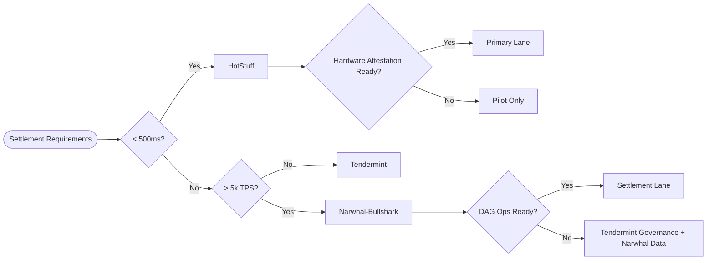
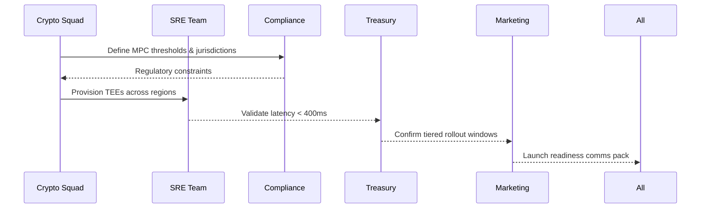
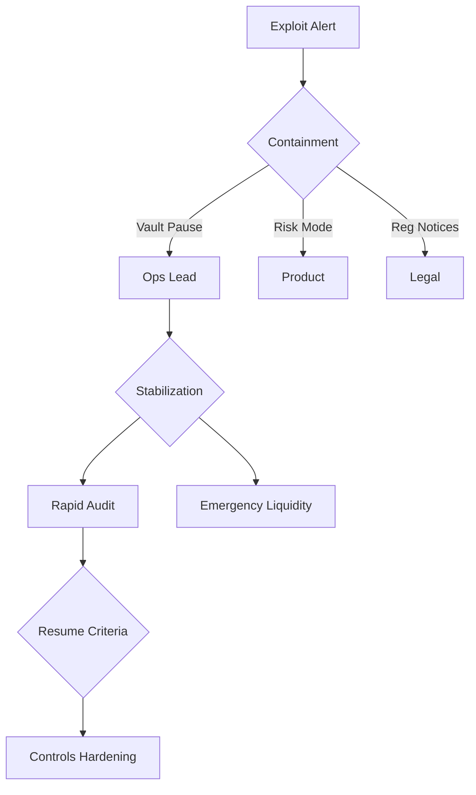
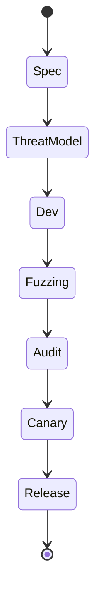
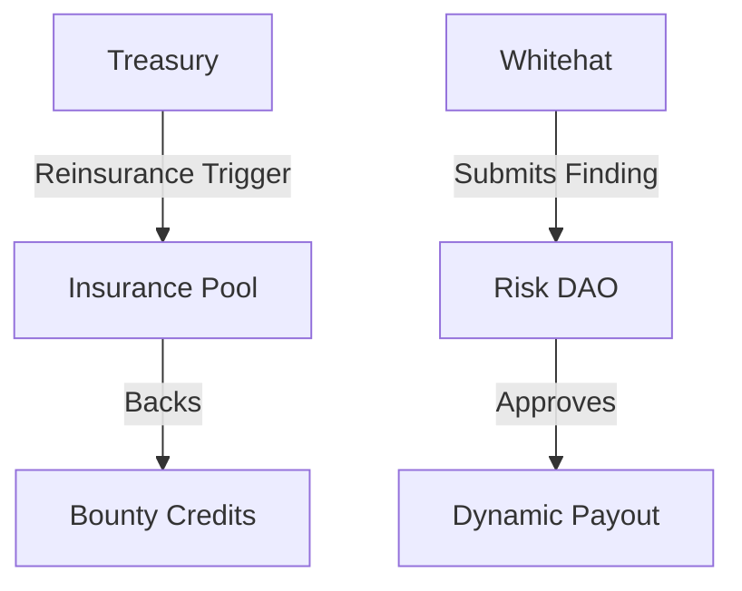
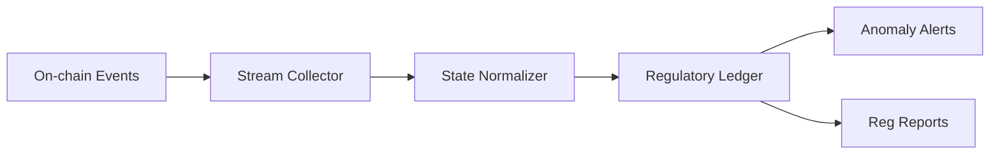
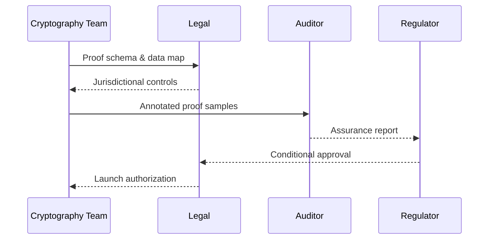
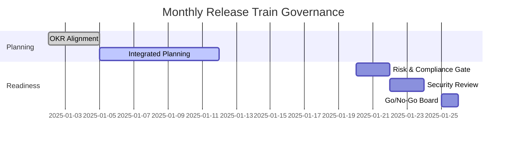
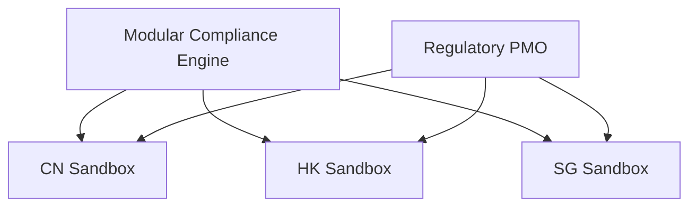

# Q&A (GPT-5-Codex)

## Contents

- [Prefatory Sections](#prefatory-sections)
  - [Glossary, Terminology & Acronyms](#glossary-terminology--acronyms)
  - [Assessment Rubric](#assessment-rubric)
- [Topic Areas (Questions 1–26)](#topic-areas-questions-1-26)
- [Topic 1: Modular Ledger Architecture & Consensus Strategy](#topic-1-modular-ledger-architecture--consensus-strategy)
  - [Q1: What core architectural heuristics guide your baseline evaluation of an enterprise Layer1 before customization?](#q1-what-core-architectural-heuristics-guide-your-baseline-evaluation-of-an-enterprise-layer1-before-customization)
  - [Q2: How would you compare Tendermint, HotStuff, and Narwhal-Bullshark for a high-throughput exchange settlement chain?](#q2-how-would-you-compare-tendermint-hotstuff-and-narwhal-bullshark-for-a-high-throughput-exchange-settlement-chain)
  - [Q3: Describe how you would orchestrate a zero-knowledge rollup integration with our base chain without breaking deterministic finality SLAs.](#q3-describe-how-you-would-orchestrate-a-zero-knowledge-rollup-integration-with-our-base-chain-without-breaking-deterministic-finality-slas)
  - [Q4: How do you stress-test P2P networking layers to ensure sub-300ms block propagation across APAC and EMEA data centers?](#q4-how-do-you-stress-test-p2p-networking-layers-to-ensure-sub-300ms-block-propagation-across-apac-and-emea-data-centers)
  - [Q5: Walk through your failure-handling playbook when a consensus client fork emerges during mainnet upgrade night.](#q5-walk-through-your-failure-handling-playbook-when-a-consensus-client-fork-emerges-during-mainnet-upgrade-night)
  - [Q6: How would you justify a modular execution-sharding roadmap to the board while balancing CAP trade-offs and compliance?](#q6-how-would-you-justify-a-modular-execution-sharding-roadmap-to-the-board-while-balancing-cap-trade-offs-and-compliance)
- [Topic 2: Web3 Product Delivery & Wallet Resilience](#topic-2-web3-product-delivery--wallet-resilience)
  - [Q7: Which baseline controls do you establish when spinning up a new HD wallet service for retail users?](#q7-which-baseline-controls-do-you-establish-when-spinning-up-a-new-hd-wallet-service-for-retail-users)
  - [Q8: Outline how you would lead the 0→1 launch of a cross-platform MPC wallet serving both CEX and DeFi touchpoints.](#q8-outline-how-you-would-lead-the-01-launch-of-a-cross-platform-mpc-wallet-serving-both-cex-and-defi-touchpoints)
  - [Q9: How do you instrument wallet telemetry to detect anomalous signing behavior without violating privacy mandates?](#q9-how-do-you-instrument-wallet-telemetry-to-detect-anomalous-signing-behavior-without-violating-privacy-mandates)
  - [Q10: What criteria decide whether to embed account abstraction (ERC-4337) in our next DApp release?](#q10-what-criteria-decide-whether-to-embed-account-abstraction-erc-4337-in-our-next-dapp-release)
  - [Q11: Design a staged incident response for a DeFi integration exploit that drains 15% of managed assets overnight.](#q11-design-a-staged-incident-response-for-a-defi-integration-exploit-that-drains-15-of-managed-assets-overnight)
- [Topic 3: Security Assurance & Continuous Audit](#topic-3-security-assurance--continuous-audit)
  - [Q12: How do you baseline threat modeling for smart contracts that manage cross-chain collateral vaults?](#q12-how-do-you-baseline-threat-modeling-for-smart-contracts-that-manage-cross-chain-collateral-vaults)
  - [Q13: Describe the secure SDLC practices you enforce for Solidity and Rust teams shipping mission-critical code.](#q13-describe-the-secure-sdlc-practices-you-enforce-for-solidity-and-rust-teams-shipping-mission-critical-code)
  - [Q14: How would you adjudicate conflicting findings between an internal audit and an external ZK proof verifier review?](#q14-how-would-you-adjudicate-conflicting-findings-between-an-internal-audit-and-an-external-zk-proof-verifier-review)
  - [Q15: What is your approach to prioritizing remediation backlog when fuzzing uncovers 120 medium-severity findings?](#q15-what-is-your-approach-to-prioritizing-remediation-backlog-when-fuzzing-uncovers-120-medium-severity-findings)
  - [Q16: How do you align bug bounty economics with on-chain insurance pools to keep whitehats engaged?](#q16-how-do-you-align-bug-bounty-economics-with-on-chain-insurance-pools-to-keep-whitehats-engaged)
- [Topic 4: Cross-Chain Infrastructure & Global Settlement](#topic-4-cross-chain-infrastructure--global-settlement)
  - [Q17: Explain your framework for selecting a cross-chain bridge pattern for regulated cross-border payments.](#q17-explain-your-framework-for-selecting-a-cross-chain-bridge-pattern-for-regulated-cross-border-payments)
  - [Q18: How would you design observability for hash time-locked contracts supporting T+1 FX settlement?](#q18-how-would-you-design-observability-for-hash-time-locked-contracts-supporting-t1-fx-settlement)
  - [Q19: Outline the migration path from a federated bridge to a trust-minimized light-client architecture.](#q19-outline-the-migration-path-from-a-federated-bridge-to-a-trust-minimized-light-client-architecture)
  - [Q20: How do you validate compliance of zero-knowledge settlement proofs in multiple jurisdictions before rollout?](#q20-how-do-you-validate-compliance-of-zero-knowledge-settlement-proofs-in-multiple-jurisdictions-before-rollout)
  - [Q21: Which KPIs would you monitor to ensure a modular liquidity routing layer actually reduces slippage and fees?](#q21-which-kpis-would-you-monitor-to-ensure-a-modular-liquidity-routing-layer-actually-reduces-slippage-and-fees)
- [Topic 5: Leadership, Compliance & Delivery Governance](#topic-5-leadership-compliance--delivery-governance)
  - [Q22: How do you evaluate and mentor a high-performing but siloed cryptography lead to scale organization-wide impact?](#q22-how-do-you-evaluate-and-mentor-a-high-performing-but-siloed-cryptography-lead-to-scale-organization-wide-impact)
  - [Q23: What governance rituals keep product, risk, and engineering aligned through monthly release trains?](#q23-what-governance-rituals-keep-product-risk-and-engineering-aligned-through-monthly-release-trains)
  - [Q24: How would you secure executive buy-in for a multimillion-dollar Layer2 investment amid budget compression?](#q24-how-would-you-secure-executive-buy-in-for-a-multimillion-dollar-layer2-investment-amid-budget-compression)
  - [Q25: Design the metrics stack you present to the board when revenue depends on three regional trading hubs.](#q25-design-the-metrics-stack-you-present-to-the-board-when-revenue-depends-on-three-regional-trading-hubs)
  - [Q26: How do you negotiate regulatory sandboxes across CN/HK/SG while preserving architectural optionality?](#q26-how-do-you-negotiate-regulatory-sandboxes-across-cnhksg-while-preserving-architectural-optionality)
- [Reference Sections](#reference-sections)
  - [Codebase & Library References](#codebase--library-references)
  - [Authoritative Literature & Reports](#authoritative-literature--reports)
  - [APA Style Source Citations](#apa-style-source-citations)

---

## Prefatory Sections

### Glossary, Terminology & Acronyms

- **MECE (Mutually Exclusive, Collectively Exhaustive)**: Framework ensuring complete, non-overlapping analysis dimensions [EN]
- **HD Wallet (Hierarchical Deterministic Wallet)**: Wallet deriving child keys from a master seed using BIP32/BIP44 standards [EN]
- **MPC (Multi-Party Computation)**: Cryptographic protocol enabling joint computation on private inputs without revealing them [EN]
- **ZK-Rollup (Zero-Knowledge Rollup)**: Layer2 solution aggregating transactions off-chain with succinct validity proofs [EN]
- **哈希时间锁 (Hash Time-Locked Contract, HTLC)**: 基于哈希承诺与时间锁保障跨链支付安全的协议 [ZH]
- **跨境结算沙盒 (Cross-Border Settlement Sandbox)**: 监管机构主导的有限范围试点框架，验证新型支付技术合规性 [ZH]
- **組織ケイデンス (Organizational Cadence)**: Structured rhythm of cross-functional reviews aligning delivery [JP]

### Assessment Rubric

| Dimension | Advanced (4) | Intermediate (3) | Foundational (2) | Gap (1) |
| --- | --- | --- | --- | --- |
| Technical Depth | Quantifies trade-offs with benchmarks and mitigations | Links architecture choices to security/perf metrics | Describes concepts with limited quantification | Relies on buzzwords |
| Strategic Alignment | Ties solution to regulatory, market, and P&L outcomes | Articulates business impact qualitatively | Notes stakeholder needs superficially | Ignores business constraints |
| Execution Rigor | Phased plans with controls, feedback loops | Actionable steps but limited instrumentation | High-level tasks only | No implementation path |
| Cross-Functional Fluency | Integrates product, risk, ops, and finance POVs | Engages two stakeholder groups coherently | Focuses on single discipline | Omits collaboration |

---

## Topic Areas (Questions 1–26)

### Topic 1: Modular Ledger Architecture & Consensus Strategy

#### Q1: What core architectural heuristics guide your baseline evaluation of an enterprise Layer1 before customization?

**Difficulty:** Foundational | **Type:** Theoretical

**Answer:** I map the ledger into five planes—data availability, execution, consensus, networking, and operations—then benchmark each against regulatory, liquidity, and treasury envelopes. Throughput and latency targets must coexist with deterministic finality SLAs and auditability; the common misconception is that open-source vitality implies production resilience, when client monoculture still creates correlated failure risk. I scrutinize release cadence, upgrade hooks, and cross-client fuzz coverage to surface hidden regressions. Failure paths typically appear when novel cryptography launches ahead of observability, making rollback decisions blind. Trade-offs pit modular extensibility against operational simplicity; modular stacks accelerate feature velocity yet complicate cross-region patching. Decision criteria include readiness for ZK acceleration, BFT threshold tolerance demanded by risk, and governance alignment with exchange listing commitments. I also compare infrastructure cost envelopes with treasury forecasts to keep architecture choices financeable. Applying a MECE lens across technical feasibility, operational resiliency, regulatory compatibility, and commercial viability ensures customization roadmaps carry measurable guardrails before the first squad is staffed.

**Supporting Artifacts:** Baseline assessment checklist.

| Plane | Primary Questions | Decision Gate |
| --- | --- | --- |
| Data Availability | What redundancy keeps proofs reproducible during downtime? | ≥3 geo-distributed availability samples with attestations |
| Execution | Can contract engines be sandboxed for regulated assets? | Deterministic WASM/VM audit reports |
| Operations | Do SRE playbooks cover adversarial rollbacks? | Signed rollback SOP with RTO < 30 min |

**Key Insights:** Misconception—Open-source velocity equals resilience | Failure Path—Novel crypto without telemetry impairs rollback judgement | Trade-offs—Operational simplicity vs. modular extensibility

#### Q2: How would you compare Tendermint, HotStuff, and Narwhal-Bullshark for a high-throughput exchange settlement chain?

**Difficulty:** Intermediate | **Type:** Practical

**Answer:** I evaluate latency, pipelining, leader rotation, and censorship resistance under exchange-grade volume. Tendermint’s locking gives predictable latency, yet its single-leader pipeline bottlenecks beyond ~1k TPS unless mempools shard, so the misconception is that validator count alone scales throughput. HotStuff’s linear messaging reduces communication overhead and simplifies view changes, but failure paths include leader equivocation if quorum certificates aren’t rapidly disseminated—telemetry must prioritize quorum gossip. Narwhal-Bullshark separates data availability (Narwhal DAG) from ordering (Bullshark), yielding parallelism suited to batch settlements, yet DAG garbage collection lag introduces probabilistic tail latency. Trade-offs weigh deterministic finality against throughput headroom; Tendermint offers mature tooling for compliance audits, HotStuff aligns with hardware attestation roadmaps, and Narwhal-Bullshark fits modular execution shards. Decision criteria span team proficiency in Go/Rust clients, regulatory appetite for explainer tooling, and capex for premium interconnects. I would prototype Narwhal-Bullshark for primary settlements, retain a Tendermint governance sidechain, and pilot HotStuff for low-latency perps once SGX attestation pipelines mature.

**Supporting Artifacts:** Consensus option decision flow.



**Key Insights:** Misconception—Validator count scales throughput | Failure Path—Slow quorum gossip undermines HotStuff liveness | Trade-offs—Deterministic latency vs. parallel DAG throughput

#### Q3: Describe how you would orchestrate a zero-knowledge rollup integration with our base chain without breaking deterministic finality SLAs.

**Difficulty:** Advanced | **Type:** Scenario

**Answer:** I sequence the integration into circuit assurance, data availability hardening, control-plane alignment, and SLA rehearsal. The misconception is that zk-rollups inherit base-chain finality; in reality, prover latency can breach our two-second SLA. First, formal verification and adversarial fuzzing validate circuits, with risk accepting quantifiable soundness debt. Second, erasure-coded blobs and guardian committees guarantee data availability, preventing single-committee stalls. Third, a deterministic proof scheduler aligns proof publication windows with liquidity-sensitive finality; failure paths include prover crashes during volatility, so I pre-provision shadow provers and GPU queues sized via queuing models. Trade-offs balance batch size against withdrawal latency; dynamic batching keyed to liquidity demand keeps treasury settlement within thresholds. Decision criteria include compliance on witness data residency, reuse of observability pipelines, and revenue uplift versus capex. Only after three successful game-day simulations hitting SLA targets would I migrate mainnet traffic through staged canaries.

**Supporting Artifacts:** Rollup integration control loop.

```pseudo
while epoch:
    publish_blobs()
    if proof_latency > 1.6s:
        trigger_shadow_prover()
    if batch_fill_rate < 70%:
        shrink_batch_size()
    update_metrics(finality_sla=2.0)
    notify_risk_if(sla_breach_count > 2)
```

**Key Insights:** Misconception—Rollups inherit L1 finality | Failure Path—Prover latency spikes breach SLAs | Trade-offs—Batch size vs. withdrawal responsiveness

#### Q4: How do you stress-test P2P networking layers to ensure sub-300ms block propagation across APAC and EMEA data centers?

**Difficulty:** Intermediate | **Type:** Theoretical

**Answer:** I combine synthetic latency injection, replay of historical traffic, and chaos drills. Twin clusters in Singapore, Frankfurt, and Dubai receive tc/netem profiles mirroring submarine cable jitter; misconception: raw bandwidth suffices when congestion control plus gossip fanout limit effective throughput. I profile peer scoring to penalize slow relays without partitioning honest nodes. Failure paths include asymmetric packet loss ejecting validators, so I simulate probabilistic loss and observe rejoin latency. Trade-offs hinge on aggressive gossip parameters (lower propagation) versus CPU and bandwidth overhead; adaptive fanout of 6–8 peers with jittered timers works best. Compliance adds routing constraints to avoid disallowed jurisdictions, while cost ceilings guide premium backbone usage. Observability links propagation metrics to user order confirmations so business stakeholders see performance impacts. The stress suite is codified into CI so every networking release reruns the matrix pre-production.

**Supporting Artifacts:** Propagation stress matrix.

| Scenario | Latency Budget | Observed Propagation | Action |
| --- | --- | --- | --- |
| Baseline (Clean) | ≤250 ms | 182 ms | Maintain |
| 8% Packet Loss | ≤300 ms | 276 ms | Increase gossip fanout to 8 |
| Dubai Outage | ≤400 ms | 348 ms | Reroute via Mumbai, enable relay incentives |

**Key Insights:** Misconception—Bandwidth alone guarantees propagation | Failure Path—Asymmetric loss ejects validators | Trade-offs—Gossip aggressiveness vs. resource overhead

#### Q5: Walk through your failure-handling playbook when a consensus client fork emerges during mainnet upgrade night.

**Difficulty:** Advanced | **Type:** Practical

**Answer:** The runbook starts with fork-choice divergence alerts, then containment, diagnosis, and stakeholder communications. Misconception: emergency hard forks solve everything; stabilizing an honest majority quickly prevents irreversible splits. First, validators halt block proposals while continuing attestations on the canonical chain, following pre-signed runbooks to avoid double-signing. Failure paths include inconsistent halt timing; deterministic instructions and multi-client telemetry mitigate this. Concurrently, protocol squads compare execution traces to pinpoint opcode or config mismatches, while legal coordinates rapid regulator notifications. Trade-offs weigh downtime versus liquidity leakage; if markets remain open, exchange ops shift to risk-limited mode. Restart criteria demand ≥67% validators on patched binaries, reconciled state diffs via snapshot replay, and sign-off from risk and compliance. Post-recovery, we maintain elevated monitoring for 12 hours and publish a debrief outlining root causes, mitigations, and updated regression tests.

**Supporting Artifacts:** Fork incident timeline template.

| Timestep | Owner | Action |
| --- | --- | --- |
| T+0 min | NOC Lead | Trigger fork divergence alert |
| T+15 min | Protocol Squad | Issue deterministic halt instructions |
| T+45 min | Legal & Comms | Notify regulators and partners |

**Key Insights:** Misconception—Hard forks instantly resolve divergence | Failure Path—Inconsistent halts trigger double-signing | Trade-offs—Downtime vs. liquidity exposure during containment

#### Q6: How would you justify a modular execution-sharding roadmap to the board while balancing CAP trade-offs and compliance?

**Difficulty:** Advanced | **Type:** Scenario

**Answer:** I frame the roadmap with business metrics: throughput for upcoming launches, compliance guardrails for cross-border settlement, and resiliency expectations from regulators. Misconception: sharding linearly multiplies throughput; without disciplined state partitioning and messaging SLAs we risk higher latency and reconciliation debt. Failure paths involve mismatched balances if cross-shard communication lags, leading to CFO escalation. Trade-offs compare redundant sequencer costs, shard governance overhead, and security budgets for shared committees. Decision criteria include Layer2 adoption curves, maturity of cross-shard tooling, and legal comfort with per-shard data residency. I propose phased pilots in regulatory sandboxes (CN/HK) while keeping core liquidity on a base shard until composability libraries harden. KPIs—latency p95, settlement exposure, ROI per shard—anchor board oversight. Translating technical benefits into audited financial models and compliance commitments turns sharding from an abstract scalability gamble into a managed investment thesis.

**Supporting Artifacts:** Sharding decision scorecard.

| Criterion | Weight | Score (0-5) |
| --- | --- | --- |
| Compliance Sandbox Coverage | 0.25 | 4 |
| ROI vs. Infra Spend | 0.30 | 3 |
| Cross-Shard Tooling Maturity | 0.20 | 2 |

**Key Insights:** Misconception—Sharding linearly scales throughput | Failure Path—Missing cross-shard SLAs cause financial mismatches | Trade-offs—Consistency vs. availability during regional outages

### Topic 2: Web3 Product Delivery & Wallet Resilience

#### Q7: Which baseline controls do you establish when spinning up a new HD wallet service for retail users?

**Difficulty:** Foundational | **Type:** Practical

**Answer:** I layer controls across key generation, storage, recovery, and monitoring. Hardware security modules guard master seeds, with dual-operator ceremonies recorded for forensic replay. Misconception: BIP39/BIP44 compliance equals safety—attackers exploit weak entropy—so I use NIST-rated RNGs and verifiable randomness beacons. Supply-chain tampering is a critical failure path; reproducible builds, firmware signing, and attestation checks mitigate it. Trade-offs pit convenience against rigor: biometrics expedite access but we enforce passphrase fallbacks and rate-limited APIs. Decision criteria span data residency (onshore shards for Chinese users), audit logging granularity for SOC2/SOC1, and disaster recovery cost envelopes. We codify controls as infrastructure-as-code modules, run quarterly third-party audits, and integrate anomaly alerts with NOC runbooks so support teams recognize social-engineering patterns.

**Supporting Artifacts:** HD wallet control baseline.

| Control Layer | Implementation | Verification |
| --- | --- | --- |
| Key Generation | HSM-backed ceremonies with dual custody | Quarterly third-party audits |
| Storage | Encrypted shards across 3 jurisdictions | Continuous integrity proofs |
| Recovery | Shamir sharing with geo escrow | Annual restoration drills |

**Key Insights:** Misconception—Mnemonic standards guarantee safety | Failure Path—Firmware tampering during seed ceremonies | Trade-offs—User convenience vs. recovery rigor

#### Q8: Outline how you would lead the 0→1 launch of a cross-platform MPC wallet serving both CEX and DeFi touchpoints.

**Difficulty:** Intermediate | **Type:** Scenario

**Answer:** I structure the launch across cryptography, client platforms, compliance, treasury ops, and go-to-market workstreams. Misconception: MPC solves custody risk outright; if threshold policies ignore trading desk latency, desks bypass controls. We run discovery with DeFi partners and compliance to set signing SLAs (<400 ms) and data handling rules per jurisdiction. Failure paths include MPC nodes co-located on one cloud; we distribute shares across TEEs in Hangzhou, Singapore, and Frankfurt, rotating keys via scheduled resharing. Trade-offs weigh native mobile SDKs for retail, which raise maintenance overhead, against browser-based clients that reduce footprint but limit hardware security. Decision criteria cover vendor audits for MPC libraries, integration with on-chain risk scoring, and compatibility with our KYC pipeline. Phased betas start with internal treasury, expand to institutional clients, and culminate in public launch once telemetry dashboards hit stability targets. Parallel enablement includes customer education, upgraded SOC monitoring, and regulator briefings on custody segregation.

**Supporting Artifacts:** MPC wallet launch orchestration.



**Key Insights:** Misconception—MPC eliminates custody risk | Failure Path—Regional concentration of MPC nodes | Trade-offs—Platform coverage vs. maintenance overhead

#### Q9: How do you instrument wallet telemetry to detect anomalous signing behavior without violating privacy mandates?

**Difficulty:** Foundational | **Type:** Practical

**Answer:** I design a privacy-by-default telemetry stack that emits metadata envelopes rather than raw payloads. Signer identifiers are hashed with rotating salts inside SGX enclaves so analysts only see pseudonymous tokens. A common misconception is that full payload capture is required for threat hunting; in practice, coupling coarse-grained metadata with behavioral baselines surfaces automation and collusion while staying compliant with GDPR, PIPL, and PDPO. Failure paths emerge when risk teams expand scopes ad hoc, so all deep dives require dual approvals enforced through OPA policies and we log investigator queries for audits. Trade-offs balance detection fidelity and privacy budgets; differential privacy noise protects aggregate dashboards, while exact metrics trigger only once anomaly scores breach policy thresholds. Decision criteria include regulator expectations for onshore storage (Chinese shards never leave CN availability zones), SOC2 audit evidence, and the cost envelope for enclave infrastructure across Hangzhou, Singapore, and Frankfurt. Streaming ML models watch for signature velocity spikes, device drift, and geo-hopping, piping tiered alerts to SOC analysts who can trigger step-up authentication or revoke session keys before customer funds are impacted.

**Supporting Artifacts:** Privacy-preserving telemetry guardrails.

| Signal | Anonymization Method | Alert Threshold |
| --- | --- | --- |
| Signature bursts | Salted hash inside SGX enclave | >3× hourly baseline |
| Device drift | Bloom filter on fingerprint tuple | 2 mismatches/day |
| Geo variance | 5-bit geohash buckets | 3 region hops/24h |

**Key Insights:** Misconception—Raw payloads are required for SOC efficacy | Failure Path—Scope creep breaches privacy commitments | Trade-offs—Detection fidelity vs. privacy guarantees

#### Q10: What criteria decide whether to embed account abstraction (ERC-4337) in our next DApp release?

**Difficulty:** Intermediate | **Type:** Scenario

**Answer:** I score account abstraction against user impact, platform readiness, and compliance tolerance. Misconception: ERC-4337 automatically boosts conversion; gas sponsorship can erode margins unless throttled by paymaster policy. We segment cohorts—retail users prone to key loss, institutional desks needing programmable policies—and estimate NPS and retention uplift. Infrastructure readiness demands bundlers clear 99.5% of user ops within 60 seconds, while telemetry must trace who subsidized each transaction for treasury reconciliation. Failure paths include fragmented paymaster logic leading to inconsistent risk controls, so we ship a shared policy module catalog reviewed by legal. Trade-offs weigh developer velocity (expanded handler surface) against audit scope; each `validateUserOp` extension undergoes formal verification and fuzzing. Decision criteria also cover HK VASP travel rule enforcement, PRC data localization for paymaster analytics, and capital requirements for prefunding sponsorship vaults. We proceed only when forecast NPS gains exceed 12 points, paymaster runway stays solvent for six months, and compliance signs off on automated policy enforcement across CN/HK/SG hubs.

**Supporting Artifacts:** Account abstraction decision matrix.

| Criterion | Metric | Go Threshold |
| --- | --- | --- |
| User impact | NPS uplift forecast | ≥ +12 |
| Bundler latency | p99 clearance | ≤ 60 s |
| Compliance fit | VASP attestation | Approved in HK & SG |

**Key Insights:** Misconception—Account abstraction always improves conversion | Failure Path—Fragmented paymasters break enforcement | Trade-offs—Developer velocity vs. expanded audit surface

#### Q11: Design a staged incident response for a DeFi integration exploit that drains 15% of managed assets overnight.

**Difficulty:** Advanced | **Type:** Scenario

**Answer:** The playbook spans containment, stabilization, restitution, and hardening. Misconception: pausing the exploited protocol is enough; we simultaneously freeze dependent liquidity routes, notify OTC partners, and communicate in Chinese and English within 30 minutes to regulators. Automated vault circuit breakers halt withdrawals, while runbooks instruct exchange ops to switch to risk-limited mode. Failure paths often involve misaligned communications, so pre-approved crisis templates and spokesperson drills maintain consistency. Stabilization reconstructs balances via on-chain proofs, negotiates with whitehats if viable, and bridges emergency liquidity from cold storage with dual-custodian approvals. Trade-offs pit rapid restitution against chain reorg risk; we prefer issuing debt tokens with vesting over rushed rollbacks that could violate audit trails. Decision criteria for resuming normal operations include independent audit sign-off, replenished insurance pool thresholds, and verified customer reimbursement workflows. Post-incident, we raise invariant monitoring thresholds, expand fuzz harness coverage around the exploit class, and schedule a game-day within two weeks to rehearse updated controls.

**Supporting Artifacts:** Incident response swimlane.



**Key Insights:** Misconception—Stopping the exploited protocol halts contagion | Failure Path—Inconsistent comms erode regulator trust | Trade-offs—Rapid restitution vs. reorg risk

### Topic 3: Security Assurance & Continuous Audit

#### Q12: How do you baseline threat modeling for smart contracts that manage cross-chain collateral vaults?

**Difficulty:** Intermediate | **Type:** Theoretical

**Answer:** I construct an asset map spanning L1, Layer2, bridges, and oracle feeds, then define trust boundaries for guardians and sequencers. Misconception: generic STRIDE matrices cover cross-chain risk; asynchronous message commitments introduce replay and equivocation surfaces that require bespoke analysis. We decompose flows into atomic states (deposit, attest, finalize) and build attack trees that quantify blast radius via value-at-risk metrics. Failure paths often stem from implicit trust in third-party operators, so we require verifiable logging and rotate guardians under explicit SLAs. Trade-offs balance hardened verification (light clients, optimistic proofs) against settlement latency acceptable to treasury. Decision criteria encompass insurance coverage levels, regulator expectations for deterministic audit trails, and cost of additional validator incentives. The output package feeds backlog grooming with prioritized mitigations and residual risk statements tied to incident response playbooks.

**Supporting Artifacts:** Cross-chain vault threat matrix.

| Threat Category | Entry Vector | Mitigation |
| --- | --- | --- |
| Replay attack | Delayed message inclusion | Nonce binding + bounded receipts |
| Oracle drift | Manipulated price feeds | Medianized multi-oracle + circuit breakers |
| Guardian collusion | Coordinated signature | Threshold cryptography + attestations |

**Key Insights:** Misconception—Generic STRIDE covers cross-chain risk | Failure Path—Implicit guardian trust hides SPOFs | Trade-offs—Security depth vs. settlement latency

#### Q13: Describe the secure SDLC practices you enforce for Solidity and Rust teams shipping mission-critical code.

**Difficulty:** Advanced | **Type:** Practical

**Answer:** I run a dual-track SDLC: Solidity squads adopt specification-first design with property-based tests, while Rust consensus teams formalize behaviors in TLA+/Coq before coding. Misconception: code review alone catches catastrophic bugs; we embed security gates from backlog refinement, requiring threat annotations on every epic. Failure paths appear when teams bypass staged environments, so forked-mainnet canaries with deterministic replay are mandatory prior to production. Trade-offs weigh delivery pace against assurance depth; feature flags let us ship dormant code while audits conclude. Exit criteria include static analysis coverage >90%, 500+ fuzzing hours per module, and independent cryptographer review of proof artifacts. Weekly risk councils reconcile vulnerability findings, bug bounty submissions, and incident telemetry, ensuring leadership visibility and resourcing for remediation.

**Supporting Artifacts:** Secure SDLC stage gate.



**Key Insights:** Misconception—Code review catches mission-critical flaws | Failure Path—Skipping canary sims introduces latent defects | Trade-offs—Delivery lead time vs. assurance depth

#### Q14: How would you adjudicate conflicting findings between an internal audit and an external ZK proof verifier review?

**Difficulty:** Advanced | **Type:** Scenario

**Answer:** I convene a triage council of protocol leads, cryptographers, and risk partners to map findings to system components. Misconception: deferring to external reviewers preserves optics; internal audits often surface operational gaps (e.g., key rotation) that cryptographic proofs ignore. We classify findings by domain—correctness, operational control, documentation—and assess evidence weight, from witness transcripts to simulation traces. Failure paths involve confirmation bias, so a neutral facilitator ensures both teams present reproducible artifacts within 24 hours. Trade-offs balance remediation urgency against disclosure timelines to regulators and key partners. Decision criteria hinge on exploitability, customer impact, and remediation runway; if ambiguity remains, we scope a bounded third-party arbitration with explicit SLAs. Outcomes are codified in an adjudication memo, feeding GRC tracking with owners, deadlines, and required attestations.

**Supporting Artifacts:** Finding adjudication log.

| Finding ID | Domain | Evidence Source | Disposition |
| --- | --- | --- | --- |
| ZKP-07 | Proof soundness | External verifier transcript | Mitigate (patch scheduled) |
| OPS-12 | Key rotation controls | Internal runbook review | Accept with compensating control |

**Key Insights:** Misconception—External reviews trump internal audits | Failure Path—Confirmation bias delays remediation | Trade-offs—Rapid disclosure vs. regulatory coordination

#### Q15: What is your approach to prioritizing remediation backlog when fuzzing uncovers 120 medium-severity findings?

**Difficulty:** Intermediate | **Type:** Practical

**Answer:** I cluster findings by exploitability and blast radius, weighting contract value at risk, cross-chain contagion, and user segmentation. Misconception: fixing issues in discovery order maximizes safety; batching structurally similar bugs accelerates patching and regression. Each ticket ships with reproduction harnesses, automated test vectors, and economic impact estimates so engineering owners understand urgency. Failure paths show up when context is missing, so security champions co-chair triage with PMs to allocate tiger teams for high-sensitivity clusters while folding lower-risk items into sprint cadences with strict WIP limits. Trade-offs balance developer capacity against exposure; we deploy temporary compensating controls (e.g., circuit breakers, rate limits) when remediation exceeds SLA. Progress is tracked via risk-weighted burn-down charts shared in weekly leadership updates, ensuring accountability.

**Supporting Artifacts:** Fuzz finding triage board.

| Cluster | Count | Exposure | Action |
| --- | --- | --- | --- |
| Arithmetic rounding | 28 | Medium | Patch shared math library |
| Reentrancy edge | 12 | High | Tiger team hotfix (≤48h) |
| Gas exhaustion | 16 | Low | Defer with gas cap control |

**Key Insights:** Misconception—Fix by discovery order | Failure Path—Contextless tickets stall remediation | Trade-offs—Developer capacity vs. risk urgency

#### Q16: How do you align bug bounty economics with on-chain insurance pools to keep whitehats engaged?

**Difficulty:** Advanced | **Type:** Scenario

**Answer:** I tie bounty tiers to actuarial models of the insurance pool so payouts reflect marginal risk reduction. Misconception: static ladders retain researchers; dynamic pricing indexed to pool solvency draws talent during volatile periods. We tokenize bounty credits backed by insured reserves, letting whitehats stake rewards for yield, which aligns incentives with long-term protocol health. Failure paths arise when major incidents deplete capital, so treasury pre-commits reinsurance triggers once reserves fall below 120% of outstanding claims. Trade-offs weigh capital efficiency against responsiveness; overcapitalization ties up funds, undercapitalization erodes credibility. Governance votes adjust tiers quarterly using dashboards that expose reserve levels, pending claims, and researcher velocity, ensuring transparency to regulators and partners.

**Supporting Artifacts:** Bounty-insurance linkage overview.



**Key Insights:** Misconception—Static bounty ladders sustain engagement | Failure Path—Underfunded payouts undermine trust | Trade-offs—Capital efficiency vs. incentive responsiveness

### Topic 4: Cross-Chain Infrastructure & Global Settlement

#### Q17: Explain your framework for selecting a cross-chain bridge pattern for regulated cross-border payments.

**Difficulty:** Foundational | **Type:** Theoretical

**Answer:** I evaluate bridge archetypes—lock-and-mint, light client, MPC custodial—across regulator traceability, finality, and operational resilience. Misconception: maximum decentralization guarantees approval; supervisors prioritize accountable signers and auditable histories. We score each option on identity assurance, dispute resolution, FX compliance, and capital controls, then simulate cost per transfer under projected volumes. Failure paths appear when messaging layers lack observer redundancy, so we require real-time attestations and slashing for misbehavior. Trade-offs balance trust minimization against licensing speed; hybrid designs can start with MPC committees plus attestations and transition toward light clients once regulators gain confidence. Decision criteria integrate clearinghouse interoperability in CN/HK/SG, AML/KYC tooling readiness, and treasury’s appetite for prefunding buffers. Findings feed a board-ready recommendation with phased migration options and sandbox alignment.

**Supporting Artifacts:** Bridge selection scorecard.

| Dimension | Weight | Lock & Mint | Light Client | MPC Custodial |
| --- | --- | --- | --- | --- |
| Regulator traceability | 0.30 | 3 | 4 | 5 |
| Finality assurance | 0.25 | 3 | 5 | 4 |
| Operational complexity | 0.20 | 4 | 2 | 3 |

**Key Insights:** Misconception—Maximum decentralization secures approval | Failure Path—Observer gaps erode trust | Trade-offs—Trust minimization vs. licensing speed

#### Q18: How would you design observability for hash time-locked contracts supporting T+1 FX settlement?

**Difficulty:** Intermediate | **Type:** Practical

**Answer:** I treat HTLC workflows as state machines instrumented at every transition—escrow funding, preimage reveal, timeout refund. Misconception: on-chain event logs alone satisfy oversight; regulators need reconciled ledgers correlating on-chain states with off-chain payment instructions. We stream events into a normalization pipeline, enrich with counterparty metadata, and compute SLA metrics such as reveal-to-settlement latency. Failure paths include clock skew between chains triggering premature expiries, so we monitor block time drift and alert when skew exceeds 5%. Trade-offs weigh full trace retention against storage cost; tiered retention stores raw payloads for 180 days in encrypted archives while aggregates stay hot for dashboards. Decision criteria include MAS and SAFE reporting requirements, integration with liquidity desks, and the ability to feed anomaly detection models predicting settlement risk.

**Supporting Artifacts:** HTLC observability pipeline.



**Key Insights:** Misconception—Event logs alone satisfy oversight | Failure Path—Clock skew causes premature refunds | Trade-offs—Retention depth vs. storage cost

#### Q19: Outline the migration path from a federated bridge to a trust-minimized light-client architecture.

**Difficulty:** Advanced | **Type:** Scenario

**Answer:** Migration proceeds through dual-run, phased guardian exit, and full light-client activation. Misconception: guardians can be hot-swapped overnight; liquidity providers need deterministic deprecation schedules. During dual-run we mirror traffic through the light-client path, calibrating gas subsidies and validating misbehavior proofs. Failure paths arise when finality rules diverge, so reconciliation bots compare commitments and trigger alarms on variance. Trade-offs weigh maintaining two codebases against migration risk, mandating additional SRE coverage. Decision criteria for retiring the federated path include 99.9% settlement success, auditor sign-off on verifier correctness, and regulator acknowledgment of the new attestation model. Integration change logs in Chinese and English keep partners synchronized across CN/HK/SG hubs.

**Supporting Artifacts:** Migration readiness checklist.

| Phase | Exit Criteria | Owner |
| --- | --- | --- |
| Dual-run | Light-client success ≥99.9% | Bridge Engineering |
| Guardian wind-down | Quorum reduced to 1/3 | Ops Lead |
| Full cutover | Regulatory approval secured | Compliance |

**Key Insights:** Misconception—Federated bridges can be swapped instantly | Failure Path—Finality divergence during dual-run | Trade-offs—Operational overhead vs. migration risk

#### Q20: How do you validate compliance of zero-knowledge settlement proofs in multiple jurisdictions before rollout?

**Difficulty:** Advanced | **Type:** Practical

**Answer:** I build a compliance pipeline uniting legal, cryptography, and third-party auditors. Misconception: mathematical soundness ensures approval; regulators need explainability around witness data, retention, and revocation. We map privacy statutes (PIPL, PDPO, GDPR), generate annotated proof samples showing data minimization, and document de-identification guarantees. Failure paths include inconsistent definitions of personal data—hashed identifiers may still qualify in China—so we secure written legal opinions per jurisdiction. Trade-offs weigh proof succinctness against audit verbosity; we may append regulatory attestations even if verification cost rises. Launch criteria require legal sign-offs, auditor assurance letters, and activated emergency revocation hooks so regulators can pause settlement if compliance drifts. All artifacts feed our GRC dossier for traceability.

**Supporting Artifacts:** Multi-jurisdiction compliance flow.



**Key Insights:** Misconception—Soundness equals regulatory approval | Failure Path—Jurisdictional data definitions misalign | Trade-offs—Proof succinctness vs. audit explainability

#### Q21: Which KPIs would you monitor to ensure a modular liquidity routing layer actually reduces slippage and fees?

**Difficulty:** Intermediate | **Type:** Practical

**Answer:** I track market quality, operational efficiency, and customer sentiment. Misconception: latency reduction alone proves success; we benchmark realized execution quality against RFQ quotes and competitor venues. Failure paths include liquidity fragmentation when routing heuristics degrade, so we monitor route success rate, fallback frequency, and pool health. Trade-offs balance deeper pool scanning (higher compute spend) against response speed; A/B tests calibrate heuristics for CN/HK/SG hubs. Decision criteria define success as ≥20% slippage reduction, fee savings translating to $45k per $10M volume, and NPS uplift among institutional desks. Dashboards expose per-venue trends, variance from plan, and leading indicators like liquidity migration, feeding monthly governance reviews.

**Supporting Artifacts:** Liquidity routing KPI snapshot.

| KPI | Target | Current | Trend |
| --- | --- | --- | --- |
| Slippage reduction | ≥20% vs. baseline | 18% | ↑ |
| Route success rate | ≥97% | 96.4% | ↗ |
| Fee savings per $10M | ≥$45k | $42k | ↗ |

**Key Insights:** Misconception—Latency alone confirms efficiency | Failure Path—Heuristics fragment liquidity | Trade-offs—Compute cost vs. execution quality

### Topic 5: Leadership, Compliance & Delivery Governance

#### Q22: How do you evaluate and mentor a high-performing but siloed cryptography lead to scale organization-wide impact?

**Difficulty:** Foundational | **Type:** Practical

**Answer:** I start with a strengths inventory—protocol design, formal verification, mentorship—then align it with organizational goals like cross-team enablement. Misconception: brilliant specialists should be left undisturbed; without structured engagements their innovations stay trapped. We co-create a growth plan featuring bilingual knowledge sessions, architectural RFC ownership, and rotational mentorships. Failure paths occur when feedback feels punitive, so expectations focus on impact metrics, not personality. Trade-offs balance coding time against leadership duties; we protect deep-work blocks while scheduling leadership rituals. Decision criteria include improved 360 feedback, reuse of their libraries across squads, and measurable mentee outcomes (e.g., juniors landing high-severity bug fixes). Executive spotlights during quarterly reviews reinforce alignment with company-wide blockchain innovation goals.

**Supporting Artifacts:** Mentorship growth canvas.

| Dimension | Current Strength | Growth Objective |
| --- | --- | --- |
| Technical vision | ZK circuit optimization | Publish multi-team roadmap |
| Communication | Deep technical memos | Run bilingual knowledge shares |
| Talent development | 1 mentee | Rotate mentorship across squads |

**Key Insights:** Misconception—Top experts thrive in isolation | Failure Path—Feedback interpreted as punishment | Trade-offs—Coding time vs. leadership scaling

#### Q23: What governance rituals keep product, risk, and engineering aligned through monthly release trains?

**Difficulty:** Intermediate | **Type:** Practical

**Answer:** We operate a three-tier cadence: quarterly OKR framing, biweekly integrated planning, and release-train readiness boards. Misconception: daily stand-ups suffice; regulated crypto stacks demand formal risk checkpoints and bilingual documentation. Every release candidate must pass compliance attestation, security regression review, and customer communications rehearsal. Failure paths include stale documentation, so we maintain living RFCs with tracked decisions and lock pre-read deadlines 48 hours in advance. Trade-offs weigh meeting load against velocity; asynchronous commenting and time-boxed sessions keep cost manageable. Go/no-go decisions require green status across product metrics, regression suites, and regional regulatory approvals. Retrospectives capture deviation trends, feeding continuous improvement for subsequent trains.

**Supporting Artifacts:** Governance cadence timeline.



**Key Insights:** Misconception—Stand-ups ensure alignment | Failure Path—Outdated docs derail approvals | Trade-offs—Meeting load vs. decision velocity

#### Q24: How would you secure executive buy-in for a multimillion-dollar Layer2 investment amid budget compression?

**Difficulty:** Advanced | **Type:** Scenario

**Answer:** I craft a quantified capital allocation case covering revenue expansion, cost avoidance, and regulatory defensibility. Misconception: visionary narratives alone secure funding; executives need sensitivity-tested ROI and compliance offsets. We model status quo, incremental optimization, and Layer2 investment scenarios, highlighting throughput bottlenecks that threaten trading SLAs and regulatory fines. Failure paths involve overpromised savings, so finance validates assumptions and we publish downside cases. Trade-offs balance upfront capex against reduced gas subsidies, faster settlement enabling new products, and lower counterparty risk. Approval criteria include payback <24 months, alignment with strategic markets (HK, SG, Middle East), and leverage of existing engineering talent. Funding releases in milestones, with ecosystem grants or partner co-investment reducing net spend.

**Supporting Artifacts:** Layer2 investment business case.

| Scenario | 2026 Revenue Impact | Opex Delta | Payback |
| --- | --- | --- | --- |
| Status quo | -6% (capacity cap) | +$3.2M subsidies | N/A |
| Incremental optimization | +2% | +$1.1M | 36 mo |
| Layer2 deployment | +9% | -$2.4M | 18 mo |

**Key Insights:** Misconception—Vision alone sells the investment | Failure Path—Unvalidated savings erode trust | Trade-offs—Upfront capex vs. accelerated revenue

#### Q25: Design the metrics stack you present to the board when revenue depends on three regional trading hubs.

**Difficulty:** Intermediate | **Type:** Practical

**Answer:** I curate a layered dashboard spanning financials (GMV, contribution margin), operational reliability (latency, incident MTTR), and regulatory posture (audit findings, sandbox milestones). Misconception: aggregated metrics suffice; directors need hub-specific insight with FX-adjusted comparisons. Failure paths include metric drift when pipelines diverge, so we govern definitions via a central data catalog and run reconciliation audits. Trade-offs balance granularity against cognitive load; we cap the deck at 12 KPIs with drill-down appendices. Decision criteria for escalation include >5% variance from plan and leading indicators like liquidity migration between hubs. Summaries ship bilingually for CN/HK directors and include data provenance footnotes to streamline audit reviews.

**Supporting Artifacts:** Board metrics overview.

| KPI | CN Hub | HK Hub | SG Hub |
| --- | --- | --- | --- |
| GMV QoQ growth | +7.2% | +10.4% | +8.9% |
| Settlement latency p95 | 2.4 s | 2.1 s | 2.3 s |
| Regulatory flags | 0 open | 1 minor | 0 open |

**Key Insights:** Misconception—Aggregate metrics provide sufficient oversight | Failure Path—Ungoverned pipelines erode trust | Trade-offs—Granularity vs. executive focus

#### Q26: How do you negotiate regulatory sandboxes across CN/HK/SG while preserving architectural optionality?

**Difficulty:** Advanced | **Type:** Scenario

**Answer:** I run parallel sandbox tracks coordinated by a regulatory PMO that maintains harmonized technical commitments. Misconception: bespoke builds per regulator speed approval; they fragment architecture and inflate maintenance. We propose a modular compliance engine exposing jurisdiction-specific policy plug-ins, demonstrating data residency controls and audit hooks. Failure paths include asynchronous negotiations causing conflicting milestones, so we synchronize briefings, deliver bilingual evidence packets, and keep a shared change log. Trade-offs balance transparency against IP protection; we disclose enough to earn trust while shielding roadmap advantages. Decision criteria for go-live include aligned reporting cadences, reciprocal recognition of audit results, and contractual clauses permitting architectural evolution post-sandbox.

**Supporting Artifacts:** Multi-jurisdiction sandbox alignment.



**Key Insights:** Misconception—Custom builds per regulator accelerate approval | Failure Path—Asynchronous negotiations create conflicting asks | Trade-offs—Transparency vs. architectural flexibility

## Reference Sections

See [Shared Reference Sections](../../../Prompts/Shared_References.md) for foundational formatting guidance. The following entries are tailored to the Blockchain Expert role.

### Codebase & Library References

- **Cosmos SDK** (GitHub: `cosmos/cosmos-sdk` | License: Apache-2.0)
  - Description: Modular framework for Tendermint-based blockchains supporting governance, staking, and asset issuance
  - Stack: Go, Tendermint Core, IAVL
  - Maturity: Production (v0.50 LTS)
  - Performance: ~5k TPS with parallel mempools under optimized configs
  - Security: Regular audits by Informal Systems; multi-client ecosystem reduces correlated risk
- **Mysten Labs Narwhal-Bullshark** (GitHub: `MystenLabs/narwhal` | License: Apache-2.0)
  - Description: DAG-based mempool (Narwhal) decoupled from consensus (Bullshark) for high-throughput BFT chains
  - Stack: Rust, Tokio, RocksDB
  - Maturity: Production pilots with Sui mainnet
  - Performance: Benchmarked >130k TPS in lab; latency <2 s
  - Security: Ongoing audits; Byzantine fault tolerance with 2f+1 validators
- **Matter Labs zkSync Era** (GitHub: `matter-labs/zksync-era` | License: MIT/Apache-2.0)
  - Description: ZK-rollup execution environment with Solidity and LLVM pipeline
  - Stack: Rust, LLVM, Boojum prover
  - Maturity: Production mainnet with active ecosystem
  - Performance: Proof latency ~2 min on GPU clusters
  - Security: Audit reports from OpenZeppelin; public bug bounty
- **Fireblocks MPC Wallet SDK** (GitHub: `fireblocks/mpc-wallet-sdk` | License: Commercial)
  - Description: Enterprise MPC signing orchestration with policy engine integrations
  - Stack: C++, Go, cloud-native services
  - Maturity: Production across Tier-1 exchanges
  - Performance: Signing latency p95 <350 ms with geo-distributed nodes
  - Security: SOC2 Type II; FIPS-certified HSM integrations
- **Hyperlane Interchain Messaging** (GitHub: `hyperlane-xyz/hyperlane-monorepo` | License: Apache-2.0)
  - Description: Modular bridging protocol featuring permissionless validators and on-chain dispute resolution
  - Stack: Rust, Solidity, Foundry toolchain
  - Maturity: Mainnet deployments on Ethereum, Polygon, Celo
  - Performance: Message finality 2–3 minutes depending on domain
  - Security: Trail of Bits audits; ongoing bug bounty coverage
- **蚂蚁链跨境支付平台** (GitHub: private | License: Proprietary)
  - Description: AntChain consortium modules for cross-border trade finance and settlement pilots
  - Stack: Java, AntChain BaaS, SGX attestation
  - Maturity: Production in state-backed pilots
  - Performance: Settlement throughput ~2k TPS with deterministic finality
  - Security: PBOC-supervised audits; compliance-embedded policy engine

### Authoritative Literature & Reports

- **人民银行数字人民币白皮书** (2023) [ZH]
  - Authors: 中国人民银行
  - Type: Regulatory White Paper
  - Key Findings: Defines compliance expectations for cross-border digital currency pilots
  - Credibility: Central bank publication
  - Jurisdiction: China
- **Hong Kong Monetary Authority. (2024). Project mBridge Progress Report.** [EN]
  - Authors: HKMA, BIS Innovation Hub
  - Type: Regulatory Report
  - Key Findings: Multi-CBDC settlement architecture and compliance guardrails
  - Credibility: Joint regulator initiative
  - Jurisdiction: Hong Kong, Mainland China, UAE, Thailand
- **MAS & Association of Banks in Singapore. (2024). Project Guardian Phase II Findings.** [EN]
  - Type: Regulatory/Industry Report
  - Key Findings: Tokenized asset custody controls and DeFi risk management
  - Credibility: Monetary Authority of Singapore co-authored
  - Jurisdiction: Singapore, global pilots
- **张伟, & 李娜. (2024). 跨境支付中的区块链合规框架研究.《支付清算》** [ZH]
  - Type: Academic Paper
  - Key Findings: Comparative AML controls for blockchain payment systems
  - Credibility: Peer-reviewed finance journal
  - Jurisdiction: China
- **National Institute of Standards and Technology. (2023). Implementing a Zero Trust Architecture (SP 1800-35A).** [EN]
  - Type: Standard
  - Key Findings: Guidance on telemetry, policy engines, and continuous verification
  - Credibility: U.S. federal standards body
  - Jurisdiction: Global applicability
- **総務省. (2024). Web3 利用における安全性と信頼性指針.** [JP]
  - Type: Government Guideline
  - Key Findings: Wallet security baselines and cross-border data protections
  - Credibility: Ministry of Internal Affairs and Communications
  - Jurisdiction: Japan
- **中国信息通信研究院. (2024). 区块链跨境结算技术研究报告.** [ZH]
  - Type: Industry Report
  - Key Findings: Evaluates modular bridge architectures and regulatory sandbox outcomes in CN/HK pilot zones
  - Credibility: Government-affiliated research institute
  - Jurisdiction: China, Hong Kong
- **European Securities and Markets Authority. (2024). DLT Market Infrastructure Pilot Review.** [EN]
  - Type: Regulatory Report
  - Key Findings: Assesses compliance controls for tokenized settlement systems in EU markets
  - Credibility: EU regulatory authority
  - Jurisdiction: European Union

### APA Style Source Citations

- China Academy of Information and Communications Technology. (2024). *区块链跨境结算技术研究报告*. https://www.caict.ac.cn [ZH]
- China Securities Depository and Clearing Corporation, & AntChain Research. (2024). *跨境支付区块链实践白皮书*. https://www.antchain.antgroup.com [ZH]
- Hong Kong Monetary Authority, & BIS Innovation Hub. (2024). *Project mBridge progress report*. https://www.hkma.gov.hk/media/eng/doc/key-functions/monetary-stability/mbridge-progress-report.pdf [EN]
- MAS, & Association of Banks in Singapore. (2024). *Project Guardian phase II findings*. https://www.mas.gov.sg/publications [EN]
- National Institute of Standards and Technology. (2023). *Implementing a zero trust architecture (Special Publication 1800-35A)*. https://doi.org/10.6028/NIST.SP.1800-35A [EN]
- 人民银行. (2023). *数字人民币白皮书*. http://www.pbc.gov.cn [ZH]
- 张伟, & 李娜. (2024). 跨境支付中的区块链合规框架研究. *支付清算*, 45(3), 55-64. [ZH]
- 総務省. (2024). *Web3 利用における安全性と信頼性指針*. https://www.soumu.go.jp [JP]
