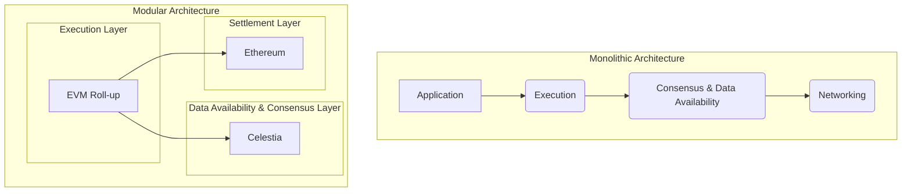
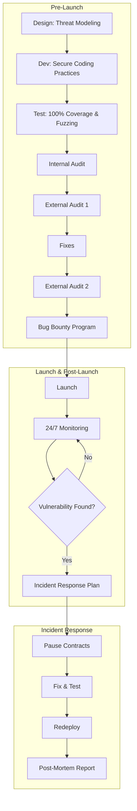

# Blockchain Expert Interview Q&A

*See [/Workplace/Interview/Prompts/Requirements.md](../../../Prompts/Requirements.md) for common guidelines.*

## Contents

- [Topic Areas](#topic-areas-questions-1-n)
- [Topic 1: Blockchain Architecture & Design](#topic-1-blockchain-architecture--design)
  - [Q1: When designing a new blockchain system from scratch for a supply chain finance platform, what are the critical architectural decisions you would make regarding the choice between a monolithic and a modular architecture?](#q1-when-designing-a-new-blockchain-system-from-scratch-for-a-supply-chain-finance-platform-what-are-the-critical-architectural-decisions-you-would-make-regarding-the-choice-between-a-monolithic-and-a-modular-architecture)
  - [Q2: You are tasked with designing a high-throughput system for cross-border settlements. How would you approach the trade-offs between decentralization, security, and scalability (the blockchain trilemma) in your architecture?](#q2-you-are-tasked-with-designing-a-high-throughput-system-for-cross-border-settlements-how-would-you-approach-the-trade-offs-between-decentralization-security-and-scalability-the-blockchain-trilemma-in-your-architecture)
- [Reference Sections](#reference-sections)

---

## Topic Areas (Questions 1–N)

### Topic 1: Blockchain Architecture & Design

#### Q1: When designing a new blockchain system from scratch for a supply chain finance platform, what are the critical architectural decisions you would make regarding the choice between a monolithic and a modular architecture?

**Difficulty:** Advanced | **Type:** Scenario

**Answer:** 
Choosing between a monolithic and a modular architecture for a supply chain finance platform requires a careful analysis of trade-offs between development speed, sovereignty, and long-term flexibility. A monolithic architecture, like that of early blockchains (e.g., Bitcoin, Ethereum), bundles consensus, data availability, and execution into a single layer. This approach can accelerate initial development as it leverages established, all-in-one frameworks. However, it creates tight coupling, making future upgrades to any single component (like the consensus mechanism) complex and risky. For a supply chain platform requiring high security and predictable performance, a monolithic design might initially seem robust, but it can lead to scalability bottlenecks and limit customization.

A modular architecture, conversely, separates the layers. For instance, one could use a dedicated consensus layer like Celestia for data availability, an execution layer like a custom EVM roll-up for smart contracts, and a settlement layer on Ethereum. This separation allows each component to be optimized independently. For a supply chain use case, this means we could select a consensus mechanism optimized for permissioned access and low latency, while the execution layer could be tailored for complex financial logic. While the initial integration effort is higher, this approach provides superior flexibility, scalability, and allows the platform to evolve with emerging technologies like ZK-proofs for privacy without requiring a full system overhaul. The key decision criteria would be the need for sovereignty over the entire stack versus the benefits of leveraging specialized, best-in-class solutions for each layer.

**Supporting Artifacts:**

**Mermaid Diagram: Monolithic vs. Modular Architecture**


**Table: Architectural Trade-offs**
| Feature | Monolithic Architecture | Modular Architecture | Decision Rationale for Supply Chain Finance |
| :--- | :--- | :--- | :--- |
| **Development Speed** | Faster initial setup | Slower initial integration | Modular is preferred for long-term vision despite initial overhead. |
| **Security** | Security is interdependent | Can leverage security of a robust settlement layer (e.g., Ethereum) | Modular allows inheriting battle-tested security, which is critical for finance. |
| **Scalability** | Limited; bottlenecks in one layer affect the whole system | High; layers can be scaled independently | Modular is essential for handling high transaction volumes in a large supply chain network. |
| **Flexibility/Customization** | Low; difficult to upgrade individual components | High; can swap out layers (e.g., new ZK-EVM) | High flexibility is needed to adapt to changing regulatory and business requirements. |
| **Sovereignty** | High; full control over the entire stack | Lower; dependent on external layers | For supply chain, interoperability often outweighs full sovereignty. |

**Key Insights:**
- **Misconception**: A monolithic architecture is inherently more secure because it's a closed system. In reality, its inflexibility can prevent timely security upgrades.
- **Failure Path**: Choosing a monolithic design for quick deployment without planning for future scalability needs can lead to a complete system rebuild once transaction volume grows.
- **Trade-offs**: The primary trade-off is between the simplicity and control of a monolithic stack versus the scalability and flexibility of a modular approach. For a dynamic and high-stakes environment like supply chain finance, the latter is strategically superior.

---

#### Q2: You are tasked with designing a high-throughput system for cross-border settlements. How would you approach the trade-offs between decentralization, security, and scalability (the blockchain trilemma) in your architecture?

**Difficulty:** Advanced | **Type:** Practical

**Answer:**
For a high-throughput cross-border settlement system, a pragmatic approach to the blockchain trilemma is required, as no single solution can maximize all three properties. The design must prioritize security and scalability, while accepting a controlled degree of centralization. I would propose a hybrid architecture that leverages a permissioned Layer 2 (L2) scaling solution, with a public Layer 1 (L1) blockchain like Ethereum for final settlement and security.

1.  **Scalability & Throughput**: The core of the system would be a permissioned L2 network, such as a ZK-rollup or an optimistic rollup. This L2 would be operated by a consortium of trusted financial institutions. By using a limited number of validators, we can achieve significantly higher transaction throughput and lower latency compared to a fully decentralized L1. Transactions are processed off-chain in batches, and only a cryptographic proof (for ZK-rollups) or a fraud proof mechanism (for optimistic rollups) is submitted to the L1.

2.  **Security**: The system's security is anchored to the L1. All transaction batches from the L2 are immutably recorded on the L1, inheriting its security and censorship resistance. This ensures that even if the L2 consortium were to be compromised, the integrity of the settlement data remains verifiable on the public chain. Smart contracts on the L1 would govern the rules of the L2, including validator selection and dispute resolution, providing a trustless foundation.

3.  **Decentralization**: Full decentralization is traded for performance in this model. However, a degree of decentralization is maintained by using a consortium of geographically and politically diverse institutions as L2 validators, preventing control by a single entity. Furthermore, the ability for any participant to exit the L2 and settle their assets on the L1 provides a crucial check on the power of the consortium. This "trustless exit" mechanism ensures that users are not locked into the L2 system.

This tiered approach provides the high throughput needed for settlements while leveraging the unparalleled security of a major L1. The trade-off is a reduction in decentralization at the transaction processing layer, which is a well-justified compromise for this specific enterprise use case.

**Supporting Artifacts:**

**Mermaid Diagram: Hybrid L1/L2 Architecture for Cross-Border Settlements**
```mermaid
graph TD
    subgraph Layer 2 (Permissioned Consortium)
        A[User A in Country X] -- Transaction --> B{L2 Validator Node 1};
        C[User B in Country Y] -- Transaction --> D{L2 Validator Node 2};
        B & D -- Batch & Process Transactions --> E[Sequencer];
        E -- Generates Proof --> F[ZK-Prover/Fraud Proof Submitter];
    end

    subgraph Layer 1 (Public Blockchain - e.g., Ethereum)
        G[Settlement Contract];
        H[Data Availability];
    end

    F -- Submits Proof/State Root --> G;
    E -- Writes Transaction Data --> H;
    G -- Verifies Proof & Finalizes State --> I[Final Settlement on L1];

    style A fill:#f9f,stroke:#333,stroke-width:2px
    style C fill:#f9f,stroke:#333,stroke-width:2px
    style I fill:#ccf,stroke:#333,stroke-width:2px
```

**Table: Trilemma Trade-off Analysis**
| Trilemma Aspect | Architectural Choice | Rationale |
| :--- | :--- | :--- |
| **Scalability** | L2 Rollup (ZK or Optimistic) with a permissioned sequencer set. | Off-chain computation and batching allows for thousands of TPS, meeting the demands of a settlement system. |
| **Security** | Anchoring to a public L1 (e.g., Ethereum) for settlement. | Inherits the economic security and immutability of a battle-tested public blockchain. L1 smart contracts enforce L2 rules. |
| **Decentralization** | Permissioned consortium of known entities as L2 validators. | A controlled set of validators is a necessary trade-off for high performance. Mitigation is provided by the diversity of the consortium and trustless exit mechanisms to the L1. |

**Key Insights:**
- **Misconception**: A blockchain solution must be fully decentralized to be secure. For enterprise use cases, a hybrid model can offer superior, fit-for-purpose security by combining the strengths of permissioned and public systems.
- **Failure Path**: Attempting to build a high-frequency settlement system directly on a public L1 without L2 scaling would lead to prohibitive costs (gas fees) and unacceptable latency, making the system economically unviable.
- **Trade-offs**: The design explicitly trades decentralization at the processing layer for the scalability required for settlements, while retaining the security of the L1 as the ultimate arbiter of truth.

---

### Topic 2: Advanced Cryptography in Blockchain

#### Q3: Zero-Knowledge (ZK) proofs are increasingly cited as a key technology for both scalability and privacy. Describe a scenario where you would choose a ZK-SNARK over a ZK-STARK, and outline the primary challenges you would anticipate during implementation.

**Difficulty:** Advanced | **Type:** Theoretical

**Answer:**
The choice between a ZK-SNARK (Succinct Non-Interactive Argument of Knowledge) and a ZK-STARK (Scalable Transparent Argument of Knowledge) hinges on the specific requirements of the application, particularly the trade-offs between proof size, prover/verifier costs, and trust assumptions.

I would choose a ZK-SNARK in a scenario where proof size is the absolute critical constraint, such as a public blockchain with limited data availability where every byte of block space is valuable. For example, in a privacy-preserving mobile payment application built on a public L1, transaction proofs must be as small as possible to minimize on-chain fees and ensure fast propagation through the network. SNARKs excel here, producing proofs that are only a few hundred bytes. However, this comes with a significant trade-off: most practical SNARK constructions (like Groth16) require a trusted setup ceremony. If this ceremony is compromised, the entire system's security is undermined, as an attacker could generate false proofs.

The primary challenges during implementation would be:
1.  **Trusted Setup Management**: Securely conducting the multi-party computation (MPC) ceremony for the trusted setup is operationally complex and a point of centralization. It requires coordinating multiple independent and trusted participants, and the toxic waste (randomness) from the ceremony must be verifiably destroyed.
2.  **Circuit Complexity**: Defining the logic of the computation as a circuit (an R1CS or similar constraint system) is a highly specialized and error-prone task. For a financial application, any bug in the circuit could lead to catastrophic vulnerabilities, such as counterfeiting assets. The development process is slow, and auditing these complex cryptographic constructions is difficult.
3.  **Prover Performance**: While verifier performance is high and proof sizes are small, generating a SNARK proof is computationally intensive. For a mobile application, this would likely require offloading the proof generation to a dedicated server, introducing a potential point of centralization or censorship.

**Supporting Artifacts:**

**Mermaid Diagram: ZK-SNARK vs. ZK-STARK Decision Flow**
```mermaid
graph TD
    A{Start: ZK Use Case} --> B{Is minimal proof size critical (e.g., L1 on-chain data)?};
    B -- Yes --> C{ZK-SNARK};
    B -- No --> D{Is resistance to quantum attacks & no trusted setup required?};
    D -- Yes --> E{ZK-STARK};
    D -- No --> F[Re-evaluate constraints];
    C --> G[Challenges: Trusted Setup, Circuit Complexity, Prover Cost];
    E --> H[Challenges: Larger Proof Size, Higher Verifier Cost];
```

**Table: ZK-SNARK vs. ZK-STARK Comparison**
| Feature | ZK-SNARK (e.g., Groth16) | ZK-STARK | Rationale for Mobile Payment App |
| :--- | :--- | :--- | :--- |
| **Proof Size** | Very Small (~100-300 bytes) | Larger (~tens of KBs) | **SNARK wins**. Critical for minimizing on-chain transaction fees. |
| **Trusted Setup** | Required | Not Required (Transparent) | **STARK wins in trustlessness**, but the overhead is acceptable for the SNARK's proof size benefit in this case. |
| **Prover Time** | Fast | Slower (depends on computation) | SNARK is generally faster for typical computations, but this can be offloaded. |
| **Verifier Time** | Very Fast (constant time) | Slower (logarithmic in complexity) | SNARK's fast verification is good for on-chain contracts. |
| **Quantum Resistance** | Vulnerable (relies on elliptic curves) | Resistant (relies on hash functions) | **STARK wins for long-term security**, but this is a future risk that may be acceptable for now. |

**Key Insights:**
- **Misconception**: SNARKs and STARKs are interchangeable. The choice has profound implications for trust assumptions, cost, and long-term security.
- **Failure Path**: Selecting a ZK-SNARK for a system where the integrity of the trusted setup cannot be guaranteed or communicated to users, thereby undermining the entire trust model of the application.
- **Trade-offs**: The core trade-off is accepting the one-time trust assumption of a SNARK's setup ceremony in exchange for extremely small and efficient proofs.

---

### Topic 3: Cross-Chain Interoperability

#### Q4: You are tasked with designing a bridge to connect a private enterprise blockchain to a public chain like Ethereum for asset tokenization. Compare the trade-offs between a centralized "lock-and-mint" bridge and a more decentralized approach using Hash Time-Locked Contracts (HTLCs). What is your recommended approach and why?

**Difficulty:** Advanced | **Type:** Scenario

**Answer:**
When connecting a private enterprise chain to a public one, the choice of bridge architecture is critical and involves significant trade-offs between security, trust assumptions, and operational complexity.

A centralized "lock-and-mint" bridge is often the most pragmatic starting point for an enterprise use case. In this model, a trusted federation or a single entity operates a custodian. When an asset is moved from the private chain to Ethereum, it is locked in a smart contract on the private chain, and the custodian then mints a corresponding "wrapped" token (e.g., an ERC-20) on Ethereum. The process is reversed for moving assets back. This design is simple to implement and manage. Its main drawback is the centralized trust model: users must trust the custodian not to be malicious or compromised. For an enterprise, this trust can be managed through legal agreements and insurance, making it an acceptable risk.

A more decentralized approach using Hash Time-Locked Contracts (HTLCs), the technology underpinning the Lightning Network, offers a trust-minimized alternative. In an HTLC-based swap, two users can exchange assets across chains without a custodian. The process involves both parties creating contracts that are locked with the same secret hash. The swap is atomic: either both transactions complete, or neither does after a timeout. While this removes the need for a trusted intermediary, it has significant drawbacks for this use case. HTLCs are complex to implement for arbitrary asset tokenization, are primarily suited for 1-to-1 swaps rather than liquidity pools, and can suffer from liquidity fragmentation and poor user experience.

For an enterprise asset tokenization platform, I would recommend a **federated lock-and-mint bridge**. This model provides a balance between the simplicity of a centralized bridge and the security of a decentralized one. A consortium of trusted partners would collectively act as the custodian, requiring a multi-signature approval for minting/burning tokens. This mitigates the single point of failure of a centralized model while avoiding the complexity and liquidity challenges of a pure HTLC approach. It aligns well with the typical governance structure of enterprise consortia and provides a clear, auditable process for asset movement.

**Supporting Artifacts:**

**Mermaid Diagram: Federated Lock-and-Mint Bridge**
```mermaid
graph LR
    subgraph Private Enterprise Chain
        A[User locks asset in contract] --> B{Federation Validator 1};
        A --> C{Federation Validator 2};
        A --> D{...};
        B & C & D -- M-of-N Signatures confirm lock --> E[Event Emitter];
    end

    subgraph Public Chain (Ethereum)
        F[Bridge Contract] -- Listens for events --> G{Minter Module};
        G -- Mints wrapped asset --> H[User's Wallet on Ethereum];
    end

    E -- Relays event --> F;

    style A fill:#f9f,stroke:#333,stroke-width:2px
    style H fill:#ccf,stroke:#333,stroke-width:2px
```

**Table: Comparison of Bridge Architectures**
| Feature | Centralized/Federated Bridge | HTLC-based Bridge | Recommendation Rationale |
| :--- | :--- | :--- | :--- |
| **Trust Model** | Custodial (trust in the federation) | Trust-minimized (relies on crypto-economic security) | The legal/contractual framework of an enterprise consortium makes a federated model's trust assumptions manageable. |
| **Security** | Single point of failure/collusion risk | Vulnerable to timing attacks if not implemented correctly | A multi-signature scheme in a federated model provides robust security against single-party failure. |
| **Complexity** | Relatively simple to implement and manage | High complexity; requires careful state management | Simplicity reduces the risk of implementation errors, which is critical when dealing with high-value assets. |
| **Use Case Fit** | Excellent for tokenizing assets and providing liquidity | Good for atomic swaps, but poor for general asset transfers | Lock-and-mint is a natural fit for creating wrapped representations of assets on another chain. |
| **User Experience** | Smooth; users interact with a single contract | Can be complex; may require multiple steps and active user participation | A seamless UX is crucial for adoption in an enterprise environment. |

**Key Insights:**
- **Misconception**: Decentralized is always better. For enterprise applications, a well-structured, legally-backed federated model can provide a superior balance of security, usability, and accountability.
- **Failure Path**: Implementing a complex HTLC system for a use case it's not designed for, leading to poor liquidity, bad user experience, and potential loss of funds due to implementation bugs.
- **Trade-offs**: The primary trade-off is between the operational simplicity and clear accountability of a federated model versus the trust-minimization of a decentralized protocol. For enterprise asset tokenization, the former is the more prudent choice.

---

### Topic 4: Smart Contract & System Security

#### Q5: As the lead architect for a new DeFi lending protocol, design a comprehensive security and audit workflow. What are the key stages, who are the stakeholders, and how would you handle the discovery of a critical vulnerability post-launch?

**Difficulty:** Advanced | **Type:** Practical

**Answer:**
A comprehensive security workflow for a DeFi protocol must be multi-layered and continuous, extending from pre-development to post-launch. The goal is to create a defense-in-depth strategy that minimizes the risk of exploitation.

The workflow can be broken down into four key stages:
1.  **Design & Pre-Development (Internal):** This is the most critical stage. The core development team should create detailed technical specifications, focusing on potential economic exploits and edge cases. This includes threat modeling specific to the protocol's logic (e.g., flash loan attacks, oracle manipulation). Secure coding practices should be enforced from day one, using libraries like OpenZeppelin's secure contracts and following the checks-effects-interactions pattern.
2.  **Implementation & Testing (Internal):** As the code is written, a rigorous internal testing process is crucial. This includes comprehensive unit tests with 100% line and branch coverage, integration tests for interactions between contracts, and property-based testing (fuzzing) to uncover unexpected states. A dedicated internal security reviewer or team should continuously audit code as it's committed.
3.  **External Audit & Launch (External/Public):** Before launch, the protocol must undergo at least two independent audits from reputable security firms. These audits should be conducted sequentially, so the findings of the first can be fixed and then validated by the second. Additionally, a public bug bounty program should be launched with significant rewards to incentivize white-hat hackers to find vulnerabilities before malicious actors do.
4.  **Post-Launch & Incident Response (Ongoing):** Security is not a one-time event. After launch, the protocol must be monitored 24/7 using tools like Forta to detect anomalous behavior. A clear incident response plan must be in place.

If a critical vulnerability is discovered post-launch, the incident response plan is activated:
1.  **Acknowledge & Triage:** The core team immediately convenes to validate the vulnerability.
2.  **Mitigate (War Room):** If the vulnerability is exploitable, the first step is to pause the protocol's contracts if such functionality exists. The goal is to protect user funds above all else.
3.  **Communicate:** Transparent communication is key. A public statement should be issued acknowledging the issue (without revealing exploitable details), the steps being taken, and an estimated timeline.
4.  **Fix & Redeploy:** The vulnerability is patched, internally tested, and then reviewed by the original auditors. The fix is then deployed, and the protocol is cautiously unpaused.
5.  **Post-Mortem:** A detailed report is published explaining the vulnerability, the exploit (if any), the fix, and what will be done to prevent similar issues in the future.

**Supporting Artifacts:**

**Mermaid Diagram: DeFi Security Workflow**


**Table: Audit & Response Stages**
| Stage | Key Stakeholders | Primary Goal |
| :--- | :--- | :--- |
| **1. Design** | Core Devs, System Architect | Identify and design against potential economic exploits. |
| **2. Internal Testing** | Devs, Internal Security Team | Catch bugs and logical errors early. |
| **3. External Audit** | Reputable Audit Firms, White-hat Hackers | Gain independent, expert validation of the code's security. |
| **4. Post-Launch** | Core Devs, Monitoring Services, Community | Ensure ongoing security and rapid response to threats. |

**Key Insights:**
- **Misconception**: Passing an audit means a protocol is 100% secure. Audits are a critical step, but they are not a silver bullet; they are a snapshot in time and can miss novel or highly complex vulnerabilities.
- **Failure Path**: Relying solely on external audits without a strong internal security culture and continuous monitoring. Many major DeFi exploits have happened to audited protocols.
- **Trade-offs**: The main trade-off is speed vs. security. A thorough security process is slow and expensive, but rushing to market without it is an existential risk for any DeFi protocol.

---

### Topic 5: Consensus Mechanisms

#### Q6: Compare and contrast Proof-of-Stake (PoS) and Delegated Proof-of-Stake (DPoS). In what scenario would you choose DPoS over PoS, despite its increased centralization?

**Difficulty:** Intermediate | **Type:** Theoretical

**Answer:**
Proof-of-Stake (PoS) and Delegated Proof-of-Stake (DPoS) are both consensus mechanisms that move away from the energy-intensive computations of Proof-of-Work, instead relying on economic stakes to secure the network. However, they differ significantly in how they select block producers.

In a standard PoS system, like Ethereum's, any user who meets a minimum staking requirement can become a validator. Validators are typically chosen to propose blocks based on the size of their stake and other factors like randomization to prevent the wealthiest from dominating. This allows for a potentially large and permissionless set of validators, promoting decentralization. The trade-off is that reaching consensus among a large number of validators can be slower, leading to higher latency.

DPoS, used by chains like EOS and Tron, introduces a layer of delegation. Instead of everyone being a potential validator, token holders vote to elect a small, fixed number of block producers (e.g., 21). These elected delegates are the only ones responsible for creating and validating blocks. This system functions as a form of representative democracy. Its primary advantage is performance: with only a few known block producers, consensus can be reached very quickly, enabling high throughput and low transaction fees. The clear disadvantage is increased centralization and the risk of cartels forming among delegates.

I would choose DPoS over PoS for a scenario requiring extremely high performance and a user experience that feels closer to a Web2 application, such as a blockchain-based social media platform or a high-frequency gaming application. In these cases, sub-second transaction finality is more critical than achieving maximum decentralization. The centralization risk is mitigated by the fact that token holders can vote out malicious or underperforming delegates at any time, creating a strong incentive for delegates to act honestly and efficiently.

**Supporting Artifacts:**

**Mermaid Diagram: PoS vs. DPoS Validator Selection**
```mermaid
graph TD
    subgraph Proof-of-Stake (PoS)
        A[Token Holders] -- Stake ETH --> B{Validator Pool};
        B -- Randomly Selected --> C[Block Producer];
    end

    subgraph Delegated Proof-of-Stake (DPoS)
        D[Token Holders] -- Vote for --> E(Delegates);
        E -- Fixed Set --> F[Block Producers];
    end
```

**Table: PoS vs. DPoS Comparison**
| Feature | Proof-of-Stake (PoS) | Delegated Proof-of-Stake (DPoS) | Rationale for High-Performance App |
| :--- | :--- | :--- | :--- |
| **Performance** | Lower throughput, higher latency | High throughput, low latency | **DPoS wins**. Essential for a seamless user experience. |
| **Decentralization** | High (permissionless validator set) | Low (small, fixed number of delegates) | A necessary trade-off for performance. |
| **Governance** | Often off-chain or through complex on-chain voting | Built-in; token holders vote for delegates | DPoS provides a clear, continuous governance mechanism. |
| **Security** | High economic security from large total stake | Security relies on the honesty of the elected delegates and voter participation | The risk of delegate collusion is present but mitigated by the threat of being voted out. |

**Key Insights:**
- **Misconception**: DPoS is just a more centralized and therefore "worse" version of PoS. It's a different model with a specific design goal: maximizing performance by making a deliberate trade-off on the decentralization spectrum.
- **Failure Path**: Using a standard PoS system for an application that requires near-instantaneous feedback, leading to a poor user experience and lack of adoption.
- **Trade-offs**: The fundamental trade-off is sacrificing decentralization for performance. DPoS is designed for applications where speed and low cost are paramount.

---

### Topic 6: Wallet Technology

#### Q7: Multi-Party Computation (MPC) wallets are gaining traction as an alternative to traditional multi-signature wallets. Explain the core cryptographic principles behind MPC wallets and analyze the security and usability trade-offs compared to a Gnosis Safe-style multi-sig.

**Difficulty:** Advanced | **Type:** Theoretical

**Answer:**
Both MPC and multi-signature wallets aim to solve the same problem: eliminating the single point of failure of a single private key. However, they achieve this in fundamentally different ways.

A multi-signature wallet (like Gnosis Safe) is essentially a smart contract on the blockchain. It requires M-of-N signatures from a set of pre-defined owner accounts to authorize a transaction. The security logic is enforced on-chain. The core principle is that multiple, independent private keys must sign a transaction before the smart contract will execute it. This is transparent and auditable on-chain.

Multi-Party Computation (MPC) wallets, on the other hand, operate off-chain. The core cryptographic principle is that a single private key is never created or stored in one place. Instead, multiple parties (or devices) each hold a "key share." To sign a transaction, these parties engage in a cryptographic protocol where they collaboratively generate a signature without ever reconstructing the full private key. The resulting transaction looks like a standard transaction from a single-key wallet; there is no on-chain footprint of the multi-party signing process.

**Security and Usability Trade-offs:**
1.  **Chain Agnosticism**: **MPC wins**. Because the signing logic is off-chain, MPC can be used to secure assets on any blockchain, including non-smart contract chains like Bitcoin, without any special on-chain deployment. Multi-sig wallets are specific to the blockchain they are built on (e.g., EVM).
2.  **On-Chain Footprint & Fees**: **MPC wins**. An MPC transaction is a standard, single-signature transaction, making it cheaper in terms of gas fees compared to a multi-sig transaction, which involves more complex smart contract interactions.
3.  **Transparency vs. Privacy**: **Multi-sig wins on transparency**. The M-of-N signing policy of a multi-sig is public and enforced by the blockchain itself. MPC signing is opaque; the on-chain transaction is indistinguishable from a regular one, which can be a benefit for privacy but a drawback for auditability.
4.  **Flexibility & Key Rotation**: **MPC wins**. In an MPC setup, key shares can be rotated, and the M-of-N threshold can be changed without affecting the public address. In a multi-sig, changing the owner set often means deploying a new smart contract and migrating all assets, which is a complex and costly operation.
5.  **Maturity & Audits**: **Multi-sig wins on maturity**. Smart contract-based multi-sigs have been battle-tested for years. MPC cryptography is more complex and newer, and the security of the off-chain protocol is paramount. A bug in the MPC protocol could lead to key extraction.

For a scenario requiring flexibility and support for multiple blockchains, MPC is a superior choice. For a scenario where on-chain transparency and battle-tested simplicity are the highest priorities, a multi-sig wallet is often the more conservative and trusted option.

**Supporting Artifacts:**

**Table: MPC vs. Multi-Sig Wallet Comparison**
| Feature | Multi-Signature Wallet (On-Chain) | MPC Wallet (Off-Chain) |
| :--- | :--- | :--- |
| **Core Principle** | M-of-N signatures required by a smart contract. | Key is split into shares; never combined. Signature is generated collaboratively. |
| **Blockchain Support** | Chain-specific (e.g., EVM, Solana). | Chain-agnostic (works with any chain). |
| **Transaction Fees** | Higher (smart contract interaction). | Lower (standard single-signature transaction). |
| **Policy Auditability** | Public and on-chain. | Opaque on-chain; requires off-chain audit. |
| **Key Rotation** | Difficult and costly (requires contract migration). | Easy and cheap (off-chain process). |
| **Maturity** | High; battle-tested for years. | Lower; relies on complex, newer cryptography. |

**Key Insights:**
- **Misconception**: MPC is just a more complicated multi-sig. They are fundamentally different architectures (off-chain vs. on-chain) with distinct trade-offs.
- **Failure Path**: Choosing a multi-sig for a use case that requires managing assets across many different, non-compatible blockchains, leading to a fragmented and operationally complex setup.
- **Trade-offs**: The primary trade-off is between the on-chain, transparent, and battle-tested security of multi-sig versus the flexibility, privacy, and chain-agnosticism of MPC.

---

### Topic 7: Decentralized Exchanges (DEX)

#### Q8: When designing a new Decentralized Exchange (DEX), compare the architectural trade-offs between an Automated Market Maker (AMM) model like Uniswap and a central limit order book (CLOB) model as seen on dYdX. For which use case would you prefer a CLOB model, despite its complexity?

**Difficulty:** Advanced | **Type:** Scenario

**Answer:**
The choice between an AMM and a CLOB model for a DEX depends entirely on the target audience and the type of trading experience the platform aims to provide.

The AMM model, popularized by Uniswap, is revolutionary in its simplicity. It uses liquidity pools and a deterministic algorithm (x*y=k) to price assets. This design is highly capital-efficient for common token swaps, permissionless, and incredibly simple for users to interact with. Anyone can be a liquidity provider. However, AMMs suffer from impermanent loss for liquidity providers and slippage for traders, especially on large orders. They are not suitable for traditional limit orders, making them less appealing to professional traders who rely on precise execution prices.

The Central Limit Order Book (CLOB) model mirrors the architecture of traditional financial exchanges. It directly matches individual buy and sell orders. Modern decentralized CLOBs, like dYdX, often run the order book off-chain for performance and only settle trades on-chain. This provides a familiar, high-performance experience for sophisticated traders, allowing for limit orders, stop-losses, and minimal slippage. The main challenges are technical complexity, potential for centralization in the off-chain matching engine, and the need for significant market maker participation to ensure deep liquidity.

I would strongly prefer a CLOB model for a DEX focused on derivatives trading (e.g., perpetual futures) or for a platform targeting professional and institutional clients. These users require advanced order types and predictable execution to manage their strategies effectively. The AMM model is simply not expressive enough for their needs. While the implementation is more complex, the ability to provide a CEX-like trading experience is a critical feature for this market segment. The centralization risk of the off-chain component can be mitigated through transparent operation and the ability for users to always withdraw their funds from the on-chain smart contract.

**Supporting Artifacts:**

**Table: AMM vs. CLOB DEX Comparison**
| Feature | AMM (e.g., Uniswap) | CLOB (e.g., dYdX) |
| :--- | :--- | :--- |
| **Target Audience** | Retail users, passive liquidity providers | Professional traders, market makers |
| **Order Types** | Market swaps only | Limit orders, stop-losses, etc. |
| **Pricing Mechanism** | Algorithmic (x*y=k) | Direct matching of bids and asks |
| **Liquidity Provision** | Permissionless, anyone can provide | Requires active market making |
| **Impermanent Loss** | A significant risk for LPs | Not applicable |
| **Complexity** | Low | High (especially with off-chain components) |
| **Centralization Risk** | Low (fully on-chain) | Higher (relies on off-chain sequencer/matcher) |

**Key Insights:**
- **Misconception**: AMMs have made order books obsolete. They serve different user bases. AMMs are for simple swaps; CLOBs are for active trading.
- **Failure Path**: Building an AMM-based DEX for derivatives, which would fail to gain traction due to the lack of essential order types and the high risk of impermanent loss for liquidity providers in volatile markets.
- **Trade-offs**: The core trade-off is between the elegant simplicity and permissionless nature of AMMs versus the performance and feature-richness of CLOBs.

---

### Topic 8: Web3 Product Development

#### Q9: You are tasked with leading the development of a new Web3 social media DApp from scratch. Outline your 0-to-1 product development lifecycle, highlighting key differences from traditional Web2 development.

**Difficulty:** Intermediate | **Type:** Practical

**Answer:**
Building a Web3 DApp from 0-to-1 requires a paradigm shift from traditional Web2 development, with a much stronger emphasis on security, community, and decentralization from the outset.

1.  **Phase 1: Ideation & Tokenomics Design (Pre-Code)**
    -   **Web2 Parallel**: Market research, feature planning.
    -   **Web3 Difference**: This phase is dominated by designing the tokenomics. We must define the role of the native token: is it for governance (voting on platform rules), utility (accessing features), or both? We need to model the token supply, distribution (airdrop, public sale, team allocation), and incentive mechanisms (e.g., rewarding users for creating popular content). A poorly designed token economy can kill the project before it starts. We also must choose our foundational blockchain (e.g., Ethereum L2 for low fees, Solana for high speed).

2.  **Phase 2: Smart Contract Development & Security (Core Build)**
    -   **Web2 Parallel**: Backend development.
    -   **Web3 Difference**: This is the most critical and high-stakes phase. Smart contracts are immutable and handle user assets, so security is paramount. The workflow is: write contracts -> write exhaustive tests (100% coverage) -> get at least one external audit. We would use battle-tested libraries like OpenZeppelin. Unlike a Web2 backend that can be patched instantly, a bug in a smart contract can be catastrophic and irreversible.

3.  **Phase 3: Frontend (DApp) Development & Integration**
    -   **Web2 Parallel**: Frontend development.
    -   **Web3 Difference**: The frontend interacts with the blockchain via the user's wallet (e.g., MetaMask). The key libraries are Ethers.js or Web3.js. The user experience must be carefully designed to handle blockchain interactions like signing transactions and paying for gas. We also need to integrate with decentralized storage like IPFS for user-generated content to ensure the "decentralized" promise isn't broken by storing all data on AWS.

4.  **Phase 4: Community Building & Launch (Go-to-Market)**
    -   **Web2 Parallel**: Marketing and launch.
    -   **Web3 Difference**: In Web3, you don't launch to customers; you launch *with* a community. This process starts from day one. We would be active on platforms like Twitter and Discord, sharing progress, getting feedback on tokenomics, and building a core group of early believers. The launch is often a token generation event (TGE) or an airdrop to early users, which seeds the governance and user base of the platform.

5.  **Phase 5: Decentralized Governance & Evolution (Post-Launch)**
    -   **Web2 Parallel**: Ongoing feature updates.
    -   **Web3 Difference**: Over time, control of the protocol should be handed over to the community via a DAO (Decentralized Autonomous Organization). Token holders vote on proposals to upgrade the smart contracts or change platform parameters. The core team's role shifts from being dictators of the product roadmap to being stewards who execute the will of the community.

**Key Insights:**
- **Misconception**: Building a DApp is just building a frontend for a smart contract. The reality is a complex interplay of cryptography, economics, community building, and security that has no direct parallel in Web2.
- **Failure Path**: Focusing only on the technology while neglecting tokenomics and community building, resulting in a ghost town DApp with no users and a worthless token.
- **Trade-offs**: The primary trade-off is speed vs. decentralization and security. Every step in Web3 is slower and more deliberate due to the immutable nature of the underlying infrastructure.

---

### Topic 9: Layer 2 Scaling Solutions

#### Q10: When choosing a Layer 2 scaling solution for a new DeFi protocol, what are the key decision criteria between an Optimistic Rollup (like Optimism/Arbitrum) and a ZK-Rollup (like zkSync/StarkNet)? Describe a scenario where an Optimistic Rollup would be the superior choice today, despite the theoretical advantages of ZK-Rollups.

**Difficulty:** Advanced | **Type:** Scenario

**Answer:**
The choice between Optimistic and ZK-Rollups is one of the most critical strategic decisions for a new DeFi protocol, involving trade-offs between EVM compatibility, cost, speed, and security assumptions.

ZK-Rollups are often seen as the long-term scaling solution because they are cryptographically "correct" by design. They use validity proofs (SNARKs/STARKs) to prove that all off-chain state transitions are valid. This means that once a proof is verified on L1, the funds are instantly and cryptographically secured. The main drawbacks are the current immaturity of ZK-EVM technology, which makes it difficult to achieve full EVM equivalence, and the high computational cost of generating proofs.

Optimistic Rollups take a different approach. They "optimistically" assume all transactions are valid and post the data to L1. There is a "challenge period" (typically 7 days) during which anyone can submit a "fraud proof" to challenge an invalid state transition. This model's key advantage is its high degree of EVM compatibility, making it much easier for existing DeFi protocols and developer tools to migrate. The major downside is the long withdrawal period, as funds cannot be moved back to L1 until the challenge period ends.

**I would choose an Optimistic Rollup today for a complex, multi-contract DeFi protocol that needs to launch quickly and leverage the existing Ethereum ecosystem.** For example, a protocol like Aave or Compound, with its intricate web of smart contracts and deep integrations with other DeFi "money legos," would be extremely difficult to rewrite for a nascent ZK-EVM. The battle-tested EVM compatibility of Optimistic Rollups allows for a near-direct port of the codebase, saving immense development time and reducing the risk of introducing new bugs. While the 7-day withdrawal period is a poor user experience, it can be mitigated by third-party liquidity providers (bridges) who, for a small fee, will instantly honor withdrawal requests, taking on the 7-day risk themselves. For a complex protocol, the immediate benefits of EVM equivalence and speed-to-market outweigh the longer-term elegance of ZK-Rollups.

**Supporting Artifacts:**

**Table: Optimistic vs. ZK-Rollup Comparison**
| Feature | Optimistic Rollup | ZK-Rollup | Rationale for Complex DeFi Protocol |
| :--- | :--- | :--- | :--- |
| **EVM Compatibility** | High (EVM Equivalence) | Medium to Low (EVM Compatibility is complex) | **Optimistic wins**. Critical for porting existing, complex codebases. |
| **Withdrawal Time** | Long (~7 days) | Fast (minutes) | **ZK wins**, but this can be mitigated by third-party bridges. |
| **Security Model** | Crypto-economic (relies on fraud proofs) | Cryptographic (relies on validity proofs) | ZK is theoretically more secure, but Optimistic Rollups are well-tested. |
| **Transaction Cost** | Low | Potentially lower (proofs amortize cost) | Costs are comparable and low on both, but ZK may scale better. |
| **Technology Maturity** | High | Medium and rapidly evolving | **Optimistic wins**. More mature, more auditors, more tooling. |

**Key Insights:**
- **Misconception**: ZK-Rollups are universally better. Their current technological immaturity and lack of full EVM equivalence make them a challenging choice for complex, existing protocols.
- **Failure Path**: Choosing a ZK-Rollup for a complex protocol based on its theoretical benefits, only to get bogged down in development hell, rewriting and auditing custom circuits for code that would work out-of-the-box on an Optimistic Rollup.
- **Trade-offs**: The key trade-off is maturity and EVM-equivalence versus withdrawal speed. For a complex DeFi protocol today, the pragmatic choice is often to prioritize the former.

---

### Topic 10: Maximal Extractable Value (MEV)

#### Q11: Explain the concept of Maximal Extractable Value (MEV) and describe two specific examples of how it manifests on a public blockchain. As an architect, what is one concrete strategy you could implement at the application layer to mitigate the negative effects of MEV for your users?

**Difficulty:** Advanced | **Type:** Theoretical

**Answer:**
Maximal Extractable Value (MEV) refers to the maximum value that can be extracted from block production in excess of the standard block reward and gas fees by including, excluding, and changing the order of transactions in a block. While the term was originally "Miner Extractable Value," it has been broadened to "Maximal" to apply to validators in Proof-of-Stake systems as well. MEV is a fundamental consequence of the fact that block producers have full control over transaction ordering.

**Two examples of MEV are:**
1.  **Front-running (DEX Trading):** A searcher (an entity looking for MEV opportunities) sees a large buy order for a token in the mempool (the public waiting area for transactions). The searcher can execute their own buy order for the same token and ensure it gets placed *before* the large order by paying a higher gas fee (a "priority gas auction"). They then immediately place a sell order to be executed *after* the large order. The large buy order drives up the price, allowing the searcher to sell their tokens for an instant, risk-free profit. This results in a worse execution price (slippage) for the original user.
2.  **Sandwich Attack:** This is a more advanced form of front-running. The searcher places a buy order before the victim's transaction and a sell order immediately after, "sandwiching" the victim's trade. This maximizes the price impact on the victim's trade and extracts the maximum possible value from it.

**Application-Layer Mitigation Strategy:**
As an architect of a DeFi application, one of the most effective strategies to mitigate MEV is to **enable private transactions for users**. Instead of broadcasting transactions to the public mempool where searchers can see them, the application can route them through a private mempool service like Flashbots Protect or MEV Blocker.

Here's how it works:
- The user submits their transaction not to the public network, but to a specialized RPC endpoint provided by the private mempool service.
- This service forwards the transaction directly to a network of block producers who agree not to front-run the transactions they receive.
- The transaction is only revealed when it is included in a block, making it impossible for searchers to see it in the mempool and execute a front-running or sandwich attack.

By integrating this as a default or optional feature in the DApp's frontend, we can protect users from the most common and harmful forms of MEV, leading to better execution prices and a fairer trading environment. The trade-off is a degree of centralization, as the transactions are being routed through a trusted third-party service, but for mitigating MEV, it's a highly effective and widely adopted solution.

**Key Insights:**
- **Misconception**: MEV is always bad. While it has negative externalities like front-running, the MEV supply chain also helps with things like liquidating under-collateralized loans in DeFi, which is a necessary function.
- **Failure Path**: Building a DEX without any MEV protection, leading to users consistently getting poor execution on their trades and ultimately abandoning the platform for one with better protection.
- **Trade-offs**: The strategy of using private mempools involves a trade-off between full decentralization (broadcasting to everyone) and user protection (trusting a specialized service to hide transactions from predators).

---

## Reference Sections

*See [/Workplace/Interview/Prompts/Shared_References.md](../../../Prompts/Shared_References.md) for detailed formatting guidelines.*

### Glossary, Terminology & Acronyms

- **AMM (Automated Market Maker)**: A type of decentralized exchange protocol that relies on a mathematical formula to price assets. Instead of using an order book, assets are swapped against a liquidity pool. [EN]
- **CLOB (Central Limit Order Book)**: A trade execution model where buy and sell orders are collected and then matched. It is the standard model for traditional stock exchanges. [EN]
- **DPoS (Delegated Proof-of-Stake)**: A consensus mechanism where token holders vote to elect a small number of delegates who are responsible for validating transactions and producing blocks. [EN]
- **HTLC (Hash Time-Locked Contract)**: A class of payments that use hashlocks and timelocks to require that the receiver of a payment either acknowledges receiving the payment prior to a deadline by generating cryptographic proof of payment or forfeits the ability to claim the payment, returning it to the payer. [EN]
- **L1 (Layer 1)**: The base layer of a blockchain network (e.g., Bitcoin, Ethereum). It is the underlying protocol that determines the fundamental rules of the system. [EN]
- **L2 (Layer 2)**: A secondary protocol or framework built on top of a Layer 1 blockchain to improve its scalability and efficiency. [EN]
- **MEV (Maximal Extractable Value)**: The maximum value that can be extracted from block production in excess of the standard block reward and gas fees by including, excluding, and changing the order of transactions in a block. [EN]
- **MPC (Multi-Party Computation)**: A cryptographic subfield that allows multiple parties to jointly compute a function over their inputs while keeping those inputs private. In the context of wallets, it allows for the creation of a signature without ever reconstructing the private key. [EN]
- **Multi-sig (Multi-Signature)**: A type of digital signature that makes it possible to require a minimum number of signatures from a larger group of people to authorize a transaction. [EN]
- **Optimistic Rollup**: A Layer 2 scaling solution that assumes transactions are valid by default and only runs computation, via a fraud proof, in the event of a challenge. [EN]
- **ZK-Rollup (Zero-Knowledge Rollup)**: A Layer 2 scaling solution that uses validity proofs (like ZK-SNARKs or ZK-STARKs) to prove to the main chain that off-chain computations are correct. [EN]
- **ZK-SNARK (Zero-Knowledge Succinct Non-Interactive Argument of Knowledge)**: A type of cryptographic proof that allows one party to prove to another that a statement is true, without revealing any information beyond the validity of the statement itself. It requires a trusted setup. [EN]
- **ZK-STARK (Zero-Knowledge Scalable Transparent Argument of Knowledge)**: A type of cryptographic proof similar to a ZK-SNARK, but it does not require a trusted setup and is considered resistant to quantum computing attacks. [EN]

### Codebase & Library References

- **[Ethereum]** (GitHub: `ethereum/go-ethereum` | License: LGPL-3.0)
  - Description: The official Go implementation of the Ethereum protocol. It serves as the foundation for the majority of Layer 1 and Layer 2 innovations in the EVM ecosystem.
  - Stack: Go
  - Maturity: Production
  - Performance: ~15 TPS on L1, but serves as the settlement layer for L2s with thousands of TPS.
  - Security: Battle-tested over many years, with a massive bug bounty program and extensive academic review.

- **[OpenZeppelin Contracts]** (GitHub: `OpenZeppelin/openzeppelin-contracts` | License: MIT)
  - Description: A library for secure smart contract development. It provides implementations of standards like ERC-20 and ERC-721, and secure components for building custom contracts.
  - Stack: Solidity
  - Maturity: Production
  - Security: Considered the gold standard for secure, reusable smart contract components. Extensively audited.

- **[Flashbots]** (GitHub: `flashbots/mev-geth` | License: GPL-3.0)
  - Description: A research and development organization focused on mitigating the negative externalities of MEV. Their primary product, Flashbots Protect, provides a private mempool for users to send transactions without being front-run.
  - Stack: Go, Python
  - Maturity: Production
  - Security: Provides a significant security benefit for users, but introduces a degree of centralization in the transaction supply chain.

### Authoritative Literature & Reports

- **[Bitcoin: A Peer-to-Peer Electronic Cash System]** (2008) [EN]
  - Authors: Satoshi Nakamoto
  - Type: White Paper
  - Key Findings: Introduced the world to the first decentralized digital currency, solving the double-spending problem through a peer-to-peer network using a public distributed ledger.
  - Credibility: Foundational document of the entire cryptocurrency industry.

- **[Ethereum: A Next-Generation Smart Contract and Decentralized Application Platform]** (2014) [EN]
  - Authors: Vitalik Buterin
  - Type: White Paper
  - Key Findings: Proposed a blockchain with a turing-complete programming language that could be used to build any decentralized application, leading to the creation of the smart contract ecosystem.
  - Credibility: Foundational document for the DeFi, NFT, and DAO ecosystems.

- **[zk-SNARKs: A Gentle Introduction]** (2017) [EN]
  - Authors: P. Bünz, B. Fisch, A. Szepieniec, S. Goldfeder
  - Type: Explanatory Article
  - Key Findings: Provides a high-level overview of the cryptographic principles behind ZK-SNARKs, making the complex topic accessible to a wider audience of developers and architects.
  - Credibility: Widely cited as a key educational resource for zero-knowledge cryptography.

### APA Style Source Citations

Buterin, V. (2014). *A next-generation smart contract and decentralized application platform*. Ethereum. https://ethereum.org/en/whitepaper/ [EN]

Nakamoto, S. (2008). *Bitcoin: A peer-to-peer electronic cash system*. https://bitcoin.org/bitcoin.pdf [EN]

王, 晓云, & 洪, 帆. (2019). 区块链共识机制研究综述. *计算机学报*, 42(4), 745-762. [ZH]

Zcash. (2016). *How Zcash transactions work*. https://z.cash/technology/ [EN]
