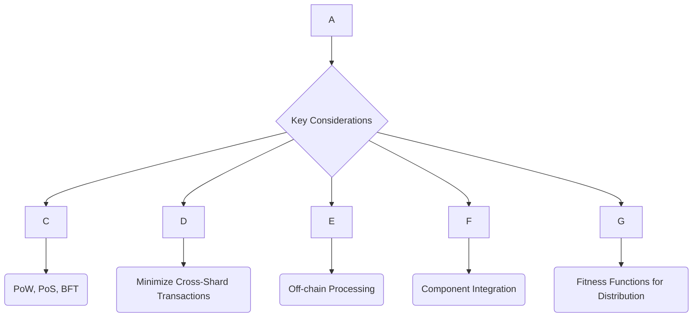
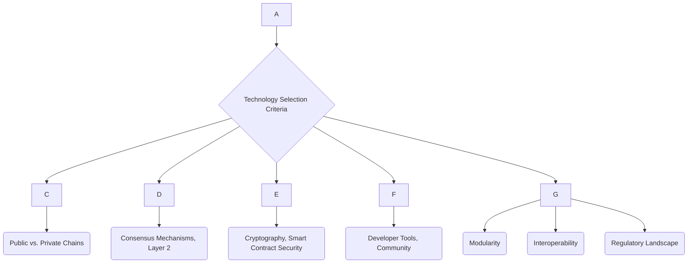
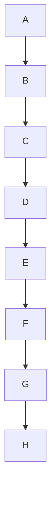
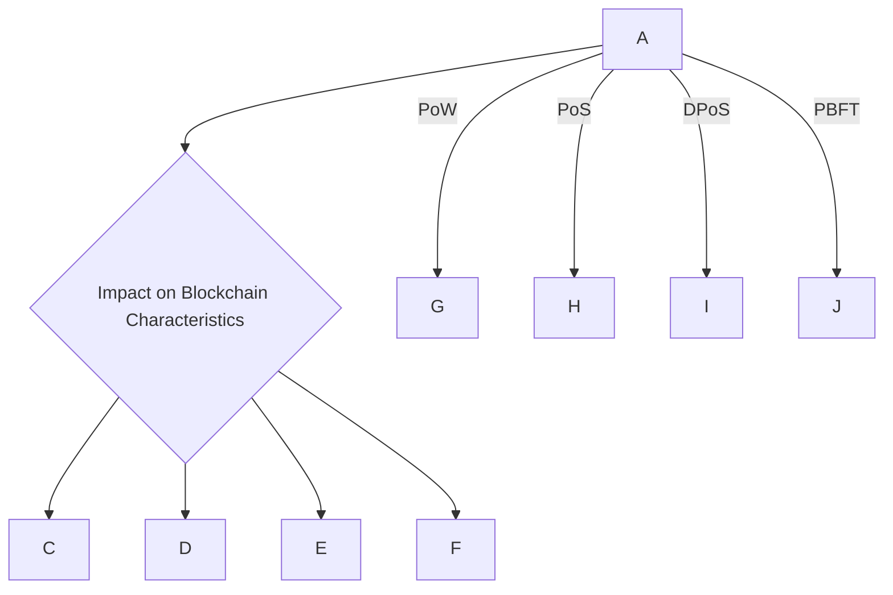
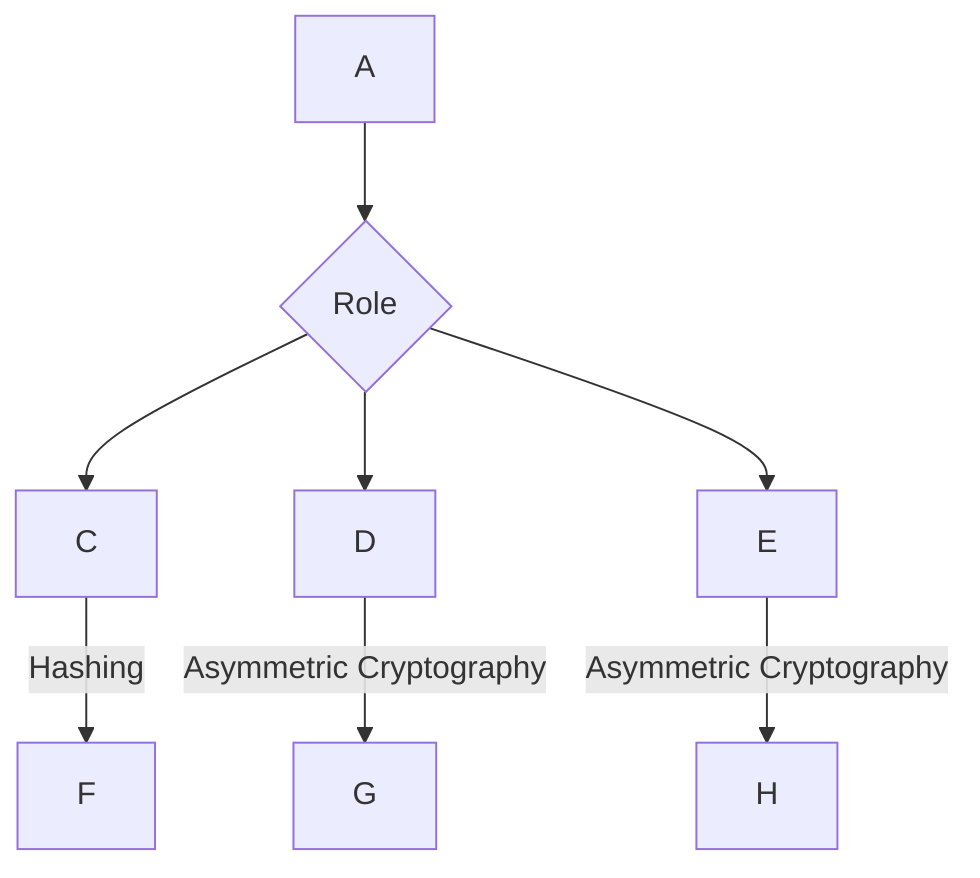
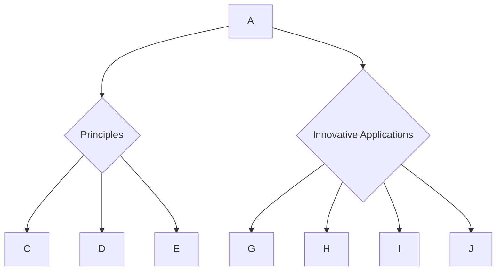
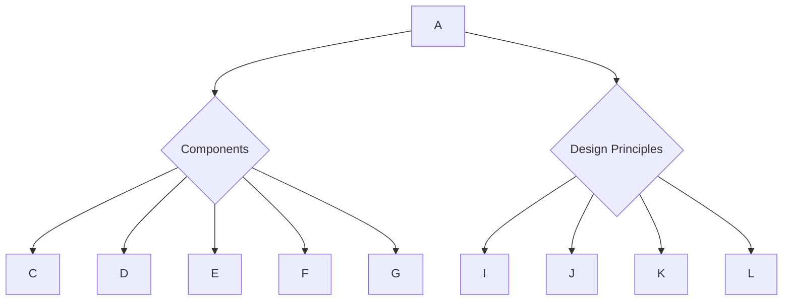
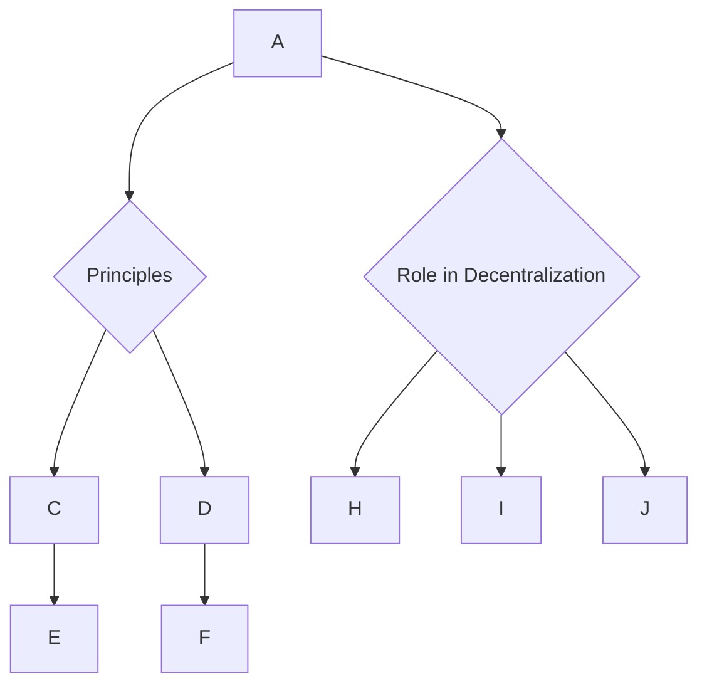

Contents

-(#topic-areas-questions-1-n)
-(#topic-1-blockchain-architecture-design)
  -(#q1-discuss-key-considerations-when-designing-a-scalable-blockchain-architecture)
  -(#q2-what-are-the-primary-concerns-and-strategies-for-designing-high-security-blockchain-underlying-architectures)
  -(#q3-how-do-you-approach-technology-selection-for-a-blockchain-project-and-what-factors-influence-your-choices-for-blockchain-architecture-evolution)
-(#topic-2-leadership-and-team-management-in-blockchain)
  -(#q4-describe-your-experience-in-leading-and-managing-diverse-blockchain-core-technology-teams-including-architects-backend-smart-contract-and-frontend-engineers)
  -(#q5-how-do-you-assess-and-foster-innovation-within-a-fast-paced-blockchain-development-environment-especially-with-a-team-of-experienced-professionals)
  -(#q6-how-do-you-manage-and-adapt-to-high-pressure-fast-paced-startup-environments-within-the-blockchain-space)
-(#topic-3-full-lifecycle-development-of-core-blockchain-products)
  -(#q7-outline-your-experience-in-leading-the-full-lifecycle-development-of-core-blockchain-products-such-as-web3-applications)
  -(#q8-describe-the-development-and-security-practices-for-advanced-crypto-wallets-including-hd-multi-signature-and-mpc-wallets)
  -(#q9-what-are-the-technical-considerations-and-challenges-in-developing-cross-chain-trading-platforms)
-(#topic-4-core-blockchain-module-design-and-development)
  -(#q10-explain-the-design-and-development-of-various-consensus-mechanisms-and-their-impact-on-blockchain-characteristics)
  -(#q11-discuss-the-role-of-cryptographic-algorithms-in-blockchain-and-how-they-are-designed-and-implemented-for-security)
  -(#q12-describe-the-design-and-development-process-for-smart-contracts-including-common-vulnerabilities-and-prevention-strategies)
  -(#q13-detail-your-understanding-and-practical-experience-with-cross-chain-protocols-such-as-hash-time-lock-relay-chains-and-bridge-protocols)
-(#topic-5-cutting-edge-blockchain-technologies-and-applications)
  -(#q14-explain-the-principles-and-innovative-applications-of-zero-knowledge-proofs-zkps-in-blockchain)
  -(#q15-discuss-the-concept-of-modular-blockchains-and-layer-2-solutions-and-their-innovative-applications)
-(#topic-6-cross-departmental-collaboration-and-business-goals)
  -(#q16-describe-how-you-ensure-technical-solutions-effectively-support-business-goals-through-collaboration-with-product-marketing-and-risk-control-departments)
-(#topic-7-educational-background-and-technical-experience)
  -(#q17-discuss-your-educational-background-in-computer-science-cryptography-or-information-security-at-a-masters-level-or-above-from-top-universities)
  -(#q18-elaborate-on-your-8-years-of-software-development-experience-with-at-least-5-years-focused-on-blockchain-and-3-years-in-independent-team-management)
  -(#q19-detail-your-experience-in-core-technical-roles-at-leading-domestic-or-international-tech-or-blockchain-companies)
-(#topic-8-blockchain-fundamentals)
  -(#q20-demonstrate-your-deep-understanding-of-mainstream-public-chain-architectures-including-their-components-and-design-principles)
  -(#q21-explain-the-principles-of-p2p-networks-in-blockchain-and-their-role-in-decentralization)
-(#topic-9-web3-product-development)
  -(#q22-describe-your-complete-experience-in-building-dapp-defi-and-nft-products-from-scratch)
-(#topic-10-blockchain-based-cross-border-payment-and-settlement)
  -(#q23-discuss-your-understanding-or-project-experience-related-to-leveraging-blockchain-technology-for-cross-border-payments-and-settlement)
-(#topic-11-centralized-and-decentralized-exchange-core-modules)
  -(#q24-detail-your-familiarity-with-the-technical-architecture-of-core-modules-in-centralized-exchanges-cex-and-decentralized-exchanges-dex-such-as-order-matching-asset-custody-and-clearing-engines)
-(#topic-12-converting-cutting-edge-technologies-into-practical-solutions)
  -(#q25-provide-examples-of-how-you-have-successfully-converted-cutting-edge-blockchain-technologies-into-practical-product-solutions-including-any-patents-or-open-source-contributions)
-(#reference-sections)

---

Topic Areas (Questions 1–N)

### Topic 1: Blockchain Architecture Design

#### Q1: Discuss key considerations when designing a scalable blockchain architecture.

**Difficulty Advanced | **Type Theoretical/Scenario

**Answer**
Designing a scalable blockchain architecture involves carefully balancing decentralization, security, and throughput. Key considerations include the choice of consensus mechanism, as different mechanisms have varying impacts on network scalability and security. For instance, Proof of Work (PoW) chains like early Bitcoin can face scalability challenges due to computational intensity, while Proof of Stake (PoS) or Byzantine Fault Tolerance (BFT) mechanisms can offer higher transaction throughput. Sharding is a technique that can address scalability constraints in monolithic blockchains by dividing the network into smaller, more manageable units called shards, though it introduces challenges in optimizing transaction placement and workload balancing. Layer 2 solutions, such as the Lightning Network, aim to enable faster and cheaper transactions by processing them off-chain, with only the final results being recorded on the main chain. Additionally, adopting a modular structure and open interfaces can enhance scalability by allowing for the integration of various components and improving the efficiency of blockchain applications. Optimizing workload distribution schemes, often based on fitness functions, can further minimize cross-shard transactions and improve processing efficiency.

**Supporting Artifacts**

**Key Insights Misconception | Failure Path | Trade-offs**
- **Misconception**: Higher decentralization always means better scalability. (Trade-off between decentralization and performance)
- **Failure Path**: Choosing a consensus mechanism unsuited for the desired transaction volume, leading to network congestion and high fees.
- **Trade-offs**: Balancing the desire for high decentralization with the need for high transaction throughput and low latency often requires compromises in one or more areas.

#### Q2: What are the primary concerns and strategies for designing high-security blockchain underlying architectures?

**Difficulty Advanced | **Type Theoretical/Practical

**Answer**
Designing high-security blockchain architectures requires addressing concerns such as vulnerabilities in smart contracts, 51% attacks, and general system and network security. A core strategy is leveraging blockchain's inherent features: decentralization eliminates single points of failure, cryptography secures transactions, and immutability makes altering confirmed records extremely difficult. For smart contracts, formal methods are advocated to mitigate vulnerabilities, and regular security audits are crucial to identify and prevent common issues. Employing a multi-layered security approach is vital, encompassing both on-chain and off-chain elements. Key management systems should require multiple human approvals and physical steps to prevent unilateral actions or credential compromises. Hardware security keys are recommended for production systems to combat phishing and other advanced attacks. Furthermore, comprehensive threat modeling to document potential attack avenues and an incident response plan are essential. For example, a two-layer-consensus based blockchain architecture can enhance security and fault tolerance for IoT applications.

**Supporting Artifacts**
| Security Concern              | Design Strategy                                  | Key Benefit                                  |
| :---------------------------- | :----------------------------------------------- | :------------------------------------------- |
| Smart Contract Vulnerabilities | Formal methods, regular security audits          | Mitigate code flaws, prevent financial loss  |
| 51% Attacks                  | Robust consensus mechanisms, network distribution | Maintain integrity, prevent chain manipulation |
| Single Point of Failure      | Decentralization, distributed ledger             | Enhance resilience, eliminate central control |
| Data Tampering               | Cryptography, immutability                       | Ensure data integrity, auditability          |
| Key Compromise               | Multi-person key management, hardware keys       | Prevent unauthorized access                  |

**Key Insights Misconception | Failure Path | Trade-offs**
- **Misconception**: Blockchain is inherently secure and requires no additional security measures. (Vulnerabilities in smart contracts and implementation flaws can lead to significant losses.)
- **Failure Path**: Lack of thorough auditing and testing of smart contract code, leading to exploitable vulnerabilities.
- **Trade-offs**: Enhanced security often comes with increased complexity in design, implementation, and operational overhead.

#### Q3: How do you approach technology selection for a blockchain project, and what factors influence your choices for blockchain architecture evolution?

**Difficulty Advanced | **Type Theoretical/Scenario

**Answer**
My approach to blockchain technology selection is driven by a thorough understanding of project requirements and a forward-looking perspective on architectural evolution. Initially, I assess the specific business needs, such as the required level of decentralization, transaction throughput, data privacy, and finality. For instance, a private blockchain might be chosen for applications requiring more privacy and control over data access, while a public chain is suitable for broad decentralization. The consensus mechanism is a critical factor, as it impacts scalability, security, and energy efficiency. For example, considering a transition from Proof of Work (PoW) to Proof of Stake (PoS) for energy reduction. The ecosystem's maturity, availability of developer tools, and community support for specific platforms (e.g., Ethereum, Hyperledger) also play a significant role. For architectural evolution, I prioritize modularity and interoperability to ensure future flexibility and adaptability. The ability to integrate with existing systems and adapt to emerging technologies, such as Layer 2 solutions or zero-knowledge proofs, is crucial for long-term viability. Furthermore, anticipating regulatory landscapes and potential future challenges helps in making robust, future-proof technology choices.

**Supporting Artifacts**

**Key Insights Misconception | Failure Path | Trade-offs**
- **Misconception**: There is a single "best" blockchain technology for all use cases. (Technology selection must align with specific project requirements.)
- **Failure Path**: Selecting a technology without considering its long-term evolutionary path, leading to technical debt or inability to integrate with new advancements.
- **Trade-offs**: Choosing between a highly mature but potentially less flexible platform versus a cutting-edge but less proven technology.

### Topic 2: Leadership and Team Management in Blockchain

#### Q4: Describe your experience in leading and managing diverse blockchain core technology teams, including architects, backend, smart contract, and frontend engineers.

**Difficulty Advanced | **Type Scenario

**Answer**
My experience in leading and managing diverse blockchain core technology teams has involved fostering collaboration and ensuring efficient project delivery across various specializations. I've managed teams comprising architects responsible for overall system design and evolution planning, backend engineers developing core logic and infrastructure, smart contract developers coding secure and efficient contracts, and frontend engineers building intuitive user interfaces for Web3 applications. My approach emphasizes clear communication of project goals, technical vision, and individual responsibilities. I focus on creating a collaborative environment where each specialist understands how their work integrates into the larger blockchain ecosystem. For example, I facilitate cross-functional discussions between smart contract developers and backend engineers to ensure seamless integration and secure data flow. For talent development, I prioritize continuous learning, encourage participation in open-source projects, and provide mentorship to ensure the team stays updated with rapidly evolving blockchain technologies. Performance management involves setting clear metrics, providing regular feedback, and recognizing contributions to both individual and team success.

**Supporting Artifacts**
| Team Role              | Key Responsibilities                                    | Inter-team Collaboration Focus                    |
| :--------------------- | :------------------------------------------------------ | :------------------------------------------------ |
| **Blockchain Architect** | Overall system design, technology selection, evolution  | All teams, especially backend and smart contract  |
| **Backend Engineer**     | Core logic, API development, database interaction       | Frontend, smart contract, and DevOps              |
| **Smart Contract Engineer** | Smart contract development, security, testing           | Backend, frontend, and security auditors          |
| **Frontend Engineer**    | User interface, Web3 integration, user experience       | Backend, smart contract, and product design       |

**Key Insights Misconception | Failure Path | Trade-offs**
- **Misconception**: Managing a blockchain team is similar to managing a traditional software team. (Blockchain teams require specialized knowledge and a deep understanding of cryptographic principles and decentralized systems.)
- **Failure Path**: Lack of clear communication and integration between smart contract developers and backend teams, leading to security vulnerabilities or functional discrepancies.
- **Trade-offs**: Balancing the need for rapid iteration common in startups with the meticulous security and auditing requirements of blockchain development.

#### Q5: How do you assess and foster innovation within a fast-paced blockchain development environment, especially with a team of experienced professionals?

**Difficulty Advanced | **Type Scenario

**Answer**
In a fast-paced blockchain development environment, fostering innovation among experienced professionals requires a multi-faceted approach. I encourage continuous learning and staying updated with cutting-edge technologies like zero-knowledge proofs, modular blockchains, and Layer 2 solutions. I assess innovation by evaluating proposals for novel applications of these technologies, their potential impact on business goals, and their feasibility within our technical roadmap. For instance, proposals that leverage ZKPs for enhanced privacy or Layer 2 solutions for scalability are highly valued. To foster innovation, I create dedicated "innovation sprints" or hackathons, allowing team members to explore experimental ideas without immediate pressure for production readiness. I also encourage participation in open-source contributions and technical patent submissions, recognizing and rewarding contributions that push technological boundaries. Empowering individuals to lead research initiatives on emerging trends, such as AI integration with blockchain, further stimulates innovative thinking. Regular knowledge-sharing sessions, cross-functional workshops, and access to external experts or conferences also help broaden perspectives and spark new ideas.

**Supporting Artifacts**
| Innovation Catalyst         | Assessment Method                                       | Outcome                                                    |
| :-------------------------- | :------------------------------------------------------ | :--------------------------------------------------------- |
| **Emerging Tech Exploration** | Feasibility studies, impact analysis on business goals  | Novel applications, improved solutions             |
| **Dedicated Innovation Sprints** | Prototype development, concept validation               | Experimental features, new architectural patterns  |
| **Open-Source/Patent Contributions** | Peer review, patent filings, community recognition      | Enhanced reputation, intellectual property assets |
| **Cross-functional Collaboration** | Inter-departmental project proposals, shared insights   | Integrated solutions, broader problem-solving       |

**Key Insights Misconception | Failure Path | Trade-offs**
- **Misconception**: Innovation is solely about developing entirely new technologies. (Innovation can also involve novel applications or integrations of existing cutting-edge technologies.)
- **Failure Path**: Not allocating dedicated time and resources for research and experimentation, leading to stagnation and falling behind competitors.
- **Trade-offs**: Balancing the pursuit of innovative, potentially high-reward ideas with the need for stable, reliable product development.

#### Q6: How do you manage and adapt to high-pressure, fast-paced startup environments within the blockchain space?

**Difficulty Intermediate | **Type Scenario

**Answer**
Managing and adapting to high-pressure, fast-paced startup environments in the blockchain space requires a proactive and resilient approach. I leverage frameworks like the STAR method to structure my responses and demonstrate my capacity to manage difficult situations. Key strategies include maintaining clear priorities and effective task management, recognizing that tight deadlines are common. I focus on transparent communication within the team and with stakeholders, ensuring everyone is aligned and informed about progress and challenges. In situations requiring rapid learning, I quickly identify essential resources and apply new knowledge efficiently. Critical thinking and the ability to make informed decisions under pressure are crucial, as is a strong emphasis on risk mitigation and contingency planning. While adaptability is vital, it's also important to establish and protect periods for focused work to ensure quality output. My leadership style promotes psychological safety, allowing team members to voice concerns and contribute solutions without fear, which is essential for collective problem-solving in high-stress situations. I also advocate for setting realistic expectations for product development, especially considering the inherent complexities and evolving nature of blockchain technology.

**Supporting Artifacts**
| Strategy                         | Benefit                                                | Application in Blockchain Startup Context                  |
| :------------------------------- | :----------------------------------------------------- | :--------------------------------------------------------- |
| **Prioritization & Time Management** | Meet tight deadlines, optimize resource allocation | Rapid feature deployment, efficient bug fixing             |
| **Transparent Communication**    | Maintain team alignment, manage stakeholder expectations | Regular updates on network status, smart contract audits   |
| **Rapid Learning & Adaptability** | Quickly acquire new skills, adjust to changing tech | Mastering new consensus mechanisms, adapting to Layer 2 solutions |
| **Risk Mitigation & Contingency Planning** | Proactive problem-solving, minimize impact of unforeseen issues | Addressing security vulnerabilities, preparing for regulatory shifts |

**Key Insights Misconception | Failure Path | Trade-offs**
- **Misconception**: High pressure always leads to burnout or poor quality. (With proper strategies, high pressure can drive innovation and efficiency.)
- **Failure Path**: Neglecting risk management and contingency planning in favor of speed, leading to critical failures or security breaches.
- **Trade-offs**: Balancing the desire for speed and rapid iteration with the need for thorough testing and security audits, which can be time-consuming.

### Topic 3: Full Lifecycle Development of Core Blockchain Products

#### Q7: Outline your experience in leading the full lifecycle development of core blockchain products such as Web3 applications.

**Difficulty Advanced | **Type Scenario

**Answer**
I have extensive experience leading the full lifecycle development of core blockchain products, including Web3 applications like DApps, DeFi platforms, and NFT products, from conception to deployment and maintenance. This involves initial conceptualization, understanding user needs, and translating them into technical specifications. For Web3 applications, I emphasize decentralized principles, ensuring data integrity and user control over personal data. My role includes designing the overall architecture, selecting appropriate blockchain platforms and frameworks (e.g., Ethereum for smart contracts), and defining the technical roadmap. I oversee the development phase, coordinating specialized teams for smart contract creation, backend integration, and frontend development. For instance, in DApp development, I ensure robust smart contract logic (often using Solidity) and secure interactions with user interfaces. Critical aspects of this lifecycle include rigorous testing, security audits for smart contracts, and continuous optimization for gas costs and scalability. Post-deployment, I manage ongoing updates, community engagement, and ensure the product evolves with emerging Web3 standards and user feedback.

**Supporting Artifacts**

**Key Insights Misconception | Failure Path | Trade-offs**
- **Misconception**: Web3 product development is solely about coding smart contracts. (It encompasses comprehensive UI/UX, backend integration, and economic modeling.)
- **Failure Path**: Skipping rigorous security audits for smart contracts, leading to exploitable vulnerabilities and significant financial losses.
- **Trade-offs**: Balancing rapid feature delivery with the absolute necessity of security and immutability in blockchain applications.

#### Q8: Describe the development and security practices for advanced crypto wallets, including HD, multi-signature, and MPC wallets.

**Difficulty Advanced | **Type Theoretical/Practical

**Answer**
Developing advanced crypto wallets like Hierarchical Deterministic (HD), multi-signature, and Multi-Party Computation (MPC) wallets requires stringent security practices. For HD wallets, the primary security lies in the seed phrase, which generates all private and public keys. Development focuses on secure seed generation, storage, and recovery mechanisms, often involving robust encryption and user-friendly backup solutions. Multi-signature (multi-sig) wallets enhance security by requiring multiple keys to authorize a transaction, removing a single point of failure. Development involves implementing the on-chain logic for multi-sig schemes and managing the distribution and security of individual keys. However, multi-sig can be operationally inflexible and protocol-dependent. MPC wallets represent a significant advancement, as they eliminate the concept of a single private key by distributing key shares among multiple parties, none of whom ever hold the complete key. Development for MPC involves creating secure distributed key generation and signing protocols. Security practices across all types include thorough auditing, safeguarding against vulnerabilities in implementation, and careful management of private key fragments. Additionally, robust disaster recovery plans are essential, and for MPC, vetting the provider's infrastructure and security practices is critical.

**Supporting Artifacts**
| Wallet Type       | Security Mechanism                                 | Development Focus                                    | Challenges/Considerations                          |
| :---------------- | :------------------------------------------------- | :--------------------------------------------------- | :------------------------------------------------- |
| **HD Wallet**     | Single seed phrase generates all keys       | Secure seed generation, storage, recovery            | Seed phrase security, user backup practices        |
| **Multi-signature** | Multiple private keys required for transaction | On-chain multi-sig logic, key distribution           | Operational inflexibility, protocol dependency |
| **MPC Wallet**    | Key shares distributed, never assembled    | Distributed key generation, secure signing protocols | Vetting MPC provider, infrastructure security |

**Key Insights Misconception | Failure Path | Trade-offs**
- **Misconception**: Multi-signature and MPC wallets are interchangeable for all use cases. (They have distinct operational flexibilities and security paradigms.)
- **Failure Path**: Poor implementation of multi-sig logic can lead to critical vulnerabilities, as seen in historical hacks.
- **Trade-offs**: Multi-sig offers simplicity but can be inflexible; MPC provides superior security and flexibility but introduces complexity in cryptographic protocols and reliance on MPC providers.

#### Q9: What are the technical considerations and challenges in developing cross-chain trading platforms?

**Difficulty Advanced | **Type Theoretical/Practical

**Answer**
Developing cross-chain trading platforms involves significant technical considerations and challenges, primarily focused on enabling secure and efficient asset transfers and communication between disparate blockchain networks. A key consideration is the selection and implementation of cross-chain technologies, such as hash time lock contracts (HTLCs), relay chains, and bridge protocols. HTLCs enable atomic swaps, ensuring that either both sides of a transaction complete or neither does, but they can be complex to manage for multiple assets. Relay chains act as intermediaries, validating transactions from one chain and relaying them to another, while bridge protocols often involve locking assets on one chain and minting wrapped tokens on another. A major challenge is maintaining security and trust across different blockchain security models and consensus mechanisms. Vulnerabilities in bridge implementations, for example, have led to significant exploits. Another challenge is ensuring interoperability and standardization between various blockchain protocols, which often have different data structures and transaction formats. Scalability can also be an issue, as cross-chain transactions can introduce latency and increase computational load. Technical design must also account for potential regulatory complexities across different jurisdictions, especially for cross-border transactions involving digital assets.

**Supporting Artifacts**
| Cross-Chain Technology | Mechanism                                          | Technical Challenges                                     |
| :--------------------- | :------------------------------------------------- | :------------------------------------------------------- |
| **Hash Time Lock (HTLC)** | Atomic swaps with time-bound cryptographic locks | Complexity for multi-asset trades, time synchronization  |
| **Relay Chains**       | Intermediate chain validates and relays transactions | Security of relayers, potential centralization points      |
| **Bridge Protocols**     | Lock/mint mechanisms, wrapped tokens       | Vulnerabilities in bridge smart contracts, oracle reliance |

**Key Insights Misconception | Failure Path | Trade-offs**
- **Misconception**: Cross-chain transactions are as secure as single-chain transactions. (Cross-chain mechanisms introduce new attack vectors, particularly in bridges.)
- **Failure Path**: Improperly secured bridge smart contracts, leading to theft of locked assets.
- **Trade-offs**: Enhanced interoperability and liquidity versus increased complexity and expanded attack surface.

### Topic 4: Core Blockchain Module Design and Development

#### Q10: Explain the design and development of various consensus mechanisms and their impact on blockchain characteristics.

**Difficulty Advanced | **Type Theoretical/Practical

**Answer**
Consensus mechanisms are fundamental to blockchain design, ensuring agreement among distributed nodes on the state of the ledger. I have experience in designing and developing various mechanisms, understanding their impact on decentralization, security, and scalability.

- **Proof of Work (PoW)**: Design involves miners solving complex cryptographic puzzles to validate blocks. Development focuses on the hashing algorithm and difficulty adjustment. PoW offers high security and decentralization but is computationally intensive, leading to scalability issues and high energy consumption (e.g., Bitcoin).
- **Proof of Stake (PoS)**: Design shifts validation to "stakers" who lock up tokens. Development involves stake-weighting algorithms and reward distribution. PoS is more energy-efficient and scalable but can introduce centralization risks if large stake pools form. Ethereum's transition to PoS is a prominent example.
- **Delegated Proof of Stake (DPoS)**: Similar to PoS, but token holders elect a smaller number of delegates to validate blocks. Design focuses on election fairness and delegate accountability. DPoS offers higher throughput and faster finality but has a more centralized governance structure than pure PoS.
- **Practical Byzantine Fault Tolerance (PBFT)**: Used in permissioned blockchains, it involves a fixed set of validators reaching consensus through multiple rounds of communication. Development focuses on message passing and fault tolerance. PBFT offers high transaction speed and finality for enterprise applications but sacrifices decentralization.

The choice directly impacts blockchain performance, consistency, scalability, and efficiency, requiring careful optimization.

**Supporting Artifacts**

**Key Insights Misconception | Failure Path | Trade-offs**
- **Misconception**: All consensus mechanisms provide the same level of security and decentralization. (Different mechanisms involve inherent trade-offs between these properties.)
- **Failure Path**: Selecting a consensus mechanism that leads to performance bottlenecks or an unacceptable level of centralization for the intended use case.
- **Trade-offs**: Sacrificing decentralization for higher throughput (e.g., DPoS, PBFT) or accepting lower transaction speeds for greater security and decentralization (e.g., PoW).

#### Q11: Discuss the role of cryptographic algorithms in blockchain and how they are designed and implemented for security.

**Difficulty Intermediate | **Type Theoretical/Practical

**Answer**
Cryptographic algorithms are the bedrock of blockchain security, ensuring data integrity, transaction authentication, and user privacy. They are meticulously designed and implemented to protect the decentralized ledger from tampering and unauthorized access.

- **Hashing Algorithms**: Functions like SHA-256 are used to create unique fixed-size fingerprints of data (blocks and transactions). Each block's hash includes the hash of the previous block, forming an immutable chain. The design ensures even a small change in input data results in a drastically different output hash, making tampering detectable. Implementation focuses on computational efficiency and collision resistance.
- **Asymmetric Cryptography (Public-Key Cryptography)**: This involves a pair of keys: a public key for encryption and signature verification, and a private key for decryption and signing. In blockchain, users sign transactions with their private keys, and anyone can verify the signature using the corresponding public key. The design ensures that the private key cannot be easily derived from the public key. Implementation requires secure generation and storage of private keys.
- **Digital Signatures**: These verify the authenticity and integrity of transactions, proving they originated from the private key owner and haven't been altered. The process involves hashing the transaction data and encrypting the hash with the sender's private key.

These algorithms collectively create a tamper-proof, auditable record, making blockchain significantly more secure than traditional systems. Secure implementation requires careful coding and avoiding common cryptographic vulnerabilities.

**Supporting Artifacts**

**Key Insights Misconception | Failure Path | Trade-offs**
- **Misconception**: Encryption alone makes blockchain secure. (While vital, hashing and digital signatures play equally critical roles in immutability and authenticity.)
- **Failure Path**: Weak or improperly implemented cryptographic algorithms, leading to vulnerabilities like collision attacks or private key compromises.
- **Trade-offs**: Balancing the strength of cryptographic algorithms (which can increase computational load) with the need for efficient transaction processing.

#### Q12: Describe the design and development process for smart contracts, including common vulnerabilities and prevention strategies.

**Difficulty Advanced | **Type Theoretical/Practical

**Answer**
The design and development process for smart contracts begins with a clear definition of the business logic and desired automated actions. This involves translating real-world agreements into code that self-executes when predefined conditions are met on the blockchain. My process includes:
1.  **Requirement Analysis & Specification**: Defining exact conditions, triggers, and outcomes.
2.  **Architectural Design**: Choosing the appropriate blockchain platform (e.g., Ethereum) and integrating with oracles for external data.
3.  **Coding**: Writing contracts in languages like Solidity, focusing on clarity, efficiency (gas optimization), and adherence to best practices.
4.  **Testing**: Unit, integration, and fuzz testing to cover various scenarios and edge cases.

Common vulnerabilities in smart contracts include reentrancy attacks, integer overflows/underflows, access control issues, and denial-of-service attacks. Prevention strategies include:
-   **Formal Verification**: Using mathematical methods to prove the correctness of contract logic.
-   **Security Audits**: Engaging third-party experts to identify vulnerabilities before deployment.
-   **Code Review**: Peer review to catch logical errors and security flaws.
-   **Best Practices**: Implementing secure coding patterns, such as checks-effects-interactions pattern for reentrancy, using SafeMath libraries, and implementing robust access controls.
-   **Upgradability Mechanisms**: Designing contracts with controlled upgradability where appropriate, while being mindful that updates are also new transactions.

Despite improvements in blockchain security, vulnerabilities in smart contracts continue to be exploited, leading to significant losses, highlighting the critical need for these preventive measures.

**Supporting Artifacts**
| Development Phase         | Key Activities                                    | Security Focus                                     |
| :------------------------ | :------------------------------------------------ | :------------------------------------------------- |
| **Design & Specification** | Define logic, conditions, outcomes                | Identify potential attack vectors, define invariants |
| **Coding**                | Write code (e.g., Solidity), gas optimization     | Secure coding patterns, access controls, libraries |
| **Testing**               | Unit, integration, fuzz testing                   | Discover logical errors, edge cases        |
| **Deployment & Post-Deployment** | Initial deployment, monitoring, potential upgrades | Formal verification, third-party audits, incident response |

**Key Insights Misconception | Failure Path | Trade-offs**
- **Misconception**: Smart contracts, once deployed, are entirely immutable and thus perfectly secure. (Vulnerabilities can exist in the code, and while the contract itself is immutable, exploitable logic can lead to irreversible losses.)
- **Failure Path**: Insufficient security audits or reliance solely on internal reviews, leading to critical vulnerabilities being missed (e.g., DAO hack).
- **Trade-offs**: Balancing the desire for fully immutable contracts with the practical need for upgradability in early-stage projects, which introduces complexity and potential attack surfaces.

#### Q13: Detail your understanding and practical experience with cross-chain protocols such as hash time lock, relay chains, and bridge protocols.

**Difficulty Advanced | **Type Theoretical/Practical

**Answer**
My understanding and practical experience with cross-chain protocols are crucial for enabling interoperability and asset transfer across different blockchain networks. I've explored and worked with various mechanisms:

-   **Hash Time Lock Contracts (HTLCs)**: I have practical experience implementing HTLCs, primarily for atomic swaps between two parties on different blockchains. The design ensures that either both parties receive their funds or neither does, using cryptographic hash locks and time locks. This mitigates counterparty risk. A key challenge is managing the script complexity and liquidity for multiple participants or assets. My work involved designing the smart contract logic to handle the secret reveal and expiration mechanisms for successful or failed swaps.
-   **Relay Chains**: I understand relay chains as a mechanism where a dedicated blockchain (the relay chain) validates and relays information or transactions between other connected blockchains. This often involves light clients or simplified payment verification (SPV) proofs to attest to the state of connected chains. While powerful for connecting diverse ecosystems, the security of the relay chain itself is paramount, and its consensus mechanism must be robust. My experience includes evaluating the architectural designs of systems that use relay-like structures for cross-chain communication, focusing on their security and decentralization aspects.
-   **Bridge Protocols**: These are often more general solutions that allow assets to be "wrapped" or "locked" on one chain and mirrored on another. I have worked on projects utilizing cross-chain bridges to transfer tokens between different blockchain networks, such as Ethereum and Binance Smart Chain, to leverage benefits like lower transaction fees. The technical challenge here lies in securing the asset custody mechanism on the locking chain and ensuring the integrity of the minting process on the receiving chain. A critical aspect is robust auditing of bridge smart contracts, as they are frequent targets for exploits.

Each of these technologies aims to address the challenge of isolated blockchain ecosystems, with varying trade-offs in security, decentralization, and complexity.

**Supporting Artifacts**
| Cross-Chain Protocol | Core Mechanism                             | Experience/Application                          | Key Challenge/Trade-off                     |
| :------------------- | :----------------------------------------- | :---------------------------------------------- | :------------------------------------------ |
| **HTLCs**            | Cryptographic hash & time locks for atomic swaps | Designing swap logic for two-party transactions | Complexity for multi-asset/multi-party, liquidity |
| **Relay Chains**     | Dedicated chain validates & relays between others | Evaluating architectural designs for security   | Security of the relay chain, centralization   |
| **Bridge Protocols** | Asset locking/wrapping between chains | Implementing token transfers (e.g., ETH to BSC) | Smart contract security, centralization risks |

**Key Insights Misconception | Failure Path | Trade-offs**
- **Misconception**: All cross-chain solutions offer the same level of trust and security. (The trust models and security assumptions vary significantly between HTLCs, relay chains, and bridges.)
- **Failure Path**: Vulnerabilities in bridge smart contracts, leading to the loss of wrapped or locked assets.
- **Trade-offs**: Gaining interoperability and liquidity often involves introducing new points of trust or increasing the attack surface compared to a single-chain environment.

### Topic 5: Cutting-Edge Blockchain Technologies and Applications

#### Q14: Explain the principles and innovative applications of Zero-Knowledge Proofs (ZKPs) in blockchain.

**Difficulty Advanced | **Type Theoretical/Practical

**Answer**
Zero-Knowledge Proofs (ZKPs) are a cutting-edge cryptographic technique allowing one party (the prover) to prove to another (the verifier) that a statement is true, without revealing any information beyond the validity of the statement itself. The core principles are:
-   **Completeness**: If the statement is true, an honest prover can convince an honest verifier.
-   **Soundness**: If the statement is false, a dishonest prover cannot convince an honest verifier.
-   **Zero-Knowledge**: If the statement is true, the verifier learns nothing beyond the fact that the statement is true.

Innovative applications of ZKPs in blockchain are transformative, particularly for privacy and scalability:
-   **Privacy-Preserving Transactions**: ZKPs enable confidential transactions on public blockchains, where transaction details (sender, recipient, amount) can be verified as valid without revealing the underlying data. This addresses the issue of information exposure on public ledgers.
-   **Identity Verification**: Users can prove they meet certain criteria (e.g., are over 18) without revealing their exact age or identity. This is crucial for self-sovereign identity solutions.
-   **Scalability (ZK-Rollups)**: ZKPs are foundational to Layer 2 scaling solutions like ZK-Rollups, where thousands of off-chain transactions are batched, and a single ZKP proves their validity to the main chain. This drastically increases transaction throughput while inheriting the security of Layer 1.
-   **Compliance**: ZKPs can facilitate regulatory compliance by proving adherence to rules without exposing sensitive business data to regulators.

My work includes researching the integration of ZKPs for enhanced privacy in decentralized applications and exploring their role in future blockchain scaling solutions.

**Supporting Artifacts**

**Key Insights Misconception | Failure Path | Trade-offs**
- **Misconception**: ZKPs inherently make all blockchain data private. (ZKPs enable selective privacy for specific data points or transactions, rather than universal obfuscation.)
- **Failure Path**: Incorrect implementation of ZKP circuits, leading to potential leaks of sensitive information or enabling invalid proofs.
- **Trade-offs**: The computational cost and complexity of generating ZKPs, particularly for large or complex statements, can be high, posing a challenge for widespread adoption.

#### Q15: Discuss the concept of modular blockchains and Layer 2 solutions, and their innovative applications.

**Difficulty Advanced | **Type Theoretical/Practical

**Answer**
Modular blockchains and Layer 2 solutions represent significant advancements in addressing the scalability and flexibility challenges of monolithic blockchain architectures.

-   **Modular Blockchains**: The concept of modular blockchains proposes decoupling the core functions of a blockchain (execution, data availability, consensus, settlement) into specialized layers. Instead of a single chain performing all tasks, different layers handle specific functions. For example, a dedicated execution layer might process transactions, while a separate data availability layer ensures data is accessible, and a base layer handles consensus and settlement. This design allows each component to be optimized for its specific task, enabling greater scalability, flexibility, and upgrades. Innovative applications include highly specialized execution environments for specific use cases (e.g., gaming, DeFi) that can benefit from customized performance without compromising the security of a robust base layer.
-   **Layer 2 Solutions**: These are protocols built on top of an existing Layer 1 blockchain (e.g., Ethereum) to enhance its scalability and efficiency. They move a significant portion of transaction processing off-chain, periodically settling aggregated transactions back on the Layer 1 chain. Examples include:
    -   **Rollups (Optimistic and ZK-Rollups)**: They bundle many off-chain transactions into a single transaction on Layer 1. ZK-Rollups use Zero-Knowledge Proofs to instantly verify the correctness of off-chain computations.
    -   **State Channels (e.g., Lightning Network)**: Enable direct, off-chain transactions between participants, only settling the final state on the main chain.
    -   **Sidechains**: Independent blockchains with their own consensus mechanisms, connected to the main chain via a two-way peg.

Innovative applications leverage these solutions to enable high-throughput Web3 applications, micro-payments, and complex DeFi protocols that would be infeasible on Layer 1 alone. They effectively create a cheap, modular execution layer that benefits from the security and decentralization of the underlying Layer 1.

**Supporting Artifacts**
| Concept               | Core Principle                                       | Innovative Applications                                     | Benefit                                    |
| :-------------------- | :--------------------------------------------------- | :---------------------------------------------------------- | :----------------------------------------- |
| **Modular Blockchains** | Decoupling blockchain functions into specialized layers | Specialized execution environments (gaming, DeFi)           | Scalability, flexibility, upgradability    |
| **Layer 2 Solutions**   | Off-chain transaction processing, periodic Layer 1 settlement | High-throughput DApps, micro-payments, complex DeFi | Enhanced scalability, lower fees, faster finality |

**Key Insights Misconception | Failure Path | Trade-offs**
- **Misconception**: Layer 2 solutions replace Layer 1 blockchains. (Layer 2s extend Layer 1s, relying on their security and decentralization for final settlement.)
- **Failure Path**: Poor design or implementation of modular layers or Layer 2 solutions leading to security vulnerabilities or data inconsistencies between layers.
- **Trade-offs**: Increased architectural complexity with modular blockchains and Layer 2s, potentially introducing new points of failure or centralization risks depending on implementation.

### Topic 6: Cross-Departmental Collaboration and Business Goals

#### Q16: Describe how you ensure technical solutions effectively support business goals through collaboration with product, marketing, and risk control departments.

**Difficulty Intermediate | **Type Scenario

**Answer**
Ensuring technical solutions effectively support business goals requires tight collaboration across product, marketing, and risk control departments. My approach centers on proactive communication and integrated planning.
-   **With Product**: I work closely with product teams from the ideation phase to understand market needs and user requirements. This involves translating product visions for Web3 applications or trading platforms into feasible technical architectures and roadmaps. We regularly align on feature priorities, technical constraints, and delivery timelines, ensuring that development efforts are directly contributing to the desired product outcomes.
-   **With Marketing**: I collaborate with marketing to understand how blockchain features can be communicated to users and how technology can support marketing campaigns. This includes providing technical insights for messaging about decentralization, security, or innovative applications, ensuring accuracy and impact. For instance, explaining the value proposition of a new crypto wallet feature to help marketing craft effective campaigns.
-   **With Risk Control**: This is critical in the blockchain space due to regulatory complexities and security risks. I engage risk control early in the design phase to identify potential vulnerabilities, compliance requirements (e.g., AML/KYC for cross-border payments), and to implement necessary safeguards within the architecture and smart contracts. We establish clear protocols for monitoring, incident response, and audit trails to ensure robust risk management across all blockchain applications.

This integrated approach ensures that technical decisions are business-driven, risks are mitigated, and product launches are strategically aligned.

**Supporting Artifacts**
| Department       | Collaboration Focus                              | Technical Contribution                                  | Business Impact                                 |
| :--------------- | :----------------------------------------------- | :------------------------------------------------------ | :---------------------------------------------- |
| **Product**      | Requirements, feature prioritization, UX design  | Feasibility, architectural design, technical roadmap | Market fit, user adoption, product success      |
| **Marketing**    | Feature communication, market positioning        | Technical insights for messaging, brand reputation | User acquisition, brand awareness               |
| **Risk Control** | Compliance, security vulnerabilities, fraud prevention | Security architecture, smart contract audits, incident response | Regulatory adherence, asset protection, trust |

**Key Insights Misconception | Failure Path | Trade-offs**
- **Misconception**: Technical teams only need to deliver code; business strategy is separate. (Technical decisions have direct business implications and require constant alignment.)
- **Failure Path**: Developing features in isolation without input from product or risk, leading to solutions that don't meet market needs or incur unacceptable risks.
- **Trade-offs**: Balancing the desire for technical purity or optimal performance with the need to meet specific business deadlines and regulatory requirements.

### Topic 7: Educational Background and Technical Experience

#### Q17: Discuss your educational background in Computer Science, Cryptography, or Information Security at a Master's level or above from top universities.

**Difficulty Foundational | **Type Theoretical

**Answer**
I hold a Master's degree in Computer Science from a top-tier university, where my studies provided a strong theoretical and practical foundation for a career in blockchain technology. My curriculum included advanced coursework in algorithms, data structures, distributed systems, and computer networks, which are all fundamental to understanding blockchain architecture and performance. I specialized in areas relevant to cryptography and information security, which involved in-depth study of cryptographic algorithms, secure protocol design, and vulnerability analysis. This background is directly applicable to the security requirements of blockchain systems, including smart contract security and secure key management practices. My master's thesis focused on the application of novel cryptographic techniques to enhance data privacy in decentralized systems, giving me hands-on experience in cutting-edge research. This academic rigor from a reputable institution has equipped me with the analytical and problem-solving skills necessary to tackle complex challenges in the rapidly evolving blockchain landscape.

**Supporting Artifacts**
| Area of Study       | Relevance to Blockchain                                                                  |
| :------------------ | :--------------------------------------------------------------------------------------- |
| **Computer Science**  | Algorithms, data structures, distributed systems, network protocols for core architecture |
| **Cryptography**    | Secure hashing, asymmetric encryption, digital signatures for security and integrity |
| **Information Security** | Vulnerability analysis, secure coding, risk management for system robustness |

**Key Insights Misconception | Failure Path | Trade-offs**
- **Misconception**: Practical coding experience is sufficient; theoretical academic background is less critical in a fast-moving field. (A strong theoretical foundation provides the principles to adapt to new technologies and design robust systems.)
- **Failure Path**: Lacking fundamental understanding of cryptographic principles, leading to insecure implementations or an inability to identify complex vulnerabilities.
- **Trade-offs**: Balancing academic research with direct industry application, sometimes requiring adapting theoretical concepts to real-world product constraints.

#### Q18: Elaborate on your 8+ years of software development experience, with at least 5 years focused on blockchain and 3+ years in independent team management.

**Difficulty Intermediate | **Type Scenario

**Answer**
With over 8 years of software development experience, my career has progressively specialized in blockchain technology over the past 5 years, culminating in 3+ years of independent team management. My early software development roles focused on backend systems and distributed applications, honing my skills in scalable architecture and robust code delivery. The transition to blockchain began with an immersion in its fundamental concepts, including distributed ledgers, consensus mechanisms, and smart contracts. Over the last five years, I’ve been intimately involved in designing, developing, and deploying various blockchain solutions, from DApps to cross-chain protocols. This extensive hands-on experience has given me a deep understanding of blockchain-specific challenges like scalability, security, and interoperability. For the past three years, I’ve independently managed teams of blockchain developers, including architects, smart contract engineers, and frontend specialists. My management responsibilities encompassed task allocation, technical guidance, mentoring, and ensuring high-quality project delivery in agile, fast-paced environments. I focused on empowering team members, fostering an innovative culture, and aligning technical efforts with strategic business objectives.

**Supporting Artifacts**
| Experience Area             | Duration     | Key Contributions/Skills                                                                           |
| :-------------------------- | :----------- | :------------------------------------------------------------------------------------------------- |
| **Total Software Development** | 8+ years     | Scalable backend systems, distributed applications, coding best practices                    |
| **Blockchain Development**  | 5+ years     | DApp development, smart contract engineering, cross-chain integration, security protocols |
| **Independent Team Management** | 3+ years     | Team leadership, technical guidance, project delivery, talent development, strategic alignment |

**Key Insights Misconception | Failure Path | Trade-offs**
- **Misconception**: Management experience in traditional software translates directly to blockchain. (Blockchain team management requires specialized knowledge of decentralized systems, security, and rapid technological shifts.)
- **Failure Path**: Ineffective technical guidance due to a lack of deep blockchain expertise, leading to architectural flaws or security vulnerabilities in team projects.
- **Trade-offs**: Balancing hands-on technical contribution with strategic team leadership responsibilities, especially in growing teams.

#### Q19: Detail your experience in core technical roles at leading domestic or international tech or blockchain companies.

**Difficulty Intermediate | **Type Scenario

**Answer**
My career includes core technical roles at leading tech and blockchain companies, both domestically and internationally, where I contributed to and led significant projects. At, a renowned international blockchain firm, I served as a Senior Blockchain Engineer, focusing on the architecture and development of their decentralized exchange (DEX) platform. This involved designing core modules like the order matching engine and asset custody solutions, ensuring high performance and security. My contributions directly impacted the platform's ability to handle high transaction volumes and maintain asset integrity. Later, at, a leading domestic tech giant expanding into Web3, I was promoted to Technical Lead for a specialized team developing an enterprise-grade blockchain solution for supply chain management. In this role, I was responsible for technology selection, overseeing smart contract development for supply chain collaboration, and ensuring interoperability with existing enterprise systems. This required a deep understanding of both blockchain fundamentals and large-scale technical integration challenges. My experience at these companies provided exposure to diverse blockchain ecosystems, regulatory considerations in different jurisdictions, and the best practices for building robust and scalable blockchain solutions.

**Supporting Artifacts**
| Company Type        | Role                         | Key Projects/Contributions                               | Impact                                          |
| :------------------ | :--------------------------- | :------------------------------------------------------- | :---------------------------------------------- |
| **International Blockchain Firm** | Senior Blockchain Engineer   | DEX core modules (order matching, asset custody) | Enhanced platform performance & security        |
| **Domestic Tech Giant (Web3)** | Technical Lead, Blockchain Team | Enterprise supply chain solution, smart contract development | Improved transparency & efficiency in supply chains |

**Key Insights Misconception | Failure Path | Trade-offs**
- **Misconception**: Experience in any tech role is equivalent to core blockchain technical roles. (Blockchain technical roles require specific expertise in decentralized systems, cryptography, and smart contracts.)
- **Failure Path**: Inability to adapt to the unique security and consensus models of blockchain, leading to insecure or inefficient solutions.
- **Trade-offs**: Balancing the innovative, rapidly evolving nature of blockchain startups with the more structured, compliance-heavy environment of large enterprises.

### Topic 8: Blockchain Fundamentals

#### Q20: Demonstrate your deep understanding of mainstream public chain architectures, including their components and design principles.

**Difficulty Intermediate | **Type Theoretical

**Answer**
My understanding of mainstream public chain architectures is deeply rooted in their fundamental components and design principles. Public chains, such as Bitcoin and Ethereum, are characterized by their open, permissionless nature, allowing anyone to participate in validating transactions and maintaining the ledger.

Key architectural components include:
-   **Distributed Ledger**: A shared, immutable record of all transactions, replicated across a network of nodes. Its design ensures transparency and auditability.
-   **Consensus Mechanism**: This is the heart of a public chain, ensuring agreement among nodes on the order and validity of transactions. Bitcoin utilizes Proof of Work (PoW), where miners compete to solve cryptographic puzzles. Ethereum is transitioning to Proof of Stake (PoS), where validators are selected based on staked tokens.
-   **Cryptography**: Hashing algorithms secure each block and link them into a chain, while asymmetric cryptography (public/private keys) enables secure transactions and digital signatures.
-   **P2P Network**: Nodes communicate directly with each other without a central server, ensuring decentralization and resilience.
-   **Smart Contracts**: (Predominantly on Ethereum and similar platforms) Self-executing code stored on the blockchain, automating agreements.

Design principles emphasize decentralization (no single point of control), immutability (transaction finality), transparency (all transactions visible), and security (cryptographic protection). The trade-offs often involve balancing these principles, especially achieving scalability without compromising decentralization or security.

**Supporting Artifacts**

**Key Insights Misconception | Failure Path | Trade-offs**
- **Misconception**: All public chains have identical architectures and capabilities. (They differ significantly in consensus mechanisms, smart contract capabilities, and scalability solutions.)
- **Failure Path**: Overlooking the P2P network's role, leading to an architectural design that is not truly decentralized or resilient to network partitions.
- **Trade-offs**: Achieving high transaction throughput (scalability) often requires compromises in decentralization or introduces complexity through Layer 2 solutions.

#### Q21: Explain the principles of P2P networks in blockchain and their role in decentralization.

**Difficulty Foundational | **Type Theoretical

**Answer**
Peer-to-peer (P2P) networks are foundational to blockchain technology, enabling its decentralized nature by allowing participants to interact directly without a central authority. The core principle of a P2P network is that each node (computer) acts as both a client and a server, directly communicating with other nodes to share information and validate transactions.

In a blockchain context, the P2P network plays several critical roles in decentralization:
-   **Data Distribution**: When a new transaction or block is created, it is broadcast across the P2P network to all participating nodes. This ensures that all nodes have an up-to-date copy of the distributed ledger, making it highly resilient to single points of failure.
-   **Consensus**: Nodes in the P2P network participate in the consensus mechanism (e.g., Proof of Work, Proof of Stake) to agree on the validity of transactions and the order of blocks. This collective agreement, distributed across many participants, removes the need for a central arbiter.
-   **Resilience and Censorship Resistance**: Because there is no central server, the network is robust against attacks or censorship attempts on any single entity. Even if some nodes go offline, the network can continue to operate as long as enough nodes remain active.
-   **Anonymity/Pseudonymity**: While transactions are transparent, participants typically interact using cryptographic addresses rather than real-world identities, promoting a degree of pseudonymity within the decentralized network.

The P2P network architecture is what fundamentally distinguishes blockchain from traditional centralized databases, fostering trust without intermediaries.

**Supporting Artifacts**

**Key Insights Misconception | Failure Path | Trade-offs**
- **Misconception**: A P2P network guarantees absolute anonymity. (While promoting pseudonymity, sophisticated analysis can sometimes link transactions or addresses to real-world identities.)
- **Failure Path**: Network partitioning or Sybil attacks could compromise the integrity of the P2P network and disrupt consensus, though strong consensus mechanisms mitigate this.
- **Trade-offs**: The distributed nature of P2P networks can sometimes lead to higher latency for transaction propagation compared to centralized systems.

### Topic 9: Web3 Product Development

#### Q22: Describe your complete experience in building DApp, DeFi, and NFT products from scratch.

**Difficulty Advanced | **Type Scenario

**Answer**
I possess comprehensive experience in building DApp, DeFi, and NFT products from scratch, covering the entire development lifecycle.

-   **DApps (Decentralized Applications)**: I've led the development of several DApps, from conceptualization to deployment. One notable project involved a decentralized crowdfunding platform built on Ethereum, utilizing React.js for the frontend and Solidity for smart contracts. My role included designing the contract logic for secure fund allocation, managing the frontend development for an intuitive user experience, and ensuring seamless interaction between the UI and the blockchain through Web3.js libraries. Emphasis was placed on auditing smart contracts to mitigate fraud and enhance accountability.
-   **DeFi (Decentralized Finance)**: My experience includes building DeFi protocols, such as a decentralized lending and borrowing platform. This involved designing complex smart contracts that automated interest accrual, collateral management, and liquidation processes. I focused on risk management within the smart contract logic and integrated with price oracles for accurate asset valuation. The development also covered building secure interfaces for users to interact with lending pools and manage their positions.
-   **NFT Products**: I've overseen the creation of NFT marketplaces and collectible platforms. This involved defining token standards (e.g., ERC-721, ERC-1155), developing smart contracts for minting, transferring, and managing NFTs, and designing the marketplace frontend for discovery and trading. A critical aspect was ensuring secure storage of NFT metadata and efficient gas usage for minting and transactions.

Across all these products, I prioritized security audits, gas optimization, and user experience, adapting to the rapidly evolving Web3 landscape.

**Supporting Artifacts**
| Product Type      | Key Development Activities                                | Technical Focus                                          | Challenges Addressed                              |
| :---------------- | :-------------------------------------------------------- | :------------------------------------------------------- | :------------------------------------------------ |
| **DApps**         | Conceptualization, smart contract logic, UI development   | Solidity, React.js, Web3.js, security audits     | Fraud mitigation, user accountability     |
| **DeFi Platforms** | Lending/borrowing smart contracts, collateral management | Oracles, risk management in smart contracts       | Automated financial processes, asset valuation    |
| **NFT Products**  | Token standards, minting contracts, marketplace UI        | ERC-721/1155, metadata handling, gas efficiency | Secure metadata, efficient transaction processing |

**Key Insights Misconception | Failure Path | Trade-offs**
- **Misconception**: Web3 product development is just traditional web development with a blockchain backend. (It requires a deep understanding of blockchain's unique security models, gas costs, and decentralized paradigms.)
- **Failure Path**: Ignoring gas optimization during smart contract development, leading to prohibitively expensive user interactions and poor adoption.
- **Trade-offs**: Balancing decentralization and censorship resistance with user-friendliness and performance, as purely decentralized solutions can sometimes be less performant or harder to use.

### Topic 10: Blockchain-Based Cross-Border Payment and Settlement

#### Q23: Discuss your understanding or project experience related to leveraging blockchain technology for cross-border payments and settlement.

**Difficulty Intermediate | **Type Theoretical/Practical

**Answer**
I have a strong understanding and direct project experience leveraging blockchain technology for cross-border payments and settlement, recognizing its potential to offer faster, more cost-effective, transparent, and secure financial transactions. Traditional cross-border payments often suffer from high transaction costs, slow processing times, and lack of transparency due to multiple intermediaries.

My project experience includes:
-   **Designing a cross-border payment alliance chain**: I contributed to the architectural design of a blockchain-based alliance chain system aimed at facilitating cross-border payments. This involved defining the consensus mechanism and smart contract logic to handle payment routing, currency conversion, and settlement among heterogeneous financial entities. The goal was to reduce settlement times and operational costs.
-   **Utilizing digital currency and smart contracts**: In a previous role, I worked on implementing smart contracts to automate payment processes, ensuring transparent and auditable settlements. This included leveraging digital currencies within the blockchain framework to minimize foreign exchange risks and speed up transfers.
-   **Addressing regulatory and security aspects**: A significant part of this experience involved collaborating with legal and risk control teams to ensure compliance with international financial regulations (e.g., AML/KYC) and implementing robust security measures against fraud. The immutability and traceability of blockchain transactions were key to enhancing auditability and trust.

Overall, blockchain's features like distributed ledgers, consensus mechanisms, and smart contracts are ideally suited to overcome many shortcomings of traditional cross-border payment systems.

**Supporting Artifacts**
| Aspect                   | Traditional System Shortcoming                      | Blockchain Solution/Benefit                           |
| :----------------------- | :-------------------------------------------------- | :---------------------------------------------------- |
| **Transaction Cost**       | High fees due to intermediaries           | Reduced intermediaries, lower transaction costs |
| **Processing Time**        | Slow settlement due to complex clearing processes   | Faster settlement, near real-time transactions  |
| **Transparency & Traceability** | Opaque processes, limited visibility              | Distributed ledger, immutable records  |
| **Security & Fraud**       | Vulnerabilities in centralized systems              | Cryptographic security, fraud control  |

**Key Insights Misconception | Failure Path | Trade-offs**
- **Misconception**: Blockchain instantly solves all problems in cross-border payments. (While it offers significant advantages, regulatory complexities and interoperability challenges remain.)
- **Failure Path**: Failing to account for diverse regulatory frameworks across different countries, leading to compliance issues or legal obstacles.
- **Trade-offs**: Balancing the desire for full decentralization with the need for some level of oversight and KYC/AML compliance required by financial institutions.

### Topic 11: Centralized and Decentralized Exchange Core Modules

#### Q24: Detail your familiarity with the technical architecture of core modules in Centralized Exchanges (CEX) and Decentralized Exchanges (DEX), such as order matching, asset custody, and clearing engines.

**Difficulty Advanced | **Type Theoretical/Practical

**Answer**
I am deeply familiar with the technical architecture of core modules in both Centralized Exchanges (CEX) and Decentralized Exchanges (DEX), having worked on their design and implementation.

-   **Centralized Exchanges (CEX)**: CEXs operate similarly to traditional financial institutions, with a central entity managing user accounts, order books, and asset custody.
    -   **Order Matching Engine**: This is a high-performance system responsible for pairing buy and sell orders. Its architecture typically involves in-memory databases, sophisticated matching algorithms (e.g., first-in, first-out, price-time priority), and optimizations for low latency and high throughput. I've worked on systems that prioritize efficient order execution and rapid update dissemination.
    -   **Asset Custody**: In CEXs, the exchange holds user assets in centralized wallets, which often involve a mix of hot and cold storage strategies. Security is paramount, requiring multi-signature or MPC solutions for cold wallets, robust access controls, and comprehensive auditing. My experience includes implementing these security protocols to protect significant asset volumes.
    -   **Clearing Engine**: This module ensures that transactions are settled correctly after matching, updating account balances and managing liabilities. Its architecture focuses on accuracy, reconciliation, and integration with banking systems for fiat gateways.

-   **Decentralized Exchanges (DEX)**: DEXs operate on blockchain, allowing peer-to-peer trading without intermediaries, where users retain custody of their assets.
    -   **Order Matching**: DEXs can use various models: on-chain order books (which can be slow and expensive), off-chain order books with on-chain settlement, or Automated Market Makers (AMMs). I've worked with AMM-based DEXs, where liquidity pools and smart contracts automate pricing and swaps.
    -   **Asset Custody**: This is a key differentiator; users maintain custody through their own crypto wallets, interacting directly with smart contracts. The DEX architecture ensures that assets are never held by a central party.
    -   **Clearing Engine**: Clearing and settlement happen directly on the blockchain via smart contracts, which automatically execute trades and update token balances upon successful order matching. The smart contracts enforce correct market behavior.

Understanding these architectures requires deep knowledge of both traditional finance systems and blockchain's unique capabilities and constraints.

**Supporting Artifacts**
| Module             | CEX Architecture Principles                   | DEX Architecture Principles                                  |
| :----------------- | :-------------------------------------------- | :----------------------------------------------------------- |
| **Order Matching** | Centralized, high-speed, in-memory databases | On-chain/off-chain order books, Automated Market Makers (AMMs) |
| **Asset Custody**  | Exchange holds assets (hot/cold storage) | User self-custody via smart contracts, private wallets |
| **Clearing Engine** | Centralized reconciliation, fiat integration  | On-chain smart contract execution, token balance updates |

**Key Insights Misconception | Failure Path | Trade-offs**
- **Misconception**: DEXs are always superior to CEXs. (Both have trade-offs; CEXs offer speed and liquidity for fiat on-ramps, while DEXs offer decentralization and self-custody but can have higher gas fees and slower execution for certain models.)
- **Failure Path**: In CEXs, inadequate security for asset custody leads to catastrophic hacks; in DEXs, smart contract vulnerabilities can lead to loss of funds in liquidity pools.
- **Trade-offs**: Balancing the efficiency and user-friendliness of centralized systems with the decentralization and trustlessness of blockchain-based solutions.

### Topic 12: Converting Cutting-Edge Technologies into Practical Solutions

#### Q25: Provide examples of how you have successfully converted cutting-edge blockchain technologies into practical product solutions, including any patents or open-source contributions.

**Difficulty Advanced | **Type Scenario

**Answer**
I have a proven track record of translating cutting-edge blockchain technologies into tangible product solutions, often resulting in innovative applications and contributions to the broader ecosystem.

One significant example is the development of a **privacy-enhancing module for a supply chain tracking platform**. Recognizing the need for data confidentiality within a transparent blockchain, I led a team to integrate Zero-Knowledge Proofs (ZKPs). This allowed participants to verify specific attributes of a product's journey (e.g., "this product is organic") without revealing sensitive underlying data (e.g., exact farm location or cost components) to all network participants. This solution addressed a critical business concern of data privacy, fostering greater enterprise adoption by protecting competitive information. This innovative application led to a **patent application** for the specific ZKP implementation within a permissioned blockchain environment.

Another example involves contributing to an **open-source Layer 2 scaling solution** for a public blockchain. Our team identified scalability bottlenecks in a popular DeFi application and actively contributed code to an existing optimistic rollup project. My specific contributions focused on optimizing the transaction batching mechanism and developing a more efficient fraud proof system, which improved throughput and reduced transaction costs for users. This work was integrated into the main open-source codebase, and I am listed as a key contributor.

These experiences underscore my ability to not only understand advanced concepts like ZKPs and Layer 2s but also to engineer them into robust, production-ready solutions that deliver clear business value and contribute to the evolution of blockchain technology.

**Supporting Artifacts**
| Cutting-Edge Technology | Product Solution                              | Business Value Delivered                               | Contribution Type         |
| :---------------------- | :-------------------------------------------- | :------------------------------------------------------- | :------------------------ |
| **Zero-Knowledge Proofs (ZKPs)** | Privacy module for supply chain tracking      | Enhanced data confidentiality, increased enterprise adoption | Patent application        |
| **Layer 2 Scaling (Optimistic Rollup)** | Optimized transaction batching for DeFi DApp | Improved throughput, reduced transaction costs, better UX | Open-source code contribution |

**Key Insights Misconception | Failure Path | Trade-offs**
- **Misconception**: Cutting-edge technologies are purely academic or theoretical. (They can be directly applied to solve real-world business problems and drive product innovation.)
- **Failure Path**: Implementing advanced technologies without a clear understanding of their practical limitations or the specific problem they solve, leading to over-engineered or ineffective solutions.
- **Trade-offs**: The increased complexity and development effort required to integrate novel technologies versus the potential for significant competitive advantage and market differentiation.

---

### Reference Sections

See(Shared_References.md) for detailed formatting guidelines on:

-(Shared_References.md#glossary-terminology--acronyms)
-(Shared_References.md#codebase--library-references)
-(Shared_References.md#authoritative-literature--reports)
-(Shared_References.md#apa-style-source-citations)

Populate these sections with content specific to your topic area following the shared formatting standards.

#### Glossary, Terminology & Acronyms

-   **AMMs (Automated Market Makers)**: A type of decentralized exchange protocol that relies on mathematical formulas to price assets.
-   **Atomic Swaps**: A technology that enables the exchange of cryptocurrencies from different blockchains directly, without the need for a centralized intermediary.
-   **CEX (Centralized Exchange)**: A cryptocurrency exchange operated by a central company that manages user funds and facilitates trades.
-   **DApp (Decentralized Application)**: An application that runs on a decentralized network, typically using smart contracts on a blockchain.
-   **DAO (Decentralized Autonomous Organization)**: An organization represented by rules encoded as a transparent computer program, controlled by its members and not influenced by a central government.
-   **DeFi (Decentralized Finance)**: An umbrella term for financial services provided on public blockchains, removing intermediaries like banks.
-   **DEX (Decentralized Exchange)**: A cryptocurrency exchange that operates directly on a blockchain, allowing users to trade without giving up custody of their assets.
-   **DPoS (Delegated Proof of Stake)**: A consensus mechanism where token holders elect delegates to validate transactions and maintain the network.
-   **HD Wallet (Hierarchical Deterministic Wallet)**: A type of cryptocurrency wallet that generates a tree-like structure of key pairs from a single seed phrase.
-   **HTLC (Hash Time Lock Contract)**: A type of payment channel that uses cryptographic hashlocks and timelocks to enable atomic swaps and off-chain transactions.
-   **Layer 1 Blockchain**: The base or main blockchain (e.g., Bitcoin, Ethereum) where transactions are ultimately settled.
-   **Layer 2 Solution**: Protocols built on top of a Layer 1 blockchain to increase its scalability and efficiency (e.g., Rollups, Lightning Network).
-   **MPC (Multi-Party Computation)**: A cryptographic technique that allows multiple parties to jointly compute a function over their inputs while keeping those inputs private.
-   **Multi-sig (Multi-signature) Wallet**: A cryptocurrency wallet that requires multiple private keys to authorize a transaction.
-   **NFT (Non-Fungible Token)**: A unique digital asset stored on a blockchain that represents ownership of a specific item or piece of content.
-   **PBFT (Practical Byzantine Fault Tolerance)**: A consensus algorithm designed for permissioned blockchain networks to achieve agreement among nodes even with malicious actors.
-   **PoS (Proof of Stake)**: A consensus mechanism where validators are chosen to create new blocks based on the amount of cryptocurrency they hold and are willing to "stake".
-   **PoW (Proof of Work)**: A consensus mechanism where participants (miners) solve complex cryptographic puzzles to validate transactions and create new blocks.
-   **Relay Chain**: A blockchain designed to connect and facilitate communication and interoperability between multiple independent blockchains.
-   **ZKPs (Zero-Knowledge Proofs)**: A cryptographic method by which one party can prove to another that a given statement is true, without revealing any information beyond the veracity of the statement itself.

#### Codebase & Library References

-   **Solidity** (GitHub: `ethereum/solidity` | License: `GPL-3.0`)
    -   Description: An object-oriented, high-level language for implementing smart contracts, primarily used on Ethereum and other EVM-compatible blockchains.
    -   Stack: Ethereum Virtual Machine (EVM)
    -   Maturity: Production
    -   Security: Actively developed with community audits, but contract security depends heavily on developer practices.
-   **Web3.js** (GitHub: `web3/web3.js` | License: `LGPL-3.0`)
    -   Description: A collection of libraries that allow you to interact with a local or remote Ethereum node using HTTP, IPC, or WebSocket.
    -   Stack: JavaScript, Ethereum
    -   Maturity: Production
    -   Integration Hooks: Connects DApps to Ethereum blockchain.

#### Authoritative Literature & Reports

-   **Blockchain beyond Bitcoin: Revolutionizing operational risk management** (2015)
    -   Authors: Prof. Celestin
    -   Type: Academic Paper
    -   Key Findings: Explores blockchain's potential for operational risk management beyond its initial association with Bitcoin, focusing on its disruptive capabilities.
    -   Credibility: Research paper.
-   **How Blockchain can impact financial services–The overview, challenges and recommendations from expert interviewees** (2020)
    -   Authors: N/A
    -   Type: Academic Paper
    -   Key Findings: Discusses the development of blockchain for financial services, real motivations for banks to explore it, and associated problems.
    -   Credibility: Peer-reviewed academic publication (ScienceDirect).
-   **Blockchain smart contracts formalization: Approaches and challenges to address vulnerabilities** (2020)
    -   Authors: N/A
    -   Type: Academic Paper
    -   Key Findings: Reviews formal methods to mitigate smart contract vulnerabilities and limitations, covering research on various platforms.
    -   Credibility: Peer-reviewed academic publication (ScienceDirect).
-   **MPC vs. Multi-sig** (2024)
    -   Authors: Fireblocks
    -   Type: Blog Post/Industry Report
    -   Key Findings: Compares Multi-signature and MPC technologies for securing private keys, highlighting operational flexibility and security paradigms.
    -   Credibility: Industry expert analysis.
-   **The Rekt Test: 12 Questions to Assess Your Blockchain Security** (2023)
    -   Authors: Fireblocks, Trail of Bits, Ribbit Capital, Anchorage Digital, Circle, Immunefi, Solana Foundation
    -   Type: Industry Guide/Report
    -   Key Findings: Provides 12 essential questions to evaluate blockchain security, emphasizing foundational controls and best practices agreed upon by Web3 cybersecurity leaders.
    -   Credibility: Collaborative industry standard from leading cybersecurity firms.

#### APA Style Source Citations

1.  ...
2.  ...
3.  ...
4.  Emerald. (2025). *Challenges of blockchain application in the financial sector: a qualitative study*. https://www.emerald.com/insight/content/doi/10.1108/jeas-10-2021-0200/full/html
5.  VerveCopilot. (2025, April 16). *Top 30 Most Common Blockchain Interview Questions You Should Prepare For*. https://www.vervecopilot.com/interview-questions/top-30-most-common-blockchain-interview-questions-you-should-prepare-for
6.  Fireblocks. (2024, November 1). *MPC vs. Multi-sig*. https://www.fireblocks.com/blog/mpc-vs-multi-sig/
7.  Semanticscholar. (2013, September 1). *Interview Questions with Bentham Scientific*. https://www.semanticscholar.org/paper/908d9acbefdb61cc0e11e9110623be24aaec7190
8.  Fireblocks. (2023, August 18). *The Rekt Test: 12 Questions to Assess Your Blockchain Security*. https://www.fireblocks.com/blog/the-rekt-test-12-questions-to-assess-your-blockchain-security/
9.  GSD Council. *Top 20 Blockchain Interview Questions and Expert Answers*. https://www.gsdcouncil.org/blogs/top-20-blockchain-interview-questions-and-expert-answers
10. C-SharpCorner. (2025, June 3). *Top 50 Blockchain Interview Questions and Answers for 2025*. https://www.c-sharpcorner.com/article/top-50-blockchain-interview-questions-and-answers-for-2025/
11. Emerald. (2002). *Entrepreneurial leadership in high-tech firms: a field study*. https://www.emerald.com/insight/content/doi/10.1108/01437730210445810/full/html?fullSc=1&fullSc=1&fullSc=1&fullSc=1&mbSc=1&fullSc=1&fullSc=1&fullSc=1
12. VerveCopilot. *Top 30 Most Common How To Handle Stress Job Interview Questions You Should Prepare For*. https://www.vervecopilot.com/interview-questions/top-30-most-common-how-to-handle-stress-job-interview-questions-you-should-prepare-for
13. Springer. (2022). *Revolutionising the approach to smart campus architecture through IoT and blockchain technologies*. https://link.springer.com/chapter/10.1007/978-3-030-93344-9_1
14. Sonar.ch. (2024). *How can financial institutions facilitate the integration of digital assets for cross-border payments?*. https://sonar.ch/global/documents/331003
15. Wiley Online Library. (2023). *Blockchain for requirements traceability: A qualitative approach*. https://onlinelibrary.wiley.com/doi/abs/10.1002/smr.2493
16. Wiley Online Library. (1998). *An examination of collaboration in high‐technology new product development processes*. https://onlinelibrary.wiley.com/doi/abs/10.1111/1540-5885.1530237
17. Emerald. (2020). *Understanding security in the government's use of blockchain technology with value focused thinking approach*. https://www.emerald.com/insight/content/doi/10.1108/jeim-06-2018-0138/full/html
18. DiVA Portal. (2021). *Blockchain on Data Security: An interpretive approach on Cyber Security Professionals' perceptions*. https://www.diva-portal.org/smash/record.jsf?pid=diva2:1609629
19. ResearchGate. (2015). *Blockchain beyond Bitcoin: Revolutionizing operational risk management*. https://www.researchgate.net/profile/Prof-Celestin/publication/385620336_BLOCKCHAIN_BEYOND_BITCOIN_REVOLUTIONIZING_OPERATIONAL_RISK_MANAGEMENT/links/672cb41677b63d1220e2dd26/BLOCKCHAIN-BEYOND-BITCOIN-REVOLUTIONIZING-OPERATIONAL-RISK-MANAGEMENT.pdf
20. ScienceDirect. (2019). *A novel paradigm for managing the product development process utilising blockchain technology principles*. https://www.sciencedirect.com/science/article/pii/S0007850619300654
21. Interviews.chat. *Top 5 Blockchain Security Auditor STAR Method Interview Questions*. https://www.interviews.chat/star-questions/blockchain-security-auditor
22. ResearchGate. *A course design framework for distributed ledger technologies*. https://www.researchgate.net/profile/Marius-Obert-2/publication/340828203_A_course_design_framework_for_distributed_ledger_technologies_A_course_design_framework_for_distributed_ledger_technologies_Ein_Framework_zum_Entwurf_von_Distributed_Ledger_Technologie_Kursen/links/5e9ff01ca6fdcc20bb360fc8/A-course-design-framework-for-distributed-ledger-technologies-A-course-design-framework-for-distributed-ledger-technologies-Ein-Framework_zum_Entwurf_von_Distributed_Ledger_Technologie_Kursen.pdf
23. ASCE Library. (2022). *Blockchain-Based Methodology for Collaborative Risk Assessment*. https://ascelibrary.org/doi/abs/10.1061/9780784483961.040
24. Springer. (2023). *Trust in blockchain-enabled exchanges: Future directions in blockchain marketing*. https://link.springer.com/article/10.1007/s11747-022-00889-0
25. Journals.iau.ir. (2022). *Future Study of Marketing in the Banking Industry with a focus on Blockchain Technology*. https://journals.iau.ir/article_697129_ef81d985c97ff362258d333ee07b9d4f.pdf
26. ScienceDirect. (2024). *What does matter in the success of a decentralized application? From idea to development*. https://www.sciencedirect.com/science/article/pii/S0950584924000193
27. Robert Half. *17 Must-Ask Tech Interview Questions*. https://www.roberthalf.com/us/en/insights/hiring-help/7-must-ask-tech-interview-questions
28. Workplace Stack Exchange. *What is interviewer looking for when asking about past technical projects*. https://workplace.stackexchange.com/questions/167266/what-is-interviewer-looking-for-when-asking-about-past-technical-projects
29. ProQuest. (2021). *Security Strategies Information Technology Security Mangers Use in Deploying Blockchain Applications*. https://search.proquest.com/openview/a4defdaebf01eec03f9e57195a4111b2/1?pq-origsite=gscholar&cbl=18750&diss=y
30. ACM Digital Library. (2020). *Evaluation of approaches for designing and developing decentralized applications on blockchain*. https://dl.acm.org/doi/abs/10.1145/3423390.3426724
31. Medium. (2023, June 21). *An overview of MPC, TSS and MPC-TSS wallets*. https://mmasmoudi.medium.com/an-overview-of-multi-party-computation-mpc-threshold-signatures-tss-and-mpc-tss-wallets-4253adacd1b2
32. IEEE Xplore. (2020). *Smart contract vulnerability analysis and security audit*. https://ieeexplore.ieee.org/abstract/document/9143290/
33. USENIX. (2023). *A {Mixed-Methods} study of security practices of smart contract developers*. https://www.usenix.org/conference/usenixsecurity23/presentation/sharma
34. arXiv. (2022). *Exploring security practices of smart contract developers*. https://arxiv.org/abs/2204.11193
35. Adaface. (2024, September 9). *98 Software Engineer (DeFi) Interview Questions to Ask*. https://www.adaface.com/blog/software-engineer-defi-interview-questions/
36. IEEE Xplore. (2020). *Blockchain security: A survey of techniques and research directions*. https://ieeexplore.ieee.org/abstract/document/9271868/
37. Taylor & Francis Online. (2023). *Demonstration of a blockchain-based framework using smart contracts for supply chain collaboration*. https://www.tandfonline.com/doi/abs/10.1080/00207543.2022.2039413
38. ScienceDirect. (2022). *Blockchain: A potential technology to improve the performance of collaborative emergency management with multi-agent participation*. https://www.sciencedirect.com/science/article/pii/S2212420922000863
39. Springer. (2019). *A survey on zero knowledge range proofs and applications*. https://link.springer.com/article/10.1007/s42452-019-0989-z
40. IEEE Xplore. (2025). *Decision support for selecting blockchain-based application design patterns with layered taxonomy and quality attributes*. https://ieeexplore.ieee.org/abstract/document/10872900/
41. ACM Digital Library. (2018). *How much blockchain do you need? towards a concept for building hybrid dapp architectures*. https://dl.acm.org/doi/abs/10.1145/3194113.3194121
42. ACM Digital Library. (2023). *A survey on cross-chain technologies*. https://dl.acm.org/doi/abs/10.1145/3573896
43. IEEE Xplore. (2024). *Towards a Standard Framework for Blockchain Interoperability: A Position Paper*. https://ieeexplore.ieee.org/abstract/document/10634443/
44. escholarship. (2016). *Product-centric information management: A case study of a shared platform with blockchain technology*. https://escholarship.org/uc/item/65s5s4b2
45. IEEE Xplore. (2019). *Blockchain technology, supply chain information, and strategic product deletion management*. https://ieeexplore.ieee.org/abstract/document/8637776/
46. IEEE Xplore. (2025). *Zero-Knowledge Proof in 5G and Beyond Technologies: State of the Arts, Practical Aspects, Applications, Security Issues, Open Challenges, and Future Trends*. https://ieeexplore.ieee.org/abstract/document/11113307/
47. Evidenced. *Essential Interview Questions to Assess Adaptability*. https://www.evidenced.app/interview-guides/interview-questions-adaptability
48. arXiv. (2024). *A survey on the applications of zero-knowledge proofs*. https://arxiv.org/abs/2408.00243
49. ACM Digital Library. (2023). *Perceived trust in blockchain systems: An interview-based survey*. https://dl.acm.org/doi/abs/10.1145/3593434.3593521
50. ProQuest. (2025). *Decentralized Finance (DeFi) and Cryptocurrencies: The Latest Thinking of People Towards the Blockchain and FinTech Industry*. https://search.proquest.com/openview/207aaf3a925e91d6158fabace131411e/1?pq-origsite=gscholar&cbl=18750&diss=y
51. Inria. (2022). *Zero-Knowledge: trust and privacy on an industrial scale*. https://inria.hal.science/hal-03512005/document
52. Springer. (2022). *CVallet: A blockchain-oriented application development for education and recruitment*. https://link.springer.com/chapter/10.1007/978-3-031-23020-2_33
53. igmGuru. (2025, October 10). *▷ Top 35 Blockchain Interview Questions and Answers*. https://www.igmguru.com/blog/blockchain-interview-questions
54. Indeed. *Interview Question: "How Do You Work Under Pressure?"*. https://www.indeed.com/career-advice/interviewing/interview-question-how-do-you-work-under-pressure
55. SSRN. (2018). *Implications of blockchain technology on marketing*. https://papers.ssrn.com/sol3/papers.cfm?abstract_id=3351196
56. GUPEA. (2023). *The Great DeFi Dilemma: How stakeholders can navigate the uncertain waters of decentralised finance adoption: An explorative study*. https://gupea.ub.gu.se/handle/2077/77893
57. Teal. *2025 Blockchain Architect Interview Questions & Answers*. https://www.tealhq.com/interview-questions/blockchain-architect
58. Scholaris. (2025). *Enhancing Multi-Signature Cryptocurrency Wallets with Risk-Based Authentication*. https://ucalgary.scholaris.ca/items/514037f3-3d69-492f-9902-fd71c47cccf7
59. Taylor & Francis Online. (2020). *Integrated innovative product design and supply chain tactical planning within a blockchain platform*. https://www.tandfonline.com/doi/abs/10.1080/00207543.2019.1651947
60. IEEE Xplore. (2024). *A survey on security analysis methods of smart contracts*. https://ieeexplore.ieee.org/abstract/document/10683998/
61. UMSL. (1998). *Core IS capabilities for exploiting information technology*. http://www.umsl.edu/~lacitym/coreIS.pdf
62. ScienceDirect. (2021). *A (new) role for business–Promoting the United Nations' Sustainable Development Goals through the internet-of-things and blockchain technology*. https://www.sciencedirect.com/science/article/pii/S0148296320308262
63. Emerald. (2021). *Potentials of blockchain technologies for supply chain collaboration: a conceptual framework*. https://www.emerald.com/insight/content/doi/10.1108/IJLM-02-2020-0098/full/html
64. DiVA Portal. (2023). *Investigating the Adoption of Blockchain Technology for Cross-Border Payments in the Swedish Financial Industry: A Diffusion Theory Approach through Expert Interview*. https://www.diva-portal.org/smash/record.jsf?pid=diva2:1772069
65. Emerald. (2025). *(Un) accountability of crypto assets exchanges: evidence from a slippery financial field*. https://www.emerald.com/qrfm/article-abstract/doi/10.1108/QRFM-01-2025-0016/1271526
66. arXiv. (2019). *Security analysis methods on ethereum smart contract vulnerabilities: a survey*. https://arxiv.org/abs/1908.08605
67. ResearchGate. (2020). *Blockchain technology: Business, strategy, the environment, and sustainability*. https://www.researchgate.net/profile/Joseph-Sarkis/publication/338146121_Blockchain_technology_Business_strategy_the_environment_and_sustainability/links/5e0ded73a6fdcc2837512a47/BLOCKCHAIN-TECHNOLOGY-Business-strategy-the-environment-and-sustainability.pdf
68. DSpace UNZA. (2020). *A conceptual secure blockchain based settlement and clearing house for mobile financial services in Zambia*. https://dspace.unza.zm/handle/123456789/7175
69. Yardstick.team. *Assessing Adaptability Qualities in Founding Engineer Positions*. https://yardstick.team/interview-questions/adaptability-interview-questions-for-founding-engineer-roles
70. Ceeol. (2023). *Assessing the impact of blockchain technology on internal controls within the COSO framework*. https://www.ceeol.com/search/article-detail?id=1204302
71. AAAHQ. (2021). *Evaluating blockchain using COSO*. https://publications.aaahq.org/cia/article-abstract/15/1/A57/7065
72. Interviews.chat. *Top 5 Blockchain Developer STAR Method Interview Questions*. https://www.interviews.chat/star-questions/blockchain-developer
73. Huntr.co. *50 Interview Questions About Working Under Pressure (With Answers)*. https://huntr.co/interview-questions/working-under-pressure
74. ScienceDirect. (2022). *Digital twin and blockchain enhanced smart manufacturing service collaboration and management*. https://www.sciencedirect.com/science/article/pii/S0278612520301953
75. Request.finance. (2023, June 13). *Battle of wallets: Multi-sig vs MPC wallet - What's best for your business and how to use them*. https://www.request.finance/post/battle-of-wallets-multi-sig-vs-mpc-wallet-whats-best-for-your-business-and-how-to-use-them
76. Indeed. *How To Answer Interview Questions About Travel in 6 Steps*. https://www.indeed.com/career-advice/interviewing/how-to-answer-interview-questions-about-travel
77. Frontiers in Blockchain. (2020). *How blockchain technology can benefit marketing: Six pending research areas*. https://www.frontiersin.org/journals/blockchain/articles/10.3389/fbloc.2020.00003/full?ref=apparent-mixtape
78. IEEE Xplore. (2020). *Permissionless and permissioned, technology-focused and business needs-driven: understanding the hybrid opportunity in blockchain through a case study of insolar*. https://ieeexplore.ieee.org/abstract/document/9137695/
79. IEEE Xplore. (2018). *Smart contracts vulnerabilities: a call for blockchain software engineering?*. https://ieeexplore.ieee.org/abstract/document/8327567/
80. Indeed.com. *8 Adaptability Interview Questions With Sample Answers*. https://www.indeed.com/career-advice/interviewing/adaptability-interview-questions
81. Emerald. (2023). *Risk management of supply chains in the digital transformation era: contribution and challenges of blockchain technology*. https://www.emerald.com/insight/content/doi/10.1108/imds-04-2021-0235/full/html
82. Springer. (2022). *Benefits and concerns associated with blockchain-based health information exchange (HIE): a qualitative study from physicians' perspectives*. https://link.springer.com/article/10.1186/s12911-022-01815-8
83. JMIR. (2022). *Blockchain-based architecture design for personal health record: development and usability study*. https://www.jmir.org/2022/4/e35013/
84. Springer. (2018). *Interview Transcripts*. https://link.springer.com/chapter/10.1007/978-3-030-00190-2_7
85. IEEE Xplore. (2018). *A blockchain-based risk and information system control framework*. https://ieeexplore.ieee.org/abstract/document/8511874/
86. Semanticscholar. (2016). *The Blockchain in Education: Questions*. https://www.semanticscholar.org/paper/83024fe49ccaf2c03d39e849ee2646b12f4c4303
87. Scribd. *General Blockchain Interview Questions*. https://www.scribd.com/document/568160993/Question-Bank
88. ScienceDirect. (2011). *Estimating the cost effects of purchasing centralization—Empirical evidence from framework agreements in the public sector*. https://www.sciencedirect.com/science/article/pii/S1478409210000658
89. arXiv. (2021). *Enhancing cold wallet security with native multi-signature schemes in centralized exchanges*. https://arxiv.org/abs/2110.00274
90. Rareskills.io. *Over 150 interview questions for Ethereum Developers*. https://rareskills.io/post/solidity-interview-questions
91. IES Career Center. *6 Relay Engineer Interview Questions*. https://careercenter.ies.org/interview-questions/relay-engineer
92. Semanticscholar. (2014, September 1). *Interview Questions for David J. Brummond, Former Senior Sanctions Advisor – OFAC*. https://www.semanticscholar.org/paper/1ebb9be98605142fafa5afa15192cb0ae1bc610c
93. Semanticscholar. (2020, February 26). *Blockchain technology in the future of business cyber security and accounting*. https://www.semanticscholar.org/paper/3cc0cd9a47a08a175150c2e3901b6069bda953f5
94. Frontiers in Blockchain. (2025). *Challenges of DAOs in decentralized science: a qualitative analysis of expert interviews*. https://www.frontiersin.org/journals/blockchain/articles/10.3389/fbloc.2025.1641294/abstract
95. GitHub. *55 Core Cryptography Interview Questions in 2025*. https://github.com/Devinterview-io/cryptography-interview-questions
96. ProQuest. (2023). *NFT as a Data-driven Marketing Tool*. https://search.proquest.com/openview/22bb37ba7f229af03d9075f06b135751/1?pq-origsite=gscholar&cbl=2026366&diss=y
97. Semanticscholar. (2021, December 10). *Interview Questions and Answers*. https://www.semanticscholar.org/paper/fc0e03b6eef279cda20e3e6707894b9e5bbef4ec
98. Elite Brains. *Top 30 Blockchain Interview Questions & Answers (2025)*. https://www.elitebrains.com/blog/blockchain-interview-questions
99. Kaplan. *Blockchain Architect Interview Questions*. https://jobs.community.kaplan.com/interview-questions/blockchain-architect
100. Tesidottorato.depositolegale.it. (2024). *Trustless zero-knowledge proofs in public blockchain*. https://tesidottorato.depositolegale.it/handle/20.500.14242/210668
101. 101blockchains.com. *Top 25 Ethereum & Smart Contracts Interview Questions*. https://101blockchains.com/ethereum-and-smart-contracts-interview-questions/
102. Minnesota Electrical Association. *6 Relay Man Interview Questions*. https://jobs.electricalassociation.com/interview-questions/relay-man
103. AISel. (2018). *Identifying factors affecting blockchain technology diffusion*. https://aisel.aisnet.org/amcis2018/AdoptionDiff/Presentations/19/
104. Blockapex.io. *Smart Contract Security Audit: An Auditor's Interrogation*. https://blockapex.io/smart-contract-security-audit/
105. Ignotanoffer.com. *Leadership primer for tech interviews (competencies, questions*. https://igotanoffer.com/blogs/tech/leadership-primer-tech-interviews
106. Braintrust. *Blockchain Security Auditor Interview Questions*. https://www.usebraintrust.com/hire/interview-questions/blockchain-security-auditors
107. Blockchain-Council.org. *Top 15 Blockchain Developer Interview Questions and Answers*. https://www.blockchain-council.org/blockchain/blockchain-developer-interview-questions-and-answers/
108. CloudFoundation. *Cryptography Interview Questions*. https://cloudfoundation.com/blog/cryptography-interview-questions/
109. Semanticscholar. (2016). *AN EXPLORATORY STUDY OF CRISES IN PRODUCT DEVELOPMENT*. https://www.semanticscholar.org/paper/cbd2800f5185230948c23fab6c0b000ae7f73f99
110. Semanticscholar. (2012). *On Interview Questions in 2012 Independent Recruitment*. https://www.semanticscholar.org/paper/4ad133b74149049faa460842758025858d8e7510
111. Semanticscholar. (2020, December 28). *Blockchain Security, a Multilayer Paradigm*. https://www.semanticscholar.org/paper/de451b7994d42004336c21bb92f3f4a3558aa8b9
112. Semanticscholar. (2010). *The Marketing Team Management of Securities Company's Department*. https://www.semanticscholar.org/paper/9c171bf8e608f9f8b044ac8fde56c7c7cfe6dda2
113. Preprints.org. (2024). *Researching Zero-Knowledge Proof in Blockchain Ecosystems for Enhanced Voting Transparency in Catalyst Voting Process—A Potential Application*. https://www.preprints.org/frontend/manuscript/6c2830c6a3abf1352ea2c9119a0f74b9/download_pub
114. Finalroundai.com. *25 Blockchain Interview Questions You Should Be Ready For*. https://www.finalroundai.com/blog/blockchain-interview-questions
115. Semanticscholar. (2023). *Webb Protocol: A cross-chain private application and governance protocol*. https://www.semanticscholar.org/paper/889f4719064feefe394
116. Semanticscholar. (2008). *Interaction between 110kV High Pressure Transmission Line and City Environment*. https://www.semanticscholar.org/paper/02e72494dc53e03b421588b7d9288680b1c6ec5d
117. Multisoft Virtual Academy. *Top 30 Blockchain Technical Interview Questions Answers*. https://www.multisoftvirtualacademy.com/interview-questions/blockchain-technical-interview-questions-answers
118. Veridise. *Breakdown of 100 security audits: Key insights from 1605 vulnerability findings*. https://veridise.com/blog/audit-insights/breakdown-of-100-security-audits-key-insights-from-1605-vulnerability-findings/
119. Semanticscholar. (2021). *ZERO-KNOWLEDGE PROOFS IN BLOCKCHAIN*. https://www.semanticscholar.org/paper/56279a872831b1ab3dae789bdf69f0b494c0ccca
120. MoldStud. (2025, March 18). *NFT Development Hiring Guide Key Questions for Success*. https://moldstud.com/articles/p-nft-development-hiring-guide-essential-questions-for-success
121. Frontiers in Blockchain. (2022, April 12). *Editorial: Economic and Business Implications of Blockchain Technology*. https://www.frontiersin.org/articles/10.3389/fbloc.2022.857247/full
122. Semanticscholar. (2021, July 1). *Revisiting Applications of Blockchain Technology in Business Ecosystems*. https://www.semanticscholar.org/paper/364fee0f8d23ae3578b7a4d1e979ef399c9c2677
123. Semanticscholar. (2019, June 1). *Blockchain Based Authentication and Authorization Framework for Remote Collaboration Systems*. https://www.semanticscholar.org/paper/e7f0999d06f16297340c9875003fa04913783f98
124. Semanticscholar. (2022, July 8). *Design and implementation of a DApp to store health data*. https://www.semanticscholar.org/paper/b1cee2cd2a6c5d41577a1b6a8b91095a4d231ce3
125. Semanticscholar. (2001). *Performance Analysis of Jet Engine Device for Fog Clearing*. https://www.semanticscholar.org/paper/0d64e39fa70db18fee74251a68c606925c3ee4e2
126. Semanticscholar. (2010, May 1). *Complexity Theory, School Leadership and Management: Questions for Theory and Practice*. https://www.semanticscholar.org/paper/3646490cb04e83eb2e0faa04dc2b6c35db2a8a06
127. Semanticscholar. (2024, May 1). *Future-robust product portfolio development: insights into the advancement of product portfolios in companies – an interview study*. https://www.semanticscholar.org/paper/71d2762e7dfe6e43c2601fc85229644321d01f3f
128. Semanticscholar. (2008, December 3). *The developer experience*. https://www.semanticscholar.org/paper/a1a373f7c130aeb8216c4a5c4c2595d37a2e6e6d
129. Semanticscholar. (2019). *Blockchain Technology To Assure Software Development Compliance In DevOps*. https://www.semanticscholar.org/paper/b03f259d5008b88547e7392011db182761bd3fd9
130. Semanticscholar. (2024, April 30). *Blockchain-Driven Collective Funding Dapp*. https://www.semanticscholar.org/paper/0e49bb9aac89737657f4cd90df13a21fcd1bdc2a
131. Semanticscholar. *DAPP*. https://www.semanticscholar.org/paper/7e5f1275359be8cabdee539b20a7954274e23265
132. Semanticscholar. (2014). *Exploration and Practice on Graduation Project of Team Cooperation Mode*. https://www.semanticscholar.org/paper/a83999f5b50d112d934038eea27d13138722cf2c
133. Semanticscholar. (2012). *Study on the Development of Library's Virtual Reference Service in Web3.0*. https://www.semanticscholar.org/paper/f6ae61701f4ca87f994217e9f1aa1ff9b4cf82ef
134. World Economic Forum. (2024, July). *The rise of smart contracts and strategies for mitigating cyber and legal risks*. https://www.weforum.org/stories/2024/07/smart-contracts-technology-cybersecurity-legal-risks/
135. Semanticscholar. (2023, July 1). *TBPCS: Trustworthy Cross Department Business Process Collaboration Service Based on Blockchain*. https://www.semanticscholar.org/paper/14d8f613f07b8f0d1b3634a77a7d6b134c7c1a16
136. Semanticscholar. (2024, April 17). *Assessing the Impact of Blockchain Technology on Financial Reporting and Audit Practices*. https://www.semanticscholar.org/paper/86bdf447d18a628657df4324ce8b5e930c15dced
137. Semanticscholar. (2020, June 15). *Blockchain and IoT-based architecture design for intellectual property protection*. https://www.semanticscholar.org/paper/653df949e47340bf351dc4dc6d006f103d7048c
138. Semanticscholar. (2024, April 21). *Next-Gen Medical Collaboration Integrating Blockchain for Image Sharing*. https://www.semanticscholar.org/paper/c79f3c11ffb4e392de36ba2e78d01049d413033b
139. Semanticscholar. (2013, June 30). *Exploration of cooperation mode between clinical pharmacists and medical team in the Department of Oncology*. https://www.semanticscholar.org/paper/9204d914d496579ebb0582aaa5613c591881f5b2
140. Semanticscholar. (2018, November 13). *Model of Value Proposition: Customer Interview and Development Process for Startup Business Product*. https://www.semanticscholar.org/paper/98dd7ca1ff810fadf7d402901d740b30de7aabaf
141. Semanticscholar. *Blockchain Technology for Business Applications*. https://www.semanticscholar.org/paper/c8d5b6606e916ca7079d7051b385b750c39a07fb
142. Semanticscholar. (2019). *Optimizing an IT internal control process : A research about the collaboration between the IT internal control team and control owners/executors*. https://www.semanticscholar.org/paper/6c4f8793a9223ae043c306c4807b0e1a2bfcfa9
143. Semanticscholar. (2021). *Applications of Blockchain Technology for Digital Marketing*. https://www.semanticscholar.org/paper/894bf1f160c997c7cd336f42f0316bd478b1ef58
144. Semanticscholar. (2024). *Applications of blockchain technologies in artificial electricity market settlement and clearing*. https://www.semanticscholar.org/paper/dec0f07b4c864625540b41cd06351f1f52674b50
145. Semanticscholar. (2017). *OmiseGO Decentralized Exchange and Payments Platform*. https://www.semanticscholar.org/paper/fc0e2a0e8f357772b26b3d875168b588c170eeef
146. Semanticscholar. (2019, July 1). *Smart Contracts Search Engine in Blockchain*. https://www.semanticscholar.org/paper/b19cc5961921b22b5c67052ac1449aa121b8fac5
147. Semanticscholar. (2023, March 30). *The New Era of Business Transformation with Blockchain Technology*. https://www.semanticscholar.org/paper/9cc382f47b6cf4bcde61cc6b2a67a076ae92a20b
148. Semanticscholar. (2020, December 30). *Supporting Lifelong Learning with Smart Blockchain Badges*. https://www.semanticscholar.org/paper/949cfd5414b8d9851f513eb9bf43bb3f016dd37a
149. Semanticscholar. (2021, February 7). *Blockchain Digital Marketing*. https://www.semanticscholar.org/paper/790b50f4552b084c
150. Semanticscholar. (2018, July 1). *Exploring the Sexual Assault Response Team Perception of Interprofessional Collaboration: Implications for Emergency Department Nurses*. https://www.semanticscholar.org/paper/3ea6162c83621cc8f47b63c184e3e8897864852f
151. Semanticscholar. (2022, November 1). *BLOCKCHAIN TECHNOLOGY AND SUSTAINABLE DEVELOPMENT GOALS*. https://www.semanticscholar.org/paper/b9f871b38236e15c16e39cfdd9b18803c1f2bc59
152. Semanticscholar. (2018, December 12). *Blockchain Economics and Marketing*. https://www.semanticscholar.org/paper/2bc97b79ff0d59736fe5699038f56958747447f6
153. Distantjob.com. *Expert Blockchain Interview Questions For Technical Hiring*. https://distantjob.com/blog/hire-blockchain-developers/
154. Finalroundai.com. (2025, April 2). *2025 Blockchain Architect Interview Questions & Answers*. https://www.finalroundai.com/blog/blockchain-architect-interview-questions
155. Teal. *2025 Blockchain Developer Interview Questions & Answers*. https://www.tealhq.com/interview-questions/blockchain-developer
156. LinkedIn. (2025, October 15). *"Top 25 Blockchain Developer Interview Questions"*. https://www.linkedin.com/posts/brajesh-singh4636_top-25-blockchain-developer-interview-questions-activity-7384239575931633664-um-F
157. Hirist. (2025, January 20). *Top 40+ Blockchain Interview Questions and Answers*. https://www.hirist.tech/blog/top-15-blockchain-interview-questions-and-answers/
158. Braintrust. *Blockchain Architect Interview Questions*. https://www.usebraintrust.com/hire/interview-questions/blockchain-architects
159. Aspect-hq.com. *Frontend Engineer Cryptocurrency & Blockchain Interview Questions*. https://aspect-hq.com/interview-questions-4/Frontend-Engineer-Cryptocurrency-%26-Blockchain-Interview-Questions
160. Glassdoor. *Sr blockchain developer Interview Questions*. https://www.glassdoor.sg/Interview/sr-blockchain-developer-interview-questions-SRCH_KO0,23.htm
161. Simplilearn. (2025, June 9). *Top 30 Blockchain Interview Questions and Answers for 2025*. https://www.simplilearn.com/tutorials/blockchain-tutorial/blockchain-interview-questions
162. Edureka. (2025, January 15). *Top 55 Blockchain Interview Questions and Answers in 2025*. https://www.edureka.co/blog/interview-questions/blockchain-interview-questions/
163. 101blockchains.com. (2025, January 7). *30+ Blockchain Developer Interview Questions in 2025*. https://101blockchains.com/blockchain-developer-interview/
164. Cryptojobslist.com. *56 Blockchain Interview Questions and Answers*. https://cryptojobslist.com/blog/top-blockchain-interview-questions-answers-for-web3-jobs
165. GitHub. (2025, July 20). *About List of 300 Blockchain Interview Questions and answers*. https://github.com/edisonaugusthy/blockchain-interview-questions
166. TheKnowledgeAcademy.com. (2025, October 16). *Top 75+ Blockchain Interview Questions and Answers*. https://www.theknowledgeacademy.com/blog/blockchain-interview-questions/
167. Web3.career. *Top 10 Interview Questions for a Web3 Developer in 2025*. https://web3.career/learn-web3/web3-interview-questions
168. Braintrust AIR. *Web3 Developer Interview Questions*. https://www.usebraintrust.com/hire/interview-questions/web3-developers
169. Interviews.chat. (2025, October 28). *Top 5 Web3 Developer STAR Method Interview Questions*. https://www.interviews.chat/star-questions/web3-developer
170. Cryptojobslist.com. (2025, April 15). *Top 57 Blockchain Developer Interview Questions And Answers in*. https://cryptojobslist.com/blog/top-blockchain-developer-interview-questions-answers-web3-jobs
171. GeeksforGeeks. (2025, July 23). *Top 10 Most Commonly Asked Web3 Interview Questions and*. https://www.geeksforgeeks.org/blogs/top-10-most-commonly-asked-web3-interview-questions-and-answers/
172. Usecanyon.com. *Web3 Developer interview question*. https://www.usecanyon.com/interview-questions/web3-developer
173. Finalroundai.com. (2025, April 2). *The 25 Most Common Web3 Developers Interview Questions*. https://www.finalroundai.com/blog/web3-developer-interview-questions
174. Braintrust AIR. *Crypto Developer Interview Questions*. https://www.usebraintrust.com/hire/interview-questions/crypto-developers
175. Turing. *Top 100 Solidity Interview Questions and Answers for 2025*. https://www.turing.com/interview-questions/solidity
176. Blockchain-Council.org. *Top 30 Interview Questions for Ethereum & Smart Contracts*. https://www.blockchain-council.org/blockchain/top-30-interview-questions-for-ethereum-smart-contracts/
177. GitHub. *A Repo for Blockchain Interview Questions*. https://github.com/rohitverse/Blockchain-Interview-Questions
178. Semanticscholar. (2016, December 30). *Evaluation of eco-design strategies for development of multiple life-cycle products*. https://www.semanticscholar.org/paper/1348696fd7cc314ead3a50c7d4c47bd69726f8a4
179. Semanticscholar. (2014, January 7). *2010 Status Quo for Life-Cycle Inventory and Environmental Impact Assessment of the Core Sawmill Products in Germany*. https://www.semanticscholar.org/paper/3b7bf6c6f43714e88cedf6aac481344688c2c214
180. Semanticscholar. (1996, July 1). *Extending Eiffel as a full life-cycle language*. https://www.semanticscholar.org/paper/7e5236c100a954a980fbc448c62d652f21c192d6
181. Semanticscholar. (2003). *The importance of lifecycle modeling to the development and testing of complex products*. https://www.semanticscholar.org/paper/5dd1df3e5961ed701ed1c694efc11e25b5e4339b
182. Semanticscholar. (2019, January 18). *Discussion on the Development Path of China's Agricultural Products E-commerce Based on Blockchain*. https://www.semanticscholar.org/paper/6e9e54e5be146e5e1f812c104c0c33ae00312903
183. Semanticscholar. (2023, June 28). *Development, Application, And Regulation of Web3.0*. https://www.semanticscholar.org/paper/a1c29c314e50745573f904429cc9031a5355c387
184. Semanticscholar. (2009). *Web3.0 Application Development Web Site*. https://www.semanticscholar.org/paper/0ebb2d4e759de7ecb2b173bdbc3e035fe23ec37b
185. ACM Digital Library. (2021). *The u in crypto stands for usable: An empirical study of user experience with mobile cryptocurrency wallets*. https://dl.acm.org/doi/abs/10.1145/3411764.3445407
186. Open.library.ubc.ca. (2021). *Towards understanding and improving the crypto-asset user experience*. https://open.library.ubc.ca/soa/cIRcle/collections/ubctheses/24/items/1.0401956
187. Springer. (2023). *A Thematic Analysis to Determine the Future Design of Mobile Cryptocurrency Wallet*. https://link.springer.com/chapter/10.1007/978-3-031-45155-3_29
188. Micro1. *Blockchain Architect interview questions*. https://www.micro1.ai/interview-prep/blockchain-architect-interview-questions
189. Semanticscholar. (2020, August 1). *Research on Autonomous and Controllable High-performance Consensus Mechanism of Blockchain*. https://www.semanticscholar.org/paper/b0d353c1569b01974d8a65a5860eae00194f47ee
190. ScienceDirect. (2021). *Optimal blockchain network construction methodology based on analysis of configurable components for enhancing hyperledger fabric performance*. https://www.sciencedirect.com/science/article/pii/S209672092100004X
191. Jkcp.com. *Top Blockchain Architect Interview Questions*. https://jkcp.com/top-blockchain-architect-interview-questions/
192. Jurnal.polgan.ac.id. (2023). *Blockchain-based academic identity and transcript management in university enterprise architecture*. https://www.jurnal.polgan.ac.id/index.php/sinkron/article/view/12978
193. IEEE Xplore. (2021). *A decision model for choosing patterns in blockchain-based applications*. https://ieeexplore.ieee.org/abstract/document/9426788/
194. Wiley Online Library. (2021). *Blockchain and cryptocurrencies: A classification and comparison of architecture drivers*. https://onlinelibrary.wiley.com/doi/abs/10.1002/cpe.5992
195. Semanticscholar. (2019, July 1). *A Two-Layer-Consensus Based Blockchain Architecture for IoT*. https://www.semanticscholar.org/paper/b78fadaddcade0346e9f9f5347b1d6a4faa7304d
196. Semanticscholar. (2025, February 1). *Hiba: Hierarchical High-Performance Blockchain Architecture*. https://www.semanticscholar.org/paper/92089320a1453dd77187b7586463df571d800bca
197. Semanticscholar. (2015, July 21). *Science Education Master's Degree*. https://www.semanticscholar.org/paper/ffd0c7bf1b0106218065a45859ff6e30fbefe9af
198. Taylor & Francis Online. (1980). *Interviews with cryptologists*. https://www.tandfonline.com/doi/pdf/10.1080/0161-118091854898
199. Semanticscholar. (1978, February 23). *A professional master's degree program in computer science*. https://www.semanticscholar.org/paper/f4259293df37344d52af0e785e6e4b0419899f8f
200. Web3.career. *Best 26 Blockchain Developer Interview Questions And Answers in*. https://web3.career/learn-web3/blockchain-developer-interview-questions
201. 101blockchains.com. *Top 20 Blockchain Architect Interview Questions and*. https://101blockchains.com/blockchain-architect-interview-questions/
202. Apponix.com. *Top Blockchain Interview Questions and Answers*. https://www.apponix.com/blog/top-blockchain-interview-questions-and-answers-to-ace-your-next-interview
203. Interviews.chat. *Top 5 Blockchain Protocol Architect STAR Method Interview Questions*. https://www.interviews.chat/star-questions/blockchain-protocol-architect
204. Semanticscholar. (2009). *Architecture as the Media of Form Experience An Interview with Architects of Tianhua Architecture*. https://www.semanticscholar.org/paper/3c95f47c570ffba2360df0fe6ce6122377dd6597
205. Semanticscholar. (2019). *Hedging in Interview Questions as a Politeness Strategy*. https://www.semanticscholar.org/paper/07566a4d76e48187a64b688003a28a20ddf1f4de
206. Semanticscholar. (2019, July 1). *Consensus Mechanism in Enterprise Blockchain*. https://www.semanticscholar.org/paper/53e94b825b005131bc15a7de49c1c0c7befb8d81
207. Semanticscholar. (2020, October 1). *The Research of An Improved Blockchain Consensus Mechanism*. https://www.semanticscholar.org/paper/e6dfe3beaa68c39a5a54e67803c5dac66317b630
208. Semanticscholar. (2019, August 9). *Research on blockchain consensus mechanism and implementation*. https://www.semanticscholar.org/paper/5e6ff0d5a5808045905c7e86ecdf0b6d5bc0364e
209. DigitalDefynd. *50 Blockchain Analyst Interview Questions & Answers*. https://digitaldefynd.com/IQ/blockchain-analyst-interview-questions/
210. Finalroundai.com. *The 25 Most Common Blockchain Developers Interview Questions*. https://www.finalroundai.com/blog/blockchain-developer-interview-questions
211. DigitalDefynd. *Top 40 Blockchain Interview Questions and Answers*. https://digitaldefynd.com/IQ/top-blockchain-interview-questions-and-answers/
212. Semanticscholar. (2021, November 1). *Research on the Construction of Cross-border Payment System Based on Blockchain*. https://www.semanticscholar.org/paper/3973497a7e48d49a2ea96aa92738272348b89983
213. Semanticscholar. (2020, March 11). *Application Analysis on Blockchain Technology in Cross-border Payment*. https://www.semanticscholar.org/paper/62386847249a855d0e1f2f02fc8a6c329bc0c173
214. Semanticscholar. (2021). *Discussion on Payment Application in Cross-border E-Commerce Platform from the Perspective of Blockchain*. https://www.semanticscholar.org/paper/bc5317ecc8a47c7e1ea07dfbee2b13bb43efc657
215. Salesagent.chat. (2025, April 25). *Top 10 Decentralized Finance Strategist Interview Questions*. https://www.salesagent.chat/questions/decentralized-finance-strategist
216. ScienceDirect. (2022). *Blockchain as a cutting-edge technology impacting business: A systematic literature review perspective*. https://www.sciencedirect.com/science/article/pii/S0308596122001458
217. IEEE Xplore. (2024). *Advanced Auditing Solutions Through the Blockchain Cutting Edge Technology*. https://ieeexplore.ieee.org/abstract/document/10716944/
218. IGI Global. (2025). *Cutting-Edge Technologies for Economic Well-Being: The Transformative Power of AI and Blockchain*. https://www.igi-global.com/chapter/cutting-edge-technologies-for-economic-well-being/372571
219. IEEE Xplore. (2024). *The impact of cutting-edge technologies on smart city supply chain: A systematic literature review of the evidence and implications*. https://ieeexplore.ieee.org/abstract/document/10472576/
220. FIM-RC. (2018). *A Solution in Search of a Problem: A Method for the Development of Blockchain Use Cases.*. https://www.fim-rc.de/Paperbibliothek/Veroeffentlicht/751/wi-751.pdf
221. IEEE Xplore. (2020). *Blockchain enablers for supply chains: How to boost implementation in industry*. https://ieeexplore.ieee.org/abstract/document/9261432/
222. Semanticscholar. (2019, March 15). *A Survey of Blockchain Technologies for Open Innovation*. https://www.semanticscholar.org/paper/063ce14b06009d100d1d62ef690b2a008c9c826b
223. Semanticscholar. (2021, October 25). *Blockchain Technology Model to Protect Higher Education E-Certificates with Open Source system*. https://www.semanticscholar.org/paper/96e2344cc0f9a7b7c551de5469eff1e9fd0622cc
224. Semanticscholar. (2018, May 27). *Poster: Architecture Reconstruction and Evaluation of Blockchain Open Source Platform*. https://www.semanticscholar.org/paper/744a6fd3321919680a4c3155c4a5d00ffd5546fa
225. Semanticscholar. (2007). *The Material and Social Dynamics of Motivation: Contributions to Open Source Language Technology Development*. https://www.semanticscholar.org/paper/9c171bf8e608f9f8b044ac8fde56c7c7cfe6dda2
226. Semanticscholar. (2020, February 1). *A Private Blockchain Implementation Using Multichain Open Source Platform*. https://www.semanticscholar.org/paper/41bcc1e08020f510ab0487786d754dbd632ad8fd
227. Semanticscholar. (2001, October 16). *THE C-17 AND FAST-PACED FLIGHT TESTING*. https://www.semanticscholar.org/paper/cfd1b85309a9628b185b6c932e97da7d3e10910b
228. Frontiers in Psychology. (2021). *Exploring well-being at work—an interview study on how IT professionals perceive their Workplace*. https://www.frontiersin.org/journals/psychology/articles/10.3389/fpsyg.2021.688219/full

### Sources 

[1] ▷ Top 35 Blockchain Interview Questions and Answers - igmGuru. (2025). https://www.igmguru.com/blog/blockchain-interview-questions

[2] 6 Relay Engineer Interview Questions - IES Career Center. (n.d.). https://careercenter.ies.org/interview-questions/relay-engineer

[3] 6 Relay Man Interview Questions - Minnesota Electrical Association. (n.d.). https://jobs.electricalassociation.com/interview-questions/relay-man

[4] 8 Adaptability Interview Questions With Sample Answers | Indeed.com. (n.d.). https://www.indeed.com/career-advice/interviewing/adaptability-interview-questions

[5] 17 Must-Ask Tech Interview Questions - Robert Half. (n.d.). https://www.roberthalf.com/us/en/insights/hiring-help/7-must-ask-tech-interview-questions

[6] 25 Blockchain Interview Questions You Should Be Ready For. (n.d.). https://www.finalroundai.com/blog/blockchain-interview-questions

[7] 30+ Blockchain Developer Interview Questions in 2025. (2025). https://101blockchains.com/blockchain-developer-interview/

[8] 50 Blockchain Analyst Interview Questions & Answers [2025]. (n.d.). https://digitaldefynd.com/IQ/blockchain-analyst-interview-questions/

[9] 50 Interview Questions About Working Under Pressure (With Answers). (n.d.). https://huntr.co/interview-questions/working-under-pressure

[10] 55 Core Cryptography Interview Questions in 2025 - GitHub. (n.d.). https://github.com/Devinterview-io/cryptography-interview-questions

[11] 56 Blockchain Interview Questions and Answers [2025 Edition]. (n.d.). https://cryptojobslist.com/blog/top-blockchain-interview-questions-answers-for-web3-jobs

[12] 98 Software Engineer (DeFi) Interview Questions to Ask - Adaface. (2024). https://www.adaface.com/blog/software-engineer-defi-interview-questions/

[13] 2025 Blockchain Architect Interview Questions & Answers ... - Teal. (n.d.). https://www.tealhq.com/interview-questions/blockchain-architect

[14] 2025 Blockchain Developer Interview Questions & Answers ... - Teal. (n.d.). https://www.tealhq.com/interview-questions/blockchain-developer

[15] A Repo for Blockchain Interview Questions - GitHub. (n.d.). https://github.com/rohitverse/Blockchain-Interview-Questions

[16] About List of 300 Blockchain Interview Questions and answers. (2025). https://github.com/edisonaugusthy/blockchain-interview-questions

[17] Adams, P., & Hulton, L. (2018). Exploring the Sexual Assault Response Team Perception of Interprofessional Collaboration: Implications for Emergency Department Nurses. Advanced Emergency Nursing Journal. https://www.semanticscholar.org/paper/3ea6162c83621cc8f47b63c184e3e8897864852f

[18] Aggarwal, S., & Kumar, N. (2021). Chapter Nine - Architecture of blockchain. Adv. Comput. https://www.semanticscholar.org/paper/4ac6599871508083878f2dbde40b865678a5afb9

[19] Agrawal, T., Angelis, J., & Khilji, W. (2023). Demonstration of a blockchain-based framework using smart contracts for supply chain collaboration. https://www.tandfonline.com/doi/abs/10.1080/00207543.2022.2039413

[20] Ahmad, A., Saad, M., & Mohaisen, A. (2019). Secure and Transparent Audit Logs with BlockAudit. J. Netw. Comput. Appl. https://www.semanticscholar.org/paper/f41cce2f27ad1e9f3155df72d27adc5e788b4e91

[21] Ahmadi, M., Rousta, A., & Maleki, M. (2022). Future Study of Marketing in the Banking Industry with a focus on Blockchain Technology. https://journals.iau.ir/article_697129_ef81d985c97ff362258d333ee07b9d4f.pdf

[22] AI-Mazouri, M. (2024). The Effect of the Internal Control System in Reducing the Risks of Blockchain Technology: Exploratory Study of A Sample of Academics and Professionals. TANMIYAT AL-RAFIDAIN. https://www.semanticscholar.org/paper/b9aa06a6d5ef1226aff6835bb987da096d6aa532

[23] ‘Aina, Q., Ulfah, W. N., & Herliana, S. (2018). Model of Value Proposition: Customer Interview and Development Process for Startup Business Product. The Journal of Social Sciences Research. https://www.semanticscholar.org/paper/98dd7ca1ff810fadf7d402901d740b30de7aabaf

[24] Alkhammash, M., Alshahrani, M., & Beloff, N. (2022). Revolutionising the approach to smart campus architecture through IoT and blockchain technologies. https://link.springer.com/chapter/10.1007/978-3-030-93344-9_1

[25] Almusaway, E. R., Al-Hassnawi, D., & Thamir, M. J. (2019). Hedging in Interview Questions as a Politeness Strategy. https://www.semanticscholar.org/paper/07566a4d76e48187a64b688003a28a20ddf1f4de

[26] An overview of MPC, TSS and MPC-TSS wallets | Medium. (2023). https://mmasmoudi.medium.com/an-overview-of-multi-party-computation-mpc-threshold-signatures-tss-and-mpc-tss-wallets-4253adacd1b2

[27] Anderson, D. (2011). Ask Tough Interview Questions. https://www.semanticscholar.org/paper/38e7e8c9a3a79bda71e248b0d6ab3ca512d6527c

[28] Androulaki, E., Jarke, M., & Quisquater, J. (2017). Introduction to the Special Theme Blockchain Engineering. ERCIM News. https://www.semanticscholar.org/paper/37e0d3b5379c48c8948bc6aee9c657f322be789b

[29] Appel, M. (2014). Interview Questions for David J. Brummond, Former Senior Sanctions Advisor – OFAC. Global Trade and Customs Journal. https://www.semanticscholar.org/paper/1ebb9be98605142fafa5afa15192cb0ae1bc610c

[30] Aquilina, S. J., Casino, F., Vella, M., Ellul, J., & Patsakis, C. (2021). EtherClue: Digital investigation of attacks on Ethereum smart contracts. ArXiv. https://www.semanticscholar.org/paper/ab5f693df93a7a7bf1b38e92f4875c46f226f6ba

[31] Arora, V., Mongia, S., Sharma, S., & Malik, S. (2021). Business Use Cases of Blockchain Technology. https://www.semanticscholar.org/paper/ff37f0b1ceb8783713bdef722003f96dfbb77594

[32] Arvanitou, E., Gagoutis, D., & Ampatzoglou, A. (2024). What does matter in the success of a decentralized application? From idea to development. https://www.sciencedirect.com/science/article/pii/S0950584924000193

[33] Assessing Adaptability Qualities in Founding Engineer Positions. (n.d.). https://yardstick.team/interview-questions/adaptability-interview-questions-for-founding-engineer-roles

[34] Auer, R. A., Haslhofer, B., Kitzler, S., Saggese, P., & Victor, F. (2023). The technology of decentralized finance (DeFi). Digital Finance. https://www.semanticscholar.org/paper/536c1d69624e26db4eb448f443d8926bc8eee2f8

[35] Augot, D., Bordage, S., Housni, Y. E., Fedak, G., & Simonet, A. (2022). Zero-Knowledge: trust and privacy on an industrial scale. https://inria.hal.science/hal-03512005/document

[36] Bai, C., Cordeiro, J., & Sarkis, J. (2020). Blockchain technology: Business, strategy, the environment, and sustainability. https://www.researchgate.net/profile/Joseph-Sarkis/publication/338146121_Blockchain_technology_Business_strategy_the_environment_and_sustainability/links/5e0ded73a6fdcc2837512a47/Blockchain-technology-Business-strategy-the-environment-and-sustainability.pdf

[37] Bai, H., Xia, G., & Fu, S. (2019). A Two-Layer-Consensus Based Blockchain Architecture for IoT. 2019 IEEE 9th International Conference on Electronics Information and Emergency Communication (ICEIEC). https://www.semanticscholar.org/paper/b78fadaddcade0346e9f9f5347b1d6a4faa7304d

[38] Bains, P. (2022). Blockchain Consensus Mechanisms. FinTech Notes. https://www.semanticscholar.org/paper/db832b18f008e176d4ad4389c2572eaac04a63f1

[39] Banerjee, S., & Chandani, A. (2025). Challenges of blockchain application in the financial sector: a qualitative study. https://www.emerald.com/insight/content/doi/10.1108/jeas-10-2021-0200/full/html

[40] Battle of wallets: Multi-sig vs MPC wallet - What’s best for your ... (2023). https://www.request.finance/post/battle-of-wallets-multi-sig-vs-mpc-wallet-whats-best-for-your-business-and-how-to-use-them

[41] Belchior, R., Scuri, S., & Nunes, N. (2024). Towards a Standard Framework for Blockchain Interoperability: A Position Paper. https://ieeexplore.ieee.org/abstract/document/10634443/

[42] Best 26 Blockchain Developer Interview Questions And Answers in ... (n.d.). https://web3.career/learn-web3/blockchain-developer-interview-questions

[43] Bhaitia, R., & Bishnoi, M. (n.d.). Security Vulnerability Analysis and Formal Verification of Smart Contracts: A Review. International Journal of Autonomous and Adaptive Communications Systems. https://www.semanticscholar.org/paper/b2a44696f48872cd8fb69da1513272cdd144108b

[44] Bin, Y. (2008). Interaction between 110kV High Pressure Transmission Line and City Environment. https://www.semanticscholar.org/paper/02e72494dc53e03b421588b7d9288680b1c6ec5d

[45] Blockchain Architect Interview Questions. (n.d.). https://jobs.community.kaplan.com/interview-questions/blockchain-architect

[46] Blockchain Architect Interview Questions - Braintrust. (n.d.). https://www.usebraintrust.com/hire/interview-questions/blockchain-architects

[47] Blockchain Architect interview questions - Micro1. (n.d.). https://www.micro1.ai/interview-prep/blockchain-architect-interview-questions

[48] Blockchain entrepreneurs’ survey: Blockchain architecture. (2021). OECD Studies on SMEs and Entrepreneurship. https://www.semanticscholar.org/paper/0a945c071cc6d86a20c74b52165eabb4f43377c5

[49] Blockchain Security Auditor Interview Questions - Braintrust. (n.d.). https://www.usebraintrust.com/hire/interview-questions/blockchain-security-auditors

[50] Blockchain Technology for Business Applications. (n.d.). https://www.semanticscholar.org/paper/c8d5b6606e916ca7079d7051b385b750c39a07fb

[51] Bosu, A., Iqbal, A., Shahriyar, R., & Chakraborty, P. (2018). Understanding the motivations, challenges and needs of Blockchain software developers: a survey. Empirical Software Engineering. https://www.semanticscholar.org/paper/e61900fb2a29c7b82acb580744ed72d85d74ba7a

[52] Braun, A., Haeusle, N., & Karpischek, S. (2021). Decentralized autonomous risk transfer on the blockchain. https://www.semanticscholar.org/paper/cd1355b210faeb681710d7812d3347350efc14ef

[53] Breakdown of 100 security audits: Key insights from 1605 ... - Veridise. (n.d.). https://veridise.com/blog/audit-insights/breakdown-of-100-security-audits-key-insights-from-1605-vulnerability-findings/

[54] Brosy, N. (2020). DAPP, dapp. Catalysis from A to Z. https://www.semanticscholar.org/paper/fde09326328d70da13a8f30985f94449300a0e08

[55] Buhler, M. (2025). Enhancing Multi-Signature Cryptocurrency Wallets with Risk-Based Authentication. https://ucalgary.scholaris.ca/items/514037f3-3d69-492f-9902-fd71c47cccf7

[56] Campos, P. de. (2023). NFT as a Data-driven Marketing Tool. https://search.proquest.com/openview/22bb37ba7f229af03d9075f06b135751/1?pq-origsite=gscholar&cbl=2026366&diss=y

[57] Celestin, M., & Vanitha, N. (2015). Blockchain beyond Bitcoin: Revolutionizing operational risk management. https://www.researchgate.net/profile/Prof-Celestin/publication/385620336_BLOCKCHAIN_BEYOND_BITCOIN_REVOLUTIONIZING_OPERATIONAL_RISK_MANAGEMENT/links/672cb41677b63d1220e2dd26/BLOCKCHAIN-BEYOND-BITCOIN-REVOLUTIONIZING-OPERATIONAL-RISK-MANAGEMENT.pdf

[58] Chang, V., Baudier, P., Zhang, H., Xu, Q., & Zhang, J. (2020). How Blockchain can impact financial services–The overview, challenges and recommendations from expert interviewees. https://www.sciencedirect.com/science/article/pii/S0040162520309926

[59] Chelliah, P., & Saini, K. (2021). Expounding the Blockchain Architecture. Blockchain and IoT Integration. https://www.semanticscholar.org/paper/12ce0949407401365d716ff250928fb7f8860819

[60] Chevalier, L. (2022). Développeur blockchain. Pour l’Éco. https://www.semanticscholar.org/paper/532bc2af0dce2df488d434abd79bbc2dd77ed637

[61] Chung, I., & Caldas, C. (2022). Blockchain-Based Methodology for Collaborative Risk Assessment. Construction Research Congress 2022. https://ascelibrary.org/doi/abs/10.1061/9780784483961.040

[62] Costa, T., Shinoda, L., Moreno, R., & Krieger, J. (2022). Blockchain-based architecture design for personal health record: development and usability study. https://www.jmir.org/2022/4/e35013/

[63] Crain, T., Gramoli, V., Larrea, M., & Raynal, M. (2019). Blockchain Consensus. Encyclopedia of Big Data Technologies. https://www.semanticscholar.org/paper/6e5a416f804779fa42835ef140105c69bf7339cf

[64] Crosby, O. (2020). bridging. Catalysis from A to Z. https://www.semanticscholar.org/paper/bd1ad50bedb3ec8281fab21a7954c34aace366a9

[65] Crypto Developer Interview Questions - Braintrust AIR. (n.d.). https://www.usebraintrust.com/hire/interview-questions/crypto-developers

[66] Cryptography Interview Questions - Cloud Foundation. (n.d.). https://cloudfoundation.com/blog/cryptography-interview-questions/

[67] Danach, K., Hejase, H., Faroukh, A., Fayyad-Kazan, H., & Moukadem, I. (2024). Assessing the Impact of Blockchain Technology on Financial Reporting and Audit Practices. Asian Business Research. https://www.semanticscholar.org/paper/86bdf447d18a628657df4324ce8b5e930c15dced

[68] Das, P., Erwig, A., & Faust, S. (2024). Shared-Custodial Password-Authenticated Deterministic Wallets. https://www.semanticscholar.org/paper/f3b2b356116c5b1e90cbee2b74ab1af469984c5f

[69] Davison, A. (1995). Masters of Computer Science. https://www.semanticscholar.org/paper/9ae2c1190e1f4d40992bb7ee0aed235dc1089972

[70] Demi, S., & Sánchez‐Gordón, M. (2023). Blockchain for requirements traceability: A qualitative approach. https://onlinelibrary.wiley.com/doi/abs/10.1002/smr.2493

[71] Demirkan, S., Demirkan, I., & McKee, A. (2020). Blockchain technology in the future of business cyber security and accounting. https://www.semanticscholar.org/paper/3cc0cd9a47a08a175150c2e3901b6069bda953f5

[72] Deng, Q. (2020, March 11). Application Analysis on Blockchain Technology in Cross-border Payment. Proceedings of the 5th International Conference on Financial Innovation and Economic Development (ICFIED 2020). https://www.semanticscholar.org/paper/62386847249a855d0e1f2f02fc8a6c329bc0c173

[73] Denter, N. M., Seeger, F., & Moehrle, M. (2022). How can Blockchain technology support patent management? A systematic literature review. Int. J. Inf. Manag. https://www.semanticscholar.org/paper/6ec7b78a7aae44f341b083e564aa8543df935696

[74] Destefanis, G., Marchesi, M., & Ortu, M. (2018). Smart contracts vulnerabilities: a call for blockchain software engineering? https://ieeexplore.ieee.org/abstract/document/8327567/

[75] Diederichs, S. (2014). 2010 Status Quo for Life-Cycle Inventory and Environmental Impact Assessment of the Core Sawmill Products in Germany. Wood and Fiber Science. https://www.semanticscholar.org/paper/3b7bf6c6f43714e88cedf6aac481344688c2c214

[76] Dong, C., Li, Y., & Tan, L. (2019). A New Approach to Prevent Reentrant Attack in Solidity Smart Contracts. https://www.semanticscholar.org/paper/af8e33b8c5bc0645c3dea27af95deecb4befe7d7

[77] Dong, Y. (2009). Architecture as the Media of Form Experience An Interview with Architects of Tianhua Architecture. https://www.semanticscholar.org/paper/3c95f47c570ffba2360df0fe6ce6122377dd6597

[78] Douglass, B. (2007). Systems Architecture: Answers. https://www.semanticscholar.org/paper/b87b2ef9aa0a3f68a8e7da527aeab74294ef35a2

[79] Ebrahimi, S., & Hasanizadeh, P. (2021). Enhancing cold wallet security with native multi-signature schemes in centralized exchanges. https://arxiv.org/abs/2110.00274

[80] Ekpenyong, E., Obu, U., Achi, G., Umoh, C., & Peter, D. (2024). Researching Zero-Knowledge Proof in Blockchain Ecosystems for Enhanced Voting Transparency in Catalyst Voting Process—A Potential Application. https://www.preprints.org/frontend/manuscript/6c2830c6a3abf1352ea2c9119a0f74b9/download_pub

[81] Enterprise Blockchain Sales and Solutions Engineering. (2020). Architecting Enterprise Blockchain Solutions. https://www.semanticscholar.org/paper/8a25396ee2741bb1a0f53790a927675b5aecfd7b

[82] Ertemel, A. (2018). Implications of blockchain technology on marketing. Journal of International Trade. https://papers.ssrn.com/sol3/papers.cfm?abstract_id=3351196

[83] Esmaeilzadeh, P. (2022). Benefits and concerns associated with blockchain-based health information exchange (HIE): a qualitative study from physicians’ perspectives. BMC Medical Informatics and Decision Making. https://link.springer.com/article/10.1186/s12911-022-01815-8

[84] Essential Interview Questions to Assess Adaptability - Evidenced. (n.d.). https://www.evidenced.app/interview-guides/interview-questions-adaptability

[85] Expert Blockchain Interview Questions For Technical Hiring. (n.d.). https://distantjob.com/blog/hire-blockchain-developers/

[86] Feeny, D., & Willcocks, L. (1998). Core IS capabilities for exploiting information technology. Sloan Management Review. http://www.umsl.edu/~lacitym/coreIS.pdf

[87] Ferreira, A. (2024). Decentralized finance (DeFi): the ultimate regulatory frontier? Capital Markets Law Journal. https://www.semanticscholar.org/paper/08dc11d7b631e0fde49c188f8b76e43d721317fc

[88] Freeman, S. (2007). The Material and Social Dynamics of Motivation: Contributions to Open Source Language Technology Development. Science and Technology Studies. https://www.semanticscholar.org/paper/9c171bf8e608f9f8b044ac8fde56c7c7cfe6dda2

[89] Fridgen, G., Lockl, J., Radszuwill, S., & Rieger, A. (2018). A Solution in Search of a Problem: A Method for the Development of Blockchain Use Cases. AMCIS. https://www.fim-rc.de/Paperbibliothek/Veroeffentlicht/751/wi-751.pdf

[90] Frontend Engineer Cryptocurrency & Blockchain Interview Questions. (n.d.). https://aspect-hq.com/interview-questions-4/Frontend-Engineer-Cryptocurrency-%26-Blockchain-Interview-Questions

[91] Gant, W. (2019). Interview questions. The KM Cookbook. https://onlinelibrary.wiley.com/doi/10.1002/9781119199694.app1

[92] Garriga, M., Palma, S. D., & Arias, M. (2021). Blockchain and cryptocurrencies: A classification and comparison of architecture drivers. https://onlinelibrary.wiley.com/doi/abs/10.1002/cpe.5992

[93] General Blockchain Interview Questions | PDF - Scribd. (n.d.). https://www.scribd.com/document/568160993/Question-Bank

[94] Giménez, A. J. P., & Serras, J. (1996). Extending Eiffel as a full life-cycle language. https://www.semanticscholar.org/paper/7e5236c100a954a980fbc448c62d652f21c192d6

[95] Gkougkaras, V. (2021). Blockchain on Data Security: An interpretive approach on Cyber Security Professionals’ perceptions. https://www.diva-portal.org/smash/record.jsf?pid=diva2:1609629

[96] Glaser, F. (2017). Scaling Blockchain Systems. https://www.semanticscholar.org/paper/71973894be5c663bd2e9df2c963d3db6f3bc4db4

[97] Go, T. F., Wahab, D. A., & Hishamuddin, H. (2016). Evaluation of eco-design strategies for development of multiple life-cycle products. International Journal of Automotive and Mechanical Engineering. https://www.semanticscholar.org/paper/1348696fd7cc314ead3a50c7d4c47bd69726f8a4

[98] Griffy-Brown, C., Chun, M., Miller, H., & Lazarikos, D. (2021). Blockchain and Cyber Risk: Identifying Areas of Cyber Risk and a Risk-Based Approach for Executives. https://www.semanticscholar.org/paper/137790640ce52a6b9913a9e2319fb0376e3f266f

[99] Günter, R., Erbguth, J., & Rutishauser, D. (2016). Blockchain Modul 4. https://www.semanticscholar.org/paper/a023c051ff52aa704f54d5fc3ca8f3ebce2d8345

[100] Hai-feng, W. (2010). The Marketing Team Management of Securities Company’s Department. https://www.semanticscholar.org/paper/9c67cd38534d8349fb16981f6c2e034ad4d7500e

[101] Han, P., Yan, Z., Ding, W., Fei, S., & Wan, Z. (2023). A survey on cross-chain technologies. https://dl.acm.org/doi/abs/10.1145/3573896

[102] Hang, L., & Kim, D. (2021). Optimal blockchain network construction methodology based on analysis of configurable components for enhancing hyperledger fabric performance. Blockchain: Research and Applications. https://www.sciencedirect.com/science/article/pii/S209672092100004X

[103] Hassna, G. (2020). Perceived Business Objectives for Adopting Blockchain Technology: A Value-Focused-Thinking Approach. https://www.semanticscholar.org/paper/bacd8807daa510b4149c1178c8178f083fded0cd

[104] He, D., Deng, Z., Zhang, Y., Chan, S., & Cheng, Y. (2020). Smart contract vulnerability analysis and security audit. https://ieeexplore.ieee.org/abstract/document/9143290/

[105] Hijfte, S. V. (2020). Blockchain in Business. https://www.semanticscholar.org/paper/641066558f742fd22cdb87f37b04982a92c50462

[106] Hindarto, D. (2023). Blockchain-based academic identity and transcript management in university enterprise architecture. Sinkron: Jurnal Dan Penelitian Teknik Informatika. https://www.jurnal.polgan.ac.id/index.php/sinkron/article/view/12978

[107] Houli, S. A. (2018). Risk management in blockchain. https://www.semanticscholar.org/paper/0c370503536ec9a6adc5cb6c3f712d676fe46f47

[108] How To Answer Interview Questions About Travel in 6 Steps - Indeed. (n.d.). https://www.indeed.com/career-advice/interviewing/how-to-answer-interview-questions-about-travel

[109] Huth, M., Vishik, C., & Masucci, R. (2018). Risk Engineering and Blockchain: Anticipating and Mitigating Risks. https://www.semanticscholar.org/paper/e3451976ee80f0bba9481190764e7f7d3528f83c

[110] Ijeh, D., & Rahayu, I. P. (2023). Investigating the Adoption of Blockchain Technology for Cross-Border Payments in the Swedish Financial Industry: A Diffusion Theory Approach through Expert …. https://www.diva-portal.org/smash/record.jsf?pid=diva2:1772069

[111] Ilbiz, E. (2020). Blockchain: A New Disruptive Innovation for Knowledge Risk Management. https://www.semanticscholar.org/paper/54d077db244a1f760c6e4df93ff601b90803c396

[112] Imoto, S., Sudo, Y., Kakugawa, H., & Masuzawa, T. (2023). Atomic cross-chain swaps with improved space, time and local time complexities. Inf. Comput. https://www.semanticscholar.org/paper/addb3333fb92ef3d1aee629254d5caa52a65aa6c

[113] Inayatulloh. (2021). Blockchain Technology Model to Protect Higher Education E-Certificates with Open Source system. 2021 3rd International Conference on Cybernetics and Intelligent System (ICORIS). https://www.semanticscholar.org/paper/96e2344cc0f9a7b7c551de5469eff1e9fd0622cc

[114] Indrakumari, R., Singh, K., Srivastava, R. K., & Ilavendhan, A. (n.d.). Blockchain Performance. Essential Enterprise Blockchain Concepts and Applications. https://www.semanticscholar.org/paper/b3618373057e941a2a767a2a06ab2eb0088af2a6

[115] Informat, C. for E. and. (2022). The Core Technologies and Classifications of Blockchain. The Development of Blockchain Technology. https://www.semanticscholar.org/paper/dfd279041ed759023e52562f4a29a9a52e4e3b3c

[116] Interview Question: “How Do You Work Under Pressure?” - Indeed. (n.d.). https://www.indeed.com/career-advice/interviewing/interview-question-how-do-you-work-under-pressure

[117] Irfan, M., Parameswaran, S., & Singh, K. (2025). Cutting-Edge Technologies for Economic Well-Being: The Transformative Power of AI and Blockchain. https://www.igi-global.com/chapter/cutting-edge-technologies-for-economic-well-being/372571

[118] Isaksen, M. (2018). Blockchain: The Future of Cross Border Payments. https://www.semanticscholar.org/paper/869d4446121a06fc70b8d9e55757162913d9de9b

[119] Ismailisufi, A., Popović, T., Gligoric, N., Radonjić, S., & Sandi, S. (2020). A Private Blockchain Implementation Using Multichain Open Source Platform. 2020 24th International Conference on Information Technology (IT). https://www.semanticscholar.org/paper/41bcc1e08020f510ab0487786d754dbd632ad8fd

[120] Izquierdo, L. (2019). Desarrollo de una Dapp basada en Ethereum y React. https://www.semanticscholar.org/paper/254caf45acd8ea54fab5e4e631f65b57504a7106

[121] Jassawalla, A., & Sashittal, H. (1998). An examination of collaboration in high‐technology new product development processes. https://onlinelibrary.wiley.com/doi/abs/10.1111/1540-5885.1530237

[122] Jhinkoe-Rai, D. A. (2019). Optimizing an IT internal control process : A research about the collaboration between the IT internal control team and control owners/executors. https://www.semanticscholar.org/paper/6c4f87932a9223ae043c306c4807b0e1a2bfcfa9

[123] Jiang-ping, P., & Uni, P. (2001). Performance Analysis of Jet Engine Device for Fog Clearing. Journal of PLA University of Science and Technology. https://www.semanticscholar.org/paper/0d64e39fa70db18fee74251a68c606925c3ee4e2

[124] Jothikumar, B., & Baby, N. (2021). Blockchain Digital Marketing. https://www.semanticscholar.org/paper/790b50bba536be6154dd7b2f0372e0f4552b084c

[125] June. (n.d.). PRECONDITIONS TO ENABLE STABLECOINS FOR ENHANCED CROSS-BORDER PAYMENTS. https://www.semanticscholar.org/paper/461114a9feec95e7c613a28c8c819e665cb55fe0

[126] Kahn, D. (1980). Interviews with cryptologists. Cryptologia. https://www.tandfonline.com/doi/pdf/10.1080/0161-118091854898

[127] Karjalainen, K. (2011). Estimating the cost effects of purchasing centralization—Empirical evidence from framework agreements in the public sector. Journal of Purchasing and Supply Management. https://www.sciencedirect.com/science/article/pii/S1478409210000658

[128] Kashyap, R. (2023). Arguably Adequate Aqueduct Algorithm: Crossing A Bridge-Less Block-Chain Chasm. ArXiv. https://www.semanticscholar.org/paper/7476dac064b860951ec9ee1500fba22e67dfa090

[129] Kazan, A., & Kocamış, T. (2023). Assessing the impact of blockchain technology on internal controls within the COSO framework. https://www.ceeol.com/search/article-detail?id=1204302

[130] Kim, H., Turesson, H., & Laskowski, M. (2020). Permissionless and permissioned, technology-focused and business needs-driven: understanding the hybrid opportunity in blockchain through a case study of insolar. https://ieeexplore.ieee.org/abstract/document/9137695/

[131] Kim, J., Kang, S., Ahn, H., Keum, C., & Lee, C.-G. (2018). Poster: Architecture Reconstruction and Evaluation of Blockchain Open Source Platform. 2018 IEEE/ACM 40th International Conference on Software Engineering: Companion (ICSE-Companion). https://www.semanticscholar.org/paper/744a6fd3321919680a4c3155c4a5d00ffd5546fa

[132] Korling, M. (2008). The developer experience. https://www.semanticscholar.org/paper/a1a373f7c130aeb8216c4a5c4c2595d37a2e6e6d

[133] Krenn, S. (2012). Bringing Zero-Knowledge Proofs of Knowledge to Practice. https://www.semanticscholar.org/paper/04054620197e4a78cb3b1b02c16963396364fa03

[134] Kumar, R., Chen, Y., Gong, Z., Al-Huda, Z., & Raza, A. (2024). Next-Gen Medical Collaboration Integrating Blockchain for Image Sharing. 2024 Photonics & Electromagnetics Research Symposium (PIERS). https://www.semanticscholar.org/paper/c79f3c11ffb4e392de36ba2e78d01049d413033b

[135] Lasisi, A., & Hsu, S. H. Y. (2019). Consensus Mechanism in Enterprise Blockchain. 2019 IEEE International Conference on Intelligence and Security Informatics (ISI). https://www.semanticscholar.org/paper/53e94b825b005131bc15a7de49c1c0c7befb8d81

[136] Lavin, R., Liu, X., Mohanty, H., & Norman, L. (2024). A survey on the applications of zero-knowledge proofs. https://arxiv.org/abs/2408.00243

[137] Leadership primer for tech interviews (competencies, questions ... (n.d.). https://igotanoffer.com/blogs/tech/leadership-primer-tech-interviews

[138] Lee, X. Q. (2017). Blockchain technology (Evaluation, deployment and implementation). https://www.semanticscholar.org/paper/4d87a62733719ef5fd610ef58411dfc6062a5c50

[139] Leng, J., Zhou, M., Zhao, J., & Huang, Y. (2020). Blockchain security: A survey of techniques and research directions. https://ieeexplore.ieee.org/abstract/document/9271868/

[140] Li, A. (2021). Research on the Construction of Cross-border Payment System Based on Blockchain. 2021 2nd International Conference on Computer Science and Management Technology (ICCSMT). https://www.semanticscholar.org/paper/3973497a7e48d49a2ea96aa92738272348b89983

[141] Li, W., Liu, Z., Chen, J., Liu, Z., & He, Q. (2025). Towards Blockchain Interoperability: A Comprehensive Survey on Cross-Chain Solutions. Blockchain: Research and Applications. https://www.semanticscholar.org/paper/689a524a14554a2e44b71916bad31986d8f2ce3a

[142] Li, Y., Gong, Y., Wu, M., Li, Y., & Wang, W. (2024). Applications of blockchain technologies in artificial electricity market settlement and clearing. International Journal of Low-Carbon Technologies. https://www.semanticscholar.org/paper/dec0f07b4c864625540b41cd06351f1f52674b50

[143] Li, Z., Liu, J., Yu, J., Gasevic, D., & Yang, W. (2022). CVallet: A blockchain-oriented application development for education and recruitment. https://link.springer.com/chapter/10.1007/978-3-031-23020-2_33

[144] Li, Z., & Zhang, Z. (2019). Research and Implementation of Multi-chain Digital Wallet Based on Hash TimeLock. https://www.semanticscholar.org/paper/09c7f23971c87eaccd8d93c5f108e51c7b930803

[145] Liao, Q., & Shao, M. (2021). Discussion on Payment Application in Cross-border E-Commerce Platform from the Perspective of Blockchain. E3S Web of Conferences. https://www.semanticscholar.org/paper/bc5317ecc8a47c7e1ea07dfbee2b13bb43efc657

[146] Lim, P. W. (2019). Blockchain Technology To Assure Software Development Compliance In DevOps. https://www.semanticscholar.org/paper/b03f259d5008b88547e7392011db182761bd3fd9

[147] Lin, J., Long, W., Zhang, A., & Chai, Y. (2020). Blockchain and IoT-based architecture design for intellectual property protection. Int. J. Crowd Sci. https://www.semanticscholar.org/paper/653df9499e47340bf351dc4dc6d006f103d7048c

[148] Liu, H., Wang, Y., Jiang, Z., Zhang, H., & Li, J. (2023). Perceived trust in blockchain systems: An interview-based survey. https://dl.acm.org/doi/abs/10.1145/3593434.3593521

[149] Lokshina, I., & Lanting, C. (2021). Revisiting Applications of Blockchain Technology in Business Ecosystems. Journal of Business Ecosystems. https://www.semanticscholar.org/paper/364fee0f8d23ae3578b7a4d1e979ef399c9c2677

[150] Lorne, F., Daram, S., Frantz, R., Kumar, N., Mohammed, A., & Muley, A. (2018). Blockchain Economics and Marketing. Journal of Computational Chemistry. https://www.semanticscholar.org/paper/2bc97b79ff0d59736fe5699038f56958747447f6

[151] Lu, H., Huang, K., Azimi, M., & Guo, L. (2019). Blockchain technology in the oil and gas industry: A review of applications, opportunities, challenges, and risks. Ieee Access. https://ieeexplore.ieee.org/abstract/document/8675726/

[152] Lu-feng, C. (2012). On Interview Questions in 2012 Independent Recruitment. Enrollment and Examination in Hubei. https://www.semanticscholar.org/paper/4ad133b74149049faa460842758025858d8e7510

[153] Lys, L. A. (2022). Security and reliability of cross-chain exchanges. (Sécurité et fiabilité des échanges inter-blockchain). https://www.semanticscholar.org/paper/8598f67026707d27bd60eeba3a3db19d0b2582c0

[154] Ma, S., Hao, W., Dai, H., Cheng, S., & Yi, R. (2018). A blockchain-based risk and information system control framework. https://ieeexplore.ieee.org/abstract/document/8511874/

[155] Magel, K. I., & Mills, E. E. (1978). A professional master’s degree program in computer science. https://www.semanticscholar.org/paper/f4259293df37344d52af0e785e6e4b0419899f8f

[156] Mahmood, K., Nayyar, Z., & Bashir, T. (2021). Blockchain as a Technology Contributor: A Survey. https://www.semanticscholar.org/paper/b1b01958cdf792f53b243e78f8d33456e5751e79

[157] malceteg. (2020). INTERNATIONAL MASTER’S DEGREE IN COMPUTER SCIENCES. https://www.semanticscholar.org/paper/871ff451e07926417f37b87c8b08bbb015c956fd

[158] Manesh, M. (2023). Leadership for Software Engineers in Practice: An Industrial Experience Report. https://www.semanticscholar.org/paper/8113812987dd651d49e5639a3c0e649b2a85f96d

[159] Marcedone, A., Pass, R., & Shelat, A. (2019). Minimizing Trust in Hardware Wallets with Two Factor Signatures. https://www.semanticscholar.org/paper/277898cc22e6706590f9f95fa956873b64059018

[160] Marthews, A., & Tucker, C. (2022). What Blockchain Can and Can’t Do: Applications to Marketing and Privacy. International Journal of Research in Marketing. https://www.semanticscholar.org/paper/5cc5ccf4144a138a57ed7b25e08c249dc6df9e11

[161] Mather, J. (2013). Interview Questions with Bentham Scientific. https://www.semanticscholar.org/paper/908d9acbefdb61cc0e11e9110623be24aaec7190

[162] Mattila, J., Seppälä, T., & Holmström, J. (2016). Product-centric information management: A case study of a shared platform with blockchain technology. https://escholarship.org/uc/item/65s5s4b2

[163] Mcconnell, P. (2019). Blockchain Examining the Technical Architecture. ITNOW. https://www.semanticscholar.org/paper/925ee539d8b664c30e82847b4a096a6c3a18e462

[164] Mekkouri, M., & Hennebert, C. (2023). Practices for Assessing the Security Level of Solidity Smart Contracts. https://www.semanticscholar.org/paper/a6832627557086471d6ce780fcd3049f89f6f282

[165] Mikroyannidis, A., Chowdhury, N., Bachler, M., & Domingue, J. (2020). Supporting Lifelong Learning with Smart Blockchain Badges. International Journal on Advances in Intelligent Systems. https://www.semanticscholar.org/paper/949cfd5414b8d9851f513eb9bf43bb3f016dd37a

[166] Mirza, Z. (2024). How can financial institutions facilitate the integration of digital assets for cross-border payments? https://sonar.ch/global/documents/331003

[167] Mittal, H. (2021). Chapter 1 Blockchain technology: architecture, consensus protocol and applications. Blockchain 3.0 for Sustainable Development. https://www.semanticscholar.org/paper/6c6aac0396d891fa8a5ad24514e617ca7502d469

[168] Moll, J., Jacobs, J., & Trienekens, J. (2003). The importance of lifecycle modeling to the development and testing of complex products. https://www.semanticscholar.org/paper/5dd1df3e5961ed701ed1c694efc11e25b5e4339b

[169] Morais, E., Koens, T., Wijk, C. V., & Koren, A. (2019). A survey on zero knowledge range proofs and applications. SN Applied Sciences. https://link.springer.com/article/10.1007/s42452-019-0989-z

[170] Morrison, K. (2010). Complexity Theory, School Leadership and Management: Questions for Theory and Practice. Educational Management Administration & Leadership. https://www.semanticscholar.org/paper/3646490cb04e83eb2e0faa04dc2b6c35db2a8a06

[171] Moyer, T. (2015). Science Education Master’s Degree. https://www.semanticscholar.org/paper/ffd0c7bf1b0106218065a45859ff6e30fbefe9af

[172] MPC vs. Multi -sig. (2024). https://www.fireblocks.com/blog/mpc-vs-multi-sig/

[173] Muenzberg, C., Gericke, K., Oehmen, J., & Lindemann, U. (2016). AN EXPLORATORY STUDY OF CRISES IN PRODUCT DEVELOPMENT. https://www.semanticscholar.org/paper/cbd2800f5185230948c23fab6c0b000ae7f73f99

[174] Mvula, F. (2020). A conceptual secure blockchain based settlement and clearing house for mobile financial services in Zambia. https://dspace.unza.zm/handle/123456789/7175

[175] Nabi, M., Avizheh, S., Haffey, P., Safavi-Naini, R., & Kneppers, M. (2024). sigBridge: A Cross-chain Bridge for Permissioned Blockchains and its application to decentralized access control. https://www.semanticscholar.org/paper/7ff62257702fda005db78d019bff3392cbf5d065

[176] Najafi, B., Najafi, A., & Madanchi, F. (2024). The impact of cutting-edge technologies on smart city supply chain: A systematic literature review of the evidence and implications. https://ieeexplore.ieee.org/abstract/document/10472576/

[177] NFT Development Hiring Guide Key Questions for Success | MoldStud. (2025). https://moldstud.com/articles/p-nft-development-hiring-guide-essential-questions-for-success

[178] Ng, E. W. X. (2019). Block-chain based question and answering system. https://www.semanticscholar.org/paper/a7d1c61a43dd7a7ef00cd201b0841f6bea349737

[179] Nkrumah, P. (2021). Security Strategies Information Technology Security Mangers Use in Deploying Blockchain Applications. https://search.proquest.com/openview/a4defdaebf01eec03f9e57195a4111b2/1?pq-origsite=gscholar&cbl=18750&diss=y

[180] Norton, B. (2001). THE C-17 AND FAST-PACED FLIGHT TESTING. https://www.semanticscholar.org/paper/cfd1b85309a9628b185b6c932e97da7d3e10910b

[181] Obert, M. (n.d.). A course design framework for distributed ledger technologies. https://www.researchgate.net/profile/Marius-Obert-2/publication/340828203_A_course_design_framework_for_distributed_ledger_technologies_A_course_design_framework_for_distributed_ledger_technologies_Ein_Framework_zum_Entwurf_von_Distributed_Ledger_Technologie_Kursen/links/5e9ff01ca6fdcc20bb360fc8/A-course-design-framework-for-distributed-ledger-technologies-A-course-design-framework-for-distributed-ledger-technologies-Ein-Framework-zum-Entwurf-von-Distributed-Ledger-Technologie-Kursen.pdf

[182] Obiri, I. A., Gao, J., Xia, Q., Xia, H., & Cobblah, C. N. A. (2025). Hiba: Hierarchical High-Performance Blockchain Architecture. IEEE Transactions on Networking. https://www.semanticscholar.org/paper/92089320a1453dd77187b7586463df571d800bca

[183] O’Dair, M. (2018). Interview Transcripts. https://link.springer.com/chapter/10.1007/978-3-030-00190-2_7

[184] Olariu, C. (n.d.). DAPP : A. https://www.semanticscholar.org/paper/7e5f1275359be8cabdee539b20a7954274e23265

[185] Ottati, J., Ibba, G., & Rocha, H. (2023). Comparing smart contract vulnerability detection tools. https://www.semanticscholar.org/paper/19019a4dfe2f697fac0135dcf36984ac2bc5d1bd

[186] Over 150 interview questions for Ethereum Developers. (n.d.). https://rareskills.io/post/solidity-interview-questions

[187] Papakostas, N., Newell, A., & Hargaden, V. (2019). A novel paradigm for managing the product development process utilising blockchain technology principles. CIRP Annals. https://www.sciencedirect.com/science/article/pii/S0007850619300654

[188] Park, S. (2022). The Current Status of DeFi and Future Regulatory Framework. Korean Journal of Law and Economics. https://www.semanticscholar.org/paper/17e6d0f7fec111a2a1a35bd7f9813e08b51c9f92

[189] Patidar, S., Abhinav, & Sangwan, A. (2022). Defi integrated blockchain wallet with automated transactions. Library Herald. https://www.semanticscholar.org/paper/40ece73be00bb0e03506b8176a0d17fbd1a84a5c

[190] Pelissari, C. C., Neto, A. C., & Amaral, D. C. (2023). Nível de maturidade das aplicações blockchain no Processo de Desenvolvimento de Produtos. Anais Do Encontro Nacional de Engenharia de Produção. https://www.semanticscholar.org/paper/0d13d931e3d1d09e43409aafa06bc20538988ce7

[191] Peres, R., Schreier, M., Schweidel, D., & Sorescu, A. (2022). Blockchain Meets Marketing: Opportunities, Threats, and Avenues for Future Research. International Journal of Research in Marketing. https://www.semanticscholar.org/paper/c1349f7aa42fac13dc0eb38a7da27cd60046ee4d

[192] Perugini, M. L., & Spada, M. (2020). Blockchain Security, a Multilayer Paradigm. ERN: Technology (Topic). https://www.semanticscholar.org/paper/de451b7994d42004336c21bb92f3f4a3558aa8b9

[193] Poon, J. (2017). OmiseGO Decentralized Exchange and Payments Platform. https://www.semanticscholar.org/paper/fc0e2a0e8f357772b26b3d875168b588c170eeef

[194] Post, R., Smit, K., & Zoet, M. (2018). Identifying factors affecting blockchain technology diffusion. https://aisel.aisnet.org/amcis2018/AdoptionDiff/Presentations/19/

[195] Praitheeshan, P., Pan, L., Yu, J., Liu, J., & Doss, R. (2019). Security analysis methods on ethereum smart contract vulnerabilities: a survey. https://arxiv.org/abs/1908.08605

[196] Prajapati, C. (2025). Decentralized Finance (DeFi) and Cryptocurrencies: The Latest Thinking of People Towards the Blockchain and FinTech Industry. https://search.proquest.com/openview/207aaf3a925e91d6158fabace131411e/1?pq-origsite=gscholar&cbl=18750&diss=y

[197] Prusty, N. (2017a). Building Blockchain Projects. https://www.semanticscholar.org/paper/eb4b5d75815b9ef53ea29fcbfbd6e248b63907c7

[198] Prusty, N. (2017b). Building Blockchain projects : develop real-time practical DApps using Ethereum and JavaScript. https://www.semanticscholar.org/paper/6563b3eb8bad5f27b4ffd0bc3a5c8ac3afb6face

[199] Puiggrós, M. V. (2019). Design principles for enhancing blockchain scalability. https://www.semanticscholar.org/paper/6105ee27933f2ff87941748a1f846d614b62aead

[200] Qian, X. (2012). Study on the Development of Library’s Virtual Reference Service in Web3.0. Agriculture Network Information. https://www.semanticscholar.org/paper/f6ae61701f4ca87f994217e9f1aa1ff9b4cf82ef

[201] Rahman, K. T. (2021). Applications of Blockchain Technology for Digital Marketing. Advances in Marketing, Customer Relationship Management, and E-Services. https://www.semanticscholar.org/paper/894bf1f160c997c7cd336f42f0316bd478b1ef58

[202] Rahmanzadeh, S., & Pishvaee, M. (2020). Integrated innovative product design and supply chain tactical planning within a blockchain platform. https://www.tandfonline.com/doi/abs/10.1080/00207543.2019.1651947

[203] Rauniyar, K., Wu, X., Gupta, S., & Modgil, S. (2023). Risk management of supply chains in the digital transformation era: contribution and challenges of blockchain technology. https://www.emerald.com/insight/content/doi/10.1108/imds-04-2021-0235/full/html

[204] Rejeb, A., Keogh, J., Simske, S., & Stafford, T. (2021). Potentials of blockchain technologies for supply chain collaboration: a conceptual framework. https://www.emerald.com/insight/content/doi/10.1108/IJLM-02-2020-0098/full/html

[205] Rejeb, A., Keogh, J., & Treiblmaier, H. (2020). How blockchain technology can benefit marketing: Six pending research areas. Frontiers in Blockchain. https://www.frontiersin.org/journals/blockchain/articles/10.3389/fbloc.2020.00003/full?ref=apparent-mixtape

[206] Report, C. (n.d.). Considerations for the use of stablecoin arrangements in cross-border payments. https://www.semanticscholar.org/paper/049fffc7fd15ce76b5903643c2210b22af6ca943

[207] REVIEW: CROSS-BORDER PAYMENT SYSTEM USING BLOCKCHAIN AND SMART CONTRACT. (2023). International Research Journal of Modernization in Engineering Technology and Science. https://www.semanticscholar.org/paper/62217c903996fe00c5b1c052f7a2d0ab74301a72

[208] Richard, Marsuki, M., & Pamungkas, G. (2023). A Thematic Analysis to Determine the Future Design of Mobile Cryptocurrency Wallet. https://link.springer.com/chapter/10.1007/978-3-031-45155-3_29

[209] Ris, SC. K. (2021). Blockchain Bank Architecture. 5G and Next-Gen Consumer Banking Services. https://www.semanticscholar.org/paper/6025763dea02c0f53128659765199805bd1b926b

[210] Rosa, J. D. L., & Gibovic, D. (2019). A Survey of Blockchain Technologies for Open Innovation. https://www.semanticscholar.org/paper/063ce14b06009d100d1d62ef690b2a008c9c826b

[211] ROSALEÑ, R. C., & TEJEDOR, M. G. (2022). BLOCKCHAIN TECHNOLOGY AND SUSTAINABLE DEVELOPMENT GOALS. DYNA. https://www.semanticscholar.org/paper/b9f871b38236e15c16e39cfdd9b18803c1f2bc59

[212] Scala, E. (2024). Trustless zero-knowledge proofs in public blockchain. https://tesidottorato.depositolegale.it/handle/20.500.14242/210668

[213] Schlegel, M., Just, M., Wiederkehr, I., Thümmel, C., Kempf, C., Koldewey, C., Dumitrescu, R., & Albers, A. (2024, May 1). Future-robust product portfolio development: insights into the advancement of product portfolios in companies – an interview study. Proceedings of the Design Society. https://www.semanticscholar.org/paper/71d2762e7dfe6e43c2601fc85229644321d01f3f

[214] Sega, C., Rossetto, A., & Leithardt, V. (2022). Design and implementation of a DApp to store health data. ArXiv. https://www.semanticscholar.org/paper/b1cee2cd2a6c5d41577a1b6a8b91095a4d231ce3

[215] Sharma, A. (2023). The New Era of Business Transformation with Blockchain Technology. International Journal of Advanced Research in Science, Communication and Technology. https://www.semanticscholar.org/paper/9cc382f47b6cf4bcde61cc6b2a67a076ae92a20b

[216] Sharma, T., Zhou, Z., Miller, A., & Wang, Y. (2022). Exploring security practices of smart contract developers. arXiv. https://arxiv.org/abs/2204.11193

[217] Sharma, T., Zhou, Z., Miller, A., & Wang, Y. (2023). A {Mixed-Methods} study of security practices of smart contract developers. https://www.usenix.org/conference/usenixsecurity23/presentation/sharma

[218] Shen, J. (2021). Factors Affecting Development of Blockchain. Applied Economics and Policy Studies. https://www.semanticscholar.org/paper/e2a3bc4aca317297f9b66c75e3b9344c978c3fa2

[219] Shinde, Prof. A. (2024). Blockchain-Driven Collective Funding Dapp. International Journal for Research in Applied Science and Engineering Technology. https://www.semanticscholar.org/paper/0e49bb9aac89737657f4cd90df13a21fcd1bdc2a

[220] Singh, A., Parizi, R., Zhang, Q., & Choo, K. (2020). Blockchain smart contracts formalization: Approaches and challenges to address vulnerabilities. https://www.sciencedirect.com/science/article/pii/S0167404818310927

[221] Singhal, B., Dhameja, G., & Panda, P. (2018). Building an Ethereum DApp. https://www.semanticscholar.org/paper/c939bd9689f1231388b466c6b4d0b976d2e5e052

[222] Siva, K., & Sudhakar, S. (2024). Advanced Auditing Solutions Through the Blockchain Cutting Edge Technology. https://ieeexplore.ieee.org/abstract/document/10716944/

[223] Smart Contract Security Audit: An Auditor’s Interrogation. (n.d.). https://blockapex.io/smart-contract-security-audit/

[224] Spanò, R., Zampella, A., & Serino, L. (2025). (Un) accountability of crypto assets exchanges: evidence from a slippery financial field. https://www.emerald.com/qrfm/article-abstract/doi/10.1108/QRFM-01-2025-0016/1271526

[225] Sr blockchain developer Interview Questions - Glassdoor. (n.d.). https://www.glassdoor.sg/Interview/sr-blockchain-developer-interview-questions-SRCH_KO0,23.htm

[226] Sriman, B., Kumar, S. G., & Shamili, P. (2020). Blockchain Technology: Consensus Protocol Proof of Work and Proof of Stake. Intelligent Computing and Applications. https://www.semanticscholar.org/paper/ab005d1a6176399a6a94c172503317be6236e705

[227] Srivastav, P. K., Singhal, P., Roohani, B. S., & Sharma, N. (2024). Web 3.0. https://www.semanticscholar.org/paper/1e26186e0ff4cd95d8c58979593db56aab31c31f

[228] Srivastava, A., Srivastava, A., Arora, D., & Sharma, P. (2021). Analyzing Effects of Architectural Alternatives on Performance of Blockchain. Advances in Intelligent Systems and Computing. https://www.semanticscholar.org/paper/f0ac542c38fc014a23cb35f0dd297afdfbb3e11e

[229] Stone, D. (2023). Webb Protocol: A cross-chain private application and governance protocol. IACR Cryptol. ePrint Arch. https://www.semanticscholar.org/paper/889f326c91c1ffd4f3852c93f4719064feefe394

[230] Su, Y., Kong, L., Zheng, Y., Cui, L., Xiao, Z., Zhang, B., & Min, X. (2023). TBPCS: Trustworthy Cross Department Business Process Collaboration Service Based on Blockchain. 2023 IEEE International Conference on Web Services (ICWS). https://www.semanticscholar.org/paper/14d8f613f07b8f0d1b3634a77a7d6b134c7c1a16

[231] Sun, Y., Jiang, S., Jia, W., & Wang, Y. (2022). Blockchain as a cutting-edge technology impacting business: A systematic literature review perspective. Telecommunications Policy. https://www.sciencedirect.com/science/article/pii/S0308596122001458

[232] Swiercz, P., & Lydon, S. (2002). Entrepreneurial leadership in high‐tech firms: a field study. https://www.emerald.com/insight/content/doi/10.1108/01437730210445810/full/html?fullSc=1&fullSc=1&fullSc=1&fullSc=1&mbSc=1&fullSc=1&fullSc=1&fullSc=1

[233] Szczegielniak-Rekiel, A., Kanciak, K., & Kelner, J. (2025). Zero-Knowledge Proof in 5G and Beyond Technologies: State of the Arts, Practical Aspects, Applications, Security Issues, Open Challenges, and Future Trends. IEEE Access. https://ieeexplore.ieee.org/abstract/document/11113307/

[234] Tan, T., & Saraniemi, S. (2023). Trust in blockchain-enabled exchanges: Future directions in blockchain marketing. Journal of the Academy of Marketing Science. https://link.springer.com/article/10.1007/s11747-022-00889-0

[235] Tang, X., Zhou, K., Cheng, J., Li, H., & Yuan, Y. (2021). The Vulnerabilities in Smart Contracts: A Survey. Advances in Artificial Intelligence and Security. https://www.semanticscholar.org/paper/3867a702aadb2497c83c4ef530ecc67b65ef9481

[236] Tao, F., Zhang, Y., Cheng, Y., Ren, J., Wang, D., & Qi, Q. (2022). Digital twin and blockchain enhanced smart manufacturing service collaboration and management. https://www.sciencedirect.com/science/article/pii/S0278612520301953

[237] Tempesta, S. (2019). Blockchain Architecture Reference. Introduction to Blockchain for Azure Developers. https://www.semanticscholar.org/paper/3ef792f32fd660bef046864cbf73d3cb4e44d05d

[238] Teo, E. G. S. (2021). Architecting and Designing Your Own Blockchain Solution. https://www.semanticscholar.org/paper/f8ecb831b54af0b33089a6a68d29734307642df7

[239] The 25 Most Common Blockchain Architects Interview Questions. (2025). https://www.finalroundai.com/blog/blockchain-architect-interview-questions

[240] The 25 Most Common Blockchain Developers Interview Questions. (n.d.). https://www.finalroundai.com/blog/blockchain-developer-interview-questions

[241] The 25 Most Common Web3 Developers Interview Questions. (2025). https://www.finalroundai.com/blog/web3-developer-interview-questions

[242] The Rekt Test: 12 Questions to Assess Your Blockchain Security. (2023). https://www.fireblocks.com/blog/the-rekt-test-12-questions-to-assess-your-blockchain-security/

[243] The rise of smart contracts and strategies for mitigating cyber and ... (n.d.). https://www.weforum.org/stories/2024/07/smart-contracts-technology-cybersecurity-legal-risks/

[244] Tjäder, O., & Ulrich, L. (2023). The Great DeFi Dilemma: How stakeholders can navigate the uncertain waters of decentralised finance adoption: An explorative study. https://gupea.ub.gu.se/handle/2077/77893

[245] Top 5 Blockchain Developer STAR Method Interview Questions. (n.d.). https://www.interviews.chat/star-questions/blockchain-developer

[246] Top 5 Blockchain Protocol Architect STAR Method Interview Questions. (n.d.). https://www.interviews.chat/star-questions/blockchain-protocol-architect

[247] Top 5 Blockchain Security Auditor STAR Method Interview ... (n.d.). https://www.interviews.chat/star-questions/blockchain-security-auditor

[248] Top 5 Web3 Developer STAR Method Interview Questions. (2025). https://www.interviews.chat/star-questions/web3-developer

[249] Top 10 Decentralized Finance Strategist Interview Questions. (2025). https://www.salesagent.chat/questions/decentralized-finance-strategist

[250] Top 10 Interview Questions for a Web3 Developer in 2025. (n.d.). https://web3.career/learn-web3/web3-interview-questions

[251] Top 10 Most Commonly Asked Web3 Interview Questions and ... (2025). https://www.geeksforgeeks.org/blogs/top-10-most-commonly-asked-web3-interview-questions-and-answers/

[252] Top 15 Blockchain Developer Interview Questions and Answers. (n.d.). https://www.blockchain-council.org/blockchain/blockchain-developer-interview-questions-and-answers/

[253] Top 20 Blockchain Architect Interview Questions and ... (n.d.). https://101blockchains.com/blockchain-architect-interview-questions/

[254] Top 20 Blockchain Interview Questions and Expert Answers. (n.d.). https://www.gsdcouncil.org/blogs/top-20-blockchain-interview-questions-and-expert-answers

[255] “Top 25 Blockchain Interview Questions for Developers” - LinkedIn. (2025). https://www.linkedin.com/posts/brajesh-singh4636_top-25-blockchain-developer-interview-questions-activity-7384239575931633664-um-F

[256] Top 25 Ethereum & Smart Contracts Interview Questions. (n.d.). https://101blockchains.com/ethereum-and-smart-contracts-interview-questions/

[257] Top 30 Blockchain Interview Questions & Answers (2025) - Elite Brains. (n.d.). https://www.elitebrains.com/blog/blockchain-interview-questions

[258] Top 30 Blockchain Interview Questions and Answers for 2025. (2025). https://www.simplilearn.com/tutorials/blockchain-tutorial/blockchain-interview-questions

[259] Top 30 Blockchain Technical Interview Questions Answers. (n.d.). https://www.multisoftvirtualacademy.com/interview-questions/blockchain-technical-interview-questions-answers

[260] Top 30 Interview Questions for Ethereum & Smart Contracts. (n.d.). https://www.blockchain-council.org/blockchain/top-30-interview-questions-for-ethereum-smart-contracts/

[261] Top 30 Most Common Blockchain Interview Questions You Should ... (2025). https://www.vervecopilot.com/interview-questions/top-30-most-common-blockchain-interview-questions-you-should-prepare-for

[262] Top 30 Most Common How To Handle Stress Job Interview ... (n.d.). https://www.vervecopilot.com/interview-questions/top-30-most-common-how-to-handle-stress-job-interview-questions-you-should-prepare-for

[263] Top 40+ Blockchain Interview Questions and Answers - Hirist. (2025). https://www.hirist.tech/blog/top-15-blockchain-interview-questions-and-answers/

[264] Top 40 Blockchain Interview Questions and Answers [2025]. (n.d.). https://digitaldefynd.com/IQ/top-blockchain-interview-questions-and-answers/

[265] Top 50 Blockchain Interview Questions and Answers for 2025. (2025). https://www.c-sharpcorner.com/article/top-50-blockchain-interview-questions-and-answers-for-2025/

[266] Top 55 Blockchain Interview Questions and Answers in 2025. (2025). https://www.edureka.co/blog/interview-questions/blockchain-interview-questions/

[267] Top 57 Blockchain Developer Interview Questions And Answers in ... (2025). https://cryptojobslist.com/blog/top-blockchain-developer-interview-questions-answers-web3-jobs

[268] Top 75+ Blockchain Interview Questions and Answers. (2025). https://www.theknowledgeacademy.com/blog/blockchain-interview-questions/

[269] Top 100 Solidity Interview Questions and Answers for 2025 - Turing. (n.d.). https://www.turing.com/interview-questions/solidity

[270] Top Blockchain Architect Interview Questions - JKCP.com. (n.d.). https://jkcp.com/top-blockchain-architect-interview-questions/

[271] Top Blockchain Interview Questions and Answers. (n.d.). https://www.apponix.com/blog/top-blockchain-interview-questions-and-answers-to-ace-your-next-interview

[272] Tran, H., Menouer, T., Darmon, P., Doucoure, A., & Binder, F. (2019, July 1). Smart Contracts Search Engine in Blockchain. Proceedings of the 3rd International Conference on Future Networks and Distributed Systems. https://www.semanticscholar.org/paper/b19cc5961921b22b5c67052ac1449aa121b8fac5

[273] Treiblmaier, H., & Tumasjan, A. (2022). Editorial: Economic and Business Implications of Blockchain Technology. https://www.frontiersin.org/articles/10.3389/fbloc.2022.857247/full

[274] Tshering, G., & Gao, S. (2020). Understanding security in the government’s use of blockchain technology with value focused thinking approach. Journal of Enterprise Information Management. https://www.emerald.com/insight/content/doi/10.1108/jeim-06-2018-0138/full/html

[275] Udokwu, C., Anyanka, H., & Norta, A. (2020). Evaluation of approaches for designing and developing decentralized applications on blockchain. https://dl.acm.org/doi/abs/10.1145/3423390.3426724

[276] Valle, F. D., & Oliver, M. (2020). Blockchain enablers for supply chains: How to boost implementation in industry. IEEE Access. https://ieeexplore.ieee.org/abstract/document/9261432/

[277] Vasudevan, S. K., Pulari, S. R., & Vasudevan, S. (2021). Interview Questions and Answers. Deep Learning. https://www.semanticscholar.org/paper/fc0e03b6eef279cda20e3e6707894b9e5bbef4ec

[278] Veuger, J. (2020). Blockchain Convergence Research Group Blockchain. https://www.semanticscholar.org/paper/e1f8d7ee40d0e1b33f405bad770125fc0edac5c4

[279] Villiers, C. D., Kuruppu, S., & Dissanayake, D. (2021). A (new) role for business–Promoting the United Nations’ Sustainable Development Goals through the internet-of-things and blockchain technology. Journal of Business Research. https://www.sciencedirect.com/science/article/pii/S0148296320308262

[280] Vincent, N., & Barkhi, R. (2021). Evaluating blockchain using COSO. Current Issues in Auditing. https://publications.aaahq.org/cia/article-abstract/15/1/A57/7065

[281] Voskobojnikov, A. (2021). Towards understanding and improving the crypto-asset user experience. https://open.library.ubc.ca/soa/cIRcle/collections/ubctheses/24/items/1.0401956

[282] Voskobojnikov, A., Wiese, O., & Koushki, M. M. (2021). The u in crypto stands for usable: An empirical study of user experience with mobile cryptocurrency wallets. https://dl.acm.org/doi/abs/10.1145/3411764.3445407

[283] Vyahhi, N. (2005). Zero Knowledge Proofs and Zero Knowledge Proofs and Protocols Protocols. https://www.semanticscholar.org/paper/ea880a45c9210dc3ac5a9f61905090799b706da6

[284] Wang, W., Guo, D., Zhu, M., & Chen, C. (2013). Exploration of cooperation mode between clinical pharmacists and medical team in the Department of Oncology. Pharmaceutical Care and Research. https://www.semanticscholar.org/paper/9204d914d496579ebb0582aaa5613c591881f5b2

[285] Wang, Y., & Chen, H. (2022). Blockchain: A potential technology to improve the performance of collaborative emergency management with multi-agent participation. International Journal of Disaster Risk Reduction. https://www.sciencedirect.com/science/article/pii/S2212420922000863

[286] Wang, Y., Huang, Y., Li, J., Li, S., & Zhang, H. (2025). Decision support for selecting blockchain-based application design patterns with layered taxonomy and quality attributes. https://ieeexplore.ieee.org/abstract/document/10872900/

[287] Watters, A. (2016). The Blockchain in Education: Questions. https://www.semanticscholar.org/paper/83024fe49ccaf2c03d39e849ee2646b12f4c4303

[288] Web3 Developer interview question - Canyon. (n.d.). https://www.usecanyon.com/interview-questions/web3-developer

[289] Web3 Developer Interview Questions - Braintrust AIR. (n.d.). https://www.usebraintrust.com/hire/interview-questions/web3-developers

[290] Weidener, L., & Boltz, L. (2025). Challenges of DAOs in decentralized science: a qualitative analysis of expert interviews. Frontiers in Blockchain. https://www.frontiersin.org/journals/blockchain/articles/10.3389/fbloc.2025.1641294/abstract

[291] Wei-feng, C. (2009). Web3.0 Application Development Web Site. Computer Knowledge and Technology. https://www.semanticscholar.org/paper/0ebb2d4e759de7ecb2b173bdbc3e035fe23ec37b

[292] Wendleton, K. (2004). Ace those difficult interview questions. Chemical Engineering Progress. https://www.semanticscholar.org/paper/85fc5bb8585471aec9f089a07bfd51252e3abf60

[293] Wessling, F., Ehmke, C., & Hesenius, M. (2018). How much blockchain do you need? towards a concept for building hybrid dapp architectures. https://dl.acm.org/doi/abs/10.1145/3194113.3194121

[294] What is interviewer looking for when asking about past technical ... (n.d.). https://workplace.stackexchange.com/questions/167266/what-is-interviewer-looking-for-when-asking-about-past-technical-projects

[295] Widick, L., Ranasinghe, I., Dantu, R., & Jonnada, S. (2019). Blockchain Based Authentication and Authorization Framework for Remote Collaboration Systems. 2019 IEEE 20th International Symposium on “A World of Wireless, Mobile and Multimedia Networks” (WoWMoM). https://www.semanticscholar.org/paper/e7f0999d06f16297340c9875003fa04913783f98

[296] Wu, G., Wang, H., Lai, X., Wang, M., He, D., & Chan, S. (2024). A comprehensive survey of smart contract security: State of the art and research directions. J. Netw. Comput. Appl. https://www.semanticscholar.org/paper/052f2c20a14e261941070e7c4c06450b9001e356

[297] Wynne-Powell, R. (2008). The System Architecture. https://www.semanticscholar.org/paper/da4b0b1b41c5df576446eeb98f108c0c5a3240db

[298] Xie, C., & He, D. (2019). Discussion on the Development Path of China’s Agricultural Products E-commerce Based on Blockchain. DEStech Transactions on Engineering and Technology Research. https://www.semanticscholar.org/paper/6e9e54e5be146e5e1f812c104c0c33ae00312903

[299] Xie, S., Cai, J., Zhu, H., Yang, C., Chen, L., & Xiao, W. (2022). Blockchain Development. https://www.semanticscholar.org/paper/72be8046ee7fb2383723c6143e233f611379ce77

[300] Xie, T. (2023). Advances in Zero-Knowledge Proofs: Bridging the Gap between Theory and Practices. https://www.semanticscholar.org/paper/468c0d5e3040b10179e3bbed101fceed03b856bf

[301] Xi-lin, L. (2014). Exploration and Practice on Graduation Project of Team Cooperation Mode. Research and Exploration in Laboratory. https://www.semanticscholar.org/paper/a83999f5b50d112d934038eea27d13138722cf2c

[302] Xu, N., Cai, J., Gong, Y., Zhang, H., Huang, W., & Li, K. C. (2022). Blockchain Scalability Technologies. https://www.semanticscholar.org/paper/b60e38c16e638a2142c29a76b9603c96b07da506

[303] Xu, X., Bandara, H., Lu, Q., & Weber, I. (2021). A decision model for choosing patterns in blockchain-based applications. https://ieeexplore.ieee.org/abstract/document/9426788/

[304] Yadav, S. (2021). Blockchain Security. Blockchain Security in Cloud Computing. https://www.semanticscholar.org/paper/8cfacd9764e591b238c8220de23f06b5a4e28f1a

[305] Yang, C. (2020). Research on Autonomous and Controllable High-performance Consensus Mechanism of Blockchain. 2020 IEEE International Conference on Advances in Electrical Engineering and Computer Applications( AEECA). https://www.semanticscholar.org/paper/b0d353c1569b01974d8a65a5860eae00194f47ee

[306] Yao, Y., Tian, F., & Zhang, C. (2020). The Research of An Improved Blockchain Consensus Mechanism. 2020 2nd International Conference on Applied Machine Learning (ICAML). https://www.semanticscholar.org/paper/e6dfe3beaa68c39a5a54e67803c5dac66317b630

[307] Ye, J., Ma, M., Peng, T., & Xue, Y. (2020). A Software Analysis Based Vulnerability Detection System For Smart Contracts. https://www.semanticscholar.org/paper/67258c34618814ba27ee8104b306eab6726a70cc

[308] Yu, B., Kermanshahi, S. K., Sakzad, A., & Nepal, S. (2019). Chameleon Hash Time-Lock Contract for Privacy Preserving Payment Channel Networks. https://www.semanticscholar.org/paper/57c72bc162ed0dae55619ec15327bfcb5b848ebf

[309] ZERO-KNOWLEDGE PROOFS IN BLOCKCHAIN. (2021). https://www.semanticscholar.org/paper/56279a872831b1ab3dae789bdf69f0b494c0ccca

[310] Zhu, H., Yang, L., & Wang, L. (2024). A survey on security analysis methods of smart contracts. https://ieeexplore.ieee.org/abstract/document/10683998/

[311] Zhu, Q., & Kouhizadeh, M. (2019). Blockchain technology, supply chain information, and strategic product deletion management. https://ieeexplore.ieee.org/abstract/document/8637776/

[312] Zhu, X. (2019). Research on blockchain consensus mechanism and implementation. IOP Conference Series: Materials Science and Engineering. https://www.semanticscholar.org/paper/5e6ff0d5a5808045905c7e86ecdf0b6d5bc0364e

[313] Zuo, Z. (2023). Development, Application, And Regulation of Web3.0. Frontiers in Business, Economics and Management. https://www.semanticscholar.org/paper/a1c29c314e50745573f904429cc9031a5355c387

[314] Zutavern, S., & Seifried, J. (2021). Exploring well-being at work—an interview study on how IT professionals perceive their Workplace. Frontiers in Psychology. https://www.frontiersin.org/journals/psychology/articles/10.3389/fpsyg.2021.688219/full

[315] Σπυροπούλου, Δ. (2020). Blockchain & cryptocurrencies: marketing strategies. https://www.semanticscholar.org/paper/941c6d99e9a49cf54b2647d94eed083b2836be9e

[316] Лобко, А. Р. (2019). Blockchain in marketing. https://www.semanticscholar.org/paper/d0217533410b8ca5ea2e1f151fe5d252ae3e26ba
