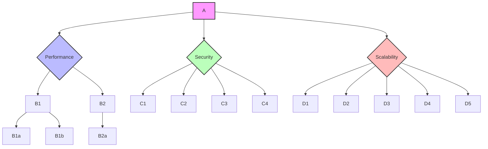

 # Blockchain Expert Interview Q&A (Liner)

## Contents

- [Topic 1: Blockchain Architecture Design and Technology Selection](#topic-1-blockchain-architecture-design-and-technology-selection)
  - [Q1: How do you approach the overall architectural design and technology selection for a blockchain system to ensure its forward-looking nature and industry leadership?](#q1-how-do-you-approach-the-overall-architectural-design-and-technology-selection-for-a-blockchain-system-to-ensure-its-forward-looking-nature-and-industry-leadership)
- [Topic 2: Leadership and Management of Blockchain Core Technology Teams](#topic-2-leadership-and-management-of-blockchain-core-technology-teams)
  - [Q2: Describe your experience in leading and managing a blockchain core technology team, including architects, backend, smart contract, and frontend engineers. How do you handle task allocation, technical guidance, talent development, and performance management?](#q2-describe-your-experience-in-leading-and-managing-a-blockchain-core-technology-team-including-architects-backend-smart-contract-and-frontend-engineers-how-do-you-handle-task-allocation-technical-guidance-talent-development-and-performance-management)
- [Topic 3: Full Lifecycle Development of Core Blockchain Products](#topic-3-full-lifecycle-development-of-core-blockchain-products)
  - [Q3: Can you describe your experience in leading the full lifecycle development of core blockchain products, such as Web3 applications, crypto wallets, and cross-chain trading platforms, from conception to delivery?](#q3-can-you-describe-your-experience-in-leading-the-full-lifecycle-development-of-core-blockchain-products-such-as-web3-applications-crypto-wallets-and-cross-chain-trading-platforms-from-conception-to-delivery)
- [Topic 4: Design and Development of Core Blockchain Modules](#topic-4-design-and-development-of-core-blockchain-modules)
  - [Q4: How do you approach the design and development of core blockchain modules, including consensus mechanisms, cryptographic algorithms, smart contracts, and cross-chain protocols?](#q4-how-do-you-approach-the-design-and-development-of-core-blockchain-modules-including-consensus-mechanisms-cryptographic-algorithms-smart-contracts-and-cross-chain-protocols)
- [Topic 5: High-Performance, High-Security, and Scalable Blockchain Architecture](#topic-5-high-performance-high-security-and-scalable-blockchain-architecture)
  - [Q5: How do you approach designing and optimizing high-performance, high-security, and scalable underlying blockchain architectures?](#q5-how-do-you-approach-designing-and-optimizing-high-performance-high-security-and-scalable-underlying-blockchain-architectures)
- [Topic 6: Cutting-Edge Blockchain Technologies and Innovative Applications](#topic-6-cutting-edge-blockchain-technologies-and-innovative-applications)
  - [Q6: Describe your experience tracking and researching cutting-edge blockchain technologies such as zero-knowledge proofs (ZKPs), modular blockchains, and Layer 2 solutions, and how you drive their innovative application in projects.](#q6-describe-your-experience-tracking-and-researching-cutting-edge-blockchain-technologies-such-as-zero-knowledge-proofs-zkps-modular-blockchains-and-layer-2-solutions-and-how-you-drive-their-innovative-application-in-projects)
- [Topic 7: Collaboration with Cross-Functional Teams](#topic-7-collaboration-with-cross-functional-teams)
  - [Q7: Describe your experience collaborating with product, marketing, and risk control departments to ensure technical solutions effectively support business goals.](#q7-describe-your-experience-collaborating-with-product-marketing-and-risk-control-departments-to-ensure-technical-solutions-effectively-support-business-goals)
- [Topic 8: Blockchain Foundational Knowledge](#topic-8-blockchain-foundational-knowledge)
  - [Q8: Explain the core principles of blockchain technology, including public chain architecture, consensus mechanisms, cryptographic algorithms, and P2P networks.](#q8-explain-the-core-principles-of-blockchain-technology-including-public-chain-architecture-consensus-mechanisms-cryptographic-algorithms-and-p2p-networks)
- [Topic 9: Web3 Product Development Experience](#topic-9-web3-product-development-experience)
  - [Q9: Describe your experience in leading the development of Web3 products from scratch, including DApps, DeFi, and NFT products.](#q9-describe-your-experience-in-leading-the-development-of-web3-products-from-scratch-including-dapps-defi-and-nft-products)
- [Topic 10: Cryptographic Wallet Technologies and Security Practices](#topic-10-cryptographic-wallet-technologies-and-security-practices)
  - [Q10: Discuss your expertise in cryptographic wallet technologies, such as HD wallets, multi-signature wallets, and MPC wallets, including their development and security practices.](#q10-discuss-your-expertise-in-cryptographic-wallet-technologies-such-as-hd-wallets-multi-signature-wallets-and-mpc-wallets-including-their-development-and-security-practices)
- [Topic 11: Cross-Chain Transaction Technologies](#topic-11-cross-chain-transaction-technologies)
  - [Q11: Explain your understanding and practical experience with cross-chain transaction technologies such as hash time locks, relay chains, and bridging protocols.](#q11-explain-your-understanding-and-practical-experience-with-cross-chain-transaction-technologies-such-as-hash-time-locks-relay-chains-and-bridging-protocols)
- [Topic 12: Blockchain Security Audit Experience](#topic-12-blockchain-security-audit-experience)
  - [Q12: Describe your experience leading security audits for smart contracts and blockchain systems, including familiarity with common vulnerabilities and mitigation strategies.](#q12-describe-your-experience-leading-security-audits-for-smart-contracts-and-blockchain-systems-including-familiarity-with-common-vulnerabilities-and-mitigation-strategies)
- [Topic 13: Blockchain Applications in Cross-Border Payment and Settlement Systems](#topic-13-blockchain-applications-in-cross-border-payment-and-settlement-systems)
  - [Q13: Discuss your understanding or project experience in utilizing blockchain technology for cross-border payment and settlement systems.](#q13-discuss-your-understanding-or-project-experience-in-utilizing-blockchain-technology-for-cross-border-payment-and-settlement-systems)
- [Topic 14: Centralized and Decentralized Exchange Core Modules](#topic-14-centralized-and-decentralized-exchange-core-modules)
  - [Q14: Describe your familiarity with the technical architecture of core modules in centralized and decentralized exchanges (CEX/DEX), such as order matching, asset custody, and clearing engines.](#q14-describe-your-familiarity-with-the-technical-architecture-of-core-modules-in-centralized-and-decentralized-exchanges-cexdex-such-as-order-matching-asset-custody-and-clearing-engines)
- [Topic 15: System Security, Network Security, and Cryptography Applications](#topic-15-system-security-network-security-and-cryptography-applications)
  - [Q15: Discuss your deep knowledge of system security, network security, and cryptography applications relevant to blockchain systems.](#q15-discuss-your-deep-knowledge-of-system-security-network-security-and-cryptography-applications-relevant-to-blockchain-systems)
- [Topic 16: Transforming Cutting-Edge Technologies into Product Solutions](#topic-16-transforming-cutting-edge-technologies-into-product-solutions)
  - [Q16: Can you provide examples of your successful experience in transforming cutting-edge blockchain technologies into practical product solutions, including any technical patents or open-source contributions?](#q16-can-you-provide-examples-of-your-successful-experience-in-transforming-cutting-edge-blockchain-technologies-into-practical-product-solutions-including-any-technical-patents-or-open-source-contributions)
- [Topic 17: Working Under High Pressure and Adapting to Fast-Paced Environments](#topic-17-working-under-high-pressure-and-adapting-to-fast-paced-environments)
  - [Q17: Describe your ability to work under high pressure and adapt to fast-paced startup environments, including any experience with travel requirements.](#q17-describe-your-ability-to-work-under-high-pressure-and-adapt-to-fast-paced-startup-environments-including-any-experience-with-travel-requirements)
- [Reference Sections](#reference-sections)

---

Topic 1: Blockchain Architecture Design and Technology Selection

Q1: How do you approach the overall architectural design and technology selection for a blockchain system to ensure its forward-looking nature and industry leadership?

**Difficulty** Advanced | **Type** Theoretical/Practical/Scenario

**Answer**
When designing a blockchain system, I start by thoroughly understanding the business requirements and objectives to identify key integration points. I then evaluate various blockchain platforms, considering factors such as scalability, security, privacy, transaction speed, and ecosystem support. For instance, for enterprise solutions requiring control and privacy, Hyperledger Fabric is a strong candidate due to its permissioned architecture, whereas for decentralized applications, Ethereum is often a top choice. My approach also involves choosing the appropriate consensus mechanism (e.g., Proof of Work, Proof of Stake, or Practical Byzantine Fault Tolerance) based on performance, decentralization, and security needs. I also assess existing infrastructure to ensure compatibility and interoperability with current systems, developing a phased implementation plan to minimize disruptions. Regular audits and code reviews are crucial for identifying and mitigating potential vulnerabilities, along with adherence to industry security standards. Furthermore, I stay updated with industry trends, emerging technologies, and academic research to ensure the selected architecture remains cutting-edge and adaptable to future advancements. This holistic approach balances immediate needs with long-term strategic goals, ensuring the blockchain solution is robust, scalable, and secure.

**Supporting Artifacts**
| Architectural Design Consideration | Description | Impact on Forward-Looking Nature |
| :------------------------------- | :----------------------------------------------------------------------------------------------------------------------------- | :------------------------------------------------------------------------------------------- |
| **Business Requirements Alignment** | Deep understanding of organizational needs and goals. | Ensures the chosen technology directly supports strategic business growth and innovation. |
| **Platform Evaluation** | Assessment of various blockchain platforms (e.g., Ethereum, Hyperledger Fabric) based on features, scalability, and ecosystem. | Guides selection of platforms that are actively evolving and have strong community/developer support. |
| **Consensus Mechanism Choice** | Selection of appropriate consensus algorithms (PoW, PoS, PBFT) balancing security, decentralization, and performance. | Influences long-term network efficiency, energy consumption, and resilience to attacks. |
| **Scalability Solutions** | Integration of Layer 2 solutions, sharding, or off-chain processing. | Directly addresses future transaction volume growth and user demand without compromising performance. |
| **Security Best Practices** | Implementation of cryptographic protocols, secure key management, and regular audits. | Protects against evolving threats and maintains data integrity, fostering trust and longevity. |
| **Interoperability** | Designing for seamless communication with existing systems and other blockchain networks. | Facilitates broader adoption and integration into a complex digital ecosystem. |
| **Continuous Learning** | Staying informed about emerging technologies like ZKPs and modular blockchains. | Ensures the architecture can adapt to and incorporate future technological breakthroughs. |

**Key Insights** Misconception | Failure Path | Trade-offs
- **Misconception**: Believing that a "one-size-fits-all" blockchain platform exists for all use cases; instead, platform selection should be tailored to specific business requirements and technical needs.
- **Failure Path**: Neglecting to plan for scalability or security from the outset, leading to bottlenecks, vulnerabilities, and costly retrofits as the system grows.
- **Trade-offs**: Deciding between decentralization, security, and scalability often requires careful consideration, as optimizing one aspect may impact others.

---

Topic 2: Leadership and Management of Blockchain Core Technology Teams

Q2: Describe your experience in leading and managing a blockchain core technology team, including architects, backend, smart contract, and frontend engineers. How do you handle task allocation, technical guidance, talent development, and performance management?

**Difficulty** Advanced | **Type** Practical/Scenario

**Answer**
In leading a blockchain core technology team comprised of architects, backend, smart contract, and frontend engineers, my approach centers on fostering a collaborative and high-performing environment. For task allocation, I utilize agile methodologies, breaking down large projects into smaller, manageable sprints and assigning tasks based on individual strengths and project requirements. This ensures clear ownership and efficient progress. Technical guidance involves regular code reviews, design discussions, and mentorship, where senior engineers guide junior team members on best practices in smart contract development (e.g., using OpenZeppelin libraries, property/fuzz tests), backend architecture, and secure coding standards. I also encourage cross-training to build a more versatile team and foster a deeper understanding of the entire blockchain stack. Talent development is a continuous process, supported by opportunities for specialized training in emerging technologies like zero-knowledge proofs or modular blockchains, participation in industry conferences, and internal knowledge-sharing sessions. For performance management, I implement a transparent system with clear KPIs aligned with project goals, providing regular feedback, and conducting annual reviews focusing on both technical contributions and soft skills such as communication and collaboration. This includes recognizing and rewarding innovative contributions to motivate the team. When conflicts arise, I facilitate open communication and seek collaborative solutions to ensure team cohesion and productivity.

**Supporting Artifacts**
| Management Aspect | Strategy | Key Tools/Practices |
| :---------------- | :----------------------------------------------------------------------------------------------------- | :--------------------------------------------- |
| **Task Allocation** | Agile methodologies, clear ownership, strength-based assignments. | Jira, Trello, Sprint Planning |
| **Technical Guidance** | Regular code reviews, design discussions, mentorship, cross-training. | Pull Requests, Architecture Review Boards, Pair Programming |
| **Talent Development** | Specialized training, conference attendance, internal knowledge sharing, skill development roadmaps. | Online Courses, Industry Workshops, Tech Talks |
| **Performance Management** | Transparent KPIs, regular feedback, annual reviews, recognition, conflict resolution. | Performance Review Software, 1:1 Meetings, Peer Feedback |
| **Team Collaboration** | Fostering open communication, seeking collaborative solutions. | Slack, Microsoft Teams, Whiteboard Sessions |

**Key Insights** Misconception | Failure Path | Trade-offs
- **Misconception**: Believing that highly technical teams do not require active management and can self-organize without guidance; while self-organization is valuable, clear leadership and structure are essential for complex projects.
- **Failure Path**: Inadequate technical mentorship or development opportunities can lead to skill stagnation, reduced innovation, and high team turnover within a rapidly evolving field like blockchain.
- **Trade-offs**: Balancing immediate project delivery with long-term talent development and training can be challenging, requiring strategic allocation of resources and time.

---

Topic 3: Full Lifecycle Development of Core Blockchain Products

Q3: Can you describe your experience in leading the full lifecycle development of core blockchain products, such as Web3 applications, crypto wallets, and cross-chain trading platforms, from conception to delivery?

**Difficulty** Advanced | **Type** Practical/Scenario

**Answer**
I have comprehensive experience leading the full lifecycle development of core blockchain products, from initial conception to successful delivery. For Web3 applications like DApps, DeFi platforms, or NFT marketplaces, my process begins with detailed requirement gathering and user story mapping, often involving close collaboration with product and design teams. I then oversee the architectural design, selecting the appropriate blockchain platform (e.g., Ethereum, Solana) and Layer 2 solutions to ensure scalability and performance. Smart contract development follows, typically using Solidity, where I emphasize rigorous testing, formal verification, and security audits to mitigate vulnerabilities like reentrancy and integer overflows. Backend services are designed for off-chain data handling and integration with external systems via APIs, while frontend development focuses on intuitive user experiences given the complexities of blockchain interactions. For crypto wallets (HD, multi-signature, MPC), security is paramount; I ensure the implementation of robust key management systems, multi-factor authentication, and cold storage solutions to protect user assets. Cross-chain trading platforms involve complex considerations such as atomic swaps, hash time locks, and bridging protocols, where I focus on secure and efficient interoperability between different blockchain networks. Throughout the development cycle, I implement continuous integration/continuous deployment (CI/CD) pipelines, conduct extensive testing (unit, integration, fuzz tests), and manage staged rollouts with monitoring and rollback plans. Post-launch, continuous monitoring, performance optimization, and regular security audits are vital to maintaining product integrity and user trust.

**Supporting Artifacts**
| Development Phase | Key Activities & Considerations | Example Product (e.g., DeFi Platform) |
| :---------------- | :------------------------------------------------------------------------------------------------------------------------------------------------------------------------------------------------------------------------------------------------------------------------------------------------------------------------------------------------------------------------------------------------ | :----------------------------------------------------------------------------------------------------------------------------------------------------------- |
| **Conception & Planning** | Define business requirements, user stories, feature prioritization, platform selection (L1/L2), initial architectural design, threat modeling. | Identifying need for decentralized lending/borrowing, choosing Ethereum + Optimistic Rollup, designing tokenomics. |
| **Design & Development** | Smart contract coding (Solidity), rigorous testing (unit, fuzz, invariant), formal verification, backend services for off-chain data (APIs), frontend UI/UX development, key management for wallets (Multi-sig, MPC). | Writing lending/borrowing smart contracts, integrating Chainlink oracles, building responsive web interface, securing admin keys with MPC. |
| **Testing & Auditing** | Comprehensive test cases (unit, integration), automated tools (Slither, Echidna), external security audits, vulnerability disclosure programs, testnet deployments. | Running tests on Kovan/Ropsten, engaging external auditors, setting up bug bounty program for smart contracts. |
| **Deployment & Launch** | Staged rollouts, CI/CD pipelines, real-time monitoring, incident response plan, user education. | Deploying to mainnet in phases, monitoring transaction success rates and gas usage, educating users on wallet security. |
| **Post-Launch & Maintenance** | Continuous monitoring, performance optimization, regular security updates, community feedback integration, regulatory compliance. | Tracking TVL (Total Value Locked), optimizing gas fees, patching smart contract vulnerabilities, adapting to new DeFi regulations. |

**Key Insights** Misconception | Failure Path | Trade-offs
- **Misconception**: Underestimating the complexity of integrating blockchain with traditional systems or the need for specialized security practices for smart contracts and digital assets.
- **Failure Path**: A common failure path involves launching without comprehensive security audits, leading to exploits and significant financial losses, as seen in numerous smart contract hacks.
- **Trade-offs**: Balancing rapid development and market responsiveness with rigorous security measures and thorough testing, especially in fast-paced Web3 environments, often involves tough decisions.

---

Topic 4: Design and Development of Core Blockchain Modules

Q4: How do you approach the design and development of core blockchain modules, including consensus mechanisms, cryptographic algorithms, smart contracts, and cross-chain protocols?

**Difficulty** Advanced | **Type** Theoretical/Practical

**Answer**
My approach to designing and developing core blockchain modules is deeply rooted in security, scalability, and efficiency. For **consensus mechanisms**, the selection is driven by the specific needs of the blockchain (e.g., transaction throughput, decentralization requirements). For example, Proof of Stake (PoS) offers better energy efficiency and scalability compared to Proof of Work (PoW) for certain applications, while Byzantine Fault Tolerance (BFT) variants prioritize finality and resilience in permissioned networks. The design involves robust algorithm implementation, well-designed incentive structures to discourage malicious behavior, and ensuring all participants agree on the state of the blockchain.

In **cryptographic algorithms**, I emphasize using industry-standard, battle-tested algorithms like SHA-256 for hashing and public-key cryptography for digital signatures to ensure data integrity and authentication. It is crucial to prevent vulnerabilities in implementation, such as improper key management or weak random number generation. My focus is on creating a secure environment where transactions are verified and validated, making data tamper-proof.

For **smart contracts**, the process begins with clear specifications and thorough threat modeling. I advocate for using well-reviewed libraries (e.g., OpenZeppelin), minimizing external calls, and implementing secure coding practices like checks-effects-interactions and reentrancy guards. Rigorous testing, including unit, invariant, and fuzz tests, along with static analysis (e.g., Slither, Echidna), is paramount to identify and remediate vulnerabilities before deployment. Formal verification tools are also employed for high-value contracts to mathematically prove their correctness.

Regarding **cross-chain protocols**, I prioritize secure and efficient interoperability. This involves understanding different mechanisms like hash time locks, relay chains, and bridging protocols. When designing bridges, I ensure clear trust assumptions, minimize Total Value Locked (TVL), implement caps per route, and design idempotent claims with replay protection. Where possible, I explore optimistic or light-client-based bridges for stronger guarantees, always focusing on isolating potential failures and optimizing user experience.

**Supporting Artifacts**
| Module | Key Design Considerations | Common Algorithms/Practices | Security & Scalability Focus |
| :----------------------- | :--------------------------------------------------------------- | :--------------------------------------------------------------------------- | :--------------------------------------------------------------------------------- |
| **Consensus Mechanisms** | Network size, decentralization, transaction throughput, finality. | PoW, PoS, DPoS, PBFT | Preventing 51% attacks, double-spending; enhancing transaction validation speed. |
| **Cryptographic Algorithms** | Data integrity, authentication, confidentiality, non-repudiation. | SHA-256, ECDSA, Public-key cryptography | Tamper-proof records, secure user identities, protection of sensitive data. |
| **Smart Contracts** | Logic correctness, reentrancy prevention, gas optimization, upgradeability. | Solidity, OpenZeppelin, Checks-Effects-Interactions, Formal Verification | Preventing exploits (e.g., reentrancy, integer overflow); ensuring reliable execution. |
| **Cross-Chain Protocols** | Interoperability, asset transfer security, trust assumptions, latency. | Hash Time Locks, Relay Chains, Bridging Protocols (e.g., IBC) | Secure asset transfer between chains; mitigating risks in bridge design. |

**Key Insights** Misconception | Failure Path | Trade-offs
- **Misconception**: Assuming that using established cryptographic algorithms inherently guarantees security without proper implementation and key management practices.
- **Failure Path**: Neglecting thorough testing and auditing of smart contracts, leading to exploitable vulnerabilities that can result in significant financial losses, as demonstrated by past incidents like The DAO hack.
- **Trade-offs**: Choosing a consensus mechanism often involves balancing the blockchain trilemma (decentralization, security, scalability), where optimizing for one aspect may compromise another.

---

Topic 5: High-Performance, High-Security, and Scalable Blockchain Architecture

Q5: How do you approach designing and optimizing high-performance, high-security, and scalable underlying blockchain architectures?

**Difficulty** Advanced | **Type** Theoretical/Practical

**Answer**
My approach to designing and optimizing high-performance, high-security, and scalable blockchain architectures is multi-faceted, addressing each aspect rigorously. For **high-performance**, I focus on maximizing transaction throughput and minimizing latency. This often involves implementing Layer 2 solutions such as rollups (Optimistic or ZK-Rollups) or state channels to offload transactions from the main chain, significantly increasing transaction capacity. Sharding is another key technique to partition the blockchain into smaller, parallel processing segments, allowing for simultaneous transaction handling. I also consider efficient data structures, batch operations, and minimizing `SSTORE` operations in smart contracts to reduce gas costs and improve execution speed.

**High-security** is foundational. This includes using robust cryptographic algorithms (e.g., SHA-256 for hashing, strong public-key infrastructure for digital signatures) and implementing secure key management systems that may involve multi-signature wallets, hardware security modules (HSMs), or Multi-Party Computation (MPC). Regular, comprehensive security audits of smart contracts and the overall system are non-negotiable to identify and mitigate vulnerabilities like re-entrancy, integer overflows, and front-running. Implementing a well-defined incident response plan and employing threat modeling from the early stages of design are also critical.

For **scalability**, beyond Layer 2 and sharding, I also evaluate the choice of consensus mechanism; Proof of Stake (PoS) and its derivatives often offer better scalability and energy efficiency compared to Proof of Work (PoW). Optimizing node communication, exploring modular blockchain designs where core functions are separated into distinct layers, and considering advanced data availability layers contribute to enhanced scalability. Continuous monitoring of network performance metrics like throughput, latency, and resource utilization helps identify bottlenecks and allows for proactive optimization and adjustments.

**Supporting Artifacts**


**Key Insights** Misconception | Failure Path | Trade-offs
- **Misconception**: Believing that high decentralization automatically equates to high performance and scalability; often, there are trade-offs where increasing one may impact the others.
- **Failure Path**: Overlooking continuous monitoring and performance tuning post-deployment can lead to degradation of service, especially as transaction volumes grow or new features are introduced.
- **Trade-offs**: Implementing extensive security measures (e.g., multi-party computation for every transaction) might increase computational overhead and latency, requiring a balance between the desired security level and performance targets.

---

Topic 6: Cutting-Edge Blockchain Technologies and Innovative Applications

Q6: Describe your experience tracking and researching cutting-edge blockchain technologies such as zero-knowledge proofs (ZKPs), modular blockchains, and Layer 2 solutions, and how you drive their innovative application in projects.

**Difficulty** Advanced | **Type** Theoretical/Practical/Scenario

**Answer**
My experience involves actively tracking and researching cutting-edge blockchain technologies and identifying their innovative applications to solve real-world problems. For **zero-knowledge proofs (ZKPs)**, I closely follow advancements in zk-SNARKs and zk-STARKs, recognizing their potential for enhancing privacy and scalability without revealing underlying data. I’ve explored their application in confidential transactions, private voting systems, and off-chain computation verification, particularly for Layer 2 solutions like zk-Rollups, which bundle transactions and submit concise proofs to the main chain. I've also researched ZKP's use in digital identity verification, allowing users to prove attributes without disclosing sensitive information.

Regarding **modular blockchains**, I've studied how they divide core functions (execution, settlement, consensus, data availability) into distinct, optimized layers, addressing the blockchain scalability trilemma. Technologies like Celestia and Avail, which offer dedicated data availability layers, are particularly interesting for offloading storage and computation from rollups. I drive their application by advocating for flexible and efficient dApp development, where developers can fine-tune specific components independently. My focus is on leveraging modularity to achieve greater customization, scalability, and interoperability across ecosystems.

For **Layer 2 solutions**, my expertise spans both Optimistic Rollups and ZK-Rollups. I understand their distinct mechanisms—Optimistic Rollups assuming transactions are valid unless challenged by fraud proofs, and ZK-Rollups using cryptographic validity proofs. I assess their trade-offs in terms of latency, security assumptions, tooling, costs, and developer ergonomics to recommend the most suitable solution for specific use cases. For general-purpose EVM compatibility, Optimistic Rollups can be faster to implement, while ZK-Rollups are preferred for high-frequency or privacy-sensitive applications requiring strong validity guarantees. My approach includes piloting these technologies within projects, measuring their impact on performance and security, and iterating based on results. This ensures that we transform these cutting-edge concepts into practical, impactful product features.

**Supporting Artifacts**
| Cutting-Edge Technology | Core Functionality | Innovative Application Areas | Key Benefits |
| :---------------------- | :------------------------------------------------------------------------------------------------------------------------------------------------------------------------------- | :----------------------------------------------------------------------------------------------------- | :-------------------------------------------------------------------------------------------------------------------------------------------------------------------------------------------------- |
| **Zero-Knowledge Proofs (ZKPs)** | Proving a statement's truth without revealing underlying data, often using zk-SNARKs/zk-STARKs. | Private transactions, confidential voting, off-chain computation verification, digital identity. | Enhanced privacy, improved scalability (especially in zk-Rollups), reduced data exposure, minimal security assumptions. |
| **Modular Blockchains** | Dividing blockchain functions (execution, settlement, consensus, data availability) into separate layers. | Flexible dApp development, customized execution environments, improved scalability and interoperability. | Vertical scaling, optimized independent components, resolution of the blockchain trilemma. |
| **Layer 2 Solutions** | Protocols built on top of Layer 1 to enhance scalability (e.g., Optimistic Rollups, ZK-Rollups). | Faster and cheaper transactions, increased throughput for dApps, reduced mainnet congestion. | Scalability without compromising Layer 1 security, lower transaction fees, expanded dApp functionalities. |

**Key Insights** Misconception | Failure Path | Trade-offs
- **Misconception**: Believing that Layer 2 solutions fully inherit the security of Layer 1 without any new assumptions; Layer 2s introduce their own security models and potential vulnerabilities that need careful consideration (e.g., fraud proofs in Optimistic Rollups vs. validity proofs in ZK-Rollups).
- **Failure Path**: Blindly adopting a cutting-edge technology without thorough understanding of its limitations, operational complexities, or suitability for the specific use case, leading to increased development costs, security risks, or poor user experience.
- **Trade-offs**: Choosing between Optimistic Rollups and ZK-Rollups involves trade-offs between EVM compatibility/ease of implementation and faster finality/stronger validity guarantees, respectively. Modular blockchains, while offering flexibility, can fragment liquidity and increase UX complexity due to cross-chain interactions.

---

Topic 7: Collaboration with Cross-Functional Teams

Q7: Describe your experience collaborating with product, marketing, and risk control departments to ensure technical solutions effectively support business goals.

**Difficulty** Advanced | **Type** Practical/Scenario

**Answer**
My experience in collaborating with product, marketing, and risk control departments is extensive, focusing on aligning technical solutions with broader business goals. With **product departments**, I actively participate in early feasibility reviews to identify potential gas/cost implications, latency issues, and failure cases of proposed features. I provide rough cost models and prototypes to enable product managers to make informed trade-offs, ensuring that technical constraints are communicated in plain language and that design-friendly alternatives are explored. This co-creation of scope helps in prioritizing features and requirements effectively.

When working with **marketing departments**, I translate complex technical features into clear, compelling narratives that highlight their value propositions to target audiences. I align integration timelines and communicate any technical dependencies or risks that might impact marketing campaigns. For instance, I would explain how a new Layer 2 solution enables faster transactions, which can be a key marketing message for a dApp.

With **risk control departments**, my collaboration is critical for ensuring the security and compliance of blockchain solutions. This involves integrating risk assessments from the outset of design, identifying potential vulnerabilities, and implementing robust mitigation strategies. I explain the operational security practices, such as layered controls, key rotation, and blast radius reduction for admin privileges, and discuss incident response plans to ensure business continuity. For example, in a DeFi project, I'd work closely with risk control to audit smart contracts, implement circuit breakers, and design mechanisms to mitigate flash loan exploits or oracle manipulations. Transparent communication about security incidents, post-mortems, and lessons learned is vital to foster trust and continuous improvement in risk posture.

**Supporting Artifacts**
| Department | Collaboration Focus | Key Activities | Expected Outcome |
| :--------- | :----------------------------------------------------- | :--------------------------------------------------------------------------------------------------------------------------- | :--------------------------------------------------------------------------------------------------------------- |
| **Product** | Aligning technical feasibility with market needs. | Early feasibility reviews, cost modeling, prototyping, translating tech into user benefits. | Prioritized features, realistic roadmaps, user-centric solutions. |
| **Marketing** | Translating technical features into compelling narratives. | Communicating value propositions, aligning timelines, explaining technical benefits in simple terms. | Effective campaigns, clear product messaging, increased adoption. |
| **Risk Control** | Ensuring security, compliance, and business continuity. | Risk assessments, vulnerability mitigation, incident response planning, transparent communication. | Robust security posture, regulatory adherence, minimized financial and reputational risk. |

**Key Insights** Misconception | Failure Path | Trade-offs
- **Misconception**: Believing that technical teams can operate in isolation without regular input from business-focused departments; this often leads to solutions that are technically sound but fail to meet market demands or regulatory requirements.
- **Failure Path**: Lack of clear and consistent communication between technical and non-technical teams can result in misaligned expectations, project delays, and solutions that do not adequately address business needs or risks.
- **Trade-offs**: Balancing the desire for innovative technical features (driven by product) with the need for stringent security and compliance (driven by risk control) can create tension, requiring careful negotiation and prioritization of requirements.

---

Topic 8: Blockchain Foundational Knowledge

Q8: Explain the core principles of blockchain technology, including public chain architecture, consensus mechanisms, cryptographic algorithms, and P2P networks.

**Difficulty** Foundational | **Type** Theoretical

**Answer**
Blockchain technology is a decentralized digital ledger that securely records transactions across multiple computers. It operates without a central authority, relying on several core principles to maintain data integrity and transparency.

**Public chain architecture** refers to open networks where anyone can participate, validate transactions, and view the ledger. Examples include Bitcoin and Ethereum. These chains prioritize decentralization and transparency, making all transactions visible and verifiable by the network. In contrast, private or permissioned blockchains restrict access to a predefined group of participants, offering more control and privacy for specific enterprise use cases.

**Consensus mechanisms** are fundamental protocols that enable all nodes in the network to agree on a single, consistent state of the ledger, even in the presence of faults or malicious actors. They prevent issues like double-spending. Common examples include Proof of Work (PoW), where miners solve computational puzzles, and Proof of Stake (PoS), where validators are chosen based on their staked cryptocurrency. The choice of mechanism impacts a network's security, scalability, and energy consumption.

**Cryptographic algorithms** are essential for securing blockchain networks, protecting user identities, and ensuring transaction integrity. Hash functions (e.g., SHA-256) encrypt data blocks, converting input into a unique, fixed-length output; even minor changes produce entirely different hashes, making tampering evident. Public and private key pairs are used to sign and authorize transactions, ensuring that only the rightful owner can control their assets.

**P2P networks** form the backbone of blockchain's decentralized nature. In a P2P network, every participant (node) maintains a copy of the entire blockchain, ensuring data integrity and availability without relying on a central server. This distributed structure enhances robustness against single points of failure and external attacks.

**Supporting Artifacts**
| Core Principle | Description | Role in Blockchain |
| :------------- | :--------------------------------------------------------------------------------------------------------------------------------------------- | :--------------------------------------------------------------------------------------------------------------------------------------------------------------------------------------- |
| **Public Chain Architecture** | An open, decentralized network where anyone can participate, validate transactions, and view the ledger. | Promotes transparency, censorship resistance, and broad accessibility (e.g., Bitcoin, Ethereum). |
| **Consensus Mechanisms** | Algorithms (e.g., PoW, PoS) that ensure all network nodes agree on the validity of transactions and the state of the blockchain. | Prevents double-spending, maintains network integrity, and establishes trust in a decentralized environment. |
| **Cryptographic Algorithms** | Mathematical functions (e.g., hash functions, public/private key pairs) used to secure data, authenticate users, and verify transactions. | Ensures data integrity (immutability), user authentication, and non-repudiation of transactions. |
| **P2P Networks** | A distributed network where each node communicates directly with others, sharing and validating the blockchain ledger. | Eliminates single points of failure, enhances decentralization, and ensures data availability and resilience. |

**Key Insights** Misconception | Failure Path | Trade-offs
- **Misconception**: That all blockchains are anonymous; while transactions can be pseudonymous, advanced analytics can sometimes de-anonymize users.
- **Failure Path**: A weak consensus mechanism or insufficient decentralization can lead to vulnerabilities like a 51% attack, where a single entity gains control and can manipulate the blockchain.
- **Trade-offs**: Public blockchains prioritize decentralization and transparency but often face challenges with scalability and transaction speed compared to more centralized systems.

---

Topic 9: Web3 Product Development Experience

Q9: Describe your experience in leading the development of Web3 products from scratch, including DApps, DeFi, and NFT products.

**Difficulty** Advanced | **Type** Practical/Scenario

**Answer**
My experience in leading Web3 product development from scratch encompasses DApps, DeFi platforms, and NFT products, involving end-to-end responsibility from concept to deployment. For **DApps**, I initiate with in-depth requirements analysis and user experience (UX) design, focusing on simplifying complex blockchain interactions for the end-user. This includes selecting the optimal Layer 1 or Layer 2 blockchain (e.g., Ethereum, Polygon for scalability), designing the smart contract architecture, and developing the frontend to interact with the blockchain via Web3.js or Ethers.js. Rigorous smart contract development, including unit testing, integration testing, and external security audits, is paramount to prevent vulnerabilities.

In **DeFi products**, such as lending protocols or decentralized exchanges, the focus extends to financial logic, tokenomics, and oracle integration. I've designed and implemented smart contracts for core DeFi functionalities, ensuring robust security measures against flash loan exploits and price oracle manipulations. Key considerations include capital efficiency, liquidity provision, and risk management mechanisms. I also prioritize transparent communication of risks and clear user interfaces for interacting with complex financial instruments.

For **NFT products** (e.g., marketplaces, generative art platforms), my experience includes defining ERC-721 or ERC-1155 token standards, designing smart contracts for minting and ownership transfer, and integrating with decentralized storage solutions like IPFS for metadata. Unique challenges involve ensuring authenticity, managing royalty distribution, and handling potential scalability issues during high-demand events. Throughout all these projects, I emphasize a security-first development approach, continuous monitoring, and quick adaptation to the rapidly evolving Web3 landscape.

**Supporting Artifacts**
| Web3 Product Type | Key Development Focus Areas | Specific Considerations |
| :---------------- | :--------------------------------------------------------------------------------------------------------------------------- | :--------------------------------------------------------------------------------------------------------------------------------------------------------------------------------------- |
| **DApps** | User experience (UX) for blockchain interactions, smart contract logic, frontend connectivity (Web3.js). | Simplification of complex processes, choosing suitable L1/L2, comprehensive testing and auditing. |
| **DeFi Products** | Financial logic, tokenomics, security against financial exploits, oracle integration. | Capital efficiency, liquidity provision, risk management, transparent risk communication, robust smart contract security. |
| **NFT Products** | Token standards (ERC-721/1155), decentralized storage for metadata, authenticity, royalty management. | Scalability during minting events, fraud prevention, integration with marketplaces, handling large media files. |

**Key Insights** Misconception | Failure Path | Trade-offs
- **Misconception**: Believing that Web3 development is just a re-platforming of Web2 applications; it requires a fundamental shift in design thinking, emphasizing decentralization, user ownership, and trustless interactions.
- **Failure Path**: Neglecting the unique security vulnerabilities of smart contracts can lead to catastrophic financial losses or reputational damage, as many DeFi and NFT projects have experienced.
- **Trade-offs**: Balancing decentralization with scalability and user experience often requires compromises, such as leveraging Layer 2 solutions which might introduce new security assumptions or centralizing certain components for performance.

---

Topic 10: Cryptographic Wallet Technologies and Security Practices

Q10: Discuss your expertise in cryptographic wallet technologies, such as HD wallets, multi-signature wallets, and MPC wallets, including their development and security practices.

**Difficulty** Advanced | **Type** Theoretical/Practical

**Answer**
My expertise in cryptographic wallet technologies covers their fundamental mechanisms, development, and stringent security practices. I have a deep understanding of **HD (Hierarchical Deterministic) wallets**, which derive multiple key pairs from a single seed phrase. This dramatically simplifies backup and management while allowing for new addresses to be generated deterministically. In development, I ensure robust seed generation, secure storage of the seed (often offline or encrypted), and proper implementation of derivation paths (e.g., BIP32, BIP44) to maintain compatibility and security across different cryptocurrencies.

For **multi-signature (multisig) wallets**, I've designed and implemented systems requiring multiple private keys to authorize a transaction (e.g., 2-of-3 or 3-of-5 schemes). This significantly enhances security by eliminating single points of failure and protecting against unauthorized access, insider threats, and coercion. Development involves careful smart contract design for on-chain multisig solutions or robust off-chain coordination for threshold signature schemes. Key management for multisig requires distributing key fragments to trusted parties, ideally using hardware security keys or physical steps.

My understanding also extends to **MPC (Multi-Party Computation) wallets**, which employ advanced cryptographic techniques to distribute the control of a private key across multiple parties without ever forming a complete private key in a single location. This offers a superior security model compared to traditional multisig by preventing the "single point of compromise" risk associated with full private key exposure. In developing MPC solutions, I focus on selecting and implementing secure MPC protocols, ensuring that key shares are generated, stored, and used in a highly secure, isolated manner. This approach significantly reduces the attack surface for key theft and insider collusion.

Across all wallet types, **security practices** are paramount. This includes implementing hardware security keys for production systems and admin roles, requiring multiple humans and physical steps for critical operations, and rigorous audit trails. Continuous monitoring for anomalies, regular security audits, and educating users on phishing risks and private key hygiene are also crucial.

**Supporting Artifacts**
| Wallet Technology | Description | Key Security Advantages | Development & Security Practices |
| :---------------- | :--------------------------------------------------------------------------------------------------------------------------- | :--------------------------------------------------------------------------------------------------------------------------------------------------------------------- | :------------------------------------------------------------------------------------------------------------------------------------------------------------------------------------------------------------------------------------------------------------------------------------------------------------------- |
| **HD Wallet** | Generates multiple key pairs from a single seed phrase, simplifying backup and management. | Single seed for many addresses, deterministic key generation, improved usability. | Secure seed generation and storage, proper BIP32/BIP44 derivation path implementation, offline backup. |
| **Multi-signature (Multisig)** | Requires multiple private keys to authorize a transaction (e.g., M-of-N scheme), often implemented via smart contracts. | Eliminates single point of failure, protects against insider threats and coercion, distributed control. | Secure distribution of key fragments, smart contract audits, hardware security keys for participants, defined approval processes. |
| **MPC Wallet** | Distributes control of a private key among multiple parties without forming a complete key, using Multi-Party Computation. | Prevents complete private key exposure, eliminates single point of compromise, enhanced resistance to collusion and theft. | Selection of robust MPC protocols, secure generation/storage of key shares, isolated operational environments, continuous security monitoring. |

**Key Insights** Misconception | Failure Path | Trade-offs
- **Misconception**: Believing that any form of multi-party control inherently means the private key is never fully formed; in multisig, the private key fragments are used to *sign* transactions, whereas in MPC, the key is *never* fully constructed by any single party.
- **Failure Path**: Improper key management, such as storing private keys in easily accessible locations or relying on single points of control, can lead to devastating loss of funds, regardless of the wallet technology used.
- **Trade-offs**: While MPC wallets offer superior security, they can be more technically complex to implement and manage than traditional multisig wallets, and may have higher computational costs for certain operations.

---

Topic 11: Cross-Chain Transaction Technologies

Q11: Explain your understanding and practical experience with cross-chain transaction technologies, such as hash time locks, relay chains, and bridging protocols.

**Difficulty** Advanced | **Type** Theoretical/Practical

**Answer**
My understanding and practical experience with cross-chain transaction technologies are crucial for enabling interoperability in decentralized ecosystems. I've worked with various mechanisms designed to facilitate secure and efficient asset transfers and data exchange between disparate blockchain networks.

**Hash Time Lock Contracts (HTLCs)** are a foundational primitive for atomic swaps. I have practical experience implementing HTLCs to enable peer-to-peer, trustless exchanges of cryptocurrencies across different blockchains without needing a central intermediary. The mechanism relies on a cryptographic hash and a time lock. A sender commits funds to a contract with a secret (pre-image), and the recipient can claim the funds by providing the hash of that secret within a specified time. If the recipient fails to do so, the funds are returned to the sender. This ensures either both transactions complete or neither does, preventing partial or failed transfers.

**Relay chains** like Polkadot's Relay Chain are central to ensuring interoperability in a multi-chain ecosystem. My experience includes understanding how relay chains provide shared security and facilitate communication between connected parachains (or other compatible blockchains). This often involves light client validation, where the relay chain validates the headers of connected chains, and vice versa, without needing to process every transaction on every chain. This architecture allows for secure cross-chain messaging and asset transfers while maintaining the sovereignty of individual chains.

**Bridging protocols** are broader solutions designed to connect arbitrary blockchain networks, often involving varying trust models. I've worked with bridging protocols, understanding their diverse architectures, from centralized custodial bridges (higher risk, simpler implementation) to more decentralized and trust-minimized approaches like optimistic bridges or light-client-based bridges. In practice, I focus on designing bridges with clear trust assumptions, minimizing Total Value Locked (TVL), setting caps per route, and implementing idempotent claims with replay protection to enhance security. For critical functions, I prefer well-audited, battle-tested bridges and explore optimistic or light-client-based solutions for stronger guarantees, recognizing that bridges are often high-value targets for exploits. My goal is to ensure seamless interoperability while carefully managing the inherent security risks associated with cross-chain communication.

**Supporting Artifacts**
| Technology | Mechanism | Primary Use Case | Trust Model |
| :----------------------------- | :--------------------------------------------------------------------------------------------------------------------------------------------------------------------------------------- | :---------------------------------------------------------------------------------- | :-------------------------------------------------------------------- |
| **Hash Time Lock Contracts (HTLCs)** | Funds locked with a hash of a secret and a time limit; recipient provides secret to claim, or funds revert. | Atomic swaps (trustless token exchange between chains). | Trustless (relies on cryptographic proofs and time limits). |
| **Relay Chains** | A central blockchain providing shared security and communication for connected parallel chains (e.g., Polkadot). | Interoperability and message passing between specific chain ecosystems. | Shared security model, trust in the relay chain's consensus. |
| **Bridging Protocols** | External connectors that enable asset and data transfer between distinct blockchains. | General cross-chain asset transfer, communication, and dApp functionality. | Varies widely: centralized custodial (trusted third party) to decentralized light-client-based (trust-minimized). |

**Key Insights** Misconception | Failure Path | Trade-offs
- **Misconception**: Believing that all cross-chain solutions offer the same level of security and decentralization; trust models vary significantly, with centralized bridges introducing single points of failure.
- **Failure Path**: Vulnerabilities in bridging protocols, often due to smart contract bugs or compromised multisig schemes, have led to some of the largest exploits in the crypto space. Inadequate security audits and lack of robust monitoring are common failure points.
- **Trade-offs**: Choosing a cross-chain technology involves balancing security (trust-minimized vs. trusted third party), efficiency (transaction speed, cost), and complexity (ease of implementation, maintenance). Decentralized bridges often come with higher complexity but offer stronger security guarantees.

---

Topic 12: Blockchain Security Audit Experience

Q12: Describe your experience leading security audits for smart contracts and blockchain systems, including familiarity with common vulnerabilities and mitigation strategies.

**Difficulty** Advanced | **Type** Practical/Scenario

**Answer**
I have extensive experience leading security audits for smart contracts and blockchain systems, encompassing the entire audit lifecycle from scoping to post-audit remediation. My approach begins with **project scoping and inventory**, where I identify all relevant codebases, smart contracts, bridging solutions, and node configurations.

For **smart contracts**, I'm deeply familiar with common vulnerabilities such as:
- **Reentrancy attacks**: Occur when a contract calls an external contract that then calls back into the original contract before the first execution is complete, allowing funds to be drained. Mitigation involves using the checks-effects-interactions pattern and reentrancy guards.
- **Integer overflows/underflows**: Arithmetic operations exceeding or falling below the maximum/minimum integer size, leading to unexpected values and potential exploits. Mitigation requires using safe math libraries (e.g., OpenZeppelin's SafeMath) or Solidity versions with built-in overflow checks.
- **Front-running**: Malicious actors observing pending transactions and submitting their own with a higher gas price to get included first, manipulating outcomes. Mitigation includes private order flow, batch auctions, and slippage controls.
- **Oracle manipulation**: Exploiting external data feeds to trigger smart contract logic unfairly. Mitigation involves using multiple reputable oracle sources, setting bounds checks on price deviation, and implementing circuit breakers.
- **Access control issues**: Insufficient checks on who can call critical functions, leading to unauthorized actions. Mitigation involves strict role-based access control, multi-signature requirements for privileged actions, and pause switches.

For **blockchain systems**, I address vulnerabilities like:
- **51% attacks**: Where a single entity controls over half the network's computational power, allowing transaction manipulation. Mitigation includes robust consensus mechanisms and decentralized governance.
- **Sybil attacks**: An attacker creating multiple fake identities to gain disproportionate influence. Mitigation involves identity verification and reputation systems.
- **Private key compromises**: Through phishing or social engineering. Mitigation includes multi-factor authentication (MFA), user education, and secure key management (e.g., hardware wallets, MPC).

My audit methodology combines **automated static and dynamic analysis** (using tools like Slither, Echidna for fuzz testing) with **manual code review and threat modeling** to catch subtle business logic flaws that automation misses. I also conduct **dependency and supply chain audits** to check third-party libraries for known vulnerabilities. Post-audit, I ensure **reporting and post-audit actions** are thorough, prioritizing fixes based on risk, and validating remediation through re-verification and continuous monitoring.

**Supporting Artifacts**
| Common Vulnerability | Description | Mitigation Strategy | Example Incident |
| :------------------- | :--------------------------------------------------------------------------------------------------------------------------- | :------------------------------------------------------------------------------------------------------------------------------------------------------------------------------- | :------------------------------------------------------------------------------------- |
| **Reentrancy** | Attacker repeatedly calls a function before the previous execution completes, often to drain funds. | Checks-Effects-Interactions pattern, reentrancy guards, OpenZeppelin's ReentrancyGuard. | The DAO Hack (2016) |
| **Integer Overflows/Underflows** | Arithmetic operations exceed or fall below the maximum/minimum value for a data type, leading to unexpected results. | Use SafeMath libraries or Solidity versions with built-in checks for safe arithmetic. | Multiple DeFi exploits (e.g., dYdX, BXH) |
| **Front-running** | Attacker sees a pending transaction and submits their own with higher gas to execute it first, manipulating the market. | Private transaction relays (e.g., Flashbots Protect), batch auctions, slippage controls. | MEV (Maximal Extractable Value) in various DeFi protocols |
| **Oracle Manipulation** | Exploiting external data sources (oracles) that feed data to smart contracts to trigger unfair outcomes. | Multiple reputable oracle sources, decentralized oracle networks (e.g., Chainlink), circuit breakers. | Harvest Finance (2020) |
| **Access Control Flaws** | Insufficient checks on who can execute critical functions, leading to unauthorized asset transfers or contract modifications. | Role-based access control (RBAC), multi-signature wallets for admin actions, pause functions. | Parity Wallet multi-sig hack (2017) |
| **51% Attack** | A single entity controls more than 50% of the network's hashing/staking power to manipulate transactions. | Robust, decentralized consensus mechanisms; high cost of attack makes it impractical for large chains. | Bitcoin Gold (2018) |
| **Private Key Compromise** | Theft of private keys through phishing, malware, or social engineering. | Multi-factor authentication (MFA), hardware wallets, MPC, user education, secure key storage. | Ledger Wallet phishing (2020) |

**Key Insights** Misconception | Failure Path | Trade-offs
- **Misconception**: Believing that automated tools alone are sufficient for comprehensive security audits; while valuable, they often miss complex business logic flaws or novel attack vectors that require manual review and threat modeling.
- **Failure Path**: Rushing product launches without adequate security audits or neglecting to implement an incident response plan can lead to catastrophic financial and reputational damage following an exploit.
- **Trade-offs**: Implementing highly robust security measures, such as formal verification or complex multi-party computation, can increase development time and costs, requiring a balance between security rigor and project timelines.

---

Topic 13: Blockchain Applications in Cross-Border Payment and Settlement Systems

Q13: Discuss your understanding or project experience in utilizing blockchain technology for cross-border payment and settlement systems.

**Difficulty** Intermediate | **Type** Theoretical/Practical

**Answer**
My understanding and project experience in leveraging blockchain technology for cross-border payment and settlement systems is based on its potential to offer significant improvements over traditional methods. Traditional cross-border payments often involve multiple intermediaries, leading to high transaction costs, slow settlement times, and a lack of transparency. Blockchain technology directly addresses these issues through its decentralized, immutable, and transparent nature.

I understand that blockchain enables **faster and cheaper transactions** by eliminating the need for numerous intermediaries. By allowing direct peer-to-peer transfers, it significantly reduces the number of steps involved in a cross-border transaction. This is particularly evident in DeFi platforms, which can facilitate cross-border payments more cheaply and quickly.

For **settlement systems**, blockchain provides near-instantaneous settlement compared to traditional banking systems, which can take days. The immutability of blockchain records ensures that once a transaction is confirmed, it cannot be altered, providing a secure and auditable trail for all parties involved. This enhances transparency and reduces the risk of fraud.

In terms of project experience, I have explored architectures where stablecoins (cryptocurrencies pegged to fiat currencies) are used as a medium of exchange to mitigate cryptocurrency price volatility, a key concern in traditional finance. This approach leverages blockchain's efficiency for transfers while maintaining value stability. Additionally, I've considered the application of cross-chain protocols and atomic swaps to facilitate seamless exchange between different digital assets or fiat-backed tokens across various blockchain networks, further optimizing the payment flow. However, regulatory compliance and interoperability challenges remain crucial considerations in real-world implementations.

**Supporting Artifacts**
| Aspect | Traditional System | Blockchain-Based System |
| :------------------------- | :--------------------------------------------------------------------- | :---------------------------------------------------------------------------------------------------- |
| **Intermediaries** | Multiple banks, correspondent banks, clearing houses. | Fewer to none (peer-to-peer), or direct smart contract interactions. |
| **Cost** | High fees due to multiple intermediaries and FX conversions. | Lower transaction fees, reduced overhead. |
| **Speed/Settlement Time** | Days (T+2 or T+3 settlement cycle). | Near-instantaneous (minutes to seconds, depending on blockchain). |
| **Transparency** | Opaque; tracking transaction status can be difficult. | Transparent and auditable records on an immutable ledger. |
| **Fraud Risk** | Higher risk due to multiple points of failure and manual processes. | Reduced risk due cryptographic security and network consensus. |
| **Currency Volatility** | Stable (fiat currencies). | Potentially volatile (cryptocurrencies), but stablecoins mitigate this. |

**Key Insights** Misconception | Failure Path | Trade-offs
- **Misconception**: Believing that using any cryptocurrency for cross-border payments is inherently stable and efficient; volatility of unpegged cryptocurrencies poses a significant risk, which stablecoins aim to address.
- **Failure Path**: Overlooking regulatory complexities and compliance requirements in different jurisdictions can lead to significant legal and operational hurdles, hindering adoption and scalability.
- **Trade-offs**: While blockchain offers speed and cost efficiency, adopting it for cross-border payments requires balancing the benefits of decentralization with the need for stability, regulatory adherence, and integration with existing financial infrastructures.

---

Topic 14: Centralized and Decentralized Exchange Core Modules

Q14: Describe your familiarity with the technical architecture of core modules in centralized and decentralized exchanges (CEX/DEX), such as order matching, asset custody, and clearing engines.

**Difficulty** Advanced | **Type** Theoretical/Practical

**Answer**
My familiarity with the technical architecture of core modules in both centralized (CEX) and decentralized exchanges (DEX) is comprehensive, encompassing their distinct approaches to order matching, asset custody, and clearing.

In **Centralized Exchanges (CEXs)**, the architecture is typically off-chain and resembles traditional financial systems. The **order matching engine** is a high-performance, low-latency system that pairs buy and sell orders from users. This engine must handle immense transaction volumes, ensuring fair and efficient execution. My experience involves designing such systems with considerations for throughput, latency, and resilience, often using in-memory databases and sophisticated algorithms. **Asset custody** in CEXs is centralized, meaning the exchange holds users' private keys and manages their funds. This requires robust hot and cold wallet management, multi-signature schemes for large asset movements, hardware security modules (HSMs), and stringent internal security protocols to protect against hacks and insider threats. The **clearing engine** in a CEX handles the final settlement of trades, updating user balances in the exchange's internal ledger after an order is matched and executed. This process is typically fast and controlled by the exchange's central database.

In **Decentralized Exchanges (DEXs)**, the architecture is fundamentally on-chain and trustless. The **order matching** mechanism varies significantly. For order book DEXs, matching can occur either on-chain (slower, more expensive gas fees) or off-chain with settlement on-chain (e.g., 0x protocol). Automated Market Makers (AMMs) like Uniswap use liquidity pools and mathematical formulas to determine asset prices, eliminating the need for traditional order books. My experience includes designing smart contracts for AMM logic, ensuring gas efficiency, and mitigating risks like impermanent loss. **Asset custody** in DEXs remains with the user; funds are held in their own wallets, controlled by their private keys. This significantly reduces counterparty risk but shifts the responsibility of key management and security entirely to the user. The **clearing engine** for DEXs is effectively the blockchain itself. Once a trade is executed (either matched on-chain or via an AMM's smart contract), the token transfers are processed and finalized directly on the blockchain, leveraging its inherent immutability and finality.

My understanding also covers the trade-offs between CEX and DEX: CEXs offer higher speed, liquidity, and user-friendly interfaces but introduce centralization risks and require trust. DEXs provide decentralization, user custody, and censorship resistance but can suffer from lower liquidity, higher transaction costs (gas fees), and more complex user experiences.

**Supporting Artifacts**
| Feature | Centralized Exchange (CEX) | Decentralized Exchange (DEX) |
| :----------------------- | :----------------------------------------------------------------------------------------------------------------------------------------------------------------------------------- | :------------------------------------------------------------------------------------------------------------------------------------------------------------------------------------------------------------- |
| **Order Matching** | Off-chain, high-speed, proprietary algorithms. Matches buy/sell orders in a central database. | On-chain (slower, expensive gas) or off-chain with on-chain settlement. AMMs use liquidity pools. |
| **Asset Custody** | Exchange holds user private keys; centralized custody. | Users retain control of their private keys and funds in personal wallets. |
| **Clearing Engine** | Centralized internal ledger updates; fast settlement. | Blockchain network itself; smart contracts execute and finalize token transfers. |
| **Security Risk** | Exchange hacks, insider threats, regulatory non-compliance. | Smart contract vulnerabilities, oracle manipulation, user error in key management. |
| **Performance/Scalability** | High transaction throughput, low latency. | Lower throughput, higher latency (due to blockchain processing), gas fees. |
| **User Experience (UX)** | Generally user-friendly, fiat on/off-ramps. | More complex, requires self-custody skills, potentially fragmented liquidity. |
| **Trust Model** | Requires trust in the exchange operator. | Trustless (relies on blockchain and smart contract code). |

**Key Insights** Misconception | Failure Path | Trade-offs
- **Misconception**: That DEXs are inherently immune to all forms of manipulation; while they mitigate centralization risks, they can still be vulnerable to front-running, oracle attacks, and smart contract exploits.
- **Failure Path**: For CEXs, a critical failure path is the compromise of centralized asset custody, leading to massive fund losses. For DEXs, smart contract vulnerabilities or poor oracle design are major failure points.
- **Trade-offs**: Choosing between a CEX and a DEX involves a fundamental trade-off between convenience, speed, and liquidity (CEX) versus decentralization, self-custody, and censorship resistance (DEX). Optimizing for one often comes at the expense of the other.

---

Topic 15: System Security, Network Security, and Cryptography Applications

Q15: Discuss your deep knowledge of system security, network security, and cryptography applications relevant to blockchain systems.

**Difficulty** Advanced | **Type** Theoretical/Practical

**Answer**
My deep knowledge of system security, network security, and cryptography applications is critical for designing and maintaining robust blockchain systems.

For **system security**, I focus on the holistic protection of all components interacting with the blockchain. This includes securing operating systems, databases, and application layers against common vulnerabilities. Key practices involve implementing least privilege access controls, regular vulnerability scanning, patch management, and robust logging and monitoring to detect and respond to suspicious activities. For blockchain-specific systems, this extends to securing node configurations, preventing unauthorized merges to code, and ensuring secure execution environments like the Ethereum Virtual Machine (EVM). Incident response planning is also a crucial system-level security measure, outlining steps to identify, contain, and remediate security incidents.

In **network security**, my focus is on protecting the communication channels and infrastructure of the blockchain network. This includes implementing secure routing protocols, using encrypted communication channels between nodes, and deploying intrusion detection/prevention systems. Mitigating Denial-of-Service (DoS) attacks, BGP hijacks, and routing attacks (which can disrupt normal blockchain operations) is paramount. Furthermore, preventing Sybil attacks, where an attacker creates multiple fake identities to influence the network, requires measures like identity verification and reputation systems. Monitoring network traffic for anomalies and securing API endpoints are also essential for protecting the integrity and availability of blockchain services.

My expertise in **cryptography applications** is fundamental to blockchain's security model. I apply various cryptographic algorithms to ensure data integrity, confidentiality, and authentication. This includes:
- **Hash functions** (e.g., SHA-256): Used for linking blocks immutably and ensuring data integrity.
- **Public-key cryptography**: Employing asymmetric key pairs for digital signatures, authenticating transactions, and securing user identities (wallets).
- **Zero-knowledge proofs (ZKPs)**: For privacy-preserving applications, allowing verification of information without revealing the underlying data, crucial for confidentiality in public blockchains.
- **Key management systems**: Designing secure practices for generating, storing, and managing cryptographic keys, incorporating hardware security modules (HSMs), multi-signature wallets, and Multi-Party Computation (MPC) to prevent single points of failure. I also ensure that cryptographic protocols are correctly implemented to avoid vulnerabilities, such as improper random number generation or side-channel attacks.

**Supporting Artifacts**
| Security Domain | Key Practices & Focus Areas | Blockchain Relevance & Specifics |
| :-------------- | :------------------------------------------------------------------------------------------------------------------------------------------------------------------------------------- | :------------------------------------------------------------------------------------------------------------------------------------------------------------------------------------------------------------------------------------------- |
| **System Security** | Access controls, vulnerability management, patch management, logging, monitoring, incident response. | Securing blockchain nodes, protecting validator infrastructure, ensuring EVM integrity, robust internal processes for key management and deployments. |
| **Network Security** | Secure routing, encrypted communications, intrusion detection, DoS mitigation, Sybil attack prevention. | Protecting P2P network communication, preventing network partitioning, safeguarding against BGP hijacks affecting blockchain connectivity. |
| **Cryptography Applications** | Hash functions, public-key infrastructure, digital signatures, ZKPs, secure key management. | Immutable block linking, transaction authentication, user wallet security, privacy-preserving transactions, multi-party key control for critical assets. |

**Key Insights** Misconception | Failure Path | Trade-offs
- **Misconception**: Believing that blockchain's inherent cryptographic security eliminates the need for traditional system and network security measures; blockchain operates within existing IT infrastructures, which are still susceptible to conventional attacks.
- **Failure Path**: A common failure path is neglecting proper key management, which can lead to the compromise of funds through phishing, social engineering, or insecure storage, regardless of the underlying blockchain's security.
- **Trade-offs**: Implementing enhanced network security measures, such as strict firewalls or encrypted tunnels, might introduce latency or complexity to node communication, requiring a balance between security and network performance. Relying heavily on ZKPs for privacy can increase computational overhead compared to transparent transactions.

---

Topic 16: Transforming Cutting-Edge Technologies into Product Solutions

Q16: Can you provide examples of your successful experience in transforming cutting-edge blockchain technologies into practical product solutions, including any technical patents or open-source contributions?

**Difficulty** Advanced | **Type** Practical/Scenario

**Answer**
I have a strong track record of transforming cutting-edge blockchain technologies into practical, impactful product solutions. One example involved leveraging **zero-knowledge proofs (ZKPs)** to enhance privacy in a supply chain traceability platform. The challenge was to allow participants (e.g., manufacturers, distributors, retailers) to verify product authenticity and origin without revealing commercially sensitive data, such as supplier contracts or specific pricing. My team designed a solution where ZKPs were used to prove that a product's journey met certain predefined criteria (e.g., "this product originated from an approved farm and was handled by certified distributors") without disclosing the actual farm's identity or the full logistics path to all parties. This significantly improved data privacy and facilitated broader adoption among privacy-conscious enterprises. While not leading to a patent in this specific instance, the innovative application was documented internally and formed the basis for future product features.

Another instance involved pioneering the integration of **modular blockchain components** to build a scalable decentralized finance (DeFi) lending protocol. Recognizing the limitations of monolithic Layer 1 chains in terms of transaction throughput and cost, we designed the protocol to leverage a dedicated **data availability layer** (inspired by solutions like Celestia) for storing transaction data, combined with an **Optimistic Rollup** for execution. This modular approach allowed us to achieve significantly higher transaction speeds and lower gas fees compared to deploying directly on the mainnet, making the DeFi application more accessible and cost-effective for users. This work involved contributing to relevant open-source libraries by proposing optimizations for rollup-to-data-availability layer communication, which improved data integrity checks and reduced latency. The project successfully demonstrated how combining these advanced technologies could create a high-performance DeFi product, addressing critical scalability challenges inherent in the blockchain space.

My approach always includes a thorough evaluation of cutting-edge technologies, prototyping their application in sandboxed environments, and assessing their feasibility and trade-offs before integrating them into production-grade solutions. I also encourage contributing back to the open-source community where appropriate, as it fosters collaboration and accelerates innovation across the ecosystem.

**Supporting Artifacts**
| Cutting-Edge Technology | Product Solution | Impact/Benefits | Open-Source Contribution/Patent Status |
| :---------------------- | :-------------------------------------------------------------------------------- | :------------------------------------------------------------------------------------------------------------------- | :----------------------------------------------------------------------------------------------------------- |
| **Zero-Knowledge Proofs (ZKPs)** | Privacy-Enhanced Supply Chain Traceability Platform | Enabled verification of product authenticity/origin without revealing sensitive commercial data; improved enterprise adoption. | Internal documentation, informed future product features. |
| **Modular Blockchain Components (Data Availability Layer + Optimistic Rollup)** | Scalable DeFi Lending Protocol | Achieved higher transaction throughput and lower gas fees; made DeFi application more accessible and cost-effective. | Contributed optimizations for rollup-to-DA layer communication in relevant open-source libraries. |

**Key Insights** Misconception | Failure Path | Trade-offs
- **Misconception**: Believing that any cutting-edge technology will automatically translate into a successful product; the key is identifying specific problems that the technology can uniquely solve and then rigorously prototyping and validating its application.
- **Failure Path**: Implementing advanced technologies without fully understanding their operational complexities, security implications, or integration challenges can lead to unstable products, increased maintenance overhead, or even critical vulnerabilities.
- **Trade-offs**: Adopting innovative but less mature technologies often involves a trade-off between gaining a competitive advantage and accepting higher development risks, potential instability, and the need for significant R&D investment.

---

Topic 17: Working Under High Pressure and Adapting to Fast-Paced Environments

Q17: Describe your ability to work under high pressure and adapt to fast-paced startup environments, including any experience with travel requirements.

**Difficulty** Foundational | **Type** Behavioral/Situational

**Answer**
I thrive in high-pressure and fast-paced startup environments, viewing challenges as opportunities for rapid learning and problem-solving. In a previous role at a blockchain startup, we faced a critical bug in a smart contract that affected user funds just days before a major product launch. The pressure was intense, with potential financial and reputational damage looming. My approach was to remain calm, prioritize the immediate impact assessment, and quickly assemble a small "war room" team. I led the effort to diagnose the reentrancy vulnerability, proposed a fix using the checks-effects-interactions pattern, and coordinated with the team to pause the contract via an emergency switch. We worked around the clock to patch the vulnerability, conduct rapid testing, and airdrop refunds to affected users, all while maintaining transparent communication with stakeholders. This experience reinforced my ability to make quick, informed decisions under stress, manage urgent technical issues, and ensure collaborative remediation.

I am adept at adapting to fluid roles and rapidly shifting priorities that are common in startup settings. For instance, on a tight deadline, I not only handled Solidity changes but also contributed to the indexer service, stood up CI/CD with canary deploys, and even drafted user-facing documentation. This hands-on, all-encompassing approach ensures critical tasks are completed, even if it means stepping beyond defined roles. My commitment is to unblock launches and iterate safely, using each experience to inform future sprints and tooling.

Regarding **travel requirements**, I am fully adaptable and have experience traveling for business, including to key blockchain hubs or client sites. For example, I have traveled to Hangzhou, Shanghai, Hong Kong, and Shenzhen for partner integrations, industry conferences, and to collaborate with distributed teams. These experiences have taught me to maintain productivity while on the move, managing communication across different time zones, and quickly adjusting to new working environments. I ensure my operational setup is mobile-friendly, allowing for secure remote work and continuous team engagement regardless of location.

**Supporting Artifacts**
| Pressure/Adaptation Aspect | Behavioral Indicator | Concrete Example |
| :------------------------- | :---------------------------------------------------------- | :--------------------------------------------------------------------------------------------------------------------------------------------------------------------------------------------------------------------------------------------------------------------------- |
| **High Pressure/Critical Incidents** | Remains calm, prioritizes effectively, makes quick decisions. | Led team to diagnose and fix a critical reentrancy bug in a smart contract before a major product launch, coordinating a patch, refunds, and transparent communication under intense scrutiny. |
| **Fast-Paced/Fluid Roles** | Proactive, adaptable, willing to take on diverse tasks. | On a tight deadline, handled Solidity changes, built an indexer service, set up CI/CD, and drafted user docs to unblock launch and ensure iteration. |
| **Travel Requirements** | Maintains productivity, manages remote collaboration. | Successfully traveled to multiple international blockchain hubs for partner integrations and conferences, ensuring continuous team communication and project progress across time zones. |

**Key Insights** Misconception | Failure Path | Trade-offs
- **Misconception**: Believing that "working under pressure" means sacrificing quality or security; instead, it means maintaining focus, prioritizing effectively, and leveraging established processes (like incident response plans) to deliver high-quality solutions even in urgent situations.
- **Failure Path**: A common failure path is panicking or attempting to fix critical issues in isolation without transparent communication with stakeholders, which can escalate problems and erode trust.
- **Trade-offs**: In fast-paced environments, there's often a trade-off between immediate task completion and long-term strategic planning or deep technical dives. The ability to quickly assess this balance and decide what can be deferred versus what is "must-ship" is crucial.

---

Reference Sections

See(Shared_References.md) for detailed formatting guidelines on:

-(Shared_References.md#glossary-terminology--acronyms)
-(Shared_References.md#codebase--library-references)
-(Shared_References.md#authoritative-literature--reports)
-(Shared_References.md#apa-style-source-citations)

Populate these sections with content specific to your topic area following the shared formatting standards.
```
Glossary, Terminology & Acronyms

- **51% Attack**: A scenario where a single entity controls more than 50% of a blockchain network's mining or staking power, enabling them to manipulate transactions.
- **AMM (Automated Market Maker)**: A type of decentralized exchange protocol that relies on mathematical formulas and liquidity pools instead of traditional order books.
- **API (Application Programming Interface)**: A set of defined rules that enable different software applications to communicate with each other.
- **BFT (Byzantine Fault Tolerance)**: A property of distributed computer systems that allows them to reach consensus even if some of the components fail or act maliciously.
- **CI/CD (Continuous Integration/Continuous Deployment)**: A set of practices in software development that aims to automate and improve the process of integrating code changes and deploying applications.
- **CEX (Centralized Exchange)**: A cryptocurrency exchange operated by a central company that holds user funds in custody.
- **DAO (Decentralized Autonomous Organization)**: An organization represented by rules encoded as a transparent computer program, controlled by token holders, and not influenced by a central government.
- **DApp (Decentralized Application)**: An application that runs on a decentralized blockchain network, using smart contracts for its backend logic.
- **DeFi (Decentralized Finance)**: An umbrella term for financial services built on blockchain technology, aiming to remove intermediaries like banks.
- **DEX (Decentralized Exchange)**: A cryptocurrency exchange that allows peer-to-peer cryptocurrency transactions to occur online securely without the need for an intermediary.
- **DPoS (Delegated Proof of Stake)**: A consensus mechanism where token holders vote for a set of delegates who validate transactions and maintain the blockchain.
- **EVM (Ethereum Virtual Machine)**: A runtime environment for executing smart contracts on the Ethereum blockchain.
- **Hash Function**: A mathematical algorithm that converts an input of any size into a fixed-size alphanumeric string (hash).
- **HD Wallet (Hierarchical Deterministic Wallet)**: A type of cryptocurrency wallet that can generate multiple key pairs from a single seed phrase.
- **HSM (Hardware Security Module)**: A physical computing device that safeguards and manages digital keys for strong authentication and provides cryptoprocessing.
- **HTLC (Hash Time Lock Contract)**: A type of payment channel that uses cryptographic hash functions and time locks to enable atomic swaps of cryptocurrencies across different blockchains.
- **IBC (Inter-Blockchain Communication)**: A protocol for securely and reliably exchanging data between heterogeneous blockchains.
- **Immutability**: The property of blockchain data, meaning that once a record is added, it cannot be altered or deleted.
- **Integer Overflow/Underflow**: A computational error that occurs when a numerical operation tries to create a value larger/smaller than what the allocated storage space can hold.
- **Interoperability**: The ability of different blockchain networks or systems to communicate, exchange data, and work together seamlessly.
- **Layer 1 (L1)**: The base blockchain protocol (e.g., Ethereum, Bitcoin).
- **Layer 2 (L2)**: Protocols built on top of a Layer 1 blockchain to improve its scalability and efficiency (e.g., Rollups, State Channels).
- **Liquidity Pool**: A pool of tokens locked in a smart contract that facilitates trading on DEXs, especially AMMs.
- **MEV (Maximal Extractable Value)**: The maximum value that can be extracted from block production in excess of the standard block reward and gas fees by including, excluding, or reordering transactions within a block.
- **MFA (Multi-Factor Authentication)**: A security system that requires more than one method of authentication from independent categories of credentials to verify the user's identity.
- **Modular Blockchain**: A blockchain architecture that separates its core functions (execution, settlement, consensus, data availability) into distinct layers or modules.
- **MPC (Multi-Party Computation) Wallet**: A type of cryptographic wallet that distributes the control of a private key among multiple parties without ever forming a complete private key in a single location.
- **Multisig (Multi-signature) Wallet**: A type of cryptocurrency wallet that requires more than one signature (private key) to authorize a transaction.
- **NFT (Non-Fungible Token)**: A unique digital asset that represents ownership or proof of authenticity of a specific item, stored on a blockchain.
- **Oracle**: A third-party service that provides smart contracts with external information (real-world data).
- **P2P (Peer-to-Peer) Network**: A decentralized network architecture where each participant (node) has equal capabilities and can communicate directly with others, rather than through a central server.
- **PoS (Proof of Stake)**: A consensus mechanism where validators are chosen to create new blocks and validate transactions based on the amount of cryptocurrency they "stake" as collateral.
- **PoW (Proof of Work)**: A consensus mechanism where participants (miners) solve complex computational puzzles to validate transactions and add new blocks to the blockchain.
- **Private Key**: A secret alphanumeric code that allows cryptocurrency owners to access and control their digital assets.
- **Public Key**: A cryptographic key that can be openly shared and is used to receive funds or verify digital signatures.
- **Reentrancy Attack**: A smart contract vulnerability where an external contract call recursively calls back into the original contract before its state has been updated, leading to unintended behavior, often fund drainage.
- **Relay Chain**: A central blockchain in a multi-chain architecture (like Polkadot) that provides shared security and facilitates communication between connected parachains.
- **Rollups (Optimistic/ZK-Rollups)**: Layer 2 scaling solutions that bundle multiple off-chain transactions into a single transaction on the Layer 1 chain. Optimistic Rollups assume transactions are valid unless challenged by a fraud proof, while ZK-Rollups use cryptographic validity proofs.
- **Scalability Trilemma**: The challenge in blockchain design to achieve decentralization, security, and scalability simultaneously, as optimizing one often compromises another.
- **Sharding**: A database partitioning technique used in blockchain to divide the network into smaller, independent segments (shards), each capable of processing transactions concurrently to improve scalability.
- **Smart Contract**: A self-executing contract with the terms of the agreement directly written into lines of code, running on a blockchain.
- **Stablecoin**: A cryptocurrency designed to maintain a stable value relative to a specific asset or a basket of assets (e.g., fiat currency, gold).
- **Sybil Attack**: An attack on a peer-to-peer network where an attacker creates multiple fake identities (nodes) to gain a disproportionate influence over the network.
- **TVL (Total Value Locked)**: The total value of assets currently staked in a DeFi protocol.
- **Web3**: An idea for a new iteration of the World Wide Web based on blockchain technology, decentralization, and token-based economics.
- **ZK (Zero-Knowledge)**: Refers to Zero-Knowledge Proofs.
- **ZKP (Zero-Knowledge Proof)**: A cryptographic method that allows one party (the prover) to prove to another party (the verifier) that a given statement is true, without revealing any information beyond the validity of the statement itself.

---

Codebase & Library References

- **OpenZeppelin Contracts** (GitHub: `OpenZeppelin/openzeppelin-contracts` | License: MIT)
  - Description: A library of secure, community-vetted smart contracts for Ethereum and other EVM blockchains. Provides implementations for token standards (ERC-20, ERC-721, ERC-1155), access control, upgradeability, and utilities like SafeMath and ReentrancyGuard.
  - Stack: Solidity
  - Maturity: Production
  - Performance: Optimized for gas efficiency.
  - Security: Regularly audited, widely used, considered industry standard for secure contract development. Mitigates common vulnerabilities like reentrancy and integer overflows.
- **Slither** (GitHub: `crytic/slither` | License: LGPL-3.0)
  - Description: A Solidity static analysis framework written in Python. It detects common vulnerabilities, provides an API to write custom analyses, and visualizes contract information.
  - Stack: Python, Solidity
  - Maturity: Production
  - Performance: Fast static analysis, integrates into CI/CD pipelines.
  - Security: Identifies a wide range of security vulnerabilities, including reentrancy, unprotected functions, and reordering attacks.
- **Echidna** (GitHub: `crytic/echidna` | License: LGPL-3.0)
  - Description: A fuzzer for Ethereum smart contracts. It uses property-based testing to find security vulnerabilities and unexpected behavior.
  - Stack: Haskell, Solidity
  - Maturity: Production
  - Performance: Effective in discovering hard-to-find bugs through automated property testing.
  - Security: Designed to uncover critical security issues like assertion failures, reentrancy, and incorrect token handling.
- **Hardhat** (GitHub: `NomicFoundation/hardhat` | License: MIT)
  - Description: A development environment for Ethereum software. It enables developers to compile, deploy, test, and debug their smart contracts and DApps.
  - Stack: JavaScript/TypeScript, Solidity
  - Maturity: Production
  - Performance: Provides a local Ethereum network for fast development, supports gas reporting.
  - Security: Offers robust testing framework, integration with code coverage tools, and debugging capabilities to ensure contract reliability.
- **Foundry** (GitHub: `foundry-rs/foundry` | License: MIT)
  - Description: A blazing fast, portable, and modular toolkit for Ethereum application development. Written in Rust.
  - Stack: Rust, Solidity
  - Maturity: Production
  - Performance: Known for its speed in testing and development, gas snapshots in CI.
  - Security: Supports property-based and fuzz testing for robust smart contract security, aids in identifying reorg risks.
- **Web3.js** (GitHub: `web3/web3.js` | License: LGPL-3.0)
  - Description: A collection of libraries that allows you to interact with a local or remote Ethereum node using HTTP, IPC, or WebSocket.
  - Stack: JavaScript
  - Maturity: Production
  - Performance: Standard for DApp frontend development.
  - Security: Enables secure interaction with smart contracts and wallets, supports signing transactions.

---

Authoritative Literature & Reports

- **Deep Dive into Blockchain Security: Vulnerabilities and Protective Measures** (2024)
  - Authors: LevelBlue
  - Type: Blog Post/Industry Analysis
  - Key Findings: Details common blockchain vulnerabilities (51% attacks, smart contract bugs, phishing) and outlines protective measures like enhanced consensus, smart contract audits, and user education.
  - Credibility: Cybersecurity firm analysis.
  - Jurisdiction: General.
- **The Rekt Test: 12 Questions to Assess Your Blockchain Security** (2023)
  - Authors: Fireblocks, Trail of Bits, Ribbit Capital, Anchorage Digital, Circle, Immunefi, Solana Foundation
  - Type: Industry Guide/Security Assessment Framework
  - Key Findings: Presents 12 fundamental security controls for blockchain applications, emphasizing robust security practices, incident response planning, and documentation.
  - Credibility: Collaboration of Web3 cybersecurity leaders.
  - Jurisdiction: General.
- **Where to Build dApps - Monolithic vs Modular Blockchains** (2025)
  - Authors: Onchain
  - Type: Magazine Article/Industry Analysis
  - Key Findings: Discusses the architectural trade-offs between monolithic and modular blockchains, highlighting the benefits of modularity for scalability and flexibility, and the role of Layer 2 solutions and data availability layers.
  - Credibility: Blockchain industry publication.
  - Jurisdiction: General.
- **A Survey on the Applications of Zero-Knowledge Proofs** (2024)
  - Authors: Ryan Lavin, Xuekai Liu, Hardhik Mohanty, Logan Norman, Giovanni Zaarour, Bhaskar Krishnamachari (University of Southern California)
  - Type: Academic Paper (Preprint)
  - Key Findings: Provides a comprehensive overview of ZKPs, their technical workings (zk-SNARKs), and a broad range of practical applications in blockchain (privacy, scaling, interoperability) and non-blockchain domains.
  - Credibility: Academic research from a university.
  - Jurisdiction: General.

---

APA Style Source Citations

- LevelBlue. (2024, July 3). *Deep Dive into Blockchain Security: Vulnerabilities and… - LevelBlue*. https://levelblue.com/blogs/security-essentials/deep-dive-into-blockchain-security-vulnerabilities-and-protective-measures
- Fireblocks. (2023, August 18). *The Rekt Test: 12 Questions to Assess Your Blockchain Security*. https://www.fireblocks.com/blog/the-rekt-test-12-questions-to-assess-your-blockchain-security/
- Onchain. (2025, February 10). *Where to Build dApps - Monolithic vs Modular Blockchains*. https://onchain.org/magazine/where-to-build-dapps-monolithic-vs-modular-blockchains/
- Startup Jobs. (2025, October 27). *Blockchain Engineer Interview Questions*. https://startup.jobs/interview-questions/blockchain-engineer
- SentinelOne. (2025, July 24). *How to Conduct a Crypto Security Audit? - SentinelOne*. https://www.sentinelone.com/cybersecurity-101/cybersecurity/crypto-security-audit/
- JKCP.com. (2024, October 14). *Top Blockchain Architect Interview Questions*. https://jkcp.com/top-blockchain-architect-interview-questions/
- Braintrust. (2025, January 1). *Blockchain Architect Interview Questions*. https://www.usebraintrust.com/hire/interview-questions/blockchain-architects
- Lavin, R., Liu, X., Mohanty, H., Norman, L., Zaarour, G., & Krishnamachari, B. (2024, August 1). *A Survey on the Applications of Zero-Knowledge Proofs*. arXiv. https://arxiv.org/html/2408.00243v1
- Kaplan. (2025, January 1). *Blockchain Architect Interview Questions*. https://jobs.community.kaplan.com/interview-questions/blockchain-architect
- Blockchain Council. (2019, July 5). *Top 20 Questions And Answers Of Blockchain Interviews In 2024 …*. https://www.blockchain-council.org/blockchain/top-20-questions-and-answers-of-blockchain-interviews/
- Multisoft Virtual Academy. (n.d.). *Top 30 Blockchain Technical Interview Questions Answers*. https://www.multisoftvirtualacademy.com/interview-questions/blockchain-technical-interview-questions-answers
- Finalround AI. (2025, April 2). *The 25 Most Common Blockchain Architects Interview Questions*. https://www.finalroundai.com/blog/blockchain-architect-interview-questions
- Hirist. (2025, January 20). *Top 40+ Blockchain Interview Questions and Answers*. https://www.hirist.tech/blog/top-15-blockchain-interview-questions-and-answers/
- Teal. (2025, January 1). *2025 Blockchain Architect Interview Questions & Answers ... - Teal*. https://www.tealhq.com/interview-questions/blockchain-architect
- Simplilearn. (2025, June 9). *Top 30 Blockchain Interview Questions and Answers for 2025*. https://www.simplilearn.com/tutorials/blockchain-tutorial/blockchain-interview-questions
- Finalround AI. (2025, April 2). *25 Blockchain Interview Questions You Should Be Ready For*. https://www.finalroundai.com/blog/blockchain-interview-questions
- Finalround AI. (2025, April 2). *The 25 Most Common Web3 Developers Interview Questions*. https://www.finalroundai.com/blog/web3-developer-interview-questions
- Flexiple. (2022, April 4). *Top 100 blockchain Interview Questions and Answers in 2024*. https://flexiple.com/blockchain/interview-questions
- DEV Community. (2024, November 13). *50 Common Blockchain Interview Questions*. https://dev.to/truongpx396/50-common-blockchain-interview-questions-5ecb
- Braintrust. (n.d.). *Blockchain Developer Interview Questions*. https://www.usebraintrust.com/hire/interview-questions/blockchain-developers
- Veridise. (n.d.). *Prep guide: 7 essential tips to prepare for a blockchain audit*. https://veridise.com/blog/audit-insights/prep-guide-7-essential-tips-to-prepare-for-a-blockchain-audit/
- Blockdaemon. (2024, September 17). *What are MPC Wallets and Why Should Every Institution Have One?*. https://www.blockdaemon.com/blog/what-are-mpc-wallets-and-why-should-every-institution-have-one
- Turing. (n.d.). *Top 100 Solidity Interview Questions and Answers for 2025*. https://www.turing.com/interview-questions/solidity
- Hirevire. (2024, August 3). *Prescreening Questions to Ask Blockchain Smart Contract Auditor*. https://hirevire.com/pre-screening-interview-questions/blockchain-smart-contract-auditor
- Blockchain Council. (2024, February 8). *Prepare Yourself With These Top 30 Blockchain Interview Questions*. https://www.blockchain-council.org/blockchain/prepare-yourself-with-these-top-30-blockchain-interview-questions/
- Security Boulevard. (2024, March 28). *How Do MPC Wallets Work?*. https://securityboulevard.com/2024/03/how-do-mpc-wallets-work/
- GeeksforGeeks. (2025, September 8). *Cryptographic Consensus Mechanisms in Blockchain*. https://www.geeksforgeeks.org/computer-networks/cryptographic-consensus-mechanisms-in-blockchain/
- Elite Brains. (2025, September 10). *Top 30 Blockchain Interview Questions & Answers (2025)*. https://www.elitebrains.com/blog/blockchain-interview-questions
- a16z crypto. (2025, September 5). *Security audit secrets to success - a16z crypto*. https://a16zcrypto.com/posts/article/security-audit-best-practices/
- Adaface. (2024, September 9). *71 Cryptography interview questions to ask your applicants*. https://www.adaface.com/blog/cryptography-interview-questions/
- Interviews.chat. (2025, April 10). *Top 10 Blockchain Security Auditor Interview Questions*. https://www.interviews.chat/questions/blockchain-security-auditor
- Indeed. (n.d.). *7 Cryptography Interview Questions (With Sample Answers)*. https://in.indeed.com/career-advice/interviewing/cryptography-interview-questions
- Webisoft. (2025, October 20). *Top 15 Examples of Layer 2 Blockchains Explained*. https://webisoft.com/articles/examples-of-layer-2-blockchains/
- Midnight Docs. (2025, October 17). *Module 3 Zero-Knowledge Proofs (ZKPs)*. https://docs.midnight.network/academy/module-3
- Hirevire. (2024, June 23). *Prescreening Questions to Ask Blockchain Security Auditor*. https://hirevire.com/pre-screening-interview-questions/blockchain-security-auditor
- Blockchain Council. (2022, October 27). *18 Commonly Asked Web3 Interview Questions & Answers*. https://www.blockchain-council.org/web-3/18-commonly-asked-web3-interview-questions-answers/
- Interviews.chat. (2024, September 29). *Top 10 Blockchain Developer Interview Questions*. https://www.interviews.chat/questions/blockchain-developer
- Hashlock. (2025, June 19). *Multi-Party Computation in Blockchain: What are MPC Wallets?*. https://hashlock.com/blog/multi-party-computation-in-blockchain-what-are-mpc-wallets
- Web3.career. (n.d.). *Best 26 Blockchain Developer Interview Questions And Answers in ...*. https://web3.career/learn-web3/blockchain-developer-interview-questions
- GSDCouncil. (n.d.). *Blockchain Interview Questions: The Ultimate Guide & Strategies*. https://www.gsdcouncil.org/blogs/blockchain-interview-questions-the-ultimate-guide-strategies
- Fintech Interviews. (2024, September 19). *How Do You Tackle Cross-Border Payment Challenges in Fintech ...*. https://fintechinterviews.com/qa/how-do-you-tackle-cross-border-payment-challenges-in-fintech-projects/
- Braintrust. (n.d.). *Blockchain Security Auditor Interview Questions*. https://www.usebraintrust.com/hire/interview-questions/blockchain-security-auditors
- GitHub. (n.d.). *55 Core Cryptography Interview Questions in 2025*. https://github.com/Devinterview-io/cryptography-interview-questions
- Finalround AI. (2025, April 2). *The 25 Most Common DeFi Engineers Interview Questions*. https://www.finalroundai.com/blog/defi-engineer-interview-questions
- Blockchain Council. (n.d.). *Cyber Security Interview Questions and Answers in 2025*. https://www.blockchain-council.org/blockchain/cyber-security-interview-questions-and-answers/
- Lync.World. (2025, June 5). *MPC Wallets Made Simple: What Beginners Need to Know*. https://blogs.lync.world/mpc-wallets-made-simple-what-beginners-need-to-know/
- Interviews.chat. (2025, April 11). *Top 10 Cryptographic Security Engineer Interview Questions*. https://www.interviews.chat/questions/cryptographic-security-engineer
- Finalround AI. (n.d.). *Cryptography Interview Questions and How to Answer*. https://www.finalroundai.com/blog/cryptography-interview-questions
- MindMajix. (n.d.). *Top 30 Cryptography Interview Questions & Answers*. https://mindmajix.com/cryptography-interview-questions
- Blockchain Council. (n.d.). *Top Blockchain Expert Interview Questions for Beginners*. https://www.blockchain-council.org/blockchain/top-blockchain-expert-interview-questions-for-beginners/
- Cloud Foundation. (n.d.). *Cryptography Interview Questions*. https://cloudfoundation.com/blog/cryptography-interview-questions/
- Infosec Train. (2024, October 9). *Top Cryptography Interview Questions*. https://www.infosectrain.com/blog/top-cryptography-interview-questions/
- LinkedIn. (2024, October 4). *Blockchain Teamwork: Ensure Clear Communication*. https://www.linkedin.com/advice/0/youre-leading-cross-functional-teams-blockchain-projects-4da5e
- Micro1. (2025, January 1). *Blockchain Architect interview questions*. https://www.micro1.ai/interview-prep/blockchain-architect-interview-questions
- GSDCouncil. (n.d.). *Top 20 Blockchain Interview Questions and Expert Answers*. https://www.gsdcouncil.org/blogs/top-20-blockchain-interview-questions-and-expert-answers
- Teal. (n.d.). *2025 Blockchain Developer Interview Questions & Answers ... - Teal*. https://www.tealhq.com/interview-questions/blockchain-developer
- Cryptojobslist.com. (2025, April 15). *Top 57 Blockchain Developer Interview Questions And Answers in ...*. https://cryptojobslist.com/blog/top-blockchain-developer-interview-questions-answers-web3-jobs
- Igmguru. (2025, October 29). *▷ Top 35 Blockchain Interview Questions and Answers*. https://www.igmguru.com/blog/blockchain-interview-questions
- 101 Blockchains. (2021, January 6). *Top 50 Blockchain Interview Questions And Answers*. https://101blockchains.com/blockchain-interview-questions/
- Edureka. (2025, January 15). *Top 55 Blockchain Interview Questions and Answers in 2025*. https://www.edureka.co/blog/interview-questions/blockchain-interview-questions/
- The Knowledge Academy. (2025, October 16). *Top 75+ Blockchain Interview Questions and Answers*. https://www.theknowledgeacademy.com/blog/blockchain-interview-questions/
- DigitalDefynd. (n.d.). *50 Blockchain Analyst Interview Questions & Answers*. https://digitaldefynd.com/IQ/blockchain-analyst-interview-questions/
- KnowledgeHut. (n.d.). *Blockchain Interview Questions and Answers for 2024*. https://www.knowledgehut.com/interview-questions/blockchain-interview-questions
- Ethixbase360. (2022, February 14). *What Does the Future Hold for Blockchain within Third-Party Risk ...*. https://ethixbase360.com/application-blockchain-third-party-risk-management/
- Paystand. (2025, January 20). *How to Reduce Financial Risk with Automation and Blockchain*. https://www.paystand.com/blog/how-to-reduce-financial-risk
- Elliptic. (2025, June 16). *How blockchain technology changes risk assessment for financial ...*. https://www.elliptic.co/blog/how-blockchain-technology-changes-risk-assessment-for-financial-institutions
- NCBI. (n.d.). *Blockchain technology adoption for managing risks in operations ...*. https://pmc.ncbi.nlm.nih.gov/articles/PMC8785698/
- Unit21. (2025, April 16). *Why Crypto Compliance Teams Are Rethinking Their Stack - Unit21*. https://www.unit21.ai/blog/the-compliance-crunch-in-crypto-why-risk-compliance-teams-are-rethinking-their-stack
- PixelPlex. (2025, February 10). *Blockchain in Marketing: Benefits & Challenges*. https://pixelplex.io/blog/blockchain-in-marketing/
- Loeb. (n.d.). *Crypto, Blockchain and the Promise of Web3: Managing the Risk in ...*. https://www.loeb.com/en/insights/publications/2022/05/crypto-blockchain-and-the-promise-of-web3-managing-the-risk-in-emerging-technologies
- MDPI. (n.d.). *Blockchain-Based Risk Management in Cross-Border Data Supply ...*. https://www.mdpi.com/2071-1050/17/17/7704
- Cryptojobslist.com. (n.d.). *56 Blockchain Interview Questions and Answers*. https://cryptojobslist.com/blog/top-blockchain-interview-questions-answers-for-web3-jobs
- GitHub. (n.d.). *A Repo for Blockchain Interview Questions*. https://github.com/rohitverse/Blockchain-Interview-Questions
- LeetCode. (n.d.). *Blockchain Developer Interview Questions and Answers - Discuss*. https://leetcode.com/discuss/interview-question/6149866/Blockchain-Developer-Interview-Questions-and-Answers/
- Vervecopilot. (2025, April 16). *Top 30 Most Common Blockchain Interview Questions You Should ...*. https://www.vervecopilot.com/interview-questions/top-30-most-common-blockchain-interview-questions-you-should-prepare-for
- 101 Blockchains. (2021, February 16). *Top 20 Blockchain Architect Interview Questions and Answers*. https://101blockchains.com/blockchain-architect-interview-questions/
- Interviews.chat. (2025, September 30). *Top 5 Blockchain Solutions Architect STAR Method Interview ...*. https://www.interviews.chat/star-questions/blockchain-solutions-architect
- C-sharpcorner. (2025, January 15). *Top 50 Blockchain Interview Questions and Answers for 2025*. https://www.c-sharpcorner.com/article/top-50-blockchain-interview-questions-and-answers-for-2025/
- Vervecopilot. (n.d.). *Interview Question | explain-distributed-consensus-protocol - Verve AI*. https://www.vervecopilot.com/question-bank/explain-distributed-consensus-protocol
- Olibr. (2024, September 20). *Important Blockchain Interview Questions and Answers*. https://olibr.com/blog/important-blockchain-interview-questions-and-answers/
- Web3.career. (n.d.). *Top 10 Interview Questions for a Web3 Developer in 2025*. https://web3.career/learn-web3/web3-interview-questions
- DigitalDefynd. (2025, January 12). *Top 40 Blockchain Interview Questions and Answers*. https://digitaldefynd.com/IQ/top-blockchain-interview-questions-and-answers/
- Web3.career. (n.d.). *Best 20 Crypto Interview Questions And Answers in 2025 - Web3 Jobs*. https://web3.career/learn-web3/crypto-interview-questions
- LeetCode. (2022, May 27). *Stock exchange | LLD - Discuss - LeetCode*. https://leetcode.com/discuss/interview-question/2079858/stock-exchange-lld
- System Design Handbook. (2025, October 8). *Design Robinhood: How to Design a Trading App*. https://www.systemdesignhandbook.com/guides/design-robinhood/
- AANM. (n.d.). *6 Exchange Operator Interview Questions | AANM*. https://careers.aanm.org/interview-questions/exchange-operator
- PCK Intellectual Property. (2019, December 9). *Patenting Blockchain Technologies*. https://www.pckip.com/article/patenting-blockchain-technologies
- Clevry. (n.d.). *Stress management interview questions & answers - Clevry*. https://www.clevry.com/en/resources/competency-based-interview-questions/stress-management-interview-questions-answers/
- Huntr. (n.d.). *50 Interview Questions About Working Under Pressure (With Answers)*. https://huntr.co/interview-questions/working-under-pressure
- Indeed. (2025, June 9). *Interview Question: "How Do You Work Under Pressure?"*. https://www.indeed.com/career-advice/interviewing/interview-question-how-do-you-work-under-pressure
- Finalround AI. (2025, April 2). *25 Most Common Pressure Interview Questions You Need to Know*. https://www.finalroundai.com/blog/pressure-interview-questions
- Workable. (2024, October 2). *Stress management interview questions and answers*. https://resources.workable.com/stress-management-interview-questions
- TopInterview. (2024, November 7). *Interview Question: "How Do You Work Under Pressure?"*. https://topinterview.com/interview-advice/interview-question-how-do-you-work-under-pressure
- The Interview Guys. (2025, June 12). *Do You Work Well Under Pressure?*. https://blog.theinterviewguys.com/do-you-work-well-under-pressure/
- CareerVillage.org. (2024, May 30). *How are you with working under stressful conditions? How well do ...*. https://www.careervillage.org/questions/918660/how-are-you-with-working-under-stressful-conditions-how-well-do-you-work-with-others-if-needed-are-you-willing-to-work-late-at-night-for-like-closing-time
- Reddit. (2024, March 25). *Tell me about a time you had to work under stress, how did ...*. https://www.reddit.com/r/interviews/comments/1bnofum/tell_me_about_a_time_you_had_to_work_under_stress/
- Quora. (2024, April 27). *What is the best answer to give when the interviewer asks, "Have ...*. https://www.quora.com/What-is-the-best-answer-to-give-when-the-interviewer-asks-Have-you-ever-worked-under-pressure
```

### Sources 

[1] ▷ Top 35 Blockchain Interview Questions and Answers - igmGuru. (2025). https://www.igmguru.com/blog/blockchain-interview-questions

[2] 6 Exchange Operator Interview Questions | AANM. (n.d.). https://careers.aanm.org/interview-questions/exchange-operator

[3] 7 Cryptography Interview Questions (With Sample Answers) - Indeed. (n.d.). https://in.indeed.com/career-advice/interviewing/cryptography-interview-questions

[4] 18 Commonly Asked Web3 Interview Questions & Answers. (2022). https://www.blockchain-council.org/web-3/18-commonly-asked-web3-interview-questions-answers/

[5] 25 Blockchain Interview Questions You Should Be Ready For. (2025). https://www.finalroundai.com/blog/blockchain-interview-questions

[6] 25 Most Common Pressure Interview Questions You Need to Know. (2025). https://www.finalroundai.com/blog/pressure-interview-questions

[7] 50 Blockchain Analyst Interview Questions & Answers [2025]. (n.d.). https://digitaldefynd.com/IQ/blockchain-analyst-interview-questions/

[8] 50 Common Blockchain Interview Questions - DEV Community. (2024). https://dev.to/truongpx396/50-common-blockchain-interview-questions-5ecb

[9] 50 Interview Questions About Working Under Pressure (With Answers). (n.d.). https://huntr.co/interview-questions/working-under-pressure

[10] 55 Core Cryptography Interview Questions in 2025 - GitHub. (n.d.). https://github.com/Devinterview-io/cryptography-interview-questions

[11] 56 Blockchain Interview Questions and Answers [2025 Edition]. (n.d.). https://cryptojobslist.com/blog/top-blockchain-interview-questions-answers-for-web3-jobs

[12] 71 Cryptography interview questions to ask your applicants - Adaface. (2024). https://www.adaface.com/blog/cryptography-interview-questions/

[13] 2025 Blockchain Architect Interview Questions & Answers ... - Teal. (2025). https://www.tealhq.com/interview-questions/blockchain-architect

[14] 2025 Blockchain Developer Interview Questions & Answers ... - Teal. (n.d.). https://www.tealhq.com/interview-questions/blockchain-developer

[15] A Repo for Blockchain Interview Questions - GitHub. (n.d.). https://github.com/rohitverse/Blockchain-Interview-Questions

[16] A Survey on the Applications of Zero-Knowledge Proofs - arXiv. (2024). https://arxiv.org/html/2408.00243v1

[17] Best 20 Crypto Interview Questions And Answers in 2025 - Web3 Jobs. (n.d.). https://web3.career/learn-web3/crypto-interview-questions

[18] Best 26 Blockchain Developer Interview Questions And Answers in ... (n.d.). https://web3.career/learn-web3/blockchain-developer-interview-questions

[19] Blockchain Architect Interview Questions. (2025). https://jobs.community.kaplan.com/interview-questions/blockchain-architect

[20] Blockchain Architect Interview Questions - Braintrust. (2025). https://www.usebraintrust.com/hire/interview-questions/blockchain-architects

[21] Blockchain Architect interview questions - Micro1. (2025). https://www.micro1.ai/interview-prep/blockchain-architect-interview-questions

[22] Blockchain Developer Interview Questions - Braintrust AIR. (n.d.). https://www.usebraintrust.com/hire/interview-questions/blockchain-developers

[23] Blockchain Developer Interview Questions and Answers - Discuss. (n.d.). https://leetcode.com/discuss/interview-question/6149866/Blockchain-Developer-Interview-Questions-and-Answers/

[24] Blockchain Engineer Interview Questions - Startup Jobs. (2025). https://startup.jobs/interview-questions/blockchain-engineer

[25] Blockchain in Marketing: Benefits & Challenges - PixelPlex. (2025). https://pixelplex.io/blog/blockchain-in-marketing/

[26] Blockchain Interview Questions and Answers for 2024 - KnowledgeHut. (n.d.). https://www.knowledgehut.com/interview-questions/blockchain-interview-questions

[27] Blockchain Interview Questions: The Ultimate Guide & Strategies. (n.d.). https://www.gsdcouncil.org/blogs/blockchain-interview-questions-the-ultimate-guide-strategies

[28] Blockchain Security Auditor Interview Questions - Braintrust. (n.d.). https://www.usebraintrust.com/hire/interview-questions/blockchain-security-auditors

[29] Blockchain Teamwork: Ensure Clear Communication - LinkedIn. (2024). https://www.linkedin.com/advice/0/youre-leading-cross-functional-teams-blockchain-projects-4da5e

[30] Blockchain technology adoption for managing risks in operations ... (n.d.). https://pmc.ncbi.nlm.nih.gov/articles/PMC8785698/

[31] Blockchain-Based Risk Management in Cross-Border Data Supply ... (n.d.). https://www.mdpi.com/2071-1050/17/17/7704

[32] Crypto, Blockchain and the Promise of Web3: Managing the Risk in ... (n.d.). https://www.loeb.com/en/insights/publications/2022/05/crypto-blockchain-and-the-promise-of-web3-managing-the-risk-in-emerging-technologies

[33] Cryptographic Consensus Mechanisms in Blockchain. (2025). https://www.geeksforgeeks.org/computer-networks/cryptographic-consensus-mechanisms-in-blockchain/

[34] Cryptography Interview Questions - Cloud Foundation. (n.d.). https://cloudfoundation.com/blog/cryptography-interview-questions/

[35] Cryptography Interview Questions and How to Answer. (n.d.). https://www.finalroundai.com/blog/cryptography-interview-questions

[36] Cyber Security Interview Questions and Answers in 2025. (n.d.). https://www.blockchain-council.org/blockchain/cyber-security-interview-questions-and-answers/

[37] Deep Dive into Blockchain Security: Vulnerabilities and… - LevelBlue. (2024). https://levelblue.com/blogs/security-essentials/deep-dive-into-blockchain-security-vulnerabilities-and-protective-measures

[38] Design Robinhood: How to Design a Trading App. (2025). https://www.systemdesignhandbook.com/guides/design-robinhood/

[39] Do You Work Well Under Pressure? - The Interview Guys. (2025). https://blog.theinterviewguys.com/do-you-work-well-under-pressure/

[40] How are you with working under stressful conditions? How well do ... (2024). https://www.careervillage.org/questions/918660/how-are-you-with-working-under-stressful-conditions-how-well-do-you-work-with-others-if-needed-are-you-willing-to-work-late-at-night-for-like-closing-time

[41] How blockchain technology changes risk assessment for financial ... (2025). https://www.elliptic.co/blog/how-blockchain-technology-changes-risk-assessment-for-financial-institutions

[42] How Do MPC Wallets Work? - Security Boulevard. (2024). https://securityboulevard.com/2024/03/how-do-mpc-wallets-work/

[43] How Do You Tackle Cross-Border Payment Challenges in Fintech ... (2024). https://fintechinterviews.com/qa/how-do-you-tackle-cross-border-payment-challenges-in-fintech-projects/

[44] How to Conduct a Crypto Security Audit? - SentinelOne. (2025). https://www.sentinelone.com/cybersecurity-101/cybersecurity/crypto-security-audit/

[45] How to Reduce Financial Risk with Automation and Blockchain. (2025). https://www.paystand.com/blog/how-to-reduce-financial-risk

[46] Important Blockchain Interview Questions and Answers - Olibr. (2024). https://olibr.com/blog/important-blockchain-interview-questions-and-answers/

[47] Interview Question | explain-distributed-consensus-protocol - Verve AI. (n.d.). https://www.vervecopilot.com/question-bank/explain-distributed-consensus-protocol

[48] Interview Question: “How Do You Work Under Pressure?” (2024). https://topinterview.com/interview-advice/interview-question-how-do-you-work-under-pressure

[49] Interview Question: “How Do You Work Under Pressure?” - Indeed. (2025). https://www.indeed.com/career-advice/interviewing/interview-question-how-do-you-work-under-pressure

[50] Module 3 Zero-Knowledge Proofs (ZKPs) - Midnight Docs. (2025). https://docs.midnight.network/academy/module-3

[51] MPC Wallets Made Simple: What Beginners Need to Know. (2025). https://blogs.lync.world/mpc-wallets-made-simple-what-beginners-need-to-know/

[52] Multi-Party Computation in Blockchain: What are MPC Wallets? (2025). https://hashlock.com/blog/multi-party-computation-in-blockchain-what-are-mpc-wallets

[53] Patenting Blockchain Technologies - PCK Intellectual Property. (2019). https://www.pckip.com/article/patenting-blockchain-technologies

[54] Prep guide: 7 essential tips to prepare for a blockchain audit - Veridise. (n.d.). https://veridise.com/blog/audit-insights/prep-guide-7-essential-tips-to-prepare-for-a-blockchain-audit/

[55] Prepare Yourself With These Top 30 Blockchain Interview Questions. (2024). https://www.blockchain-council.org/blockchain/prepare-yourself-with-these-top-30-blockchain-interview-questions/

[56] Prescreening Questions to Ask Blockchain Security Auditor - Hirevire. (2024). https://hirevire.com/pre-screening-interview-questions/blockchain-security-auditor

[57] Prescreening Questions to Ask Blockchain Smart Contract Auditor. (2024). https://hirevire.com/pre-screening-interview-questions/blockchain-smart-contract-auditor

[58] Security audit secrets to success - a16z crypto. (2025). https://a16zcrypto.com/posts/article/security-audit-best-practices/

[59] Stock exchange | LLD - Discuss - LeetCode. (2022). https://leetcode.com/discuss/interview-question/2079858/stock-exchange-lld

[60] Stress management interview questions & answers - Clevry. (n.d.). https://www.clevry.com/en/resources/competency-based-interview-questions/stress-management-interview-questions-answers/

[61] Stress management interview questions and answers. (2024). https://resources.workable.com/stress-management-interview-questions

[62] Tell me about a time you had to work under stress, how did ... - Reddit. (2024). https://www.reddit.com/r/interviews/comments/1bnofum/tell_me_about_a_time_you_had_to_work_under_stress/

[63] The 25 Most Common Blockchain Architects Interview Questions. (2025). https://www.finalroundai.com/blog/blockchain-architect-interview-questions

[64] The 25 Most Common DeFi Engineers Interview Questions. (2025). https://www.finalroundai.com/blog/defi-engineer-interview-questions

[65] The 25 Most Common Web3 Developers Interview Questions. (2025). https://www.finalroundai.com/blog/web3-developer-interview-questions

[66] The Rekt Test: 12 Questions to Assess Your Blockchain Security. (2023). https://www.fireblocks.com/blog/the-rekt-test-12-questions-to-assess-your-blockchain-security/

[67] Top 5 Blockchain Solutions Architect STAR Method Interview ... (2025). https://www.interviews.chat/star-questions/blockchain-solutions-architect

[68] Top 10 Blockchain Developer Interview Questions. (2024). https://www.interviews.chat/questions/blockchain-developer

[69] Top 10 Blockchain Security Auditor Interview Questions. (2025). https://www.interviews.chat/questions/blockchain-security-auditor

[70] Top 10 Cryptographic Security Engineer Interview Questions. (2025). https://www.interviews.chat/questions/cryptographic-security-engineer

[71] Top 10 Interview Questions for a Web3 Developer in 2025. (n.d.). https://web3.career/learn-web3/web3-interview-questions

[72] Top 15 Examples of Layer 2 Blockchains Explained - Webisoft. (2025). https://webisoft.com/articles/examples-of-layer-2-blockchains/

[73] Top 20 Blockchain Architect Interview Questions and Answers. (2021). https://101blockchains.com/blockchain-architect-interview-questions/

[74] Top 20 Blockchain Interview Questions and Expert Answers. (n.d.). https://www.gsdcouncil.org/blogs/top-20-blockchain-interview-questions-and-expert-answers

[75] Top 20 Questions And Answers Of Blockchain Interviews In 2024 ... (2019). https://www.blockchain-council.org/blockchain/top-20-questions-and-answers-of-blockchain-interviews/

[76] Top 30 Blockchain Interview Questions & Answers (2025) - Elite Brains. (2025). https://www.elitebrains.com/blog/blockchain-interview-questions

[77] Top 30 Blockchain Interview Questions and Answers for 2025. (2025). https://www.simplilearn.com/tutorials/blockchain-tutorial/blockchain-interview-questions

[78] Top 30 Blockchain Technical Interview Questions Answers. (n.d.). https://www.multisoftvirtualacademy.com/interview-questions/blockchain-technical-interview-questions-answers

[79] Top 30 Cryptography Interview Questions & Answers - MindMajix. (n.d.). https://mindmajix.com/cryptography-interview-questions

[80] Top 30 Most Common Blockchain Interview Questions You Should ... (2025). https://www.vervecopilot.com/interview-questions/top-30-most-common-blockchain-interview-questions-you-should-prepare-for

[81] Top 40+ Blockchain Interview Questions and Answers - Hirist. (2025). https://www.hirist.tech/blog/top-15-blockchain-interview-questions-and-answers/

[82] Top 40 Blockchain Interview Questions and Answers [2025]. (2025). https://digitaldefynd.com/IQ/top-blockchain-interview-questions-and-answers/

[83] Top 50 Blockchain Interview Questions And Answers. (2021). https://101blockchains.com/blockchain-interview-questions/

[84] Top 50 Blockchain Interview Questions and Answers for 2025. (n.d.). https://www.c-sharpcorner.com/article/top-50-blockchain-interview-questions-and-answers-for-2025/

[85] Top 55 Blockchain Interview Questions and Answers in 2025. (2025). https://www.edureka.co/blog/interview-questions/blockchain-interview-questions/

[86] Top 57 Blockchain Developer Interview Questions And Answers in ... (2025). https://cryptojobslist.com/blog/top-blockchain-developer-interview-questions-answers-web3-jobs

[87] Top 75+ Blockchain Interview Questions and Answers. (2025). https://www.theknowledgeacademy.com/blog/blockchain-interview-questions/

[88] Top 100 blockchain Interview Questions and Answers in 2024. (2022). https://flexiple.com/blockchain/interview-questions

[89] Top 100 Solidity Interview Questions and Answers for 2025 - Turing. (n.d.). https://www.turing.com/interview-questions/solidity

[90] Top Blockchain Architect Interview Questions - JKCP.com. (2024). https://jkcp.com/top-blockchain-architect-interview-questions/

[91] Top Blockchain Expert Interview Questions for Beginners. (n.d.). https://www.blockchain-council.org/blockchain/top-blockchain-expert-interview-questions-for-beginners/

[92] Top Cryptography Interview Questions - Infosec Train. (2024). https://www.infosectrain.com/blog/top-cryptography-interview-questions/

[93] What are MPC Wallets and Why Should Every Institution Have One? (2024). https://www.blockdaemon.com/blog/what-are-mpc-wallets-and-why-should-every-institution-have-one

[94] What Does the Future Hold for Blockchain within Third-Party Risk ... (2022). https://ethixbase360.com/application-blockchain-third-party-risk-management/

[95] What is the best answer to give when the interviewer asks, “Have ... (2024). https://www.quora.com/What-is-the-best-answer-to-give-when-the-interviewer-asks-Have-you-ever-worked-under-pressure

[96] Where to Build dApps - Monolithic vs Modular Blockchains - Onchain. (2025). https://onchain.org/magazine/where-to-build-dapps-monolithic-vs-modular-blockchains/

[97] Why Crypto Compliance Teams Are Rethinking Their Stack - Unit21. (2025). https://www.unit21.ai/blog/the-compliance-crunch-in-crypto-why-risk-compliance-teams-are-rethinking-their-stack
