# Blockchain Technology Leadership: Senior Expert Interview Preparation Guide

## Contents

-(#topic-areas-questions-1-30)
  -(#topic-1-blockchain-architecture--core-technology)
    -(#q1-principles-of-designing-scalable-secure-blockchain-architectures)
    -(#q2-evaluation-and-selection-of-consensus-mechanisms-pow-pos-bft-etc)
    -(#q3-cryptographic-algorithms-and-their-role-in-ensuring-security-and-immutability)
    -(#q4-designing-and-optimizing-p2p-network-protocols-for-blockchain)
    -(#q5-modular-blockchain-architectures-and-layer-2-scaling-solutions)
    -(#q6-cross-chain-interoperability-protocols-htlc-relay-chains-bridges)
  -(#topic-2-blockchain-product-development--lifecycle-management)
    -(#q7-leading-full-lifecycle-development-of-web3-applications-dapps-defi-nfts)
    -(#q8-architectural-considerations-and-security-models-for-cryptographic-wallets-hd-multi-signature-mpc)
    -(#q9-building-and-deploying-cross-chain-trading-platforms)
    -(#q10-design-and-implementation-of-centralized-and-decentralized-exchange-core-modules)
    -(#q11-cross-border-payment-and-settlement-blockchain-solutions)
  -(#topic-3-security--auditing-in-blockchain-systems)
    -(#q12-smart-contract-security-best-practices-and-vulnerability-mitigation)
    -(#q13-methodologies-for-conducting-comprehensive-blockchain-security-audits)
    -(#q14-common-smart-contract-vulnerabilities-and-defense-patterns-re-entrancy-overflow-front-running)
    -(#q15-cryptographic-key-management-and-secure-wallet-implementation)
    -(#q16-security-architectures-for-blockchain-infrastructure-including-system-and-network-layers)
  -(#topic-4-cutting-edge-blockchain-technologies--innovation)
    -(#q17-application-and-implications-of-zero-knowledge-proofs-zk-snarks-zk-starks-in-blockchain)
    -(#q18-layer-2-innovations-and-trade-offs-rollups-optimistic-vs-zk-state-channels-sidechains)
    -(#q19-advances-in-modular-and-sharded-blockchain-designs)
    -(#q20-strategies-for-technology-evaluation-and-integrating-cutting-edge-research-into-products)
  -(#topic-5-team-leadership-project-management--cross-functional-collaboration)
    -(#q21-leading-and-managing-cross-functional-blockchain-tech-teams)
    -(#q22-decision-making-frameworks-in-high-stakes-technical-scenarios)
    -(#q23-talent-development-and-knowledge-transfer-in-fast-evolving-blockchain-environments)
    -(#q24-collaborating-with-product-risk-and-market-teams-to-align-technical-and-business-goals)
    -(#q25-communication-of-complex-blockchain-concepts-to-non-technical-stakeholders)
  -(#topic-6-system-performance-scalability--reliability)
    -(#q26-achieving-high-throughput-and-low-latency-in-blockchain-systems)
    -(#q27-database-sharding-and-state-management-for-large-scale-blockchain-apps)
    -(#q28-optimizing-transaction-efficiency-and-gas-costs-in-smart-contract-development)
    -(#q29-resilience-and-high-availability-in-blockchain-infrastructure)
    -(#q30-monitoring-metrics-and-incident-response-plans-for-blockchain-systems)
-(#reference-sections)

---

## Topic Areas (Questions 1–30)

---

### Topic 1: Blockchain Architecture & Core Technology

#### Q1: Principles of designing scalable, secure blockchain architectures

**Difficulty: Advanced | Type: Practical/Scenario**

Designing scalable and secure blockchain architecture requires a systematic multi-layer approach that balances the blockchain trilemma: decentralization, security, and scalability. The process typically begins with a thorough analysis of requirements, including anticipated transaction volume, latency constraints, and specific security mandates. A foundational principle is the adoption of a modular architecture that separates concerns such as consensus, execution, data availability, and settlement, enabling independent optimization of each component. For the consensus layer, I evaluate mechanisms based on their finality time, resistance to various attacks, and energy efficiency, often favoring Proof of Stake (PoS) variants for enterprise applications due to their superior throughput and reduced environmental impact.

Security architecture is built on a defense-in-depth strategy, integrating strong cryptographic primitives like digital signatures (e.g., ECDSA) and hash functions (e.g., SHA-256) for data integrity and user authenticity. This also includes formal verification for critical smart contracts and comprehensive access control frameworks. To combat network-level threats, it is crucial to implement measures such as rate limiting, DDoS protection, and mechanisms to resist Sybil attacks, often through identity verification and reputation systems. For scalability, the architecture typically incorporates sharding for horizontal scaling, Layer 2 solutions like rollups or state channels to boost transaction throughput, and off-chain storage solutions (e.g., IPFS) for managing large datasets efficiently. Finally, a robust monitoring and alerting system is integral to track consensus health, network latency, and smart contract execution metrics in real-time.

**Supporting Artifacts:**

```mermaid
graph TD
    subgraph "Layer 4: Application Layer (Web3 DApps)"
        A
        B
    end
    
    subgraph "Layer 3: Execution Layer (EVM, WASM)"
        C
        D
        E
    end
    
    subgraph "Layer 2: Consensus Layer (PoS, BFT, PoW)"
        F
        G
        H
    end
    
    subgraph "Layer 1: Data Availability Layer"
        I
        J
        K
    end
    
    subgraph "Cross-Cutting Concerns"
        L
        M
        N
        O
    end
    
    A -- Interacts with --> B
    B -- Calls --> C
    C -- Updates --> D
    D -- Relies on --> I
    E -- Utilizes --> C
    F -- Participates in --> H
    G -- Feeds --> F
    H -- Records on --> I
    I -- References --> J
    K -- Accesses --> I
    
    L -- Applies to --> A,B,C,D,F,G,H,I,J,K
    M -- Connects --> I, J
    N -- Influences --> B,F,H
    O -- Observes --> A,B,C,D,F,G,H,I
```

**Key Insights:**

- **Misconception**: Blockchain immutability means it's unhackable; decentralization alone guarantees security. Reality: While core blockchain is tamper-resistant, vulnerabilities can exist in smart contracts, wallets, and surrounding infrastructure.
- **Failure Path**: Neglecting a well-defined upgrade mechanism can lead to protocol ossification or insecure emergency patches, making the system rigid and vulnerable to evolving threats.
- **Trade-offs**: Balancing the blockchain trilemma (decentralization, security, scalability) inherently involves trade-offs; for instance, achieving higher transaction speeds often necessitates compromises in decentralization or introduces new security assumptions.

---

#### Q2: Evaluation and selection of consensus mechanisms (PoW, PoS, BFT, etc.)

**Difficulty: Advanced | Type: Theoretical/Practical**

The evaluation and selection of a consensus mechanism are pivotal for a blockchain's performance, security, and suitability for specific applications. I consider several factors when choosing among Proof of Work (PoW), Proof of Stake (PoS), Practical Byzantine Fault Tolerance (PBFT), and other variants.

**Proof of Work (PoW)**, used by Bitcoin, relies on miners solving computationally intensive puzzles to validate blocks. Its strength lies in its battle-tested security and resistance to 51% attacks due to the immense computational power required to compromise it, though this can be a risk for smaller chains. However, PoW is energy-intensive and offers limited scalability, making it less suitable for high-throughput enterprise applications.

**Proof of Stake (PoS)**, adopted by Ethereum 2.0, selects validators based on the amount of cryptocurrency they "stake". PoS is significantly more energy-efficient and offers higher transaction throughput, addressing major PoW limitations. However, it introduces different centralization risks if large stakeholders dominate the network, and its economic security model is distinct from PoW's raw computational cost.

**Practical Byzantine Fault Tolerance (PBFT)** is often used in permissioned blockchains like Hyperledger Fabric. PBFT offers high transaction throughput and low latency because it operates with a known, fixed set of validators. It ensures quick finality and is efficient for consortium environments where trust among participants is semi-established. However, its scalability is limited by the number of participants, as communication overhead increases quadratically with more nodes, and it can be less decentralized than public chains.

Other mechanisms like Delegated Proof of Stake (DPoS) offer faster transaction processing by allowing token holders to vote for a set of delegates. Hybrid consensus models, which combine elements of different algorithms, can also be tailored to specific enterprise needs, balancing performance and security. The selection ultimately hinges on the application's required throughput, acceptable latency, decentralization goals, and tolerance for energy consumption and regulatory alignment.

**Supporting Artifacts:**

| Feature                | Proof of Work (PoW)                       | Proof of Stake (PoS)                         | Practical Byzantine Fault Tolerance (PBFT)      |
|------------------------|-------------------------------------------|----------------------------------------------|-------------------------------------------------|
| **Mechanism**          | Miners solve computational puzzles | Validators stake coins               | Validators vote in rounds               |
| **Energy Consumption** | High                             | Low                                 | Low                                             |
| **Scalability**        | Low                               | Moderate to High                     | High (for permissioned networks)        |
| **Decentralization**   | High (theoretical)                | Moderate (risk of stake centralization) | Low (fixed set of validators)         |
| **Attack Vector**      | 51% attack               | Cartel/bribery of large stakers    | Collusion of 1/3+ faulty nodes        |
| **Typical Use Case**   | Public, permissionless (e.g., Bitcoin)    | Public, permissionless (e.g., Ethereum 2.0) | Private/consortium (e.g., Hyperledger Fabric) |

**Key Insights:**

- **Misconception**: All consensus mechanisms provide the same level of security and decentralization, only differing in speed. Reality: Each mechanism has unique security properties and decentralization trade-offs, making selection critical to the application's core values.
- **Failure Path**: Selecting PoW for a low-value, high-throughput network makes it highly susceptible to 51% attacks due to lower hash rate and cost-effectiveness of attack. Conversely, PoS can fail if a small number of entities control a significant portion of the staked tokens, leading to centralization risks.
- **Trade-offs**: PoW prioritizes security and decentralization over scalability and energy efficiency, while PoS improves scalability and energy efficiency at the cost of different centralization risks. PBFT offers speed and finality but sacrifices decentralization.

---

#### Q3: Cryptographic algorithms and their role in ensuring security and immutability

**Difficulty: Foundational | Type: Theoretical**

Cryptography is the cornerstone of blockchain technology, providing the fundamental mechanisms for security, privacy, and immutability. It transforms information into an unreadable format, ensuring that data is protected from unauthorized access and tampering. Public-key cryptography, involving a pair of public and private keys, is central to managing digital identities and transactions. The private key is used to create a digital signature for transactions, proving ownership and ensuring authenticity, while the public key (or wallet address) allows others to send funds to the user. This mechanism ensures that only the owner can authorize transactions and that the transactions are legitimate.

Hash functions, such as SHA-256, are crucial for linking blocks and ensuring immutability. A hash function takes an input of any size and produces a fixed-length string of characters, acting as a unique digital fingerprint. Even a minor alteration in the input data results in a completely different hash, making it computationally infeasible to tamper with past records without detection. Each block in a blockchain contains the cryptographic hash of the previous block, creating an unbreakable chain that records transactions chronologically and immutably. This cryptographic linking ensures data integrity, making it resistant to modification and providing a transparent, auditable history for all network participants. Zero-knowledge proofs (ZKPs) further enhance privacy by allowing one party to prove the truth of a statement to another without revealing any underlying information, which is critical for sensitive enterprise applications.

**Supporting Artifacts:**

```mermaid
graph TD
    A --> B{Hash Function (e.g., SHA-256)}
    B --> C
    C --> D
    D --> E
    E --> F
    F --> G{Valid?}
    G -- Yes --> H
    H --> I
    I --> J

    subgraph "Privacy Layer"
        K --> L{Zero-Knowledge Proof}
        L --> M
    end
    M --> J
```

**Key Insights:**

- **Misconception**: Cryptography makes blockchain completely anonymous. Reality: While public keys offer pseudo-anonymity, transaction details can often be traced, and privacy depends on specific cryptographic techniques like zero-knowledge proofs.
- **Failure Path**: Weak cryptographic algorithms or improper implementation can compromise the entire blockchain's security, allowing for data manipulation or unauthorized access despite the underlying blockchain structure.
- **Trade-offs**: Stronger cryptographic measures (e.g., advanced encryption, multi-party computation) often incur higher computational overhead and can impact transaction speed, requiring a balance between security and performance.

---

#### Q4: Designing and optimizing P2P network protocols for blockchain

**Difficulty: Advanced | Type: Practical**

Designing and optimizing Peer-to-Peer (P2P) network protocols is fundamental to a blockchain's decentralization, resilience, and operational efficiency. A robust P2P network ensures that nodes can discover each other, synchronize the ledger, and propagate transactions and blocks efficiently across the network without relying on a central server. Key design considerations include node discovery mechanisms, data propagation strategies, and network topology management. For node discovery, solutions like Kademlia-based Distributed Hash Tables (DHTs) enable nodes to efficiently find peers and route information.

Data propagation needs to be optimized to minimize latency and ensure consistency. Gossip protocols, where nodes randomly exchange information with their neighbors, are commonly used for broadcasting new transactions and blocks, ensuring eventual consistency across the network. To optimize, one might implement techniques such as transaction bundling or block compression to reduce bandwidth usage. Furthermore, employing adaptive routing algorithms can help circumvent congested paths and improve overall network performance.

Security is paramount in P2P network design, requiring measures to prevent Sybil attacks where an attacker creates multiple fake identities to gain disproportionate influence. Reputation systems and identity verification can mitigate this risk, especially in permissioned environments. Network segmentation and encrypted communications, including Transport Layer Security (TLS) for node-to-node communication, are essential for protecting against eavesdropping and tampering. Implementing strong firewalls and intrusion detection systems at the node level helps defend against denial-of-service (DoS) attacks. Continuous monitoring of network health, traffic patterns, and node behavior allows for rapid detection and response to anomalies, ensuring the network's integrity and resilience.

**Supporting Artifacts:**

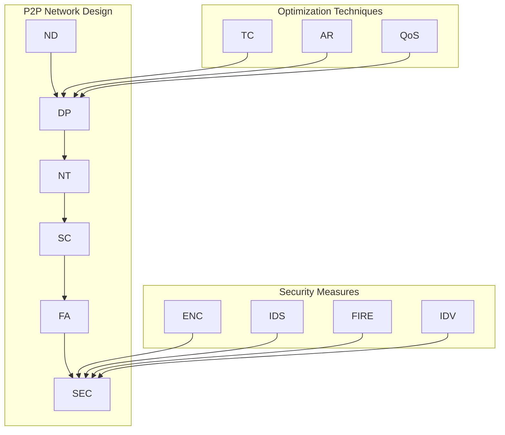

**Key Insights:**

- **Misconception**: A simple direct connection between nodes is sufficient for a robust P2P network. Reality: Effective P2P networks require sophisticated node discovery, data propagation, and network topology management to handle dynamic and adversarial environments.
- **Failure Path**: Inefficient data propagation can lead to network forks, delayed transaction finality, or even denial-of-service if nodes are overwhelmed with unoptimized data transfers. Sybil attacks can also compromise consensus mechanisms and overall network integrity.
- **Trade-offs**: Enhancing network privacy (e.g., through onion routing) can introduce latency, while aggressive data compression might require more computational power from nodes, necessitating a balance between privacy, performance, and resource utilization.

---

#### Q5: Modular blockchain architectures and Layer 2 scaling solutions

**Difficulty: Advanced | Type: Theoretical/Practical**

Modular blockchain architectures fundamentally redefine how blockchains are designed, moving away from monolithic structures that combine all functionalities into a single layer. Instead, modular blockchains decouple core functions—such as consensus, execution, and data availability—into distinct, specialized layers. This separation allows each layer to be optimized independently for its specific task, enhancing overall scalability, flexibility, and efficiency. For instance, a data availability layer can focus solely on ensuring transaction data is accessible, while a separate execution layer processes smart contract logic. This architectural shift addresses the limitations of monolithic chains which often struggle with the blockchain trilemma, where optimizing one aspect (e.g., scalability) compromises another (e.g., decentralization).

Layer 2 scaling solutions are complementary to modular architectures, built atop a base blockchain (Layer 1) to enhance throughput and reduce transaction costs without sacrificing the Layer 1's security. Key Layer 2 approaches include rollups (Optimistic and Zero-Knowledge), state channels, and sidechains. **Optimistic Rollups** assume transactions are valid by default but allow a dispute period where fraud proofs can be submitted if an invalid state transition occurs. **ZK-Rollups** use zero-knowledge proofs (ZKPs) to cryptographically prove the validity of off-chain transactions to the Layer 1, offering instant finality and stronger security guarantees. **State Channels** facilitate off-chain transactions between specific parties, only settling the final state on Layer 1. **Sidechains** are independent blockchains with their own consensus mechanisms, connected to the main chain via two-way pegs.

The integration of these solutions with modular designs provides immense flexibility. For example, a modular execution layer could support multiple rollup solutions simultaneously, allowing developers to choose the best fit for their dApps based on specific needs like privacy or speed. This approach not only boosts transaction capacity significantly but also enables specialized blockchain environments tailored for different use cases, such as high-frequency trading or complex DeFi protocols.

**Supporting Artifacts:**

| Feature            | Monolithic Blockchain             | Modular Blockchain                   | Layer 2 Scaling Solution (General)        |
|--------------------|-----------------------------------|--------------------------------------|-------------------------------------------|
| **Architecture**   | All functions on single layer     | Decoupled layers (consensus, execution) | Off-chain processing, on-chain settlement |
| **Scalability**    | Limited (e.g., Ethereum L1) | High (independent layer scaling) | Very High (off-chain throughput) |
| **Flexibility**    | Low (hard to upgrade components)  | High (swappable components) | High (diverse solutions per use case)     |
| **Security**       | Inherited from L1, shared risk    | Isolated risk per layer    | Inherits L1 security, but adds complexity |
| **Use Cases**      | General purpose                  | Specialized L2s, custom blockchains | High-throughput dApps, microtransactions |

**Key Insights:**

- **Misconception**: Layer 2 solutions replace the need for Layer 1 blockchains. Reality: Layer 2s derive their security from the underlying Layer 1, leveraging its consensus and data availability for final settlement.
- **Failure Path**: Poor data availability on Layer 2 can lead to data loss or inability to reconstruct the state, compromising the integrity of off-chain transactions.
- **Trade-offs**: ZK-Rollups offer strong security and instant finality but come with high computational costs for proof generation, whereas Optimistic Rollups have lower proof generation costs but introduce withdrawal delays due to the challenge period.

---

#### Q6: Cross-chain interoperability protocols (HTLC, relay chains, bridges)

**Difficulty: Advanced | Type: Theoretical/Practical**

Cross-chain interoperability protocols are essential for enabling seamless communication and asset transfer between disparate blockchain networks, addressing the "walled garden" problem of isolated blockchains. The ability to exchange data and value across different chains is crucial for the growth of the Web3 ecosystem, fostering liquidity and composability across diverse applications. Three primary mechanisms facilitate cross-chain interoperability: Hash Time-Locked Contracts (HTLCs), relay chains, and bridges.

**Hash Time-Locked Contracts (HTLCs)** provide a mechanism for atomic swaps, allowing two parties to exchange cryptocurrencies from different blockchains directly, without the need for a trusted third party. An HTLC involves setting up two transactions that are dependent on a secret hash and a time lock. If one party reveals the secret within the time limit, the other party can claim their funds, ensuring either both transactions complete or neither does, preventing partial exchanges. HTLCs are secure but are typically limited to direct peer-to-peer asset swaps and do not facilitate complex cross-chain logic or general message passing.

**Relay Chains**, exemplified by Polkadot, act as a central hub that connects multiple parachains (sovereign blockchains). The relay chain validates the state transitions of connected parachains, ensuring shared security and enabling trustless communication between them. This architecture allows for specialized blockchains to interact and share information, supporting complex multi-chain applications. Relay chains offer a high degree of security and shared governance but can be complex to implement and maintain.

**Bridges** are the most common and versatile form of interoperability, connecting two distinct blockchains to facilitate asset and data transfer. Bridges can be centralized, relying on a trusted third party (custodian) to lock assets on one chain and mint wrapped versions on another, or decentralized, utilizing smart contracts and validators to verify cross-chain events. While bridges greatly enhance liquidity and application reach, they are also a significant security vulnerability, having been the target of numerous high-profile hacks due to vulnerabilities in their smart contracts or validator mechanisms. Therefore, robust security audits and continuous monitoring are paramount for bridge implementations.

**Supporting Artifacts:**

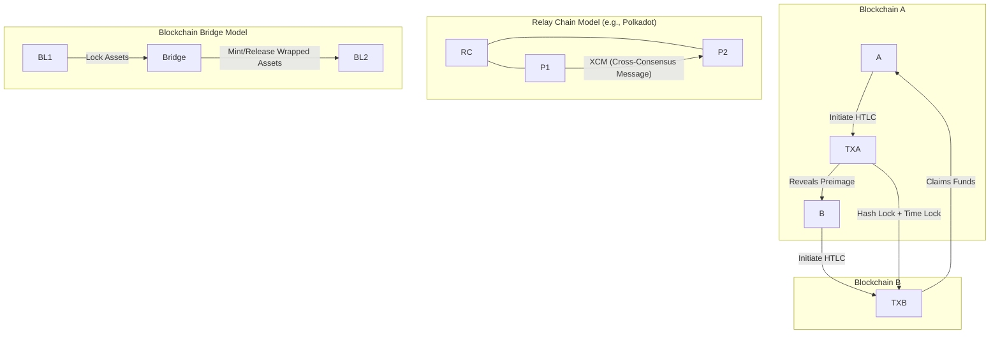

**Key Insights:**

- **Misconception**: Cross-chain solutions automatically make all blockchains universally compatible. Reality: Interoperability often involves trade-offs and can introduce new security risks, requiring careful design and implementation.
- **Failure Path**: Bridges are a common target for exploits due to complex smart contracts and the need to manage assets across multiple chains, often leading to significant financial losses if vulnerabilities are found.
- **Trade-offs**: HTLCs are highly secure but limited in functionality, primarily for atomic swaps. Relay chains offer shared security and complex interactions but are typically part of a specific ecosystem. Bridges are versatile but often introduce trusted third parties or complex smart contract risks.

---

### Topic 2: Blockchain Product Development & Lifecycle Management

#### Q7: Leading full lifecycle development of Web3 applications (DApps, DeFi, NFTs)

**Difficulty: Advanced | Type: Practical**

Leading the full lifecycle development of Web3 applications, encompassing DApps, DeFi, and NFTs, requires a comprehensive approach from conceptualization to post-deployment maintenance and community engagement. The process begins with **Conceptualization**, where the core problem is identified, market research is conducted, and the project's goals are clearly defined, deciding whether a public or private blockchain is appropriate. This phase involves brainstorming ideas and outlining the scope of the decentralized application.

Next is **Design and Architecture**, where the blockchain architecture is planned, including platform selection (e.g., Ethereum, Solana), consensus mechanism, and data structure for transactions. For Web3, this involves designing smart contracts, choosing appropriate Layer 2 solutions for scalability, and planning for front-end and back-end integration.

The **Development** phase involves coding smart contracts, implementing the chosen consensus algorithm, and creating user interfaces for interaction. For DeFi, this means developing protocols for lending, borrowing, or decentralized exchanges. For NFTs, it entails creating token standards (e.g., ERC-721) and marketplace functionalities. Crucially, **Testing** is integrated throughout, including unit testing, integration testing, performance testing, and rigorous security audits to identify and fix bugs or vulnerabilities before deployment.

**Deployment** involves setting up nodes and launching the application in a live environment. Post-deployment, **Maintenance and Updates** are continuous, involving monitoring performance, addressing issues, and implementing upgrades. **Community Engagement** is vital for Web3, fostering user feedback and iterating on the application based on community needs and market trends. This full lifecycle requires balancing innovation with security, scalability, and a deep understanding of the decentralized ethos.

**Supporting Artifacts:**

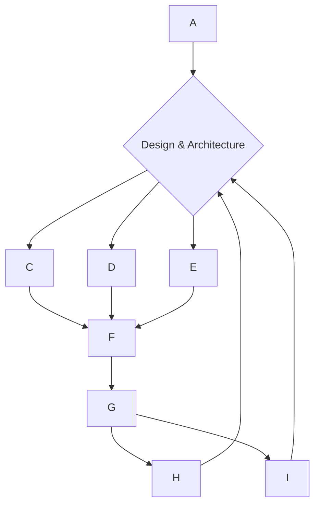

**Key Insights:**

- **Misconception**: Web3 development is just like traditional software development, but on a blockchain. Reality: Web3 introduces unique challenges around decentralization, immutability, consensus mechanisms, and user sovereignty, requiring a different mindset and toolset.
- **Failure Path**: Neglecting rigorous security audits, especially for smart contracts, is a common failure point that can lead to catastrophic financial losses due to vulnerabilities like re-entrancy or access control flaws.
- **Trade-offs**: Balancing decentralization with user experience can be challenging, as truly decentralized solutions may require users to manage private keys and confront higher transaction fees or slower confirmations, impacting usability.

---

#### Q8: Architectural considerations and security models for cryptographic wallets (HD, multi-signature, MPC)

**Difficulty: Advanced | Type: Practical**

Designing cryptographic wallets requires meticulous architectural considerations and robust security models to protect digital assets, which are particularly vulnerable due to the irreversible nature of blockchain transactions. Three prominent wallet types—Hierarchical Deterministic (HD), Multi-signature (Multi-sig), and Multi-Party Computation (MPC)—each offer distinct security and usability trade-offs.

**HD (Hierarchical Deterministic) Wallets** streamline key management by generating an entire tree of public/private key pairs from a single seed phrase. This architecture simplifies backups and recovery, as users only need to secure one seed phrase to restore all their addresses and funds. Security relies heavily on the protection of this seed phrase, which must be stored offline and securely. The primary vulnerability is the single point of failure if the seed is compromised.

**Multi-signature (Multi-sig) Wallets** enhance security by requiring multiple private keys to authorize a transaction, typically in an "M-of-N" configuration (e.g., 2-of-3). This distributes control and mitigates the risk of a single compromised key, insider threat, or device loss. For example, a 2-of-3 setup allows funds to be recovered even if one key is lost. Multi-sig wallets are ideal for organizational treasury management or shared accounts, offering a balance of security and redundancy. However, they add operational complexity, as coordinating multiple key holders for every transaction can be cumbersome.

**MPC (Multi-Party Computation) Wallets** represent a cutting-edge approach that fundamentally changes how private keys are handled. Instead of a single key or multiple keys, MPC technology splits a private key into several "shares" distributed among multiple parties. Transactions are signed through a collaborative process where each party uses their share to compute a valid signature without ever reconstructing the full private key in one place. This eliminates the single point of failure inherent in HD wallets and enhances security beyond traditional multi-sig by preventing any single party from ever possessing the complete key, thereby reducing the attack surface significantly. MPC wallets offer a strong balance of security and efficiency, suitable for institutional custody and high-value transactions, though they are cryptographically complex to implement.

**Supporting Artifacts:**

| Wallet Type          | Key Management                               | Security Model                                   | Usability/Complexity           | Ideal Use Case                               |
|----------------------|----------------------------------------------|--------------------------------------------------|--------------------------------|----------------------------------------------|
| **HD Wallet**        | Single seed phrase generates all keys | Single point of failure (seed phrase) | High usability (easy backup/recovery) | Individual users, personal holdings           |
| **Multi-sig Wallet** | M-of-N private keys for transaction | Distributed control, eliminates single key risk | Moderate (coordination needed) | Organizations, joint accounts, treasury |
| **MPC Wallet**       | Private key shares, never fully assembled | No single point of compromise, enhanced security | Moderate (cryptographic complexity) | Institutional custody, high-value transactions |

**Key Insights:**

- **Misconception**: All wallets are equally secure; the choice is only about interface. Reality: Different wallet types employ fundamentally different security architectures with varying levels of risk and control.
- **Failure Path**: For HD wallets, losing or compromising the single seed phrase results in irreversible loss of all assets. For multi-sig, collusion among enough key holders can lead to theft.
- **Trade-offs**: While HD wallets offer high convenience, multi-sig and MPC wallets significantly enhance security and fault tolerance at the cost of increased operational complexity and potentially higher transaction fees.

---

#### Q9: Building and deploying cross-chain trading platforms

**Difficulty: Advanced | Type: Practical**

Building and deploying cross-chain trading platforms involves addressing significant technical complexities related to interoperability, liquidity, and security across disparate blockchain networks. The primary objective is to enable users to trade assets between different blockchains seamlessly, such as exchanging an ERC-20 token on Ethereum for a BEP-20 token on Binance Smart Chain, without relying on a centralized intermediary for custody during the swap.

The architectural core typically involves **Atomic Swaps** facilitated by Hash Time-Locked Contracts (HTLCs) for direct peer-to-peer exchanges. HTLCs ensure that either both parties receive their intended assets or neither does, preventing loss of funds in case of one party's failure or malicious behavior. However, HTLCs are limited to specific asset pairs and do not support complex contract logic. For more generalized asset and data transfers, **Blockchain Bridges** are employed. These bridges can be either trusted (custodial) or trustless (non-custodial). Trustless bridges, often powered by smart contracts and a network of validators or relayers, are preferred for decentralized platforms as they inherit the security model of the underlying blockchains. However, bridges are frequent targets for exploits due to their complex logic and the large amounts of locked liquidity, making robust security audits and continuous monitoring crucial.

**Relay Chain Architectures**, like Polkadot's, provide another robust solution by acting as a central hub that connects and secures multiple specialized parachains, enabling native cross-chain communication and shared security. This approach can facilitate more complex interactions beyond simple asset transfers, such as cross-chain smart contract calls. Liquidity management across chains is a key challenge, often requiring liquidity pools on each connected chain or novel mechanisms like unified liquidity aggregation. Regulatory compliance for cross-chain transactions is also evolving, requiring platforms to integrate KYC/AML measures, especially for fiat-to-crypto gateways or interaction with regulated assets.

**Supporting Artifacts:**

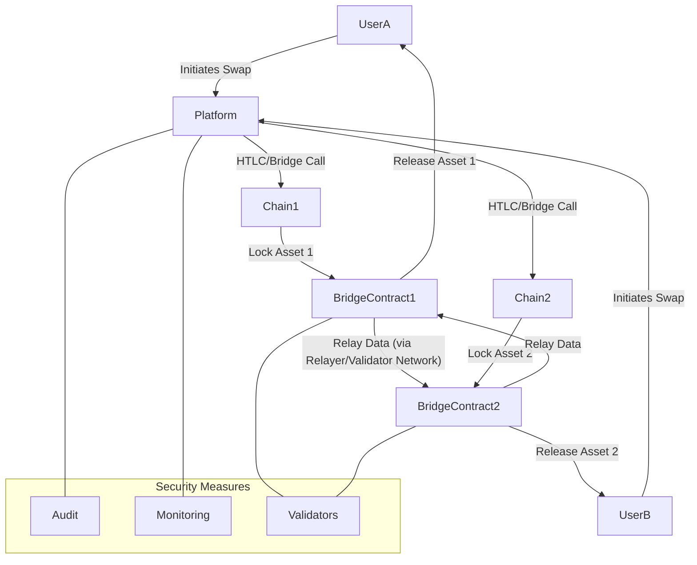

**Key Insights:**

- **Misconception**: Cross-chain trading inherently means all assets are fungible and easily transferable. Reality: Different chains have different token standards and consensus rules, requiring conversion, wrapping, or specific protocols to enable transfer.
- **Failure Path**: Bridge exploits represent a major failure point in cross-chain systems, often resulting from vulnerabilities in smart contract logic, compromised validator sets, or economic attacks on underlying liquidity pools.
- **Trade-offs**: Atomic swaps (HTLCs) are secure and trustless but limited in scope. Bridges offer broader functionality but often introduce centralized points of failure or smart contract risk. Relay chains provide shared security but require participation within a specific ecosystem.

---

#### Q10: Design and implementation of centralized and decentralized exchange core modules

**Difficulty: Advanced | Type: Practical**

Designing and implementing core modules for both Centralized Exchanges (CEX) and Decentralized Exchanges (DEX) requires a deep understanding of their architectural differences, operational models, and inherent trade-offs in terms of speed, security, and custody. The key modules include order matching engines, asset custody solutions, and clearing & settlement systems.

**Centralized Exchanges (CEX):** CEXs typically operate off-chain, leveraging a traditional database infrastructure for order books and matching. Their **order matching engine** is a high-performance, low-latency system that processes millions of orders per second using algorithms like price-time priority. These engines are designed for speed and efficiency, supporting various order types (market, limit, stop-loss) and ensuring deep liquidity. **Asset custody** in a CEX is centralized, meaning the exchange holds users' private keys and controls their funds in a combination of hot (online) and cold (offline) wallets. This model offers convenience but introduces counterparty risk; users must trust the exchange to secure their assets. **Clearing and settlement** occur instantly off-chain within the exchange's internal ledger, allowing for rapid trading and high-frequency strategies. Security measures focus on protecting centralized databases, cold storage solutions, and robust cybersecurity protocols against external and internal threats.

**Decentralized Exchanges (DEX):** DEXs operate on-chain via smart contracts, enabling peer-to-peer trading without an intermediary holding funds. The **order matching engine** can be implemented as an on-chain order book, but this is less common due to high gas costs and latency. More frequently, DEXs utilize **Automated Market Makers (AMMs)**, where liquidity is provided by users in liquidity pools, and asset prices are determined by algorithms based on the ratio of assets in the pool. **Asset custody** remains with the user, who interacts directly with smart contracts from their own non-custodial wallet (e.g., MetaMask). This eliminates counterparty risk but places the onus of key management entirely on the user. **Clearing and settlement** are executed transparently on the blockchain itself, with finality guaranteed by the underlying protocol's consensus mechanism. Security is primarily focused on the integrity of the smart contracts, necessitating rigorous audits to prevent vulnerabilities.

**Supporting Artifacts:**

| Feature               | Centralized Exchange (CEX)                     | Decentralized Exchange (DEX)                          |
|-----------------------|------------------------------------------------|-------------------------------------------------------|
| **Architecture**      | Off-chain, traditional database-driven | On-chain, smart contract-driven           |
| **Order Matching**    | High-speed, low-latency engine (e.g., price-time priority) | On-chain order book or Automated Market Makers (AMMs) |
| **Asset Custody**     | Centralized by exchange (hot/cold wallets) | Non-custodial, user holds private keys    |
| **Clearing/Settlement** | Instant, off-chain, internal ledger | On-chain, finality via blockchain consensus |
| **Speed/Throughput**  | Very High                                      | Lower (limited by blockchain latency/gas)           |
| **Security Risk**     | Exchange hack/custodial risk | Smart contract vulnerabilities       |
| **Regulatory Burden** | High (KYC/AML, licensing)             | Lower (but evolving for DeFi)               |

**Key Insights:**

- **Misconception**: DEXs are inherently superior because they are decentralized. Reality: DEXs offer trustlessness and user control but often sacrifice speed, liquidity, and user experience compared to CEXs.
- **Failure Path**: For CEXs, the primary failure path is a large-scale security breach leading to the theft of custodied assets. For DEXs, smart contract vulnerabilities can result in direct loss of funds from liquidity pools.
- **Trade-offs**: CEXs prioritize speed, liquidity, and advanced trading features at the cost of custodial risk. DEXs prioritize decentralization, user control, and censorship resistance, often trading off transaction speed and liquidity.

---

#### Q11: Cross-border payment and settlement blockchain solutions

**Difficulty: Advanced | Type: Practical**

Blockchain technology offers transformative solutions for cross-border payments and settlements by addressing the inefficiencies, high costs, and slow speeds inherent in traditional correspondent banking systems. Traditional cross-border transactions involve multiple intermediaries, leading to delays, opaque fees, and limited transparency. Blockchain-based solutions aim to streamline these processes by enabling direct, secure, and near real-time transfers between parties.

A common architecture for such solutions leverages private or consortium blockchains, where participating financial institutions or enterprises maintain nodes and collectively validate transactions. This permissioned environment ensures data privacy and compliance while benefiting from blockchain's immutable ledger and cryptographic security. For instance, JPMorgan's Onyx platform utilizes JPM Coin on a blockchain for instant settlements, processing billions in daily transactions and significantly reducing costs and settlement times.

Key components include:
- **Digital Currencies or Stablecoins**: These are often used as the medium of exchange to minimize foreign exchange volatility and facilitate instant value transfer. Fiat-backed stablecoins, whose value is pegged to traditional currencies, are particularly attractive for enterprise adoption due to their price stability.
- **Smart Contracts**: These automate payment execution upon predefined conditions, eliminating manual intervention and reducing errors. For example, a smart contract can release payment only after proof of delivery is recorded on the blockchain.
- **Interoperability**: Solutions must integrate with legacy banking systems and potentially other blockchain networks. APIs and middleware facilitate this integration, ensuring smooth data flow between on-chain and off-chain environments.
- **Regulatory Compliance**: Adherence to Anti-Money Laundering (AML) and Know Your Customer (KYC) regulations is critical. Blockchain solutions can embed compliance features, such as transaction monitoring and identity verification, while maintaining data privacy through techniques like zero-knowledge proofs. Hong Kong, for example, is actively developing regulatory frameworks for virtual assets and cross-border payments, emphasizing robust compliance and transparency standards.

**Supporting Artifacts:**

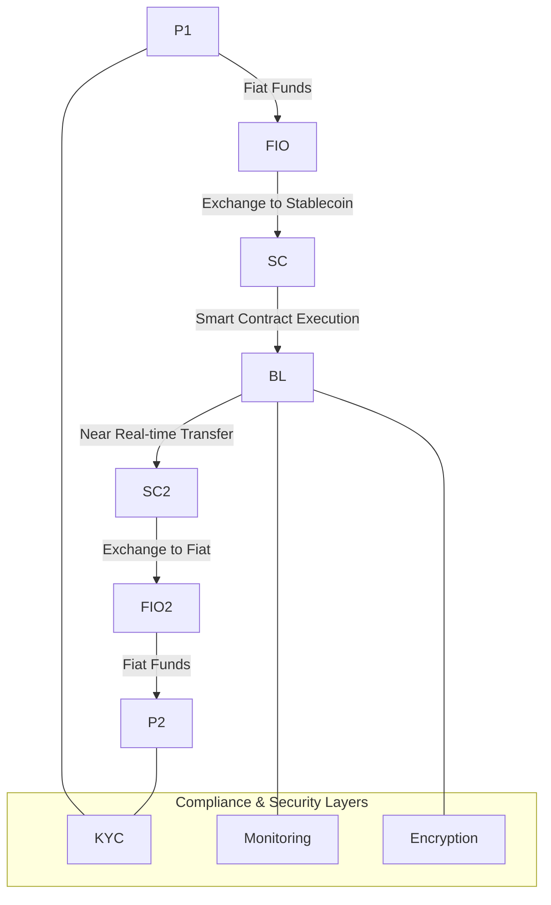

**Key Insights:**

- **Misconception**: Blockchain immediately solves all regulatory and compliance hurdles for cross-border payments. Reality: While blockchain enhances transparency, regulatory uncertainty and varying international laws remain significant challenges that require careful navigation and compliance integration.
- **Failure Path**: A lack of regulatory clarity and integration with existing financial infrastructures can impede adoption and lead to legal challenges, as seen in some early blockchain payment initiatives.
- **Trade-offs**: Private/consortium blockchains offer better privacy and control for institutions but sacrifice the decentralization and openness of public chains. Public blockchain-based solutions might face higher transaction fees and regulatory scrutiny for sensitive data.

---

### Topic 3: Security & Auditing in Blockchain Systems

#### Q12: Smart contract security best practices and vulnerability mitigation

**Difficulty: Advanced | Type: Practical**

Smart contract security is paramount in blockchain ecosystems, as vulnerabilities can lead to irreversible financial losses due to the immutable nature of deployed code. Adhering to best practices throughout the development lifecycle is crucial for mitigating risks. First, **rigorous code audits** by independent security firms are essential before deployment, involving both automated static analysis tools and manual expert review. Tools like MythX and Slither help identify common vulnerabilities. Second, **formal verification** methods should be applied to mathematically prove the correctness of critical contract logic, ensuring it behaves as intended under all conditions.

Third, developers must follow **secure coding practices**, minimizing contract complexity, and adopting well-tested, open-source libraries like OpenZeppelin Contracts, which are known for their audited security patterns. Avoid common anti-patterns like unchecked external calls that can lead to reentrancy attacks. Fourth, **access control mechanisms** must be carefully implemented, restricting sensitive functions to authorized addresses or roles through modifiers like `onlyOwner` or role-based access control (RBAC). Fifth, integrate **time-locks** for critical operations, allowing a delay period before execution, which provides a window for intervention if a vulnerability is discovered post-deployment or if keys are compromised.

Finally, **continuous monitoring and threat intelligence** are vital post-deployment. Platforms like Tenderly and OpenZeppelin Defender provide real-time insights into contract behavior, transaction states, and alerts for suspicious activities, enabling rapid response to potential exploits. Organizations also need to have **upgrade mechanisms** for contracts, typically through proxy patterns, to patch discovered vulnerabilities without losing state or disrupting user interaction.

**Supporting Artifacts:**
```solidity
pragma solidity ^0.8.0;

import "@openzeppelin/contracts/access/Ownable.sol"; // Using OpenZeppelin for secure Ownable pattern

contract SecurePaymentChannel is Ownable {
    mapping(address => uint256) public balances;
    uint256 public constant LOCKUP_PERIOD = 7 days; // Example time-lock
    uint256 public lastWithdrawalTime;

    event FundsDeposited(address indexed user, uint256 amount);
    event FundsWithdrawn(address indexed user, uint256 amount);

    constructor() {
        lastWithdrawalTime = block.timestamp;
    }

    // Best Practice: Reentrancy Guard (implicit with nonReentrant in more complex contracts)
    // For this simple example, direct transfers are safer.
    function deposit() public payable {
        require(msg.value > 0, "Deposit amount must be greater than zero.");
        balances += msg.value; // Corrected: use msg.sender
        emit FundsDeposited(msg.sender, msg.value);
    }

    // Mitigation: Check-Effects-Interactions Pattern
    // Ensure all internal state changes (effects) occur before external calls (interactions).
    function withdraw(uint256 amount) public {
        // Best Practice: Access Control (only the owner can withdraw or for specific conditions)
        require(msg.sender == owner(), "Only owner can initiate withdrawal for now.");
        require(balances >= amount, "Insufficient balance."); // Corrected: use msg.sender
        require(block.timestamp >= lastWithdrawalTime + LOCKUP_PERIOD, "Withdrawal is timelocked.");

        // Effects
        balances -= amount; // Corrected: use msg.sender
        lastWithdrawalTime = block.timestamp;

        // Interaction (external call)
        (bool success, ) = msg.sender.call{value: amount}("");
        require(success, "Failed to send Ether.");
        emit FundsWithdrawn(msg.sender, amount);
    }

    // Function to update the lockup period, only callable by owner (access control)
    function setLockupPeriod(uint256 newPeriod) public onlyOwner {
        // Implement further checks to ensure newPeriod is reasonable.
        // For example: require(newPeriod > 0);
        LOCKUP_PERIOD = newPeriod; // Note: In Solidity, constant variables cannot be changed after deployment. This would need to be a state variable.
    }
}
```

**Key Insights:**

- **Misconception**: Smart contracts are inherently secure because they run on a blockchain. Reality: Smart contracts are susceptible to coding errors, logic flaws, and vulnerabilities that can be exploited for significant financial loss.
- **Failure Path**: Neglecting rigorous security audits, particularly manual code reviews for subtle logic errors, is a common failure path that can lead to catastrophic exploits like reentrancy attacks or unauthorized access.
- **Trade-offs**: Implementing extensive security measures such as formal verification or using complex access control patterns can increase development time and gas costs, requiring a balance between absolute security and operational efficiency.

---

#### Q13: Methodologies for conducting comprehensive blockchain security audits

**Difficulty: Advanced | Type: Practical**

Conducting comprehensive blockchain security audits is an indispensable process for identifying vulnerabilities and ensuring the integrity of smart contracts and underlying blockchain infrastructure. A multi-faceted approach combining both automated and manual analysis is crucial to achieve high assurance. The audit lifecycle typically begins with a **Pre-Audit Phase**, where the codebase is frozen, and comprehensive documentation (whitepapers, architectural diagrams, test cases) is provided to the auditors. The scope of the audit, including specific contracts, files, and components, is clearly defined to set expectations and manage timelines.

Following this, **Threat Modeling** is performed to systematically identify potential attack surfaces, such as insiders, bots, or external hackers, and their motivations. This step helps to prioritize high-risk areas, considering specific interactions like token swaps, governance voting, or cross-chain bridges. The core of the audit involves both **Manual Review and Automated Tooling**. Automated static analysis tools like Slither, MythX, and Securify are employed to quickly detect known vulnerability patterns such as integer overflows, unchecked call returns, or reentrancy bugs. Symbolic execution tools (e.g., Mythril) and fuzzing tools (e.g., Echidna) perform deeper program state exploration and invariant testing to uncover more subtle issues. Manual review by experienced security engineers is critical for analyzing logical flow, function interactions, edge cases, and business logic flaws that automated tools often miss.

**Unit and Integration Testing** involves running targeted test suites to simulate real-world attack scenarios and observe contract behavior during failures (e.g., unexpected reverts, flash loan attacks). All findings are compiled into a detailed **Report**, categorizing issues by severity (critical, high, medium, low, informational) and providing actionable recommendations with code snippets for remediation. After developers apply patches, a **Re-audit** is strongly advised to confirm fixes and ensure no new bugs were introduced. Leading audit firms like CertiK, OpenZeppelin, Quantstamp, Halborn, and Trail of Bits combine these methods, often integrating AI-driven analysis and formal verification, to deliver comprehensive security assessments. Post-audit, continuous monitoring, and bug bounty programs are recommended to maintain an agile security posture.

**Supporting Artifacts:**

| Audit Phase             | Description                                                   | Key Activities                                                               | Tools/Techniques                                                       |
|-------------------------|---------------------------------------------------------------|------------------------------------------------------------------------------|------------------------------------------------------------------------|
| **1. Pre-Audit**        | Preparation and scope definition                              | Code freeze, documentation review, scope negotiation                     | Whitepapers, Architectural diagrams, Test plans, Communication tools   |
| **2. Threat Modeling**  | Identify potential attack vectors and adversaries             | Asset identification, attacker profiling, risk prioritization                | STRIDE, DREAD, industry best practices                                 |
| **3. Automated Analysis** | Initial scan for common vulnerabilities                   | Static analysis, symbolic execution, fuzzing                                 | Slither, MythX, Mythril, Echidna, Securify                               |
| **4. Manual Review**    | Deep dive into business logic and custom code                 | Line-by-line code review, logic flow analysis, pattern identification        | Expert auditors, domain knowledge, secure coding standards             |
| **5. Testing/Simulation** | Validate contract behavior under various conditions           | Unit tests, integration tests, testnet deployment, sandbox simulations      | Hardhat, Foundry, Ganache, custom test scripts                         |
| **6. Reporting**        | Document findings, severity, and remediation                  | Detailed vulnerability descriptions, risk ratings, recommendations            | Standardized report templates (PDF, Markdown), issue tracking systems  |
| **7. Remediation/Re-audit** | Verify fixes and ensure no new issues introduced          | Patch implementation, re-testing, final verification of fixes                | Version control systems, regression tests, follow-up manual review     |
| **8. Post-Audit**       | Continuous security posture maintenance                     | Real-time monitoring, bug bounty programs, incident response planning      | Forta, Tenderly, Immunefi, HackenProof, security operations centers    |

**Key Insights:**

- **Misconception**: Automated tools alone can catch all smart contract vulnerabilities. Reality: Automated tools are effective for known patterns but often miss complex logical flaws and business logic vulnerabilities that require expert manual review.
- **Failure Path**: Skipping the manual review phase in an audit or relying solely on automated tools can lead to subtle yet critical vulnerabilities being overlooked, resulting in devastating exploits post-deployment.
- **Trade-offs**: Comprehensive audits, while crucial, can be time-consuming and expensive. Balancing the depth of analysis with project timelines and budget often leads to phased audits or prioritizing critical modules for the most rigorous checks.

---

#### Q14: Common smart contract vulnerabilities and defense patterns (re-entrancy, overflow, front-running)

**Difficulty: Advanced | Type: Theoretical/Practical**

Smart contracts are highly susceptible to specific vulnerabilities that, if exploited, can lead to significant financial losses and erode trust in decentralized applications. Understanding these common pitfalls and their respective defense patterns is critical for secure development.

**Re-entrancy Attacks** occur when a contract makes an external call to another contract before updating its internal state, allowing the called contract to recursively call back and drain funds or execute malicious logic multiple times. The infamous DAO hack in 2016, which resulted in the loss of $60 million worth of Ether, is the most prominent example. **Defense patterns** against re-entrancy primarily involve the "checks-effects-interactions" pattern, where all state changes are completed before any external calls are made. Additionally, re-entrancy guards (e.g., from OpenZeppelin) can be used to lock a function, preventing multiple simultaneous executions.

**Integer Overflows/Underflows** arise when arithmetic operations exceed the maximum or fall below the minimum value that a data type can store. For example, `uint256` can store values up to \\(2^{256} - 1\\). If an addition results in a value greater than this, it "wraps around" to zero (overflow), and similarly for underflow. This can lead to incorrect calculations, unintended fund transfers, or manipulation of balances. **Defense patterns** include using Solidity version 0.8.0 or later, which by default reverts on overflows/underflows. For earlier versions or custom logic, libraries like SafeMath (or equivalent logic) should be employed to provide checked arithmetic operations.

**Front-running Attacks** occur when an attacker observes a pending transaction in the mempool (the pool of unconfirmed transactions) and submits their own transaction with a higher gas price to ensure it is processed before the target transaction. This is particularly prevalent in Decentralized Finance (DeFi) for actions like large trades on DEXs, liquidations, or oracle updates, where knowing the outcome of an incoming transaction allows profitable manipulation. **Defense patterns** are more complex as they often involve architectural design choices. Strategies include using commit-reveal schemes, where users commit to a transaction's parameters without revealing them and then reveal them later; batching transactions; or using private transaction relays to hide transactions from the public mempool before they are confirmed.

Other common vulnerabilities include **Access Control Issues**, where sensitive functions are inadequately protected, allowing unauthorized users to execute privileged operations; **Logic Flaws**, which are errors in the contract's business logic; **Unchecked Return Values** from external calls; and **Improper Oracle Usage**, relying on manipulable or unreliable off-chain data feeds. Mitigating these often involves rigorous testing, adhering to secure coding standards, and thorough security audits.

**Supporting Artifacts:**

| Vulnerability Type      | Description                                                                     | Example Exploit / Impact                                            | Defense Pattern / Mitigation                                         |
|-------------------------|---------------------------------------------------------------------------------|---------------------------------------------------------------------|----------------------------------------------------------------------|
| **Re-entrancy**         | External call before state update allows recursive calls          | The DAO hack (2016): ~\\$60M drained                             | Checks-Effects-Interactions pattern, ReentrancyGuard       |
| **Integer Over/Underflow** | Arithmetic operations exceed data type limits                          | Incorrect balances, unexpected token minting/burning                     | Solidity >=0.8.0, SafeMath library for older versions     |
| **Front-running**       | Attacker sees pending transaction, submits higher-gas transaction to pre-empt | DEX arbitrage, liquidation manipulation, oracle manipulation | Commit-reveal schemes, private transaction relays, batching |
| **Access Control Issues** | Sensitive functions callable by unauthorized parties                  | Unauthorized fund transfers, contract parameter changes, owner takeover | `onlyOwner` modifier, Role-Based Access Control (RBAC)       |
| **Unchecked Return Values** | Failure to validate success of external calls (e.g., `call()`)        | Failed token transfers, unexpected state, unhandled errors                 | Always check boolean return values from external calls     |
| **Improper Oracle Usage** | Reliance on manipulable or unverified off-chain data                  | Price manipulation, incorrect asset valuations in DeFi         | Decentralized or aggregated oracles (e.g., Chainlink), fallback checks |

**Key Insights:**

- **Misconception**: Fixing one vulnerability (e.g., re-entrancy) makes a contract secure. Reality: Smart contracts often have multiple, interconnected vulnerabilities, and a holistic security approach is necessary.
- **Failure Path**: Copy-pasting code snippets without understanding their security implications or context-specific vulnerabilities can introduce new attack vectors.
- **Trade-offs**: Some defense mechanisms, like commit-reveal schemes for front-running, can add complexity to user experience or transaction latency, requiring careful design choices.

---

#### Q15: Cryptographic key management and secure wallet implementation

**Difficulty: Advanced | Type: Practical**

Cryptographic key management and secure wallet implementation are foundational pillars for safeguarding digital assets in blockchain systems, particularly critical for production-grade deployments. Effective strategies focus on minimizing attack surfaces, ensuring key isolation, and providing robust recovery mechanisms. Three prominent wallet types \u2013 Hardware Wallets, Multi-signature (Multi-sig) Wallets, and Multi-Party Computation (MPC) Wallets \u2013 each offer distinct security and operational models.

**Hardware Wallets** represent a gold standard for individual and institutional security by storing private keys in a physically isolated, tamper-resistant environment. These devices sign transactions internally, exposing only the signed output to potentially compromised computers or networks, thereby mitigating risks from malware, phishing, and keyloggers. Production-grade deployments often involve robust hardware security modules (HSMs) for key generation and storage, ensuring cryptographic operations are performed within a protected boundary.

**Multi-signature (Multi-sig) Wallets** enhance security by requiring a predefined number of private keys (M-of-N) to authorize a transaction. This distributes control, effectively reducing the single point of failure inherent in single-key wallets. For enterprise use cases like treasury management or decentralized autonomous organizations (DAOs), multi-sig smart contracts from audited libraries (e.g., Gnosis Safe) are deployed, offering customizable M-of-N schemes. This setup is crucial for mitigating insider threats, lost keys, or compromised devices by mandating collective authorization for high-value transactions.

**Multi-Party Computation (MPC) Wallets** offer a cutting-edge solution by creating and signing transactions without ever assembling a complete private key in one location. Instead, the private key is mathematically split into multiple "shares," distributed among several parties. During a transaction, these parties collaboratively compute a signature using their respective shares, eliminating the single point of compromise found in both HD and traditional multi-sig wallets. MPC technology balances enhanced security with improved operational efficiency, making it increasingly popular for institutional custody, high-frequency trading, and compliant financial applications where flexibility and reduced latency are important.

For **production-grade deployments**, key lifecycle management is paramount, encompassing secure generation, storage, usage, rotation, backup, and eventual destruction of keys. This includes strong access control policies, such as role-based access control and time-locked mechanisms for critical operations. Continuous monitoring, anomaly detection, and well-defined incident response plans are essential to detect and react to any suspicious key usage or wallet compromise.

**Supporting Artifacts:**

| Wallet Type          | Key Storage & Control                             | Security Benefits                                 | Operational Considerations                            | Ideal Use Cases                                        |
|----------------------|---------------------------------------------------|---------------------------------------------------|-------------------------------------------------------|--------------------------------------------------------|
| **Hardware Wallet**  | Offline, isolated physical device         | Immune to online malware/phishing         | Physical security, backup of seed phrase              | Individual long-term storage, high-value personal assets |
| **Multi-sig Wallet** | Keys distributed among M-of-N parties     | Eliminates single point of failure (shared control) | Requires coordination among signers, on-chain costs     | Corporate treasuries, DAO governance, joint accounts   |
| **MPC Wallet**       | Key shares distributed, never fully formed | No single point of compromise, enhanced security | Cryptographic complexity, specialized infrastructure  | Institutional custody, high-volume transactions, advanced DeFi |
| **Software Wallet**  | Online (e.g., browser extension, mobile app)      | Convenient, easy access                           | Vulnerable to malware, phishing, system compromise    | Everyday transactions, small amounts, DApp interaction |

**Key Insights:**

- **Misconception**: Digital wallets are all equally secure; the difference is mostly in features. Reality: Wallet security varies drastically based on implementation, key management, and the underlying cryptographic architecture, directly impacting asset safety.
- **Failure Path**: Poor key hygiene, such as storing seed phrases digitally or using weak passwords, can lead to complete loss of funds across all wallet types. For multi-sig, insufficient M-of-N thresholds can still allow collusion or compromise by a small group.
- **Trade-offs**: While hardware and MPC wallets offer superior security, they can introduce increased cost and complexity, potentially impacting user experience or operational agility compared to simpler software wallets.

---

#### Q16: Security architectures for blockchain infrastructure, including system and network layers

**Difficulty: Advanced | Type: Theoretical/Practical**

A robust security architecture for blockchain infrastructure demands a multi-layered defense strategy that encompasses both system-level and network-level protections. This approach ensures comprehensive resilience against a wide array of cyber threats, from malicious code to sophisticated distributed denial-of-service (DDoS) attacks.

At the **system level**, node hardening is paramount. This involves securing individual blockchain nodes, which are critical components of the network. Key practices include deploying robust firewalls and intrusion detection/prevention systems (IDS/IPS) to monitor and control traffic flow. Regular patching and software updates are essential to mitigate known vulnerabilities in operating systems and blockchain client software. Strict key management policies, including hardware security modules (HSMs) for private key storage, are implemented to protect cryptographic assets from unauthorized access. Adhering to the principle of least privilege ensures that nodes and their processes only have the minimum necessary permissions to function, reducing the impact of a compromise. Identity authentication mechanisms are also crucial to prevent Sybil attacks, where malicious actors create numerous fake identities to gain undue influence over the network.

For **network-level protections**, the decentralized peer-to-peer (P2P) communication protocols must be resilient and secure. **DDoS mitigation** is a major concern, as attackers can attempt to disrupt network services by overwhelming nodes with traffic. Strategies include rate limiting to prevent excessive requests from a single source, traffic filtering to block known malicious packets, and load balancing to distribute incoming requests across multiple nodes. Real-time network traffic monitoring and analysis are vital for detecting and responding to DDoS attacks promptly. For secure P2P communication, protocols should incorporate encryption (e.g., TLS 1.3) and authentication to prevent eavesdropping, data tampering, and impersonation. Frameworks like libp2p offer modular and secure communication channels, supporting decentralized node discovery and routing while resisting common network-level attacks. CrustChain, for instance, implements a DDoS-resilient FairSwap architecture capable of withstanding significant attack volumes, highlighting the importance of integrated network defenses.

**Supporting Artifacts:**

| Security Layer      | Protection Mechanisms                                                | Key Technologies/Practices                                       | Common Threats Mitigated                                     |
|---------------------|----------------------------------------------------------------------|------------------------------------------------------------------|--------------------------------------------------------------|
| **System Layer**    | Node Hardening, Access Control, Key Management, Identity Management  | Firewalls, IDS/IPS, OS/Software Patching, HSMs, Least Privilege | Malicious code, Unauthorized access, Node compromise, Insider threats |
| **Network Layer**   | DDoS Mitigation, Secure P2P Communication, Traffic Analysis          | Rate Limiting, Traffic Filtering, Load Balancing, TLS, libp2p | DDoS attacks, Sybil attacks, Eavesdropping, Data tampering  |
| **Consensus Layer** | Byzantine Fault Tolerance (BFT), Cryptographic Agility, Reputation Systems | PoS/PoW Variants, BLS Signatures, Dynamic Reputation Scoring | 51% attacks, Fork attacks, Block withholding, Double-spending |
| **Application Layer** | Smart Contract Audits, Secure Coding, Input Validation                 | Formal Verification, OpenZeppelin Libraries, Multi-sig | Re-entrancy, Over/Underflow, Logic flaws, Front-running |

**Key Insights:**

- **Misconception**: The decentralized nature of blockchain makes it inherently immune to all DoS attacks. Reality: While a complete denial of service is difficult, DoS attacks can degrade network performance, delay transactions, and impact service quality.
- **Failure Path**: Neglecting regular security updates and patches for node software leaves infrastructure vulnerable to known exploits, potentially leading to node compromise and network instability.
- **Trade-offs**: Implementing advanced network security measures (e.g., deep packet inspection for DDoS) can introduce latency and computational overhead, requiring a balance between security and network performance.

---

### Topic 4: Cutting-Edge Blockchain Technologies & Innovation

#### Q17: Application and implications of zero-knowledge proofs (ZK-SNARKs, ZK-STARKs) in blockchain

**Difficulty: Advanced | Type: Theoretical/Practical**

Zero-Knowledge Proofs (ZKPs) represent a revolutionary cryptographic primitive that allows one party (the prover) to convince another party (the verifier) that a statement is true, without revealing any information about the statement itself beyond its truthfulness. In blockchain, ZKPs, particularly zk-SNARKs (Zero-Knowledge Succinct Non-Interactive Arguments of Knowledge) and zk-STARKs (Zero-Knowledge Scalable Transparent Arguments of Knowledge), offer profound implications for enhancing privacy, scalability, and security.

For **scalability**, ZKPs enable Layer 2 solutions, primarily ZK-Rollups, to bundle hundreds or thousands of off-chain transactions into a single batch and then generate a cryptographic proof of their collective validity. This proof, significantly smaller than the raw transaction data, is then submitted to the Layer 1 blockchain for verification. This dramatically reduces the amount of data and computation required on the main chain, leading to substantial increases in transaction throughput and lower gas fees. Projects like zkSync leverage zk-SNARKs for this purpose, achieving high Transaction Per Second (TPS) rates and reduced costs for Ethereum transactions. StarkNet utilizes zk-STARKs to enable scalable, privacy-preserving smart contract execution off-chain, demonstrating a path to achieving orders of magnitude scalability improvements.

In terms of **privacy**, ZKPs allow users to prove ownership of assets, authenticate identity, or verify transaction conditions without revealing sensitive underlying data. For instance, a user could prove they are over 18 without disclosing their exact birthdate, or prove sufficient funds for a transaction without revealing their account balance. This is crucial for enterprise blockchain adoption where data confidentiality is paramount, enabling compliant use cases in industries like finance and healthcare.

For **security**, ZK-Rollups inherit the strong security guarantees of the underlying Layer 1 blockchain, as the validity of off-chain computation is cryptographically proven on-chain. Unlike Optimistic Rollups which rely on a challenge period, ZK-Rollups offer instant finality on Layer 1 because the validity proof is immediately verifiable.

**zk-SNARKs** are "succinct," meaning proofs are small and fast to verify, making them efficient for on-chain verification. However, they typically require a "trusted setup" phase, which is a one-time cryptographic ceremony to generate public parameters, raising concerns about initial trust. **zk-STARKs**, on the other hand, are "transparent" and do not require a trusted setup, offering greater decentralization and post-quantum resistance. They also offer better scalability for larger computations but produce larger proofs that are slower to verify on-chain compared to SNARKs.

**Supporting Artifacts:**

| ZKP Type       | Key Characteristics                                  | Scalability Impact                                    | Privacy Impact                                         | Security/Trust                                          |
|----------------|------------------------------------------------------|-------------------------------------------------------|--------------------------------------------------------|---------------------------------------------------------|
| **zk-SNARKs**  | Succinct proofs, fast verification, small size | High throughput, lower gas fees for L2s     | Selective disclosure of sensitive data      | Requires trusted setup, strong cryptographic security |
| **zk-STARKs**  | Scalable, transparent, no trusted setup    | Very high throughput for large computations | Enhanced privacy without revealing data      | Transparent, post-quantum resistant, larger proofs |

**Key Insights:**

- **Misconception**: ZKPs are only for privacy. Reality: While excellent for privacy, ZKPs' most immediate impact on blockchain is arguably their ability to dramatically scale transaction throughput through ZK-Rollups.
- **Failure Path**: Improperly designed ZKP circuits or flawed cryptographic implementations can lead to incorrect proofs or vulnerabilities that compromise the integrity of the underlying transactions, even if the ZKP itself is valid.
- **Trade-offs**: zk-SNARKs offer smaller proof sizes and faster verification but may involve a trusted setup, whereas zk-STARKs are transparent and scalable but typically produce larger proofs that are more computationally intensive to generate and verify.

---

#### Q18: Layer 2 innovations and trade-offs (Optimistic vs. ZK-Rollups, state channels, sidechains)

**Difficulty: Advanced | Type: Theoretical/Practical**

Layer 2 (L2) solutions are off-chain protocols built atop Layer 1 (L1) blockchains (like Ethereum) to enhance scalability and transaction throughput without compromising the security of the underlying L1. Each L2 innovation comes with distinct security models, performance trade-offs, and adoption signals, making the choice highly dependent on the application's specific requirements.

**Optimistic Rollups** (e.g., Arbitrum, Optimism) achieve scalability by optimistically assuming all off-chain transactions are valid. Transactions are bundled and posted to L1 without immediate validity proofs. Instead, a "challenge period" (typically 7 days) allows anyone to submit a "fraud proof" if they detect an invalid state transition. If a fraud proof is successful, the rollup state is reverted, and the malicious actor is penalized.
- **Trade-offs**: High compatibility with existing Ethereum Virtual Machine (EVM) code, lower computational cost for validation (since proofs are rare). However, they suffer from delayed finality (due to the challenge period) and potential capital lock-up during withdrawals.
- **Adoption**: High TVL (Total Value Locked) and user activity due to ease of development and EVM compatibility.

**ZK-Rollups** (e.g., zkSync, StarkNet, Scroll) bundle off-chain transactions and generate cryptographic zero-knowledge proofs (ZKPs) that attest to the validity of these transactions. This proof is then posted to the L1, where it is instantly verified.
- **Trade-offs**: Offer strong security guarantees and instant L1 finality because validity is cryptographically proven. However, they involve complex cryptography, are difficult and expensive to implement, and currently have less EVM compatibility than Optimistic Rollups.
- **Adoption**: Growing TVL, particularly in newer protocols like zkSync Era and Linea, driven by the demand for higher security and faster finality.

**State Channels** (e.g., Lightning Network for Bitcoin, Raiden Network for Ethereum) allow participants to conduct multiple transactions off-chain, only broadcasting the initial and final states to the L1. They require all participants to lock funds into a multi-signature contract and remain online to sign transactions.
- **Trade-offs**: Offer near-instant, extremely low-cost transactions and high throughput between participating parties. However, they have limited composability (transactions are usually only between participants), require participants to be online, and are less suitable for complex smart contract interactions.
- **Adoption**: Niche adoption for specific use cases like micropayments, gaming, and streaming.

**Sidechains** (e.g., Polygon PoS, Ronin) are independent blockchains with their own consensus mechanisms, connected to the L1 via a two-way peg. Assets are locked on the L1 and "minted" on the sidechain, and vice-versa.
- **Trade-offs**: Provide high throughput and low fees due to their independent operation. However, their security relies on their own validator set, which might be less decentralized or secure than the L1, introducing additional trust assumptions.
- **Adoption**: Broad adoption for dApps requiring high scalability and low fees, often used for games and DeFi applications with lower security requirements than core L1.

**Supporting Artifacts:**

| Feature            | Optimistic Rollups                                   | ZK-Rollups                                              | State Channels                                    | Sidechains                                      |
|--------------------|------------------------------------------------------|---------------------------------------------------------|---------------------------------------------------|-------------------------------------------------|
| **Security Model** | Assumed valid, fraud proofs via challenge period | Cryptographically proven valid via ZKPs       | Trust participants, L1 for dispute resolution | Own consensus, separate security from L1 |
| **L1 Finality**    | Delayed (challenge period, e.g., 7 days)   | Instant (proof verified on L1)                | Instant between participants, L1 for final state | Varies (sidechain's finality)                   |
| **Throughput**     | High                                                 | Very High                                               | Very High (between participants)           | High                                            |
| **Cost**           | Low (lower than L1, higher than ZKPs)                | Very Low (most efficient for L1 posting)      | Very Low (minimal on-chain cost)           | Low                                             |
| **EVM Comp.**      | High (easy to deploy existing dApps)       | Growing, but complex (requires specific toolchain) | Limited composability                             | High (many are EVM-compatible)                  |
| **Complexity**     | Moderate                                             | High (cryptographic implementation)           | Moderate (managing channel state)                 | Moderate (managing separate chain)              |
| **Example Projects** | Arbitrum, Optimism                         | zkSync, StarkNet, Scroll                      | Lightning Network, Raiden Network                 | Polygon PoS, Ronin                               |

**Key Insights:**

- **Misconception**: All Layer 2 solutions offer the same benefits and trade-offs. Reality: L2s vary significantly in their security assumptions, finality models, technical complexity, and suitability for different applications.
- **Failure Path**: Choosing an L2 solution without fully understanding its security model (e.g., relying on optimistic assumptions for high-value, instant-finality applications) can lead to significant financial risks during a dispute period or a successful fraud.
- **Trade-offs**: Optimistic Rollups offer ease of development and EVM compatibility but have delayed withdrawals, while ZK-Rollups provide instant finality and stronger security but are harder to implement. State channels are fast and cheap but limited in scope, and sidechains provide scalability but introduce independent security models.

---

#### Q19: Advances in modular and sharded blockchain designs

**Difficulty: Advanced | Type: Theoretical**

Advances in blockchain architecture are increasingly moving towards **modular and sharded designs**, fundamentally transforming how these distributed systems achieve scalability, security, and reliability. Traditional monolithic blockchains, which process all transactions and maintain the entire state on a single chain, often face performance bottlenecks and struggle to balance the blockchain trilemma. Modular and sharded designs aim to overcome these limitations by decoupling core functionalities and enabling parallel processing.

**Modular blockchain architectures** decompose the blockchain into specialized, interchangeable layers, each optimized for a specific function such as consensus, execution, data availability, and settlement. This separation allows individual layers to scale independently and evolve without affecting others, significantly increasing system flexibility and throughput. For example, a dedicated data availability layer ensures that all necessary transaction data is published and accessible, while an execution layer focuses solely on processing smart contract logic. This design choice allows for horizontal scalability by adding more execution layers or data shards, much like microservices in traditional software architecture.

**Sharding** is a specific form of modularity that partitions the blockchain's state and transaction processing load across multiple smaller, parallel chains or "shards". Instead of every node processing every transaction, nodes are assigned to specific shards, processing only a subset of the network's transactions. This parallelization dramatically increases the network's transaction throughput. Projects like Ethereum 2.0 (now the consensus layer of Ethereum) implement sharding to scale the network, where shard chains are coordinated by a central beacon chain that manages consensus and validators. Polkadot utilizes a similar model with a central Relay Chain providing shared security to numerous parachains, which act as application-specific shards. CrustChain employs MDP-optimized dynamic sharding that groups nodes by geolocation and latency to minimize cross-shard coordination overhead, achieving sub-second latency and high TPS.

The **impact on system security** is twofold: shared security models (like Polkadot's Relay Chain or Ethereum's Beacon Chain) ensure that all shards inherit the robust security of the main chain. However, sharding also introduces new security complexities, particularly concerning cross-shard communication atomicity and preventing attacks that target individual shards. Advanced mechanisms like BLS threshold signatures and optimistic cross-shard commits are used to enforce atomicity and prevent malicious forks across shards.

For **scalability**, these designs enable near-linear scaling of transaction capacity with the addition of more shards. For instance, CrustChain demonstrates up to 2,800 TPS at 4,096 nodes with 128 shards. This greatly enhances throughput and reduces transaction fees, making blockchain technology viable for a broader range of high-demand applications.

**Reliability** is improved by isolating failures: a problem in one shard is less likely to affect the entire network. However, maintaining data availability and consistency across a sharded network requires sophisticated mechanisms, such as hybrid erasure-network coding, which distributes redundant data across nodes to ensure high durability even if a significant percentage of nodes fail.

**Supporting Artifacts:**

| Feature                | Monolithic Blockchain               | Modular Blockchain                      | Sharded Blockchain                          |
|------------------------|-------------------------------------|-----------------------------------------|---------------------------------------------|
| **Architecture**       | Single layer for all functions      | Decoupled, specialized layers    | Partitioned state/transactions       |
| **Scalability**        | Limited (e.g., Bitcoin, early Ethereum) | High (individual layers scale independently) | Very High (parallel processing)      |
| **Security Model**     | Unified security, single point of bottleneck | Inherited from L1, but risks per layer | Shared security from main chain, but cross-shard risks |
| **Reliability**        | Single point of failure             | Failure isolation per layer      | Failure isolation per shard          |
| **Complexity**         | Lower                               | Higher (inter-layer communication)      | Very High (cross-shard coordination) |
| **Examples**           | Bitcoin, Ethereum (pre-merge)       | Celestia, Fuel                            | Ethereum 2.0, Polkadot, CrustChain |
| **Cross-Shard Latency**| N/A                                 | N/A                                     | Significantly reduced (e.g., CrustChain 460ms) |

**Key Insights:**

- **Misconception**: Sharding is a silver bullet that solves all blockchain scalability issues without introducing new complexities. Reality: While greatly enhancing scalability, sharding introduces significant challenges in maintaining cross-shard atomicity, data availability, and security across fragmented states.
- **Failure Path**: Inadequately designed cross-shard communication or data availability layers in sharded systems can lead to data inconsistencies, lost transactions, or compromised state, undermining the network's integrity.
- **Trade-offs**: Modular and sharded designs increase complexity in protocol design and implementation, demanding sophisticated mechanisms for coordination and security across disparate layers or shards.

---

#### Q20: Strategies for technology evaluation and integrating cutting-edge research into products

**Difficulty: Advanced | Type: Practical**

Integrating cutting-edge blockchain research into production products requires a systematic technology evaluation framework that bridges theoretical innovation with practical application and market needs. My approach involves several key strategies to ensure that promising research translates into viable, secure, and scalable product solutions.

First, **Comprehensive Technology Evaluation Frameworks** are crucial. This involves adapting and often developing decision-theoretic models, such as Data Envelopment Analysis (DEA), to assess the efficiency and suitability of various blockchain strategies under both deterministic and uncertain conditions. These models weigh criteria such as technical maturity, organizational readiness, external pressures, supply chain dynamics, security implications, and cost-benefit ratios. For instance, evaluating a new consensus mechanism would involve assessing its TPS, energy consumption, attack resistance, and integration complexity against existing solutions, and its alignment with business goals.

Second, **Patent Analysis and Intellectual Property Landscape Mapping** play a vital role. Analyzing patent filings provides insights into emerging trends, innovation trajectories, and the competitive landscape of blockchain technology. This helps in identifying areas where a company can innovate, acquire licenses, or avoid infringement. Bibliometric and citation analysis can further pinpoint key researchers, institutions, and core technical concepts to track, guiding internal R&D efforts.

Third, **Active Engagement with Open-Source Ecosystems** is paramount. Many cutting-edge blockchain innovations originate and mature within open-source communities. Contributing to, or actively monitoring, relevant open-source projects (e.g., core protocol development, Layer 2 solutions, ZKP libraries) provides early access to advancements, fosters interoperability, and builds critical community expertise. Participation can range from code contributions to active engagement in governance and standards bodies.

Fourth, **Proof-of-Concept (POC) and Pilot Implementations** are essential for validating research in a controlled environment. This practical experimentation allows teams to assess technical feasibility, performance characteristics, and integration challenges of new technologies (e.g., a new ZKP scheme or cross-chain bridge) without committing to full-scale deployment. Iterative development and feedback loops from these pilots are crucial for refining the technology and product fit.

Finally, **Cross-functional Collaboration** with product, market, and risk control teams is critical throughout the entire process. This ensures that technical solutions align with business objectives, address market demands, and comply with regulatory requirements. Continuous feedback from these teams helps to adapt the technology evaluation and integration strategy, ensuring that the final product is not only technologically advanced but also market-ready and compliant.

**Supporting Artifacts:**

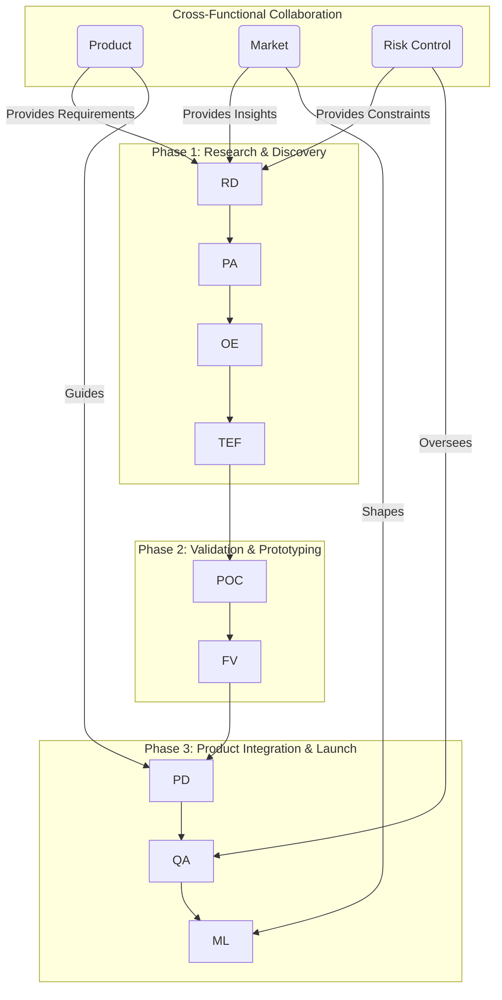

**Key Insights:**

- **Misconception**: Cutting-edge research can be directly applied to production without significant adaptation. Reality: Research often lacks the robustness, security hardening, and performance optimizations required for production environments and needs extensive evaluation and engineering effort.
- **Failure Path**: Adopting new technologies solely based on theoretical promise without rigorous practical evaluation (POCs, pilots) can lead to costly integration failures, unforeseen performance issues, or security vulnerabilities.
- **Trade-offs**: Early adoption of cutting-edge technology can provide a competitive advantage but comes with higher risks, development costs, and the need for significant R&D investment compared to using more mature, battle-tested solutions.

---

### Topic 5: Team Leadership, Project Management & Cross-Functional Collaboration

#### Q21: Leading and managing cross-functional blockchain tech teams

**Difficulty: Advanced | Type: Practical**

Leading and managing cross-functional blockchain technology teams in high-growth environments demands a blend of technical depth, strategic foresight, and exceptional people management skills. The goal is to orchestrate diverse experts\u2014architects, backend engineers, smart contract developers, and frontend specialists\u2014towards a unified vision, ensuring that technical solutions align with overarching business objectives.

**Task Allocation and Role Definition** are paramount. I establish clear roles and responsibilities, leveraging individual strengths while fostering a collaborative environment. For instance, smart contract engineers might focus on Solidity development and formal verification, while backend engineers integrate blockchain logic with traditional systems, and architects ensure the overall system design adheres to scalability and security principles. This approach prevents silos and ensures all team members understand their contribution to the product's success.

**Technical Mentorship and Skill Development** are continuous processes in a rapidly evolving domain like blockchain. I foster a culture of learning through regular knowledge-sharing sessions, code reviews that emphasize best practices, and active encouragement for certifications or participation in open-source projects. Pairing junior developers with senior experts for complex tasks, or organizing internal workshops on topics like zero-knowledge proofs or Layer 2 solutions, helps in upskilling and knowledge transfer, preventing key person dependencies.

**Performance Management** in a fast-paced environment involves setting clear, measurable objectives (OKRs or KPIs) aligned with project milestones. Regular check-ins and constructive feedback are vital for individual growth and project trajectory correction. I also implement agile methodologies to enable adaptive planning and rapid iteration, allowing the team to pivot quickly in response to market changes or emerging technical challenges.

**Cross-Functional Collaboration** extends beyond the technical team. I ensure close coordination with product managers (for requirements gathering), risk control (for compliance and security), and market teams (for competitive positioning) through structured communication channels like workshops and joint planning sessions. This holistic approach ensures that technical decisions are well-informed by business context and external market dynamics. My leadership style emphasizes fostering a culture of trust, transparency, and continuous improvement, where mistakes are seen as learning opportunities, and innovation is actively encouraged.

**Supporting Artifacts:**

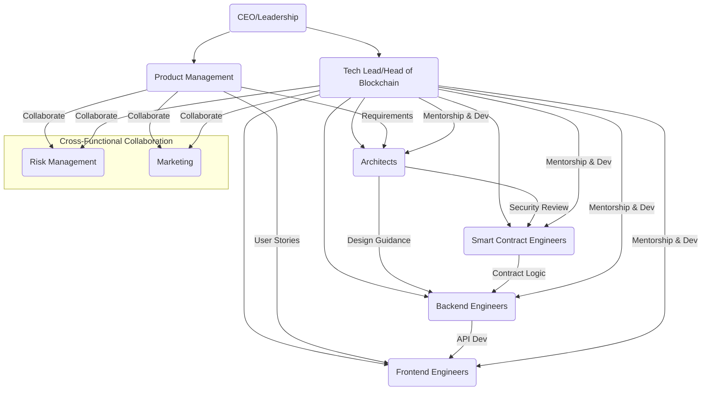

**Key Insights:**

- **Misconception**: A highly skilled technical team alone guarantees project success. Reality: Without strong cross-functional leadership and collaboration, technical excellence can be undermined by misaligned objectives, poor communication, or overlooked business requirements.
- **Failure Path**: Neglecting continuous learning and technical mentorship in a fast-evolving field like blockchain leads to skill obsolescence and an inability to adopt cutting-edge solutions, putting the team at a competitive disadvantage.
- **Trade-offs**: Balancing rapid iteration with rigorous security and compliance can be challenging. An agile approach needs to integrate security-by-design and continuous auditing to prevent vulnerabilities in a fast-paced development cycle.

---

#### Q22: Decision-making frameworks in high-stakes technical scenarios

**Difficulty: Advanced | Type: Practical**

In high-stakes technical scenarios within blockchain projects, effective decision-making frameworks are crucial for navigating complex challenges, mitigating risks, and building consensus among diverse stakeholders. The goal is to ensure that decisions are data-driven, account for potential failure paths, and align with strategic objectives, especially given the immutable nature of blockchain deployments and the significant financial implications of errors.

My decision-making framework integrates several key components:

1.  **Comprehensive Risk Assessment**: Before any major technical decision, a thorough risk assessment is performed. This involves identifying potential technical risks (e.g., smart contract vulnerabilities, scalability bottlenecks, consensus failures), operational risks (e.g., deployment errors, key management issues), and economic risks (e.g., impermanent loss in DeFi, market manipulation). I use structured methodologies (e.g., FMEA\u2014Failure Mode and Effects Analysis or DREAD/STRIDE for security) to quantify impact and likelihood, allowing for informed prioritization of mitigation strategies. This also includes scenario planning to understand potential consequences under various adversarial conditions.

2.  **Multi-Criteria Decision Analysis (MCDA)**: For complex choices (e.g., selecting between different Layer 2 solutions or cross-chain protocols), I employ MCDA techniques. This involves defining a set of objective criteria (e.g., security, scalability, cost, decentralization, development complexity, ecosystem support), weighting them based on project priorities, and evaluating each alternative against these criteria. For instance, a Data Envelopment Analysis (DEA) can assess the efficiency of different blockchain adoption strategies under uncertain conditions, providing a robust, data-driven comparison.

3.  **Consensus-Building and Stakeholder Alignment**: Technical decisions often have far-reaching implications, necessitating broad consensus. I facilitate structured discussions and workshops with engineering, product, security, and even legal/compliance teams. For critical protocol upgrades or changes to tokenomics, a formal governance process involving community voting or multi-signature approvals is crucial to ensure legitimacy and broad buy-in. In permissioned environments, Byzantine Fault Tolerance (BFT) mechanisms inherently manage consensus among known parties.

4.  **Incident Response Protocols Integration**: Decisions must consider how the system will behave under stress or attack. This involves integrating incident response protocols directly into the architecture, such as kill-switches for smart contracts, automated monitoring for anomalies, and clear escalation paths. Decisions regarding system design should simplify potential incident response, for example, by ensuring easy data availability for forensic analysis.

5.  **Iterative and Adaptive Approach**: Given the rapid evolution of blockchain technology, decisions are viewed as iterative. This means embracing a "build, measure, learn" cycle, where initial deployments might be smaller, more contained, and rigorously monitored, allowing for adaptation and refinement based on real-world performance and security feedback.

**Supporting Artifacts:**

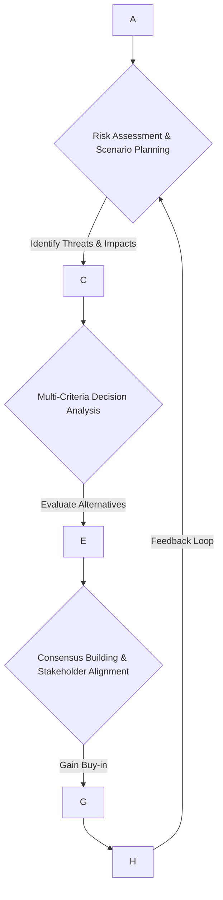

| Decision-Making Tool        | Description                                                                 | Application in Blockchain Projects                                 | Benefits                                                          | Limitations                                                     |
|-----------------------------|-----------------------------------------------------------------------------|--------------------------------------------------------------------|-------------------------------------------------------------------|-----------------------------------------------------------------|
| **Risk Matrix**             | Visualizes likelihood vs. impact for identified risks                       | Prioritizing smart contract vulnerabilities, protocol upgrade risks | Clear visualization, easy prioritization                         | Subjectivity in scoring, may miss unknown unknowns              |
| **Decision Tree Analysis**  | Maps out potential decisions, outcomes, and probabilities                   | Choosing between L1/L2, integrating new features                   | Quantifies expected value, clarifies decision paths             | Requires accurate probability estimates, can be complex         |
| **SWOT Analysis**           | Evaluates Strengths, Weaknesses, Opportunities, Threats                     | Assessing new blockchain technology adoption              | Holistic view, identifies strategic alignment/misalignment      | Can be subjective, doesn't prioritize actions                   |
| **Data Envelopment Analysis** | Measures efficiency of decision-making units against multiple criteria      | Evaluating blockchain adoption strategies, comparing L2 solutions | Objective comparison of efficiency, identifies best performers  | Sensitive to data quality, requires specific input/output metrics |
| **Pre-mortem Analysis**     | Imagines project failure, then identifies causes                            | Proactively identifying failure points in new protocol designs     | Uncovers hidden risks, fosters critical thinking                | Can be negative-focused, requires experienced participants      |

**Key Insights:**

- **Misconception**: Technical decisions are purely objective and can be made by engineers alone. Reality: High-stakes technical decisions in blockchain are intertwined with business, security, and regulatory factors, requiring cross-functional input and consensus.
- **Failure Path**: Ignoring a structured risk assessment can lead to overlooking critical vulnerabilities or underestimating the impact of known risks, resulting in catastrophic system failures or exploits.
- **Trade-offs**: Implementing a comprehensive decision-making framework can be time-consuming and resource-intensive but reduces the likelihood of costly errors in high-stakes blockchain deployments.

---

#### Q23: Talent development and knowledge transfer in fast-evolving blockchain environments

**Difficulty: Intermediate | Type: Practical**

In the rapidly evolving blockchain landscape, talent development and effective knowledge transfer are crucial for maintaining a competitive edge, fostering innovation, and ensuring organizational resilience. The goal is to cultivate a highly skilled, adaptable workforce capable of navigating continuous technological shifts, such as the emergence of zero-knowledge proofs or new Layer 2 solutions.

My strategy for **talent development** focuses on:
-   **Continuous Learning Programs**: Implement structured training programs that cover blockchain fundamentals, advanced cryptographic principles, smart contract development best practices, and new protocol advancements. This includes internal workshops, online courses, and external certifications.
-   **Upskilling Initiatives**: Proactively identify skill gaps within the team and provide targeted training to bring developers up to speed on cutting-edge technologies. For example, engineers might receive training on Rust for Solana development or advanced Solidity patterns for EVM-compatible chains.
-   **Leadership Development**: Identify and mentor promising individuals for leadership roles, equipping them with both technical and managerial skills necessary to lead cross-functional teams and drive innovation.
-   **Career Progression**: Establish clear career paths and professional growth opportunities to retain top talent and provide advancement pathways.

For **knowledge transfer**, I prioritize:
-   **Cross-Training**: Rotate team members through different roles or projects to broaden their expertise and reduce single points of failure, ensuring operational continuity even with personnel changes.
-   **Structured Onboarding**: Develop comprehensive onboarding programs for new hires, providing them with foundational knowledge of the company's blockchain stack, coding standards, security protocols, and cultural values. Mentorship programs are integrated to pair new team members with experienced guides, accelerating their understanding and integration.
-   **Documentation and Knowledge Management Systems**: Implement robust internal wikis, code documentation, and shared repositories for best practices, architectural decisions, and post-mortems. This institutionalizes knowledge, making it accessible to all team members and reducing reliance on individual memory.
-   **Regular Knowledge-Sharing Sessions**: Organize weekly or bi-weekly "tech talks," lunch-and-learns, or internal hackathons where team members can present on new research, project learnings, or tooling updates.
-   **Community Engagement**: Encourage participation in industry conferences, open-source projects, and research initiatives. This not only keeps the team abreast of external innovations but also positions the company as a thought leader, attracting top talent.

By investing in these strategies, organizations can build resilient, highly skilled, and innovative blockchain teams capable of adapting to the rapid pace of technological change.

**Supporting Artifacts:**

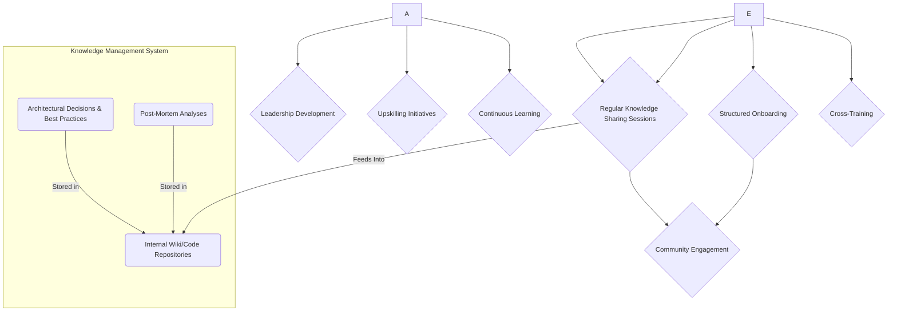

**Key Insights:**

- **Misconception**: Talent development is solely about formal training programs. Reality: Effective talent development in blockchain environments combines formal training with continuous peer learning, mentorship, hands-on experience in open-source projects, and robust knowledge management.
- **Failure Path**: Neglecting to institutionalize knowledge through documentation and shared systems leads to loss of critical information when employees leave, hindering scalability and creating knowledge silos.
- **Trade-offs**: Investing heavily in continuous learning and knowledge transfer can be time and resource-intensive, but the long-term benefits include reduced onboarding time, higher retention of skilled talent, and increased adaptability to market changes.

---

#### Q24: Collaborating with product, risk, and market teams to align technical and business goals

**Difficulty: Advanced | Type: Practical**

Effective collaboration with product, risk, and market teams is fundamental for aligning technical solutions with overarching business goals in blockchain projects. In a field as dynamic and regulated as blockchain, technical excellence alone is insufficient; solutions must be market-driven, compliant, and deliver tangible business value. My approach emphasizes structured communication, shared understanding, and integrated workflows to bridge potential gaps between these critical functions.

First, I establish a **"product-first" mindset** within the engineering team, ensuring that all technical development directly supports product vision and user needs. This involves participating actively in product roadmap development, providing realistic technical feasibility assessments, and offering innovative solutions to product challenges. Regular joint planning sessions, such as sprint reviews and backlog grooming, are essential for maintaining alignment and ensuring that technical efforts translate into valuable features.

Second, **integration with risk and compliance teams** is non-negotiable, particularly in financial technology and regulated blockchain applications. I facilitate continuous dialogue to embed security-by-design and compliance-by-design principles from the earliest stages of development. This involves working closely with risk managers to identify and mitigate potential smart contract vulnerabilities, regulatory exposure (e.g., AML/KYC), and data privacy concerns (e.g., GDPR). Regular workshops are held to review evolving regulatory landscapes (e.g., Hong Kong's virtual asset regulations) and their technical implications, ensuring that our solutions remain compliant and robust.

Third, **synergy with market and sales teams** is vital for successful product adoption and competitive positioning. I work to translate complex technical features into clear, compelling value propositions that resonate with target audiences. This involves joint sessions to understand market trends, competitor analysis, and customer feedback. Technical teams can provide insights into emerging technologies (e.g., ZKP, Layer 2) that could unlock new market opportunities, while market teams inform engineering about critical user acquisition and retention metrics. This collaborative feedback loop ensures that product development is both technologically advanced and commercially intelligent.

Finally, **transparent communication channels** are maintained across all teams, using shared documentation platforms (wikis, Confluence) and project management tools to ensure a single source of truth. Post-mortems and lessons learned from past projects are shared openly to foster continuous improvement across the organization.

**Supporting Artifacts:**

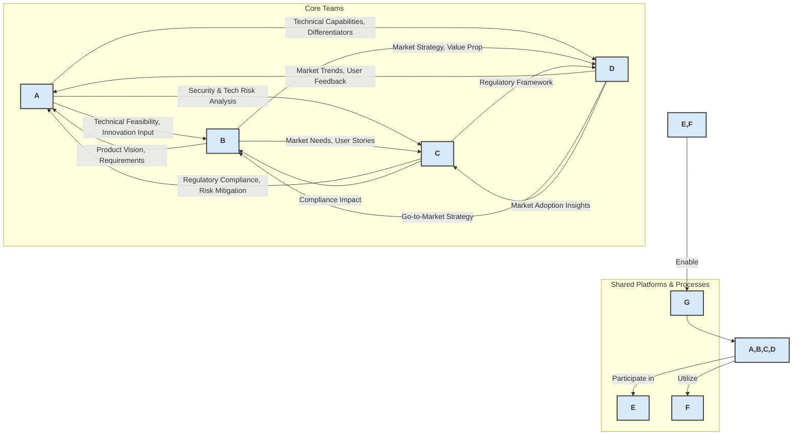

**Key Insights:**

- **Misconception**: The technical team's role is solely to build what product defines, and security/compliance are afterthoughts. Reality: Modern blockchain development requires active, integrated participation from technical, product, risk, and market teams from conception to ensure holistic success.
- **Failure Path**: Siloed operations lead to products that are technically sound but fail to meet market needs, violate regulatory requirements, or expose the organization to unacceptable risks.
- **Trade-offs**: Investing time in cross-functional collaboration might initially slow down purely technical development but significantly reduces the risk of rework, enhances market fit, and improves compliance posture, leading to faster overall time-to-market and reduced long-term costs.

---

#### Q25: Communication of complex blockchain concepts to non-technical stakeholders

**Difficulty: Intermediate | Type: Practical**

Effectively communicating complex blockchain concepts to non-technical stakeholders, such as product managers, investors, or regulatory bodies, is a critical leadership skill that translates technical intricacies into understandable business value and risk. The challenge lies in simplifying technical jargon without losing accuracy or downplaying important implications.

My approach involves:
1.  **Audience-Centric Framing**: Before communicating, I identify the stakeholders' primary concerns, motivations, and level of technical understanding. For product managers, the focus might be on feature capabilities, user experience, and roadmap impact. For investors, it's about ROI, market advantage, and risk mitigation. For legal and compliance teams, it's about regulatory adherence, data privacy, and security implications.
2.  **Analogies and Metaphors**: I use clear, relatable analogies to explain abstract blockchain concepts. For instance, explaining a blockchain as a "shared, tamper-proof ledger" or smart contracts as "self-executing digital agreements" helps build a foundational understanding. When discussing cryptographic proofs, I might use the "Where's Waldo" analogy to explain how a verifier can be convinced an item exists without knowing its location.
3.  **Focus on "Why" and "What it Enables"**: Instead of diving into "how" a consensus mechanism works, I explain *why* a particular mechanism was chosen (e.g., PoS for energy efficiency and speed) and *what it enables* (e.g., faster transactions, lower costs, new business models). Similarly, for ZKPs, I emphasize their role in privacy and scalability, rather than the underlying mathematical complexity.
4.  **Visual Aids and Demonstrations**: Diagrams, flowcharts, and simple prototypes are invaluable for illustrating system architecture, user journeys, and complex processes. Demonstrating a dApp's functionality or a cross-chain transaction, even in a test environment, can convey more information than pages of explanation.
5.  **Simplified Language and Avoidance of Jargon**: I consciously avoid unnecessary technical terms or explain them clearly when unavoidable. When discussing Layer 2 solutions, I focus on the benefits—reduced fees, faster transactions—rather than deep dives into fraud proofs or validity proofs, unless specifically asked.
6.  **Quantifiable Impact**: Whenever possible, I provide metrics and data to demonstrate the business impact of technical decisions. For instance, "implementing sharding can increase transaction throughput from X to Y TPS, supporting Z million users," or "our new wallet architecture reduces the risk of key compromise by X%".
7.  **Emphasize Trade-offs and Risks**: It's crucial to be transparent about the trade-offs involved (e.g., decentralization vs. scalability) and the inherent risks (e.g., smart contract vulnerabilities) without causing undue alarm. This builds trust and ensures stakeholders make informed decisions.

By employing these strategies, I ensure that non-technical stakeholders gain a clear understanding of the project's technical underpinnings, enabling better decision-making and fostering stronger cross-functional alignment.

**Supporting Artifacts:**

| Communication Strategy  | Description                                                         | Target Audience Example                      | Desired Outcome                                                |
|-------------------------|---------------------------------------------------------------------|----------------------------------------------|----------------------------------------------------------------|
| **Audience-Centric Framing** | Tailor message to listener's priorities and background | Investors, Regulators, Product Managers      | Relevant understanding, addresses specific concerns            |
| **Relatable Analogies**     | Explain complex concepts with simple, familiar comparisons | General Public, New Team Members             | Quick grasp of fundamental concepts, reduces intimidation      |
| **Focus on "Why" & "What"** | Emphasize benefits and outcomes over technical implementation details | Product Managers, Business Development       | Clear understanding of value proposition, strategic alignment  |
| **Visual Aids**             | Use diagrams, flowcharts, and demos to illustrate points | All Stakeholders (especially visual learners)| Enhanced comprehension, clarity for complex systems           |
| **Quantifiable Impact**     | Provide data and metrics to show business value/risk | Executives, Investors                        | Data-driven decision support, confidence in project value      |
| **Transparency on Trade-offs** | Clearly articulate compromises (e.g., security vs. speed) | Risk Managers, Senior Leadership             | Realistic expectations, informed risk assessment               |

**Key Insights:**

- **Misconception**: Non-technical stakeholders don't need to understand any technical details. Reality: While deep technical dives are unnecessary, a foundational understanding of key concepts, benefits, and risks is crucial for informed strategic decisions and effective collaboration.
- **Failure Path**: Overusing jargon or failing to explain concepts in relatable terms can lead to misunderstandings, misaligned expectations, and poor decision-making from non-technical leadership, potentially derailing projects.
- **Trade-offs**: Spending time to craft clear, concise explanations takes effort from technical leads, but it pays dividends by securing stakeholder buy-in, reducing communication friction, and ensuring better-informed business outcomes.

---

### Topic 6: System Performance, Scalability & Reliability

#### Q26: Achieving high-throughput and low-latency in blockchain systems

**Difficulty: Advanced | Type: Practical**

Achieving high throughput and low latency in blockchain systems is a continuous engineering challenge, often requiring trade-offs with decentralization and security. For production-grade enterprise solutions, especially in contexts like cross-border settlements or high-frequency trading platforms, optimizing these metrics is paramount. My strategy involves a multi-pronged approach across different layers of the blockchain stack.

**Consensus Mechanism Optimization**: The choice of consensus mechanism significantly impacts performance. Moving away from energy-intensive Proof of Work (PoW) to faster, more efficient mechanisms like Proof of Stake (PoS) or Byzantine Fault Tolerance (BFT) variants (e.g., Tendermint, IBFT) is a primary step. BFT-based mechanisms, often found in permissioned blockchains, offer high transaction finality and throughput due to a fixed, known set of validators. Optimizing parameters within these mechanisms, such as block size and block time, can further fine-tune performance.

**Layer 2 Scaling Solutions**: For public blockchains, Layer 2 solutions are crucial for offloading transactions from the main chain. **Rollups** (Optimistic and ZK-Rollups) bundle transactions off-chain and submit a single proof or state update to Layer 1, dramatically increasing throughput and reducing fees. **State Channels** and **Sidechains** offer similar benefits, enabling fast, low-cost transactions for specific use cases.

**Network Layer Optimizations**:
-   **P2P Network Design**: Optimizing node discovery and data propagation mechanisms (e.g., gossip protocols) ensures efficient broadcast of transactions and blocks. Implementing techniques like transaction bundling, block compression, and adaptive routing minimizes network latency and bandwidth usage.
-   **Geographic Distribution and Load Balancing**: Distributing validator nodes geographically minimizes latency for users across different regions and enhances network resilience. Load balancers can distribute transaction loads evenly across nodes, preventing bottlenecks and ensuring consistent performance.

**Smart Contract and Application-Level Optimizations**:
-   **Gas Optimization**: Writing efficient smart contract code that minimizes gas consumption is critical for reducing transaction costs and improving execution speed. This includes careful data structure design, avoiding redundant computations, and optimizing storage writes.
-   **Off-chain Computation**: Performing complex computations off-chain and only committing necessary state changes to the blockchain reduces on-chain load. Oracles can bring critical off-chain data securely onto the blockchain.
-   **Data Management**: Efficient on-chain and off-chain data storage strategies are vital. Storing only essential metadata on-chain and large data files off-chain (e.g., IPFS) reduces blockchain bloat and improves sync times.

**Monitoring and Alerting**: Continuous monitoring of key performance indicators (KPIs) like transaction throughput, latency, block generation time, and network utilization is essential. Real-time alerts enable rapid diagnosis and resolution of performance bottlenecks.

**Supporting Artifacts:**

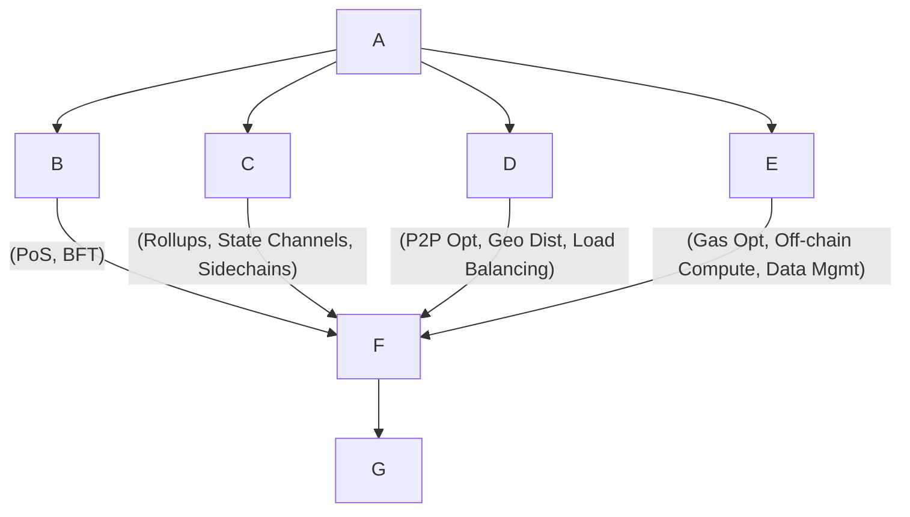

**Key Insights:**

- **Misconception**: Simply increasing block size or reducing block time will solve all scalability issues. Reality: While these can help, they can also increase network centralization, propagation delays, and storage requirements, often exacerbating other problems.
- **Failure Path**: Neglecting to optimize smart contract gas usage can lead to prohibitively expensive transactions, frustrating users and limiting dApp adoption, especially during periods of high network congestion.
- **Trade-offs**: Significant increases in throughput often involve compromises in decentralization (e.g., fixed validator sets in BFT) or introduce new security assumptions (e.g., fraud proofs in Optimistic Rollups).

---

#### Q27: Database sharding and state management for large-scale blockchain apps

**Difficulty: Advanced | Type: Practical**

For large-scale blockchain applications, particularly those requiring high transaction volumes and efficient data access, traditional monolithic database structures become a significant bottleneck. **Database sharding**, a technique borrowed from conventional distributed systems, is crucial for horizontal scalability and managing the ever-growing state of a blockchain. Instead of a single database storing all network state, sharding partitions the data and computational load across multiple, independent databases or "shards".

In a blockchain context, sharding refers to dividing the network into multiple smaller chains or partitions, each processing its own set of transactions and maintaining a portion of the overall state. This parallel processing drastically increases the network's overall transaction throughput. Each shard acts as a mini-blockchain, with its own set of validators responsible for processing and validating transactions within that shard. For instance, in Ethereum 2.0 (now the consensus layer), sharding distributes transaction processing across multiple shard chains, coordinated by a central beacon chain.

**State management** in sharded blockchain applications presents unique challenges:
1.  **Cross-Shard Communication**: Transactions that involve assets or data across different shards require sophisticated protocols to maintain atomicity and consistency. Mechanisms like **asynchronous messaging queues** or **atomic cross-shard commits** (e.g., using a two-phase commit protocol) are essential to ensure that either all parts of a cross-shard transaction succeed or all fail.
2.  **Data Availability**: Ensuring that all necessary data is available for nodes to validate transactions and reconstruct the state is critical, especially in a sharded environment where data is distributed. Techniques like **Data Availability Sampling (DAS)** allow light clients to verify data availability without downloading entire blocks.
3.  **State Synchronization**: Nodes must efficiently synchronize their state, particularly when joining the network or switching shards. Efficient snapshotting and peer-to-peer data transfer protocols are vital for rapid state synchronization.
4.  **Load Balancing and Dynamic Re-sharding**: As transaction loads shift across shards, dynamic load balancing mechanisms are needed to redistribute computational power and prevent hot spots. Dynamic re-sharding allows the network to adjust the number of shards or their composition based on demand, although this is highly complex to implement securely.
5.  **Data Archiving and Pruning**: The blockchain's state continuously grows. Strategies for archiving older, less frequently accessed data off-chain and pruning unnecessary historical state help manage storage requirements for individual nodes, improving efficiency and reducing synchronization times for new participants.

The successful implementation of sharding and state management for large-scale blockchain applications requires careful design of cryptographic primitives, consensus mechanisms, and network protocols to ensure data integrity, security, and performance across distributed partitions.

**Supporting Artifacts:**

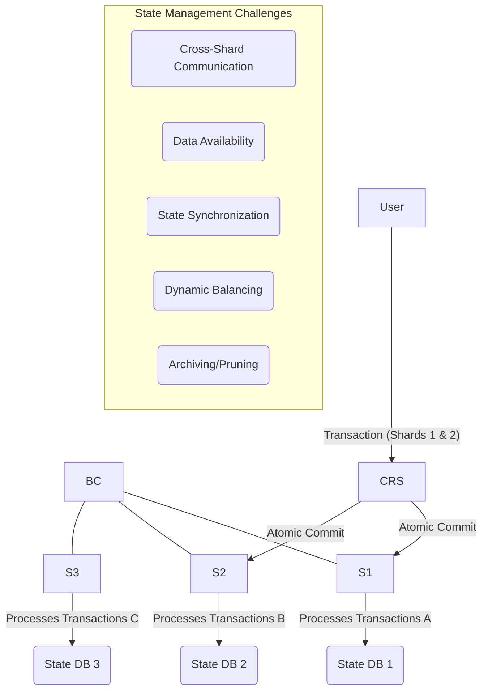

**Key Insights:**

- **Misconception**: Sharding simply splits a single blockchain into many, making it faster. Reality: Sharding involves complex coordination mechanisms and new challenges for maintaining data consistency, atomicity across shards, and overall network security.
- **Failure Path**: Inefficient cross-shard communication protocols can lead to failed transactions, inconsistent state across the network, or even a fragmented user experience, undermining the benefits of sharding.
- **Trade-offs**: While sharding dramatically increases scalability, it introduces significant complexity in protocol design and implementation, potentially increasing the attack surface and making debugging more challenging.

---

#### Q28: Optimizing transaction efficiency and gas costs in smart contract development

**Difficulty: Advanced | Type: Practical**

Optimizing transaction efficiency and reducing gas costs are critical considerations in smart contract development, particularly on platforms like Ethereum where every operation incurs a fee proportional to its computational complexity. High gas costs can deter users, limit dApp adoption, and make certain operations economically unfeasible. My strategy for optimization focuses on both design-time architectural decisions and granular code-level improvements.

**Architectural Optimizations:**
1.  **State Minimization**: Reducing the amount of data stored on-chain is paramount, as storage operations (SSTORE) are among the most expensive. I advocate for storing only essential data on-chain and leveraging off-chain storage solutions (e.g., IPFS, Filecoin) for larger datasets, with hashes of the off-chain data committed to the blockchain for integrity verification.
2.  **Layer 2 Solutions Integration**: For high-volume or low-value transactions, integrating Layer 2 scaling solutions like ZK-Rollups or Optimistic Rollups can drastically reduce on-chain gas costs by bundling transactions and processing them off-chain, with only a summarized proof or state update submitted to Layer 1.
3.  **Event-Driven Design**: Instead of storing all historical data on-chain, contracts can emit events for significant state changes. This data can then be indexed and queried off-chain, reducing storage costs while maintaining auditability.

**Code-Level Optimizations:**
1.  **Efficient Data Structures**: Choosing the right data types and packing them efficiently can save gas. For instance, using smaller integer types (`uint8`, `uint16`) when possible, and packing multiple smaller variables into a single storage slot can reduce SSTORE operations.
2.  **Minimize Storage Writes**: Modifying storage variables is expensive. I prioritize read operations over write operations wherever possible and avoid unnecessary state changes within loops. Batching multiple updates into a single transaction can also be more gas-efficient than multiple individual transactions.
3.  **Loop Optimization**: Loops should be avoided with dynamic arrays or unbounded iterations, as their gas cost can escalate unexpectedly. If loops are necessary, their bounds should be fixed or carefully controlled.
4.  **Function Visibility**: Using the correct function visibility (`external`, `public`, `internal`, `private`) can optimize gas usage. `external` functions are typically cheaper for external calls than `public` functions.
5.  **Remove Redundant Computations**: Avoid re-calculating values that can be stored or passed as arguments. Caching results of expensive operations for reuse within a transaction can save gas.
6.  **Error Handling**: Use `require()` and `revert()` for error handling instead of `assert()`. `require()` refunds unused gas on failure, while `assert()` consumes all remaining gas, which is less efficient.

**Testing and Profiling**: Using tools like Solidity Gas Reporter during development and testing helps track gas consumption for different functions and scenarios, enabling iterative optimization. Auditing tools also provide insights into gas-inefficient patterns.

**Supporting Artifacts:**

```mermaid
graph TD
    A --> B{Architectural Optimizations}
    B --> B1
    B --> B2
    B --> B3

    A --> C{Code-Level Optimizations}
    C --> C1
    C --> C2
    C --> C3
    C --> C4
    C --> C5
    C --> C6
    
    A --> D{Testing & Profiling}
    D --> D1
    D --> D2
    
    B, C, D --> E
```

**Key Insights:**

- **Misconception**: Gas optimization is an afterthought or only for "expert" developers. Reality: Gas optimization should be a continuous consideration from the design phase, as it directly impacts usability, cost, and the economic viability of dApps.
- **Failure Path**: Deploying gas-inefficient smart contracts can lead to prohibitively high transaction fees, making the dApp unusable during periods of network congestion or for users with limited funds.
- **Trade-offs**: Extreme gas optimization can sometimes lead to less readable code or increase the complexity of logic, potentially introducing new vulnerabilities. A balance must be struck between gas efficiency, code clarity, and security.

---

#### Q29: Resilience and high availability in blockchain infrastructure

**Difficulty: Advanced | Type: Practical**

Ensuring resilience and high availability (HA) in blockchain infrastructure is paramount for maintaining continuous operation, preventing data loss, and preserving user trust. This is particularly critical in distributed systems where failures are inevitable, and the goal is to make these failures non-fatal, ensuring the system remains available and functional even under adverse conditions. My strategy for building HA blockchain infrastructure incorporates redundancy, disaster recovery, and operational excellence across all layers.

**Redundancy at All Layers**:
1.  **Node Redundancy**: Deploying multiple validator or full nodes across different physical servers, data centers, and even geographic regions (Availability Zones, cloud providers) is fundamental. This prevents a single point of failure (SPOF) from taking down the entire network. Active-active configurations, where all nodes serve traffic, offer high utilization and fast failover, while active-passive setups provide simpler state management for critical components.
2.  **Component Redundancy**: Beyond nodes, critical infrastructure components like load balancers, DNS resolvers, and message queues must also be redundant. Using multiple load balancers in active-active or active-passive setups ensures that if one fails, another can take over seamlessly.
3.  **Data Replication**: Implementing robust data replication strategies for stateful components (e.g., databases, off-chain data stores) is vital. This includes synchronous replication for strong consistency in sensitive applications and asynchronous replication for lower latency in others, always with an emphasis on testing restore procedures regularly.

**Disaster Recovery and Business Continuity Planning (DR/BCP)**:
1.  **Geo-Redundancy**: Distributing infrastructure across multiple Availability Zones (AZs) and geographical regions provides protection against regional outages or natural disasters. This can involve active-active multi-region deployments for global reach or active-passive setups with warm standbys for cost-efficiency.
2.  **Backup and Recovery**: Regular, automated backups of all critical data (e.g., private keys, state databases, configuration files) are essential. A well-defined and regularly tested disaster recovery plan ensures rapid restoration of operations and data integrity in the event of a catastrophic failure.
3.  **Incident Response Plan**: A comprehensive incident response plan, including clear steps, roles, and communication protocols, enables rapid detection, containment, and eradication of issues, minimizing downtime.

**Operational Excellence**:
1.  **Monitoring and Alerting**: Continuous, real-time monitoring of key metrics (latency, transaction throughput, error rates, resource utilization) across all components is crucial. Automated alerts notify operators of anomalies, enabling proactive intervention.
2.  **Automated Failover and Self-Healing**: Implementing automated failover mechanisms (e.g., Kubernetes, consensus-driven leader election) reduces human intervention during failures. Self-healing systems can automatically reroute transactions or restore services, enhancing reliability.
3.  **Chaos Engineering and Game Days**: Regularly simulating failures (e.g., node crashes, network partitions, DNS outages) helps test the HA design, validate recovery procedures, and uncover hidden SPOFs in a controlled environment.
4.  **Cross-Training and Documentation**: Minimizing human SPOFs requires cross-training team members and maintaining detailed operational playbooks and documentation for all procedures.

**Supporting Artifacts:**

| HA Strategy                 | Description                                                         | Benefits                                                      | Challenges                                                    |
|-----------------------------|---------------------------------------------------------------------|---------------------------------------------------------------|---------------------------------------------------------------|
| **N+1 Redundancy**          | Deploying at least N+1 instances of critical services        | Continued operation on single component failure               | Increased infrastructure cost, management complexity          |
| **Multi-AZ/Geo Distribution** | Spreading components across multiple data centers/regions | Protection against regional outages, lower latency for users  | Data consistency issues, higher complexity in orchestration   |
| **Automated Failover**      | Systems automatically switch to backup on failure        | Rapid recovery, reduced manual intervention                   | Complex implementation, potential for split-brain scenarios   |
| **Data Replication**        | Duplicating data across multiple locations                 | Data durability, quick recovery from data loss                | Consistency concerns, increased storage requirements          |
| **Chaos Engineering**       | Proactively injecting failures to test resilience          | Uncovers hidden weaknesses, validates recovery processes      | Requires careful planning, potential for real outages         |

**Key Insights:**

- **Misconception**: Simply deploying multiple nodes guarantees high availability. Reality: True HA requires redundant components, robust data replication, automated failover mechanisms, and rigorous testing across all layers of the infrastructure, including operational processes.
- **Failure Path**: Neglecting regular disaster recovery drills and chaos engineering can leave critical vulnerabilities undiscovered until a real-world incident occurs, leading to prolonged downtime and data loss.
- **Trade-offs**: Achieving maximum resilience and HA often involves increased infrastructure costs, greater complexity in deployment and management, and potential compromises on performance due to overheads like synchronous replication.

---

#### Q30: Monitoring, metrics, and incident response plans for blockchain systems

**Difficulty: Advanced | Type: Practical**

Effective monitoring, comprehensive metrics, and a robust incident response plan are indispensable for maintaining the health, security, and reliability of blockchain systems. In a decentralized and often high-stakes environment, proactive identification of issues and rapid, coordinated responses are critical to minimize downtime, prevent financial losses, and preserve user trust.

**Monitoring and Metrics**:
1.  **Comprehensive Observability**: Implementing a multi-layer observability stack that covers golden signals (latency, traffic, errors, saturation) is fundamental. This includes:
    *   **Network Performance**: Tracking transaction throughput, block finality time, network latency, and node synchronization status. Tools like blockchain explorers (e.g., Etherscan) and specialized analytics platforms (e.g., BlockCypher, Chainalysis) provide real-time insights.
    *   **Node Health**: Monitoring CPU usage, memory consumption, disk I/O, and peer connections for individual nodes to detect resource bottlenecks or potential compromises.
    *   **Smart Contract Execution**: Tracking gas usage, contract calls, events emitted, and any reverts or errors. Dedicated tools can monitor for unusual activity patterns or sudden spikes in transaction volumes that might indicate an attack.
    *   **Security Metrics**: Continuous monitoring for unusual wallet activity, failed authentication attempts, smart contract exploits, or any signs of intrusion.
2.  **Alerting Systems**: Establishing clear alerting thresholds for critical metrics is vital. Alerts should be routed to the appropriate on-call personnel with clear runbooks for initial diagnosis and mitigation steps. The goal is to reduce noise and prioritize alerts for user-impacting conditions.
3.  **Logging and Tracing**: Centralized logging systems aggregate logs from all nodes and services, providing a comprehensive audit trail for forensic analysis during incidents. Distributed tracing helps pinpoint performance bottlenecks and identify the root cause of issues across complex microservices architectures.

**Incident Response Plan (IRP)**: A well-defined and regularly tested IRP is crucial for effectively managing security breaches or operational incidents. Key elements include:
1.  **Preparation**: Developing clear policies and procedures for incident handling, defining roles and responsibilities for the incident response team, and ensuring all necessary tools and resources are in place.
2.  **Detection and Analysis**: Utilizing monitoring tools to detect anomalies and potential security incidents in real-time. This phase involves analyzing the scope and nature of the incident to understand its impact.
3.  **Containment**: Implementing procedures to limit the damage and prevent further spread, such as isolating affected nodes or smart contracts, pausing vulnerable functions, or temporarily halting transactions if necessary.
4.  **Eradication**: Identifying and eliminating the root cause of the incident, which might involve patching vulnerabilities, revoking compromised keys, or removing malicious code.
5.  **Recovery**: Restoring affected systems and services to normal operation, ensuring data integrity and addressing all vulnerabilities before resuming full service.
6.  **Post-Incident Review (PIR)**: Conducting a thorough post-mortem analysis to understand what happened, why it happened, and how to prevent recurrence. This includes documenting lessons learned, updating procedures, and improving monitoring systems.
7.  **Communication**: Establishing clear internal and external communication plans for stakeholders, users, and regulatory bodies during an incident to manage expectations and maintain trust.

**Supporting Artifacts:**

```mermaid
graph TD
    A --> B{Collect Metrics & Logs}
    B -- Network Performance --> C1
    B -- Node Health --> C2
    B -- Smart Contracts --> C3
    B -- Security --> C4

    C1, C2, C3, C4 --> D
    D -- Triggers --> E

    E -- Executes --> F
    F --> G
    F --> H
    F --> I
    F --> J
    F --> K

    K -- Improves --> A, D, F
```

**Key Insights:**

- **Misconception**: Basic server monitoring is sufficient for blockchain systems. Reality: Blockchain systems require specialized monitoring tools and metrics that account for decentralized consensus, smart contract behavior, and cryptographic security properties.
- **Failure Path**: A lack of a clearly defined and tested incident response plan can lead to chaotic, uncoordinated actions during a security breach or system failure, exacerbating damage and delaying recovery.
- **Trade-offs**: Implementing a comprehensive monitoring and incident response system requires significant investment in tools, personnel, and training, but it is a necessary cost for managing the high-value, high-risk nature of blockchain assets and operations.

---

### Sources

[1] CrustChain: Resolving the blockchain trilemma via decentralized ..., https://pmc.ncbi.nlm.nih.gov/articles/PMC12360553/
[2] Organizational Capabilities and Talent Strategy: Building the Team ..., https://medium.com/@theblockchainacademy/organizational-capabilities-and-talent-strategy-building-the-team-to-win-the-next-cycle-624d343e62e1
[3] DoS Attacks and Defense Technologies in Blockchain Systems, https://arxiv.org/html/2507.22611v1
[4] Requirements Gathering: A Complete Step-by-Step Guide (2022), https://nmgtechnologies.com/blog/requirement-gathering-solve-biggest-problems-consulting
[5] Blockchain Pentesting: Complete Security Guide - Qualysec, https://qualysec.com/blockchain-pentesting/
[6] Cross-Functional Collaboration for Enhanced Cybersecurity: Raine ..., https://medium.com/authority-magazine/cross-functional-collaboration-for-enhanced-cybersecurity-raine-chang-of-kobalt-on-the-best-prac-8490b1da8199
[7] A Comprehensive Evaluation and Practice of System Penetration ..., https://arxiv.org/html/2510.26555v1
[8] Assessing the Impacts of Blockchain Technology on Supply Chain ..., https://link.springer.com/article/10.1007/s10726-025-09934-z
[9] Tracing Crypto Attacks: Best Practices for On-Chain Incident Response, https://www.cryptoisac.org/news-member-content/tracingcryptoattacks
[10] Blockchain security enhancement: an approach towards hybrid ..., https://www.nature.com/articles/s41598-024-51578-7
[11] Zero Knowledge Rollups & Optimistic Rollups: An Overview, https://www.chainalysis.com/blog/zero-knowledge-rollups-optimistic-rollups-overview/
[12] From Code to Confidence: Smart Contract Auditing for Bulletproof ..., https://medium.com/predict/from-code-to-confidence-smart-contract-auditing-for-bulletproof-blockchain-security-a7ff9f933ed1
[13] (PDF) Promise of Zero-Knowledge Proofs (ZKPs) for Blockchain ..., https://www.researchgate.net/publication/384056745_Promise_of_Zero-Knowledge_Proofs_ZKPs_for_Blockchain_Privacy_and_Security_Opportunities_Challenges_and_Future_Directions
[14] Requirements Engineering Workshop with Use Cases, https://www.tonex.com/training-courses/requirements-engineering-workshop/
[15] Security Audits - Cosmos Documentation, https://evm.cosmos.network/docs/ibc/next/security-audits
[16] Shaping Security Work - Peak Defence - Your Cybersecurity Wingman, https://peakdefence.com/resources/method/shaping/
[17] Modernizing The Three Lines of Defense Model, https://www.deloitte.com/us/en/services/consulting/articles/modernizing-the-three-lines-of-defense-model.html
[18] Introduction to Ethereum Rollups | QuickNode Guides, https://www.quicknode.com/guides/custom-chains/introduction-to-ethereum-rollups
[19] Learning and Development vs. Skills Gaps in the Age of Blockchain, https://www.paltron.com/insights-en/learning-and-development-vs-skills-gaps-in-the-age-of-blockchain
[20] A Sharding Scheme for Large-Scale Internet of Things Application, https://dl.acm.org/doi/10.1145/3641290
[21] Invisible Chains: How zk-SNARKs and zk-STARKs Protect Data in ..., https://technorely.com/insights/invisible-chains-how-zk-snar-ks-and-zk-star-ks-protect-data-in-blockchain
[22] Sharding: A Panacea for Blockchain Scalability Challenges? - Medium, https://medium.com/exponential-science-foundation/sharding-a-panacea-for-blockchain-scalability-challenges-6e84a028e572
[23] Blockchain security: An in-depth look at smart contract audits, https://chainstack.com/blockchain-security-smart-contract-audits/
[24] Audits - Polkadot Security Hub - Parity Technologies, https://security.parity.io/audits
[25] A Hierarchical Sharded Blockchain Balancing Performance ... - arXiv, https://arxiv.org/html/2508.14457v1
[26] Layer-2 Solutions and Their Clients (4 of 9) | by Steffen Kux - Medium, https://medium.com/corpus-ventures/layer-2-solutions-and-their-clients-4-of-9-683665534e96
[27] how ethereum layer 2 scaling solutions address barriers to ..., https://entethalliance.org/how-ethereum-layer-2-scaling-solutions-address-barriers-to-enterprises-building-on-mainnet/
[28] Sharding and Partitioning Strategies in SQL Databases - Rapydo, https://www.rapydo.io/blog/sharding-and-partitioning-strategies-in-sql-databases
[29] Bitcoin Cross-Chain Bridge: A Taxonomy and Its Promise in Artificial ..., https://arxiv.org/html/2509.10413v1
[30] a comprehensive survey on cross-chain solutions - ScienceDirect, https://www.sciencedirect.com/science/article/pii/S2096720925000132
[31] What are Zero-Knowledge Rollups (ZK-rollups)? - Alchemy, https://www.alchemy.com/blog/zero-knowledge-rollups
[32] Overview of the main Solidity smart contracts security tools - Medium, https://medium.com/cryptodevopsacademy/overview-of-the-main-solidity-smart-contracts-security-tools-51475460ba19
[33] Promise of Zero\u2010Knowledge Proofs (ZKPs) for Blockchain Privacy ..., https://onlinelibrary.wiley.com/doi/10.1002/spy2.461
[34] What Are zk-SNARKs and zk-STARKs? \u2014 Demystifying the Leading ..., https://medium.com/coinmonks/what-are-zk-snarks-and-zk-starks-demystifying-the-leading-privacy-technologies-in-blockchain-d9fc19947877
[35] Upgradeable Smart Contracts: Proxies, Patterns, Pitfalls and CI/CD ..., https://www.octane.security/post/upgradeable-smart-contracts-proxies-patterns-pitfalls-cicd-safeguards
[36] What Is Formal Verification In Smart Contract Auditing? - Hashlock, https://hashlock.com/blog/what-is-formal-verification-in-smart-contract-auditing
[37] Digital Asset Risk Assessment, https://www.deloitte.com/us/en/services/consulting/articles/crypto-digital-asset-risk-management.html
[38] A full research report on zkSync (A) | by Zk_World | Medium, https://medium.com/@zkworldfin/a-full-research-report-on-zksync-a-4372feed27e
[39] Decentralized Storage Wars: IPFS vs Filecoin vs Arweave - Medium, https://medium.com/@aditrizky052/decentralized-storage-wars-ipfs-vs-filecoin-vs-arweave-91d705d538ac
[40] Scalability Innovations and Trends in Blockchain for 2025 | MoldStud, https://moldstud.com/articles/p-achieving-scalability-in-blockchain-key-innovations-and-trends-for-2025
[41] Building a Successful Blockchain Development Team - Pangea.ai, https://pangea.ai/resources/best-practices-for-building-and-managing-a-blockchain-development-team
[42] Essential Tools for Auditing Solidity Smart Contracts: A Practical Guide, https://medium.com/@dehvcurtis/essential-tools-for-auditing-solidity-smart-contracts-a-practical-guide-4a6b5e1b5709
[43] Manual or Automated Auditing for Blockchain Security - MoldStud, https://moldstud.com/articles/p-manual-vs-automated-auditing-which-method-offers-better-blockchain-security
[44] Blockchain Security Risks for Financial Organizations, https://www.deloitte.com/us/en/services/consulting/articles/blockchain-security-risks.html
[45] Scaling DeFi with ZK Rollups: Design, Deployment, and Evaluation ..., https://arxiv.org/html/2506.00500v1
[46] Best Smart Contract Auditing Companies (2025) - Datawallet, https://www.datawallet.com/crypto/best-smart-contract-auditing-companies
[47] Lessons in Digital Asset Risk Management, https://www.deloitte.com/us/en/services/audit-assurance/articles/blockchain-digital-assets-risk-management.html
[48] Evolving to blockchain integration, https://www.deloitte.com/us/en/insights/topics/technology-management/tech-trends/2018/blockchain-integration-smart-contracts.html
[49] AI and blockchain in financial services, https://www.deloitte.com/us/en/services/audit-assurance/blogs/accounting-finance/ai-blockchain-adoption-in-financial-services.html
[50] [PDF] Scalable, transparent, and post-quantum secure computational ..., https://eprint.iacr.org/2018/046.pdf
[51] A Flexible Sharding Blockchain Protocol Based on Cross-Shard ..., https://www.researchgate.net/publication/369988822_A_Flexible_Sharding_Blockchain_Protocol_Based_on_Cross-Shard_Byzantine_Fault_Tolerance
[52] [PDF] Evaluating the Efficiency of zk-SNARK, zk-STARK, and Bulletproof in ..., https://ris.utwente.nl/ws/portalfiles/portal/484146957/information-15-00463-v2.pdf
[53] [PDF] Integrating blockchain technology in supply chain management, https://scholarspace.manoa.hawaii.edu/bitstreams/9d812950-0899-4d7e-b0ae-f196825616b1/download
[54] XCMv2 Audit Completed by Quarkslab, https://polkadot.com/blog/full-audit-of-xcmv2-completed-by-quarkslab/
[55] [PDF] Comparing zk-SNARK, zk-STARK, and Bulletproof Protocols for ..., https://d197for5662m48.cloudfront.net/documents/publicationstatus/188883/preprint_pdf/c6580383b59b5b9702840fa0353b4a61.pdf
[56] [PDF] Investigating Sharding Advancements, Methodologies, and ... - arXiv, https://www.arxiv.org/pdf/2509.19478
[57] Building a Secure Web3 \u2014 Protecting Infrastructure, Protocols, and ..., https://medium.com/@RocketMeUpCybersecurity/building-a-secure-web3-protecting-infrastructure-protocols-and-decentralized-ecosystems-7fc1a953ffe8
[58] A Survey on Consensus Protocols and Attacks on Blockchain ... - MDPI, https://www.mdpi.com/2076-3417/13/4/2604
[59] Best practices for blockchain-driven digital transformation in cross ..., https://www.sciencedirect.com/science/article/pii/S2666954425000225
[60] A Systematic Review of Blockchain-Based Initiatives in Comparison ..., https://www.mdpi.com/2073-431X/14/4/141
[61] Blockchain Security Audits \u2014 Essential Steps for Securing Your ..., https://medium.com/@RocketMeUpCybersecurity/blockchain-security-audits-essential-steps-for-securing-your-blockchain-projects-a86959681617
[62] Deep Dive into Blockchain Security: Vulnerabilities and\u2026 - LevelBlue, https://levelblue.com/blogs/security-essentials/deep-dive-into-blockchain-security-vulnerabilities-and-protective-measures
[63] (PDF) A Comprehensive Review of Risk Assessment Frameworks in ..., https://www.researchgate.net/publication/393896099_A_Comprehensive_Review_of_Risk_Assessment_Frameworks_in_Blockchain_Applications_Research_Gaps_and_Key_Lessons
[64] [PDF] A Novel Architecture for Cross-Chain Privacy-Preserving Auditing, https://eprint.iacr.org/2024/888.pdf
[65] A dynamic state sharding blockchain architecture for scalable and ..., https://www.sciencedirect.com/science/article/abs/pii/S1084804523002047
[66] Estuary: A Low Cross-Shard Blockchain Sharding Protocol Based ..., https://ui.adsabs.harvard.edu/abs/2024ITPDS..35..405J/abstract
[67] 2024 Volume 2 Blockchain Smart Contracts Part 4 How to Audit, https://www.isaca.org/resources/isaca-journal/issues/2024/volume-2/blockchain-smart-contracts-part-4-how-to-audit
[68] [PDF] Low Latency Cross-Shard Transactions in Coded Blockchain - arXiv, https://arxiv.org/pdf/2011.00087
[69] Blockchain technology for requirement traceability in systems ..., https://www.sciencedirect.com/science/article/abs/pii/S0306437924000425
[70] The rise of smart contracts and strategies for mitigating cyber and ..., https://www.weforum.org/stories/2024/07/smart-contracts-technology-cybersecurity-legal-risks/
[71] (PDF) A Standard-Driven Framework for BlockchainSecurity Risk ..., https://www.researchgate.net/publication/393482258_A_Standard-Driven_Framework_for_BlockchainSecurity_Risk_Assessment
[72] [PDF] On the Security and Performance of Blockchain Sharding, https://eprint.iacr.org/2021/1276.pdf
[73] Cross-Functional Collaboration Overview + Examples, https://www.cascade.app/blog/cross-functional-teams-drive-innovation
[74] A Comprehensive Review of Risk Assessment Frameworks in ..., https://ieeexplore.ieee.org/iel8/6287639/10820123/11086600.pdf
[75] A Consensus Algorithm Based on Risk Assessment Model for ..., https://onlinelibrary.wiley.com/doi/10.1155/2022/8698009
[76] 7 Smart Contract Vulnerabilities & Fixes (2025) - Rapid Innovation, https://www.rapidinnovation.io/post/7-most-common-smart-contract-vulnerabilities
[77] Navigating the Blockchain Trilemma: A Review of Recent Advances ..., https://www.sciencedirect.com/org/science/article/pii/S1546221825006563
[78] Sherlocked Security \u2013 Blockchain Node Hardening, https://sherlockedsecurity.com/blockchain-node-hardening/
[79] [PDF] A Review of Upgradeable Smart Contract Patterns based on ..., https://jbba.scholasticahq.com/article/73752-a-review-of-upgradeable-smart-contract-patterns-based-on-openzeppelin-technique/attachment/154039.pdf
[80] Beyond Smart Contracts: A Deep Dive into Blockchain Infrastructure ..., https://www.openzeppelin.com/news/beyond-smart-contracts-a-deep-dive-into-blockchain-infrastructure-security-auditing
[81] [PDF] Unlocking Trustless Parallel Computation in Blockchains, https://eprint.iacr.org/2025/645.pdf
[82] [PDF] A Two-Layer Blockchain Sharding Protocol Leveraging Safety and ..., https://www.ndss-symposium.org/wp-content/uploads/2024-6-paper.pdf
[83] Integrating Blockchain Innovation: A Sustainable Adoption Model for ..., https://www.scirp.org/journal/paperinformation?paperid=137640
[84] The future of blockchain infrastructure | by Thomas Crow - Medium, https://medium.com/fabric-ventures/the-future-of-blockchain-infrastructure-8db8f3a1aa7a
[85] A sharding blockchain protocol for enhanced scalability and ..., https://www.sciencedirect.com/science/article/pii/S1319157824002738
[86] LSBSP: A Lightweight Sharding Method of Blockchain Based on ..., https://www.sciencedirect.com/org/science/article/pii/S1546221825001584
[87] 50 Smart Contract Vulnerabilities: Examples and Recommendations, https://medium.com/@tonibarjasmartinez/50-smart-contract-vulnerabilities-examples-and-recommendations-474aa7e11b3
[88] Understanding Smart Contract Exploits: How and Why They Happen, https://www.olympix.ai/blog/understanding-smart-contract-exploits-how-and-why-they-happen
[89] GoutamVerma/ETH-Aware: EthAware is monitoring tool is ... - GitHub, https://github.com/GoutamVerma/ETH-Aware
[90] How to Transfer Knowledge Across Development Teams - OpenArc, https://www.openarc.net/how-to-transfer-knowledge-across-development-teams/
[91] [PDF] Analyzing and Benchmarking ZK-Rollups, https://eprint.iacr.org/2024/889.pdf
[92] libp2p, https://libp2p.io/
[93] Key Blockchain Metrics - Monitoring and Observability in Web3, https://figiel.medium.com/key-blockchain-metrics-monitoring-and-observability-in-web3-09c20d0f2147
[94] Arbitrum ZK Proofs: Unlocking Next-Level Security and Scalability in ..., https://www.okx.com/learn/arbitrum-zk-proofs-security-scalability
[95] [PDF] Monitoring Ethereum Compatible Account balance using ..., https://erepo.uef.fi/server/api/core/bitstreams/5920e6fe-b143-4831-bf92-7630d396c245/content
[96] Top Smart Contract Audit Tools in 2025 : Comparative Analysis, https://www.rapidinnovation.io/post/top-7-smart-contract-audit-tools
[97] OWASP Smart Contract Top 10, https://owasp.org/www-project-smart-contract-top-10/
[98] Blockchain Security Audit: The Ultimate Guide - ImmuneBytes, https://immunebytes.com/blog/blockchain-security-audit-the-ultimate-guide/
[99] Blockchain Monitoring & Incident Response for a Web3 Payment ..., https://coesecurity.com/case_studies/real-time-vigilance-blockchain-monitoring-incident-response-for-a-web3-payment-network/
[100] Secure Coding in Blockchain Development: Mistakes to Avoid, https://www.linkedin.com/pulse/secure-coding-blockchain-development-mistakes-avoid-kishan-mehta-ezuzf
[101] DoS on Blockchains: A P2P Layer's View | Presto Research, https://www.prestolabs.io/research/dos-on-blockchains-a-p2p-layers-view
[102] NFT Storage: Comparing IPFS, Filecoin, and Arweave - Bankless, https://www.bankless.com/nft-storage
[103] [PDF] Blockchain adoption evaluation framework, https://www.rd-alliance.org/wp-content/uploads/2024/12/Blockchain20adoption20evaluation20framework.pdf
[104] Smart Contract Security Risks: Today's 10 Top Vulnerabilities - Cobalt, https://www.cobalt.io/blog/smart-contract-security-risks
[105] Top 8 Incident Response Metrics To Know - Splunk, https://www.splunk.com/en_us/blog/learn/incident-response-metrics.html
[106] [PDF] SoK: Sharding on Blockchain - Cryptology ePrint Archive, https://eprint.iacr.org/2019/1178.pdf
[107] Logs, Metrics, Traces: From Theory to Use at Coinbase - PuppyGraph, https://www.puppygraph.com/blog/logs-metrics-traces
[108] Recent Advances in Sharding Techniques for Scalable Blockchain ..., https://ieeexplore.ieee.org/iel8/6287639/10820123/10816328.pdf
[109] Monitoring & Alerting | QuickNode Builder's Guide, https://www.quicknode.com/builders-guide/tool-categories/monitoring-alerting
[110] Reentrancy Attacks and The DAO Hack Explained - Chainlink Blog, https://blog.chain.link/reentrancy-attacks-and-the-dao-hack/
[111] Layer-2 Blockchain Solutions - Cash2Bitcoin, https://cash2bitcoin.com/blog/layer-2-blockchain-solutions/
[112] List Of Smart Contract Vulnerabilities & How To Mitigate Them, https://hacken.io/discover/smart-contract-vulnerabilities/
[113] The Blockchain Academy: Home, https://theblockchainacademy.com/
[114] Ultimate Guide to Smart Contract Security | Protect Blockchain Assets, https://www.rapidinnovation.io/post/smart-contract-security-best-practices-common-vulnerabilities
[115] Top 6 Smart Contract Vulnerabilities - InApp, https://inapp.com/blog/top-6-smart-contract-vulnerabilities/
[116] Blockchain Sharding Guide 2024 Boost Scalability and Performance, https://www.rapidinnovation.io/post/what-is-sharding-in-blockchain
[117] Real-Time Blockchain Monitoring & Alerting - Tenderly, https://tenderly.co/monitoring
[118] 7 Blockchain Technical Teams Tips: Master DApp Development!, https://ubiminds.com/en-us/blockchain-technical-teams/
[119] Blockchain Monitoring & Incident Response - COE Security, https://coesecurity.com/blockchain-monitoring-incident-response/