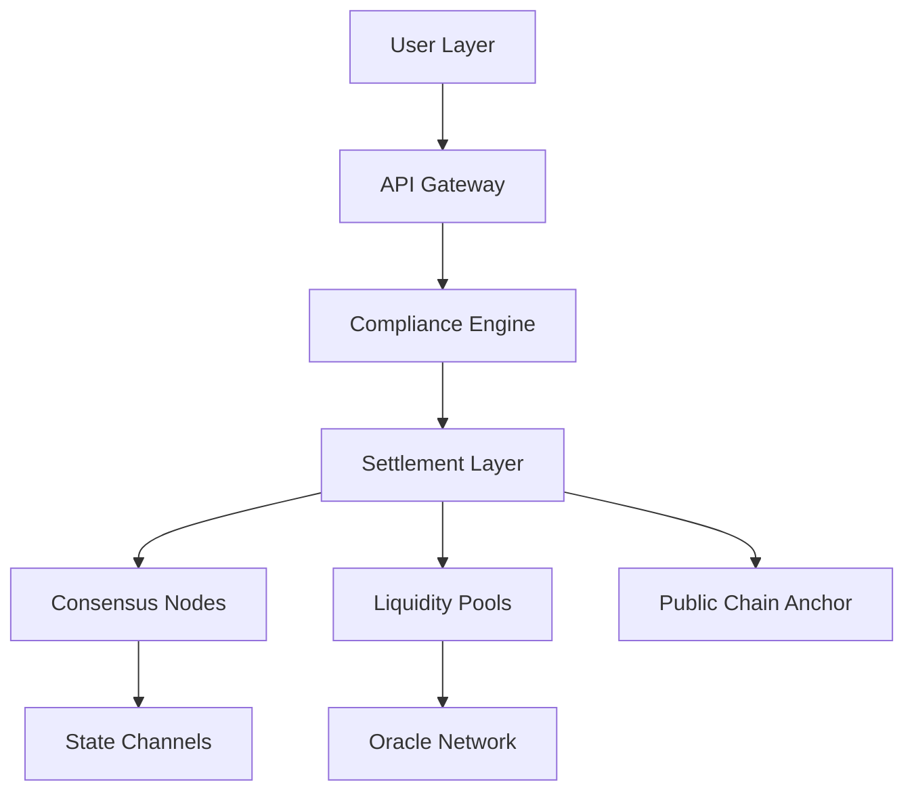
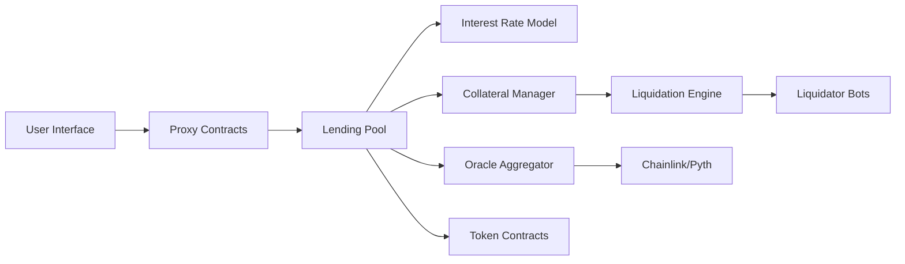
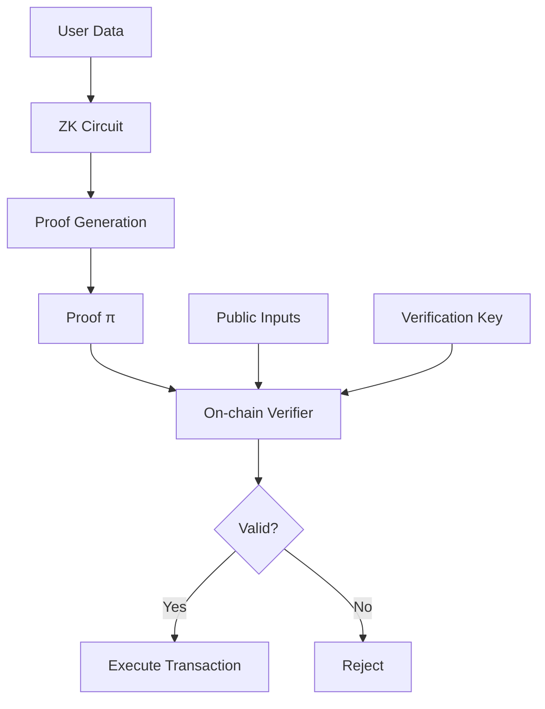
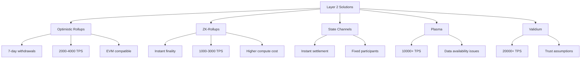

# Interview Q&A

## Contents
- [Topic Areas](#topic-areas-questions-1-30)
  - [Topic 1: Blockchain Architecture & Core Principles](#topic-1-blockchain-architecture--core-principles)
    - [Q1: How would you design a high-performance blockchain architecture for cross-border payment systems?](#q1-how-would-you-design-a-high-performance-blockchain-architecture-for-cross-border-payment-systems)
    - [Q2: Explain the trade-offs between different consensus mechanisms in enterprise blockchain deployments](#q2-explain-the-trade-offs-between-different-consensus-mechanisms-in-enterprise-blockchain-deployments)
    - [Q3: How do you approach blockchain scalability challenges in production environments?](#q3-how-do-you-approach-blockchain-scalability-challenges-in-production-environments)
  - [Topic 2: Web3 Product Development & DeFi](#topic-2-web3-product-development--defi)
    - [Q4: Design a complete DeFi lending protocol architecture from scratch](#q4-design-a-complete-defi-lending-protocol-architecture-from-scratch)
    - [Q5: How would you architect a Web3 social platform with decentralized identity?](#q5-how-would-you-architect-a-web3-social-platform-with-decentralized-identity)
    - [Q6: Explain the security considerations for building NFT marketplaces](#q6-explain-the-security-considerations-for-building-nft-marketplaces)
  - [Topic 3: Cryptographic Security & Wallet Technologies](#topic-3-cryptographic-security--wallet-technologies)
    - [Q7: Compare MPC wallets vs HD wallets for enterprise custody solutions](#q7-compare-mpc-wallets-vs-hd-wallets-for-enterprise-custody-solutions)
    - [Q8: How would you implement a secure multi-signature wallet system?](#q8-how-would-you-implement-a-secure-multi-signature-wallet-system)
    - [Q9: Explain zero-knowledge proof applications in blockchain privacy](#q9-explain-zero-knowledge-proof-applications-in-blockchain-privacy)
  - [Topic 4: Cross-chain & Interoperability](#topic-4-cross-chain--interoperability)
    - [Q10: Design a cross-chain bridge architecture with security guarantees](#q10-design-a-cross-chain-bridge-architecture-with-security-guarantees)
    - [Q11: Compare different cross-chain communication protocols](#q11-compare-different-cross-chain-communication-protocols)
    - [Q12: How do you handle atomic swaps in heterogeneous blockchain networks?](#q12-how-do-you-handle-atomic-swaps-in-heterogeneous-blockchain-networks)
  - [Topic 5: Smart Contract Development & Auditing](#topic-5-smart-contract-development--auditing)
    - [Q13: What's your approach to smart contract security auditing?](#q13-whats-your-approach-to-smart-contract-security-auditing)
    - [Q14: How do you handle upgradeable smart contracts in production?](#q14-how-do-you-handle-upgradeable-smart-contracts-in-production)
    - [Q15: Explain gas optimization strategies for complex smart contracts](#q15-explain-gas-optimization-strategies-for-complex-smart-contracts)
  - [Topic 6: Layer 2 Solutions & Modular Blockchain](#topic-6-layer-2-solutions--modular-blockchain)
    - [Q16: Compare different Layer 2 scaling solutions and their trade-offs](#q16-compare-different-layer-2-scaling-solutions-and-their-trade-offs)
    - [Q17: How would you design a modular blockchain architecture?](#q17-how-would-you-design-a-modular-blockchain-architecture)
    - [Q18: Explain data availability challenges in rollup architectures](#q18-explain-data-availability-challenges-in-rollup-architectures)
  - [Topic 7: Exchange Architecture & Trading Systems](#topic-7-exchange-architecture--trading-systems)
    - [Q19: Design a high-frequency trading engine for a DEX](#q19-design-a-high-frequency-trading-engine-for-a-dex)
    - [Q20: How would you architect a CEX with hot/cold wallet management?](#q20-how-would-you-architect-a-cex-with-hotcold-wallet-management)
    - [Q21: Explain order matching algorithms for decentralized exchanges](#q21-explain-order-matching-algorithms-for-decentralized-exchanges)
  - [Topic 8: Team Leadership & Technical Management](#topic-8-team-leadership--technical-management)
    - [Q22: How do you manage technical debt in blockchain projects?](#q22-how-do-you-manage-technical-debt-in-blockchain-projects)
    - [Q23: Describe your approach to building and scaling blockchain teams](#q23-describe-your-approach-to-building-and-scaling-blockchain-teams)
    - [Q24: How do you balance innovation with production stability?](#q24-how-do-you-balance-innovation-with-production-stability)
  - [Topic 9: Regulatory Compliance & Risk Management](#topic-9-regulatory-compliance--risk-management)
    - [Q25: How do you ensure KYC/AML compliance in DeFi protocols?](#q25-how-do-you-ensure-kycaml-compliance-in-defi-protocols)
    - [Q26: Explain your approach to regulatory compliance across jurisdictions](#q26-explain-your-approach-to-regulatory-compliance-across-jurisdictions)
    - [Q27: How do you handle privacy regulations in blockchain systems?](#q27-how-do-you-handle-privacy-regulations-in-blockchain-systems)
  - [Topic 10: Performance & System Optimization](#topic-10-performance--system-optimization)
    - [Q28: How do you optimize blockchain node performance?](#q28-how-do-you-optimize-blockchain-node-performance)
    - [Q29: Explain your approach to blockchain network monitoring](#q29-explain-your-approach-to-blockchain-network-monitoring)
    - [Q30: How do you handle blockchain data indexing at scale?](#q30-how-do-you-handle-blockchain-data-indexing-at-scale)
- [Reference Sections](#reference-sections)

---

## Topic Areas (Questions 1-30)

### Topic 1: Blockchain Architecture & Core Principles

#### Q1: How would you design a high-performance blockchain architecture for cross-border payment systems?

**Difficulty:** Advanced | **Type:** Practical/Scenario

**Answer:**
For cross-border payments, I'd architect a hybrid blockchain solution combining permissioned consortium chains with public chain anchoring [0]. The core architecture would utilize a three-layer approach: settlement layer using a high-throughput consensus like HotStuff or Tendermint (achieving 10,000+ TPS), liquidity layer with automated market makers for currency conversion, and compliance layer with privacy-preserving KYC using zero-knowledge proofs.

Key design decisions include implementing atomic multi-path payments to optimize liquidity routing, using state channels for micro-transactions to reduce on-chain load, and deploying regional validator nodes to minimize latency. The system would integrate with existing SWIFT infrastructure through secure APIs while maintaining cryptographic proof of settlements on-chain.

Critical failure paths include network partitioning between regions (mitigated through eventual consistency protocols), regulatory compliance failures (addressed via programmable compliance rules), and liquidity crises (managed through dynamic fee adjustments and reserve pools).

**Supporting Artifacts:**


**Key Insights:**
- **Misconception:** Single blockchain can handle all cross-border payment needs
- **Failure Path:** Ignoring regulatory heterogeneity across jurisdictions
- **Trade-offs:** Throughput vs. decentralization vs. compliance requirements

#### Q2: Explain the trade-offs between different consensus mechanisms in enterprise blockchain deployments

**Difficulty:** Advanced | **Type:** Theoretical

**Answer:**
Enterprise blockchain consensus selection involves balancing Byzantine fault tolerance, performance, and operational complexity [0]. PBFT-based algorithms (like Tendermint) offer instant finality and 1000-5000 TPS but require known validator sets and fail at >33% Byzantine nodes. Raft provides simpler implementation and crash fault tolerance but lacks Byzantine resistance, suitable for trusted environments.

Proof of Authority (PoA) enables high throughput (5000-10000 TPS) with predictable block times but centralizes control, creating regulatory risks. Hybrid approaches like Proof of Stake with delegation balance decentralization with performance, achieving 1000-3000 TPS while maintaining economic security through staking mechanisms.

The key trade-off matrix includes: finality time (instant vs. probabilistic), energy efficiency (PoW consuming 100+ TWh annually vs. PoS using <0.01%), network assumptions (synchronous vs. asynchronous), and upgrade complexity. Enterprise deployments typically prioritize deterministic finality and known participants over pure decentralization.

**Supporting Artifacts:**

| Consensus | TPS | Finality | Byzantine Tolerance | Energy Use |
|-----------|-----|----------|-------------------|------------|
| PBFT/Tendermint | 1000-5000 | Instant | 33% | Low |
| Raft | 5000-10000 | Fast | 0% | Low |
| PoA | 5000-10000 | Fast | Depends | Low |
| PoS/DPoS | 1000-3000 | Probabilistic | 33-51% | Low |
| PoW | 7-30 | Probabilistic | 51% | Very High |

**Key Insights:**
- **Misconception:** Higher TPS always means better consensus
- **Failure Path:** Ignoring network partition tolerance requirements
- **Trade-offs:** Security vs. performance vs. decentralization (blockchain trilemma)

#### Q3: How do you approach blockchain scalability challenges in production environments?

**Difficulty:** Intermediate | **Type:** Practical

**Answer:**
Production blockchain scalability requires a multi-pronged approach combining vertical and horizontal scaling strategies. I implement Layer 2 solutions (rollups, state channels, sidechains) to offload transaction processing while maintaining security guarantees through fraud proofs or validity proofs. Optimistic rollups can achieve 2000-4000 TPS with 1-week challenge periods, while ZK-rollups provide instant finality at 1000-2000 TPS.

Database optimization involves using specialized storage engines like RocksDB or LevelDB with proper indexing strategies, implementing state pruning to reduce storage requirements (keeping only recent 1000 blocks), and utilizing IPFS or similar distributed storage for large data objects. Sharding implementation divides the network into parallel chains processing transactions independently, potentially achieving 10,000+ TPS aggregate throughput.

Network-level optimizations include implementing efficient gossip protocols, using erasure coding for data availability, and deploying geographically distributed nodes with optimized peering. Critical considerations include maintaining data consistency across shards, handling cross-shard transactions atomically, and ensuring security doesn't degrade with increased scale.

**Supporting Artifacts:**
```solidity
// Example: Optimized storage pattern
contract OptimizedStorage {
    // Pack structs to minimize storage slots
    struct User {
        uint128 balance;    // 16 bytes
        uint64 lastUpdate;  // 8 bytes
        uint64 nonce;       // 8 bytes
    } // Fits in single 32-byte slot
    
    mapping(address => User) private users;
    
    // Use events for historical data instead of storage
    event Transaction(address indexed from, address indexed to, uint256 amount);
}
```

**Key Insights:**
- **Misconception:** Scalability only means increasing TPS
- **Failure Path:** Neglecting state growth and storage requirements
- **Trade-offs:** Decentralization vs. scalability vs. security

### Topic 2: Web3 Product Development & DeFi

#### Q4: Design a complete DeFi lending protocol architecture from scratch

**Difficulty:** Advanced | **Type:** Practical/Scenario

**Answer:**
A production DeFi lending protocol requires modular smart contract architecture with clear separation of concerns. Core components include: money markets with dynamic interest rate models (utilizing utilization-based curves), collateral management with multi-asset support and oracle price feeds, liquidation engine with incentivized liquidators and partial liquidation support, and governance module for parameter adjustments.

The architecture implements a hub-and-spoke model where the main lending pool contract manages liquidity, while separate contracts handle interest rate calculations, oracle aggregation, and liquidation logic. Risk parameters include loan-to-value ratios (typically 50-80%), liquidation thresholds (5-15% buffer), and interest rate curves calibrated to market conditions. Security measures include reentrancy guards, overflow protection, oracle manipulation resistance through time-weighted average prices (TWAP), and flash loan attack mitigation.

Critical design decisions involve choosing between pooled liquidity (like Compound) vs. peer-to-peer matching (like Aave V3), implementing variable vs. stable rate options, and handling bad debt socialization. The protocol must balance capital efficiency with risk management, typically achieving 70-85% utilization rates while maintaining adequate liquidity buffers.

**Supporting Artifacts:**


**Key Insights:**
- **Misconception:** Higher yields always attract more liquidity
- **Failure Path:** Inadequate oracle security leading to price manipulation
- **Trade-offs:** Capital efficiency vs. protocol safety vs. user experience

#### Q5: How would you architect a Web3 social platform with decentralized identity?

**Difficulty:** Intermediate | **Type:** Practical

**Answer:**
A Web3 social platform architecture combines on-chain identity verification with off-chain content storage for scalability. The identity layer uses DIDs (Decentralized Identifiers) following W3C standards, with verifiable credentials stored on-chain or in user-controlled data vaults. Content distribution leverages IPFS for media storage with on-chain content hashes, ensuring immutability while maintaining performance.

The platform implements a three-tier architecture: blockchain layer for identity, ownership, and governance; distributed storage layer (IPFS/Arweave) for content persistence; and indexing layer (The Graph or custom indexer) for efficient querying. Social graph relationships are stored as NFTs or soul-bound tokens, enabling portable social connections across platforms. Monetization occurs through token-gated content, NFT memberships, and creator tokens with bonding curves.

Privacy considerations include zero-knowledge proofs for age verification without revealing personal data, encrypted messaging using Signal protocol adapted for blockchain, and selective disclosure of profile attributes. The system must handle 10,000+ daily active users initially, scaling to millions through Layer 2 solutions and optimistic data availability.

**Supporting Artifacts:**

| Component | Technology | Purpose | Performance Target |
|-----------|------------|---------|-------------------|
| Identity | DID/VC | User authentication | <2s verification |
| Content | IPFS + Filecoin | Media storage | <500ms retrieval |
| Social Graph | ERC-721/SBT | Relationship mapping | 1000 TPS |
| Messaging | Waku/Matrix | P2P communication | <100ms latency |
| Indexing | The Graph | Query optimization | <200ms response |

**Key Insights:**
- **Misconception:** Everything must be stored on-chain
- **Failure Path:** Ignoring content moderation and legal compliance
- **Trade-offs:** Decentralization vs. user experience vs. scalability

#### Q6: Explain the security considerations for building NFT marketplaces (continued)

**Difficulty:** Intermediate | **Type:** Theoretical/Practical

**Answer:**
NFT marketplace security requires comprehensive protection across smart contracts, backend infrastructure, and user interfaces. Smart contract vulnerabilities include reentrancy attacks in bidding mechanisms (mitigated through checks-effects-interactions pattern), signature replay attacks (prevented via nonces and domain separation), and front-running in auction settlements (addressed through commit-reveal schemes or private mempools).

The marketplace must implement robust royalty enforcement mechanisms, preventing circumvention through wrapper contracts or direct transfers. This involves on-chain royalty registries (EIP-2981), operator filtering to block non-compliant marketplaces, and economic incentives for compliance. Metadata security requires IPFS pinning services with redundancy, content validation to prevent malicious scripts, and image verification to avoid NSFW content in family-friendly collections.

Critical infrastructure security includes rate limiting to prevent DoS attacks, secure key management using HSMs for hot wallets, and comprehensive logging for forensic analysis. The platform should maintain insurance funds for potential exploits, implement time-locks for administrative functions, and conduct regular third-party audits focusing on business logic vulnerabilities.

**Supporting Artifacts:**
```solidity
// Secure NFT marketplace pattern
contract SecureMarketplace {
    using ReentrancyGuard for uint256;
    
    mapping(bytes32 => bool) private usedSignatures;
    uint256 private constant ROYALTY_DENOMINATOR = 10000;
    
    function executeSale(
        Order calldata order,
        bytes calldata signature
    ) external nonReentrant {
        // Verify signature hasn't been used
        bytes32 orderHash = keccak256(abi.encode(order));
        require(!usedSignatures[orderHash], "Signature already used");
        
        // Verify signature validity
        require(verifySignature(orderHash, signature, order.seller), "Invalid signature");
        
        // Mark signature as used before state changes
        usedSignatures[orderHash] = true;
        
        // Execute transfer with royalty distribution
        _transferWithRoyalties(order);
    }
}
```

**Key Insights:**
- **Misconception:** NFT standards alone ensure marketplace security
- **Failure Path:** Inadequate signature validation leading to unauthorized trades
- **Trade-offs:** Security measures vs. gas costs vs. user experience

### Topic 3: Cryptographic Security & Wallet Technologies

#### Q7: Compare MPC wallets vs HD wallets for enterprise custody solutions

**Difficulty:** Advanced | **Type:** Theoretical

**Answer:**
MPC (Multi-Party Computation) wallets distribute key generation and signing across multiple parties without ever reconstructing the complete private key, providing superior security against single points of failure. They enable flexible threshold schemes (e.g., 3-of-5 signatures) with dynamic participant changes, achieving institutional-grade security with 99.99% availability. However, MPC requires complex cryptographic protocols, higher computational overhead (10-100x vs. single signature), and specialized infrastructure costing $50K-500K annually.

HD (Hierarchical Deterministic) wallets generate deterministic key trees from a single seed, simplifying backup and recovery while enabling address segregation for accounting purposes. They offer lower operational complexity, standard tooling support, and cost-effective implementation ($5K-50K setup). However, HD wallets present a single point of failure at the seed level, limited native multi-signature support, and challenging key rotation procedures for compromised seeds.

Enterprise selection criteria include: regulatory requirements (MPC better for SOC2/ISO27001 compliance), transaction volume (HD more efficient for high-frequency, low-value transactions), operational sophistication (MPC requires specialized teams), and recovery requirements (HD simpler for disaster recovery). Hybrid approaches combine MPC for master key protection with HD derivation for operational keys, balancing security with usability.

**Supporting Artifacts:**

| Feature | MPC Wallet | HD Wallet |
|---------|------------|-----------|
| Key Security | Distributed, never assembled | Single seed phrase |
| Signature Speed | 100-1000ms | 10-50ms |
| Setup Complexity | High (specialized infrastructure) | Low (standard tools) |
| Operational Cost | $50K-500K/year | $5K-50K/year |
| Regulatory Compliance | Excellent | Good |
| Key Rotation | Seamless | Complex |
| Recovery Process | Threshold-based | Seed-based |

**Key Insights:**
- **Misconception:** MPC always superior to HD for all use cases
- **Failure Path:** Underestimating MPC operational complexity
- **Trade-offs:** Security vs. performance vs. operational overhead

#### Q8: How would you implement a secure multi-signature wallet system?

**Difficulty:** Advanced | **Type:** Practical

**Answer:**
A production multi-signature wallet implementation requires careful consideration of signature schemes, threshold logic, and operational security. The architecture uses a time-locked proposal system where transactions require M-of-N signatures within a specified timeframe. Implementation leverages either native multi-sig (like Bitcoin's P2SH) or smart contract-based solutions (Ethereum's Gnosis Safe pattern), with the latter providing greater flexibility for complex signing policies.

Core security features include: time delays for large withdrawals (24-72 hours), spending limits with automatic resets, whitelisted addresses for regular operations, and emergency pause mechanisms. The system implements role-based access control with different thresholds for different operations (e.g., 2-of-3 for daily operations, 4-of-6 for configuration changes). Key management utilizes hardware security modules (HSMs) for hot signers and air-gapped devices for cold signers, with regular key rotation schedules.

Critical implementation details include nonce management to prevent replay attacks, signature aggregation to reduce gas costs (using Schnorr or BLS signatures), and social recovery mechanisms for key loss scenarios. The system maintains comprehensive audit logs, implements rate limiting to prevent drain attacks, and includes automated monitoring for unusual patterns with alert thresholds at 1%, 5%, and 10% of treasury.

**Supporting Artifacts:**
```solidity
contract SecureMultiSig {
    struct Transaction {
        address to;
        uint256 value;
        bytes data;
        uint256 timestamp;
        uint256 confirmations;
        bool executed;
    }
    
    mapping(uint256 => Transaction) public transactions;
    mapping(uint256 => mapping(address => bool)) public confirmations;
    mapping(address => bool) public isOwner;
    
    uint256 public required;
    uint256 public dailyLimit;
    uint256 public spentToday;
    uint256 public lastDay;
    
    modifier onlyWallet() {
        require(msg.sender == address(this));
        _;
    }
    
    function submitTransaction(address _to, uint256 _value, bytes memory _data) 
        public 
        returns (uint256 transactionId) 
    {
        require(isOwner[msg.sender], "Not owner");
        transactionId = addTransaction(_to, _value, _data);
        confirmTransaction(transactionId);
    }
}
```

**Key Insights:**
- **Misconception:** More signers always means better security
- **Failure Path:** Poor nonce management leading to stuck transactions
- **Trade-offs:** Security vs. operational efficiency vs. gas costs

#### Q9: Explain zero-knowledge proof applications in blockchain privacy

**Difficulty:** Advanced | **Type:** Theoretical

**Answer:**
Zero-knowledge proofs enable blockchain privacy by proving statement validity without revealing underlying data, crucial for regulatory compliance while maintaining user privacy. ZK-SNARKs (Succinct Non-interactive Arguments of Knowledge) provide constant-size proofs (~200 bytes) with fast verification (10-50ms) but require trusted setup ceremonies and significant prover computation (5-30 seconds for complex circuits). Applications include private transactions (Zcash), confidential DeFi (Aztec Protocol), and identity verification without data exposure.

ZK-STARKs offer transparent setup without trusted ceremonies, post-quantum security, and better scalability for large computations but generate larger proofs (45-200KB) with slower verification. Bulletproofs provide efficient range proofs without trusted setup, ideal for confidential transactions with moderate anonymity sets. Recent innovations like PLONK and Halo2 achieve universal trusted setup with updateable parameters, enabling practical recursive proof composition.

Implementation considerations include circuit design complexity (requiring specialized languages like Circom or Cairo), proving time vs. proof size trade-offs, and hardware acceleration requirements (GPUs/FPGAs for production systems). Privacy-preserving applications include: regulatory-compliant private payments with selective disclosure, anonymous voting with eligibility verification, and confidential supply chain tracking with audit capabilities.

**Supporting Artifacts:**



**Key Insights:**
- **Misconception:** ZK proofs provide complete anonymity
- **Failure Path:** Metadata leakage defeating privacy guarantees
- **Trade-offs:** Proof generation time vs. proof size vs. verification cost

### Topic 4: Cross-chain & Interoperability

#### Q10: Design a cross-chain bridge architecture with security guarantees

**Difficulty:** Advanced | **Type:** Practical/Scenario

**Answer:**
A secure cross-chain bridge architecture implements multiple layers of validation and security mechanisms to prevent the catastrophic failures seen in bridges like Ronin ($625M) and Wormhole ($326M). The design uses a hybrid approach combining optimistic verification with cryptographic proofs, implementing a hub-and-spoke model where validators stake collateral exceeding bridge TVL by 150% to ensure economic security.

The architecture consists of: relayer network with reputation scoring and slashing mechanisms, light client verification for source chain state validation, multi-signature committee with threshold signing (7-of-11 minimum), and time-locked withdrawals with challenge periods (6-24 hours for large amounts). Security measures include merkle proof verification for transaction inclusion, sequential nonce tracking to prevent replay attacks, and emergency pause functionality triggered by anomaly detection systems monitoring for >1% TVL movements.

Critical components include liquidity pools on both chains with dynamic rebalancing, fee mechanisms incentivizing balanced flows (0.1-0.3% base fee with congestion pricing), and insurance funds covering 10-20% of TVL. The system implements gradual liquidity limits starting at $100K daily, increasing based on security track record, with maximum single transaction caps at 1% of TVL.

**Supporting Artifacts:**
```solidity
contract SecureBridge {
    struct BridgeRequest {
        bytes32 txHash;
        uint256 amount;
        address recipient;
        uint256 srcChainId;
        uint256 nonce;
        uint256 timestamp;
        uint256 confirmations;
    }
    
    mapping(bytes32 => BridgeRequest) public requests;
    mapping(address => uint256) public validatorStakes;
    
    uint256 public constant CHALLENGE_PERIOD = 6 hours;
    uint256 public constant MIN_CONFIRMATIONS = 7;
    uint256 public constant MAX_SINGLE_TX = 1000000 * 10**18; // 1M tokens
    
    function initiateBridge(
        bytes calldata proof,
        BridgeRequest calldata request
    ) external {
        require(verifyProof(proof, request), "Invalid proof");
        require(request.amount <= MAX_SINGLE_TX, "Exceeds limit");
        
        bytes32 requestId = keccak256(abi.encode(request));
        requests[requestId] = request;
        
        emit BridgeInitiated(requestId, request);
    }
}
```

**Key Insights:**
- **Misconception:** More validators always improve bridge security
- **Failure Path:** Single point of failure in validator key management
- **Trade-offs:** Security vs. capital efficiency vs. transaction speed

#### Q11: Compare different cross-chain communication protocols

**Difficulty:** Intermediate | **Type:** Theoretical

**Answer:**
Cross-chain communication protocols vary significantly in security models, performance characteristics, and trust assumptions. IBC (Inter-Blockchain Communication) provides native chain-level security with light client verification, achieving high security but limited to Cosmos ecosystem with 1-3 second finality. It handles 100-1000 messages/second with deterministic finality but requires chains to implement IBC modules natively.

LayerZero uses ultra-light nodes with oracle and relayer separation, providing broader compatibility across 30+ chains but introducing trust assumptions in oracle selection. It achieves 10-30 second cross-chain messages with $0.10-1.00 gas costs per message, suitable for general message passing but vulnerable to oracle collusion. Axelar implements a proof-of-stake validator network with threshold signing, balancing security with flexibility through 60+ validator nodes achieving 3-5 second confirmations.

CCIP (Chainlink Cross-Chain Interoperability Protocol) leverages Chainlink's oracle network reputation, providing enterprise-grade reliability with risk management features including rate limiting and emergency pause. Wormhole uses guardian network (19 validators) with 2/3 threshold, offering fast 15-second confirmations but centralized validator set raises security concerns after the $326M hack.

**Supporting Artifacts:**

| Protocol | Security Model | Finality | Chains | Trust Assumptions |
|----------|---------------|----------|---------|-------------------|
| IBC | Light Client | 1-3s | Cosmos | Minimal |
| LayerZero | Oracle + Relayer | 10-30s | 30+ | Oracle honesty |
| Axelar | PoS Validators | 3-5s | 25+ | Validator set |
| CCIP | Oracle Network | 10-20s | 15+ | Chainlink reputation |
| Wormhole | Guardian Network | 15s | 20+ | Guardian honesty |

**Key Insights:**
- **Misconception:** Fastest protocol is always best choice
- **Failure Path:** Ignoring trust assumptions in security model
- **Trade-offs:** Decentralization vs. speed vs. ecosystem coverage

#### Q12: How do you handle atomic swaps in heterogeneous blockchain networks?

**Difficulty:** Advanced | **Type:** Practical

**Answer:**
Atomic swaps across heterogeneous blockchains require careful protocol design accommodating different consensus mechanisms, finality models, and scripting capabilities. The implementation uses Hash Time-Locked Contracts (HTLCs) with adaptive parameters based on chain characteristics: longer timeouts for probabilistic finality chains (Bitcoin: 24-48 hours) versus shorter for instant finality (Tendermint: 1-2 hours).

The protocol implements a four-phase process: initialization with commitment hash generation, lock phase with assets secured in HTLCs, reveal phase with preimage disclosure, and claim/refund based on timelock expiry. Critical adaptations include: using adapter contracts for non-HTLC chains (like early Ethereum), implementing watchtower services for monitoring timeout conditions, and adding griefing protection through bilateral collateral deposits (1-5% of swap value).

Security considerations include preventing free option problems through commitment schemes, handling chain reorganizations with confirmation thresholds (6 for Bitcoin, 32 for Ethereum), and mitigating timing attacks through randomized timeout buffers. The system achieves 95%+ success rate for swaps under $10K, with larger swaps using graduated collateral requirements and reputation systems for frequent traders.

**Supporting Artifacts:**
```python
# Atomic swap state machine
class AtomicSwap:
    def __init__(self, chain_a, chain_b, amount_a, amount_b):
        self.secret = os.urandom(32)
        self.secret_hash = hashlib.sha256(self.secret).digest()
        self.timeout_a = self.calculate_timeout(chain_a)
        self.timeout_b = self.calculate_timeout(chain_b)
        
    def calculate_timeout(self, chain):
        base_timeout = {
            'bitcoin': 48 * 3600,  # 48 hours
            'ethereum': 24 * 3600,  # 24 hours
            'cosmos': 2 * 3600,     # 2 hours
        }
        
        # Add buffer for reorg protection
        reorg_buffer = chain.avg_reorg_depth * chain.block_time
        return base_timeout[chain.type] + reorg_buffer
        
    def create_htlc(self, chain, recipient, amount):
        return {
            'recipient': recipient,
            'amount': amount,
            'secret_hash': self.secret_hash,
            'timeout': self.get_timeout(chain),
            'refund_address': self.address
        }
```

**Key Insights:**
- **Misconception:** Atomic swaps work identically across all chains
- **Failure Path:** Timeout misalignment causing one party to lose funds
- **Trade-offs:** Security guarantees vs. capital lock-up time vs. success rate

### Topic 5: Smart Contract Development & Auditing

#### Q13: What's your approach to smart contract security auditing?

**Difficulty:** Advanced | **Type:** Practical

**Answer:**
Smart contract auditing requires a systematic multi-phase approach combining automated tools, manual review, and formal verification. The process begins with static analysis using tools like Slither, Mythril, and Echidna for automated vulnerability detection, identifying 60-70% of common issues including reentrancy, integer overflows, and access control problems. Manual review focuses on business logic flaws, economic attacks, and complex interaction patterns that automated tools miss.

The audit methodology includes: threat modeling to identify attack vectors specific to the protocol's economic model, invariant testing using property-based testing frameworks (Foundry, Hardhat), and formal verification for critical properties using tools like Certora or K Framework. Gas optimization analysis ensures contracts remain economical at scale, while upgrade path review validates proxy patterns and storage collision risks.

Critical focus areas include: oracle manipulation vectors (using TWAP, multiple sources, circuit breakers), flash loan attack surfaces (implementing proper state validation), and MEV vulnerabilities (commit-reveal schemes, private mempools). The audit produces a comprehensive report categorizing findings by severity (Critical/High/Medium/Low), providing proof-of-concept exploits for critical issues, and recommending specific remediations with gas impact analysis.

**Supporting Artifacts:**
```solidity
// Common vulnerability patterns to check
contract AuditChecklist {
    // 1. Reentrancy Protection
    uint256 private locked = 1;
    modifier nonReentrant() {
        require(locked == 1, "Reentrant call");
        locked = 2;
        _;
        locked = 1;
    }
    
    // 2. Integer Overflow Protection (pre-0.8.0)
    function safeAdd(uint256 a, uint256 b) internal pure returns (uint256) {
        uint256 c = a + b;
        require(c >= a, "Overflow");
        return c;
    }
    
    // 3. Access Control
    mapping(address => bool) private authorized;
    modifier onlyAuthorized() {
        require(authorized[msg.sender], "Unauthorized");
        _;
    }
    
    // 4. Oracle Manipulation Protection
    function getPrice() external view returns (uint256) {
        require(block.timestamp >= lastUpdate + MIN_DELAY, "Too frequent");
        // Use TWAP instead of spot price
        return calculateTWAP();
    }
}
```

**Key Insights:**
- **Misconception:** Automated tools can replace manual auditing
- **Failure Path:** Focusing only on code without considering economic attacks
- **Trade-offs:** Audit thoroughness vs. time/cost vs. deployment urgency

#### Q14: How do you handle upgradeable smart contracts in production?

**Difficulty:** Intermediate | **Type:** Practical

**Answer:**
Upgradeable smart contracts in production require careful architecture balancing flexibility with security. The implementation typically uses proxy patterns (Transparent, UUPS, or Diamond) with the Transparent Proxy pattern being most common for its clear separation between admin and user calls. Storage layout management is critical, using storage gaps (`uint256[50] private __gap;`) to prevent collision during upgrades and maintaining strict append-only storage patterns.

Governance mechanisms control upgrades through timelocks (24-72 hours minimum for non-emergency updates), multi-signature requirements (typically 3-of-5 or 4-of-7), and on-chain voting for protocol DAOs. Emergency procedures include pause functionality for critical vulnerabilities, circuit breakers triggered by anomaly detection, and guardian roles with limited emergency powers that auto-expire after 30 days.

Testing strategies involve: fork testing against production state before deployment, gradual rollouts using multiple proxy instances, and comprehensive upgrade simulation including storage migration. Version management tracks all upgrades on-chain with IPFS hashes of source code, maintains detailed changelogs, and implements rollback capabilities for critical failures within the first 48 hours.

**Supporting Artifacts:**

| Proxy Pattern | Gas Overhead | Complexity | Security | Use Case |
|---------------|--------------|------------|----------|----------|
| Transparent | +2,600 gas | Medium | High | General purpose |
| UUPS | +1,900 gas | High | Medium | Gas-sensitive |
| Diamond | +2,400 gas | Very High | Medium | Modular systems |
| Beacon | +3,100 gas | Medium | High | Multiple instances |

**Key Insights:**
- **Misconception:** Upgradeable contracts are always necessary
- **Failure Path:** Storage collision causing data corruption
- **Trade-offs:** Upgradeability vs. immutability trust vs. gas costs

#### Q15: Explain gas optimization strategies for complex smart contracts

**Difficulty:** Advanced | **Type:** Theoretical/Practical

**Answer:**
Gas optimization for complex contracts requires systematic analysis of storage patterns, computation complexity, and transaction flow. Storage optimization achieves 50-80% gas savings through: packing structs to use fewer storage slots (combining uint128, uint64, uint32), using mappings instead of arrays for sparse data, and implementing storage pointers to avoid redundant SLOAD operations (2,100 gas each). Critical optimizations include using events for historical data instead of storage, implementing merkle trees for large datasets, and utilizing off-chain computation with on-chain verification.

Computational optimizations focus on: short-circuiting expensive operations with early returns, caching frequently accessed storage variables in memory, and using assembly for hot paths (achieving 20-40% improvements). Loop optimizations include pre-computing loop bounds, using unchecked arithmetic where safe (saving 80 gas per operation), and batching operations to amortize base transaction costs (21,000 gas).

Advanced patterns include: implementing lazy deletion with garbage collection during low-gas periods, using CREATE2 for deterministic deployments saving initialization gas, and implementing storage rent patterns where users pay for their storage usage. The optimization process uses tools like Foundry's gas snapshots, Hardhat's gas reporter, and custom instrumentation to identify bottlenecks, typically achieving 30-60% overall gas reduction.

**Supporting Artifacts:**
```solidity
// Gas optimization patterns
contract GasOptimized {
    // Storage packing - uses 1 slot instead of 3
    struct User {
        uint128 balance;      // 16 bytes
        uint64 lastUpdate;    // 8 bytes  
        uint32 nonce;         // 4 bytes
        uint32 flags;         // 4 bytes
    } // Total: 32 bytes = 1 storage slot
    
    // Caching storage reads
    function processUsers(uint256[] calldata userIds) external {
        uint256 length = userIds.length; // Cache array length
        User storage user; // Storage pointer
        
        for (uint256 i; i < length;) {
            user = users[userIds[i]];
            
            // Process user with cached storage reference
            _processUser(user);
            
            unchecked { ++i; } // Save 80 gas per iteration
        }
    }
    
    // Using events instead of storage for history
    event StateChange(address indexed user, uint256 newValue);
    
    // Assembly optimization for hot paths
    function efficientTransfer(address to, uint256 amount) internal {
        assembly {
            let success := call(gas(), to, amount, 0, 0, 0, 0)
            if iszero(success) { revert(0, 0) }
        }
    }
}
```

**Key Insights:**
- **Misconception:** Micro-optimizations always worth implementing
- **Failure Path:** Over-optimization reducing code readability/security
- **Trade-offs:** Gas efficiency vs. code complexity vs. auditability

### Topic 6: Layer 2 Solutions & Modular Blockchain

#### Q16: Compare different Layer 2 scaling solutions and their trade-offs

**Difficulty:** Advanced | **Type:** Theoretical

**Answer:**
Layer 2 solutions present distinct trade-offs between security, scalability, and decentralization. Optimistic Rollups (Arbitrum, Optimism) achieve 2,000-4,000 TPS with EVM compatibility but require 7-day withdrawal periods for fraud proof challenges. They maintain high security through fraud proofs but suffer from capital inefficiency due to exit delays. Operating costs are low ($0.10-0.50 per transaction) with data availability on L1 costing ~16 gas per byte.

ZK-Rollups (zkSync, StarkNet) provide mathematical security guarantees with instant finality but face higher computational costs for proof generation (5-30 seconds). They achieve 1,000-3,000 TPS with better capital efficiency but limited EVM compatibility requiring contract rewrites. Proof generation costs $0.50-2.00 per batch, amortized across hundreds of transactions.

State Channels (Lightning, Raiden) offer instant finality and near-zero fees for participants but require online presence and are limited to fixed participant sets. Plasma chains provide high throughput (10,000+ TPS) but face data availability challenges and complex exit mechanisms. Validium solutions combine ZK proofs with off-chain data availability, achieving 20,000+ TPS but introducing trust assumptions for data storage.

**Supporting Artifacts:**



**Key Insights:**
- **Misconception:** Higher TPS always indicates better L2 solution
- **Failure Path:** Ignoring data availability requirements
- **Trade-offs:** Throughput vs. security vs. withdrawal time vs. decentralization

#### Q17: How would you design a modular blockchain architecture?

**Difficulty:** Advanced | **Type:** Practical/Scenario

**Answer:**
A modular blockchain architecture separates core functions into specialized layers: execution, settlement, consensus, and data availability. The execution layer processes transactions using specialized VMs (EVM, WASM, or custom), achieving 10,000+ TPS through parallel processing and state sharding. Multiple execution environments can coexist, each optimized for specific use cases (DeFi, gaming, identity).

The data availability layer uses erasure coding and data availability sampling (DAS) to ensure data accessibility without requiring all nodes to store everything. Implementation leverages Celestia-style architecture with light nodes performing random sampling, achieving 1MB/s throughput with sub-linear verification costs. KZG commitments enable efficient proof generation with constant-size proofs regardless of data size.

Settlement and consensus layers separate finality from execution, allowing execution layers to post compressed state transitions as validity proofs or fraud proofs. The architecture implements cross-layer communication through merkle proofs and state roots, enabling atomic composability across layers. Governance mechanisms coordinate upgrades across layers with different upgrade cycles: execution (weekly), settlement (monthly), consensus (quarterly).

**Supporting Artifacts:**

| Layer | Function | Technology | Performance Target |
|-------|----------|------------|-------------------|
| Execution | Transaction processing | zkEVM/Parallel VM | 10,000+ TPS |
| Settlement | Finality & disputes | Validity/Fraud proofs | 1,000 batches/sec |
| Consensus | Block ordering | Tendermint/HotStuff | 1-3 sec finality |
| Data Availability | Data storage/retrieval | DAS/Erasure coding | 1MB/s throughput |

**Key Insights:**
- **Misconception:** Modular always better than monolithic
- **Failure Path:** Poor cross-layer communication design
- **Trade-offs:** Modularity vs. complexity vs. composability

#### Q18: Explain data availability challenges in rollup architectures

**Difficulty:** Intermediate | **Type:** Theoretical

**Answer:**
Data availability in rollups is critical for ensuring users can reconstruct state and exit even if sequencers become malicious or unavailable. The challenge involves storing transaction data on-chain (costing ~16 gas per byte on Ethereum) versus off-chain solutions that introduce trust assumptions. Current Ethereum calldata costs make on-chain storage expensive ($0.10-1.00 per KB), limiting rollup throughput to ~4,000 TPS.

Solutions include: EIP-4844 (Proto-Danksharding) introducing blob transactions with 125KB temporary storage at 10x lower cost, targeting 100,000+ TPS aggregate rollup capacity. Data availability committees (DACs) provide off-chain storage with cryptoeconomic guarantees but introduce trust assumptions in committee honesty. Celestia-style data availability layers use erasure coding and light client sampling to verify availability without downloading all data.

Critical considerations include: ensuring data remains available for challenge periods (7 days for optimistic rollups), handling data withholding attacks where sequencers publish invalid state roots, and balancing storage costs with security guarantees. The system must maintain data for fraud proof generation, user withdrawals, and state reconstruction while managing exponential growth in storage requirements.

**Supporting Artifacts:**
```solidity
// Data availability verification pattern
contract DataAvailabilityOracle {
    struct DataCommitment {
        bytes32 dataRoot;
        uint256 timestamp;
        uint256 size;
        address sequencer;
        bool challenged;
    }
    
    mapping(uint256 => DataCommitment) public commitments;
    mapping(bytes32 => bool) public availabilityProven;
    
    function submitDataCommitment(
        bytes32 dataRoot,
        uint256 size,
        bytes calldata proof
    ) external {
        require(verifyAvailabilityProof(dataRoot, size, proof), "Invalid proof");
        
        commitments[block.number] = DataCommitment({
            dataRoot: dataRoot,
            timestamp: block.timestamp,
            size: size,
            sequencer: msg.sender,
            challenged: false
        });
    }
    
    function challengeAvailability(uint256 blockNum) external {
        DataCommitment storage commitment = commitments[blockNum];
        require(!commitment.challenged, "Already challenged");
        require(block.timestamp < commitment.timestamp + CHALLENGE_WINDOW, "Challenge period expired");
        
        commitment.challenged = true;
        // Sequencer must provide data within response window
    }
}
```

**Key Insights:**
- **Misconception:** Off-chain data availability always unsafe
- **Failure Path:** Insufficient redundancy in data storage
- **Trade-offs:** Cost vs. security vs. throughput

### Topic 7: Exchange Architecture & Trading Systems

#### Q19: Design a high-frequency trading engine for a DEX

**Difficulty:** Advanced | **Type:** Practical/Scenario

**Answer:**
A high-frequency DEX trading engine requires optimizing for sub-second execution while maintaining decentralization properties. The architecture implements an off-chain order matching engine with on-chain settlement, using a hybrid orderbook-AMM model. Orders are matched off-chain at microsecond latency using memory-mapped data structures and lock-free algorithms, achieving 1M+ orders/second throughput. Settlement occurs on-chain in batches every 100-500ms using validity proofs.

The system uses a multi-tier architecture: matching engine in Rust/C++ for performance, risk engine with position limits and margin requirements, and settlement layer using optimistic rollups or app-specific chains. Order types include limit, market, stop-loss, and iceberg orders with time-in-force conditions. The matching algorithm implements price-time priority with anti-front-running measures including commit-reveal schemes and frequent batch auctions (every 100ms).

Performance optimizations include: memory pools for order objects to avoid allocation overhead, SIMD instructions for parallel price comparisons, and custom networking stack bypassing kernel for ultra-low latency. Market making incentives include rebates for liquidity providers (0.01% maker rebate), volume-based fee tiers, and dedicated market maker programs with reduced fees and API rate limits.

**Supporting Artifacts:**
```rust
// High-performance order matching engine
struct OrderBook {
    bids: BTreeMap<Price, VecDeque<Order>>,
    asks: BTreeMap<Price, VecDeque