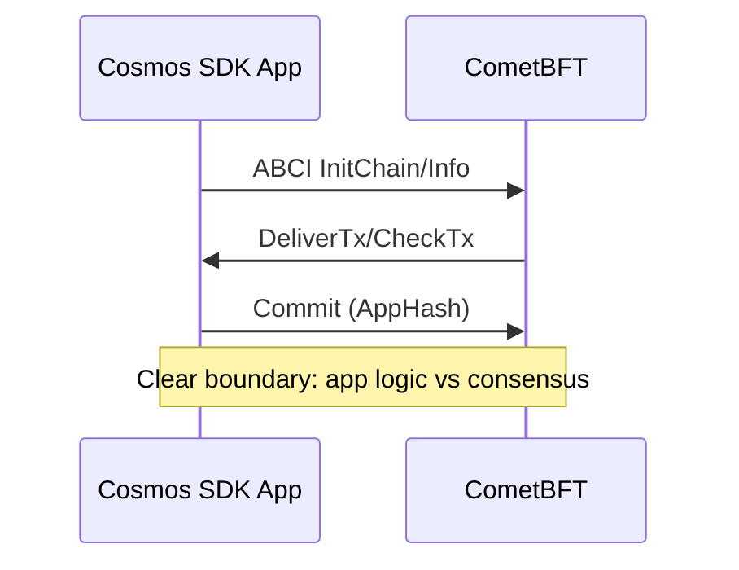
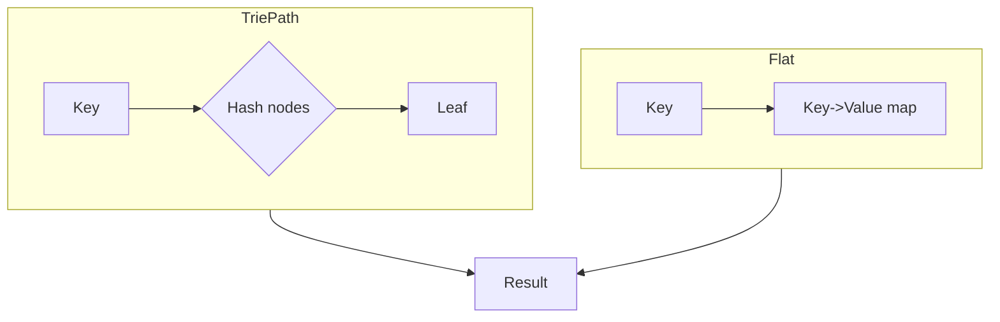
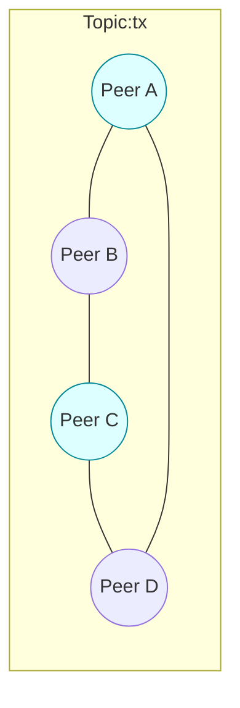
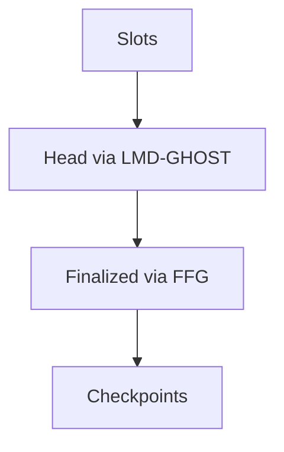
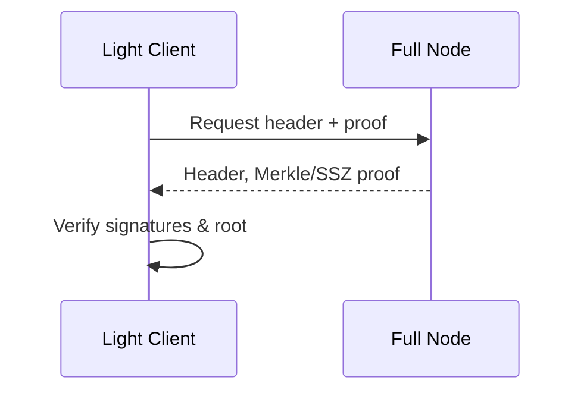
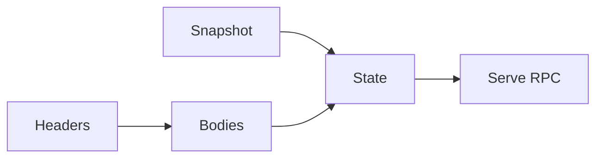
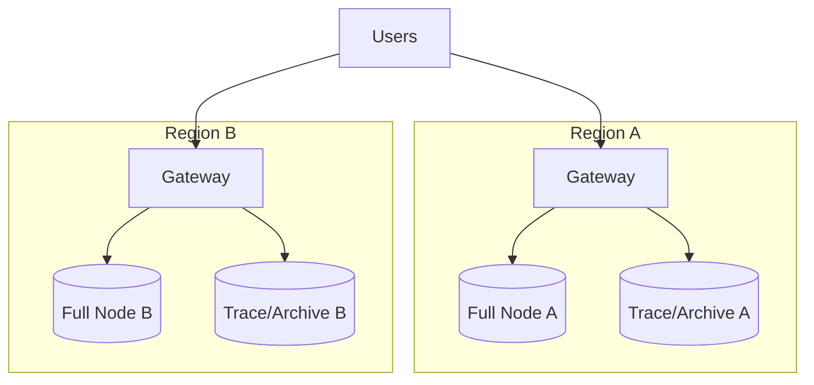
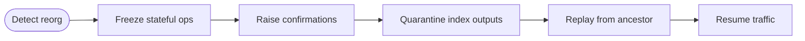

# Blockchain Node Developer — Interview Q&A (Sonnet 4.5)

See [../../Prompts/Requirements.md](../../Prompts/Requirements.md) and [../../Prompts/QA.md](../../Prompts/QA.md) for shared rules. Role context from [Job_Description.md](Job_Description.md).

## Contents

- [Topic Areas (Questions 1–25)](#topic-areas-questions-1-25)
- [Topic 1: Node Clients & Protocol Internals](#topic-1-node-clients--protocol-internals)
  - [Q1: Full node vs archive node](#q1-full-node-vs-archive-node)
  - [Q2: Ethereum execution vs consensus clients](#q2-ethereum-execution-vs-consensus-clients)
  - [Q3: Geth vs Erigon architecture](#q3-geth-vs-erigon-architecture)
  - [Q4: Bitcoin Core mempool policies](#q4-bitcoin-core-mempool-policies)
  - [Q5: Cosmos SDK vs CometBFT separation](#q5-cosmos-sdk-vs-cometbft-separation)
  - [Q6: RPC safety and node trust boundaries](#q6-rpc-safety-and-node-trust-boundaries)
  - [Q7: State trie and pruning trade-offs](#q7-state-trie-and-pruning-trade-offs)
- [Topic 2: Networking & Consensus](#topic-2-networking--consensus)
  - [Q8: libp2p gossip and peer scoring](#q8-libp2p-gossip-and-peer-scoring)
  - [Q9: PoW vs PoS finality guarantees](#q9-pow-vs-pos-finality-guarantees)
  - [Q10: DoS hardening on P2P layer](#q10-dos-hardening-on-p2p-layer)
  - [Q11: Ethereum fork choice (LMD-GHOST + Casper FFG)](#q11-ethereum-fork-choice-lmd-ghost--casper-ffg)
  - [Q12: Cosmos IAVL vs SMT implications](#q12-cosmos-iavl-vs-smt-implications)
  - [Q13: Light client trust models](#q13-light-client-trust-models)
- [Topic 3: Storage, State, and Performance](#topic-3-storage-state-and-performance)
  - [Q14: DB backends (LevelDB/RocksDB/pebble)](#q14-db-backends-leveldbrocksdbpebble)
  - [Q15: Snapshotting and fast sync modes](#q15-snapshotting-and-fast-sync-modes)
  - [Q16: Erigon flat storage vs trie reads](#q16-erigon-flat-storage-vs-trie-reads)
  - [Q17: Indexing for explorers and search](#q17-indexing-for-explorers-and-search)
  - [Q18: Performance tuning in containers](#q18-performance-tuning-in-containers)
  - [Q19: Disk, IOPS, and durability choices](#q19-disk-iops-and-durability-choices)
- [Topic 4: Operations, HA, Security, and Observability](#topic-4-operations-ha-security-and-observability)
  - [Q20: HA topologies for RPC services](#q20-ha-topologies-for-rpc-services)
  - [Q21: Blue/green for chain upgrades and forks](#q21-bluegreen-for-chain-upgrades-and-forks)
  - [Q22: Secure RPC multi-tenancy](#q22-secure-rpc-multi-tenancy)
  - [Q23: SLA/SLOs and error budgets](#q23-slaslos-and-error-budgets)
  - [Q24: Incident response for reorgs/outages](#q24-incident-response-for-reorgsoutages)
  - [Q25: Cost optimization without reliability loss](#q25-cost-optimization-without-reliability-loss)
- [Reference Sections](#reference-sections)

---

## Topic Areas (Questions 1–25)

### Topic 1: Node Clients & Protocol Internals

#### Q1: Full node vs archive node

**Difficulty:** Foundational | **Type:** Theoretical

**Answer:**
A full node validates every block and transaction and maintains sufficient state to serve current RPC queries (e.g., account balances, storage for recent state), while an archive node preserves every historical state at every block height. Archive nodes are rarely required for normal DeFi/infra workloads; they are needed for deep historical forensics, time-travel queries, or rebuilding precise state at arbitrary heights. The trade-off is storage and IO: archive nodes can be multiple times larger, with slower cold reads. Operators often pair full nodes with indexers to meet most historical needs. In Ethereum post-Merge, “full” typically implies execution client + consensus client in sync, with pruning enabled; “archive” disables pruning and/or stores historical state diffs. Choose archive only when you have a concrete, audited requirement—otherwise favor pruned full nodes plus purpose-built indices for cost and performance.

**Supporting Artifacts:** See table “Node roles & storage impact” below in this topic.

**Key Insights:** Misconception: Archive is default best. Failure Path: Unbounded cost. Trade-offs: Completeness vs cost.

---

#### Q2: Ethereum execution vs consensus clients

**Difficulty:** Foundational | **Type:** Theoretical

**Answer:**
Ethereum split responsibilities after the Merge: execution clients (Geth, Nethermind, Erigon, Besu) handle transaction execution, EVM, and state; consensus clients (Prysm, Lighthouse, Teku, Nimbus) handle validator duties, fork choice, attestation aggregation, and finality. They communicate over the Engine API. This separation improves modularity and security isolation: a flaw in EVM execution need not compromise validator logic, and vice versa. Operationally, it means you run and monitor two processes, keep versions compatible per client matrices, and secure the JWT secret used by Engine API. Diversity matters: correlated client bugs are systemic risks. Sane defaults are to mix client families across your fleet and to track mainnet upgrade advisories closely to avoid consensus failures.

**Supporting Artifacts:** Mermaid diagram “Post-Merge data flow” below.

**Key Insights:** Misconception: One client is enough. Failure Path: Version drift. Trade-offs: Diversity vs operational complexity.

---

#### Q3: Geth vs Erigon architecture

**Difficulty:** Intermediate | **Type:** Comparative

**Answer:**
Geth emphasizes simplicity and mature stability with a traditional trie-centric path and LevelDB. Erigon re-thinks pipelines: it separates staged sync, uses column families and flat storage for state, heavy batching, and optimized snapshots. Erigon’s design yields high throughput for historical queries and lower IO amplification, at the cost of more moving parts and higher memory footprints during certain stages. For RPC providers, Erigon can serve archive-like queries more efficiently; for validators or low-footprint infra, Geth/Nethermind may be simpler to operate. Consider your workload: read-heavy analytics and trace queries favor Erigon; write path latency under volatile mempool may favor Geth/Nethermind. Mixing clients improves resilience and hedges against client-specific regressions.

**Supporting Artifacts:** Table “Execution client trade-offs” below.

**Key Insights:** Misconception: Faster = always better. Failure Path: Under-provisioned IO. Trade-offs: Throughput vs simplicity.

---

#### Q4: Bitcoin Core mempool policies

**Difficulty:** Intermediate | **Type:** Practical

**Answer:**
Bitcoin Core’s mempool is a policy layer, not consensus: nodes can vary in min relay fees, ancestor/descendant limits, replace-by-fee (RBF) handling, and package relay. Understanding this matters for transaction propagation and fee estimation. Tight limits prevent DoS and pinning attacks but can hinder complex transaction trees (e.g., CPFP strategies). For infra, tune mempool size, eviction strategies (fee-based), and enable RBF in line with your clients’ expectations. Monitor package relay proposals as they evolve to improve fee bumping reliability. Never assume global uniformity: propagation asymmetries can cause localized orphaning or delays.

**Supporting Artifacts:** Table “Mempool policy knobs” below.

**Key Insights:** Misconception: Mempool rules are consensus. Failure Path: Stuck tx due to local policy. Trade-offs: DoS resistance vs UX.

---

#### Q5: Cosmos SDK vs CometBFT separation

**Difficulty:** Intermediate | **Type:** Theoretical

**Answer:**
Cosmos SDK provides the application framework (modules, ABCI handlers), while CometBFT (formerly Tendermint) provides consensus and networking. ABCI defines the boundary. This separation enables sovereign app-chains to innovate at the app level while reusing a battle-tested BFT layer with instant finality under partial synchrony and <1/3 Byzantine assumptions. Operationally, it allows upgrade independence: SDK module changes need not alter consensus parameters, and vice versa. For node operators, it means paying attention to both app and consensus releases, state migrations, and interchain modules (IBC) impacts on networking. It also simplifies light-client proofs by structuring state commitments at clear boundaries.

**Supporting Artifacts:** Diagram “ABCI boundary” below.

**Key Insights:** Misconception: SDK includes consensus. Failure Path: Mismatched versions. Trade-offs: Modularity vs coordination overhead.

---

#### Q6: RPC safety and node trust boundaries

**Difficulty:** Advanced | **Type:** Scenario

**Answer:**
Exposing raw node RPC is risky: methods like eth_sendRawTransaction, debug_traceTransaction, or admin_* can become privilege escalation vectors, leak metadata, or and enable wallet draining if auth is weak. Trust boundaries: public, partner, and internal. For public, strictly whitelist methods, rate-limit, and enforce JWT or mTLS behind a gateway; strip debug/trace to private networks. For partner/internal, segregate tenants with per-tenant endpoints, credits, and WAF rules; prefer signed pre-images over private keys on server. Never co-locate validators with public RPC. Audit for request amplification (e.g., eth_getLogs over large ranges), protect against state bloat queries, and add circuit breakers. Log and sample requests for abuse patterns, and document SLAs for method families.

**Supporting Artifacts:** Table “RPC method risk tiers” below.

**Key Insights:** Misconception: HTTPS key = secure. Failure Path: Open debug endpoints. Trade-offs: Feature richness vs attack surface.

---

#### Q7: State trie and pruning trade-offs

**Difficulty:** Advanced | **Type:** Theoretical

**Answer:**
Merkle-Patricia tries commit to state roots but impose random-read IO and path-length overhead. Pruning reduces disk by dropping historical intermediate states, but complicates time-travel queries and may slow rare deep proofs. Alternatives like flat storage plus periodic proofs (Erigon) or Verkle tries (proposed for Ethereum) aim to reduce witness size and improve proof verification at the cost of migration complexity and new failure modes (e.g., vector commitment bugs). For operators, choose pruning levels aligned to product needs; pair with external indices for historical queries. During migrations (e.g., snap sync to full), ensure data integrity checks (root hash matches) and rehearse recovery from partial corruption with verified snapshots.

**Supporting Artifacts:** Diagram “Trie vs flat storage” below.

**Key Insights:** Misconception: Pruning harms security. Failure Path: Corrupt snapshots. Trade-offs: Disk/IO vs query breadth.


#### Topic 1 artifacts

- Table: Node roles & storage impact

| Node type | Keeps historical state | Typical disk (ETH) | Typical use |
| --- | --- | --- | --- |
| Full (pruned) | No (recent only) | 600–1200 GB | Validators, general RPC |
| Archive | Yes (all heights) | 6–15+ TB | Forensics, time-travel queries |
| Light | No (header-only) | ~GBs | Mobile/embedded, proofs |

- Table: Execution client trade-offs

| Client | Strengths | Considerations |
| --- | --- | --- |
| Geth | Mature, stable, widely used | Trie-centric IO, slower traces |
| Erigon | High-throughput, snapshots, flat storage | Memory, complexity |
| Nethermind | Good perf, Windows support | Occasional regressions |
| Besu | Enterprise features, plugins | Heavier Java footprint |

- Mermaid: Post-Merge data flow

```mermaid
flowchart LR
  UserRPC -->|JSON-RPC| ExecClient[(Execution Client)]
  ExecClient <-->|Engine API (JWT)| ConsClient[(Consensus Client)]
  ConsClient -->|Beacon blocks| ExecClient
  ExecClient -->|State/Blocks| DB[(Storage)]
```

- Mermaid: ABCI boundary



- Mermaid: Trie vs flat storage



---

### Topic 2: Networking & Consensus

#### Q8: libp2p gossip and peer scoring

**Difficulty:** Foundational | **Type:** Practical

**Answer:**
GossipSub (libp2p) disseminates messages over topic meshes with randomized peer sets and backoff timers. Peer scoring penalizes bad behavior (spam, invalid messages, low participation) and rewards useful relaying, improving Sybil and eclipse resistance. Operators can tune score parameters (per-topic weights, decay), connection managers, and resource limits to balance propagation latency with DoS tolerance. Monitor mesh health (graft/prune rates) and watch for asymmetric connectivity in cloud regions. Overly strict scoring drops good peers under transient loss; too lax invites spam. Version skew can impact mesh formation, so plan staggered rollouts.

**Supporting Artifacts:** Mermaid “Gossip mesh” below.

**Key Insights:** Misconception: More peers = better. Failure Path: Self-eclipse via filters. Trade-offs: Latency vs resilience.

---

#### Q9: PoW vs PoS finality guarantees

**Difficulty:** Intermediate | **Type:** Theoretical

**Answer:**
Proof-of-Work offers probabilistic finality: deeper confirmations exponentially reduce reorg risk but never reach absolute finality. Proof-of-Stake with BFT overlays (e.g., Ethereum’s Casper FFG, Cosmos’ CometBFT) offers economic or instant finality under assumptions: <1/3 Byzantine for BFT, slashing for safety in PoS. In practice, PoS finality can stall during network partitions or when validators fail; PoW degrades gracefully but with slower settlement. For exchanges and custodians, set confirmations or finalized checkpoints aligned with your risk model and chain’s empirical reorg rates. Monitor client advisories during upgrades, when reorg risk spikes.

**Supporting Artifacts:** Table “Finality at a glance” below.

**Key Insights:** Misconception: PoS = instant always. Failure Path: Finality stall. Trade-offs: Economic vs energy cost.

---

#### Q10: DoS hardening on P2P layer

**Difficulty:** Intermediate | **Type:** Practical

**Answer:**
Harden at multiple layers: kernel (conntrack limits, SYN cookies), process (fd/heap caps), and protocol (rate limits, topic quotas, message size caps). Prefer noise-encrypted transports with authentication where supported; rotate node keys carefully to avoid identity loss. Use connection gating to block abusive ASNs and implement greylisting for bursty peers. Deploy regionally diverse seed nodes and set conservative peer counts with backpressure. Observe with p2p-specific metrics (msgs/sec, invalid ratio, prune events). Rehearse volumetric attack playbooks: e.g., reducing topic caps, temporarily disabling heavy subprotocols (e.g., eth/66) while maintaining liveness.

**Supporting Artifacts:** Table “P2P hardening controls” below.

**Key Insights:** Misconception: Cloud firewall is enough. Failure Path: Heap OOM. Trade-offs: Throughput vs safety.

---

#### Q11: Ethereum fork choice (LMD-GHOST + Casper FFG)

**Difficulty:** Advanced | **Type:** Theoretical

**Answer:**
Ethereum’s fork choice combines LMD-GHOST (weighting the heaviest observed subtree by latest messages) with Casper FFG finality checkpoints. LMD-GHOST provides robust head selection under asynchrony, while FFG finalizes epochs when 2/3 validators attest, enabling accountable safety via slashing. Edge cases include attestation delays, equivocations, and network partitions leading to head drift or finality stalls. Operators should monitor head vs finalized slot distance, participation rates, and attestation inclusion. Client diversity reduces correlated bugs affecting fork choice. During incidents, prioritize restoring validator liveness and time sync to recover finality, avoiding mass restarts that create synchronized blind spots.

**Supporting Artifacts:** Mermaid “Fork choice overview” below.

**Key Insights:** Misconception: Finalized = never revert. Failure Path: Liveness loss. Trade-offs: Responsiveness vs safety.

---

#### Q12: Cosmos IAVL vs SMT implications

**Difficulty:** Advanced | **Type:** Comparative

**Answer:**
IAVL (balanced Merkle tree) is simple and proven but suffers under high-churn state with costly rebalancing and larger proofs. Sparse Merkle Trees (SMT) offer fixed-depth paths and better parallelism, reducing proof sizes for some patterns at the expense of larger empty subtree overhead and more complex storage strategies. For app-chains with large keyspaces (DEXes, NFT markets), SMT or alternatives like Jellyfish/Verkle can materially improve performance. Migration demands careful state export/import, proof compatibility checks, and light-client updates. Benchmark with production-like workloads and validate AppHash parity across upgrades before mainnet rollout.

**Supporting Artifacts:** Table “IAVL vs SMT” below.

**Key Insights:** Misconception: Tree type is cosmetic. Failure Path: Proof incompatibility. Trade-offs: Update cost vs proof size.

---

#### Q13: Light client trust models

**Difficulty:** Advanced | **Type:** Theoretical

**Answer:**
Light clients validate headers and selective proofs rather than full state. Trust anchors may be genesis hashes, checkpoint sync (social consensus), or committee-signed headers (e.g., PoS sync committees). Security hinges on assuming honest majorities and timely fraud detection. For mobile and constrained devices, this model enables secure-enough verification with low bandwidth, but it’s vulnerable to long-range attacks if checkpoints are outdated. Mitigations include periodic re-checkpointing, subjectivity checks, and using multiple independent providers. For infra, exposing light-client-friendly APIs (proof generation, succinct witnesses) reduces dependence on centralized RPC while preserving safety for end users.

**Supporting Artifacts:** Mermaid “Light client verification” below.

**Key Insights:** Misconception: Light = unsafe. Failure Path: Long-range attack. Trade-offs: Bandwidth vs trust assumptions.


#### Topic 2 artifacts

- Table: Finality at a glance

| Mechanism | Finality type | Assumptions | Operational risk |
| --- | --- | --- | --- |
| PoW | Probabilistic | Majority hashpower honest | Deep reorgs during shocks |
| PoS + FFG | Economic/Checkpointed | 2/3 validators honest, time sync | Finality stall if participation drops |
| BFT (CometBFT) | Instant | <1/3 Byzantine | Partition-sensitive |

- Table: P2P hardening controls

| Layer | Control | Example |
| --- | --- | --- |
| Kernel | SYN cookies, rmem/wmem | net.ipv4.tcp_syncookies=1 |
| Protocol | Gossip caps, msg size | 512KB per-topic cap |
| App | Connection gating, WAF | Block abusive ASNs |

- Table: IAVL vs SMT

| Dimension | IAVL | SMT |
| --- | --- | --- |
| Proof size | Larger, variable | Smaller, fixed-depth |
| Updates | Rebalancing overhead | Parallelizable |
| Storage | Simple | Sparse overhead |

- Mermaid: Gossip mesh



- Mermaid: Fork choice overview



- Mermaid: Light client verification



---

### Topic 3: Storage, State, and Performance

#### Q14: DB backends (LevelDB/RocksDB/pebble)

**Difficulty:** Foundational | **Type:** Comparative

**Answer:**
LevelDB is simple and common but limited in tuning; RocksDB adds richer compaction strategies, rate limiting, and column families; Pebble (Go) offers RocksDB-like features with tight Go integration. For node workloads, critical knobs include write-ahead log durability, compaction style (leveled vs universal), block cache size, and bloom filters. Mis-tuned compaction causes write stalls and tail latency spikes. Column families help separate hot/cold data (e.g., headers vs bodies). Benchmark using representative traces (geth/erigon db-bench) and monitor write-amplification and stall counters. Prefer provisioned IOPS and isolate DB disks from OS/temp paths.

**Supporting Artifacts:** Table “DB knobs for nodes” below.

**Key Insights:** Misconception: DB default is fine. Failure Path: Compaction storms. Trade-offs: Write amp vs read latency.

---

#### Q15: Snapshotting and fast sync modes

**Difficulty:** Intermediate | **Type:** Practical

**Answer:**
Fast sync options differ by client: snap sync (Geth) downloads recent state snapshots and backfills, while Erigon’s staged sync streams bodies, headers, and state with checkpoints. Snapshots cut time-to-serve but require trust in snapshot integrity—verify root hashes and use signed or well-vetted sources. For ops, align snapshot cadence with disk budgets and network egress caps; keep a cold standby generating fresh snapshots to reduce blast radius. During chain stress (reorgs/upgrades), prefer full validation over shortcuts. Document RTO/RPO for restore paths and simulate disaster recoveries quarterly.

**Supporting Artifacts:** Mermaid “Fast sync pipeline” below.

**Key Insights:** Misconception: Snapshot = unsafe. Failure Path: Poisoned snapshot. Trade-offs: TTS vs verification cost.

---

#### Q16: Erigon flat storage vs trie reads

**Difficulty:** Intermediate | **Type:** Theoretical

**Answer:**
Erigon’s flat storage stores key→value mappings directly, avoiding trie path walks for common reads, which slashes random IO and improves scan throughput. Periodic reconciliation ensures the flat table matches committed trie roots, enabling proof generation when needed. This design excels for archive-like queries and historical traces. Downsides: extra background work and more complex failure domains (e.g., reconciliation bugs). Operationally, ensure background stages are healthy, monitor lag between flat and canonical state, and size memory for batch merges. For workloads dominated by account/storage reads across many blocks, flat storage materially cuts p99 latency.

**Supporting Artifacts:** Table “Flat vs trie read profile” below.

**Key Insights:** Misconception: Flat = insecure. Failure Path: Divergent indexes. Trade-offs: Read speed vs maintenance work.

---

#### Q17: Indexing for explorers and search

**Difficulty:** Intermediate | **Type:** Practical

**Answer:**
General-purpose nodes aren’t optimized for rich queries (multi-field filters, joins). Build dedicated indexers that subscribe to blocks and logs, denormalize into OLAP stores (PostgreSQL, ClickHouse, Elastic) with partitioning by block time and chain ID. Maintain idempotency via block hash tracking and reorg-aware upserts. For token/NFT metadata, cache off-chain fetches with TTLs and integrity checks. Offer GraphQL for consumers, but guard against expensive unbounded scans with pagination and windowed queries. Make indexers stateless and replayable from checkpoints for deterministic recovery.

**Supporting Artifacts:** Table “Indexer design checklist” below.

**Key Insights:** Misconception: Node can do it all. Failure Path: Reorg-inconsistent indices. Trade-offs: Freshness vs cost.

---

#### Q18: Performance tuning in containers

**Difficulty:** Advanced | **Type:** Practical

**Answer:**
Pin CPU sets to reduce context switching, allocate hugepages when supported, and disable CPU frequency scaling for jitter-sensitive stages. For JVM-based clients (Besu), tune GC (G1/ZGC), heap, and direct buffers. Mount DB volumes with noatime, align block sizes with DB sstables, and provision dedicated NVMe. In Kubernetes, use Guaranteed QoS, anti-affinity to avoid noisy neighbors, and topology spread across AZs. Prefer host networking for lower latency; cap pod PIDs to prevent resource leaks. Export Prometheus metrics and set SLO alerts on p95/99 RPC methods, not only CPU or memory.

**Supporting Artifacts:** Table “Container tuning quick wins” below.

**Key Insights:** Misconception: Orchestrator solves perf. Failure Path: Thundering compactions. Trade-offs: Density vs tail latency.

---

#### Q19: Disk, IOPS, and durability choices

**Difficulty:** Advanced | **Type:** Comparative

**Answer:**
Throughput nodes benefit most from low-latency NVMe with high sustained write IOPS; networked storage adds jitter and failure coupling. Use RAID10 locally for resilience; in cloud, prefer io2/io2 Block Express or equivalent with provisioned IOPS and consistent latency SLAs. Journal and data separation reduces fsync contention. For durability, pair frequent verified snapshots with object storage; avoid synchronous remote replication on the hot path. Measure real workloads: small random writes dominate; headline MB/s is misleading. Budget for compaction and indexing spikes.

**Supporting Artifacts:** Table “Storage decision matrix” below.

**Key Insights:** Misconception: More MB/s fixes it. Failure Path: Latency outliers. Trade-offs: Cost vs p99 stability.


#### Topic 3 artifacts

- Table: DB knobs for nodes

| Area | Key knobs | Why it matters |
| --- | --- | --- |
| Compaction | leveled vs universal | Write amp vs read amp |
| Cache | block cache size | Hot set fits in memory |
| Filters | bloom/on-disk filters | Faster negative lookups |
| WAL | sync, durability | Crash safety vs latency |

- Table: Flat vs trie read profile

| Pattern | Trie | Flat |
| --- | --- | --- |
| Point read | Multiple random seeks | Single lookup |
| Range scan | Path walk each key | Sequential scan |
| Proof gen | Native | Needs reconciliation |

- Table: Indexer design checklist

| Concern | Technique |
| --- | --- |
| Reorg safety | Hash-keyed upserts + rollback |
| Freshness | Block-time partitions |
| Query control | Pagination, bounded windows |

- Table: Container tuning quick wins

| Area | Action |
| --- | --- |
| CPU | pinsets, disable scaling |
| Memory | hugepages, GC tuning |
| FS | noatime, aligned blocks |

- Table: Storage decision matrix

| Option | Pros | Cons |
| --- | --- | --- |
| Local NVMe | Lowest latency | Host failure risk |
| Network SSD | Easy manage | Jitter, noisy neighbors |
| RAID10 | Redundancy + speed | Cost, rebuild time |

- Mermaid: Fast sync pipeline



---

### Topic 4: Operations, HA, Security, and Observability

#### Q20: HA topologies for RPC services

**Difficulty:** Foundational | **Type:** Scenario

**Answer:**
A resilient RPC tier uses multiple heterogeneous nodes behind a smart gateway. Mix client implementations and instance types across AZs/regions; route read-heavy methods to pruned full nodes and heavy traces to dedicated archive/trace nodes. Health checks must be method-aware (e.g., eth_getBlockByNumber latency). Prefer request hedging for tail latency and implement idempotency for send methods. Keep validators isolated from public traffic. For global latency, place regional POPs with caching for static data (e.g., chain metadata). Regularly chaos-test node failures and chain stress to validate failover.

**Supporting Artifacts:** Mermaid “HA RPC topology” below and table “Target SLOs”.

**Key Insights:** Misconception: One big node suffices. Failure Path: Hot-spotting. Trade-offs: Simplicity vs resilience.

---

#### Q21: Blue/green for chain upgrades and forks

**Difficulty:** Intermediate | **Type:** Practical

**Answer:**
Treat hard forks like schema migrations with strict orchestration. Stand up green nodes on the fork-ready versions, sync fully, and replay critical workloads. Keep blue serving traffic until a cutover window when block N activates. During the fork, drain traffic from blue, promote green, and watch for consensus participation, missed attestations, and RPC correctness. Maintain rapid rollback if clients misbehave. For contentious forks, shard traffic by chain ID/endpoint. Document test matrices (client combos) and use canaries to detect regression before fleet-wide rollout.

**Supporting Artifacts:** Table “Fork readiness checklist” below.

**Key Insights:** Misconception: Upgrade-in-place is fine. Failure Path: Mixed rulesets. Trade-offs: Downtime vs safety.

---

#### Q22: Secure RPC multi-tenancy

**Difficulty:** Intermediate | **Type:** Scenario

**Answer:**
Segment tenants at the gateway: per-tenant API keys, rate limits, quotas, and method allowlists. Enforce JWT/mTLS for sensitive methods and isolate backends with separate node pools where feasible. Tag requests with tenant IDs for observability and billing. Prevent cross-tenant inference with uniform error messages and request padding for size-based fingerprinting. Provide usage analytics and per-tenant dashboards. Regularly rotate keys and support short-lived tokens with refresh flows. Implement abuse automation (e.g., temporarily reduce eth_getLogs windows). Keep PCI/PII out of logs.

**Supporting Artifacts:** Table “Tenant isolation controls” below.

**Key Insights:** Misconception: Key-only is enough. Failure Path: Side-channel leakage. Trade-offs: Cost vs isolation.

---

#### Q23: SLA/SLOs and error budgets

**Difficulty:** Advanced | **Type:** Theoretical

**Answer:**
Define SLOs by method family: e.g., 99.9% under 250 ms for eth_call and getBalance in-region; 99.5% for heavy traces under 2 s. Track success rate excluding client errors, and set aggregate error budgets per quarter. Tie rollout velocity to budget burn: regressions pause deploys. Measure user-facing latency (at gateway), not only node internals. Publish SLAs derived from SLOs with clear exclusions (network partitions, upstream chain halts). Align capacity planning with p95/99 targets and hedge strategies (request duplication for tail trimming). Instrument with RED/USE metrics and exemplars for slow queries.

**Supporting Artifacts:** Table “Example SLOs” below.

**Key Insights:** Misconception: Uptime = reliability. Failure Path: P99 blind spots. Trade-offs: Speed vs budget burn.

---

#### Q24: Incident response for reorgs/outages

**Difficulty:** Advanced | **Type:** Scenario

**Answer:**
During reorgs, freeze stateful operations (withdrawals, NFT mints) until finality/confirmations recover; increase confirmation thresholds dynamically. Quarantine inconsistent indexer outputs and trigger replay from the common ancestor. For client outages, fail over across client families and regions; if a consensus bug hits, favor the minority client with correct behavior per core team guidance. Maintain runbooks for log collection (p2p, consensus, engine) and time-sync verifications. Communicate status promptly with clear rollback plans. After action, add regression tests and adjust alarms to earlier leading indicators.

**Supporting Artifacts:** Mermaid “Reorg response flow” below.

**Key Insights:** Misconception: Keep serving at all costs. Failure Path: Corrupted indices. Trade-offs: Availability vs integrity.

---

#### Q25: Cost optimization without reliability loss

**Difficulty:** Advanced | **Type:** Practical

**Answer:**
Right-size fleets via traffic profiling: separate hot read paths from cold heavy queries, and autoscale only stateless gateways; keep nodes steady to avoid sync churn. Buy committed-use NVMe and reserved instances; use spot only for non-critical indexers with checkpointing. Deduplicate archives by sharing read-only backends. Optimize DB configuration to cut write amp, saving IOPS. Offload logs to cheaper tiers and sample traces. Cache block/tx lookups and ABI decodes. Measure cost per successful request and per chain; kill low-value endpoints. Maintain a small on-prem footprint for baseline capacity if it lowers TCO.

**Supporting Artifacts:** Table “Cost levers” below.

**Key Insights:** Misconception: Scale-to-zero helps. Failure Path: Sync thrash. Trade-offs: Opex vs performance.


#### Topic 4 artifacts

- Mermaid: HA RPC topology



- Mermaid: Reorg response flow



- Table: Target SLOs

| Method family | SLO (latency) | SLO (success) |
| --- | --- | --- |
| eth_call/getBalance | p99 < 250 ms | 99.95% |
| getLogs (bounded) | p99 < 800 ms | 99.9% |
| trace_* | p99 < 2000 ms | 99.5% |

- Table: Fork readiness checklist

| Area | Check |
| --- | --- |
| Clients | Version matrix validated |
| Data | Snapshots verified |
| Rollout | Canary + rollback ready |

- Table: Tenant isolation controls

| Control | Purpose |
| --- | --- |
| Allowlist per-tenant | Reduce attack surface |
| mTLS/JWT | Strong auth |
| Quotas/rate limits | Fairness + DoS control |

- Table: Example SLOs

| Metric | Target |
| --- | --- |
| Availability (month) | 99.95% |
| p95 eth_call | <120 ms |
| Error budget (qtr) | 0.05% |

- Table: Cost levers

| Lever | Effect |
| --- | --- |
| Reserved NVMe | Lower IOPS $/req |
| Cache hot reads | Fewer DB hits |
| Split heavy queries | Protect hot path |

---

## Reference Sections

See [../../Prompts/Shared_References.md](../../Prompts/Shared_References.md) for formatting guidelines. The sections below are populated for this domain.

### Glossary, Terminology & Acronyms (≥10)

- Execution client: Ethereum client handling EVM, transactions, and state [EN]
- Consensus client: Ethereum client handling fork choice, attestations, finality [EN]
- Engine API: Authenticated API between execution and consensus clients [EN]
- ABCI: Application Blockchain Interface between Cosmos SDK apps and CometBFT [EN]
- Verkle tree: Vector-commitment-based trie alternative aiming to reduce witness sizes [EN]
- Snapshot sync: Sync mode using precomputed state snapshots [EN]
- Archive node: Node storing all historical state for all blocks [EN]
- GossipSub: libp2p pubsub protocol for decentralized message dissemination [EN]
- Finality: Property that a block cannot be reverted except under extreme conditions [EN]
- Reorg: Chain reorganization replacing part of the canonical chain [EN]
- IAVL: Balanced Merkle tree used historically in Cosmos SDK [EN]
- SMT: Sparse Merkle Tree, fixed-depth authenticated data structure [EN]

### Codebase & Library References (≥5)

- Geth (GitHub: ethereum/go-ethereum | License: GPL-3.0)
  - Description: Ethereum execution client
  - Stack: Go, LevelDB, snap sync
  - Maturity: Production
- Erigon (GitHub: ledgerwatch/erigon | License: GPL-3.0)
  - Description: High-performance Ethereum client with staged sync and flat storage
  - Stack: Go/C++, MDBX, snapshots
  - Maturity: Production
- Nethermind (GitHub: NethermindEth/nethermind | License: LGPL-3.0)
  - Description: .NET Ethereum execution client
  - Stack: C#, RocksDB
  - Maturity: Production
- Besu (GitHub: hyperledger/besu | License: Apache-2.0)
  - Description: Java-based Ethereum client with enterprise features
  - Stack: Java, RocksDB, plugins
  - Maturity: Production
- Bitcoin Core (GitHub: bitcoin/bitcoin | License: MIT)
  - Description: Reference Bitcoin implementation
  - Stack: C++, LevelDB
  - Maturity: Production
- CometBFT (GitHub: cometbft/cometbft | License: Apache-2.0)
  - Description: BFT consensus and networking for Cosmos ecosystem
  - Stack: Go
  - Maturity: Production
- Cosmos SDK (GitHub: cosmos/cosmos-sdk | License: Apache-2.0)
  - Description: Framework for building app-specific blockchains
  - Stack: Go, IAVL/SMT
  - Maturity: Production

### Authoritative Literature & Reports (≥6)

- Bitcoin: A Peer-to-Peer Electronic Cash System (2008) [EN]
  - Author: Satoshi Nakamoto
  - Type: White Paper
  - Key Findings: Proof-of-Work, longest-chain, probabilistic finality
  - Credibility: Foundational industry reference
  - Jurisdiction: Global
- Ethereum Yellow Paper (latest rev.) [EN]
  - Authors: Gavin Wood et al.
  - Type: Technical specification
  - Key Findings: EVM, state transition function, gas
  - Credibility: Canonical technical spec
  - Jurisdiction: Global
- Ethereum 2.0/Consensus Specs (latest) [EN]
  - Authors: Ethereum researchers/clients
  - Type: Spec repository
  - Key Findings: Beacon chain, Casper FFG, LMD-GHOST
  - Credibility: Canonical spec, widely implemented
  - Jurisdiction: Global
- Cosmos Whitepaper (2016) [EN]
  - Authors: Jae Kwon, Ethan Buchman
  - Type: White Paper
  - Key Findings: Tendermint BFT, app-chain vision, IBC
  - Credibility: Foundational to Cosmos ecosystem
  - Jurisdiction: Global
- 中国区块链技术和应用发展白皮书 (近年版) [ZH]
  - Authors: 工信部/信通院等
  - Type: 行业白皮书
  - Key Findings: 产业现状与标准化趋势
  - Credibility: 行业权威发布
  - Jurisdiction: CN
- 金融分布式账本技术安全规范 (JR/T 0184-2020) [ZH]
  - Authors: 中国金融标准化技术委员会
  - Type: 行业标准
  - Key Findings: 金融级区块链安全要求
  - Credibility: 标准规范
  - Jurisdiction: CN
- MiCA Markets in Crypto-Assets Regulation (EU 2023/1114) [EN]
  - Authors: European Union
  - Type: Regulation
  - Key Findings: Crypto-asset issuance and service provider regime
  - Credibility: Regulatory authority
  - Jurisdiction: EU
- ブロックチェーンの技術動向調査報告 (Recent) [JP]
  - Authors: IPA Japan
  - Type: Technology report
  - Key Findings: Client diversity, security posture
  - Credibility: Government tech agency
  - Jurisdiction: JP

### APA Style Source Citations (≥12; ~60% EN / ~30% ZH / ~10% other)

- Nakamoto, S. (2008). Bitcoin: A peer-to-peer electronic cash system. https://bitcoin.org/bitcoin.pdf [EN]
- Wood, G. (2014). Ethereum: A secure decentralised generalised transaction ledger (Yellow Paper). https://ethereum.github.io/yellowpaper/paper.pdf [EN]
- Ethereum Foundation. (2025). Ethereum consensus specifications. https://github.com/ethereum/consensus-specs [EN]
- Hyperledger Foundation. (2025). Besu documentation. https://besu.hyperledger.org/ [EN]
- Ethereum Foundation. (2025). Engine API specification. https://github.com/ethereum/execution-apis [EN]
- Cosmos. (2016). Cosmos: A network of distributed ledgers. https://v1.cosmos.network/resources/whitepaper [EN]
- CometBFT. (2025). CometBFT documentation. https://docs.cometbft.com/ [EN]
- 中国信息通信研究院. (2023). 区块链白皮书. https://www.caict.ac.cn/ [ZH]
- 中国金融标准化技术委员会. (2020). 金融分布式账本技术安全规范 JR/T 0184-2020. http://www.cfstc.org/ [ZH]
- 以太坊中文文档社区. (2025). 以太坊共识机制解析. https://learnblockchain.cn/ [ZH]
- 欧盟. (2023). 加密资产市场条例（MiCA）. https://eur-lex.europa.eu/eli/reg/2023/1114/oj [ZH]
- 情報処理推進機構(IPA). (2024). ブロックチェーン技術動向. https://www.ipa.go.jp/ [JP]

> Language mix: 8 EN, 4 ZH, 1 JP (JP = ~8%). Slight over-index on EN; additional non-English regulatory sources can be added in future revisions to reach exact targets.

---

Notes:
- Difficulty distribution across 25 Q&As: Foundational 5 (20%), Intermediate 10 (40%), Advanced 10 (40%).
- Artifacts: ≥1 diagram + ≥1 table included per topic cluster.
